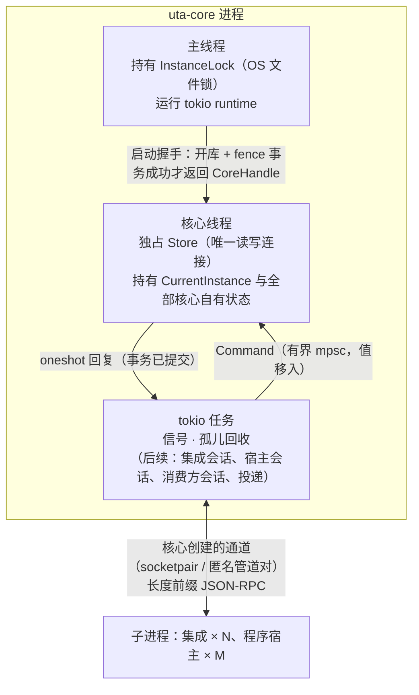

# UTA 代码架构

本文规定代码层面的事：crate 怎样划分与依赖、进程里有哪些线程和任务、每份状态由谁持有、类型允许派生什么、线缆约定、库的选择，以及这些约定怎样被检查。每种状态和操作的语义在 `design/` 里，本文按文档与节号引用，不重述。设计不规定 crate 布局（[design/README.md §0.3 非目标](design/README.md#03-非目标)），所以代码布局写在这里。

## 1 进程、线程与任务

- **主线程**依次执行：先建好 tokio runtime，再取 OS 锁（`fence::acquire`），然后启动核心线程并等待它报告就绪（fence 事务已提交），最后在 runtime 里进入运行阶段。停止信号的监听在任何等待之前装好，所以孤儿回收期间和"core ready"之后的停止请求都走受控停止，不走系统默认动作；Unix 上是 SIGINT、SIGTERM，Windows 上是 Ctrl-C、Ctrl-Break 与控制台的 close、shutdown 事件。运行阶段结束后先丢掉 runtime，再在主线程上阻塞调用 `CoreHandle::stop`：核心线程写结束锚点、在自己线程上关闭 SQLite、被 join，之后主线程才释放锁（[核心进程 §4.7.4 受控停止](design/core/core-process/design.md#474-受控停止-设计)第 5、6 步）。`stop` 是阻塞调用而不是 future，不存在停到一半被取消的情况；`CoreHandle` 被丢弃而没有调用 `stop` 时，`Drop` 关闭命令通道并 join 线程，线程丢掉 store、不写结束锚点（即崩溃路径），锁在 `CoreHandle` 之后才被释放。
- **核心线程**是 `rusqlite::Connection` 唯一的所有者，也是核心自有状态唯一的写入者。它按顺序执行 `Command`：写命令是一个事务，回复在提交之后发出；读命令是一条语句（SQLite 的语句级快照）。设计里同一事务必须一起提交的记录集合（[核心进程 §4.3.5 同事务集合](design/core/core-process/design.md#435-同事务集合)），都由一个命令在一个事务里写完。连接、事务和闭包都不会跨出这个线程。
- **tokio 任务**持有 I/O 对象（通道、子进程句柄、信号），以及嵌套在某个会话之内、只存在于内存的生命周期状态，例如一条通道上的在途调用表。它们要持久化什么，一律发 `Command` 给核心线程。设计把这类状态放在某个元素里，例如集成会话元素拥有调用通道（[integration-session.md §4.1](design/core/core-process/integration-session.md#41-为什么是一个组件且不属任一侧)），落到代码就是该元素的任务，生命周期不超过这个会话。
- **子进程**只经由核心创建的通道和凭据句柄与核心交换数据，不接触 SQLite（[core/design.md §4.3](design/core/design.md#43-部署与信任)、[storage.md §2.1](design/core/core-process/storage.md#21-一个文件一个写者-设计)）。

## 2 crate 地图

### 已有 crate

| crate | 层 | 拥有 | 依赖（工作区内） |
|---|---|---|---|
| `uta-base` | 值 | 源头在核心之外的标识：`IntegrationId`、`ProgramId`（Alice 写的配置文件），`StreamName`、`WriteLaneKey`（集成声明与程序值），以及带命名空间标签的 `Source` 与 `ProcessRole`；serde 直接读写字符串，只经解析器构造 | — |
| `uta-proc` | OS | 进程身份 `OsProcessId{pid, start_time}`（`start_time` 是 OS 给出的精确启动标记，只做相等比较）与退出证明 `ExitConfirmed`：只有 OS 明确回答"该进程已不存在"时才铸造，查询失败不算退出 | — |
| `uta-rpc` | 传输 | 对称 JSON-RPC 2.0 peer：长度前缀分帧，每个调用恰好完成一次 | — |
| `uta-channel` | 传输 | 核心创建的会话通道与凭据句柄，只交给被拉起的子进程；子进程一侧用 `take_inherited` 取回 | — |
| `uta-store` | 存储 | 单写者 SQLite：格式版本与迁移、实例表、进程表、两侧 Journal 的存储原语（观察流 `StreamId`/epoch/`Seq` 的分配、按边界与按位置删除；执行事实流只 append）、`Store::transact` / `Committed` | `uta-base`、`uta-proc` |
| `uta-core` | 进程 | 守护进程：fence、核心线程、孤儿回收、受控停止、退出码 | `uta-base`、`uta-proc`、`uta-store` |
| `uta-testkit` | 测试 | fixture 子进程和跨 crate 的真实进程测试，不发布 | `uta-base`、`uta-proc`、`uta-rpc`、`uta-channel`、`uta-store` |
| `xtask` | 工具 | `cargo xtask check-deps` | — |

### 后续切片的落点

下表是核心进程各组件（[核心进程 §4.1 组件指南](design/core/core-process/design.md#41-组件指南)）与其余容器、部分将来落在哪个 crate。某个元素的代码随它的实现切片一起创建，不预先建空 crate。创建时要同时在 `xtask` 的依赖表里登记它所在的层。

| crate（待建） | 对应设计元素 | 位置 |
|---|---|---|
| `uta-contract` | 核心↔集成 IDL 的 DTO（各操作的规格见 [核心进程 §4.2 对外接口总表](design/core/core-process/design.md#42-对外接口总表)），用 schemars 导出 JSON Schema，随 release 发布 | 值层，依赖 `uta-base` |
| `uta-session` | [集成会话](design/core/core-process/integration-session.md#集成会话)（会话状态机、调用通道、声明的两种解释） | 不属任一侧，依赖 `uta-contract`、`uta-rpc`、`uta-channel`、`uta-store` |
| `uta-observe` | [信封解析入口与入站处理器注册表](design/core/core-process/envelope.md#信封解析入口与入站处理器注册表)、[观察 `Journal`](design/core/core-process/observation-journal.md#观察-journal)（`RetractableDelta`、各类流的压缩规则与 `fold_state`，建在 `uta-store` 的存储原语之上）、[持久订阅](design/core/core-process/subscription.md#持久订阅)、[一次性读](design/core/core-process/one-shot-read.md#一次性读)、[投递调度](design/core/core-process/delivery.md#投递调度) | 观察侧，依赖 `uta-session` |
| `uta-program` | [程序宿主元素](design/core/core-process/program-host-element.md#程序宿主元素)（活动集合、装载期校验、`Advance` 编排） | 不属任一侧，依赖 `uta-observe` |
| `uta-effect` | [单据](design/core/core-process/ticket.md#单据含交易协议)、[STS 规则链](design/core/core-process/decision-chain.md#sts-规则链含规则文件内容)、[lane 驱动](design/core/core-process/lane.md#lane-驱动)、[IO 壳](design/core/core-process/io-shell.md#io-壳含对账放弃跟踪恢复)、[归因处理器](design/core/core-process/design.md#44-效应侧归因处理器)、[出站请求处理器](design/core/core-process/outbound-requests.md#出站请求处理器)、[读模型](design/core/core-process/read-model.md#读模型)、[控制面](design/core/core-process/control-plane.md#控制面)、[会话入口](design/core/core-process/session-entry.md#会话入口) | 效应侧，依赖 `uta-observe`、`uta-program`、`uta-session` |
| `uta-api` | 核心↔解释层 IDL（各操作的规格见 [核心进程 §4.2 对外接口总表](design/core/core-process/design.md#42-对外接口总表)），只在本仓库内部使用 | 值层 |
| `uta-cli` | 解释层（`design/downstream/design.md`） | 依赖 `uta-api`，不依赖核心内部 crate |
| `uta-host` | [程序宿主进程](design/core/program-host/design.md#程序宿主进程)：值树解释器、派生 DAG 的增量引擎（[§3.2 解释①：派生](design/core/program-host/design.md#32-解释①派生)）、决策解释与 `Checkpoint` 序列化（[§4.1 组件](design/core/program-host/design.md#41-组件)） | 外部进程 |
| `uta-mapping`、`uta-conformance` | 记录映射解释器、一致性测试与 fixture 上游（[集成 §4.2 发布物](design/integration/design.md#42-发布物)、[集成进程 §4.4 记录映射](design/integration/integration-process/design.md#44-记录映射)、[集成进程 §6.1 一致性测试](design/integration/integration-process/design.md#61-一致性测试)） | 随 release 发布 |

[核心进程 §4.3.1 uses 图](design/core/core-process/design.md#431-uses-图)里有三对元素互相使用：持久订阅↔集成会话、持久订阅↔程序宿主元素、持久订阅↔投递调度。crate 之间不能循环依赖。所以规定：下层 crate 定义回调 trait，上层 crate 实现它。例如集成会话编排握手事务时，要请持久订阅写 `None{epoch}`，这个 trait 就定义在 `uta-session`，由 `uta-observe` 实现。每对元素里，两个方向经过的仍然只是公共值（[核心进程 §4.3.2 三对互用](design/core/core-process/design.md#432-三对互用)）。

## 3 依赖方向

- 观察侧的代码不依赖效应侧的类型（[核心进程 §3.4](design/core/core-process/design.md#34-两个类型宇宙与唯一边)），这一点落实为 crate 依赖方向：`uta-observe` 不依赖 `uta-effect`。
- 允许的工作区内依赖列在 `xtask/src/main.rs` 的表里，由 `cargo xtask check-deps` 对照 `cargo metadata` 检查。出现表外的边，或有 crate 不在表里，都会失败。dev-dependencies 不受这张表约束。
- 传输 crate（`uta-rpc`、`uta-channel`）和 OS crate（`uta-proc`）不依赖任何领域 crate，领域语义也不进入这些 crate。例如"写调用在会话结束时记为 `NoResponse`"由集成会话决定，`uta-rpc` 只给出 `Closed`。

## 4 所有权规则

1. **标识定义在铸造它的 crate，构造器私有。**
   - `InstanceId` 只由 `uta-store` 的 fence 事务（`Store::begin_instance`）铸造。
   - `ExitConfirmed` 只由 `uta-proc` 在 OS 确认之后铸造。
   - 将来的 `SessionEpoch` 只由 `uta-session` 在创建通道时铸造。`StreamId`（其中的 epoch）与 `Seq` 只由 `uta-store` 在事务里分配（`Observations::open_epoch`、`append`）；`Seq` 按流单调，用每流计数器分配，删除记录后也不会复用。执行事实流的身份 `ExecStream`（控制流、声明流、lane 流、请求流）是设计里已有的流的名字，不需要铸造，其上的位置同样由存储分配。
   - 集成交来的线缆输入里不存在这些字段，所以集成无从伪造。
2. **证明是可移动、不可复制的值，由它授权的操作消费。**
   - `CurrentInstance` 只由 `Store::begin_instance` 在 fence 事务提交之后交出，只被 `Store::end_instance` 消费；结束锚点的 UPDATE 必须恰好改动本实例那一行，否则报 `EndError::NotOpen`。所以一个实例至多结束一次，且只能结束自己。fence 与结束锚点不经 `transact` 的闭包：闭包出错时 `TxError::Aborted(E)` 会把 `E` 带出事务，在已回滚的事务里铸造的证明因此可能流出去。同理，事务里分配的位置不能经 `Aborted` 带出，它们指向的行已被回滚。
   - `ExitConfirmed` 只被 `Processes::clear` 消费，所以进程表的行只能凭 OS 确认清除。
   - `Responder` 在 `respond` 时消费；被丢弃时自动回错误，因此每个请求恰好得到一个回复。
   - 将来的 `SendBarrier`（[io-shell.md §4.2](design/core/core-process/io-shell.md#42-发送屏障与发出前门)、[核心进程 §4.8](design/core/core-process/design.md#48-rust-映射)）同理：私有构造器，在 durable append 提交之后才产生，由 `submit` / `cancel` 消费。
3. **内存状态只从已提交的值推进。** `Store::transact` 只在 `COMMIT` 返回之后交出 `Committed<T>`；闭包失败时整个事务回滚，调用方拿不到 `Committed`。核心线程上的 fold、索引等内存副本只根据 `Committed` 更新，所以不存在"内存领先于磁盘"的状态。`RuleState` 这类由记录 fold 出来的值不单独存储（[decision-chain.md §3.4](design/core/core-process/decision-chain.md#34-rulestate-是记录的-fold不另存-设计)、[storage.md §2.1](design/core/core-process/storage.md#21-一个文件一个写者-设计)），每次都从记录求出。
4. **事务不外泄。** `Tx<'c>` 借用连接，只存在于 `transact` 的闭包里。表视图（`Processes`、`Observations`、`Executions`）只暴露设计允许的操作：`Executions` 只有 `append`（[核心进程 §3.3](design/core/core-process/design.md#33-两类记录与第一边界)、[storage.md §2.3](design/core/core-process/storage.md#23-只追加由-rust-接口保证-设计)），这一点由视图类型保证，不靠 SQL 权限；`Observations` 另有两个压缩原语（按保留边界删、按位置删），但删哪些记录由观察 `Journal` 元素按流的规则决定（[observation-journal.md §2.4](design/core/core-process/observation-journal.md#24-保留边界与删除规则)）。epoch 的上限是 u32，`Seq` 计数器用尽时分配失败，不会溢出成别的类型。记录体是带 `RecordKind` 标签的不透明字节，存储不解析。存储不提供执行任意 SQL 的入口，所有语句都是固定文本。
5. **I/O 对象由单个任务独占，共享只靠消息。**
   - 一条通道由一个 peer 任务持有，同一个任务还持有该通道的在途调用表；其他任务只拿到 `PeerHandle`（mpsc 发送端）。
   - 不用 `Arc<Mutex<_>>` 包裹 I/O 或生命周期状态。
   - 跨线程只移动拥有所有权的值：`Command` 各变体只携带自有数据和 `oneshot` 回复端。
6. **载荷字节不复制。** 收到的帧转成 `Bytes` 后，`params` / `result` 用 `Bytes::slice_ref` 从帧上切片交出；核心不解析的载荷一直以 `Bytes` 流转到存储和下游（[envelope.md §2.1 信封之于核心，如主键之于数据库](design/core/core-process/envelope.md#21-信封之于核心如主键之于数据库)、[§2.2 三部分](design/core/core-process/envelope.md#22-三部分-设计)）。
7. **生命周期内层先结束。** 拥有者先结束自己的内层，再结束自己。例如 `CoreHandle::stop` 消费句柄，join 核心线程之后才返回，主线程随后才释放锁；peer 结束时先让全部在途调用以 `Closed` 完成，再丢掉传输。

## 5 状态所有权表

| 状态 | 所有者（线程/任务） | 开始 | 结束 | 持久化 | 边界上的表示 |
|---|---|---|---|---|---|
| 实例 OS 锁 | 主线程，`InstanceLock` | `fence::acquire` 成功 | 核心线程被 join 之后 `release`；崩溃时由 OS 随进程释放 | 锁文件 `<root>/data/uta/uta.lock`（内容为空）；`<root>` 与 Alice 同法求出：设了 `OPENALICE_HOME`（空串也算）就用它，否则 `~/.openalice`，再按 Node `path.resolve` 对工作目录做词法归一 | 不可继承的文件句柄 |
| SQLite 连接 | 核心线程，`Store` | 核心线程里 `Store::open` | 同一线程里 `Store::close` | `<root>/data/uta/uta.db`（WAL） | 不跨线程 |
| 当前实例 | 核心线程，`CurrentInstance` | `Store::begin_instance` 提交 | `Store::end_instance` 提交（结束锚点） | 实例表的一行；时间取核心时钟，时钟不可表示时报错，不代入任何值 | 对外只给 `InstanceId`（`Copy`） |
| 格式版本 | 存储 | 首次打开或迁移事务 | 只前进 | `schema_meta` | 版本更新或不可读（缺行、非整数、超出 u32）的文件拒绝打开（退出码 11） |
| 进程表的行 | 核心线程 | 拉起之后 `Processes::register` | `Processes::clear(ExitConfirmed)`；启动时读不出或清不掉，本实例不进入就绪，走受控停止并以 1 退出 | `processes` 表 | `OsProcessId` 是索引，本身不授予任何权利 |
| 子进程句柄 | 拉起它的任务，`ChildProcess` | `uta_channel::spawn` | `wait` 消费句柄，之后 `uta_proc::confirm_exit` 得到 `ExitConfirmed` | 不持久化 | 不可 Clone |
| 会话通道（核心端） | 持有它的 peer 任务 | `spawn` 创建 | peer 结束或句柄被丢弃时关闭；关闭后读不到该化身的任何消息（[integration-session.md §3.5](design/core/core-process/integration-session.md#35-会话核心创建的通道化身-设计)） | 不持久化 | `SessionChannel`：`AsyncRead + AsyncWrite` |
| 凭据副本 | 核心：`spawn` 执行期间（写入后清零）；子进程：直到进程退出 | 写入继承句柄 | 核心关闭写端；子进程读到 EOF 后关闭读端 | 从不持久化 | `Credential`（zeroize）；不出现在 env 或参数里 |
| 在途调用表、请求 id | peer 任务 | `call` 发出 | 收到响应，或 peer 结束时统一以 `Closed` 完成 | 不持久化 | 调用方持有的 future |
| 观察流的 epoch 与 `Seq` | 核心线程（经 `Observations`） | `open_epoch` / `append` 在事务里分配 | 流的 epoch 由下一个 `open_epoch` 结束；`Seq` 不回收 | `obs_streams`（含每流计数器）、`obs_records` | `StreamId`、`LogPosition`：`Clone`，私有构造 |
| 执行事实记录 | 核心线程（经 `Executions`） | `append` 提交 | 不结束：只追加，没有删除入口 | `exec_streams`、`exec_records` | `ExecPosition`：私有构造 |
| 核心自有的内存副本（将来：各尝试的 fold、订阅表缓存、活动集合） | 核心线程 | 启动时从记录 fold 出 | 实例结束 | 由记录派生，不是源头 | 只从 `Committed` 推进 |

## 6 类型派生规则

| 类型类别 | 允许派生 | 禁止派生 | 理由 |
|---|---|---|---|
| 外部标识（`IntegrationId` 等） | `Clone`（内部是 `Arc<str>`）、`Eq`、`Ord`、`Hash`、`Serialize`；`Deserialize` 经 `try_from = "String"` 走解析器 | 公开的无校验构造器 | 在边界解析一次，内部直接信任（parse-don't-validate） |
| 核心铸造的标识（`InstanceId`、将来的 `SessionEpoch`、`LogPosition`） | `Copy`、`Eq`、`Ord`、`Hash`、`Debug` | `Deserialize`、公开构造器 | 源头是核心；从自己的库里读回时，由铸造它的 crate 解码 |
| 证明（`CurrentInstance`、`ExitConfirmed`、`Responder`、将来的 `SendBarrier`） | `Debug`，加 `#[must_use]` | `Clone`、`Copy`、`Default`、`Serialize`、`Deserialize` | 用一次即失效，不能伪造 |
| 线缆 DTO（将来的 `uta-contract`、`uta-api`） | `Serialize`、`Deserialize`、`JsonSchema` | 在 DTO 上附加业务方法 | DTO 由 `TryFrom` 消费、转成领域类型；schema 从 DTO 生成，不另外手写 |
| 值树（[core-process/design.md §3.12 组合子值树与五个 fold](design/core/core-process/design.md#312-组合子值树与五个-fold) `Program`、`DerivationNode`） | `Serialize`、`Deserialize`、`JsonSchema` | — | 值本身就是权威表示（[program-host-element.md §3.1](design/core/core-process/program-host-element.md#31-程序值)），装载期校验之后包成私有构造的已校验类型 |
| 结果与生命周期状态 | 闭合 enum，`match` 必须穷尽 | 用布尔组合或只在部分状态下有效的 `Option` 字段表示状态 | 例如 `InstanceEnd::{Stopped, NoEndAnchor}`、`CallError`、`PeerEnd` |

## 7 线缆约定

- **信道**：核心拉起集成进程时创建通道（[integration-session.md §4.5](design/core/core-process/integration-session.md#45-进程通道与凭据)）。
  - Unix 上是 `socketpair`，子进程端放在 fd 3，凭据管道的读端放在 fd 4，由 `command-fds` 在同一次映射里放置；其余描述符一律 `CLOEXEC`。
  - Windows 上是两条匿名管道加一条凭据管道，经 `PROC_THREAD_ATTRIBUTE_HANDLE_LIST` 只交给该子进程。
  - 子进程从环境变量 `UTA_SESSION_CHANNEL`、`UTA_CREDENTIAL` 读句柄号。句柄号不是秘密；凭据字节只经过句柄传递。
- **分帧**：4 字节大端长度前缀，后接 UTF-8 JSON；单帧上限默认 16 MiB，超限视为协议违规，关闭通道。
- **消息**：JSON-RPC 2.0，两端都可以发起调用。本端发出的请求 id 是从 1 开始的 u64；收到的 id 原样回显。
- **调用语义**：
  - 每个调用恰好完成一次。
  - 不设超时，不重试。
  - 通道结束时，在途调用一律得到 `Closed`；由会话元素按操作映射为 `NoResponse` 或 `Unavailable`（[integration-session.md §4.6](design/core/core-process/integration-session.md#46-会话状态机)）。
  - 本地序列化失败是单独的 `Encode` 结果，不冒充远端错误。
- **值编码**（随 `uta-contract` 落地）：
  - u64 标识和位置编码为十进制字符串，因为下游有 JS，精度只到 2^53。
  - 精确数值编码为十进制字符串（[核心进程 §3.8](design/core/core-process/design.md#38-基础值类型)）。
  - 时刻编码为 RFC 3339 UTC。
  - 二进制原文编码为 base64。
  - enum 使用带标签的外部表示。
  - 这些约定只写在 `uta-contract` 的 serde 属性里一处，由 schema diff 门禁检查。

## 8 存储

- 单个 SQLite 文件，WAL 模式，`synchronous=FULL`：`COMMIT` 返回时 WAL 已经同步到磁盘。[io-shell.md §4.2](design/core/core-process/io-shell.md#42-发送屏障与发出前门) 要求 `SendBarrier` 先 durable 再发送，这一点由此成立。
- 写命令对应一个 `BEGIN IMMEDIATE` 事务，读命令是一条语句。把多个命令合进一次提交（group commit）只作为验收 #19（[core-process/design.md §6.3 验收标准](design/core/core-process/design.md#63-验收标准)）实测之后的优化，而且不能拆散设计里要求同事务的记录集合。
- 格式版本记在 `schema_meta`。`MIGRATIONS[n]` 把 n 迁到 n+1，所有待执行的迁移在同一个事务里完成，所以文件只可能是旧版本或新版本（[storage.md §2.5](design/core/core-process/storage.md#25-格式版本只前进-设计)）。遇到版本更高的文件，拒绝打开。
- SQLite 的访问只由构造保证：只有核心线程持有读写连接。没有使用 `locking_mode=EXCLUSIVE`：进程间的互斥已经由 OS 锁保证，而 EXCLUSIVE 会挡住后续投递要用的进程内只读连接。只读连接只能看到已提交的数据。

## 9 退出码

| 码 | 含义 | 设计依据 |
|---|---|---|
| 0 | 受控停止完成：结束锚点已写，锁已释放 | [核心进程 §4.7.4 受控停止](design/core/core-process/design.md#474-受控停止-设计) |
| 1 | 没有专用码的失败，原因写在 stderr。包括：状态目录 I/O、SQLite 错误；启动时孤儿回收失败（进程表读不出或清不掉，此时已走受控停止、写了结束锚点）；结束锚点已写但关闭 SQLite 失败 | — |
| 10 | 第 1 步：该状态根已有实例持有 fence | [核心进程 §4.7.3 启动五步](design/core/core-process/design.md#473-启动五步)第 1 步 |
| 11 | 第 2 步：文件格式比本构建新、格式版本不可读，或迁移失败 | [核心进程 §4.7.3](design/core/core-process/design.md#473-启动五步)第 2 步、C14 |
| 14 | 受控停止没能完成：没有写结束锚点 | [核心进程 §4.7.4](design/core/core-process/design.md#474-受控停止-设计)“停止失败” |

第 2 步"重建失败"和第 3 步"读取统一路径配置失败"的专用码，随各自的切片加入。

## 10 库选择

| 用途 | 选择 | 理由与约束 |
|---|---|---|
| 异步运行时 | tokio（多线程） | 信号、进程、通道 I/O；CPU 重的计算不放在 worker 线程上 |
| 存储 | rusqlite（`bundled`） | 同步事务，直接对应"事务即函数"（[核心进程 §4.8](design/core/core-process/design.md#48-rust-映射)）；只在核心线程上使用 |
| 单实例锁 | std `File::try_lock`（Rust 1.89 起） | Unix 用 `flock`，Windows 用 `LockFileEx`；锁随句柄释放 |
| 进程身份 | 各平台 OS 接口（Linux `/proc/<pid>/stat` 的 starttime，macOS `proc_pidinfo`，Windows `GetProcessTimes` 与 `WaitForSingleObject`） | 启动标记精确到 OS 能给出的粒度，pid 复用不会被当成同一进程；存活判断分"存活 / 已不存在 / 查不到"三种，只有"已不存在"才铸造退出证明 |
| 系统调用 | Unix 用 `rustix`（发信号），`command-fds`（子进程 fd 3/4 放置）；Windows 建管道用 std `io::pipe`；其余直接调 `libc`（仅 macOS `proc_pidinfo`、子进程收养 fd 前的 `F_GETFD`）与 `windows-sys` | `unsafe` 只留在没有安全替代的地方：把句柄号认作己有（子进程收养 fd 3/4 与继承句柄）；Windows 的可继承句柄复制、`PROC_THREAD_ATTRIBUTE_HANDLE_LIST` 与 `CreateProcessW`（std 对应能力 `spawn_with_attributes` 未稳定，rust-lang/rust#114854）；同一进程句柄上先核对身份再终止。`sysinfo` 按 PID 终止、`libproc` 接受短读并把错误变成字符串，都会削弱三值存活判断，不用 |
| 分帧 | tokio-util `LengthDelimitedCodec` | 直接产出 `BytesMut`，可以零拷贝切片 |
| JSON-RPC | 自写对称 peer（`uta-rpc`） | jsonrpsee 的服务端只支持 HTTP/WS，自定义传输只有客户端可用，且是非对称的；会话语义要求同一连接双向调用、恰好完成一次 |
| 集成出站 HTTP / WS（写集成时） | reqwest、tokio-tungstenite | reqwest 默认会重试协议层 NACK，写路径必须设 `retry::never()` 并关闭重定向（[integration-session.md §4.4 集成义务清单](design/core/core-process/integration-session.md#44-集成义务清单)“每次写至多一次上游写”） |
| 线缆 schema（随 `uta-contract`） | schemars，从 Rust DTO 生成 | 生成的 schema 提交进仓库，CI 做 diff 门禁；不另外手写 |

具体版本以 `Cargo.lock` 为准，工作区的 `rust-version` 是 1.89。

**不选 Pingora。**

- 它的模型是入站请求 → `upstream_peer` → 双向转发。UTA 没有把下游请求原样转给 venue 的职责；集成是主动发起连接的客户端，把上游清洗成契约值（[design/README.md §1.4](design/README.md#14-三段清洗抽象清洗)、[integration-session.md §3.1](design/core/core-process/integration-session.md#31-契约的粒度操作是-uta-的意图-设计)）。
- 它的默认重试对 HTTP 语义里的幂等方法（如 `DELETE`）开放，而写路径要求至多一次。
- `Server` 拥有进程与 runtime，平滑升级靠接管旧实例，与 [core/design.md §4.3](design/core/design.md#43-部署与信任) 的单实例 fence 相反。
- Windows 支持只是社区初步支持。

## 11 验证

- `cargo test --workspace`：存储事务（回滚无痕、重开可见、格式拒绝）、peer 语义（恰好完成一次、协议违规、`Responder` 被丢弃时的回复）、真实子进程上的通道与凭据交付，以及孤儿回收。
- `cargo xtask check-deps`：第 3 节的依赖方向。
- CI（`.github/workflows/ci.yml`）在 Linux 和 Windows 上跑 rustfmt、build、test、clippy、check-deps，另有一个 job 用 1.89 检查 MSRV。Windows 上的通道、句柄继承和进程终止只在 CI 的 Windows job 上实际运行。
- 守护进程的运行期测试（`crates/uta-core/tests/daemon.rs`）直接起真实二进制，覆盖：两个实例竞争同一状态根、SIGTERM 受控停止后再启动、SIGKILL 之后留下没有结束锚点的实例、启动时回收孤儿、格式版本拒绝。真实子进程上的通道测试在 `crates/uta-testkit/tests/session_channel.rs`。
