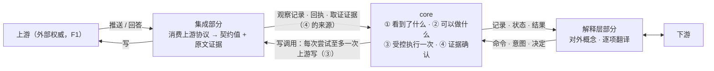
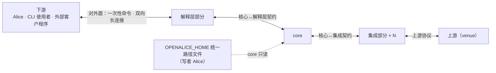

# UTA 设计景观

本文站在 C4 系统上下文（L1）之上：说明 UTA 是什么、由哪四个彼此独立的部分组成、各部分为什么这样切，以及它们共同依据的全局原则、问题域、需求与质量场景。每个部分各有一棵 C4 树，从各自的 L1 读起。本文不描述任何部分的内部。

## 0 定位

### 0.1 UTA 是什么

UTA（Unified Trading Agent）位于多个外部交易来源（券商、交易所、公共行情）与下游（Alice、CLI 使用者、外部客户程序）之间。它做四件事：

- 接收集成清洗后的能力、观察与效应记录；
- 经解释层向下游提供一次性读和推流；
- 接收带身份与依据的意图；
- 把执行过程与外部结果保真地记录和关联。

UTA 由四个部分组成，每个部分是一棵独立的 C4 树：

| 部分 | 它是什么 | L1 文档 |
|---|---|---|
| core | 核心进程与它拉起的程序宿主进程：记录、类型、规则链、写边界；抽象只在这里 | [core/design.md](core/design.md) |
| 集成 | 每个上游一个独立进程，把上游协议清洗成契约值；上游的唯一消费点 | [integration/design.md](integration/design.md) |
| 解释层 | 把 core 的操作、记录与状态清洗成下游能懂的一次性命令与双向长连接；不持有状态 | [downstream/design.md](downstream/design.md) |
| 行情派生计算子系统（可选） | 为 `Pooled` 组合子物化段视图、运行原生 op 的独立进程；没有它 core 完整可运行 | [hpc-derivation/design.md](hpc-derivation/design.md)（当前阶段不在范围内，见 `AGENTS.md`） |

划分的理由与部分之间的关系见 §4。

### 0.2 读者与状态

- **读者：** 实现 UTA 的人。
- **审批者：** 无。K3 原话为“读者是以后实现uta的人，没有审批”。
- **维护者：** 范围与状态确认者。
- **状态：已定。** 本文与集成、解释层两棵树的文档、core 的系统上下文为已定；core 里登记了未关闭卡点的文档为“评审中”：核心进程、程序宿主进程、程序宿主元素、观察 `Journal`、存储、STS 规则链。卡点清单见 §6.3。依赖假设 H 的决定有证伪条件；需要实测的量是验收项，不是设计未决（§6.3）。

### 0.3 非目标

文档定位层面：

- 不规定 crate 布局、文件布局或具体实现目录：它们是实现决定，写在根目录 `ARCHITECTURE.md`。
- 不承担 Alice 侧接入适配（包括旧 Alice 配置写入、重启触发和消费方迁移）。
- 不设计打包、发行和分发流程（K1）。
- 不重写 OpenAlice 中的旧 UTA、SDK、BFF、UI、connector 或其他旧代码。

设计层面明确不做：

- 不存在 `UnifiedOrder`/`Account` 权威对象；core 不枚举 venue，不引入 venue 词汇。写侧基本类型“订单”只含核心代数实际读取的字段（§1.3）。
- 不维护成交账本与加权成本（旧 UTA 的成本基础）：它们与由成交拼成的成交历史视图一样，是下游或程序对去重后成交的派生，不是 core 的读模型；core 只保证同一笔执行只计一次，并说明何时能称完整（[read-model.md §3.2 成交的计数身份](core/core-process/read-model.md#32-成交的计数身份-设计)）。
- core 与集成都不保存上游状态的拷贝去冒充原值：没有“同步”操作，读与取证的回答来自本次对上游的询问（§1.1、[integration-session.md §4.4 集成义务清单](core/core-process/integration-session.md#44-集成义务清单)）。
- 下游不直接对接核心契约；解释层的对外面不出现核心概念，解释层不持有状态（§4.1）。
- UTA 不含业务：策略、风控阈值、下单组合方式在程序、规则文件或下游代码里（§1.3）。
- 不做类型级 capability；不把运行期未知冒充静态保证。
- 写不批处理、不去重、不由 replay 重发。
- 不假设 venue 时间单调；不承诺跨源全序。
- 不在派生 DAG 里放绑定不可逆外部行为的执行状态。
- 不承接既有行为 A50（catalog 刷新）与 A51（ephemeral purge）：前者是 Alice 侧配置文件的内容维护（各文件的写者是 Alice，core 只读，[core-process/design.md §4.6 统一路径文件](core/core-process/design.md#46-统一路径文件)）；后者依赖的 ephemeral 实例概念，在单实例状态根（H10）下不存在。
- 不提供账户快照（A36–A38 读取、捕获、持久化，A49 调度）：账户快照是账户、持仓、待决订单的组合视图，属业务，在下游业务应用里，其数据经解释层取得。core 自己的快照只加速重启重建，不对外读（[storage.md §2.4 快照是近处副本](core/core-process/storage.md#24-快照是近处副本-设计)）。
- 不保留多意图的整体审批（旧 commit 把若干暂存操作放在一个 hash 下一并批准或拒绝，A26–A28）：审批的单位是一张单据的一个版本（[ticket.md](core/core-process/ticket.md)）；下游的“全部批准”是 N 次独立的决定，逐项有结果，没有原子性；多个意图的执行本来也从不原子。
- 不承接模拟器控制（A09、A39–A47：设标记价、推 tick、手动成交 / 撤单、注入出入金与外部成交）：它们是 fake 上游自己的控制面，不是 UTA 的契约（core 对集成与解释层的操作集里没有改上游状态的控制操作）。fake 上游的变化经普通观察进入 UTA：行情流、带归因的成交、外部变更（P11）。
- 不保留旧 commit 的自由文本 `message`（A21/A24）：单据不记起单理由与批准理由，“为什么下这一单”由下游按它拿到的请求引用自己保存；UTA 只给出退回、否决与规则否决的原因。

### 0.4 阅读约定

**标签。**

- `[证据]`：来源直接支持的事实或原话。
- `[设计]`：在已有事实上的设计表达，必须紧跟理由。
- `[推断]`：由已列事实推出、但没有一手来源直接陈述的结论。

**编号。** `F` = 外部域事实，`O` = 既有机器事实，`S` = 利益相关者要求，`H` = 假设或威胁，`P` = 机器与域共享现象，`A` = 既有行为入口，`B` = 新增需求原话，`C` = 由事实推出的需求，`K` = 约束与偏好，`Q` = 质量场景，`W` = 场景走查。这些编号只在本文定义。

**证伪与验收。** “证伪 #n”是会推翻某个决定的观测，“验收 #n”是某个决定的可测标准。编号全局唯一，各写在拥有该决定的文档的评估节；引用处写编号并链接到定义处。崩溃窗口“崩溃 #n”写在核心进程文档。

**状态词。** `已定`：走查卡点归零、替代方案与风险写全；`评审中`：走查登记了未关闭的卡点，文档写明卡点与关闭它的事件。

**跨文档引用。** 链接到文件，正文写节号，例如“[core-process/design.md §3.12 组合子值树与五个 fold](core/core-process/design.md#312-组合子值树与五个-fold)”。

**图。** 图一律是内嵌在所画元素文档里的 Mermaid，只画本层元素与直接相邻的外部元素。图只画正文已定的内容；图上出现正文没有的东西即图错。

## 1 全局原则

### 1.1 根本约束：权威不在 UTA

UTA 经手的每一个值——订单、持仓、余额、行情——权威来源都在上游（券商、交易所），不在 UTA。[证据：F1] UTA 改不了不在自己手里的值，它手里只有**意图**：想观察什么、想怎样派生、想做什么、哪些可以放行。UTA 保存的任何上游值都只是某一时刻的观察，是原值的拷贝；把拷贝当原值用，就要不断和原值对齐，对齐没有尽头。[设计]

由此：

- UTA 只对自己的意图及其推进记录（执行事实）有权威；其余一切是带来源与时间的观察。
- core 设计中心的抽象都是意图的描述：值加解释器。描述在 core 内构造与检查，描述落到上游的动作只在集成里发生。
- 接触原值——读懂上游协议、在上游落实意图、判定上游的回应对某个意图意味着什么——只在集成里发生。越过集成进入 UTA 的，是契约值形式的结论与作证据保存的原文；UTA 内没有第二个消费上游的地方。

判断状态的承载随之定为：记录 + 对记录的 fold / 非权威读模型（持仓只 fold 观察，不从成交推算）。[设计] 不选同时承载 provider 字段与业务状态的大对象（`Order`/`Account`）：它把上游权威冒充为本地模型，随每个 venue 膨胀；core 一旦要知道“能做什么”，就被迫定义“长什么样”。[证据：fp-00 §1；fp-02 命题 12；fp-03 命题 8]

### 1.2 权威源头与生命周期

上节说明权威在哪里，本节规定 UTA 各部分设计中每一处状态如何照此落地。它是全部设计的原则：每个类型、记录、协议与机制在写进设计之前先过这一节；过不了的不写，改掉划分而不是加机制。[设计]

- **权威。** 每项状态只有一个源头，即创建并维护它的一方。UTA 只是自己所创建之物的源头：意图、决策、写边界与执行事实，核心日志上的位置与保留边界，订阅与消费位置，core 自己的调用及其结果。其余状态（订单、持仓、余额、行情、上游能力、上游历史的完备与否）只向源头请求并等待结论，不越过源头管理其内部。
- **记录的性质。** 每条记录只属一类：UTA 作为源头的事实；从源头取回的副本，只代表取回那一刻；索引或意图，指向对象或表达将做之事。三类分开对待。副本不当作源头此刻的值，索引与意图不当作状态。落在只追加的日志里不改变一条记录的类别：永存的证据仍是取回那一刻的副本。
- **同步等待。** 需要知道或改变非自有状态时，经集成向源头请求，等源头的结论，再依结论记录。不先改自己的记录再去对齐，不以就近可得的数据（到达顺序、本地时钟、另一条记录）推断源头的状态。源头给不出结论时，结论就是“未确立”：依赖它的判断 fail-closed，不以启发式补上。
- **生命周期。** 有生命周期的对象，先写清它的开始与结束锚点，以及确认各锚点的一方，再判断嵌套。调用顺序由生命周期决定：内层在外层之内开始；结束外层前先结束其全部内层，最后写外层的结束锚点。
- **近处副本。** 以上成立之后，才可以为有实据的性能需要在源头之外加更近的副本（快照、内存 fold、读模型）。每个副本写清派生自哪个源头、依赖什么、何时失效、由谁如何刷新；它只加速读取，不成为新的源头。
- **机制即信号。** 需要锁、标志位、仲裁、补偿或对账才能保持一致，说明权威、记录性质或生命周期的划分有误，回到这三处修正。向上游询问一次写的未知结果并等待其结论，属于同步等待，不是对账补偿。

### 1.3 UTA 不含业务

UTA 提供的是记录、类型、规则链与写边界；业务在二次开发时用它们组装，不在 UTA 里。[设计]

- **业务**：策略与信号、风控与审批规则的具体内容（阈值、谁来批）、下单的组合方式（仓位怎么算、分几笔、撤了再下的时机）、指标、告警、组合视图。它们是程序、规则文件（[decision-chain.md §4.9 规则文件的内容与合法性](core/core-process/decision-chain.md#49-规则文件的内容与合法性)）或下游自己的代码。
- **写侧的基本类型**：写意图要有类型，信封与规则链才有可说的概念；一个类型都不给，锚点、守卫、审批与 lane 都无从成立。订单（交易协议，[ticket.md §4.5 交易协议：操作种类、目标、可执行性、检查目录](core/core-process/ticket.md#45-交易协议操作种类目标可执行性检查目录-交易协议)）是预置的写侧基本类型；需要时可以再加，走意图类型的扩展轴（新意图类型 = 新检查集，[integration-session.md §4.3.4 扩展与演进](core/core-process/integration-session.md#434-扩展与演进)），核心代数不变。基本类型只含核心代数实际读取的字段，不是上游订单记录的拷贝（§1.5）；没有处理器读的下单参数（如订单类型、time-in-force、来源专有选项）是意图的载荷，core 不读，原样交给集成（[envelope.md §2.2 三部分](core/core-process/envelope.md#22-三部分-设计)）。
  - 不选：写侧不预置任何类型、只留纯泛型协议：信封里没有任何概念，锚点、守卫、审批与 lane 都无从成立，规则链写不出来；按上游订单记录列全字段：即 §1.1 的大对象。
- **读侧是反向代理**：持仓、余额、成交、行情等观察按契约载荷 schema 直通，载荷是什么类型不影响核心语义。公共 schema 服务于下游，core 不依赖它。

### 1.4 三段：清洗、抽象、清洗

抽象只在 core 里。core 两侧各有一层明确的接口清洗，都不是抽象的延伸：

- **集成**把上游协议清洗成契约值。
- **解释层**把 core 的操作、记录与状态清洗成下游能懂的接口：一次性命令与双向长连接。核心概念（位置、链、单据版本、能力三值等）不出现在对外面上。
- core↔解释层的契约可以是抽象的，因为它的消费者只有解释层；跨仓库交付的是解释层的对外面。

### 1.5 一句话与四步

**UTA 记录看到了什么，计算可以做什么，受控地执行一次，再用证据确认发生了什么。**

订单的状态、持仓、审批流、策略行为都是这四步的组合结果，不是核心实体。UTA 中不存在任何同时承载 provider 字段与业务状态的对象：那样的对象就是上游原值的拷贝（§1.1）。写侧基本类型“订单”是意图的类型，只含核心代数实际读取的字段，不是这样的对象。[证据：fp-00 §1 五十三案例无一以大对象为中心；fp-02 命题 12]

四步都在 core 里，机制之间只通过位置、键与日志记录关联；四步各由 core 的哪些元素承担，见 [core/design.md](core/design.md) 与它分解出的核心进程文档。

四步落在四个部分上的样子：

四步口号是开篇导览与场景的骨架（§5），不是文档主线。core 的主线是两个类型宇宙与它们之间唯一的边（[core-process/design.md §3.4 两个类型宇宙与唯一边](core/core-process/design.md#34-两个类型宇宙与唯一边)）。

### 1.6 跨部分的两对术语

| 词 / 概念对 | 甲 | 乙 | 区分依据 |
|---|---|---|---|
| 解释层 / 解释器 | 解释层：core 之外把 core 清洗成对外接口的部分，面向下游 | 解释器：core 内对值树的解释，包括五个 fold、程序的两种解释与宿主 | 前者是接口清洗，不含抽象；后者属设计中心（[core-process/design.md §3.12 组合子值树与五个 fold](core/core-process/design.md#312-组合子值树与五个-fold)） |
| 两种“下游” | core 内的“交给下游”：解释载荷的程序、钩子与消费方 | core 之外的下游：Alice、CLI 使用者、外部客户程序，只经解释层接触 core | 前者说的是载荷的解释权，后者说的是接触 core 的途径 |

## 2 问题域

### 2.1 域事实、既有机器事实、利益相关者要求与假设

#### F 外部域事实

|编号|事实|证据|
|---|---|---|
|F1|venue 是账户、持仓、订单、成交、价格的权威来源；本地任何记录都是对它的解释。|`docs/uta-live-testing.md:138` “Never trust the ledger over the venue”|
|F2|instrument 身份只在其 venue 内有意义；同一“东西”在不同 venue 是不同 instrument。|`packages/uta-protocol/src/types/broker.ts:615-621`（conId / CCXT symbol / ticker）；`:600-606`（CCXT 的 AAPL 是合成代币）|
|F3|instrument 之间有 venue 给出的派生关系（期权→标的、期货月份→品种）。|`broker.ts:507-513,190-223`|
|F4|instrument 会上市、退市、到期。|域常识；既有目录刷新是对此的响应（O5）。|
|F5|对外部写的结果可能不可判定：请求可能到达 venue 而调用方拿不到回执。|gRPC/tonic 明言 deadline 错误时写可能已完成（`investigation/rust-feasibility.md:175`）；venue 侧无回音是网络固有性质|
|F6|venue 的能力、限额、幂等/回读/续传语义按 venue × 操作种类变化，且不少条目官方未文档化。|`investigation/venue-capabilities.md:148-178` 矩阵与 unknown 列表|
|F7|venue 会限流；历史数据有 pacing。|`ccxt/exchanges/hyperliquid.spec.ts:95-99`（429）；IBKR pacing、Longbridge 500 symbol 上限（`venue-capabilities.md` sections 2 and 3）|
|F8|子账户 / 钱包是某些 venue 的结构。|`broker.ts:535-553`|
|F9|用户可在 venue 自己的 app 里下单、出入金；我们只能事后观察。|`broker.ts:578-586`|
|F10|订单从 listing 消失不等于终态（listing 可能滞后或不完整）。|`UnifiedTradingAccount.ts:853-877` 二次确认；Longbridge `client_request_id` 仅 10 分钟缓存（`venue-capabilities.md:156`）|
|F11|推送流有自己的时钟；venue 事件时间与本地收到时间不同源。|域常识；`src/domain/market-data/bars/types.ts:92` 明言 freshness “neither establishes measured feed latency”|
|F12|venue 对每笔成交给出身份，逐笔量与订单累计量分开报告；成交事后可被修正；同一条回报流里还有不是成交的事件。|IBKR TWS API “Executions and Commissions”（`interactivebrokers.github.io/tws-api/executions_commissions.html`）：修正以另一条 `execDetails` 送达，除 execID 最后一个点之后的数字外参数全同；`reqExecutions` 默认只返回当日零点以来的执行。Alpaca “Websocket Streaming”（`docs.alpaca.markets/us/docs/websocket-streaming`）：`trade_updates` 的 fill 事件带 `execution_id`，`qty`/`price` 是本次成交，`order.filled_qty` 是订单累计。Binance `binance-spot-api-docs` `user-data-stream.md` 的 `executionReport`：`t` Trade ID、`l` 本次成交量、`z` 累计成交量；示例中 `x: NEW`（不是成交）的事件 `t` 为 -1，却同样带 `I` Execution Id|

#### O 既有机器事实

本表和 F/H 表中的旧代码路径来自 OpenAlice 仓库 `mouriya-s-lab/OpenAlice` commit `d9583df0d264`。旧代码留在 OpenAlice，不迁入本仓库。调查报告记录的是源码可观察行为，不把它们写成新设计保证。

|编号|事实|证据|
|---|---|---|
|O1|六个 adapter 无一使用推送式市场数据；无一向 venue 发调用方幂等键。|`brokers/` grep `WebSocket\|subscribe\|watch*` 无匹配；`IbkrBroker.ts:837` snapshot；`ibkr/README.md:40-45`；幂等键 grep 无匹配|
|O2|写结果类型只有 `submitted\|filled\|rejected\|cancelled\|user-rejected`，无 unknown、无 principal。|`packages/uta-protocol/src/types/git.ts:56-77,93-102`|
|O3|push 先调 venue，再读状态、再追加提交、再清 staging；任何异常记为 `rejected`。|`TradingGit.ts:141-155,157-184`|
|O4|一个 `UTAConfig` = presetId + 凭据 + 可选子账户 + guards + keyless/readOnly/asVendor/editable/ephemeral 标志；tier 由 keyless/readOnly 推导。|`src/core/config.ts:442-487`；`UnifiedTradingAccount.ts:233-243`|
|O5|目录每 6h 刷新；快照按调度捕获；event log 只记 health/snapshot，不记 ledger commit。|`services/uta/src/main.ts:134-141`；`uta-manager.ts:61-76`；`src/core/event-log.ts:127-163`|
|O6|同账户写互斥是单个 `TradingGit` 实例内的布尔量；跨客户端（UI / AI / connector）无序列化定义。|`TradingGit.ts:64-80,242-248`|
|O7|Alice→UTA 是 HTTP JSON、无认证；“信任边界是 host”；只读拦截靠路径字符串匹配且漏 `/wallet/commit\|reject\|stage-*`。|`src/webui/routes/trading-proxy.ts:1-8,115-215,193-206`；`routes-trading.ts:453-535`|
|O8|改配置 / 换凭据 = Alice 写 flag → 整个 UTA 进程重启。|`UTAManagerSDK.ts:174-200`；`main.ts:8-10`|
|O9|持久化：ledger 是每账户一个 pretty JSON（每次提交整写）；快照 50 条一 chunk 的 JSONL + index（`version:1`）；event log JSONL；无 retention/compaction；配置有 migration 与 `_meta.json`；两个 Alpaca legacy id 共用一条回退路径。|`git-persistence.ts:12-47`；`snapshot/store.ts:1-85`；`src/core/config.ts:545-548`；`git-persistence.ts:18-39`|
|O10|消费方全部是请求/响应轮询：健康 1s、BFF 30s、connector 1.5s、UI 3–300s。|`investigation/alice-consumers.md:206`|
|O11|20 条已观察缺陷：所有权绕过、数量不校验、子账户竞态、unknown→rejected、投放后落盘窗口、成交字段丢失、状态压成 rejected、guard 绕过健康记账、冷却先记后发、重启丢 staging。|`investigation/existing-capabilities.md:254-277`|

#### S 利益相关者要求

|编号|要求|来源|
|---|---|---|
|S1–S7|分别等同于 B1–B7（见 §2.3.2）。|维护者原话，B1–B7|
|S8|每个决定（批准 / 否决 / 自动放行）事后能回答“谁、何时、依据什么”。|问题域关于效应关联的原话；既有缺口 O2|
|S9|运维者能改审核规则、装 / 卸本机程序、换一个集成的凭据、重启一个连接、看状态。|问题域角色要求；既有 O8 是当前实现方式|
|S10|Alice 现有消费面在新边界上仍可实现。|`investigation/alice-consumers.md:192-207`|
|S11|只读 / 策略门在多处边缘执行，需要 UTA 暴露调用方身份与账户用途。|`alice-consumers.md:204`|

#### H 假设 / 威胁模型

|编号|假设或威胁|依据|证伪 / 关闭事件|
|---|---|---|---|
|H1|对同一外部效果的重复投放不可接受（资金后果）。|域常识；S8 对效应关联可审计的要求|维护者明确接受“宁重复不漏单”的账户类别（证伪 #5）|
|H2|程序（AI 写的决策代码）不可信：会死循环、吃内存、超产意图、输出非法。|维护者“ai写不好scala”；S8 对安全关联的要求|—（威胁模型，不证伪）|
|H3|凭据封存文件由 Alice 写入 `OPENALICE_HOME` 统一路径，core 读取并传给对应集成进程；程序与消费方只见账户身份。|共享配置文件契约（[core-process/design.md §4.6 统一路径文件](core/core-process/design.md#46-统一路径文件)）；`src/core/config.ts:704-787` 封存；`alice-consumers.md:213`|维护者把 owner 移到 UTA 或 OS secret broker|
|H4|同一 (账户, 子账户) 上的写需要一个全序；不同账户可并行。|F1 + F8：venue 侧顺序只能由我们发出的顺序决定|某 venue 文档保证并发写的确定性排序（未见；证伪 #6）|
|H5|订阅的 owner 是 UTA 而非消费方：消费方断开后订阅仍有业务价值（程序在跑）。|S1/S3：程序在 UTA 内运行|维护者决定程序随消费方连接存亡（证伪 #7）|
|H6|决定有时效，过期未决 = 否决，不做补偿。|connector `ttlMs`（`delivery-manager.ts:271`）、Telegram 过期（`telegram-uta.ts:196-199`）是现有实例|维护者要求人类决定无过期，或过期后自动执行|
|H7|信任单位是 **OS 用户**：本机非本用户的进程不可信；本用户的进程视为用户本人；同机进程能连到 UTA 不等于有权发写——写权限来自认证得到的 principal × 策略 scope，不来自连接。|O7 现状无认证 + K1 独立进程使 IPC 成为正式边界；UDS 对端凭据 / 命名管道 ACL 的粒度都是用户|维护者要求同用户进程之间也互相隔离（则需能力令牌 / 管道句柄传递，升级路径见 [core/design.md §4.3](core/design.md#43-部署与信任)）；或接受“host 即信任边界”（证伪 #8）|
|H8|Windows 是必须支持的运行目标。|已确认；三 OS 目标为 macOS、Windows、Linux（旧基线 `README.md:32`；`docs/development-workflow.md:280,324`）|—|
|H9|程序状态需要跨 UTA 重启恢复（而非重启后从零重建）。|S3 alert/决策连续性；若不恢复则每次重启丢失指标暖机与程序 state|维护者接受重启后程序冷启动 + 历史回填|
|H10|同一用户状态根（`OPENALICE_HOME`）上同时只能有一个 core 实例持有单据与订阅表；孤儿实例（父进程死而子进程活）是真实威胁。|`scripts/guardian/shared.ts:271-276`：Windows 上 kill 只到 wrapper，孤儿 UTA 继续占端口使新实例无法绑定；用户状态根见 `existing-capabilities.md:239`|—（威胁模型）|

### 2.2 机器与域共享的现象

这里的“机器”是 UTA 的四个部分整体。观察引用 = `LogPosition`：`StreamId = (source, stream, epoch)`，`LogPosition = (StreamId, Seq)`（[core-process/design.md §3.1 流、位置与三种进度](core/core-process/design.md#31-流位置与三种进度)）。位置集写作 `Set<LogPosition>`，同构于 `Map<StreamId, Seq>`。

每个现象是一类带名字、方向和语义字段的记录；字段写语义而不是实现类型。

- 方向：`→机` = 域给机器；`机→` = 机器给域。
- 所有记录共享不可变信封：记录身份、记录时间（本地墙钟 + 单调计数）、记录者 principal 或来源。下表不重复列。

|编号|现象|方向|语义字段|被哪些需求引用|
|---|---|---|---|---|
|P1|能力声明|集成→机；机→解释层（声明部分）|见表下|C2、C8、A02、A18、A19、Q6、Q13、Q15、Q16|
|P2|观察|集成→机；程序→机（派生）|见表下|B1–B5、A08、A11–A17、Q1–Q3、Q16、Q18|
|P3|gap / 控制|机→程序/消费方|见表下|C6、Q11、Q12、Q14、Q28、Q31|
|P4|订阅需求 / 订阅状态|消费方/程序→机；机→集成|owner、选择器（观察流：一组来源 × 流 × 主体集的项，可跨流跨来源，每项是供给项（要上游推送）或只投递项（只看已有的记录）；或执行事实：来源 × 作用域，含此后出现的 lane）、epoch、状态（待接纳 / 活 / 被拒 / 挂起，逐项给出、整体由逐项派生；挂起带原因；上游拒绝推送的主体逐主体列出）、拒绝原因、消费游标（该订阅每条选中流已确认的最后 `LogPosition`；确认 = 消费方已处理，未确认区间可重复可见，[subscription.md §3.2 cursor 与确认](core/core-process/subscription.md#32-cursor-与确认)）；机→集成的一半是每条流被路由的主体全集及上游的确认|B1、C5、Q9、Q13、Q14、Q23、Q31|
|P5|回填|机→集成；集成→机|窗口（起点可为上游历史的真实起点）、覆盖边界（本次取得的连续前缀）、结果、与实时流的边界（`live_from`，由 readiness 给出）、回填进度|A19、Q14|
|P6|意图|程序/消费方→机|意图身份、principal、目标（账户、子账户、instrument；撤单 / 改单另有订单身份，平仓另有持仓身份）、操作种类（下单 / 改单 / 撤单 / 平仓，交易协议的封闭集合）、参数（按目标来源声明的意图参数 schema）、依据（`Set<LogPosition>`）、生产者（程序制品 hash + 版本 + 调用身份，或消费方会话）、过期|B7、C1、C3、C10、A29–A35、Q5、Q7、Q8、Q17、Q19、Q25|
|P7|决定|决策者→机|所指意图、principal、裁决（批准 / 否决 / 过期 / 规则否决）、依据、对待决集合版本的期望；否决带原因，规则否决带 `Rejection`，过期带到期的 `deadline`，批准不带原因（“依据什么”由依据与绑定版本回答）|S8、C3、A26–A28、Q7、Q9、Q10、Q19|
|P8|尝试|机→集成→venue|所指意图、尝试身份、venue 调用方键（能力允许时）、阶段（已预约未发 / 已发出 / 发出与否不可判定）及各阶段时间|C1、C2、Q1、Q2、Q5|
|P9|回执|venue→集成→机|所指尝试、venue 结果（原始 + 域词表映射）、venue 订单身份、成交明细（每笔执行一条带执行身份的成交记录，见 P2）|C1、A13、Q1、Q5、Q16|
|P10|对账|机↔集成；人→机|所指尝试、证据渠道、结论（found / absent / inconclusive，只来自上游证据）；人只能要求再问一次，或带 principal 放弃跟踪（不给出结论）|C2、Q3、Q6|
|P11|外部变更|集成→机；机→机|账户、观察到的订单 / 成交 / 余额变动的原始记录、归因结论（某本地尝试 / 外部 / 未定）及其证据|F9、A48、Q6、Q18|
|P12|程序|作者→机；机→消费方|程序制品身份（hash）、版本、输入声明（instrument 集合 × 消费方式）、预算、状态版本、状态、trap、alert|B3、B5、C4、Q4、Q8、Q25|
|P13|会话|消费方/集成↔机|对端、principal、授权范围（账户 × 操作种类）、deadline|S11、H7、Q19、Q29|
|P14|控制|运维者→机|principal、配置变更、凭据轮换、重启某集成、装 / 卸程序、请求（重启加速用的）快照；结果（生效 / 拒绝 + 原因）|S9、A06、A07、Q18、Q19、Q32|
|P15|快照 / 保留 / 迁移|机→机|快照身份、按存储类别的保留规则（观察日志可压缩到窗口；效应单据只追加不压缩，只做快照加速）、压缩点、格式版本、迁移结果|Q17、Q21、Q28|
|P16|健康 / readiness|机→消费方/运维者|按集成：会话状态（连接中 / 已建立 / 停止并待处理，附原因）、逐流 readiness（等待实时 / 实时，附实时边界）、逐流当前 epoch 的回填进度（补齐中 / 已闭合 / 已到达而衔接未证明 / 未能补齐）、按调用目标（作用域或流）的连续失败数与最近成功时间|A01–A02、A25、Q14、Q32|

**P1 能力声明的语义字段：**

- 集成身份、venue、作用域（含对外账户引用与显示名）；
- 写侧：按（作用域 × 操作种类）的 supported / unsupported / unknown；
- 读侧：按流的一次性读与回填 supported / unsupported / unknown，读请求参数的 schema，名义数据等级；
- 配额；
- 每种写操作对上游恰一次写（撤单 / 下单；改单只在上游能一次写完成时提供）、调用方键是否标识订单及键的作用域与唯一期，以及 unknown 证据渠道：按调用方键回读 / open-order listing + venue 订单身份 / 成交或持仓对账 / 保留期内按键重放 / 无；撤单与改单能按哪种订单身份找到目标；
- 历史 bar 有无与 pacing、子账户有无、续传游标有无。

**P2 观察的语义字段：**

- 来源：账户、公共 feed、或程序。程序输出的指标 / alert 是派生观察，与外部观察同一形状。
- 主体：instrument / 账户 / 子账户 / feed。
- 种类：quote / book / bar / clock / 余额 / 持仓 / 订单状态 / 成交 / 目录 / 连接状态 / 健康 / 汇率 / 派生。
- venue 事件时间（可无）、venue 序号（可无）、venue 续传游标（可无）、本地收到时间、Seq、原始负载（订单状态 / 成交必有，其余种类可无，[envelope.md §2.2 三部分](core/core-process/envelope.md#22-三部分-设计)）、质量标记。
- 订单状态 / 成交观察带归因（某尝试 / 外部 / 未定）。
- 成交观察带执行身份（在来源 × 作用域内唯一，跨渠道不变）与可选的修订号；数量与价格是本笔执行的量；订单状态带该订单的累计量（[read-model.md §3.2 成交的计数身份](core/core-process/read-model.md#32-成交的计数身份-设计)，F12）。

**P3 gap / 控制的三类**（P3 分类的是连续性与损失现象；渠道失败 `Gap{origin: Channel}` 是一次读调用的结果，不是 P3 现象，[one-shot-read.md §3.7 术语：读的“拿不到”](core/core-process/one-shot-read.md#37-术语读的拿不到)）：

- **来源 gap**：某范围断代（新 epoch 首条记录，含前一范围与其最后 Seq；该流的第一个 epoch 无前驱），或当前 epoch 内回填未覆盖的区间。原因 ∈ {start, disconnect, quota, ingress_overflow, credential_rotated, schema_change, backfill_incomplete, program_upgrade}；各原因的写者与它是否开新 epoch 见 [core-process/design.md §3.2 gap 的三种来源](core/core-process/design.md#32-gap-的三种来源)。
- **投递 gap**：某订阅对某范围的损失，是订阅的状态，不是流上的记录（流本身不缺这些记录）。原因 ∈ {slow_consumer, compacted, conflated}；它何时产生、何时结束见 [subscription.md §3.3 投递缺口 Gap{origin: Delivery}](core/core-process/subscription.md#33-投递缺口-gaporigin-delivery)，哪种消费方式会因慢而产生它见 [delivery.md §3.1 三种消费方式（投递侧）](core/core-process/delivery.md#31-三种消费方式投递侧)。
- **状态通知**：readiness 与回填进度的变化（等待实时 / 实时；补齐中 / 已闭合 / 已到达而衔接未证明 / 未能补齐）、订阅挂起 / 恢复（附挂起原因）。它不是损失，不需确认，由健康观察或订阅状态派生。

### 2.3 需求

#### 2.3.1 既有行为 A

A 表按调查报告记录的真实入口（路由、SDK 方法、UI/CLI 调用或后台任务）逐条列出，编号 A01–A51 由本表分配。A40–A46 是模拟器集成的本地注入方法，不是 HTTP 路由。`/api/simulator/*`（A39）与这些方法的对应关系报告未记录，登记于 §2.5。

|编号|入口 / 既有行为|报告:行证据|核验状态|
|---|---|---|---|
|A01|health：健康探测与摘要状态。|`alice-consumers.md:129-133`、`:205-206`|已核实|
|A02|账户列表：`listUTAs` / `GET /api/trading/uta`，按 source 解析。|`alice-consumers.md:31`、`:68-69`|已核实|
|A03|equity：经理级账户权益读，并在组合面按账户聚合。|`alice-consumers.md:31`、`:72`|已核实|
|A04|search：合同搜索，支持 source 选择和多账户扇出。|`alice-consumers.md:31`、`:69`|已核实|
|A05|fx-rates：经理级 FX 读，供组合面换算。|`alice-consumers.md:31`、`:72`|已核实|
|A06|test-connection：测试连接入口。|`alice-consumers.md:137`、`:160`|已核实|
|A07|reconnect：请求受监督重启 / 重连，不在 SDK 内初始化。|`alice-consumers.md:29`、`:141`|已核实|
|A08|sync：按 source 执行同步，返回更新数；无更新不等同失败。|`alice-consumers.md:58`、`:93`|已核实|
|A09|simulate-price：独立的价格模拟效应入口。|`alice-consumers.md:58`、`:83`|已核实|
|A10|subaccounts：读取 `{subAccounts}`。|`alice-consumers.md:39`|已核实|
|A11|account：按可选 `subAccountId` 读取 `{account}`。|`alice-consumers.md:40`、`:71`|已核实|
|A12|positions：按可选 `subAccountId` 读取 `{positions}`。|`alice-consumers.md:41`、`:72`|已核实|
|A13|orders：按可选 id 列表读取 `{orders}`；空 id 列表省略查询。|`alice-consumers.md:42`、`:73`|已核实|
|A14|clock：读取 `{clock}`，可按 source 逐一返回。|`alice-consumers.md:47`、`:79`|已核实|
|A15|quote：按稳定 `aliceId` 或 contract shell 读 quote。|`alice-consumers.md:43`、`:77`|已核实|
|A16|option-contracts / option-chain：按期权合同请求 / 期权链请求读取（`POST /api/trading/uta/:id/contract/option-contracts`、`.../option-chain`）。|`alice-consumers.md:44-45`、`:74-75`|已核实|
|A17|book：按账户和结构化请求读取 order book。|`alice-consumers.md:46`、`:76`|已核实|
|A18|expand：按 `aliceId` 与 filters 返回 contracts 或 grid。|`alice-consumers.md:48`、`:78`|已核实|
|A19|historical：按 contract query 与 params 读取 historical bars；源码注释提示可能 404，不是运行观测。|`alice-consumers.md:49`、`existing-capabilities.md:229-235`|入口已核实，运行结果未核实|
|A20|details：按 contract query 读取 contract details。|`alice-consumers.md:51`、`:70`|已核实|
|A21|log：读取并按时间排序 wallet commits。|`alice-consumers.md:52`、`:80`|已核实|
|A22|order-history：按 source 读取有界 order history，默认 limit 50。|`alice-consumers.md:55`、`:91`|已核实；50 的来源为 SDK 默认值|
|A23|trade-history：按 source 读取有界 trade history，默认 limit 50。|`alice-consumers.md:56`、`:92`|已核实；50 的来源为 SDK 默认值|
|A24|show：按 hash 查找 commit；not-found 与传输失败区分。|`alice-consumers.md:53`、`:81`|已核实|
|A25|status：读取结构化 wallet status，供审批和效应路径门控。|`alice-consumers.md:54`、`:82`|已核实|
|A26|commit：提交 staged work；无 staged work 可跳过并返回元数据。|`alice-consumers.md:58`、`:88`|已核实|
|A27|reject：按 pending hash 拒绝，必要时先让 staged work 进入记录。|`alice-consumers.md:58`、`:90`|已核实|
|A28|push：按 pending hash 投放；策略关闭时返回人工审批状态。|`alice-consumers.md:58`、`:89`|已核实|
|A29|stage-place：stage place-order。|`alice-consumers.md:58`、`:84`|已核实|
|A30|stage-modify：stage modify-order。|`alice-consumers.md:58`、`:85`|已核实|
|A31|stage-close：stage close-position。|`alice-consumers.md:58`、`:86`|已核实|
|A32|stage-cancel：stage cancel-order。|`alice-consumers.md:58`、`:87`|已核实|
|A33|one-shot place：UI 下单对话框的一次性 place 入口，服务端为 stage→同步 commit→异步 push 的便利包装，按阶段标注失败。|`existing-capabilities.md:78`；`alice-consumers.md:162`|已核实|
|A34|one-shot close：UI 下单对话框的一次性 close 入口，同一包装。|`existing-capabilities.md:78`；`alice-consumers.md:162`|已核实|
|A35|modify / cancel 无 one-shot 入口：AI 工具与 CLI 的 modify/cancel 走 stage→commit→push（A30/A32 + A26/A28）。|`alice-consumers.md:184`、`:202`|已核实|
|A36|快照读取：UI 详情页每 60 s 轮询快照；AI snapshot 工具按 `asOf` 取最新快照并返回新鲜度警告。|`alice-consumers.md:121`、`:159`|已核实|
|A37|快照捕获：触发为 scheduled / post-push / post-reject / manual；构建时 best-effort `sync` 后读账户、持仓、待决订单。|`existing-capabilities.md:182-184`|已核实|
|A38|快照持久化：每账户 `snapshots/index.json` + `chunk-NNNN.jsonl`，每 chunk 50 条；index 经同目录临时文件 + rename 写入；读取按 chunk 由新到旧。|`existing-capabilities.md:189`|已核实|
|A39|`/api/simulator/*` 路由族：BFF 直通到 UTA；只读模式的 mutation matcher 把 `/api/simulator`、`/simulator` 前缀视为 venue 写。|`alice-consumers.md:7`、`:131`|已核实|
|A40|模拟器 `setMarkPrice`：设置标记价并自动撮合挂单。|`venue-capabilities.md:141-142`（`MockBroker.ts:546-755`）|已核实|
|A41|模拟器 `tickPrice`：推进一笔价格 tick。|同上|已核实|
|A42|模拟器 `fillOrder`：手动成交一笔挂单。|同上|已核实|
|A43|模拟器 `cancelPendingOrder`：撤销一笔挂单。|同上|已核实|
|A44|模拟器 `externalDeposit`：注入外部存款。|同上|已核实|
|A45|模拟器 `externalWithdraw`：注入外部取款。|同上|已核实|
|A46|模拟器 `externalTrade`：注入外部成交（F9 外部变更的模拟入口）。|同上|已核实|
|A47|CLI `alice-uta` simulation price-change：经 Alice gateway 映射到 A09 同一工具。|`alice-consumers.md:184`|已核实|
|A48|后台 poller：健康账户上按周期进行外部订单观察和同步，账户间失败隔离。|`existing-capabilities.md:121-137`|已核实|
|A49|快照调度：scheduled / post-push / post-reject / manual 触发，按配置周期执行。|`existing-capabilities.md:178-190`|已核实|
|A50|catalog 刷新：presets / engine pack catalog 的加载与校验。|`existing-capabilities.md:207-227`|已核实|
|A51|ephemeral purge：启动时删除 ephemeral UTA 的 trading 目录和配置记录。|`existing-capabilities.md:237-245`|已核实|

#### 2.3.2 新增需求 B

原话逐字保留；现象列把每条需求接到 §2.2 的共享现象。

|编号|需求|原话|现象|
|---|---|---|---|
|B1|实时 K 线订阅、秒级清洗、每 instrument 大量增量指标、多核。|“UTA是做交易数据的，只要有实时K线数据要订阅这一个场景，秒级的K线节点清洗，巨型object装载一堆指标是家常便饭，而UTA的核心职责是订阅后分发effect，纯单线程做这种事情并不好考虑”|P2、P4、P12|
|B2|多渠道多资产同时订阅，程序用全部渠道最新状态判断。|“我在渠道A订阅了十年短债，渠道B订阅了hl的pre ipo代币，渠道C上下了一旦，等待某个指标满足后买一笔SPY500期权，现在ai想要指标尽可能用上所有渠道的信息，因为市场是流动的，你很难写到了多少价格以后买，何况期权的价格还是，正股波动到了什么价格去买期权同时计算gamma”|P2、P12|
|B3|TradingView 式可组合：自造指标、alert 回调、可编程决策；不接受每 bar 全量重跑。|“最好的参照物是tradingview，实际上如果能逆向tradingview则uta没有存在的意义，通过自造指标serverless，alert是实质上的事件回调，而pinescript同等于一个能编程的dsl，这样你想把什么组合就把什么组合，而uta现在只是要求effect抽象后能安全的互相影响，tradingview式的做法需要巨大的运行时成本，本质上因为挂靠的是k线，只要k线每有一条新数据，则pinescript中编译优化后的产物就运行一次”|P12|
|B4|衍生品是有自己实时数据的 instrument，标的是它的输入；跨 instrument 观察是常态。|“不应该只把期权看作指令集合，期权有自己额外的实时数据，只不过他要把正股当成自己的一部分，而，正常做交易这才是常态，不做短线而做市场波动，观察CRWV同时也看NVDA是再正常不过的事情，那假如加上pre ipo的openai则更加正常，难道这种东西不存在指令吗，最终难道你要组合数据吗”|P2、P12|
|B5|不对齐时间；消费有序与否由程序声明。|“时间不应该要求对齐，而是先后顺序一致”；“节点顺序是否要保证先后顺序这事根本不一定，而依赖你的观察组合怎么写，如果是运算式的那是await消费而不是所谓的指令谁先谁后，如果是观察在同一时刻是否有效追求的是观察窗口的延迟范围有多大而不是谁先来谁后来，消费的时候是否要有序那是程序的事情”|P2、P4、P12|
|B6|核心不处理协议；集成层洗完送内部协议。|“uta本身非常像反向代理，uta的核心不处理协议怎么交互，协议交互是集成层自己洗过了然后送到uta，uta然后再直接消费自己内部尽可能统一但是有扩展性的协议”|P1、P2、P8、P9|
|B7|效应：副作用怎么消费、谁和谁能关联、抽象怎么做。|“这个设计并没有回答，不管有没有wasm，副作用怎么消费，谁和谁能关联在一块，抽象怎么做”|P6、P7、P8、P13|

#### 2.3.3 推出的需求 C

|编号|前提|需求|不保证|关闭事件|
|---|---|---|---|---|
|C1|F5 + H1|意图在任何尝试发出之前已持久化；发出后无回执的尝试进入 unknown；unknown 不得自动产生新尝试。|不保证 venue 侧只执行一次（无键的 venue 做不到）；只保证 UTA 不主动重复。|—（不变量）|
|C2|F6 + F10|unknown 的收敛按（venue，操作种类）使用集成在 P1 声明的证据渠道：按键回读、open-order listing + venue 订单身份、成交 / 持仓对账、保留期内按键重放；渠道结论 inconclusive 或无渠道 → 停等，此后结论只由新到的上游证据（带归因身份的迟到观察、重开一轮的取证）给出，不作推断。带 principal 的放弃跟踪只结束 UTA 的等待，不给出结论。|不保证收敛时限；放弃跟踪之后结论可能永远未知。|每个集成上线时其 P1 声明完整。|
|C3|S8 + H6|每个 P7 带 principal 与依据；每个 P6 带过期；过期未决 = 否决记录，不补偿。|不保证 principal 的真实性（那是 C11）。|H6 被证伪。|
|C4|H2|一个程序的 CPU / 内存 / 意图速率 / 状态大小有预算；超预算被隔离并报告；其他程序、账户、核心不受影响。|不保证被隔离程序的 state 可用。|—|
|C5|H5|订阅（P4）与程序（P12）的生命周期由 UTA 拥有，与消费方连接无关；消费方重连拿到当前状态。|不保证重连期间发生的推送逐条补发（见 C6）。|H5 被证伪。|
|C6|F11 + F6（无通用续传）|断线、配额、慢消费者、压缩过期造成的不连续必须以 P3 显式标记；有 venue 游标时可续传；无游标时不伪造连续。|不保证缺失数据可回填（能力决定）。|—（不变量）|
|C7|H3 + C4|凭据只经过“统一路径封存文件 → UTA 核心 → 该集成进程”注入链；程序与消费方只见账户身份。|—|H3 被证伪。|
|C8|O1（既有事实）|订阅流与幂等键对每个集成都是新写的能力；设计不能假设复用现有 adapter 的任何行为。|—|—（实施前提，不是域需求）|
|C9|F2 + O11（所有权绕过缺陷）|在任何 venue 调用前，意图只按 UTA 自己的事实与已声明的值否决：作用域与子账户、操作种类与参数 schema、目标种类、策略的 instrument 允许集合，以及策略要求时的可交易目录观察。instrument 是否属于目标账户是上游的事实，由上游拒绝（venue 拒绝记录保留原文），核心不自行判定。|不保证他账户的 instrument 在调用前被挡住（允许集合未排除时，上游拒绝是唯一防线）。|—（不变量）|
|C10|O11（数量校验与子账户竞态缺陷）|意图参数在任何 venue 调用前按目标来源为该操作声明的意图参数 schema 校验（含类型相关的必填与互斥），数量 / 名义有限且为正；参数合规从起单起对负责人可见，不合规的版本送审即否决并留记录，不论意图来自会话还是程序；目标子账户在集成已声明子账户能力且已枚举后才可指定，未枚举前拒绝写。|—|—（不变量）|
|C11|H7 + S11|每个 P13 会话绑定一个经传输无关机制认证的 principal；写类操作按（principal, 账户, 操作种类）授权；P7 对待决集合版本的期望不匹配 → 冲突，不执行。|不保证传输层本身的机密性（本机）。|H7 被证伪。|
|C12|O11（guard 健康记账与冷却时序缺陷） + H1|自动规则（guard）的读走同一健康记账；读失败或不可判定 = 规则否决（fail-closed，记 P7 规则否决 + 原因），不放行；规则的副作用（冷却计时）不在检查通过时记，而在尝试越过发送屏障（`SendBarrier` 持久化，可能已发出）时记。|—|—（不变量）|
|C13|O11（成交字段丢失与状态压扁缺陷）|P9 原始负载完整保留；状态映射到有限域词表（至少 accepted / partially_filled / filled / cancelled / rejected / expired / unknown；unknown 在契约里以 `Unmapped(raw)` 承载），映射表按 venue 列举输入枚举，无“其他 → rejected”。|—|—（不变量）|
|C14|O9 + H9|持久记录带格式版本；升级只前进；迁移失败拒绝启动而非部分迁移；程序状态带状态版本，不兼容时显式重置而非静默丢失。|—|—（不变量）|

### 2.4 调查结论摘录

#### 2.4.1 Venue 原生能力

|Venue|推送流|调用方幂等键|按键回读|续传游标|
|---|---|---|---|---|
|Alpaca|有|`client_order_id`（重复被拒有文档，保留期未知）|有 `/v2/orders:by_client_order_id`|无|
|IBKR TWS|有|无（`orderRef` 仅为用户引用）|无|无|
|Longbridge|有|`client_request_id`（10 分钟缓存）|无（详情需 `order_id`）|无|
|Binance|有|`newClientOrderId`（只保证挂单期间唯一）|有 `origClientOrderId`|无|
|Bybit|有|`orderLinkId`（要求唯一，重复行为未知）|有|无|
|OKX|有|`clOrdId`（挂单期唯一，终态后可复用）|有|无|
|Bitget Classic|有|`clientOid`（重复报错有文档）|有|无|
|Hyperliquid|有|`cloid` 字段存在，重复幂等未被文档保证|有 `orderStatus oid=cloid`|无|
|LeverUp|无|无|无|无|
|Mock|无|无|无|无|

来源：`investigation/venue-capabilities.md:148-163`。

- 调查到的十条产品路径里没有一条有已证明的通用续传契约。因此无游标到显式 gap 是常态路径，游标续传是可选能力。
- 幂等键的保留期和重复语义大多未知，所以证据渠道必须逐 venue × 操作种类声明。
- 配额是能力的一部分（Longbridge 500 symbol、IBKR pacing）。
- 官方 URL 尚未在本环境重开，登记于 §2.5。

#### 2.4.2 Rust 生态可行性

未证明任何 Rust 不可行点；Rust 偏好未触发语言例外。

- tonic 0.14.6 在 Windows 返回 `uds connections are not allowed on windows`（`investigation/rust-feasibility.md:165`），因此 Windows 传输是 OS 选择问题（[core/design.md §4.3](core/design.md#43-部署与信任)）。
- Wasmtime 48.0.2 没有 live `Store` 快照 / 恢复 API；Wizer 只快照初始化，`Module::serialize` 只保存编译产物（`investigation/rust-feasibility.md:133-139`）。这是 Wasm 不选为初始程序宿主的依据之一；宿主 = 受监督子进程（[program-host/design.md §6.1 替代方案](core/program-host/design.md#61-替代方案)）。
- fuel 是确定性指令预算，epoch 不确定，两者都管不住阻塞的 host 调用；Component Model async ABI "very incomplete"；tokio `broadcast` 会丢弃落后者；okaywal 自述不宜生产；gRPC 单流有序、流间独立；`rust_decimal` scale ≤ 28（同报告 `:117-119,131,189,215,300`）。
- 吞吐、延迟、崩溃注入文件系统矩阵和 Windows 传输实测尚未完成。

#### 2.4.3 既有缺陷

`existing-capabilities.md:254-277` 的 20 条源码发现已经并入 O11。其中所有权、数量、子账户、unknown、投放后落盘、成交字段、状态映射、guard 和重启状态问题，分别形成 C9–C14 与 Q8、Q19、Q20。它们是既有实现证据，不是新实现已满足的保证。

FX 回退链和模拟器属于既有读来源/集成行为。新边界中的能力声明、操作集合和错误映射由核心↔集成契约表达（[integration-session.md §4.3 核心↔集成契约的会话部分](core/core-process/integration-session.md#43-核心集成契约的会话部分)），不从旧实现路径推出新的核心结构。

#### 2.4.4 Alice 侧消费需要

`alice-consumers.md:192-207` 列出的 Alice 侧需要分别形成 S10/S11、P13、C11、A01–A51 与 Q1–Q32 的追溯链。这些需要是：来源限定 instrument 身份、显式 source 解析、统一可扩展读面、部分失败、能力与质量元数据、无隐式跨源对齐、分阶段效应、hash/conflict 安全、多边缘只读策略、独立生命周期、有界轮询和跨语言序列化边界。

SDK 缺口（`getCapabilities` 空、`getPendingOrderIds` 空、historical 可能 404、BFF 变更匹配表漏路径，报告 `:221-227`）说明：新边界的能力和变更类操作需由核心↔集成契约结构表达，不能从旧路径字符串推定。

### 2.5 未核实清单

- Venue 官方 URL 尚未逐条重开；表格中保留的能力、重复语义和 10 分钟缓存仍需按 `venue-capabilities.md:167` 重新核实。
- 旧 UTA 服务端真实路由、运行时错误体、实际状态转移、超时和 retry 语义未从运行环境核实；SDK 路径是调用方证据，不是服务端实现证据。
- `/api/simulator/*`（A39）到模拟器注入方法（A40–A46）的路由级对应关系未从调查报告取得；报告只记录了路由族与方法各自的存在。
- 质量场景的容量数字（Q22、Q24、Q30）来自沟通场景与内部预算假设，不是产品 SLO；core 侧以验收 #19（[core-process/design.md §6.3 验收标准](core/core-process/design.md#63-验收标准)）验收，子系统侧以 `hpc-derivation/design.md` §10 #7/#10 验收。
- 程序宿主进程的 CPU / 内存预算由 OS 按进程限制（POSIX rlimit、Windows job object）并在超限时终止进程：`investigation/rust-feasibility.md` §9 只给出子进程的等待、终止与进程组 / job object 管理，没有给出三个目标 OS 上的配额 API、预算粒度与超限行为，也未在三 OS 上实测（同报告 “Unknowns” 第 7 条）。设计把它作为 [设计] 前提沿用，由证伪 #3 与验收 #15 检验（[program-host/design.md §1.2 本容器直接面对的域](core/program-host/design.md#12-本容器直接面对的域)）。

## 3 驱动

### 3.1 质量场景

每条场景有六要素：stimulus source（刺激源）、stimulus（刺激）、artifact（构件）、environment（环境）、response（响应）、response measure（响应度量）。

- **优先级** 按业务重要性 × 架构风险。高：资金安全、身份/权限或数据连续性直接受影响。中：主要消费能力或恢复能力。低：可隔离的附加能力。
- **没有一手阈值时**，响应度量写可观察项，由拥有该决定的文档里的验收项或子系统验收标准（`hpc-derivation/design.md` §10）实测。
- 每条场景分给哪些部分见 §4.3；场景的走查见 §5。

|ID|场景|stimulus source|stimulus|artifact|environment|response|response measure|来源|优先级|
|---|---|---|---|---|---|---|---|---|---|
|Q1|正常下单闭环|程序/AI|账户 X 下一笔意图；venue 依次产生受理、部分成交、成交|P6–P9 记录与订阅|集成在线、能力已声明|按顺序保留回执，带 venue 原生身份和成交字段，并形成最终成交状态|订阅者收到三张回执；字段与 fixture venue 一致；最终读模型为成交|F1；C1|高|
|Q2|SendBarrier 后崩溃与脑裂|核心进程、旧集成实例|SendBarrier 已持久化，核心在回执前 kill -9；旧实例可能迟到调用|P8 尝试、SendBarrier、P9 回执|核心重启并建立新集成会话|该尝试进入 Undetermined；不再给同一尝试新的 SendBarrier；带可关联身份的迟到回执可收敛，否则进入对账|fixture venue 调用记录不超过 1；该意图恰有一条 SendBarrier 记录；无第二次下单|F5；H1；C1|高|
|Q3|Undetermined 收敛|核心恢复器|分别提供按键回读、listing+身份、无渠道三种能力|P10 对账与 ResolutionEvidence|Q2 之后，渠道能力按 P1 声明|查到则以取证证据确立结果；listing 不能证明未递或无渠道则停等；principal 可放弃跟踪，放行 lane，但结论仍只等上游证据|三种环境的末态可枚举；结论只由上游证据给出；放弃跟踪带 principal，之后显示“已放弃跟踪，结果未知”，迟到的证据仍可补上结论|F6、F10；C2|高|
|Q4|Prepared 未发前崩溃|核心进程、集成|Prepared 已持久化而 SendBarrier 尚未持久化时崩溃|P6、Prepared、P8|核心重启，集成未收到 SendBarrier|集成未调用 venue；意图回到待递或按策略过期，不误升为 Undetermined|fixture venue 调用数为 0；不存在 SendBarrier 记录|C1|高|
|Q5|回执保真与未列举状态|集成|部分成交后成交；或发送 venue 专有状态|P9 回执与状态映射|同一尝试的回执顺序可能迟到|保留原始负载和原生身份；专有状态保留原值；未列举状态标 unknown（契约里以 `Unmapped(raw)` 承载）并告警，不映射为 rejected|累计成交量等于回执累计字段；映射表不存在“其他→rejected”|C13|高|
|Q6|外部变更归因|venue 推送|出现对不上任何本地尝试的成交或余额变动|P11 外部变更|存在 pending 意图或无对应意图|记录为外部变更，不归因到 pending 意图；后续证据可引用原记录|外部变更记录存在且无意图引用；订阅者收到该记录|F9；P11|高|
|Q7|同 lane 并发与队首阻塞|UI、AI|100 ms 内各提交一笔到同一 `WriteLaneKey`；第一笔变为 Undetermined|P6–P8、lane|同账户/子账户；另一账户同时有写|同 lane 按提交顺序递送；队首 Undetermined 时后续等待并告警；其他账户不等待|fixture 调用不重叠；Undetermined 期间没有第二次调用|H4|高|
|Q8|校验与授权拒绝|消费方、程序|instrument 属他账户、数量非法或参数不合该来源的意图参数 schema、只读账户下单三种输入|P6、P7、C11 安全记录|起单后送审|起单即可见参数不合规；送审时参数不合规与越权在本地否决并记录意图与否决（授权步或输入约束步），权限拒绝另记安全事件；他账户 instrument 在允许集合内时由上游拒绝|参数不合规与只读账户两笔：没有 venue 调用、无 `Prepared`，各一对意图/否决，有安全事件；他账户那笔：恰一次 venue 调用，终于 venue 拒绝记录（允许集合排除它时同样是本地一对记录）；程序发出的同一非法输入得到同形的记录|C9、C10、C11|高|
|Q9|人工审批与过期|人工 principal、connector|策略要求人工；审批带版本；另一笔超过过期时间|P7 决定、P6 过期|待决集合并发变化|批准带身份、时间、依据、期望版本；过期形成终态决定，不递送|读模型可回答谁、何时、依据什么；过期意图无递送|C3；H6|高|
|Q10|决定版本冲突|两个 principal|同一意图以同一期望版本作两次决定|P7 决定|同一待决集合版本|第二次返回冲突，不执行、不改状态|冲突记录存在；意图状态不变|C11|高|
|Q11|行情断线无续传|集成|订阅 200 个 instrument 的 tick；断线 30 s 后重连；venue 无游标|P2 流、P3 来源 gap|无通用续传能力|断线前后分代；新 epoch 首条记录显式标前一段末 Seq 与原因|订阅者收到 gap；不存在静默跳过|F11、C6|高|
|Q12|慢消费者投递 gap|三个订阅者|其中一个以 latest 订阅且不确认投递|P3 投递 gap、P4 游标|同一组流，慢消费者的投递缓冲耗尽|慢者停投并收到 gap；其他订阅者继续；以 ordered 订阅的慢者只背压自己，不停投、不跳过|两快者的可观测投递不因慢者停止；慢者有 gap 记录|C6|高|
|Q13|配额拒绝|消费方|第二个订阅使一个 venue 的 symbol 总数超过 500|P1 能力、P4 订阅|venue 声明 500 symbol 上限|订阅时 typed 拒绝并说明配额；既有订阅不受影响|拒绝可枚举；集成没有收到超限订阅|F7；P1|中|
|Q14|历史回填与实时边界|消费方、集成|运行参数的回填深度为 500 根；venue 有 pacing；中途断线|P5 回填、P2 流、P16 readiness 与回填进度|回填与实时并行边界；回填深度是运行参数，不随订阅给出|按 pacing 分页；回填/实时按范围不重叠；实时开始后回填从补齐中到达终态；断线后新 epoch 按当时的运行参数回填|每个流 epoch 的回填任务在其 `live_from` 声明时决定一次，终态可观察且只发生一次；有可衔接序号的流边界由来源证据闭合，回填与实时之间不产生重复 bar、不留洞；只有事件时间的流标为“已到达、衔接未证明”，不冒充闭合，也不给完备|F7；P5|中|
|Q15|一次性读 fan-out 部分失败|消费方|无 source 读持仓，3 个账户中 1 个 venue 不可用|一次性读、P10 对账响应|多账户 fan-out，有 deadline|其他账户独立返回；不可用账户 typed 失败；持仓响应可留作对账|每账户结果独立；不可用项在 deadline 内可见|S10|中|
|Q16|能力不支持|消费方|向声明无历史 bar 的集成请求历史数据|P1 能力、一次性读|能力明确 unsupported，集成会话在线|返回 typed Unsupported，不返回看似成功的空数组；集成离线时返回不可用（附会话状态），不以最近的声明断言此刻的能力|响应变体可枚举，unsupported、不可用与空结果可区分|F6；C2|中|
|Q17|核心 append 中途崩溃|核心进程|追加记录或替换订阅表中途 kill -9|P2/P3/P4 持久状态|崩溃恢复|重启只恢复完整记录、订阅和游标；半写状态不可见|无半条记录；订阅者可按游标恢复|O9；C14|高|
|Q18|配置热变更 / 换凭据|运维者|改策略；或只更换一个集成的凭据|P14 控制、P1/P2/P13|其他集成继续运行|下一笔意图使用新策略；换凭据只重启目标集成：旧集成进程确认退出之后，才以新凭据拉起新进程、建立新会话，并显式标 gap；其他流保持连续|其他集成的 Seq 连续；目标集成的旧进程退出先于新进程拉起，会话重建与原因可见，各流新 epoch 首条为 `credential_rotated` 的 gap|S9；O8；H5|中|
|Q19|会话身份与未授权控制|攻击者或未授权进程|伪造请求体身份、未认证连接、已认证但无 scope 的控制请求|P13 会话、P14 控制、P7 安全记录|同机跨进程边界|以认证 principal 判定；拒绝未认证与越权；不产生写或配置副作用|无 venue 调用、无配置变更；安全事件可读|H7；C11|高|
|Q20|双实例|第二个核心进程|在同一用户状态根启动第二实例|单实例锁、fence、P15|已有实例存活；也测试已有实例受控停止或死亡之后接管|第二实例专用退出并报告；持有者受控停止（先结束它拉起的全部进程与会话，再写结束锚点、释放 fence）或死亡之后，新实例按 fence 接管|退出码/诊断可观测；接管不会产生双写；受控停止之后新实例没有要回收的孤儿进程|H10|高|
|Q21|格式升级|新旧版本核心|N+1 读 N；反向读取；迁移中断电|P15 格式版本与迁移|持久文件在升级边界|支持的升级后等价；高版本拒绝；断电后二者之一完整，不出现第三态|退出码或记录说明版本结果；无部分迁移|O9；C14|中|
|Q22|秒级 K 线与大量指标|维护者需求|实时 K 线订阅、秒级清洗、每 instrument 大量增量指标、多核分发|P2、P4、P12|行情持续到达，程序声明输入|允许增量派生和分发，不把每 bar 全量重跑写成前提|处理不落后于 bar 周期：秒级 bar 的清洗 + 增量指标在下一根到达前完成，积压不增长；分发不阻塞清洗 [推断：B1"秒级"]；负载形状取 Q24 沟通场景规模，验收 #19|B1|中|
|Q23|多渠道多资产判断|维护者需求|同时订阅多渠道、多 instrument；程序以全部渠道最新状态判断|P2、P4、P12|来源时钟不同，消费声明组合方式|按输入声明提供跨 instrument 观察；不隐含全局时间对齐|程序输入声明包含来源与消费方式；跨源无隐式对齐|B2、B4、B5|中|
|Q24|完整窗口原生计算|维护者需求|约 1500 条流选 15 条，覆盖 24 h 逐秒数据，指标阈值后唤醒 AI|P2、P5、P12 与可选 Pooled|沟通场景，非容量指标|能表达完整窗口与选择条件，把原生计算输出作为普通派生观察|单次触发到输出派生流 ≤ 50 ms（子系统内部预算，`hpc-derivation/design.md` §2.2，验收其 §10 #7/#10）；1500/15/24 h 仅为沟通场景，不作容量上限|`hpc-derivation/design.md` §1.1、§2.2；B3|中|
|Q25|程序超预算隔离|程序运行时|程序死循环、超内存或超意图速率|P12 程序、P6 意图|不可信程序与其他程序并存；也测试其后核心重启|超预算程序隔离并报告；其他程序、账户、核心继续；重启不自动把它装回来|超出装载时声明的预算（P12：CPU / 内存 / 意图速率 / 状态大小）后被隔离并产出失败观察；核心重启后该程序仍不运行，直到运维重新装载；其他程序、账户、核心的响应度量不变；预算值是装载声明的参数，不是设计常量|H2；C4|高|
|Q26|单据并发编辑|第二个 principal|第二个 principal 对已有负责人的单据 `Revise`|Ticket、P6/P7|已有负责人且版本已变化|拒绝共同编辑或返回冲突，保留负责人和版本记录|冲突结果、负责人、版本均可读|[ticket.md §4.2 状态机与穷尽转移](core/core-process/ticket.md#42-状态机与穷尽转移)|高|
|Q27|Replace 不能一次写完成|消费方|venue 不能以一次写完成改单时改单|P6–P10、能力声明|目标意图可能已执行或仍 pending|不把改单伪装为原子动作：能一次写完成的来源才声明改单，否则改单不受支持，调用方自行组合撤单与下单两张单据；撤单的受理不当作原单已结束|不能原子改单的来源上改单意图本地否决、无 venue 调用；组合路径下两张单据各自可见，下单单据的依据引用原单观察；撤单 `Undetermined` 期间同 lane 的下单等待；各自 `deadline`（H6）到期各自关闭，不补偿|[ticket.md §4.5 交易协议：操作种类、目标、可执行性、检查目录](core/core-process/ticket.md#45-交易协议操作种类目标可执行性检查目录-交易协议)；F6|高|
|Q28|保留边界推进|维护者或核心|retention 推进时仍有单据或程序引用的位置|P15、LogPosition 引用、程序输入|观察记录可压缩，效应单据只追加|不删除仍被引用的位置；必要时拒绝推进或先处理引用|边界推进从不越过仍被登记引用的最早位置|P15；[observation-journal.md §2.4 保留：边界与删除规则](core/core-process/observation-journal.md#24-保留边界与删除规则)；验收 #4|高|
|Q29|Alice 断连重连|Alice 客户端|Alice 崩溃或重启，UTA 独立存活；重连后请求当前状态和 cursor 之后记录|P13 会话、P4 订阅、P3 gap|UTA 订阅和程序仍由 UTA 拥有|重连可取得当前状态；断连期间损失显式标 gap，不伪造逐条补发|当前状态、cursor 后记录和 gap 原因可读|H5；C5；[core/design.md §4.3](core/design.md#43-部署与信任)|中|
|Q30|可选子系统扇出端到端|核心与可选子系统|1 个输入经 K 个 op 到 N 个消费者|P2/P12、Pooled|子系统已装载且满足前置条件|输出以普通派生流进入下游；不满足条件时 Pooled 程序拒绝而核心其余程序不受影响|端到端结果可测；子系统内部预算分项见 `hpc-derivation/design.md` §2.2，验收其 §10 #7|`hpc-derivation/design.md` §2.2、§10 #7|中|
|Q31|消费方式声明|程序作者|同一组流分别以 await-all、ordered、latest 消费|P4、P12、P3|来源时间不同且存在 gap/窗口|按程序声明解释，不强加全局对齐；await-all 只等来源证据证明的覆盖（或 UTA 自己的位置），没有这种证据的输入在装载时拒绝；latest 的合并引用消费方声明的窗口或 conflated gap|每次合并可追溯到声明窗口或 gap；不从到达时间推导任何流的完备|B5；C6；验收 #6|中|
|Q32|健康与 readiness 可见|运维者/消费方|查询集成的会话状态、逐流 readiness、按调用目标的连续失败与最近成功时间|P16、P14|集成在线、断开、被拒待处理与恢复各状态|返回结构化健康/readiness 供运维与下游观察；“断开会自己恢复”与“被拒需要人处理”可区分；写路径不读健康，由发出前门按会话与能力挡住发送（[io-shell.md §4.2 发送屏障与发出前门](core/core-process/io-shell.md#42-发送屏障与发出前门)）|会话状态、逐流 readiness、按目标的连续失败数与最近成功时间可读；被拒集成不自动重连|P16；S9|中|

### 3.2 约束与偏好

#### K1：约束

> “UTA本次是完全重写，且必须是独立进程，而且不考虑打包问题，UTA应该是独立二进制被调用，跨进程通讯应该序列化文本或者跨语言的rpc”

**约束（有组织边界理由）：** UTA 必须独立进程、独立二进制，跨进程使用序列化文本或跨语言 RPC；打包问题不进设计。

它排除了三种做法：把 UTA 嵌入 Alice、依赖 Alice 父进程生命周期、用未定义的进程内对象作为边界。

#### K2：偏好

> “现在是偏向rust，实在不行才有ts，其他一概不考虑”；“rust最大的不行根本不需要调查，而是rust表达不了effect system，那么，在rust如何保持优雅抽象”

**偏好：** 优先 Rust；只有具体技术点证明 Rust 不可行时才考虑 TypeScript，其他语言不在范围。它约束的是 core 与解释层；集成进程语言不限（§4.1）。

它排除了没有具体不可行证据就增加语言的方案，但不把语言偏好写成域事实。

#### K3：偏好

> “读者是以后实现uta的人，没有审批”

**偏好：** 面向未来实现者，不设置审批角色。

它排除了把设计文档当作审批流程或审批记录的阅读路径；范围与状态仍由维护者确认。

#### 运行目标

必须支持 Windows（H8）。调查与工程材料将 macOS、Windows、Linux 作为三 OS 目标。Windows 传输选择不得假设 macOS/Linux 的 UDS 直接适用（[core/design.md §4.3](core/design.md#43-部署与信任)）。

## 4 四个部分

### 4.1 划分与理由

每个部分隐藏一类会变的决定：

| 部分 | 职责 | 隐藏的决定 | 假设 |
|---|---|---|---|
| core | 记录与位置、两个类型宇宙与唯一边、单据 / 规则链 / IO 壳、订阅与投递、程序的装载与宿主；唯一的抽象所在 | 全部核心代数、持久化、进程与会话的生命周期 | 上游只以契约值出现；下游只经解释层出现 |
| 集成 | 上游的唯一消费点：每个契约操作的上游调用编排、记录映射的求值、能力声明、凭据终点；每个集成一个独立 OS 进程，由 core 拉起，语言不限 | 上游账户结构、venue 词汇、上游消息格式与调用序列 | 核心↔集成契约稳定；读的回答来自本次对上游的询问 |
| 解释层 | 对外概念、状态翻译、一次性命令与双向长连接、续传令牌；参数与字段由类型在构建期生成 | 核心概念如何翻成下游词汇、对外面的形状 | 不持有状态：订阅、确认进度、单据都在 core；授权全在 core |
| 行情派生计算子系统（可选） | `Pooled` 段视图的物化与原生 op 的运行 | 布局、IPC、段生命周期、原生计算的作者面 | core 零影响；没有它 core 完整可运行 |

**为什么这样切。**

- **集成与 core 分开**（§1.1、B6）：上游只在集成内被消费，载荷按契约 schema（公共 + 扩展）写成，原始负载只作证据，读的回答来自本次对上游的询问。结论与原文同时保真（Q5），取证结论不来自过期拷贝（Q3），程序跨 venue 读同一公共 schema（B2/B4）。每个集成是独立 OS 进程：它是凭据终点与独立故障域，换一个集成的凭据只使它重建并标 gap，其余流保持连续（Q18）。[设计]
  - 不选：集成把上游消息原样作载荷，由程序 / 钩子按上游格式解释：UTA 内出现第二个消费上游的地方，程序只能按 venue 分别写，上游格式变化波及 UTA 内所有解释器。
  - 不选：core 或集成保存上游状态的拷贝并与上游对齐（旧 A08 `sync` 的做法）：拷贝不是原值，对齐没有尽头，以拷贝回答的 `Absent` 可能把一次实际已执行的尝试确立为未发生。
  - 不选：集成与 core 同进程：失去独立故障域与凭据终点，且会强制集成用 core 的语言。
  - 证据：B2/B4/B6、C13、F10；§1.1。
- **解释层与 core 分开**（§1.4、S10）：下游只经解释层接触 core。解释层不持有状态，对外概念与状态翻译逐项手写，参数与字段由类型在构建期生成；对外有一次性命令与双向长连接两种形态；跨仓库契约是解释层的对外面。解释层或下游崩溃都只是一次断连，凭续传令牌续收，损失以缺失通知给出（Q29）；“结果未知”对外不显示为失败、不提示重下（Q2/Q4）；此刻不能执行的操作给出明确的不支持或未确认（Q16）。[设计]
  - 不选：下游直接对接核心契约：每个下游都要理解位置、链、单据版本、三值能力并各自翻译，抽象外泄，翻译分叉。
  - 不选：解释层持有订阅或缓存：多一个有状态的下游与一套恢复协议，而订阅 owner 已是 core（H5/C5）。
  - 不选：命令在运行期向 core 远程发现：命令集随连接变化，帮助与参数无法在构建期检查。
  - 不选：对外面全部手写：每接一个来源都要改 CLI 才能用它的专有字段。
  - 证据：§1.4；S10、H5/C5、C1。
- **可选子系统与 core 分开**：只有能形成干净决定边界、core 没有它仍完整可运行的子系统才单独成部分。它经单一读侧组合子 `Pooled` 与已安装的原生 op 接入，接口由 core 拥有（[program-host-element.md §4.7 核心↔可选行情派生计算子系统](core/core-process/program-host-element.md#47-核心可选行情派生计算子系统)）。

### 4.2 部分之间的关系

每条关系的契约只有一个拥有者，只在一处定义：

| 关系 | 交换什么 | 契约拥有者与发布 | 规格所在 |
|---|---|---|---|
| 下游 ↔ 解释层 | 命令、长连接消息、续传与读取令牌、缺失通知 | 解释层部分；schema 与 CLI 随本仓库 release 发布，是跨仓库契约 | [downstream/design.md](downstream/design.md) |
| 解释层 ↔ core | 会话、订阅与确认、一次性读、读模型、单据、结果未知、控制动作 | core；JSON-RPC IDL，只在本仓库内部 | 每个操作写在实现它的 core 组件文档，总表见 [core-process/design.md §4.2 对外接口总表](core/core-process/design.md#42-对外接口总表) |
| core ↔ 集成 | 握手与声明、推送（观察、gap、能力变更、readiness）、读写调用 | core；IDL 随 release 发布给集成作者 | [integration-session.md §4.3 核心↔集成契约的会话部分](core/core-process/integration-session.md#43-核心集成契约的会话部分)，各操作见 [core-process/design.md §4.2 对外接口总表](core/core-process/design.md#42-对外接口总表) |
| 集成 ↔ 上游 | 上游协议 | 上游 | 各集成自己；接入方法见 [integration/design.md](integration/design.md) |
| core ↔ 可选子系统 | `Pooled` 段视图、原生 op 的安装与每次宿主执行的交出 | core | [program-host-element.md §4.7 核心↔可选行情派生计算子系统](core/core-process/program-host-element.md#47-核心可选行情派生计算子系统) |
| Alice → core（文件） | 封存凭据、集成登记、规则、程序装载清单与程序值文件、运行期参数、原生计算制品 | 文件写者 Alice；core 只读 | [core-process/design.md §4.6 统一路径文件](core/core-process/design.md#46-统一路径文件) |

### 4.3 需求分配

一条需求分给多个部分时，各部分为它承担的责任写在各自的文档里。

| 部分 | 需求 | 质量场景 |
|---|---|---|
| core | C1–C7、C9–C14 | Q1–Q32 全部（Q24、Q30 只到 `Pooled` 接口为止） |
| 集成 | C2（证据渠道的声明与取证回答）、C6（来源 gap 与续传游标）、C7（凭据终点）、C8、C13（记录映射与原始负载） | Q1–Q3、Q5、Q6、Q11、Q13–Q16、Q18、Q27、Q32 |
| 解释层 | C5、C6（缺失通知）、C11（下游自报 actor，principal 由 core 组成） | Q2、Q4、Q9、Q14–Q16、Q19、Q29、Q32 |
| 可选子系统 | — | Q24、Q30（子系统内部预算） |

## 5 场景（W1–W20）

每个场景在这里给出刺激、经过的部分、跨越的契约操作与端到端的成败标准；组件级的逐步 trace 在核心进程文档，各部分内部的细化在各自文档。

**W1（Q1）正常下单闭环。** 程序发出下单请求 → core 开单、过规则链、放行，经集成 `submit` 发出 → 上游受理、部分成交、成交，集成以回执与推送送回。成：订阅者依次收到受理、部分成交、成交，字段与原生身份保真；同一笔执行经多个渠道到达只计一次；未列举状态以 `Unmapped(raw)` 保留。trace：[core-process/design.md §5.1 W1（Q1）正常下单闭环](core/core-process/design.md#w1q1正常下单闭环)。

**W2（Q2+Q3）SendBarrier 后崩溃、三渠道收敛、放弃跟踪、脑裂。** core 在写可能已交出之后崩溃；旧集成进程可能成孤儿并迟到送出。core 重启后经新会话按声明的渠道（按键回读、listing + 身份、无渠道）向集成取证。成：fixture 上游调用 ≤ 1，该意图恰一条 `SendBarrier`；结论只来自上游证据；放弃跟踪带 principal、只结束等待，下游看到“已放弃跟踪，结果未知”。trace：[core-process/design.md §5.1 W2（Q2+Q3）SendBarrier 后崩溃、三渠道收敛、放弃跟踪、脑裂变体](core/core-process/design.md#w2q2q3sendbarrier-后崩溃三渠道收敛放弃跟踪脑裂变体)。

**W3（Q4）Prepared 未发前崩溃。** 放行已持久化、写尚未越过发送屏障时 core 崩溃。成：集成未收到写，fixture 调用数 0；末态为已发、等待后已发或到期，都不经结果未知。trace：[core-process/design.md §5.1 W3（Q4）Prepared 未发前崩溃](core/core-process/design.md#w3q4prepared-未发前崩溃)。

**W4（Q6）外部变更归因。** 上游推送一笔对不上任何本地尝试的成交或余额变动，集成按上游证据填归因。成：记录存在、无意图引用，订阅者收到；core 不把“未定”判为“外部”。trace：[core-process/design.md §5.1 W4（Q6）外部变更归因](core/core-process/design.md#w4q6外部变更归因)。

**W5（Q7）同 lane 并发与队首阻塞。** 两个下游经解释层在 100 ms 内向同一账户各提交一笔，第一笔结果未知。成：fixture 调用不重叠，结果未知期间同 lane 无第二次调用；其他账户不等待；撤阻塞头与显式绕过两条出路各有可见记录。trace：[core-process/design.md §5.1 W5（Q7）同 lane 并发与队首阻塞](core/core-process/design.md#w5q7同-lane-并发与队首阻塞)。

**W6（Q11+Q12+Q31）行情断线、慢消费者、三种消费方式。** 集成断线 30 s 重连且上游无游标，集成上报来源 gap、core 按新会话重下 `route`；一个 `latest` 订阅者不确认。成：订阅者先收到 gap 再收新 epoch 记录；慢者停投并收到投递缺口、其他订阅者不受影响；每次合并可追溯到声明窗口或缺口。trace：[core-process/design.md §5.1 W6（Q11+Q12+Q31）行情断线 gap、慢消费者、三种消费方式](core/core-process/design.md#w6q11q12q31行情断线-gap慢消费者三种消费方式)。

**W7（Q17）core append 中途崩溃。** 只涉及 core。成：无半条记录，订阅者按 cursor 续接。trace：[core-process/design.md §5.1 W7（Q17）核心 append 中途崩溃](core/core-process/design.md#w7q17核心-append-中途崩溃)。

**W8（Q18）配置热变更 / 换凭据。** 运维者经解释层发 `reload_config` 或 `rotate_credential`；Alice 事先改写统一路径文件；换凭据时 core 结束目标集成的会话与进程，再以新凭据拉起新集成进程并握手；上游可能拒绝凭据或暂时不可达。成：下一笔意图用新规则；目标集成旧进程退出先于新进程拉起，各流新 epoch 首条为 `credential_rotated`，其他集成 Seq 连续；凭据被拒显示为“停止并待处理”，与“断开、正在重连”可区分，上游不再收到重复登录。trace：[core-process/design.md §5.1 W8（Q18）配置热变更 / 换凭据](core/core-process/design.md#w8q18配置热变更--换凭据)。

**W9（Q20）双实例。** 同一用户状态根上启动第二个 core；或持有者死亡 / 受控停止后接管。成：第二实例专用退出码退出；接管不产生双写，旧实例拉起的集成与宿主进程被回收；受控停止之后没有孤儿、每个在途调用都有结果。trace：[core-process/design.md §5.1 W9（Q20）双实例](core/core-process/design.md#w9q20双实例)。

**W10（Q25）程序超预算隔离。** 程序在宿主进程里死循环、超内存或超意图速率。成：该程序被隔离并产出失败观察，其他程序、账户、core 不受影响；core 重启后不自动装回。容器级步骤：[core/design.md §5.1](core/design.md#51-w10q25程序超预算隔离)；组件级 trace：[core-process/design.md §5.1 W10](core/core-process/design.md#w10q25程序超预算隔离)。

**W11（Q26）单据并发编辑与退回。** 两个下游 principal 经解释层操作同一张单据。成：第二个 principal 被拒或得冲突，负责人与版本可读。trace：[core-process/design.md §5.1 W11（Q26）单据并发编辑与 SendBack](core/core-process/design.md#w11q26单据并发编辑与-sendback)。

**W12（Q27）改单：原子改单，或由调用方组合撤单与下单。** 来源能一次写完成改单时经集成一次写；不能时改单意图本地否决，调用方自行组合两张单据。成：前者一张单据、一次上游写；后者两张单据各一次尝试，撤单受理不被当作原单已结束。trace：[core-process/design.md §5.1 W12（Q27）Replace：原子改单，或由调用方组合撤单与下单](core/core-process/design.md#w12q27replace原子改单或由调用方组合撤单与下单)。

**W13（Q28）保留边界推进与被引用位置。** 运维者经解释层推进保留边界。成：边界不越过仍被登记引用的最早位置，执行事实无记录被删。trace：[core-process/design.md §5.1 W13（Q28）保留边界推进与被引用位置](core/core-process/design.md#w13q28保留边界推进与被引用位置)。

**W14（Q29）下游断连重连。** Alice 或解释层崩溃重启，core 独立存活；Alice 凭续传令牌经解释层重连。成：取得当前状态、cursor 之后的记录与断连期间的缺失通知；重复只出现在未确认区间。trace：[core-process/design.md §5.1 W14（Q29）下游（Alice）断连重连](core/core-process/design.md#w14q29下游alice断连重连)；解释层内部：[downstream/design.md §5.1 W14（Q29）下游断连重连](downstream/design.md#51-w14q29下游断连重连)。

**W15（Q24）含 `Pooled` 的程序：无子系统 / 有子系统且 op 崩溃。** 成：无子系统时该程序装载被拒、其余程序照常；op 崩溃只产生失败观察，不改名为来源 gap 或写的无回执；外部写仍经效应路径。子系统内部不在本文范围。trace：[core-process/design.md §5.1 W15（Q24）含 Pooled 的程序](core/core-process/design.md#w15q24含-pooled-的程序)。

**W16 行情修订撤回旧派生信号但不动已发执行事实。** 集成送来修订 bar 的迟到 tick。成：派生信号撤回，已发的写与发送历史完整保留，相关单据呈偏离。trace：[core-process/design.md §5.1 W16 行情修订撤回旧派生信号但不动已发执行事实](core/core-process/design.md#w16-行情修订撤回旧派生信号但不动已发执行事实)。

**W17 程序发出读请求（fetch.bars）闭环走观察侧。** 宿主进程里的程序发出读请求 → core 经集成 `read` → 回答作为观察记录回到程序。成：读不进单据与写路径；无会话、不支持、未确认、请求不合法都不调用集成，也不返回看似成功的空数组。容器级步骤：[core/design.md §5.2](core/design.md#52-w17-程序发出读请求fetchbars闭环走观察侧)；组件级 trace：[core-process/design.md §5.1 W17](core/core-process/design.md#w17-程序-emit-读处理器fetchbars闭环走观察侧)。

**W18（Q8+Q9+Q10）送审即否决、人工审批与过期、决定版本冲突、冷却。** 下游经解释层提交三种非法意图、人工审批、两次同版本决定。成：参数不合规与只读账户两笔无上游调用、各一对意图 / 否决并有安全事件；他账户 instrument 在允许集合内时恰一次上游调用、终于上游拒绝；过期意图无递送；第二次决定得冲突。trace：[core-process/design.md §5.1 W18（Q8+Q9+Q10）送审即否决、人工审批与过期、决定版本冲突、冷却](core/core-process/design.md#w18q8q9q10送审即否决人工审批与过期决定版本冲突冷却)。

**W19（Q19）会话身份与未授权控制。** 未认证连接、伪造请求体身份、无 scope 的控制请求经解释层到达 core。成：无上游调用、无配置变更，安全事件可读。trace：[core-process/design.md §5.1 W19（Q19）会话身份与未授权控制](core/core-process/design.md#w19q19会话身份与未授权控制)；解释层内部：[downstream/design.md §5.2 W19（Q19）会话身份与未授权控制](downstream/design.md#52-w19q19会话身份与未授权控制)。

**W20（Q13+Q15+Q16）解释层取得声明、按账户与无账户来源读、推送待审与结果未知。** 集成握手后，解释层读取来源声明、跨账户与公共来源一次性读、订阅超配额、接收待审与结果未知的推送。成：各读目标独立，“来源重连中 / 不支持 / 未确认 / 来源拒绝 / 尚未作答 / 空结果”可区分；超配额项被拒而集成收不到超限主体；待审与结果未知重连后不丢。trace：[core-process/design.md §5.1 W20（Q13+Q15+Q16）解释层取得声明、按账户与无账户来源读、推送待审与结果未知](core/core-process/design.md#w20q13q15q16解释层取得声明按账户与无账户来源读推送待审与结果未知)；解释层内部：[downstream/design.md §5.3 W20（Q13+Q15+Q16）取得声明、按账户与无账户来源读、推送待审与结果未知](downstream/design.md#53-w20q13q15q16取得声明按账户与无账户来源读推送待审与结果未知)。

## 6 评估

### 6.1 证伪条件（部分级）

以下观测会推翻相应的部分级决定，而不是用补丁保留结论。其余证伪条件写在拥有各自决定的文档里。

5. **H1 宁重复不漏单**：维护者对某账户类别明确接受“宁重复不漏单” → C1“unknown 不得自动产生新尝试”对该类别放宽，对账驱动的自动化边界（[io-shell.md §4.5 对账驱动](core/core-process/io-shell.md#45-对账驱动)）须分类。
6. **H4 写并发确定排序**：某 venue 文档保证并发写的确定性排序 → “同 (账户,子账户) 需一个全序”的 lane 前提（[lane.md](core/core-process/lane.md)）对该 venue 放宽。
7. **H5 订阅生命周期**：维护者决定程序 / 订阅随消费方连接存亡 → “订阅与程序 owner 是 core、与消费方连接无关”（C5；[core/design.md §4.3](core/design.md#43-部署与信任)、[session-entry.md §4.4 会话的生命周期](core/core-process/session-entry.md#44-会话的生命周期-设计)）被推翻，Q29 的重连语义改写。
8. **H7 信任单位是 OS 用户**：维护者要求同用户进程之间也互相隔离（能力令牌 / 句柄传递），或接受“host 即信任” → 信任边界（[core/design.md §4.3](core/design.md#43-部署与信任)）与 C11 的会话认证模型改写，Q19 的判定依据与 `principal = (os_user, actor)` 握手（[session-entry.md §3 模型](core/core-process/session-entry.md#3-模型)）随之重定。
9. **上游只在集成内被消费**（§1.1、§4.1）：某上游的回应无法在集成内判定为契约的封闭返回值之一，必须把上游原文交给 core 或程序才能判断 → “接触原值只在集成里发生”不成立，载荷与原始负载的分工（[envelope.md §2.2 三部分](core/core-process/envelope.md#22-三部分-设计)）与集成义务（[integration-session.md §4.4 集成义务清单](core/core-process/integration-session.md#44-集成义务清单)）须重定。
11. **抽象不外泄到下游**（§1.4、§4.1）：某项下游确实需要的交互，不暴露核心概念就说不清（例如下游必须按位置自行对齐多条流才能得到正确结果），或解释层不持有状态就做不到（例如必须跨连接聚合）→ 解释层的对外概念须扩充，或其“不持有状态”须重定；若只能把核心概念交出去，“下游只经解释层接触 core”被推翻。

### 6.2 验收标准（部分级）

46. **程序与下游按执行计数**（[read-model.md §3.2 成交的计数身份](core/core-process/read-model.md#32-成交的计数身份-设计)、[envelope.md §2.4 推论](core/core-process/envelope.md#24-推论)；[downstream/design.md](downstream/design.md)）：用验收 #39 的同一组 fixture 到达：（对应 Q1/Q5/Q31）
    - 一个只读公共 schema 字段（执行身份、修订号、数量、价格）、不读注册字段与原始负载的程序 fold，所得有效执行集合与 `orders` 相等；
    - 下游经解释层订阅成交，只用对外输出里的成交编号、修订号与公布的计数规则，所得有效执行集合与 `orders` 相等；冲突与无身份的成交在下游各得对应提示，不被计入；
    - 同一原生成交号在两个账户下，程序与下游都计两笔（身份的范围是来源 × 账户）。

### 6.3 未决

走查登记了五项未关闭的卡点，每项的场景、依据与关闭事件写在所属文档，汇总在 [core-process/design.md §5.3 卡点](core/core-process/design.md#53-卡点)：

- 程序规则的时限（`DecisionStep::Expire`）在没有新记录时何时、按哪个时钟触发：宿主协议没有时间输入（[program-host-element.md §5.6 卡点](core/core-process/program-host-element.md#56-卡点)）；
- 保留边界推进之后、覆盖检查点与压缩完成之前崩溃，重启后的处置（[observation-journal.md §5 走查](core/core-process/observation-journal.md#5-走查) 卡点 1）；
- 留存窗口下界怎样由时长换算为每条流上的位置（同上，卡点 2）；
- Q10 要求的“冲突记录”没有记录种类与写者（[decision-chain.md §5 走查](core/core-process/decision-chain.md#5-走查) 卡点 1）；
- `request_snapshot` 的 `Applied` 与快照提交的先后、写失败的结论（[storage.md §5 走查](core/core-process/storage.md#5-走查) 卡点 1）。

除此之外，设计层面的每个问题都已在各部分的文档里作了决定；设计不为自己登记待做实验。以下三类内容不是设计未决：

- **实现期才能量的数字**：fold 求值开销、`dyn` 分发、增量引擎的 cutoff 粒度、两侧是否物理共表、文本编码吞吐、秒级 K 线负载。由实现 profiling 定落点，落点变化不改模型；能写成可测标准的是验收项（验收 #19）。
- **会推翻决定的观测**：它们是各文档评估节里的证伪条件；设计已按当前决定写完，命中时改决定而非打补丁。
- **可选子系统的实现期数字**：跨平台映射与回收、扇出预算分项、列式段对比、原语集与 gap 序列。它们是 `hpc-derivation/design.md` §10 的验收标准，会推翻其决定的观测在其 §11。core 只拥有接口，接口不依赖任何验收结果。

跨语言 IDL 文件与各配置文件的 JSON schema 是实现阶段制品；它们的语义、错误与 undesired events 已在各 core 组件文档定义。

## 7 证据文件

一手出处在 `design/research/` 与 `design/investigation/`，各部分文档不改动它们；可选子系统的证据在 `design/hpc-derivation/research/`，由其文档逐篇索引。

| 路径 | 一手出处 |
|---|---|
| `design/research/fp-00-synthesis.md` | fp-01–fp-05 五份 FP 调查的综合索引与三把尺子（统一 litmus、五种关联、能力三阶段） |
| `design/research/fp-01-haskell-finance-cases.md` | Haskell 金融 / 多 provider 生产系统（Haxl、Composing Contracts、Marlowe、cardano-ledger STS、Mercury 等） |
| `design/research/fp-02-scala-jvm-cases.md` | Scala/JVM 交易与 provider 栈（gvolpe/trading、Fetch、Stitch、ZIO、fs2 等） |
| `design/research/fp-03-effect-composition-and-open-providers.md` | 效应组合与开放 provider 的理论 / 库（tagless final、Free/DTC、Servant、能力三阶段、reify + event sourcing） |
| `design/research/fp-04-base-types-and-domain-primitives.md` | 基础类型与域原语（safe-money、Squants、DMMF、Incremental、幂等、位置 / 时钟） |
| `design/research/fp-05-streams-incremental-frp.md` | 观察侧流 / 增量 / FRP（fs2、Incremental、Salsa、Differential、Materialize、Pine Script） |
| `design/research/fp-06-reconciliation-and-in-doubt.md` | 写边界 / in-doubt / 对账（2PC 先例、四面泄漏、命题 1–6） |
| `design/research/upstream-simulated-venues.md` | 免开户的模拟交易场所（加密货币、外汇、股票）的文档核验，供集成选择上游 |
| `design/investigation/alice-consumers.md` | Alice 消费面真实入口（SDK / 路由 / UI / connector / CLI） |
| `design/investigation/existing-capabilities.md` | 旧 UTA 可观察行为、后台任务、持久化与 20 条缺陷 |
| `design/investigation/venue-capabilities.md` | venue 能力矩阵（推送流 / 幂等键 / 回读 / 续传游标；限额与 pacing） |
| `design/investigation/rust-feasibility.md` | Rust 生态可行性（tonic / Windows UDS、Wasmtime 快照缺口、fuel / epoch、gRPC 流、rust_decimal） |
