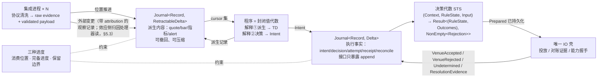

# 0 导读

本章说明 UTA 是什么、这套设计文档决定什么，以及阅读约定。

## 0.1 UTA 是什么、本文决定什么

UTA 是 Alice 与多个外部交易来源之间的独立核心进程。它做四件事：

- 接收集成层清洗后的能力、观察与效应记录；
- 向消费方提供一次性读和订阅；
- 接收带身份与依据的意图；
- 把执行过程与外部结果保真地记录和关联。

本设计决定：

| 内容 | 章 |
|---|---|
| 问题域与驱动 | §1 |
| 设计中心：记录与位置、两个类型宇宙（观察 \| 效应）与唯一边 | §2–§6 |
| 进程、存储、接口与归属边界 | §7、§8 |
| 走查与评估，用来验证上述决定 | §9、§10 |

每个决定的证据与替代就近登记。证伪条件与验收项在 §10 汇总。

### 一句话与四步

**UTA 记录看到了什么，计算可以做什么，受控地执行一次，再用证据确认发生了什么。**

订单、持仓、审批流、策略行为都是这四步的组合结果，不是核心实体。核心中不存在任何同时承载 provider 字段与业务状态的对象。[证据：fp-00 §1 五十三案例无一以大对象为中心；fp-02 命题 12]

四步各对应一个机制。机制之间只通过位置、键与日志记录关联。

| 步 | 机制 | 章节 |
|---|---|---|
| 看到了什么 | 载体 `Journal<Record, Delta>`，派生侧可撤回 | §2.3、§4 |
| 可以做什么 | 程序 = 封闭值代数，两种解释；出口是 effect 请求 | §4.3、§6.1 |
| 受控执行一次 | 单据 → 决策代数 STS → 唯一 IO 壳 | §6.2–§6.5 |
| 证据确认发生了什么 | `Undetermined` 的证据 gate + 恢复协议 | §6.6、§6.7 |

四步口号是开篇导览与场景视图的骨架，走查见 §9。它不是章节主线。主线是两个类型宇宙与它们之间唯一的边（§3）。

## 0.2 读者与状态

- **读者：** 以后实现 UTA 的实现者。
- **审批者：** 无。C3 原话为“读者是以后实现uta的人，没有审批”。
- **维护者：** 范围与状态确认者；维护者确认不会把本文误读成实现承诺。

**状态：已定。** §2–§8 全部已定：记录与位置、组合子值树与五个 fold、两个类型宇宙与唯一边、单据/STS/IO 壳、进程与契约归属（程序宿主 = 受监督子进程、会话 epoch、Alice 操作集、配置文件契约）。

- 依赖假设 H 的决定在 §10.4 有证伪条件。
- 需要实测的量都是 §10.5 的验收项，不是设计未决。
- 可选行情派生计算子系统的决定在 `hpc-derivation/design.md`，其验收标准在其 §10、证伪条件在其 §11。本设计只拥有它的接口（§8.7）。

## 0.3 范围与非目标

本设计的定位范围不包括：

- 不实现 UTA 或其集成；
- 不规定 crate 布局、文件布局或具体实现目录；
- 不承担 Alice 侧接入适配（包括旧 Alice 配置写入、重启触发和消费方迁移）；
- 不设计打包、发行和分发流程；
- 不重写 OpenAlice 中的旧 UTA、SDK、BFF、UI、connector 或其他旧代码。

这些边界来自进程与共享配置的划分（§7.1、§7.6），以及 C1 原话（本轮只做设计，不做实现与打包）。设计层面的“明确不做”集中在 §10.6。

## 0.4 阅读约定

**标签。**

- `[证据]`：来源直接支持的事实或原话。
- `[设计]`：在已有事实上的设计表达，必须紧跟理由。
- `[推断]`：由已列事实推出、但没有一手来源直接陈述的结论。

**编号。** `F` = 外部域事实，`O` = 既有机器事实，`S` = 利益相关者要求，`H` = 假设或威胁，`P` = 机器与域共享现象，`A` = 既有行为入口，`B` = 新增需求原话，`C` = 由事实推出的需求，`Q` = 质量场景。

**状态词。** 只使用 `已定`。依赖假设 H-n 的决定在 §10.4 给出证伪条件。会推翻决定的观测写在 §10.4，需要实测的量写在 §10.5；设计不登记待做实验。

**章节号。** 文件名前缀数字就是章号。`§N.M` 指 `design/core/` 下前缀为 N 的文件中的第 M 个二级标题。

**图。** `design/diagrams/*.md` 是本设计的图示视图（静态结构、状态机、假想运行时时序）。

- 每张图编号 `Dx.y` 并注明对照章节；正文相应章节以 `> 图：` 行指向它。
- 图只画正文已定的内容，不是设计来源。正文改了图随之改；图上出现正文没有的东西即图错。
- 正文→图的对照表在 `design/diagrams/README.md`。
