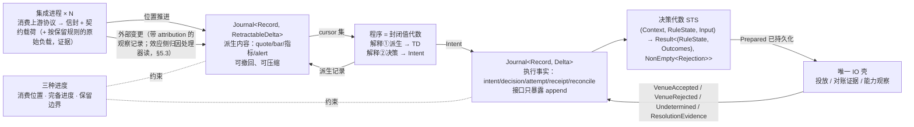

# 0 导读

本章说明 UTA 是什么、这套设计文档决定什么，以及阅读约定。

## 0.1 UTA 是什么、本文决定什么

UTA 是多个外部交易来源与下游（Alice、CLI 使用者、外部客户程序）之间的独立核心进程。它做四件事：

- 接收集成层清洗后的能力、观察与效应记录；
- 经解释层向下游提供一次性读和推流；
- 接收带身份与依据的意图；
- 把执行过程与外部结果保真地记录和关联。

本设计决定：

| 内容 | 位置 |
|---|---|
| 问题域与驱动 | §1 |
| 设计中心：记录与位置、两个类型宇宙（观察 \| 效应）与唯一边 | §2–§6 |
| 进程、存储、接口与归属边界 | §7、§8 |
| 走查与评估，用来验证上述决定 | §9、§10 |
| 核心之外的两侧：集成（清洗上游）、解释层（清洗成下游接口） | `design/integration/design.md`、`design/downstream/design.md` |

每个决定的证据与替代就近登记。证伪条件与验收项在 §10 汇总。

### 根本约束：权威不在 UTA

> 图：D1.1 进程拓扑、D2.1 一条记录进核心（`design/diagrams/01-process-topology.md`、`02-record-model.md`）。

UTA 经手的每一个值——订单、持仓、余额、行情——权威来源都在上游（券商、交易所），不在 UTA。[证据：F1] UTA 改不了不在自己手里的值，它手里只有**意图**：想观察什么、想怎样派生、想做什么、哪些可以放行。UTA 保存的任何上游值都只是某一时刻的观察，是原值的拷贝；把拷贝当原值用，就要不断和原值对齐，对齐没有尽头。[设计]

由此：

- UTA 只对自己的意图及其推进记录（执行事实，§3.1）有权威；其余一切是带来源与时间的观察。
- 设计中心的抽象都是意图的描述：值加解释器（§2.5、§4.3、§6.1）。描述在 UTA 内构造与检查，描述落到上游的动作只在集成里发生。
- 接触原值——读懂上游协议、在上游落实意图、判定上游的回应对某个意图意味着什么——只在集成里发生（§8.1）。越过集成进入 UTA 的，是契约值形式的结论与作证据保存的原文（§2.1）；UTA 内没有第二个消费上游的地方。

### 权威源头与生命周期

上节说明权威在哪里，本节规定设计中每一处状态如何照此落地。它是核心的设计原则：每个类型、记录、协议与机制在写进设计之前先过这一节；过不了的不写，改掉划分而不是加机制。[设计]

- **权威。** 每项状态只有一个源头，即创建并维护它的一方。UTA 只是自己所创建之物的源头：意图、决策、写边界与执行事实，核心日志上的位置与保留边界，订阅与消费位置，核心自己的调用及其结果。其余状态（订单、持仓、余额、行情、上游能力、上游历史的完备与否）只向源头请求并等待结论，不越过源头管理其内部。
- **记录的性质。** 每条记录只属一类：UTA 作为源头的事实；从源头取回的副本，只代表取回那一刻；索引或意图，指向对象或表达将做之事。三类分开对待。副本不当作源头此刻的值，索引与意图不当作状态。落在只追加的日志里不改变一条记录的类别：永存的证据仍是取回那一刻的副本。
- **同步等待。** 需要知道或改变非自有状态时，经集成向源头请求，等源头的结论，再依结论记录。不先改自己的记录再去对齐，不以就近可得的数据（到达顺序、本地时钟、另一条记录）推断源头的状态。源头给不出结论时，结论就是“未确立”：依赖它的判断 fail-closed，不以启发式补上。
- **生命周期。** 有生命周期的对象，先写清它的开始与结束锚点，以及确认各锚点的一方，再判断嵌套。调用顺序由生命周期决定：内层在外层之内开始；结束外层前先结束其全部内层，最后写外层的结束锚点。
- **近处副本。** 以上成立之后，才可以为有实据的性能需要在源头之外加更近的副本（快照、内存 fold、读模型）。每个副本写清派生自哪个源头、依赖什么、何时失效、由谁如何刷新；它只加速读取，不成为新的源头。
- **机制即信号。** 需要锁、标志位、仲裁、补偿或对账才能保持一致，说明权威、记录性质或生命周期的划分有误，回到这三处修正。向上游询问一次写的未知结果并等待其结论，属于同步等待，不是对账补偿。

### UTA 不含业务

UTA 提供的是记录、类型、规则链与写边界；业务在二次开发时用它们组装，不在 UTA 里。[设计]

- **业务**：策略与信号、风控与审批规则的具体内容（阈值、谁来批）、下单的组合方式（仓位怎么算、分几笔、撤了再下的时机）、指标、告警、组合视图。它们是程序（§4.3、§6.1）、规则文件（§7.6）或下游自己的代码。
- **写侧的基本类型**：写意图要有类型，信封与 STS 才有可说的概念；一个类型都不给，锚点、守卫、审批与 lane 都无从成立。订单（交易协议，§2.2）是预置的写侧基本类型；需要时可以再加，走意图类型的扩展轴（§6.2 新意图类型 = 新检查集；§8.3 轴 B），核心代数不变。基本类型只含核心代数实际读取的字段，不是上游订单记录的拷贝（见下节“一句话与四步”）；没有处理器读的下单参数（如订单类型、time-in-force、来源专有选项）是意图的载荷，核心不读，原样交给集成（§2.1）。
- **读侧是反向代理**：持仓、余额、成交、行情等观察按契约载荷 schema 直通，载荷是什么类型不影响核心语义（§2.1）。公共 schema 服务于下游，核心不依赖它。

### 三段：清洗、抽象、清洗

> 图：D1.1 进程拓扑（`design/diagrams/01-process-topology.md`）。

抽象只在核心里。核心两侧各有一层明确的接口清洗，都不是抽象的延伸：

- **集成**把上游协议清洗成契约值（§8.1；`design/integration/design.md`）。
- **解释层**把核心的操作、记录与状态清洗成下游能懂的接口：一次性命令与双向长连接。核心概念（位置、链、单据版本、能力三值等）不出现在对外面上（`design/downstream/design.md`）。
- 核心↔解释层的契约（§8.5）可以是抽象的，因为它的消费者只有解释层；跨仓库交付的是解释层的对外面。

### 一句话与四步

**UTA 记录看到了什么，计算可以做什么，受控地执行一次，再用证据确认发生了什么。**

订单的状态、持仓、审批流、策略行为都是这四步的组合结果，不是核心实体。核心中不存在任何同时承载 provider 字段与业务状态的对象：那样的对象就是上游原值的拷贝（见上）。写侧基本类型“订单”是意图的类型，只含核心代数实际读取的字段（§2.1 推论 1），不是这样的对象。[证据：fp-00 §1 五十三案例无一以大对象为中心；fp-02 命题 12]

四步各对应一个机制。机制之间只通过位置、键与日志记录关联。

| 步 | 机制 | 章节 |
|---|---|---|
| 看到了什么 | 载体 `Journal<Record, Delta>`，派生侧可撤回 | §2.3、§4 |
| 可以做什么 | 程序 = 封闭值代数，两种解释；出口是 effect 请求 | §4.3、§6.1 |
| 受控执行一次 | 单据 → 决策代数 STS → 唯一 IO 壳 | §6.2–§6.5 |
| 证据确认发生了什么 | `Undetermined` 的证据 gate + 恢复协议 | §6.6、§6.7 |

四步口号是开篇导览与场景视图的骨架，走查见 §9。它不是章节主线。主线是两个类型宇宙与它们之间唯一的边（§3）。

## 0.2 读者与状态

- **读者：** 以后实现 UTA 的实现者。
- **审批者：** 无。K3 原话为“读者是以后实现uta的人，没有审批”。
- **维护者：** 范围与状态确认者；维护者确认不会把本文误读成实现承诺。

**状态：已定。** §2–§8 全部已定：记录与位置、组合子值树与五个 fold、两个类型宇宙与唯一边、单据/STS/IO 壳、进程与契约归属（程序宿主 = 受监督子进程、会话 epoch、核心↔解释层操作集、配置文件契约）。集成与解释层两份文档同为已定。

- 依赖假设 H 的决定在 §10.4 有证伪条件。
- 需要实测的量都是 §10.5 的验收项，不是设计未决。
- 可选行情派生计算子系统的决定在 `hpc-derivation/design.md`，其验收标准在其 §10、证伪条件在其 §11。本设计只拥有它的接口（§8.7）。

## 0.3 范围与非目标

本设计的定位范围不包括：

- 不实现 UTA 或其集成；
- 不规定 crate 布局、文件布局或具体实现目录；
- 不承担 Alice 侧接入适配（包括旧 Alice 配置写入、重启触发和消费方迁移）；
- 不设计打包、发行和分发流程；
- 不重写 OpenAlice 中的旧 UTA、SDK、BFF、UI、connector 或其他旧代码。

这些边界来自进程与共享配置的划分（§7.1、§7.6），以及 K1 原话（本轮只做设计，不做实现与打包）。设计层面的“明确不做”集中在 §10.6。

## 0.4 阅读约定

**标签。**

- `[证据]`：来源直接支持的事实或原话。
- `[设计]`：在已有事实上的设计表达，必须紧跟理由。
- `[推断]`：由已列事实推出、但没有一手来源直接陈述的结论。

**编号。** `F` = 外部域事实，`O` = 既有机器事实，`S` = 利益相关者要求，`H` = 假设或威胁，`P` = 机器与域共享现象，`A` = 既有行为入口，`B` = 新增需求原话，`C` = 由事实推出的需求，`K` = 约束与偏好（§1.5），`Q` = 质量场景。

**状态词。** 只使用 `已定`。依赖假设 H-n 的决定在 §10.4 给出证伪条件。会推翻决定的观测写在 §10.4，需要实测的量写在 §10.5；设计不登记待做实验。

**章节号。** 文件名前缀数字就是章号。`§N.M` 指 `design/core/` 下前缀为 N 的文件中的第 M 个二级标题。

**图。** `design/diagrams/*.md` 是本设计的图示视图（静态结构、状态机、假想运行时时序）。

- 每张图编号 `Dx.y` 并注明对照章节；正文相应章节以 `> 图：` 行指向它。
- 图只画正文已定的内容，不是设计来源。正文改了图随之改；图上出现正文没有的东西即图错。
- 正文→图的对照表在 `design/diagrams/README.md`。
