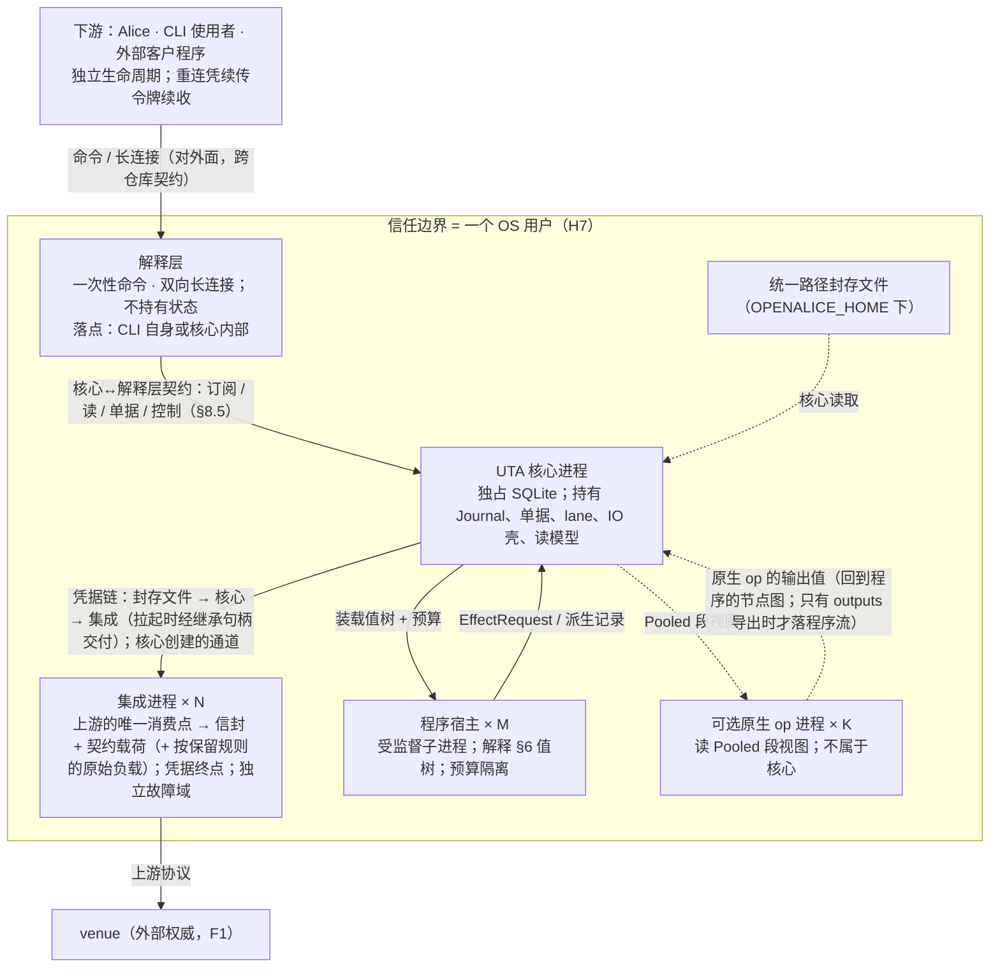
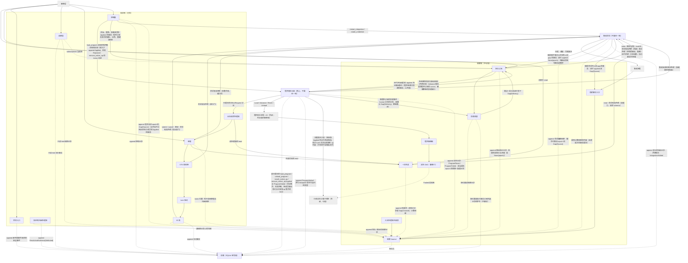

# 7 进程、模块与存储

§2–§6 定义了类型与抽象。本章把它们分配到进程、模块与存储：谁拥有什么、每份状态谁写谁读；接口承诺见 §8。

## 7.1 进程、信任边界、单实例

> 图：D1.1 进程拓扑、D7.3 脑裂/孤儿（`design/diagrams/01-process-topology.md`、`07-crash-recovery.md`）。

UTA 是独立的核心进程，不随 Alice 生命周期绑定。

- 核心、每个集成、每个程序宿主、可选子系统的每个原生 op 都是独立 OS 进程。
- 下游（Alice、CLI 使用者、外部客户程序）只经解释层接触核心。Alice 是下游之一，不是核心的父进程或守护者。
- 解释层落在 CLI 自身还是核心内部由实现定：它不持有状态，落点不改变外部行为（`design/downstream/design.md` 3.3）。

### 独立生命周期

核心独立启动、独立存活、独立停止；停止按生命周期的嵌套进行（受控停止，§7.2）。下游或解释层退出、崩溃或重启，均不改变核心的订阅、程序、lane 与日志：订阅与程序的 owner 是核心（来源：H5/C5）。

断连期间的投递损失按 gap 语义显式标记（§4.2），不伪造连续性。

### 信任边界是 OS 用户（H7）

- 本机非本用户的进程不可信；本用户的进程视为用户本人（它们本就能读该用户的文件与进程环境）。
- 同机进程能连到核心**不等于**有权发写：写权限来自认证得到的 principal × 策略 scope，不来自连接。解释层的对外端点沿用同一边界。
- 理由：核心是独立进程后，IPC 成为正式边界；而 UDS 对端凭据 / 命名管道 ACL 的粒度都是 OS 用户。
- 代价：同用户进程之间不互相隔离。若要求进程间隔离，则需能力令牌 / 管道句柄传递，这是一条升级路径。
- 证伪条件见 §10.4 #8：维护者要求同用户进程互相隔离，或接受“host 即信任边界”。

### 凭据链

`统一路径封存文件 → UTA 核心 → 该集成进程`（来源：C7）。凭据的源头是 Alice 写的封存文件；集成进程持有的是一份交付给它的副本。

- 凭据只出现在这条注入链上；程序与消费方只见账户身份。
- **交付** [设计]：核心在拉起集成进程时读封存文件、解封，把凭据写进一个只交给该子进程的继承句柄，写完关闭己端；集成读出后关闭它。核心不持久化解封后的凭据。这份副本的生命周期就是该进程的生命周期：它随进程的 OS 确认退出而结束（§7.2 生命周期表）。
- **换凭据** = 终止该集成进程 → OS 确认它退出 → 以重新读取的封存文件拉起新进程（§7.6 `rotate_credential`）。副本不在运行中的进程里替换，所以任一时刻一个集成至多有一个进程持有凭据，旧副本的结束由 OS 确认。
- 集成进程是凭据终点，也是独立故障域。
- 不选：**握手或专门的 IDL 消息携带凭据**：凭据在会话里交付，就要另定会话内换凭据的确认与旧副本的丢弃，而丢弃发生在集成进程内部，核心无从确认；**环境变量或启动参数**：同用户的其他进程能从进程表读到。

### 单实例

只写三条可推出的事实：

1. **共享配置走文件**：账户封存信封、封存密钥引用、集成登记、策略 / 审批规则、程序装载清单，写入 `OPENALICE_HOME` 下的统一路径。核心与 Alice 均从文件读取，不经进程间注入、环境变量或启动参数传递（§7.6）。
2. **单实例由锁保证**：同一用户状态根（`OPENALICE_HOME`，`existing-capabilities.md:239`）只允许单实例运行，由 OS 文件锁 + fence 保证（H10）。
   - 第二实例以专用退出码拒绝启动，不做接管。
   - 孤儿实例（父进程死而子进程活）是真实威胁（H10），由 fence 回收（§7.2）。
3. **SQLite 独占**：核心进程独占持有 SQLite 文件，H10 的 OS 文件锁与 SQLite 锁同向生效。SQLite 与锁文件是核心独有写者的文件，位于同一用户状态根下；具体路径是实现目录（§0.3 非目标）。

### 传输按 OS 选择

- 核心↔集成、核心↔解释层的语义由一份 IDL 固定（§8）。核心↔集成部分随 release 发布给集成作者（`design/integration/design.md` 第 4 节）；核心↔解释层部分只在本仓库内部。IDL 之下的编码与信道按 OS 选择。
- 解释层的对外面（命令与长连接消息协议）另有 schema，随 release 发布，是跨仓库契约（§0.1）。
- **核心↔集成的信道由核心创建** [设计]：核心拉起集成进程时创建一条通道，把一端经句柄继承只交给该子进程（macOS、Linux 为 `socketpair`；Windows 为匿名管道对，经继承句柄列表只交给该子进程）。它不是可被连接的端点，别的进程连不上它；核心关闭己端之后，从这条通道再也读不到任何消息。会话就是这条通道的一次化身（§7.2）。
- 核心↔解释层：Windows 缺少 UDS，传输层退化为本地回环 + 本地令牌或命名管道。这只改编码 / 信道，**不改 IDL**。
- 默认文本序列化 JSON-RPC：跨语言、可读、可录制回放。
- §10.5 #19 的负载下推送流不达标时，另加二进制编码，定位为同一 IDL 的另一种编码，而非第二套协议。

### 集成崩溃

集成崩溃有观察流侧与写提交侧两个故障面，并列、不混为一谈。判别边界与收敛见 §6.7。

## 7.2 生命周期、启动与停止、会话 epoch

> 图：D1.2 启动五步、D1.3 集成的会话状态、D1.6 生命周期嵌套与受控停止（`design/diagrams/01-process-topology.md`）。

### 生命周期与嵌套 [设计]

启动与停止的调用顺序由下表推出：内层在外层之内开始；结束外层之前先结束它的全部内层，最后写外层的结束锚点。每个锚点写明确认者；只在内存里的对象，锚点由持有它的核心元素确认。

| 对象 | 开始锚点（确认者） | 结束锚点（确认者） | 外层 | 留下的持久痕迹 |
|---|---|---|---|---|
| 核心实例 | 第 1 步 fence 事务：OS 文件锁 + SQLite 独占 + `instance_id` 加一（OS、SQLite） | 受控停止：全部内层结束之后写的实例结束锚点，之后释放 fence（核心，见下文“受控停止”）；崩溃：没有结束锚点，继任实例取得 fence 的事务提交就是它的失权点（OS 随进程释放锁，继任者确认） | — | 实例表：每个 `instance_id` 一行，受控停止时带结束锚点 |
| 消费方会话 | `handshake(contract_version, actor)` 返回 `Session`（OS 对端凭据，§8.5） | 传输关闭：对端关闭，或受控停止第 1 步由会话入口关闭；实例死亡（核心） | 核心实例 | 无；它不拥有订阅、单据与在途读（§8.5） |
| 集成运行（每个采纳的集成登记 × 实例） | 让一个采纳的集成进入初始状态的 `Connecting` 会话健康观察：第 3 步为它写的那一条，或 `restart_integration` 采纳一个本实例尚未运行的 id 时与其 `Applied` 同一事务的那一条；或解除 `Halted` 的 `Applied` 事务（与其 `Connecting` 健康观察同一事务，只在上一次运行结束之后提交）（集成会话、控制面） | `Halted` 路径：`IntegrationHalted` 之后，该会话已结束、最后一个集成进程 OS 确认退出并清除它的进程表行，这次清除就是运行的结束锚点（OS；核心在确认之前崩溃的，由继任实例第 1 步回收确认）；或实例结束：受控停止的实例结束锚点、崩溃后继任者的 fence。`Connecting` 中换进程不结束运行 | 核心实例 | 会话健康观察、`IntegrationHalted`；结束之后进程表里没有它的行 |
| 集成进程 | 拉起并写进程表 `(instance_id, pid, start_time, role)`（OS） | OS 确认退出之后清除该行（OS）；本实例没来得及确认的，由继任实例第 1 步回收（OS） | 集成运行；同一集成同时至多一个：下一个进程在上一个 OS 确认退出之后才拉起 | 进程表 |
| 凭据副本 | 拉起时经继承句柄交付（核心写入后关闭己端，§7.1 凭据链） | 该进程 OS 确认退出（OS） | 集成进程 | 无 |
| 集成会话（通道化身） | 拉起时核心创建通道并为它分配 `SessionEpoch`（核心，§7.1） | 在途调用恰好完成一次，再丢弃它的全部未了 `route` 义务，然后核心关闭通道（核心；关闭之后读不到该化身的任何消息） | 集成进程：一个进程恰有一个会话，会话在进程之内结束 | 核心 append 的记录带它的 `SessionEpoch`（见下文“会话 epoch”） |
| `Established` | 握手返回合法投影：声明版本与 `Established` 健康观察同一事务（集成会话） | 会话结束（集成会话） | 集成会话 | 声明版本、会话健康观察 |
| 流 epoch（集成来源的每条逻辑流） | 该流一条开 epoch 的 `Gap{origin: Source}`：握手时集成不能以 venue 游标证明续接，由集成会话在握手事务里 append（§8.2 `handshake`）；或会话内由集成上报开 epoch 的 `Gap{origin: Source}`（供给中断、`schema_change` 等），核心按通道次序接受（§8.3、§8.4“会话内开的新流 epoch”）。边界由集成确认，身份 `StreamId.epoch` 由核心分配 | 该流下一条开 epoch 的 `Gap{origin: Source}`，它同时开始下一个 epoch（确认者同左）；`backfill_incomplete` 是 epoch 内标出回填未覆盖区间的记录，不结束也不开 epoch（§4.2）；会话结束与实例更替本身不结束它 | 不嵌在实例或会话里：握手以游标续接时跨会话、跨实例延续 | 流上的 `Gap{origin: Source}` |
| 流 epoch（程序产出的每条派生流） | 开始一个不沿用旧状态的成员的 `Applied` 事务里、该流的 `Gap{origin: Source}`，只写在这个成员的程序流上：让程序 id 进入活动集合的 `load_program`（首次装载，或 `unload_program` 之后再装载）带 `reason: start`，不沿用旧状态的替换带 `reason: program_upgrade`；该 id 下第一次被声明的流，这条 gap 无前驱（控制面；身份 `StreamId.epoch` 由核心分配，§8.6 程序流的 epoch） | 该流下一条开 epoch 的 `Gap{origin: Source}`：同一程序 id 此后第一个声明该流、不沿用旧状态的成员开始时，写在它的 `Applied` 事务里，同时开始下一个 epoch（控制面）；`unload_program` 不结束它，卸载期间流上没有记录；开始的成员不声明该流时也不结束它，流上同样不再有记录；沿用旧状态的替换（输出契约不变）与实例更替也不结束它 | 不嵌在实例或程序成员里 | 流上的 `Gap{origin: Source}` |
| 核心→集成的在途读侧调用（`read`、`backfill`、`route`） | 经通道发出（集成会话，内存）。发出时这条流的当前流 epoch 是它的发出 epoch：`read` 由 `dispatch_end` 记下，`backfill` 是任务所在的 epoch，`route` 由它所带的 `generation` 指名（§8.2） | 封闭返回值（集成；它在上报 `Gap{origin: Source}` 之前以 `Unavailable` 完成已收到的这类调用，§8.3）；会话结束时的强制完成（集成会话）；实例崩溃时随实例结束，结束锚点即继任者的 fence 事务，调用结果无从记录，由发起方按各自规则重来。结果按发出 epoch 准入：`read`、`backfill` 的结果到达时发出 epoch 已结束的，调用仍以这个返回值结束，核心不准入它、记为 `Unavailable`（§8.2 两者的“错误”）；`route` 所带 `generation` 早于集成最近上报的，集成答 `Unavailable`、供给不变（§8.2 `route`） | 集成会话。发出 epoch 是调用的属性，不是外层：流 epoch 何时结束由集成决定，与核心的调用互不等待，集成送出 gap 时仍在通道上的调用只能在 gap 之后结束（§8.4“会话内开的新流 epoch”） | 结果记录与计数观察同一事务 |
| 核心→集成的 `route` 义务（每条逻辑流至多一项） | 会话建立时，为需求非空的流各起一项；会话已建立期间，核心接受该流一条会话内上报的 `Gap{origin: Source}`，或该流的需求变化时起一项，已有则并入（持久订阅元素，内存，§8.2 `route`“谁调、何时调”） | 第一次 `Routed`（持久订阅元素）；会话结束：在途调用完成之后、关闭通道之前丢弃，不再重发（持久订阅元素）；实例崩溃时随实例结束 | 集成会话：没有已建立的会话就没有义务，需求变化只改变需求；它逐次发出的 `route` 是上一行的调用 | 无；`Routed` 的路由结论记录是那次调用的结果 |
| 核心→集成的在途写与取证调用（`submit`、`cancel`、`query_by_key`、`list_open`、`list_fills`、`replay_by_key`） | 经通道发出（集成会话，内存） | 封闭返回值（集成）；会话结束时的强制完成（集成会话）；实例崩溃时随实例结束，结束锚点即继任者的 fence 事务，调用结果无从记录（写由第 2 步记为 `Undetermined(CrashWindow)`，取证由 IO 壳按恢复规则重做，§6.7） | 集成会话：按作用域寻址，不是流 epoch 的内层；跨过流 epoch 更替的回答按 §8.1 来源顺序第 1 条处理 | 结果记录与计数观察同一事务 |
| 程序（活动集合的成员） | `load_program` 的 `Applied`：钉住内容 hash，以值记下预算、接受的 `state_version`、执行事实输入（各 `FactDecl`）、引用的原生 op 名集合与输出契约（`(name, 值类型)` 集合）；替换时同一个 `Applied` 结束旧成员、开始新成员（控制面，§8.6） | `unload_program` 的 `Applied`，或替换它的那个 `Applied`（控制面）；只在它的宿主执行已结束之后 append：停止调度 `Advance`、在途输出事务已提交或确知不提交、宿主 OS 确认退出（§8.6 卸载与替换）；替换的沿用判定读开始它的 `Applied` 所记的输出契约，执行事实流 cursor 的沿用读新旧两条 `Applied` 所记的执行事实输入 | 不嵌在实例里：跨实例持续 | 控制记录（控制流） |
| 程序订阅（程序的输入 cursor 与观察项） | 让程序 id 进入活动集合的 `Applied`（首次装载，或 `unload_program` 之后再装载）同一事务建立：按各输入声明的起点建立 cursor（`Tail` 为 `At`，`Origin` 为 `Start{from}`），每条观察输入按声明的用途成为一个观察项，按 §8.5 判定接纳（持久订阅元素，在控制面的 `Applied` 事务里，§8.6 程序的输入）。替换保留它：沿用旧状态时共有输入的 cursor 原样沿用，项只在主体集与用途也相同、且不是被拒的项时沿用，否则同一事务结束旧项、建立并接纳新项；执行事实流按流：新旧成员的 `facts` 都选中的流 cursor 原样沿用，只有新成员选中的按其 `FactDecl` 的起点建立（§8.6 cursor 的生命周期） | `unload_program` 的 `Applied`（持久订阅元素，同一事务）。其中的项与 cursor 另可在替换的 `Applied` 里结束：新程序不再声明的输入（项与 cursor 都结束）；只有旧成员的 `facts` 选中的执行事实流（cursor 结束）；主体集或用途变了的项，以及被拒的项（初次接纳被拒的项从不沿用，任何替换的 `Applied` 都结束它并在同一事务建立新项、重新判定接纳；它的 cursor 照沿用规则接着走，项的结束锚点与 cursor 的不同）；不沿用时同一事务按 `Reset` 重建全部项与 cursor | 程序 id 在活动集合里的时段：跨替换，不嵌在单个成员里 | 订阅表：项、cursor 与投递缺口（缺口随 cursor，不随项，§4.2）；cursor 只由 `Advance` 的提交推进，与 `Checkpoint` 同事务，`Start{from}` 在第一次提交时成为 `At`（前导的结束锚点，§4.2） |
| 程序宿主执行 | 拉起并写进程表，`Load`（OS、宿主） | `Unload` 或终止之后 OS 确认退出、清除该行（OS）；继任实例回收 | 程序成员 ∩ 核心实例 | 进程表 |
| `Checkpoint` 的保留引用 | 进入活动集合之后的第一个 `Checkpoint`，与 cursor 同一事务（核心） | 下一个 `Checkpoint` 取代它；`unload_program` 的 `Applied`，或不沿用旧状态的替换 `Applied` 解除；沿用的替换原样转给新成员（核心，§2.4）；宿主的 `Unload` 与失败抑制不解除它 | 程序成员 | 引用登记 |
| 已安装的原生 op（每个 op 名） | `install_native_op` 的 `Applied`：以值记下 op 名、声明的签名、`artifact` 引用（原生计算制品目录里的文件，§7.6）、安装时读到的内容 hash 与 principal（控制面，§8.7 原生 op 的安装） | 以同名移除它的 `remove_native_op` 的 `Applied`（控制面）；活动集合里有成员的 `Applied` 所记的原生 op 名集合含它时移除被拒（`InUse`），所以它不先于引用它的成员结束 | 不嵌在实例里：跨实例持续；子系统在不在是实例的运行期事实，不是它的外层；制品文件由 Alice 管理，每次拉起引用它的宿主之前由核心重读核对（§8.7 原生 op 的执行） | 控制记录（控制流） |

表外还有几种不嵌在实例里、跨实例持续的对象，都是核心作为源头的持久事实，由记录的 fold 恢复：`Halted` 抑制（`IntegrationHalted` 起，以位置引用它的解除 `Applied` 止）、程序的失败抑制（`ProgramHalted` 起，以位置引用它的 `load_program` `Applied` 止，§8.6）、集成登记的采纳（下文第 3 步），这三者都在控制流上（§7.3）；以及消费方的订阅（归属 principal，止于 `unsubscribe`，§8.5；程序订阅见上表）、单据（止于 `Close`，§6.2）。

启动顺序由这张表与存储归属（§7.4、§7.5）、写边界恢复（§6.7）推出。失败分两级 [设计]：

- **核心级**：核心自身不能安全运行时整体拒绝启动，不进入部分运行态。只有四种：第 1 步取不到 fence（专用退出码，此时无权写 SQLite）；第 2 步格式版本校验或迁移失败（C14）；第 2 步从快照 + 记录重建失败（状态重建不出，核心就无法判定哪些写可能已经发出）；第 3 步读取统一路径配置失败（§7.6、C14）。后三种以专用退出码与诊断报告原因。
- **单元级**：只涉及一个集成或一个程序的失败，只使该单元不可用，其余照常启动：集成处于 `Connecting` 或 `Halted`（第 3 步会话状态）；程序声明校验失败、被失败抑制，或所引用的集成来源（含只被 `facts` 引用的来源）在采纳集合里而还没有声明版本、因而等待（§8.6 装载期校验）。

理由：集成与程序宿主各是独立故障域（§7.1、§8.6）；一个 venue 不通就让全部账户与程序停摆，违背 Q15、Q18 的隔离。C14 管的是持久格式与迁移，不管集成是否可用。

### 1. 取 fence

- OS 文件锁 + SQLite 独占（H10）。取不到即以专用退出码退出（§7.1）。
- 锁由进程持有、随进程消亡，所以取到 fence 蕴含旧核心已退出。仍可能存活的，是它拉起的集成进程与程序宿主进程（H10 的孤儿）。
- 取到 fence 即在 SQLite 实例表中写入新一行，`instance_id` 加一。`instance_id` 是单调递增的实例序号，与 fence 同事务持久化。上一实例若没有结束锚点，这一事务就是它的失权点：它的全部会话与在途调用随之结束。

**回收孤儿：**

- 核心拉起的每个集成进程与程序宿主进程，都以 `(instance_id, pid, start_time, role)` 登记在 SQLite 进程表（§7.5）。进程表是指向 OS 进程的索引：进程的存亡只问 OS，按 `(pid, start_time)` 核对。
- 新实例对旧 `instance_id` 名下、`(pid, start_time)` 仍匹配的进程，先请求退出，超时后强制终止，OS 确认它已退出之后清除该行。受控停止之后这里没有要回收的行。
- 未登记或匹配失败的孤儿也无法造成双写：它的通道只通向已经退出的旧核心，新实例从不读它（§7.1），且它不接触 SQLite（单写者，§7.4）。

### 2. 从记录重建

- 校验格式版本（C14），失败拒绝启动。
- 从快照 + 记录 `fold_state` 重建各尝试、单据、订阅表与程序的活动集合（§8.6）；重建失败拒绝启动。
- IO 壳按恢复规则（§6.7）把 `SendBarrier` 无后继者 append 为 `Undetermined(CrashWindow)`。

这一步**不接触任何集成**：恢复结论只来自记录，不依赖外部回音。

### 3. 采纳集成登记，建立会话

读统一路径配置（§7.6）。集成登记只在两种时刻读取：本步，与 `restart_integration(id)` 生效时（§8.5）；文件变了而没有这两种时刻，核心不重读。

- **采纳** [设计]：本步读到的集成登记，由集成会话 append 一条采纳记录（执行事实）：该文件的内容 hash 与其中列出的集成 id；启动时没有运维 principal，发起方记为本实例（`instance_id`）。`restart_integration(id)` 的 `Applied` 带它所读文件的内容 hash 与生效时的 `instance_id`，采纳的只是该 id 的条目（§8.5）。二者都在**控制流**上（见下文“控制流”）。一个切面（`as_of` 在控制流上的位置）的**采纳集合** = 该位置及以前最近一条采纳记录列出的 id，并上它之后、该位置及以前、`instance_id` 与它相同的各 `restart_integration` `Applied` 采纳的 id；本实例当前的采纳集合即流末的切面。它只由控制流这一条流按位置 fold 出，不比较不同流上记录的先后；健康面按它列出集成（§8.4、§8.5 `health`）。采纳记录是“本实例按哪一版登记运行”这件核心自己的事实；登记内容的源头仍是 Alice 的文件。
- **集成 id 的稳定是 Alice 的义务** [设计]：同一 id 始终指同一个集成，用过的 id 不再给另一个集成，与 `account_ref` 同形（§2.2）。核心查不出复用：被复用的 id 会接上旧 id 的声明历史、健康键、`Halted` 抑制与订阅。
- **被移除的登记** [设计]：上一版采纳里有、这一版没有的 id，在本实例没有集成运行：不拉起进程、没有会话、不产生新的声明版本。它已有的流记录、声明历史、健康观察与订阅都保留；核心不为它补写任何记录，也没有“已退役”一类的锚点或状态。要来源自己供给或作答的新请求（一次性读、供给项）对它按“来源未登记”判定（“登记”指本实例的采纳集合，§8.5）；只读 UTA 自己日志的新订阅项（只投递项、执行事实 selector）只按声明历史判定，不看采纳集合，所以它的历史仍可订阅审计（§8.5 订阅组）。健康面只列采纳集合里的集成（§8.4）。之后的采纳里重新出现这个 id，就是这个集成再次运行。
- **运行中改文件**：文件里新加的 id，经 `restart_integration(id)` 采纳并开始运行：其 `Applied` 带文件 hash，与该集成转入 `Connecting` 的健康观察同一事务，这一条就是它在本实例的运行的开始锚点，提交之后才拉起进程；从文件里删去的 id，本实例的运行照常继续，对它的 `restart_integration` 因 id 不在文件里得 `Rejected`、不改变它，下一次启动时它按“被移除的登记”处理。核心不因文件变化自行增减运行。

每个采纳的集成有一个由集成会话元素（§7.3）运行的**会话状态** [设计]：

| 状态 | 含义 | 核心的行为 |
|---|---|---|
| `Connecting` | 本实例的集成运行在进行，还没有已建立的会话；可自动恢复 | 没有进程时拉起集成进程（上一个进程 OS 确认退出之后），随之创建通道、分配新的 `session_seq`（§7.1）；在这条通道上握手（§8.2），`Unavailable` 按 pacing 在同一通道上再握手；通道断开或进程退出，该会话结束，进程 OS 确认退出之后按 pacing 拉起下一个 |
| `Established(SessionEpoch)` | 会话已建立 | 只读这条通道；核心给读入的记录盖上它的 `SessionEpoch`；IO 壳可对它发写与取证（发出前门，§6.5） |
| `Halted{cause}` | 没有会话；自动握手被抑制，需要人处理 | 不拉起、不握手；进程的终止是另一个生命周期的结束（见下文“进入 `Halted`”） |

`cause ∈ {ProjectionInvalid, ContractIncompatible, Refused(reason)}`：前两种由核心判定握手交来的投影不合法、契约版本不兼容；`Refused` 是集成报告上游明确拒绝了该登记的身份或配置（§8.2 `handshake`）。

本步各集成独立推进，不等全部集成建立会话。持久为 `Halted` 的集成（见下文“`Halted` 的持久化”）保持 `Halted`，不拉起；其余一律以本实例进入 `Connecting`。旧实例的会话不延续：它们已随旧实例结束（第 1 步）。

**转移（穷尽）：**

| 当前 | 事件 | 结果 |
|---|---|---|
| `Connecting` | 握手返回合法 `Projection` | `Established`：集成会话编排这一事务：append 该握手的声明版本（§7.5）与 `Established` 健康观察；各流按 §8.2 决定续 epoch 或开新 epoch，开新 epoch 的流由集成会话 append 新 epoch 首条的 `Gap{origin: Source}`（含 `rotate_credential` 强制的 `credential_rotated`），并请持久订阅在同一事务 append 该逻辑流的 `None{epoch}` 回填进度（§8.4），把待接纳的订阅项（含程序订阅的项）按新声明转为接纳或被拒（§8.5 订阅组）；第 4、5 步中与它有关的恢复随之进行 |
| `Connecting` | 握手返回 `Unavailable` | `Connecting`（同一会话，按 pacing 再握手） |
| `Connecting` | 通道断开、集成进程退出 | `Connecting`（该会话结束；进程 OS 确认退出之后，按 pacing 拉起新进程与新会话） |
| `Connecting` | 投影不合法 / 契约版本不兼容 | `Halted{ProjectionInvalid}` / `Halted{ContractIncompatible}` |
| `Connecting` | 握手返回 `Refused(reason)` | `Halted{Refused(reason)}` |
| `Established` | 通道断开、集成进程退出（含集成因上游在会话中拒绝身份而结束会话，§8.3） | `Connecting`（同上） |
| `Connecting` / `Established` | `rotate_credential` 或 `restart_integration` 生效 | `Connecting`：结束该会话、终止进程，OS 确认退出之后拉起新进程（重读封存文件；`restart_integration` 另重读该 id 的登记条目）；`rotate_credential` 另强制各流开新 epoch（§7.6） |
| `Halted{Refused}` | `rotate_credential` 或 `restart_integration` 生效 | `Connecting` |
| `Halted{ProjectionInvalid}` / `Halted{ContractIncompatible}` | `restart_integration` 生效 | `Connecting` |
| `Halted{ProjectionInvalid}` / `Halted{ContractIncompatible}` | `rotate_credential` | 不转移，控制记录 `Rejected`：要重新拉起只经 `restart_integration`，届时照常读凭据文件 |

- 一条通道上的握手是串行的：上一次返回之前不发下一次；旧会话的通道已关闭，它的握手结果读不到。所以没有“别的握手结果”要识别或丢弃。
- 未生效的控制动作（越权、文件不合法、id 不在登记里，§8.5）不转移。
- 状态每改变一次（`Connecting → Connecting` 不算），集成会话 append 一条会话健康观察（新状态、原因、起始时间；`Established` 带它的 `SessionEpoch`，§8.4）。集成进入初始状态时也 append 一条：本步的各集成（`Connecting`，或恢复的 `Halted`），以及 `restart_integration` 采纳的本实例尚未运行的 id（与其 `Applied` 同一事务）。这样的 `Connecting` 一条就是本实例该集成运行的开始锚点。readiness 不另写：它只在最近一条会话健康观察为 `Established` 时，取同时带着该会话的 `SessionEpoch` 与该流当前流 epoch 的值（没有这样的值为 `Starting`），否则由 fold 派生为 `Disconnected`（§8.4），所以旧实例、旧会话与旧流 epoch 的 `Live` 都不会延续。
- **进入 `Halted`** [设计]：集成会话在同一事务 append 执行事实 `IntegrationHalted{integration, cause, session_epoch}`（P14）与该 `Halted` 的健康观察。`IntegrationHalted` 断言的是核心自己的决定：该集成失去被接受的资格，本实例与此后各实例都不再自动握手，直到运维动作解除；它开始的是 `Halted` 抑制，不是本次集成运行的结束，也不断言进程已经退出。提交之后才清理：结束该会话（此时只有已返回的握手，没有别的在途调用）、关闭通道、请求进程退出，超时后强制终止，OS 确认退出之后清除进程表的行。这次清除是本次集成运行的结束锚点：运行的内层（会话、进程、凭据副本）都已结束。清理的确认者是 OS；核心在确认之前崩溃的，由继任实例第 1 步回收。集成登记、该集成已有的流记录与订阅不变。
  - 理由：先终止再记录，则二者之间崩溃会让重启自动重试（持久的 `Halted` 还没写下）；把“进程已终止”写进 `Halted` 的含义，又让持久记录先于它所断言的事实。所以 `Halted` 只记核心的决定，进程的结束由 OS 另行确认。
- 解除 `Halted` 的控制记录 `Applied`（`restart_integration`，或 `Halted{Refused}` 上的 `rotate_credential`）带被解除的那条 `IntegrationHalted` 的位置，与转入 `Connecting` 的健康观察同一事务：这是新一次集成运行的开始锚点。这一事务只在该集成上一次运行结束（上一个进程 OS 确认退出、进程表的行已清除）之后提交；提交之后集成会话才拉起进程、握手。所以同一集成的两次运行不重叠。
- 不在 `Established` 时该集成没有可用的会话：IO 壳不向它发写，也不发取证读（§6.5、§6.6）；已放行未发出的尝试在发出前门等待或到期。
- **会话结束时在途调用恰好完成一次** [设计]：会话结束（离开 `Established`、`Connecting` 中的会话结束、受控停止第 3 步）时，经该会话通道发出、尚未返回的每个调用立即以封闭返回值完成：写（`submit`/`cancel`）为 `NoResponse`（→ `Undetermined`，§6.5），其余为 `Unavailable`，各按 §8.4 计数一次；再丢弃该会话的全部未了 `route` 义务，不再重发（§8.2 `route`“谁调、何时调”）；然后核心关闭通道。关闭之后这条通道上再也读不到消息，已完成的调用不会再被迟到的回应完成，也不再计数。理由：让调用悬着等回应，发起方就永远等不到结果；同一调用若既被会话结束完成、又被迟到回应完成，就会有两条记录与两次计数。先完成调用、丢弃义务，再关闭通道，是内层在外层之前结束；义务不带进下一个会话，下一个会话建立时按那时的需求重新起。

**`Halted` 的持久化** [设计]：持久的 `Halted` 只由执行事实判定。一个集成最近的 `IntegrationHalted` 没有被某条 `Applied` 以位置引用解除，它就是 `Halted`，原因取该记录；重启时本步据此恢复，不读健康观察。

- 理由：`Halted` 是运维者要处理的事实（P14），也是重启不得自动重试的依据，属于执行事实这种不压缩的记录；健康观察是观察侧、供展示的派生记录，按键压缩（§2.4）。`IntegrationHalted` 与解除它的 `Applied` 都在控制流上（§7.3）；解除以位置显式引用被解除的那条记录，由 `Applied` 自己写明解除的是哪一条。
- 不选：**由健康观察 fold 出持久状态**：让重启正确性依赖观察侧记录的保留；**按控制流上的先后隐式解除**（`IntegrationHalted` 之后有针对该集成的 `Applied` 即解除）：不是每条 `Applied` 都能解除（`rotate_credential` 不解除投影不合法与契约不兼容），隐式判定就要在 fold 里重复一遍这条规则。

理由：

- `Halted` 只由显式运维动作解除，是 fail-closed 的运维策略：握手不合格或身份被上游拒绝，说明集成、配置或凭据需要人处理。自动重试会在无人察觉时反复拉起一个不合格的凭据终点（C7），或用同一份被拒凭据反复登录上游、得到同一拒绝；反复登录还可能触发上游的账户锁定 [推断]。
- 核心重启不解除 `Halted`：否则重启就是一次未声明的自动重试。
- `Refused` 与传输失败分开：传输失败会自己好，自动重连是对的；上游明确拒绝不会自己好。二者对运维是“等一等”与“去处理”的区别，必须可辨（§8.5 健康）。
- **拒绝的粒度是整个集成登记** [设计]：上游拒绝登记所列的任何一个账户、凭据或配置，整个登记 `Halted{Refused}`，同一登记下其他账户随之不可用。这是有意承担的代价：独立故障域是集成进程（§7.1），`rotate_credential` 与 `restart_integration` 也按集成作用；需要账户之间互不牵连，就把它们登记为不同集成。单笔操作被上游拒绝权限（某一单、某一次读）不是握手拒绝，按该操作的封闭返回值处理（写仍是 `Reject` 或 `NoResponse`，§8.2），不使集成 `Halted`。

不选：

- **按账户拒绝**（握手照常建立，被拒账户单列，核心此后不再向集成注入这些账户的凭据，直到运维动作）：它要另定配置账户 → 凭据 → `WriteScope` 的对应、共享登录下的拒绝范围、按账户的抑制记录与解除规则，是第二套持久生命周期；而核心不知道上游账户结构（§2.1）。
- **拒绝也按传输失败重连**：同一份凭据反复登录，运维看到的只是“离线”，分不清该等还是该处理。

**会话 epoch** [设计] `SessionEpoch = (instance_id, session_seq)`：

- `instance_id` 来自第 1 步；`session_seq` 在同一实例内对同一集成每创建一条通道加一，也就是每拉起一个集成进程一次：重连、换凭据、重启集成都拉起新进程。
- 它是核心给一次通道化身起的名字：核心把它盖在自己 append 的、属于该会话的记录上（声明版本、`CapabilityObserved`、会话健康观察、`IntegrationHalted`、经该通道读入的观察记录与回执）。集成不必知道它，也不回填它（§8.3）。
- 接受条件是“经当前会话的通道读入”：核心只读当前化身的通道，旧化身的通道已关闭（§7.1），它的推送、回执、握手结果与迟到回调都读不到，所以没有要在边界逐条比较的 epoch。
- 若某目标 OS 给不出核心创建、可确认关闭、别的进程连不上的通道，核心在调用通道层给每个化身一个内部编号，只处理当前化身的消息。这是实现，契约与验收（§10.5 #78）不变。三个目标 OS 都给得出（§7.1）。
- 不选：**集成在每条推送与回执上回填 epoch、核心逐条比较**：会话的边界就落在一个由对方填写的标签上，而不是核心自己创建与关闭的通道上，迟到消息能否进入核心取决于对方是否如实回填；**一个进程承载先后多个会话**：要在运行中的进程上开新通道，就要在旧会话里传递新通道的句柄，新旧通道之间的迟到消息又要另行区分；凭据也在拉起时交付（§7.1），换凭据本就要换进程。代价：通道断开或进程退出就换进程，比同进程重连慢；上游暂时不可达（握手 `Unavailable`）仍在同一通道上重试，不换进程。

### 4. 恢复效应侧

按恢复判定（先 fold 每个尝试是否已结束等待，§6.7）依次：

1. 为每条结果未知且未被放弃的 `Undetermined` 启动对账驱动（读，可重试）。渠道已穷尽而停等者，在其集成建立新会话时自动 append `ReconciliationReopened{SessionRestored}`（§6.6），然后重走一轮；该集成尚无会话时，停等只能由新证据或 principal 的 `retry_reconciliation` 推进；principal 可 `abandon` 结束 UTA 的等待（§6.6）。
2. 对无 `SendBarrier` 的尝试过发出前门（§6.5）：过期则 `Expired`；其集成会话已建立且会话有效声明下可执行则 `SendBarrier` → 该尝试的写调用；否则等待。
3. fold 出无 `EffectResponse` 的 `EffectRequest` 重派（§6.1、§9.2 #21）。
4. STS 链按记录重新评估每张待决单据（`RuleState` 是记录的 fold，不另存，§6.3）；过期计时器按各单据的 `deadline`（UTC，§2.6）重新装上。

顺序理由：取证在前，可让已结束等待的尝试先移出阻塞头集合；发送与取证都需要该集成已建立的会话，尚无会话的集成，其尝试在发出前门等会话建立再发、其取证等会话建立再续。

### 5. 恢复观察侧与消费面

1. 为已建立会话的集成，持久订阅按订阅表与核心自己的需求（每个不在配额池里的作用域订单状态流与成交流恒为 `All`）合成各流需求，按会话建立时起的 `route` 义务下发（需求非空的流才有义务，§8.2 `route`“谁调、何时调”），并续回填；`Gap{origin: Source}` 标记断代（§4.2）。
2. 装载程序的活动集合：控制流上 `load_program` / `unload_program` 的 `Applied` 的 fold，减去未解除失败抑制的程序（§8.6）；每个程序按它的 `Applied` 所钉的内容 hash 与预算，从本成员可交回的最近 `Checkpoint`（与 cursor 同事务持久化，§8.6 `Load`）交回状态；这个 `Checkpoint` 的 `state_version` 总在该 `Applied` 所记的接受集合内（§8.6 状态迁移），装载时不再比对。装载之前按 §8.6 装载期校验的“等待的先后”判定：有观察项初次接纳已被最终拒绝的，按声明校验失败处理，不读程序值文件；否则所引用的集成来源（含只被 `facts` 引用的来源）在采纳集合里而还没有声明版本的程序留在活动集合里等待，不拉起宿主，该来源第一次握手成功之后再判定；都不是的先从装载清单所指的文件读程序值、核对它与 `Applied` 所钉的内容 hash（不符即 `ProgramHalted{ContentUnavailable}`），再对这份核对过的值做声明校验；成立之后再逐个读它引用的原生 op 的制品文件、核对各自安装 `Applied` 所记的内容 hash（不符即 `ProgramHalted{NativeArtifactUnavailable}`，§8.7 原生 op 的执行），都相符才把核对过的制品内容交给子系统、拉起宿主，以同一份程序值 `Load`。
3. 最后开放下游会话（经解释层，§8.5）。

第 4、5 步只建立恢复任务与路由，不等取证收敛、回填完成或全部程序装载成功；之后才建立会话的集成，在会话建立时做同样的恢复。

消费方在第 5 步之前连接，得到 `Starting`（§8.5），不得到部分状态。启动完成后个别集成或程序不可用不是 `Starting`：各自的会话与程序状态照实可见。

### 受控停止 [设计]

核心收到 OS 的停止请求（服务管理器、终端中断）时，按生命周期表从内到外结束本实例：

1. **关闭新工作的入口**：会话入口不再接受消费方会话，并关闭已有的全部消费方会话；核心内不再发起新的集成调用：IO 壳不再 append `SendBarrier`、不再推进取证（已 append 的 `SendBarrier` 的写调用照常发出，它是同一动作的一部分），持久订阅不再发 `route` 与 `backfill`（未了的 `route` 义务不再发出，第 3 步随会话丢弃），一次性读不再发调用，出站请求处理器不再分派，过期计时器与链的重新评估停止。已在途的调用照常等结果。
2. **程序**：每个程序在途的 `Advance`，等它的输出事务提交（或确知不提交），然后 `Unload`。活动集合不变：受控停止不是 `unload_program`，下一实例第 5 步照常装载这些程序。
3. **集成会话**：每个会话按“会话结束时在途调用恰好完成一次”结束（写为 `NoResponse` → `Undetermined`，其余为 `Unavailable`，照常与计数同事务提交；未了的 `route` 义务丢弃），然后关闭通道。
4. **进程**：请求每个集成进程与程序宿主进程退出，超时后强制终止；OS 确认退出之后清除进程表的行。
5. **实例结束锚点**：在实例表本实例的行上写结束锚点。这是本实例的最后一次写。
6. **释放 fence**：关闭 SQLite，释放 OS 文件锁。

- 第 4 步有进程得不到 OS 确认退出时，不写结束锚点、不释放 fence，停止以失败报告；之后实例被外力结束，就是崩溃，由继任实例第 1 步回收。
- 受控停止不为各集成另写会话健康观察：集成运行是实例的内层，实例结束锚点即是它们的结束锚点；下一实例第 3 步为每个采纳的集成写初始状态，开始新的运行。
- 崩溃路径不变：没有结束锚点的实例，由继任者的 fence 事务结束，它的孤儿进程在第 1 步回收，无后继的 `SendBarrier` 在第 2 步记为 `Undetermined(CrashWindow)`，在途的一次性读随实例结束而不再有结论（`Pending.instance_id`，§8.5）。受控停止后这三件都不会发生：第 3 步已为在途的写与读留下结果。
- 理由：没有停止顺序时，停止就是一次崩溃：外层（实例）结束时它的会话、在途调用、程序宿主与集成进程都还活着，全部留给继任者的崩溃恢复。按嵌套从内到外结束，每个内层都有自己的结束与确认者，实例的结束锚点最后写。
- 不选：**以控制动作触发停止**：停止要在控制面也关闭之后完成，且同一 OS 用户的进程本就能终止核心（H7）；**第 3 步等在途调用自然返回**：等待没有上界，而会话结束的强制完成已给每个调用恰好一个结果。

## 7.3 模块指南

> 图：D1.1 进程拓扑、D1.3 集成的会话状态、D1.4 持久化归属、D9.2 操作集到核心元素的落点（`design/diagrams/01-process-topology.md`、`09-alice-session.md`）。

每个元素写它**拥有**什么、**隐藏**什么决定、**假设**什么、对应哪个抽象。

约束：没有元素承担两个抽象的秘密。公共值类型（`StreamId`、`LogPosition`、`Projection` 等）被多个元素消费不等于多 owner；owner 约束的是可变状态、状态转换与唯一写入口。

### 观察侧元素

| 元素 | 拥有 | 隐藏的决定 | 假设 | 抽象 |
|---|---|---|---|---|
| 集成进程 | 上游的唯一消费点：适配器代码（每个契约操作的上游调用编排、需上下文的判定）与记录映射的求值（字段对齐、换算、枚举映射）；投影握手、交互契约对齐、提供位置证据、凭据终点 | 上游账户结构、venue 词汇、上游消息格式与调用序列 | 锚点契约与载荷 schema 稳定；读的回答来自本次对上游的询问（§8.3） | §2.2、§8.1 |
| 信封解析入口 | 边界处解析并验证信封字段（parse-don't-validate，隐藏构造器）、契约载荷与原始负载直通 | 智能构造器、畸形记录拒绝逻辑 | 锚点闭合必填、入口即验 | §2.1 |
| 观察 `Journal` | 观察侧记录载体、`RetractableDelta` 撤回代数、按保留边界压缩 | 存储原语、`fold_state` 重建、`compact` 实现 | 派生侧可撤回 | §4.1 |
| 派生 DAG（程序解释①） | 增量重算、cutoff 截断、节点粒度依赖；算出节点值与每项输出在这批推进之后的值，经宿主协议交回（持久化归程序宿主元素） | 增量引擎（`salsa`/differential）、cutoff 判定 | 无自反馈环；执行状态不进 DAG | §4.3 |
| 持久订阅 | 订阅需求、selector（观察流：一组来源 × 流 × 主体集的项，可跨流跨来源；执行事实：来源 × 作用域，含此后出现的 lane 流）、cursor（每条选中流一个，`Start{from}` 或 `At{pos}`，§4.2 cursor 与确认）、消费方式声明、逐项订阅状态、按（订阅，流）记、随 cursor 存亡的投递缺口 `Gap{origin: Delivery}`（订阅表状态，唯一写者；投递调度请它写下）、按流合成需求并调用 `route`（§8.2）、配额计量；回填任务及其进度的健康观察（§8.4），其中新流 epoch 的 `None{epoch}` 在集成会话编排的握手事务或会话内上报 gap 的事务里写；待接纳项在来源第一次握手的事务里转为接纳或被拒（集成会话请它写）；程序订阅（每个活动程序 id 一个，§8.6 程序的输入）：它的项在控制面的 `Applied` 事务里建立、沿用或重建，它的 cursor 与被覆盖缺口的删除在程序宿主元素编排的 `Advance` 事务里写，初次接纳结果交给程序宿主元素 | 匹配与路由细节 | 订阅 owner 是核心，与消费方连接无关；供给项的接纳与配额是核心保存的需求，读最近声明的流与配额；只投递项与执行事实 selector 读历代声明的流与作用域键；此刻的判定（回填、实际发出 `route`）读集成会话给出的会话有效声明，来源没有已建立的会话是单独的情形（见下文“集成会话”） | §4.2、§8.5、§8.6 |
| 一次性读 | 除回填外全部核心→集成 `read`（§8.2）的发起与完成：按 §8.2 的顺序判定不调用集成的情形；在途表：同一集成会话 epoch 内同一 identity（§2.2）的在途调用一律并入，`origins` 取全部并入的发起方、在完成提交时冻结，各发起方的 `deadline` 各自生效；经集成会话发出调用；调用结束时在同一事务提交结果项与读结论记录或 `Gap{origin: Channel}`，以及这次调用的一条计数观察；发起方的 `deadline` 先到（`Pending`）或其会话已结束，调用照常完成并提交 | 在途表的数据结构、判定的实现 | 发起方是读处理器、钩子“先查后判”与消费方 `read`（§3.4）；它只处理不透明的 `origins`，不解释发起方的记录：`EffectResponse` 由出站请求处理器构造，在同一事务 append；在途表只在内存，在途调用嵌套在集成会话之内：集成会话结束时（含受控停止第 3 步）在途调用由集成会话以 `Unavailable` 完成、照常提交（§7.2）；核心实例死亡时在途调用随实例结束，不留结论、gap 或计数，读处理器的请求按 §6.1 重派，消费方凭 `Pending` 所带的 `instance_id` 得知它不再有结果（§8.5） | §3.4、§8.2、§8.5 |
| 投递调度 | 投递、背压、conflation；按 cursor 的两支投递：`At{pos}` 从 `pos` 之后交出，`Start{from}` 每次挂接先交出整段前导（§4.2 cursor 与确认）；投递缺口的检测：要跳过一段时请持久订阅把 `Gap{origin: Delivery}` 写进订阅表之后才跳过，每次投递与重新挂接把未确认的缺口按位置交出，排在该流 `to` 之后的记录之前（§4.2、§7.5）；程序订阅的投递事件由程序宿主元素向它取，组成 `Advance`（§8.6）；执行事实按位置原样搬运、不解析（§8.5） | 传输层 conflation 实现 | 损失语义由消费者显式声明 | §4.2 |
| 入站处理器注册表 | 字段→处理器映射（观察侧/效应侧分区）、`required_inputs`、触发效果 | 载荷语义解释 | 字段缺失=不触发，不是错误 | §2.1、§6.1 |

集成进程的两项补充：

- 交互契约对齐指 `WriteLaneKey`、`basis` 可引用的流、`target` 身份。
- 位置证据是 venue seq/cursor/事件时间；`LogPosition` 由核心分配；完备只来自来源证据（§2.3、§8.4 序号覆盖）。

**一次性读** [设计]。它解释的是 §8.2 `read` 的操作与它已有的记录模型（结果项、读结论记录、`Gap{origin: Channel}`、`provenance: OneShot{origins, request}`），不拥有新的记录代数。

- 理由：`origins` 是一个集合、同一 identity 的再读并入在途调用（§8.2、§8.5 一次性读），所以在途调用必须有一个跨发起方的 owner；消费方 `read` 返回 `Pending` 之后调用仍要完成、结论与计数仍要提交，而那时发起的会话可能已经结束，这个 owner 不能是会话或解释层。计数规则要求“发起方在同一事务提交”，它就是这些读的发起方。
- 它在观察侧：它写的全是观察记录，发起方的身份以不透明的 `origins` 存储、不解析（§3.2）。效应侧的发起方用它，是效应侧读观察侧的方向。
- 不选：
  - **在途表放进集成会话的调用通道**：合并按读的 identity、结论要带合并后的 `origins`，这是 `read` 自己的语义，放进中性通道就让它解释读结果；
  - **各发起方各自发读、只在同一发起方内合并**：同一查询是否共享一次上游调用取决于谁发起，与 `origins` 是集合、`Pending` 后再读并入在途调用相矛盾；消费方的调用在其会话结束后无人完成；
  - **交给持久订阅**：它拥有的是订阅表与回填，读处理器、单据与消费方的一次性读与订阅无关。

### 程序相关元素

| 元素 | 拥有 | 隐藏的决定 | 假设 | 抽象 |
|---|---|---|---|---|
| 程序解释器（值树） | 两种解释的纯语义；在程序宿主进程里运行，只求值程序宿主元素已校验过的程序值，不做需要核心状态的校验 | — | 程序状态显式可序列化 | §2.5、§4.3、§6.1 |
| 程序宿主元素（核心，不属任一侧） | 程序的活动集合（控制流上 `load_program` / `unload_program` 的 `Applied` 的 fold，含替换）与失败抑制（`ProgramHalted`）；已安装 op 集合（控制流上 `install_native_op` / `remove_native_op` 的 `Applied` 的 fold）与 `remove_native_op` 的 `InUse` 判定（读活动成员的 `Applied` 所记的原生 op 名集合，§8.5 控制组）；装载期校验的两段（§8.6）：结构校验在 `load_program` 读到程序值时、任何 `Applied` 之前（`Id` 越界/环、`outputs` 名字重复、所指节点不存在、是 `Pooled` 或类型要从 `payload_schema` 才能求出、`inputs` 名字重复、两项 `inputs` 的 `(source, stream)` 相同、来源是 `Program(_)` 或 `AwaitAll` 与等待窗口同给、`facts` 里两项来源相同而起点不同、`Field` 叶子、`Input(name)` 指名不存在的输入），不成立即控制记录 `Rejected`；声明校验在 `Applied` 之后、`Load` 之前，对已核对内容 hash 的程序值做（各输入声明及其上的字段访问器与所引用集成来源的最近声明比对、`await-all` 的覆盖证据、各观察项的初次接纳结果、`Pooled` 的前置条件、本实例有没有子系统、原生 op 引用所指名的 op 是否在已安装 op 集合里且所声明的签名相符），以及它与等待所引用来源声明版本的先后；声明校验成立之后、拉起宿主之前，按各 op 的安装 `Applied` 所记引用读制品文件、核对内容 hash，把核对过的内容交给子系统（§8.7 原生 op 的执行）；历代开始成员的 `Applied` 所记的输出契约，以公共值（流名与值类型）交给订阅接纳（§8.5 订阅组）；卸载与替换的顺序（先结束宿主执行，再 append `Applied`）；程序宿主进程的拉起、登记与 OS 确认退出、trap、意图速率与状态大小预算的检查、`Load`/`Advance`/`Reset`/`Unload` 协议的编排；`Advance` 的投递事件向投递调度取（§8.6 `Advance`）；`Advance` 输出事务的编排：派生记录（写“值变了”的记录时读当前流 epoch 的最新一条值记录）、`EffectRequest`（由出站请求处理器 append，见下文“执行事实 append 链的唯一写入口”）、`Checkpoint`（写在它自己的表里）与该程序的 cursor 在同一事务提交，cursor 由持久订阅元素写在程序订阅上并删去被覆盖的投递缺口，提交之后把 `EffectRequest` 交给出站请求处理器分派；`ProgramHalted`、`ProgramReset` 与 `ProgramFailed` 的 append | 宿主进程的 OS 机制（rlimit / job object） | 预算靠宿主进程，不靠类型；程序值在声明校验之前从装载清单所指的文件读取，与 `Applied` 所钉的内容 hash 不符即 `ProgramHalted{ContentUnavailable}`、不做声明校验（`load_program` 生效时用结构校验在同一动作里读到的值），核对过的同一份值交给声明校验与 `Load`（§8.6）；原生 op 的制品同样由它自己读：每次拉起宿主之前重读、核对安装 `Applied` 所记的内容 hash，不符即 `ProgramHalted{NativeArtifactUnavailable}`，子系统不读制品文件（§8.7）；只读已提交的控制记录，不向宿主进程取成员事实；声明向集成会话取，初次接纳结果向持久订阅取 | §6.1、§8.6 |
| 程序宿主进程（外部） | 受监督子进程，内含值树解释器：按宿主协议接受 `Load`/`Advance`/`Reset`/`Unload`、返回结果；CPU / 内存由 OS 进程限制 | — | 不接触 SQLite 与凭据（§7.4、§8.6）；只经宿主协议与程序宿主元素交换值 | §8.6 |
| 出站请求处理器 | `EffectRequest`→读/写处理器分派；读处理器立即执行成观察，写处理器以装载 principal 开单 | 副作用具体种类 | 写处理器不绕效应路径 | §6.1 |

### 效应侧元素

| 元素 | 拥有 | 隐藏的决定 | 假设 | 抽象 |
|---|---|---|---|---|
| 单据 | 意图形成期锁（`responsible`）、线性版本链、`basis`、两层对账状态、编辑 diff | 意图类型解释、`Revision<Intent>` | 单据不驱动 IO 壳，只单向读其记录 | §6.2 |
| STS 规则链 | 顺序固定链（授权→输入约束→审批→lane→过期）、`RuleState`（记录的 fold，不存储）、`Rejection`、放行判定 | 规则内部守卫（组合子 kind enum） | 规则不引用读模型 | §6.3 |
| lane 驱动 | 每 `WriteLaneKey` 的阻塞头集合（该 lane 执行事实与 `bypass_lane` 控制记录的 fold，§6.4）与按 `Prepared` 位置的执行顺序 | 上游账户结构对齐 | 有序与阻塞来自通讯协议，不是 UTA 的锁；lane 阻塞头等待发生在 `Prepared` 之前 | §6.4 |
| IO 壳 | 核心内唯一的写调用发起者（经集成会话的调用通道）、`Prepared` 链驱动、两阶段、`SendBarrier`、`NotSent` 与 `Abandoned` 的写入、对账驱动、崩溃恢复 | 转移表、渠道顺序 | 核心内唯一效应处，写在上游的落实由集成完成；不知道单据存在 | §6.5–§6.7 |
| 效应侧归因处理器 | 效应侧的 `attribution` 与 `idempotency_key` 处理器：`SendBarrier` 所记键到尝试的唯一索引（键由核心按 `AttemptRef` 单射铸造，§6.5）；带 `FromAttempt(r)` 的观察记录到达、r 的结果仍未知时（含 r 已 `Abandoned`）append `ResolutionEvidence{r, Attributed, Found}`，结果已是 `Found`/`Absent` 的不再 append | 索引的数据结构 | `attribution` 由集成按它自己的关联证据填写（§5.3、§8.3）：只带键的记录，只在集成声明的键作用域与唯一期内由集成填 `FromAttempt`，其外为 `Unattributed`；核心从不把键的字节相同当作归属，也不下 `External` 的结论 | §5.3、§6.6、§8.1 |
| 读模型 | 对记录的只读 fold（种类、输入与能否按历史 `as_of` 重建见 §8.5；`subscriptions` 为订阅表当前态；`sources` 为声明版本与能力变化的 fold），非权威，经核心↔解释层契约暴露 | fold 的具体数据结构 | 不被规则引用；消费方也可自行 fold 原始记录 | §4.4、§8.5 |
| 控制面 | 认证 principal 传入的运维动作通道（P14） | 传输 | 只经认证 principal，不经进程信号或 flag 文件 | §6.3、§8.5 |
| 会话入口 | 核心↔解释层会话（消费方会话）的开始与结束：由 OS 对端凭据与 `actor` 组成 principal、契约版本检查、启动第 5 步之前返回 `Starting`；受控停止第 1 步关闭入口与全部消费方会话（§7.2）；拒绝未完成握手的请求并记安全事件 | 传输（UDS / 命名管道） | 信任单位是 OS 用户（H7）；请求体里的身份不参与授权；消费方会话不拥有订阅、单据或在途读（§8.5） | §8.5 |

控制面的补充：

- 它拥有控制组的操作集（装卸程序、安装与移除原生 op、重载配置、换凭据、重启集成、请求快照、推进保留边界、退回 cursor、绕过 lane），以及未知结果组 `abandon`（经 IO 壳在该尝试的在途取证调用完成后 append `Abandoned`，§6.6）、`retry_reconciliation`（append `ReconciliationReopened{Manual}`）（§8.5）。
- 控制动作与 `abandon` 按 `(principal, 动作种类)` 授权，与写授权同一规则族（授权步，§6.3）。
- 结果为控制记录 `Applied | Rejected(reason)` 或 `Abandoned`。

### 不属任一侧的元素与外部子系统

| 元素 | 拥有 | 隐藏的决定 | 假设 | 抽象 |
|---|---|---|---|---|
| 存储（SQLite 单写者） | 单文件、表主键、事务原子性、append-only 的 Rust 接口保证、快照、格式版本；按位置交出已提交记录的字节（两侧通用，不解析），供投递调度搬运执行事实订阅 | SQL、索引、WAL 细节 | 核心独占；集成/宿主不接触 | §7.4（持久化落点：§4.1、§6.5） |
| 集成会话 | 每个采纳的集成登记的会话状态机（§7.2 第 3 步）与登记的采纳记录；集成进程的拉起、终止与它们的进程表登记，拉起时创建通道、交付凭据副本、分配 `SessionEpoch`（§7.1）；握手、投影与契约版本的判定；核心→集成的调用通道：全部 IDL 操作经它发出，只读当前会话的通道，每个调用恰好完成一次；每个来源的声明的两种解释：**最近声明**与**会话有效声明**（见下文）；声明版本、`IntegrationHalted`、握手时新流 epoch 首条的 `Gap{origin: Source}`，以及会话状态与调用计数这些健康观察的内容（§8.4） | 传输与重连 pacing、进程监督与通道的 OS 机制 | 只按调用的封闭返回值分“失败 / 非失败”计数，不读 Attempt、单据或订阅记录；声明只由声明版本与 `CapabilityObserved` 求出，不读 Decision、Attempt 或 STS 的输出；发起方在自己的事务里提交它给出的计数观察 | §2.2、§7.1、§7.2、§8.2–§8.4 |
| 行情派生计算子系统（外部，可选） | `Pooled` 段视图的物化与已安装原生 op 的运行：只运行核心在拉起宿主之前核对过、交给它的制品内容；**属子系统，不属核心** | 全部实现：布局、IPC、段生命周期、作者面、怎样接收与运行交给它的内容 | 核心零影响；哪些 op 已安装是核心控制流的 fold（§8.7 原生 op 的安装），不由子系统报告；它不读原生计算制品目录里的文件，执行的内容由核心按安装 `Applied` 所记的 hash 核对后交出（§8.7 原生 op 的执行）；本实例没有子系统时声明校验拒绝含 `Pooled` 或原生 op 的程序 | §4.5、§8.7（实现归 `hpc-derivation/design.md`） |
| 解释层（核心之外，下游侧） | 对外概念、状态翻译表、一次性命令与双向长连接、续传令牌的编解码；由类型生成的参数与字段 | 核心概念、核心↔解释层契约、自身落点（CLI 或核心内部） | 不持有状态：订阅、确认进度、单据都在核心；授权全在核心 | §0.1、§8.5（设计归 `design/downstream/design.md`） |

**集成会话** [设计]。它解释的是两个已有的核心代数：会话状态机（闭合 sum，§7.2 第 3 步）与 IDL 操作的封闭返回值（§8.2）；它不拥有新的记录代数，健康观察是观察侧记录的一个种类（§8.4），`IntegrationHalted`、登记的采纳记录与声明版本是执行事实。

- 为什么不属任一侧：会话状态与声明被两侧共同使用。IO 壳的发出前门读会话有效声明（§6.5），STS 与单据按会话有效声明判可执行性（§6.2、§6.3）；持久订阅按最近声明接纳供给项、计量配额，经它发 `route`/`backfill`，并按会话有效声明判定回填；一次性读经它发 `read`，按会话有效声明判定读能力与请求 schema。放进效应侧，观察侧就要依赖效应侧元素（§3.2 的唯一边反向）；放进观察侧，发出前门就要读观察侧的可变状态。它的接口只以契约值为参数与返回值：IDL 消息，以及声明里的 `StreamDecl`、`Quota`、写能力的 `Verdict` 与作用域键（历代声明版本出现过的键集合，作不透明值比较）。这些是核心↔集成契约的公共值类型（§2.2）；声明版本与 `CapabilityObserved` 存在执行事实日志里、只追加，但它们承载的只是契约声明，不是效应侧的状态。它写的执行事实类型不经这个接口暴露，所以观察侧元素依赖它不引入对效应侧类型的依赖。
- **声明的两种解释** [设计]：声明版本是集成在握手时交来的声明的副本，只代表那次握手；此后只在同一会话里由 `CapabilityObserved` 更新。所以同一份记录有两种用法，集成会话分别给出：
  - **最近声明**：该来源最近的声明版本，加引用这一版本 `SessionEpoch` 的 `CapabilityObserved`，同一能力目标按位置先后（§7.5）。它是历史：读模型 `sources`、`account_ref` 的可解析判定读它；供给项的接纳与配额读它的流与 `Quota`，因为需求是核心自己保存的意图，按集成最后说过的话管理，不断言来源此刻能供给（§8.5 订阅组）；程序装载期对各输入声明的比对也读它，程序是否装载是核心自己的决定，不随会话的来去装卸（§8.6）。只投递项与执行事实 selector 另读历代声明版本出现过的流与作用域键。它不说“此刻能不能”。
  - **会话有效声明**：`Established{epoch, 声明} | NoSession{Connecting | Halted{cause}}`。只在该来源的会话 `Established` 时存在，这时它就是该会话声明版本的上述 fold；会话一结束它就不存在。写门、发出前门、取证渠道的选择、回填判定与一次性读的读能力判定，这些“此刻能不能”的判定只读它：`NoSession` 是它们各自的一种情形（等待，或报告没有会话），从不由最近声明换成 `Unsupported` 或 `Unknown`。
  - IO 壳只是 `CapabilityObserved` 的 appender：它把经当前会话读入的能力变更登记成带该会话 `SessionEpoch` 的契约值，不把 Attempt、lane 或决策状态写进去。两种解释都只由记录求出，没有第二份日志；历史 `as_of` 照样由记录重建（§8.5）。
  - 理由：声明是集成在某次握手时说的话，会话结束之后没有人让它保持新鲜；拿它作此刻的判定，就是用副本代替源头。会话在时，集成会把变化推来，副本与源头一致；会话不在时，此刻的判定只能等会话或如实报告没有会话。
  - 不选：**会话结束时清掉声明**：历史、`sources`、账户解析与订阅的保留都要读它（§8.2“既有订阅随新声明”）；**把声明版本与 `CapabilityObserved` 定为不属任一侧的记录种类，由各读者自行 fold**：持久订阅、一次性读、写门与 `sources` 各 fold 一遍同一规则，唯一边上要另开一个例外；**把订阅接纳移进集成会话**：订阅表的唯一写者与读的判定顺序就移进一个声明不做判定的中性元素；**改由集成会话 append `CapabilityObserved`**：只改谁调用 append，不改语义依赖，却要推翻已定的记录写者。
- **计数规则**：每个经调用通道发出、属当前会话的调用恰好得到一个封闭结果，恰好计一次（§8.4）；会话结束时在途调用由本元素完成（§7.2 第 3 步）。计数观察由集成会话给出内容，由发起方在记录该结果的同一事务里提交（IO 壳的 `Undetermined`/回执、持久订阅的回填与路由结论记录、一次性读的读结论记录或 `Gap{origin: Channel}`），所以崩溃不会留下与结果记录分叉的计数。一次并入了多个发起方的 `read` 仍是一个调用，计一次。它只看返回值的标签，不看结果对发起方意味着什么。
- 只有 IO 壳经它发写（`submit`/`cancel`）；它自己从不发起写。
- 不选：
  - **由 IO 壳拥有会话**：观察侧的 `route`/`backfill` 就要经过效应侧元素；
  - **由持久订阅拥有会话**：写的发出前门依赖观察侧的可变状态；
  - **各发起方自己计数**：同一目标的计数有多个写者，“连续失败数”这种状态值没有唯一的前一值可接；
  - **另设健康元素**：它看不到调用结果，只能再从各发起方收一遍，成了没有秘密的转发者。

### 执行事实 append 链的唯一写入口

执行事实 `Journal` 只经“存储”元素暴露的 append 接口写入。写入者及各自写的记录：

| 写入者 | 记录 |
|---|---|
| 单据 | `TicketAction`，含 `Close(Prepared)` + 同事务 `Prepared` |
| STS 规则链 | Decision/`Outcome`/`Rejection`；授权步否决时的安全事件 |
| IO 壳 | `SendBarrier`/`VenueAccepted`/`VenueRejected`/`NotSent`/`Undetermined`/取证 `ResolutionEvidence`/`ReconciliationReopened{SessionRestored}`/`Expired`/`Abandoned`/`CapabilityObserved`/取证 `Gap{Channel}` |
| 效应侧归因处理器 | `ResolutionEvidence{Attributed}`（§8.1） |
| 控制面 | 控制记录：除 `bypass_lane` 之外都落控制流（见下）；解除 `Halted` 的 `Applied` 带被解除的 `IntegrationHalted` 位置，§7.2 第 3 步；`restart_integration` 的 `Applied` 带文件 hash 与 `instance_id`，§7.2 第 3 步；`load_program` 的 `Applied` 钉住内容 hash、预算与 `state_version`，以值记下执行事实输入、引用的原生 op 名集合与输出契约，并记下所沿用的 `Checkpoint`（位置或无），解除失败抑制时带被解除的 `ProgramHalted` 位置，§8.6；`install_native_op` 的 `Applied` 以值记下 op 名、声明的签名、`artifact` 引用、内容 hash 与 principal，`remove_native_op` 的记下 op 名与 principal，§8.7。另有控制动作与 `abandon` 越权时的安全事件、`ReconciliationReopened{Manual}`（§8.5） |
| 会话入口 | 未完成握手的连接发起请求时的安全事件（§8.5） |
| 集成会话（§7.2 第 3 步） | 登记的采纳记录（控制流）、握手成功时的声明版本（§7.5）、`IntegrationHalted`（控制流，与 `Halted` 健康观察同事务） |
| 出站请求处理器 | `EffectRequest`、`EffectResponse`（§6.1），都落该程序的请求流（按程序 id 的执行事实流） |
| 程序宿主元素 | `ProgramHalted`（控制流，与 `ProgramFailed` 观察同事务，§8.6） |

- 集成产出的外部变更观察是**观察记录**，落观察 `Journal`（记录归观察，§5.3）。
- 读模型只读、不写。
- 各方不争同一秘密：append-only 保证归“存储”，写内容归各自元素，只读 fold 归读模型。

**控制流** [设计]：每个用户状态根一条执行事实流，不属任何来源、lane 或作用域，承载核心对自己的控制面及其监管的运行所记的事实：登记的采纳记录、除 `bypass_lane` 之外的全部控制记录（`load_program`、`unload_program`、`install_native_op`、`remove_native_op`、`reload_config`、`rotate_credential`、`restart_integration`、`request_snapshot`、`advance_retention`、`rewind_cursor` 的 `Applied | Rejected`）、`IntegrationHalted` 与 `ProgramHalted`。`bypass_lane` 的控制记录随它所绕过的 lane 的流（§6.4）。它有三个写者（集成会话写采纳记录与 `IntegrationHalted`，程序宿主元素写 `ProgramHalted`，其余由控制面写），都经存储的 append 接口。它跨实例延续，不随实例开新流。

- 理由：采纳集合、持久 `Halted`、程序的活动集合与失败抑制、已安装 op 集合都是这些记录的 fold（§7.5）。放在一条有序的流上，每个 fold 都只按这条流上的位置求值，不需要跨流的先后（执行事实侧没有跨流的全局序，§2.3）。
- 它经自己的执行事实 selector `Control` 订阅（只能 `ordered`、可从起点，§8.5 订阅组），不经 `(来源, WriteScope?)` 选中；消费方由此能自行 fold 出采纳集合、`Halted` 与活动集合。
- 不选：**每种事实各一条流**（采纳一条、程序一条……）：采纳集合与活动集合就各要自己的流身份，而“哪条 `Applied` 之后”的判定仍要先说清它们在哪条流上；**按来源分流**：采纳记录一次列出全部集成，程序与控制动作不属任何来源。

### uses 图

依赖方向如下：箭头起点使用终点给出的接口。两个方向各有一条的元素对恰有三对，都含持久订阅：持久订阅↔程序宿主元素、持久订阅↔投递调度、持久订阅↔集成会话；每对里两个方向用的是对方不同的接口，各自向对方的源头请求（见图下）。其余各对元素之间只有一个方向。§3.2 的“反向不存在”说的是观察侧对效应侧的 crate 依赖方向，不是不属任一侧的元素与观察侧元素之间的互用。

唯一跨边是效应侧读观察侧：`basis` 引用的观察位置、钩子读的观察值与归因观察、归因处理器读的观察记录、读模型 fold 的观察记录与读取的订阅表当前态；效应侧的发起方经一次性读发读、IO 壳 append 回执与取证的观察记录、控制面在开始不沿用旧状态之成员的 `Applied` 事务里 append 程序流开 epoch 的 `Gap{origin: Source}`（§8.6 程序流的 epoch）、控制面在开始、替换与卸载成员的 `Applied` 事务里请持久订阅建立、沿用、重建或结束程序订阅及其项（§8.6 程序的输入），也沿这个方向（§3.2）。STS 规则链不读观察（§6.3），它读的是单据 fold 已算好的状态。存储、集成会话与程序宿主元素不属任何一侧：投递调度经存储按位置读出执行事实订阅所选记录的字节、原样搬运，不经读模型、不解析（§8.5）；两侧都经集成会话调用集成、取得会话有效声明与最近声明，它的接口只是契约值（IDL 消息与声明，见上文“集成会话”）。能力证据的记录存在执行事实侧，但写门、订阅接纳与读路由读的都是集成会话给出的会话有效声明。程序宿主元素同理：它把已提交的 `EffectRequest` 交给出站请求处理器分派，但交给持久订阅的只是公共值，即历代开始成员的 `Applied` 所记的输出契约（流名与值类型），持久订阅不读 `Applied` 本身（§8.5 订阅组）。程序宿主元素向投递调度取程序订阅的投递事件（cursor 之后的记录、未确认的 `Gap{origin: Delivery}` 与 `await-all` 输入的覆盖推进），按它们组成 `Advance` 的 `events`（§8.6 `Advance`）；这是单向的使用，投递调度不使用程序宿主元素，所以不在下面的三对里。程序宿主元素自己经存储写的是：程序流上的派生记录与程序观察 `ProgramReset`、`ProgramFailed`（写“值变了”的记录时读当前流 epoch 的最新一条值记录，§2.4），控制流上的 `ProgramHalted`，以及 `Checkpoint` 自己的表；派生 DAG 在宿主进程里只算值，不写任何记录。三对互相使用的元素各用对方不同的接口，订阅表的写者始终只有持久订阅：

- **持久订阅↔程序宿主元素**：持久订阅向程序宿主元素取程序来源的接纳依据（输出契约，它的源头是控制流上的 `Applied`，由程序宿主元素 fold）；程序宿主元素向持久订阅取各观察项的初次接纳结果（源头是订阅表），并在它编排的 `Advance` 事务里请持久订阅写程序订阅的 cursor、删去被覆盖的投递缺口。
- **持久订阅↔投递调度**：持久订阅把订阅、cursor 与未确认的缺口交给投递调度去投递；投递调度要跳过一段时，请持久订阅先写下 `Gap{origin: Delivery}`（§4.2）。
- **持久订阅↔集成会话**：持久订阅经集成会话发 `route` 与 `backfill`、取声明；集成会话编排握手事务与会话内上报 gap 的事务，请持久订阅在其中 append 新流 epoch 的 `None{epoch}`，并把待接纳的项按新声明转为接纳或被拒（§7.2 第 3 步、§8.4）。

这些方向经过的都只是公共值（流名、值类型、接纳结果、位置、声明），不引入任何一侧的类型。程序宿主进程是外部进程，只经宿主协议与程序宿主元素交换值，不接触存储。行情派生计算子系统也是外部进程：它运行的原生 op 内容只由程序宿主元素在拉起宿主之前核对后交出，它不读原生计算制品目录，也不接触存储（§8.7 原生 op 的执行）。观察侧任何元素都不依赖效应侧类型：观察侧元素经不属任一侧的元素得到的只是公共值，crate 依赖方向即此，观察侧代码引用效应侧类型不编译（§3.2）。

## 7.4 存储引擎

> 图：D1.4 持久化归属、D1.5 同事务集合（`design/diagrams/01-process-topology.md`）。

两侧 `Journal`、订阅表与其余核心自有的表统一持久化于**单个 SQLite 文件**（WAL 模式），不手写分段日志与索引。理由：否则需要自己写索引。

段池是另一套存储，不在 SQLite 里，也不是 `Journal`（§8.7）。

- **表结构与索引**：每张 trace 表以 `(stream_id, log_position)` 为主键，`pos` 单调。`fold_state`、`AS OF` 以及 cursor 之后的记录查询，均退化为引擎原生索引支持的范围扫描。
- **append 由 Rust 接口保证**：第一边界的第二层“执行事实侧只 append”（§3.1）由 **Rust 侧存储接口**保证：对应表的模块 API 仅暴露 `append`，不依赖 SQL 权限约束。派生侧 `compact_below_retention` 实现为保留边界之下按该流保留规则的 `DELETE`，仅适用于 `RetractableDelta` 表：集成来源的一般观察流删边界之下的全部记录；健康流只删被同键后续记录取代的记录，程序流只删被同一流 epoch 里后续值记录取代的值记录。它只删不改：留下的记录原样不动，程序流基线上指名已删记录的撤回部分也留着，fold 取最新一条值记录的正贡献，不受影响（§2.4、§4.1 程序流的 fold）。
- **事务原子性**：
  - 决策 append（规则 `Outcome`/Decision 记录）是一次 SQLite 事务；规则判断所用的状态（`RuleState`）每次由记录 fold 出、不另存，没有需要与决策同事务更新的状态表（§6.3）。
  - 单据 `Close(Prepared)` 与 `Prepared` 记录的 append 也在同一事务内（§6.2）。
  - 对外投递是订阅者按 cursor 读 `Journal`（§4.2），不设待投递表。记录提交后投递失败只是 cursor 不推进，记录不丢（§9.2 #6）。
- **单写者**：核心进程独占该数据库文件（H10 的 OS 文件锁与 SQLite 锁同向生效）。集成进程与程序宿主**不接触**数据库，仅通过内部协议与核心交换记录，满足 C7 凭据链与 H2 程序不可信要求。
- **快照与版本演进**：
  - 状态随时可由 `fold_state` 重建，但重建从保留边界（执行事实侧从首条记录）扫起，成本随历史增长。快照因此是**重启延迟的必需项**，不只是加速。
  - 格式版本持久化于 schema 表，升级只前进（C14）。
  - 快照频率与派生侧留存窗口是配置参数（运行期参数，§7.6）。引用登记方、边界推进审批方与留存语义见 §2.4。

## 7.5 持久化归属表

> 图：D2.5 记录种类总表（`design/diagrams/02-record-model.md`）。

每份状态谁写、谁读、怎么传播。

| 状态 | 侧 |
|---|---|
| 观察 `Journal` | 观察 |
| 执行事实 `Journal` | 效应 |
| 规则状态（`RuleState`） | 效应（执行事实的 fold，不另存，§6.3） |
| 单据记录（`TicketAction`） | 效应 |
| 订阅表 / cursor | 观察 |
| 能力证据（握手的声明版本、`CapabilityObserved`） | 记录在效应侧（执行 J）；最近声明与会话有效声明由集成会话求出并以契约值给出（§7.3） |
| 程序状态（`Checkpoint`） | 观察（解释①的 `Scan`/`Window` 累加器）与效应（解释②的执行状态：程序对自己所发请求的进度跟踪） |
| 进程表 | 核心（集成会话与程序宿主元素，各写自己拉起的进程） |
| 实例表 | 核心（fence） |
| 保留边界与引用登记 | 观察 |
| 快照 | 两侧 |
| 段池（不持久） | 观察（扩展） |

### 观察 `Journal`

- **写**：
  - 程序宿主元素：程序解释①产出的派生记录，随 `Advance` 的输出事务写在程序流上（§4.3、§8.6 `Advance`）；
  - 一次性读元素：除回填外的一次性读的结果项及其读结论记录或 `Gap{origin: Channel}`，发起方为读处理器、检查项的“先查后判”与消费方 `read`（§3.4、§7.3、§8.2）；持久订阅元素：回填的结果及其读结论记录（§8.4）；
  - IO 壳：回执与取证的观察记录（该回应的订单状态与每笔可识别执行的成交记录，带 `dispatch_end`，记录模型，§6.5）；
  - 集成会话：健康观察中的会话状态与调用结果计数（§8.4），计数观察由调用发起方在记录结果的同一事务里提交（§7.3）；握手时决定开新流 epoch 的 `Gap{origin: Source}`（含换凭据强制的 `credential_rotated`）：集成会话编排这一事务，请持久订阅在其中为该逻辑流写 `None{epoch}`（§8.2 `handshake`、§8.4）；
  - 集成推送入口：集成推送的观察记录、会话内上报的断代 `Gap{origin: Source}` 与 readiness（核心盖上到达会话的 `SessionEpoch` 与 `LogPosition`，§8.3）；会话内上报的断代由集成会话编排它的事务，持久订阅在同一事务写该逻辑流的 `None{epoch}`（§8.4）；
  - 持久订阅元素：各逻辑流当前流 epoch 的回填进度健康观察（含新 epoch 的 `None{epoch}`，§8.4）；`backfill_incomplete` 的 `Gap{origin: Source}`；路由结论记录（`route` 返回 `Routed` 时，§8.2）；
  - 程序宿主元素：程序观察 `ProgramReset{reason}`、`ProgramFailed{reason}`（§8.6）；
  - 控制面：程序流开 epoch 的 `Gap{origin: Source}`（`start` 或 `program_upgrade`），在开始不沿用旧状态之成员的 `Applied` 同一事务里、该成员的每条程序流上（§8.6 程序流的 epoch）。
  - 投递缺口 `Gap{origin: Delivery}` 不写在这里：它是订阅的状态，在订阅表里（见下）。
- **读**：订阅者、程序、单据 `basis`/检查项、读模型、效应侧归因处理器。
- **传播**：按 `LogPosition` 推进；`RetractableDelta` 可撤回可压缩；回执 / 取证的观察记录可压缩，`Evidence` 在执行 J。健康流按键压缩，每键保留基线；程序流按流 epoch 压缩，每个流 epoch 原样保留基线（§2.4）。压缩只删不改。

### 执行事实 `Journal`

- **写**：见唯一写入口表（§7.3）。补充：STS 规则链的 Decision/`Outcome`/`Rejection` 记录带 `checked_as_of`；IO 壳的 `VenueAccepted` 与取证 `ResolutionEvidence{Found}` 含 `Evidence`（契约载荷与原始负载，§6.5）；控制记录为 `Applied | Rejected`。
- **读**：读模型、单据 `basis`、lane 规则（阻塞头集合、`bypass_lane` 控制记录）、IO 壳（重启重建链）、对账驱动、出站处理器（重启重派判定）、程序宿主元素（控制流上的 `load_program` / `unload_program` `Applied` 与 `ProgramHalted`：活动集合、失败抑制，与交给订阅接纳的各成员输出契约；`install_native_op` / `remove_native_op` 的 `Applied`：已安装 op 集合，§8.5、§8.6、§8.7）。投递调度经存储按位置搬运执行事实订阅所选的记录，不解析（§8.5）。
- **传播**：纯 append；位置即顺序。lane 上每次尝试的等待与结果、阻塞头集合是它的 fold，不另存（§6.4、§6.5）。
- **会话与程序的持久状态也是它的 fold，不另存**：都在控制流上（§7.3），按这条流上的位置 fold：集成的持久 `Halted`（`IntegrationHalted` 与以位置解除它的 `Applied`，§7.2 第 3 步）；程序的活动集合（`load_program` / `unload_program` 的 `Applied`）与失败抑制（`ProgramHalted` 与以位置解除它的 `load_program` `Applied`，§8.6）；已安装 op 集合（`install_native_op` 与以同名移除它的 `remove_native_op` 的 `Applied`，§8.7）；登记的采纳（采纳记录与之后带同一 `instance_id` 的 `restart_integration` `Applied`，§7.2 第 3 步）。

### 规则状态（`RuleState`）

- **写**：无，它不是持久化状态。
- **读**：STS 规则链每次求值时由执行事实 fold 出：单据动作与 Decision、lane 上各尝试的记录、`bypass_lane` 控制记录、`deadline` 与核心 UTC 时钟（§6.3）。
- **传播**：没有副本；重启后与平时同样按记录求值。

### 单据记录（`TicketAction`）

- **写**：单据负责人 / 决定者（各 `TicketAction`）。
- **读**：单据 fold、审批人视图。
- **传播**：每条带 principal 与依据；`Ticket` 是这些记录的 fold。

### 订阅表 / cursor

订阅表是核心自有的状态（源头是核心），内容：订阅与逐项状态、每条选中流的 cursor（`Start{from} | At{pos}`，§4.2 cursor 与确认）、按（订阅，流）记的未确认投递缺口 `Gap{origin: Delivery}`（`{流, from, to, reason}`，与该流的 cursor 同一粒度，§4.2）。订阅有两种：消费方的订阅（归属 principal，经 `subscribe` 建立），与每个活动程序 id 一个的程序订阅（§8.6 程序的输入）；程序的 cursor 只在这里，没有另存的一份。cursor 的 `Start` 支就是边界起步的前导尚未确认这一事实，不另存标志。

- **写**：物理写者只有核心的“持久订阅”元素（§7.3）；按流合成的需求经 `route` 下发给集成，`Routed` 的路由结论记录落观察 `Journal`，不在订阅表里。
  - 订阅需求来自消费方的 RPC 与程序订阅的观察项（开始成员的 `Applied` 同一事务按声明的用途建立、沿用或重建，§8.6 程序的输入）；cursor 推进来自消费方的 `ack`（确认 = 已处理，§4.2；`Start{from}` 由第一次覆盖整段前导的确认转为 `At`），程序订阅的 cursor 推进来自提交的 `Advance`：本元素在程序宿主元素编排的 `Advance` 事务里写下新 cursor（第一次提交即转为 `At`，§8.6 `Advance`）；投递缺口来自投递调度的请求：投递调度要跳过一段时先请持久订阅写下这一项，写下之后才跳过。
  - 三类写在该元素内串行化，同一订阅的需求变更、cursor 推进与投递缺口不交叠。确认一个不低于缺口 `to` 的 cursor 时（消费方的 `ack`，或程序订阅所在的 `Advance` 事务），该缺口在同一次写里删除。缺口随（订阅，流）的 cursor 存亡，不随项：cursor 沿用时它沿用（含该流的项被重建或重新接纳失败），只在 cursor 确认它、该流离开订阅、`Reset` 重建该流的 cursor，或 `rewind_cursor` 把 cursor 退到低于它的 `from` 时删除（§4.2）。
- **读**：集成路由、投递（投递调度在每次投递与重新挂接时读未确认的缺口并先交出）、重连恢复、程序宿主元素（程序订阅各观察项的初次接纳结果，§8.6 装载期校验）、读模型 `subscriptions`（当前态，只列消费方的订阅，§8.5）。
- **传播**：cursor 前进；消费方订阅的退回只经控制面 `rewind_cursor`（只把 `At{pos}` 退到低于 `pos` 的 `At{to}`，cursor 仍是 `Start{from}` 时被拒，§8.5 控制组），程序订阅的 cursor 只在不沿用旧状态的替换里按声明的起点重建（§8.6 `Reset`；`Origin` 的重建为 `Start{from}`）；投递损失只存为订阅上的缺口，不写进任何流。

### 能力证据

- **写**：
  - 每次集成握手成功，由集成会话 append 一个**声明版本**（执行 J）：该握手 `Projection` 的声明部分（除记录映射外的全部，§8.1），含作用域与 `account_ref` 的可解析判定（§2.2）；
  - IO 壳在运行期观察到能力变化（含能力变更推送，§8.3；写能力与流的读 / 回填能力）时 append `CapabilityObserved`。它带所更新的声明版本：该来源（由记录锚点承载）加读入那条推送或回应的会话的 `SessionEpoch`（核心按通道盖上，§7.2），不是 append 时另取的当前 epoch。
- **读**：集成会话（求出最近声明与会话有效声明，§7.3）。经它读会话有效声明的有：STS `Context`、单据 `AlignmentCheck` 解析与 `parameter_validity`、IO 壳发出前门的可执行性与取证渠道集、持久订阅的回填判定、一次性读的路由与判定（§8.2、§8.5）；经它读最近声明的有：持久订阅的供给项接纳与配额、`account_ref` 的可解析判定、程序装载期对各输入声明的比对（§8.6）；经它读历代声明版本的有：只投递项的流与执行事实 selector 的作用域键。读模型 `sources` 按同一规则直接 fold 这些记录（可按历史 `as_of`）。执行事实订阅只按位置搬运这些记录，不读其内容（§8.5）。
- **传播**：
  - 只 append，最新一版生效：取该来源最近的声明版本，只 fold 引用这一版本的 `CapabilityObserved`，同一能力目标的多条按其所在流的位置先后；旧会话的更新不覆盖新声明，不需要跨流的全局序（§2.3、§8.5 订阅组）。重启后由持久的声明版本与这些关联的更新重建的是最近声明；会话有效声明要等该来源在本实例建立会话、append 新的声明版本之后才存在（§7.3）。
  - 取证渠道按会话有效的能力证据选：取证是读，只在会话已建立时发出（§6.5）。旧尝试不绑定历史版本，但只取写操作、键角色与该尝试 `SendBarrier` 所记一致的声明（§6.5）：尝试的写操作与键角色来自 `SendBarrier`，不来自声明。
  - `account_ref` 的可解析判定对照该来源的全部历史声明版本（§2.2）。

### 程序状态（`Checkpoint`）

- **写**：程序宿主进程按宿主协议（§8.6）交出 `Checkpoint{bytes, state_version}`；程序宿主元素把它写在 `Checkpoint` 自己的表里，与持久订阅元素写在程序订阅上的该程序 cursor 同一事务提交。状态与 cursor 原子对应，重放边界由此确定。`state_version` 不在本成员接受集合内的不持久化，视同 trap（§8.6 状态迁移）。
- **读**：`Load`（核心重启后与重新装载时）交回本成员可交回的最近 `Checkpoint`；它的 `state_version` 总在本成员接受的集合内（沿用的由替换的 `Applied` 比对，其后持久化的由上一条检查，§8.6 状态迁移），所以 `Load` 不比对版本，也不在装载时 `Reset`。
- **传播**：字节形状由宿主解释器定义，核心不解释；`state_version` 是核心可比对的整数。

### 进程表

- **性质**：指向 OS 进程的索引，不是进程状态：进程的存亡只问 OS，按 `(pid, start_time)` 核对。
- **写**：集成会话拉起集成进程、程序宿主元素拉起程序宿主时写 `(instance_id, pid, start_time, role)`；OS 确认该进程退出之后清除。两个写者按 `role` 分行，各写各的行。
- **读**：新实例启动时回收旧实例进程（§7.2 第 1 步）；同一集成拉起下一个进程之前，确认上一个的行已清除（§7.2 第 3 步）。
- **传播**：与 fence 同库；一行从拉起存在到 OS 确认退出，受控停止之后不留行。

### 实例表

- **写**：第 1 步 fence 事务写入新实例的一行（`instance_id` 加一）；受控停止第 5 步在本实例的行上写结束锚点（§7.2）。
- **读**：启动时取下一个 `instance_id`；诊断报告上一实例是受控停止还是没有结束锚点（崩溃）。
- **传播**：`instance_id` 单调递增；结束锚点只在全部内层结束之后写，写了之后本实例不再写任何记录。

### 保留边界与引用登记

- **写**：核心。边界推进由控制面 `advance_retention` 经审批写新边界；引用登记随 `Prepared`/`Checkpoint`/`ResolutionEvidence` 的 append 自动写入（§2.4）。
- **读**：`compact_below_retention`、`basis_valid`（`BeyondRetention` 判定）、快照。
- **传播**：每条观察流一个边界，只前进；推进不得越过该流已登记引用最早位置与配置窗口下界；执行事实侧没有边界。

### 快照

- **写**：核心（按 P15 快照规则：运行期参数的快照频率，或控制面 `request_snapshot`）。
- **读**：重启恢复。
- **传播**：快照是 `fold_state` 在某个位置集上的结果，带这个位置集与格式版本；重启时先载入快照，再 fold 位置集之后的记录。它是为重启延迟而设的近处副本（§7.4）：派生自两侧 `Journal`，只加速读，不改 append-only 语义，也不是源头；格式版本不符或半写的快照丢弃，从记录重建。

### 段池（不持久）

- **写**：可选子系统（洗入）/ 原生 op。
- **读**：原生 op。
- **传播**：运行期快照，有内部有效期，不外泄；重启由 `Pooled` 重洗（§8.7）。

## 7.6 配置与凭据

- **统一路径**：所有核心与 Alice 共享的配置，以文件形式持久化在 `OPENALICE_HOME` 下的统一路径。两个进程均从文件读取，不经进程间注入、环境变量或启动参数传递（集成进程得到凭据的方式另见下文“凭据链”）。
- **每个文件的写者是 Alice**：核心只读，不写统一路径下的任何文件。核心只在这些时刻读一个文件：启动（§7.2 第 3 步）、读取该文件的控制动作生效时（下表“重载”列）、拉起集成进程时读该集成的凭据（§7.1 凭据链），以及装载程序时按清单读程序值文件、核对 `Applied` 所钉的内容 hash（启动第 5 步、等待中的成员重新判定时，§8.6 按钉住的内容装载），拉起引用原生 op 的宿主之前按安装 `Applied` 所记的引用读原生计算制品、核对所记的内容 hash（§8.7 原生 op 的执行）；文件变了而没有这些时刻，核心不重读。控制动作读到的文件以控制记录带它的内容 hash 记下（§8.5 控制组），启动时读到的集成登记由采纳记录记下（§7.2 第 3 步）。
- **格式版本只前进**：文件附带格式版本，升级只前进（C14）；迁移失败拒绝启动而非部分迁移。
- **schema 发布**：每个文件带格式版本；schema 的文本形式（JSON schema）随 IDL 一起作为 release 产物发布，是实现阶段工件。
- **凭据链**：`统一路径封存文件 → UTA 核心 → 该集成进程`，拉起时经继承句柄交付，副本随进程结束（§7.1）；程序与消费方只见账户身份（C7）。
- **Alice 侧的适配**（密钥位置调整、移除 flag 重启）属于接入阶段，不在本设计范围内；本设计只定义核心读取的文件契约。
- **原子替换与重载失败**：
  - 配置文件以整文件原子替换（临时文件 + rename，与既有快照 index 的写法一致，O9/`existing-capabilities.md:189`），不存在半写可见态。
  - 运行期重载失败保留上一有效版本，控制结果为 `Rejected(reason)` 记录（§8.5）。
  - 启动期读取失败按 C14 拒绝启动，而非部分迁移。

### 文件清单与每文件契约

| 文件 | 写者 | 内容 | 重载 |
|---|---|---|---|
| 账户封存信封 | Alice | 每账户的封存凭据密文与账户身份（`WriteScope` 对齐用的上游账户标识） | 每次拉起该集成进程时读取；`rotate_credential` 立即以重读的文件重启该集成（见表下） |
| 封存密钥引用 | Alice | 解封密钥的位置引用（OS keychain / 文件路径），不含密钥本体 | 同上 |
| 集成登记 | Alice | 每个集成的 id、二进制路径、启动参数、负责的账户集、契约版本；id 的稳定是写者的义务（§7.2 第 3 步） | 启动时整份采纳；`restart_integration(id)` 重读该 id 的条目，id 不在文件里则 `Rejected` |
| 策略/审批规则 | Alice | 见表下 | `reload_config(rules)`；版本 = 内容 hash |
| 程序装载清单 | Alice | 程序值文件引用、预算、接受的 `state_version` | `load_program`（`Applied` 钉住程序值的内容 hash、预算与 `state_version`，§8.6） |
| 原生计算制品目录 | Alice | 原生 op 的制品文件，每个文件声明 op 名与签名；`install_native_op(artifact)` 的 `artifact` 是其中一个文件的引用 | `install_native_op`（`Applied` 记下引用与读到的内容 hash，§8.5 控制组）；每次拉起引用该 op 的宿主之前按这条 `Applied` 重读、核对 hash，不符即 `ProgramHalted{NativeArtifactUnavailable}`（§8.7 原生 op 的执行） |
| 运行期参数 | Alice | 快照频率、派生侧留存窗口、`deadline` 全局缺省（仅在策略规则未按 scope 给出时生效）、投递缓冲上限、回填深度（全局缺省与按逻辑流的取值，§8.4） | `reload_config(runtime)` |

**`rotate_credential` 的重载效果**：结束目标集成的会话、终止它的进程，OS 确认退出之后以重读的封存文件拉起新进程（新 `session_seq`，进入 `Connecting`，§7.2 第 3 步）；新会话握手时强制该集成各流开新 epoch（`Gap{origin: Source, reason: credential_rotated}`），不续接。凭据的旧副本随旧进程的退出结束，新副本只在新进程里（§7.1 凭据链）。它也解除 `Halted{Refused}`，其 `Applied` 带被解除的 `IntegrationHalted` 位置；对因投影不合法或契约版本不兼容而 `Halted` 的集成被拒，那只经 `restart_integration` 解除（§7.2 第 3 步）。

**策略 / 审批规则文件的内容：**

- principal → scope 表，每行键为 `(principal, WriteLaneKey, OperationKind)`（`OperationKind` 取交易协议的封闭集合，§6.2），值为：
  - 人工审批条件：总是 / 从不 / 名义超过阈值 N（§6.3 审批步；`Cancel` 只可给前两种）；
  - instrument 允许集合（可缺；缺 = 不限，空集 = 全部否决，§6.3 输入约束步；`Cancel` 没有 instrument，不可给）；
  - 检查目录各项（§6.2）：必要 / advisory、该项参数（敞口的 `ratio`）、是否“先查后判”；能力项恒为必要项，不在此列；
  - 依据有效性窗口 `Lag`（§5.2）。
- 按 `(WriteLaneKey, OperationKind)` 的冷却间隔（只对 `Place`、`Replace` 可给，跨 principal 共享，§6.3 冷却）。
- 规则文件的合法性在重载与启动时校验：键中的 `OperationKind` 不在封闭集合内、参数不在其合法域（`ratio` ≤ 0、间隔为负、名义阈值为负）、给了不接受该参数的操作种类（如对 `Close` 给冷却，对 `Cancel` 给 instrument 允许集合或名义阈值条件）、列出了需要参数的检查项却没给参数、把“原单仍在”列为必要，都使整份文件不合法（重载 `Rejected` 并保留上一有效版本；启动期按读配置失败拒绝启动）。
- 判据不在规则文件里：每项参数的含义与比较边界由交易协议写定（§6.2、§6.3），规则文件只给取值；不认识的键使文件不合法，不被忽略。
- 控制动作与 `abandon` 授权。
- 按 `(WriteLaneKey, OperationKind)` 的 `deadline` 缺省：意图未带 `deadline` 时，在 `Draft`/`Revise` 规范化时填入该版本；版本 hash 含它，审批人看到的即放行的。此项也缺，则取运行期参数的全局缺省。
- 规则版本 = 内容 hash，写进此后每条 `Outcome`/`Rejection`/控制记录（§8.5）。

## 7.7 Rust 映射

所需机制均不依赖 HKT，也不需要 ZIO 式 API。ZIO 解决效应多态与依赖注入；UTA 把效应收敛到“IO 壳是核心内唯一效应处”，依赖注入就是 `Context` 参数，两个问题在设计层已消掉。

三档：

| 档 | 机制 | Rust 形状 |
|---|---|---|
| 直接 | `Journal<Record, Delta>`、`fold_state`、`compact_below_retention` | 泛型 struct + supertrait；`compact` 是一个 `impl<D: RetractableDelta>` 块 |
| 直接 | 三种进度（完备进度为序号覆盖） | 自写 `Antichain<T: PartialOrder>`，不引 timely |
| 直接 | `Program` 值、`Ticket` 状态机、IO 壳链转移表 | `serde` → enum → 穷尽 match；`Id` 越界与环在装载期校验 |
| 直接 | 增量 DAG | `salsa`（cycle panic 与 fp-05 案例 9⑤ 同形） |
| 直接 | 唯一单向边（§3.2） | crate 依赖方向，反向不编译 |
| 直接 | SQLite 单写者 | `rusqlite`，事务即函数 |
| 变形 | 组合子多种解释（§2.5） | 一个 enum 值树 + 五个 fold（启动/装载期），不是泛型关联类型派生 |
| 变形 | 规则组合（§6.3） | 具名 struct + 具名 enum `#[from]`，不是泛型 `Embed` |
| 变形 | 处理器注册表（§6.1、§8.1） | `HashMap<Kind, Box<dyn Handler>>` + 元数据（schema、`required_inputs`、读/写）；启动期求并集与握手比对；不宣称全局穷尽 |
| 变形 | 发送屏障（§6.5） | move-semantics token（私有构造器 + 内含 fsync），不是泛型 typestate |
| 变形 | 检查项（§6.2 单据） | `CheckName` 为 per-`Intent` 闭合 enum；`AlignmentCheck` 的 `eval` 写作 `fn` 指针，Rust 里为对象安全 trait 的 `Box<dyn …>`，二者同一意图；`Hash` 需规定 canonical 序列化 |
| 变形 | capability | 不可伪造 token 类型只授权不执行 |

- 痛点全是同一个缺口（Rust 没有类型级和 / 积的自动构造）的不同面孔。规避一律是“值化 + 启动期校验”或“具名类型 + 显式 `From`”。
- 增量引擎按指标是否可撤回，选节点图（Incremental 式）或 differential。二者不是任选，都不能承载外部 unknown Write。
- 不迁移 tagless-final 多态与 Haxl `<*>` 违反 `ap` 的技巧。

**Rust 形状不反向决定 §2–§6 的模型。** 上表是把已定的类型与抽象落到 Rust 的可行形状；性能与样板量由实现期 profiling 定落点。

- 若实测只推翻某个落点（如 `salsa` vs 手写节点图、`dyn` vs 静态分发、文本 JSON-RPC vs 同一 IDL 的二进制编码），改的是落点而非模型。模型由 §2–§6 的推导与不变量决定，不由 Rust 表达能力反推。
- 唯一例外是 §10.4 #1：若规则 / 程序 / 处理器需要不同代数或生命周期，或同一树得不到稳定规范化描述，改的是表示（§2.5、§4.3、§6.1、§6.3），而不只是落点。
