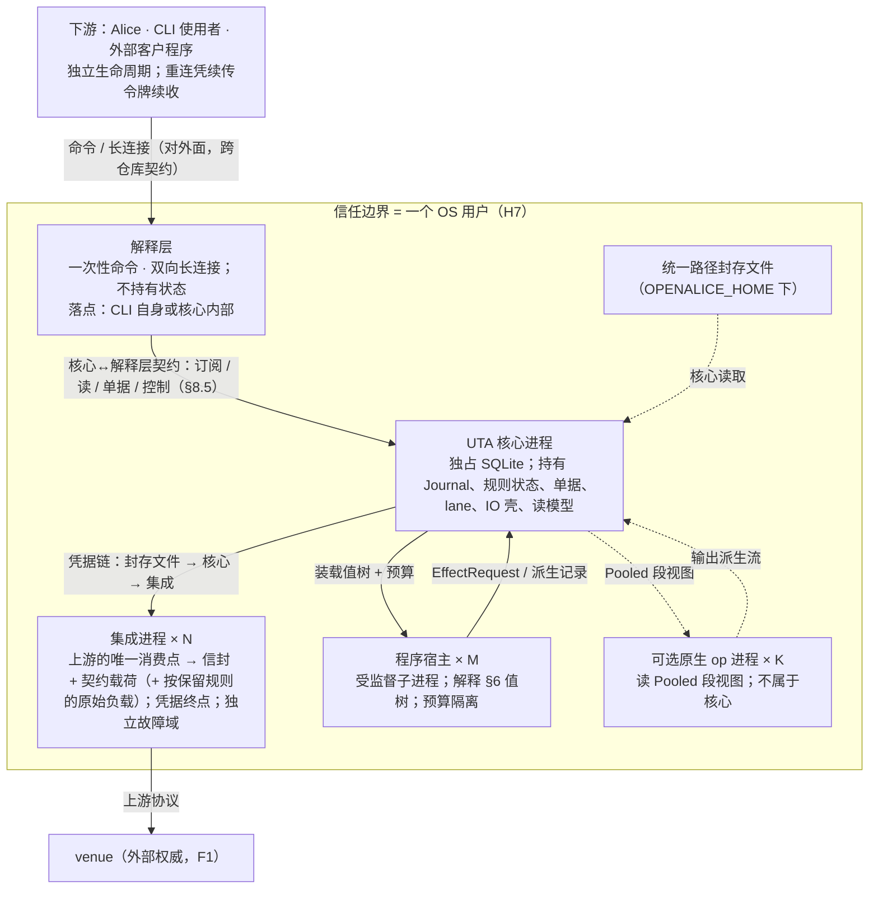
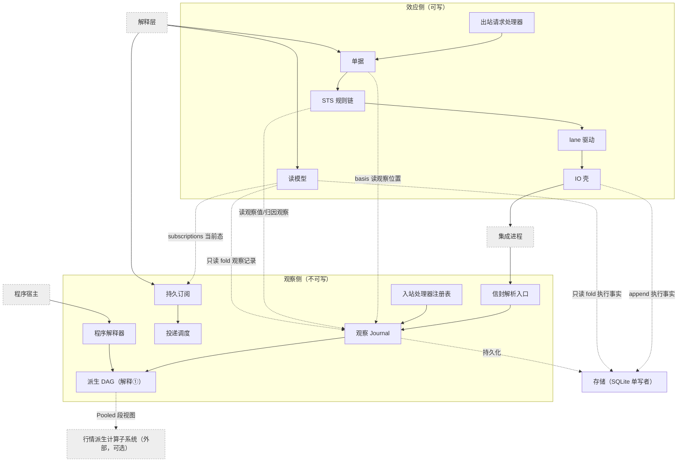

# 7 进程、模块与存储

§2–§6 定义了类型与抽象。本章把它们分配到进程、模块与存储：谁拥有什么、每份状态谁写谁读；接口承诺见 §8。

## 7.1 进程、信任边界、单实例

> 图：D1.1 进程拓扑、D7.3 脑裂/孤儿（`design/diagrams/01-process-topology.md`、`07-crash-recovery.md`）。

UTA 是独立的核心进程，不随 Alice 生命周期绑定。

- 核心、每个集成、每个程序宿主、可选子系统的每个原生 op 都是独立 OS 进程。
- 下游（Alice、CLI 使用者、外部客户程序）只经解释层接触核心。Alice 是下游之一，不是核心的父进程或守护者。
- 解释层落在 CLI 自身还是核心内部由实现定：它不持有状态，落点不改变外部行为（`design/downstream/design.md` 3.3）。

### 独立生命周期

核心独立启动、独立存活、独立停止。下游或解释层退出、崩溃或重启，均不改变核心的订阅、程序、lane 与日志：订阅与程序的 owner 是核心（来源：H5/C5）。

断连期间的投递损失按 gap 语义显式标记（§4.2），不伪造连续性。

### 信任边界是 OS 用户（H7）

- 本机非本用户的进程不可信；本用户的进程视为用户本人（它们本就能读该用户的文件与进程环境）。
- 同机进程能连到核心**不等于**有权发写：写权限来自认证得到的 principal × 策略 scope，不来自连接。解释层的对外端点沿用同一边界。
- 理由：核心是独立进程后，IPC 成为正式边界；而 UDS 对端凭据 / 命名管道 ACL 的粒度都是 OS 用户。
- 代价：同用户进程之间不互相隔离。若要求进程间隔离，则需能力令牌 / 管道句柄传递，这是一条升级路径。
- 证伪条件见 §10.4 #8：维护者要求同用户进程互相隔离，或接受“host 即信任边界”。

### 凭据链

`统一路径封存文件 → UTA 核心 → 该集成进程`（来源：C7）。

- 凭据只出现在这条注入链上；程序与消费方只见账户身份。
- 集成进程是凭据终点，也是独立故障域。

### 单实例

只写三条可推出的事实：

1. **共享配置走文件**：账户封存信封、封存密钥引用、集成登记、策略 / 审批规则、程序装载清单，写入 `OPENALICE_HOME` 下的统一路径。核心与 Alice 均从文件读取，不经进程间注入、环境变量或启动参数传递（§7.6）。
2. **单实例由锁保证**：同一用户状态根（`OPENALICE_HOME`，`existing-capabilities.md:239`）只允许单实例运行，由 OS 文件锁 + fence 保证（H10）。
   - 第二实例以专用退出码拒绝启动，不做接管。
   - 孤儿实例（父进程死而子进程活）是真实威胁（H10），由 fence 回收（§7.2）。
3. **SQLite 独占**：核心进程独占持有 SQLite 文件，H10 的 OS 文件锁与 SQLite 锁同向生效。SQLite 与锁文件是核心独有写者的文件，位于同一用户状态根下；具体路径是实现目录（§0.3 非目标）。

### 传输按 OS 选择

- 核心↔集成、核心↔解释层的语义由一份 IDL 固定（§8）。核心↔集成部分随 release 发布给集成作者（`design/integration/design.md` 第 4 节）；核心↔解释层部分只在本仓库内部。IDL 之下的编码与信道按 OS 选择。
- 解释层的对外面（命令与长连接消息协议）另有 schema，随 release 发布，是跨仓库契约（§0.1）。
- Windows 缺少 UDS，传输层退化为本地回环 + 本地令牌或命名管道。这只改编码 / 信道，**不改 IDL**。
- 默认文本序列化 JSON-RPC：跨语言、可读、可录制回放。
- §10.5 #19 的负载下推送流不达标时，另加二进制编码，定位为同一 IDL 的另一种编码，而非第二套协议。

### 集成崩溃

集成崩溃有观察流侧与写提交侧两个故障面，并列、不混为一谈。判别边界与收敛见 §6.7。

## 7.2 启动与接管顺序、会话 epoch

> 图：D1.2 启动五步、D1.3 会话 epoch（`design/diagrams/01-process-topology.md`）。

启动顺序由存储归属（§7.4、§7.5）与写边界恢复（§6.7）推出。失败分两级 [设计]：

- **核心级**：核心自身不能安全运行时整体拒绝启动，不进入部分运行态。只有三种：第 1 步取不到 fence（专用退出码，此时无权写 SQLite）；第 2 步格式版本校验、迁移或从快照 + 记录重建失败（C14）；第 3 步读取统一路径配置失败（§7.6、C14）。后两种以专用退出码与诊断报告原因。
- **单元级**：只涉及一个集成或一个程序的失败，只使该单元不可用，其余照常启动：集成握手的传输失败（重连）或被拒（§8.2 `handshake`）；程序 `LoadRejected` 或状态版本不符（§8.6）。

理由：集成与程序宿主各是独立故障域（§7.1、§8.6）；一个 venue 不通就让全部账户与程序停摆，违背 Q15、Q18 的隔离。C14 管的是持久格式与迁移，不管集成是否可用。

### 1. 取 fence

- OS 文件锁 + SQLite 独占（H10）。取不到即以专用退出码退出（§7.1）。
- 锁由进程持有、随进程消亡，所以取到 fence 蕴含旧核心已退出。仍可能存活的，是它拉起的集成进程与程序宿主进程（H10 的孤儿）。
- 取到 fence 即在 SQLite 中把 `instance_id` 加一。`instance_id` 是单调递增的实例序号，与 fence 同事务持久化。旧实例的会话 epoch 全部作废。

**回收孤儿：**

- 核心拉起的每个集成进程与程序宿主进程，都以 `(instance_id, pid, start_time, role)` 登记在 SQLite 进程表（§7.5）。
- 新实例对旧 `instance_id` 名下、`(pid, start_time)` 仍匹配的进程，先请求退出，超时后强制终止，再清除登记。
- 未登记或匹配失败的孤儿也无法造成双写：它们的会话 epoch 在第 3 步之后一律被边界拒绝，且它们不接触 SQLite（单写者，§7.4）。

### 2. 从记录重建

- 校验格式版本（C14），失败拒绝启动。
- 从快照 + 记录 `fold_state` 重建 lane 链、单据、规则状态、订阅表。
- IO 壳按恢复规则（§6.7）把 `SendBarrier` 无后继者 append 为 `Undetermined(CrashWindow)`。

这一步**不接触任何集成**：恢复结论只来自记录，不依赖外部回音。

### 3. 握手

读统一路径配置（§7.6），拉起登记的集成进程并登记，按新会话 epoch 握手取得能力证据（§8.2）。各集成按会话状态机（D1.3）独立推进，本步不等全部集成建立会话：

- 握手成功：会话建立，第 4、5 步中与它有关的恢复随之进行。
- 传输失败：按 §8.2 重连（新 `session_seq`），其间该集成没有会话。
- 被拒（投影不合法、契约版本不兼容）：记 P14 原因；核心终止该集成进程并清除它在进程表中的登记，不自动重试，恢复经 `restart_integration`（§8.5）[设计]。集成登记配置、该集成已有的流记录与订阅不变。被拒期间它没有可用会话，不接受它的新推送，也不向它发写。理由：这是 fail-closed 的运维策略：握手不合格说明集成或其配置需要人处理，自动重试会在无人察觉时反复拉起一个不合格的凭据终点（C7）。

**会话 epoch** `SessionEpoch = (instance_id, session_seq)`：

- `instance_id` 来自第 1 步。
- `session_seq` 在同一实例内对同一集成每次握手加一；重连、换凭据、重启集成都算一次。
- 集成把 epoch 回填到它送出的每条推送与回执上。
- 核心以 `epoch == 当前 epoch` 为唯一接受条件；来自其他 epoch 的推送与回执在边界拒绝（§8.3）。

### 4. 恢复效应侧

按恢复判定（先 fold 链是否已 `Resolved`，§6.7）依次：

1. 为每条未终结的 `Undetermined` 启动对账驱动（读，可重试）。渠道已穷尽而停等者，在其集成建立新会话时自动 append `ReconciliationReopened{SessionRestored}`（§6.6），然后重走一轮；该集成尚无会话时，停等只能由 `Manual` 或新证据推进。
2. 复合链处于 `AwaitingTargetTerminal` 者，继续按目标身份读。
3. 对当前腿无 `SendBarrier` 者过发出前门：过期则 `Expired`，否则 `SendBarrier` → `submit`。
4. fold 出无 `EffectResponse` 的 `EffectRequest` 重派（§6.1、§9.2 #21）。
5. STS 链按 `RuleState` 续跑待决单据；过期计时器按各单据的 `deadline`（UTC，§2.6）重新装上。

顺序理由：取证在前，可让已终结的腿先移出阻塞头集合；发送需要该集成的会话，尚无会话的集成，其腿等会话建立再发。

### 5. 恢复观察侧与消费面

1. 为已建立会话的集成按订阅表重建路由与回填；`Gap{origin: Source}` 标记断代（§4.2）。
2. 交回程序状态并装载程序（§8.6）。
3. 最后开放下游会话（经解释层，§8.5）。

第 4、5 步只建立恢复任务与路由，不等取证收敛、回填完成或全部程序装载成功；之后才建立会话的集成，在会话建立时做同样的恢复。

消费方在第 5 步之前连接，得到 `Starting`（§8.5），不得到部分状态。启动完成后个别集成或程序不可用不是 `Starting`：各自的会话与程序状态照实可见。

## 7.3 模块指南

每个元素写它**拥有**什么、**隐藏**什么决定、**假设**什么、对应哪个抽象。

约束：没有元素承担两个抽象的秘密。公共值类型（`StreamId`、`LogPosition`、`Projection` 等）被多个元素消费不等于多 owner；owner 约束的是可变状态、状态转换与唯一写入口。

### 观察侧元素

| 元素 | 拥有 | 隐藏的决定 | 假设 | 抽象 |
|---|---|---|---|---|
| 集成进程 | 上游的唯一消费点：适配器代码（每个契约操作的上游调用编排、需上下文的判定）与记录映射的求值（字段对齐、换算、枚举映射）；投影握手、交互契约对齐、提供位置证据、凭据终点 | 上游账户结构、venue 词汇、上游消息格式与调用序列 | 锚点契约与载荷 schema 稳定；读的回答来自本次对上游的询问（§8.3） | §2.2、§8.1 |
| 信封解析入口 | 边界处解析并验证信封字段（parse-don't-validate，隐藏构造器）、契约载荷与原始负载直通 | 智能构造器、畸形记录拒绝逻辑 | 锚点闭合必填、入口即验 | §2.1 |
| 观察 `Journal` | 观察侧记录载体、`RetractableDelta` 撤回代数、按 frontier 压缩、保留边界 | 存储原语、`fold_state` 重建、`compact` 实现 | 派生侧可撤回 | §4.1 |
| 派生 DAG（程序解释①） | 增量重算、cutoff 截断、节点粒度依赖、派生记录写回观察侧 | 增量引擎（`salsa`/differential）、cutoff 判定 | 无自反馈环；执行状态不进 DAG | §4.3 |
| 持久订阅 | 订阅需求、selector（来源×instrument×种类）、cursor、消费方式声明、订阅状态 | 匹配与路由细节 | 订阅 owner 是核心，与消费方连接无关 | §4.2 |
| 投递调度 | 投递、背压、conflation、`Gap{origin: Delivery}` 标记与确认 | 传输层 conflation 实现 | 损失语义由消费者显式声明 | §4.2 |
| 入站处理器注册表 | 字段→处理器映射（观察侧/效应侧分区）、`required_inputs`、触发效果 | 载荷语义解释 | 字段缺失=不触发，不是错误 | §2.1、§6.1 |

集成进程的两项补充：

- 交互契约对齐指 `WriteLaneKey`、`basis` 可引用的流、`target` 身份。
- 位置证据是 venue seq/cursor/事件时间；`LogPosition` 与 frontier 由核心裁定（§8.3）。

### 程序相关元素

| 元素 | 拥有 | 隐藏的决定 | 假设 | 抽象 |
|---|---|---|---|---|
| 程序解释器（值树） | 两种解释的纯语义、装载期校验（`Id` 越界/环、`required_inputs` 比对） | — | 程序状态显式可序列化 | §2.5、§4.3、§6.1 |
| 程序宿主 | 受监督子进程的拉起与登记、CPU/内存/意图速率/状态大小预算、trap、`Load`/`Advance`/`Reset`/`Unload` 协议 | 宿主进程的 OS 机制（rlimit / job object） | 预算靠宿主进程，不靠类型 | §6.1、§8.6 |
| 出站请求处理器 | `EffectRequest`→读/写处理器分派；读处理器立即执行成观察，写处理器以装载 principal 开单 | 副作用具体种类 | 写处理器不绕效应路径 | §6.1 |

### 效应侧元素

| 元素 | 拥有 | 隐藏的决定 | 假设 | 抽象 |
|---|---|---|---|---|
| 单据 | 意图形成期锁（`responsible`）、线性版本链、`basis`、两层对账状态、编辑 diff | 意图类型解释、`Revision<Intent>` | 单据不驱动 IO 壳，只单向读其记录 | §6.2 |
| STS 规则链 | 顺序固定链（授权→输入约束→审批→lane→过期）、`RuleState`、`Rejection`、放行判定 | 规则内部守卫（组合子 kind enum） | 规则不引用读模型 | §6.3 |
| lane 驱动 | 每 `WriteLaneKey` 的阻塞头集合（lane 规则的 `RuleState`）与按 `Prepared` 位置的执行顺序 | 上游账户结构对齐 | 有序与阻塞来自通讯协议，不是 UTA 的锁；等待发生在 `Prepared` 之前 | §6.4 |
| IO 壳 | 核心内唯一的写调用出口（集成写接口）、`Prepared` 链驱动、两阶段、`SendBarrier`、对账驱动、崩溃恢复 | 转移表、渠道顺序 | 核心内唯一效应处，写在上游的落实由集成完成；不知道单据存在 | §6.5–§6.7 |
| 读模型 | 对记录的只读 fold（种类、输入与能否按历史 `as_of` 重建见 §8.5；`subscriptions` 为订阅表当前态），非权威，经核心↔解释层契约暴露 | fold 的具体数据结构 | 不被规则引用；消费方也可自行 fold 原始记录 | §4.4、§8.5 |
| 控制面 | 认证 principal 传入的运维动作通道（P14） | 传输 | 只经认证 principal，不经进程信号或 flag 文件 | §6.3、§8.5 |

控制面的补充：

- 它拥有控制组的操作集（装卸程序、重载配置、换凭据、重启集成、请求快照、推进保留边界、退回 cursor、绕过 lane），以及决议组 `resolve`（append `ResolutionEvidence{Manual}`）、`retry_reconciliation`（append `ReconciliationReopened{Manual}`）（§8.5）。
- 控制动作与人工决议按 `(principal, 动作种类)` 授权，与写授权同一规则族（授权步，§6.3）。
- 结果为控制记录 `Applied | Rejected(reason)` 或决议记录。

### 存储与外部子系统

| 元素 | 拥有 | 隐藏的决定 | 假设 | 抽象 |
|---|---|---|---|---|
| 存储（SQLite 单写者） | 单文件、表主键、事务原子性、append-only 的 Rust 接口保证、快照、格式版本 | SQL、索引、WAL 细节 | 核心独占；集成/宿主不接触 | §7.4（持久化落点：§4.1、§6.5） |
| 行情派生计算子系统（外部，可选） | `Pooled` 段视图的物化与原生 op 的运行；**属子系统，不属核心** | 全部实现：布局、IPC、段生命周期、作者面 | 核心零影响；未安装即拒绝含 `Pooled` 的程序 | §4.5、§8.7（实现归 `hpc-derivation/design.md`） |
| 解释层（核心之外，下游侧） | 对外概念、状态翻译表、一次性命令与双向长连接、续传令牌的编解码；由类型生成的参数与字段 | 核心概念、核心↔解释层契约、自身落点（CLI 或核心内部） | 不持有状态：订阅、确认进度、单据都在核心；授权全在核心 | §0.1、§8.5（设计归 `design/downstream/design.md`） |

### 执行事实 append 链的唯一写入口

执行事实 `Journal` 只经“存储”元素暴露的 append 接口写入。写入者及各自写的记录：

| 写入者 | 记录 |
|---|---|
| 单据 | `TicketAction`，含 `Close(Prepared)` + 同事务 `Prepared` |
| STS 规则链 | Decision/`Outcome`/`Rejection` |
| IO 壳 | `SendBarrier`/`VenueAccepted`/`VenueRejected`/`Undetermined`/取证 `ResolutionEvidence`/`ReconciliationReopened{CancelLegTerminal \| SessionRestored}`/`Expired`/`CapabilityObserved`/取证 `Gap{Channel}` |
| 效应侧归因处理器 | `ResolutionEvidence{Attributed}`（§8.1） |
| 控制面 | 控制记录、安全事件、`ResolutionEvidence{Manual}`、`ReconciliationReopened{Manual}`（§8.5） |
| 出站请求处理器 | `EffectRequest`、`EffectResponse`（§6.1） |

- 集成产出的外部变更观察是**观察记录**，落观察 `Journal`（记录归观察，§5.3）。
- 读模型只读、不写。
- 各方不争同一秘密：append-only 保证归“存储”，写内容归各自元素，只读 fold 归读模型。

### uses 图

依赖方向如下；反向不成立。

唯一跨边是效应侧读观察侧：`basis` 引用的观察位置、钩子读的观察值、归因观察、读模型 fold 的观察记录与读取的订阅表当前态。能力证据是执行事实侧记录，属效应侧内部（§7.5）。观察侧任何元素都不依赖效应侧；crate 依赖方向即此，反向不编译（§3.2）。

## 7.4 存储引擎

> 图：D1.4 持久化归属、D1.5 同事务集合（`design/diagrams/01-process-topology.md`）。

两侧 `Journal` 与规则状态统一持久化于**单个 SQLite 文件**（WAL 模式），不手写分段日志与索引。理由：否则需要自己写索引。

段池是另一套存储，不在 SQLite 里，也不是 `Journal`（§8.7）。

- **表结构与索引**：每张 trace 表以 `(stream_id, log_position)` 为主键，`pos` 单调。`fold_state`、`AS OF` 以及 cursor 之后的记录查询，均退化为引擎原生索引支持的范围扫描。
- **append 由 Rust 接口保证**：第一边界的第二层“执行事实侧只 append”（§3.1）由 **Rust 侧存储接口**保证：对应表的模块 API 仅暴露 `append`，不依赖 SQL 权限约束。派生侧 `compact_below_retention` 实现为保留边界之下的 `DELETE`，仅适用于 `RetractableDelta` 表。
- **事务原子性**：
  - “决策 append（规则 `Outcome`/Decision 记录）+ 规则状态更新”封装在同一个 SQLite 事务内；单文件事务消解了跨存储系统的原子性问题。
  - 单据 `Close(Prepared)` 与 `Prepared` 记录的 append 也在同一事务内（§6.2）。
  - 对外投递是订阅者按 cursor 读 `Journal`（§4.2），不设待投递表。记录提交后投递失败只是 cursor 不推进，记录不丢（§9.2 #6）。
- **单写者**：核心进程独占该数据库文件（H10 的 OS 文件锁与 SQLite 锁同向生效）。集成进程与程序宿主**不接触**数据库，仅通过内部协议与核心交换记录，满足 C7 凭据链与 H2 程序不可信要求。
- **快照与版本演进**：
  - 状态随时可由 `fold_state` 重建，但重建从保留边界（执行事实侧从首条记录）扫起，成本随历史增长。快照因此是**重启延迟的必需项**，不只是加速。
  - 格式版本持久化于 schema 表，升级只前进（C14）。
  - 快照频率与派生侧留存窗口是配置参数（运行期参数，§7.6）。引用登记方、边界推进审批方与留存语义见 §2.4。

## 7.5 持久化归属表

> 图：D2.5 记录种类总表（`design/diagrams/02-record-model.md`）。

每份状态谁写、谁读、怎么传播。

| 状态 | 侧 |
|---|---|
| 观察 `Journal` | 观察 |
| 执行事实 `Journal` | 效应 |
| 规则状态（`RuleState`） | 效应 |
| 单据记录（`TicketAction`） | 效应 |
| 订阅表 / cursor | 观察 |
| 能力证据（握手 `Projection.capabilities`、`CapabilityObserved`） | 效应 |
| 程序状态（`Checkpoint`） | 观察（解释①的 `Scan`/`Window` 累加器）与效应（解释②的执行状态：冷却、等待、过期） |
| 进程表 | 核心 |
| 保留边界与引用登记 | 观察 |
| 快照 | 两侧 |
| 段池（不持久） | 观察（扩展） |

### 观察 `Journal`

- **写**：
  - 集成推送，位置由核心分配（§8.3）；
  - 程序解释①（派生记录）；
  - 一次性读的结果：读处理器、钩子取证、消费方 `read`（§3.4、§8.2）；
  - IO 壳：回执与取证观察的副本（记录模型，§6.5）。
- **读**：订阅者、程序、单据 `basis`/检查项、读模型、IO 壳（复合链读目标终态观察）。
- **传播**：按 `LogPosition` 推进；`RetractableDelta` 可撤回可压缩；回执 / 取证副本可压缩，`Evidence` 在执行 J。

### 执行事实 `Journal`

- **写**：见唯一写入口表（§7.3）。补充：STS 规则链的 Decision/`Outcome`/`Rejection` 记录带 `checked_as_of`；IO 壳的 `VenueAccepted` 与取证 `ResolutionEvidence{Found}` 含 `Evidence`（契约载荷与原始负载，§6.5）；控制记录为 `Applied | Rejected`。
- **读**：读模型、单据 `basis`、lane 规则（阻塞头集合）、IO 壳（重启重建链）、对账驱动、出站处理器（重启重派判定）。
- **传播**：纯 append；位置即顺序。lane 链状态与 `Resolved` 是它的 fold，不另存。

### 规则状态（`RuleState`）

- **写 / 读**：STS 规则链（写者是 `step` 的输出）。
- **传播**：与决策 append 同一事务。

### 单据记录（`TicketAction`）

- **写**：单据负责人 / 决定者（各 `TicketAction`）。
- **读**：单据 fold、审批人视图。
- **传播**：每条带 principal 与依据；`Ticket` 是这些记录的 fold。

### 订阅表 / cursor

- **写**：物理写者只有核心的“持久订阅”元素（§7.3）。
  - 订阅需求来自消费方 / 程序的 RPC；cursor 推进来自 `ack`（确认 = 已处理，§4.2）。
  - 两类写在该元素内串行化，同一订阅的需求变更与 cursor 推进不交叠。
- **读**：集成路由、投递、gap 判定、重连恢复、读模型 `subscriptions`（当前态，§8.5）。
- **传播**：cursor 前进；退回只经控制面 `rewind_cursor`；损失以 `Gap{origin: Delivery}` 标记。

### 能力证据

- **写**：
  - 每次集成握手，由核心 append 一版（执行 J）；
  - IO 壳在运行期观察到能力变化（含能力变更推送，§8.3）时 append `CapabilityObserved`。
- **读**：STS `Context`、单据 `AlignmentCheck` 解析、IO 壳取证渠道集、`required_inputs` 比对。
- **传播**：
  - 只 append，最新一版生效；重启后由最近握手重建。
  - 取证渠道按**当前**能力证据选：取证是读，按当前能力才可执行。旧 Attempt 不绑定历史版本。

### 程序状态（`Checkpoint`）

- **写**：程序宿主按宿主协议（§8.6）交出 `Checkpoint{bytes, state_version}`；核心随该程序的 cursor 同事务持久化。状态与 cursor 原子对应，重放边界由此确定。
- **读**：核心重启后按宿主协议 `Load` 交回宿主；`state_version` 不兼容时 `Reset` 并显式记录（C14）。
- **传播**：字节形状由宿主解释器定义，核心不解释；`state_version` 是核心可比对的整数。

### 进程表

- **写**：核心拉起集成进程 / 程序宿主时写 `(instance_id, pid, start_time, role)`，退出时清除。
- **读**：新实例启动时回收旧实例进程（§7.2 第 1 步）。
- **传播**：与 fence 同库；`instance_id` 单调递增。

### 保留边界与引用登记

- **写**：核心。边界推进由控制面 `advance_retention` 经审批写新边界；引用登记随 `Prepared`/`Checkpoint`/`ResolutionEvidence` 的 append 自动写入（§2.4）。
- **读**：`compact_below_retention`、`basis_valid`（`BeyondRetention` 判定）、快照。
- **传播**：每条观察流一个边界，只前进；推进不得越过该流已登记引用最早位置与配置窗口下界；执行事实侧没有边界。

### 快照

- **写**：核心（按 P15 快照规则）。
- **读**：重启恢复。
- **传播**：加速 `fold_state` 重建，不改 append-only 语义。

### 段池（不持久）

- **写**：可选子系统（洗入）/ 原生 op。
- **读**：原生 op。
- **传播**：运行期快照，有内部有效期，不外泄；重启由 `Pooled` 重洗（§8.7）。

## 7.6 配置与凭据

- **统一路径**：所有核心与 Alice 共享的配置，以文件形式持久化在 `OPENALICE_HOME` 下的统一路径。两个进程均从文件读取，不经进程间注入、环境变量或启动参数传递。
- **每文件唯一写者**：Alice 写账户与规则，UTA 写运行期登记；对端只读，并依据控制面通知或文件变更重载。
- **格式版本只前进**：文件附带格式版本，升级只前进（C14）；迁移失败拒绝启动而非部分迁移。
- **schema 发布**：每个文件带格式版本；schema 的文本形式（JSON schema）随 IDL 一起作为 release 产物发布，是实现阶段工件。
- **凭据链**：`统一路径封存文件 → UTA 核心 → 该集成进程`；程序与消费方只见账户身份（C7）。
- **Alice 侧的适配**（密钥位置调整、移除 flag 重启）属于接入阶段，不在本设计范围内；本设计只定义核心读取的文件契约。
- **原子替换与重载失败**：
  - 配置文件以整文件原子替换（临时文件 + rename，与既有快照 index 的写法一致，O9/`existing-capabilities.md:189`），不存在半写可见态。
  - 运行期重载失败保留上一有效版本，控制结果为 `Rejected(reason)` 记录（§8.5）。
  - 启动期读取失败按 C14 拒绝启动，而非部分迁移。

### 文件清单与每文件契约

| 文件 | 写者 | 内容 | 重载 |
|---|---|---|---|
| 账户封存信封 | Alice | 每账户的封存凭据密文与账户身份（`WriteScope` 对齐用的上游账户标识） | `rotate_credential`（见表下） |
| 封存密钥引用 | Alice | 解封密钥的位置引用（OS keychain / 文件路径），不含密钥本体 | 同上 |
| 集成登记 | Alice | 每个集成的二进制路径、启动参数、负责的账户集、契约版本 | `restart_integration` / 启动期拉起 |
| 策略/审批规则 | Alice | 见表下 | `reload_config(rules)`；版本 = 内容 hash |
| 程序装载清单 | Alice | 程序值文件引用、预算、接受的 `state_version` | `load_program` / `unload_program` |
| 运行期参数 | Alice | 快照频率、派生侧留存窗口、`deadline` 全局缺省（仅在策略规则未按 scope 给出时生效）、投递缓冲上限 | `reload_config(runtime)` |
| 运行期登记 | UTA | 当前 `instance_id`、格式版本、最近快照位置 | 只由核心写；Alice 只读 |

**`rotate_credential` 的重载效果**：重建目标集成会话（新 `session_seq`），并强制该集成各流开新 epoch（`Gap{origin: Source, reason: credential_rotated}`），不续接。

**策略 / 审批规则文件的内容：**

- principal → scope 表：`WriteLaneKey` × `OperationKind` × 是否人工审批 × 名义阈值 × 必要检查项集（能力项恒含，§6.2）× 依据有效性窗口 `Lag`（§5.2）。
- 控制动作与人工决议授权。
- 按 `(WriteLaneKey, OperationKind)` 的 `deadline` 缺省：意图未带 `deadline` 时，在 `Draft`/`Revise` 规范化时填入该版本；版本 hash 含它，审批人看到的即放行的。此项也缺，则取运行期参数的全局缺省。
- 规则版本 = 内容 hash，写进此后每条 `Outcome`/`Rejection`/控制记录（§8.5）。

## 7.7 Rust 映射

所需机制均不依赖 HKT，也不需要 ZIO 式 API。ZIO 解决效应多态与依赖注入；UTA 把效应收敛到“IO 壳是核心内唯一效应处”，依赖注入就是 `Context` 参数，两个问题在设计层已消掉。

三档：

| 档 | 机制 | Rust 形状 |
|---|---|---|
| 直接 | `Journal<Record, Delta>`、`fold_state`、`compact_below_retention` | 泛型 struct + supertrait；`compact` 是一个 `impl<D: RetractableDelta>` 块 |
| 直接 | frontier / 三种进度 | 自写 `Antichain<T: PartialOrder>`，不引 timely |
| 直接 | `Program` 值、`Ticket` 状态机、IO 壳链转移表 | `serde` → enum → 穷尽 match；`Id` 越界与环在装载期校验 |
| 直接 | 增量 DAG | `salsa`（cycle panic 与 fp-05 案例 9⑤ 同形） |
| 直接 | 唯一单向边（§3.2） | crate 依赖方向，反向不编译 |
| 直接 | SQLite 单写者 | `rusqlite`，事务即函数 |
| 变形 | 组合子多种解释（§2.5） | 一个 enum 值树 + 五个 fold（启动/装载期），不是泛型关联类型派生 |
| 变形 | 规则组合（§6.3） | 具名 struct + 具名 enum `#[from]`，不是泛型 `Embed` |
| 变形 | 处理器注册表（§6.1、§8.1） | `HashMap<Kind, Box<dyn Handler>>` + 元数据（schema、`required_inputs`、读/写）；启动期求并集与握手比对；不宣称全局穷尽 |
| 变形 | 发送屏障（§6.5） | move-semantics token（私有构造器 + 内含 fsync），不是泛型 typestate |
| 变形 | 检查项（§6.2 单据） | `CheckName` 为 per-`Intent` 闭合 enum；`AlignmentCheck` 的 `eval` 写作 `fn` 指针，Rust 里为对象安全 trait 的 `Box<dyn …>`，二者同一意图；`Hash` 需规定 canonical 序列化 |
| 变形 | capability | 不可伪造 token 类型只授权不执行 |

- 痛点全是同一个缺口（Rust 没有类型级和 / 积的自动构造）的不同面孔。规避一律是“值化 + 启动期校验”或“具名类型 + 显式 `From`”。
- 增量引擎按指标是否可撤回，选节点图（Incremental 式）或 differential。二者不是任选，都不能承载外部 unknown Write。
- 不迁移 tagless-final 多态与 Haxl `<*>` 违反 `ap` 的技巧。

**Rust 形状不反向决定 §2–§6 的模型。** 上表是把已定的类型与抽象落到 Rust 的可行形状；性能与样板量由实现期 profiling 定落点。

- 若实测只推翻某个落点（如 `salsa` vs 手写节点图、`dyn` vs 静态分发、文本 JSON-RPC vs 同一 IDL 的二进制编码），改的是落点而非模型。模型由 §2–§6 的推导与不变量决定，不由 Rust 表达能力反推。
- 唯一例外是 §10.4 #1：若规则 / 程序 / 处理器需要不同代数或生命周期，或同一树得不到稳定规范化描述，改的是表示（§2.5、§4.3、§6.1、§6.3），而不只是落点。
