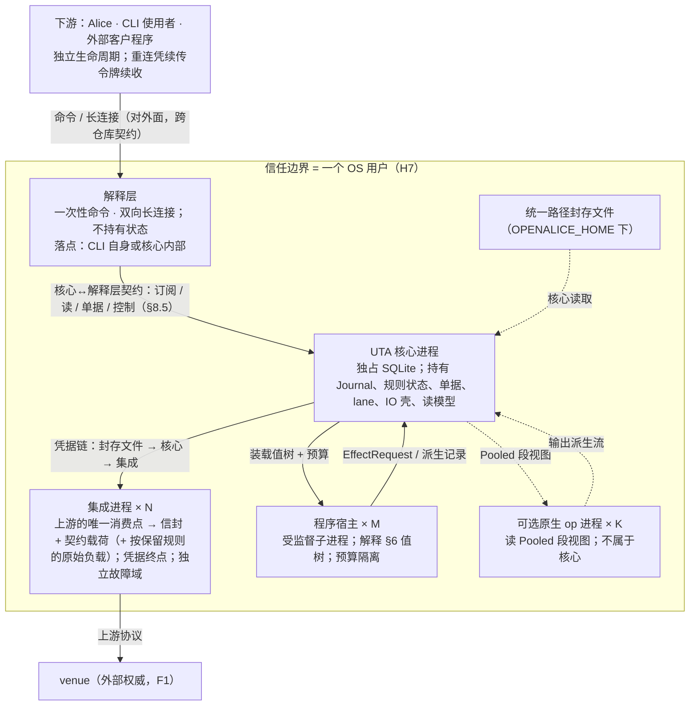
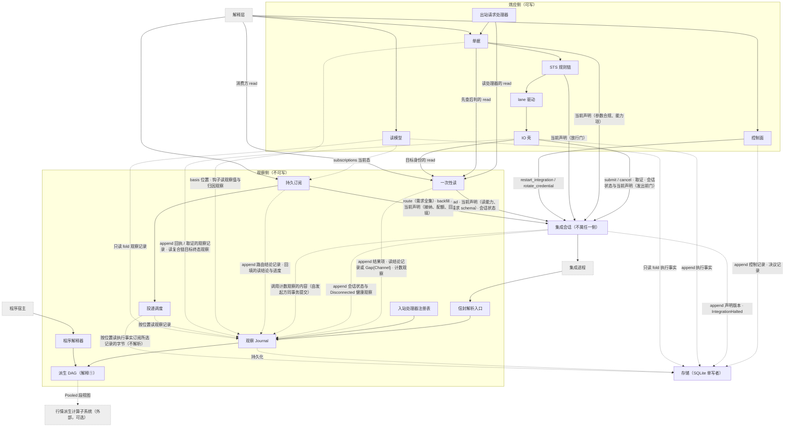

# 7 进程、模块与存储

§2–§6 定义了类型与抽象。本章把它们分配到进程、模块与存储：谁拥有什么、每份状态谁写谁读；接口承诺见 §8。

## 7.1 进程、信任边界、单实例

> 图：D1.1 进程拓扑、D7.3 脑裂/孤儿（`design/diagrams/01-process-topology.md`、`07-crash-recovery.md`）。

UTA 是独立的核心进程，不随 Alice 生命周期绑定。

- 核心、每个集成、每个程序宿主、可选子系统的每个原生 op 都是独立 OS 进程。
- 下游（Alice、CLI 使用者、外部客户程序）只经解释层接触核心。Alice 是下游之一，不是核心的父进程或守护者。
- 解释层落在 CLI 自身还是核心内部由实现定：它不持有状态，落点不改变外部行为（`design/downstream/design.md` 3.3）。

### 独立生命周期

核心独立启动、独立存活、独立停止。下游或解释层退出、崩溃或重启，均不改变核心的订阅、程序、lane 与日志：订阅与程序的 owner 是核心（来源：H5/C5）。

断连期间的投递损失按 gap 语义显式标记（§4.2），不伪造连续性。

### 信任边界是 OS 用户（H7）

- 本机非本用户的进程不可信；本用户的进程视为用户本人（它们本就能读该用户的文件与进程环境）。
- 同机进程能连到核心**不等于**有权发写：写权限来自认证得到的 principal × 策略 scope，不来自连接。解释层的对外端点沿用同一边界。
- 理由：核心是独立进程后，IPC 成为正式边界；而 UDS 对端凭据 / 命名管道 ACL 的粒度都是 OS 用户。
- 代价：同用户进程之间不互相隔离。若要求进程间隔离，则需能力令牌 / 管道句柄传递，这是一条升级路径。
- 证伪条件见 §10.4 #8：维护者要求同用户进程互相隔离，或接受“host 即信任边界”。

### 凭据链

`统一路径封存文件 → UTA 核心 → 该集成进程`（来源：C7）。

- 凭据只出现在这条注入链上；程序与消费方只见账户身份。
- 集成进程是凭据终点，也是独立故障域。

### 单实例

只写三条可推出的事实：

1. **共享配置走文件**：账户封存信封、封存密钥引用、集成登记、策略 / 审批规则、程序装载清单，写入 `OPENALICE_HOME` 下的统一路径。核心与 Alice 均从文件读取，不经进程间注入、环境变量或启动参数传递（§7.6）。
2. **单实例由锁保证**：同一用户状态根（`OPENALICE_HOME`，`existing-capabilities.md:239`）只允许单实例运行，由 OS 文件锁 + fence 保证（H10）。
   - 第二实例以专用退出码拒绝启动，不做接管。
   - 孤儿实例（父进程死而子进程活）是真实威胁（H10），由 fence 回收（§7.2）。
3. **SQLite 独占**：核心进程独占持有 SQLite 文件，H10 的 OS 文件锁与 SQLite 锁同向生效。SQLite 与锁文件是核心独有写者的文件，位于同一用户状态根下；具体路径是实现目录（§0.3 非目标）。

### 传输按 OS 选择

- 核心↔集成、核心↔解释层的语义由一份 IDL 固定（§8）。核心↔集成部分随 release 发布给集成作者（`design/integration/design.md` 第 4 节）；核心↔解释层部分只在本仓库内部。IDL 之下的编码与信道按 OS 选择。
- 解释层的对外面（命令与长连接消息协议）另有 schema，随 release 发布，是跨仓库契约（§0.1）。
- Windows 缺少 UDS，传输层退化为本地回环 + 本地令牌或命名管道。这只改编码 / 信道，**不改 IDL**。
- 默认文本序列化 JSON-RPC：跨语言、可读、可录制回放。
- §10.5 #19 的负载下推送流不达标时，另加二进制编码，定位为同一 IDL 的另一种编码，而非第二套协议。

### 集成崩溃

集成崩溃有观察流侧与写提交侧两个故障面，并列、不混为一谈。判别边界与收敛见 §6.7。

## 7.2 启动与接管顺序、会话 epoch

> 图：D1.2 启动五步、D1.3 会话 epoch（`design/diagrams/01-process-topology.md`）。

启动顺序由存储归属（§7.4、§7.5）与写边界恢复（§6.7）推出。失败分两级 [设计]：

- **核心级**：核心自身不能安全运行时整体拒绝启动，不进入部分运行态。只有四种：第 1 步取不到 fence（专用退出码，此时无权写 SQLite）；第 2 步格式版本校验或迁移失败（C14）；第 2 步从快照 + 记录重建失败（状态重建不出，核心就无法判定哪些写可能已经发出）；第 3 步读取统一路径配置失败（§7.6、C14）。后三种以专用退出码与诊断报告原因。
- **单元级**：只涉及一个集成或一个程序的失败，只使该单元不可用，其余照常启动：集成处于 `Connecting` 或 `Halted`（第 3 步会话状态）；程序 `LoadRejected` 或状态版本不符（§8.6）。

理由：集成与程序宿主各是独立故障域（§7.1、§8.6）；一个 venue 不通就让全部账户与程序停摆，违背 Q15、Q18 的隔离。C14 管的是持久格式与迁移，不管集成是否可用。

### 1. 取 fence

- OS 文件锁 + SQLite 独占（H10）。取不到即以专用退出码退出（§7.1）。
- 锁由进程持有、随进程消亡，所以取到 fence 蕴含旧核心已退出。仍可能存活的，是它拉起的集成进程与程序宿主进程（H10 的孤儿）。
- 取到 fence 即在 SQLite 中把 `instance_id` 加一。`instance_id` 是单调递增的实例序号，与 fence 同事务持久化。旧实例的会话 epoch 全部作废。

**回收孤儿：**

- 核心拉起的每个集成进程与程序宿主进程，都以 `(instance_id, pid, start_time, role)` 登记在 SQLite 进程表（§7.5）。
- 新实例对旧 `instance_id` 名下、`(pid, start_time)` 仍匹配的进程，先请求退出，超时后强制终止，再清除登记。
- 未登记或匹配失败的孤儿也无法造成双写：它们的会话 epoch 在第 3 步之后一律被边界拒绝，且它们不接触 SQLite（单写者，§7.4）。

### 2. 从记录重建

- 校验格式版本（C14），失败拒绝启动。
- 从快照 + 记录 `fold_state` 重建 lane 链、单据、规则状态、订阅表；重建失败拒绝启动。
- IO 壳按恢复规则（§6.7）把 `SendBarrier` 无后继者 append 为 `Undetermined(CrashWindow)`。

这一步**不接触任何集成**：恢复结论只来自记录，不依赖外部回音。

### 3. 握手与会话状态

读统一路径配置（§7.6）。每个登记的集成有一个由集成会话元素（§7.3）运行的**会话状态** [设计]：

| 状态 | 含义 | 核心的行为 |
|---|---|---|
| `Connecting` | 没有会话，可自动恢复 | 拉起集成进程（未在运行时）并登记，以新 `session_seq` 握手（§8.2）；失败按 pacing 再来 |
| `Established(SessionEpoch)` | 会话已建立 | 只接受该 epoch 的推送与回执；IO 壳可对它发写与取证（发出前门，§6.5） |
| `Halted{cause}` | 没有会话，需要人处理 | 进程已终止、进程表登记已清除；不自动握手 |

`cause ∈ {ProjectionInvalid, ContractIncompatible, Refused(reason)}`：前两种由核心判定握手交来的投影不合法、契约版本不兼容；`Refused` 是集成报告上游明确拒绝了该登记的身份或配置（§8.2 `handshake`）。

本步各集成独立推进，不等全部集成建立会话。持久为 `Halted` 的集成（见下文“`Halted` 的持久化”）保持 `Halted`，不拉起；其余一律以新实例进入 `Connecting`：旧实例的 `Established` 不延续，它的 epoch 已在第 1 步作废。

**转移（穷尽）：**

| 当前 | 事件 | 结果 |
|---|---|---|
| `Connecting` | 握手返回合法 `Projection` | `Established`：append 该握手的声明版本（§7.5），各流按 §8.2 决定续 epoch 或开新 epoch；第 4、5 步中与它有关的恢复随之进行 |
| `Connecting` | 传输失败、集成进程退出、握手返回 `Unavailable` | `Connecting`（新 `session_seq`，按 pacing） |
| `Connecting` | 投影不合法 / 契约版本不兼容 | `Halted{ProjectionInvalid}` / `Halted{ContractIncompatible}` |
| `Connecting` | 握手返回 `Refused(reason)` | `Halted{Refused(reason)}` |
| `Established` | 传输断开、集成进程退出（含集成因上游在会话中拒绝身份而结束会话，§8.3） | `Connecting` |
| `Connecting` / `Established` | `rotate_credential` 或 `restart_integration` 生效 | `Connecting`（新 `session_seq`；`rotate_credential` 另强制各流开新 epoch，§7.6） |
| `Halted{Refused}` | `rotate_credential` 或 `restart_integration` 生效 | `Connecting` |
| `Halted{ProjectionInvalid}` / `Halted{ContractIncompatible}` | `restart_integration` 生效 | `Connecting` |
| `Halted{ProjectionInvalid}` / `Halted{ContractIncompatible}` | `rotate_credential` | 不转移，控制记录 `Rejected`：要重新拉起只经 `restart_integration`，届时照常读凭据文件 |

- 只有当前在途握手（按其 `SessionEpoch`）的结果能改变状态；其他 epoch 的握手结果丢弃，不转移、不 append 任何记录。
- 未生效的控制动作（越权、文件不合法，§8.5）不转移。
- 状态每改变一次（`Connecting → Connecting` 不算），集成会话 append 一条健康观察（新状态、原因、起始时间，§8.4）。
- 进入 `Halted` 时，集成会话在同一事务 append 执行事实 `IntegrationHalted{integration, cause, session_epoch}`（P14）与该 `Halted` 的健康观察，提交后终止该集成进程并清除它在进程表中的登记。集成登记配置、该集成已有的流记录与订阅不变。
- 解除 `Halted` 的控制记录 `Applied`（`restart_integration`，或 `Halted{Refused}` 上的 `rotate_credential`）带被解除的那条 `IntegrationHalted` 的位置，与转入 `Connecting` 的健康观察同一事务；这一事务提交之后集成会话才拉起进程、握手。
- 不在 `Established` 时该集成没有会话：不接受它的新推送；IO 壳不向它发写，也不发取证读（§6.5、§6.6）；已放行未发出的腿在发出前门等待或到期。
- **会话结束时在途调用恰好完成一次** [设计]：离开 `Established` 时，经调用通道发往该会话、尚未返回的每个调用立即以封闭返回值完成：写（`submit`/`cancel`）为 `NoResponse`（→ `Undetermined`，§6.5），其余为 `Unavailable`，各按 §8.4 计数一次。之后到达的旧 epoch 回应在边界拒绝（§8.3），不再完成任何调用，也不计数。理由：会话一断，旧 epoch 的回音已不可接受；让调用悬着等它，发起方就永远等不到结果，而同一调用若既被会话结束完成、又被迟到回应完成，就会有两条记录与两次计数。

**`Halted` 的持久化** [设计]：持久的 `Halted` 只由执行事实判定。一个集成最近的 `IntegrationHalted` 没有被某条 `Applied` 以位置引用解除，它就是 `Halted`，原因取该记录；重启时本步据此恢复，不读健康观察。

- 理由：`Halted` 是运维者要处理的事实（P14），也是重启不得自动重试的依据，属于执行事实这种不压缩的记录；健康观察是观察侧、供展示的派生记录，按键压缩（§2.4）。解除以位置显式引用被解除的那条记录，不必比较两条记录在各自流里的先后。
- 不选：**由健康观察 fold 出持久状态**：让重启正确性依赖观察侧记录的保留；**比较 `IntegrationHalted` 与控制记录的先后**：二者可能在不同的流里，执行事实侧没有跨流的全局序（§2.3）。

理由：

- `Halted` 只由显式运维动作解除，是 fail-closed 的运维策略：握手不合格或身份被上游拒绝，说明集成、配置或凭据需要人处理。自动重试会在无人察觉时反复拉起一个不合格的凭据终点（C7），或用同一份被拒凭据反复登录上游、得到同一拒绝；反复登录还可能触发上游的账户锁定 [推断]。
- 核心重启不解除 `Halted`：否则重启就是一次未声明的自动重试。
- `Refused` 与传输失败分开：传输失败会自己好，自动重连是对的；上游明确拒绝不会自己好。二者对运维是“等一等”与“去处理”的区别，必须可辨（§8.5 健康）。
- **拒绝的粒度是整个集成登记** [设计]：上游拒绝登记所列的任何一个账户、凭据或配置，整个登记 `Halted{Refused}`，同一登记下其他账户随之不可用。这是有意承担的代价：独立故障域是集成进程（§7.1），`rotate_credential` 与 `restart_integration` 也按集成作用；需要账户之间互不牵连，就把它们登记为不同集成。单笔操作被上游拒绝权限（某一单、某一次读）不是握手拒绝，按该操作的封闭返回值处理（写仍是 `Reject` 或 `NoResponse`，§8.2），不使集成 `Halted`。

不选：

- **按账户拒绝**（握手照常建立，被拒账户单列，核心此后不再向集成注入这些账户的凭据，直到运维动作）：它要另定配置账户 → 凭据 → `WriteScope` 的对应、共享登录下的拒绝范围、按账户的抑制记录与解除规则，是第二套持久生命周期；而核心不知道上游账户结构（§2.1）。
- **拒绝也按传输失败重连**：同一份凭据反复登录，运维看到的只是“离线”，分不清该等还是该处理。

**会话 epoch** `SessionEpoch = (instance_id, session_seq)`：

- `instance_id` 来自第 1 步。
- `session_seq` 在同一实例内对同一集成每次握手加一；重连、换凭据、重启集成都算一次。
- 集成把 epoch 回填到它送出的每条推送与回执上。
- 核心以 `epoch == 当前 epoch` 为唯一接受条件；来自其他 epoch 的推送与回执在边界拒绝（§8.3）。

### 4. 恢复效应侧

按恢复判定（先 fold 链是否已 `Resolved`，§6.7）依次：

1. 为每条未终结的 `Undetermined` 启动对账驱动（读，可重试）。渠道已穷尽而停等者，在其集成建立新会话时自动 append `ReconciliationReopened{SessionRestored}`（§6.6），然后重走一轮；该集成尚无会话时，停等只能由 `Manual` 或新证据推进。
2. 复合链处于 `AwaitingTargetTerminal` 且尚无 `TargetTerminal` 者，继续按目标身份读；已有数量 > 0 的 `TargetTerminal` 者，新腿按下一项处理（§6.7）。
3. 对当前腿无 `SendBarrier` 者过发出前门（§6.5）：过期则 `Expired`；其集成会话已建立且当前能力可执行则 `SendBarrier` → 该腿的写调用；否则等待。
4. fold 出无 `EffectResponse` 的 `EffectRequest` 重派（§6.1、§9.2 #21）。
5. STS 链按 `RuleState` 续跑待决单据；过期计时器按各单据的 `deadline`（UTC，§2.6）重新装上。

顺序理由：取证在前，可让已终结的腿先移出阻塞头集合；发送与取证都需要该集成已建立的会话，尚无会话的集成，其腿在发出前门等会话建立再发、其取证等会话建立再续。

### 5. 恢复观察侧与消费面

1. 为已建立会话的集成，持久订阅按订阅表合成各流需求、经 `route` 下发（§8.2），并续回填；`Gap{origin: Source}` 标记断代（§4.2）。
2. 交回程序状态并装载程序（§8.6）。
3. 最后开放下游会话（经解释层，§8.5）。

第 4、5 步只建立恢复任务与路由，不等取证收敛、回填完成或全部程序装载成功；之后才建立会话的集成，在会话建立时做同样的恢复。

消费方在第 5 步之前连接，得到 `Starting`（§8.5），不得到部分状态。启动完成后个别集成或程序不可用不是 `Starting`：各自的会话与程序状态照实可见。

## 7.3 模块指南

> 图：D1.1 进程拓扑、D1.3 集成的会话状态、D1.4 持久化归属、D9.2 操作集到核心元素的落点（`design/diagrams/01-process-topology.md`、`09-alice-session.md`）。

每个元素写它**拥有**什么、**隐藏**什么决定、**假设**什么、对应哪个抽象。

约束：没有元素承担两个抽象的秘密。公共值类型（`StreamId`、`LogPosition`、`Projection` 等）被多个元素消费不等于多 owner；owner 约束的是可变状态、状态转换与唯一写入口。

### 观察侧元素

| 元素 | 拥有 | 隐藏的决定 | 假设 | 抽象 |
|---|---|---|---|---|
| 集成进程 | 上游的唯一消费点：适配器代码（每个契约操作的上游调用编排、需上下文的判定）与记录映射的求值（字段对齐、换算、枚举映射）；投影握手、交互契约对齐、提供位置证据、凭据终点 | 上游账户结构、venue 词汇、上游消息格式与调用序列 | 锚点契约与载荷 schema 稳定；读的回答来自本次对上游的询问（§8.3） | §2.2、§8.1 |
| 信封解析入口 | 边界处解析并验证信封字段（parse-don't-validate，隐藏构造器）、契约载荷与原始负载直通 | 智能构造器、畸形记录拒绝逻辑 | 锚点闭合必填、入口即验 | §2.1 |
| 观察 `Journal` | 观察侧记录载体、`RetractableDelta` 撤回代数、按 frontier 压缩、保留边界 | 存储原语、`fold_state` 重建、`compact` 实现 | 派生侧可撤回 | §4.1 |
| 派生 DAG（程序解释①） | 增量重算、cutoff 截断、节点粒度依赖、派生记录写回观察侧 | 增量引擎（`salsa`/differential）、cutoff 判定 | 无自反馈环；执行状态不进 DAG | §4.3 |
| 持久订阅 | 订阅需求、selector（观察流：一组来源 × 流 × 主体集的项，可跨流跨来源；执行事实：来源 × 作用域，含此后出现的 lane 流）、cursor（每条选中流一个位置）、消费方式声明、逐项订阅状态、按流合成需求并调用 `route`（§8.2）、配额计量；回填任务及其进度的健康观察（§8.4） | 匹配与路由细节 | 订阅 owner 是核心，与消费方连接无关；接纳、配额与回填判定所读的声明取自集成会话给出的当前声明（契约值，见下文“集成会话”） | §4.2、§8.5 |
| 一次性读 | 除回填外全部核心→集成 `read`（§8.2）的发起与完成：按 §8.2 的顺序判定不调用集成的情形；在途表：同一集成会话 epoch 内同一 identity（§2.2）的在途调用一律并入，`origins` 取全部并入的发起方、在完成提交时冻结，各发起方的 `deadline` 各自生效；经集成会话发出调用；调用结束时在同一事务提交结果项与读结论记录或 `Gap{origin: Channel}`，以及这次调用的一条计数观察；发起方的 `deadline` 先到（`Pending`）或其会话已结束，调用照常完成并提交 | 在途表的数据结构、判定的实现 | 发起方是读处理器、钩子“先查后判”、IO 壳按目标身份的读与消费方 `read`（§3.4）；它只处理不透明的 `origins`，不解释发起方的记录：`EffectResponse` 由出站请求处理器、`TargetTerminal` 由 IO 壳各自构造，在同一事务 append；在途表只在内存：集成会话结束时在途调用由集成会话以 `Unavailable` 完成、照常提交（§7.2 第 3 步）；核心重启时在途调用不完成，不留结论、gap 或计数，读处理器的请求按 §6.1 重派、IO 壳的目标身份读按 §6.7 再读，消费方凭 `Pending` 所带的 `instance_id` 得知它不再有结果（§8.5） | §3.4、§8.2、§8.5 |
| 投递调度 | 投递、背压、conflation、`Gap{origin: Delivery}` 标记与确认；执行事实按位置原样搬运、不解析（§8.5） | 传输层 conflation 实现 | 损失语义由消费者显式声明 | §4.2 |
| 入站处理器注册表 | 字段→处理器映射（观察侧/效应侧分区）、`required_inputs`、触发效果 | 载荷语义解释 | 字段缺失=不触发，不是错误 | §2.1、§6.1 |

集成进程的两项补充：

- 交互契约对齐指 `WriteLaneKey`、`basis` 可引用的流、`target` 身份。
- 位置证据是 venue seq/cursor/事件时间；`LogPosition` 与 frontier 由核心裁定（§8.3）。

**一次性读** [设计]。它解释的是 §8.2 `read` 的操作与它已有的记录模型（结果项、读结论记录、`Gap{origin: Channel}`、`provenance: OneShot{origins, request}`），不拥有新的记录代数。

- 理由：`origins` 是一个集合、同一 identity 的再读并入在途调用（§8.2、§8.5 一次性读），所以在途调用必须有一个跨发起方的 owner；消费方 `read` 返回 `Pending` 之后调用仍要完成、结论与计数仍要提交，而那时发起的会话可能已经结束，这个 owner 不能是会话或解释层。计数规则要求“发起方在同一事务提交”，它就是这些读的发起方。
- 它在观察侧：它写的全是观察记录，发起方的身份以不透明的 `origins` 存储、不解析（§3.2）。效应侧的发起方用它，是效应侧读观察侧的方向。
- 不选：
  - **在途表放进集成会话的调用通道**：合并按读的 identity、结论要带合并后的 `origins`，这是 `read` 自己的语义，放进中性通道就让它解释读结果；
  - **各发起方各自发读、只在同一发起方内合并**：同一查询是否共享一次上游调用取决于谁发起，与 `origins` 是集合、`Pending` 后再读并入在途调用相矛盾；消费方的调用在其会话结束后无人完成；
  - **交给持久订阅**：它拥有的是订阅表与回填，IO 壳与单据的读与订阅无关。

### 程序相关元素

| 元素 | 拥有 | 隐藏的决定 | 假设 | 抽象 |
|---|---|---|---|---|
| 程序解释器（值树） | 两种解释的纯语义、装载期校验（`Id` 越界/环、`required_inputs` 比对） | — | 程序状态显式可序列化 | §2.5、§4.3、§6.1 |
| 程序宿主 | 受监督子进程的拉起与登记、CPU/内存/意图速率/状态大小预算、trap、`Load`/`Advance`/`Reset`/`Unload` 协议 | 宿主进程的 OS 机制（rlimit / job object） | 预算靠宿主进程，不靠类型 | §6.1、§8.6 |
| 出站请求处理器 | `EffectRequest`→读/写处理器分派；读处理器立即执行成观察，写处理器以装载 principal 开单 | 副作用具体种类 | 写处理器不绕效应路径 | §6.1 |

### 效应侧元素

| 元素 | 拥有 | 隐藏的决定 | 假设 | 抽象 |
|---|---|---|---|---|
| 单据 | 意图形成期锁（`responsible`）、线性版本链、`basis`、两层对账状态、编辑 diff | 意图类型解释、`Revision<Intent>` | 单据不驱动 IO 壳，只单向读其记录 | §6.2 |
| STS 规则链 | 顺序固定链（授权→输入约束→审批→lane→过期）、`RuleState`、`Rejection`、放行判定 | 规则内部守卫（组合子 kind enum） | 规则不引用读模型 | §6.3 |
| lane 驱动 | 每 `WriteLaneKey` 的阻塞头集合（lane 规则的 `RuleState`）与按 `Prepared` 位置的执行顺序 | 上游账户结构对齐 | 有序与阻塞来自通讯协议，不是 UTA 的锁；lane 阻塞头等待发生在 `Prepared` 之前 | §6.4 |
| IO 壳 | 核心内唯一的写调用发起者（经集成会话的调用通道）、`Prepared` 链驱动、两阶段、`SendBarrier`、对账驱动、崩溃恢复 | 转移表、渠道顺序 | 核心内唯一效应处，写在上游的落实由集成完成；不知道单据存在 | §6.5–§6.7 |
| 读模型 | 对记录的只读 fold（种类、输入与能否按历史 `as_of` 重建见 §8.5；`subscriptions` 为订阅表当前态；`sources` 为声明版本与能力变化的 fold），非权威，经核心↔解释层契约暴露 | fold 的具体数据结构 | 不被规则引用；消费方也可自行 fold 原始记录 | §4.4、§8.5 |
| 控制面 | 认证 principal 传入的运维动作通道（P14） | 传输 | 只经认证 principal，不经进程信号或 flag 文件 | §6.3、§8.5 |
| 会话入口 | 核心↔解释层会话的建立：由 OS 对端凭据与 `actor` 组成 principal、契约版本检查、启动第 5 步之前返回 `Starting`；拒绝未完成握手的请求并记安全事件 | 传输（UDS / 命名管道） | 信任单位是 OS 用户（H7）；请求体里的身份不参与授权 | §8.5 |

控制面的补充：

- 它拥有控制组的操作集（装卸程序、重载配置、换凭据、重启集成、请求快照、推进保留边界、退回 cursor、绕过 lane），以及决议组 `resolve`（append `ResolutionEvidence{Manual}`）、`retry_reconciliation`（append `ReconciliationReopened{Manual}`）（§8.5）。
- 控制动作与人工决议按 `(principal, 动作种类)` 授权，与写授权同一规则族（授权步，§6.3）。
- 结果为控制记录 `Applied | Rejected(reason)` 或决议记录。

### 不属任一侧的元素与外部子系统

| 元素 | 拥有 | 隐藏的决定 | 假设 | 抽象 |
|---|---|---|---|---|
| 存储（SQLite 单写者） | 单文件、表主键、事务原子性、append-only 的 Rust 接口保证、快照、格式版本；按位置交出已提交记录的字节（两侧通用，不解析），供投递调度搬运执行事实订阅 | SQL、索引、WAL 细节 | 核心独占；集成/宿主不接触 | §7.4（持久化落点：§4.1、§6.5） |
| 集成会话 | 每个登记集成的会话状态机与 `SessionEpoch`（§7.2 第 3 步）；集成进程的拉起、终止与它们的进程表登记；握手、投影与契约版本的判定；边界的 epoch 接受判定（§8.3）；核心→集成的调用通道：全部 IDL 操作经它发出，每个调用恰好完成一次；每个来源的**当前声明**：最近的声明版本加引用它的 `CapabilityObserved`，按 §7.5 的规则 fold，以契约值给出；声明版本、`IntegrationHalted` 与会话状态 / readiness `Disconnected` / 调用计数这些健康观察的内容（§8.4） | 传输与重连 pacing、进程监督的 OS 机制、当前声明的缓存 | 只按调用的封闭返回值分“失败 / 非失败”计数，不读 Attempt、单据或订阅记录；当前声明只由声明版本与 `CapabilityObserved` 求出，不读 Decision、Attempt 或 STS 的输出；发起方在自己的事务里提交它给出的计数观察 | §2.2、§7.2、§8.2–§8.4 |
| 行情派生计算子系统（外部，可选） | `Pooled` 段视图的物化与原生 op 的运行；**属子系统，不属核心** | 全部实现：布局、IPC、段生命周期、作者面 | 核心零影响；未安装即拒绝含 `Pooled` 的程序 | §4.5、§8.7（实现归 `hpc-derivation/design.md`） |
| 解释层（核心之外，下游侧） | 对外概念、状态翻译表、一次性命令与双向长连接、续传令牌的编解码；由类型生成的参数与字段 | 核心概念、核心↔解释层契约、自身落点（CLI 或核心内部） | 不持有状态：订阅、确认进度、单据都在核心；授权全在核心 | §0.1、§8.5（设计归 `design/downstream/design.md`） |

**集成会话** [设计]。它解释的是两个已有的核心代数：会话状态机（闭合 sum，§7.2 第 3 步）与 IDL 操作的封闭返回值（§8.2）；它不拥有新的记录代数，健康观察是观察侧记录的一个种类（§8.4），`IntegrationHalted` 与声明版本是执行事实。

- 为什么不属任一侧：会话状态与当前声明被两侧共同使用。IO 壳的发出前门读会话状态与当前声明（§6.5），STS 与单据按当前声明判可执行性（§6.2、§6.3）；持久订阅经它发 `route`/`backfill`，并按当前声明接纳订阅、计量配额、判定回填；一次性读经它发 `read`，按当前声明判定读能力与请求 schema。放进效应侧，观察侧就要依赖效应侧元素（§3.2 的唯一边反向）；放进观察侧，发出前门就要读观察侧的可变状态。它的接口只以契约值为参数与返回值：IDL 消息，以及当前声明里的 `StreamDecl`、`Quota`、写能力的 `Verdict` 与作用域键（历代声明版本出现过的键集合，作不透明值比较）。这些是核心↔集成契约的公共值类型（§2.2）；声明版本与 `CapabilityObserved` 存在执行事实日志里、只追加，但它们承载的只是契约声明，不是效应侧的状态。它写的执行事实类型不经这个接口暴露，所以观察侧元素依赖它不引入对效应侧类型的依赖。
- **当前声明** [设计]：声明内容的语义 owner 是集成会话：它校验握手投影、append 声明版本，并按“最近版本加引用该版本 `SessionEpoch` 的 `CapabilityObserved`，同一能力目标按位置先后”（§7.5）求出当前声明。IO 壳只是 `CapabilityObserved` 的 appender：它把被接受的能力变更推送登记成带所更新声明版本的契约值，不把 Attempt、lane 或决策状态写进去。当前声明可以缓存，但只从这些记录重建，没有第二份日志；读模型 `sources` 按同一规则 fold，历史 `as_of` 照样由记录重建（§8.5）。理由：观察侧的接纳、配额、回填与读路由必须与写门用同一份声明，而这份声明本是契约值；由中性的集成会话给出，既不让观察侧读效应侧记录，也不另立第二个声明 owner。不选：**把声明版本与 `CapabilityObserved` 定为不属任一侧的记录种类，由各读者自行 fold**：持久订阅、一次性读、写门与 `sources` 各 fold 一遍同一规则，唯一边上要另开一个例外；**把订阅接纳移进集成会话**：订阅表的唯一写者与读的判定顺序就移进一个声明不做判定的中性元素；**改由集成会话 append `CapabilityObserved`**：只改谁调用 append，不改语义依赖，却要推翻已定的记录写者。
- **计数规则**：每个经调用通道发出、属当前会话的调用恰好得到一个封闭结果，恰好计一次（§8.4）；会话结束时在途调用由本元素完成（§7.2 第 3 步）。计数观察由集成会话给出内容，由发起方在记录该结果的同一事务里提交（IO 壳的 `Undetermined`/回执、持久订阅的回填与路由结论记录、一次性读的读结论记录或 `Gap{origin: Channel}`），所以崩溃不会留下与结果记录分叉的计数。一次并入了多个发起方的 `read` 仍是一个调用，计一次。它只看返回值的标签，不看结果对发起方意味着什么。
- 只有 IO 壳经它发写（`submit`/`cancel`）；它自己从不发起写。
- 不选：
  - **由 IO 壳拥有会话**：观察侧的 `route`/`backfill` 就要经过效应侧元素；
  - **由持久订阅拥有会话**：写的发出前门依赖观察侧的可变状态；
  - **各发起方自己计数**：同一目标的计数有多个写者，“连续失败数”这种状态值没有唯一的前一值可接；
  - **另设健康元素**：它看不到调用结果，只能再从各发起方收一遍，成了没有秘密的转发者。

### 执行事实 append 链的唯一写入口

执行事实 `Journal` 只经“存储”元素暴露的 append 接口写入。写入者及各自写的记录：

| 写入者 | 记录 |
|---|---|
| 单据 | `TicketAction`，含 `Close(Prepared)` + 同事务 `Prepared` |
| STS 规则链 | Decision/`Outcome`/`Rejection`；授权步否决时的安全事件 |
| IO 壳 | `SendBarrier`/`VenueAccepted`/`VenueRejected`/`Undetermined`/`TargetTerminal`/取证 `ResolutionEvidence`/`ReconciliationReopened{CancelLegTerminal \| SessionRestored}`/`Expired`/`CapabilityObserved`/取证 `Gap{Channel}` |
| 效应侧归因处理器 | `ResolutionEvidence{Attributed}`（§8.1） |
| 控制面 | 控制记录（解除 `Halted` 的 `Applied` 带被解除的 `IntegrationHalted` 位置，§7.2 第 3 步）、控制动作与人工决议越权时的安全事件、`ResolutionEvidence{Manual}`、`ReconciliationReopened{Manual}`（§8.5） |
| 会话入口 | 未完成握手的连接发起请求时的安全事件（§8.5） |
| 集成会话（§7.2 第 3 步） | 握手成功时的声明版本（§7.5）、`IntegrationHalted`（与 `Halted` 健康观察同事务） |
| 出站请求处理器 | `EffectRequest`、`EffectResponse`（§6.1） |

- 集成产出的外部变更观察是**观察记录**，落观察 `Journal`（记录归观察，§5.3）。
- 读模型只读、不写。
- 各方不争同一秘密：append-only 保证归“存储”，写内容归各自元素，只读 fold 归读模型。

### uses 图

依赖方向如下；反向不成立。

唯一跨边是效应侧读观察侧：`basis` 引用的观察位置、钩子读的观察值与归因观察、IO 壳读的复合链目标终态观察、读模型 fold 的观察记录与读取的订阅表当前态；效应侧的发起方经一次性读发读、IO 壳 append 回执与取证的观察记录，也沿这个方向（§3.2）。STS 规则链不读观察（§6.3），它读的是单据 fold 已算好的状态。存储与集成会话不属任何一侧：投递调度经存储按位置读出执行事实订阅所选记录的字节、原样搬运，不经读模型、不解析（§8.5）；两侧都经集成会话调用集成、取得会话状态与当前声明，它的接口只是契约值（IDL 消息与当前声明，见上文“集成会话”）。能力证据的记录存在执行事实侧，但写门、订阅接纳与读路由读的都是集成会话给出的当前声明。观察侧任何元素都不依赖效应侧类型；crate 依赖方向即此，反向不编译（§3.2）。

## 7.4 存储引擎

> 图：D1.4 持久化归属、D1.5 同事务集合（`design/diagrams/01-process-topology.md`）。

两侧 `Journal` 与规则状态统一持久化于**单个 SQLite 文件**（WAL 模式），不手写分段日志与索引。理由：否则需要自己写索引。

段池是另一套存储，不在 SQLite 里，也不是 `Journal`（§8.7）。

- **表结构与索引**：每张 trace 表以 `(stream_id, log_position)` 为主键，`pos` 单调。`fold_state`、`AS OF` 以及 cursor 之后的记录查询，均退化为引擎原生索引支持的范围扫描。
- **append 由 Rust 接口保证**：第一边界的第二层“执行事实侧只 append”（§3.1）由 **Rust 侧存储接口**保证：对应表的模块 API 仅暴露 `append`，不依赖 SQL 权限约束。派生侧 `compact_below_retention` 实现为保留边界之下的 `DELETE`，仅适用于 `RetractableDelta` 表。
- **事务原子性**：
  - “决策 append（规则 `Outcome`/Decision 记录）+ 规则状态更新”封装在同一个 SQLite 事务内；单文件事务消解了跨存储系统的原子性问题。
  - 单据 `Close(Prepared)` 与 `Prepared` 记录的 append 也在同一事务内（§6.2）。
  - 对外投递是订阅者按 cursor 读 `Journal`（§4.2），不设待投递表。记录提交后投递失败只是 cursor 不推进，记录不丢（§9.2 #6）。
- **单写者**：核心进程独占该数据库文件（H10 的 OS 文件锁与 SQLite 锁同向生效）。集成进程与程序宿主**不接触**数据库，仅通过内部协议与核心交换记录，满足 C7 凭据链与 H2 程序不可信要求。
- **快照与版本演进**：
  - 状态随时可由 `fold_state` 重建，但重建从保留边界（执行事实侧从首条记录）扫起，成本随历史增长。快照因此是**重启延迟的必需项**，不只是加速。
  - 格式版本持久化于 schema 表，升级只前进（C14）。
  - 快照频率与派生侧留存窗口是配置参数（运行期参数，§7.6）。引用登记方、边界推进审批方与留存语义见 §2.4。

## 7.5 持久化归属表

> 图：D2.5 记录种类总表（`design/diagrams/02-record-model.md`）。

每份状态谁写、谁读、怎么传播。

| 状态 | 侧 |
|---|---|
| 观察 `Journal` | 观察 |
| 执行事实 `Journal` | 效应 |
| 规则状态（`RuleState`） | 效应 |
| 单据记录（`TicketAction`） | 效应 |
| 订阅表 / cursor | 观察 |
| 能力证据（握手的声明版本、`CapabilityObserved`） | 记录在效应侧（执行 J）；当前声明由集成会话求出并以契约值给出（§7.3） |
| 程序状态（`Checkpoint`） | 观察（解释①的 `Scan`/`Window` 累加器）与效应（解释②的执行状态：冷却、等待、过期） |
| 进程表 | 核心（集成会话与程序宿主，各写自己拉起的进程） |
| 保留边界与引用登记 | 观察 |
| 快照 | 两侧 |
| 段池（不持久） | 观察（扩展） |

### 观察 `Journal`

- **写**：
  - 集成推送，位置由核心分配（§8.3）；
  - 程序解释①（派生记录）；
  - 一次性读元素：除回填外的一次性读的结果项及其读结论记录或 `Gap{origin: Channel}`，发起方为读处理器、钩子取证、IO 壳按目标身份的读与消费方 `read`（§3.4、§7.3、§8.2）；持久订阅元素：回填的结果及其读结论记录（§8.4）；
  - IO 壳：回执与取证的观察记录（该回应的订单状态与每笔可识别执行的成交记录，记录模型，§6.5）；
  - 集成会话：健康观察（会话状态、各流 readiness `Disconnected`、调用结果计数，§8.4）；计数观察由调用发起方在记录结果的同一事务里提交（§7.3）；
  - 持久订阅元素：各逻辑流当前流 epoch 的回填进度健康观察（含新 epoch 的 `None{epoch}`，与该 epoch 起点的 `Gap{origin: Source}` 同一事务提交，§8.4）；路由结论记录（`route` 返回 `Routed` 时，§8.2）；
  - 核心按宿主协议：程序观察 `ProgramReset{reason}`、`ProgramFailed{reason}`（§8.6）。
- **读**：订阅者、程序、单据 `basis`/检查项、读模型、IO 壳（复合链读目标终态观察）。
- **传播**：按 `LogPosition` 推进；`RetractableDelta` 可撤回可压缩；回执 / 取证的观察记录可压缩，`Evidence` 在执行 J。健康流按键压缩，每键保留基线（§2.4）。

### 执行事实 `Journal`

- **写**：见唯一写入口表（§7.3）。补充：STS 规则链的 Decision/`Outcome`/`Rejection` 记录带 `checked_as_of`；IO 壳的 `VenueAccepted` 与取证 `ResolutionEvidence{Found}` 含 `Evidence`（契约载荷与原始负载，§6.5）；控制记录为 `Applied | Rejected`。
- **读**：读模型、单据 `basis`、lane 规则（阻塞头集合、`bypass_lane` 控制记录）、IO 壳（重启重建链）、对账驱动、出站处理器（重启重派判定）。投递调度经存储按位置搬运执行事实订阅所选的记录，不解析（§8.5）。
- **传播**：纯 append；位置即顺序。lane 链状态、链的腿计划（首腿 `SendBarrier`）与 `Resolved` 是它的 fold，不另存；集成的持久 `Halted` 同样是它的 fold（`IntegrationHalted` 与解除它的 `Applied`，§7.2 第 3 步）。

### 规则状态（`RuleState`）

- **写 / 读**：STS 规则链（写者是 `step` 的输出）。
- **传播**：与决策 append 同一事务。

### 单据记录（`TicketAction`）

- **写**：单据负责人 / 决定者（各 `TicketAction`）。
- **读**：单据 fold、审批人视图。
- **传播**：每条带 principal 与依据；`Ticket` 是这些记录的 fold。

### 订阅表 / cursor

- **写**：物理写者只有核心的“持久订阅”元素（§7.3）；按流合成的需求经 `route` 下发给集成，`Routed` 的路由结论记录落观察 `Journal`，不在订阅表里。
  - 订阅需求来自消费方 / 程序的 RPC；cursor 推进来自 `ack`（确认 = 已处理，§4.2）。
  - 两类写在该元素内串行化，同一订阅的需求变更与 cursor 推进不交叠。
- **读**：集成路由、投递、gap 判定、重连恢复、读模型 `subscriptions`（当前态，§8.5）。
- **传播**：cursor 前进；退回只经控制面 `rewind_cursor`；损失以 `Gap{origin: Delivery}` 标记。

### 能力证据

- **写**：
  - 每次集成握手成功，由集成会话 append 一个**声明版本**（执行 J）：该握手 `Projection` 的声明部分（除记录映射外的全部，§8.1），含作用域与 `account_ref` 的可解析判定（§2.2）；
  - IO 壳在运行期观察到能力变化（含能力变更推送，§8.3；写能力与流的读 / 回填能力）时 append `CapabilityObserved`。它带所更新的声明版本：该来源（由记录锚点承载）加被接受的那条推送或回应所携的 `SessionEpoch`，不是 append 时另取的当前 epoch。
- **读**：集成会话（求出当前声明，§7.3），经它读当前声明的有：STS `Context`、单据 `AlignmentCheck` 解析与 `parameter_validity`、IO 壳发出前门的可执行性与取证渠道集、`required_inputs` 比对、持久订阅的接纳、配额与回填判定、一次性读的路由与判定（§8.2、§8.5）；读模型 `sources` 按同一规则直接 fold 这些记录（可按历史 `as_of`）。执行事实订阅只按位置搬运这些记录，不读其内容（§8.5）。
- **传播**：
  - 只 append，最新一版生效：取该来源最近的声明版本，只 fold 引用这一版本的 `CapabilityObserved`，同一能力目标的多条按其所在流的位置先后；旧会话的更新不覆盖新声明，不需要跨流的全局序（§2.3、§8.5 订阅组）。重启后由持久的声明版本与这些关联的更新重建，历史记录的 epoch 不必等于新的当前 epoch；集成重新握手时再 append 新版。
  - 取证渠道按**当前**能力证据选：取证是读，按当前能力才可执行。旧 Attempt 不绑定历史版本，但只取与链记录的腿计划、键角色一致的那条腿声明（§6.5）：链的形状与键角色来自 `SendBarrier`，不来自声明。
  - `account_ref` 的可解析判定对照该来源的全部历史声明版本（§2.2）。

### 程序状态（`Checkpoint`）

- **写**：程序宿主按宿主协议（§8.6）交出 `Checkpoint{bytes, state_version}`；核心随该程序的 cursor 同事务持久化。状态与 cursor 原子对应，重放边界由此确定。
- **读**：核心重启后按宿主协议 `Load` 交回宿主；`state_version` 不兼容时 `Reset` 并显式记录（C14）。
- **传播**：字节形状由宿主解释器定义，核心不解释；`state_version` 是核心可比对的整数。

### 进程表

- **写**：集成会话拉起集成进程、程序宿主元素拉起程序宿主时写 `(instance_id, pid, start_time, role)`，终止或退出时清除；两个写者按 `role` 分行，各写各的行。
- **读**：新实例启动时回收旧实例进程（§7.2 第 1 步）。
- **传播**：与 fence 同库；`instance_id` 单调递增。

### 保留边界与引用登记

- **写**：核心。边界推进由控制面 `advance_retention` 经审批写新边界；引用登记随 `Prepared`/`Checkpoint`/`ResolutionEvidence` 的 append 自动写入（§2.4）。
- **读**：`compact_below_retention`、`basis_valid`（`BeyondRetention` 判定）、快照。
- **传播**：每条观察流一个边界，只前进；推进不得越过该流已登记引用最早位置与配置窗口下界；执行事实侧没有边界。

### 快照

- **写**：核心（按 P15 快照规则）。
- **读**：重启恢复。
- **传播**：加速 `fold_state` 重建，不改 append-only 语义。

### 段池（不持久）

- **写**：可选子系统（洗入）/ 原生 op。
- **读**：原生 op。
- **传播**：运行期快照，有内部有效期，不外泄；重启由 `Pooled` 重洗（§8.7）。

## 7.6 配置与凭据

- **统一路径**：所有核心与 Alice 共享的配置，以文件形式持久化在 `OPENALICE_HOME` 下的统一路径。两个进程均从文件读取，不经进程间注入、环境变量或启动参数传递。
- **每文件唯一写者**：Alice 写账户与规则，UTA 写运行期登记；对端只读，并依据控制面通知或文件变更重载。
- **格式版本只前进**：文件附带格式版本，升级只前进（C14）；迁移失败拒绝启动而非部分迁移。
- **schema 发布**：每个文件带格式版本；schema 的文本形式（JSON schema）随 IDL 一起作为 release 产物发布，是实现阶段工件。
- **凭据链**：`统一路径封存文件 → UTA 核心 → 该集成进程`；程序与消费方只见账户身份（C7）。
- **Alice 侧的适配**（密钥位置调整、移除 flag 重启）属于接入阶段，不在本设计范围内；本设计只定义核心读取的文件契约。
- **原子替换与重载失败**：
  - 配置文件以整文件原子替换（临时文件 + rename，与既有快照 index 的写法一致，O9/`existing-capabilities.md:189`），不存在半写可见态。
  - 运行期重载失败保留上一有效版本，控制结果为 `Rejected(reason)` 记录（§8.5）。
  - 启动期读取失败按 C14 拒绝启动，而非部分迁移。

### 文件清单与每文件契约

| 文件 | 写者 | 内容 | 重载 |
|---|---|---|---|
| 账户封存信封 | Alice | 每账户的封存凭据密文与账户身份（`WriteScope` 对齐用的上游账户标识） | `rotate_credential`（见表下） |
| 封存密钥引用 | Alice | 解封密钥的位置引用（OS keychain / 文件路径），不含密钥本体 | 同上 |
| 集成登记 | Alice | 每个集成的二进制路径、启动参数、负责的账户集、契约版本 | `restart_integration` / 启动期拉起 |
| 策略/审批规则 | Alice | 见表下 | `reload_config(rules)`；版本 = 内容 hash |
| 程序装载清单 | Alice | 程序值文件引用、预算、接受的 `state_version` | `load_program` / `unload_program` |
| 运行期参数 | Alice | 快照频率、派生侧留存窗口、`deadline` 全局缺省（仅在策略规则未按 scope 给出时生效）、投递缓冲上限 | `reload_config(runtime)` |
| 运行期登记 | UTA | 当前 `instance_id`、格式版本、最近快照位置 | 只由核心写；Alice 只读 |

**`rotate_credential` 的重载效果**：重建目标集成会话（进入 `Connecting`，新 `session_seq`），并强制该集成各流开新 epoch（`Gap{origin: Source, reason: credential_rotated}`），不续接。它也解除 `Halted{Refused}`，其 `Applied` 带被解除的 `IntegrationHalted` 位置；对因投影不合法或契约版本不兼容而 `Halted` 的集成被拒，那只经 `restart_integration` 解除（§7.2 第 3 步）。

**策略 / 审批规则文件的内容：**

- principal → scope 表，每行键为 `(principal, WriteLaneKey, OperationKind)`（`OperationKind` 取交易协议的封闭集合，§6.2），值为：
  - 人工审批条件：总是 / 从不 / 名义超过阈值 N（§6.3 审批步；`Cancel` 只可给前两种）；
  - instrument 允许集合（可缺；缺 = 不限，空集 = 全部否决，§6.3 输入约束步；`Cancel` 没有 instrument，不可给）；
  - 检查目录各项（§6.2）：必要 / advisory、该项参数（敞口的 `ratio`）、是否“先查后判”；能力项恒为必要项，不在此列；
  - 依据有效性窗口 `Lag`（§5.2）。
- 按 `(WriteLaneKey, OperationKind)` 的冷却间隔（只对 `Place`、`Replace` 可给，跨 principal 共享，§6.3 冷却）。
- 规则文件的合法性在重载与启动时校验：键中的 `OperationKind` 不在封闭集合内、参数不在其合法域（`ratio` ≤ 0、间隔为负、名义阈值为负）、给了不接受该参数的操作种类（如对 `Close` 给冷却，对 `Cancel` 给 instrument 允许集合或名义阈值条件）、列出了需要参数的检查项却没给参数、把“原单仍在”列为必要，都使整份文件不合法（重载 `Rejected` 并保留上一有效版本；启动期按读配置失败拒绝启动）。
- 判据不在规则文件里：每项参数的含义与比较边界由交易协议写定（§6.2、§6.3），规则文件只给取值；不认识的键使文件不合法，不被忽略。
- 控制动作与人工决议授权。
- 按 `(WriteLaneKey, OperationKind)` 的 `deadline` 缺省：意图未带 `deadline` 时，在 `Draft`/`Revise` 规范化时填入该版本；版本 hash 含它，审批人看到的即放行的。此项也缺，则取运行期参数的全局缺省。
- 规则版本 = 内容 hash，写进此后每条 `Outcome`/`Rejection`/控制记录（§8.5）。

## 7.7 Rust 映射

所需机制均不依赖 HKT，也不需要 ZIO 式 API。ZIO 解决效应多态与依赖注入；UTA 把效应收敛到“IO 壳是核心内唯一效应处”，依赖注入就是 `Context` 参数，两个问题在设计层已消掉。

三档：

| 档 | 机制 | Rust 形状 |
|---|---|---|
| 直接 | `Journal<Record, Delta>`、`fold_state`、`compact_below_retention` | 泛型 struct + supertrait；`compact` 是一个 `impl<D: RetractableDelta>` 块 |
| 直接 | frontier / 三种进度 | 自写 `Antichain<T: PartialOrder>`，不引 timely |
| 直接 | `Program` 值、`Ticket` 状态机、IO 壳链转移表 | `serde` → enum → 穷尽 match；`Id` 越界与环在装载期校验 |
| 直接 | 增量 DAG | `salsa`（cycle panic 与 fp-05 案例 9⑤ 同形） |
| 直接 | 唯一单向边（§3.2） | crate 依赖方向，反向不编译 |
| 直接 | SQLite 单写者 | `rusqlite`，事务即函数 |
| 变形 | 组合子多种解释（§2.5） | 一个 enum 值树 + 五个 fold（启动/装载期），不是泛型关联类型派生 |
| 变形 | 规则组合（§6.3） | 具名 struct + 具名 enum `#[from]`，不是泛型 `Embed` |
| 变形 | 处理器注册表（§6.1、§8.1） | `HashMap<Kind, Box<dyn Handler>>` + 元数据（schema、`required_inputs`、读/写）；启动期求并集与握手比对；不宣称全局穷尽 |
| 变形 | 发送屏障（§6.5） | move-semantics token（私有构造器 + 内含 fsync），不是泛型 typestate |
| 变形 | 检查项（§6.2 单据） | `CheckName` 为 per-`Intent` 闭合 enum；`AlignmentCheck` 的 `eval` 写作 `fn` 指针，Rust 里为对象安全 trait 的 `Box<dyn …>`，二者同一意图；`Hash` 需规定 canonical 序列化 |
| 变形 | capability | 不可伪造 token 类型只授权不执行 |

- 痛点全是同一个缺口（Rust 没有类型级和 / 积的自动构造）的不同面孔。规避一律是“值化 + 启动期校验”或“具名类型 + 显式 `From`”。
- 增量引擎按指标是否可撤回，选节点图（Incremental 式）或 differential。二者不是任选，都不能承载外部 unknown Write。
- 不迁移 tagless-final 多态与 Haxl `<*>` 违反 `ap` 的技巧。

**Rust 形状不反向决定 §2–§6 的模型。** 上表是把已定的类型与抽象落到 Rust 的可行形状；性能与样板量由实现期 profiling 定落点。

- 若实测只推翻某个落点（如 `salsa` vs 手写节点图、`dyn` vs 静态分发、文本 JSON-RPC vs 同一 IDL 的二进制编码），改的是落点而非模型。模型由 §2–§6 的推导与不变量决定，不由 Rust 表达能力反推。
- 唯一例外是 §10.4 #1：若规则 / 程序 / 处理器需要不同代数或生命周期，或同一树得不到稳定规范化描述，改的是表示（§2.5、§4.3、§6.1、§6.3），而不只是落点。
