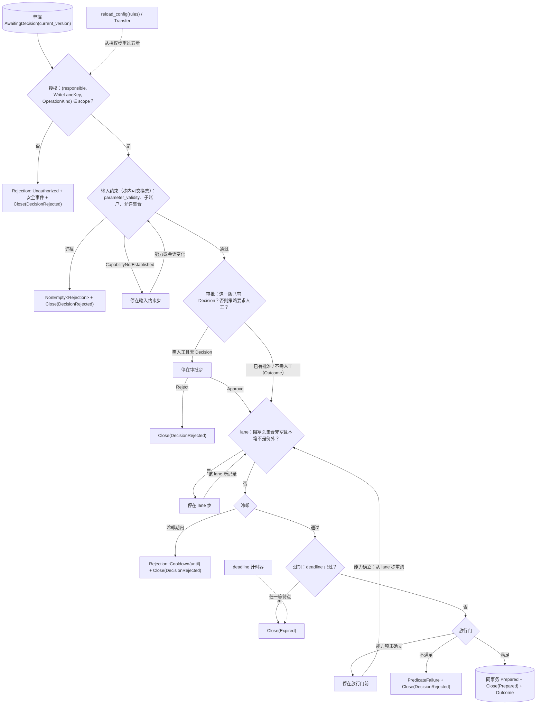

# STS 规则链（含规则文件内容）

- **层级与元素**：L3 component，核心进程内的 STS 规则链。
- **上级文档**：[core-process/design.md §4.1 组件指南](design.md#41-组件指南)。
- **决定什么**：一张 `AwaitingDecision` 的单据怎样被放行进 `Prepared` 或被否决：规则的形状（STS `step`）、五步顺序固定链（授权 → 输入约束 → 审批 → lane → 过期）与放行门、冷却、规则判断所用的状态从哪来、等待与重入、规则版本变更与移交；以及统一路径里策略 / 审批规则文件的内容与合法性。
- **读者**：核心实现者；写规则文件的运维者与 Alice；下游自动决定者的作者。
- **状态**：已定。
- **非目标**：单据的状态字段怎样求出（参数合规、两层对账、检查目录，[ticket.md §3.4 参数合规：意图参数 schema](ticket.md#34-参数合规意图参数-schema-设计)、[ticket.md §4.5 交易协议：操作种类、目标、可执行性、检查目录](ticket.md#45-交易协议操作种类目标可执行性检查目录-交易协议)）；阻塞头集合的定义与绕过（[lane.md §3.3 阻塞头集合](lane.md#33-阻塞头集合)）；规则文件怎样被读入与重载（[control-plane.md §4.4 reload_config(kind)](control-plane.md#44-reload_configkind)、[core-process/design.md §4.6 统一路径文件](design.md#46-统一路径文件)）；会话 principal 的建立（[session-entry.md §3 模型](session-entry.md#3-模型)）。

证据标签与编号前缀的约定见 [README.md §0.4 阅读约定](../../README.md#04-阅读约定)。

## 1 问题域

### 1.1 上级分配给本组件的需求

| 来源（[README.md §2 问题域](../../README.md#2-问题域)） | 内容 |
|---|---|
| C3、H6 | 人工审批按策略；意图有时效，过期不补偿。 |
| C9、C10 | 输入约束：作用域、子账户、instrument 允许集合、参数合规。 |
| C11 | 授权以 principal × `(WriteLaneKey, OperationKind)`；决定绑定版本；待决集合版本期望。 |
| C12 | 规则否决；必要项 fail-closed；冷却。 |
| H4 | 同一 lane 的写全序。 |
| O11 | 旧实现在检查通过时计冷却、审批等待期间计时开始（缺陷）。 |
| Q7、Q8、Q9、Q10、Q16、Q17、Q18 | 送审即否决、人工审批与过期、决定版本冲突、冷却；能力未确立时不误关不误放；重启后判定与不重启相同。 |

核心进程分配给本组件的接口：执行事实唯一写入口中 Decision / `Outcome` / `Rejection` 与授权步否决时的安全事件的写者（[core-process/design.md §4.3.4 执行事实的唯一写入口](design.md#434-执行事实的唯一写入口)）；放行时与单据的 `Prepared` + `Close(Prepared)` 同一事务（[core-process/design.md §4.3.5 同事务集合](design.md#435-同事务集合)）。

### 1.2 本组件直接面对的域性质

- **规则是业务，判据是协议**（[README.md §1.3 UTA 不含业务](../../README.md#13-uta-不含业务)）：阈值、允许集合、间隔由 Alice 写进规则文件；同一规则文件在两个实现里必须给出同一放行 / 否决。
- **规则文件由 Alice 写、整文件原子替换**，核心只在启动与 `reload_config(rules)` 时读；版本 = 内容 hash。
- **核心 UTC 时钟**（[core-process/design.md §3.8 基础值类型](design.md#38-基础值类型)）：`deadline` 与冷却只按核心时钟比较，记录的事件时间与收到时间不参与。
- **等待可能很长**：单据可能在审批、lane 或能力未确立上停数小时，期间规则、负责人、会话、能力都会变。

## 2 驱动

Q7、Q8、Q9、Q10、Q16、Q17、Q18（[README.md §3.1 质量场景](../../README.md#31-质量场景)）。本组件的响应度量写在 §6.3 各验收项。

## 3 模型

### 3.1 规则是 STS，不是订单对象

```rust
trait Rule {
    type Context;    // 本次判断依据：时钟、授权策略、能力证据
    type RuleState;  // 规则判断要用的状态：冷却、待决集合版本、lane 阻塞头、过期；每次求值由记录 fold 出，不另存（§3.4）
    type Input;      // 本次输入：意图、决定、deadline 到时、回执、对账证据
    type Rejection;  // 规则层具名 enum，包装组合子层的失败 kind；无 catch-all
    type Outcome;    // 接受转换产生的事实
    fn step(ctx: &Context, st: RuleState, input: Input) -> Result<(RuleState, Vec<Outcome>), NonEmpty<Rejection>>;
}
```

- **规则独立、组合具名。** [证据：fp-01 M8 cardano STS；fp-04 命题 5] 授权、输入约束、审批、期限、lane、fail-closed 各为独立规则，各有自己的 `RuleState`/`Outcome`/`Rejection`，不共同修改单一全局对象。组合状态是**具名 struct**；组合 rejection 是**具名 enum**，每个变体 `From` 一条子规则的 rejection。子规则内部的守卫失败是组合子层的 kind enum（[core/design.md §3.2 组合子值树与五个 fold](../design.md#32-组合子值树与五个-fold)），由规则层包装，两层各自封闭。扩展轴是 venue 与协议，不是规则。加规则改这两个具名类型，显式接受。
- **执行解耦。** 规则计算“允许执行” ≠ 调用 venue。所有决定先持久化为记录，再由 IO 壳执行（[io-shell.md §3.2 IO 壳是效应侧的解释器](io-shell.md#32-io-壳是效应侧的解释器)）。
- **核心状态最小化。** 核心只持有规则运行所需的状态。订单、持仓等读模型只是对记录的非权威 fold，**不作权威、不被规则引用**（[read-model.md](read-model.md)）。[证据：fp-03 命题 1]
- **记录类型按 stream 参数化。** 每条 lane / 账户 stream 拥有独立的 Input 集与 decider（Equinox `Category`/`StreamId` 模式），核心不定义全局 effect enum。[证据：fp-03 条目 7]
- **失败类型结构。** `NonEmpty<Rejection>` 保留依赖结构；`Validated` 式累积仅用于相互独立的校验项。[证据：fp-04 命题 8]

不选：

- **cardano 式泛型 `Embed` 组合规则**：Rust 无类型级和 / 积自动构造，泛型嵌套是 O(N²) 样板或退化到 `BoxError` catch-all；规则集本就闭合，具名 struct/enum 更直接。
- **全局 effect enum**：把互不相关的规则耦进一个全局类型；按 stream 参数化避免全局耦合。

### 3.2 可交换集与顺序固定链

规则组合分两类：**可交换集**（相互独立的 guard，以交换性测试保证）与**顺序固定链**（由代码固定执行顺序并测试）。不存在“任意装配顺序均不改变结果”的默认前提。[证据：fp-03 命题 6]

- 五步之间是顺序固定链：每步读前一步 append 的记录（[envelope.md §2.4 推论 3](envelope.md#24-推论)）。
- 可交换集只出现在**一步之内**：输入约束步的各守卫字段校验、授权步的各 scope 判定彼此独立，以 `Validated` 累积并要求交换性测试。
- 跨步的守卫一律不可交换。

不选：**“任意装配顺序不改变结果”作默认前提**：fp-03 命题 6 表明不成立。

### 3.3 读触发的写同形；授权是规则不是记录种类

AI 发请求、程序满足规则、审批人作决定，都是“读的副作用消费为写”，记录形状相同：带 principal、带依据 `LogPosition`。差别只在**哪些 principal 的记录足以让写进入 prepare**，这由授权规则决定。“谁、何时、依据什么”由记录上的 principal 与依据字段满足，不需要为审批另设记录种类。

不选：**为审批另设记录种类**：principal + 依据字段已足够。

### 3.4 `RuleState` 是记录的 fold，不另存 [设计]

`step` 读的 `RuleState` 是一个值，每次求值时从执行事实与规则文件求出；`step` 的输出是记录（Decision、`Outcome`、`Rejection`、`Close`、`Prepared`），不是对某张状态表的更新。

| 成员 | 源头（fold 的输入） |
|---|---|
| 冷却时钟 | 该 `(WriteLaneKey, instrument)` 上下单写的 `SendBarrier` 记录（§4.5），间隔取规则文件 |
| 待决集合版本 | 该单据的 `TicketAction` 与 Decision 记录：`(ticket, current_version)` 有无 Decision |
| lane 阻塞头 | 该 lane 执行事实流上各尝试的记录与 `bypass_lane` 控制记录（[lane.md §3.3 阻塞头集合](lane.md#33-阻塞头集合)） |
| 过期 | 单据当前版本所带的 `deadline` 与核心 UTC 时钟 |

- **原子性。** 一步产生的全部记录同一事务 append；放行时 `Prepared` 与 `Close(Prepared)` 同事务。没有“记录 + 状态表”的双写。
- **恢复。** 重启后对每张 `AwaitingDecision` 单据按记录重新求值（[core-process/design.md §4.7.3 启动五步](design.md#473-启动五步)）：停在哪一步、等什么，都由记录与当时的会话、能力、时钟重新得出。
- 持久化：规则状态**没有写者**，不是持久化状态；读者是本组件自己，每次求值由执行事实 fold 出（单据动作与 Decision、lane 上各尝试的记录、`bypass_lane` 控制记录、`deadline` 与核心 UTC 时钟）；没有副本，重启后与平时同样按记录求值。
- 理由：这些成员都是 UTA 自己的记录的函数；另存一份就是在源头之外的副本，它的写者（STS）看不到改变它的全部输入（阻塞头由 IO 壳的记录改变），会陈旧而误放或误挡（[README.md §1.2 权威源头与生命周期](../../README.md#12-权威源头与生命周期)近处副本）。没有实测的性能需要，不加缓存；需要时按近处副本的纪律另加，写清派生、失效与刷新（会推翻它的观测见证伪 #28）。
- 不选：**持久化 `RuleState` 表并与决策同事务更新**：两个源头（表与记录的 fold）并存，IO 壳 append 的记录不经 STS 就改变阻塞头，表随之陈旧，还要一个没有归属的唤醒者；崩溃与版本升级时要对账。

### 3.5 等待与重入 [设计]

链的一步可以不产生记录而停下：单据保持 `AwaitingDecision`，停在该步。停下的点有三类：审批步（待 Decision）、lane 步（阻塞头集合非空）、能力未确立（输入约束步读到 `CapabilityNotEstablished`，或放行门的能力项未确立，[ticket.md §3.4 参数合规：意图参数 schema](ticket.md#34-参数合规意图参数-schema-设计)）。停下不是一条记录，也没有等待标志；链在下列事件的事务提交之后对相关单据重新求值：

| 停在 | 重新求值事件 |
|---|---|
| lane 步 | 该 lane 上 `SendBarrier`、`VenueAccepted`、`VenueRejected`、`NotSent`、`Undetermined`、`ResolutionEvidence`、`Expired`、`Abandoned` 与 `bypass_lane` 控制记录的 append |
| 审批步 | 该单据的 Decision |
| 能力未确立 | 该来源的声明版本、`CapabilityObserved`，会话进入或离开 `Established` |
| 任一停下的点 | 该单据 `deadline` 的计时器到期（只求值过期步），`reload_config(rules)`，该单据的 `Transfer` |

**重入经过 lane 步。** 从任一等待（能力或会话未确立、审批、lane）恢复的单据，重跑链时都依次重过 lane（阻塞头）→ 冷却 → 过期 → 放行门，每一步照常可以停下或否决：停在审批步、lane 步或放行门前的单据从 lane 步起重跑；停在输入约束步的单据还没有过审批与 lane，从输入约束步起重跑，同样经过 lane 步。单据从不由放行门前的等待直接进入 `Prepared`：append `Prepared` 的那次求值必定刚过了 lane 步与冷却。例外都不产生 `Prepared` 的捷径：规则版本变更与 `Transfer` 从授权步起重过全部五步（§4.6、§4.7）；`deadline` 计时器只求值过期步（§4.4）。

- 理由：阻塞头只算已 `Prepared` 的尝试（[lane.md §3.3 阻塞头集合](lane.md#33-阻塞头集合)），停在放行门前的单据不是阻塞头。同一 lane 的两张单据可以在离线期间都过了 lane 步、停在放行门前；会话恢复时若从门续跑，两张先后 `Prepared`，同 lane 出现两次等待中的尝试，冷却也被绕过。从 lane 步重跑，先放行的那张成为阻塞头，后一张在 lane 步看到它而停下。
- 不选：**`Unknown` 视同 `Unsupported`**（把“未确立”当作来源的否定）；**离线时按最近声明判定**（以副本代替源头此刻的结论）；**另设等待标志**（等待是记录的 fold）。

### 3.6 不变量

- 组合状态是具名 struct、组合 rejection 是具名 enum，每变体 `From` 一条子规则 rejection。
- 组合子层失败与规则层 `Rejection` **两层各自封闭**，由两层各自 enum + `From` 保证。
- 核心不定义全局 effect enum；记录类型按 stream 参数化。由 decider per stream 保证。
- 一个 `current_version` 至多一条 Decision（§4.3）。
- `Prepared` 只由刚依次过了 lane 步、冷却、过期与放行门的那次求值产生（§3.5）。
- `RuleState` 没有持久副本；任何时刻的判定都是记录与规则文件的函数（§3.4）。

## 4 结构

### 4.1 与同级组件的接口

| 方向 | 对方 | 交换 |
|---|---|---|
| 读 | 单据 | `responsible`、`current_version`、`parameter_validity`、`basis_validity`、`alignment`、`TicketAction`、Decision |
| 写 | 单据 / 存储 | Decision、`Outcome`、`Rejection`（带 `rule_version` 与 `checked_as_of`）、`Close(DecisionRejected \| Expired)`、放行时同事务的 `Prepared` + `Close(Prepared)`；授权否决时的安全事件 |
| 读 | lane 驱动 | 该 `WriteLaneKey` 的阻塞头集合、对某版本有效的 `bypass_lane` 覆盖 |
| 读 | 集成会话 | 会话有效声明（能力未确立的判定、能力项） |
| 读 | 规则文件（经控制面载入的当前版本） | §4.9 的全部取值与 `rule_version` |
| 被用 | 单据组 `decide` | 审批步的输入（§4.3） |

### 4.2 顺序固定链：授权 → 输入约束 → 审批 → lane → 过期

| 步 | 读什么 / 做什么 | 依据 |
|---|---|---|
| 授权 | 以单据 `responsible` 为主体查 `(principal, WriteLaneKey, OperationKind)` scope | C11 |
| 输入约束 | 读单据 fold 的 `parameter_validity`；守卫字段校验：子账户已枚举、instrument 在策略的允许集合内（允许集合只对带 instrument 的操作种类，`Cancel` 不适用） | C9/C10；守卫字段处理器 |
| 审批 | 策略要求人工则等待带版本的 Decision；不要求人工则以 `rule_version` 为依据直接通过，结果是本步对当前 current_version 的 `Outcome`，不写 Decision | C3；H6；C11 |
| lane | 读该 `WriteLaneKey` 的阻塞头集合；集合非空则停在本步；集合为空时判冷却，冷却期内否决，否则放行 | H4；C12 |
| 过期 | `deadline` 过期规则，由 `deadline` 到时触发 | H6 |

之后是放行门（§4.5）。



**授权步。** 查询的是：哪些 principal 的记录足以让写进入 prepare。程序意图的单据以发出成员的装载 principal 为负责人（[outbound-requests.md §4.3 写处理器](outbound-requests.md#43-写处理器-设计)），它的授权范围决定能否不经人工直接放行。否决时 append `Rejection::Unauthorized` 并记安全事件（C11）。

**输入约束步** [设计]。以下各项彼此独立，以 `Validated` 累积，一次否决列出全部违反：

- `parameter_validity` 为 `Invalid`（带逐项违反）、`NotSupported`、`SchemaMismatch` 或 `TargetNotAccepted`，各自单列，四者原因可区分。它无条件生效，策略不能关闭。为 `CapabilityNotEstablished` 时本步不否决也不放行：单据停在本步等待（§3.5），与其余各项无关；能力确立后重新求值全部各项。
- 目标子账户已枚举（C10）。
- **允许集合**：策略为该 `(principal, WriteLaneKey, OperationKind)` 给出 instrument 允许集合时，意图的 instrument 不在集合内即否决；不给出即不限制；给出空集即全部否决。
- **不在本步：instrument 是否属目标账户。** 这是 venue 的事实，UTA 没有它的源头，也没有可询问的契约操作；核心在写调用之前只否决由自己的记录与声明值判得出的不合规（C9）。instrument 能否在该账户交易，由上游对这次写的回答给出（`VenueRejected`）；策略要求提前挡住已知不可写的 instrument 时，列出可交易性检查（[ticket.md §4.5 交易协议：操作种类、目标、可执行性、检查目录](ticket.md#45-交易协议操作种类目标可执行性检查目录-交易协议)）。
  - 不选：**核心按观察判定 instrument 归属**（以本地副本代替上游的结论，副本过时就误拒或误放）；**要求集成声明账户的 instrument 全集**（上游的性质，随时变化，声明即副本）。
- **各项的适用范围** [设计]：一项校验只对带它所读字段的操作种类求值（守卫字段表，[ticket.md §4.5 交易协议：操作种类、目标、可执行性、检查目录](ticket.md#45-交易协议操作种类目标可执行性检查目录-交易协议)）。意图的 instrument 是 `Place` 与 `Replace` 新单部分的守卫字段，`Close` 取 `PositionRef` 的 instrument；`Cancel` 没有 instrument，允许集合对它不适用，它的目标订单属于目标作用域已由构造保证。C10 按作用域而定，对全部操作种类照常适用。策略给 `Cancel` 配 instrument 允许集合，规则文件不合法（§4.9），不在运行期忽略。理由：`Cancel` 没有 instrument，规则无从比较；否决全部、放行全部或在运行期忽略，是三种都说得通、结果不同的做法，而写这条规则的人以为它在起作用。给文件判不合法与“给 `Close` 配冷却”同理。
- 否决 = `Rejection`（带违反项与 `rule_version`）+ `Close(DecisionRejected)`。

### 4.3 审批步

- 是否需人工由策略按 `(principal, WriteLaneKey, OperationKind)` 给出：总是、从不，或“名义超过阈值 N 时”。第三种下，意图带 `notional` 且 ≤ N 则不需人工；带 `notional` 且 > N、或以 `quantity` 定量（不带 `notional`）则需人工。STS 不读观察，不估算以数量定量的单子值多少钱；估算属于敞口检查（[ticket.md §4.5 交易协议：操作种类、目标、可执行性、检查目录](ticket.md#45-交易协议操作种类目标可执行性检查目录-交易协议)），而不能比较时一律走人工是 fail-closed 的一侧。`Cancel` 既不带 `notional` 也不带 `quantity`，第三种条件对它无从判定，只能给“总是”或“从不”；给它第三种条件，规则文件不合法（§4.9）。
- 决定者按 `(principal, 动作种类)` 授权。
- 另一笔过期未决独立处理。
- **`decide` 只在要求人工时被接受** [设计]：当前规则对该单据的 `(principal, WriteLaneKey, OperationKind)` 要求人工审批时，`decide` 才被接受；否则它被拒，不 append 任何记录，错误名由实现定（[ticket.md §4.3 单据组（核心↔解释层）](ticket.md#43-单据组核心解释层)）。这里的 principal 是 `decide` 调用时该单据的负责人（最近一次 `Draft`/`Transfer` 所定），所以 `Transfer` 之后按新负责人判定。这包括审批步已以 `Outcome` 自动通过、仍停在 lane 步的单据。之后规则改为要求人工时，人的 `decide` 照常被接受。
  - 理由：不要求人工时，没有 Decision 的单据以审批步的 `Outcome` 放行（放行门第 3 项）；这时接受 `decide`，批准不起任何作用，否决却关闭一张规则已放行的单据，决定者就借此越过了“不要求人工”这条规则。下游决定者本就只在要求人工的单据上起作用（[ticket.md §4.5 交易协议：操作种类、目标、可执行性、检查目录](ticket.md#45-交易协议操作种类目标可执行性检查目录-交易协议)）。
- **一个 `current_version` 至多一条 Decision** [设计]：被接受的 `decide` 另以“该 `(ticket, current_version)` 尚无 Decision 记录”为判据（C11 的待决集合版本即此）；已有 → `Conflict(AlreadyDecided)`。不要求人工时审批步只写 `Outcome`、不写 Decision，所以只以 `Outcome` 自动通过、从未有过 Decision 的版本，之后规则改为要求人工（或移交给要求人工的负责人）时还没有 Decision，人的 `decide` 不得 `Conflict(AlreadyDecided)`；已有 Decision 的版本在规则变更或移交之后仍以它为依据，第二条 `decide` 照常 `Conflict(AlreadyDecided)`。
  - 理由：决定之后单据可能仍停在 lane 步而版本不变，靠 `Closed` 挡不住同版本的第二条决定。

### 4.4 lane 步、冷却与过期步

**lane 步。** 阻塞头集合的定义与语义见 [lane.md §3.3 阻塞头集合](lane.md#33-阻塞头集合)。

- 集合非空时本笔停在此步，单据保持 `AwaitingDecision`，不产生 `Prepared`。
- 不等待阻塞头的只有两种（[lane.md §4.2 无第二类越顶队列；撤阻塞头的撤单](lane.md#42-无第二类越顶队列撤阻塞头的撤单)、[lane.md §4.3 显式绕过 bypass_lane(ticket)](lane.md#43-显式绕过-bypass_laneticket)）：以阻塞头中某次尝试记下的订单键为 `target` 的撤单意图；有覆盖当前全部阻塞头的绕过控制记录的单据版本。

**冷却** [设计]。冷却是 lane 规则的判断，其时钟是执行事实的 fold：

- **键与时钟**：`(WriteLaneKey, instrument)` 上最近一次“下单写”的 `SendBarrier` 记录时间（UTC）；instrument 经 `SendBarrier` 的 `AttemptRef` 回连其 `Prepared` 所载的意图取得。下单写 = `Place` 与 `Replace` 的尝试；撤单与平仓的尝试不设、也不受冷却。
- **间隔与键同轴**：间隔由策略按 `(WriteLaneKey, OperationKind)` 给出（只对 `Place`、`Replace` 可给），跨 principal 共享，不按 principal 分。理由：时钟本就跨 principal；若间隔按 principal 给，间隔短的 principal 不断刷新共享时钟，间隔长的 principal 永远等不到，结果是“最先用完的那个限制”而不是任何一行声明的限制。
- **更新点**：`SendBarrier` 持久化之时（可能已发出，[io-shell.md §4.2 发送屏障与发出前门](io-shell.md#42-发送屏障与发出前门)）。`Prepared` 未发即 `Expired` 的不计；因而没有真正发往上游的写也可能计时（`SendBarrier` 之后、调用之前崩溃，或集成返回 `NotSent`），这是有意接受的保守代价。
- **判定点**：单据经 lane 步放行的那一刻判定，不是等待条件；单据从等待重入时重过 lane 步，冷却随之重判。该 `(WriteLaneKey, OperationKind)` 有间隔 `d` 时，当前时刻 < 该键时钟 + `d` 即否决：`Rejection::Cooldown{until}` + `Close(DecisionRejected)`；等于或晚于即通过。正常路径下放行时同 lane 前一次尝试已结束等待，它的 `SendBarrier` 已在记录里；同一键上若有已 `Prepared` 而尚无 `SendBarrier` 的下单写（只在绕过时出现），本次判定不放行（否决）；它不设时钟，那次尝试越过屏障或 `Expired` 后这一阻碍随之消失。间隔为 0 等同不设冷却。`bypass_lane` 只越过阻塞头等待，不越过冷却。
- **恢复**：时钟是对 `SendBarrier` 记录的 fold，重启后由记录重建，没有另存的状态。
- 理由：在检查通过时计时，放行后未发出也占冷却，且审批等待期间计时已开始（旧实现的缺陷，O11）；以业务回执计时，被拒或结果未知的发送不计冷却，丢掉了“可能已发出”的依据。放在 lane 步而不是输入约束步，因为单据可能在审批与 lane 上等很久，判定必须贴近放行。撤单与平仓是减少风险的动作，不应被冷却挡住。
- 不选：**冷却作为一项检查（`AlignmentCheck`）**：检查只读观察值，执行事实不进钩子的 `eval`（[ticket.md §3.6 第二层：意图专属对账 alignment；偏离是状态](ticket.md#36-第二层意图专属对账-alignment偏离是状态)）；**冷却让单据等待而不是否决**：待决单据会在 lane 上堆积，与 C12 的“规则否决”不符。

**过期步。** `AwaitingDecision` 期间到期 = `Close(Expired)` 否决记录，不补偿。这包括停在审批步、lane 步，以及因能力未确立停在输入约束步或放行门前时：`deadline` 计时器到期即对该单据求值过期步，不先重跑它前面停下的那一步。计时器在重启后按 `deadline`（UTC）重装。

### 4.5 放行门

进入 `Prepared` 前，链读取单据 fold 的三项状态：

1. `basis_validity == Fresh`（[ticket.md §3.5 第一层：依据有效性 basis_validity](ticket.md#35-第一层依据有效性-basis_validity)）；
2. 必要项 `alignment` 为 `Aligned`；能力项恒在必要项内，不由策略声明，它按会话有效声明核对可执行性（含意图所带的参数 schema 身份仍是声明的那个，[ticket.md §4.5 交易协议：操作种类、目标、可执行性、检查目录](ticket.md#45-交易协议操作种类目标可执行性检查目录-交易协议)）；
3. 审批的依据绑定当前版本：这一版有批准的 Decision 时，它所绑定的版本 = `AwaitingDecision(current_version)`；没有 Decision 时（审批步只在策略不要求人工时不等 Decision），审批步对这一 current_version 给出了带 `rule_version` 的 `Outcome`。规则版本变更或移交之后，已有的 Decision 仍是这一版的依据，即使当前规则已不要求人工。

能力项未确立（该来源此刻没有已建立的会话，或会话有效声明对该操作为 `Unknown`）时，门不求值：单据停在门前等待，能力确立后从 lane 步起重跑（§3.5），`deadline` 到期由过期步关闭。其余任一不满足 → `PredicateFailure`（fail-closed，C12），不发出。

- 它与链上其他步的否决同形：`Rejection` 记录带 `rule_version`，单据 `Close(DecisionRejected)`，负责人按当前世界另起单据。
- 等待期间已呈 `Diverged` 的单据，可由审批人在放行前 `SendBack`。
- 规则**不自己算**这三项：它们是单据 fold 已经算好的状态字段。
- 此门即只读校验边界在 STS 链上的读取点，不参与两阶段。
- 满足时同一事务 append `Prepared` + `Close(Prepared(position))` + 本步的 `Outcome`。

**审计字段。** 每条 Decision / `Outcome` / `Rejection` 记录携带它所依据的 `checked_as_of`（该次 `alignment` 评估实际消费的位置集，[ticket.md §3.6 第二层：意图专属对账 alignment；偏离是状态](ticket.md#36-第二层意图专属对账-alignment偏离是状态)）与 `rule_version`。审计由此重放这次判断。

### 4.6 规则版本变更 [设计]

链每次评估读当时生效的规则版本，规则不冻结进单据。待决单据放行时，若当前 `rule_version` 与它此前各步通过时所依据的不同，链从授权步起按当前规则重过全部五步：

- 已有 Decision 仍绑定 `current_version`，仍是“这一版批不批”的回答。一版至多一条 Decision，不因规则变更再要一条。
- 决定者对该动作的授权与“是否需人工”按当前规则重判：原单自动通过而新规则要求人工 → 单据停在审批步等 Decision；原决定者在新规则下已无该授权 → 审批步否决。
- 任一步在新规则下否决即 `Rejection`（带新 `rule_version`），单据 `Close(DecisionRejected)`。收紧规则可使待决单据在放行时被否决。

### 4.7 移交 [设计]

授权步、输入约束步的允许集合与审批步的“是否需人工”都以单据的负责人为主体，而负责人由最近一次 `Draft`/`Transfer` 决定。此前各步的通过依据的是当时的负责人，负责人换了，这些依据随之结束。所以 `AwaitingDecision` 中的 `Transfer` 是一个重新求值事件：它的事务提交之后，不论单据停在哪一步，链都与规则版本变更一样从授权步起重过全部五步，主体是新负责人：

- 授权步与输入约束步按新负责人判定：新负责人没有该 `(WriteLaneKey, OperationKind)` 的授权即授权步否决，意图的 instrument 不在新负责人的允许集合内即输入约束步否决，都是 `Rejection`（带 `rule_version`）+ `Close(DecisionRejected)`。
- 审批步：已有绑定 `current_version` 的人工 Decision 仍算数，不因移交再要一条，新负责人的规则不要求人工时也由它作放行门第 3 项的依据。没有时按当前规则对新负责人判定：要求人工 → 停在审批步等 Decision；不要求 → 本步对这一 current_version 给出 `Outcome`。
- 然后照常过 lane、冷却、过期与放行门。
- 理由：不重过授权与输入约束，单据就会按旧负责人的授权与允许集合放行，新负责人的规则要求否决的意图照样进入 `Prepared`；只从 lane 步续跑，又会让放行门读到旧负责人名下的 `Outcome`，越过新负责人要求的人工审批。
- 不选：**`AwaitingDecision` 中拒绝 `Transfer`、先 `SendBack` 再移交**：强制移交是负责人失联时由规则处理的出口（[ticket.md §6.1 风险 / 敏感点 / 权衡点](ticket.md#61-风险--敏感点--权衡点)），而 `SendBack` 只能由审批人发起。

### 4.8 授权与审批策略的表示

- principal → scope 与控制动作、结果未知组的授权，写在统一路径的策略 / 审批规则文件（§4.9）。写类操作按 `(principal, WriteLaneKey, OperationKind)` 授权（C11）；控制动作与结果未知组（`abandon`、`retry_reconciliation`）按 `(principal, 动作种类)` 授权。三者同一规则族，就是授权步所读的这一族（入口侧见 [session-entry.md §4.2 请求的身份与授权的入口](session-entry.md#42-请求的身份与授权的入口)）。
- 规则文件只写交易协议定义的词汇与取值；判据由交易协议写定，同一规则文件在任何实现里给出同一个放行 / 否决。
- 规则版本 = 内容 hash，经 `reload_config(rules)` 生效；规则不冻结进单据（§4.6）；`transfer` 之后从授权步起重过（§4.7）；其余重新求值事件见 §3.5。
- 负责人失联由规则处理：过期步 `Close(Expired)`，或带 principal 的强制 `transfer`。
- 每条 `Outcome` / `Rejection` / 控制记录都带所依据的规则版本 hash，审计由此回链。

### 4.9 规则文件的内容与合法性

文件的统一路径、写者（Alice）、原子替换与读取时刻见 [core-process/design.md §4.6 统一路径文件](design.md#46-统一路径文件)；`reload_config` 的控制记录与失败处理见 [control-plane.md §4.4 reload_config(kind)](control-plane.md#44-reload_configkind)。内容：

- principal → scope 表，每行键为 `(principal, WriteLaneKey, OperationKind)`（`OperationKind` 取交易协议的封闭集合），值为：
  - 人工审批条件：总是 / 从不 / 名义超过阈值 N（§4.3；`Cancel` 只可给前两种）；
  - instrument 允许集合（可缺；缺 = 不限，空集 = 全部否决，§4.2；`Cancel` 没有 instrument，不可给）；
  - 检查目录各项：必要 / advisory、该项参数（敞口的 `ratio`）、是否“先查后判”（[ticket.md §4.5 交易协议：操作种类、目标、可执行性、检查目录](ticket.md#45-交易协议操作种类目标可执行性检查目录-交易协议)）；能力项恒为必要项，不在此列；
  - 依据有效性窗口 `Lag`（[ticket.md §3.5 第一层：依据有效性 basis_validity](ticket.md#35-第一层依据有效性-basis_validity)）。
- 按 `(WriteLaneKey, OperationKind)` 的冷却间隔（只对 `Place`、`Replace` 可给，跨 principal 共享，§4.4）。
- 控制动作与 `abandon` 授权（按 `(principal, 动作种类)`）。
- 按 `(WriteLaneKey, OperationKind)` 的 `deadline` 缺省：意图未带 `deadline` 时，在 `Draft`/`Revise` 规范化时填入该版本；版本 hash 含它，审批人看到的即放行的。此项也缺，则取运行期参数的全局缺省。
- 规则版本 = 内容 hash，写进此后每条 `Outcome` / `Rejection` / 控制记录。

**合法性**在重载与启动时校验。下列任一使整份文件不合法（重载 `Rejected` 并保留上一有效版本；启动期按读配置失败拒绝启动）：

- 键中的 `OperationKind` 不在封闭集合内；
- 参数不在其合法域（`ratio` ≤ 0、间隔为负、名义阈值为负）；
- 给了不接受该参数的操作种类（如对 `Close` 给冷却，对 `Cancel` 给 instrument 允许集合或名义阈值条件）；
- 列出了需要参数的检查项却没给参数；
- 把“原单仍在”列为必要；
- 不认识的键（不被忽略）。

判据不在规则文件里：每项参数的含义与比较边界由交易协议写定（本文与 [ticket.md §4.5 交易协议：操作种类、目标、可执行性、检查目录](ticket.md#45-交易协议操作种类目标可执行性检查目录-交易协议)），规则文件只给取值。

不选：**规则文件只列检查名、判据由实现定**：结果随实现分叉；**所有 guard 都交给下游决定者**：不能对所有来源生效，不随世界重算，占用唯一的 Decision。

## 5 走查

组件级主 trace 在 [core-process/design.md §5.1 W1（Q1）正常下单闭环](design.md#w1q1正常下单闭环)、[core-process/design.md §5.1 W18（Q8+Q9+Q10）送审即否决、人工审批与过期、决定版本冲突、冷却](design.md#w18q8q9q10送审即否决人工审批与过期决定版本冲突冷却) 等处；这里走链的内部。

**W18 的链细化（Q8、Q9、Q10）。**

1. 只读账户下单：授权步否决，`Rejection::Unauthorized` + 安全事件 + `Close(DecisionRejected)`，后续步不执行。
2. 参数不合 schema：输入约束步读 `parameter_validity = Invalid(…)`，与允许集合的违反一并以 `NonEmpty<Rejection>` 列出。instrument 属他账户而在允许集合内：本步通过，交由上游拒绝（`VenueRejected`）。
3. 策略要求人工：审批步停下；P1 的 `decide(Approve)` 落 Decision（绑定 v3）；P2 以同一期望版本 `decide` → `Conflict(AlreadyDecided)`。批准后：lane 集合空 → 冷却：同 `(WriteLaneKey, instrument)` 上一次下单写的 `SendBarrier` 距今不足间隔 → `Rejection::Cooldown{until}` + `Close(DecisionRejected)`；已批准不豁免。
4. 另一笔到 `deadline` 仍无 Decision：计时器只求值过期步 → `Close(Expired)`，无 `Prepared`。

**W5 的链细化（Q7）。** 两笔同 lane 单据先后到 lane 步：第一笔放行得 `Prepared`，成为阻塞头；第二笔在 lane 步停下。第一笔的尝试 `Undetermined` 期间，该 lane 上每条新的尝试记录提交都触发第二笔重新求值，集合仍非空则继续停。阻塞头的等待结束（结果确立或被放弃）→ 集合空 → 第二笔重过 lane → 冷却 → 过期 → 放行门。

**离线期间两张单据（验收 #60 的路径）。** 同一 lane 的两张 `Place` 在会话断开期间都已过 lane 步、停在放行门前（能力项未确立）。会话恢复（会话进入 `Established` 的事务提交）→ 两张各自从 lane 步重跑：先求值的那张过 lane、冷却、过期、门 → `Prepared`，成为阻塞头；后一张在 lane 步看到它而停下。只有一个 `Prepared`。

**移交（验收 #64 的路径）。** A 的单据自动通过、停在 lane 步，移交给 B（B 的允许集合为空）→ `Transfer` 事务提交后从授权步重过：输入约束步否决。移交给审批为“总是”的 B → 停在审批步，lane 清空也不放行，此时 `decide` 被接受。

**重启。** 删去全部快照后重启：每张 `AwaitingDecision` 单据按记录重新求值（启动第 4 步）；冷却时钟由 `SendBarrier` fold 出，阻塞头由 lane 流 fold 出，计时器按 `deadline` 重装；每张单据停在与不重启时相同的点。

**卡点。** 无停在本组件之内的步骤。

## 6 评估

### 6.1 风险 / 敏感点 / 权衡点

规则链自身没有单列的风险项；它依赖的 `basis` 窗口敏感点在 [ticket.md §6.1 风险 / 敏感点 / 权衡点](ticket.md#61-风险--敏感点--权衡点)，lane 阻塞半径在 [lane.md §6.1 风险 / 敏感点 / 权衡点](lane.md#61-风险--敏感点--权衡点)。规则状态不缓存的代价与会推翻它的观测是证伪 #28。

### 6.2 证伪条件

28. **规则状态不需要缓存**（§3.4）：实测放行时对 lane、冷却与待决集合的 fold 使 STS 求值超过 [core/design.md §6.3 验收 #19](../design.md#63-验收标准) 的负载预算 → 为 `RuleState` 增一个派生缓存，写清派生自哪些记录、依赖什么、何时失效与由谁刷新；它只加速读取，不成为源头，重启时从记录重建。

### 6.3 验收

2. **规则确定性**（§3.2）：可交换规则集通过交换性测试；顺序固定链的顺序由代码显式固定并有测试。（对应 Q8/Q9）
11. **决定与审批可追溯**（§4.3、§4.5、[ticket.md §4.2 状态机与穷尽转移](ticket.md#42-状态机与穷尽转移)）：每条 `Close(Prepared|DecisionRejected|Expired)` 都可回答谁、何时、依据哪些 `LogPosition`、绑定哪个 `current_version`；同一版本的第二次决定返回冲突且不改状态；过期意图无 `SendBarrier`。（对应 Q9/Q10/Q26）
31. **规则词汇与实现无关**（§4.9、[ticket.md §4.5 交易协议：操作种类、目标、可执行性、检查目录](ticket.md#45-交易协议操作种类目标可执行性检查目录-交易协议)）：对同一规则文件与同一组记录（覆盖每项检查的边界：情景值等于 `ratio · E`、`E ≤ 0`、币种不同、没有该主体的观察、多空分仓；允许集合缺省 / 空集；名义阈值等于 N、以数量定量），两个独立实现（各用随 IDL 发布的参考 schema 校验器）逐单给出相同的放行 / 否决与相同的检查结果；冷却间隔按 `(WriteLaneKey, OperationKind)` 共享，多个 principal 交替下单时按同一间隔判定；不合法的规则文件（未知键、`ratio ≤ 0`、给 `Close` 配冷却、列出需参数的项而缺参数、把“原单仍在”列为必要）被整体拒绝。（对应 Q8/Q9）
32. **冷却**（§4.4、C12）：`SendBarrier` 持久化即设 `(WriteLaneKey, instrument)` 的时钟；未发即 `Expired` 的 `Prepared` 不设；在 `SendBarrier` 之后、调用之前崩溃仍计时，集成返回 `NotSent` 也不撤销；冷却在单据经 lane 步放行时判定、不是等待条件，单据从等待重入时随 lane 步重判，时刻等于时钟 + 间隔时放行，早于则 `Rejection::Cooldown`；`bypass_lane` 不豁免，且绕过产生的、尚未越过屏障的同键下单写使本次判定否决、在它越过屏障或 `Expired` 后不再阻碍；间隔为 0 等同不设；撤单与平仓既不设也不受；重启后判定结果与不重启时相同。（对应 Q7/Q9）
53. **撤单的输入约束**（§4.2、§4.3、§4.9）：（对应 Q8/Q9）
    - 策略为 `(principal, WriteLaneKey, Cancel)` 给出 instrument 允许集合（含空集）、或给出名义阈值审批条件：规则文件不合法，按 §4.9 处理，不在运行期忽略；
    - 合法规则文件下，参数合规、目标子账户已枚举的 `Cancel` 通过输入约束步，不因没有 instrument 被否决；目标子账户未枚举时否决；审批为“总是”时送审、“从不”时直接通过；
    - 审批为“从不”的 `Cancel` 自动通过、停在 lane 步（阻塞头集合非空，目标不是阻塞头的订单键）：有决定权的 principal 对它 `decide(Approve)` 与 `decide(Reject)` 都被拒，不 append Decision，单据仍 `AwaitingDecision`，放行的依据仍是审批步的 `Outcome`；`reload_config` 把该 `(principal, WriteLaneKey, Cancel)` 改为“总是”之后，单据按新规则停在审批步，这时的 `decide` 被接受；
    - 同一规则文件在两个实现里对同一组 `Cancel`、`Place`、`Close` 意图给出同一组放行与否决。
60. **能力未确立**（§3.5、[ticket.md §3.4 参数合规：意图参数 schema](ticket.md#34-参数合规意图参数-schema-设计)）：（对应 Q16/Q18）
    - 来源对某 `(scope, OperationKind)` 声明 `Unknown`，或该来源此刻没有已建立的会话：单据 `parameter_validity` 为 `CapabilityNotEstablished`，送审后停在输入约束步，不产生 `Rejection` 与 `Close`；能力确立为 `Supported` 后链继续并照常放行，确立为 `Unsupported` 后得 `NotSupported` 否决；一直未确立则到 `deadline` 由过期步关闭；
    - 单据已过输入约束步、停在 lane 或审批时会话断开：放行门的能力项未确立，单据停在门前，不 `PredicateFailure`；会话恢复后从 lane 步起重跑，依次过 lane（阻塞头）、冷却、过期与门，从不由门前的等待直接 `Prepared`；
    - 同一 lane 的两张 `Place` 单据在离线期间都已过 lane 步、停在放行门前：会话恢复后恰有一张 `Prepared`，另一张停在 lane 步（阻塞头集合为先放行的那次尝试），不产生第二个 `Prepared`；该 `(WriteLaneKey, instrument)` 配了冷却时，后一张在阻塞头结束等待后照常受冷却判定；
    - 离线期间最近一次声明的 `Supported` 不使任何单据放行，最近一次声明的 `Unsupported` 也不使任何单据被否决。
63. **instrument 归属交给上游**（§4.2、C9）：他账户的 instrument 在允许集合内、参数合规时，单据通过输入约束步，fixture 上游恰收到一次写并拒绝，append `VenueRejected`（原文保留）；允许集合不含它时在输入约束步被否决、无 `Prepared`；代码中输入约束步不读任何账户与 instrument 归属的观察。（对应 Q8）
64. **规则状态是记录的 fold**（§3.4、§3.5、§4.7）：（对应 Q7/Q9/Q17）
    - 存储中没有规则状态表；删除全部快照后重启，每张待决单据的去向（停在审批、lane、能力未确立，冷却判定结果）与不重启时相同；
    - 停在 lane 步的单据在该 lane 上 `SendBarrier`、`VenueAccepted`、`VenueRejected`、`NotSent`、`Undetermined`、`ResolutionEvidence`、`Expired`、`Abandoned` 或 `bypass_lane` 控制记录提交之后被重新求值，集合为空即放行；停在审批的单据在 Decision 提交后求值；停在能力未确立的单据在声明版本、`CapabilityObserved` 或会话变化后求值；停在任一点的单据在 `reload_config(rules)` 或该单据的 `Transfer` 提交后求值；任一等待点到 `deadline` 即关闭；
    - `AwaitingDecision` 中的 `Transfer`：A 与 B 的审批都为“从不”，A 的允许集合含 instrument X、B 的给出空集；A 的 X 单据自动通过、停在 lane 步，移交给 B 之后：链从授权步起按 B 重过，在输入约束步 `Rejection` + `Close(DecisionRejected)`，无 `Prepared`；移交给没有该 `(WriteLaneKey, OperationKind)` 授权的 principal 时在授权步 `Rejection`，并记安全事件；A 的审批为“从不”、B 的为“总是”时，移交给 B 之后单据停在审批步，没有 Decision 就不放行（lane 清空也不放行），此时有决定权的 principal 的 `decide` 被接受；A 的审批为“总是”且已有绑定该 `current_version` 的 Decision 时，移交给有授权的 B：B 的审批为“总是”时不再要第二条 Decision，为“从不”时放行门以这条 Decision 为依据、不以缺 `Outcome` 否决，此时的 `decide` 被拒；两种情形 lane 清空后都照常放行；
    - 一次放行的事务里只有 `Outcome`/Decision、`Prepared` 与 `Close(Prepared)`，没有另外的状态更新。
