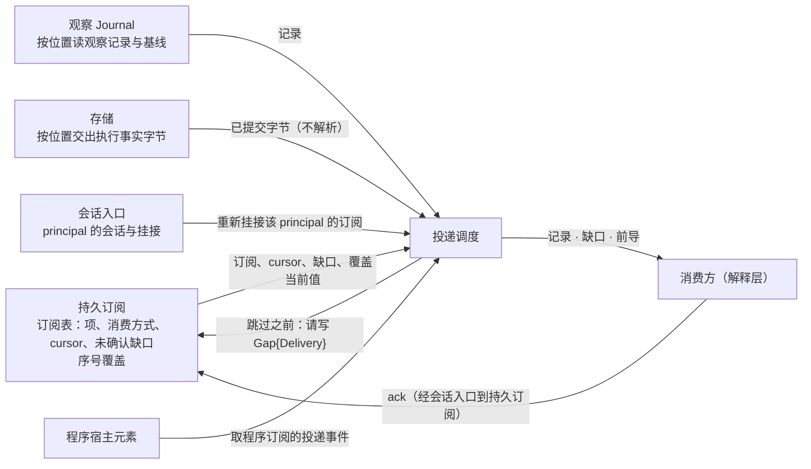

# 投递调度

## 0 定位

- **层级与元素**：L3 component，核心进程里的“投递调度”元素。上级：[core-process/design.md §4.1 组件指南](design.md#41-组件指南)。
- **本文决定**：已提交的记录怎样按订阅的 cursor 交给订阅者（消费方订阅与程序订阅）；三种消费方式在投递侧的语义与损失；背压、conflation 与停投；投递缺口的检测与交出次序；前导与 `compacted` 段的排列；按主体过滤；执行事实的按位置搬运；程序订阅投递事件的取得。
- **读者**：实现投递调度与持久订阅、程序宿主元素、会话入口的人。
- **状态**：已定。
- **非目标**：
  - 订阅表（订阅、项、cursor、投递缺口）的内容、写入、删除与接纳：[subscription.md §4.9 订阅表（持久化）](subscription.md#49-订阅表持久化)、[subscription.md §3.3 投递缺口 Gap{origin: Delivery}](subscription.md#33-投递缺口-gaporigin-delivery)、[subscription.md §3.2 cursor 与确认](subscription.md#32-cursor-与确认)。本组件只读它，并请持久订阅写缺口。
  - 程序 `Advance` 的投递事件的契约（三种事件的含义、排列约束、覆盖事件的初始值与可算位置、`to` 的确认语义）：[program-host-element.md §4.6 宿主协议](program-host-element.md#46-宿主协议)。本文只写这些事件怎样从存储与订阅表取得。
  - 序号覆盖的 fold 与覆盖检查点：[subscription.md §4.6 序号覆盖与覆盖检查点](subscription.md#46-序号覆盖与覆盖检查点)。
  - 保留边界、压缩与基线的保留规则：[observation-journal.md §2.4 保留：边界与删除规则](observation-journal.md#24-保留边界与删除规则)。
  - 按位置交出已提交字节的存储接口：[storage.md §3 接口](storage.md#3-接口)。

证据标签与编号前缀见 [README.md §0.4 阅读约定](../../README.md#04-阅读约定)。

## 1 问题域

### 1.1 分配给本组件的需求与契约

| 来源 | 分给本组件的部分 |
|---|---|
| P3 | 投递损失的三种原因在投递侧的判定：`slow_consumer`、`compacted`、`conflated` |
| C6、B5 | 不静默跳过：每次跳过与合并都可追溯到一条缺口或消费者声明的等待窗口 |
| Q12 | 慢消费者不拖累提交与其他订阅者 |
| Q29 | 重新挂接时先交出未确认的缺口，再从已确认 cursor 之后重投 |
| Q31 | 损失语义由消费者显式声明，消费方式有定义的损失 |

核心进程分配给本组件的接口：核心↔解释层订阅组的投递侧（订阅组的操作规格在 [subscription.md §4.1 核心↔解释层：订阅组与 rewind_cursor](subscription.md#41-核心解释层订阅组与-rewind_cursor)）；程序宿主元素组成 `Advance` 时向本组件取投递事件（[core-process/design.md §4.3.1 uses 图](design.md#431-uses-图)）。

### 1.2 本组件直接面对的域性质

- **消费者的速度各不相同，且不受核心控制**：消费方经解释层连在核心上（[session-entry.md §3 模型](session-entry.md#3-模型)），可能慢、停住或断连；程序在宿主进程里按预算运行。
- **投递缓冲有界**：每个订阅的投递缓冲上限是运行期参数（[core-process/design.md §4.6 统一路径文件](design.md#46-统一路径文件)）；核心不为慢消费者无界缓冲。
- **不同流之间没有可比的序**（[core-process/design.md §3.1 流、位置与三种进度](design.md#31-流位置与三种进度)）：跨流的投递先后不携带任何事实。
- **已提交的记录可按位置读出**：观察记录从观察 Journal、执行事实从存储按位置交出已提交的字节（[storage.md §3 接口](storage.md#3-接口)）；保留边界之下的观察记录已被删去，只留下按键或按流 epoch 的基线（[observation-journal.md §2.4 保留：边界与删除规则](observation-journal.md#24-保留边界与删除规则)）。

## 2 驱动

| Q | 本组件的响应 | 度量（验收） |
|---|---|---|
| Q12 | 慢者只对自己背压或（仅 `latest`）停投，写下缺口之后才跳过；其他订阅者与记录提交不受影响 | 验收 #6；#70 的投递侧（[subscription.md §6.2 验收标准](subscription.md#62-验收标准)） |
| Q31 | `latest` 的每次合并可追溯到 `conflated` 缺口或声明的等待窗口；`ordered` 从不跳过 | 验收 #6 |
| Q29 | 重新挂接时未确认缺口先于记录交出；已确认区间不重投 | 验收 #29、#70（持久订阅文档） |

## 3 模型

### 3.1 三种消费方式（投递侧）

在 `LogPosition` 的积序 `Set<LogPosition>`（≅ `Map<StreamId, Seq>`）上定义比较子，支持三种消费策略。三种都可用于程序的输入；订阅的消费方式只有 `ordered` 与 `latest`：`await-all` 的要求点是程序输入声明的一部分，订阅契约没有要求点，也不按要求点延迟投递。

| 方式 | 语义 | 损失 |
|---|---|---|
| await-all（只作程序输入） | 待所有指定输入均达到要求点后再行计算：要求点是核心日志位置，或来源证据证明的覆盖在它自己坐标上的一点 | 无（引入等待；慢时只背压，从不停投、不跳过） |
| ordered | 按单条流的顺序依次处理，不跳过中间记录；一个订阅选多条流时各流各自有序，流与流之间不定投递顺序 | 无（引入背压；慢时从不停投、不跳过） |
| latest / conflated | 允许合并中间更新，仅保留最新值 | **有**：通常的合并记为订阅的投递缺口 `Gap{origin: Delivery, reason: conflated}`，或以消费者声明的等待窗口作为其可接受的丢失界；投递缓冲耗尽时对它停投，跳过的区间记为 `Gap{origin: Delivery, reason: slow_consumer}` |

- **`await-all` 在投递侧就是 `ordered`**：程序订阅里 `await-all` 输入的项按 `ordered` 投递；要求点与等待窗口是程序在投递之上的调度，不是订阅项的属性（[subscription.md §4.7 程序订阅](subscription.md#47-程序订阅)）。它按**来源证据证明的覆盖**触发，而非按消费位置：今天唯一的这种证据是声明 `joinable_venue_seq` 的流上的序号覆盖，要求点是该输入当前流 epoch 的一个 venue 序号，覆盖的 `through` 越过它即满足；要求点为核心日志位置时，它只说日志，核心自己就能判定，不说任何完备。没有完备证据的输入上，按覆盖的要求永远不满足（完备未确立），不以时钟、到达顺序或位置替代。要求覆盖而流不给证据的声明在装载时被拒（[program-host-element.md §4.2 装载期校验](program-host-element.md#42-装载期校验)）。本组件为 `await-all` 输入取出覆盖推进事件（§4.4），不判定要求点。
- **等待窗口**：跨流按事件时间对齐（“各流 t 之前的记录都到了再算”）没有任何来源证据，所以不提供。要按时间截止的消费者声明自己的等待窗口（例如收到时间 t + w 时用已到的记录计算）：这是消费者的意图，写在它的消费声明里，不是流的元数据，也不冒充完备；窗口之后到达的记录照常 append、照常投递，窗口就是它接受的丢失界，它的输出以 `basis` / `as_of` 记下实际用到的位置，事后可追溯漏了什么。
- **程序输入的等待窗口由本组件执行** [设计]：程序 `InputDecl.wait` 声明的窗口，由本组件按核心时钟执行，只决定一批 `Advance` 含哪些记录；它不向程序交出时间，不产生时间事件，也不产生不带投递事件的 `Advance`。程序可见的时间只有记录上的（[program-host-element.md §4.6 宿主协议](program-host-element.md#46-宿主协议)）。
- **`latest` 属于传输层 conflation，而非完备消费**。它的损失有两种，都由本组件判定：通常的合并得 `conflated`；消费者慢到它的投递缓冲耗尽时，本组件对它停投，跳过的区间得 `slow_consumer`，确认之后从 `to` 之后恢复。`ordered` 与 `await-all` 只背压：慢消费者只让自己的 cursor 落后，从不被停投、从不因慢被跳过（cursor 落到保留边界之下的 `compacted` 是压缩的结果，不是慢消费）。UI 报价显示可接受 conflation，但依赖完整状态路径的阈值策略不能默认接受。
- **损失语义必须由消费者显式声明**。[证据：fp-05 命题 2/15；域 C6]

### 3.2 投递的单位与次序

- 投递的单位是（订阅，流）：每条选中流按 cursor 各自推进，按位置先后交出；流与流之间不定投递顺序。订阅不替消费方跨流对齐。
- 每条记录对一个订阅至多投递一次；同一订阅在一条流上有多项时，一条记录落在任一项的范围里就投给该订阅；该流的 cursor 仍是一个位置，过滤掉的记录照样被 cursor 越过。
- 已投递未确认的记录是订阅者内存里的事；本组件不以投递代替确认。重投只从已确认 cursor 之后开始（[subscription.md §3.2 cursor 与确认](subscription.md#32-cursor-与确认)）。

### 3.3 按主体投递

观察流的项按主体给出投递范围 [设计]，投递时本组件只看信封里登记的 `subject` 字段（[envelope.md §3.2 处理器字段注册表](envelope.md#32-处理器字段注册表)），不解释载荷：

- 数据记录（载荷记录）投给一项，当且仅当它落在该项的范围里：带主体集 `S` 的项要求该记录的 `subject ∈ S`，整条流的项收该流全部数据记录。这条规则不看记录的出处：推送、回填、一次性读、回执与对账写在流上的记录一样按 `subject` 过滤。没有 `subject` 的数据记录不投给任何带主体集的项，它是集成违反义务（[integration-session.md §4.4 集成义务清单](integration-session.md#44-集成义务清单)），不是可以绕过过滤的记录。
- 控制记录投给该流上的每一项，不论主体：`Gap`（`Source` 与 `Channel`）、读结论记录、路由结论记录。它们说的是这条流的断代、某次读的结论与需求的变化，一个只订了部分主体的订阅者也要靠它们判断自己收到的是否连续、等待的读是否已有结论。
- 理由：需求按主体路由、配额按主体计，投递若不按主体，订一个主体就会收到同一流上别的订阅者与核心自己的 `All` 需求带来的全部记录；按出处区分过滤与否，则同形的记录（一次性读的记录与推送同形，[one-shot-read.md §4.1 核心→集成：read](one-shot-read.md#41-核心集成readstream-request-range--answered--unavailable--refused)）因来路不同而一个被过滤、一个不被过滤。`subject` 由集成在信封上给出、与 `route` 用同一主体身份，本组件凭它比较相等，与按 `schema_id` 选解释器同理，不必懂载荷。
- 不选：投递整条流、只让路由按主体：订阅的主体集就只约束上游，消费方要自己再按载荷筛；只过滤推送与回填、一次性读等其余记录一律投给该流的每一项：同形记录按出处分流，订 A 的项会收到对 B 的读结果。
[证据：`Pred<Envelope>`，见 [core-process/design.md §3.12 组合子值树与五个 fold](design.md#312-组合子值树与五个-fold)]

### 3.4 执行事实的搬运

执行事实订阅与控制订阅的记录由存储元素按位置交出已提交的字节，本组件原样搬运，不经读模型、不解析单据或尝试（[storage.md §3 接口](storage.md#3-接口)）。执行事实流的名字由记录的锚点给出，不需要读声明版本的内容。所以观察侧的本组件不依赖效应侧类型（[core-process/design.md §3.4 两个类型宇宙与唯一边](design.md#34-两个类型宇宙与唯一边)）。执行事实只能 `ordered`，没有保留边界，所以没有投递缺口；慢消费者只对自己形成背压，不延迟提交与其他订阅者。

### 3.5 不变量

1. 每次跳过之前，持久订阅已提交描述这次跳过的投递缺口；本组件在收到写入完成之前不越过任何未交出的位置。
2. 未确认的投递缺口在每次投递与重新挂接时按位置交出：排在该流 `to` 之后的记录之前，不排在它自己的 `from` 之前的记录之前。
3. `ordered` 与 `await-all` 的投递从不跳过、从不停投。
4. 数据记录只按信封的 `subject` 与项的主体集过滤；控制记录投给该流每一项。
5. 本组件不写订阅表、不写任何流；它的全部持久效果都经持久订阅（缺口）或程序宿主元素（`Advance` 事务）提交。
6. 执行事实按位置原样搬运，不解析。

## 4 结构与接口

### 4.1 输入与输出

| 对方 | 本组件使用 | 本组件提供 |
|---|---|---|
| 持久订阅 | 订阅与项（主体集、消费方式）、每条选中流的 cursor、未确认的投递缺口；序号覆盖的当前值与覆盖检查点（程序 `await-all` 输入） | 写缺口的请求 `{订阅, 流, from, to, reason}`；收到提交完成后才跳过 |
| 观察 Journal | 按位置读已提交的观察记录；保留边界与边界之下留下的基线 | — |
| 存储 | 按位置读执行事实订阅所选记录的已提交字节 | — |
| 会话入口 | 某 principal 的会话建立（重新挂接）与结束（停止对该会话的投递） | — |
| 程序宿主元素 | — | 给定程序订阅，取 cursor 之后的一批投递事件（§4.4） |
| 消费方 | 背压信号 | 按位置交出的记录、缺口与前导 |

### 4.2 前导与缺口的排列（按 cursor 的两支投递）

对一个（订阅，流），每次投递与重新挂接按下列次序交出（cursor 的语义见 [subscription.md §3.2 cursor 与确认](subscription.md#32-cursor-与确认)）：

- **cursor 为 `At{pos}`**：交出 `pos` 之后的内容。`pos` 可能落在保留边界之下（边界推进越过它，或 `rewind_cursor` 退到那里）：这时 `pos` 之后、边界之下已被压缩删去的位置，在请持久订阅按逐段规则写下 `compacted` 缺口之后，与各段之间留下的基线（健康流按键、程序流按流 epoch）一起按位置先后交出。
- **cursor 为 `Start{from}`**：每次挂接（程序订阅是每次取事件）先按位置交出**前导**：该流此刻在 `from` 之下留下的记录（健康流各键的基线；程序流各流 epoch 的基线与原位置留下的开 epoch 的 `Gap{origin: Source}`）；然后是 `from` 及以上此刻已被压缩删去的各段的 `compacted` 缺口；然后是 `from` 起的记录。`from` 之下被删去的记录不是损失，不请写缺口。
- **`compacted` 的检测**：本组件发现要交出的范围里有已被压缩删去的位置时，请持久订阅记下：只覆盖该订阅 cursor 之后、保留边界之下，且不在同一（订阅，流）上尚未确认的投递缺口里的被删位置，每一段连续的各记一项，`to` 是这一段的最后一个位置（规则的规范定义在 [subscription.md §3.3 投递缺口 Gap{origin: Delivery}](subscription.md#33-投递缺口-gaporigin-delivery)）。
- **未确认缺口的位置**：每条未确认的缺口排在该流 `to` 之后的记录之前、它自己 `from` 之前的记录之后。
- **按主体过滤**：数据记录按 §3.3 过滤，控制记录不过滤；被过滤掉的位置不交出，但仍在 cursor 可越过的范围内。
- 同一订阅的不同流各自排列，彼此不定次序。

### 4.3 背压、conflation 与停投

- **`ordered`（及程序订阅的 `await-all` 项、执行事实与请求流）**：按位置逐条交出；消费者的投递缓冲满时停止向它交出，直到它确认或读走，只让它自己的 cursor 落后。它从不被停投、从不被跳过。本组件对它的等待不阻塞记录提交，也不阻塞其他订阅者（每个订阅各自一个投递缓冲）。
- **`latest`**：
  - 通常的合并：同一（订阅，流）上尚未交出的中间更新被较新的一条取代时，本组件请持久订阅写下被合并掉的区间为 `Gap{Delivery, conflated}`（`to` 为此时该流已交出范围的末位），写下之后才越过它们；消费者声明了等待窗口时，窗口内的合并以窗口为丢失界，不另记缺口。
  - 投递缓冲耗尽（缓冲上限是运行期参数）：本组件请持久订阅写下 `{流, from, to, slow_consumer}`，`to` 为此时该流已交出范围的末位；写下之后才停投、跳过这一段，并把这条缺口交出，需订阅者显式确认。订阅者确认一个不低于 `to` 的 cursor 之后，从 `to` 之后恢复投递。
- **断连与崩溃**：本组件的投递状态（缓冲、在途批次）只在内存里；重新挂接时从订阅表的 cursor 与未确认缺口重建。所以崩溃不会留下没有记下的跳过：写缺口的请求在提交之前崩溃，就没有跳过，投递从原 cursor 续。

[设计] 慢消费者的处置按消费方式分：只有声明了 `latest` 的订阅者接受损失，所以只有它会被停投；`ordered` 的订阅者要完整路径，只能背压。不选：对所有慢消费者一律停投并记缺口：`ordered` 的无损承诺被破坏，依赖完整状态路径的阈值策略静默丢记录；对 `latest` 也只背压：一个停住的 UI 报价订阅会把自己的缓冲撑到上限而仍然只看到旧值，它声明的是“只要最新”。

### 4.4 程序订阅投递事件的取得

程序宿主元素组成 `Advance` 时向本组件取程序订阅的一批投递事件。事件的种类、排列约束、覆盖事件的初始值与“可算的位置”规则、`to` 的确认语义都是宿主契约，定义在 [program-host-element.md §4.6 宿主协议](program-host-element.md#46-宿主协议)；本组件按 §4.2 的排列从下列来源取出它们：

- **流上的记录**：该程序订阅各选中流 cursor 之后的记录，与消费方订阅同一套取法：观察流连同流上的控制记录、声明的执行事实流（存储按位置交出字节）与请求流；cursor 为 `Start{from}` 的流每批先交出整段前导，再交出 `compacted` 缺口与 `from` 起的记录。
- **未确认的投递缺口**：从订阅表读该程序订阅上 cursor 之后仍未确认的缺口，与记录按位置合排；需要新记 `compacted` 或（`latest` 输入的）`conflated` / `slow_consumer` 时，照 §4.2、§4.3 先请持久订阅写下。
- **`await-all` 输入的覆盖推进 `{流, through}`**：从持久订阅的序号覆盖取得（[subscription.md §4.6 序号覆盖与覆盖检查点](subscription.md#46-序号覆盖与覆盖检查点)）：
  - 在使该流 `through` 前进的每条记录之后各排一条；
  - 初始覆盖与每条 `Gap{Delivery}` 之后的那一条，按已有记录 fold 出：可算时从当前流 epoch 最近的覆盖检查点起，接着 fold 到所要的位置；位置恰是检查点 `folded_below` 的前一位置时，值就是检查点的 `through`；不可算时不给（可算的判定见宿主协议）。
- 本组件只取、不提交：cursor 的推进与被覆盖缺口的删除由程序宿主元素编排的 `Advance` 事务写下（[subscription.md §4.7 程序订阅](subscription.md#47-程序订阅)）。事务未提交则这一批视为未发生，下次从同一组已提交的 cursor 重新取；一批含哪些记录由核心按到达调度，下一批可以与崩溃前的不同。
- 投递与宿主不按记录内容挑选，只按位置搬运；程序在自己的解释里按锚点认出自己的事实。

## 5 走查

各 W 的场景定义见 [README.md §5 场景（W1–W20）](../../README.md#5-场景w1w20)，组件级主 trace 见 [core-process/design.md §5.1 场景 trace（W1–W20）](design.md#51-场景-tracew1w20)。

### 5.1 W6 的投递细化（慢消费者与三种消费方式）

主 trace：[core-process/design.md §5.1 W6](design.md#w6q11q12q31行情断线-gap慢消费者三种消费方式)。

1. 三个订阅者订同一组 200 个主体的 tick 流：A、B 为 `ordered`，C 为 `latest`，都不在配额池里。记录 append 后，本组件按各订阅的 cursor 与主体集交出；三者各自一个投递缓冲。
2. C 停止确认，缓冲耗尽：本组件请持久订阅写 `{流, from, to, slow_consumer}`；持久订阅提交后答复；本组件停投 C，把缺口交给 C。A、B 的投递与记录提交不受影响。
3. C 恢复并确认 `c ≥ to`：持久订阅在同一次写里推进 cursor、删除缺口；本组件从 `to` 之后恢复对 C 的投递。
4. 若 A 慢：只对 A 背压，A 的 cursor 落后，不写缺口、不停投。
5. C 在第 2 步写缺口的请求提交之前核心崩溃：重启后没有缺口也没有跳过；C 重新挂接，从原 cursor 续。
6. 程序以 `await-all` 声明这组流：这组流按 200 个主体路由，需求不是 `All`，没有序号覆盖，装载时就被拒（[program-host-element.md §4.2 装载期校验](program-host-element.md#42-装载期校验)）；本组件不会为它取覆盖推进。

### 5.2 W14 的投递细化（重新挂接）

主 trace：[core-process/design.md §5.1 W14](design.md#w14q29下游alice断连重连)。

1. 消费方会话结束：本组件停止向它投递，丢弃它的投递缓冲；订阅表不变。
2. 同一 principal 的新会话建立，会话入口通知重新挂接：本组件按订阅表先交出各流未确认的缺口（按 §4.2 的位置），再从已确认 cursor 之后交出记录；cursor 仍为 `Start{from}` 的流先交出整段前导。未确认区间可能重复可见，由订阅者按 `LogPosition` 去重。
3. 执行事实订阅同样续交，没有缺口。

### 5.3 一次 `Advance` 的取事件

1. 程序宿主元素向本组件取程序 P 的下一批：A 输入（`ordered`，cursor `At{p}`）有 3 条新记录；B 输入（`await-all`，要求序号覆盖）cursor `Start{from}`，`from` 之下的前导已被压缩只剩基线；请求流有 1 条 `EffectResponse`。
2. 本组件交出：A 的 3 条；B 的前导、`from` 以上被删段的 `compacted` 缺口（先请持久订阅写下）、B 的初始覆盖推进（从当前 epoch 的覆盖检查点起 fold，可算时才给）、`from` 起的记录与其间的覆盖推进；请求流的 1 条。流间不定次序。
3. 程序宿主元素把这批交给宿主；`Advance` 事务提交时持久订阅写下新 cursor、删去被覆盖的缺口。事务未提交则下次从同一 cursor 重取。

### 5.4 卡点

走查未发现本组件的卡点。

## 6 评估

替代方案与“不选”就近写在各决定旁（§3.3、§4.3）。本组件没有分配到的风险 / 敏感点条目与证伪条件。

### 6.1 验收标准

- **验收 #6 窗口追溯**（对应 Q31）：`latest` 消费者的每次合并，都可追溯到它声明的等待窗口或该订阅上的 `conflated` 投递缺口；它的投递缓冲耗尽而被停投时，跳过的区间是该订阅上的 `slow_consumer` 投递缺口；`ordered` 消费者慢时只背压，不出现这两种缺口；声明等待窗口的消费者，其输出的 `basis` / `as_of` 记下实际用到的位置，窗口之后到达的记录照常 append 与投递。
