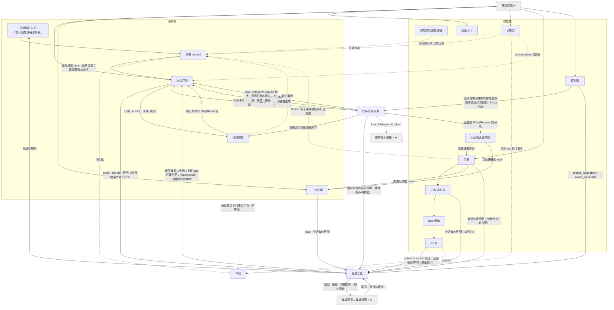
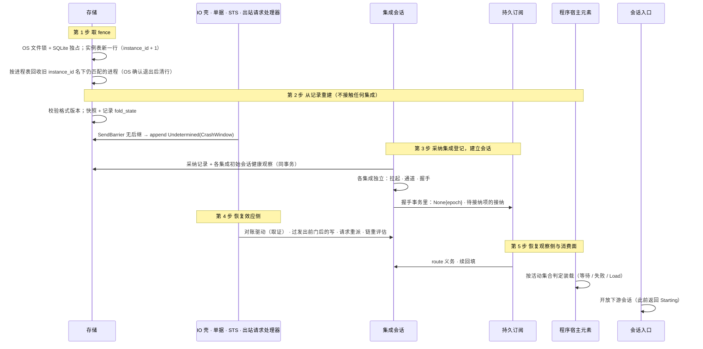

# 核心进程

## 0 定位

- **层级与元素**：C4 L2（container），元素是 core 系统里的**核心进程**：独占状态库、持有两侧 `Journal`、单据、lane、IO 壳、订阅表与读模型的那一个 OS 进程。上级文档：[core/design.md §4.1 容器](../design.md#41-容器)。同一系统里的另一个容器是程序宿主进程（[program-host/design.md](../program-host/design.md)）。
- **本文决定什么**：核心进程内部的模型（两类记录、两个类型宇宙与唯一边、位置与进度、gap 的分类、读写两类副作用、无锁定位，以及本进程定义、程序宿主进程与集成部分共用的组合子值树与五个 fold）；它分解成哪些组件、每个组件拥有与隐藏什么；组件之间的接口（uses、同事务集合、调用结果与计数的提交、保留引用的登记与解除、执行事实的唯一写入口）；持久化、统一路径文件、进程生命周期（启动五步与受控停止）三个视图；W1–W20 的组件级走查与崩溃矩阵 #1–#21。
- **不在本文**：任何组件的内部（状态机、转移表、每个对外操作的规格），它们写在各组件文档，本文以链接指过去；对外操作的完整规格也在实现它的组件文档（本文 §4.2 只给总表）；全局原则、问题域登记与需求编号（[README.md §2 问题域](../../README.md#2-问题域)）；程序宿主进程内部（[program-host/design.md](../program-host/design.md)）；集成与解释层两个部分的内部（[integration/design.md](../../integration/design.md)、[downstream/design.md](../../downstream/design.md)）；可选行情派生计算子系统（只在它与程序宿主元素的接口处出现，[program-host-element.md §4.7 核心↔可选行情派生计算子系统](program-host-element.md#47-核心可选行情派生计算子系统)）。
- **读者**：核心的实现者与评审者；写组件文档与改组件契约的人。审批者：维护者。
- **状态**：评审中。§5.3 登记了五项未关闭的卡点（程序规则时限的触发、保留边界推进的崩溃窗口、留存窗口下界的换算、决定冲突的记录、`request_snapshot` 的结论），各自的关闭事件在所属组件文档；其余已走通。
- **阅读约定**：证据标签 `[证据]`/`[设计]`/`[推断]`、编号前缀与跨文档引用写法见 [README.md §0.4 阅读约定](../../README.md#04-阅读约定)。“观察 J”= 观察 `Journal`，“执行 J”= 执行事实 `Journal`。

## 1 问题域

### 1.1 分配给核心进程的需求

需求的原文、来源与证伪条件在 [README.md §2.3 需求](../../README.md#23-需求)，本文只引用编号。core 系统的两个容器之间，核心进程承担除“求值程序值”之外的全部需求：

| 需求 | 核心进程承担的部分 | 主要落在 |
|---|---|---|
| C1、C2、C12 | 意图先持久化、`SendBarrier` 二分崩溃窗口、unknown 只以来源证据收敛、放弃只结束等待、冷却从 `SendBarrier` 起算 | 单据、STS 规则链、lane 驱动、IO 壳 |
| C3、C9、C10、C11 | 决定带 principal 与依据、过期即否决、参数合规与允许集合、会话 principal 与写授权 | 单据、STS 规则链、会话入口 |
| C4 | 预算的装载、检查、失败抑制与跨重启保持（预算的执行在程序宿主进程） | 程序宿主元素 |
| C5、C6 | 订阅与程序的 owner 是核心；不连续一律显式标出 | 持久订阅、投递调度、程序宿主元素 |
| C7 | 凭据只在“封存文件 → 核心 → 该集成进程”链上 | 集成会话 |
| C13 | 原始负载完整保留（入执行 J 的 `Evidence`） | 信封解析入口、IO 壳 |
| C14 | 格式版本只前进、迁移失败拒绝启动、程序状态版本 | 存储、程序宿主元素 |
| H2、H9、H10 | 程序不可信；程序状态跨重启；单实例与孤儿 | 程序宿主元素、存储、本文 §4.7 |

### 1.2 核心进程直接面对的域

下列是核心进程读写、却不由它设计的东西的固有性质。它们约束本文的持久化视图与生命周期视图。

| 域 | 性质 | 证据 |
|---|---|---|
| SQLite 单文件（WAL） | 一个事务要么全部可见要么全部不可见；`fsync` 返回之后的提交跨断电保留；单写者 | [证据：`investigation/rust-feasibility.md`] |
| OS 文件锁 | 由持有它的进程持有、随进程消亡释放；取到即蕴含上一持有者已退出 | [证据：H10；`existing-capabilities.md:239`] |
| OS 进程 | 进程身份只有 `(pid, start_time)` 能跨 pid 复用可靠辨认；存亡只能问 OS；父进程死而子进程活是真实情形（Windows 上 kill 只到 wrapper） | [证据：H10；`scripts/guardian/shared.ts:271-276`] |
| OS 继承句柄 / 通道 | 三个目标 OS 都能创建只交给被拉起子进程、别的进程连不上、关闭可确认的通道（`socketpair` / 匿名管道对） | [证据：[README.md §2.4 调查结论摘录](../../README.md#24-调查结论摘录)；H8] |
| 时钟 | UTC 时刻可持久化、跨重启可比；运行期计时用单调钟；二者都不给出上游的来源顺序 | [证据：域 F11；fp-04 命题 9/11] |
| 统一路径文件（`OPENALICE_HOME` 下） | 写者是 Alice；整文件原子替换（临时文件 + rename），不存在半写可见态 | [证据：O9；`existing-capabilities.md:189`] |

### 1.3 与外部共享的现象（容器粒度）

| 方向 | 现象 | 经过 |
|---|---|---|
| 集成部分 → 核心进程 | 握手投影、推送的观察记录、会话内上报的 `Gap{origin: Source}`、能力变更、readiness、调用的封闭返回值 | 核心创建的通道（集成会话） |
| 核心进程 → 集成部分 | 契约操作调用；拉起、凭据副本、通道一端 | 集成会话 |
| 解释层部分 → 核心进程 | 会话握手、订阅与确认、一次性读、读模型、单据组、结果未知组、控制组 | 会话入口 |
| 核心进程 → 解释层部分 | 投递（记录、投递缺口）、操作结果 | 投递调度、各组件 |
| 核心进程 ↔ 程序宿主进程 | `Load`/`Advance`/`Unload` 与其结果；拉起与终止 | 程序宿主元素 |
| Alice（文件） → 核心进程 | 封存凭据、集成登记、规则、程序清单与程序值、原生计算制品、运行期参数 | §4.6 |
| OS ↔ 核心进程 | 文件锁、进程的拉起与退出确认、停止请求、对端凭据 | 存储、集成会话、程序宿主元素、会话入口 |

## 2 驱动

质量场景 Q1–Q32 的六要素与优先级在 [README.md §3.1 质量场景](../../README.md#31-质量场景)，约束 K1–K3 在 [README.md §3.2 约束与偏好](../../README.md#32-约束与偏好)。本文不另立场景；每个场景由核心进程承担的响应，在 §5 的走查里逐步落到组件，其可测部分是 §6.3 的验收项与各组件文档的验收项。核心进程级的负载与时间度量只有两处由本文负责：

- Q17、Q20、Q21 的重启、接管与停止的正确性（§4.7、§5.2），响应度量是“无半条记录、无双写、受控停止后无孤儿、失败分两级”。
- Q22 的编码吞吐：默认文本编码下高频推送流是否达标（§4.7“传输与编码”，§6.1 权衡）。

## 3 模型

### 3.1 流、位置与三种进度

```
StreamId    = (source: Source, stream: StreamName, epoch)   // 每个范围独立维持位置单调；系统内不存在全局入口序
Source      = Integration(IntegrationId) | Program(ProgramId)
LogPosition = (StreamId, Seq)           // 一条记录的顺序身份
```

- 每个 `StreamId` 独立维持 `LogPosition` 单调递增。`Seq` 在该 `StreamId` 内**每 epoch 独立**单调。系统内不存在全局入口序。[证据：fp-04 命题 11；域 P2]
- 有序范围 = `StreamId=(source, stream, epoch)`。这一对应由 P2（`Seq` 在“来源 × 流 × epoch”有序范围内赋）、P3（新 epoch 首条记录）与本节位置定义共同给出。
- **来源是带标签的值** [设计]：集成 id 与程序 id 是两个命名空间，同名也不是同一来源。集成只拥有 `Integration(_)` 的流（声明、开 epoch、供给、作答）；`Program(_)` 的流由核心产出：流名来自程序值的 `outputs`（[program-host-element.md §3.1 程序值](program-host-element.md#31-程序值)），控制面只在这些流上开 epoch（[program-host-element.md §3.3 输出契约与程序流](program-host-element.md#33-输出契约与程序流)）。声明、采纳、会话、`route`、回填与一次性读只对 `Integration(_)` 来源成立，程序的观察输入也只取 `Integration(_)` 来源。`Program(_)` 的流只经只投递项订阅，接纳依据是控制流上该程序 id 的开始成员的 `Applied` 所记的输出契约（[subscription.md §4.1 核心↔解释层：订阅组与 rewind_cursor](subscription.md#41-核心解释层订阅组与-rewind_cursor)）。

**位置作为关联。** `LogPosition` 集合只用于两项语义：输入依据（例如某决策观察到的行情流 A@120、汇率流 B@57、账户流 C@90），与重放位置。它不替代外部订单身份、幂等键或 causation id；后者属独立的名义关联（§3.13）。撤 / 改单的目标身份（`venue_order_id` / `idempotency_key`）不放进 `basis`，放进意图自身的 `target` 字段；`basis` 只记录该身份来自哪条记录的位置（§3.5）。

**三种进度**互不替代，源头各不相同：

| 进度 | 含义 | 源头与承载 |
|---|---|---|
| 消费位置（cursor） | 某消费者已确认处理到的位置（`At{pos}`）；从起点或保留边界建立、还没有确认的为 `Start{from}` | 消费方的确认（程序是提交的 `Advance`）；核心在它确认之后记入订阅状态（[subscription.md §3.2 cursor 与确认](subscription.md#32-cursor-与确认)） |
| 完备进度 | 来源证据证明的覆盖：某一坐标上的哪一段记录已全部到达，命题与坐标随证据写明 | 来源；核心只从来源证据 fold 出来，只在保留边界推进要删掉它所依的记录前留一个覆盖检查点（[subscription.md §4.6 序号覆盖与覆盖检查点](subscription.md#46-序号覆盖与覆盖检查点)）。没有证据的流没有 |
| 保留边界（retention） | 每条观察流上存储仍能精确重建的最早位置（执行事实侧不压缩，没有保留边界） | 核心的存储事实（[observation-journal.md §2.4 保留：边界与删除规则](observation-journal.md#24-保留边界与删除规则)） |

不变量：

- cursor 与完备进度没有强制关系：cursor 可以落在已证明的覆盖之内或之外。
- 引用的 `LogPosition` 一旦 < retention，其精确重建不再保证。边界推进前必须显式处理仍被引用的位置（§4.3.7 保留引用的登记与解除）。
- **位置归核心，完备归来源** [设计]：
  - `LogPosition` 是核心在 append 时创建的，核心是它的源头；集成给的 venue 序号、游标与事件时间是来源给的字段，随记录作为副本保存。
  - 某段历史是否已全部到达，是上游历史的性质，源头是上游（[README.md §1.2 权威源头与生命周期](../../README.md#12-权威源头与生命周期)）。核心只 fold 来源给出的证据，并写明它证明的命题与坐标。契约里今天只有一种这样的证据：声明 `joinable_venue_seq` 的流上的**序号覆盖**，即“流 epoch e 内 venue 序号落在 `[from, through)` 的记录都已 append”（[subscription.md §4.6 序号覆盖与覆盖检查点](subscription.md#46-序号覆盖与覆盖检查点)）。它的坐标是该 epoch 的 venue 序号，不是事件时间：可衔接序号与事件时间之间没有顺序关系（[read-model.md §3.4 精确重建的前提与完整界](read-model.md#34-精确重建的前提与完整界-设计)）。
  - “此后不再有 `occurred_at` 早于 t 的记录”（事件时间闭合）是关于上游未来输出的命题，契约里没有证明它的证据，所以没有哪条流有事件时间上的完备进度。`received_at`、核心或运维声明的滞后界、上游文档写的迟到上限都不是证据：越过上限的迟到记录与从未发出的记录不可区分，违反不是一条可观察的记录（证伪 #29，[subscription.md §6.1 证伪条件](subscription.md#61-证伪条件)）。
  - 没有证据的流没有完备进度；依赖它的判断得“完备未确立”，不以时钟、到达顺序或消费位置补上（[delivery.md §3.1 三种消费方式（投递侧）](delivery.md#31-三种消费方式投递侧)、[read-model.md §3.4 精确重建的前提与完整界](read-model.md#34-精确重建的前提与完整界-设计)）。

**为什么。** 读到哪不说明之前的记录是否已全部到达，所以 `await-all` 按证据证明的覆盖触发，而非按消费位置。三者度量三件不同的事（确认处理到哪、来源证明了哪段已全部到达、还能重建到哪），源头分别是消费方、来源与核心，任一都无法从另两者算出。代价：没有可衔接序号的流上没有完备，按时间对齐的消费者只能声明自己接受的丢失界。[证据：fp-05 案例 10④/11⑤/13⑤；fp-04 命题 10]

**不选。**

- 用单一“进度”标量同时表达消费、完备与保留：它把“读到哪”与“已全部到达”混同，`latest` 消费者会被误当作已跟上完备进度，阈值策略据此误触发。
- 由核心按 `received_at` 与声明的滞后界推导完备进度：以本地时钟推断上游的未来输出。迟到记录照常 append 而进度不退，推断失真时没有任何记录说明，依赖它的判断却已当真执行。上游文档给出的迟到上限同理，它不可证伪。
- 核心维持跨流的事件时间对齐：没有任何来源证据支撑，对齐点只是核心的猜测。

### 3.2 gap 的三种来源

三种 gap 按 `origin` 区分。它们说的事、源头与落点各不相同，不是同一种记录：

| | `Gap{origin: Source, reason}` | `Gap{origin: Delivery, reason}` | `Gap{origin: Channel, channel}` |
|---|---|---|---|
| 说的事 | 来源流本身不连续：新 epoch 的首条记录（带前一范围与最后 `Seq`；逻辑流的第一个 epoch 记为无前驱），或回填未能补齐时标出未覆盖区间的 epoch 内记录 | 某个订阅在某条流上没有收到位置 `from` 到 `to`（两端都含）的记录；流本身并不缺这些记录 | UTA 自己的那次读调用在这个渠道上没有拿到结果；不说来源少了什么记录 |
| 源头 | 来源的证据（不能续接、供给中断、回填穷尽），或核心对程序产出流开 epoch 的决定 | 核心的投递 | 核心的那次调用（UTA 自有事实） |
| 落点 | 观察 J 该流上的记录 | 订阅表里，按（订阅，流）记，与该流的 cursor 同一粒度：`{流, from, to, reason}`；不在任何流上 | 取证渠道：执行 J，属该尝试；回填与一次性读：观察 J 该流上的控制记录 |
| 计入读模型 `gaps` | 是 | 否（读模型直接 fold 日志、不经投递） | 否 |
| 细节 | 本节下表；握手与会话内开 epoch [integration-session.md §4.3.2 集成→核心的推送](integration-session.md#432-集成核心的推送) | 写入与删除 [subscription.md §3.3 投递缺口 Gap{origin: Delivery}](subscription.md#33-投递缺口-gaporigin-delivery)；检测 [delivery.md §4.3 背压、conflation 与停投](delivery.md#43-背压conflation-与停投) | 取证 [io-shell.md §4.5 对账驱动](io-shell.md#45-对账驱动)；回填 [subscription.md §4.4 核心→集成：backfill](subscription.md#44-核心集成backfillstream-window-subjects--covered--unavailable--refused)；一次性读 [one-shot-read.md §4.1 核心→集成：read](one-shot-read.md#41-核心集成readstream-request-range--answered--unavailable--refused) |

`Gap{origin: Source}` 的 `reason` 取 P3 的集合，各自的触发者与写者：

| `reason` | 触发者与写者 |
|---|---|
| `start`、`disconnect`、`quota`、`ingress_overflow` | 集成来源的流：集成上报（会话内上报的断代由集成推送，集成会话编排它的事务）；握手时决定开新 epoch 的，由集成会话 append（[integration-session.md §4.3.1 handshake](integration-session.md#431-handshake--projection--refused--unavailable)）。程序产出的派生流上的 `start`：让程序 id 进入活动集合的 `load_program`（首次装载，或卸载之后再装载），控制面在它的 `Applied` 事务里、在新成员的每条程序流上 append（[program-host-element.md §3.3 输出契约与程序流](program-host-element.md#33-输出契约与程序流)） |
| `credential_rotated` | 有未兑现轮换的集成此后第一次成功的握手，集成会话 append（[integration-session.md §4.9 轮换强制的新流 epoch](integration-session.md#49-轮换强制的新流-epoch-设计)） |
| `schema_change` | 载荷版本变化，集成上报（[envelope.md §3.3 payload_schema 与 schema 发布](envelope.md#33-payload_schema-与-schema-发布)） |
| `backfill_incomplete` | 回填穷尽，持久订阅 append（[subscription.md §4.5 实时边界、回填任务与回填进度](subscription.md#45-实时边界回填任务与回填进度)）；它标出 epoch 内未覆盖的区间，不结束也不开 epoch |
| `program_upgrade` | 不沿用旧状态的替换（程序升级、输出契约改变或运维冷启动，即 `Reset`），控制面在替换的 `Applied` 事务里、在新成员的每条程序流上 append（[program-host-element.md §3.3 输出契约与程序流](program-host-element.md#33-输出契约与程序流)） |

- `Delivery` 的 `reason ∈ {slow_consumer, compacted, conflated}`：`latest` 订阅的投递缓冲耗尽而被停投、订阅位置已被压缩到保留边界之下、`latest` 消费合并。程序经它的程序订阅消费，`latest` 输入滞后被跳过的区间是该订阅上的 `Delivery` gap；`ordered` 与 `await-all` 只背压，从不因慢被跳过。执行事实订阅没有这种缺口。
- 一次性读的 `Channel` gap 带这次调用的 `provenance: OneShot{origins, request}`、`dispatch_end` 与发出会话的 `session_epoch`，与它的结论记录会带的相同，等待者凭它们认出自己那次读。
- **集成崩溃的观察流面**：集成在观察流侧崩溃（订阅 / 推送进程掉线）时，仅波及其负责的流，记录为 `Gap{origin: Source}`，核心不受影响。另一故障面与判别边界见 [io-shell.md §4.9 崩溃恢复与集成崩溃两故障面](io-shell.md#49-崩溃恢复与集成崩溃两故障面)。

**为什么分三种。** 三者的源头不同：来源断代只有来源能证明（或是核心对自己产出流的决定），投递损失是核心对某个订阅做的事，渠道失败是核心某次调用的结果。合成一种就会把“流缺记录”“这个订阅没收到”“这次没问到”混同：读模型 `gaps` 会报出流本身并不缺的段，或漏报真正的断代。

### 3.3 两类记录与第一边界

研究中确立的最稳定边界，是**可撤回 / 可压缩的派生内容 | 只追加的执行事实**，而不是问题域现象的分组。本设计把这条代数边界命名为观察（不可写）| 效应（可写）两个类型宇宙。名字借自问题域的现象分组，所指是这条代数边界。[证据：fp-05 命题 12“不能把负 diff 当外部 Write 的补偿”；fp-03 命题 1 log+fold 仅在不可丢/须审计条件下成立]

| 内容 | 修正方式 | 例 |
|---|---|---|
| 派生计算结果（bar、指标、信号、alert） | 撤回旧贡献、加入新贡献、重算受影响子图 | 迟到 tick 修订 bar → 均线重算 → 旧信号撤回 |
| 已发生的决策与执行事实（意图、批准、预约、发出、回执、对账） | 仅追加后续事实，永不改写为“从未发生” | 行情修订导致信号消失，但已发出的买单仍然存在；反向交易属于新行为 |

撤回派生结果不等于删除原始输入证据。原始证据的保留义务由保留语义单独定义（[observation-journal.md §2.4 保留：边界与删除规则](observation-journal.md#24-保留边界与删除规则)）。

该边界由三层分别保证，**任何一层均不可替代其他两层**：

1. **代数能力**：`Delta`/`RetractableDelta` 决定能否在代数上表达撤回（[observation-journal.md §2.1 Journal 与撤回代数](observation-journal.md#21-journal-与撤回代数)）。
2. **持久化接口**：执行事实侧的存储接口仅暴露 `append`；替换、删除、快照属于独立且需显式授权的操作（[storage.md §3 接口](storage.md#3-接口)）。
3. **保留协议**：明确哪些历史必须保留、谁有权批准边界推进（[observation-journal.md §2.4 保留：边界与删除规则](observation-journal.md#24-保留边界与删除规则)）。

“无逆元”仅约束第一层，不构成存储层面的不可变保证。

**不变量（执行事实只 append）：** 执行事实侧只 append，永不改写为“从未发生”。由第二层保证。

两侧共用存储原语（单 SQLite 文件、同一 `(stream_id, log_position)` 主键形状）是实现事实；不共享类型宇宙是设计事实。是否物理共表由实现按写放大与查询成本定。不选：**两侧共用同一表结构与代数**：为对账设计的类型扩到全体会污染认知，负 diff 不能当外部 Write 的补偿。

### 3.4 两个类型宇宙与唯一边

所有锁与对账机制都是为写操作存在的。为对账设计的类型若扩展到全体代码，会污染认知，并让组合子处理过多兼容项。因此可写对象与不可写对象是**两套独立的抽象**，不共享类型宇宙。

| | 观察（不可写） | 效应（可写） |
|---|---|---|
| 主体 | range：`StreamId` / `LogPosition` / 进度 / 保留 | 可写对象：有 venue 侧身份、作用域键、能力证据、可能有幂等键 |
| 载体 | `Journal<RetractableDelta>`，可撤回可压缩 | append-only 记录链 |
| 组合子宇宙 | `Pred` / `Comb` / `Fold`：输出是值与派生记录，**没有失败 sum** | guard：`Pred<(Context, RuleState, Input)>` → `Result<_, Failure>`；`Check` 带 `required_inputs` 与 `IntentAlignment` |
| 处理器 | `occurred_at`、`payload_schema` | `idempotency_key`、`attribution`、`cumulative_filled_quantity`、`execution_id`、`execution_revision`、`deadline`、守卫字段、`venue_order_id` |
| 机制 | 订阅、派生 DAG、程序解释① | 单据锁、STS 链、lane、IO 壳、两阶段、证据 gate、程序解释② |
| 核心进程里的组件 | 观察 `Journal`、信封解析入口（含入站处理器注册表）、持久订阅、投递调度、一次性读 | 出站请求处理器、单据、STS 规则链、lane 驱动、IO 壳、效应侧归因处理器（§4.4）、读模型、控制面、会话入口 |

存储、集成会话与程序宿主元素不属任一侧（§4.1 各自的理由）。

**唯一的边是单向的：效应侧读观察侧。** 效应侧读观察侧有四种表现，读的都是位置与记录，不复制观察状态，各用自己的位置集标定读到哪：

| 表现 | 位置集 |
|---|---|
| 意图的 `basis` 引用观察位置 | `basis` |
| 钩子读观察值 | `checked_as_of` |
| 决议读带归因的订单状态观察 | `Found{observation}` |
| 读模型 fold 观察记录（订单状态 / 成交、持仓、健康） | `as_of` |

效应侧也**产生**观察记录：回执、取证、一次性读的结果落观察 J；控制面在开始不沿用旧状态之成员的 `Applied` 事务里 append 程序流开 epoch 的 `Gap{origin: Source}`；控制面在开始、替换与卸载程序成员的 `Applied` 事务里请持久订阅建立、沿用、重建或结束该程序的程序订阅及其项。集成会话按会话状态与调用结果给出健康观察，它不属任一侧，健康观察是观察侧记录。这些都沿效应 → 观察的方向。

**反向不存在**：观察侧的任何类型、组合子、处理器都不引用效应侧类型、不按效应侧状态求值。这条边约束的是**类型依赖与语义消费**，不是不透明的出处元数据 [设计]：

- 观察记录上的 `provenance`（`OneShot{origins, request}`、`Receipt{attempt}`、`Reconciliation{attempt, channel}`）与 `attribution` 字段，只是位置、`AttemptRef`、单据身份、principal、请求参数这类不透明值。
- 观察侧存它、路由它、不解析它，正如载荷字节。
- 解析它们的处理器注册在效应侧：**记录归观察，响应归效应**（§4.4）。

**程序跨两边。** 程序是值不是类型，同一个程序值可以跨两边：解释①（派生）在观察宇宙，解释②（决策）在效应宇宙。两种解释都在程序宿主进程里求值（[program-host/design.md §3.2 解释①：派生](../program-host/design.md#32-解释①派生)），本文定的是它们的**消费约束**：解释①只产出派生记录，读各输入 cursor 之后的观察记录与来源证据证明的覆盖；解释②只产出 `EffectRequest` 值，另读声明的执行事实流与自己的请求流；两者都不直接调用 venue 写接口，解释②的执行状态（请求进度跟踪）不进派生 DAG。它对效应侧的输出仍经核心（Intent、`IntentAlignment`），不构成反向引用。[证据：域 P6]

**不变量（观察侧不引用效应侧）：** 类型依赖与语义消费反向不编译；不透明出处值除外。由单向边 + crate 依赖方向保证（§4.8）。

**为什么 / 不选。** 两套抽象让观察侧派生可自由撤回 / 压缩而不牵动执行事实，效应侧决定可追溯到当时看到的位置（Q1/Q6/Q28）。不选：**双向引用或共用一套类型**：为对账设计的类型扩到观察侧污染认知，撤回 / gap 无法传播；**把观察状态复制进效应对象**：造出第二份状态并引入反向耦合。[证据：fp-05 命题 12；fp-03 命题 1/2]

### 3.5 允许 / 禁止关系

| 主体 | 允许产生 | 允许消费 / 引用 | 禁止 |
|---|---|---|---|
| 观察侧处理器 | 派生记录、进度推进 | 信封字段、派生流 | 引用效应侧任何类型 |
| 效应侧处理器（入站的效应侧分区与出站处理器） | lane / 决议 / 规则记录、写请求 | 信封字段、执行事实记录、经单向边读的观察值 | 绕过效应路径直接写 venue |
| 程序（值） | 派生记录（解释①）、`EffectRequest`（解释②） | 各输入 cursor 之后的记录（观察流；解释②另读声明的执行事实流与自己的请求流）、来源证据证明的覆盖 | 直接调用 venue 写接口 |
| STS 规则链 | `Outcome` 记录 | 执行事实记录（含冷却所读的 `SendBarrier`、lane 步所读的 `bypass_lane` 控制记录）、单据 fold 已算好的状态（`parameter_validity`、`basis_validity`、`alignment`） | 引用读模型；读观察 |
| 读模型 | 供解释层经 `read_model` 读取的只读 fold | 按种类：执行事实记录、观察记录、订阅表当前态 | 被规则引用、被当作权威 |
| IO 壳 | 执行事实记录（`SendBarrier`/`VenueAccepted`/`Expired`/…，回执与取证的 `Evidence` 在其中）；回执与取证读产生的观察记录（与一次性读同形） | `Prepared`、证据响应 | 修改任何记录、知道单据存在 |
| 单据 | `TicketAction` append 记录 | IO 壳 append 的记录（作 `basis` 或检查项依据）、观察值 | 反向耦合进 IO 壳 |
| 效应侧 → 观察侧（单向边） | 观察记录（回执 / 取证 / 一次性读，带不透明 `provenance`；程序流开 epoch 的 `Gap{origin: Source}`）；请持久订阅建立、沿用、重建或结束程序订阅及其项 | 观察位置集 `Set<LogPosition>`（`basis`、`checked_as_of`、`Found{observation}`、`as_of`）、观察值 | — |
| 观察侧 → 效应侧 | — | 只存不解析的出处值（`provenance`/`attribution`）；投递调度按位置搬运执行事实订阅所选记录的字节（经存储读出，不解析、不经读模型） | **类型依赖与语义消费全部禁止**（反向不编译） |

规则禁止引用读模型，因为读模型非权威（[read-model.md §3.1 读模型是非权威的 fold](read-model.md#31-读模型是非权威的-fold)）。

### 3.6 `basis`：方向、基数、可追溯性

`basis` 是意图引用观察侧位置的承载：一个 `Set<LogPosition>`，是 §3.4 四种表现中的第一种。

- **方向**：效应 → 观察，单向。问题域依据是 P6：意图的依据是它引用的观察位置，意图对观察侧的连接点只有 `basis` 这一处。程序输出是现象 P6，不是直接的 venue 调用；venue 调用是 IO 壳的事，不是这条边。
- **基数**：位置集（≅ `Map<StreamId, Seq>`），可同时含两类位置：
  - **派生侧（观察）位置**：真正的跨边引用，例如某决策观察到的行情流 A@120、汇率流 B@57、账户流 C@90；撤 / 改单目标身份来源之三的归因观察记录也在此侧，与其他观察位置同样受保留边界约束。
  - **执行事实侧位置**：`VenueAccepted` / `SendBarrier` / `EffectRequest` 的位置，作为**身份与因果依据**。它属效应宇宙内部的自引用，不是跨边。
- **可追溯性**：`basis` 记录意图实际消费的 `LogPosition` 集。取值不复制进 `basis`，由观察 J 在这些位置 `fold_state` 重建，所以从 `basis` 能重建“这个决定当时看到了什么”。intent ↔ 结果 / 审计 / 重放的名义关联，由执行事实日志的位置 + causation id 承载（§3.13）；`basis` 提供决定的输入侧可追溯性，与结果侧关联互补、不重叠。

`basis` 的有效性语义（`basis_valid`、逐位置判定、`Lag` 窗口）是单据在放行前应用的只读校验门，写在 [ticket.md §3.5 第一层：依据有效性 basis_validity](ticket.md#35-第一层依据有效性-basis_validity)；它不参与两阶段协议，只决定是否进入 prepare。

不变量：

- `basis` 是位置集，不含观察状态的拷贝。由类型保证。
- 边界推进前必须显式处理仍被 `basis` 引用的派生侧位置。由保留协议保证（§4.3.7）。
- 执行事实侧引用不因年龄变假。由 append-only 语义保证（§3.3 第二层）。

**为什么。** 两个宇宙独立成型后，效应侧仍必须知道“依据什么下的决定”，以支持决议、审批与重放。把依据建成对观察位置的引用，而非把观察状态复制进效应对象，既保持单向，又让依据可随观察侧撤回 / 推进而重算（偏离是状态）。[证据：fp-03 命题 2；域 F9/P11]

**不选。**

- **把观察状态复制进效应对象（自带一份行情快照）**：会在效应侧造出与观察侧并行的第二份状态，撤回 / gap 无法传播，且引入反向耦合。
- **把目标身份塞进 `basis`**：`basis` 是位置语义，身份是名义关联；混同会让“依据滞后”与“目标是谁”两件事互相污染。

### 3.7 读副作用与写副作用

§3.4 分的是**对象**（可写 / 不可写）；本节分的是**动作**。

- **读副作用**：“读进来”这个动作本身就改变了系统内部：多一条记录、进度推进、程序被唤醒。它不改变外部世界。
- **写副作用**：改变世界。

读的两条推论：

- **读即观察记录**：读本身是带 `LogPosition` 的观察记录。一次性查询也写入观察 J：每个结果项一条记录，与推送观察同形，再加一条读结论记录，使空回答与“还没回答”可区分。操作是核心→集成的 `read`（[one-shot-read.md §4.1 核心→集成：read](one-shot-read.md#41-核心集成readstream-request-range--answered--unavailable--refused)），记录带 `provenance: OneShot{origins, request}` 与质量标记 `one_shot`。
- **发起者是任何人**：集成推送、程序、单据检查项的“先查后判”、消费方、IO 壳的对账取证都可发起读。

| | 读副作用 | 写副作用 |
|---|---|---|
| 对外 | 不改变世界；可重复、可批处理、可并发、可丢 | 改变世界；一次；不可批、不可去重、不可重放 |
| 结果 | 总是可判定（拿到了或没拿到） | 可能不可判定（`Undetermined`） |
| 失败处理 | 重试、换渠道、标 gap | 对账，永不重试 |
| 对内的副作用 | append 观察记录、推进进度、触发处理器与 DAG 重算、唤醒程序、更新单据 `alignment`；对账取证另 append 执行事实侧的 `ResolutionEvidence` | append 执行事实（`SendBarrier`/回执/`Undetermined`/`Expired`）、推进 lane、关闭单据 |
| 时间 | 事件时间 + 收到时间 | 只有发出时间（venue 的时间是回执的观察） |
| 发起者 | 任何人 | 只有 IO 壳 |
| 机制 | 进度、保留、去重、批处理 | 单据锁、STS 链、lane、两阶段、证据 gate |

两轴正交，有意义的格子三个：观察对象 × 读（行情、新闻）；可写对象 × 读（`query_by_key`、`list_open`、`list_fills`；IO 壳的对账取证**是读副作用**，所以才能重试、按渠道依次做）；可写对象 × 写（`submit`、`cancel`）。观察对象 × 写不存在。

推论：

- 调用方先撤后下是两张单据、两次写：各自一次，中间看目标是否已结束的读由调用方自己做。撤单的回执或取证 `Found` 只说这次撤单请求的结果，不证明目标已结束；核心不把两次写拼成一个复合操作（[ticket.md §4.5 交易协议：操作种类、目标、可执行性、检查目录](ticket.md#45-交易协议操作种类目标可执行性检查目录-交易协议)）。
- `replay_by_key` 形式是写、语义是读。分类边界上的操作必须显式声明属于哪边（[io-shell.md §4.6 replay_by_key](io-shell.md#replay_by_keykey-key_role-scope-barrier_at--original--unavailable)）。
- `Undetermined` 只属于写：读没有 in-doubt，只有“没拿到”。这就是为什么检查项的 `Unavailable` 可行动（再发一次读），而 IO 壳的 `inconclusive` 只能停等：读已穷尽，写的结果仍未知，只由新到的来源证据终结；principal 可以放弃等待（`Abandoned`），但那不改写结果（[io-shell.md §4.8 结果未知组（核心↔解释层）：放弃跟踪与重开](io-shell.md#48-结果未知组核心解释层放弃跟踪与重开)）。

不变量：

- 写副作用只由 IO 壳发起、一次、永不重试；读副作用任何人可发起、可重试、可批。由本节对照表 + IO 壳保证。
- 读结果总可判定；`Undetermined` 只属于写，读只有“没拿到”。

**为什么。** UTA 的真正副作用不是数据库写（SQLite 是记录，不是效应），而是对 venue 的写。而写是由读副作用产生的：AI 读了观察发出请求，程序读了观察满足规则产生 Intent，审批人读了待决集合作出决定。三者都是“读的副作用消费为写”，这就是“看到 → 决定 → 执行”的因果方向（[README.md §1.5 一句话与四步](../../README.md#15-一句话与四步)）。读的结果总是可判定，失败可重试、可换渠道、可标 gap；写可能不可判定。所以读与写必须分成两类动作分开处理，而非按对象轴划分。[证据：fp-03 命题 4]

### 3.8 基础值类型

money/quantity 是交易协议处理器的值类型（[envelope.md §2.4 推论](envelope.md#24-推论)）。它们出现在核心**计算**处：写侧基本类型的守卫字段、`cumulative_filled_quantity`、程序 / 钩子解释器。观察侧信封不含价格，行情价格只在载荷里，由程序与钩子按 schema 解释。

| 类型 | 设计 | 依据 |
|---|---|---|
| 金额 | 精确有理数/定点数 + 货币索引；离散化返回余数，不静默丢钱 | fp-04 命题 1 safe-money |
| 数量 | 精确数值；**不**做“数量带 instrument 尺度”（无证据） | — |
| 身份 | 上游身份一律 `(venue, native_id)` opaque + 智能构造器 | fp-04 命题 16；域 F2 |
| 时间 | `occurred_at` / `received_at` 分离；`deadline` 以 UTC 时刻声明并随记录持久化，运行期计时器用单调钟；来源顺序只由来源给的定序证据（venue 序号等）给出，日志顺序只是 `(stream, seq)` 偏序，都不由任何时钟推导 | fp-04 命题 9/11；域 F11 |
| 错误 | 每规则封闭 sum；venue 映射保留 `Unmapped` | fp-04 命题 8；域 C13 |
| 外部写结果 | `Prepared \| SendBarrier \| VenueAccepted \| VenueRejected \| NotSent \| Undetermined \| Expired` + `ResolutionEvidence` 记录；另有 UTA 自己的 `Abandoned`（放弃等待，不是结果）；非 `Option`/字符串 | fp-06 命题 1（MongoDB `UnknownTransactionCommitResult`、Oracle in-doubt）；fp-01 M11 DAML 反例 |

- **身份**出现在四处：投影里的 `WriteLaneKey`/`StreamId`（[integration-session.md §3.3 投影 Projection](integration-session.md#33-投影-projection)）、意图的 `target`（[ticket.md §4.5 交易协议：操作种类、目标、可执行性、检查目录](ticket.md#45-交易协议操作种类目标可执行性检查目录-交易协议)）、观察记录的 `attribution`（§4.4）、成交记录的 `execution_id`（[read-model.md §3.2 成交的计数身份](read-model.md#32-成交的计数身份-设计)）。instrument 只在 venue 作用域内有意义。换名不是安全，隐藏构造器才是。
- **时间**：`deadline` 以 UTC 时刻持久化，所以发出前门与过期步跨重启仍可比。

### 3.9 无锁定位

UTA 唯一的锁是单据；执行阶段与观察侧没有锁。

- **唯一的锁是单据**：提交是消费动作，只有有权消费者才谈得上锁。意图形成期的单据确实有多个编辑者争同一份东西，单据本身就是锁（[ticket.md §4.2 状态机与穷尽转移](ticket.md#42-状态机与穷尽转移)）。过期读由 C11 的依据版本**可见**，不需要锁让它不可能。
- **venue 域事实无锁（F1）**：账户、持仓、订单、成交、价格由 venue 消费与裁决，UTA 无权决定是否消费，因此对它们**不存在 UTA 的锁**。
- **UTA 自身记录的权威不是锁**：审批、意图、尝试、队列顺序、程序装载、订阅表是 UTA 说出的话，UTA 对它们有权威。但 append-only 日志上顺序就是位置本身：单写者（H10）、每次 append 原子、没有第二个写者争同一位置。
- **对 venue 的写入通道**：每 `WriteLaneKey` 一条有序队列（H4）。其有序与队首阻塞来自**通讯协议**（后续写的含义依赖队首结果），不是 UTA 抢占通道的锁（[lane.md §3.2 队首阻塞是通讯协议，不是锁](lane.md#32-队首阻塞是通讯协议不是锁)）。UTA 不能通过“先拿到通道”改变 venue 消费什么，只能决定自己以什么顺序把请求交给协议。
- **记录追加与因果引用**：执行事实侧只 append，位置即顺序；SQLite 单写者是记录器的实现事实而非域语义。C11 的“待决集合版本期望”是决定对 UTA 自身单据版本的**因果引用**：Decision 绑定 `(ticket, current_version)`；期望版本不等于 `current_version`，或该版本已有 Decision → `Conflict`，不执行、不改状态（[decision-chain.md §4.3 审批步](decision-chain.md#43-审批步)）。这是 UTA 对自己记录的版本判定，不是对 venue 状态的锁；决定所依据的观察是否已过时，另由依据有效性门判定。
- **对外部状态无锁**：“依据有效性”只是对证据新鲜度的有界赌注，不阻止世界在 prepare 与 venue 执行之间变化（那是 F5 / 对账的领域）。venue 若提供真正的锁（cancel/replace 引原单身份、条件单、expected-version 改单、幂等键唯一性、保证金预占），那把锁是 **venue 的**：它经能力证据声明后由 IO 壳使用；未声明则不存在，不得假装。

**结论。** 悲观锁由消费者自身持有、不侵入外部；乐观锁要比较的版本住在被消费状态的拥有者那里。UTA 不是消费者，既做不了悲观锁，做乐观校验时锁也不在它这里。DB 隔离级别的词汇（可重复读、串行化、悲观 / 乐观锁）不用于描述 UTA 自身。

**读触发的写同形；授权是规则不是记录种类。** AI 发请求、程序满足规则、审批人作决定，都是“读的副作用消费为写”，记录形状相同：带 principal、带依据 `LogPosition`。差别只在**哪些 principal 的记录足以让写进入 prepare**，这由授权规则（[decision-chain.md §4.2 顺序固定链：授权 → 输入约束 → 审批 → lane → 过期](decision-chain.md#42-顺序固定链授权--输入约束--审批--lane--过期)）决定；“谁、何时、依据什么”由记录上的 principal 与依据字段满足。

不变量：UTA 对 venue 域事实无锁；DB 隔离词汇不描述 UTA 自身。由 F1 + 本节定位保证。

不选：**给 UTA 自身造悲观 / 乐观锁**：UTA 不是消费者，锁不在它这里；过期读用依据版本可见即可。**为审批另设记录种类**：读触发的写同形，principal + 依据字段已足够。

### 3.10 本文拥有的不变量

组件内部的不变量在各组件文档的模型节；下列跨组件、由本文的划分或组件间接口保证：

1. 执行事实侧只 append，永不改写为“从未发生”（§3.3；§4.3.4 唯一写入口）。
2. 观察侧不引用效应侧（类型依赖与语义消费），不透明出处值除外（§3.4；§4.8 crate 依赖方向）。
3. 写副作用只由 IO 壳发起；核心内对集成的一切调用只经集成会话的调用通道（§3.7；§4.3.1）。
4. `Prepared` 是单据与 IO 壳唯一的接触点，二者各认一半（§4.3.3）。
5. 同事务集合里的记录要么全部持久、要么全部不持久（§4.3.5）；`SendBarrier` 单独 durable append，不在任何集合里。
6. 每个经调用通道发出的调用恰好得到一个封闭结果、恰好计数一次，计数与结果记录同事务（§4.3.6）。
7. 保留边界推进不越过所在观察流已登记引用的最早位置（§4.3.7；判定规则在 [observation-journal.md §2.4 保留：边界与删除规则](observation-journal.md#24-保留边界与删除规则)）。
8. 生命周期嵌套：内层在外层之内开始；外层结束锚点写在它的全部内层结束之后（§4.7）。
9. 订阅表只有持久订阅一个写者；进程表按 `role` 分行、各写各的；控制流有三个写者、都经存储的 append 接口（§4.5）。

### 3.11 同名异义（跨组件）

只列两端属于不同组件的词；只在一个组件内部的同名异义写在该组件文档。

| 词 / 概念对 | 甲 | 乙 | 区分依据 | 所在 |
|---|---|---|---|---|
| 意图的三个阶段 | `EffectRequest`：程序发出的请求，未定型、无负责人 | `Ticket` 的 `Version<Intent>`：定型的意图，有负责人与 `basis` | 第三阶段是 STS 的 `Input`：规则输入，含意图、回执、超时、证据 | 出站请求处理器、单据、STS 规则链 |
| `Prepared` | `Ticket.Close(Prepared(position))` 的结果：单据关闭 | IO 壳链的起点：`Prepared → SendBarrier → …` | 同一条记录；单据认“我已交出”，IO 壳认“我该做的”（§4.3.3） | 单据、IO 壳 |
| 对账 / 决议 | 对账（alignment）：我的意图还对不对世界（`IntentAlignment`） | 决议（resolution）：我的动作发生了没有（`ResolutionEvidence`） | 前者在 `Prepared` 之前、只看观察侧；后者在之后、由 IO 壳驱动 | 单据、IO 壳 |
| 三种“对齐” | 锚点对齐：集成把上游账户、市场、身份结构对到锚点契约 | 记录映射的字段对齐：上游字段对到契约字段 | 第三种是对账（`IntentAlignment`），与前两者无关 | 信封解析入口、集成会话、单据 |
| 修订 / 撤回 | `Revision<Intent>`：意图版本间结构差，无逆元需求 | `RetractableDelta`：观察侧撤回代数，有逆元 | 前者属效应宇宙，后者属观察宇宙 | 单据、观察 `Journal` |
| 三种“无法判断” | `InputMissing`：检查项需要的观察流根本没有 | `Undecidable`：流存在但有 gap，没有本项主体的观察，或最近观察顺序未确立 | 第三种 `inconclusive`：读渠道穷尽而写结果仍未知，属决议；等待继续，或由 principal 放弃跟踪 | 单据、IO 壳、读模型 |
| 能力未知 / 结果未知 | `Verdict::Unknown`：venue 是否支持该操作不知道 | `Undetermined`：发出的写是否生效不知道 | 前者是握手结果、约束启动；后者是链状态、约束恢复 | 集成会话、IO 壳 |
| `SendBarrier` / `AwaitingDecision` | IO 壳发送屏障：`Prepared` 之后，外部动作即将发生 | 单据送审：`Prepared` 之前，无外部动作 | 二者相隔整条 STS 链 | IO 壳、单据 |
| `basis` / `required_inputs` | 值：这张单据实际引用了哪些 `LogPosition` | 类型：这个检查/处理器要读哪些 `StreamKind` | `required_inputs` 从组合树派生；`basis` 从实际评估记录 | 单据、信封解析入口 |
| `LogPosition` / `Hash` | 日志位置：顺序身份 | 内容寻址：版本身份 | `current_version` 是 `Hash`，`Prepared(position)` 是 `LogPosition` | 本文 §3.1、单据 |
| 四种“过期” | `Ticket.Close(Expired)`：STS 过期步，在 `Prepared` 之前（H6） | `DecisionStep::Expire(Deadline)`：程序规则时限 | 第三种：尝试记录 `Expired(deadline)`，已放行而交出前 `deadline` 已过，IO 壳不发并结束等待；写可能已交出之后不再有 `Expired`，结束等待的唯一出口是 `Abandoned`。第四种：写调用的时限在集成里，集成在时限内得不到回执时返回 `NoResponse`，只是 `Undetermined` 的原因之一；核心没有调用时限 | 单据与 STS 规则链、程序宿主进程、IO 壳、集成部分 |
| 两种“拒绝” | `VenueRejected`：写已发出，venue 拒了；执行事实、终态之一 | `DecisionRejected`：审批人否决，或 STS 链否决；单据关闭，从未进入 `Prepared` | 前者在链上，后者在单据上 | IO 壳、单据 |
| 两种 schema 身份 | `payload_schema`：观察记录的契约载荷按哪份 schema 读，随 `StreamDecl` 声明 | 意图参数 schema：写意图的参数按哪份 schema 校验，随写能力声明，每版意图带它 | 前者标观察的载荷，核心不校验；后者在输入约束步校验，校验后参数原样交给集成 | 信封解析入口、单据 |
| 上游的两种 `Refused` | `handshake` 返回 `Refused`：上游拒绝集成的身份或配置，整个集成登记 `Halted` | `read`/`backfill` 返回 `Refused`：上游拒绝这一次读，集成照常运行，不是 gap | 都只在上游明确拒绝时返回；不可达、超时一律 `Unavailable` | 集成会话、一次性读、持久订阅 |
| 离线 / 待处理 | `Connecting`：没有会话，会自己恢复 | `Halted`：没有会话，不会自己恢复 | 二者都不发写（发出前门等待）；只有后者要 `restart_integration` 或 `rotate_credential` | 集成会话、IO 壳 |
| 两种“证据” | `CapabilityProof`：venue 有这个能力（握手结果） | `ResolutionEvidence`：我的尝试发生了没（对账结果） | 前者进 `Projection.capabilities`，后者进链 | 集成会话、IO 壳 |
| 读模型 / 归因后的订单观察 | 读模型：核心对记录的非权威 fold，规则不引用 | 集成产出的带出处记录，钩子可读 | 一个是解释、一个是记录 | 读模型、单据 |
| 归因字段的归属 | 记录归观察侧：`attribution` 落在订单/成交观察记录上 | 响应归效应侧：读它的处理器注册在效应侧 | 见 §4.4 | 信封解析入口、§4.4 |
| 入站处理器 / 出站处理器 | 集成进来的字段出现 → 做什么 | 程序出去的请求出现 → 做什么 | 同一形状，方向相反；后者必须声明读/写 | 信封解析入口、出站请求处理器 |
| 两个 `Start` | 输入声明的起点策略 `Start { Tail, Origin }`：`InputDecl` 与 `FactDecl` 的字段 | cursor 的 `Start{from}` 分支：在 `Origin` 或保留边界上建立、前导尚未确认的 cursor | `Origin` 建出后者，`Tail` 建出 `At` | 程序宿主元素、持久订阅 |
| `Journal` / 段池 | 记录的载体，持久于 SQLite，由保留语义管理 | 可选子系统为高性能计算设的运行期快照，由 `Pooled` 洗入，永不持久 | 两套存储，互不派生；只共用 `LogPosition` 标定 | 观察 `Journal`、程序宿主元素（接口） |
| 读副作用 / 写副作用 | 读：不改变世界，可重试、可批、可丢，结果总可判定 | 写：改变世界，一次，可能 `Undetermined` | 与对象轴正交；对账取证是读 | 本文 §3.7 |
| `Transfer` / 协作 | 换负责人：单据始终只有一个负责人；`AwaitingDecision` 中的 `Transfer` 使 STS 链按新负责人从授权步起重过（已绑定 `current_version` 的人工 Decision 仍算数） | 协作：核心之外（另起单据、给负责人建议） | 单据不支持共同编辑 | 单据、STS 规则链 |
| lane 队首阻塞 / 锁 | 通讯协议语义：后续写的含义依赖队首结果 | 锁：消费者自己持有的互斥 | UTA 不是消费者；队列有序才重要 | lane 驱动、本文 §3.9 |
| `Gap{origin}` 三种来源 | 见 §3.2 | | | 本文 §3.2 |
| 三种去重 | 投递去重：同一条记录被同一订阅者重复看到，按 `LogPosition` 去重 | 按执行计数：同一笔执行经不同渠道成为不同记录，按 `execution_id` 与修订计一次 | 第三种是回填与实时的边界：按范围不重叠（`live_from`），不逐条去重；三者互不替代 | 投递调度、读模型、持久订阅 |
| “快照” | 核心快照：`fold_state` 的重启加速点，只供重启恢复，不对外读 | 读模型 `Snapshot`：`read_model` 的一次读取结果，带 `as_of` | 段池也称“运行期快照”；旧 UTA 的账户快照是组合视图，属业务，UTA 不提供 | 存储、读模型 |
| `Starting` | 操作结果：启动第 5 步开放下游会话之前，除 `handshake` 外的操作一律返回它 | 流 readiness：会话已建立、该流在当前流 epoch 里尚未声明 `live_from` | 前者按整个核心、只在启动期；后者按集成 × 流；开放之后某流处在 `Starting` 不使任何操作返回 `Starting` | 会话入口、读模型 |

### 3.12 组合子值树与五个 fold

规则守卫、程序节点、处理器触发、单据检查项、记录映射的换算共用**同一个派生机制**。前三处与检查项在本进程里构造、校验或求值，程序节点在程序宿主进程里求值，换算在集成进程里求值、不属 core 的任一类记录；这个表示由本进程定义并装载期 / 启动期 / 握手期校验，随 core 发布给集成作者与程序作者（容器之间为何共用它见 [core/design.md §3.2 共用的值树表示](../design.md#32-共用的值树表示)）。

谓词可以处理任意协议，因为它们是底层无关的纯组合子。组合子的核心意义是**让类型可以顺利派生**。[证据：fp-01 案例 3 Composing Contracts；fp-03 条目 5 Servant]

#### 值树

组合子树在 Rust 里是**一个 enum 值**（deep embedding），不是泛型类型：

```rust
// 值树 = 一个 enum（deep embedding）。判断的共同底层表示。
enum DerivationNode {
    Const(V),
    Field(FieldName),                 // field::<T>(name)：带类型标签的访问器叶子，读树隐含的那条记录（处理器、检查项）；协议差异压在这一层
    Input(InputName),                 // 程序的观察输入：指名 Program.inputs 里的一项，值是该输入流 cursor 之后的记录
    Pred(PredOp, Vec<Id>),            // 谓词/比较算子：InBand / Eq / Lt / And / Or / Not …，输出 bool
    Op1(Op1, Id), Op2(Op2, Id, Id),   // 一元/二元值算子；Op1 含访问器 Field(FieldName)，程序值里读一个 Input 节点给出的记录的字段
    Scan(ScanOp, Id),                 // 状态累加节点（即 Fold）
    Window(Id, W),                    // 核心内按位置产出值的滑动窗口节点
    Join(JoinOp, Vec<Id>),
    Pooled { input: Id, window: Window },  // 读侧组合子；输出段视图，交可选子系统
}
```

- `Field::<T>(name)` 是带类型标签的访问器，类型随访问器进入表达式，启动 / 装载期校验。处理器与检查项的树有一条隐含的记录，叶子 `Field(name)` 读它，启动期按字段注册（[envelope.md §3.2 处理器字段注册表](envelope.md#32-处理器字段注册表)）校验。
- 程序值有多个具名输入、没有隐含记录 [设计]：访问器写作 `Op1(Field(name), i)`，`i` 是一个 `Input(name)` 节点，读该输入给出的记录的字段；类型由访问器的类型标签给出，装载期与该输入流在最近声明里的 `payload_schema` 核对；含 `Field` 叶子的程序值在装载期被拒（[program-host-element.md §4.2 装载期校验](program-host-element.md#42-装载期校验)）。理由：访问器与它所读的输入之间的绑定就是树里的一条边，两个实现者从同一棵树读出同一个绑定；类型取标签，程序的输出类型才能不等声明就从程序值求出。不选：给 `Field` 叶子加上所读的节点，处理器与检查项的树就要为隐含的记录另造一个节点。
- 组合子从不提 venue，只接受三种输入：锚点、注册表里的具名字段（带类型）、经 `payload_schema` 访问器取得的载荷值。记录映射的换算是唯一例外的输入：它的输入是上游字段值，但树里仍不出现上游字段名，字段名只在记录映射的处置表里（[integration-session.md §3.4 记录映射](integration-session.md#34-记录映射-设计)）。
- 协议差异被压在访问器一层，谓词之上一律纯组合：`InBand(field("px"), lo, hi)` 对任何注册了 `px: Price` 的 venue 都成立。
- 程序值是一组节点加决策步、输入声明与输出声明：`Program { nodes, rules, inputs, facts, outputs }`（[program-host-element.md §3.1 程序值](program-host-element.md#31-程序值)）。`InputDecl`、`FactDecl` 与 `Output` 都不是节点构造子。

类型别名视图（把已隐含的关系写明，不是四个独立类型）：`Pred<X>` = 对输入 X 输出 `bool` 的树；`Comb<X, Y>` = 输入 X、输出 Y 的树，`Pred<X>` 即 `Comb<X, bool>`；`Scan` = 状态累加节点，`Fold` 在此表示为 `Scan`。

值树是权威表示。类型化的 builder API 可以叠在值树之上，但 builder 只是构造糖。[证据：fp-01 M9 Marlowe 闭合构造子]

#### 五个 fold

五种“派生”是对这同一棵树的 fold，在**装载 / 启动期**求出，而不是编译期。

| fold | 结果 | 替代的旧做法 |
|---|---|---|
| `required_inputs` | 树里所有 `Field` 叶子的 stream kind 之并；启动期与所引用集成来源的最近声明比对，缺失即 fail-closed。程序值不用它：程序的输入就是 `inputs` 声明，装载期逐项与所引用集成来源的最近声明比对 | 登记 → 字面意义的推导 |
| 输出类型 | 每节点值类型：`Field::<T>` 给基类型，`Input` 节点给该输入流 `payload_schema` 所定的记录类型，`Op`/`Scan`/`Join` 按算子推导，对原生 op 的引用取它在值树里带的声明结果类型；`Pooled` 节点输出类型即段布局；程序的输出契约取 `outputs` 各项所指节点的这个类型 | 手写的布局 / 输出类型 |
| 求值 | `Pred` → `bool`；`Comb` → 值；`Scan`/`Fold` → 状态 | — |
| 失败 | **单一 kind enum + 路径上下文**（`InBand{field, lo, hi, actual}`、`FieldAbsent(kind)`…，附树中路径） | 组合子层失败不再是各组合子变体的类型级并集 |
| 说明 | 为审批人生成“为何否决”；静态检查“引用了没有集成提供的字段” | 每条规则各写一遍 |

组合子层的失败是单一 kind enum。规则层的 `Rejection` 是具名 enum，包装本层的 kind enum（[decision-chain.md §3.1 规则是 STS，不是订单对象](decision-chain.md#31-规则是-sts不是订单对象)）。两层各自封闭，不是同一个类型。

`required_inputs` 的唯一定义：对值树整体做上表第一个 fold 的结果 = 树中 `Field` 叶子引用的 `StreamKind` 集。处理器与检查项都是组合子树，“处理器的 `required_inputs`”就是对其树做同一个 fold；程序的输入不由它求，而是程序值的 `inputs` 声明（程序值里没有 `Field` 叶子）。检查项的 `required_inputs` 与字段注册只引用此定义，不重新定义。

#### 同一 enum 的五处使用

| 使用点 | 求值所在 | 该处的树形状 | 谁构造 / 何时校验 |
|---|---|---|---|
| 处理器触发、订阅过滤 | 本进程 | `Pred<Envelope>` | 集成注册 / 启动期 |
| 规则守卫 | 本进程 | `Pred<(Context, RuleState, Input)>` | 实现者 / 启动期 |
| 单据检查项 | 本进程 | `Comb<Observed, CheckResult>` | 由 (意图类型 × venue 能力) 解析 / 评估期 |
| 程序节点（解释①派生、解释②决策）；读模型对记录的 `Fold` | 程序宿主进程；读模型在本进程 | `Comb` / `Scan` / `Fold` | 程序作者 / 装载期 |
| 记录映射的换算 | 集成部分 | `Comb<上游值, 契约值>` | 集成作者 / 握手期由本进程静态校验，集成侧由本仓库发布的解释器求值 |

核心与程序的区别**只在谁构造、何时校验**：核心规则由实现者构造、启动期校验；AI 程序由程序作者构造、装载期校验；记录映射由集成作者构造、握手期校验。校验相同、表示相同、解释器相同。

**不统一的**：组合子是**判断**的底层，不是**控制流**的底层。规则链的顺序固定链是对组合子结果的顺序消费，IO 壳的阶段链是协议驱动器，单据锁是责任持有；它们各有自己的模型。

#### 不变量

- `required_inputs` 是启动期可算的确定集。引用了没有集成提供字段的树 **fail-closed**：规则、处理器、检查项由启动期 `required_inputs` fold + 与所引用集成来源的最近声明比对保证；程序值由装载期把 `inputs` 声明与其上的字段访问器逐项同所引用集成来源的最近声明比对保证。
- 组合子层失败与规则层 `Rejection` 是两个封闭类型，互不塌陷。由两层各自 enum 保证。
- 值树是权威表示，builder / 文本糖必须编译到同一值。由装载期按 schema 校验保证（程序值的规范序列化形式，[program-host-element.md §3.1 程序值](program-host-element.md#31-程序值)）。

#### 为什么 / 不选

核心规则、处理器、检查项与程序共享一个表示，直接动因是 Rust 缺口：没有类型级和 / 积的自动构造，`required_inputs` 与失败变体之并无法从关联类型派生。程序已经选了值树（它要可静态检查、可预算、状态显式可序列化，Q25）；规则 / 处理器 / 检查项复用同一表示，即可让这四处的类型顺利派生，Q22/Q23/Q31 的五处共用同一校验。[证据：fp-01 M9/M10；fp-03 条目 2/4]

- 不选 **泛型关联类型派生（cardano 式 `Embed`）**：Rust 无类型级和 / 积自动构造，泛型嵌套是 O(N²) 样板或退化到 `BoxError` catch-all。
- 不选 **黑盒函数 `(State,Input)->(State,Output)` 作程序**：无法预算、无法静态检查，状态可序列化仅依赖作者承诺。
- 不选 **builder API 作权威表示**：会让“引用了没有集成提供的字段”这类静态检查失去单一 fold 入口。

#### 扩展

构造子全集即上面的 `enum DerivationNode`；程序值另带的 `inputs` 与 `outputs` 是对输入与节点的声明，不增加构造子。表达力不足时的扩展轴是**显式加构造子**：改这个 enum，五个 fold 随之各加一臂，编译器指出全部遗漏。这与加规则同一纪律：显式接受，不做泛型逃生口。求值开销与 `dyn` 分发成本是实现期 profiling 的对象，落点变化不改本节。会推翻本节的观测见证伪 #1（§6.2）。

### 3.13 五种关系，五种承载

core 与外部之间的关联各有自己的承载，不塞进一个对象的字段互指。[证据：fp-03 命题 2]

| 关系 | 承载 | 验证阶段 |
|---|---|---|
| operation ↔ capability | 能力证据值（[integration-session.md §3.3 投影 Projection](integration-session.md#33-投影-projection)） | 运行期握手 |
| request / resource ↔ provider 身份 | `StreamId`、外部订单 id、幂等键 | 构造期 / 运行期 |
| 多 effect ↔ 同一作用域 | 单条规则链事务 | 构造期 |
| program ↔ 解释器 | 解释选择（①派生 / ②决策） | 构造期 |
| intent ↔ 结果 / 审计 / 重放 | 执行事实日志的位置 + causation id | 运行期，持久 |

## 4 结构

### 4.1 组件指南

每个组件写它**拥有**什么、**隐藏**什么决定、**假设**什么、对应本文或组件文档里的哪个抽象。约束：没有组件承担两个抽象的秘密。公共值类型（`StreamId`、`LogPosition`、`Projection` 等）被多个组件消费不等于多 owner；owner 约束的是可变状态、状态转换与唯一写入口。组件的接口规格、内部状态机与它实现的对外操作在各自文档，本表不展开。

**观察侧**

| 组件 | 拥有 | 隐藏的决定 | 假设 | 文档 |
|---|---|---|---|---|
| 观察 `Journal` | 观察侧记录载体、`RetractableDelta` 撤回代数、按保留边界压缩；保留边界与引用登记表；`advance_retention` 的判定 | `compact` 与 `fold_state` 的实现、按流种类的保留规则（健康流按键、程序流按流 epoch） | 派生侧可撤回；引用由各持有者的 append 触发登记（§4.3.7） | [observation-journal.md](observation-journal.md) |
| 信封解析入口（含入站处理器注册表） | 边界处解析并验证信封字段（parse-don't-validate，隐藏构造器）、契约载荷与原始负载直通；字段→处理器映射（观察侧 / 效应侧分区）、`required_inputs`、触发效果；锚点表、字段注册表与 `payload_schema` 的契约 | 智能构造器、畸形记录拒绝逻辑、载荷语义解释 | 锚点闭合必填、入口即验；处理器字段缺失 = 不触发，不是错误 | [envelope.md §2.2 三部分](envelope.md#22-三部分-设计) |
| 持久订阅 | 订阅表（订阅、逐项状态、cursor、按（订阅，流）记的投递缺口），唯一写者；按流合成需求与 `route` 义务、配额计量；回填任务与回填进度；序号覆盖与覆盖检查点；程序订阅（每个活动程序 id 一个） | 匹配与路由细节 | 订阅 owner 是核心，与消费方连接无关；供给项按最近声明接纳，只投递项与执行事实 selector 按历代声明；此刻的判定读会话有效声明 | [subscription.md](subscription.md) |
| 投递调度 | 投递、背压、conflation；按 cursor 两支（`At`/`Start`）投递；投递缺口的检测（写入请持久订阅）；执行事实按位置原样搬运；程序订阅投递事件的组成 | 传输层 conflation 实现 | 损失语义由消费者显式声明 | [delivery.md](delivery.md) |
| 一次性读 | 除回填外全部 `read` 的发起与完成：在途表（同一会话 epoch 内同一 identity 并入）、`origins` 冻结、各发起方 `deadline`、`Pending`；结果项与读结论记录或 `Gap{origin: Channel}` 与计数同事务提交 | 在途表的数据结构、判定的实现 | 发起方是读处理器、钩子“先查后判”与消费方；它只处理不透明的 `origins`；在途表只在内存，嵌在集成会话之内 | [one-shot-read.md](one-shot-read.md) |

**效应侧**

| 组件 | 拥有 | 隐藏的决定 | 假设 | 文档 |
|---|---|---|---|---|
| 出站请求处理器 | `EffectRequest` → 读 / 写处理器分派；读处理器经一次性读立即执行成观察，写处理器以发出成员的装载 principal 开单；`EffectResponse`；请求流 | 副作用具体种类 | 写处理器不绕效应路径；请求按发出成员处理 | [outbound-requests.md](outbound-requests.md) |
| 单据 | 意图形成期锁（`responsible`）、线性版本链、`basis`、两层对账状态（`basis_validity`、`alignment`、`parameter_validity`）、编辑 diff；交易协议 | 意图类型解释、`Revision<Intent>` | 单据不驱动 IO 壳，只单向读其记录 | [ticket.md](ticket.md) |
| STS 规则链 | 顺序固定链（授权→输入约束→审批→lane→过期）、`RuleState`（记录的 fold，不存储）、`Rejection`、放行判定；规则文件的内容与合法性 | 规则内部守卫（组合子 kind enum） | 规则不引用读模型 | [decision-chain.md](decision-chain.md) |
| lane 驱动 | 每 `WriteLaneKey` 的阻塞头集合（该 lane 执行事实与 `bypass_lane` 控制记录的 fold）与按 `Prepared` 位置的执行顺序 | 上游账户结构对齐 | 有序与阻塞来自通讯协议，不是 UTA 的锁；lane 等待发生在 `Prepared` 之前 | [lane.md](lane.md) |
| IO 壳 | 核心内唯一的写调用发起者、`Prepared` 链驱动、两阶段、`SendBarrier`、发出前门、`NotSent` 与 `Abandoned` 的写入、对账驱动、崩溃恢复、`CapabilityObserved` 的 append | 转移表、渠道顺序 | 核心内唯一效应处，写在上游的落实由集成完成；不知道单据存在 | [io-shell.md](io-shell.md) |
| 效应侧归因处理器 | 键 → 尝试的唯一索引；`ResolutionEvidence{Attributed}` 的 append | 索引的数据结构 | `attribution` 由集成按它自己的关联证据填写 | 本文 §4.4 |
| 读模型 | 对记录的只读 fold（订单、持仓、lane、单据、订阅、来源、健康），非权威 | fold 的具体数据结构 | 不被规则引用；消费方也可自行 fold 原始记录 | [read-model.md](read-model.md) |
| 控制面 | 认证 principal 传入的运维动作通道（P14）的共同部分：按 `(principal, 动作种类)` 授权、`Applied \| Rejected` 控制记录、所读文件的 hash；`reload_config` | 传输 | 只经认证 principal，不经进程信号或 flag 文件；每个动作的生效点与语义在实现它的组件 | [control-plane.md](control-plane.md) |
| 会话入口 | 核心↔解释层会话（消费方会话）的开始与结束：principal 的组成、契约版本检查、`Starting`、受控停止时关闭入口 | 传输（UDS / 命名管道） | 信任单位是 OS 用户（H7）；请求体里的身份不参与授权；消费方会话不拥有订阅、单据或在途读 | [session-entry.md](session-entry.md) |

**不属任一侧**

| 组件 | 拥有 | 隐藏的决定 | 假设 | 文档 |
|---|---|---|---|---|
| 存储 | 单文件、表主键、事务原子性、append-only 的接口保证、快照、格式版本与迁移、实例表与进程表的持久接口；按位置交出已提交记录的字节（两侧通用，不解析）；`request_snapshot` | SQL、索引、WAL 细节 | 核心独占；集成 / 宿主不接触 | [storage.md](storage.md) |
| 集成会话 | 每个采纳的集成登记的会话状态机与采纳记录；集成进程的拉起、终止与进程表登记，通道、凭据副本、`SessionEpoch`；握手、投影与契约版本的判定；调用通道（全部契约操作经它，每个调用恰好完成一次）；声明的两种解释（最近声明 / 会话有效声明）；声明版本、`IntegrationHalted`、轮换兑现记录；会话与计数健康观察的内容；`rotate_credential`、`restart_integration` | 传输与重连 pacing、进程监督与通道的 OS 机制 | 只按调用的封闭返回值计数；声明只由声明版本与 `CapabilityObserved` 求出；发起方在自己的事务里提交计数 | [integration-session.md](integration-session.md) |
| 程序宿主元素 | 程序的活动集合与失败抑制、已安装 op 集合；装载期两段校验；宿主进程的拉起、登记、OS 确认退出、trap 与预算检查；`Load`/`Advance`/`Unload` 的编排与 `Advance` 输出事务的编排；`ProgramHalted`、`ProgramReset`、`ProgramFailed`、`Checkpoint`；核心↔可选子系统接口 | 宿主进程的 OS 机制（rlimit / job object） | 预算靠宿主进程，不靠类型；只读已提交的控制记录，不向宿主进程取成员事实 | [program-host-element.md](program-host-element.md) |

**为什么这三个不属任一侧。**

- **存储**：两侧都经它 append 与读，它只保证 append-only 与事务原子，不解释记录。
- **集成会话**：会话状态与声明被两侧共同使用。IO 壳的发出前门、STS 与单据的可执行性读会话有效声明；持久订阅按最近声明接纳供给项、经它发 `route`/`backfill`；一次性读经它发 `read`。放进效应侧，观察侧就要依赖效应侧元素（唯一边反向）；放进观察侧，发出前门就要读观察侧的可变状态。它的接口只以契约值为参数与返回值（IDL 消息，以及声明里的 `StreamDecl`、`Quota`、写能力的 `Verdict` 与作用域键），不暴露它写的执行事实类型，所以观察侧元素依赖它不引入对效应侧类型的依赖。完整论证与不选（由 IO 壳或持久订阅拥有会话、各发起方自己计数、另设健康元素）在 [integration-session.md §4.1 为什么是一个组件，且不属任一侧](integration-session.md#41-为什么是一个组件且不属任一侧)。
- **程序宿主元素**：同一程序值跨两边（§3.4）。它把已提交的 `EffectRequest` 交给出站请求处理器分派，交给持久订阅的只是公共值（历代开始成员的 `Applied` 所记的输出契约：流名与值类型），持久订阅不读 `Applied` 本身。
- **一次性读在观察侧**：它写的全是观察记录，发起方身份以不透明的 `origins` 存储、不解析；效应侧的发起方用它，是效应侧读观察侧的方向。它为什么是独立组件（而不是放进集成会话、各发起方各自发读、或交给持久订阅）见 [one-shot-read.md §3.3 为什么一次性读是单独的组件](one-shot-read.md#33-为什么一次性读是单独的组件)。

**不在核心进程里的元素**：派生 DAG（解释①）与程序解释器在程序宿主进程里运行，只算值、不写任何记录（[program-host/design.md](../program-host/design.md)）；集成进程与解释层属另两个部分。控制流不是组件，是记录模型（§4.5）。

### 4.2 对外接口总表

核心进程对外的每个操作、推送与消息，规格写在实现它的组件文档；本表只指路。三处契约的版本与发布：核心↔集成的 IDL 随 release 发布给集成作者，核心↔解释层的 IDL 只在本仓库内部，宿主协议随核心与宿主一起发布（[core/design.md §4.2 与外部的关系](../design.md#42-与外部的关系)）。

| 契约 | 操作 / 消息 | 规格所在 |
|---|---|---|
| 核心↔集成 | 契约粒度与三部分、`Projection`、记录映射与握手静态校验、`handshake`、推送（观察记录的接受、`Gap{origin: Source}` 与 `generation`、能力变更、readiness）、错误映射、集成义务、扩展三轴、通道与凭据交付 | [integration-session.md §4.3 核心↔集成契约的会话部分](integration-session.md#43-核心集成契约的会话部分) |
| 核心↔集成 | 信封、锚点、字段注册、`payload_schema`、公共 / 扩展 / 意图 schema | [envelope.md §2.2 三部分](envelope.md#22-三部分-设计) |
| 核心↔集成 | 成交与订单状态的契约语义 | [read-model.md §3.2 成交的计数身份](read-model.md#32-成交的计数身份-设计) |
| 核心↔集成 | `submit`、`cancel`、`query_by_key`、`list_open`、`list_fills`、`replay_by_key`、调用方键编码 | [io-shell.md §4.6 写与取证操作的规格（核心→集成）](io-shell.md#46-写与取证操作的规格核心集成) |
| 核心↔集成 | `read` | [one-shot-read.md §4.1 核心→集成：read](one-shot-read.md#41-核心集成readstream-request-range--answered--unavailable--refused) |
| 核心↔集成 | `route`、`backfill`、实时边界与序号覆盖 | [subscription.md §4.3 核心→集成：route](subscription.md#43-核心集成routestream-subjects-generation--routedrefused--unavailable)、[subscription.md §4.4 核心→集成：backfill](subscription.md#44-核心集成backfillstream-window-subjects--covered--unavailable--refused) |
| 核心↔集成 | 交易协议（操作种类、目标、平仓锁、`Replace`） | [ticket.md §4.5 交易协议：操作种类、目标、可执行性、检查目录](ticket.md#45-交易协议操作种类目标可执行性检查目录-交易协议) |
| 核心↔解释层 | `handshake`（会话）、principal、`Starting` | [session-entry.md §3 模型](session-entry.md#3-模型) |
| 核心↔解释层 | `subscribe`/`ack`/`unsubscribe`、`rewind_cursor` | [subscription.md §4.1 核心↔解释层：订阅组与 rewind_cursor](subscription.md#41-核心解释层订阅组与-rewind_cursor) |
| 核心↔解释层 | 一次性读 `read` | [one-shot-read.md §4.2 核心↔解释层：read](one-shot-read.md#42-核心解释层readtargets-deadline--vectargetresult) |
| 核心↔解释层 | `read_model`、`health` | [read-model.md §4.1 read_model](read-model.md#41-read_modelkind-as_of--snapshotvalue-as_of-gaps) |
| 核心↔解释层 | 单据组 | [ticket.md §4.3 单据组（核心↔解释层）](ticket.md#43-单据组核心解释层) |
| 核心↔解释层 | 结果未知组 `abandon`/`retry_reconciliation` | [io-shell.md §4.8 结果未知组（核心↔解释层）：放弃跟踪与重开](io-shell.md#48-结果未知组核心解释层放弃跟踪与重开) |
| 核心↔解释层 | 控制组共同部分、`reload_config` | [control-plane.md §4.2 共同流程](control-plane.md#42-共同流程) |
| 核心↔解释层 | `load_program`/`unload_program`/`install_native_op`/`remove_native_op` | [program-host-element.md §4.1 控制动作](program-host-element.md#41-控制动作) |
| 核心↔解释层 | `rotate_credential`/`restart_integration` | [integration-session.md §4.8 控制动作 restart_integration 与 rotate_credential](integration-session.md#48-控制动作-restart_integration-与-rotate_credential) |
| 核心↔解释层 | `advance_retention` | [observation-journal.md §3.2 控制动作 advance_retention(to: Set<LogPosition>)](observation-journal.md#32-控制动作-advance_retentionto-setlogposition) |
| 核心↔解释层 | `request_snapshot` | [storage.md §3.1 控制动作 request_snapshot](storage.md#31-控制动作-request_snapshot) |
| 核心↔解释层 | `bypass_lane` | [lane.md §4.3 显式绕过 bypass_lane(ticket)](lane.md#43-显式绕过-bypass_laneticket) |
| 核心↔宿主 | `Load`/`Advance`/`Unload`、程序值、`Checkpoint`、预算 | [program-host-element.md §4.6 宿主协议](program-host-element.md#46-宿主协议) |
| 核心↔可选子系统 | `Pooled`、原生 op 的安装与每次交出 | [program-host-element.md §4.7 核心↔可选行情派生计算子系统](program-host-element.md#47-核心可选行情派生计算子系统) |
| 核心↔Alice 文件 | 统一路径与文件清单 | 本文 §4.6（各文件内容规格见其中所列组件） |

### 4.3 组件间接口

#### 4.3.1 uses 图

箭头起点使用终点给出的接口。只画核心进程的组件与直接相邻的容器 / 部分。



图中没有画出的 append 边（各组件经存储写执行事实、经观察 J 写观察记录）见 §4.3.4 与 §4.5。依赖方向的要点：

- 唯一跨边是效应侧读观察侧（§3.4）。STS 规则链不读观察，它读的是单据 fold 已算好的状态。
- 两侧都经集成会话调用集成、取得声明，它的接口只是契约值。能力证据的记录存在执行事实侧，但写门、订阅接纳与读路由读的都是集成会话给出的声明。
- 投递调度经存储按位置读出执行事实订阅所选记录的字节、原样搬运，不经读模型、不解析。
- 程序宿主元素向投递调度取程序订阅的投递事件，组成 `Advance` 的 `events`；这是单向的使用，投递调度不使用程序宿主元素。程序宿主元素自己经存储写的是：程序流上的派生记录与 `ProgramReset`、`ProgramFailed`，控制流上的 `ProgramHalted`，以及 `Checkpoint` 的表。派生 DAG 在宿主进程里只算值，不写任何记录。
- 程序宿主进程与集成进程是外部进程，不接触存储；可选子系统同样不接触存储，只从程序宿主元素接收核对过的原生 op 内容（图中不画）。

#### 4.3.2 三对互用

两个方向各有一条的组件对恰有三对，都含持久订阅；每对里两个方向用的是对方不同的接口，各自向对方的源头请求。订阅表的写者始终只有持久订阅。

- **持久订阅 ↔ 程序宿主元素**：持久订阅向程序宿主元素取程序来源的接纳依据（输出契约；源头是控制流上的 `Applied`，由程序宿主元素 fold）；程序宿主元素向持久订阅取各观察项的初次接纳结果（源头是订阅表），并在它编排的 `Advance` 事务里请持久订阅写程序订阅的 cursor、删去被覆盖的投递缺口。
- **持久订阅 ↔ 投递调度**：持久订阅把订阅、cursor 与未确认的缺口交给投递调度去投递；投递调度要跳过一段时，请持久订阅先写下 `Gap{origin: Delivery}`。
- **持久订阅 ↔ 集成会话**：持久订阅经集成会话发 `route` 与 `backfill`、取声明；集成会话编排握手事务与会话内上报 gap 的事务，请持久订阅在其中 append 新流 epoch 的 `None{epoch}`，并把待接纳的项按新声明转为接纳或被拒。

这些方向经过的都只是公共值（流名、值类型、接纳结果、位置、声明），不引入任何一侧的类型。其余各对组件之间只有一个方向。§3.4 的“反向不存在”说的是观察侧对效应侧的 crate 依赖方向，不是不属任一侧的组件与观察侧组件之间的互用。

#### 4.3.3 `Prepared` 双认

`Prepared` 是同一条记录，是单据 → IO 壳的**唯一交出点**。两者同属效应宇宙。

- 单据侧只认它是“我已交出”：`Close(Prepared(position))` 的结果（[ticket.md §4.2 状态机与穷尽转移](ticket.md#42-状态机与穷尽转移)）。
- IO 壳只认它是“我该做的”：一次尝试的起点 `Prepared → SendBarrier → …`，尝试的身份 `AttemptRef` 就是这条记录的位置（[io-shell.md §3.3 尝试与 AttemptRef](io-shell.md#33-尝试与-attemptref)）。

两边各认一半，中间隔着整条 STS 链。唯一耦合点是 `Close(Prepared)` 与 `Prepared` 的 append 必须在同一事务（§4.3.5）。单据锁不驱动 IO 壳：意图形成期可以任意长、任意多次退回，IO 壳完全不感知；单据只单向读 IO 壳的记录作依据。

#### 4.3.4 执行事实的唯一写入口

执行事实 J 只经存储暴露的 append 接口写入。各方不争同一秘密：append-only 保证归存储，写内容归各自组件，只读 fold 归读模型（读模型只读、不写）。

| 写入者 | 记录 |
|---|---|
| 单据 | `TicketAction`，含 `Close(Prepared)` + 同事务 `Prepared` |
| STS 规则链 | Decision/`Outcome`/`Rejection`；授权步否决时的安全事件 |
| IO 壳 | `SendBarrier`/`VenueAccepted`/`VenueRejected`/`NotSent`/`Undetermined`/取证 `ResolutionEvidence`/`ReconciliationReopened{SessionRestored}`/`Expired`/`Abandoned`/`CapabilityObserved`/取证 `Gap{origin: Channel}` |
| 效应侧归因处理器 | `ResolutionEvidence{Attributed}` |
| 控制面 | 控制记录 `Applied \| Rejected`（除 `bypass_lane` 之外都落控制流，§4.5）；控制动作与 `abandon` 越权时的安全事件；`ReconciliationReopened{Manual}`。各动作的 `Applied` 以值记下什么，由实现该动作的组件规定（§4.2） |
| 会话入口 | 未完成握手的连接发起请求时的安全事件 |
| 集成会话 | 登记的采纳记录（控制流）、握手成功时的声明版本、`IntegrationHalted`（控制流）、轮换兑现记录（控制流） |
| 出站请求处理器 | `EffectRequest`、`EffectResponse`，都落该程序的请求流（按程序 id 的执行事实流） |
| 程序宿主元素 | `ProgramHalted`（控制流） |

集成产出的外部变更观察是**观察记录**，落观察 J（记录归观察，§4.4）。

#### 4.3.5 同事务集合

下列每一行的记录必须在同一 SQLite 事务里一起提交。“编排者”是开事务、决定何时提交的组件；参与者各写自己拥有的那部分，写者不变。控制记录的写者总是控制面，含控制记录的事务由实现该动作的组件编排（[control-plane.md §4.2 共同流程](control-plane.md#42-共同流程)）。崩在中途时整行不存在，恢复见 §5.2 所列崩溃窗口。

| 同事务集合 | 编排者 | 参与者及其所写 | 崩在中途 |
|---|---|---|---|
| `Close(Prepared(position))` + `Prepared` | 单据 | 单据 | #1 |
| Decision / `Outcome` / `Rejection` 记录 | STS 规则链 | STS 规则链（`RuleState` 由记录 fold 出，没有要同事务更新的状态表） | 链步未发生，重启按记录重新求值该步 |
| 程序写处理器的 `Draft` + `SubmitForDecision` + `EffectResponse{Drafted}` | 出站请求处理器 | 单据（两条 `TicketAction`）、出站请求处理器（`EffectResponse`） | #21 |
| 读处理器的结果项与读结论记录 / `Gap{origin: Channel}` + 计数观察 + `EffectResponse{Concluded / Unavailable}` | 一次性读 | 一次性读（观察记录与计数）、出站请求处理器（`EffectResponse`） | #21 |
| 写调用 `Ack`：`VenueAccepted`（含 `Evidence`）+ 该回应的观察记录（订单状态；每笔可识别执行一条成交记录）+ 计数观察 | IO 壳 | IO 壳；计数内容由集成会话给出 | #5 |
| 写调用 `NotSent`：`NotSent` + 计数观察 | IO 壳 | IO 壳；计数内容由集成会话给出 | #5 |
| 写调用 `NoResponse` / 会话结束的强制完成：`Undetermined` + 计数观察，并回查已到达的归因观察 | IO 壳 | IO 壳；计数内容由集成会话给出 | #4、#14 |
| 一次取证命中：`ResolutionEvidence{Found}`（含 `Evidence`）+ `provenance: Reconciliation` 的该回应观察记录 + 计数观察 | IO 壳 | IO 壳 | #7 |
| 归因命中：带 `FromAttempt` 的观察记录 + `ResolutionEvidence{Attributed}`（记录来自回执、取证响应或一次性读时，与该回应的其余记录同一事务） | 带来该记录的那个事务的编排者（推送接受、IO 壳或一次性读） | 该编排者（观察记录）、效应侧归因处理器（`ResolutionEvidence`） | 见 #13、#5、#7、#21 各自的行 |
| 回填结果与读结论 / `Gap{origin: Channel}` + 回填进度 + 计数观察；`route` 返回 `Routed` 时的路由结论记录 + 计数观察 | 持久订阅 | 持久订阅；计数内容由集成会话给出 | 调用结果未落、计数不前进；回填从最近的 `covered_to` 续 |
| `Advance` 输出：派生记录 + `EffectRequest` + `Checkpoint` + 程序订阅上的 cursor + 新 cursor 覆盖的 `Gap{origin: Delivery}` 的删除 | 程序宿主元素 | 程序宿主元素（派生记录、`Checkpoint`）、出站请求处理器（`EffectRequest`）、持久订阅（cursor 与缺口） | #10、#16 |
| `ProgramHalted` + `ProgramFailed`（宿主的终止在提交之后） | 程序宿主元素 | 程序宿主元素 | 程序仍在活动集合且未被抑制，重启照常判定装载 |
| `load_program` 的 `Applied`（含替换）+ 程序订阅的建立、沿用或重建 + 新成员程序流开 epoch 的 `Gap{origin: Source}`（`start` / `program_upgrade`）+ 不沿用时的 `ProgramReset` 与旧保留引用的解除 | 程序宿主元素 | 控制面（`Applied`、开 epoch 的 gap）、持久订阅（程序订阅）、程序宿主元素（`ProgramReset`）、观察 `Journal`（引用解除）；何者在集合里由 [program-host-element.md §4.4 卸载与替换](program-host-element.md#44-卸载与替换) 规定 | 未提交：旧成员照旧；已提交：按所记沿用，不重复 `Reset` |
| `unload_program` 的 `Applied` + 程序订阅的结束 + 保留引用的解除（宿主已 OS 确认退出、已发出的装载步骤都得出结论之后） | 程序宿主元素 | 控制面（`Applied`）、持久订阅、观察 `Journal` | 程序仍在活动集合里 |
| 握手成功：声明版本 + `Established` 健康观察 + 开新 epoch 的流的 `Gap{origin: Source}` 与各自的 `None{epoch}` + 待接纳项的接纳或被拒；有未兑现轮换时另加控制流上的轮换兑现记录 | 集成会话 | 集成会话（声明版本、健康观察、gap、兑现记录）、持久订阅（`None{epoch}`、接纳结果） | 会话未建立，轮换仍未兑现 |
| 会话内上报开新 epoch：`Gap{origin: Source}` + 该逻辑流的 `None{epoch}` | 集成会话 | 集成会话把推送交信封解析入口，观察 `Journal` append 这条 gap；持久订阅写 `None{epoch}` | 这条 gap 未被接受，重启后在新会话的握手里决定 |
| 启动第 3 步：采纳记录 + 每个采纳的集成的初始会话健康观察 | 集成会话 | 集成会话 | 由继任实例第 3 步重来 |
| `IntegrationHalted` + `Halted` 健康观察（进程的终止在提交之后） | 集成会话 | 集成会话 | 仍在上一状态，重启按执行事实重判 |
| 解除 `Halted` 的 `Applied` + `Connecting` 健康观察（只在上一次运行结束之后提交）；`restart_integration` 采纳本实例尚未运行的 id：`Applied` + `Connecting` 健康观察 | 集成会话 | 控制面（`Applied`）、集成会话（健康观察） | 仍 `Halted` / 该 id 不在采纳集合里 |
| fence 取得 + 实例表新一行（`instance_id` 加一） | 存储 | 存储 | 旧 `instance_id` 仍有效，重来 |
| 单条观察 append + `LogPosition` 分配 | 观察 `Journal` | 观察 `Journal` | #9 |

- `SendBarrier` 不在任何集合里：它单独 durable append（fsync）后才允许该尝试的写调用，这正是把崩溃窗口二分的屏障（[io-shell.md §4.2 发送屏障与发出前门](io-shell.md#42-发送屏障与发出前门)）。
- 保留引用的登记随 `Prepared`、`Checkpoint`、等待仍 `Active` 时的 `ResolutionEvidence` 在它们各自的事务里写（§4.3.7）。

#### 4.3.6 调用结果与计数的提交协议

核心进程对集成的一切调用只经集成会话的调用通道。三方分工：

1. **集成会话给出结果与计数内容**：每个经调用通道发出、属当前会话的调用恰好得到一个封闭结果；集成会话按返回值的标签（失败 / 非失败）给出这次调用的计数观察的内容，不看结果对发起方意味着什么，不读 Attempt、单据或订阅记录（计数的键与规则在 [integration-session.md §4.10 调用结果的计数](integration-session.md#410-调用结果的计数)）。一次并入了多个发起方的 `read` 仍是一个调用，计一次。
2. **会话结束的强制完成**：会话结束时（离开 `Established`、`Connecting` 中的会话结束、受控停止第 3 步），经该通道发出、尚未返回的每个调用立即以封闭返回值完成（写为 `NoResponse`，其余为 `Unavailable`），再丢弃该会话全部未了的 `route` 义务，然后关闭通道；关闭之后迟到的回应读不到，不再完成已完成的调用，也不再计数（[integration-session.md §4.6 会话状态机](integration-session.md#46-会话状态机)）。
3. **发起方在自己的结果事务里提交**：IO 壳（写与取证的结果记录、`Undetermined`）、持久订阅（回填结论与进度、路由结论）、一次性读（读结论或 `Gap{origin: Channel}`）各在记录这次结果的同一事务里提交计数观察（§4.3.5）。所以崩溃不会留下与结果记录分叉的计数。
4. **读侧**：健康面 fold 这些计数观察（[read-model.md §3.5 健康面](read-model.md#35-健康面-设计)）。

**为什么这样分。** 计数的单一写者必须是看得到全部调用结果的那一个（集成会话），否则“连续失败数”这种状态值没有唯一的前一值可接；而提交必须跟着结果记录走，否则崩溃留下计了数却无结果（或反之）的持久态。让集成会话给内容、发起方提交，两条同时成立。不选：**各发起方自己计数**：同一目标的计数有多个写者；**另设健康元素**：它看不到调用结果，只能再从各发起方收一遍，成了没有秘密的转发者。

实例崩溃时在途调用随实例结束：结束锚点是继任者的 fence 事务，调用结果无从记录，不留结论、gap 或计数，由发起方按各自规则重来（写由重建记为 `Undetermined(CrashWindow)`，取证重做，读处理器的请求重派，消费方凭 `Pending.instance_id` 得知不再有结果）。

#### 4.3.7 保留引用的登记与解除

哪些位置被登记为引用、何时登记、何时解除、未登记与已在边界之下的引用怎样处理，规则只在 [observation-journal.md §2.5 引用登记](observation-journal.md#25-引用登记-设计)；推进判定在 [observation-journal.md §2.6 推进判定](observation-journal.md#26-推进判定-设计)。本节只定触发登记与解除的 append 由哪个组件编排、落在哪个事务：登记与解除不是独立的写者动作，观察 `Journal` 在这些事务里写登记表。

| 引用 | 触发登记的事务（编排者） | 触发解除的事务（编排者） |
|---|---|---|
| 单据 `basis` 中的观察位置 | `Close(Prepared)` + `Prepared`（单据） | 结束该尝试等待的记录的事务（IO 壳） |
| 取证与归因引用的观察位置 | 等待仍 `Active` 时的 `ResolutionEvidence`（IO 壳或效应侧归因处理器） | 同上（IO 壳） |
| 程序 `Checkpoint` 依赖的 cursor | `Advance` 输出事务（程序宿主元素） | 下一个 `Advance` 输出事务；`unload_program` 或不沿用旧状态的替换的 `Applied` 事务（程序宿主元素） |

### 4.4 效应侧归因处理器

归因字段落在观察记录上，但读它的处理器注册在效应侧：**记录归观察，响应归效应**。本组件是入站处理器注册表效应侧分区里的 `attribution` 与 `idempotency_key` 处理器（字段注册见 [envelope.md §3.2 处理器字段注册表](envelope.md#32-处理器字段注册表)），不单独成文：它隐藏的只是一个索引的数据结构；追加规则在 IO 壳的被动渠道。

- **拥有**：`SendBarrier` 所记键到尝试的唯一索引（键由核心按 `AttemptRef` 单射铸造，[io-shell.md §3.4 调用方键的铸造](io-shell.md#34-调用方键的铸造-设计)）。
- **执行**：带 `attribution: FromAttempt(r)` 的观察记录到达时，在带来该记录的事务里按被动渠道的规则 append `ResolutionEvidence{r, Attributed, Found}`。追加条件（r 的结果仍未知，含已 `Abandoned`；结果已确立不再 append）、`append Undetermined(r)` 时的同事务回查、`SendBarrier` 期间不产生，只在 [io-shell.md §4.7 被动渠道 Attributed](io-shell.md#47-被动渠道-attributed) 定义；本节不另立条件。
- **只看 `FromAttempt`**：`External` 与 `Unattributed` 的记录不归因到任何等待中的尝试。
- **谁填 `attribution`**：集成依上游关联证据填写（只凭调用方键时限于它声明的键作用域与唯一期，[integration-session.md §4.4 集成义务清单](integration-session.md#44-集成义务清单)）；IO 壳只在回执与取证的观察记录上为由该条自己的关联证据确定的记录填 `FromAttempt`（[io-shell.md §4.3 输出与记录模型](io-shell.md#43-输出与记录模型-设计)）。核心不按键字节补归因，也从不断定 `External`。
- **读的另一方**：读模型的归因（订单状态按归因分组）读同一字段，也注册在效应侧（[read-model.md](read-model.md)）。

### 4.5 持久化视图

两侧 `Journal`、订阅表与其余核心自有的表统一持久化于**单个 SQLite 文件**（WAL 模式），核心进程独占、单写者。存储引擎、主键形状、事务、快照与格式版本的设计在 [storage.md §2.1 一个文件、一个写者](storage.md#21-一个文件一个写者-设计)。段池是可选子系统的另一套存储，不在 SQLite 里，也不是 `Journal`。

**归属表**：每份状态谁写、谁读、怎么传播；细节在所有者文档。

| 状态 | 侧 | 写 | 读 | 传播 | 所有者 |
|---|---|---|---|---|---|
| 观察 J | 观察 | 程序宿主元素（派生记录、`ProgramReset`/`ProgramFailed`）；一次性读（结果项、读结论、`Gap{Channel}`）；持久订阅（回填结果、回填进度、`backfill_incomplete`、路由结论、覆盖检查点）；IO 壳（回执与取证的观察记录）；集成会话（会话与计数健康观察、握手时的 `Gap{Source}`）；推送经集成会话与信封解析入口；控制面（程序流开 epoch 的 `Gap{Source}`） | 订阅者、程序、单据 `basis`/检查项、读模型、效应侧归因处理器 | 按 `LogPosition` 推进；`RetractableDelta` 可撤回可压缩；健康流按键压缩，程序流按流 epoch 压缩；压缩只删不改 | [observation-journal.md](observation-journal.md) |
| 执行 J | 效应 | §4.3.4 | 读模型、单据、lane、IO 壳、出站请求处理器（重派判定）、程序宿主元素（控制流）、集成会话（声明）；投递调度按位置搬运字节 | 纯 append；位置即顺序；lane 上尝试的等待与结果、阻塞头集合是它的 fold | [storage.md §3 接口](storage.md#3-接口) |
| 规则状态（`RuleState`） | 效应 | 无，不持久 | STS 规则链每次求值时由执行事实 fold 出 | 没有副本 | [decision-chain.md §3.4 RuleState 是记录的 fold，不另存](decision-chain.md#34-rulestate-是记录的-fold不另存-设计) |
| 单据记录（`TicketAction`） | 效应 | 单据负责人 / 决定者 | 单据 fold、审批人视图 | 每条带 principal 与依据 | [ticket.md §4.4 单据记录的持久化](ticket.md#44-单据记录的持久化) |
| 订阅表 / cursor / 投递缺口 | 观察 | 只有持久订阅 | 投递调度、程序宿主元素（初次接纳结果）、读模型 `subscriptions` | cursor 前进；退回只经 `rewind_cursor` 或 `Reset` | [subscription.md §4.9 订阅表（持久化）](subscription.md#49-订阅表持久化) |
| 能力证据（声明版本、`CapabilityObserved`） | 记录在执行 J | 集成会话（声明版本）、IO 壳（`CapabilityObserved`） | 集成会话求出两种解释交给各读者；读模型 `sources` 直接 fold | 只 append，最近一版生效 | [integration-session.md §3.6 声明的两种解释](integration-session.md#36-声明的两种解释-设计) |
| 程序状态（`Checkpoint`） | 观察（解释①的累加器）与效应（解释②的请求进度跟踪） | 程序宿主元素，与程序订阅上的 cursor 同事务 | `Load` | 字节形状由宿主解释器定义，核心不解释；`state_version` 可比对 | [program-host-element.md §4.9 与同级组件的接口](program-host-element.md#49-与同级组件的接口) |
| 进程表 | 核心 | 集成会话、程序宿主元素，按 `role` 分行各写各的 | 启动第 1 步回收；同一集成拉起下一个进程之前 | 指向 OS 进程的索引，存亡只问 OS；受控停止后不留行 | [storage.md §4.3 进程表](storage.md#43-进程表) |
| 实例表 | 核心 | 存储：第 1 步 fence 事务写新一行；受控停止第 5 步写结束锚点 | 启动取下一个 `instance_id`；诊断上一实例是否受控停止 | `instance_id` 单调递增；结束锚点是本实例最后一次写 | [storage.md §4.2 实例表](storage.md#42-实例表) |
| 保留边界与引用登记 | 观察 | 观察 `Journal`（边界推进经 `advance_retention`；引用随 §4.3.7 的 append 自动写入） | 压缩、`basis_valid`、快照 | 每条观察流一个边界，只前进 | [observation-journal.md §2.4 保留：边界与删除规则](observation-journal.md#24-保留边界与删除规则) |
| 快照 | 两侧 | 存储（按运行期参数的频率，或 `request_snapshot`） | 重启恢复 | `fold_state` 在某个位置集上的结果，近处副本，只加速读，不是源头 | [storage.md §2.4 快照是近处副本](storage.md#24-快照是近处副本-设计) |

**会话与程序的持久状态是执行事实的 fold，不另存**：集成的持久 `Halted`、未兑现的轮换、程序的活动集合与失败抑制、已安装 op 集合、登记的采纳集合，全部按控制流上的位置 fold（规则在各自所有者：集成会话、程序宿主元素）。

**控制流** [设计]：每个用户状态根一条执行事实流，不属任何来源、lane 或作用域，承载核心对自己的控制面及其监管的运行所记的事实：登记的采纳记录、除 `bypass_lane` 之外的全部控制记录（`load_program`、`unload_program`、`install_native_op`、`remove_native_op`、`reload_config`、`rotate_credential`、`restart_integration`、`request_snapshot`、`advance_retention`、`rewind_cursor` 的 `Applied | Rejected`）、`IntegrationHalted`、轮换兑现记录与 `ProgramHalted`。`bypass_lane` 的控制记录随它所绕过的 lane 的流。它有三个写者（集成会话写采纳记录、`IntegrationHalted` 与轮换兑现记录，程序宿主元素写 `ProgramHalted`，其余由控制面写），都经存储的 append 接口。它跨实例延续，不随实例开新流。

- 理由：采纳集合、持久 `Halted`、程序的活动集合与失败抑制、已安装 op 集合、未兑现的轮换都是这些记录的 fold。放在一条有序的流上，每个 fold 都只按这条流上的位置求值，不需要跨流的先后（执行事实侧没有跨流的全局序，§3.1）；任一历史 `as_of` 上健康列哪些集成、哪些程序在运行、哪些被抑制，都由一条流上的位置确定（Q18/Q21/Q32）。
- 它经自己的执行事实 selector `Control` 订阅（只能 `ordered`、可从起点，[subscription.md §4.1 核心↔解释层：订阅组与 rewind_cursor](subscription.md#41-核心解释层订阅组与-rewind_cursor)），不经 `(来源, WriteScope?)` 选中；消费方由此能自行 fold 出采纳集合、`Halted` 与活动集合。
- 不选：**这些记录不指定流**：fold 就要比较不同流上记录的先后；**每种事实各一条流**（采纳一条、程序一条……）：采纳集合与活动集合就各要自己的流身份，而“哪条 `Applied` 之后”的判定仍要先说清它们在哪条流上；**按来源分流**：采纳记录一次列出全部集成，程序与控制动作不属任何来源；**以实例表承载采纳**：实例表没有位置，不能按 `as_of` 切面。

### 4.6 统一路径文件

- **统一路径**：核心与 Alice 共享的配置，以文件形式持久化在 `OPENALICE_HOME` 下的统一路径。两个进程均从文件读取，不经进程间注入、环境变量或启动参数传递（集成进程得到凭据的方式另见 [integration-session.md §4.5 进程、通道与凭据](integration-session.md#45-进程通道与凭据)）。
- **每个文件的写者是 Alice**：核心只读，不写统一路径下的任何文件。核心只在这些时刻读一个文件：启动第 3 步；读取该文件的控制动作生效时（下表“读取时刻”）；拉起集成进程时读该集成的凭据；装载程序时按清单读程序值文件并核对 `Applied` 所钉的内容 hash（启动第 5 步、等待中的成员重新判定时）；拉起引用原生 op 的宿主之前按安装 `Applied` 所记的引用读原生计算制品并核对内容 hash。文件变了而没有这些时刻，核心不重读。控制动作读到的文件以控制记录带它的内容 hash 记下，启动时读到的集成登记由采纳记录记下。
- **格式版本只前进**：文件附带格式版本，升级只前进（C14）；迁移失败拒绝启动而非部分迁移。schema 的文本形式（JSON schema）随 IDL 一起作为 release 产物发布，是实现阶段工件。
- **原子替换与重载失败**：配置文件以整文件原子替换（临时文件 + rename，与既有快照 index 的写法一致，O9/`existing-capabilities.md:189`），不存在半写可见态。运行期重载失败保留上一有效版本，控制结果为 `Rejected(reason)` 记录；启动期读取失败按 C14 拒绝启动。
- **Alice 侧的适配**（密钥位置调整、移除 flag 重启）属于接入阶段，不在本设计范围内；本设计只定义核心读取的文件契约。

| 文件 | 写者 | 内容 | 读取时刻 | 内容规格与读取效果 |
|---|---|---|---|---|
| 账户封存信封 | Alice | 每账户的封存凭据密文与账户身份（`WriteScope` 对齐用的上游账户标识） | 每次拉起该集成进程；`rotate_credential` | [integration-session.md §4.5 进程、通道与凭据](integration-session.md#45-进程通道与凭据) |
| 封存密钥引用 | Alice | 解封密钥的位置引用（OS keychain / 文件路径），不含密钥本体 | 同上 | 同上 |
| 集成登记 | Alice | 每个集成的 id、二进制路径、启动参数、负责的账户集、契约版本；id 的稳定是写者的义务 | 启动第 3 步整份采纳；`restart_integration(id)` 重读该 id 的条目 | [integration-session.md §4.7 集成登记的采纳](integration-session.md#47-集成登记的采纳) |
| 策略 / 审批规则 | Alice | principal → scope 表、审批条件、允许集合、检查目录的取值、依据有效性窗口、冷却间隔、`deadline` 缺省、控制动作授权；版本 = 内容 hash | 启动；`reload_config(rules)` | [decision-chain.md §4.9 规则文件的内容与合法性](decision-chain.md#49-规则文件的内容与合法性) |
| 程序装载清单 | Alice | 程序值文件引用、预算、接受的 `state_version` | `load_program`；启动第 5 步与等待中的成员重新判定时读程序值文件 | [program-host-element.md §4.2.4 按钉住的内容装载](program-host-element.md#424-按钉住的内容装载) |
| 原生计算制品目录 | Alice | 原生 op 的制品文件，每个文件声明 op 名与签名 | `install_native_op`；每次拉起引用该 op 的宿主之前 | [program-host-element.md §4.7 核心↔可选行情派生计算子系统](program-host-element.md#47-核心可选行情派生计算子系统) |
| 运行期参数 | Alice | 快照频率、派生侧留存窗口、`deadline` 全局缺省（仅在规则未按 scope 给出时生效）、投递缓冲上限、回填深度（全局缺省与按逻辑流的取值） | 启动；`reload_config(runtime)` | 各项的含义在使用处：快照频率 [storage.md §2.4 快照是近处副本](storage.md#24-快照是近处副本-设计)；留存窗口 [observation-journal.md §2.6 推进判定](observation-journal.md#26-推进判定-设计)；`deadline` 缺省 [decision-chain.md §4.9 规则文件的内容与合法性](decision-chain.md#49-规则文件的内容与合法性)；投递缓冲上限 [delivery.md §4.3 背压、conflation 与停投](delivery.md#43-背压conflation-与停投)；回填深度 [subscription.md §4.5 实时边界、回填任务与回填进度](subscription.md#45-实时边界回填任务与回填进度) |

`reload_config` 的共同语义（授权、所读文件 hash、`Rejected` 保留上一有效版本）在 [control-plane.md §4.4 reload_config(kind)](control-plane.md#44-reload_configkind)。

### 4.7 进程视图与生命周期

#### 4.7.1 进程形状

- 核心进程是一个 OS 进程，独占状态库；集成进程、程序宿主进程都是它之外的独立 OS 进程，可选子系统在 core 之外（部署与信任边界的结论在 [core/design.md §4.3 部署与信任](../design.md#43-部署与信任)）。
- 核心进程内的组件之间是函数调用与共享内存，没有 IPC；并发模型、线程与任务划分是实现（`ARCHITECTURE.md`），不改本文的组件边界。本文只要求两件并发事实：存储是单写者，每次事务原子；持久订阅对同一订阅的需求变更、cursor 推进与投递缺口串行化（[subscription.md §4.9 订阅表（持久化）](subscription.md#49-订阅表持久化)）。

**传输与编码** [设计]：

- 核心↔集成、核心↔解释层的语义由一份 IDL 固定。IDL 之下的编码与信道按 OS 选择。核心↔集成的信道由集成会话创建（[integration-session.md §3.5 会话：核心创建的通道化身](integration-session.md#35-会话核心创建的通道化身-设计)）；核心↔解释层在 Windows 上缺少 UDS，传输层退化为本地回环 + 本地令牌或命名管道，只改编码 / 信道，**不改 IDL**。
- 默认文本序列化 JSON-RPC：跨语言、可读、可录制回放。
- 验收 #19 的负载下推送流不达标时，另加二进制编码，定位为同一 IDL 的另一种编码，而非第二套协议。
- 不选：**默认二进制协议**：牺牲可读与跨语言。[证据：`investigation/rust-feasibility.md`（gRPC 单流有序、流间独立）]

#### 4.7.2 生命周期与嵌套

启动与停止的调用顺序由下表推出：内层在外层之内开始；结束外层之前先结束它的全部内层，最后写外层的结束锚点。每个锚点写明确认者；只在内存里的对象，锚点由持有它的组件确认。表只列到组件粒度，锚点的精确条件在右列所指的组件文档。

| 对象 | 开始锚点（确认者） | 结束锚点（确认者） | 外层 | 精确定义 |
|---|---|---|---|---|
| 核心实例 | 第 1 步 fence 事务：OS 文件锁 + SQLite 独占 + `instance_id` 加一（OS、SQLite） | 受控停止：全部内层结束之后写的实例结束锚点，之后释放 fence（存储）；崩溃：没有结束锚点，继任实例取得 fence 的事务就是它的失权点（继任者确认） | — | [storage.md §4.2 实例表](storage.md#42-实例表) |
| 消费方会话 | `handshake` 返回 `Session`（会话入口，OS 对端凭据） | 传输关闭，或受控停止第 1 步由会话入口关闭；实例死亡 | 核心实例 | [session-entry.md §4.4 会话的生命周期](session-entry.md#44-会话的生命周期-设计) |
| 集成运行（每个采纳的集成登记 × 实例） | 让该集成进入初始状态的 `Connecting` 健康观察所在的事务（第 3 步、`restart_integration` 采纳新 id、解除 `Halted` 的 `Applied`）（集成会话、控制面） | `Halted` 路径：最后一个集成进程 OS 确认退出并清除其进程表行；或实例结束锚点 / 继任者的 fence | 核心实例 | [integration-session.md §4.6 会话状态机](integration-session.md#46-会话状态机) |
| 集成进程 | 拉起并写进程表（OS） | OS 确认退出之后清除该行；未确认的由继任实例第 1 步回收 | 集成运行；同一集成同时至多一个 | [integration-session.md §4.6 会话状态机](integration-session.md#46-会话状态机) |
| 凭据副本 | 拉起时经继承句柄交付（集成会话） | 该进程 OS 确认退出 | 集成进程 | [integration-session.md §4.5 进程、通道与凭据](integration-session.md#45-进程通道与凭据) |
| 集成会话（通道化身） | 拉起时创建通道、分配 `SessionEpoch`（集成会话） | 在途调用恰好完成一次、丢弃未了 `route` 义务、关闭通道（集成会话） | 集成进程：一个进程恰有一个会话 | [integration-session.md §3.5 会话：核心创建的通道化身](integration-session.md#35-会话核心创建的通道化身-设计) |
| `Established` | 握手事务（集成会话） | 会话结束 | 集成会话 | [integration-session.md §4.3.1 handshake](integration-session.md#431-handshake--projection--refused--unavailable) |
| 流 epoch（集成来源） | 开 epoch 的 `Gap{origin: Source}`（边界由集成确认；未兑现轮换强制的由集成会话确认） | 下一条开 epoch 的 `Gap{origin: Source}` | 不嵌在实例或会话里：握手以游标续接时跨会话、跨实例延续 | [integration-session.md §4.3.2 集成→核心的推送](integration-session.md#432-集成核心的推送) |
| 流 epoch（程序产出） | 开始不沿用旧状态之成员的 `Applied` 事务里的 `Gap{origin: Source}`（控制面） | 同一程序 id 此后第一个声明该流、不沿用旧状态的成员开始时 | 不嵌在实例或程序成员里 | [program-host-element.md §3.3 输出契约与程序流](program-host-element.md#33-输出契约与程序流) |
| 在途读侧调用（`read`、`backfill`、`route`） | 经通道发出（集成会话）；发出时的流 epoch 是它的发出 epoch | 封闭返回值；会话结束的强制完成；实例崩溃时随实例结束 | 集成会话；发出 epoch 是调用的属性，不是外层 | [one-shot-read.md §4.1 核心→集成：read](one-shot-read.md#41-核心集成readstream-request-range--answered--unavailable--refused)、[subscription.md §4.3 核心→集成：route](subscription.md#43-核心集成routestream-subjects-generation--routedrefused--unavailable) |
| `route` 义务（每条逻辑流至多一项） | 会话建立时为需求非空的流起；会话内接受该流的 gap 或需求变化时起或并入（持久订阅） | 第一次 `Routed`；会话结束时丢弃；实例崩溃时随实例结束 | 集成会话 | [subscription.md §4.3 核心→集成：route](subscription.md#43-核心集成routestream-subjects-generation--routedrefused--unavailable) |
| 在途写与取证调用 | 经通道发出（集成会话） | 封闭返回值；会话结束的强制完成；实例崩溃时随实例结束（写由第 2 步记为 `Undetermined(CrashWindow)`） | 集成会话：按作用域寻址，不是流 epoch 的内层 | [io-shell.md §4.9 崩溃恢复与集成崩溃两故障面](io-shell.md#49-崩溃恢复与集成崩溃两故障面) |
| 程序（活动集合的成员） | `load_program` 的 `Applied`（控制面） | `unload_program` 的 `Applied` 或替换它的那个 `Applied`，只在宿主执行已结束之后 append | 不嵌在实例里：跨实例持续 | [program-host-element.md §4.4 卸载与替换](program-host-element.md#44-卸载与替换) |
| 程序订阅 | 让程序 id 进入活动集合的 `Applied` 同一事务（持久订阅） | `unload_program` 的 `Applied`；其中的项与 cursor 另可在替换里结束 | 程序 id 在活动集合里的时段：跨替换 | [subscription.md §4.7 程序订阅](subscription.md#47-程序订阅) |
| 程序宿主执行 | 引用原生 op 的，子系统接受交出之后；然后拉起、登记、`Load`（OS、宿主） | `Unload` 或终止之后 OS 确认退出、清除该行；继任实例回收；拉起未成即结束 | 程序成员 ∩ 核心实例 | [program-host-element.md §4.6 宿主协议](program-host-element.md#46-宿主协议) |
| 交给子系统的原生 op 内容 | 这次宿主执行的开始（子系统接受） | 这次宿主执行结束 | 程序宿主执行 | [program-host-element.md §4.7 核心↔可选行情派生计算子系统](program-host-element.md#47-核心可选行情派生计算子系统) |
| `Checkpoint` 的保留引用 | 进入活动集合之后的第一个 `Checkpoint` | §4.3.7 | 程序成员 | §4.3.7 |
| 已安装的原生 op | `install_native_op` 的 `Applied`（控制面） | 同名 `remove_native_op` 的 `Applied`；活动成员引用时被拒 | 不嵌在实例里 | [program-host-element.md §4.7 核心↔可选行情派生计算子系统](program-host-element.md#47-核心可选行情派生计算子系统) |

表外还有几种不嵌在实例里、跨实例持续的对象，都是核心作为源头的持久事实，由控制流的 fold 恢复：`Halted` 抑制、程序的失败抑制、集成登记的采纳、未兑现的轮换；以及消费方的订阅（归属 principal，止于 `unsubscribe`）与单据（止于 `Close`）。

#### 4.7.3 启动五步

启动顺序由生命周期表、存储归属与写边界恢复推出。失败分两级 [设计]：

- **核心级**：核心自身不能安全运行时整体拒绝启动，不进入部分运行态。只有四种：第 1 步取不到 fence（专用退出码，此时无权写 SQLite）；第 2 步格式版本校验或迁移失败（C14）；第 2 步从快照 + 记录重建失败（状态重建不出，核心就无法判定哪些写可能已经发出）；第 3 步读取统一路径配置失败（C14）。后三种以专用退出码与诊断报告原因。
- **单元级**：只涉及一个集成或一个程序的失败，只使该单元不可用，其余照常启动：集成处于 `Connecting` 或 `Halted`；程序声明校验失败、宿主拉起未成、被失败抑制，或所引用的集成来源在采纳集合里而还没有声明版本、因而等待。
- 理由：集成与程序宿主各是独立故障域；一个 venue 不通就让全部账户与程序停摆，违背 Q15、Q18 的隔离。C14 管的是持久格式与迁移，不管集成是否可用。



1. **取 fence**（存储）。OS 文件锁 + SQLite 独占（H10）；取不到即以专用退出码退出，不做接管。锁由进程持有、随进程消亡，所以取到 fence 蕴含旧核心已退出；仍可能存活的，是它拉起的集成进程与程序宿主进程（H10 的孤儿）。取到 fence 即在实例表写入新一行，`instance_id` 加一，与 fence 同事务；上一实例若没有结束锚点，这一事务就是它的失权点：它的全部会话与在途调用随之结束。
   - **回收孤儿**：核心拉起的每个集成进程与程序宿主进程都以 `(instance_id, pid, start_time, role)` 登记在进程表。新实例对旧 `instance_id` 名下、`(pid, start_time)` 仍匹配的进程，先请求退出，超时后强制终止，OS 确认退出之后清除该行。受控停止之后这里没有要回收的行。
   - 未登记或匹配失败的孤儿也无法造成双写：它的通道只通向已经退出的旧核心，新实例从不读它，且它不接触 SQLite。
2. **从记录重建**（存储、各组件）。校验格式版本（C14），失败拒绝启动；从快照 + 记录 `fold_state` 重建各尝试、单据、订阅表与程序的活动集合，失败拒绝启动；IO 壳按恢复规则把 `SendBarrier` 无后继者 append 为 `Undetermined(CrashWindow)`（[io-shell.md §4.9 崩溃恢复与集成崩溃两故障面](io-shell.md#49-崩溃恢复与集成崩溃两故障面)）。这一步**不接触任何集成**：恢复结论只来自记录，不依赖外部回音。
3. **采纳集成登记，建立会话**（集成会话，持久订阅参与握手事务）。读统一路径配置。集成会话 append 采纳记录，同一事务为每个采纳的集成 append 初始会话健康观察（`Connecting`，或从控制流恢复的 `Halted`）；持久的 `Halted` 保持、不拉起；其余拉起进程、创建通道、握手。各集成独立推进，不等全部集成建立会话；旧实例的会话不延续。采纳、被移除的登记、会话状态机与转移、进入 `Halted`、会话 epoch 的全部规则在 [integration-session.md §4.7 集成登记的采纳](integration-session.md#47-集成登记的采纳) 与 [integration-session.md §4.6 会话状态机](integration-session.md#46-会话状态机)。
4. **恢复效应侧**（IO 壳、出站请求处理器、STS 规则链）。按恢复判定依次：
   1. 为每条结果未知且未被放弃的 `Undetermined`，以及最近一次重开是放弃之后的 `Manual`、该轮渠道尚未穷尽的 `Abandoned` 尝试，启动对账驱动（读，可重试）；渠道已穷尽而停等者，在其集成建立新会话时自动 append `ReconciliationReopened{SessionRestored}` 后重走一轮（[io-shell.md §4.5 对账驱动](io-shell.md#45-对账驱动)）。
   2. 对无 `SendBarrier` 的尝试过发出前门：过期则 `Expired`；会话已建立且会话有效声明下可执行则 `SendBarrier` → 写调用；否则等待（[io-shell.md §4.2 发送屏障与发出前门](io-shell.md#42-发送屏障与发出前门)）。
   3. 出站请求处理器 fold 出无 `EffectResponse` 的 `EffectRequest` 重派（[outbound-requests.md §4.4 重启重派](outbound-requests.md#44-重启重派)）。
   4. STS 链按记录重新评估每张待决单据；过期计时器按各单据的 `deadline`（UTC）重新装上（[decision-chain.md §3.5 等待与重入](decision-chain.md#35-等待与重入-设计)）。
   - 顺序理由：取证在前，可让已结束等待的尝试先移出阻塞头集合；发送与取证都需要该集成已建立的会话，尚无会话的集成，其尝试在发出前门等会话建立再发、其取证等会话建立再续。
5. **恢复观察侧与消费面**（持久订阅、程序宿主元素、会话入口）。
   1. 为已建立会话的集成，持久订阅按订阅表与核心自己的需求（每个不在配额池里的作用域订单状态流与成交流恒为 `All`）合成各流需求，按会话建立时起的 `route` 义务下发，并续回填（[subscription.md §4.3 核心→集成：route](subscription.md#43-核心集成routestream-subjects-generation--routedrefused--unavailable)）。
   2. 程序宿主元素装载活动集合里未被失败抑制的程序，按装载期校验“等待的先后”逐个判定：等待、`ProgramHalted` + `ProgramFailed`，或核对内容、交出原生 op、拉起宿主、以本成员可交回的最近 `Checkpoint` `Load`（[program-host-element.md §4.2 装载期校验](program-host-element.md#42-装载期校验)）。
   3. 最后会话入口开放下游会话。
   - 第 4、5 步只建立恢复任务与路由，不等取证收敛、回填完成或全部程序装载成功；之后才建立会话的集成，在会话建立时做同样的恢复。消费方在第 5 步之前连接，得到 `Starting`，不得到部分状态；启动完成后个别集成或程序不可用不是 `Starting`（[session-entry.md §4.1 handshake](session-entry.md#41-handshakecontract_version-actor--sessionprincipal-instance_id-contract_version)）。

#### 4.7.4 受控停止 [设计]

核心收到 OS 的停止请求（服务管理器、终端中断）时，按生命周期表从内到外结束本实例：

1. **关闭新工作的入口**：
   - 会话入口不再接受消费方会话，关闭已有的全部消费方会话；控制面不再接受新的控制动作（已在执行的见下文）。
   - 核心内不再发起新的集成调用：IO 壳不再 append `SendBarrier`、不再推进取证（已 append 的 `SendBarrier` 的写调用照常发出，它是同一动作的一部分）；持久订阅不再发 `route` 与 `backfill`（未了的 `route` 义务不再发出，第 3 步随会话丢弃）；一次性读不再发调用；出站请求处理器不再分派；过期计时器与链的重新评估停止。
   - 集成会话不再拉起任何集成进程，`Connecting` 的会话也不再发新的握手；已拉起的进程由第 3、4 步结束。
   - 程序宿主元素不再开始任何新的装载步骤，等待中的成员也不再判定装载；已发出的装载步骤在第 5 步之前等到结论（这一等待不挡第 2–4 步），按原有规则处理：真实的装载失败照常同事务 append `ProgramHalted` 与 `ProgramFailed`，停止不吞掉它；交出已被子系统接受而宿主还没有拉起的不再拉起，不拉起就是它的结束（[program-host-element.md §4.4.2 装载中的成员](program-host-element.md#442-装载中的成员)）。已在途的调用照常等结果。
2. **程序**（程序宿主元素）：每个程序在途的 `Advance`，等它的输出事务提交（或确知不提交），然后 `Unload`。受控停止本身不改变成员：它不是 `unload_program`。下一实例第 5 步照常判定装载活动集合里的程序。
3. **集成会话**（集成会话，发起方提交结果）：每个会话按“会话结束时在途调用恰好完成一次”结束（§4.3.6），然后关闭通道。
4. **进程**（集成会话、程序宿主元素）：请求每个集成进程与程序宿主进程退出，超时后强制终止；OS 确认退出之后清除进程表的行。
5. **实例结束锚点**（存储）：在实例表本实例的行上写结束锚点。这是本实例的最后一次写。
6. **释放 fence**（存储）：关闭 SQLite，释放 OS 文件锁。

**停止之前已在执行的控制动作** [设计]：第 1 步之后不再接受新的控制动作；停止开始时已在执行的控制动作照常完成，结论在第 5 步之前得出。

| 动作 | 停止中的处置 | 规格 |
|---|---|---|
| `unload_program` 与替换 | 已发出的装载步骤照第 1 步等到结论；在途 `Advance` 在第 2 步提交或确知不提交，然后 `Unload`；宿主 OS 确认退出（至迟第 4 步）之后 append 结束成员的 `Applied`。替换的 `Applied` 照常开始新成员，但停止中不为新成员开始任何装载步骤 | [program-host-element.md §4.4 卸载与替换](program-host-element.md#44-卸载与替换) |
| `abandon` | 它等的在途取证调用自行完成，或在第 3 步被强制完成为 `Unavailable`；然后照常在一个事务里重查：仍未知则 `Abandoned`，否则不写、返回 `Rejected(NotUndetermined)` | [io-shell.md §4.8 结果未知组（核心↔解释层）：放弃跟踪与重开](io-shell.md#48-结果未知组核心解释层放弃跟踪与重开) |
| `restart_integration` 与 `rotate_credential` | `Applied` 还没有提交的，不论在等旧进程 OS 确认退出还是要采纳本实例尚未运行的 id，都在第 1 步以 `Rejected(Stopping)` 结束：不采纳、不解除 `Halted`、不换凭据、不留下未兑现的轮换。已提交 `Applied` 的，记下的事实不变，新进程还没有拉起的不再拉起，那次运行以实例结束锚点结束；`rotate_credential` 留下的未兑现轮换照常留着 | [integration-session.md §4.8 控制动作 restart_integration 与 rotate_credential](integration-session.md#48-控制动作-restart_integration-与-rotate_credential) |

- 这些结论记录（`Applied`、`Rejected(Stopping)`、`Abandoned`）都在实例结束锚点之前提交。发起它的消费方会话已在第 1 步关闭，会话不拥有它；发起方重连之后从记录得知结果：程序与集成的动作看控制流，`abandon` 看该尝试的执行事实。
- **未完成的控制动作的结束锚点**：`unload_program` 或替换等的结论始终没有到（停止之前已发出的交出没有回答，或它等的宿主进程得不到 OS 确认退出）时，停止按下文失败。这个控制动作没有 `Applied` 也没有 `Rejected`：它随实例结束，结束锚点即继任者取得 fence 的事务，不留记录、不生效；它要结束的成员仍在活动集合里，继任实例第 5 步照常判定装载。
- 理由：`unload_program`、替换与 `abandon` 的每个内层都有确认者，而停止本来就要等到它们结束，所以动作的结论能在外层结束之前写下；停止时丢弃这样一个已在执行的动作，就要为一个已开始、内层已部分结束的动作另定取消记录与确认者。`restart_integration` 与 `rotate_credential` 生效就是开始或延续一次集成运行，而实例正在结束，它的内层运行不能在这时开始；若让它们在停止开始之后提交 `Applied` 却不开始运行，采纳或解除就成了停止自己制造的、没有运行的事实，下一实例还要另定怎样接续它。

**停止失败**：两种情形下停止失败：第 4 步有进程得不到 OS 确认退出；或第 2–4 步都已完成时，停止之前已发出的原生 op 交出仍没有子系统的回答。两种情形都不写结束锚点、不释放 fence，停止以失败报告；后一种不因这次没有回答而 append `ProgramHalted`：核心不替子系统判定超时，也不把没有回答当作未被接受或已被接受。之后实例被外力结束，就是崩溃：继任实例取得 fence 即本实例的失权点，由它回收孤儿，第 5 步照常判定装载。理由：这次交出的结论只有子系统是源头；没有回答的等待没有上界，只能以报告失败的停止结束，不能以核心猜出的结论结束。

- 受控停止不为各集成另写会话健康观察：集成运行是实例的内层，实例结束锚点即是它们的结束锚点；下一实例第 3 步为每个采纳的集成写初始状态。
- 崩溃路径不变：没有结束锚点的实例由继任者的 fence 事务结束，孤儿进程在第 1 步回收，无后继的 `SendBarrier` 在第 2 步记为 `Undetermined(CrashWindow)`，在途的一次性读随实例结束不再有结论。受控停止后这三件都不会发生：第 3 步已为在途的写与读留下结果。
- **为什么**：没有停止顺序时，停止就是一次崩溃：外层（实例）结束时它的会话、在途调用、程序宿主与集成进程都还活着，全部留给继任者的崩溃恢复。按嵌套从内到外结束，每个内层都有自己的结束与确认者，实例的结束锚点最后写。结果：停止成功时没有孤儿进程、没有无后继的 `SendBarrier`、每个在途调用都有结果；继任实例能区分上一实例是受控停止还是崩溃（Q20/Q21）。[证据：README 权威源头与生命周期；H10]
- **不选**：
  - 停止即退出、交给继任者的崩溃恢复：每次停止都产生孤儿与 `Undetermined(CrashWindow)`；
  - 以控制动作触发停止：停止要在控制面也关闭之后完成，且同一 OS 用户的进程本就能终止核心（H7）；
  - 第 3 步等在途调用自然返回：等待没有上界，而会话结束的强制完成已给每个调用恰好一个结果；
  - 为没有回答的原生 op 交出设核心超时，记为联系不上（`NativeHandoverFailed`）：核心就成了子系统结论的作者，还留下跨重启的 `ProgramHalted`，挡住下一实例的自动装载；超时后当作这次交出随停止结束：交出是否被接受没有源头确认，实例的结束锚点之前便有一个内层没有确认者；
  - 停止时为每个集成另写会话健康观察：实例结束锚点已是各集成运行的结束。

### 4.8 Rust 映射

所需机制均不依赖 HKT，也不需要 ZIO 式 API。ZIO 解决效应多态与依赖注入；UTA 把效应收敛到“IO 壳是核心内唯一效应处”，依赖注入就是 `Context` 参数，两个问题在设计层已消掉。这一节是可行性论证：把已定的类型与抽象落到 Rust 的可行形状。

| 档 | 机制 | Rust 形状 |
|---|---|---|
| 直接 | `Journal<Record, Delta>`、`fold_state`、`compact_below_retention` | 泛型 struct + supertrait；`compact` 是一个 `impl<D: RetractableDelta>` 块 |
| 直接 | 三种进度（完备进度为序号覆盖） | 自写 `Antichain<T: PartialOrder>`，不引 timely |
| 直接 | `Program` 值、`Ticket` 状态机、IO 壳链转移表 | `serde` → enum → 穷尽 match；`Id` 越界与环在装载期校验 |
| 直接 | 增量 DAG | `salsa`（cycle panic 与 fp-05 案例 9⑤ 同形）；运行在程序宿主进程 |
| 直接 | 唯一单向边（§3.4） | crate 依赖方向，反向不编译 |
| 直接 | SQLite 单写者 | `rusqlite`，事务即函数 |
| 变形 | 组合子多种解释 | 一个 enum 值树 + 五个 fold（启动/装载期），不是泛型关联类型派生（§3.12） |
| 变形 | 规则组合 | 具名 struct + 具名 enum `#[from]`，不是泛型 `Embed` |
| 变形 | 处理器注册表 | `HashMap<Kind, Box<dyn Handler>>` + 元数据（schema、`required_inputs`、读/写）；启动期求并集与握手比对；不宣称全局穷尽 |
| 变形 | 发送屏障 | move-semantics token（私有构造器 + 内含 fsync），不是泛型 typestate |
| 变形 | 检查项 | `CheckName` 为 per-`Intent` 闭合 enum；`AlignmentCheck` 的 `eval` 写作 `fn` 指针，Rust 里为对象安全 trait 的 `Box<dyn …>`，二者同一意图；`Hash` 需规定 canonical 序列化 |
| 变形 | capability | 不可伪造 token 类型只授权不执行 |

- 痛点全是同一个缺口（Rust 没有类型级和 / 积的自动构造）的不同面孔。规避一律是“值化 + 启动期校验”或“具名类型 + 显式 `From`”。
- 增量引擎按指标是否可撤回，选节点图（Incremental 式）或 differential；具体库由实现期 profiling 定。二者不是任选，都不能承载外部 unknown Write。不选：只用其一并强制承载外部 unknown Write。
- 不迁移 tagless-final 多态与 Haxl `<*>` 违反 `ap` 的技巧。

**Rust 形状不反向决定模型。** 若实测只推翻某个落点（如 `salsa` vs 手写节点图、`dyn` vs 静态分发、文本 JSON-RPC vs 同一 IDL 的二进制编码），改的是落点而非模型。模型由本文 §3 与各组件文档的推导与不变量决定，不由 Rust 表达能力反推。唯一例外是证伪 #1（§6.2）：若规则 / 程序 / 处理器需要不同代数或生命周期，或同一树得不到稳定规范化描述，改的是表示，而不只是落点。

## 5 走查

### 5.1 场景 trace（W1–W20）

每个 W 的场景定义与端到端成败标准在 [README.md §5 场景（W1–W20）](../../README.md#5-场景w1w20)；本节是它在核心进程组件粒度上的主 trace。组件内部的状态转移只链接，不展开。

**每步写法**：输入 → 经过哪个组件 → 输出 / append 的记录（持久化落点）→ 对外可见结果 → 行动者 / 恢复者与其稳定身份或 fence 依据。**走通** = 整条路径能由已定设计闭合，且每步的行动者与恢复归属可推出；**卡点**登记进 §5.3。

**持久化落点简称**：观察 J、执行 J、单据记录（`TicketAction`，执行 J 上）、订阅表 / cursor、程序状态、快照。规则状态不是落点：它每次由执行 J fold 出。

#### W1（Q1）正常下单闭环

1. 程序宿主进程在满足规则时交出 `Emit(EffectRequest{effect_kind: trade.place, basis, ...})`，请求不带调用方键。程序宿主元素在 `Advance` 输出事务里提交它（出站请求处理器 append `EffectRequest`，记下发出成员 `member`），提交之后交给出站请求处理器分派。行动者：程序宿主元素，以发出成员的**装载 principal** 为身份。
2. 出站请求处理器的写处理器以装载 principal 为 `responsible` 让单据 `Draft{basis}` 并 `SubmitForDecision`，与 `EffectResponse{Drafted}` 同一事务（执行 J，§4.3.5）。对外可见：事务提交后，读模型 `tickets` 看到一张 `AwaitingDecision` 单据（[outbound-requests.md §3.2 处理器注册表：出现了什么，则做什么](outbound-requests.md#32-处理器注册表出现了什么则做什么)）。
3. STS 规则链按顺序固定链求值（授权 → 输入约束 → 审批 → lane → 过期），放行前读单据 fold 的 `basis_validity == Fresh`、必要项 `alignment == Aligned`、审批依据绑定当前版本（[decision-chain.md §4.5 放行门](decision-chain.md#45-放行门)）。它读集成会话给出的会话有效声明判可执行性。append `Outcome` 与单据记录（执行 J，同事务）；策略要求人工时另有 Decision。行动者：STS 规则链，身份 = 决定的 principal 或 `rule_version`。
4. 放行：单据同一事务 append `Prepared` 并 `Close(Prepared(position))`（§4.3.3、§4.3.5）；`basis` 中的观察位置随之登记保留引用（§4.3.7）。行动者：单据（交出）→ IO 壳（接手）。
5. IO 壳过发出前门（读会话有效声明），durable append `SendBarrier`（执行 J；记下写操作 `submit`、声明带键时以 `AttemptRef` 铸造的键及其角色），再经集成会话调用 `submit`（[io-shell.md §4.2 发送屏障与发出前门](io-shell.md#42-发送屏障与发出前门)）。行动者：IO 壳，身份 = `attempt_position` + `WriteLaneKey`。
6. 集成会话收到 `Ack(venue_id, receipt)` 交回 IO 壳；IO 壳同一事务 append `VenueAccepted{venue_order_id, receipt: Evidence}`（执行 J）、回执的观察记录（观察 J，订单状态一条填 `FromAttempt`；回执已含成交时每笔可识别执行一条成交记录，各按自己的关联证据归因）与计数观察（§4.3.6）。
7. 部分成交、成交经集成推送到达：集成会话读当前通道 → 信封解析入口解析验证 → 观察 J 分配位置 append（观察 J，带 `attribution`）。读模型 fold 出最终成交状态（[read-model.md §3.2 成交的计数身份](read-model.md#32-成交的计数身份-设计)）；投递调度按各订阅的 cursor 投递。对外可见：订阅者依次收到受理、部分成交、成交，字段与原生身份保真（C13）；读模型最终 = 成交。
   - 程序看自己的结果：投递调度把请求流上的 `EffectResponse{Drafted(ticket_id)}`、声明的执行事实输入（该账户 lane 流上的 `Close(Prepared(p))`、`VenueAccepted`）与观察输入上的归因记录交给程序宿主元素组成 `Advance`。没有声明该作用域时写处理器不开单，得 `NotDrafted(ScopeNotObserved)`（[outbound-requests.md §4.3 写处理器](outbound-requests.md#43-写处理器-设计)）。
- 扩展（同一笔执行经多个渠道，Q1/Q5）：回执、推送、`read`、`list_fills`、回填各 append 一条观察记录，入口不去重；读模型与订阅者按 `execution_id` 与修订只计一次（[read-model.md §3.2 成交的计数身份](read-model.md#32-成交的计数身份-设计)）。
- 扩展（venue 专有 / 未列举状态，Q5）：集成按枚举映射表落到契约词表，表外值输出 `Unmapped(raw)` 并附原始负载；核心的信封解析入口只验证（[envelope.md §2.2 三部分](envelope.md#22-三部分-设计)）。
- 变体（`NotSent`）：步 6 改为 `submit` 返回 `NotSent`：IO 壳同事务 append `NotSent{reason, evidence}` 与计数观察，等待结束、lane 解除，不进对账；冷却照常从 `SendBarrier` 起算。

- 变体（程序规则时限）：程序的决策含 `Expire(Deadline, _)`，而到时限前后它的输入上没有新记录：步 1 之前的程序求值没有输入推进，时限何时触发未定义，走不通（§5.3 卡点 1）。

**走通**（不含程序规则时限的路径；时限变体阻塞，§5.3）。

#### W2（Q2+Q3）SendBarrier 后崩溃、三渠道收敛、放弃跟踪、脑裂变体

1. 承 W1 步 5：`SendBarrier` 已 fsync，回执前 `kill -9`。持久状态：`Prepared` 有、`SendBarrier` 有、无后继（崩溃 #3）。
2. 重启第 1 步：存储取 fence，按进程表回收旧集成进程。第 2 步：IO 壳从执行 J fold 各尝试，`SendBarrier` 无后继 → append `Undetermined(CrashWindow)`，不接触任何集成。对外可见：该尝试 `Undetermined`；lane 驱动的阻塞头集合含它（[lane.md §3.3 阻塞头集合](lane.md#33-阻塞头集合)）；无第二次 `SendBarrier`。
3. 第 3 步集成会话为该集成建立新会话；第 4 步 IO 壳按 `SendBarrier` 所记写证明声明的渠道经集成会话依次取证（读，可重试）；会话建立之前不对它发读、也不记 `Gap{origin: Channel}`（[io-shell.md §4.5 对账驱动](io-shell.md#45-对账驱动)）。
   - `query_by_key`：`Found` → IO 壳同事务 append 观察记录与 `ResolutionEvidence{ByKey, Found}`，结果确立、等待结束、移出阻塞头集合；`Absent` → 结果确立（本次未发生）；键超出上游唯一期时集成答 `Unavailable`。
   - listing + 身份：命中 → `Found`；未命中 → `Inconclusive`（listing 未见不证明未递）。
   - 渠道穷尽仍 `Inconclusive` → append 后停等；停等由 `ReconciliationReopened`（会话重建 / `retry_reconciliation`）、到达的归因观察、同一会话里的能力变更推进，或由 principal 的 `abandon` 结束等待（[io-shell.md §4.5 对账驱动](io-shell.md#45-对账驱动)）。
   - 放弃跟踪：解释层经控制面授权调 `abandon`；IO 壳停发新取证，等在途取证完成，结果仍未知才 append `Abandoned`；该尝试移出阻塞头集合（[io-shell.md §4.8 结果未知组（核心↔解释层）：放弃跟踪与重开](io-shell.md#48-结果未知组核心解释层放弃跟踪与重开)）。
4. 迟到回执收敛：旧会话的通道随会话结束关闭，其消息读不到。集成在新会话上以观察记录重新送达带可关联身份的回执；集成会话 → 信封解析入口 → 观察 J；效应侧归因处理器见 `attribution: FromAttempt(r)` 且 r 结果未知，同事务 append `ResolutionEvidence{Attributed, Found}`（§4.4），不产生第二次下单。
- 脑裂变体（Q2③）：旧核心退出前已把 `submit` 交给集成进程 A；A 作为孤儿仍可能送达 venue。安全性由三条共同保证，不依赖 A 的回执：`SendBarrier` durable = “可能已发出”；阻塞头集合非空时同 lane 无新普通写；对账驱动经新会话 B 独立取证。A 的通道只通向已退出的旧核心，新核心不读它；A 在第 1 步被回收。对外可见：fixture venue 调用 ≤ 1；该意图恰一条 `SendBarrier`。

**走通**（[验收 #8（崩溃矩阵可测项），§6.3 验收标准](#63-验收标准)；取证记录模型 [io-shell.md §6.3 验收](io-shell.md#63-验收) #17）。

#### W3（Q4）Prepared 未发前崩溃

1. 承 W1 步 4：`Prepared` + `Close(Prepared)` 已提交，IO 壳尚未 durable append `SendBarrier` 时 `kill -9`（崩溃 #2）。
2. 重启第 2 步：IO 壳 fold 出 `Prepared` 无 `SendBarrier` = 确未发出。第 4 步过发出前门：读 `Prepared` 自带的 `deadline` 与意图身份、集成会话的会话状态与会话有效能力，不触碰单据（单据已 `Closed`）。
   - 未过期、会话已建立且可执行：durable append `SendBarrier` 后调用写操作（继续 W1）。
   - 未过期但无会话或不可执行：保持 `Prepared`、不 append，仍占阻塞头；会话建立或能力恢复时再过门。
   - 已过期：append `Expired(deadline)`，等待结束，结果是“未交出”，不误升为 `Undetermined`、不补偿（H6）。
3. 对外可见：崩溃窗口不产生 venue 调用；末态“已发”“等待后已发”或 `Expired`，都不经 `Undetermined`。

**走通**（验收 #8(a)；[io-shell.md §6.3 验收](io-shell.md#63-验收) #14）。

#### W4（Q6）外部变更归因

1. venue 推送一笔对不上任何本地尝试的成交 / 余额变动：集成填 `External`（上游证据表明不是经本集成发出）或 `Unattributed`（判断不了），经集成会话 → 信封解析入口 → 观察 J。
2. 效应侧归因处理器只看 `FromAttempt`：这条不是，不归因、不 append `ResolutionEvidence`；核心不把 `Unattributed` 判为 `External`，也不按键字节补归因（§4.4）。
3. 后续证据可引用该记录的 `LogPosition` 作依据，不回改原记录。对外可见：外部变更记录存在且无意图引用；订阅者经投递调度收到它。

**走通。**

#### W5（Q7）同 lane 并发与队首阻塞

1. UI 与 AI 在 100 ms 内各经解释层 `draft` + `submit_for_decision` 提交一笔到同一 `WriteLaneKey`：单据各以会话 principal 为 `responsible` 进入 `AwaitingDecision`。STS 规则链的 lane 步读 lane 驱动的阻塞头集合：放行第一笔（W1 步 4），第二笔停在 lane 步，不产生 `Prepared`（[lane.md](lane.md)）。
2. 第一笔 `submit` 后进入 `Undetermined`（承 W2）：阻塞头集合非空，第二笔继续停在 lane 步并告警；其 `basis_validity`/`alignment` 照常重算，`deadline` 到期则过期步 `Close(Expired)`。队首等待结束、集合清空后，lane 步因该 lane 上的新记录重新求值而放行（[decision-chain.md §3.5 等待与重入](decision-chain.md#35-等待与重入-设计)）。
3. 另一账户的写同时进行，不等待（H4）。对外可见：fixture 调用不重叠；`Undetermined` 期间无第二次调用。
- 扩展（撤阻塞头）：以第一笔 `SendBarrier` 记为订单键的调用方键为 `target` 起撤单单据；来源不接受 `IdemKey` 目标时在输入约束步 `TargetNotAccepted`；接受时 lane 步不等待阻塞头，放行后集合为两条，各自独立收敛（[lane.md §4.2 无第二类越顶队列；撤阻塞头的撤单](lane.md#42-无第二类越顶队列撤阻塞头的撤单)）。撤单的回执或 `Found` 不决议第一笔。
- 扩展（显式绕过）：运维 principal 经控制面 `bypass_lane(ticket)`，lane 驱动的控制记录 `Applied` 落在该 lane 的流上，记下当时的 `current_version` 与阻塞头位置集；第二笔已获批准时越过 lane 步（[lane.md §4.3 显式绕过 bypass_lane(ticket)](lane.md#43-显式绕过-bypass_laneticket)）。

**走通。**

#### W6（Q11+Q12+Q31）行情断线 gap、慢消费者、三种消费方式

1. 订阅 200 个 instrument 的 tick（持久订阅写订阅表）；集成断线 30 s 重连，venue 无游标。集成会话结束旧会话，在旧进程 OS 确认退出后拉起新进程与新会话；握手时集成不能以游标证明续接 → 集成会话编排握手事务：append 新 epoch 首条 `Gap{origin: Source, reason: disconnect}`（观察 J），持久订阅同事务写该逻辑流的 `None{epoch}`（§4.3.5）。
2. 会话建立后持久订阅为该流起 `route` 义务，经集成会话下发需求全集（这 200 个主体，`generation` 为 0）；`Routed` 时持久订阅 append 路由结论记录（[subscription.md §4.3 核心→集成：route](subscription.md#43-核心集成routestream-subjects-generation--routedrefused--unavailable)）。断线期间 readiness 由读模型从会话状态派生为 `Disconnected`，核心不为它 append 记录（[read-model.md §3.5 健康面](read-model.md#35-健康面-设计)）。
   - 有游标变体：集成报可信续传游标 → 续用原 epoch，不新建 gap。
3. 慢消费者（Q12）：三订阅者中一个以 `latest` 订阅且不确认，投递缓冲耗尽 → 投递调度请持久订阅在该订阅的这条流上写 `Gap{origin: Delivery, slow_consumer}`（订阅表），写下之后停投并交出它（§4.3.2；[delivery.md §4.3 背压、conflation 与停投](delivery.md#43-背压conflation-与停投)）。以 `ordered` 订阅的慢者只背压。两快者不受影响。
4. 慢者确认一个不低于缺口 `to` 的 cursor：持久订阅在同一次写里推进 cursor 并删除缺口（[subscription.md §3.3 投递缺口 Gap{origin: Delivery}](subscription.md#33-投递缺口-gaporigin-delivery)）。
5. 三种消费方式（Q31）：`await-all` 只按序号覆盖或核心日志位置触发；本例按 200 个主体订阅、需求不是 `All`，没有序号覆盖，要求覆盖的 `await-all` 声明在程序装载时被拒（[program-host-element.md §4.2 装载期校验](program-host-element.md#42-装载期校验)）；`latest` 的合并以 `conflated` 缺口或声明的等待窗口记。读模型 `Snapshot` 带 `as_of` 与 `gaps`（只列 `Gap{origin: Source}`，§3.2）。

**走通。**

细化：[delivery.md §5.1 W6 的投递细化（慢消费者与三种消费方式）](delivery.md#51-w6-的投递细化慢消费者与三种消费方式)、[subscription.md §5.1 W6 的持久订阅细化（断线、慢消费者）](subscription.md#51-w6-的持久订阅细化断线慢消费者)。

#### W7（Q17）核心 append 中途崩溃

1. 核心在“追加观察记录”或“替换订阅表”中途 `kill -9`（崩溃 #9）。
2. 重启：存储的事务原子性使半写事务不提交；第 2 步 `fold_state` 从快照 + 已提交记录重建（[storage.md §3 接口](storage.md#3-接口)）。恢复者：存储（独占 SQLite，H10 的 OS 文件锁与 SQLite 锁同向）。
3. 对外可见：无半条记录；订阅者按 cursor 续接。

**走通。**

#### W8（Q18）配置热变更 / 换凭据

1. 运维者经控制面 `reload_config(rules)`：控制面授权、读文件、记 hash；规则合法性校验与生效在 STS 规则链（[decision-chain.md §4.9 规则文件的内容与合法性](decision-chain.md#49-规则文件的内容与合法性)）；`Applied` 落控制流。此后每条 `Outcome`/`Rejection` 带新 `rule_version`。
2. 待决单据并存：规则不冻结进单据；`reload_config(rules)` 提交后 STS 规则链对待决单据重新求值（[decision-chain.md §4.6 规则版本变更](decision-chain.md#46-规则版本变更-设计)），单据 fold 重算必要项与授权（[ticket.md §3.6 第二层：意图专属对账 alignment；偏离是状态](ticket.md#36-第二层意图专属对账-alignment偏离是状态)）；放行时按当时规则重过五步，收紧的规则使其 `Rejection`（带 `rule_version`）。世界或规则变了、必要项不再相符 → 单据呈 `Diverged`，审批人看到。
3. 换凭据：控制面授权 `rotate_credential(integration)`，集成会话结束该集成的会话（在途写 `NoResponse`、读 `Unavailable`，发起方同事务提交计数，§4.3.6）、终止进程、OS 确认退出后清行；`Applied` 提交，之后重读封存文件拉起新进程；新会话握手时各流开新 epoch（`credential_rotated`），同一事务 append 轮换兑现记录（[integration-session.md §4.9 轮换强制的新流 epoch](integration-session.md#49-轮换强制的新流-epoch-设计)）。其他集成 `Seq` 连续。
4. 上游拒绝凭据：`handshake` 返回 `Refused` → 集成会话同事务 append `IntegrationHalted` 与 `Halted` 健康观察，提交之后结束会话、终止进程（[integration-session.md §4.6 会话状态机](integration-session.md#46-会话状态机)）。IO 壳：已放行未发出的尝试在发出前门等待或 `Expired`；已 `Undetermined` 的停在原处。持久订阅：需求保留。恢复：`rotate_credential` 或 `restart_integration` 的 `Applied` 引用 `IntegrationHalted`，与 `Connecting` 健康观察同事务。
5. 上游暂时不可达：`handshake` 返回 `Unavailable`，同一通道上重握手，不换进程。
6. 集成登记改动：`restart_integration(Y)` 采纳新 id；`restart_integration(Z)` 对已删的 id 得 `Rejected(UnknownIntegration)`；下次启动 Z 按“被移除的登记”处理（[integration-session.md §4.7 集成登记的采纳](integration-session.md#47-集成登记的采纳)）。
- 重载失败：文件原子替换保证无半写；失败保留上一有效版本，控制记录 `Rejected(reason)`（崩溃 #12）。

**走通**（[integration-session.md §6.3 验收标准](integration-session.md#63-验收标准) #36、#79、#80）。

细化：[control-plane.md §5.1 W8 改规则的本组件细化（Q18）](control-plane.md#51-w8-改规则的本组件细化q18)、[integration-session.md §5.2 W8 换凭据的本组件细化（Q18）](integration-session.md#52-w8-换凭据的本组件细化q18)、[integration-session.md §5.3 上游拒绝凭据与会话中吊销（W8 失败路径、Q32）](integration-session.md#53-上游拒绝凭据与会话中吊销w8-失败路径q32)、[integration-session.md §5.5 登记改动（W8 扩展路径）](integration-session.md#55-登记改动w8-扩展路径)。

#### W9（Q20）双实例

1. 第二个核心对同一用户状态根启动：存储第 1 步取不到 fence，以专用退出码退出，不做接管。
2. 持有者死亡后接管：新实例取 fence，`instance_id` 加一；旧实例没有结束锚点，它的失权点就是这次事务提交。存储第 1 步按进程表回收旧进程；集成会话为每个集成拉起新进程、创建新通道；在途 `SendBarrier`/`Undetermined` 由 IO 壳从执行 J 重建（同 W2）。对外可见：接管不产生双写；进程表中无旧 `instance_id` 名下的存活进程。
3. 受控停止变体：原持有者按 §4.7.4 从内到外结束：第 1 步会话入口关闭会话、控制面对未提交的 `restart_integration`/`rotate_credential` 给 `Rejected(Stopping)`；第 2 步程序宿主元素等在途 `Advance` 后 `Unload`；第 3 步集成会话强制完成在途调用（一次性读的 `Gap{origin: Channel}` 由一次性读与计数同事务提交）；第 4 步 OS 确认进程退出；第 5 步写结束锚点；第 6 步释放 fence。新实例启动：第 1 步没有要回收的行，第 2 步没有无后继的 `SendBarrier`。
4. 停止失败变体：有进程得不到 OS 确认退出，或原生 op 交出始终没有回答：不写结束锚点、不释放 fence；外力结束后按变体 2 接管。

**走通**（验收 #81；[integration-session.md §6.3 验收标准](integration-session.md#63-验收标准) #78）。

#### W10（Q25）程序超预算隔离

1. 程序死循环 / 超内存 / 超意图速率（H2/C4）。预算由程序宿主进程的 OS 限额与程序宿主元素的检查执行（[program-host/design.md §5.3 超预算与 trap（W10 的宿主细化）](../program-host/design.md#53-超预算与-trapw10-的宿主细化)、[program-host-element.md §4.6.4 预算](program-host-element.md#464-预算)）。
2. 超预算或 trap：程序宿主元素同一事务 append `ProgramHalted{Budget(kind) | Trap}`（执行 J，控制流）与 `ProgramFailed`（观察 J），提交之后终止宿主进程，OS 确认退出后清行。其他程序、账户、核心不受影响。
3. 程序停在失败抑制：仍在活动集合里，不自动装载，直到 `load_program` 的 `Applied` 以位置引用这条 `ProgramHalted`。`Checkpoint` 的保留引用在抑制期间不解除（§4.3.7）。
4. 跨重启：第 5 步按控制流 fold 不装载它；程序值文件被改过时，内容 hash 不符 → `ProgramHalted{ContentUnavailable}`。

**走通**（[program-host/design.md §6.4 验收](../program-host/design.md#64-验收) #15；[program-host-element.md §6.4 验收](program-host-element.md#64-验收) #16、#82）。

细化：[program-host-element.md §5.2 超预算、跨重启与内容变更（W10 的程序宿主元素细化）](program-host-element.md#52-超预算跨重启与内容变更w10-的程序宿主元素细化)、[program-host/design.md §5.2 Load 与跨重启续跑（W10 变体的宿主细化）](../program-host/design.md#52-load-与跨重启续跑w10-变体的宿主细化)。

#### W11（Q26）单据并发编辑与 SendBack

1. 第二个 principal 对已有负责人的单据 `Revise`：单据锁拒绝，不排队不分叉（[ticket.md §4.2 状态机与穷尽转移](ticket.md#42-状态机与穷尽转移)）。线性化点 = 存储单写者 append 顺序 + `Ticket` fold。
2. `SendBack` 分支：审批人经单据组 `SendBack{reason}`，单据 `AwaitingDecision → Drafting`；此后 `Revise` 使 `current_version` 前进，旧 Decision 自然失效。`revise` 的 diff 构造不出锚点 → `Rejected(Malformed)`，不 append。
3. 决定版本冲突：STS 规则链对同一 `(ticket, current_version)` 的第二个 Decision 返回 `Conflict(AlreadyDecided)`，不执行、不改状态（[decision-chain.md §4.3 审批步](decision-chain.md#43-审批步)）。
4. 负责人失联：STS 过期步 `Close(Expired)`；或持控制授权的 principal `transfer`，单据在 `AwaitingDecision` 时 STS 链按新负责人从授权步重过（[decision-chain.md §4.7 移交](decision-chain.md#47-移交-设计)）。

**走通**（第 3 步只到“冲突返回、状态不变”，Q10 要求的冲突记录见 §5.3 卡点 4）。

#### W12（Q27）Replace：原子改单，或由调用方组合撤单与下单

1. 改单意图 `Replace` 构造期必须携带 `target`；单据的参数合规读集成会话给出的会话有效能力：`Supported` 且 schema 与目标种类接受 → 照常走 STS 链；放行后 IO 壳一条 `SendBarrier`（写操作 `submit`），集成在上游一次写完成（[ticket.md §4.5 交易协议：操作种类、目标、可执行性、检查目录](ticket.md#45-交易协议操作种类目标可执行性检查目录-交易协议)）。
2. `Unsupported` → 输入约束步 `NotSupported` + `Close(DecisionRejected)`；能力未确立或无会话 → `CapabilityNotEstablished`，停在输入约束步等待；目标种类不接受 → `TargetNotAccepted`。
3. 不能原子改单时调用方组合两张单据：`Cancel` 单据完整走 STS 链与 IO 壳；撤单尝试的结果只说撤单请求到达没有；调用方读 `orders` 读模型看原单是否已结束，再起 `Place` 单据，`basis` 引用原单观察位置；撤单尝试仍在等待时它停在 lane 步。核心里没有把二者连成一条的状态。
- 扩展（取证记录模型）：撤单或改单尝试的每次命中取证，IO 壳同事务落该回应的观察记录与 `ResolutionEvidence{Found}`；目标订单的记录按自己的证据归因，若归因到另一次尝试，由效应侧归因处理器经 `Attributed` 决议那次尝试（§4.4）。

**走通**（验收 #41；[io-shell.md §6.3 验收](io-shell.md#63-验收) #17、#51、#66）。

#### W13（Q28）保留边界推进与被引用位置

1. 运维经控制面 `advance_retention(to)`，每条流一个新边界；观察 `Journal` 逐流判定：越过该流已登记引用最早位置 → `Rejected(ReferencedBelow{min})`；越过留存窗口下界 → `Rejected(InsideWindow{bound})`（[observation-journal.md §3.2 控制动作 advance_retention(to: Set<LogPosition>)](observation-journal.md#32-控制动作-advance_retentionto-setlogposition)）。
2. 引用来自单据 `basis`（`Prepared` 时登记）、程序 `Checkpoint` cursor、等待仍 `Active` 时的 `ResolutionEvidence`（§4.3.7）。程序 `Window` 节点的累加器随 `Checkpoint` 持久化，不回读历史；`Pooled` 窗口不登记。
3. 要删掉某流当前 epoch 的记录时，持久订阅先为它 append 覆盖检查点，序号覆盖不因压缩改变（[subscription.md §4.6 序号覆盖与覆盖检查点](subscription.md#46-序号覆盖与覆盖检查点)）；压缩只作用于观察 J，执行 J 不删。
4. 落到边界下的 `basis` 位置在单据放行前的校验里为 `BeyondRetention`（[ticket.md §3.5 第一层：依据有效性 basis_validity](ticket.md#35-第一层依据有效性-basis_validity)）。对外可见：边界推进从不越过仍被登记引用的最早位置；执行事实无记录被删。

**走通**（正常路径；窗口下界的换算与推进之后的崩溃窗口见 §5.3 卡点 2、3；[observation-journal.md §6.2 验收](observation-journal.md#62-验收) #4）。

#### W14（Q29）下游（Alice）断连重连

1. Alice 或解释层崩溃 / 重启，核心独立存活。消费方会话随传输关闭结束：会话入口不为它写任何记录；订阅、单据与在途读不属于会话（[session-entry.md §4.4 会话的生命周期](session-entry.md#44-会话的生命周期-设计)）。
2. 重连：会话入口 `handshake(contract_version, actor)` 取 `principal = (os_user, actor)`；持久订阅把同一 principal 的订阅重新挂接，投递调度从已确认 cursor 续投，先交出未确认的 `Gap{origin: Delivery}`（[subscription.md §4.1 核心↔解释层：订阅组与 rewind_cursor](subscription.md#41-核心解释层订阅组与-rewind_cursor)）。执行事实订阅同样从已确认 cursor 续，没有投递损失。
3. `read_model(kind)` 由读模型给出 `Snapshot`（`subscriptions`、`tickets` 只给当前态）。未确认区间可能重复可见，按 `LogPosition` 去重。解释层内部的续传令牌与缺失通知在 [downstream/design.md §5 走查](../../downstream/design.md#5-走查)。

**走通。**

细化：[delivery.md §5.2 W14 的投递细化（重新挂接）](delivery.md#52-w14-的投递细化重新挂接)、[read-model.md §5.1 重连后取当前状态（W14 的读模型细化）](read-model.md#51-重连后取当前状态w14-的读模型细化)、[session-entry.md §5.2 W14 的本组件细化（Q29）](session-entry.md#52-w14-的本组件细化q29)、[subscription.md §5.2 W14 的持久订阅细化（下游断连重连）](subscription.md#52-w14-的持久订阅细化下游断连重连)、[downstream/design.md §5.1 W14（Q29）下游断连重连](../../downstream/design.md#51-w14q29下游断连重连)。

#### W15（Q24）含 `Pooled` 的程序

1. 无子系统：`load_program` 的结构校验不看子系统，控制面得 `Applied`；程序宿主元素的声明校验发现本实例没有子系统 → 同事务 `ProgramHalted{LoadRejected}` + `ProgramFailed`；其余程序不受影响（[program-host-element.md §4.7 核心↔可选行情派生计算子系统](program-host-element.md#47-核心可选行情派生计算子系统)）。
2. 有子系统：声明校验判定 `Pooled` 的四条前置条件；拉起宿主之前程序宿主元素读制品、核对 hash，把内容交给子系统，被接受才拉起宿主。op 的输出是普通节点值，只有 `outputs` 导出时才随 `Advance` 输出事务写上程序流。
3. op 进程 panic / OOM：只死计算进程，核心记失败观察（观察 J 上该程序的派生失败记录），不改名为 `Gap{origin: Source}` 或 `NoResponse`；核心与其他消费者不受影响。
4. 核心崩溃时，继任实例第 1 步回收宿主进程、结束这次宿主执行，交出随之结束；子系统内部的回收不属核心。若消费者产生外部写，仍经单据 → STS → IO 壳（走 W1）。

**走通**（核心层结论；[program-host-element.md §6.4 验收](program-host-element.md#64-验收) #7）。

细化：[program-host-element.md §5.3 含 Pooled 的程序（W15 的程序宿主元素细化）](program-host-element.md#53-含-pooled-的程序w15-的程序宿主元素细化)。

#### W16 行情修订撤回旧派生信号但不动已发执行事实

1. 迟到 tick 修订 bar：程序宿主进程里的派生 DAG 撤回旧贡献、加新贡献、重算；程序宿主元素把新的值记录写上程序流（观察 J），旧派生信号随之撤回（[observation-journal.md §2.1 Journal 与撤回代数](observation-journal.md#21-journal-与撤回代数)）。
2. 若该信号此前已产生意图并已发出：执行事实只 append，永不改写为“从未发生”（§3.3）。已发出的买单仍在；反向交易属于新行为。
3. 关联单据的 `basis` 引用被撤回的派生位置 → 单据 fold 的 `basis_validity` 变 `Retracted`/`Stale`，单据呈 `Diverged`；`Prepared` 之后则由对账而非撤回代数处理。撤回不跨过唯一边。

**走通。**

#### W17 程序 Emit 读处理器（fetch.bars）闭环走观察侧

1. 程序交出 `Emit(EffectRequest{effect_kind: fetch.bars, basis})`，经 `Advance` 输出事务提交，出站请求处理器分派到读处理器。
2. 读处理器经一次性读立即执行：一次性读按判定顺序（来源登记、有过声明、此刻有会话、会话有效声明、请求 schema）决定是否经集成会话调用 `read`（[one-shot-read.md §4.1 核心→集成：read](one-shot-read.md#41-核心集成readstream-request-range--answered--unavailable--refused)）。作答时一次性读同事务 append 结果项、读结论记录、计数观察，出站请求处理器在同一事务 append `EffectResponse`（§4.3.5）。
3. 程序经投递调度按位置看到结果项与读结论：闭环走观察侧，不进单据 / STS / IO 壳。
4. 未调用集成的情形（无会话 / 不支持 / 未确认 / 请求不合法）：不 append 观察记录，`EffectResponse` 记下这一结论；不返回看似成功的空数组。崩溃于响应持久化前按 #21 重派。

5. 变体（程序规则时限）：程序以 `Expire(Deadline, _)` 等待读结果，而结果与其他输入都没有到达：没有投递事件就没有 `Advance`，时限何时触发未定义，走不通（§5.3 卡点 1）。

**走通**（不含程序规则时限的路径；时限变体阻塞，§5.3）。

细化：[one-shot-read.md §5.1 W17 的一次性读细化（读处理器）](one-shot-read.md#51-w17-的一次性读细化读处理器)、[program-host-element.md §5.1 一轮 Advance（W17 的程序宿主元素细化）](program-host-element.md#51-一轮-advancew17-的程序宿主元素细化)、[program-host/design.md §5.1 一轮 Advance（W17 的宿主细化）](../program-host/design.md#51-一轮-advancew17-的宿主细化)。

#### W18（Q8+Q9+Q10）送审即否决、人工审批与过期、决定版本冲突、冷却

1. 消费方经会话入口认证后，经单据组 `draft(intent)` 开单（不经出站请求处理器）；参数不合规不挡开单，单据 fold 的 `parameter_validity` 从 `Draft` 起为 `Invalid`；锚点构造不出才 `Rejected(Malformed)`（[ticket.md §3.4 参数合规：意图参数 schema](ticket.md#34-参数合规意图参数-schema-设计)）。
2. 送审后 STS 规则链逐步求值：只读账户在授权步 `Unauthorized` 并 append 安全事件；参数不合规在输入约束步一次列出全部违反；instrument 属他账户而在允许集合内时照常放行，由上游拒绝 → IO 壳 `VenueRejected`。否决 = `Close(DecisionRejected)` + `Rejection`（带 `rule_version`）。
3. 人工审批：审批步把单据留在 `AwaitingDecision(current_version)`，审批人经单据组提交 Decision；批准后链继续 lane → 冷却 → 过期 → 放行。冷却变体：lane 步读上一次下单尝试的 `SendBarrier` 时刻 → `Rejection::Cooldown`（[decision-chain.md §4.4 lane 步、冷却与过期步](decision-chain.md#44-lane-步冷却与过期步)）。
4. 过期：STS 过期步在 `deadline` 到时 `Close(Expired)`，不补偿、不递送。
5. 决定版本冲突：同 W11 步 3。

**走通**（第 5 步同 W11 步 3，Q10 的冲突记录见 §5.3 卡点 4；[decision-chain.md §6.3 验收](decision-chain.md#63-验收) #11、#32；[ticket.md §6.3 验收](ticket.md#63-验收) #30）。

#### W19（Q19）会话身份与未授权控制

1. 未认证连接发起写或控制请求：会话入口拒绝，不进入任何组件，append 安全事件（执行 J）（[session-entry.md §4.2 请求的身份与授权的入口](session-entry.md#42-请求的身份与授权的入口)）。
2. 已认证会话在请求体里伪造 principal：单据组只取会话绑定的 principal；越权由 STS 授权步否决并记安全事件。
3. 已认证但无 scope 的控制请求：控制面按 `(principal, 动作种类)` 授权 → `Rejected(Unauthorized)` + 安全事件，无其他副作用（[control-plane.md §4.2 共同流程](control-plane.md#42-共同流程)）。对外可见：无 venue 调用、无配置变更。

**走通**（[control-plane.md §6.2 验收标准](control-plane.md#62-验收标准) #13）。

细化：[control-plane.md §5.2 W19 第 3 步的本组件细化（Q19）](control-plane.md#52-w19-第-3-步的本组件细化q19)、[session-entry.md §5.1 W19 第 1、2 步的本组件细化（Q19）](session-entry.md#51-w19-第-12-步的本组件细化q19)、[downstream/design.md §5.2 W19（Q19）会话身份与未授权控制](../../downstream/design.md#52-w19q19会话身份与未授权控制)。

#### W20（Q13+Q15+Q16）解释层取得声明、按账户与无账户来源读、推送待审与结果未知

1. 集成 X 与公共行情来源 P 各自握手成功：集成会话各 append 一个声明版本（执行 J）。
2. 解释层 `read_model(sources)`：读模型按规则 fold 声明版本与 `CapabilityObserved`（[read-model.md §4.2 读模型集合](read-model.md#42-读模型集合)）；解释层再经持久订阅以 `(X, 作用域?)`、`(P)` 订阅执行事实。
3. 一次性读：解释层 `read(targets, deadline)`；一次性读对每个 target 独立判定：X 在重连 → `Unavailable{source_state}`，不调用、不记 gap；P 有会话且 `Supported` → 调用，作答同事务 append；`Unknown` → `Unconfirmed`；上游明确拒绝 → `Refused`；`deadline` 先到 → `Pending{from, request, instance_id}`，调用照常完成，结论或 `Gap{origin: Channel}` 后续落在流上，等待者以只投递项从 `from` 订阅收到（[one-shot-read.md §4.2 核心↔解释层：read](one-shot-read.md#42-核心解释层readtargets-deadline--vectargetresult)）。
4. 订阅接纳：持久订阅逐项接纳（被拒、`QuotaExceeded`、活），集成不收到超限主体；X 会话建立后持久订阅对持仓流 `route` 一次全集（[subscription.md §4.1 核心↔解释层：订阅组与 rewind_cursor](subscription.md#41-核心解释层订阅组与-rewind_cursor)）。
5. 声明变化与推送：X 重连后新声明把某作用域的 `account_ref` 改成另一个值，集成会话照常按键路由、该引用标为不可解析；待审与结果未知的执行事实经解释层的执行事实订阅到达（投递调度按位置搬运字节）。

**走通**（验收 #54；[read-model.md §6.3 验收](read-model.md#63-验收) #25；[one-shot-read.md §6.1 验收标准](one-shot-read.md#61-验收标准) #27；[subscription.md §6.2 验收标准](subscription.md#62-验收标准) #28、#29、#47、#48）。

细化：[one-shot-read.md §5.2 W20 步 3 的一次性读细化（多 target 与 Pending）](one-shot-read.md#52-w20-步-3-的一次性读细化多-target-与-pending)、[read-model.md §5.2 取得声明（W20 的读模型细化）](read-model.md#52-取得声明w20-的读模型细化)、[subscription.md §5.3 W20 步 4 的持久订阅细化（多项订阅与配额）](subscription.md#53-w20-步-4-的持久订阅细化多项订阅与配额)、[downstream/design.md §5.3 W20（Q13+Q15+Q16）取得声明、按账户与无账户来源读、推送待审与结果未知](../../downstream/design.md#53-w20q13q15q16取得声明按账户与无账户来源读推送待审与结果未知)。

### 5.2 崩溃矩阵（#1–#21）

行 = 崩溃窗口；恢复动作写到组件粒度，组件内部的恢复规则在所指文档。#17–#19 只写核心侧处置。

| # | 崩溃窗口 | 崩溃后持久状态 | 重启后恢复动作（由谁） | 对外可见结果 | 验收 |
|---|---|---|---|---|---|
| 1 | 单据 `Close(Prepared)` + `Prepared` 同事务中途 | 二者皆无 | 存储：事务原子回滚；单据仍 `AwaitingDecision`，STS 链按记录重新评估 | 无 `Prepared`；单据可重新放行 | #8(d) |
| 2 | `Prepared` 已持久、`SendBarrier` 未持久 | `Prepared` 有、无 `SendBarrier` | IO 壳：确未发出 → 第 4 步过发出前门（可发则发、条件不成立等待、过期则 `Expired`）（[io-shell.md §4.9 崩溃恢复与集成崩溃两故障面](io-shell.md#49-崩溃恢复与集成崩溃两故障面)） | 不产生 venue 调用；不误升 `Undetermined` | #8(a)；[io-shell.md §6.3 验收](io-shell.md#63-验收) #14 |
| 3 | `SendBarrier` 已 fsync、写调用未发 | `SendBarrier` 有、无后继 | IO 壳：第 2 步 append `Undetermined(CrashWindow)`，第 4 步进对账 | 尝试 `Undetermined`；lane 阻塞；无第二 `SendBarrier` | #8(b)(c) |
| 4 | 写调用已发、回执未到 | `SendBarrier` 有、无回执 | IO 壳：同 #3，按渠道取证收敛 | `Undetermined` → found/absent，或停等后放弃跟踪 | #3；[io-shell.md §6.3 验收](io-shell.md#63-验收) #17 |
| 5 | 回执或 `NotSent` 已到、未 append | `SendBarrier` 有、结果丢在内存 | IO 壳：视为无后继 → `Undetermined(CrashWindow)` → 对账（按键回读重得同一状态；当时未交出的在唯一期内得 `Absent`） | 经 `ResolutionEvidence{ByKey, Found / Absent}` 收敛 | #3；[io-shell.md §6.3 验收](io-shell.md#63-验收) #17、#59 |
| 6 | 记录已提交，投递 / cursor 推进前崩溃 | 记录已提交、cursor 未推进 | 持久订阅与投递调度：从已确认 cursor 之后重投 | 记录不丢；重复只出现在未确认区间 | — |
| 7 | 对账取证中途 | 部分 `ResolutionEvidence` 已 append | IO 壳：等待仍 `Active` 者按 fold 出的本轮进度续取证（读可重放） | 收敛进度不丢 | [io-shell.md §6.3 验收](io-shell.md#63-验收) #17 |
| 8 | `abandon` 进行中、`Abandoned` 未 append | 在途取证的结果有或无；无 `Abandoned` | IO 壳：日志里没有“放弃中”的记录，等待仍 `Active`，会话建立后续跑；已提交的在途结果照常计入；principal 重发 `abandon` 是一次新调用（[io-shell.md §4.8 结果未知组（核心↔解释层）：放弃跟踪与重开](io-shell.md#48-结果未知组核心解释层放弃跟踪与重开)） | 不出现“放弃中”的中间态 | [io-shell.md §6.3 验收](io-shell.md#63-验收) #58 |
| 9 | 观察 append 中途 | 半写事务未提交 | 存储：原子回滚；`fold_state` 重建 | 无半条记录；订阅者按 cursor 续接 | #8(d) |
| 10 | 派生重算中途：核心崩溃，或只有宿主进程崩溃 | 核心崩溃：这批 `Advance` 的输出事务整批未落；宿主崩溃：同 #16 的 trap | 程序宿主元素：核心崩溃 → 第 5 步从与 cursor 同事务的 `Checkpoint` 重新 `Load`、从已提交 cursor 重推进；宿主崩溃 → 失败抑制 | 程序流上只有已提交批次的记录，不出现半批；重算可与崩溃前分批不同 | [program-host-element.md §6.4 验收](program-host-element.md#64-验收) #16 |
| 11 | 快照写入中途 | 快照部分写、记录完整 | 存储：半写快照丢弃，从记录重建 | 重启延迟增大，语义不变 | — |
| 12 | 配置文件重载中途 | 文件原子替换半途 | 两层：Alice 的文件契约保证 rename 未落则旧文件完整、已落则新文件完整；核心按 §4.6：重载失败保留上一有效版本并 append `Rejected(reason)`，启动期失败按 C14 拒绝启动 | 重载成功或整体拒绝；无半写可见态 | — |
| 13 | 集成崩溃（观察流侧） | 观察流断代 | 集成会话：会话结束、换进程、握手时按续接或新 epoch 决定（新 epoch 首条 `Gap{origin: Source}`）；持久订阅按回填补齐或标 gap | 该流 gap 显式；核心与其他流不受影响 | #9 |
| 14 | 集成崩溃（写调用中） | 已 `SendBarrier`、写调用中途 | 集成会话：会话结束时在途写恰好完成为 `NoResponse`；IO 壳 → `Undetermined` → 对账；不区分“集成挂”与“venue 没回” | 尝试 `Undetermined`，靠证据非猜 | #9 |
| 15 | 旧核心已退出但其集成 / 宿主进程仍存活，新核心接管 | 孤儿持已退出核心的通道 | 存储第 1 步：取 fence、按进程表回收孤儿；孤儿的通道新实例不读；venue 已受理的写经新会话观察记录或对账取证并入同一尝试（W2 步 4） | 不产生双写；已结束会话化身的消息不进入核心 | #8(c)；[integration-session.md §6.3 验收标准](integration-session.md#63-验收标准) #78 |
| 16 | 宿主 trap，或核心在 `Advance` 输出持久化前崩溃 | state 依最近已提交的 `Checkpoint`；未提交的输出整体不存在；trap 时同事务有 `ProgramHalted{Trap}` 与 `ProgramFailed` | 程序宿主元素：trap → 失败抑制，只有引用它的 `load_program` 才重新装载；核心崩溃 → 第 5 步从 `Checkpoint` 重新 `Load`，重放 cursor 之后的记录（[program-host-element.md §4.11 崩溃恢复](program-host-element.md#411-崩溃恢复)） | 从 checkpoint 续跑，不重复 `Emit` | [program-host-element.md §6.4 验收](program-host-element.md#64-验收) #16 |
| 17 | 可选子系统 op 崩溃 | 段借用未释放（子系统一侧） | 子系统回收借用；程序宿主元素在观察 J 记该程序的派生失败观察，不改名为 `Gap{origin: Source}` 或 `NoResponse` | 核心与其他程序不受影响 | — |
| 18 | op 已产生结果、核心在结果持久化前崩溃 | op 的输出值还没有随 `Advance` 输出事务提交 | 程序宿主元素：重启后由 `Pooled` 重洗重算；op 输出只在 `outputs` 导出时随输出事务落程序流，未提交的不半接入 | 下游只见已提交的程序流记录 | — |
| 19 | 核心崩溃时 op 孤儿 | op 进程存活、核心死 | 存储第 1 步回收宿主进程、结束宿主执行，这次执行的交出随之结束；op 进程的孤儿回收属子系统 | 无双写；宿主执行已结束 | — |
| 20 | 下游或解释层崩溃 | 核心订阅 / 程序 / lane 完整；解释层无持久状态 | 核心独立存活；下游重连后会话入口取 principal，持久订阅重新挂接，读模型给 `as_of`（W14） | 断连损失以缺失通知给出 | [downstream/design.md §6.2 验收](../../downstream/design.md#62-验收) #23 |
| 21 | `EffectRequest` 已随 `Advance` 输出提交，处理器未执行或 `EffectResponse` 未持久化 | `EffectRequest` 有、无 `EffectResponse` | 出站请求处理器：第 4 步 fold 出无响应的请求重派：读处理器重新执行一次；写处理器重新开单（`Draft` 与 `EffectResponse{Drafted}` 同事务，不存在“有 `Draft` 无响应”），按请求所记发出成员 `member` 所指 `Applied` 的事实处理（[outbound-requests.md §4.4 重启重派](outbound-requests.md#44-重启重派)） | 每条请求最终恰一条 `EffectResponse`；写至多一张单据；`Unhandled` 不重派 | [program-host-element.md §6.4 验收](program-host-element.md#64-验收) #16；[outbound-requests.md §6.3 验收](outbound-requests.md#63-验收) #85 |

### 5.3 卡点

按新组件划分逐个走完 W1–W20 与 #1–#21 之后的结论：

- **已解决的归属卡点（归属不明）**：旧设计的观察 J 写者里有“集成推送入口”，模块指南里却没有这个元素；推送的接受（经当前通道读入、盖 `SessionEpoch`、分配 `LogPosition`、会话内上报 gap 的事务）落到哪里不明。按新划分走 W1 步 7、W6、#13：集成会话读当前通道（接受条件“经当前会话的通道读入”是它的），信封解析入口在边界处解析验证，观察 J 分配位置并 append；会话内上报 `Gap{origin: Source}` 的事务由集成会话编排。三处各自的规格在 [integration-session.md §4.3.2 集成→核心的推送](integration-session.md#432-集成核心的推送)、[envelope.md §2.2 三部分](envelope.md#22-三部分-设计)、[observation-journal.md](observation-journal.md)。这一分配没有新增概念。
- **已解决的描述卡点**：旧 W10 写“宿主隔离该程序并产出失败记录”，与宿主不接触存储相矛盾；按新划分，失败记录只由程序宿主元素 append（W10 步 2）。
- **卡点 1：程序可见的时间推进**（接口不够）。W1、W17 的时限变体：程序规则含 `Expire(Deadline, _)` 而没有新输入推进时，宿主协议没有时间输入，时限何时触发未定义。登记与关闭事件在 [program-host-element.md §5.6 卡点](program-host-element.md#56-卡点)。
- **卡点 2：保留边界推进之后、压缩完成之前的崩溃窗口**（缺概念）。W13 的崩溃变体：新边界与 `Applied` 已提交、覆盖检查点未写时崩溃，重启后的处置未定义，本文 §5.2 崩溃矩阵因此没有这一行。登记在 [observation-journal.md §5 走查](observation-journal.md#5-走查) 卡点 1。
- **卡点 3：留存窗口下界换算为每流位置**（缺概念）。W13 步 1 的 `InsideWindow` 判定所需的换算未定义。登记在 [observation-journal.md §5 走查](observation-journal.md#5-走查) 卡点 2。
- **卡点 4：决定版本冲突没有记录**（归属不明）。W11 步 3、W18 步 5：Q10 的响应度量“冲突记录存在”没有记录种类与写者，这两步只能走到“第二次决定得冲突返回、状态不变”。登记在 [decision-chain.md §5 走查](decision-chain.md#5-走查) 卡点 1。
- **卡点 5：`request_snapshot` 的结论与快照提交的先后**（接口不够）。控制组的这一动作 `Applied` 是否蕴含快照已持久、写失败得哪种结论未定义。登记在 [storage.md §5 走查](storage.md#5-走查) 卡点 1。
- 其余每步的行动者、恢复归属与对外可见结论都能由本文与所指组件文档推出。需要实测才能给出数字的步（崩溃注入、宿主预算、秒级负载）是验收项，不是卡点；可选子系统的实现期数字不在核心范围，核心接口不依赖其结果。

## 6 评估

### 6.1 风险 / 敏感点 / 权衡点

组件级的风险、敏感点与权衡（单写者吞吐、快照周期、保留时长、lane 阻塞半径、`basis` 窗口、IO 壳体量、取证日志体积、`responsible` 与互斥、拒绝粒度、程序经 facts 看自己的结果等）在各所有者组件文档。核心进程级：

- **权衡点：JSON-RPC 可读可回放 vs 高频吞吐**（§4.7.1）：默认文本编码换来跨语言、可读、可录制回放；代价是高频推送流吞吐可能不达标，需另加二进制编码作同一 IDL 的另一种编码。影响 Q22；由验收 #19（§6.3）的负载测量决定是否启用。
- **风险：受控停止依赖 OS 确认子进程退出**（§4.7.4）：某 OS 上得不到确认时停止总是失败、退化为崩溃路径。影响 Q20/Q21 的“停止后无孤儿”响应，不影响正确性（崩溃路径照常收敛）。证伪 #35。
- **敏感点：启动失败的两级划分**（§4.7.3）：把单元级失败提升为核心级，Q15/Q18 的隔离即失效；把核心级失败降为单元级（例如重建失败仍启动），核心就无法判定哪些写可能已经发出。
- **风险：同一 enum 类型视图**（§3.12，证伪 #1）：若真实策略需要超出 `DerivationNode` 的代数，扩展轴是加构造子；若需要不同代数或生命周期，则统一表示被推翻，规则层与字段注册表的下游序列化一并受影响。影响 Q22/Q23/Q31。
- **权衡：值树启动 / 装载期校验 vs 编译期**（§3.12）：装载期 fold 让 AI 程序与核心规则共用一套校验与表示；代价是“引用了没有集成提供的字段”这类检查落在启动 / 装载期而非编译期。

### 6.2 证伪条件

- **#1 同一 enum 类型视图**（§3.12）：实现表明规则、程序、处理器、记录映射的换算需要不同代数或不同生命周期，或同一组合子树不能得到稳定规范化描述 → “一个 enum 值树 + 五个 fold”被推翻，五处使用（§3.12 的使用表）须拆分。加构造子不算推翻（扩展轴）。
- **#4 三种进度互不替代**（§3.1）：某来源的完备进度可由消费位置或保留边界之一确定性算出，即存在一个标量在全部质量场景下同时正确表达三者 → 三种进度模型可塌为单一进度，`await-all` 触发条件（[delivery.md §3.1 三种消费方式（投递侧）](delivery.md#31-三种消费方式投递侧)）与保留协议（[observation-journal.md §2.4 保留：边界与删除规则](observation-journal.md#24-保留边界与删除规则)）须重写。
- **#35 受控停止能确认全部内层结束**（§4.7.4）：某个目标 OS 上核心在停止时无法确认子进程已退出（例如服务管理器在超时后直接结束核心、不留确认时间），使受控停止在实践中总是失败 → 受控停止退化为崩溃路径，结束锚点与“停止后无孤儿”的验收在该 OS 上须重定，或改由 OS 的作业对象 / 进程组保证子进程随核心结束。

### 6.3 验收标准

以下标准可测，以质量场景与 §5.2 崩溃矩阵为可观测入口；编号是全局编号，其余编号在拥有该决定的文档里。

- **#1 结构**（[README.md §1.1 根本约束：权威不在 UTA](../../README.md#11-根本约束权威不在-uta)、[read-model.md](read-model.md)）：代码库中不存在同时承载 provider 字段与业务状态的 `struct`；订单状态只作为对记录（执行事实与订单状态 / 成交观察）的 `fold` 或非权威读模型存在；持仓只作为观察记录及对其的非权威读模型存在，没有从本地成交或回执推算持仓的代码路径；写侧基本类型“订单”的意图类型只含核心代数实际读取的字段（[envelope.md §2.4 推论](envelope.md#24-推论)）。（对应 Q1/Q5）
- **#3 写边界状态**（[lane.md](lane.md)、[io-shell.md](io-shell.md)）：（对应 Q2/Q4/Q7）
   - 普通写路径：阻塞头集合非空时，同 lane 无新普通写尝试。
   - 撤阻塞头路径：以阻塞头中某次尝试 `SendBarrier` 记为订单键的调用方键为 `target` 的撤单意图，在该来源接受 `IdemKey` 目标时放行后，集合为二、各自独立结束等待、任一结束只移出自己，集合空才放行普通写；撤单的 `VenueAccepted` 或 `Found` 不改变阻塞头的等待，也不 append 阻塞头的 `ReconciliationReopened`；以撤单尝试的键、或以记为请求键的键为 `target` 的撤单照常等待；来源不接受 `IdemKey` 目标时，这笔撤单在输入约束步得 `TargetNotAccepted`，无 `Prepared`。
   - 显式绕过路径：同上，且带 `bypass_lane` 控制记录；该单据版本上的 Decision 数不变（至多一条）；`tickets` 在该版本上给出这次绕过；绕过之后加入集合的阻塞头仍使该单据等待，`SendBack` 后改出的新版本不继承绕过。
   - 重启后，无后继的 `SendBarrier` 被记为 `Undetermined`；无 `SendBarrier` 的 `Prepared` 不被误升；已 `Expired` 或 `Abandoned` 的尝试不被再自动驱动。
- **#8 崩溃矩阵可测项**（§5.2 #1–#3、#9）：`Prepared`/`SendBarrier`/`submit` 各窗口 fsync 崩溃注入后重启，观测：（对应 Q2/Q4/Q17）
   - (a) 无 `SendBarrier` 的 `Prepared` 确未发出；
   - (b) 无后继的 `SendBarrier` 升为 `Undetermined`；
   - (c) 同一尝试不重复投放，fixture venue 调用 ≤ 1；
   - (d) 追加 / 替换中途崩溃后无半条记录、同事务原子回滚、订阅者可按游标恢复。
- **#9 两故障面唯一判别**（§3.2、[io-shell.md §4.9 崩溃恢复与集成崩溃两故障面](io-shell.md#49-崩溃恢复与集成崩溃两故障面)）：集成崩溃的观察流侧（`Gap{origin: Source}`）与写提交侧（`NoResponse`→`Undetermined`）的判别边界唯一 = 是否落在写调用（`submit`/`cancel`）路径上。（对应 Q11/Q18/Q2）
- **#10 fail-closed 与效应路径唯一**（§3.12、[outbound-requests.md](outbound-requests.md)、[ticket.md](ticket.md)）：（对应 Q8/Q25/Q26）
    - 引用了握手未提供字段的树在装载 / 启动期被拒（无运行期 fail-open）；
    - 注册为写处理器的 `EffectRequest` 只能经单据 → STS → IO 壳到达集成写接口（`submit`/`cancel`），代码中不存在第二条到集成写接口的调用路径；
    - 一张单据在 `Close(Prepared)` 后拒绝任何 `TicketAction`。
- **#12 外部变更与状态保真**（§4.4、[integration-session.md §3.3 投影 Projection](integration-session.md#33-投影-projection)、§3.8、[read-model.md §3.2 成交的计数身份](read-model.md#32-成交的计数身份-设计)）：对不上任何本地 Attempt 的观察记录归因为 `External`/`Unattributed` 且无意图引用；记录映射的枚举映射表中不存在“其他 → rejected”，未列举值以 `Unmapped(raw)` 保留。（对应 Q5/Q6）
- **#19 秒级负载不落后**（§3.12、§4.7.1；[storage.md §2.1 一个文件、一个写者](storage.md#21-一个文件一个写者-设计)、[program-host/design.md §4.1 组件](../program-host/design.md#41-组件)）：以 Q24 沟通场景规模（约 1500 流选 15、24 h 逐秒）构造 Q22 负载：（对应 Q22、B1）
    - 秒级 bar 的清洗 + 增量指标在下一根 bar 到达前完成，积压不随时间增长，分发不阻塞清洗；
    - 推送流的文本 JSON-RPC 在同一负载下不丢记录、`latest` 订阅不触发 `slow_consumer`（`ordered` 订阅只背压）；否则启用同一 IDL 的二进制编码（§4.7.1）后须达标。
- **#21 一次性读与配额**（[one-shot-read.md §4.1 核心→集成：read](one-shot-read.md#41-核心集成readstream-request-range--answered--unavailable--refused)、[subscription.md §4.1 核心↔解释层：订阅组与 rewind_cursor](subscription.md#41-核心解释层订阅组与-rewind_cursor)）：（对应 Q13/Q15/Q16）
    - 多 target `read` 中一个来源不可用时，其余 target 独立返回，不可用项在 `deadline` 内可见；
    - 能力 `Unsupported` 的读返回 typed `Unsupported`，而非空结果；
    - 超过投影配额的订阅被 typed 拒绝，集成未收到该订阅，且既有订阅不受影响。
- **#24 启动故障隔离**（§4.7.3、[integration-session.md §4.3.1 handshake](integration-session.md#431-handshake--projection--refused--unavailable)）：（对应 Q15/Q18/Q20/Q21）
    - 启动时一个集成握手被拒（投影不合法、契约版本不兼容，或 `handshake` 返回 `Refused`）、另一个集成不可达：核心完成启动并开放下游会话；被拒者有 P14 记录，其进程在记录提交之后被终止、OS 确认退出，且不被自动重新拉起；不可达者在同一通道上继续握手；其余集成与程序照常运行；
    - 核心重启后，上次处于 `Halted` 的集成仍是 `Halted`，不被拉起、不被握手；
    - 停等的 `Undetermined` 只在其集成真正建立新会话后才出现 `ReconciliationReopened{SessionRestored}`；
    - 取不到 fence、格式版本不符或迁移失败、从快照 + 记录重建失败、统一路径配置读不出时，核心以专用退出码拒绝启动；
    - 启动第 5 步之前，`handshake` 成功，其余操作（含 `health`、`read_model`、`subscribe`、`read` 与单据组）都返回 `Starting`；第 5 步之后没有操作因个别集成 `Connecting` 或 `Halted` 返回 `Starting`。
- **#41 一次写与改单**（[integration-session.md §3.3 投影 Projection](integration-session.md#33-投影-projection)、[ticket.md §4.5 交易协议：操作种类、目标、可执行性、检查目录](ticket.md#45-交易协议操作种类目标可执行性检查目录-交易协议)、[io-shell.md](io-shell.md)、[read-model.md §3.2 成交的计数身份](read-model.md#32-成交的计数身份-设计)）：以 fixture 上游与 fixture 集成驱动：（对应 Q2/Q3/Q17/Q27）
    - 每种操作种类的一次尝试恰一条 `SendBarrier`、fixture 上游写调用数 ≤ 1；声明 `Replace` 为 `Supported` 的来源上，一笔改单恰一次尝试、写操作 `submit`，数量口径由上游执行，核心交出的参数与意图相同；
    - 声明 `Replace` 为 `Unsupported` 的来源上，改单意图送审即 `NotSupported` + `Close(DecisionRejected)`，无 `Prepared`；调用方组合的撤单与下单是两张单据、两次尝试，下单单据在撤单尝试等待期间停在 lane 步；撤单的 `VenueAccepted` 不使核心放行任何写；
    - 握手声明撤单带订单键、不带键的写证明声明 by-key 或 replay-by-key 渠道、撤单声明 listing 或成交 / 持仓对账渠道、`Cancel`/`Replace` 的 `target_kinds` 为空：投影不合法，集成 `Halted{ProjectionInvalid}`；
    - 不带键的撤单尝试 `Undetermined`：取证从不调用 `query_by_key`/`replay_by_key`，按它自己的渠道推进或停等；
    - `SendBarrier` 之后重握手改变该操作的键角色：这次尝试的取证渠道在声明与记录不一致期间为空，尝试停等；此后同一会话里的能力变更（`CapabilityObserved`）使声明恢复一致时，在同一会话里续跑本轮，从本轮尚未取证的渠道起，不等重连或 `retry_reconciliation`，不 append `ReconciliationReopened`。
- **#43 健康与 `Halted` 跨保留与重启**（[observation-journal.md §2.4 保留：边界与删除规则](observation-journal.md#24-保留边界与删除规则)、[integration-session.md §4.6 会话状态机](integration-session.md#46-会话状态机)、[read-model.md §3.5 健康面](read-model.md#35-健康面-设计)）：（对应 Q28/Q32）
    - 注入一串调用结果与会话变化后推进健康流的保留边界并执行压缩：每个键在边界之下恰留一条基线；`read_model(health)` 在压缩前后对任一 `as_of ≥ 边界` 相等，唯一的例外是某个成员走到健康不留旧值“会话”一条 `BeyondRetention` 分支的切面（压缩后得 `BeyondRetention`，见 #80）；一个从边界订阅健康流的新消费者（cursor 为 `Start{边界}`），先收到各键基线、再收到边界起的记录，自行 fold 与读模型相等；`as_of` 低于边界得 `BeyondRetention`；
    - 前导确认之前崩溃：该消费者在确认任何位置之前断连（或核心崩溃），重新挂接后再次先收到全部基线，按 `LogPosition` 去重后自行 fold 仍与读模型相等，没有一个安静的键丢失；只确认到中间某条基线就断连的，同样再次收到全部基线；确认到最后一条基线（或边界起的某条记录）之后断连，重新挂接只收到确认位置之后的记录，不再收到基线，也没有覆盖被删段的 `Gap{Delivery}`；
    - `Halted{Refused}` 后推进保留边界、再重启核心：集成仍 `Halted{Refused}`，不被拉起；一条以位置引用该 `IntegrationHalted` 的 `restart_integration` `Applied` 之后重启核心：集成进入 `Connecting`；不引用它的控制记录不解除；
    - 在 `IntegrationHalted` 与健康观察之间、在解除 `Applied` 与 `Connecting` 健康观察之间注入崩溃：重启后两者要么都在、要么都不在；解除事务提交之前 fixture 未收到握手；
    - fixture 集成在 `IntegrationHalted` 提交后迟迟不退出（响应退出请求前延迟，之后被强制终止）：其间发出的 `restart_integration` 的 `Applied` 只在该进程 OS 确认退出、进程表的行清除之后出现在控制流上，新进程在它之后才被拉起；fixture 从未观测到同一集成的两个进程同时存在。在确认之前注入核心崩溃：继任实例第 1 步回收该进程之后，`Halted` 照旧，由新的解除动作开始新一次运行。
- **#50 一次性读与声明的两种解释**（[one-shot-read.md](one-shot-read.md)、[integration-session.md §3.6 声明的两种解释](integration-session.md#36-声明的两种解释-设计)、[one-shot-read.md §3.2 identity 与并入（只读批处理条件）](one-shot-read.md#32-identity-与并入只读批处理条件)）：（对应 Q13/Q15/Q16/Q32）
    - 消费方 `read` 得 `Pending` 后关闭其会话：调用照常完成，该流上恰一条结论记录（或一条 `Gap{origin: Channel}`）与恰一条计数健康观察，同一事务提交；在它们提交之前注入崩溃：重启后二者都不在，核心不再替消费方发起这次调用，消费方以同一 identity 重新 `read` 是一次新调用、得到它自己的结果；读处理器的同一请求按 [outbound-requests.md §4.4 重启重派](outbound-requests.md#44-重启重派) 重派，恰得一条 `EffectResponse`；新会话握手给出的 `instance_id` 与 `Pending` 所带的不同，下游对这次读取显示“读取作废、需重新读取”，不显示为仍在等待；该流由游标证明续接、其间没有新记录时，消费方的新调用与旧 `Pending` 的 `from` 相同、请求身份相同，它的结论带新实例的 `instance_id`，只作为新调用的结果交给下游，不作为旧读取的结果；
    - 读处理器与消费方在同一集成会话 epoch 内以同一 identity 发读：fixture 只收到一次调用，结论记录的 `origins` 含两者、健康只计一次；读处理器的 `EffectResponse` 与结论同一事务；
    - 钩子“先查后判”的读与消费方 `read` 的记录、计数与读处理器同形；
    - 来源会话 `Established` 时：写门（能力项与发出前门）、一次性读的判定所用的会话有效声明，与 `read_model(sources)` 给出的该来源最近声明逐项相同，包括一条 `CapabilityObserved` 之后；持久订阅的供给项接纳与配额按同一最近声明；
    - 来源没有会话（含重启后尚未握手）：`sources` 仍给出最近声明，供给项的接纳与配额按它判定；写门等待、一次性读报告无会话，不把最近声明的 `Supported` 当作可执行、也不把其 `Unsupported` 当作否决；新握手之后各读者取新的声明版本，旧会话的 `CapabilityObserved` 不覆盖它；
    - 代码中观察侧组件只经集成会话取得最近声明与会话有效声明，接口只含契约值类型；观察侧 crate 不依赖效应侧 crate（同 #44）。
- **#54 按主体投递与只投递项**（[envelope.md §3.3 payload_schema 与 schema 发布](envelope.md#33-payload_schema-与-schema-发布)、[delivery.md §3.3 按主体投递](delivery.md#33-按主体投递)、[subscription.md §4.1 核心↔解释层：订阅组与 rewind_cursor](subscription.md#41-核心解释层订阅组与-rewind_cursor)、[one-shot-read.md §4.2 核心↔解释层：read](one-shot-read.md#42-核心解释层readtargets-deadline--vectargetresult)）：以 fixture 上游与一条主体为 A、B 的报价流驱动：（对应 Q13/Q15/Q16）
    - 一个订阅以主体集 {A} 订该流：推送、回填、一次性读与回执写在该流上的 B 的记录都不投给它，A 的记录都投给它；该流上的 `Gap`、读结论记录与路由结论记录都投给它；同一订阅在该流上另有主体集 {A, B} 的项时每条记录只投递一次；
    - fixture 集成推送一条缺 `subject` 的数据记录：它不投给任何带主体集的项，只投给整条流的项；集成一致性测试把它判为违约；
    - 只投递项：在配额池已满的流上以整条流或 {B} 订一个只投递项：被接纳，`route` 全集不变，配额用量不变，fixture 未收到新的推送需求；它收到因别的需求已有的记录；
    - 一次性读得 `Pending{from, request, instance_id}` 后，以 `from` 订阅一个只投递项，无论订阅建在结论 append 之前还是之后，都恰收到一条与 `Pending.request`、`from` 及本会话 principal 相符的结论或 `Gap{origin: Channel}`；同一流上另一次请求身份不同、`from` 相同的读的结论或 gap 也投给这一项，但不与这次读相符；fixture 在作答前注入核心崩溃（非受控停止）后重启：新会话握手得到的 `instance_id` 与之不同，该流上此后没有这次读的结论或 gap，下游显示需重新读取，不显示为仍在等待；继任实例在同一 `from` 上以同一请求身份作答的结论带继任实例的 `instance_id`，不与这次读相符；在结论 append 之后、订阅之前重启核心：以 `from` 订阅仍收到这条结论。
- **#55 回填起点与完整界**（[integration-session.md §3.3 投影 Projection](integration-session.md#33-投影-projection)、[read-model.md §3.4 精确重建的前提与完整界](read-model.md#34-精确重建的前提与完整界-设计)、[subscription.md §4.4 核心→集成：backfill](subscription.md#44-核心集成backfillstream-window-subjects--covered--unavailable--refused)、[subscription.md §4.5 实时边界、回填任务与回填进度](subscription.md#45-实时边界回填任务与回填进度)、[read-model.md §3.4 精确重建的前提与完整界](read-model.md#34-精确重建的前提与完整界-设计)）：（对应 Q14/Q31）
    - 回填深度为 N 时，新 epoch 的任务从 `live_from − N` 起请求（N 的单位随该流坐标）；任务在 `live_from` 声明时判定，之后改深度、能力或需求只影响下一 epoch 的任务；深度为 0、该流需求为空、或深度为 `Origin` 而该流会话有效声明没有 `backfill_from_origin` 时，不建任务、不调用 `backfill`，健康里没有该 epoch 的回填进度；
    - 新 epoch 的任务起点从不取上一 epoch 的覆盖上界；
    - 从 `Origin` 起、对 `All`、`Closed` 的成交流：`orders` 给出完整界（正例同 #40）；同一 fixture 以有限深度回填、即使 `Closed` 且覆盖了 W 的全部执行，`orders` 也不给完整界；
    - 集成一致性：声明 `backfill_from_origin` 的集成，对从 `Origin` 起的窗口给出的 `Covered` 含 fixture 上游自有历史以来的全部记录与修订；fixture 丢弃最早一段历史时，集成返回 `Unavailable` 而不是从“此刻最早一条”起作答，一致性测试把该声明判为不实。
- **#57 配额池变化、持仓一流与恢复时的需求**（§4.7.3 第 5 步、[read-model.md §3.3 订单身份、来源顺序与最近观察](read-model.md#33-订单身份来源顺序与最近观察-设计)、[subscription.md §4.3 核心→集成：route](subscription.md#43-核心集成routestream-subjects-generation--routedrefused--unavailable)、[subscription.md §4.1 核心↔解释层：订阅组与 rewind_cursor](subscription.md#41-核心解释层订阅组与-rewind_cursor)、[read-model.md §4.2 读模型集合](read-model.md#42-读模型集合)）：（对应 Q13/Q14/Q29）
    - 重新握手使一条有整流供给项的订单状态流进入配额池：该项转挂起（原因 `WholeStreamInPool`，与 `QuotaExceeded` 可区分），核心自己的 `All` 撤去，fixture 在新会话里收不到该流的 `route`（重算后的需求为空）；该流上的只投递项不受影响；该流离开配额池时该项恢复，新会话按会话建立的规则下发；
    - fixture 集成把同一持仓身份放到同一作用域的两条持仓流上：`positions` 对它标出跨流冲突、并列两条流各自的最近观察、不选其一、不相加；对该持仓的敞口检查与持仓在检查得 `Undecidable`；
    - 核心重启后第 5 步：对已建立会话的集成，每条不在配额池里的订单状态流与成交流的 `route` 全集含 `All`，即使没有任何订阅选中它们。
- **#73 声明的两种解释**（[integration-session.md §3.6 声明的两种解释](integration-session.md#36-声明的两种解释-设计)、[read-model.md §3.5 健康面](read-model.md#35-健康面-设计)、[read-model.md §4.2 读模型集合](read-model.md#42-读模型集合)、[one-shot-read.md §4.2 核心↔解释层：read](one-shot-read.md#42-核心解释层readtargets-deadline--vectargetresult)）：来源在会话中收紧能力后，以 fixture 集成断开会话：（对应 Q2/Q16/Q32）
    - `read_model(sources)` 仍给出最近声明，值里没有任何会话状态；`health` 给出该来源的会话已离开 `Established`（此例为 `Connecting`）；解释层合并二者，下游看到“来源离线”而非“不支持”（[downstream/design.md §4 结构](../../downstream/design.md#4-结构)）；
    - 离线期间写不过发出前门；一次性读得 `Unavailable{source_state}`，不得 `Unsupported`；回填任务不发调用、停在 `Backfilling`；
    - 会话重新建立、声明换成新版本：此后的发出前门、`route`、回填调用与一次性读按新会话的有效声明判定，`sources` 在同一位置之后给出新声明版本。
- **#81 受控停止**（§4.7.4、§4.7.2；[program-host-element.md §4.4 卸载与替换](program-host-element.md#44-卸载与替换)；[io-shell.md §4.8 结果未知组（核心↔解释层）：放弃跟踪与重开](io-shell.md#48-结果未知组核心解释层放弃跟踪与重开)；[integration-session.md §4.8 控制动作 restart_integration 与 rotate_credential](integration-session.md#48-控制动作-restart_integration-与-rotate_credential)）：在各目标 OS 上以服务管理器与终端中断发出停止请求：（对应 Q20/Q21）
    - 有在途写、在途读、在途 `Advance` 时停止：在途写恰得 `NoResponse`（→ `Undetermined`）、在途读恰得 `Unavailable`，各与计数同事务；程序最近的 `Checkpoint` 与 cursor 同事务；进程表清空、实例表本行有结束锚点；OS 进程列表中没有该实例拉起的进程；
    - 停止后启动新实例：第 1 步没有要回收的行，第 2 步没有无后继的 `SendBarrier`；受控停止本身不改变成员，停止前已在执行的控制动作照常完成（见下四条），新实例的活动集合与停止之前只差这些动作的 `Applied` 所记下的变化；受控停止前处于 `Halted` 的集成仍 `Halted`（停止开始时还没有提交的解除得 `Rejected(Stopping)`，见下）；停止期间 fixture 观测不到任何新拉起的集成进程（`Connecting` 按 pacing 的重拉也没有）；
    - 在 `unload_program` 处于“结束宿主执行中”时停止（宿主正在 `Advance`，或 fixture 子系统对它的交出尚未回答、在停止第 2–4 步完成之前作答）：该 `unload_program` 的 `Applied` 出现在实例结束锚点之前，新实例的活动集合里没有该程序；替换同样如此：替换的 `Applied` 在结束锚点之前，停止期间新成员没有任何装载步骤（fixture 子系统没有收到它的交出，没有宿主被拉起），新实例第 5 步照常判定装载新成员；
    - 在 `abandon` 等在途取证调用时停止：在途调用在停止第 3 步得 `Unavailable`（fixture 不作答时）或照常作答，之后在实例结束锚点之前要么有 `Abandoned`（结果仍未知），要么没有 `Abandoned` 而结果已由在途调用的证据确立（返回 `Rejected(NotUndetermined)`）；新实例里该尝试的等待与这一结论一致；
    - 在解除 `Halted` 的 `restart_integration` 等旧进程 OS 确认退出时停止：控制流上在实例结束锚点之前有它的 `Rejected(Stopping)`，没有它的 `Applied`，也没有 `Connecting` 健康观察，停止期间没有为该集成拉起进程、没有握手；新实例第 3 步该集成仍 `Halted`（那条 `IntegrationHalted` 没有被解除），不拉起；新实例里重新发起的 `restart_integration` 照常解除它。停止开始时已在执行、要采纳本实例尚未运行的 id 的 `restart_integration`，同样在结束锚点之前得 `Rejected(Stopping)`，没有 `Applied`：该 id 不进入本实例的采纳集合，任一 `as_of` 的健康切面都不列它，停止期间没有为它拉起进程；
    - 在 `rotate_credential` 等旧进程 OS 确认退出时停止：控制流上在实例结束锚点之前有它的 `Rejected(Stopping)`，没有它的 `Applied`，也没有未兑现的轮换；停止期间没有拉起新进程；新实例里该集成第一次成功的握手照常按游标证明决定续接或新 epoch，fixture 能以游标证明续接即续接，控制流上没有轮换兑现记录。`rotate_credential` 的 `Applied` 在停止开始之前提交、新进程还没有拉起时停止：停止期间不拉起新进程，停止不为该集成写健康观察，这条 `Applied` 仍是未兑现的轮换；新实例里该集成第一次成功的握手使各流开新 epoch，`Gap{origin: Source}` 的原因是 `credential_rotated`，fixture 能以游标证明续接也不续接，同一事务在控制流上有一条以位置引用该 `Applied` 的轮换兑现记录；此后再重启核心，握手照常按游标续接；新实例里第一次握手返回 `Unavailable`（或 `Refused`）时控制流上没有兑现记录，之后第一次成功的握手照样开新 epoch 并兑现；在 `rotate_credential` 的 `Applied` 提交之后、新进程握手成功之前注入核心崩溃（非受控停止），或在握手已返回合法投影、事务提交之前注入崩溃：继任实例里该集成第一次成功的握手同样开新 epoch 并写兑现记录；
    - fixture 子系统对 `unload_program` 所等的交出始终不回答时停止：停止以失败报告，控制流上没有这次 `unload_program` 的 `Applied` 或 `Rejected`；外力结束之后继任实例的活动集合仍含该程序，第 5 步照常判定装载；
    - 注入一个不响应退出请求且无法被终止的子进程：停止以失败报告，实例表没有结束锚点，fence 未释放；
    - fixture 子系统对停止之前已发出的交出始终不回答：第 2–4 步照常完成，停止以失败报告，实例表没有结束锚点，fence 未释放，控制流上没有该程序新的 `ProgramHalted`；之后外力结束实例，继任实例第 1 步取得 fence，第 5 步照常判定装载该程序；
- **#84 会话内开的新流 epoch**（[read-model.md §3.5 健康面](read-model.md#35-健康面-设计)、[subscription.md §4.5 实时边界、回填任务与回填进度](subscription.md#45-实时边界回填任务与回填进度)、[subscription.md §4.3 核心→集成：route](subscription.md#43-核心集成routestream-subjects-generation--routedrefused--unavailable)、[integration-session.md §4.3.2 集成→核心的推送](integration-session.md#432-集成核心的推送)）：fixture 集成在一个已建立的会话里，对一条声明 `joinable_venue_seq` 且 readiness 为 `Live` 的流上报 `Gap{origin: Source}`（fixture 上游推送通道断开重连）：（对应 Q11/Q14/Q31）
    - `Gap{origin: Source}` 与该逻辑流的 `None{新 epoch}` 在同一事务 append：集成会话编排这一事务，这条 gap 经信封解析入口由观察 J append，集成会话请持久订阅在同一事务写 `None{新 epoch}`；`health` 上该流的 readiness 立即回到 `Starting`，会话仍是 `Established`，旧 epoch 的 `Live` 不再出现；核心没有为该流 append `Disconnected` 或 `Starting`；
    - 核心为该流重发 `route`，fixture 集成在收到之前不送出该流的推送；新 epoch 的路由结论记录 append 在新 epoch 里，覆盖只计入它确认之后的推送；
    - fixture 集成为新 epoch 声明 `Live{live_from}` 之后，回填任务在这个 `live_from` 声明时按回填进度的条件判定一次，与握手时开的新 epoch 相同：回填深度为 `Origin` 且声明含 `backfill_from_origin` 时建立从 `Origin` 起的任务，深度为 0 时不建立；同一 epoch 里之后的需求变化不补建任务；
    - 旧 epoch 的覆盖、路由结论与回填进度都不沿用：旧 epoch 的完整界不再给出，新 epoch 的完整界只在它自己的回填 `Closed` 后给出；
    - 在 `Gap{origin: Source}` 已 append、`route` 结论尚未 append 时注入核心崩溃：重启后该流在新会话的握手里按续接或新 epoch 决定，不把崩溃前的路由结论当作新 epoch 的确认。
    - 判定例：同一会话 s，该流在 epoch e0 里报过 `Live`；集成上报 `Gap{origin: Source}`，`None{e1}` 随之 append，e1 里尚无 readiness：`health`（及按健康面规则独立 fold 健康流与控制流的参照实现）给出 `Starting`，不给 e0 的 `Live`；会话记录仍是 s 的 `Established`，所以只按 `SessionEpoch` 取舍的 fold 在这里会给出 e0 的 `Live`，它被本条判为不合格。
- **#87 流上的调用跨过会话内的流 epoch 更替**（[one-shot-read.md §4.1 核心→集成：read](one-shot-read.md#41-核心集成readstream-request-range--answered--unavailable--refused)、[subscription.md §4.4 核心→集成：backfill](subscription.md#44-核心集成backfillstream-window-subjects--covered--unavailable--refused)、[subscription.md §4.3 核心→集成：route](subscription.md#43-核心集成routestream-subjects-generation--routedrefused--unavailable)、[read-model.md §3.3 订单身份、来源顺序与最近观察](read-model.md#33-订单身份来源顺序与最近观察-设计)、[integration-session.md §4.3.2 集成→核心的推送](integration-session.md#432-集成核心的推送)、[integration-session.md §4.3.2 集成→核心的推送](integration-session.md#432-集成核心的推送)）：fixture 集成在一个已建立的会话里，某条声明 `joinable_venue_seq` 的订单状态流处于 epoch e1（`generation` g），e1 的回填任务有一个窗口在途、一次一次性读在途、一次 `route`（`All`，带 g）在途，三者都已到达集成，另有一笔 `submit` 在途；fixture 上游推送通道断开重连：（对应 Q1/Q11/Q14/Q15）
    - 合格集成：fixture 观测到三次读侧调用（`read`、`backfill`、`route`）的 `Unavailable` 都先于 `Gap{origin: Source}` 送出，这条 gap 带 g + 1；`read` 与 `backfill` 各一条 `Gap{origin: Channel}` 落在 e1 里，`route` 没有记录；每次调用恰计一次失败；核心若在接受 gap 之前按 pacing 再发，那次 `route` 带 g、得 `Unavailable`、计一次失败；接受之后再发的都带 g + 1。fixture 此后不改变需求、不再开新 epoch，并让第一次带 g + 1 的 `route` 返回 `Routed`：带 g + 1 的 `route` 恰一次，核心不再因这条 gap 另发（重试与 gap 触发的重发是同一项义务）；
    - 跨越的 `route`：同一场景里，该流的需求在集成送出 gap 之后、核心接受它之前变了，核心发出一次带 g 的 `route`（此前的 `route` 已返回）：集成答 `Unavailable`，供给不变，fixture 上游没有收到新的订阅请求，e2 在带 g + 1 的 `route` 之前没有推送；核心不 append 路由结论记录，这次计一次失败；随后核心发出带 g + 1、全集为最新需求的 `route`，fixture 让它返回 `Routed`：这样的 `route` 恰一次，它的 `Routed` 在 e2 上 append 路由结论记录，e2 的推送在它之后才计入序号覆盖；
    - fixture 集成违约（已收到 `read`、`backfill` 之后先送出 `Gap{origin: Source}` 开 e2，再对二者分别返回 `Answered`、`Covered`）：二者各在 e2 上恰一条 `Gap{origin: Channel}`，没有它们的 item 记录、结果记录与读结论记录；`read` 的那条带这次调用的 `OneShot{origins, request}`、e1 里的 `dispatch_end` 与发出它的会话的 `session_epoch`；e1 回填任务的进度不再变化，e2 的回填进度与 `covered_to` 里没有这次 `Covered` 的内容；每次调用恰计一次失败；该读此前得 `Pending{from, request, instance_id}` 的发起方以只投递项从 `from` 订阅，越过 `Gap{origin: Source}` 恰收到 e2 上的那条 `Gap{origin: Channel}`，按请求身份、`origins`、`dispatch_end` 与 `session_epoch.instance_id` 认出它；
    - 合规的竞态：同一场景的变体里，核心在 e1 里发出的 `read` 与回填窗口由 fixture 在集成送出 gap 之后才交给集成，集成分别返回 `Answered`、`Covered`：核心的处置与上一条相同，一致性测试不判它们不合格；
    - `submit` 的回执在 e2 开始之后到达，含订单状态与一笔成交：两条观察记录照常分别 append 在该作用域的订单状态流与成交流上并进 `Evidence`，`provenance` 相同，各带自己那条流在调用发出时的 `dispatch_end`；订单状态记录的 `dispatch_end` 在 e1 里，结果照常确立；它带的 venue 序号不与 e2 的推送定序、不计入序号覆盖：e2 上一条带序号的推送与它内容不同时，流不声明 `order_revision` 的，`orders` 并列二者并标出顺序未确立（声明 `query_not_lagging` 时回执也只取代它 `dispatch_end` 及之前 append 的记录，不取代 e2 上的这条推送）；成交流没有更替，成交记录的序号照常作来源顺序证据；取证调用（`list_open`）的回答跨过更替时同样如此；
    - 集成一致性：已收到的 `read`、`backfill` 在 gap 之后才作答（上文违约一条）被一致性测试判为不合格，gap 之后才收到的照常作答（上文合规的竞态）不判；集成对带旧 `generation` 的 `route` 答 `Routed`、或在收到带新 `generation` 的 `route` 之前推送 e2，被一致性测试判为不合格（核心不另判）。
