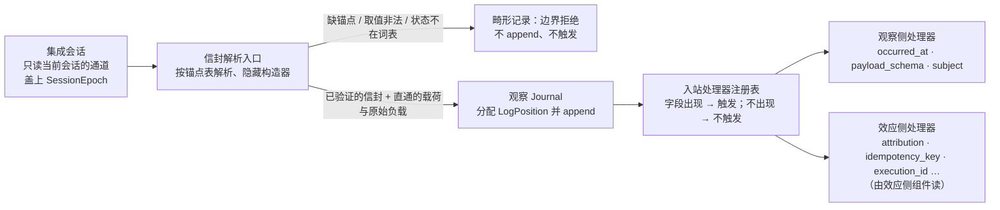

# 信封解析入口与入站处理器注册表

## 0 定位

- **层级与元素**：L3 component，核心进程内的“信封解析入口”与“入站处理器注册表”：核心在集成边界上读哪些字段、怎样验证、字段出现时触发什么。二者共同隐藏一个决定：**核心看哪些字段**。上级文档：[核心进程](design.md)。
- **本文决定**：集成输出的三部分（信封、载荷、原始负载）；锚点与处理器两类信封字段的区别与失败面；协议作为注册单元；并给出核心↔集成契约中的**锚点表**、**处理器字段注册表**与 **`payload_schema` 及 schema 发布**的规格。
- **读者**：集成作者（对照锚点表、注册表与 schema 规则填记录）；实现入口解析与处理器分派的实现者；审查“核心不含业务、不消费上游”的评审者。
- **状态**：已定。
- **非目标**：
  - 投影 `Projection`、记录映射与握手静态校验：[integration-session.md §3.3 投影 Projection](integration-session.md#33-投影-projection)、[integration-session.md §3.4 记录映射](integration-session.md#34-记录映射-设计)、[integration-session.md §3.4 记录映射](integration-session.md#34-记录映射-设计)。
  - 推送怎样经当前会话的通道读入、盖上 `SessionEpoch`：[integration-session.md §4.3.2 集成→核心的推送](integration-session.md#432-集成核心的推送)。记录的位置分配与 append：[观察 `Journal`](observation-journal.md) §2.2。
  - 各处理器触发之后的业务效果：效应侧归因见 [core-process/design.md §4.4 效应侧归因处理器](design.md#44-效应侧归因处理器)，按执行计数与最近观察见 [read-model.md §3.2 成交的计数身份](read-model.md#32-成交的计数身份-设计)，输入约束与过期见 [decision-chain.md §4.2 顺序固定链：授权 → 输入约束 → 审批 → lane → 过期](decision-chain.md#42-顺序固定链授权--输入约束--审批--lane--过期)，按主体投递见 [delivery.md §3.3 按主体投递](delivery.md#33-按主体投递)。本文只登记“字段 → 处理器”。
  - 值树与 `required_inputs` 的定义：[core-process/design.md §3.12 组合子值树与五个 fold](design.md#312-组合子值树与五个-fold)。
  - 出站处理器（程序发出的请求出现 → 做什么）：[outbound-requests.md §3.2 处理器注册表：出现了什么，则做什么](outbound-requests.md#32-处理器注册表出现了什么则做什么)。
- 证据标签与编号前缀的约定见 [README.md §0.4 阅读约定](../../README.md#04-阅读约定)。

## 1 问题域与驱动

### 1.1 上级分配给本组件的需求

| 来源（[README.md §2 问题域](../../README.md#2-问题域)） | 内容 | 本组件承担的部分 |
|---|---|---|
| B6 | 核心不处理协议；集成层洗完送内部协议 | 核心只解析信封，载荷直通 |
| F2、F6 | instrument 身份只在 venue 内有意义；能力与语义按 venue × 操作种类变化 | 身份一律不透明；核心不预建账户或订单结构 |
| C13 | 原始负载完整保留；状态映射到有限词表，未列举值以 `Unmapped(raw)` 承载 | 原始负载的保留规则；入口只验证状态字段取值在契约词表内 |
| Q5 | 回执保真与未列举状态 | 同上 |
| Q18（经 [integration-session.md §4.3.4 扩展与演进](integration-session.md#434-扩展与演进)） | 新 provider 接入不改核心 | 新 venue 的新字段只需注册处理器，不改锚点 |

### 1.2 本组件直接面对的域性质

- **上游形状由上游决定** [证据：fp-00 §1；fp-04 命题 15/16；域 F2/F6]：有的券商只有账号，有的有子账号，有的跨国家账号通用但另有独立账户概念。这些结构不可能在程序里预先构建；任何预先构建都是把某一家券商的结构冒充为通用模型。
- **集成是独立进程，语言不限**：venue SDK 是什么语言，集成就用什么语言（[integration-session.md §3.2 契约的三部分](integration-session.md#32-契约的三部分-设计)）。所以核心与集成之间的共同语言只能是契约定义的值，不能是任何一方的内部类型。
- **记录从不可信的边界进来**：集成可能有缺陷，送来缺字段或词表外的值。解析必须在入口完成，内部信任已验证的值。

## 2 模型

### 2.1 信封之于核心，如主键之于数据库

UTA 是一个反向代理。经过它的不是上游协议，而是集成消费上游之后产出的契约值（[README.md §1.4 三段：清洗、抽象、清洗](../../README.md#14-三段清洗抽象清洗)）。核心可以处理契约值的任何部分，但**只看自己代数要消费的字段**，其余原封不动打包转发。

数据库只坚持看主键，其余列它不解释；核心只坚持看信封，载荷它不解释。

### 2.2 三部分 [设计]

集成的每条输出分三部分：

- **信封字段**：锚点与已注册处理器要读的字段。入口解析并验证（parse-don't-validate，隐藏构造器）。
- **载荷**：集成对上游的消费结论，由记录映射按契约的 schema 写成（[integration-session.md §3.4 记录映射](integration-session.md#34-记录映射-设计)），打 `payload_schema`（§3.3）。核心原封直通，不解释；程序与单据钩子按 `payload_schema` 解释它。
- **原始负载**：集成所消费的上游原文，作为证据保留。它不交给任何解释器，UTA 内没有谁从它读值；它只供审计与追溯。

一个字段若没有任何进度、lane、规则、保留或钩子去读它，它就必须是不透明载荷。

**原始负载的保留**，按路径分：

- **写路径**（回执、取证的响应）与**可带 `attribution` 的流**（订单状态、成交）：上游原文必须完整随记录送达。前者进 `Evidence`（C13，[io-shell.md §4.3 输出与记录模型](io-shell.md#43-输出与记录模型-设计)）；后者的记录可能经 `Attributed` 渠道成为某次尝试的证据，同样进 `Evidence`。记录映射不能改变这一点，握手时核心校验（[integration-session.md §3.4 记录映射](integration-session.md#34-记录映射-设计)）。
- 一个操作由多次上游调用得到结果时，`Evidence` 的原始负载是这次操作全部上游响应的原文，按调用顺序，不只末次。
- **其余观察流**（报价、盘口、K 线等）：记录映射对每条流声明原始负载保留与否。不保留时，该流记录只有契约载荷，丢弃的字段随之不可追溯。理由：C13 只约束写的证据；高频行情逐条留原文是存储代价，值不值得由适配器作者按该流的审计需要选择。

### 2.3 锚点与处理器 [设计]

被核心读的信封字段分两类，性质不同：

- **锚点**：没有它构不成链路（如上游端点与端口）。
  - 闭合、必填、入口即验。
  - 缺锚点不是规则否决（那是 fail-closed），而是**畸形记录**，在集成边界拒绝。
  - 锚点只服务路由与关联（[core-process/design.md §3.13 五种关系，五种承载](design.md#313-五种关系五种承载)），不服务业务判断。
  - 锚点集合按链路种类不同，像 port 取决于 scheme（§3.1）。
- **处理器**：“header 里出现了什么，则做什么”。
  - 非锚点字段的语义完全由注册的处理器定义。
  - 处理器 = (触发条件：某字段存在；`required_inputs`：读哪些字段；效果：append 什么记录或触发什么动作)。
  - 字段不存在 → 处理器不触发，**不是错误**。
  - 注册表按两个类型宇宙分开（[core-process/design.md §3.4 两个类型宇宙与唯一边](design.md#34-两个类型宇宙与唯一边)）：观察侧处理器只产生派生记录与进度；效应侧处理器才涉及 lane、决议与规则。

### 2.4 推论

1. **“核心看哪些字段”是推导出来的**：`锚点 ∪ ⋃ handler.required_inputs`。没有处理器声明要读的字段自动是载荷。`AlignmentCheck.required_inputs`（[ticket.md §4.5 交易协议：操作种类、目标、可执行性、检查目录](ticket.md#45-交易协议操作种类目标可执行性检查目录-交易协议)）已是这个形状，推广到所有处理器。一个字段可以既是注册字段又是公共 schema 的字段（`cumulative_filled_quantity`、`execution_id`、`execution_revision`、`venue_order_id`、`order_revision`、`subject`，§3.3）：注册决定核心读它，公共 schema 决定程序与下游把它当数据读；值只有一份，集成对齐一次。
2. **加处理器不改锚点**：additive 扩展落到协议层，新 venue 带来的新字段只需注册处理器。加 `OperationKind` 改实现该协议的所有集成，因为 `OperationKind` 是锚点（[integration-session.md §4.3.4 扩展与演进](integration-session.md#434-扩展与演进)）。
3. **两类规则组合的物理依据**：锚点驱动顺序固定链（授权 → 输入约束 → 审批 → lane → 过期），每步读锚点；处理器按字段触发、彼此独立，天然是可交换集。若一个处理器依赖另一个的输出，它读的是前者 append 的记录，属链不属处理器集（[decision-chain.md §3.2 可交换集与顺序固定链](decision-chain.md#32-可交换集与顺序固定链)）。
4. **解释载荷的不是核心**：程序与单据钩子按 `payload_schema` 解释载荷；核心只路由字节、存它们的输出。nginx 不看 body，filter 看。它们解释的是契约载荷，即集成已经消费过的结论；原始负载不进任何解释器。money/quantity 精确类型只在核心**计算**处出现（[core-process/design.md §3.8 基础值类型](design.md#38-基础值类型)）：观察侧信封不含价格，行情价格在载荷里；效应侧意图的守卫字段（名义金额等）是写侧基本类型注册的字段，以精确类型出现。
5. **集成义务随之收缩**：集成消费上游，填锚点、填它认识的可选字段，按记录映射把其余结论写成契约载荷并打 `payload_schema`，附上应保留的原始负载。集成不需要理解 UTA 的规则，只需要锚点表、字段注册表与载荷 schema。“集成不一定用 Rust 写”由此成立。

接入层不只是网络协议转换器。把上游混乱的 API 转成好消费的内容是一半；另一半是把上游的账户结构、市场地址、身份体系**对齐到锚点契约**：什么是 lane 键、`basis` 能引用哪些流、`target` 用什么身份。这是需要判断的设计动作，每个集成自己做、自己负责；做错了只影响它自己的流。

### 2.5 协议 = 注册单元

UTA 处理订单、新闻还是期权，只是协议不同的处理对象。协议改变的是 UTA 如何响应内部的值，不透明的部分交给下游。

一个协议 = 它填的锚点 + 它注册的字段 + 这些字段触发的处理器 + 它的 `payload_schema` 集。例如 `cumulative_filled_quantity = 100` 对核心没有意义；交易协议注册了“`cumulative_filled_quantity` 出现 → `orders` 读模型的订单累计成交量”，UTA 才对它有响应。

协议 ≠ venue：一个 venue 实现一个或多个协议。每个协议至少有观察半边；只有可写协议才有效应半边 [证据：fp-04 命题 15/16]。

| 处理对象 | 锚点 | 注册的字段与处理器 | 载荷交给谁 |
|---|---|---|---|
| 新闻 | 观察链路 | 可能只有 `occurred_at`；无效应半边 | 程序做派生、消费方展示 |
| 期权 | 观察 + 意图链路 | 与股票同一交易写协议；守卫要读 greeks/到期则注册 | 同交易 |
| 订单 | 观察 + 意图/尝试链路 | `attribution`、`cumulative_filled_quantity`、`venue_order_id`、`order_revision`、`idempotency_key`、`execution_id`、`execution_revision`、守卫字段 | 程序、钩子、读模型 |

“交给下游”的下游包括程序与钩子。它们解释载荷，但输出仍经过核心（派生记录、意图、`IntentAlignment`）。不透明是对**核心的路由与存储**不透明；解释权在下游，记录权在核心。

交易协议是预置的写侧基本类型“订单”所在的协议（[README.md §1.3 UTA 不含业务](../../README.md#13-uta-不含业务)）；以后加写侧基本类型，就是加一个可写协议。交易协议注册的内容标 [交易协议]，不属于核心代数，例如：lane 键对齐为 (账户, 子账户)、撤改单与 `Replace`、`cumulative_filled_quantity`、`OperationKind` 的具体集合、money/quantity 值类型（[ticket.md §4.5 交易协议：操作种类、目标、可执行性、检查目录](ticket.md#45-交易协议操作种类目标可执行性检查目录-交易协议)）。

### 2.6 信封解析，载荷直通

订单状态（终态 / 非终态）是被路由的少数字段之一。上游状态的映射在集成里做：它是记录映射中的枚举映射表，按 venue 列举输入枚举，映射到契约的有限词表（C13）；映射不了的输出**必须是 `Unmapped(raw)`**，不能靠“无 catch-all”伪造穷尽映射。核心入口只验证该字段是契约词表中的一个值（含 `Unmapped`）[证据：fp-04 命题 15/16；域 C13/F6]。

venue 词汇不越过集成 [域 B6]。

### 2.7 为什么 / 不选

- **为什么**：现实中不可能拿自造的假账户去交易，只能用上游真账户，账户的 schema 完全由上游协议决定。所以核心永远不知道账户长什么样，只知道它的投影（`WriteScope`，[integration-session.md §3.3 投影 Projection](integration-session.md#33-投影-projection)）。这条判据本身就是防“业务对齐大对象”的机制：核心没有 30 条规则去读 30 个字段，`Order { 30 个字段 }` 就写不出来；核心没有地方消费账户结构，`Account` 就写不出来。写侧基本类型“订单”不是这样的对象：它的字段就是判据推出的那些，即核心代数实际读取的字段 [证据：fp-00 §1；fp-04 命题 15/16；域 F2/F6]。
- **不选：信封全字段解析**：等于预先构建每家 venue 的结构，随 venue 膨胀且冒充上游模型。
- **不选：面向对象**：把“长什么样”与“能做什么”绑在同一个类上，核心一旦要知道后者就被迫定义前者，`Account`/`Order` 大对象由此产生；它把上游权威冒充为本地模型，且随每个 venue 膨胀。
- **不选：把投影藏进适配器，再在核心里造 `账户 id=1 / id=2`**：与预先构建账户结构没有区别 [证据：fp-03 命题 8；fp-01 M1 Haxl `DataSource`]。
- **不选：集成把上游消息原样作载荷，由程序或钩子按上游格式解释**：UTA 内出现第二个消费上游的地方，程序只能按 venue 分别写，上游格式变化波及 UTA 内所有解释器（B2/B4 的跨渠道组合做不成）。

### 2.8 不变量与术语

- **失败面不混淆**：锚点缺失 = 畸形记录（入口拒绝）；处理器字段缺失 = 不触发（不是错误）。由入口解析 + 注册表保证。
- **对称的无知**：核心不知道账户长什么样，集成不知道规则长什么样，信封是两者唯一的共同语言。由入口解析（集成侧填、核心侧验）与注册表保证。
- **状态词表闭合**：被路由的状态字段只取契约词表的值，词表外以 `Unmapped(raw)` 保留。由入口解析保证；映射本身的穷尽性由握手静态校验保证。

| 同名异义 | 前者 | 后者 | 区别 |
|---|---|---|---|
| 载荷 / 原始负载 | 载荷：集成的消费结论，契约 schema，程序与钩子解释 | 原始负载：集成所消费的上游原文，只作证据 | 前者是结论，后者是出处；两者一起进 `Evidence` |
| 锚点 / 处理器字段 | 锚点：缺失 = 畸形记录，链路不成立 | 处理器字段：缺失 = 处理器不触发，不是错误 | 前者闭合、入口即验；后者开放、按注册表 |

## 3 契约规格（核心↔集成）

本节是核心↔集成契约的一部分，随 IDL 由本仓库发布给集成作者。契约的其余部分见 [core-process/design.md §4.2 对外接口总表](design.md#42-对外接口总表)。

### 3.1 锚点表 × 链路

锚点：没有它构不成链路；闭合、必填、入口即验。

| 链路 | 锚点 |
|---|---|
| 观察记录（集成来源的流） | 集成交来的观察记录（推送，回填与一次性读作答的记录）：`StreamId(source, stream, epoch)`、`received_at`（集成在本机收到上游数据的时刻，由集成填写）；`session_epoch`（记录到达的会话通道）、记录时间与 `LogPosition` 由核心在接受时盖上，集成不填。同一条流上核心自己 append 的控制记录（`Gap{origin: Channel}`、读结论记录、路由结论记录等）只有 `StreamId`、记录时间与 `LogPosition`，不带 `received_at`；一次性读的 `Gap{origin: Channel}` 另记发出这次调用的会话的 `session_epoch`（[one-shot-read.md §4.1 核心→集成：read](one-shot-read.md#41-核心集成readstream-request-range--answered--unavailable--refused)）。程序来源 `Program(_)` 的流上的记录由核心产出，同样只有 `StreamId`、记录时间与 `LogPosition`，不合成 `received_at` |
| 意图 | `principal`、`WriteLaneKey`（不透明，由集成从上游账户结构对齐得出）、`OperationKind`、`basis`（可为空集，但必须存在） |
| 撤单 / 改单意图 | 上述 + `target: VenueRef \| IdemKey`（构造前提，[ticket.md §4.5 交易协议：操作种类、目标、可执行性、检查目录](ticket.md#45-交易协议操作种类目标可执行性检查目录-交易协议)） |
| 平仓意图 | 上述 + `target: PositionRef`（核心在接纳边界从 `basis` 中所指、属目标作用域的持仓观察记录构造） |
| 尝试 / 决议 | `AttemptRef = attempt_position`（`Prepared` 的 `LogPosition`，一次尝试一次写，[io-shell.md §3.3 尝试与 AttemptRef](io-shell.md#33-尝试与-attemptref)）、`WriteLaneKey` |
| 订阅 | 选择器（观察流：来源、流、主体集；或执行事实：来源、作用域）、消费方式 |

- 集成送来的记录走观察链路：本组件验证观察记录的锚点。意图、尝试与订阅链路的锚点由核心自己的入口构造（意图的构造前提见 [ticket.md §3.4 参数合规：意图参数 schema](ticket.md#34-参数合规意图参数-schema-设计)，订阅见 [subscription.md §4.1 核心↔解释层：订阅组与 rewind_cursor](subscription.md#41-核心解释层订阅组与-rewind_cursor)），同一张表给出它们的必填集合。
- **记录时间**是每条记录（观察与执行事实）信封上的锚点：写者为这次 append 采样的核心本地墙钟 UTC 时刻，加单调计数；写者可以先用同一次采样做自己的判定，再以它盖记录。它是核心自己的时间，与集成填写的 `received_at` 不是同一个字段（[core-process/design.md §3.8 基础值类型](design.md#38-基础值类型)）。程序值经记录时间访问器读它，不经 `payload_schema`（[core-process/design.md §3.12 组合子值树与五个 fold](design.md#312-组合子值树与五个-fold)）。
- **边界拒绝**：集成交来的观察记录缺锚点（含 `received_at`），或被路由的状态字段取了契约词表之外的值，这条记录是畸形记录：不 append、不分配位置、不触发任何处理器。它不是规则否决，也不是流的断代。核心自己 append 的控制记录与程序流记录不经这道验证，也不要求 `received_at`。

### 3.2 处理器字段注册表

处理器的定义见 §2.3；`required_inputs` 的定义见 [core-process/design.md §3.12 组合子值树与五个 fold](design.md#312-组合子值树与五个-fold)。注册表按两侧分开：

| 字段出现 | 侧 | 处理器 |
|---|---|---|
| `occurred_at` | 观察 | 事件时间；程序与 `range` 按它取窗口。它不推进任何完备进度（[core-process/design.md §3.1 流、位置与三种进度](design.md#31-流位置与三种进度)） |
| `idempotency_key` | 效应 | key ↔ `AttemptRef` 唯一索引（键由核心按 `AttemptRef` 单射铸造，连同 `SendBarrier` 所记键角色，[io-shell.md §3.4 调用方键的铸造](io-shell.md#34-调用方键的铸造-设计)）；撤单 / 改单的 `IdemKey` target 与撤阻塞头资格；by-key 与 `replay_by_key` 渠道可用 |
| `attribution: FromAttempt(AttemptRef)` | 效应 | lane 决议匹配；归因（[core-process/design.md §4.4 效应侧归因处理器](design.md#44-效应侧归因处理器)） |
| `cumulative_filled_quantity` | 效应 [交易协议] | `orders` 读模型的订单累计成交量 |
| `execution_id` | 效应 [交易协议] | `orders` 读模型按执行计数的键（[read-model.md §3.2 成交的计数身份](read-model.md#32-成交的计数身份-设计)） |
| `execution_revision` | 效应 [交易协议] | 同一执行的修订取舍（同上） |
| `deadline` | 效应 | 过期规则（[decision-chain.md §4.4 lane 步、冷却与过期步](decision-chain.md#44-lane-步冷却与过期步)） |
| 守卫字段（side / instrument / quantity / notional） | 效应 [交易协议] | 输入约束、审批阈值（各操作种类的必填与互斥见 [ticket.md §4.5 交易协议：操作种类、目标、可执行性、检查目录](ticket.md#45-交易协议操作种类目标可执行性检查目录-交易协议)） |
| `venue_order_id` | 效应 | 按 id 撤单路径；`orders` 读模型按订单归并与取最近观察的键 |
| `order_revision` | 效应 [交易协议] | 声明 `order_revision` 的流上，同一订单的记录之间的来源顺序（[read-model.md §3.3 订单身份、来源顺序与最近观察](read-model.md#33-订单身份来源顺序与最近观察-设计)） |
| `payload_schema` | 观察 | 程序 / 钩子解释器选择（§3.3） |
| `subject` | 观察 | 订阅过滤：观察流订阅的项按主体投递数据记录（`Pred<Envelope>`，[delivery.md §3.3 按主体投递](delivery.md#33-按主体投递)） |

**`idempotency_key` 的处理规则**：

- 登记的是 `SendBarrier` 携带的键与它的角色，按尝试，一键一尝试。只有记为订单键的键可以作撤单 / 改单的 `IdemKey` target。
- 核心从不把只带该键、没有 `FromAttempt` 的观察记录归到某次尝试：字节相等不证明属于。只凭键时，集成只在它声明的键作用域与唯一期内在记录上填 `FromAttempt`，其外填 `Unattributed`，该尝试经按键取证收敛（[io-shell.md §4.5 对账驱动](io-shell.md#45-对账驱动)）；键由核心按 `AttemptRef` 单射铸造，同一作用域内不会为两次尝试铸出同一个键。
- `attribution` 由谁填、何时填见 [integration-session.md §4.4 集成义务清单](integration-session.md#44-集成义务清单)；`FromAttempt(r)` 到达时 append 什么见 [core-process/design.md §4.4 效应侧归因处理器](design.md#44-效应侧归因处理器)。

字段注册的完整集合随协议演进，属集成契约，不属核心代数；新增注册字段随 IDL 发布。

### 3.3 `payload_schema` 与 schema 发布

- 集成按记录映射把上游记录写成契约载荷，并打 `payload_schema` 标签；需要保留原文的记录同时附上原始负载（§2.2）。核心不解释两者，只路由字节、存输出。
- 程序与单据钩子按 `payload_schema` 选择解释器，解释契约载荷。原始负载不交给任何解释器，只作证据（C13）。
- 核心计算的精确类型（写侧基本类型的守卫字段、`cumulative_filled_quantity`、程序与钩子解释器用的 money/quantity）只在核心计算处出现；观察侧信封不含价格。

**schema 属于契约** [设计]：

- **公共 schema**：跨 venue 共有的种类（quote、book、bar、余额、持仓、订单状态、成交等）各有一份，随 IDL 由本仓库发布。某种类有公共 schema 时，集成必须以它输出该种类的流。
  - 持仓公共 schema 的每条记录带作用域内稳定的持仓身份（区分同一 instrument 的多空分仓与 venue 自有持仓身份），平仓意图的 `target` 取自它；目录公共 schema 的记录按 (instrument, `OperationKind`) 给出写资格（可写 / 不可写），集成已知的不可写（停牌、退市、该类只读、无权限）以它发布（[ticket.md §4.5 交易协议：操作种类、目标、可执行性、检查目录](ticket.md#45-交易协议操作种类目标可执行性检查目录-交易协议)）。
  - 成交与订单状态两个种类的语义见 [read-model.md §3.2 成交的计数身份](read-model.md#32-成交的计数身份-设计)。成交公共 schema 含执行身份与修订两个字段，订单状态公共 schema 含订单身份字段与可选的订单修订字段；它们同时是注册字段 `execution_id`、`execution_revision`、`venue_order_id`、`order_revision`（§3.2）。
  - 有订阅主体的种类（主体即 `route` 按之供给的对象，如报价、盘口、bar 的 instrument），公共 schema 带一个主体字段，它同时是注册字段 `subject`：取值与该主体在 `route` 里的身份相同，不透明，只比较相等。提供它的流，每条数据记录（推送、一次性读、回填、回执与取证的结果）都带它；没有订阅主体的种类不带，该流只能整条订阅。
  - **公共请求 schema**：有公共 schema 的种类随 IDL 发布一次性读的公共请求 schema；来源专有的请求参数写在该集成的扩展 schema 里。订单状态的公共请求 schema 带一个订单身份字段，取值 `VenueOrder(venue_order_id) | CallerKey(idempotency_key)`；某流的 `request_schema` 可以只接受其中一种（以它为基础的扩展 schema 收窄即可）。消费方的读与检查项的“先查后判”按这个字段写入订单身份，能否表达由该流 `request_schema` 的校验决定。
- **公共意图 schema**：交易协议的每种操作种类（下单、撤单、改单、平仓）各有一份意图参数 schema，随 IDL 发布，写成 JSON Schema，含类型相关的必填与互斥约束。集成在该 `(scope, OperationKind)` 的 `CapabilityProof` 里声明它接受的 schema 身份：公共意图 schema，或以它为基础只增加字段与约束的扩展 schema（[integration-session.md §3.3 投影 Projection](integration-session.md#33-投影-projection)）；意图按声明的 schema 在输入约束步校验（[ticket.md §3.4 参数合规：意图参数 schema](ticket.md#34-参数合规意图参数-schema-设计)）。意图参数 schema 是 UTA 的契约，不是上游请求格式。
- **交易协议检查读的公共字段**（[ticket.md §4.5 交易协议：操作种类、目标、可执行性、检查目录](ticket.md#45-交易协议操作种类目标可执行性检查目录-交易协议)）：持仓记录的带符号数量与作用域内稳定的持仓身份；报价记录的一个指定参考价字段；目录记录的合约乘数、计价币种与按 (instrument, `OperationKind`) 的写资格；余额记录的权益及其币种；公共意图 schema 的限价字段。
- **扩展 schema**：venue 特有、公共 schema 容纳不下的内容，由集成在声明中给出 schema 文本，以单独的流输出；需要与公共流关联时，程序按记录上的身份字段 `Join`（[core-process/design.md §3.12 组合子值树与五个 fold](design.md#312-组合子值树与五个-fold)）。扩展 schema 同样属于契约，不是上游消息格式。
- 核心不解释 schema 内容：程序与钩子的解释器按 schema 注册；schema 身份随声明交给解释层，解释层据此判断该来源专有字段此刻能否使用（来源专有字段本身在构建期从集成发布制品生成，[downstream/design.md §4.3 命令与参数从哪里来](../../downstream/design.md#43-命令与参数从哪里来)）。
- 理由：载荷若是上游形状，程序就成了 UTA 内第二个消费上游的地方，只能按 venue 分别写，跨渠道组合做不成（§2.7 最后一条不选）。

**schema 身份与版本** [设计]：

- `payload_schema = (schema_id, schema_version)`，随 `StreamDecl` 在握手声明。`schema_id` 指向契约里的一份 schema：公共 schema，或该集成声明的扩展 schema；它不指向上游的消息格式。
- **同一 `StreamId` 内版本不变**。集成要换载荷版本，就为该流开新 epoch：新 epoch 首条记录带 `Gap{origin: Source, reason: schema_change}`（[core-process/design.md §3.2 gap 的三种来源](design.md#32-gap-的三种来源)）。旧 epoch 的记录保留旧标签。
- 核心按 `(schema_id, schema_version)` **精确匹配**解释器。未注册的组合不触发解释器，载荷留作字节（字段不存在 → 不触发）。
- `request_schema` 同样是 `(schema_id, schema_version)`，但它描述的是请求，不是记录：它变化不开新 epoch，已有记录不受影响。一次性读请求带上它所依据的请求 schema 身份，与会话有效声明不一致即不执行（[one-shot-read.md §4.1 核心→集成：read](one-shot-read.md#41-核心集成readstream-request-range--answered--unavailable--refused)），所以按旧 schema 写成的参数不会被新 schema 当成另一种含义。

### 3.4 演进

- 加注册字段与处理器：只改协议层，不改锚点，不改已接入的集成之外的任何东西。
- 加锚点（例如加 `OperationKind`）：改实现该协议的所有集成。
- 加公共 schema 或新版本：随 IDL 发布；已有流在换版本时开新 epoch。
- 三条轴的完整代价表见 [integration-session.md §4.3.4 扩展与演进](integration-session.md#434-扩展与演进)。

## 4 内部结构

- **解析入口**：每种链路一个智能构造器；构造器私有，已验证的信封类型只能由它产出，下游组件信任它，不再防御。
- **注册表**：字段种类 → 处理器（触发条件、`required_inputs`、读 / 写侧、效果）。按两侧分区：观察侧分区只产出派生记录与进度；效应侧分区由效应侧组件在读观察记录时使用，这是效应侧读观察侧的方向（[core-process/design.md §3.4 两个类型宇宙与唯一边](design.md#34-两个类型宇宙与唯一边)）。
- **启动期校验**：启动时求全部处理器与检查项的 `required_inputs` 之并，与所引用集成来源的最近声明比对；引用了没有集成提供字段的树 fail-closed（[core-process/design.md §3.12 组合子值树与五个 fold](design.md#312-组合子值树与五个-fold)）。注册表不宣称全局穷尽：它是开放的、按协议增长的映射，Rust 形状见 [core-process/design.md §4.8 Rust 映射](design.md#48-rust-映射)。

## 5 走查

组件内细化；推送的端到端 trace 在 [core-process/design.md §5.1 W1（Q1）正常下单闭环](design.md#w1q1正常下单闭环) 与 [core-process/design.md §5.1 W6（Q11+Q12+Q31）行情断线 gap、慢消费者、三种消费方式](design.md#w6q11q12q31行情断线-gap慢消费者三种消费方式)。

**1. 一条订单状态推送（正常路径）**

1. 集成推送一条订单状态记录：信封含 `StreamId`、`received_at`、`venue_order_id`、`cumulative_filled_quantity`、状态 `partially_filled`、`attribution: FromAttempt(r)`；载荷按订单状态公共 schema 写成，`payload_schema = (order_status, 1)`；附原始负载（可带 `attribution` 的流必带）。
2. 集成会话从当前通道读入，盖上 `SessionEpoch`。
3. 解析入口：观察链路锚点齐全，状态在契约词表内 → 已验证的信封。
4. 观察 `Journal` 分配位置并 append。
5. 注册表触发：`cumulative_filled_quantity`、`venue_order_id` → `orders` 读模型；`attribution` → 效应侧归因（r 的结果仍未知时 append `ResolutionEvidence{Attributed}`）；`payload_schema` → 程序与钩子的解释器按 `(order_status, 1)` 选择。
6. 卡点：无。

**2. 缺锚点的记录**

1. 一条推送缺 `received_at`。
2. 解析入口拒绝为畸形记录：不 append，没有位置，不触发处理器，也不是 gap。
3. 集成的缺陷由一致性测试暴露（[integration/design.md §5.2 一致性测试](../../integration/design.md#52-一致性测试)）；核心与其他流不受影响。
4. 卡点：无。

**3. 可选字段缺失**

1. 一条成交记录没有 `execution_revision`。
2. 锚点齐全，照常 append；`execution_revision` 的处理器不触发，不是错误。没有修订号时同一执行怎样计数，由 [read-model.md §3.2 成交的计数身份](read-model.md#32-成交的计数身份-设计) 决定，本组件不另定。
3. 卡点：无。

**4. 未列举的上游状态（Q5）**

1. 上游送来一个 venue 专有状态；集成的枚举映射表里没有它，映射输出 `Unmapped(raw)`。
2. 解析入口验证 `Unmapped` 是契约词表中的值，接受；原始负载保留原文。
3. 读模型把它显示为未列举状态，不映射为 rejected。
4. 卡点：无。

**5. 载荷版本变化**

1. 集成要把某流的载荷从 `(bar, 1)` 换到 `(bar, 2)`：上报 `Gap{origin: Source, reason: schema_change}`，开新 epoch。
2. 新 epoch 的记录打 `(bar, 2)`；旧 epoch 的记录仍是 `(bar, 1)`。
3. 解释器按精确身份匹配；程序若只注册了 `(bar, 1)`，新 epoch 的载荷对它不触发解释器。程序装载期按最近声明核对的规则见 [program-host-element.md §4.2 装载期校验](program-host-element.md#42-装载期校验)。
4. 卡点：无。

## 6 评估

本组件没有单独登记的风险、证伪或验收编号。它的决定由以下验收覆盖，定义在别处：

- 新 venue 字段只注册处理器、不改锚点：验收 #5（provider 正交性），[integration-session.md §6.3 验收标准](integration-session.md#63-验收标准)。
- 枚举映射表中不存在“其他 → rejected”、未列举值以 `Unmapped(raw)` 保留：验收 #12（外部变更与状态保真），[core-process/design.md §6.3 验收标准](design.md#63-验收标准)。
- 上游只在集成内被消费、载荷按契约 schema 写成：验收 #22，[integration/design.md §6.2 验收](../../integration/design.md#62-验收)。
