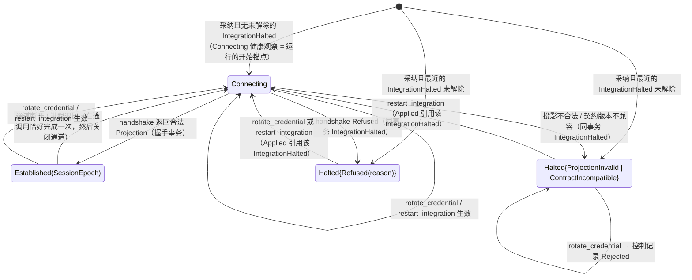

# 集成会话

## 0 定位

- **层级与元素**：L3 component。核心进程内的“集成会话”组件，不属观察侧也不属效应侧。
- **上级文档**：[core-process/design.md §4.1 组件指南](design.md#41-组件指南)（核心进程 L2）。它分配给本组件的需求、同级组件之间的 uses 关系与同事务集合，在那里定义；本文不复述。
- **本文决定什么**：
  - 核心↔集成契约的主体：契约的粒度与三部分、握手交来的投影 `Projection` 的全部类型与语义、记录映射及其静态校验、`handshake`、集成→核心的推送、线缆错误到领域值的映射、集成义务清单、扩展三轴。
  - 集成进程与通道的生命周期：拉起、通道与 `SessionEpoch`、凭据交付、终止与 OS 确认。
  - 会话状态机：`Connecting` / `Established` / `Halted`，`Halted` 的持久化与解除，集成登记的采纳。
  - 声明的两种解释：最近声明与会话有效声明。
  - 控制动作 `rotate_credential` 与 `restart_integration` 的规格，以及轮换强制的新流 epoch。
  - 会话健康观察的写入与调用结果计数的内容。
- **读者**：核心实现者；集成作者（第 3、4.3 节是他们要实现的契约）；审查 IDL 的人。
- **状态**：已定。
- **非目标**：
  - 集成进程内部怎么写（声明构造、记录映射、适配器代码）与一致性测试：[integration-process/design.md §4 结构](../../integration/integration-process/design.md#4-结构)、[integration-process/design.md §6.1 一致性测试](../../integration/integration-process/design.md#61-一致性测试)。
  - 其余契约操作的规格。`submit`/`cancel` 与四个取证操作在 [io-shell.md §4.6 写与取证操作的规格（核心→集成）](io-shell.md#46-写与取证操作的规格核心集成)；`read` 在 [one-shot-read.md §4.1 核心→集成：read](one-shot-read.md#41-核心集成readstream-request-range--answered--unavailable--refused)；`route`、`backfill`、实时边界与序号覆盖在 [subscription.md §4.3 核心→集成：route](subscription.md#43-核心集成routestream-subjects-generation--routedrefused--unavailable)、[subscription.md §4.4 核心→集成：backfill](subscription.md#44-核心集成backfillstream-window-subjects--covered--unavailable--refused)；信封、锚点、字段注册与 schema 在 [envelope.md §3.1 锚点表 × 链路](envelope.md#31-锚点表--链路)；成交与订单状态的契约语义在 [read-model.md §3.2 成交的计数身份](read-model.md#32-成交的计数身份-设计)；交易协议的操作种类表在 [ticket.md §4.5 交易协议：操作种类、目标、可执行性、检查目录](ticket.md#45-交易协议操作种类目标可执行性检查目录-交易协议)。
  - 健康面的 fold 规则（会话值怎样取舍、readiness 何时有效、`health` 的成员）：[read-model.md §3.5 健康面](read-model.md#35-健康面-设计)。本文只写本组件写下的健康观察与计数的内容。
  - 控制动作的共同部分（principal、授权、`Applied | Rejected` 的记录）：[control-plane.md §4.2 共同流程](control-plane.md#42-共同流程)。

标签 `[证据]` / `[设计]` / `[推断]` 与编号前缀的含义见 [README.md §0.4 阅读约定](../../README.md#04-阅读约定)。

## 1 问题域

### 1.1 上级分配的需求

| 编号 | 本组件承担的部分 |
|---|---|
| P1 | 能力声明：从握手取得，按投影路由，把声明部分落成执行事实、经读模型交给解释层 |
| P2、P3 | 集成推送的观察记录与 `Gap{origin: Source}` 经本组件的通道进入核心 |
| P13 | 集成侧的会话：对端即本组件拉起的进程 |
| P14 | `rotate_credential`、`restart_integration` 的生效；`IntegrationHalted` |
| P16 | 会话状态与按调用目标的计数这两类健康观察的内容 |
| C2 | 取证渠道在写能力里声明，按固定顺序（渠道的使用在 [io-shell.md §4.5 对账驱动](io-shell.md#45-对账驱动)） |
| C7 | 凭据链 `统一路径封存文件 → UTA 核心 → 该集成进程` |
| C13 | 枚举映射表外的值只能是 `Unmapped(raw)`，在握手时静态校验 |
| H7、H10 | 通道不可被别的进程连接；孤儿进程的消息进不了核心 |
| Q13、Q15、Q16 | 由声明（配额、读侧能力）与两种解释支撑；判定在各自组件 |
| Q18 | 换凭据只重启目标集成、旧进程先于新进程结束、各流 `credential_rotated` |
| Q20 | 旧会话、旧实例的消息不进入核心 |
| Q32 | “断开会自己恢复”与“被拒需要人处理”可区分；计数按目标 |

编号的定义与出处见 [README.md §2 问题域](../../README.md#2-问题域)。

### 1.2 本组件直接面对的域

- **集成进程**：第三方按 IDL 写的独立 OS 进程，语言不限；它会崩溃、会挂住、也可能不如实履约。核心能静态校验的只有它交来的值（声明与记录映射）；它的行为只能由一致性测试验证 [设计]。
- **上游**：两种失败必须区分。上游明确拒绝（凭据被拒、账户不存在或未开通、配置被拒）不会自己好；不可达、超时、回答不明确会自己好。反复用同一份被拒凭据登录，还可能触发上游的账户锁定 [推断]。
- **OS**：
  - 进程的存亡只有 OS 能确认，按 `(pid, start_time)` 核对。
  - 三个目标 OS 都能给出核心创建、只交给被拉起子进程的通道：macOS、Linux 为 `socketpair`，Windows 为匿名管道对，经继承句柄列表只交给该子进程。这样的通道不是可被连接的端点，核心关闭己端之后从中再也读不到消息。
  - 同用户的其他进程能从进程表读到环境变量与启动参数（H7）。
- **Alice 写的文件**：集成登记与账户封存信封 / 封存密钥引用（统一路径，每个文件唯一写者是 Alice，原子替换）。核心只读，只在规定时刻读（[core-process/design.md §4.6 统一路径文件](design.md#46-统一路径文件)）。
- **核心时钟**：会话健康观察的 `since` 取核心写下它的时刻；核心不回填崩溃发生的时刻。

### 1.3 设计义务

本组件的规格 + 上述域性质 ⇒：每个集成的写与读只经一条核心确认得到的通道；每个调用恰好一个封闭结果、恰好计一次；上游明确拒绝时不自动重试，暂时不可达时自动重连；此刻能否读写只按当前已建立会话里的声明判定；凭据任一时刻至多有一个进程持有。

## 2 驱动

| 场景 | 本组件的响应度量 | 验收 |
|---|---|---|
| Q18 换凭据 | 旧进程 OS 确认退出先于新进程拉起；新旧进程从不同时存在；其他集成的 `Seq` 连续；新 epoch 首条为 `credential_rotated` | #79、#36 |
| Q32 健康 | `Connecting` 与 `Halted` 可区分；每个调用恰计一次，连续失败数等于按提交顺序独立重算的值 | #36、#44、#72 |
| Q20 双实例 / 孤儿 | 旧会话、孤儿进程在旧通道上写的推送与回执不出现在任何日志里；第三方进程连不上调用通道 | #78 |
| Q2 会话断开时的在途写 | 在途写恰得一个 `NoResponse`，迟到回应不产生第二个结果 | #44 |
| Q13、Q16 | 声明与静态校验使配额、读能力、写能力有唯一来源 | #26、#80 |

## 3 模型

### 3.1 契约的粒度：操作是 UTA 的意图 [设计]

契约里的每个操作是 UTA 需要的一件事：列某作用域的订单、按键查一笔、投放一笔。粒度由写侧基本类型与读侧流决定，不照搬任何上游接口；下游业务只组合这些操作，不决定它们。

- 一个操作在上游对应几次调用、什么顺序、怎样传参、分页与重试，契约不表达、不约束。上游可能要连调几个过程式接口才凑出“账户 A 的订单”；这是集成对该意图的解释，与 IO 壳解释 `Prepared` 同构：UTA 给出意图值，集成负责在上游运行它。
- **一个操作只有一个封闭结果**：多次上游调用的中间状态不越过集成。任一次调用失败，结果只能是该操作封闭返回值之一（读为 `Unavailable`），不以缺项结果冒充完整结果：缺掉的记录会被当成不存在（F10）。多次调用不是原子的：结果记录的 `received_at` 取末次上游响应的时刻，结果只断言“首次调用发出到末次响应之间观察到这些”。结果作取证证据时，`Evidence` 的原始负载是这次操作全部上游响应的原文，按调用顺序。
- **一次写意图至多一次上游写**：一次 `submit` / `cancel` 在上游可以有任意次读，改变上游状态的调用至多一次。一个 `(scope, OperationKind)` 恰对应一次写，`AttemptRef` 就是这次写的身份。上游要连发多次写才能完成一个意图（先建单再激活、先撤后下的改单）时，不得装成一次 `submit`：该组合声明 `Unsupported`，需要的由调用方以多张单据各自完成（[ticket.md §4.5 交易协议：操作种类、目标、可执行性、检查目录](ticket.md#45-交易协议操作种类目标可执行性检查目录-交易协议)）。
- 理由：上游接口的形状只在集成里被消费（[README.md §1.1 根本约束：权威不在 UTA](../../README.md#11-根本约束权威不在-uta)）。照搬上游接口，UTA 就得编排上游调用，等于在 UTA 内消费上游，每接一个上游都要改契约。两次写之间崩溃时，第二次写是否发生对核心不可见，`SendBarrier` 把崩溃窗口二分的保证不再成立（[io-shell.md §3.1 两阶段协议与它的位置](io-shell.md#31-两阶段协议与它的位置)）。
- 不选：
  - **契约操作照搬上游接口**：同上。
  - **调用编排也写进声明语言**：声明语言要表达调用、顺序、分页与重试，就是在写程序，失去“值可静态校验”的理由。
  - **字段清洗全部写成适配器代码**：丢字段、映射不穷尽这类错误只能靠测试发现，握手时查不出。

### 3.2 契约的三部分 [设计]

| 部分 | 内容 | 在哪里执行 | 核心怎么用 | 由谁保证 |
|---|---|---|---|---|
| **声明** | `Projection` 中除 `mappings` 外的部分（3.3）；锚点对齐 | —（值） | 握手读取并 fold：路由、门、`required_inputs` 比对、取证渠道顺序；每次握手落一个声明版本，经读模型 `sources` 交给解释层 | 值；核心按 schema 校验 |
| **记录映射** | `Projection.mappings`：上游记录怎样落到对齐点（3.4） | 集成进程内，由本仓库发布的解释器求值 | 握手时静态校验，并求出每条流实际提供的契约字段集；核心不执行它 | 值；静态 fold |
| **行为** | 操作集与推送：调用编排、鉴权、分页、重连、pacing，以及需要上下文的判定（如键超出上游保证期限时查不到只能是 `Unavailable`） | 适配器代码 | 每次调用与推送 | 一致性测试（4.4 集成义务） |

判据：不含调用、先后顺序、时间与跨记录状态的，写成值（声明或记录映射）；含其中任一的是适配器代码，只以封闭返回值对核心可见。会推翻这条分界的观测见证伪 #10（6.2）。

契约的语义由核心文档定义；一份 IDL 是实现阶段制品，由本仓库拥有、随 release 发布给集成作者，任何语言按 IDL 实现即可接入；传输按 OS 选择（4.5），不改契约语义。消息 schema 的文本形式里，构造子的序列化直接取值树的 enum（[core-process/design.md §3.12 组合子值树与五个 fold](design.md#312-组合子值树与五个-fold)）。

### 3.3 投影 `Projection`

**上游形状留在集成，越过集成的是契约。** UTA 不知道上游的任何东西（账户、订单、持仓、行情流、证据渠道）在上游长什么样，也不需要知道。越过集成的三样都由 UTA 契约定形：信封（[envelope.md §2.2 三部分](envelope.md#22-三部分-设计)）、载荷（按契约的载荷 schema 写成，核心不解释），以及**投影**：由 UTA 定 schema、由集成填内容。核心按它路由；它的声明部分作为执行事实落盘，经读模型 `sources` 交给解释层，由解释层翻成对外概念。外部下游看不到投影本身。

没有投影，UTA 就无法知道、也就无法经解释层告诉下游“你可以和我的哪些作用域通信、每个能做什么、载荷按哪份 schema 读”。同一上游对象可有多种投影，投影随握手变化，UTA 从不持有对象本身 [证据：fp-03 命题 3；域 P1/C2]。

**投影 = 握手声明的值**，带来源与观察时间：

```rust
struct Projection {
    scopes: Vec<WriteScope>,                     // 可写作用域：多账户在 UTA 里的存在形式；键不透明
    streams: Vec<StreamDecl>,                    // 观察流的声明
    capabilities: Vec<Capability>,               // 写侧：(scope, OperationKind) → Verdict
    quotas: Vec<Quota>,                          // 订阅配额池
    extension_schemas: Vec<SchemaDoc>,           // 该集成声明的扩展 schema 文本（载荷、读请求、意图参数）；公共 schema 随 IDL 发布，不在此
    mappings: Vec<RecordMapping>,                // 记录映射（3.4）：集成侧求值；核心只做静态校验并求每条流提供的字段集
    source: Source, observed_at: Instant,
}
struct WriteScope { key: WriteLaneKey, account_ref: Text, label: Text, streams: Vec<StreamName> }
    // account_ref：对外账户引用；label 只给人看；streams：挂在该作用域的流名（epoch 由核心定）
struct StreamDecl {
    stream: StreamName, kind: StreamKind,
    payload_schema: SchemaRef,                   // 记录载荷的 schema；与 epoch 绑定
    request_schema: SchemaRef,                   // 一次性读请求参数的 schema；不与 epoch 绑定
    read: Verdict, backfill: Verdict,            // 读侧能力：一次性读 / 回填，按流
    quality: NominalQuality,                     // 声明的名义数据等级，不担保逐条记录
    has_venue_cursor: bool, has_event_time: bool,
    joinable_venue_seq: bool,                    // 推送与回填的记录带本流 epoch 内连续、可衔接的 venue 序号
    backfill_from_origin: bool,                  // 回填能从上游该流历史的起点（Origin）起给出全部历史
    order_revision: bool,                        // 订单状态种类：每条记录带注册字段 order_revision，上游保证它对同一订单跨渠道单调
    query_not_lagging: bool,                     // 一次性读、回执与取证的回答不早于发出前已送达本流的任何记录
    push_ordered: bool,                          // 同一 (会话 epoch, 流 epoch) 内本流的推送按上游状态次序送达
}
struct Quota { streams: Vec<StreamName>, max_subjects: u32 }   // 这些流上核心要求集成推送（route）的不同订阅主体数上限
struct Capability { scope: WriteLaneKey, operation: OperationKind, verdict: Verdict<CapabilityProof> }
enum Verdict<P = ()> { Supported(P), Unsupported, Unknown }   // 写能力的 Supported 带证明；流的读 / 回填能力是 Verdict<()>
struct CapabilityProof {
    write: WriteOp,                              // Submit | Cancel：这个 (scope, OperationKind) 用哪个 IDL 写操作，一次上游写
    key: KeyRole,                                // None | OrderKey(KeyGuarantee) | RequestKey(KeyGuarantee)
    channels: Vec<EvidenceChannel>,              // Undetermined 时的取证渠道，按固定顺序
    intent_schema: SchemaRef,                    // 接受的意图参数 schema 身份
    target_kinds: Set<OrderTargetKind>,          // Cancel、Replace 接受的目标种类，⊆ {VenueRef, IdemKey} 且非空；其余操作种类为空
}
```

UTA 对投影只做两件事：按投影路由（lane 按 `WriteScope`、订阅与一次性读按 `StreamDecl`、写门按 `Capability`）；把声明部分交给解释层，由它翻成对外概念。它不解释形状，也不发明投影。投影含 `WriteLaneKey`、`Verdict` 等核心概念，所以只到解释层为止（[README.md §1.4 三段：清洗、抽象、清洗](../../README.md#14-三段清洗抽象清洗)）。

**作用域 `WriteScope` 就是“多账户”**：核心不知道它是账号、子账号还是跨国独立账户，只知道有几个、各自能做什么、各自挂哪些流。

**写能力 `CapabilityProof`** 声明三件事：

- **写操作与键角色**：这个 `(scope, OperationKind)` 在上游以哪一个写操作执行（一次上游写，操作种类表在 [ticket.md §4.5 交易协议：操作种类、目标、可执行性、检查目录](ticket.md#45-交易协议操作种类目标可执行性检查目录-交易协议)），调用方键的角色（`None`：不带键；`OrderKey`：上游能以该键找到并撤改这次写投放的订单；`RequestKey`：只标识这次请求），以及结果未知时的取证渠道。渠道的完备枚举：按调用方键回读（键角色不为 `None` 时）；open-order listing + venue 订单身份（“缺席需二次确认”在集成内判定）；成交或持仓对账；保留期内 `replay_by_key`（键角色不为 `None` 时；保留期在集成内判定）；无（空表）。这是对账渠道顺序的来源（P1、C2）。键由核心铸造（[io-shell.md §3.4 调用方键的铸造](io-shell.md#34-调用方键的铸造-设计)）；声明 `None` 以外的角色，即断言上游原样接受核心的键，并同时声明键的作用域与上游保证它唯一的期限（`KeyGuarantee`）：只在这个作用域与期限内，集成才凭键把记录归因到这次写（`FromAttempt`），其外记 `Unattributed`。一次尝试实际用的写操作与键角色以它的 `SendBarrier` 所记为准，不按声明重读。
- **意图参数 schema 身份** `(schema_id, schema_version)`：交易协议该操作种类的公共意图 schema，或以它为基础只增加字段与约束的扩展 schema。
- **接受的订单目标种类**：撤单与改单能按 venue 订单身份（`VenueRef`）还是按调用方键（`IdemKey`）找到目标。有调用方键不等于能按键撤单（F6）。

三者合起来决定一版意图是否**可执行**：意图在输入约束步按它校验，能力项与发出前门各再核对一次（[ticket.md §4.5 交易协议：操作种类、目标、可执行性、检查目录](ticket.md#45-交易协议操作种类目标可执行性检查目录-交易协议)）。F6“部分未文档化”的能力不可能是静态保证，所以写能力是三值的运行期值（见下文“能力未知 ≠ 结果未知”）。

**流与作用域的关系** [设计]：流名在一个来源内唯一。一条流的数据依赖某个作用域（该账户的持仓、订单、余额），就声明为只挂在那一个作用域上的流；不依赖作用域的数据（公共行情、目录、新闻）可以挂在多个作用域上，也可以不挂在任何作用域上。一次性读、订阅与读模型都按流寻址，作用域不另作读的地址。

- 理由：地址只有一个时，读的目标不会与作用域互相矛盾；按作用域取数据的需要已由“私有数据是单作用域流”满足。
- 不选：**一次性读同时带作用域与流**：同一请求有两个可相互矛盾的目标。**为只读来源虚构不可写的 `WriteScope`**：`WriteScope` 是 lane 的来源，虚构一个会凭空造出账户与写门项。
- 由此，只读公共来源（无凭据的公共行情等）就是只声明流、不声明作用域的集成：它没有账户，照常可读、可订阅。

**对外账户引用 `account_ref`** [设计]：下游要能在命令里写出一个账户，并在下次写出同一个账户；`label` 只给人看，可重复、可改；`WriteLaneKey` 是核心概念，不外露。所以作用域另带一个由集成给出的契约引用。

- 集成义务：在本集成内唯一；同一上游账户跨握手、重启、换凭据不变；一旦用过，不再给另一个账户。它可以由上游账号与子账号组成，不要求等于上游的某个原生字段。
- 核心校验，只查声明之间的矛盾：一个引用在同一版声明里出现两次，或历史上任一版声明曾把它绑定到另一个键，或同一个键在历史上曾带另一个引用，这个引用就标为**不可解析**，原因记入该版声明；曾经歧义的引用此后一直不可解析。判定对照该来源的全部历史声明版本。核心仍按键路由，所以标记不影响 lane、门与记录，只使解释层不能用这个引用找到账户。
- 核心查不出“同一引用、同一键却指向另一个上游账户”：那是集成义务，由一致性测试验证（验收 #26）。
- 理由：外部名字若能改绑到另一个键，下游按旧名字发的写就落到另一个账户；拒绝整个集成又会因为一个作用域的问题停掉其余账户（启动隔离）。只让名字失效，最坏结果是“账户引用冲突，需要处理”，不会写错账户。
- 不选：**以 `label` 作账户名**：显示名可重复、可改；**解释层自行编一个持久名字**：解释层不持有状态；**引用与历史矛盾即判投影不合法**：一个作用域的问题停掉整个集成，且合法的迁移无路可退；**外露 `WriteLaneKey`**：核心概念外泄。

**读侧声明** [设计]：一次性读、回填与订阅按 `StreamDecl` 判定，与写侧 `Capability(scope, OperationKind)` 分开：读的对象是流，不是作用域上的操作。

- `read` / `backfill` 各是一个三值 `Verdict`，按流声明；握手后的变化经能力变更推送进入 `CapabilityObserved`（4.3.2）。`Unsupported` 与 `Unknown` 都不调用集成，但给发起方的结果不同：前者“不支持”，后者“能力未确认”。此刻的判断只读会话有效声明（3.6）：没有已建立会话时结果是“没有会话”，不以最近声明报“不支持”或“未确认”。
- 能力只到流的粒度。上游只对部分主体提供某种读时，集成要么把这部分声明成单独的流，要么在请求时由上游明确拒绝、得 `Refused`；核心不按主体细分能力（证伪 #12）。
- `request_schema`：一次性读的参数（查询主体：已解析的 instrument、目录键或文本；领域过滤：到期日、行权价、条数上限等）是按这份 schema 写成的一个值；核心只校验形状并原样交给集成，不解释。有公共 schema 的种类随 IDL 发布公共请求 schema；来源专有的请求参数写在该集成的扩展 schema 里。`payload_schema` 与 `request_schema` 的身份与版本规则见 [envelope.md §3.3 payload_schema 与 schema 发布](envelope.md#33-payload_schema-与-schema-发布)。
- `quotas`：配额池属于来源；每个池列出共享一个上限的流与上限值；计量与接纳见 [subscription.md §4.1 核心↔解释层：订阅组与 rewind_cursor](subscription.md#41-核心解释层订阅组与-rewind_cursor)。
- `quality`：该流名义上的数据等级，两个维度：时效（实时 / 延迟 / 未知）与覆盖（全市场 / 部分场所 / 未知）；词表随公共 schema 发布，核心不解释。它是来源对该流开通情况的声明，**不担保**每条记录。理由：数据等级常随 instrument 与开通状态变化，只有上游作答时才知道（运行期的量不冒充静态保证）；声明值只用来在读之前告诉下游“这条流通常是什么”。
- `joinable_venue_seq`：该流推送与回填的记录是否带本流 epoch 内连续、可衔接的 venue 序号。它是集成对上游序号语义的断言（一致性测试验证），不是“记录上有序号字段”：只有这样的序号能证明回填与实时在边界上既不重叠也不留洞，所以它决定该流的回填坐标与实时边界的证明（[subscription.md §4.5 实时边界、回填任务与回填进度](subscription.md#45-实时边界回填任务与回填进度)）。不声明它的流以事件时间作回填坐标；两者都没有的流不能回填（静态校验，3.4）。
- `backfill_from_origin`：该流的回填能否以 `Origin`（上游该流历史的真实起点，不是上游此刻保留的最早一条）为窗口起点，交回从起点到窗口终点的全部历史，含归并所需的修订与作废。同样是集成对上游语义的断言：上游只保留近期历史，或起点之前的历史取不全、落不到与实时相同的回填坐标上的流不声明它。只有从 `Origin` 起补齐的回填能闭合流 epoch 开头的 `Gap{origin: Source}`，所以它决定成交流能否给出完整界（[read-model.md §3.4 精确重建的前提与完整界](read-model.md#34-精确重建的前提与完整界-设计)）。
- `order_revision`、`query_not_lagging`、`push_ordered`：除 venue 序号外仅有的三种来源定序证据，按流声明，用于同一身份的最近观察（[read-model.md §3.3 订单身份、来源顺序与最近观察](read-model.md#33-订单身份来源顺序与最近观察-设计)）。
  - `order_revision` 断言上游给每条订单状态记录一个对同一订单、跨推送与查询渠道都单调的修订（或更新时间）值，以注册字段 `order_revision` 送达，只在订单状态种类的流上声明。
  - `query_not_lagging` 断言一次性读、回执与取证的回答反映的上游状态，不早于该流上在这次调用发出之前已送达核心的任何记录。
  - `push_ordered` 断言同一会话 epoch、同一流 epoch 内该流的两条推送，后送达的反映的上游状态不早于先送达的：上游经一条有序通道、按状态次序交付该流的推送，不是多路 feed 的合并，也不是由轮询合成的推送。上游推送通道重连是一次供给中断，集成本就要上报 `Gap{origin: Source}` 并开新流 epoch，所以重连两侧的推送落在不同流 epoch，没有别的证据时不可比。
  - 三者都以上游文档为证据，一致性测试可证伪（[read-model.md §6.2 证伪条件](read-model.md#62-证伪条件) #30、#31、#37）；不声明的流，对应的顺序不成立，UTA 不以到达顺序代替。

**能力未知 ≠ 结果未知**：

- 三值 `Verdict` 属握手阶段，与写边界的“结果未知”（`Undetermined`）分开：能力未知约束启动阶段（能不能发），结果未知约束恢复阶段（发了之后）。
- `Verdict` 是**运行期值**，不抬进类型 [设计]：能力随握手与运行期观察变化，静态类型无法表达运行期才知道的三值。
- 单据的能力项与参数合规读会话有效的能力：`Unknown` 或没有已建立会话 = 能力未确立，不终结，单据等待；`Unsupported` 才否决（[ticket.md §3.4 参数合规：意图参数 schema](ticket.md#34-参数合规意图参数-schema-设计)）[证据：fp-03 命题 3]。
- 不选：**把能力做成编译期类型**（按 venue 生成类型）：运行期的三值与握手变化表达不了。

**本组件的术语边界**：

| 词 | 甲 | 乙 | 丙 |
|---|---|---|---|
| 账户的三个名字 | `WriteLaneKey`：核心路由键，不外露 | `account_ref`：对外账户引用，稳定、不复用 | `label`：只给人看，可重复、可改 |
| 名义数据等级 / 记录上的等级 | 流声明的名义等级：读之前告诉下游“通常是什么” | 公共载荷里上游报告的实际等级 | 不一致时以记录为准；声明不担保逐条 |
| 形状 / 投影 | 上游形状：上游对象长什么样，只在集成里被消费，从不越过集成 | 投影：有几个作用域、几条流、各支持什么；UTA 定 schema、集成填、核心按它路由，声明部分经 `sources` 交给解释层 | 账户只是特例；订单、持仓、流、渠道都如此；外部下游不见投影本身 |
| 离线 / 待处理 | `Connecting`：没有会话，会自己恢复 | `Halted`：没有会话，不会自己恢复 | 二者都不发写（发出前门等待）；只有后者要运维动作 |

“投影”一词只指握手 `Projection`；消费侧对记录的非权威 fold 一律称读模型。

### 3.4 记录映射 [设计]

记录映射把一条上游记录落到契约的**对齐点**上：锚点、已注册字段、公共或扩展载荷 schema 的字段。

**每个上游字段的处置**，三选一：

- **对齐**：对到某个契约字段，可附换算（单位、精度、时间格式、身份构造；身份的值类型见 [core-process/design.md §3.8 基础值类型](design.md#38-基础值类型)）。
- **进扩展**：契约没有、但对该 venue 有意义，写进该集成声明的扩展 schema 的字段。
- **丢弃**：不写进映射的上游字段不进契约载荷；它只在该记录保留原始负载时随原文留存。

**枚举映射表**（如订单状态）：上游枚举的每个值对到契约词表的一个值；表外的值输出 `Unmapped(raw)`，这是唯一允许的缺省分支（C13）。不能靠“无 catch-all”伪造穷尽映射。核心入口只验证该字段是契约词表中的一个值（含 `Unmapped`）（[envelope.md §2.6 信封解析，载荷直通](envelope.md#26-信封解析载荷直通)）。

**表示**：映射是一张处置表：上游字段名 → 处置（对齐到哪个契约字段并附换算 / 进扩展 / 丢弃），外加枚举映射表。上游形状只出现在表的键里。换算是纯函数值，用同一组合子值树表示（`Comb<上游值, 契约值>`，[core-process/design.md §3.12 组合子值树与五个 fold](design.md#312-组合子值树与五个-fold)）：树的输入是表中该行列出的上游字段值，树里不出现上游字段名；所需算子按值树的扩展轴显式加构造子。换算与规则、程序、检查项同一表示，只是在集成侧求值。

**握手时核心的静态校验**（任一不成立即投影不合法，4.3.1）：

- 声明为某公共 schema 的流，映射对齐了该 schema 的全部必填字段；
- 换算的输入与输出类型相符；
- 枚举映射表的缺省分支只有 `Unmapped(raw)`；
- 进扩展的字段都在声明的扩展 schema 里；
- 声明为成交种类的流，映射对齐了注册字段 `execution_id`；声明为订单状态种类的流，映射对齐了注册字段 `venue_order_id`；声明 `order_revision` 的流是订单状态种类，且映射对齐了注册字段 `order_revision`（字段语义见 [read-model.md §3.2 成交的计数身份](read-model.md#32-成交的计数身份-设计)）；
- 写路径的回执与取证响应、以及可带 `attribution` 的流（订单状态、成交），不带“不保留原始负载”的声明（保留规则见 [envelope.md §2.2 三部分](envelope.md#22-三部分-设计)）；
- 每条流声明的 `request_schema` 是公共请求 schema 或在该集成的扩展 schema 里；每个配额池只列本投影声明的流；每个作用域的 `streams` 只列本投影声明的流；
- 每个配额池所列的流提供注册字段 `subject`：配额按主体计量，池里的流只接受带主体集的项（[delivery.md §3.3 按主体投递](delivery.md#33-按主体投递)）；
- 每个 `Supported` 写能力的写操作是交易协议为该操作种类列出的那一个；撤单的键角色是 `None` 或 `RequestKey`；键角色为 `None` 的写不声明 by-key 与 replay-by-key 渠道；撤单不声明 listing 与成交 / 持仓对账渠道（[io-shell.md §4.5 对账驱动](io-shell.md#45-对账驱动)）；`Cancel`、`Replace` 的 `target_kinds` 非空，其余操作种类为空；
- `backfill` 不为 `Unsupported` 的流有回填坐标：声明 `joinable_venue_seq` 或 `has_event_time`。

`account_ref` 与历史声明版本矛盾不在此列：它只使该引用不可解析，不使投影不合法（3.3）。

**每条流提供的字段集** = 被对齐的公共字段 ∪ 扩展字段。“引用了没有集成提供的字段即 fail-closed”对照的就是这个集合：适配器丢弃了某个可选字段，引用它的树在装载 / 启动期被拒（[core-process/design.md §3.12 组合子值树与五个 fold](design.md#312-组合子值树与五个-fold)）。

**在哪里求值**：映射在集成进程内求值，核心只校验、不执行。解释器由本仓库随 IDL 发布，以库的形式嵌入适配器，各语言绑定是实现制品；不引入新的跨进程协议。

- 理由：消费点在集成；核心若执行映射，就要接收上游形状的记录。
- 不选：**核心执行记录映射**：同上，消费点离开集成。

### 3.5 会话：核心创建的通道化身 [设计]

- 会话就是核心拉起一个集成进程时创建的那条通道的一次化身。核心为它分配 **`SessionEpoch = (instance_id, session_seq)`**：`instance_id` 来自启动 fence（[core-process/design.md §4.7.3 启动五步](design.md#473-启动五步)）；`session_seq` 在同一实例内对同一集成每创建一条通道加一，也就是每拉起一个集成进程一次：重连、换凭据、重启集成都拉起新进程。
- 一个进程恰有一个会话，会话在进程之内结束。
- `SessionEpoch` 是核心给通道化身起的名字，由核心盖在自己 append 的、属于该会话的记录上：声明版本、`CapabilityObserved`、会话健康观察、`IntegrationHalted`、轮换兑现记录、经该通道读入的观察记录与回执，以及经该通道发出的一次性读的结果项、读结论记录与 `Gap{origin: Channel}`。集成不必知道它，也不回填它。
- **接受条件是“经当前会话的通道读入”**：核心只读当前化身的通道，旧化身的通道已关闭，它的推送、回执、握手结果与迟到回调都读不到，所以没有要在边界逐条比较的 epoch。
- 若某目标 OS 给不出核心创建、可确认关闭、别的进程连不上的通道，核心在调用通道层给每个化身一个内部编号，只处理当前化身的消息。这是实现，契约与验收（#78）不变。三个目标 OS 都给得出（1.2）。
- 会话 epoch 与流 epoch 独立：流 epoch 的开与续由握手时的游标证明与集成上报的 gap 决定（4.3.1、4.3.2）。
- 理由（[README.md §1.2 权威源头与生命周期](../../README.md#12-权威源头与生命周期)）：会话的开始与结束应由核心自己创建、自己关闭的对象确认，不落在对方填写的标签上。
- 不选：
  - **集成在每条推送与回执上回填 epoch、核心逐条比较**：会话边界落在对方填写的标签上，迟到消息能否进入取决于对方是否如实回填；
  - **一个进程先后承载多个会话**：要在旧会话里传递新通道的句柄，新旧通道之间的迟到消息又要另行区分；凭据也在拉起时交付，换凭据本就要换进程；
  - **集成主动连接核心的监听端点**：谁能连上就要另行认证，旧进程重连就是一个要逐条区分的旧化身。
- 代价：通道断开或进程退出就换进程，比同进程重连慢；上游暂时不可达（握手 `Unavailable`）仍在同一通道上重试，不换进程。

### 3.6 声明的两种解释 [设计]

声明版本是集成在某次握手时交来的声明的副本，只代表那次握手；此后只在同一会话里由 `CapabilityObserved` 更新。同一份记录因此有两种用法，本组件分别给出，都只由记录求出，没有第二份日志：

- **最近声明**：该来源最近的声明版本，加引用这一版本 `SessionEpoch` 的 `CapabilityObserved`，同一能力目标按其所在流的位置先后。它是历史，不说“此刻能不能”。读它的有：读模型 `sources`、`account_ref` 的可解析判定、供给项的接纳与配额（需求是核心自己保存的意图，按集成最后说过的话管理，不断言来源此刻能供给）、程序装载期对各输入声明的比对（程序是否装载是核心自己的决定，不随会话的来去装卸）。
- **会话有效声明**：`Established{epoch, 声明} | NoSession{Connecting | Halted{cause}}`。只在该来源的会话 `Established` 时存在，这时它就是该会话声明版本的上述 fold；会话一结束它就不存在。写门、发出前门、取证渠道的选择、回填判定与一次性读的读能力与请求 schema 判定，这些“此刻能不能”的判定只读它：`NoSession` 是它们各自的一种情形（等待，或报告没有会话），从不由最近声明换成 `Unsupported` 或 `Unknown`。
- 另给**历代声明**：历代声明版本出现过的流与作用域键集合，供只投递项与执行事实 selector 接纳（[subscription.md §4.1 核心↔解释层：订阅组与 rewind_cursor](subscription.md#41-核心解释层订阅组与-rewind_cursor)）。
- 旧会话的更新不覆盖新声明，不需要跨流的全局序：只 fold 引用最近一版 `SessionEpoch` 的 `CapabilityObserved`。重启后由持久的声明版本与这些关联的更新重建的是最近声明；会话有效声明要等该来源在本实例建立会话、append 新的声明版本之后才存在。
- IO 壳只是 `CapabilityObserved` 的 appender：它把经当前会话读入的能力变更登记成带该会话 `SessionEpoch` 的契约值，不把 Attempt、lane 或决策状态写进去（4.3.2）。
- 理由：声明是集成在某次握手时说的话，会话结束之后没有人让它保持新鲜；拿它作此刻的判定，就是用副本代替源头。会话在时，集成会把变化推来，副本与源头一致；会话不在时，此刻的判定只能等会话或如实报告没有会话。
- 不选：
  - **只保留一个“当前声明”**：断开后要么继续按旧会话的声明发写，要么丢掉历史展示所需的声明；
  - **会话结束时清掉声明**：历史、`sources`、账户解析与订阅的保留都要读它；
  - **把声明版本与 `CapabilityObserved` 定为不属任一侧的记录种类，由各读者自行 fold**：持久订阅、一次性读、写门与 `sources` 各 fold 一遍同一规则，唯一边上要另开一个例外；
  - **把订阅接纳移进集成会话**：订阅表的唯一写者与读的判定顺序就移进一个声明不做判定的中性元素；
  - **改由集成会话 append `CapabilityObserved`**：只改谁调用 append，不改语义依赖，却要推翻已定的记录写者。

### 3.7 由控制流 fold 出的四项持久事实

下列对象跨实例存在，源头都是核心自己写在控制流上的执行事实，本组件按控制流上的位置 fold，不比较不同流上记录的先后（控制流本身见 [core-process/design.md §4.5 持久化视图](design.md#45-持久化视图)）：

| 对象 | 开始 | 结束 |
|---|---|---|
| 采纳集合（一个切面上） | 该位置及以前最近一条采纳记录列出的 id | 并上其后、该位置及以前、`instance_id` 与它相同的各 `restart_integration` `Applied` 采纳的 id；本实例当前的采纳集合即流末的切面 |
| `Halted` 抑制 | `IntegrationHalted{integration, cause, session_epoch}` | 以位置引用它的解除 `Applied`（`restart_integration`，或 `Halted{Refused}` 上的 `rotate_credential`） |
| 未兑现的轮换 | `rotate_credential` 的 `Applied` | 以位置引用它的轮换兑现记录 |
| 集成运行 | 让该集成进入初始状态的 `Connecting` 健康观察所在事务（4.7、4.8） | 见 4.6 生命周期 |

### 3.8 不变量

1. 核心对集成的全部调用都经本组件的调用通道；只有 IO 壳经它发写（`submit`/`cancel`），本组件自己从不发起写。
2. 经当前会话通道发出的每个调用恰好得到一个封闭结果，恰好计一次；通道关闭之后该化身的任何消息都读不到。
3. 同一集成同时至多一个进程；下一个进程在上一个 OS 确认退出之后才拉起。所以凭据任一时刻至多有一个进程持有，两次集成运行不重叠。
4. `Halted` 只由执行事实判定，只由以位置引用它的 `Applied` 解除；核心重启不解除。
5. 会话有效声明只在 `Established` 时存在；“此刻能不能”的判定从不读最近声明。
6. 本组件只按封闭返回值的标签分“失败 / 非失败”计数，不读 Attempt、单据或订阅记录；声明只由声明版本与 `CapabilityObserved` 求出，不读 Decision、Attempt 或 STS 的输出。
7. 核心不写统一路径下的任何文件，不持久化解封后的凭据。

## 4 结构与接口

### 4.1 为什么是一个组件，且不属任一侧

它解释的是两个已有的核心代数：会话状态机（闭合 sum，4.6）与 IDL 操作的封闭返回值；它不拥有新的记录代数：健康观察是观察侧记录的一个种类，`IntegrationHalted`、采纳记录、轮换兑现记录与声明版本是执行事实。

- **为什么不属任一侧**：会话状态与声明被两侧共同使用。IO 壳的发出前门读会话有效声明，STS 与单据按会话有效声明判可执行性；持久订阅按最近声明接纳供给项、计量配额，经它发 `route`/`backfill`，并按会话有效声明判定回填；一次性读经它发 `read`，按会话有效声明判定读能力与请求 schema。放进效应侧，观察侧就要依赖效应侧元素（唯一边反向，[core-process/design.md §3.4 两个类型宇宙与唯一边](design.md#34-两个类型宇宙与唯一边)）；放进观察侧，发出前门就要读观察侧的可变状态。
- 它的接口只以契约值为参数与返回值：IDL 消息，以及声明里的 `StreamDecl`、`Quota`、写能力的 `Verdict` 与作用域键（作不透明值比较）。这些是核心↔集成契约的公共值类型；声明版本与 `CapabilityObserved` 存在执行事实日志里、只追加，但承载的只是契约声明，不是效应侧的状态。它写的执行事实类型不经这个接口暴露，所以观察侧元素依赖它不引入对效应侧类型的依赖。
- 不选：
  - **由 IO 壳拥有会话**：观察侧的 `route`/`backfill` 就要经过效应侧元素；
  - **由持久订阅拥有会话**：写的发出前门依赖观察侧的可变状态；
  - **各发起方自己计数**：同一目标的计数有多个写者，“连续失败数”这种状态值没有唯一的前一值可接；
  - **另设健康元素**：它看不到调用结果，只能再从各发起方收一遍，成了没有秘密的转发者。

**拥有**：每个采纳的集成登记的会话状态机与登记的采纳记录；集成进程的拉起、终止与进程表中 `role = 集成` 的行；通道与 `SessionEpoch`；凭据副本的交付；握手、投影与契约版本的判定；调用通道；两种声明解释；声明版本、`IntegrationHalted`、轮换兑现记录、握手时新流 epoch 首条的 `Gap{origin: Source}`；会话健康观察与调用计数观察的内容。
**隐藏**：传输与重连 pacing、进程监督与通道的 OS 机制。
**假设**：发起方在自己的结果事务里提交本组件给出的计数观察；集成进程只经继承的通道收发。

### 4.2 对同级组件的接口

| 接口 | 使用者 | 语义 | 错误与 undesired events |
|---|---|---|---|
| **调用通道** `call(integration, op) → 封闭返回值 + 计数观察内容` | IO 壳（写与取证）、持久订阅（`route`、`backfill`）、一次性读（`read`） | 只在该集成 `Established` 时可发；经当前通道发出；每个调用恰好完成一次：集成的封闭返回值，或会话结束时的强制完成（写为 `NoResponse`，其余为 `Unavailable`）；随结果给出这次调用对其目标的计数观察内容（4.10），由发起方与结果记录同事务提交 | 无会话时调用不发出、不计数，发起方按自己的规则等待或报告没有会话；迟到回应读不到，从不完成第二次 |
| **会话有效声明** `effective(source) → Established{epoch, 声明} \| NoSession{Connecting \| Halted{cause}}` | IO 壳发出前门与取证渠道、单据、STS 放行门、持久订阅回填判定、一次性读 | 3.6 | `NoSession` 不是错误，是一种情形；来源不在采纳集合里另由调用方按“来源未登记”判定 |
| **最近声明** `latest(source) → 声明?` | 持久订阅（供给项接纳、配额）、程序宿主元素（装载期声明校验）、`account_ref` 可解析判定 | 3.6；从未有过声明版本时为空 | — |
| **历代声明** `ever_declared(source) → {流} × {作用域键}` | 持久订阅（只投递项、执行事实 selector） | 3.6 | — |
| **采纳集合** `adopted(as_of?)` | 一次性读与持久订阅的“来源未登记”判定；读模型 `health` 的成员（读模型按同一规则直接 fold 控制流） | 3.7 | — |
| **会话状态** `source_state(source)` | 一次性读的 `Unavailable{source_state}` | `Connecting` / `Halted{cause}` | — |

这些接口都是对本组件已写下的记录求值的查询，不另存权威状态：`latest(source)` 与 `ever_declared(source)` 回答当前切面，由声明版本与 `CapabilityObserved` 求出；`adopted(as_of?)` 由控制流上的采纳记录求出，可带位置。历史切面（`as_of`）上的声明与健康成员由读模型直接按记录 fold（[read-model.md §4.2 读模型集合](read-model.md#42-读模型集合)），不经这些接口。`effective` 与 `source_state` 读本组件的会话状态机，其中 `Halted` 的持久部分就是控制流上的 `IntegrationHalted` 记录（§4.6）。

本组件使用的接口：

- **存储**的 append：声明版本、采纳记录、`IntegrationHalted`、轮换兑现记录（执行事实）；进程表的写与清除（[storage.md §4.3 进程表](storage.md#43-进程表)）。
- **信封解析入口**：推送的解析与验证（4.3.2）。
- **观察 Journal**：会话健康观察、握手事务里新流 epoch 首条的 `Gap{origin: Source}`。
- **持久订阅**：在本组件编排的握手事务与会话内上报 gap 的事务里，请它 append 该逻辑流的 `None{epoch}` 回填进度，并把待接纳的订阅项（含程序订阅的项）按新声明转为接纳或被拒（[subscription.md §4.1 核心↔解释层：订阅组与 rewind_cursor](subscription.md#41-核心解释层订阅组与-rewind_cursor)）；会话建立与结束时它为各流起、丢 `route` 义务（[subscription.md §3.4 需求、route 义务与路由结论记录](subscription.md#34-需求route-义务与路由结论记录)）。
- **IO 壳**：能力变更推送交给它 append `CapabilityObserved`；会话建立时它为停等的尝试 append `ReconciliationReopened{SessionRestored}`（[io-shell.md §4.5 对账驱动](io-shell.md#45-对账驱动)）。

这些事务的参与者与编排者汇总在 [core-process/design.md §4.3.5 同事务集合](design.md#435-同事务集合)，发起方怎样提交计数在 [core-process/design.md §4.3.6 调用结果与计数的提交协议](design.md#436-调用结果与计数的提交协议)。

### 4.3 核心↔集成契约的会话部分

契约的其余操作按 0 节所列组件定义。全部操作共用的约定：操作集小且闭合；每个操作的**动作轴**（对外部世界是读 / 写 / 非动作）与**核心内部结果**（append / 持久化）分开写；`NotSent`、`NoResponse` 与 `Unavailable` 是一等返回值而非异常。

#### 4.3.1 `handshake() → Projection | Refused | Unavailable`

- **语义**：声明作用域、流、能力、配额、扩展 schema 与记录映射。集成为构造声明可以先询问上游（[integration-process/design.md §4.5 声明构造](../../integration/integration-process/design.md#45-声明构造)）。握手在核心拉起集成进程时创建的通道上进行；它属于哪个会话由这条通道决定，集成不必知道也不回填 `SessionEpoch`。
- **动作轴**：非动作（声明交换）。
- **返回**：
  - `Projection`（含契约版本）；
  - `Refused(reason)`：上游明确拒绝了该登记所列的身份或配置（凭据被拒、账户不存在或未开通、配置被上游拒绝）。只在上游给出明确拒绝时返回；
  - `Unavailable`：上游此刻不可达或未在时限内回答，没有得到明确结论。
- **核心内部结果**：
  - 合法 `Projection` → 会话 `Established`，本组件编排一个事务：
    - append 该握手的声明版本：投影的声明部分（除记录映射外的全部），含作用域与 `account_ref` 的可解析判定；
    - append `Established` 会话健康观察；
    - 该集成的每条观察流按 P3 决定是否开新 `StreamId.epoch`：集成能以 venue 游标证明续接，则续用原 epoch、`Seq` 接续；否则新 epoch 首条为 `Gap{origin: Source}`，由本组件在同一事务 append。该集成有未兑现的轮换时，这次握手不看游标证明，各流一律开新 epoch，原因 `credential_rotated`，同一事务在控制流上 append 轮换兑现记录（4.9）；
    - 请持久订阅 append 各新 epoch 的 `None{epoch}`，并把待接纳的订阅项按新声明转为接纳或被拒；
    - 此后更新路由、做 `required_inputs` 比对（引用了没有集成提供字段的树 fail-closed）；既有订阅按新声明重算路由（[subscription.md §4.2 既有订阅随新声明](subscription.md#42-既有订阅随新声明)）；启动第 4、5 步中与该集成有关的恢复随之进行（[core-process/design.md §4.7.3 启动五步](design.md#473-启动五步)、[core-process/design.md §4.7.3 启动五步](design.md#473-启动五步)）。
  - `Refused(reason)` → `Halted{Refused(reason)}`（4.6 进入 `Halted`）。不自动重握手，等 `rotate_credential` 或 `restart_integration`。
  - `Unavailable` → 仍 `Connecting`，按 pacing 在同一通道上再握手。
- **错误**：
  - 通道断开、集成进程退出 → 该会话结束；进程 OS 确认退出之后拉起新进程与新会话（新 `session_seq`，按 pacing）；
  - 投影不合法（含 3.4 静态校验的任一项）→ `Halted{ProjectionInvalid}`；
  - 契约版本不兼容 → `Halted{ContractIncompatible}`，不降级运行；
  - `Halted` 只影响该集成；投影与契约版本的拒绝只经 `restart_integration` 解除；
  - 一条通道上的握手串行：上一次返回之前不发下一次；旧会话的通道已关闭，它的握手结果读不到。所以没有“别的握手结果”要识别或丢弃。
- **重试**：`Unavailable` 时在同一通道上幂等重发；通道断开时在新进程的新通道上重发；`Halted` 不自动重发。
- 握手不计入调用计数：它由会话状态表达（4.10）。

#### 4.3.2 集成→核心的推送

推送不是对外部世界的读 / 写动作，而是集成把观察与状态送进核心。**接受路径**：本组件只读当前会话的通道，给读入的每条消息盖上该会话的 `SessionEpoch` → 信封解析入口解析并验证信封，畸形记录（缺锚点）在边界拒绝（[envelope.md §3.1 锚点表 × 链路](envelope.md#31-锚点表--链路)）→ 观察 Journal 按到达顺序分配 `LogPosition` 并 append。同一会话上集成→核心的消息按发送顺序处理。

| 推送 | 语义 | 核心内部结果 |
|---|---|---|
| 观察记录 | 集成推送观察记录（venue seq / cursor 证据、`attribution`、契约载荷 + `payload_schema`、按保留规则的原始负载），不带会话 epoch | 经上述接受路径 append；推进序号覆盖（[subscription.md §3.6 序号覆盖](subscription.md#36-序号覆盖)）；触发处理器与派生 |
| `Gap{origin: Source}` | 集成负责的观察流断代；会话内上报的每条带该流在本会话的 `generation`（见下文） | 本组件编排一个事务：append 这条 gap（新 epoch 首条记录，含前一范围与最后 `Seq`、原因、`generation`），同一事务请持久订阅 append 该逻辑流的 `None{epoch}`；该流的 readiness 回到 `Starting`，持久订阅为它起一项 `route` 义务（已有则并入） |
| 能力变更 | 握手后能力变化，含某流一次性读与回填能力；配额只随重新握手变化 | IO 壳 append `CapabilityObserved`（带所更新的声明版本：该来源加读入这条推送的会话的 `SessionEpoch`，不是 append 时另取的当前 epoch）；受影响单据与停等尝试的重算在 [ticket.md §3.6 第二层：意图专属对账 alignment；偏离是状态](ticket.md#36-第二层意图专属对账-alignment偏离是状态)、[io-shell.md §4.5 对账驱动](io-shell.md#45-对账驱动) |
| readiness（P16） | 按集成 × 流：`Starting` / `Live{live_from}`（含 `Degraded{reason}` 子态）；`live_from` 的声明时机见 [subscription.md §4.5 实时边界、回填任务与回填进度](subscription.md#45-实时边界回填任务与回填进度) | 本组件盖上到达会话的 `SessionEpoch` 与该流当时的流 epoch 后 append 为健康观察；它何时有效由 [read-model.md §3.5 健康面](read-model.md#35-健康面-设计) 规定 |

错误与 undesired events：

- **观察记录**：畸形记录在边界拒绝。同一 `StreamId` 内 venue seq 倒退或重复的记录**照常 append**，打质量标记（P2：`replayed` / `out_of_order`）；不去重、不重排，核心不伪造流顺序；已在序号覆盖里的序号再到达不改变覆盖。重复与乱序由派生侧 fold 按记录种类的契约语义处理（[read-model.md §3.2 成交的计数身份](read-model.md#32-成交的计数身份-设计)）。
- **旧会话的推送**：旧会话的通道已关闭，读不到。
- **`Gap{origin: Source}`**：只波及其流；核心不受影响。
- **能力变更**：能力收紧使待决单据 `Diverged`。
- **readiness**：断线 → `Gap{origin: Source}`。集成离开 `Established` 后自己推不了任何东西，核心也不替它 append readiness：各流此时的 `Disconnected` 由会话状态派生。readiness 变化是健康观察，不需确认。
- **`Degraded{reason}`**：`Live` 的子态，由集成上报（上游服务降级、上游限流、该流能力收紧），不改变记录接受条件，也不阻断写：发出前门只看会话与能力（[io-shell.md §4.2 发送屏障与发出前门](io-shell.md#42-发送屏障与发出前门)）。它与核心按声明配额把订阅挂起（原因 `QuotaExceeded`，[subscription.md §4.1 核心↔解释层：订阅组与 rewind_cursor](subscription.md#41-核心解释层订阅组与-rewind_cursor)）互相独立：`Degraded` 不使超配的订阅恢复路由。
- **会话中上游拒绝身份**：没有专门的推送。集成结束会话（关闭它那一端的通道并退出），核心照通道断开处理，下一次握手返回 `Refused`（4.4 行为义务）。

**`generation`：会话内的流 epoch 由集成命名** [设计]：集成在会话内为某流上报的每条 `Gap{origin: Source}` 带一个 `generation`：由集成创建，按流、按会话计，会话开始时为 0，该流每上报一条加一并带上新值，所以本会话第一条带 1。握手事务里 append 的与 `backfill_incomplete` 的 `Gap{origin: Source}` 不是集成在会话内上报的，不带 `generation`。核心在 `route` 里带上它本会话为该流最后接受的值、只转交不自己计数，下一个会话从 0 重新开始；`route` 怎样用它见 [subscription.md §4.3 核心→集成：route](subscription.md#43-核心集成routestream-subjects-generation--routedrefused--unavailable)。理由：流 epoch 的边界属于集成（上游连接是它的，gap 也是它上报的），只有它答得出一次 `route` 问的是不是它当前的 epoch。

**上报 gap 之前先完成已收到的调用** [设计]：会话内为某流上报 `Gap{origin: Source}` 之前，集成先把这条流上已收到、尚未作答的 `read`、`backfill` 与 `route` 调用以 `Unavailable` 完成，再送出这条 gap。

- 这些调用的发出 epoch 是调用所问供给的属性，不是它们生命周期的外层，它们只嵌在会话里。集成已收到它们，回答就在 gap 之前送出；按发送顺序处理，`read`、`backfill` 的 `Gap{origin: Channel}` 落在这条 gap 之前的 epoch 里；`route` 的 `Unavailable` 不 append 记录，持久订阅再发。
- 这项义务只及于送出 gap 之前已收到的调用：在途跨过 gap、集成送出 gap 之后才收到的调用是合规的竞态，集成照常作答（其中 `route` 带旧 `generation`，集成答 `Unavailable`），`read`、`backfill` 的结果由核心按发出 epoch 处置（[one-shot-read.md §3.5 发出 epoch](one-shot-read.md#35-发出-epoch)、[subscription.md §4.4 核心→集成：backfill](subscription.md#44-核心集成backfillstream-window-subjects--covered--unavailable--refused)）。
- 写调用与取证调用（`submit`、`cancel`、`query_by_key`、`list_open`、`list_fills`、`replay_by_key`）不在此列：它们按作用域寻址，回答照常返回，跨过流 epoch 更替的回答按 [read-model.md §3.3 订单身份、来源顺序与最近观察](read-model.md#33-订单身份来源顺序与最近观察-设计) 第 1 条处理。
- 已收到的 `read`、`backfill` 在 gap 之后才作答是违约：核心仍有定义的结果（同上），由一致性测试查出。`route` 跨过更替只由集成按 `generation` 判定，违反只由一致性测试查出。
- 会推翻它的观测：证伪 #38。

#### 4.3.3 领域返回值 → 线缆表示（同一失败三层）

领域状态转换由各自的组件拥有；本表只给线缆表示到领域值的映射，不新增第三套业务状态。

| 领域值 | 线缆 / 来源 | 层 |
|---|---|---|
| `Undetermined` | `submit` / `cancel` 返回 `NoResponse`（超时 / 集成崩溃 / 传输 ACK / 5xx / 会话在返回前结束） | 写操作的领域返回值，唯一映射到写边界 in-doubt（[io-shell.md §4.4 转移表（穷尽）](io-shell.md#44-转移表穷尽)） |
| `Gap{origin: Channel}` | 对账取证、回填或一次性读返回 `Unavailable`（取证的记在执行事实侧，属该尝试；回填与一次性读的记在观察侧该流上） | 读渠道的领域返回值，可重试；不说流少了什么 |
| `Gap{origin: Source}` | 集成上报观察流断代；握手开新 epoch；回填穷尽（`backfill_incomplete`） | 流内记录，可续 / 可标 gap |
| `Gap{origin: Delivery}` | `latest` 订阅的缓冲耗尽被停投（`slow_consumer`）/ 订阅位置被压缩到保留边界之下（`compacted`）/ `latest` 合并（`conflated`） | 投递侧损失，订阅的状态，需显式确认（[delivery.md §4.3 背压、conflation 与停投](delivery.md#43-背压conflation-与停投)） |
| `VenueRejected(reason)` | `submit` 返回 `Reject` | 写已发出、venue 拒了——终态 |
| `Unmapped(raw)` | 记录映射的枚举映射表无对应词表值 | 保留原始，不伪造穷尽映射（C13） |
| `Refused(reason)` | `read` / `backfill` 返回 `Refused` | 上游对该次读请求的明确拒绝；无记录缺失，不是 gap |
| `Halted{Refused(reason)}` | `handshake` 返回 `Refused` | 上游明确拒绝集成的身份或配置；集成停止自动重连，等运维动作 |

#### 4.3.4 扩展与演进

| 轴 | 加什么 | 代价 |
|---|---|---|
| 轴 A（provider） | 新集成 / 新协议字段 | 加处理器，不改锚点、不改核心 crate（additive） |
| 轴 B（`OperationKind`） | 新操作种类 | 改**实现该协议的所有集成**（`OperationKind` 是锚点），只波及该协议 |
| IDL 轴 | 新 IDL 操作 | 改**全部集成**（跨协议契约） |

操作集、返回值与错误语义已定。会推翻这一正交性的观测由验收 #5 检出。

### 4.4 集成义务清单

集成由 IDL 固定的职责，按契约的三部分分列。声明与记录映射义务由握手时的静态校验保证；行为义务无法由构造保证，以一致性测试验证：以 fixture 上游驱动集成，逐条义务观测其返回值与推送（[integration-process/design.md §6.1 一致性测试](../../integration/integration-process/design.md#61-一致性测试)，验收 [integration-process/design.md §6.2 验收](../../integration/integration-process/design.md#62-验收) #22）。集成**不持有**规则状态、不做决策、不接触 SQLite。

**声明义务**（握手时交给核心的值）：

- 声明投影：作用域、流及其 `payload_schema`、能力与取证渠道、扩展载荷 schema。
- 交互契约的对齐：把上游账户结构、市场地址、身份体系对齐到锚点契约（`WriteLaneKey`、`basis` 可引用的流、`target` 用的身份）。这是判断性设计动作，每个集成自己负责，做错只影响它自己的流。
- 为每个作用域给出 `account_ref`（3.3）。
- 只在上游序号于流 epoch 内连续、且回填与实时推送用同一序号空间时，声明 `joinable_venue_seq`：核心据此认定回填与实时的衔接已证明，声明不实会把洞当作闭合。
- 只在上游确实保有该流自其真实起点以来的全部历史（含修订与作废），且能把它落在与实时相同的回填坐标上时，声明 `backfill_from_origin`：声明不实会把上游已丢弃的历史报告成完整。
- 只在上游文档保证一个订单修订（或更新时间）值对同一订单跨推送与查询渠道单调时，为订单状态流声明 `order_revision` 并在每条记录上送达它；只在上游文档保证查询不读到早于已发出推送的状态时，声明 `query_not_lagging`。声明不实会让较旧的状态盖掉较新的。
- 只在上游经一条有序通道、按状态次序把该流的推送交付给集成时，声明 `push_ordered`；上游推送通道断开重连是供给中断，集成按下文上报 `Gap{origin: Source}`，重连之后的推送落在新流 epoch。

**记录映射义务**（值，集成侧求值）：

- 为每条流与每种操作结果给出记录映射，通过握手时的静态校验。
- 有公共 schema 的种类以公共 schema 输出；上游状态按枚举映射表落到契约词表，表外值为 `Unmapped(raw)`。
- 按映射保留原始负载：写路径与可带 `attribution` 的流必须保留。
- 成交记录带只用上游证明能唯一识别一笔执行的键构造的 `execution_id`；上游明确给出修正次序与完整替代内容时带 `execution_revision`。同一执行在各渠道、各会话给出同一身份；对齐 `WriteScope` 的方式跨握手不变。
- 订单状态记录带 `venue_order_id`，与 `submit` 的 `Ack` 所带的同一订单身份相等；一笔订单的订单状态记录，无论经哪个渠道，都落在它所属作用域的同一条订单状态流上，订单状态流只按订单生命周期内不变的属性划分。
- 持仓记录带作用域内稳定的持仓身份，一个持仓身份的记录都落在同一条持仓流上。
- 有订阅主体的流，每条数据记录带注册字段 `subject`，其值与该主体在 `route` 里的身份相等；缺它的数据记录不投给任何带主体集的项。

各字段的构造与 fold 语义在 [read-model.md §3.2 成交的计数身份](read-model.md#32-成交的计数身份-设计) 与 [envelope.md §3.2 处理器字段注册表](envelope.md#32-处理器字段注册表)。

**行为义务**（适配器代码，每次调用与推送）：

- 把每个契约操作解释为对上游的调用编排；一个操作只返回一个封闭结果，任一次上游调用失败不以缺项结果冒充完整结果，写意图至多一次上游写（3.1）。
- 按流位置推进观察记录；同一会话内，一条流的推送按上游交付给集成的次序送出，不重排。这只保证集成不打乱送达次序；它成为来源顺序的证据，要该流另外声明 `push_ordered`。
- 填锚点与已注册字段（含 `attribution`），附上映射产出的契约载荷与 `payload_schema`，以及应保留的原始负载。
- 只经核心拉起它时交给它的通道收发，不另开连接；从继承的凭据句柄读出凭据后关闭它，凭据只留在本进程内（4.5）。集成不填 `SessionEpoch`。
- 响应投放、对账查询、一次性读与回填（仅限核心调用），返回值只取封闭集合，且每个值的含义严格成立：
  - `Ack` 只在上游给出业务回执时返回；`Reject` 只在上游明确拒绝时返回；`NotSent` 只在能证明这次写没有交给任何可能把它送出的部件时返回（SDK 发送缓冲、断线后补发的队列都算已交出）；其余一律 `NoResponse`。
  - 集成在 `submit` / `cancel` 内、交出之前自行决定不发写（意图的参数 schema 身份已不是它此刻接受的、载荷含它发不出的选项、先读到上游没有交易权限），返回 `NotSent`：schema 身份不符是 `SchemaMismatch`，其余是带原文的 `LocalRefusal`。一旦可能已交出，就只能是 `NoResponse`，不能因为“大概没发出去”返回 `NotSent` [设计]。
  - 每个写调用在集成自己的时限内给出上述封闭结果之一：时限由集成按上游定，核心不另设写调用的超时；时限到时可能已交出，结果就是 `NoResponse`。
  - `handshake` 的 `Refused` 只在上游对身份或配置给出明确拒绝时返回；上游不可达、超时或回答不明确一律 `Unavailable`。单笔操作被拒（某一单的权限、某一次读的开通）不是握手的 `Refused`，不使集成 `Halted`。
  - 会话中上游拒绝了集成的身份（凭据被吊销、会话令牌不能续期）时，集成立即结束当前会话：关闭它那一端的通道并退出。核心随即结束该会话，进程 OS 确认退出之后拉起新进程握手，由那次握手返回 `Refused`。不另设推送：会话结束是核心本来就观察得到的事件。
  - `Absent` 只在上游对该键给出明确否定、且这个否定足以证明该键对应的写未发生时返回。集成按调用所带的 `barrier_at` 判断这个键是否仍在上游对该作用域的键唯一期内，并为上游执行时刻可能晚于 `barrier_at` 留出余量；不在期内或判断不了，返回 `Unavailable`。
  - `replay_by_key` 只在按 `barrier_at` 判断该键仍在上游保留期内时向上游重放；期外或判断不了返回 `Unavailable`。listing 的未见需要隔一段时间再确认的上游，间隔由集成判断，保证之外返回 `Unavailable`。空列表永远不当作否定。
  - `read` / `backfill` 的 `Refused` 只在上游对本次请求给出明确拒绝（未开通、主体不受支持、参数被拒）时返回；超时、断连、限流一律 `Unavailable`。`Refused` 不改变该流的声明能力。
  - `backfill` 的 `covered_to` 只表示从请求窗口起点起、本次实际取得的连续前缀，且只在上游历史已穷尽时短于窗口；任一次上游调用失败即整体 `Unavailable`。
  - 一次 `submit` / `cancel` 在上游至多产生一次写调用：集成内部不重发写，上游 SDK 自带的写重试必须关闭。写的重试由核心决定，而核心永不重试写。
  - 声明的写操作如实：一种操作种类对上游恰一次写。声明 `Replace` 为 `Supported` 的，那一次 `submit` 在上游以一次写完成改单，并按意图参数 schema 所接受口径的原义执行；上游只能先撤后下的，`Replace` 声明为 `Unsupported`。
  - 声明的键角色如实 [设计]：只在上游在该作用域逐字接受核心的键编码（[io-shell.md §3.4 调用方键的铸造](io-shell.md#34-调用方键的铸造-设计)）的每个值时声明订单键或请求键，字符集或长度装不下就声明 `None`，不哈希、不截断、不改写核心给的键；某尝试的键声明为订单键，上游就能以这个键找到该尝试投放（或改后仍在）的订单并据此撤改，只能以它识别这次请求的声明为请求键；按这个键回答 `query_by_key` 与 `replay_by_key` 的，只回答该键对应的那次写；键角色不是 `None` 的声明同时说明键的作用域与唯一期，集成只在其内依上游以该键给出的关联把记录填为 `FromAttempt`，其外只凭键的记录填 `Unattributed`。同一作用域没有别的写者使用核心的键编码是运维义务，集成与核心都观察不到它被违反（[io-shell.md §6.2 证伪条件](io-shell.md#62-证伪条件) #25）。
- **不以拷贝回答读**：`query_by_key`、`list_open`、`list_fills`、`replay_by_key`、`backfill`、`read` 的回答必须来自本次对上游的询问，不来自集成自己保存的状态；问不到上游即 `Unavailable`。集成为消费推送流而维持的状态（如由增量重建的盘口）只用于产出推送记录，不用于回答读。理由：读的回答被核心当作来源的证据（`Absent` 确立一次尝试的结果，`Covered` 推进序号覆盖），而集成保存的状态是上游原值在过去某刻的拷贝。
- 按 `route` 供给推送：会话建立后，一条流在收到本会话第一次 `route` 之前不推送；此后只推送最近一次 `route` 给出、且未被上游拒绝的主体（`All` 即整条流）；`Routed` 只在上游确实开始供给这些主体后返回，`refused` 只列上游明确拒绝的主体；新加入主体的记录在送出 `Routed` 之后才推送。握手以游标续接原 epoch 时，等待 `route` 期间不丢上游记录（靠上游按游标续传或集成暂存），`route` 生效后先接续这些记录；做不到（游标失效、暂存溢出）就不能续接，按断代上报 `Gap{origin: Source}`。已路由主体的供给中断时同样上报，不静默停推（上游推送通道断开重连即是这种中断）。
- 按 `generation` 划分流 epoch：会话内上报的每条 `Gap{origin: Source}` 带 4.3.2 所定的 `generation`；此后该流只在收到带这个新 `generation` 的 `route` 之后才推送；所带 `generation` 早于该流最近上报的那个的 `route`，一律答 `Unavailable`，不改变任何供给。
- 上报 gap 之前先完成已收到的调用（4.3.2）。
- 按时机声明 `live_from`，每个流 epoch 一次：声明 `joinable_venue_seq` 的流在上游确认实时订阅时声明，值为下一个期望的序号；其余流的 `live_from` 是首条实时记录的事件时间，在推送该记录之前或同一推送里声明。会话内开了新流 epoch 的流，readiness 回到 `Starting`，为新 epoch 按同一时机重新声明 `Live{live_from}`。
- 上报 `Gap{origin: Source}` 与 readiness。

**归因由谁填**：集成填 `attribution`：`FromAttempt`、`External` 或 `Unattributed`，都是它依上游关联证据的判定；只凭调用方键时，只在它声明的键作用域与唯一期内填 `FromAttempt`，其外填 `Unattributed`。核心不按键字节补归因，也从不断定 `External`。集成 IDL 因此含 `attribution` 字段（归因规则的全貌见 [core-process/design.md §4.4 效应侧归因处理器](design.md#44-效应侧归因处理器)）。

**位置与完备**：`LogPosition` 由核心在接受时分配，核心是它的源头；完备只来自来源给的证据（`joinable_venue_seq` 声明、回填的 `covered_to`、记录上的 venue 序号），核心 fold 它们并写明命题与坐标，不从 `received_at` 或任何时限推导。

### 4.5 进程、通道与凭据

**拉起**（只在会话状态为 `Connecting` 且没有进程时，且该集成上一个进程已 OS 确认退出、进程表的行已清除）：

1. 读该集成的登记条目（本实例采纳的那一版）与封存文件，解封凭据；
2. 创建通道，把一端经句柄继承只交给子进程；
3. 拉起进程，写进程表行 `(instance_id, pid, start_time, role)`；
4. 把凭据写进一个只交给该子进程的继承句柄，写完关闭己端；集成读出后关闭它。核心不持久化解封后的凭据；
5. 为通道分配新的 `session_seq`，在这条通道上握手。

**凭据链** [设计]：`统一路径封存文件 → UTA 核心 → 该集成进程`（C7）。凭据的源头是 Alice 写的封存文件；集成进程持有的是交付给它的副本，副本的生命周期就是该进程的生命周期：它随进程的 OS 确认退出而结束。凭据只出现在这条注入链上；程序与消费方只见账户身份。集成进程是凭据终点，也是独立故障域。

- 不选：
  - **握手或专门的 IDL 消息携带凭据**：凭据在会话里交付，就要另定会话内换凭据的确认与旧副本的丢弃，而丢弃发生在集成进程内部，核心无从确认；凭据也进了调用通道；
  - **环境变量或启动参数**：同用户的其他进程能从进程表读到；
  - **集成自己读封存文件**：凭据的读者多一个，核心无从确认哪份副本在用；
  - **核心缓存凭据以便重拉起**：多一份无实测需要的近处副本，且可能与封存文件不一致。
- 会推翻它的观测：证伪 #33。

**集成的进程边界**：每个集成一个独立 OS 进程，语言不限，由核心拉起，同一集成同时至多一个进程。不选：**集成与核心同进程**：失去独立故障域与凭据终点，且强制集成用核心语言。

**终止**：请求进程退出，超时后强制终止；OS 确认退出之后清除进程表的行。本实例没来得及确认的，由继任实例启动第 1 步回收（[core-process/design.md §4.7.3 启动五步](design.md#473-启动五步)）。孤儿进程即使存活，它的通道也只通向已经退出的旧核心，新实例从不读它，它也不接触 SQLite。

**传输**：核心↔集成的信道就是这条核心创建的通道；IDL 之下默认文本序列化 JSON-RPC，编码与其取舍见 [core-process/design.md §4.7.1 进程形状](design.md#471-进程形状)。

### 4.6 会话状态机

每个采纳的集成有一个会话状态 [设计]：

| 状态 | 含义 | 核心的行为 |
|---|---|---|
| `Connecting` | 本实例的集成运行在进行，还没有已建立的会话；可自动恢复 | 没有进程时拉起（4.5）；在当前通道上握手，`Unavailable` 按 pacing 在同一通道上再握手；通道断开或进程退出，该会话结束，进程 OS 确认退出之后按 pacing 拉起下一个 |
| `Established(SessionEpoch)` | 会话已建立 | 只读这条通道；给读入的记录盖上它的 `SessionEpoch`；IO 壳可对它发写与取证 |
| `Halted{cause}` | 没有会话；自动握手被抑制，需要人处理 | 不拉起、不握手 |

`cause ∈ {ProjectionInvalid, ContractIncompatible, Refused(reason)}`：前两种由核心判定握手交来的投影不合法、契约版本不兼容；`Refused` 是集成报告上游明确拒绝了该登记的身份或配置。



**转移（穷尽）**：

| 当前 | 事件 | 结果 |
|---|---|---|
| `Connecting` | 握手返回合法 `Projection` | `Established`：握手事务（4.3.1） |
| `Connecting` | 握手返回 `Unavailable` | `Connecting`（同一会话，按 pacing 再握手） |
| `Connecting` | 通道断开、集成进程退出 | `Connecting`（该会话结束；进程 OS 确认退出之后，按 pacing 拉起新进程与新会话） |
| `Connecting` | 投影不合法 / 契约版本不兼容 | `Halted{ProjectionInvalid}` / `Halted{ContractIncompatible}` |
| `Connecting` | 握手返回 `Refused(reason)` | `Halted{Refused(reason)}` |
| `Established` | 通道断开、集成进程退出（含集成因上游在会话中拒绝身份而结束会话） | `Connecting`（同上） |
| `Connecting` / `Established` | `rotate_credential` 或 `restart_integration` 生效 | `Connecting`：结束该会话、终止进程；它的 `Applied` 在旧进程（有的话）OS 确认退出之后、拉起新进程之前提交，提交之后才拉起新进程（4.7） |
| `Halted{Refused}` | `rotate_credential` 或 `restart_integration` 生效 | `Connecting` |
| `Halted{ProjectionInvalid}` / `Halted{ContractIncompatible}` | `restart_integration` 生效 | `Connecting` |
| `Halted{ProjectionInvalid}` / `Halted{ContractIncompatible}` | `rotate_credential` | 不转移，控制记录 `Rejected`：要重新拉起只经 `restart_integration`，届时照常读凭据文件 |

- 未生效的控制动作（越权、文件不合法、id 不在登记里）不转移。
- 不在 `Established` 时该集成没有可用的会话：IO 壳不向它发写，也不发取证读；已放行未发出的尝试在发出前门等待或到期（[io-shell.md §4.2 发送屏障与发出前门](io-shell.md#42-发送屏障与发出前门)）。
- 集成断连或 `Halted` 不使订阅挂起：流仍在最近一次声明里，没有新记录只是没有会话。

**会话健康观察的写入**：状态每改变一次（`Connecting → Connecting` 不算），本组件 append 一条会话健康观察：新状态、原因、起始时间 `since`；每条都带 append 它的核心实例的 `instance_id`，`Established` 另带它的 `SessionEpoch`（其 `instance_id` 即此）。集成进入初始状态时也 append 一条：启动第 3 步的各集成（与采纳记录同一事务，4.7），以及 `restart_integration` 采纳的本实例尚未运行的 id（与其 `Applied` 同一事务）。这样的 `Connecting` 一条就是本实例该集成运行的开始锚点。启动时恢复为 `Halted` 的，原因与 `since` 沿用那条未解除的 `IntegrationHalted`（其所在事务的时刻），不以本次启动的时刻当作停止的开始，但所带 `instance_id` 是本实例的。受控停止不为各集成另写会话健康观察：集成运行是实例的内层，实例结束锚点即是它们的结束锚点，下一实例第 3 步写新的初始状态。这些观察怎样被 fold 成健康面上的会话值见 [read-model.md §3.5 健康面](read-model.md#35-健康面-设计)。

**进入 `Halted`** [设计]：本组件在同一事务 append 执行事实 `IntegrationHalted{integration, cause, session_epoch}`（P14）与该 `Halted` 的健康观察。

- `IntegrationHalted` 断言的是核心自己的决定：该集成失去被接受的资格，本实例与此后各实例都不再自动握手，直到运维动作解除。它开始的是 `Halted` 抑制，不是本次集成运行的结束，也不断言进程已经退出。
- 提交之后才清理：结束该会话（此时只有已返回的握手，没有别的在途调用：只有 `Established` 才发其余调用）、关闭通道、请求进程退出，超时后强制终止，OS 确认退出之后清除进程表的行。这次清除是本次集成运行的结束锚点：运行的内层（会话、进程、凭据副本）都已结束。清理的确认者是 OS；核心在确认之前崩溃的，由继任实例第 1 步回收。
- 集成登记、该集成已有的流记录与订阅不变。
- 理由：先终止再记录，则二者之间崩溃会让重启自动重试（持久的 `Halted` 还没写下）；把“进程已终止”写进 `Halted` 的含义，又让持久记录先于它所断言的事实。
- 不选：**把 `IntegrationHalted` 写成“进程已终止”**：进程的存亡只有 OS 能确认，记录只能断言核心的决定。

**`Halted` 的持久化** [设计]：持久的 `Halted` 只由执行事实判定：一个集成最近的 `IntegrationHalted` 没有被某条 `Applied` 以位置引用解除，它就是 `Halted`，原因取该记录；重启时第 3 步据此恢复，不读健康观察。

- 理由：`Halted` 是运维者要处理的事实，也是重启不得自动重试的依据，属于执行事实这种不压缩的记录；健康观察是观察侧、供展示的派生记录，按键压缩。解除以位置显式引用被解除的那条记录，由 `Applied` 自己写明解除的是哪一条。
- 不选：**由健康观察 fold 出持久状态**：重启正确性依赖观察侧记录的保留；**按控制流上的先后隐式解除**（`IntegrationHalted` 之后有针对该集成的 `Applied` 即解除）：不是每条 `Applied` 都能解除（`rotate_credential` 不解除投影不合法与契约不兼容），隐式判定就要在 fold 里重复一遍这条规则。

**解除 `Halted`**：解除的 `Applied`（`restart_integration`，或 `Halted{Refused}` 上的 `rotate_credential`）带被解除的那条 `IntegrationHalted` 的位置，与转入 `Connecting` 的健康观察同一事务：这是新一次集成运行的开始锚点。这一事务只在该集成上一次运行结束（上一个进程 OS 确认退出、进程表的行已清除）之后提交；提交之后本组件才拉起进程、握手。所以同一集成的两次运行不重叠。

**为什么 `Halted` 只由运维动作解除**：

- 握手不合格或身份被上游拒绝，说明集成、配置或凭据需要人处理。自动重试会在无人察觉时反复拉起一个不合格的凭据终点（C7），或用同一份被拒凭据反复登录上游、得到同一拒绝，还可能触发上游的账户锁定 [推断]。
- 核心重启不解除 `Halted`：否则重启就是一次未声明的自动重试。
- `Refused` 与传输失败分开：传输失败会自己好，自动重连是对的；上游明确拒绝不会自己好。二者对运维是“等一等”与“去处理”的区别，必须可辨。
- 不选：**拒绝也按传输失败重连**：同一份凭据反复登录，运维看到的只是“离线”，分不清该等还是该处理。

**拒绝的粒度是整个集成登记** [设计]：上游拒绝登记所列的任何一个账户、凭据或配置，整个登记 `Halted{Refused}`，同一登记下其他账户随之不可用。这是有意承担的代价：独立故障域是集成进程，`rotate_credential` 与 `restart_integration` 也按集成作用；需要账户之间互不牵连，就把它们登记为不同集成。单笔操作被上游拒绝权限（某一单、某一次读）不是握手拒绝，按该操作的封闭返回值处理（写仍是 `Reject` 或 `NoResponse`），不使集成 `Halted`。

- 不选：**按账户拒绝**（握手照常建立，被拒账户单列，核心此后不再向集成注入这些账户的凭据，直到运维动作）：要另定配置账户 → 凭据 → `WriteScope` 的对应、共享登录下的拒绝范围、按账户的抑制记录与解除规则，是第二套持久生命周期；而核心不知道上游账户结构。
- 会推翻它的观测：证伪 #17。

**会话结束时在途调用恰好完成一次** [设计]：会话结束（离开 `Established`、`Connecting` 中的会话结束、受控停止第 3 步）时，经该会话通道发出、尚未返回的每个调用立即以封闭返回值完成：写（`submit`/`cancel`）为 `NoResponse`（→ `Undetermined`），其余为 `Unavailable`，各按 4.10 计数一次；再请持久订阅丢弃该会话的全部未了 `route` 义务，不再重发；然后核心关闭通道。关闭之后这条通道上再也读不到消息，已完成的调用不会再被迟到的回应完成，也不再计数。

- 理由：让调用悬着等回应，发起方就永远等不到结果；同一调用若既被会话结束完成、又被迟到回应完成，就会有两条记录与两次计数。先完成调用、丢弃义务，再关闭通道，是内层在外层之前结束；义务不带进下一个会话，下一个会话建立时按那时的需求重新起。
- 不选：**等在途调用自然返回**：等待没有上界。

**生命周期**（全表见 [core-process/design.md §4.7.2 生命周期与嵌套](design.md#472-生命周期与嵌套)；本组件确认的对象）：

| 对象 | 开始锚点 | 结束锚点 | 外层 |
|---|---|---|---|
| 集成运行 | 该集成进入初始状态的 `Connecting` 会话健康观察所在事务（第 3 步采纳事务，或 `restart_integration` 采纳本实例尚未运行的 id 的 `Applied` 事务），或解除 `Halted` 的 `Applied` 事务 | `Halted` 路径：`IntegrationHalted` 之后、会话已结束、最后一个集成进程 OS 确认退出并清除它的行；或实例结束（受控停止的实例结束锚点、崩溃后继任者的 fence）。`Connecting` 中换进程不结束运行 | 核心实例 |
| 集成进程 | 拉起并写进程表 | OS 确认退出之后清除该行；本实例没来得及确认的由继任实例第 1 步回收 | 集成运行 |
| 凭据副本 | 拉起时经继承句柄交付 | 该进程 OS 确认退出 | 集成进程 |
| 集成会话（通道化身） | 拉起时创建通道、分配 `SessionEpoch` | 在途调用恰好完成一次，再丢弃全部未了 `route` 义务，然后关闭通道 | 集成进程 |
| `Established` | 握手事务（声明版本与 `Established` 健康观察） | 会话结束 | 集成会话 |
| 核心→集成的在途调用 | 经通道发出 | 封闭返回值；会话结束时的强制完成；实例崩溃时随实例结束（结果无从记录，由发起方按各自规则重来） | 集成会话 |

### 4.7 集成登记的采纳

集成登记只在两种时刻读取：启动第 3 步，与 `restart_integration(id)` 生效时；文件变了而没有这两种时刻，核心不重读。

- **采纳** [设计]：启动第 3 步读到的集成登记，由本组件 append 一条采纳记录（执行事实，控制流）：该文件的内容 hash 与其中列出的集成 id；启动时没有运维 principal，发起方记为本实例（`instance_id`）。同一事务为每个采纳的集成 append 它的初始会话健康观察（进入 `Connecting`，或恢复的 `Halted`）。持久为 `Halted` 的保持 `Halted`、不拉起；其余一律以本实例进入 `Connecting`。旧实例的会话不延续：它们已随旧实例结束。各集成独立推进，不等全部集成建立会话。采纳记录是“本实例按哪一版登记运行”这件核心自己的事实；登记内容的源头仍是 Alice 的文件。
- 读取统一路径配置失败是核心级失败，拒绝启动（[core-process/design.md §4.7.3 启动五步](design.md#473-启动五步)）；单个集成不可用只使该单元不可用。
- **集成 id 的稳定是 Alice 的义务** [设计]：同一 id 始终指同一个集成，用过的 id 不再给另一个集成，与 `account_ref` 同形。核心查不出复用：被复用的 id 会接上旧 id 的声明历史、健康键、`Halted` 抑制与订阅。
- **被移除的登记** [设计]：上一版采纳里有、这一版没有的 id，在本实例没有集成运行：不拉起进程、没有会话、不产生新的声明版本。它已有的流记录、声明历史、健康观察与订阅都保留；核心不为它补写任何记录，也没有“已退役”一类的锚点或状态。要来源自己供给或作答的新请求（一次性读、供给项）对它按“来源未登记”判定；只读 UTA 自己日志的新订阅项（只投递项、执行事实 selector）只按声明历史判定，所以它的历史仍可订阅审计。健康面只列采纳集合里的集成。之后的采纳里重新出现这个 id，就是这个集成再次运行。
- **运行中改文件**：文件里新加的 id，经 `restart_integration(id)` 采纳并开始运行（4.8）；从文件里删去的 id，本实例的运行照常继续，对它的 `restart_integration` 因 id 不在文件里得 `Rejected(UnknownIntegration)`、不改变它，下一次启动时它按“被移除的登记”处理。核心不因文件变化自行增减运行。
- 不选：
  - **监视文件变更自动重载**：文件成了运行态的第二个源头，半写与连续改动都要另行仲裁；
  - **由核心维护一份运行期登记文件**：同一路径下出现第二个写者，且只是自有状态的派生副本；
  - **移除的来源保留运行到下次 `restart_integration`**：运行态与登记不一致且无记录可查。
- 会推翻它的观测：证伪 #34。

### 4.8 控制动作 `restart_integration` 与 `rotate_credential`

两者的授权、控制记录形状与受控停止期间的共同规则见 [control-plane.md §4.2 共同流程](control-plane.md#42-共同流程)；下面只写生效语义。**动作轴**：写（append 控制记录）。

**`restart_integration(id)`**：

- 重读集成登记文件中该 id 的条目。`Applied` 带文件内容 hash 与本实例的 `instance_id`，即本实例采纳这一条目。
- 对正在运行的集成：结束它的会话（在途调用恰好完成一次）、终止进程，`Applied` 在旧进程（有的话）OS 确认退出之后、拉起新进程之前提交，提交之后才按条目拉起新进程并握手。这是同一次运行里的换进程。
- 对文件里新加、本实例尚未运行的 id：`Applied` 与该集成转入 `Connecting` 的健康观察同一事务，这是它的运行的开始锚点，提交之后才拉起进程。
- 对 `Halted` 的集成（任一 cause）：`Applied` 另带被解除的 `IntegrationHalted` 位置，与转入 `Connecting` 的健康观察同一事务，只在上一次运行结束之后提交。
- 没有未兑现的轮换时，新会话的各流按游标证明决定续接或开新 epoch；有则按 4.9 强制新 epoch。
- **错误**：id 不在集成登记文件里 → `Rejected(UnknownIntegration)`，不改变任何运行；受控停止开始时 `Applied` 还没有提交的（不论 id 是否已在运行）→ 停止第 1 步 `Rejected(Stopping)`，不采纳、不解除 `Halted`；`Applied` 已在停止之前提交而新进程还没有拉起的，不再拉起，它开始或延续的运行以实例结束锚点结束。

**`rotate_credential(integration)`**：

- 结束目标集成的会话、终止它的进程，`Applied` 在旧进程（有的话）OS 确认退出之后、拉起新进程之前提交，提交之后才以重读的封存文件拉起新进程（新 `session_seq`，进入 `Connecting`）。凭据的旧副本随旧进程的退出结束，新副本只在新进程里。
- 它的 `Applied` 开始一项未兑现的轮换（4.9）。
- 它也解除 `Halted{Refused}`：`Applied` 带被解除的 `IntegrationHalted` 位置，与 `Connecting` 健康观察同一事务，只在上一次运行结束之后提交。
- **错误**：目标处于 `Halted{ProjectionInvalid}` 或 `Halted{ContractIncompatible}` → 控制记录 `Rejected`，状态不变（那只经 `restart_integration` 解除）；受控停止开始时 `Applied` 还没有提交的 → `Rejected(Stopping)`，不换凭据、不留下未兑现的轮换；`Applied` 已在停止之前提交的，未兑现的轮换照常留着，直到该集成此后（下一实例或更晚）第一次成功的握手兑现它。

两者都只作用于目标集成：其他集成的会话与流不受影响（Q18）。

**为什么停止中以 `Rejected(Stopping)` 结束**：这两个动作生效就是开始或延续一次集成运行（拉起进程、握手），而实例正在结束，它的内层运行不能在这时开始。若让它们在停止开始之后提交 `Applied` 却不开始运行，采纳或解除就成了停止自己制造的、没有运行的事实，下一实例还要另定怎样接续它。

### 4.9 轮换强制的新流 epoch [设计]

`rotate_credential` 的 `Applied` 开始一项**未兑现的轮换**；它结束于该集成此后第一次成功的握手（返回合法投影、转入 `Established`），那次握手强制各流开新 epoch（`Gap{origin: Source, reason: credential_rotated}`），不续接，游标证明也不使它续接。这次握手通常就是轮换拉起的新进程的握手；`Applied` 提交之后、新进程拉起之前受控停止开始，或核心在 `Applied` 之后、这次握手之前崩溃时，它是之后某个实例里该集成第一次成功的握手。

- **兑现记录**：在这次握手的事务里（4.3.1），本组件在控制流上 append 一条**轮换兑现记录**：该集成、以位置引用的每条被兑现的 `rotate_credential` `Applied`，与这次会话的 `SessionEpoch`。这次事务提交即未兑现轮换的结束锚点（确认者是本组件）；握手已返回合法投影而事务没有提交（其间崩溃），轮换仍未兑现。
- **未兑现的轮换是控制流的 fold**：该集成的 `rotate_credential` `Applied` 之后，控制流上没有以位置引用它的轮换兑现记录。本组件在每次握手时读这个 fold，包括下一实例第 3 步之后的握手；一次成功的握手兑现当时全部未兑现的 `Applied`。握手返回 `Unavailable`、`Refused`，或投影不合法、契约版本不兼容，都没有转入 `Established`，不兑现。
- 理由：这项强制跨实例存在，而声明版本在该来源的声明流上、健康观察按键压缩，都不能按位置说明“这次轮换之后是否已有成功的握手”；控制流是这些持久事实唯一按位置 fold 的流。兑现记录以位置显式引用它兑现的 `Applied`，与解除 `Halted` 的 `Applied` 引用 `IntegrationHalted` 同形，不比较不同流上记录的先后。
- 不选：**只在内存里记下一次握手要强制**：受控停止与崩溃之后丢失，继任实例的握手就会续接；**比较控制流上的 `Applied` 与声明流上声明版本的先后**：执行事实侧没有跨流的全局序；**每个实例的第一次握手都强制**：没有轮换时也丢掉可证明的续接。

### 4.10 调用结果的计数

本组件给出计数观察的内容；发起方（IO 壳、持久订阅、一次性读）在记录该结果的同一事务里提交它，所以崩溃不会留下与结果记录分叉的计数。一次并入了多个发起方的 `read` 仍是一个调用，计一次。本组件只看返回值的标签，不看结果对发起方意味着什么。计数的读侧（健康面上的 `consecutive_failures`、`last_success_at`）见 [read-model.md §3.5 健康面](read-model.md#35-健康面-设计)。

- **目标**是调用显式寻址的对象：`submit`、`cancel`、`query_by_key`、`list_open`、`list_fills`、`replay_by_key` 的目标是 `WriteScope`（按作用域寻址，或经 `AttemptRef` 所在 lane）；`read`、`backfill`、`route` 的目标是逻辑流 `(source, stream)`。不从 `WriteScope.streams` 推定某条流属于哪个作用域。
- **计入**：核心经本组件实际发出的每个调用恰好计一次，计它唯一的最终结果：该调用的封闭返回值；会话在返回前结束时本组件给出的结果（写为 `NoResponse`，其余为 `Unavailable`）；或结果在发出 epoch 结束之后才到达、由核心完成的 `Unavailable`（`read`、`backfill`）。每个最终结果恰推进一次它的目标，一条健康观察带推进后的值。握手不计（由会话状态表达）；推送、`Attributed`、`CrashWindow` 与 principal 的 `Abandoned` 都不是调用结果；无会话时没有发出的调用不计。
- **失败** = `Unavailable`、`NoResponse`、`NotSent`：`consecutive_failures` 加一。
- **成功** = 其余每个封闭结果，即带着上游回答的结果：`Ack`、`Reject`、非空或空 `Answered`、记录集为空的 `Covered`、`Routed`、`Refused`、`Found`、`Absent`、得出 `Inconclusive` 的 `Listing` / `Fills`、`Original`。`consecutive_failures` 归零，`last_success_at` 取该结果被接受的时刻。它回答“这个目标最近一次得到上游回答是什么时候”，不表示业务成功，也不表示历史已取全。
- 从未成功过的目标没有 `last_success_at`。计数跨会话、跨核心重启延续：每条计数观察带计数后的值，按键保留使它不随压缩丢失。
- 理由（写者唯一）：同一目标可能同时有 IO 壳的取证、持久订阅的回填与消费方的读；“连续失败数”是状态值，只有一个写者才有唯一的前一值可接，所以计数属本组件；与结果记录同事务提交，崩溃后二者不分叉。
- 不选：**从回执、取证等异质记录推算计数**：一条记录不说明它属哪次调用，空结果成功时没有记录，会漏计或重计。

## 5 组件内走查

核心进程级的主 trace（W8 换凭据与登记改动、W9 双实例、崩溃矩阵 #13–#15）在 [core-process/design.md §5.1 W8（Q18）配置热变更 / 换凭据](design.md#w8q18配置热变更--换凭据)、[core-process/design.md §5.2 崩溃矩阵（#1–#21）](design.md#52-崩溃矩阵121)；下面是它们在本组件内的细化，每步写输入、经过本组件的哪一部分、输出。

### 5.1 首次握手成功（启动第 3 步，及此后每次建立会话）

1. 第 3 步：读登记文件 → append 采纳记录 + 每个集成的初始会话观察（一个事务）。X 无未解除的 `IntegrationHalted` → `Connecting`。
2. 4.5 拉起：进程表行、通道、凭据句柄、`session_seq = 1`。
3. `handshake()` → `Projection`。3.4 静态校验通过；`account_ref` 与历史声明比对（不可解析的只标记）。
4. 握手事务：声明版本 + `Established{(i, 1)}` 观察 + 各流续接或新 epoch 的 `Gap{origin: Source}` + 持久订阅的 `None{epoch}` 与待接纳项转换；无未兑现轮换，不写兑现记录。提交。
5. 输出：会话有效声明出现；持久订阅为需求非空的流起 `route` 义务；IO 壳为停等尝试 append `SessionRestored`；等待该来源的程序重新判定装载。
- 崩溃在第 1 步事务提交之前：采纳记录与初始观察皆无（验收 #80）；重启重做第 3 步。
- 崩溃在第 4 步提交之前：没有声明版本、没有 `Established`；进程是孤儿，继任实例第 1 步回收；未兑现的轮换（若有）仍未兑现。

### 5.2 W8 换凭据的本组件细化（Q18）

主 trace：[core-process/design.md §5.1 W8](design.md#w8q18配置热变更--换凭据)。

1. 控制面交来已授权的 `rotate_credential(X)`；X 为 `Established{(i, n)}`。
2. 结束会话：在途写 → `NoResponse`、在途读 → `Unavailable`，各给出计数观察内容，由发起方同事务提交；请持久订阅丢弃未了 `route` 义务；关闭通道。
3. 请求进程退出 → OS 确认 → 清除进程表行。凭据旧副本随之结束。
4. 提交 `rotate_credential` 的 `Applied`（控制面写，本组件决定提交时刻）。此刻起有一项未兑现的轮换。
5. 重读封存文件，4.5 拉起新进程，`session_seq = n + 1`，`Connecting`。
6. 握手成功：握手事务里各流一律 `Gap{origin: Source, reason: credential_rotated}`，并 append 以位置引用第 4 步 `Applied` 的轮换兑现记录。
- 其他集成：未经过本流程任何一步，`Seq` 连续。
- 崩溃在第 3 步 OS 确认之前：没有 `Applied`，动作没有生效；继任实例回收旧进程（验收 #79）。
- 崩溃在第 4 步与第 6 步之间：`Applied` 在、兑现记录不在；继任实例第 3 步照常采纳并拉起，第一次成功的握手强制新 epoch 并兑现。
- 受控停止在第 4 步之前开始：`Rejected(Stopping)`，没有未兑现的轮换；在第 4 步之后开始：不再拉起，轮换留给下一实例。

### 5.3 上游拒绝凭据与会话中吊销（W8 失败路径、Q32）

主 trace：[core-process/design.md §5.1 W8](design.md#w8q18配置热变更--换凭据)。

1. 新进程握手得 `Refused(reason)`。
2. 事务：`IntegrationHalted{X, Refused(reason), (i, n+1)}` + `Halted` 会话观察。提交。
3. 结束会话（只有已返回的握手）、关闭通道、终止进程、OS 确认、清除行 → 本次运行结束。
4. 会话有效声明为 `NoSession{Halted}`：IO 壳不发写与取证，已放行的尝试在发出前门等待或到期；订阅不挂起。
5. 核心重启：第 3 步按执行事实恢复 `Halted`，不拉起；上游不再收到登录（验收 #36）。
6. 运维修好凭据后 `rotate_credential` 或 `restart_integration`：`Applied` 引用第 2 步的 `IntegrationHalted`，与 `Connecting` 观察同事务，此后才拉起。
- 会话中吊销：集成关闭通道并退出 → `Established → Connecting`（在途调用恰好完成一次）→ OS 确认 → 新进程握手 → 回到第 1 步。
- 崩溃在第 2 步提交之后、第 3 步 OS 确认之前：`Halted` 已持久；继任实例第 1 步回收进程、第 3 步恢复 `Halted`。

### 5.4 上游暂时不可达

`handshake` 得 `Unavailable` → 仍 `Connecting`，同一通道、同一 `session_seq` 按 pacing 再握手，不换进程，不写会话观察（`Connecting → Connecting` 不算），不计数；恢复后照 5.1 第 4 步建立会话。

### 5.5 登记改动（W8 扩展路径）

主 trace：[core-process/design.md §5.1 W8](design.md#w8q18配置热变更--换凭据)。

1. Alice 改文件：加 Y、删 Z。核心不重读。
2. `restart_integration(Y)`：读到 Y 的条目 → `Applied{hash, instance_id}` 与 Y 的 `Connecting` 观察同事务 → 拉起、握手。采纳集合 = 启动采纳记录 ∪ {Y}。
3. `restart_integration(Z)`：Z 不在文件里 → `Rejected(UnknownIntegration)`；Z 的运行照常。
4. 下一次启动：采纳记录不含 Z；Z 不拉起，没有新声明版本，健康面不列；它的历史照常可订阅审计。

### 5.6 会话内供给中断

1. 集成察觉上游推送通道重连。
2. 集成先以 `Unavailable` 完成这条流上已收到的 `read`、`backfill`、`route`；
3. 送出 `Gap{origin: Source, generation = g+1}`。
4. 本组件读入（同一通道，按发送顺序，这些 `Unavailable` 先到）→ 编排事务：append gap + `None{epoch}`；readiness 回到 `Starting`；持久订阅起或并入 `route` 义务，此后发出的 `route` 带 `g+1`。
5. gap 之后才到集成的旧 `route` 带 `g`：集成答 `Unavailable`，供给不变；gap 之后才作答的 `read`、`backfill` 由核心按发出 epoch 完成为 `Unavailable`。

### 5.7 孤儿与旧会话（崩溃矩阵 #15 的本组件部分）

旧核心崩溃，其集成进程 A 仍活着并在旧通道上写回执。新实例取 fence 后按进程表回收 A；A 写下的任何东西都在一条新实例从未持有的通道上，读不进来。新实例为该集成拉起 B，`SessionEpoch = (i+1, 1)`。第三方进程无从连接 B 的通道：它不是端点（验收 #78）。

### 5.8 卡点

逐条走过 5.1–5.7 与第 4 节的转移表，未发现缺概念、选错抽象、接口不够或归属不明的步：每一步的写者、事务参与者与确认者都在第 4 节或所引组件里有定义。走查中确认的两处归属：握手事务与会话内 gap 事务的编排者是本组件，参与者的写入由持久订阅承担（4.2）；控制动作的 `Applied` 由控制面写、提交时刻由本组件按 OS 确认决定（4.8）。

## 6 评估

### 6.1 风险 / 敏感点 / 权衡点

- **权衡点：拒绝粒度 = 集成登记**（4.6）：一个状态机、一套解除动作，核心不必知道上游账户结构；代价是同一登记下一个账户的身份被拒，其他账户随之不可用，需要隔离就分开登记。影响 Q18、Q32。
- **权衡点：会话 = 进程**（3.5）：会话边界只由核心自己的通道确认；代价是断开即换进程，比同进程重连慢。上游暂时不可达不换进程，所以代价只落在真正的断开上。
- **敏感点：会话有效声明与离线**（3.6）：若把离线时的判定改读最近声明，Q16 的“离线不报不支持”与 Q2 的“断开期间不发写”同时失效。

### 6.2 证伪条件

编号全局唯一（[README.md §0.4 阅读约定](../../README.md#04-阅读约定)）。

- **#10 记录映射是逐条无状态变换**（3.2、3.4）：某上游记录要落到对齐点，必须依赖别的记录、调用顺序或时间（例如字段含义取决于前一条消息）→ 这部分不能写成记录映射；若它影响公共字段，记录映射与适配器代码的分界（3.2）须重定。
- **#12 读能力到流的粒度**（3.3 读侧声明）：某上游对同一种读的可用性按主体变化，而这种变化既不能按主体类别拆成单独的流声明，也不能在请求时由上游明确拒绝（只能靠猜测或事后失败发现）→ 按流声明三值读能力加请求级 `Refused` 的模型被推翻，读侧能力须按主体细分进声明。
- **#13 对外账户引用可稳定给出**（3.3 `account_ref`）：某上游不存在任何跨登录稳定的账户标识，集成无从给出“同一上游账户跨握手不变、不复用”的引用 → 以集成给出的 `account_ref` 作对外账户名的决定被推翻，对外账户身份须另找来源（例如由运维在配置里命名）。
- **#17 身份拒绝按集成登记整体生效**（4.6）：实际部署需要同一登记下的账户彼此独立地失败，而分开登记做不到（例如上游只允许一个进程持有一个登录，登录下的账户各自有凭据或权限）→ 须设计按账户的拒绝：配置账户 → 凭据 → 作用域的对应、按账户的凭据抑制与解除规则。
- **#32 会话是核心创建的通道**（3.5）：某个目标 OS 上核心给不出这样的通道：由核心创建、只有被拉起的子进程继承、别的进程连不上、关闭可确认；且调用通道层的内部编号也不能让核心只处理当前化身的消息 → “会话 = 通道化身、接受条件 = 经当前通道读入”在该 OS 上不成立，须回到在消息上标记会话、在边界比较的做法，并另定标记由谁填写、谁来确认。
- **#33 凭据只在拉起时交付**（4.5）：某在范围内的上游要求在不中断进程的情况下换凭据（例如凭据短时过期、换凭据时重登录代价不可接受或会丢失上游会话状态），且断开重连的 gap 不可接受 → “换凭据 = 换进程”被推翻，须设计进程内的凭据更新：新副本的交付渠道、旧副本的结束由谁确认。
- **#34 登记只在启动与重启集成时采纳**（4.7）：运维确实需要登记改动不经 `restart_integration` 即生效（例如大量集成频繁增删），而逐个重启的代价不可接受 → 须另定批量采纳的控制动作；文件变更自动生效仍不选，除非另给出文件与运行态之间的唯一源头。
- **#38 上报 gap 之前先完成已收到的调用**（4.3.2）：本设计假设集成察觉供给中断的时刻不晚于它送出任何一条已落在新坐标上的回答，所以在上报 `Gap{origin: Source}` 之前以 `Unavailable` 完成已收到的 `read`、`backfill`、`route`，gap 之后才收到的按发出 epoch（`read`、`backfill`）或 `generation`（`route`）处置，就把每条回答放在了正确的流 epoch 里。某在范围内的上游被观测到：推送通道重连之后序号空间改变，而集成在察觉重连之前已把按新序号空间取得的 `Covered`（或按新连接确认的 `Routed`）送出，于是它落在旧 epoch 里、按旧 epoch 的序号计入（fixture 以重连后重置序号的上游复现）→ “先完成、再上报”不足以划清 epoch：须要求这类上游的回答随带上游给出的连接或序号空间身份，由集成据它判定回答属于哪个 epoch（`route` 的 `generation` 随之由这一身份确定），核心对 `read`、`backfill` 的“按发出 epoch 处置”随之改为按回答自带的身份；做不到的，该流不声明 `joinable_venue_seq`。

### 6.3 验收标准

- **#5 provider 正交性**（4.3.4）：新 provider 接入不改核心 crate；新 `OperationKind` 必然改实现该协议的全部 provider；新 IDL 操作必然改全部集成。（对应 Q18）
- **#26 对外账户引用**（3.3、4.4）：（对应 Q8/Q19）
  - 一版声明里同一 `account_ref` 出现两次、某引用被绑定到历史上另一个键、某键换了引用：该引用在该版声明中标为不可解析并记原因，集成仍建立会话，其余作用域照常可用，按该引用发出的下游命令不落到任何账户；曾歧义的引用在后续声明恢复一致后仍不可解析；
  - 改 `label` 不改变账户解析；
  - 一致性测试中，fixture 上游重登录、换凭据、重启后，集成对同一上游账户给出同一 `account_ref`，且从不把用过的引用给另一个账户。
- **#36 会话状态与身份拒绝**（4.3.1、4.4、4.6）：以 fixture 上游驱动，观测：（对应 Q18/Q32）
  - fixture 拒绝凭据：`handshake` 返回 `Refused`，会话 `Halted{Refused}`，同一事务有 `IntegrationHalted`（P14）与健康观察；该事务提交之后集成进程才被终止，OS 确认退出后进程表中没有它的行；此后在观测期内与一次核心重启之后，fixture 都未再收到登录；
  - 会话中 fixture 吊销身份：集成关闭通道并退出，核心在 OS 确认它退出之后拉起新进程，新会话的握手返回 `Refused`，同上；
  - fixture 暂时不可达：`handshake` 返回 `Unavailable`，会话保持 `Connecting` 并在同一通道上按 pacing 重握手、不换进程，恢复后 `Established`，其间无 P14 拒绝记录；
  - `Halted{Refused}` 上 `rotate_credential`（凭据已修好）→ `Established`；`Halted{ProjectionInvalid}` 上 `rotate_credential` → 控制记录 `Rejected`、状态不变，`restart_integration` → `Connecting`；
  - 单笔下单被上游拒绝权限：得 `Reject`，集成不 `Halted`；
  - 同一登记下一个账户被拒：整个登记 `Halted{Refused}`，其他集成不受影响。
- **#44 集成会话与调用计数**（4.1、4.6、4.10）：（对应 Q2/Q32）
  - 在途写与在途读各一个时切断会话：写恰得一个 `NoResponse`（→ `Undetermined`）、读恰得一个 `Unavailable`，各恰一条计数健康观察；之后让集成在已关闭的通道上送出同一调用的回应：核心读不到它，不产生第二个结果、记录或计数；
  - IO 壳、持久订阅与消费方对同一目标并发调用：每个结果恰推进计数一次，健康里的连续失败数等于按提交顺序独立重算的值；
  - 在结果记录与计数观察同事务提交之前注入崩溃：重启后二者要么都在、要么都不在；
  - 代码中对集成的调用只经集成会话的调用通道；观察侧 crate 不依赖效应侧 crate。
- **#72 readiness 随会话**（4.3.2）：集成在会话 s1 里报某流 `Live`，断线后以 s2 重建：（对应 Q32）
  - s2 已建立而该流尚未在 s2 里报 readiness：`health` 给 `Starting`，不给 s1 的 `Live`；
  - s1 的通道已关闭：s1 此后送出的 readiness 不被读入、不 append，不改变 `health`；
  - 会话为 `Connecting` 或 `Halted` 时，各流的 `Disconnected` 带的是当前会话状态及其 `since`，没有自己的时刻；健康流上没有核心 append 的 readiness。
- **#78 会话即通道化身**（3.5、4.5）：以 fixture 集成驱动：（对应 Q2/Q18/Q20）
  - 每个集成进程恰有一个会话：`restart_integration`、`rotate_credential`、会话中吊销身份、通道断开都使旧进程 OS 确认退出之后才有新进程与新 `SessionEpoch`；`Unavailable` 的再握手不换进程、不换 epoch；
  - 核心 append 的推送、回执、声明版本与会话健康观察所带的 `SessionEpoch` 都是核心分配的当前值；fixture 集成在消息里不带任何 epoch 也能完成全部操作；
  - 旧会话结束之后，旧进程（或模拟的孤儿）继续在它的通道上写推送与回执：观察 J 与执行 J 中没有它们；第三个进程尝试连接核心的调用通道：连不上；
  - 在三个目标 OS 上各跑一遍。
- **#79 凭据的交付与轮换**（4.5、4.8、4.9）：（对应 Q18）
  - 集成进程只经继承句柄得到凭据；封存文件对集成进程不可读时集成照常握手；
  - `rotate_credential` 期间，fixture 观测到旧进程的退出先于新进程的拉起，新旧进程从不同时存在；新进程握手用的是轮换之后的凭据；其他集成的流 `Seq` 连续；
  - 核心在旧进程 OS 确认退出之前崩溃：继任实例第 1 步回收它之后才为该集成拉起新进程。
- **#80 集成登记的采纳**（4.7、3.7）：（对应 Q18/Q21）
  - 启动第 3 步恰 append 一条采纳记录（控制流），带登记文件的内容 hash 与本实例的 `instance_id`，同一事务里有每个采纳的集成的初始会话健康观察（`Connecting`，或恢复的 `Halted`），每条都带本实例的 `instance_id`；在这一事务提交之前注入崩溃，二者皆无；`read_model(health, as_of)` 的 `as_of` 含整个这一事务时，列出的每个集成的会话值是这条初始观察；运行期修改登记文件：运行的集成、健康列出的集成都不变；
  - 分开的切面：上一实例里集成 X 为 `Established`、各流 `Live`，新实例第 3 步提交之后，以控制流位置含新采纳记录、健康流位置在 X 的初始观察之前的 `as_of` 读 `read_model(health, as_of)`：X 被列出，会话值为 `Unobserved`，各流为不带时刻的 `Disconnected`，不给上一实例的 `Established` 或 `Live`；同一 `as_of` 上从起点订阅控制流与健康流、按健康面规则自行 fold 的结果与之相等；对 `restart_integration` 采纳本实例尚未运行的 id，把 `Applied` 与它的 `Connecting` 分开的切面同样给出 `Unobserved`；
  - 反向分开的切面：新实例第 3 步提交、X 有了新实例的会话观察之后推进健康流的保留边界，使上一实例的 X 的会话观察被新实例的基线取代而删去；以控制流位置在新采纳记录之前、健康流位置不低于边界的 `as_of` 读 `read_model(health, as_of)`：得 `BeyondRetention`，不给 `Unobserved`，也不给新实例的值；压缩之前以同一 `as_of` 读，会话值是上一实例的最近一条；独立 fold 同样两个前缀的消费方得出同一结论；控制流前缀含新采纳记录的 `as_of` 在压缩前后结果相等；
  - 无关的较新非成员键：实例 i 的采纳只列 X；下一实例 k 的登记文件删去 X、加入 W，k 第 3 步只采纳 W，X 没有带 k 的会话观察；推进健康流的保留边界越过 k 的第 3 步，使 W 的会话键基线带 k；以控制流位置在 i 的采纳之后、k 的采纳记录之前，健康流位置不低于边界的 `as_of` 读 `read_model(health, as_of)`：成员只有 X，X 的会话值是它带 i 的最近一条会话观察，与压缩前相等，不得 `BeyondRetention`；独立 fold 同样两个前缀的消费方得出同一值；
  - 同一文件同时加入 Y、删去 Z：`restart_integration(Y)` 的 `Applied` 带文件 hash 与本实例的 `instance_id`，与 Y 的 `Connecting` 健康观察同一事务，之后 Y 被拉起、握手，`health()` 同时列出 Y 与 Z（只采纳 Y 的条目）；`restart_integration(Z)`：`Rejected(UnknownIntegration)`，Z 本实例的运行不受影响；
  - 历史切面：在两个实例之间做上述改动，对每个实例内、`restart_integration(Y)` 之前与之后的控制流位置各读一次 `read_model(health, as_of)`：列出的集成恰为该位置之前最近一条采纳记录的 id 加其后带同一 `instance_id` 的 `Applied` 的 id；上一实例的 `restart_integration` `Applied` 不进入下一实例的采纳集合；从起点订阅控制流、按同一规则自行 fold 的结果与之相等；
  - 下次启动后 Z 不被拉起，`health()` 不列 Z；Z 的流记录、声明历史与订阅仍可读，核心没有为 Z 新 append 任何记录；新的 `read` 与供给项对 Z 得“来源未登记”；以只投递项订 Z 历史上声明过的流、以执行事实 selector 订 Z 历史上声明过的作用域都被接纳，从 `from` 起收到已 append 的记录；订 Z 从未声明过的流或作用域被拒；
  - 统一路径下没有核心写的文件。
