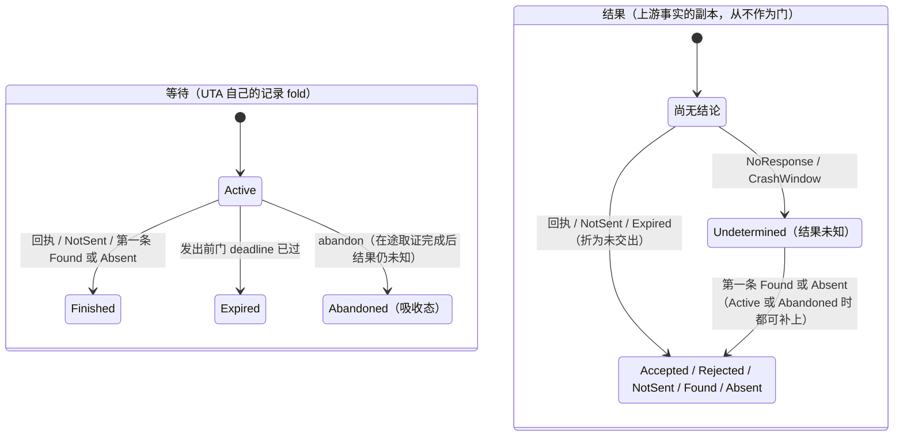
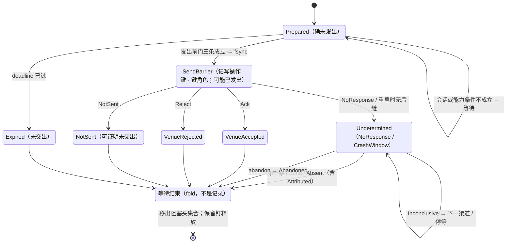
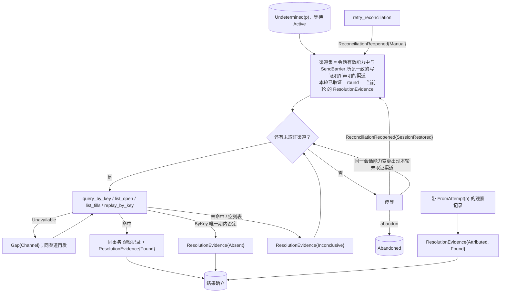
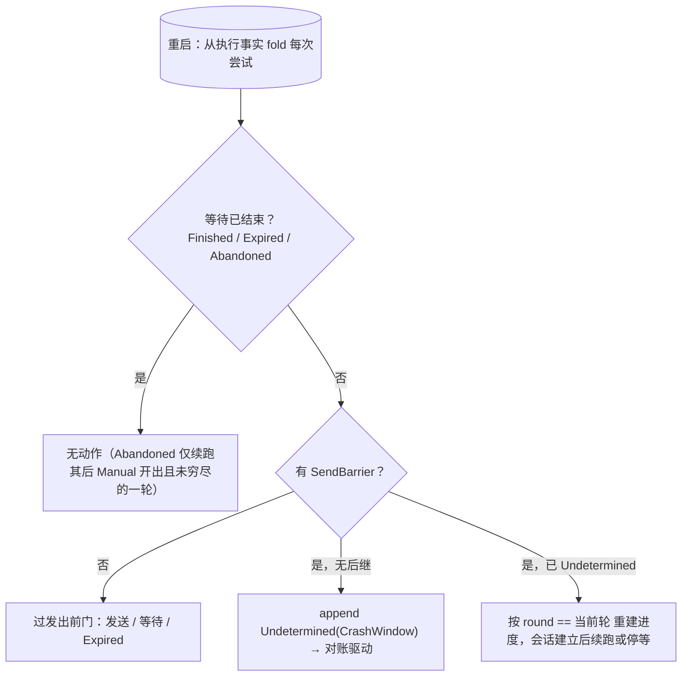

# IO 壳（含对账、放弃跟踪、恢复）

- **层级与元素**：L3 component，核心进程内的 IO 壳。
- **上级文档**：[core-process/design.md §4.1 组件指南](design.md#41-组件指南)。
- **决定什么**：`Prepared` 之后、决议之前发生的一切：两阶段协议、尝试与 `AttemptRef`、发送屏障与发出前门、写调用的封闭结果与记录模型、调用方键的铸造、等待与结果两根轴、对账驱动（渠道、轮次、停等）、放弃跟踪、崩溃恢复与集成崩溃的两个故障面。本文也是核心→集成写操作（`submit`、`cancel`）与取证操作（`query_by_key`、`list_open`、`list_fills`、`replay_by_key`）、以及核心↔解释层结果未知组（`abandon`、`retry_reconciliation`）的规格所在。
- **读者**：核心实现者；集成作者（写与取证操作的参数、返回与核心侧后果）；解释层实现者（结果未知组）。
- **状态**：已定。
- **非目标**：意图形成、放行与 lane（[ticket.md §4.2 状态机与穷尽转移](ticket.md#42-状态机与穷尽转移)、[decision-chain.md §4.2 顺序固定链：授权 → 输入约束 → 审批 → lane → 过期](decision-chain.md#42-顺序固定链授权--输入约束--审批--lane--过期)、[lane.md §3.3 阻塞头集合](lane.md#33-阻塞头集合)）；会话状态机、调用通道与会话结束时在途调用的强制完成（[integration-session.md §4.6 会话状态机](integration-session.md#46-会话状态机)）；集成在写与取证里的义务（证明未交出、键作用域与唯一期、按 `barrier_at` 判断窗口，[integration-session.md §4.4 集成义务清单](integration-session.md#44-集成义务清单)）；效应侧归因处理器的触发与索引（[core-process/design.md §4.4 效应侧归因处理器](design.md#44-效应侧归因处理器)）；订单状态与成交的计数与“最近观察”（[read-model.md §3.2 成交的计数身份](read-model.md#32-成交的计数身份-设计)）。

证据标签与编号前缀的约定见 [README.md §0.4 阅读约定](../../README.md#04-阅读约定)。

## 1 问题域

### 1.1 上级分配给本组件的需求

| 来源（[README.md §2 问题域](../../README.md#2-问题域)） | 内容 |
|---|---|
| F1、F5 | 权威在 venue；venue 单方面决定，UTA 可能不知道写发生没有。 |
| F6、F9、F10 | 能力部分；只凭字节相同不能归因；listing 滞后、空答不证明不存在。 |
| H1、H6 | 宁漏不重；意图有时效。 |
| C1、C2、C12、C13 | unknown 不自动产生新尝试；收敛不承诺时限但必须可推进；永不 heuristic；原始负载完整保留。 |
| Q2、Q3、Q4、Q6、Q7、Q17、Q27 | 发送后崩溃不重复投放；三渠道收敛；未发即到期；外部变更不被误归因；队首阻塞；重启零丢失；撤单结果不被当作原单结束。 |

核心进程分配给本组件的接口：核心中唯一向集成发出写调用、把集成的返回值变成记录的元素（[core-process/design.md §4.1 组件指南](design.md#41-组件指南)）；执行事实唯一写入口中 `SendBarrier`、`VenueAccepted`、`VenueRejected`、`NotSent`、`Undetermined`、取证 `ResolutionEvidence`、`ReconciliationReopened{SessionRestored}`、`Expired`、`Abandoned`、`CapabilityObserved`、取证 `Gap{Channel}` 的写者（[core-process/design.md §4.3.4 执行事实的唯一写入口](design.md#434-执行事实的唯一写入口)）；`Prepared` 双认中“我该做的”一方（[core-process/design.md §4.3.3 Prepared 双认](design.md#433-prepared-双认)）。

### 1.2 本组件直接面对的域性质

- **venue 是总是单方面决定的参与者**：不 prepare、不等协调者裁决，收到请求即自行 commit 或 reject，协调者事后只能发现结果。[证据：fp-06 命题 5 与案例——Stripe/Binance/Temporal 均无 participant prepare]
- **写调用的结果可以是未知**：集成超时、集成崩溃、传输只 ACK、HTTP 5xx、会话在返回前结束，都可能发生在已交出之后（F5）。
- **上游的键有作用域、唯一期与保留期**，它们是上游的性质，核心不持有其副本；只有集成按上游的保证判断（F6，[README.md §2.4 调查结论摘录](../../README.md#24-调查结论摘录)）。
- **fsync 之后的记录在崩溃后仍在**，之前的不在（[storage.md §3 接口](storage.md#3-接口)）。
- **集成会话会来去**：会话的建立、结束与会话有效声明由集成会话给出（[integration-session.md §3.6 声明的两种解释](integration-session.md#36-声明的两种解释-设计)）。

## 2 驱动

Q2、Q3、Q4、Q6、Q7、Q17、Q27（[README.md §3.1 质量场景](../../README.md#31-质量场景)）。本组件的响应度量写在 §6.3 各验收项；崩溃窗口的可测项是 [core-process/design.md §6.3 验收 #8](design.md#63-验收标准)。

## 3 模型

### 3.1 两阶段协议与它的位置

unknown 并非孤立的类型问题，其实质是一个**对账系统**。写边界协议即为**两阶段事务**：

| 两阶段 | UTA |
|---|---|
| prepare | `Prepared` 持久化 |
| commit | 发出并取得业务回执 |
| in-doubt | `Undetermined` |
| resolution | 对账 |

in-doubt 作为一等持久状态有直接先例：MongoDB `UnknownTransactionCommitResult` error label、Oracle `in-doubt` + `DBA_2PC_PENDING`、PostgreSQL/MySQL `PREPARED`、Kafka `PREPARE_COMMIT`、Seata `PhaseOne_Timeout`。它不是 `Option`、字符串或普通 pending 状态。[证据：fp-06 命题 1、修正 1]

**“两阶段只在写边界”窄义成立、广义不成立。**

- **窄义成立**：prepare 记录的归属、持久化及协议驱动只在写边界（IO 壳），9 个先例案例完全一致。
- **广义不成立**：in-doubt **状态**无一例外泄漏到四个面：串行化阻塞（PostgreSQL 持锁、Oracle `ORA-01591`、Kafka LSO）；对账发起端（Oracle RECO、外部 TM、客户端 worker）；审计读模型（`DBA_2PC_PENDING`、`pg_prepared_xacts`、`serverStatus`）；上游超时语义（`ORA-02050`、MongoDB label 直达 driver、Binance `-1007`）。

因此：**协议逻辑只在 IO 壳**。`Prepared`/`SendBarrier`/`Undetermined` 作为记录，对 lane 队列、读模型、对账发起及审批人视图合法可见，且各方均须按“可能已发生”解释。这些面只是把状态读出去的通道，不把 prepare 逻辑复制至读 / 编排 / 对账层。[证据：fp-06 修正 6]

**不锁 ≠ 不要两阶段。** 两阶段协议的价值不在锁，而在**已经定义了中间态的副作用语义**：prepare 之后、resolution 之前，效果被定义为“可能已发生”：既非成功亦非未发生，不能重发，也不能当作没做过，只能由 resolution 用证据收敛。这正是 F5 所需的定义。故 `Prepared → SendBarrier → (VenueAccepted | VenueRejected | NotSent | Undetermined) → ResolutionEvidence*` 保持为两阶段协议，而非退化为“发一次、超时算失败”的单阶段调用。[证据：fp-06 命题 1]

**在 2PC 中的位置。** UTA 是协调者；venue 是总是单方面决定的参与者（§1.2）。

- 把这一情形类比为 2PC 中“参与者单方面完成、协调者进入 in-doubt 并以查询 / 日志决议”的分支（XA heuristic outcome），是**设计类比** [设计]。
- venue 从未参加 prepare，也没有 commit/rollback 可下达；UTA 这一侧缺少 XA 的 participant 契约，只借用它对中间态与决议出口（found / absent / inconclusive）的定义。
- 名字保持“两阶段”，因为中间态语义与决议流程都来自它；只是 UTA 永远处在参与者已单方面决定的那一支。

**先例谱系。** 能全自动收敛的系统，同时拥有权威结果源与防重身份（Oracle RECO、Kafka coordinator log、Seata TC state）。权威源在系统外的系统（PostgreSQL/MySQL 外部 TM、Stripe、Binance、Temporal），自动化止于“重建状态 / 触发查询 / 一次安全重放”，决议交外部。UTA 因 F1 权威恒在外，属于后者。

为什么：F1 使权威恒在 venue，UTA 面对 venue 时可能不知道动作是否完成（F5）。所以必须有 in-doubt 一等状态与对账收敛，而非把 timeout 当终态；这与 9 个一手先例一致。[证据：fp-06 命题 1–命题 6；域 F1/F5/C1/C2/C12]

不选：

- **单阶段“发一次、超时即算失败”**：无 unknown 收敛路径，违反 C1 与 C13；无一先例把 timeout 当终态，会造成重复投放或漏单。
- **宣称“unknown 的可组合代数”**：9 个一手案例未见“多个 unknown 组合成新 unknown”的运算，不写成行业无先例。[证据：fp-06 修正 2/4/5]

### 3.2 IO 壳是效应侧的解释器

IO 壳不是“调用 venue 的那个函数”，而是效应侧的解释器：`Prepared` 之后、决议之前发生的一切都在它里面。它与 Haskell 的 `IO` 同构，先定义，再运行：

| Haskell | UTA |
|---|---|
| `IO a` 值（纯，可构造、可组合、可检查） | `Prepared` 记录：已持久化的“将对 venue 做什么”的描述；构造过程（草稿 → 决策 → append）不接触 venue |
| `>>=` 组合：后一步依赖前一步的结果 | lane 全序：同 lane 后一次尝试的语义依赖前一次的结果，故 lane 步在前一次仍在等待时不放行下一次 |
| runtime 运行 `main` | IO 壳解释 `Prepared`：核心中唯一发出写调用的环节；调用在上游的落实由集成完成 |
| 效果发生后只剩结果值与外部状态变更 | 效果发生后只剩 append 的记录（`VenueAccepted`/`VenueRejected`/`NotSent`/`Undetermined`/`ResolutionEvidence`；未发出即到期则 `Expired`）与 venue 侧变更 |
| `unsafePerformIO` 是禁忌 | 规则、程序、消费方直接调用 venue 写接口，或集成在 IO 壳的调用之外自行发起写，是禁忌 |
| 纯代码可随意重算，`IO` 不能 | 派生侧与决策可以重放重算，`Prepared` 的实际执行不能重放 |

二者唯一差异正是 F5：Haskell runtime 总能知道 `IO` 动作做完没有；UTA runtime 面对 venue 时可能不知道。因此 UTA 的“运行”多出 `Undetermined` 结果与配套对账，其余纪律与 `IO` 相同。**“先定义再运行”是 IO 壳的全部设计原则**：任何“运行”的东西先是一条记录；任何记录都不是运行。

**位置。** 单据与 STS 决策位于上游，产出 `Prepared` 记录；读模型与消费方位于下游，只读记录。IO 壳是核心中**唯一**向集成发出写调用、把集成的返回值变成记录的地方；核心内不存在第二处接触集成进程写接口的路径。IO 壳不知道单据的存在；单据锁在它之外（属于意图形成期），所以“UTA 唯一的锁”与“IO 壳内没有锁”两句同时成立。

不选：**把 IO 壳做薄（“就是个 HTTP 调用”）**：两阶段、unknown 与队列语义会散落至规则与集成里。

### 3.3 尝试与 `AttemptRef`

**尝试（Attempt）** = 一条 `Prepared` 记录及其后继记录 = **对上游的一次写** [设计]。身份 `AttemptRef = attempt_position`（该 `Prepared` 的 `LogPosition`）。一种操作种类只对应一次上游写（[ticket.md §4.5 交易协议：操作种类、目标、可执行性、检查目录](ticket.md#45-交易协议操作种类目标可执行性检查目录-交易协议)），所以一次尝试没有更细的内部结构。

所有尝试的记录（`SendBarrier`、`VenueAccepted`、`VenueRejected`、`NotSent`、`Undetermined`、`Expired`、`ResolutionEvidence`、`ReconciliationReopened`、`Abandoned`）与观察侧的 `FromAttempt`/`provenance` 都以 `AttemptRef` 关联。

尝试是线性阶段链：

```
[发出前门] → (SendBarrier → (VenueAccepted | VenueRejected | NotSent | Undetermined → ResolutionEvidence* [→ Abandoned])) | Expired(deadline)
```

- IO 壳是尝试的驱动器。每一步转移由 `集成的回应类型 × 该集成的会话状态 × 该 (WriteLaneKey, OperationKind) 的会话有效能力与 SendBarrier 所记的写操作和键角色 × deadline` 决定。
- 链是闭合 sum，转移表穷尽（§4.4），没有“其他”分支。

**发出所依据的声明落进记录** [设计]。`SendBarrier` 记下这次尝试所用的写操作（`submit` / `cancel`）、所带的调用方键及其角色（订单键 / 请求键，[integration-session.md §3.3 投影 Projection](integration-session.md#33-投影-projection)），都取自它过发出前门时的会话有效声明。此后取证渠道与撤阻塞头的资格都按记录判定，不按之后变化的声明：键角色决定撤阻塞头的资格（[lane.md §4.2 无第二类越顶队列；撤阻塞头的撤单](lane.md#42-无第二类越顶队列撤阻塞头的撤单)），不能被后来的声明改写。

### 3.4 调用方键的铸造 [设计]

发出前门选定的写证明键角色不是 `None` 时，IO 壳以固定的单射编码从 `AttemptRef` 生成调用方键 `K(AttemptRef)`，记进 `SendBarrier`。

- 编码随 IDL 发布，是 `attempt_position` 的定长文本编码：不取哈希、不截断，所以不同尝试的键不同。
- 集成只在上游在该作用域逐字接受这一编码的每个值（字符集、长度）时声明订单键或请求键，否则声明 `None`（[integration-session.md §4.4 集成义务清单](integration-session.md#44-集成义务清单)）。键装不进上游约束时不压缩、不改写，而是没有键。
- 键登记是 `SendBarrier` 所记键到 `AttemptRef` 的唯一索引（由效应侧归因处理器持有，[core-process/design.md §4.4 效应侧归因处理器](design.md#44-效应侧归因处理器)）。编码单射只保证 UTA 自己的尝试互不冲突，**不证明**上游一条带同样字节的记录属于这次尝试：同一作用域里别的写者可以发同样的字节，上游也可以在它自己的周期后复用键。核心因此从不凭键字节归因，也从不断定一条记录是 `External`；按键归因由集成在它声明的键作用域与唯一期内填 `FromAttempt`，其外是 `Unattributed`。同一作用域没有别的写者使用这一编码，是运维义务，UTA 观察不到它被违反（证伪 #25）。
- 意图不带键：`EffectRequest` 没有键字段（[outbound-requests.md §3.1 EffectRequest：唯一出口，请求是值](outbound-requests.md#31-effectrequest唯一出口请求是值)），键只在发出时由核心产生。

不选：**意图或程序自带键**：键的唯一性依赖不可信的调用方；**哈希或截断以适配上游**：不同尝试可能撞键，无定义；**核心按键字节匹配归因**：字节相同不证明属于（F9）。

### 3.5 等待与结果：两根轴 [设计]

一次尝试有两个不同源头的问题，分开记、分开 fold：

| 轴 | 问题 | 源头 | 值 |
|---|---|---|---|
| **等待**（continuation） | UTA 还要不要为这次尝试等下去、问下去 | UTA 自己的记录 | `Active` \| `Finished` \| `Expired` \| `Abandoned` |
| **结果**（outcome） | 这次写在上游发生没有 | 上游（经集成的回执、取证与推送取回的副本）；`NotSent` 与 `Expired` 是 UTA 自己确知的“未交出” | `Accepted` \| `Rejected` \| `NotSent`（确知未交出：`NotSent` 记录，或 `Expired` 折为同一个值，不另写 `NotSent` 记录）\| `Unknown` → `Found` \| `Absent` |

**等待** 是执行事实的 fold，不另存：

- `Active`：`Prepared` 无 `SendBarrier` 且无 `Expired`；或 `SendBarrier` 无后继；或 `Undetermined` 之后既无 `Found`/`Absent` 的 `ResolutionEvidence`，也无 `Abandoned`。
- `Finished`：结果已确立，即 `VenueAccepted`、`VenueRejected`、`NotSent`，或 `Undetermined` 之后第一条 `Found`/`Absent`（任一渠道、任一轮次，含 `Attributed`）。
- `Expired`：发出前门判定 `deadline` 已过，尚未交出即终止。它的结果就是“未交出”，由 UTA 确知：结果轴上折为 `NotSent` 这个值，不是写调用的结果，也不另写 `NotSent` 记录。
- `Abandoned`：principal 在结果仍未知时放弃跟踪（§4.8）。

`Expired` 与 `Abandoned` 是 UTA 拥有的两种出口；`Abandoned` 是唯一一种在可能已交出之后由 UTA 结束等待的出口。**`Abandoned` 是吸收态**：此后到达的 `Found`/`Absent` 只补上结果，不改变等待，不重新阻塞 lane，也不恢复保留钉。

**结果** 是上游事实的副本，从不作为门：

- `Undetermined` 的尝试，在等待是 `Active` 或 `Abandoned` 时都可以由第一条 `Found`/`Absent` 补上结果；此后的 `ResolutionEvidence` 照常 append 作审计，结果不再改变。
- `Found` 只回答“这次写到达了上游”；观察记录里 venue 已受理 / 已拒 / 已成交的状态，由读模型与钩子 fold。
- 放弃之后结果仍未知，对外显示“已放弃跟踪，结果未知”，不显示为已发生或未发生（[read-model.md §4.2 读模型集合](read-model.md#42-读模型集合)）。

等待离开 `Active` 的那一刻，这次尝试移出 lane 阻塞头集合（[lane.md §3.3 阻塞头集合](lane.md#33-阻塞头集合)），它对观察记录的保留钉随之释放（[core-process/design.md §4.3.7 保留引用的登记与解除](design.md#437-保留引用的登记与解除)）。



### 3.6 不变量

- IO 壳是核心中唯一向集成发出写调用的地方，不修改记录、不持权威。由关系表（[core-process/design.md §3.4 两个类型宇宙与唯一边](design.md#34-两个类型宇宙与唯一边)）与 `fold_state` 重建保证。
- `Prepared` 无 `SendBarrier` = 确未发出；`SendBarrier` 无后继 = 可能已发出；IO 壳不对已有 `SendBarrier` 的尝试再调用写操作。由发送屏障 durable append（fsync）保证。
- 每次尝试发出前过发出前门：`deadline` 已过即 `Expired(deadline)`、永不发出；集成无已建立会话或会话有效能力不可执行时只等待，不 append `SendBarrier`。由发出前门保证。
- 取证渠道与撤阻塞头资格只按 `SendBarrier` 所记的写操作与键角色判定，不随之后的声明变化。由声明落进记录保证。
- 调用方键是 `AttemptRef` 的单射编码，由核心铸造；核心从不凭键字节归因，也从不断定 `External`。由键铸造与归因分工保证。
- 每次尝试的等待**至多**结束一次，且在证据充分（回执、`NotSent`、`Found`/`Absent`、`deadline`）或 principal 放弃时必结束；`Abandoned` 之后等待不再改变。由闭合 sum 与转移表保证。
- 结果只由上游证据（回执、`Found`/`Absent`）或集成确知的未交出（`NotSent`）与发出前门的到期（`Expired`）给出，至多确立一次；放弃不给出结果。由两根轴的分工保证。
- `Undetermined` 的收敛不承诺时限（C2），只承诺停等可被推进：新证据（任一时刻到达的 `Attributed`、`ReconciliationReopened` 重开后的取证、同一会话里的能力变更使本轮尚未取证的渠道进入渠道集之后的取证），或 principal 的 `abandon`。
- `VenueAccepted` 只认业务回执；`NotSent` 只认集成可证明的未交出；其余落 `Undetermined`。由写操作的返回契约保证。
- 取证（读副作用）可重试，写调用（写副作用）永不重试（[core-process/design.md §3.7 读副作用与写副作用](design.md#37-读副作用与写副作用)）。
- `Inconclusive` 停等，IO 壳永不 heuristic；放弃跟踪从不给出结果；按键的取证在上游保留期或唯一期之外返回 `Unavailable`，空列表不是 `Absent`。

## 4 结构

### 4.1 接口总览

| 方向 | 对方 | 交换 |
|---|---|---|
| 接手 | 单据 / STS | `Prepared` 记录（唯一交出点） |
| 使用 | 集成会话（调用通道） | `submit`、`cancel`、`query_by_key`、`list_open`、`list_fills`、`replay_by_key`（§4.6）；只在该集成会话已建立时调用 |
| 读 | 集成会话 | 会话状态、会话有效声明（发出前门、渠道集） |
| 写 | 存储 | §1.1 所列执行事实与回执 / 取证的观察记录（同事务，§4.3） |
| 被用 | lane 驱动 / STS | 尝试记录（阻塞头集合、冷却时钟的输入） |
| 被用 | 效应侧归因处理器 | `Undetermined` 事务内的回查；`Attributed` 证据的 append 规则（§4.7） |
| 被用 | 控制面 / 会话入口 | 结果未知组 `abandon`、`retry_reconciliation`（§4.8） |

核心对集成的操作集是核心↔集成契约，粒度与契约三部分见 [integration-session.md §3.2 契约的三部分](integration-session.md#32-契约的三部分-设计)。IO 壳只用其中的写操作与取证操作。每个写调用由集成在它自己的时限内给出封闭结果；可能已交出之后超出时限，结果就是 `NoResponse`。核心不另设写调用的超时。`NotSent`、`NoResponse` 与 `Unavailable` 是一等返回值而非异常。调用结果的健康计数由集成会话给出内容、由 IO 壳在自己的结果事务里提交（[core-process/design.md §4.3.6 调用结果与计数的提交协议](design.md#436-调用结果与计数的提交协议)）；`NotSent` 按失败计：它说明集成没能完成这次写，不说明上游回答了。

`backfill`、`route` 由订阅侧发起；`read` 由读处理器、钩子取证与消费方发起，都不经 IO 壳。

### 4.2 发送屏障与发出前门

**`SendBarrier` 是发送屏障。** durable append（fsync）之后才允许调用写操作（`submit` / `cancel`）。它把崩溃窗口二分：`Prepared` 无 `SendBarrier` = **确未发出**；`SendBarrier` 无后继 = **可能已发出**。先例：PostgreSQL `EndPrepare` 先 `XLogFlush` 再 `MarkAsPrepared`。[证据：fp-06 修正 5]

静态保证用 move-semantics token：`SendBarrier` 无 `Copy`、构造器私有且内含 durable append，写调用只接受 `SendBarrier` 值。静态保证只覆盖首执一次的调用栈，恢复路径全部是运行期 enum（§4.9）。不选：**用泛型 typestate 保证发送屏障**：在崩溃恢复路径失效，从记录重建不能产回不同类型。

**发出前门** [设计]。IO 壳在 append `SendBarrier` 的那一刻对该尝试求值三个条件，全部成立才 durable append `SendBarrier`，并在同一会话上调用写操作：

1. 意图的 `deadline` 未过：核心 UTC 时钟早于 `deadline`，记录的事件时间与收到时间不参与；
2. 该 `WriteLaneKey` 所属集成的会话已建立（会话有效声明为 `Established`），写调用将在这个会话上发出；
3. 意图对该 `(WriteLaneKey, OperationKind)` 的会话有效能力**可执行**（`Supported`、声明接受意图所带的参数 schema、`target` 的种类在接受之列，[ticket.md §4.5 交易协议：操作种类、目标、可执行性、检查目录](ticket.md#45-交易协议操作种类目标可执行性检查目录-交易协议)）。

结果只有三种：

- **发送**：三条都成立。
- **过期**：`deadline` 已过 → `Expired(deadline)`，等待结束。
- **等待**：其余条件不成立。尝试保持 `Prepared` 无 `SendBarrier`，不 append 任何记录；它仍是确未发出，仍在 lane 阻塞头集合里。会话建立、能力证据变化、`deadline` 到时重新求值。等待永不变成 `Undetermined`；`deadline` 只终止尚无 `SendBarrier` 的尝试。

`SendBarrier` fsync 之后会话才断开时，写调用的结果取决于集成能否证明未交出：能证明得 `NotSent`，否则得 `NoResponse` → `Undetermined`；已有 `SendBarrier` 的尝试永不退回等待。

理由：

- **会话条件**：没有会话时写调用只能失败于传输，一笔核心明知未发出的写就成了结果未知，阻塞 lane 直到取证收敛；在没有按键回读渠道的 venue 上只能等被动证据或由 principal 放弃（[README.md §2.4 调查结论摘录](../../README.md#24-调查结论摘录)）。会话状态是核心自己运行的状态机，不是健康观察，所以本门不读读模型。
- **能力条件**：放行后单据已 `Closed`，此后再没有别处按当前能力复查这次尝试。重握手或 `CapabilityObserved` 收紧、移除该操作或它接受的参数 schema 时，不能凭放行时的旧能力发出。
- **等待而不终止**：短暂断线或能力暂失不否决已放行的意图。放行时的批准在 `deadline` 内保持有效，这是有意的：时效由 `deadline` 界定（H6）。

不选：

- **在发出前门把无会话集成的能力当作 `Unsupported`**：离线时的声明副本只是最近声明，不是此刻的能力；一次瞬断就会让已放行的意图被当作不可执行。
- **被拒或需干预的集成由核心追加一版全 `Unknown` 能力证据**：那是核心替集成伪造声明；能力证据只记握手声明与能力观察。发送已由本门挡住，集成此刻的状态由健康面给出（[read-model.md §3.5 健康面](read-model.md#35-健康面-设计)）。
- **以健康观察作必要检查项的输入**：集成死了就不再推送健康，最新的健康观察恰在它失效时过时；规则也不引用读模型。
- **`Degraded` 阻断发送**：`Degraded` 是按流的 readiness 子态，属观察侧；其中与写有关的能力收紧已经经 `CapabilityObserved` 进入能力证据与本门。

### 4.3 输出与记录模型 [设计]

执行事实侧只有 append：

- `SendBarrier`、`VenueAccepted`、`VenueRejected(reason)`、`NotSent(reason)`、`Undetermined(reason)`、`Expired(deadline)`；
- `ResolutionEvidence`、`ReconciliationReopened`、`Abandoned{principal, note, rule_version}`；
- `CapabilityObserved`；
- `Gap{origin: Channel}`。

关联身份：尝试的记录与取证渠道的 `Gap{origin: Channel}` 都带 `AttemptRef`。`CapabilityObserved` 是能力证据，带 `(WriteLaneKey, OperationKind)` 或逻辑流 `(source, stream)` 的读 / 回填能力，以及它所更新的声明版本（被接受的推送或回应所在的会话 epoch，由核心盖印），不属于任何尝试。IO 壳只是 `CapabilityObserved` 的 appender：它把经当前会话读入的能力变更登记成带该会话 `SessionEpoch` 的契约值，不把尝试、lane 或决策状态写进去（声明的两种解释见 [integration-session.md §3.6 声明的两种解释](integration-session.md#36-声明的两种解释-设计)）。

`Undetermined` 的 `reason` 封闭为两种，二者进入同一对账驱动，只是审计出处不同：`NoResponse`（写调用在可能已交出之后没有业务回执）；`CrashWindow`（重启时 `SendBarrier` 无后继）。

IO 壳**不修改**任何记录，不持有权威状态；重启后其全部状态由 `fold_state` 重建。

**回执与取证的记录模型。** venue 对我方写的响应是执行事实：C13 原始负载完整保留，执行事实永不删除。同一响应里的订单 / 成交状态又是观察（[core-process/design.md §3.7 读副作用与写副作用](design.md#37-读副作用与写副作用)）。响应经集成消费后到达核心，由两部分组成（[envelope.md §2.2 三部分](envelope.md#22-三部分-设计)）：集成的结论（契约载荷 + `payload_schema`）与所消费的上游原文（原始负载）。执行事实侧永存的证据值 `Evidence = {payload, payload_schema, raw}` 同时保存两者：前者是 UTA 据以行动的结论，后者是结论的出处。集成为一次操作调用了多个上游接口时，`raw` 是全部上游响应的原文，按调用顺序。

因此一次 venue 交互在**同一 SQLite 事务**内落两侧记录：

- **执行事实侧**一条，**持有 `Evidence`**（永存）。
- **观察 `Journal`** 上该回应的观察记录，可压缩：订单状态一条（回应含订单状态时），加回应所含每笔可识别执行各一条成交记录。各条的 `attribution` 只按该条自己的关联证据填写，不因同在一个回应里继承；`provenance` 相同，由 IO 壳填。它们供单据钩子与读模型消费、供订阅者与推送观察同形地看到。
- **归因由谁填**：IO 壳在回执与取证的观察记录上，只对由该条自己的关联证据确定属于这次尝试的记录填 `FromAttempt(AttemptRef)`；同一回应里的其余记录保留集成给出的归因，不因同在一个回应、指向同一目标订单或共享 `provenance` 而继承。核心不补归因：集成填不出的就是 `Unattributed`。
- **`dispatch_end` 按落点的流记**：IO 壳在发出写调用或取证调用时，为这次调用可能写入的每条流（该作用域的订单状态流与成交流）各记下那一刻已提交的流末位置。append 回应的观察记录时，每条带它所在那条流的这个位置作 `dispatch_end`；同一回应的各条 `provenance` 相同，`dispatch_end` 各是自己那条流的（[read-model.md §3.3 订单身份、来源顺序与最近观察](read-model.md#33-订单身份来源顺序与最近观察-设计)）。理由：`dispatch_end` 所在的流 epoch 是这条记录的发出 epoch，流末位置与流 epoch 都只对一条流有意义；拿订单状态流的位置去标成交记录，成交流上的来源顺序与发出 epoch 就都没有依据。

| 交互 | 执行事实侧（永存） | 观察侧（可压缩） | 同事务 |
|---|---|---|---|
| 写调用返回 `Ack` | `VenueAccepted{venue_order_id, receipt: Evidence, observation}`；`observation` 指订单状态记录 | `provenance: Receipt{attempt}` 的观察记录，各带所在流的 `dispatch_end` | 是 |
| 写调用返回 `Reject` | `VenueRejected`，`reason` 保留 `Unmapped(raw)`（[core-process/design.md §3.8 基础值类型](design.md#38-基础值类型)） | 无（venue 侧不存在订单） | — |
| 写调用返回 `NotSent` | `NotSent{reason, evidence: Evidence}`；`raw` 是集成据以判定未交出的本地原文，可为空 | 无（没有交给上游） | — |
| 写调用返回 `NoResponse` | `Undetermined(NoResponse)` | 无 | — |
| 取证命中 | `ResolutionEvidence{attempt, channel, round, outcome: Found{observation: LogPosition, evidence: Evidence}}`；`observation` 指命中的那条记录（`list_fills` 命中多笔归因到该尝试的成交时，它们同在该作用域成交流上，取其中 `Seq` 最小者） | `provenance: Reconciliation{attempt, channel}` 的观察记录，各带所在流的 `dispatch_end`；`list_fills` 命中不造订单状态记录 | 是 |
| 取证 `Absent` / `Inconclusive` | `ResolutionEvidence` | 无 | — |
| `Unavailable` | 只落 `Gap{origin: Channel}`，不是取证结果 | 无 | — |
| 归因命中（`Attributed`，§4.7） | `ResolutionEvidence{attempt, Attributed, round, Found{observation: 该记录, evidence: 该记录的载荷与原始负载}}` | 该记录本身 | 是（与带来它的推送、回执或响应同一事务） |
| 放弃跟踪 | `Abandoned{attempt, principal, note, rule_version}` | 无 | — |

撤单尝试的回执里目标订单的状态是目标订单的记录：它的 `attribution` 按它自己的关联证据填写，不因出现在撤单回执里而成为 `FromAttempt(撤单尝试)`（§4.5）。

- `channel ∈ {ByKey, Listing, Fills, Replay, Attributed}`：前四种是 IO 壳依序取证的渠道；`Attributed` 是带 `attribution: FromAttempt(r)`、r 处于 `Undetermined` 且结果未知的观察记录，不论它从哪里来（推送、回执、取证响应或一次性读的结果项）。
- `outcome ∈ {Found{observation, evidence}, Absent, Inconclusive}`。**每条 `Found` 都带 `evidence`**，C13 对五种渠道一视同仁：主动取证取集成返回的该次响应；`Attributed` 取那条带 `FromAttempt(r)` 的观察记录的载荷与原始负载（可带 `attribution` 的流必须保留原文，[envelope.md §3.1 锚点表 × 链路](envelope.md#31-锚点表--链路)）。
- `round` 是该次取证**发起时**所属的轮次：最近一条 `ReconciliationReopened` 的位置，首轮为空。`Attributed` 取 append 时的当前轮。
- 观察侧那些记录落到保留边界下后，执行侧的 `Evidence` 仍在。审计读执行事实，不依赖可压缩的观察记录。
- 尝试只回答“我的写到达了吗”；订单是什么状态、成交了多少，在观察记录里给观察宇宙的消费者看，在执行记录的 `Evidence` 里给审计看。

### 4.4 转移表（穷尽）

以下按尝试状态 × 事件列出全部转移；未列出的组合在 fold 中不可达（sum 穷尽，无“其他”分支）。

| 尝试状态 | 事件 | 结果 |
|---|---|---|
| `Prepared` | 过发出前门 | durable append `SendBarrier`，随后按所记写操作调用 `submit` 或 `cancel`（二者返回同一回执形态） |
| `Prepared` | 发出前门：`deadline` 已过 | `Expired(deadline)`（等待结束，未交出） |
| `Prepared` | 发出前门：会话或能力条件不成立 | 保持 `Prepared`，不 append 记录；条件变化或 `deadline` 到时重新求值 |
| `SendBarrier` | 写调用返回 `Ack` | `VenueAccepted`（等待结束） |
| `SendBarrier` | 写调用返回 `Reject` | `VenueRejected`（等待结束） |
| `SendBarrier` | 写调用返回 `NotSent` | `NotSent`（等待结束，未交出） |
| `SendBarrier` | 写调用返回 `NoResponse` | `Undetermined` |
| `Undetermined`，等待 `Active` | `ResolutionEvidence{Found}` / `{Absent}` | 结果确立，等待结束 |
| `Undetermined`，等待 `Active` | `ResolutionEvidence{Inconclusive}` | 当前轮的下一渠道（只推进当前轮的进度：旧轮在途读迟到的结果不计入本轮）；渠道穷尽 → 停等 |
| `Undetermined`，等待 `Active` | `Attributed`（任一时刻到达） | 与 `Found` 同效 |
| `Undetermined`，等待 `Active` | `abandon` 在在途取证完成后结果仍未知 | `Abandoned`（等待结束，结果仍未知） |
| `Undetermined`，等待 `Abandoned`，结果仍未知 | `Found`/`Absent`（`Attributed`，或 principal 发起的 `retry_reconciliation`） | 补上结果；等待仍是 `Abandoned` |
| `Undetermined`，等待 `Abandoned`，结果仍未知 | `ResolutionEvidence{Inconclusive}`（`retry_reconciliation` 那一轮） | 什么都不变：等待仍是 `Abandoned`，结果仍未知；本轮下一渠道，渠道穷尽即停 |
| `Undetermined`，结果仍未知（等待 `Active`；`Manual` 重开时也可以是等待 `Abandoned`） | `ReconciliationReopened{cause}`（`SessionRestored` 只对渠道穷尽而停等、等待 `Active` 的；`Manual` 对任一结果仍未知的） | 新一轮：已取证渠道集从空开始，按渠道顺序重新取证；等待与结果都不变 |
| `Undetermined`，等待 `Active`，结果仍未知，本轮渠道已穷尽而停等 | 同一会话里的能力变更（`CapabilityObserved`）使渠道集出现本轮尚未取证的渠道 | 本轮继续：该渠道是下一渠道；不开新一轮，不 append `ReconciliationReopened` |
| `Undetermined`，结果已确立（等待 `Finished`，或等待 `Abandoned` 而结果已补上） | 结果确立之后才完成的取证调用的 `ResolutionEvidence`（任一结果） | 只 append 作审计：结果与等待都不变，不推进任何渠道 |



### 4.5 对账驱动

**取证渠道与轮次。**

- 一次尝试的取证渠道集取自当前会话有效能力：会话有效声明的写证明与 `SendBarrier` 所记的写操作、键角色都相同时，是它声明的渠道；否则为空，尝试停等。渠道集按当前能力求，所以某次尝试停等之后，能力变更使集合出现本轮尚未取证的渠道，它就是下一渠道。
- 本轮已取证渠道 = `round` 等于当前轮（最近一条 `ReconciliationReopened` 的位置）的 `ResolutionEvidence`。因此“渠道穷尽”与“下一渠道”都由 fold 重建（崩溃 #7）。
- IO 壳自动取证只为等待是 `Active` 的 `Undetermined`；等待是 `Abandoned` 的尝试只在 principal 的 `retry_reconciliation` 开出的那一轮里取证，渠道穷尽即停。

**渠道顺序。** 进入 `Undetermined` 后，只要等待是 `Active`，IO 壳按该尝试的取证渠道集**自动**依次取证：

```
by-key → listing + venue 身份 → fills/positions → replay-by-key
```

`by-key` 与 `replay-by-key` 都以该尝试 `SendBarrier` 所记的调用方键发问，不以意图的 `target`；该尝试未带键时，这两条渠道不会出现在它的声明里。两者都带 `barrier_at`（该 `SendBarrier` 的核心时刻）、作用域与键角色：这个键此刻是否仍在上游的保留期与唯一期内，由集成按 `barrier_at` 判断，窗口之外返回 `Unavailable`，不返回 `Absent`。核心不持有上游的保留期或唯一期，也不自己比较。

**`replay_by_key`。** 形式上似写，但保留期内同幂等键重放在语义上是查询：Stripe 同 key 拿回原响应。保留期判断错误即重复下单（Longbridge 10 分钟缓存、IBKR 无键）。因此它**默认关闭，按 venue 显式开启**，渠道顺序里排最后。IO 壳每次调用都带 `barrier_at`；这个键是否仍在上游保留期内由集成判断，保留期之外返回 `Unavailable`、不重放。上游的保留期是上游的性质，核心不持有它的副本。

**撤单尝试的取证** [设计]。撤单尝试问的是“这次撤单请求到达上游没有”，不是目标订单此刻处于什么状态。它的回执（`Ack` → `VenueAccepted`）是同一次调用的回应，直接给出结果，不经归因；回执里目标订单的状态照常是目标订单的记录。归因到撤单尝试的记录只有一种：上游以该尝试的请求键把某条记录关联到这次撤单请求，集成在它声明的键作用域与唯一期内据此填了 `FromAttempt(撤单尝试)`。目标订单自己的记录（订单状态、成交、listing 里的条目、带目标订单键的记录）归目标订单所属的尝试，或按集成的判定为 `External`/`Unattributed`，不因为它说的是目标就归因到撤单尝试，也就不是撤单尝试的 `Found`。各渠道因此是：

- by-key、replay-by-key：以撤单尝试自己的请求键发问，回答的是这次撤单请求，`Found`/`Absent`/`Inconclusive` 照常；只在该尝试带请求键时声明。
- listing、fills/positions：listing 列的是未结订单，成交对账列的是订单的执行，返回的记录都不是撤单请求，永远不会归因到撤单尝试。撤单写证明不声明这两条渠道（[integration-session.md §3.4 记录映射](integration-session.md#34-记录映射-设计)）。
- `Attributed` 照常。不带键的撤单尝试因此没有自动取证渠道，只由 `Attributed`（集成能以别的上游关联证据把记录归到这次撤单请求时）收敛，或由 principal 放弃跟踪。

撤单尝试有了结果，也**不证明目标已结束**：`VenueAccepted` 或 `Found` 只说明撤单请求到达了上游，目标可能已在此前成交、仍在撤单中，或上游随后拒绝了撤单。目标是否已结束只看目标订单自己的记录（[read-model.md §3.3 订单身份、来源顺序与最近观察](read-model.md#33-订单身份来源顺序与最近观察-设计)）。把撤单与后续下单组合成改单的调用方，按目标的记录决定是否提交第二张单据（[ticket.md §4.5 交易协议：操作种类、目标、可执行性、检查目录](ticket.md#45-交易协议操作种类目标可执行性检查目录-交易协议)）。

理由：listing 上仍有目标，不证明撤单没到（可能滞后，F10）；不再有目标，也不证明撤单到了（目标可能已成交或被别人撤掉）。把目标的记录当作撤单尝试的 `Found`，一笔结果未知的撤单就被当成已送达，这是 heuristic。不选：**撤单写证明可以声明 listing 与成交对账，命中目标即 `Found`**：理由同上；**可以声明，但规定它们永不命中**：一条注定只得 `Inconclusive` 的声明渠道只增加调用与 pacing 负载，而声明应如实；**只禁成交对账、留 listing**：没有记录能在 listing 上归因到撤单请求；**撤单有了结果就自动重开阻塞头的取证**：把撤单的受理当作阻塞头的新证据。

**取证结果与记录的对应（固定矩阵）。**

| 取证结果 | 记录 | 尝试 |
|---|---|---|
| 命中归因到该尝试的订单 / 成交 / 原响应（撤单尝试见上） | 同事务：观察记录 + `ResolutionEvidence{Found}` | 结果确立 |
| 渠道给出明确否定 | `ResolutionEvidence{Absent}` | 结果确立 |
| 未命中 | `ResolutionEvidence{Inconclusive}` | 转下一渠道 |
| `Unavailable` | 只落 `Gap{origin: Channel}` | 不变；同渠道按 pacing 再发 |

- 明确否定只有 by-key 的 `Absent`，且只在集成判断该键仍在上游唯一期内时给出；listing/fills 没有这一语义（F10）。**空列表永远不是 `Absent`**：listing 或 fills 的空答只是 `Inconclusive`。listing 是否需要隔一段时间再确认一次、间隔多长，都由集成按上游的保证判断，保证之外返回 `Unavailable`。
- `Unavailable` **不算取证**、不换渠道。一个不可用的渠道不是证据；跳过它会把“没查到”伪装成“查过了”。
- **集成无已建立会话时不取证** [设计]：IO 壳不对它发任何取证读，也不因此记 `Gap{origin: Channel}`；没有发出的读不是渠道不可用。会话重新建立后，本轮进行中的驱动从本轮进度续跑；已渠道穷尽而停等、等待仍是 `Active` 的尝试按下文 `SessionRestored` 重开一轮。理由：无会话时的“调用”只会是核心自造的失败，把它记成 `Gap{Channel}` 等于伪造渠道证据的出处。

**停等。** 渠道穷尽仍 `Inconclusive`，append 后**停下**。停等可由四种事件推进：

- 一条 `ReconciliationReopened{attempt, cause}` [设计] 重开一轮；
- 被动渠道 `Attributed` 在任一时刻到达（§4.7）；
- 同一会话里的能力变更（`CapabilityObserved`）使渠道集出现本轮尚未取证的渠道 [设计]：只对等待是 `Active` 的尝试；本轮继续，该渠道就是下一渠道，不开新一轮；
- principal 经 `abandon` 放弃跟踪（§4.8）：它结束等待，不给出结果。

IO 壳**永不 heuristic**。取证是读副作用，可以重试；写调用是写副作用，永不重试。

**重开与轮次。**

- 新一轮的已取证渠道集从空开始。
- `ResolutionEvidence.round` 在**发起读**时取当前轮，并随记录落盘。
- 旧轮在途读的迟到响应带旧 `round`，不计入新轮：响应归属其发起轮次，不按到达顺序冒充。
- 结果已确立的尝试不受重开影响：重开只重置读进度，不撤销结果。

| cause | 谁 append | 何时 | 对象 |
|---|---|---|---|
| `SessionRestored` | IO 壳自动 | 该 venue 的集成会话实际建立（新会话）时 | 该集成所有停等、等待仍是 `Active` 的 `Undetermined` |
| `Manual(principal)` | 运维 principal | 经 `retry_reconciliation`（§4.8） | 一次结果仍未知的 `Undetermined`，等待是 `Active` 或 `Abandoned` |

- `SessionRestored` 的理由：渠道穷尽常因 venue 当时不可达。它不作用于 `Abandoned` 的尝试：放弃之后不再有自动的询问。
- `Manual` 重开的一轮对 `Abandoned` 的尝试也依序取证一遍、渠道穷尽即停；它只能补上结果，不改变等待。
- 两种触发在 append 前都重查目标尝试仍处于 `Undetermined` 且结果未知，否则不写。



### 4.6 写与取证操作的规格（核心→集成）

以下操作都经集成会话的调用通道、在当前会话上发出（[integration-session.md §4.6 会话状态机](integration-session.md#46-会话状态机)）；每个调用恰好完成一次，会话在调用返回前结束时由集成会话强制完成（写调用为 `NoResponse`，取证为 `Unavailable`）。集成在这些操作里的义务（何时可以返回 `NotSent`、何时可以给 `Absent`、按 `barrier_at` 判断窗口、按键归因的作用域）写在 [integration-session.md §4.4 集成义务清单](integration-session.md#44-集成义务清单)；这里写参数、返回与核心侧的后果。

#### `submit(attempt) → Ack | Reject | NotSent | NoResponse`

- **语义**：投放一次写（一次尝试，对上游恰一次写）。**动作轴**：**写**。参数 [设计]：
  - 该尝试的 `AttemptRef`；意图的 `WriteLaneKey` 与 `OperationKind`；该尝试 `SendBarrier` 所记的调用方键（键角色不是 `None` 时），即 `K(AttemptRef)`（§3.4）。
  - 意图参数及其所依据的意图参数 schema 身份。参数原样交出，核心不改写其中任何值；数量口径等参数由上游在这一次写里按 schema 的字面含义执行。
  - 按操作种类带 `target`：`Place` 不带；`Close` 带 `PositionRef`，即它所含的持仓身份与 instrument，取值同持仓公共 schema 的这两个字段；`Replace` 带意图的订单目标（`VenueRef` 或 `IdemKey`），集成在上游以一次写完成改单。
  - 理由：`target` 是锚点，不在意图参数里，集成从参数里取不到它，而按持仓身份平仓的上游没有 `PositionRef` 就无从寻址；`AttemptRef` 不说明作用域与操作种类，集成要落到哪个账户、做哪种写，只能由核心交出；参数 schema 身份说明这份参数按哪一版 schema 写成，集成据它解读扩展字段。
  - 不选：**只交意图参数，锚点由集成反查**：集成不持有意图与执行记录；**把整条意图记录交出（含 principal、`basis`）**：它们是核心的授权与依据，集成不读；**不带 schema 身份、由集成按它此刻的声明解读参数**：集成推送的 `CapabilityObserved` 可能在核心过了发出前门之后才到达核心，集成此刻声明的版本已不是发出前门核对的那一版，同一份参数会按另一版被解读；带上身份，集成看得出不一致，这时不发写、返回 `NotSent(SchemaMismatch)`，不返回 `Reject`，也不返回 `NoResponse`：它确知没有交出。
- **返回**：
  - `Ack(venue_id, receipt)`：业务回执，`receipt` 是订单状态的契约载荷及其原始负载；
  - `Reject(reason)`：上游拒绝；
  - `NotSent(reason)`：集成能证明这次写没有交给任何可能把它送出的部件（§4.6.1），`reason ∈ {SchemaMismatch, LocalRefusal(raw)}`；
  - `NoResponse`：可能已交出而没有业务回执。
- **核心内部结果**（记录模型，§4.3）：`Ack` → 同一事务 append `VenueAccepted{venue_order_id, receipt: Evidence, observation}` + 回执观察记录（`provenance: Receipt{AttemptRef}`）；`Reject` → `VenueRejected`；`NotSent` → `NotSent{reason, evidence}`，等待结束，不进对账；`NoResponse` → `Undetermined(NoResponse)`，同一事务回查已到达、归因到该尝试的观察（§4.7）。
- **错误**：集成在它自己的时限内没得到回执、集成崩溃、传输 ACK、HTTP 5xx、会话在调用返回前结束，只要可能已交出，全部 `NoResponse` → `Undetermined`。venue 单方面决定，无 commit ack。时限由集成定，核心不另设写调用的超时。
- **重试**：**永不重试**；`SendBarrier` 保证至多首执一次。

#### `cancel(attempt) → Ack | Reject | NotSent | NoResponse`

- **语义**：撤单（一次尝试）：`Cancel` 意图。参数是该尝试的 `AttemptRef`、意图的 `WriteLaneKey` 与 `OperationKind`、意图的 `target`（`VenueRef` 或 `IdemKey`）、该尝试声明为带请求键时核心铸造的那个键，以及意图参数及其意图参数 schema 身份。**动作轴**：**写**。
- **返回**：同 `submit` 的回执形态。回执里目标订单的状态是目标订单的记录，按它自己的关联证据归因，不归到这次撤单（§4.5）；`Ack` 不证明目标已结束。
- **核心内部结果**：同 `submit`。
- **错误**：可能已交出而无回执 → `Undetermined`；`target` 的种类不在该 `(scope, OperationKind)` 声明接受之列 → 意图不可执行：输入约束步本地否决 `TargetNotAccepted`，不放行；声明在放行后变化时，发出前门等待，不发出。
- **重试**：永不重试。

#### 4.6.1 `NotSent`：可证明的未交出 [设计]

`NotSent(reason)` 只在集成能证明这次写**没有交给任何可能把它送出的部件**时返回。SDK 发送缓冲、重连后补发的队列都算已交出；证明不了就是 `NoResponse`。

- `reason` 封闭：`SchemaMismatch`（过屏障之后集成发现意图的参数 schema 身份已不是它此刻接受的）与 `LocalRefusal(raw)`（集成在交出前自行拒绝，原文保留）。
- `NotSent` 结束等待（`Finished`），结果是“未交出”；不是 `Undetermined`，不进对账驱动，lane 随即解除。
- 冷却照常：冷却时钟由 `SendBarrier` 设起（[decision-chain.md §4.4 lane 步、冷却与过期步](decision-chain.md#44-lane-步冷却与过期步)），不因未交出而撤销。
- 健康计数按失败计。

理由：过屏障之后的 schema 漂移与本地拒绝都是集成确知“没交出去”的情形；记成 `NoResponse` 等于把一个确定的否定变成未知，让 lane 为一件没发生的事等取证。不选：**所有过屏障后的失败一律 `NoResponse`**：理由同上；**`NotSent` 允许按“大概没发出”返回**：交出之后的不确定正是 F5，只能是 `NoResponse`；**核心另设写调用超时**：时限是上游与 SDK 的性质，核心的超时只能把集成仍在进行的调用判成结果，与集成自己的结论并存两个源头（会推翻它的观测见证伪 #27）。

#### `query_by_key(key, key_role, scope, barrier_at) → Found | Absent | Unavailable`

- **语义**：按调用方键回读该键对应的那次写。它只是取证渠道：`key` 是被取证那次尝试 `SendBarrier` 所记的键，`key_role` 是同处所记的键角色，`barrier_at` 是该 `SendBarrier` 的核心时刻。**动作轴**：**读**。
- **返回**：`Found(state)` / `Absent` / `Unavailable`。集成按 `barrier_at` 判断这个键此刻是否仍在上游对该作用域的键唯一期内；在期内才可能给出 `Absent`，期外返回 `Unavailable`，包括无法排除上游执行时刻晚于 `barrier_at` 所留的余量时。
- **核心内部结果**：`Found` → 同事务 观察记录 + `ResolutionEvidence{ByKey, Found{observation, evidence}}`；`Absent` → `ResolutionEvidence{ByKey, Absent}`。这是唯一有明确否定语义的渠道。
- **错误**：`Unavailable` → `Gap{origin: Channel}`，同渠道再发，不算取证；该尝试的声明里没有此渠道（包括不带键的尝试）则不调用。
- **重试**：可重试。

#### `list_open(scope) → Listing | Unavailable`

- **语义**：列 open orders。只作撤单以外的尝试的取证渠道。**动作轴**：**读**。
- **返回**：`Listing(items)` / `Unavailable`。
- **核心内部结果**：命中归因到被取证尝试的订单 → 同事务 观察记录 + `ResolutionEvidence{Listing, Found}`；未命中 → `ResolutionEvidence{Listing, Inconclusive}`。F10：listing 未见不证明未递；本渠道没有 `Absent`。
- **错误**：`Unavailable`（集成时限内无结果 / 断连 / 配额拒绝 / 超出上游对 listing 的保证）→ `Gap{origin: Channel}`，同渠道再发；该尝试的声明里没有此渠道则不调用；空 `Listing` 永远不是 `Absent`。
- **重试**：可重试、可换渠道。

#### `list_fills(scope, since) → Fills | Unavailable`

- **语义**：列成交。只作撤单以外的尝试的取证渠道。**动作轴**：**读**。
- **返回**：`Fills(items)` / `Unavailable`。`items` 是成交记录，各带 `execution_id`；上游分页在适配器内，任一页失败即整体 `Unavailable`。
- **核心内部结果**：命中归因到被取证尝试的成交 → 同事务 观察记录 + `ResolutionEvidence{Fills, Found}`；未命中 → `ResolutionEvidence{Fills, Inconclusive}`（本渠道没有 `Absent`，空 `Fills` 也不是）。
- **错误**：`Unavailable`（集成时限内无结果 / 断连 / 配额拒绝）→ `Gap{origin: Channel}`，同渠道再发；缺 `since` 游标 → 范围按声明保守取，仍只作 advisory；该尝试的声明里没有此渠道则不调用；结果中某笔执行给不出身份时整体返回 `Unavailable`，不交出删掉它的缺项集合；上游那些不是执行的行（如 Binance `t = -1`）由记录映射丢弃，不是错误（[read-model.md §3.2 成交的计数身份](read-model.md#32-成交的计数身份-设计)）。
- **重试**：可重试。

#### `replay_by_key(key, key_role, scope, barrier_at) → Original | Unavailable`

- **语义**：以被取证那次尝试的键重放、取原响应。**动作轴**：**读**（形式似写、语义是读）。
- **返回**：`Original(response)` / `Unavailable`。
- **核心内部结果**：`Original` → 同事务 观察记录 + `ResolutionEvidence{Replay, Found}`；集成确认该键在上游保留期内而上游答无此键 → `ResolutionEvidence{Replay, Inconclusive}`。
- **错误**：保留期判断错误即重复下单。所以集成按 `barrier_at` 判断该键是否仍在上游保留期内，期外或无法判断时返回 `Unavailable`、不向上游重放；核心不持有保留期。默认关闭、按 venue 显式开启、渠道顺序排最后。
- **重试**：保留期内幂等；期外集成不发。

不选（按键取证的窗口由谁判断）：**核心持有声明的保留期并自己比较**：核心持有上游性质的一份副本，副本错时就是重复下单；**集成凭它自己保存的发送记录判断**：集成不持有意图与执行记录。

### 4.7 被动渠道 `Attributed`

顺序之外还有一条被动渠道。它的追加由效应侧归因处理器执行（[core-process/design.md §4.4 效应侧归因处理器](design.md#44-效应侧归因处理器)），规则在这里：

- 带 `attribution: FromAttempt(r)` 的观察记录到达时，若 r 处于 `Undetermined` 且结果未知（等待是 `Active` 或 `Abandoned`），在同一事务 append `ResolutionEvidence{r, Attributed, Found{observation: 该记录, evidence: 该记录的载荷与原始负载}}`；结果已是 `Found`/`Absent` 的不再 append。
- 推送来的观察记录上，`FromAttempt(r)` 由集成填写（回执与取证记录上 IO 壳按该条自己的关联证据填写的情形见 §4.3），核心不从键字节推出它：只带调用方键的记录是否属于 r，由集成在它声明的键作用域与唯一期内判断，其外集成填 `Unattributed`。核心也从不把一条记录判为 `External`。
- append `Undetermined(r)` 的事务内，同样检查已到达的、归因到 **r** 的观察。
- r 仍在 `SendBarrier` 等回执时不产生该记录：链保持线性，回执由写调用返回值落 `VenueAccepted`/`VenueRejected`/`NotSent`。
- 迟到回执由此并入同一尝试，与取证 `Found` 同效。

[证据：fp-06 修正 7；域 C1/C2/C12]

### 4.8 结果未知组（核心↔解释层）：放弃跟踪与重开

`abandon(attempt: AttemptRef, note) → Abandoned(position) | Rejected(NotUndetermined) | Unauthorized`；`retry_reconciliation(attempt: AttemptRef)`。

- **动作轴**：写。`abandon` 重查结果仍未知才 append `Abandoned`；`retry_reconciliation` append `ReconciliationReopened{Manual}`；二者都带 principal。
- **授权**：按 `(principal, 动作种类)`，与写授权、控制动作同一规则族（[decision-chain.md §4.8 授权与审批策略的表示](decision-chain.md#48-授权与审批策略的表示)）；越权 → `Unauthorized`，并记安全事件。
- 不要求渠道已穷尽：principal 可在任一时刻放弃跟踪；在途取证总是先完成。
- 没有人工写结果的操作：尝试的结果是上游事实的副本，只由上游证据给出。

**`abandon(attempt, note)`** [设计] 回答的是 UTA 自己的问题：**还要不要为这次尝试等下去**；它不回答“这次写发生没有”。

- **资格**：该尝试处于 `Undetermined`、等待是 `Active`、结果未知。否则返回 `Rejected(NotUndetermined)`，不写记录。
- **次序**（在途的取证调用是集成会话的内层，[core-process/design.md §4.7 进程视图与生命周期](design.md#47-进程视图与生命周期)）：
  1. IO 壳不再为该尝试发起新的取证调用；
  2. 已在途的取证调用照常完成，各自按 §4.5 的矩阵 append 自己的结果；
  3. 然后 IO 壳在一个事务里重查：结果仍未知则 append `Abandoned{attempt, principal, note, rule_version}` 并返回 `Abandoned(position)`；在途调用已给出结果则不写，返回 `Rejected(NotUndetermined)`。不写任何中间记录。
- **受控停止时正在进行的 `abandon`**：照常完成（[core-process/design.md §4.7.4 受控停止](design.md#474-受控停止-设计)“停止之前已在执行的控制动作”）。第 2 步等的在途取证调用自行完成，或在停止第 3 步随会话结束被强制完成为 `Unavailable`（只记 `Gap{Channel}`，不给出结果）；然后照第 3 步重查，`Abandoned` 或 `Rejected(NotUndetermined)` 都在实例结束锚点之前得出。发起它的消费方会话已在停止第 1 步关闭，调用方重连之后从该尝试的执行事实看到结果。
- **不设持久的“放弃中”标志**：第 1 步只是 IO 壳进程内的停发，不是记录。第 3 步之前崩溃，日志里没有 `Abandoned`，恢复后该尝试照常 `Active`；调用方没有收到返回，重发 `abandon` 即可（崩溃 #8）。
- **效果**：等待变为 `Abandoned`（吸收态）。该尝试移出 lane 阻塞头集合，集合为空才解除普通写的等待；它的保留钉释放；IO 壳不再自动取证，`SessionRestored` 不再重开它。
- **结果仍可补上**：被动的 `Attributed` 与 principal 的 `retry_reconciliation` 照常可以给出 `Found`/`Absent`；它们只补结果，不恢复等待，不重新阻塞 lane。
- **对外**：结果未补上时显示“已放弃跟踪，结果未知”，从不显示为已发生或未发生；补上之后显示补上的结果，并保留曾放弃跟踪的记录（[read-model.md §4.2 读模型集合](read-model.md#42-读模型集合)）。
- **代价**：放弃之后 lane 放行后续写，而这次写可能已经发生，后续写所依据的 buying power 与持仓可能不含它（H1）。这是 principal 带名承担的取舍，记录在 `Abandoned` 上（会推翻它的观测见证伪 #26）。

理由：尝试的结果是上游事实，UTA 只持有它的副本；能否继续是 UTA 自己的决定。principal 能拍板的只有后者。放弃因此只写 UTA 拥有的那一半，结果仍等上游证据。

不选：

- **principal 直接写 `Found`/`Absent`（人工决议）**：那是由 UTA 一侧写出一份上游事实，没有上游证据作源头；之后到达的真实证据与它矛盾时，无从裁决。
- **先持久化“放弃中”，再等在途调用**：多出一条需要与在途调用结果对账的记录。
- **取消在途的取证调用**：它们的回答是证据，丢弃等于放弃一个可能的结果。
- **放弃后仍按会话恢复自动重开**：放弃就是不再为它自动询问；要再问一次由 principal 经 `retry_reconciliation` 显式发起。

**`retry_reconciliation(attempt)`**：重开一轮取证（控制面 append `ReconciliationReopened{Manual(principal)}`，新 `round`，旧轮在途响应不计入）。对等待仍是 `Active` 的尝试，这一轮与自动取证相同；对 `Abandoned` 的尝试，这一轮依序取证一遍、渠道穷尽即停，只能补上结果，不改变等待。错误：尝试不处于 `Undetermined` 或结果已确立 → `Rejected(NotUndetermined)`。

### 4.9 崩溃恢复与集成崩溃两故障面

**恢复。** 启动第 4 步（[core-process/design.md §4.7.3 启动五步](design.md#473-启动五步)）时 IO 壳从日志 fold 各 lane 上每次尝试的等待与结果。判定顺序固定 [设计]：

1. **等待已结束者无动作**：`Finished`（`VenueAccepted`、`VenueRejected`、`NotSent`，或已有 `Found`/`Absent`）、`Expired` 或 `Abandoned`。`Expired` 不会被再过一次发出前门；`Abandoned` 的尝试只有在最近一次重开是它之后的 `Manual`、且该轮渠道尚未穷尽时，才在会话建立后续跑该轮。
2. **无 `SendBarrier` 者**仍是确未发出的尝试，过发出前门：发送、等待（该集成尚无已建立会话或会话有效能力不可执行）或 `Expired`。
3. **`SendBarrier` 无后继者**，append `Undetermined(CrashWindow)`，进入对账驱动。
4. **`Undetermined` 且等待 `Active` 者**，按 `round == 当前轮` 的 `ResolutionEvidence` 重建本轮进度（发起轮次归属，不按 append 先后），在该集成会话建立后续跑下一渠道或停等。

崩溃前正在进行的 `abandon` 若尚未 append `Abandoned`，日志里没有它的痕迹，尝试按第 4 条照常 `Active`。IO 壳不对任何已有 `SendBarrier` 的尝试再调用写操作。



**集成崩溃两故障面。** 集成崩溃按崩溃发生在哪条路径分为两个面。判别边界唯一：**崩溃是否落在 IO 壳的写调用（`submit`/`cancel`）投放路径上**。

| 故障面 | 判别边界 | 领域状态 | 收敛 |
|---|---|---|---|
| 观察流侧崩溃 | 崩溃在订阅 / 推送路径上（无在途写调用） | `Gap{origin: Source}` | 续传 / 重连补齐（[subscription.md §3.5 回填任务与回填进度](subscription.md#35-回填任务与回填进度)） |
| 写投放侧崩溃 | 崩溃在写调用路径上（已 `SendBarrier`、等业务回执） | `NoResponse` = `Undetermined` | 对账驱动取证 |

- 两面**可以并发**：同一集成进程既跑观察流又有在途 `submit` 时崩溃，观察流记 `Gap{origin: Source}`，在途尝试记 `Undetermined`。它们是同一进程的两个不同职责面，各自独立收敛，互不替代。
- 前者是流内记录，可续、可标 gap；后者是一次可能已发生的写，只能由对账收敛。
- 写投放侧不区分“集成挂了”和“venue 没回”；区分靠后续证据（`ResolutionEvidence`），不靠猜。

## 5 走查

组件级主 trace 在 [core-process/design.md §5.1 W1（Q1）正常下单闭环](design.md#w1q1正常下单闭环)、[core-process/design.md §5.1 W2（Q2+Q3）SendBarrier 后崩溃、三渠道收敛、放弃跟踪、脑裂变体](design.md#w2q2q3sendbarrier-后崩溃三渠道收敛放弃跟踪脑裂变体) 等处；崩溃窗口的行在 [core-process/design.md §5.2 崩溃矩阵（#1–#21）](design.md#52-崩溃矩阵121)。这里走 IO 壳内部。

**W1 步 5–6 的 IO 壳细化。** 接手 `Prepared @p` → 发出前门：`deadline` 未过、会话 `Established`、`(WriteLaneKey, Place)` 可执行 → durable append `SendBarrier(p)`（记 `submit`、`K(p)`、键角色）→ `submit(p；WriteLaneKey、Place；参数 + schema 身份；K(p))` → `Ack` → 同一事务 `VenueAccepted{…, receipt: Evidence, observation}` + 回执观察记录（订单状态由 IO 壳按自己的关联证据填 `FromAttempt(p)`；每笔可识别执行一条成交记录，归因按各自证据）+ 计数健康观察的提交。等待 `Finished`，p 移出阻塞头集合。集成在交出前发现 schema 身份不符：`NotSent(SchemaMismatch)` → `NotSent{reason, evidence}`，等待结束、不进对账。

**W2 的 IO 壳细化（Q2+Q3）。**

1. `SendBarrier(p)` fsync 后、回执前核心 `kill -9`。重启第 4 步：p 有 `SendBarrier` 无后继 → `Undetermined(CrashWindow)`，同事务回查已到达的归因观察。
2. 新会话建立之前不取证、不记 `Gap`。会话建立后：by-key `query_by_key(K(p), key_role, scope, barrier_at)` → `Found` → 同事务观察记录 + `ResolutionEvidence{ByKey, Found}`；或 `Absent`（唯一期内）→ 结果确立；或 `Unavailable` → `Gap{Channel}`、同渠道再发。无 by-key：listing → fills → replay，未命中各 `Inconclusive`，穷尽停等。
3. 停等中 principal `abandon(p, note)`：停发新取证 → 等在途调用完成并 append → 一个事务重查仍未知 → `Abandoned`。p 移出集合、保留钉释放。
4. 迟到回执：集成在新会话上以观察记录重送、填 `FromAttempt(p)` → 同事务 `ResolutionEvidence{p, Attributed, Found}`；p 已 `Abandoned` 时只补结果。
5. 脑裂变体：旧核心的集成进程 A 可能把 `submit` 送达 venue；A 的通道只通向已退出的旧核心，新核心不读它。安全性来自三条不变量：`SendBarrier` durable = 可能已发出；阻塞头集合非空时同 lane 无新普通写；对账经新会话独立收敛。fixture venue 调用 ≤ 1。

**W3 的 IO 壳细化（Q4）。** `Prepared` 已提交、`SendBarrier` 未持久时崩溃。重启：无 `SendBarrier` = 确未发出 → 过发出前门：读 `Prepared` 自带的 `deadline` 与意图身份、核心自己的会话状态与会话有效能力，不触碰单据。未过期且会话、能力成立 → 发送；会话 `Connecting`/`Halted` 或能力不可执行 → 保持 `Prepared`、仍占阻塞头；已过期 → `Expired(deadline)`。任一末态都不经 `Undetermined`。

**W5 扩展路径的取证细化。** 撤阻塞头的撤单尝试 p3 `VenueAccepted`：回执里目标订单的记录按它自己的证据归因。没有 `FromAttempt(p1)` 的证据时，p1 的等待不变，IO 壳不自动重开 p1；principal `retry_reconciliation(p1)` → `ReconciliationReopened{p1, Manual}` → 从 by-key 重走：读到目标（任何状态）即 `Found`；by-key 明确否定即 `Absent`；listing 未见仍 `Inconclusive`。有 `FromAttempt(p1)` 的证据时，同事务 `ResolutionEvidence{p1, Attributed, Found}`，p1 结果确立、等待结束，也不出现 p1 的 `ReconciliationReopened`。

**`SendBarrier` 之后重握手改变键角色。** 这次尝试的渠道集因声明与记录不一致而为空，停等；同一会话里的 `CapabilityObserved` 使声明恢复一致时，本轮从尚未取证的渠道续跑，不 append `ReconciliationReopened`。

**卡点。** 无停在本组件之内的步骤。走查依赖的外部事实：会话结束时在途调用的强制完成（集成会话）、归因处理器的触发时机（核心进程）、集成对 `NotSent` 与 `Absent` 的证明义务（集成会话）。

## 6 评估

### 6.1 风险 / 敏感点 / 权衡点

- **风险：崩溃窗口恢复**（§4.2、§4.9，验收 [core-process/design.md §6.3 验收 #8](design.md#63-验收标准)、#14）：`Prepared`/`SendBarrier`/`submit` 三个窗口的 fsync 崩溃注入是实现期验收。影响 Q2/Q4/Q17 的“不重复投放 / 不误升 / 半写不可见”响应。
- **权衡点：IO 壳体量 vs 语义集中**（§3.2）：IO 壳是效应侧最大而非最薄的组件。集中带来审计完整与重启零丢失；代价是内部转移表与渠道策略成为设计重点，由走查与验收 #8、#17 覆盖。
- **权衡点：每步取证写日志的体积 vs 审计**（§4.5）：每次取证都 append 一条记录，换来重启零丢失与审计完整；代价是存储体积与噪音。留存由保留语义与运行期参数约束（[observation-journal.md §2.4 保留：边界与删除规则](observation-journal.md#24-保留边界与删除规则)）。
- **权衡点：已放行的写在发出前门等待**（§4.2）：瞬断不否决已放行的意图、也不产生 `Undetermined`；代价是等待期间该 lane 被占住，直到会话恢复或 `deadline` 到期。
- **权衡：写永不批处理、不去重、不由 replay 重发**：无键 venue 做不到只执行一次，UTA 只保证自身不主动重复。不选：对写做批处理 / 去重 / replay 重发（违反 C1，无键 venue 无法幂等）。
- **权衡：集成在 `submit` 中途崩溃 = `NoResponse` = `Undetermined`**：核心与集成之间是进程边界（JSON-RPC），写投放侧不区分“集成挂了”与“venue 没回”。

### 6.2 证伪条件

2. **首执一次不变量**（[core-process/design.md §6.3 验收 #8](design.md#63-验收标准)、验收 #14）：`Prepared`/`SendBarrier`/`submit` 崩溃注入后重启，出现同一意图的第二次 venue 调用，或无 `SendBarrier` 的 `Prepared` 被误升 → 两阶段 + move token 恢复协议（§4.2、§4.9）与 C1 不变量被推翻。
16. **`NotSent` 只给可证明的未交出**（§4.6.1）：某在范围内的上游，其 SDK 在返回“未发送”之后仍会把写送出（例如内部排队、重连后补发，而 SDK 不暴露这一点），被 fixture 或实盘观测到一次 `NotSent` 之后上游出现这笔写 → 该集成不能返回 `NotSent`，只能返回 `NoResponse`；若范围内的 SDK 普遍如此，`NotSent` 的证明标准须改为按 SDK 分别声明，转移表中 `NotSent` 的“结束等待、lane 解除”对它们不成立。
24. **键编码装得进上游**（§3.4）：范围内相当一部分上游的调用方键字符集或长度装不下核心的固定键编码，使它们只能声明 `None` 而失去按键回读，而下游确实需要这些来源的 unknown 自动收敛 → 固定编码须改为按来源可配置的单射编码（编码本身随声明版本落进记录，恢复时按记录解码），不得改为哈希或截断。
25. **键的作用域与唯一期可信**（§3.4、§4.5、[integration-session.md §4.4 集成义务清单](integration-session.md#44-集成义务清单)）：在集成声明的键作用域与唯一期内，观测到一条带核心键编码、却没有任何 `SendBarrier` 记过该键的上游记录（别的写者用了同样的编码，或上游在声明期内复用了键），或上游对某键执行的时刻晚于 `barrier_at` 加集成所留余量 → 该来源的按键归因与按键 `Absent` 不可信：集成须把键角色降为 `None` 或缩小声明期，受影响期间的 `FromAttempt` 与 `Absent` 须按 `Unattributed` 与 `Unavailable` 重看；若普遍如此，键须带部署身份前缀并由运维保证其唯一。
26. **放弃跟踪只结束等待**（§4.8）：实际运维中 `abandon` 之后放行的后续写，频繁因被放弃的那笔写实际已执行而造成重复敞口（H1），而 principal 在放弃前无从获得更多证据 → “放弃只写 UTA 自己的等待、之后 lane 照常放行”须重审：例如放弃只解除减仓类写，或要求放弃前先有一笔撤该订单的请求结束等待。
27. **写调用的时限在集成**（§4.1、§4.6.1）：某上游 SDK 的写调用在断线时无限阻塞，集成无法在自己的时限内给出结果（不能中断 SDK 调用、也不能证明未交出）→ 需要核心侧的调用时限：核心在时限到时把调用记为 `NoResponse`，并须规定此后集成迟到的结论如何作为证据进入，而不是成为第二个结果。

### 6.3 验收

14. **未发出即到期**（§4.2、§4.9）：崩溃恢复窗口内、或在发出前门等待会话与能力期间 `deadline` 已过的 `Prepared`，记 `Expired(deadline)`、无 `SendBarrier`、fixture venue 调用数为 0，且 lane 随之解除。（对应 Q4/Q7）
17. **取证记录矩阵**（§4.3、§4.5）：任一取证渠道的一次 venue 交互，按结果恰产生（下列各项里的“一条 `ResolutionEvidence`”都是被问尝试自己这条渠道的证据）：（对应 Q3/Q27）
    - `Found` → 该回应的观察记录（观察 J：回应含订单状态时订单状态一条，及每笔可识别执行一条成交记录；带 `provenance: Reconciliation{AttemptRef, channel}`，`attribution` 按各条自己的关联证据）+ 一条 `ResolutionEvidence{Found{observation, evidence}}`（执行 J，含 `Evidence`：契约载荷与原始负载），同一事务；
    - `Absent`/`Inconclusive` → 仅一条 `ResolutionEvidence`；
    - `Unavailable` → 仅一条 `Gap{Channel}`，不推进渠道；
    - 同一回应里带 `attribution: FromAttempt(r)` 的记录归到别的、结果仍未知的尝试 r 时，r 的 `ResolutionEvidence{r, Attributed, Found}` 按 §4.7 在同一事务 append，它是 r 的证据，不计入上面被问尝试的那一条；
    - 该回应的观察记录落到保留边界下后，执行 J 的 `Evidence` 仍可读。
35. **发出前门**（§4.2、§4.5）：以 fixture 上游驱动，对已放行、尚无 `SendBarrier` 的尝试观测：（对应 Q2/Q4/Q7）
    - 集成断开（`Connecting`）或 `Halted` 期间：不 append `SendBarrier`，fixture 上游写调用数为 0，不出现 `Undetermined`，该 lane 的阻塞头保持；会话在 `deadline` 前重新建立则恰发出一次，否则记 `Expired(deadline)`；
    - 放行后、发出前，重握手或 `CapabilityObserved` 使该意图对会话有效能力不再可执行（该 `(WriteLaneKey, OperationKind)` 不再 `Supported`、不再接受其参数 schema 或其目标种类）：尝试不发，恢复且 `deadline` 未过则恰发出一次，否则 `Expired`；
    - `SendBarrier` fsync 之后切断会话：集成不能证明未交出时得 `Undetermined(NoResponse)`，该尝试不回到等待、不再有第二条 `SendBarrier`；
    - 集成无会话期间不发取证读、不记 `Gap{origin: Channel}`；会话建立后本轮进行中的驱动续跑，渠道已穷尽、等待仍 `Active` 的尝试出现一条 `ReconciliationReopened{SessionRestored}`，`Abandoned` 的尝试不出现；
    - 某流 readiness 为 `Degraded` 不影响发送。
51. **撤单尝试的取证**（§4.5）：（对应 Q3/Q27）
    - 撤单声明 listing 或成交 / 持仓对账渠道：投影不合法，集成 `Halted{ProjectionInvalid}`；
    - 带请求键的撤单尝试 `Undetermined`，目标订单此后经推送或一次性读显示为终态、或在其他尝试的 listing 上不见：撤单尝试仍 `Undetermined`、没有它的 `Found`；`query_by_key` 以它的请求键得到上游关联到这次撤单的记录：撤单尝试 `Found`，该记录归因 `FromAttempt(撤单尝试)`；
    - 不带键的撤单尝试 `Undetermined`：IO 壳不调用任何取证渠道，尝试停等，直到一条上游以请求关联到它的记录（`Attributed`），或 principal `abandon`；
    - 撤单的回执 `Ack`，撤单的目标是结果未知的阻塞头的订单：撤单尝试 `VenueAccepted`，回执里的目标订单状态是目标订单的记录、归因按它自己的关联证据；该记录没有归因到阻塞头时，阻塞头的等待不变；该记录按它自己的证据归因 `FromAttempt(阻塞头)` 时，这是一条 `Attributed` 的 `Found`：同一事务 append `ResolutionEvidence{阻塞头, Attributed, Found}`，阻塞头的结果确立、等待结束；两种情形都不出现阻塞头的 `ReconciliationReopened`。
52. **写调用的参数**（§4.6 `submit`、`cancel`）：以 fixture 集成记录每次写调用收到的全部参数：（对应 Q8/Q27）
    - `Place`、`Close`、`Replace`、`Cancel`，每种调用都带 `AttemptRef`、`WriteLaneKey`、`OperationKind`，键角色不是 `None` 时带核心铸造、`SendBarrier` 所记的键；`Place` 没有 `target`，`Close` 的 `PositionRef` 等于意图所带的持仓身份与 instrument，`Replace` 与 `Cancel` 的 `target` 等于意图的 `target`；每种调用都带意图参数与参数 schema 身份，参数与意图逐字段相同；
    - fixture 集成不读任何核心状态即可完成每种调用。
58. **放弃跟踪**（§3.5、§4.8、[core-process/design.md §4.7.4 受控停止](design.md#474-受控停止-设计)）：以 fixture 上游驱动一次停等的 `Undetermined`：（对应 Q3/Q7）
    - principal `abandon`：在途的一次 `query_by_key` 照常完成并 append 自己的结果之后才出现 `Abandoned{principal, note, rule_version}`；在途调用给出 `Found`/`Absent` 时没有 `Abandoned`，返回 `Rejected(NotUndetermined)`；越权得 `Unauthorized` 与安全事件；对非 `Undetermined`、已有结果或已 `Abandoned` 的尝试得 `Rejected(NotUndetermined)`；
    - `Abandoned` 之后该尝试移出阻塞头集合，同 lane 等待中的单据放行；它不再有自动取证调用，会话重建也不出现它的 `ReconciliationReopened{SessionRestored}`；它引用的保留钉释放；
    - 之后 fixture 推送一条归因到它的记录：append `ResolutionEvidence{Attributed, Found}`，结果确立而等待仍是 `Abandoned`，lane 不再被它阻塞；principal `retry_reconciliation` 开出的一轮依序取证一遍、渠道穷尽即停；这一轮里得 `Inconclusive` 的渠道不改变任何状态：等待仍是 `Abandoned`、结果仍未知、lane 不被重新阻塞；
    - 在停发之后、`Abandoned` 之前注入崩溃：日志中没有任何“放弃中”的记录，重启后该尝试等待仍 `Active`、仍在阻塞头集合里，按本轮进度续跑；
    - 在 `abandon` 等在途 `query_by_key` 时受控停止（fixture 不作答）：该调用在停止第 3 步得 `Unavailable`（只一条 `Gap{Channel}`），之后在实例结束锚点之前出现 `Abandoned`；fixture 在停止第 3 步之前作答 `Found`/`Absent` 时没有 `Abandoned`，结果由这条证据确立；两种情形里重启之后都没有“放弃中”的遗留，该尝试的等待与停止之前得出的结论一致（同 [core-process/design.md §6.3 验收 #81](design.md#63-验收标准)）；
    - 不存在由 principal 写 `Found`/`Absent` 的操作；`read_model(lanes)` 与下游对它显示“已放弃跟踪，结果未知”，结果补上后显示该结果。
59. **`NotSent` 与写调用时限**（§4.6.1）：以 fixture 上游与 fixture 集成驱动：（对应 Q2/Q7/Q17）
    - 过屏障之后集成发现意图的参数 schema 身份已不是它此刻接受的：返回 `NotSent(SchemaMismatch)`，fixture 上游写调用数为 0，append `NotSent`，等待结束、lane 解除，没有 `Undetermined`；冷却时钟仍由该 `SendBarrier` 设起；健康把它计为失败；
    - 写已交给 SDK 缓冲后断线：集成返回 `NoResponse`，不返回 `NotSent`；
    - fixture 使写调用在上游挂起：集成在它自己的时限内返回 `NoResponse`；核心没有写调用超时，不在集成返回之前 append 任何结果；
    - `NotSent` 返回之后、append 之前注入崩溃：重启后该尝试为 `Undetermined(CrashWindow)`，按键回读在唯一期内得 `Absent`。
61. **调用方键由核心铸造**（§3.4、§4.6）：（对应 Q2/Q6）
    - 每次键角色不是 `None` 的尝试，`SendBarrier` 所记的键等于 `AttemptRef` 的固定编码，且原样到达 fixture 上游；不同尝试的键两两不同；重启恢复后同一尝试的取证用同一个键；`EffectRequest` 与意图里没有键字段；
    - fixture 上游的键字符集或长度装不下该编码：集成声明 `None`，尝试不带键，没有 by-key 与 replay-by-key 渠道；
    - fixture 中另一写者在同一作用域用了与某尝试相同字节的键：它的记录归因为 `Unattributed`，不使该尝试 `Found`；核心不把任何记录判为 `External`，只凭键字节的记录不被核心改写为 `FromAttempt`。
65. **按键取证的窗口**（§4.5、§4.6）：以 fixture 上游设定键唯一期与保留期：（对应 Q3）
    - `barrier_at` 已超出唯一期的尝试，`query_by_key` 得 `Unavailable`（`Gap{origin: Channel}`），从不得 `Absent`；超出保留期时 `replay_by_key` 得 `Unavailable`，fixture 上游未收到重放；
    - listing 或 fills 的空答只产生 `Inconclusive`；fixture 声明需要隔一段时间再确认缺席的上游，间隔之内集成返回 `Unavailable`；
    - 核心的配置与声明里没有上游保留期或唯一期的数值，核心代码不比较它们。
66. **撤单结果不证明原单结束**（§4.5、[ticket.md §4.5 交易协议：操作种类、目标、可执行性、检查目录](ticket.md#45-交易协议操作种类目标可执行性检查目录-交易协议)）：撤单尝试 `VenueAccepted` 而 fixture 上的原单此后仍成交：核心没有因撤单结果放行任何写，`orders` 按原单自己的记录显示成交；调用方组合的下单单据只在它自己提交后才进入 STS，照常经授权、审批与冷却。（对应 Q27）
