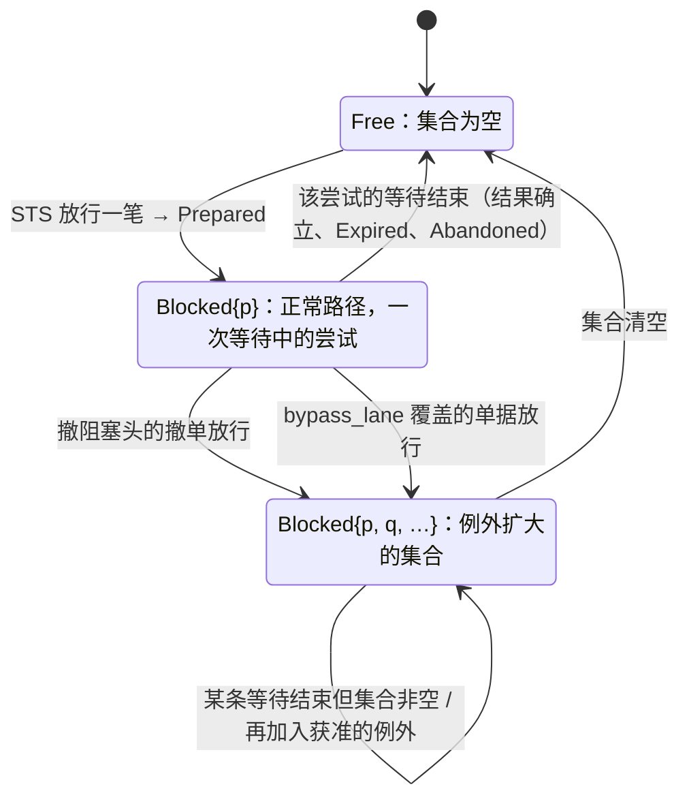

# lane 驱动

- **层级与元素**：L3 component，核心进程内的 lane 驱动。
- **上级文档**：[core-process/design.md §4.1 组件指南](design.md#41-组件指南)。
- **决定什么**：对 venue 写入通道的有序队列：键与粒度、队首阻塞的含义、阻塞头集合的定义、哪两种写可以不等阻塞头，以及控制动作 `bypass_lane` 的完整规格。
- **读者**：核心实现者；运维者（绕过）；集成作者（`WriteScope` 的对齐义务）。
- **状态**：已定。
- **非目标**：lane 步怎样在 STS 链上读阻塞头集合、冷却（[decision-chain.md §4.4 lane 步、冷却与过期步](decision-chain.md#44-lane-步冷却与过期步)）；一次尝试怎样结束等待（[io-shell.md §3.5 等待与结果：两根轴](io-shell.md#35-等待与结果两根轴-设计)）；控制组的共同部分（[control-plane.md §4.2 共同流程](control-plane.md#42-共同流程)）；`WriteScope` 的声明形状（[integration-session.md §3.3 投影 Projection](integration-session.md#33-投影-projection)）。

证据标签与编号前缀的约定见 [README.md §0.4 阅读约定](../../README.md#04-阅读约定)。

## 1 问题域

### 1.1 上级分配给本组件的需求

| 来源（[README.md §2 问题域](../../README.md#2-问题域)） | 内容 |
|---|---|
| H4 | 同一 (账户, 子账户) 的写需要一个全序。 |
| H1 | unknown 占用的 buying power 不按 instrument 隔离；宁漏不重。 |
| F1、F5 | 权威在 venue；写的结果可能不可知。 |
| C1、C12 | unknown 不自动产生新尝试；规则否决与绕过都有记录。 |
| Q7 | 同 lane 并发时队首阻塞，其他账户不受阻。 |

核心进程分配给本组件的接口：每个 `WriteLaneKey` 的阻塞头集合（该 lane 执行事实与 `bypass_lane` 控制记录的 fold）与按 `Prepared` 位置的执行顺序（[core-process/design.md §4.1 组件指南](design.md#41-组件指南)）；`bypass_lane` 在控制组里的生效点（[control-plane.md §4.2 共同流程](control-plane.md#42-共同流程)）。

### 1.2 本组件直接面对的域性质

- **提交是消费动作，消费方始终是 venue**：UTA 从头到尾都不能决定 venue 是否消费一次写。
- **后续写的语义依赖队首结果**：同账户 buying power、待撤订单是否存在、venue 侧顺序。
- **venue 限流按账户生效**；上游的账户结构对核心不可见，只经集成握手的 `WriteScope` 给出。

## 2 驱动

Q7（[README.md §3.1 质量场景](../../README.md#31-质量场景)）。响应度量见 [core-process/design.md §6.3 验收 #3](design.md#63-验收标准)（写边界状态）与 [decision-chain.md §6.3 验收 #32](decision-chain.md#63-验收)（冷却与绕过）。

## 3 模型

### 3.1 lane = unknown 阻塞半径

lane 是对 venue 写入通道的有序队列，= unknown 阻塞半径。核心只要求写通道作用域键 `WriteLaneKey` 是意图链路的锚点，取自集成握手声明的 `WriteScope`。核心不知道它对应上游的什么结构。

**键与粒度** [交易协议]：

- **对齐**：集成通常把 `WriteLaneKey` 对齐为 `(账户, 子账户)`；无子账户的 venue 退化为账户。枚举子账户是集成做契约对齐时的义务（C10，[integration-session.md §4.4 集成义务清单](integration-session.md#44-集成义务清单)），核心不要求、也不知道。
- **粒度权衡**：此粒度恰为 H4 要求的写全序范围。
  - 细于该粒度（如按 instrument）虽能防重复投放，却无法阻止“资金状态未知时继续加仓”。H1 本质：unknown 占用的 buying power 不按 instrument 隔离，且 venue 限流按账户生效。
  - 粗于该粒度（整账户）则超出 H4 范围，导致单笔卡住的订单冻结无关子账户。
- 不选：**按 instrument 分 lane**、**整账户 lane**：理由同上。会推翻这一粒度的观测见 [README.md §6.1 证伪 #5](../../README.md#61-证伪条件部分级)、[README.md §6.1 证伪 #6](../../README.md#61-证伪条件部分级)。

lane 的键取自握手 `WriteScope`，因为核心不知道也不该知道上游账户结构。[域 H4/H1；证据：fp-03 条目 7]

### 3.2 队首阻塞是通讯协议，不是锁

**队首阻塞是通讯协议的一部分，不是 UTA 选择的锁。** 提交属于消费动作，仅在消费者自身有权消费时才存在加锁概念；UTA 无权决定是否消费，消费方始终是 venue（[core-process/design.md §3.9 无锁定位](design.md#39-无锁定位)）。

**等待机理。** lane 上有等待中的尝试（最长的情形是队首 `Undetermined`）时，后续意图必须等待。

- 原因：**后续写入的语义依赖队首结果**。这是与 venue 的通讯协议语义，而非数据库层面的并发互斥。
- **lane 阻塞头等待发生在 `Prepared` 之前**：等待者是 `AwaitingDecision` 的单据，不是已放行的记录。停在放行门前等会话或能力的单据也还不是阻塞头，所以它恢复时从 lane 步重跑（[decision-chain.md §3.5 等待与重入](decision-chain.md#35-等待与重入-设计)）。因此正常路径下同 lane 至多一次等待中的尝试；`Prepared` 一旦 append 即交给 IO 壳，过发出前门即发；门的会话或能力条件不成立时，尝试在门前等待，仍是阻塞头（[io-shell.md §4.2 发送屏障与发出前门](io-shell.md#42-发送屏障与发出前门)）。
- 等待期间单据的 `basis_validity`/`alignment` 照常重算（[ticket.md §3.6 第二层：意图专属对账 alignment；偏离是状态](ticket.md#36-第二层意图专属对账-alignment偏离是状态)）。放行时链先过过期步，再过依据有效性门。
- 等待超过 `deadline` 由过期步 `Close(Expired)` 终结。

### 3.3 阻塞头集合

阻塞头是该 `WriteLaneKey` 上**等待中的尝试的集合**：UTA 仍在等它的结论、还没有结束等待的尝试（等待轴见 [io-shell.md §3.5 等待与结果：两根轴](io-shell.md#35-等待与结果两根轴-设计)）。等待中 =

- `Prepared` 无 `SendBarrier` 且未 `Expired`，或
- `SendBarrier` 无后继，或
- `Undetermined` 既无 `Found`/`Absent` 也无 `Abandoned`。

集合是该 lane 执行事实流上这些记录（与 `bypass_lane` 控制记录）的 fold，不另存（[decision-chain.md §3.4 RuleState 是记录的 fold，不另存](decision-chain.md#34-rulestate-是记录的-fold不另存-设计)）。

- 正常路径下集合至多一条。
- 两个例外使集合扩大：撤阻塞头的撤单意图、显式绕过（§4.2、§4.3）。
- 集合内每条独立结束等待：由各自的对账驱动得到结论，或由 principal 放弃（`Abandoned`，[io-shell.md §4.8 结果未知组（核心↔解释层）：放弃跟踪与重开](io-shell.md#48-结果未知组核心解释层放弃跟踪与重开)）。任何一条结束只把它移出集合；**集合为空**才解除普通写的等待，不存在“部分解除”。
- 集合非空时仍可继续加入获准的例外（再一笔撤阻塞头、再一次绕过）。
- IO 壳按 `Prepared` 位置顺序执行集合内每条，各自对账独立收敛。

### 3.4 不变量

- 同 lane 的**阻塞头集合**在正常路径下至多一次等待中的尝试；任一 `Undetermined` 在结果确立或被 principal 放弃之前，同 lane 无新普通写。例外只有两个，且二者都扩大阻塞头集合：以阻塞头中某次尝试记下的订单键为 `target` 的撤单意图；显式绕过（`bypass_lane` 的控制记录在案，只对所记版本与所记阻塞头有效）。由 STS lane 步在 `Prepared` 之前等待、任何重入都重过 lane 步 + IO 壳按序推进保证。
- 显式绕过必须有带 principal 的 `bypass_lane` 控制记录。由绕过语义保证。

## 4 结构

### 4.1 接口

| 方向 | 对方 | 交换 |
|---|---|---|
| 被用 | STS 规则链（lane 步、冷却） | 该 `WriteLaneKey` 的阻塞头集合；某单据版本是否被一条 `bypass_lane` 覆盖、覆盖哪些阻塞头 |
| 被用 | IO 壳 | 按 `Prepared` 位置的执行顺序 |
| 读 | 执行事实（该 lane 流） | 各尝试的记录、`bypass_lane` 的 `Applied` |
| 被用 | 控制面 | `bypass_lane` 的生效判定与控制记录内容（§4.3） |
| 被用 | 读模型 `lanes` | 阻塞头集合（[read-model.md §4.2 读模型集合](read-model.md#42-读模型集合)） |

### 4.2 无第二类越顶队列；撤阻塞头的撤单

队首取证期间 lane 上只发生决议动作。读侧的决议动作（按键查询、listing、成交 / 持仓对账）属于 IO 壳的对账协议，不是队列项。

**唯一不违反协议而越过阻塞头的写**：**以阻塞头中某次尝试记下的订单键为 `target` 的撤单意图** [设计]（订单身份来源之二，[ticket.md §4.5 交易协议：操作种类、目标、可执行性、检查目录](ticket.md#45-交易协议操作种类目标可执行性检查目录-交易协议)）。

- 键按尝试铸造与登记（[io-shell.md §3.4 调用方键的铸造](io-shell.md#34-调用方键的铸造-设计)），所以资格按尝试判定：`target` 必须精确等于阻塞头集合中某次已有 `SendBarrier` 的尝试在其 `SendBarrier` 里记为订单键（`OrderKey`）的键。键角色取自该尝试发出时的声明、随 `SendBarrier` 落盘，之后的声明不改写它（[io-shell.md §3.3 尝试与 AttemptRef](io-shell.md#33-尝试与-attemptref)）。撤单尝试的键只标识一次撤单请求，不合格；下单、平仓与改单的尝试只有声明了订单键时才合格；尚无 `SendBarrier` 的尝试没有登记的键，也不合格。
- 该键能否被上游用来撤单，仍由可执行性判定（目标种类 `IdemKey` 在 `(scope, Cancel)` 的 `target_kinds` 里，[ticket.md §4.5 交易协议：操作种类、目标、可执行性、检查目录](ticket.md#45-交易协议操作种类目标可执行性检查目录-交易协议)），不因它越过等待而放宽：只能按 venue 订单身份撤单的来源上，这笔撤单送审即以 `TargetNotAccepted` 否决，不进阻塞头集合；那里的阻塞头只由取证渠道、`Attributed` 得到结论，或由 principal 放弃。
- 它经单据与 STS 全链；lane 步对它不施加阻塞头等待。
- 理由：等待的依据是“后续写的语义依赖队首结果”，而这笔撤单不依赖队首结果，它存在的目的就是把 venue 侧推到一个读得出的状态。
- 放行后它成为该 lane 阻塞头集合的第二个成员，与阻塞头各自独立结束等待。
- 它不是对协议的违反，不需要 `bypass_lane`。

**它自身的结果不决议阻塞头。** 撤单的回执与 `Found` 只说明撤单请求到达了上游；把“撤单被受理”解释成“原单已撤”，或把“撤单被拒”解释成“原单不存在”或“已成交”，都是 heuristic，禁止（[io-shell.md §4.5 对账驱动](io-shell.md#45-对账驱动)）。阻塞头的结果只由它自己的取证渠道与 `Attributed` 给出，撤单不提升任何渠道的证明力（listing 未见仍是 `Inconclusive`，F10），也不自动重开阻塞头的取证：撤单有了结论之后要不要再问一次阻塞头，由 principal 经 `retry_reconciliation` 决定（[io-shell.md §4.8 结果未知组（核心↔解释层）：放弃跟踪与重开](io-shell.md#48-结果未知组核心解释层放弃跟踪与重开)）。

### 4.3 显式绕过 `bypass_lane(ticket)`

带 principal 的显式绕过是控制动作 `bypass_lane(ticket)` 的结果，记为控制记录 `Applied`，是**对协议的自觉违反**，不是队列的一种模式，也不是 Decision：它不回答“这一版批不批”，不占该 `current_version` 唯一的 Decision（[decision-chain.md §4.3 审批步](decision-chain.md#43-审批步)），不出现在 P7 的裁决集合里。

- **动作轴**：写（append 控制记录）。授权按 `(principal, bypass_lane)`，与其他控制动作同一规则族（[decision-chain.md §4.8 授权与审批策略的表示](decision-chain.md#48-授权与审批策略的表示)）；越权 → `Unauthorized`。
- **生效条件**：单据处于 `AwaitingDecision`；否则 `Rejected(reason)`，不改变任何东西。
- **记录内容与落点** [设计]：`Applied` 带 principal、单据、该单据的 `WriteLaneKey`（由单据取得，请求不另给）、该单据生效时的 `current_version`、生效时刻该 lane 阻塞头集合的位置集，以及控制记录共有的字段（[control-plane.md §4.2 共同流程](control-plane.md#42-共同流程)）。它是唯一**不落控制流**的控制记录：随该 lane 的执行事实流（[core-process/design.md §4.5 持久化视图](design.md#45-持久化视图)），所以 lane 的订阅者看得到每次绕过，lane 步也在同一条流上 fold 它。
- **范围**：只对这一版本、只对这些阻塞头有效：`SendBack` 后 `Revise` 出的新版本不继承它；它生效之后才加入集合的阻塞头不在其内，单据仍为它们等待。
- **作用**：lane 步在放行时读这条执行事实，只跳过它所列阻塞头的等待。它不越过授权、输入约束、审批、冷却、过期与放行门：未获批准的单据照常停在审批步，批准时这一版本仍受这条绕过覆盖。
- 放行后该 lane 同时存在多次等待中的尝试，按阻塞头集合的规则各自结束等待。
- 绕过只影响本 lane。
- 读模型 `tickets` 在该版本上给出这次绕过（谁、所记阻塞头，[read-model.md §4.2 读模型集合](read-model.md#42-读模型集合)）。
- 理由：绕过授权的是“不等这些阻塞头”，不是对意图版本的审批；把它记成 Decision，要么占掉批准所需的那一条，要么让一版有两条 Decision。

## 5 走查

**W5 的 lane 细化（Q7）。**

1. UI 与 AI 在 100 ms 内各提交一笔到同一 `WriteLaneKey`。lane 步按求值先后放行第一笔（得 `Prepared` @p1），集合 = {p1}；第二笔停在 lane 步。另一 `WriteLaneKey` 的写不受影响。
2. p1 `Undetermined`：集合仍 {p1}，第二笔继续等待。
3. **撤阻塞头**：以 p1 的 `SendBarrier` 记为订单键的键为 `target` 起撤单单据 T3。来源接受 `IdemKey` 目标：T3 过全链，lane 步不等待，放行后集合 = {p1, p3}。来源不接受：T3 在输入约束步 `TargetNotAccepted`，集合仍 {p1}。p3 `VenueAccepted`：p3 移出集合；p1 仍停等，IO 壳不自动重开 p1 的取证；集合 = {p1}，第二笔仍等待。
4. **显式绕过**：运维 principal 对第二笔 `bypass_lane`，`Applied` 记下它当时的 `current_version` 与 {p1}，落该 lane 流。第二笔已获批准则越过 lane 步、过冷却与门得 `Prepared` @p2，集合 = {p1, p2}；之后加入的阻塞头不在绕过之内。
5. p1 与 p2 各自结束等待，集合清空，lane 解除。

**卡点。** 无。

## 6 评估

### 6.1 风险 / 敏感点 / 权衡点

- **敏感点：lane 阻塞半径（`WriteLaneKey` 粒度）**（§3.1）：粒度细化，则 Q7 队首阻塞半径缩小，但失去 H4 写全序与 H1 资金隔离；粗化则冻结无关子账户。

### 6.2 证伪条件与验收

本组件决定的证伪条件是 H4、H1 的证伪（[README.md §6.1 证伪 #5](../../README.md#61-证伪条件部分级)、[README.md §6.1 证伪 #6](../../README.md#61-证伪条件部分级)）；可测响应见 [core-process/design.md §6.3 验收 #3](design.md#63-验收标准)（普通写、撤阻塞头、显式绕过三条路径与重启）。本组件不单独拥有证伪或验收编号。
