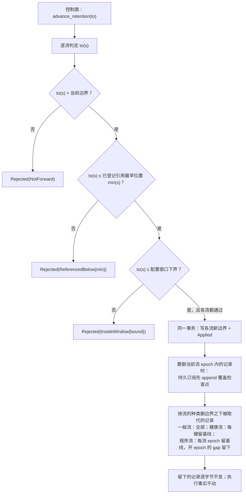
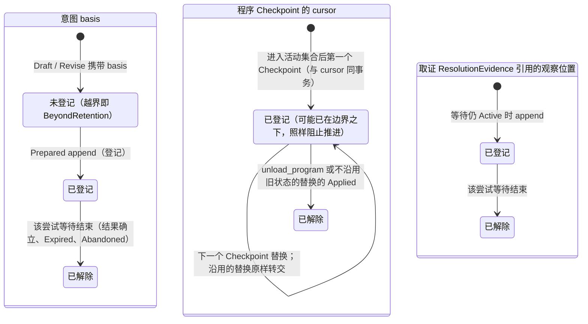

# 观察 `Journal`

## 0 定位

- **层级与元素**：L3 component，核心进程内的“观察 `Journal`”组件：观察侧记录的载体、撤回代数、位置分配、保留边界与引用登记。上级文档：[核心进程](design.md)。
- **本文决定**：观察记录怎样得到位置并落盘；派生内容怎样撤回；程序流怎样 fold；每条观察流保留什么、删什么；哪些位置被登记为引用、何时解除；保留边界怎样推进，以及控制动作 `advance_retention` 的规格。
- **读者**：实现观察侧存储、压缩与保留的实现者；审查 Q28 与重建等价性的评审者。
- **状态**：已定。
- **非目标**：
  - 位置、三种进度与 `StreamId` 的定义：[core-process/design.md §3.1 流、位置与三种进度](design.md#31-流位置与三种进度)。本文只实现“位置归核心”中观察侧的那一半。
  - gap 的三种来源与各 `reason` 的写者：[core-process/design.md §3.2 gap 的三种来源](design.md#32-gap-的三种来源)。
  - 各种观察记录的内容与写入时机：归写它的组件（[core-process/design.md §4.5 持久化视图](design.md#45-持久化视图)）。健康观察的字段与 fold 规则归 [read-model.md §3.5 健康面](read-model.md#35-健康面-设计)；程序流记录的形状归 [program-host-element.md §3.3 输出契约与程序流](program-host-element.md#33-输出契约与程序流)。
  - 登记与解除的**触发**：由单据、IO 壳、程序宿主元素各自的 append 产生，协议总述在 [core-process/design.md §4.3.7 保留引用的登记与解除](design.md#437-保留引用的登记与解除)；本文只写登记表与推进判定。
  - cursor、前导与投递缺口：[subscription.md §3.2 cursor 与确认](subscription.md#32-cursor-与确认)、[delivery.md §4.2 前导与缺口的排列（按 cursor 的两支投递）](delivery.md#42-前导与缺口的排列按-cursor-的两支投递)。本文只说明压缩给它们留下什么。
  - `basis` 落到边界之下的判定 `BeyondRetention`：[ticket.md §3.5 第一层：依据有效性 basis_validity](ticket.md#35-第一层依据有效性-basis_validity)。
  - 执行事实 `Journal`：它不压缩、没有保留边界，“只追加”由 [存储](storage.md) §2.3 保证。
- 证据标签与编号前缀的约定见 [README.md §0.4 阅读约定](../../README.md#04-阅读约定)。

## 1 问题域与驱动

### 1.1 上级分配给本组件的需求

| 来源（[README.md §2 问题域](../../README.md#2-问题域)） | 内容 | 本组件承担的部分 |
|---|---|---|
| P15 | 按存储类别的保留规则：观察日志可压缩到窗口；效应单据只追加不压缩 | 观察侧的保留与压缩 |
| P2、P3 | `Seq` 在“来源 × 流 × epoch”有序范围内赋；gap 显式 | 观察记录的位置分配 |
| Q11、Q17 | 迟到 tick 修订派生；半写不可见 | 撤回代数；`fold_state` 可重建 |
| Q28 | 保留边界推进不越过仍被单据或程序引用的位置 | 引用登记与推进判定 |
| Q32（经健康面） | 保留边界推进与核心重启都不改变当前健康 | 健康流按键保留 |
| C6 | 压缩过期造成的不连续显式标记 | 压缩只删被取代的记录、留基线；订阅上的压缩缺口由持久订阅记（[subscription.md §3.3 投递缺口 Gap{origin: Delivery}](subscription.md#33-投递缺口-gaporigin-delivery)） |

### 1.2 本组件直接面对的域性质

- **派生内容会被修正** [证据：fp-05 命题 12；域 P15]：迟到 tick 修订 bar，已派生的信号随之失效。所以派生侧必须能在代数上表达撤回。
- **执行事实不能修正**（[core-process/design.md §3.3 两类记录与第一边界](design.md#33-两类记录与第一边界)）：已发出的写不能被负 diff 抹成“从未发生”。所以逆元只在观察侧要求。
- **存储是有限的**：观察流（尤其行情）无界增长，必须能删；而删掉的历史就不能精确重建。所以删除要有边界、有审批、有被引用位置的保护。

## 2 模型

### 2.1 `Journal` 与撤回代数

```rust
trait Delta: Monoid { fn is_zero(&self) -> bool }                  // fp-05 案例 12 difference.rs
trait RetractableDelta: Delta { fn neg(&self) -> Self }            // 只有派生侧要求

struct Journal<Record, D: Delta> { stream: StreamId, ops: Vec<(LogPosition, D)> }
fn fold_state<Record, D: Delta>(journal: &Journal<Record, D>, at: LogPosition) -> State<Record>   // state = 前缀和 = fold
fn compact_below_retention<Record, D: RetractableDelta>(journal: &mut Journal<Record, D>, retention: LogPosition)   // 按该流的保留规则删边界之下的记录（§2.4）
```

- **`Record`**：该流的记录词表，必须是具体类型；退化为 `dyn Any` 即违反解析边界。集成来源的流上，它由信封解析入口在边界处解析给出（[信封解析入口](envelope.md)）；程序流上，它是解释器产出的类型化值，类型是输出契约里该流的值类型，不经任何集成解析 [证据：fp-04 命题 15/16]。
- **状态是计算结果**：状态是 `fold_state`（前缀和）的结果，可随时重建与缓存，不是由规则原地修改的对象 [证据：fp-03 命题 1；fp-01 M8]。
- **派生侧用 `RetractableDelta`**（可撤回多重集、正负 diff）：`neg` 使旧贡献可撤、新贡献可加、受影响子图可重算 [证据：fp-05 命题 12；域 P15]。
- 执行事实侧的 append-only 链在存储上可复用同一原语（`Delta: Monoid`，无逆元），但它属于效应抽象，类型不与观察侧共享；由单向边与 crate 依赖方向保证（[core-process/design.md §3.4 两个类型宇宙与唯一边](design.md#34-两个类型宇宙与唯一边)）。
- `compact_below_retention` 只对 `RetractableDelta` 表存在。

为什么 / 不选：

- **不选：把执行历史也建成可撤回 delta**：负 diff 不能当外部写的补偿，已发出的写不能被撤回代数抹成“从未发生”。
- **不选：让状态由规则原地修改而非 fold**：状态就无法随时重建与缓存，重放与审计失去依据。

### 2.2 位置的分配与记录的接受 [设计]

`LogPosition` 由核心在 append 时创建，核心是它的源头（[core-process/design.md §3.1 流、位置与三种进度](design.md#31-流位置与三种进度)）。观察侧由本组件执行：

- 每个 `StreamId = (source, stream, epoch)` 独立维持 `Seq` 单调递增，按 append 的先后分配；系统内不存在全局入口序 [证据：fp-04 命题 11；域 P2]。
- **集成推送的接受路径**：集成会话只从当前会话的通道读入并盖上该会话的 `SessionEpoch`（[integration-session.md §4.3.2 集成→核心的推送](integration-session.md#432-集成核心的推送)）→ 信封解析入口解析并验证，畸形即在边界拒绝（[信封解析入口](envelope.md) §3.1）→ 本组件分配位置并 append。会话内上报 gap 的事务由集成会话编排，本组件在其中分配位置。
- 其余观察记录（一次性读与回填的结果与结论、回执与取证的观察记录、健康观察、程序流记录、控制面写的程序流开 epoch 的 gap）由各自的写者在自己编排的事务里经本组件 append；写者清单见 [core-process/design.md §4.5 持久化视图](design.md#45-持久化视图)。
- 同一 `StreamId` 内 venue 序号倒退或重复的记录照常 append，不去重、不重排；质量标记与重复的处理见 [integration-session.md §4.3.2 集成→核心的推送](integration-session.md#432-集成核心的推送)。本组件不伪造流顺序。
- 集成给的 venue 序号、游标与事件时间是来源给的字段，随记录作为副本保存；它们不参与位置分配。

### 2.3 程序流的 fold [设计]

程序流上每条值记录的正贡献，就是该输出在这个流 epoch 的完整值（[program-host-element.md §3.3 输出契约与程序流](program-host-element.md#33-输出契约与程序流)）。fold 一条程序流时：

- 一条记录的正贡献**取代** fold 方为该流 epoch 所持的值；
- 撤回部分只以位置指名被取代的那条记录。这一指名使以该位置为 `basis` 的依据为 `Retracted`（[ticket.md §3.5 第一层：依据有效性 basis_validity](ticket.md#35-第一层依据有效性-basis_validity)），**不参与求值**。

所以程序流在 `as_of` 的 fold 就是该流 epoch 在 `as_of` 及以前最新一条值记录的正贡献。撤回部分所指的位置不在 fold 方已折入的前缀里时（它已被压缩删去，或在这次 fold 的起点之前：完整重放、从中途位置起的重放、订阅从流末起收到的尾部），这一部分不改变结果。

- 理由：压缩不改写任何记录（§2.4），已交出的位置内容不变；值由最新一条记录决定，自行 fold 原始记录的消费方不必知道自己看过或漏过哪些被删的记录。每个 fold 方都收敛到同一个当前值：从边界起的新 fold、已折入被删记录的订阅者，以及收到 `Gap{Delivery, compacted}` 的订阅者，收到同一条记录之后都持有它的正贡献。
- 不选：**按撤回代数 fold（`neg` 只撤回前缀里所指的那个贡献）**：已折入 a0 而漏收 a1 的订阅者，收到撤回 a1 的基线时撤不掉 a0，同时持有两个值（§5 走查 2）。

### 2.4 保留：边界与删除规则

保留语义回答两件事：哪些历史必须保留，谁批准边界推进。

**双侧保留策略** [域 P15]：

- 观察侧按保留边界压缩；`compact_below_retention` 仅对 `RetractableDelta` 表存在。
- 执行事实侧保持纯 append，不压缩、不删除，没有保留边界；取证与回执的证据字节（`Evidence`）在那里（[io-shell.md §4.3 输出与记录模型](io-shell.md#43-输出与记录模型-设计)），所以回执与取证的观察记录可压缩而证据不丢。
- 快照是重启延迟的必需项，不改变 append-only 语义（[存储](storage.md) §2.4）。

**边界按观察流分别维持** [设计]：

- `LogPosition` 只在同一 `StreamId` 内有序，所以保留边界是每条观察流一个位置，合起来与 `basis` 同形（`Set<LogPosition>`）。
- 边界只前进。每条流上存储仍能精确重建的最早位置就是它的边界。

**删除规则按流的种类** [设计]。压缩只删不改：留下的记录一条也不改写。

| 流 | 边界之下删什么 | 留下什么 |
|---|---|---|
| 集成来源的一般观察流 | 全部 | 无 |
| 健康流（按键的状态值） | 每个键上被同键后续记录取代的记录 | 每个键在边界之下的最新一条，作**基线**，位置不变 |
| 程序流（按流 epoch 的状态值） | 被同一流 epoch 里后续值记录取代的值记录 | 每个流 epoch 在边界之下的最新一条值记录作基线，位置与内容都不变；开 epoch 的 `Gap{origin: Source}` 不是值记录、不被取代，原位置留下 |

压缩要删掉某流**当前流 epoch** 内的记录之前，持久订阅先为该逻辑流 append 覆盖检查点，使序号覆盖不因压缩改变（[subscription.md §4.6 覆盖检查点](subscription.md#覆盖检查点)）。这是本组件执行压缩时的一个前置步骤（§4.1），规格归持久订阅。

**健康流按键保留** [设计]。健康观察是状态值：每条带它那个键上的完整当前值，同键后一条取代前一条，这就是健康流的 `RetractableDelta`。键是（字段与取舍规则见 [read-model.md §3.5 健康面](read-model.md#35-健康面-设计)）：

- 一个集成的会话状态（每条带 append 它的核心实例的 `instance_id`，`Established` 另带其 `SessionEpoch`）；
- 一条流的 readiness（带到达时所在会话的 `SessionEpoch` 与该流当时的流 epoch）；
- 一个逻辑流的回填进度（值带所属流 epoch，没有回填任务的 epoch 为 `None`）；
- 一个逻辑流的覆盖检查点（值带流 epoch 与 `folded_below`）；
- 一个调用目标的计数（带计数后的 `consecutive_failures` 与 `last_success_at`）。

性质：

- 对任一 `as_of ≥ 边界`，按键 fold 与压缩前相等。唯一的例外是某个成员走到 [read-model.md §3.5 健康面](read-model.md#35-健康面-设计) “会话”一条的 `BeyondRetention` 分支：健康流前缀里没有带它在控制流前缀里最近一次采纳之 `instance_id` 的会话观察（已被同键后续记录取代而删去），而它最近一条会话观察所带的实例在控制流前缀里没有采纳；这个切面得 `BeyondRetention`，独立 fold 的消费方从同样两个前缀得出同一结论。不在该切面采纳集合里的键不进入 fold，它的基线带哪个实例不影响这一等式。`as_of` 低于边界仍得 `BeyondRetention`。
- 键集有界：登记的集成 × 声明的流 × 调用目标；键不退役，基线至多每键一条。
- 理由：会话状态、readiness、回填进度与调用计数（含“从未成功过”）都是历史的函数；按位置压缩掉早期记录会改变当前值，新消费者与跨重启的读模型就 fold 出错的健康。集成的持久 `Halted` 另有执行事实为据，不依赖健康流（[integration-session.md §4.6 会话状态机](integration-session.md#46-会话状态机)）。
- 不选：
  - **把每键最新位置登记为引用**：登记按位置压住整条流，一个久未变化的键就让健康流永远压不动；
  - **健康流免压缩**：每次调用一条记录，无界增长；
  - **另设健康表或存进快照**：第二种持久形状，`as_of` 重建与订阅都拿不到它；
  - **压缩时把当前值重新 append**：改变位置与 `as_of` 语义，订阅者会收到并未发生的变化。

**程序流按流 epoch 保留** [设计]：

- 压缩不改写任何记录：基线若是一条改变记录，它的撤回部分仍指名同一次压缩删去的那条记录；按 §2.3，记录的正贡献取代 fold 方所持的值，这一指名不改变结果。对任一 `as_of ≥ 边界`，前缀 fold 与压缩前相等；`as_of` 低于边界仍得 `BeyondRetention`。
- 写下一条改变记录所需的此前仍生效的值与它的位置（核心重启之后、沿用旧状态的替换之后也一样），程序宿主元素从流本身读出：当前流 epoch 的最新一条值记录。这份 journal 由核心拥有，没有另存的副本；当前流 epoch 还没有值记录时，下一个有定义的值就是本 epoch 的第一个值。
- 基线至多每个流 epoch 一条，只随不沿用旧状态的成员开始而增加（[program-host-element.md §3.3 输出契约与程序流](program-host-element.md#33-输出契约与程序流)）：新 epoch 不撤回上一 epoch 的值。
- 理由：程序流的当前值是流上记录的 fold；按位置压缩掉一个久未改变的输出仍生效的贡献，`fold_state` 就不再是当前值。
- 不选：
  - **把仍生效的贡献位置登记为引用**：一个久未改变的输出就让整条流压不动（同健康流）；
  - **程序流免压缩**：值每变一次一条记录，无界增长；
  - **压缩时把当前值重新 append**：改变位置与 `as_of` 语义；
  - **压缩时去掉基线里指名已删记录的撤回部分**：改写了一个可能已经交出的位置的内容，同一位置在不同订阅者那里是两种记录；
  - **另存每条程序流的当前值与位置供宿主元素读取**：第二个源头，与流上的记录可能分叉。

**压缩给订阅者留下什么**：从边界订阅的消费者（cursor 为 `Start{边界}`）每次挂接先收到边界之下留下的记录（前导），cursor 为 `At` 而落在边界之下的订阅者收到只覆盖被删位置的 `Gap{origin: Delivery, compacted}`，各段之间留下的记录照常按位置交给它。这是压缩的结果，不是 cursor 退回；规格见 [subscription.md §3.2 cursor 与确认](subscription.md#32-cursor-与确认) 与 [delivery.md §4.2 前导与缺口的排列（按 cursor 的两支投递）](delivery.md#42-前导与缺口的排列按-cursor-的两支投递)。

### 2.5 引用登记 [设计]

保留边界的推进不越过仍被登记引用的 `LogPosition`：已登记的引用阻止推进，直到它的持有者解除它 [证据：fp-05 案例 13⑤ Materialize]。另外两件事都不是拒绝推进之外的替代：取证与回执的证据字节在执行事实侧、不压缩；未登记的位置只把重放承诺缩小到 `AS OF ≥ 保留边界`，落到边界之下读得 `BeyondRetention`。

**登记方 = 核心**：引用在产生时由核心自动登记，随持有者的生命周期自动解除，消费者不手工登记。

| 引用 | 何时登记 | 何时解除 |
|---|---|---|
| 意图的 `basis` | `Prepared` 持久化时 | 该尝试的等待结束后（结果确立、`Expired` 或 `Abandoned`） |
| 程序 `Checkpoint` 依赖的 cursor 位置 | 程序进入活动集合后的每个 checkpoint 持久化时（第一个 checkpoint 之前没有登记） | 下一个 checkpoint 持久化即替换；`unload_program` 的 `Applied`，或不沿用旧 checkpoint 的替换 `Applied` 时解除；沿用的替换原样转给新成员；宿主 `Unload`、受控停止与失败抑制不解除 |
| 对账 `ResolutionEvidence` 引用的观察位置 | 等待仍 `Active` 时 append 的，append 时 | 该尝试的等待结束后 |

- 登记与解除在触发它们的 append 的同一事务里写进登记表（[core-process/design.md §4.3.7 保留引用的登记与解除](design.md#437-保留引用的登记与解除)）。
- 已解除的引用仍可读作审计。它落到边界之下时读得 `BeyondRetention`，不再阻止压缩。
- **未解除的引用即使已在边界之下也照样阻止推进**。程序 `Checkpoint` 的 cursor 引用登记时可能已在边界之下：第一次提交的 cursor 可以是 `from` 的前一位置，或一段被删位置的末位（[program-host-element.md §4.6.2 Advance](program-host-element.md#462-advanceevents-to-cursor--outputeffects-derivations-checkpoint)）；这样的引用此后阻止该流边界推进，直到下一个 `Checkpoint` 取代它。

### 2.6 推进判定 [设计]

**审批方 = 控制面 principal**，经 `advance_retention`（§3.2）。

- 核心逐流算出该流已登记引用的最早位置 `min`；新边界不得越过它。
- 要越过只能先让持有者解除：该尝试的等待结束（`Undetermined` 经证据收敛或被 principal 放弃）；程序推进 checkpoint、被卸载或被不沿用旧 checkpoint 的替换。没有旁路。

**留存时长 = 配置参数**：派生历史与原始观察的保留窗口由运行期参数给出（[core-process/design.md §4.6 统一路径文件](design.md#46-统一路径文件)）；窗口内的历史必须保留。

每条流的边界可推进上限 = `min(该流配置窗口下界, 该流已登记引用最早位置)`。

### 2.7 不变量

1. 每条观察流的保留边界推进都**不越过该流已登记引用的最早位置**；执行事实侧不压缩，没有边界。由核心自动登记（§2.5）+ `advance_retention` 逐流比对（§3.2）保证。
2. 未登记而落到边界之下的引用不静默失真，校验时得 `BeyondRetention`。
3. 压缩只删不改；健康流每个键、程序流每个流 epoch 在边界之下的最新值记录原样保留为基线，任一 `as_of ≥ 边界` 的 fold 与压缩前相等（健康读的唯一例外见 §2.4）。
4. 边界只前进。
5. 每个 `StreamId` 内 `Seq` 单调递增，按 append 先后分配。

## 3 接口

### 3.1 对核心进程内组件

| 接口 | 使用者 | 语义 |
|---|---|---|
| `append(stream_id, record)` | 观察记录的各写者（§2.2） | 在调用方事务里分配该流下一个 `Seq` 并写入；返回位置 |
| `fold_state(stream, at)`、`read_range` | 读模型、单据检查项、程序宿主元素、持久订阅、投递调度 | 按位置读已提交记录；位置低于该流边界的读得 `BeyondRetention` |
| `retention(stream)` | 单据 `basis_validity`、投递调度、快照 | 该流当前保留边界 |
| `register(stream, pos, holder)` / `release(holder)` | 单据、IO 壳、程序宿主元素（经 [core-process/design.md §4.3.7 保留引用的登记与解除](design.md#437-保留引用的登记与解除)） | 在调用方事务里写 / 删登记 |
| `latest_value(program_stream_epoch)` | 程序宿主元素 | 当前流 epoch 的最新一条值记录及其位置（§2.4） |

### 3.2 控制动作 `advance_retention(to: Set<LogPosition>)`

核心↔解释层控制组的一员；授权、控制记录的共同形状与受控停止期间的结论见 [control-plane.md §4.2 共同流程](control-plane.md#42-共同流程)。

- **语义**：推进一组观察流的保留边界。`to` 为每条要推进的观察流给出一个新边界（位置在该流上）。
- **动作轴**：写（append 控制记录，落控制流，[core-process/design.md §4.5 持久化视图](design.md#45-持久化视图)）。
- **判定**：逐流判定，**任一流不通过即整体拒绝**，无流被推进：
  - 新边界不高于该流当前边界 → `Rejected(NotForward)`（边界只前进）；
  - 越过该流已登记引用最早位置 → `Rejected(ReferencedBelow{min})`；
  - 越过该流配置留存窗口下界 → `Rejected(InsideWindow{bound})`；
  - 越权 → `Unauthorized`（共同规则）。
- **生效**：各流都通过时，写各流的新边界并 append `Applied(position)`；然后对每条流按 §2.4 的删除规则执行压缩（§4.1），压缩之前先完成覆盖检查点。
- **可见结果**：控制记录可读；此后低于新边界的读得 `BeyondRetention`；订阅者按 §2.4 最后一段收到前导或压缩缺口；执行事实侧没有记录被删。
- **崩溃**：`Applied` 之前实例结束，动作随实例结束、不生效。`Applied` 已提交而压缩未完成时，边界已是新值，边界之下的删除是按规则可重做的清理：重启后继续按同一规则删，结果相同（删除只取决于边界与留下的记录，§4.1）。

## 4 内部结构

### 4.1 推进与压缩的执行顺序



- 判定与写新边界在一个事务里：判定所读的 `min(s)` 与写入之间没有别的登记插入（核心单写者，[存储](storage.md) §2.1）。
- 删除按行集调用 [存储](storage.md) 的 `delete_below`；“删哪些”只取决于新边界与同键 / 同流 epoch 的后续记录，所以中断后重做得到同一结果。

### 4.2 引用登记的状态



## 5 走查

组件内细化；主 trace 在 [core-process/design.md §5.1 W13（Q28）保留边界推进与被引用位置](design.md#w13q28保留边界推进与被引用位置)。

**1. W13 的观察 `Journal` 细化（保留边界推进与被引用位置，Q28）**

1. 流 s 上位置 p 被一张单据的 `basis` 引用，单据已 `Prepared`：登记表里有 `(s, p, 该尝试)`（§2.5）。
2. principal 发 `advance_retention({s: q})`，q > p：`min(s) = p`，得 `Rejected(ReferencedBelow{min: p})`；同一请求里其他流即使通过也不推进。
3. 该尝试结果确立：IO 壳的结果 append 与解除在同一事务，`(s, p)` 离开登记表。
4. 再次 `advance_retention({s: q})`，q 不越过窗口下界：`Applied`；s 为一般观察流，q 之下全部删去。
5. 之后以 p 为 `basis` 的新校验得 `BeyondRetention`；执行事实侧没有记录被删。
6. 程序变体：程序 `Origin` 输入第一次提交的 cursor 是 `from` 的前一位置，低于当前边界；它的 `Checkpoint` 登记这一位置，此后该流的 `advance_retention` 得 `ReferencedBelow`，直到下一个 `Checkpoint` 取代它。
7. 卡点：无。

**2. 程序流压缩与收敛（§2.3、§2.4）**

1. 同一流 epoch 里 a0（值 A0）、a1（撤回 a0，值 A1）之后是 b（撤回 a1，值 B）。边界推进到 b 之上，a0、a1 被删，b 作基线留下，内容不变。
2. 从边界起新 fold：前导里收到 b，持有 B。
3. cursor 在 a0 之前的订阅者：收到覆盖 a0、a1 的压缩缺口，再收到 b，持有 B。
4. 已折入 a0、cursor 在 a1 之前的订阅者：收到覆盖 a1 的缺口，再收到 b；b 的正贡献取代它持有的 A0，得 B（按撤回代数 fold 它会同时持有 A0 与 B，这就是 §2.3 不选的理由）。
5. 已折入 a1 的订阅者：收到 b，得 B。
6. 卡点：无。

**3. 健康流压缩与重启**

1. 集成 X 的会话键上有 `Connecting`(10)、`Established`(20)、`Connecting`(30)，边界推进到 40：10、20 被删，30 作基线。
2. 核心重启：第 3 步为 X 写新的会话观察。`health` 对 `as_of ≥ 40` 的 fold 与压缩前相等。
3. 回填进度键：新 epoch 的 `None{epoch}` 与起点的 gap 同事务写下，旧 epoch 的 `Closed` 被取代，压缩后只留最新一条，不会被当成新 epoch 的进度。
4. 覆盖检查点：压缩删去当前流 epoch 内的记录之前已 append，之后的覆盖从它起 fold，与压缩前相等。
5. 卡点：无。

## 6 评估

### 6.1 敏感点

- **保留时长（retention）**：缩短，则 Q28 中仍被单据或程序引用的 `LogPosition` 更易越界，边界推进更常被拒；延长则存储与重建成本上升（重建成本见 [存储](storage.md) §6.1）。

### 6.2 验收

4. **保留边界**（本文 §2.5–§2.7、§3.2；对应 Q28）：
   - 每次生效的边界推进，新边界都不越过推进时该流已登记引用的最早位置；程序第一个 `Checkpoint` 登记的 cursor 已在边界之下时（例如 `Origin` 输入第一次提交的 cursor 为 `from` 的前一位置），此后该流的 `advance_retention` 得 `ReferencedBelow`，直到下一个 `Checkpoint` 取代它；
   - 未登记引用在 `basis_valid` 得 `BeyondRetention`；
   - `advance_retention` 越过某流已登记引用或留存窗口下界时，分别得 `ReferencedBelow`/`InsideWindow`，且无流被推进；
   - 执行事实侧无记录被删。
