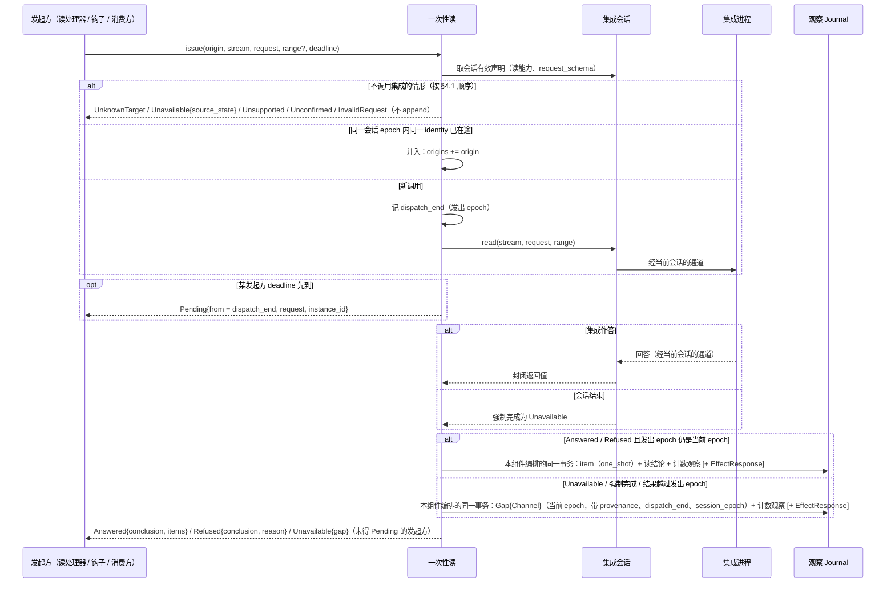

# 一次性读

## 0 定位

- **层级与元素**：L3 component，核心进程里的“一次性读”元素。上级：[core-process/design.md §4.1 组件指南](design.md#41-组件指南)。
- **本文决定**：除回填外全部核心→集成 `read` 的发起与完成：核心↔集成 `read(stream, request, range?)` 与核心↔解释层 `read(targets, deadline)` 的完整规格；不调用集成的判定顺序；在途表与同一 identity 的并入；读结论记录、`provenance: OneShot{origins, request}`、`dispatch_end` 与 `session_epoch`；`Pending`；按发出 epoch 的准入；调用结束时的提交。
- **读者**：实现一次性读与它的三类发起方（读处理器、单据钩子的“先查后判”、消费方 `read`）的人；实现集成的人读 §4.1 的对端义务；解释层读 §4.2。
- **状态**：已定。
- **非目标**：
  - 回填：[subscription.md §4.4 核心→集成：backfill](subscription.md#44-核心集成backfillstream-window-subjects--covered--unavailable--refused)。它由持久订阅发起，不经本组件。
  - 发起方自己的记录：读处理器的 `EffectResponse` 由出站请求处理器构造（[outbound-requests.md §3.4 完成事实 EffectResponse 与请求流](outbound-requests.md#34-完成事实-effectresponse-与请求流-设计)），钩子的检查结果属单据（[ticket.md §3.6 第二层：意图专属对账 alignment；偏离是状态](ticket.md#36-第二层意图专属对账-alignment偏离是状态)）。
  - 声明的两种解释、会话状态、调用通道与会话结束时的强制完成：[integration-session.md §3.6 声明的两种解释](integration-session.md#36-声明的两种解释-设计)、[integration-session.md §4.6 会话状态机](integration-session.md#46-会话状态机)。
  - 调用计数的内容与健康面：[integration-session.md §4.10 调用结果的计数](integration-session.md#410-调用结果的计数)、[read-model.md §3.5 健康面](read-model.md#35-健康面-设计)。
  - 读结论之后怎样被等待者收到：[subscription.md §4.1 核心↔解释层：订阅组与 rewind_cursor](subscription.md#41-核心解释层订阅组与-rewind_cursor)（只投递项）、[delivery.md §3.3 按主体投递](delivery.md#33-按主体投递)。
  - 成交与订单状态的计数与最近观察语义（本组件写下的记录怎样被 fold）：[read-model.md §3.2 成交的计数身份](read-model.md#32-成交的计数身份-设计)。

证据标签与编号前缀见 [README.md §0.4 阅读约定](../../README.md#04-阅读约定)。

## 1 问题域

### 1.1 分配给本组件的需求与契约

| 来源 | 分给本组件的部分 |
|---|---|
| F6、C2 | “不支持”“未确认”“没有会话”“上游拒绝”“渠道失败”与空回答彼此可区分，不返回看似成功的空数组 |
| C6 | 渠道失败以 `Gap{origin: Channel}` 显式记下 |
| Q15 | 多 target 读各 target 独立，一个来源不可用不影响其余 |
| Q16 | 各种“拿不到”typed 可区分 |
| Q13 | 接着等一次读的结果不占配额、不向上游多要推送（经只投递项） |
| Q32 | 一次调用计一次，与结果同事务提交 |

核心进程分配给本组件的接口：核心↔集成的 `read`；核心↔解释层的一次性读 `read(targets, deadline)`（[core-process/design.md §4.2 对外接口总表](design.md#42-对外接口总表)）；核心内的发起方经本组件发读（[core-process/design.md §4.3.1 uses 图](design.md#431-uses-图)）。读是读副作用：不改变世界，可重试、可批、可丢，结果总可判定（[core-process/design.md §3.7 读副作用与写副作用](design.md#37-读副作用与写副作用)）。

### 1.2 本组件直接面对的域性质

- **读的回答来自本次对上游的询问**（[integration-session.md §4.4 集成义务清单](integration-session.md#44-集成义务清单)）：集成不以缓存或旧结果作答；上游分页、pacing 与重试在适配器内，一次调用一个封闭结果。
- **上游可能对单次请求明确拒绝**（未开通、主体不受支持、参数被上游拒绝），这不改变流声明的能力。
- **上游可能迟迟不答**：调用的时限在集成（集成对上游调用的时限）；发起方另有自己的等待上限 `deadline`，二者不是一回事。
- **流 epoch 的边界属于集成**：集成送出开 epoch 的 `Gap{origin: Source}` 时仍在通道上的调用只能在 gap 之后结束（[integration-session.md §4.3.2 集成→核心的推送](integration-session.md#432-集成核心的推送)）。
- **声明是会话里的副本**：“不支持 / 未确认”只有当前已建立会话的声明能说；离线时手里的是上一次会话说过的话。

## 2 驱动

| Q | 本组件的响应 | 度量（验收） |
|---|---|---|
| Q15 | 每个 target 独立判定与作答，不可用项在 `deadline` 内可见 | 验收 #27 |
| Q16 | 八种结果与 `Pending` 各自可区分 | 验收 #27 |
| Q13 | `Pending` 之后以只投递项等结果 | 验收 #27（`Pending` 一条） |
| Q32 | 同一 identity 在途并入一次调用，计一次，与结论同事务 | 验收 #27（并入一条） |

## 3 模型

### 3.1 一次性读的记录

一次性读把上游的回答写成观察记录，与推送观察同形；它的完成本身也是流上的一条记录 [设计]：

- **item 记录**：回答的每一项一条观察记录，与该流的推送观察同形（同一 `payload_schema`，每条自带信封字段），打质量标记 `one_shot`。
- **读结论记录**：流上的控制记录（与 `Gap` 同类，不是载荷记录）：`{request 身份, origins, 本次 item 记录的位置}`；上游拒绝时记拒绝及原因，不带 item。fold 与程序的载荷解释器不把它当作该种类的数据。
- **`Gap{origin: Channel}`**（渠道为一次性读）：这次调用的渠道失败。它是核心自己那次调用的结果（UTA 自有事实），不是流的断代，不计入读模型的 `gaps`（三种 gap 的区分见 [core-process/design.md §3.2 gap 的三种来源](design.md#32-gap-的三种来源)）。它记在观察侧该流上，作为流上的控制记录，让等这次读的人看得到结论。
- 三种记录都带：
  - `provenance: OneShot{origins, request}`：`origins` 是这次调用服务的全部发起方，取值 `Request(LogPosition) | Ticket(TicketId) | Session(Principal)`，依次对应读处理器、检查项的“先查后判”、消费方 `read`；`request = (流, 请求 schema 身份, 规范化参数, range)`，即合并 identity（§3.2）。
  - `dispatch_end`：这次调用发出时该流已提交的流末位置（定义与它在来源顺序里的用法见 [read-model.md §3.3 订单身份、来源顺序与最近观察](read-model.md#33-订单身份来源顺序与最近观察-设计)）。
  - 发出这次调用的会话的 `session_epoch`（它的 `instance_id` 就是发出调用的核心实例）；包括核心自己完成这次调用时记下的 gap：会话结束时的强制完成，与结果越过发出 epoch 时在当前 epoch 上记的那条。
- 一次性读不参与实时边界，不推进序号覆盖（[subscription.md §4.6 序号覆盖与覆盖检查点](subscription.md#46-序号覆盖与覆盖检查点)）；`LogPosition` 由核心分配。

[设计] 读结论记录的理由：空回答不产生 item 记录，没有它，另一个订阅者、钩子乃至发起方都无法在观察侧区分“答了空”与“还没答”；每个 item 仍是独立记录，按种类 fold（如成交按执行身份）不受影响。不选：一次读 append 一条载荷为 item 集合的记录：同一流上出现两种载荷形状，推送记录与读记录不再可互换。不选：只在返回值或 `EffectResponse` 里表示完成：发起方之外的消费者看不到。

### 3.2 identity 与并入（只读批处理条件）

只读请求允许批处理 / 去重，条件是：无可观测副作用 + 稳定 identity + 幂等 + 可接受的批窗口。写操作永不走此路径。一次性读的稳定 identity 是 `(来源, 流, 请求 schema 身份, 规范化参数, range)`；同一集成会话 epoch 内同一 identity 的在途调用一律并入同一次调用，不论发起方：`origins` 含全部并入者、在调用完成提交时冻结，这次调用只计一次；合并只发生在在途调用之间，调用完成之后的同一请求是新调用，不以缓存或旧结果作答；各发起方的 `deadline` 各自生效。规范化由本组件做，解释层不自行规范化。

[设计] 理由：上游收到几次调用、健康计几次、结论记录带哪些发起方都是外部可观测的，合并可选就有两种答案；“`Pending` 之后重试不会再发一次”也只在合并是必然时成立。[证据：fp-03 命题 4；fp-02 命题 1/2]

### 3.3 为什么一次性读是单独的组件

它解释的是 `read` 的操作与它已有的记录模型（结果项、读结论记录、`Gap{origin: Channel}`、`provenance`），不拥有新的记录代数 [设计]。

- 理由：`origins` 是一个集合、同一 identity 的再读并入在途调用，所以在途调用必须有一个跨发起方的 owner；消费方 `read` 返回 `Pending` 之后调用仍要完成、结论与计数仍要提交，而那时发起的会话可能已经结束，这个 owner 不能是会话或解释层。计数规则要求“发起方在同一事务提交”（[core-process/design.md §4.3.6 调用结果与计数的提交协议](design.md#436-调用结果与计数的提交协议)），它就是这些读的发起方。
- 它在观察侧：它写的全是观察记录，发起方的身份以不透明的 `origins` 存储、不解析。效应侧的发起方用它，是效应侧读观察侧的方向（[core-process/design.md §3.4 两个类型宇宙与唯一边](design.md#34-两个类型宇宙与唯一边)）。
- 不选：
  - **在途表放进集成会话的调用通道**：合并按读的 identity、结论要带合并后的 `origins`，这是 `read` 自己的语义，放进中性通道就让它解释读结果；
  - **各发起方各自发读、只在同一发起方内合并**：同一查询是否共享一次上游调用取决于谁发起，与 `origins` 是集合、`Pending` 后再读并入在途调用相矛盾；消费方的调用在其会话结束后无人完成；
  - **交给持久订阅**：它拥有的是订阅表与回填，读处理器、单据与消费方的一次性读与订阅无关。

### 3.4 判定顺序先看会话，再看声明

“不支持 / 未确认”是对此刻能力的陈述，只有当前已建立的会话里的声明能给出（会话有效声明，[integration-session.md §3.6 声明的两种解释](integration-session.md#36-声明的两种解释-设计)）；离线时手里的只是最近一次会话说过的话，据它报“不支持”，就把一份过期的副本当成了来源此刻的回答（[README.md §1.2 权威源头与生命周期](../../README.md#12-权威源头与生命周期) 同步等待）[设计]。所以没有会话时一律是 `Unavailable{source_state}`，会话建立后再按会话有效声明判定。“来源未登记”“从未有过声明”是 UTA 自己登记与记录里的事实，排在最前。没有会话时不记 `Gap{origin: Channel}`：没有渠道被调用，也就没有渠道失败；若来源确实断线，断代由生命周期路径记为 `Gap{origin: Source}`。不选：先看最近的声明再看会话：离线时回答“不支持”，而来源重连后的声明可能已经支持。

### 3.5 发出 epoch

每次调用的**发出 epoch** 是 `dispatch_end` 所在的流 epoch。它是调用的属性，不是调用的外层：它指名这次调用问的是哪个 epoch，并决定结果能否准入；调用只嵌在集成会话里（[core-process/design.md §4.7.2 生命周期与嵌套](design.md#472-生命周期与嵌套)）。回答问的是已结束的 epoch 里的供给时，不作新 epoch 的记录（§4.1 错误）。`read` 与 `backfill` 由核心按发出 epoch 处置，因为发出 epoch 是 UTA 自己记下的事实；`route` 另由集成按 `generation` 判定（[subscription.md §4.3 核心→集成：route](subscription.md#43-核心集成routestream-subjects-generation--routedrefused--unavailable)）。

### 3.6 不变量

1. 同一集成会话 epoch 内同一 identity 至多一次在途调用；每次调用恰好计一次。
2. 每次调用结束时，结果项与读结论记录、或 `Gap{origin: Channel}`，与这次调用的计数观察在同一事务提交；并入的读处理器请求的 `EffectResponse` 也在这一事务。
3. 不调用集成的情形不 append 任何观察记录。
4. 一次读的结论与失败都带能认出这次调用的四项：`OneShot.request`、`origins`、`dispatch_end`、`session_epoch.instance_id`。
5. 结果越过发出 epoch 的调用不 append item 记录与读结论记录。
6. 在途表只在内存里，嵌在集成会话之内；实例死亡时在途调用随实例结束，不留结论、gap 或计数。

### 3.7 术语：读的“拿不到”

| 情形 | 调用集成吗 | 记下什么 |
|---|---|---|
| `UnknownTarget`：target 不是可向其发起读取的集成来源（来源未登记，或是 `Program(_)`） | 否 | 无 |
| `Unavailable{source_state}`：来源从未有过声明版本，或此刻没有已建立的会话 | 否 | 无 |
| `Unsupported`：流不在会话有效声明里，或会话有效声明说该流不支持此读 | 否 | 无 |
| `Unconfirmed`：会话有效声明说能力未知 | 否 | 无 |
| `InvalidRequest`：请求不合 schema、schema 身份不一致，或 `range` 用在无事件时间的流上 | 否 | 无 |
| `Unavailable{gap}`：渠道失败 | 是 | `Gap{origin: Channel}`，带出处、`dispatch_end` 与 `session_epoch` |
| `Refused`：上游明确拒绝这次请求 | 是 | 读结论记录，不改能力 |
| `Pending`：`deadline` 到而调用在途 | 是 | 此刻无；调用结束时照常记结论或 gap |

空回答是 `Answered`，不属“拿不到”。

## 4 接口

### 4.1 核心→集成：`read(stream, request, range?) → Answered | Unavailable | Refused`

- **语义**：一次性读。发起者是读处理器、单据检查项的“先查后判”与消费方 `read`，都经本组件发出。**动作轴**：**读**。
  - `request` 是按该流 `request_schema` 写成的参数值（读侧声明见 [integration-session.md §3.3 投影 Projection](integration-session.md#33-投影-projection)）：查询主体与领域过滤条件都在里面。本组件在调用前按 schema 校验形状，不解释它的含义，原样交给集成。`request_schema` 身份变化不开新 epoch；请求带上它所依据的请求 schema 身份，与会话有效声明不一致即不执行，所以按旧 schema 写成的参数不会被新 schema 当成另一种含义。
  - `range` 是返回记录事件时间 `occurred_at` 的区间 `[start, end)`，只对声明有事件时间的流合法；它不承载任何领域过滤（到期日、行权价等在 `request` 里）。
  - 调用经集成会话的调用通道发出（只读当前会话的通道，[integration-session.md §3.5 会话：核心创建的通道化身](integration-session.md#35-会话核心创建的通道化身-设计)）。
- **返回**：`Answered(items)` / `Unavailable` / `Refused(reason)`。
  - 上游分页在适配器内，`Answered` 是这次请求的完整回答，可以为空；任一次上游调用失败即 `Unavailable`。
  - `Refused` 只表示上游对这次请求给出了明确拒绝（未开通、主体不受支持、参数被上游拒绝），不改变该流声明的能力。
- **对端义务**（完整清单见 [integration-session.md §4.4 集成义务清单](integration-session.md#44-集成义务清单)）：回答来自本次对上游的询问；上报开 epoch 的 `Gap{origin: Source}` 之前先以 `Unavailable` 完成已收到的这条流的 `read`；每笔成交给出上游证明的执行身份，给不出即整体 `Unavailable`。
- **核心内部结果**：
  - `Answered` → 同一事务在该流上 append：每个 item 一条观察记录（§3.1），再 append 一条读结论记录；
  - `Refused` → 该流上 append 一条读结论记录，结论为上游拒绝及其原因，不带 item；
  - 同一事务提交这次调用的计数观察（内容由集成会话给出，调用目标是逻辑流 `(source, stream)`）；并入了读处理器请求的，`EffectResponse` 由出站请求处理器构造、在同一事务 append（[core-process/design.md §4.3.5 同事务集合](design.md#435-同事务集合)）。
- **错误**：
  - `Unavailable`（超时 / 断连 / 限流，含会话结束时被强制完成的）→ 该流上 `Gap{origin: Channel}`，带这次调用的 `provenance`、`dispatch_end` 与 `session_epoch`，可再发。这里的超时是集成对上游调用的时限；发起方的 `deadline` 不结束这次调用，到期时调用仍在途的，发起方得 `Pending`，调用结束时照常记结论或 gap（§4.2）；
  - 结果（`Answered` 或 `Refused`）到达时该流的当前流 epoch 已不是这次调用的**发出 epoch**（会话内集成上报的 `Gap{origin: Source}` 已开新 epoch：集成在送出 gap 之后才收到这次调用的，是合规的竞态；送出之前已收到、却在之后作答的，是集成违约）→ 本组件把这次调用完成为 `Unavailable`：在当前 epoch 上记 `Gap{origin: Channel}`（带这次调用的 `provenance` 与 `dispatch_end`，`dispatch_end` 仍是发出时的那个位置），不 append item 记录与读结论记录。回答问的是已结束的 epoch 里的供给，不作新 epoch 的记录；发起方得 `Unavailable{gap}`（已得 `Pending` 的，从 `Pending.from` 订阅收到这条 gap），要结果就在新 epoch 再读。计数按 `Unavailable` 计；
  - 结果中某笔成交给不出上游证明的执行身份时返回 `Unavailable`，不返回删过项的集合；上游回应里不是成交的行由记录映射丢弃，不算缺项（[read-model.md §3.2 成交的计数身份](read-model.md#32-成交的计数身份-设计)）；
  - **本组件不调用集成的情形**，按顺序判定（§3.4）：来源未登记，或来源不是 `Integration(_)`（`Program(_)` 的流不是读的目标）；来源从未有过声明版本；来源此刻没有已建立的会话；流不在会话有效声明里；该流 `read` 为 `Unsupported`；为 `Unknown`；请求不合 `request_schema` 或所依据的 schema 身份与会话有效声明不一致，`range` 用在无事件时间的流上。这些情形不 append 任何观察记录（没有渠道被调用，也就没有渠道失败），不计入健康，结果交还发起方，逐项名称见 §4.2。
- **重试**：可重试、可批处理（§3.2）。

[设计] 分页留在适配器内：核心只需要“这一次有没有取全”，一个操作一个封闭结果。不选：`Unknown` 读能力照样调用：把“能力未确认，暂不能执行”的对外语义悄悄改成“试一下”。

### 4.2 核心↔解释层：`read(targets, deadline) → Vec<TargetResult>`

每个 `target = (来源, 流, request_schema 身份, request, range?)`。契约整体的会话与授权约定见 [session-entry.md §3 模型](session-entry.md#3-模型)；一次性读不按 principal 授权（[session-entry.md §4.2 请求的身份与授权的入口](session-entry.md#42-请求的身份与授权的入口)）。

- **动作轴**：读（经核心→集成 `read`）。
- **核心内部结果**：每个 target 至多一次集成 `read`：同一集成会话 epoch 内同一 identity 的在途调用一律并入，不论发起方，`origins` 含 `Session(principal)`；作答时 item 记录与读结论记录按 §4.1 append。
- **`TargetResult`**，各 target 独立，逐项判定顺序即 §4.1 的“不调用集成的情形”：
  - `UnknownTarget`：target 不是可向其发起读取的集成来源：来源未登记，或来源是 `Program(_)`（程序产出的流由核心写下，没有可读取的来源，要它的记录就以只投递项订阅，[subscription.md §4.1 核心↔解释层：订阅组与 rewind_cursor](subscription.md#41-核心解释层订阅组与-rewind_cursor)）；
  - `Unavailable{source_state}`：来源从未有过声明版本；
  - `Unavailable{source_state}`：来源此刻没有已建立的会话。`source_state` 是该来源的会话状态（[integration-session.md §4.6 会话状态机](integration-session.md#46-会话状态机)），供解释层区分“重连中”与“需要处理”；这一项与“从未有过声明版本”都不调用集成、不记 gap；
  - `Unsupported`：流不在会话有效声明里，或会话有效声明对该流的 `read` 为 `Unsupported`；
  - `Unconfirmed`：会话有效声明对该流的 `read` 为 `Unknown`；
  - `InvalidRequest{reason}`：请求不合 `request_schema`、所依据的 schema 身份与会话有效声明不一致（解释层应重取 `sources`），或 `range` 用在无事件时间的流上；
  - 调用之后：`Answered{conclusion, items}`（`conclusion` 是读结论记录的位置，`items` 是本次 item 记录及其位置，可以为空）、`Refused{conclusion, reason}`、`Unavailable{gap}`（渠道失败：该流上已记 `Gap{origin: Channel}`，`gap` 是它的位置）；
  - `Pending{from, request, instance_id}`：`deadline` 到时调用仍在途。此时没有结论也没有 gap，不计入健康的调用结果；调用结束时照常记录：结论记录或 `Gap{origin: Channel}`，都带这次调用的 `provenance: OneShot{origins, request}`（`origins` 含本会话）、`dispatch_end` 与发出这次调用的会话的 `session_epoch`；结果在该流开了新流 epoch 之后才到达的，只有新 epoch 上的 `Gap{origin: Channel}`。
    - `request` 是本组件为这次调用定下的请求身份，与这次调用的记录上的 `OneShot.request` 相同，并入在途调用的 target 得到的就是那次调用的；解释层不自行规范化。
    - `from` 是调用发出时该流的流末位置（即这次调用的 `dispatch_end`）：以它为 `from` 订阅该流的一个只投递项（主体集取本次读所问的主体，或整条流），就一定收到这条结论或 gap，不论订阅建在它们 append 之前还是之后（只要 `from` 仍不低于保留边界），也不论其间重新握手是否仍声明该流、来源此刻有没有会话（只投递项按历代声明接纳），也不论其间该流是否开了新流 epoch（订阅按逻辑流，越过 `Gap{origin: Source}` 继续投递）。
    - 控制记录投给该流上的每一项（[delivery.md §3.3 按主体投递](delivery.md#33-按主体投递)），这个订阅也会收到同一流上别的读的结论与 gap；等待者只认同时满足四条的那一条为自己的结果：`OneShot.request` 等于 `Pending.request`，`origins` 含本会话 principal 的 `Session`，`dispatch_end` 等于 `Pending.from`，记录的 `session_epoch.instance_id` 等于 `Pending.instance_id`。
    - “一定收到”限于发出调用的核心实例，`instance_id` 就是它：它在调用结束之前退出的，这次调用不再会有结论或 gap（在途调用只在内存里，§3.6）。解释层重连时握手得到的 `instance_id` 与之不同，即知等待的保证已失效：它只找到重连那一刻该流已提交的流末为止，结论若已在旧实例退出前 append，照样从 `from` 收到；到那个流末还没有收到的，要重新读。另一个实例记下的记录从不相符：继任实例里以同一请求身份、在同一流末发出的读（例如续接的流上其间没有新记录），它的结论或 gap 带继任实例的 `instance_id`，是那次新调用的结果，不是这次的。
    - 同一集成会话 epoch 内以同一 identity 再读，并入这次在途调用；调用结束之后再读，是一次新调用。
- 一个来源不可用不影响其余 target（Q15）；“不支持”“能力未确认”“没有会话”“上游拒绝”“渠道失败”“尚未作答”与空回答彼此可区分（Q16）。
- 启动第 5 步开放下游会话之前，它同其他操作返回 `Starting`（[session-entry.md §4.1 handshake](session-entry.md#41-handshakecontract_version-actor--sessionprincipal-instance_id-contract_version)）。

[设计] `Pending` 与 `Unavailable{gap}` 分开：前者是发起方的等待上限先到，调用本身还没有结果，之后可能作答、被拒或失败；后者是渠道已经失败并留下 gap。二者对发起方的含义不同：前者等结果（从 `Pending.from` 以只投递项订阅该流即可看到，不增加需求），后者可以再发。不选：
- 两者同为 `Unavailable`：发起方分不清该等还是该重发，也不知道之后还会有一条结论；
- `Pending` 不带位置：订阅建在结论 append 之后，从流末开始就会错过它；
- `Pending` 不带 `instance_id`：核心重启后这次调用可能再没有结果，发起方分不清该继续等还是重新读；
- `Pending` 不带请求身份、一次性读的 gap 不带出处：同一流上以同一 `from` 发出的两次请求身份不同的读，一个失败、一个作答，等待者认不出哪条是自己的，会把别人的失败当成自己的，或等不到自己的；
- 由解释层按自己发出的 target 自行规范化出请求身份：规范化是核心的判定，放进解释层就多了一处做同一判定的地方；
- 新实例启动时逐个通知失去保证的 `Pending`：在途调用只在旧实例的内存里，新实例列不出它们；
- 以供给项等结果：为接着看一次读而向集成要推送，还占配额。

[设计] 一次性读按声明的流寻址。不选：按作用域寻址一次性读：只读公共来源无作用域可挂，虚构作用域会凭空造出账户与写门项；同时带作用域与流则有两个可相互矛盾的目标；离线时按最近声明先报 `Unsupported` / `Unconfirmed`：那是上一次会话的陈述，不是来源此刻的能力（§3.4）。

### 4.3 对核心内发起方的接口

三类发起方经同一个入口发读：`issue(origin, stream, request_schema 身份, request, range?, deadline)`；`origin` 是不透明的 `Request(LogPosition) | Ticket(TicketId) | Session(Principal)`，本组件不解析。

| 发起方 | 何时发 | 得到什么 | 它自己在结论事务里写什么 |
|---|---|---|---|
| 读处理器（[outbound-requests.md §4.2 读处理器](outbound-requests.md#42-读处理器)） | 程序的 `EffectRequest` 被分派为读 | 同 §4.2 的结果种类 | `EffectResponse`：出站请求处理器构造，本组件在结论事务里一并 append；不调用集成的情形，`EffectResponse` 记下该结论（无会话 / 不支持 / 未确认 / 请求不合法） |
| 单据检查项的“先查后判”（[ticket.md §3.6 第二层：意图专属对账 alignment；偏离是状态](ticket.md#36-第二层意图专属对账-alignment偏离是状态)） | 检查项要求先取最新观察 | 同上；钩子按观察记录与读结论判定 | 无（钩子读观察侧记录） |
| 消费方 `read`（§4.2） | 解释层代下游发 | `TargetResult` | 无 |

- 本组件只处理不透明的 `origins`，不解释发起方的记录。
- 会话有效声明（读能力、请求 schema）经集成会话取得；调用经集成会话发出。

### 4.4 在途表与生命周期

- **在途表**：键 = （集成会话 epoch，identity）；值 = 这次调用、它的 `dispatch_end`、到目前为止并入的 `origins`、各发起方的 `deadline`。只在内存里。
- **开始**：经集成会话的调用通道发出。发出时记下 `dispatch_end`，它决定发出 epoch。
- **并入**：同键的后到请求并入，`origins` 增加一项，各发起方的 `deadline` 各自计时；发起方 `deadline` 先到得 `Pending`，调用照常在途。
- **结束**（恰好一次）：
  - 集成的封闭返回值；
  - 会话结束时由集成会话以 `Unavailable` 强制完成（含受控停止，[integration-session.md §4.6 会话状态机](integration-session.md#46-会话状态机)）；照常提交 gap 与计数；
  - 结果越过发出 epoch，本组件完成为 `Unavailable`（§4.1）。
  - 结束时在一个事务里提交：item 记录与读结论记录、或 `Gap{origin: Channel}`；计数观察；并入的读处理器请求的 `EffectResponse`。`origins` 在此冻结。发起方的 `deadline` 先到或其会话已结束，都不影响这一提交。
- **实例死亡**：在途调用随实例结束，不留结论、gap 或计数；读处理器的请求由出站请求处理器按重启重派重新发起（[outbound-requests.md §4.4 重启重派](outbound-requests.md#44-重启重派)）；消费方凭 `Pending` 所带的 `instance_id` 得知它不再有结果（§4.2）。

## 5 走查

各 W 的场景定义见 [README.md §5 场景（W1–W20）](../../README.md#5-场景w1w20)，组件级主 trace 见 [core-process/design.md §5.1 场景 trace（W1–W20）](design.md#51-场景-tracew1w20)。

### 5.1 W17 的一次性读细化（读处理器）

主 trace：[core-process/design.md §5.1 W17](design.md#w17-程序-emit-读处理器fetchbars闭环走观察侧)。

1. 程序发出 `EffectRequest{fetch.bars}`，出站请求处理器分派为读处理器，读处理器以 `origin = Request(该 EffectRequest 位置)` 调本组件。
2. 本组件取会话有效声明：来源 `Established`、该流 `read = Supported`、参数合 `request_schema` → 记 `dispatch_end`，经集成会话发 `read`。
3. 集成作答：同一事务 append 每项一条 `one_shot` 观察记录、一条读结论记录、计数观察、出站请求处理器构造的 `EffectResponse`（指向读结论记录）。空回答只有读结论记录。
4. 核心在第 3 步提交之前崩溃：在途调用随实例结束，没有结论、gap 或计数；重启后出站请求处理器按重启重派重新发起，这是一次新调用（崩溃矩阵 #21，[core-process/design.md §5.2 崩溃矩阵（#1–#21）](design.md#52-崩溃矩阵121)）。
5. 来源此刻无会话，或 `read` 为 `Unsupported` / `Unknown`，或参数不合 schema：不调用、不 append 观察记录；`EffectResponse` 记下这一结论，无会话先于其余判定。

### 5.2 W20 步 3 的一次性读细化（多 target 与 `Pending`）

主 trace：[core-process/design.md §5.1 W20](design.md#w20q13q15q16解释层取得声明按账户与无账户来源读推送待审与结果未知)。

1. 解释层 `read(targets, deadline)`：X 的两个持仓 target、P 的报价 target。
2. X 此刻 `Connecting`：两个持仓 target 各得 `Unavailable{source_state}`，不调用、不记 gap；即使 X 上一次声明里持仓流 `read = Unsupported`，也是这个结果（§3.4）。
3. P 的报价：调用，作答，`Answered{conclusion, items}`。
4. P 对另一 instrument 迟迟不答，`deadline` 先到：得 `Pending{from, request, instance_id}`。解释层以 `from` 订一个只投递项（主体集为该 instrument）；稍后本组件在该流 append 结论记录（四项与 `Pending` 相符），经投递到达。其间会话结束：集成会话以 `Unavailable` 强制完成，本组件 append 带同样出处的 `Gap{origin: Channel}` 与计数，同一事务。
5. 同一流上另一次请求身份不同、`from` 相同的读的结论也投给这个只投递项：四项里 `OneShot.request` 不符，解释层认出它不是自己的。
6. 核心在作答之前重启：解释层重连握手得新 `instance_id`，与 `Pending.instance_id` 不同，只找到重连那一刻的流末为止，没找到即报需要重新读。

### 5.3 发出 epoch 与并入

1. 读处理器与消费方在同一会话 epoch 内以同一 identity 发读：只有一次集成调用；读结论的 `origins` 含两者；计数一次；消费方的 `deadline` 较短，照常得 `Pending`；读处理器的 `EffectResponse` 与结论同一事务。
2. 调用在途时集成上报 `Gap{Source, generation}`：集成若已收到这次调用，先以 `Unavailable` 完成它，本组件记 `Gap{Channel}`；若集成在 gap 之后才收到并作答，结果到达时当前 epoch 已不是发出 epoch，本组件完成为 `Unavailable`，在新 epoch 上记 `Gap{Channel}`（`dispatch_end` 仍是旧值），不 append item 与读结论。
3. 调用完成之后以同一 identity 再读：新调用；跨会话 epoch 的请求不合并。

### 5.4 卡点

走查未发现本组件的卡点。

## 6 评估

替代方案与“不选”就近写在各决定旁（§3.1、§3.3、§3.4、§4.1、§4.2）。本组件没有分配到的风险 / 敏感点条目与证伪条件。

### 6.1 验收标准

- **验收 #27 一次性读的形状与结果**（对应 Q15/Q16）：
  - 参数不合流的 `request_schema`、所依据的 schema 身份与会话有效声明不符、`range` 用在无事件时间的流上：得 `InvalidRequest`，集成未被调用；
  - 空回答得 `Answered` 且只有一条读结论记录；非空回答的 item 记录与读结论记录同一事务 append，结论引用的恰是本次 item 的位置；另一个订阅该流的消费者在 cursor 流里看到同一条结论；
  - 分别触发来源未登记、从未有声明、无已建立会话、流不在会话有效声明里、`read` 为 `Unsupported`、为 `Unknown`、上游明确拒绝、调用后渠道失败：结果依次为 `UnknownTarget`、`Unavailable{source_state}`、`Unavailable{source_state}`、`Unsupported`、`Unsupported`、`Unconfirmed`、`Refused`、`Unavailable{gap}`（`gap` 指向该流上刚记的 `Gap{origin: Channel}`），不同结果之间可区分；前六种都不调用集成、不 append 观察记录，“无会话”不计入健康的连续失败；来源离线而上一次声明里该流 `read` 为 `Unsupported` 或 `Unknown` 时，结果仍是 `Unavailable{source_state}`；
  - fixture 上游拖过 `deadline` 才作答：该 target 得 `Pending{from, request, instance_id}`，此时该流上没有结论也没有 gap，健康计数不变；之后该流上出现一条结论记录（`OneShot.request` 等于 `Pending.request`，`origins` 含该会话，`dispatch_end` 等于 `from`，`session_epoch.instance_id` 等于 `Pending.instance_id`）并计一次健康结果；拖过 `deadline` 后失败则出现一条 `Gap{origin: Channel}`，带同样的 `provenance` 与 `dispatch_end`；在结论 append 之后才以 `from` 订阅该流的一个只投递项，仍收到这条结论；同一集成会话 epoch 内在调用结束前以同一 identity 再读，fixture 只收到一次调用；
  - 同一会话在同一流上发出两次请求身份不同的读，二者发出时该流流末相同（两个 `Pending` 的 `from` 相同），都拖过 `deadline`；fixture 让其中一次失败、另一次作答：该流上恰有一条 `Gap{origin: Channel}` 与一条结论记录，各带自己那次调用的 `OneShot.request` 与相同的 `dispatch_end`；两个等待者各以 `from` 订阅只投递项，都收到这两条记录，按四项匹配各自恰认出一条：失败的那次得到 gap，作答的那次得到结论，没有一方把另一方的结果当作自己的；
  - 无作用域的公共来源可按流读取与订阅，不出现在账户列表里；
  - 同一集成会话 epoch 内同一 identity 的两个在途请求（发起方不同亦然）必然并为一次集成调用，读结论的 `origins` 含两者，健康只计一次，较短的 `deadline` 照常到期；调用完成之后的同一请求是新调用；跨会话 epoch 的请求不合并。
