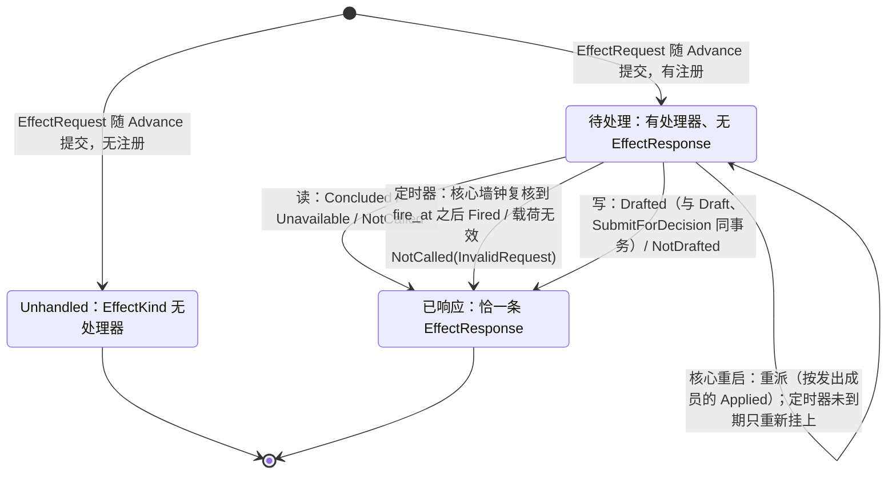

# 出站请求处理器

- **层级与元素**：L3 component，核心进程内的出站请求处理器。
- **上级文档**：[core-process/design.md §4.1 组件指南](design.md#41-组件指南)。
- **决定什么**：程序的副作用怎样离开程序：`EffectRequest` 是唯一出口，程序规则时限 `Expire` 按定义化归为经这个出口发出的定时器请求；谁接手（按 `EffectKind` 注册的读 / 写处理器，读处理器含经一次性读作答的与按核心时钟作答的定时器）；每条请求恰得一条完成事实 `EffectResponse`，它落在哪里、怎样在重启后重派；写请求怎样变成一张单据、以谁为负责人、何时不开单。
- **读者**：核心实现者；程序作者需要知道的对外语义以本文 §4 为准。
- **状态**：已定。
- **非目标**：意图的锚点、参数合规与单据状态机（[ticket.md §3.3 意图构造与锚点：构造不出的不是意图](ticket.md#33-意图构造与锚点构造不出的不是意图)）；程序值、`DecisionStep` 与解释②（[program-host/design.md §3.3 解释②：决策](../program-host/design.md#33-解释②决策)）；`Advance` 输出事务的编排（[program-host-element.md §4.6.2 Advance](program-host-element.md#462-advanceevents-to-cursor--outputeffects-derivations-checkpoint)）；一次性读的执行（[one-shot-read.md §4.1 核心→集成：read](one-shot-read.md#41-核心集成readstream-request-range--answered--unavailable--refused)）；程序怎样声明并接收执行事实输入（[program-host-element.md §3.4 程序的输入](program-host-element.md#34-程序的输入)）。

证据标签与编号前缀的约定见 [README.md §0.4 阅读约定](../../README.md#04-阅读约定)。

## 1 问题域

### 1.1 上级分配给本组件的需求

| 来源 | 内容 |
|---|---|
| P6（[README.md §2.2 机器与域共享的现象](../../README.md#22-机器与域共享的现象)） | 程序的输出是意图与请求，不是对 venue 的直接调用。 |
| H2 | 程序不可信，会输出非法值；它不能拿到一条绕过审批的外部写通道。 |
| C4 | 程序在隔离宿主里运行，副作用只经核心。 |
| Q1、Q8、Q9、Q19、Q25 | 程序的写与人的写得到同一对记录（意图 + 否决）；程序能按自己请求的结果决定下一步；替换或卸载程序之后，已提交请求的处理不随后来的装载者漂移。 |

核心进程分配给本组件的接口（[core-process/design.md §4.3 组件间接口](design.md#43-组件间接口)）：

- 在程序宿主元素编排的 `Advance` 输出事务里写下该批输出的 `EffectRequest` 记录（同事务集合见 [core-process/design.md §4.3.5 同事务集合](design.md#435-同事务集合)）；
- 执行事实唯一写入口中 `EffectRequest` 与 `EffectResponse` 的写者（[core-process/design.md §4.3.4 执行事实的唯一写入口](design.md#434-执行事实的唯一写入口)）。

### 1.2 本组件直接面对的域性质

- **程序不可信**（H2）：请求载荷里的任何值都可能非法或恶意；它只是数据，处理器只按注册的语义处理它。
- **请求流与控制流之间没有可比的序**（[core-process/design.md §3.1 流、位置与三种进度](design.md#31-流位置与三种进度)）：请求记录与开始某个程序成员的 `Applied` 分在两条执行事实流上，不能按位置先后推断“这条请求是哪个成员发出的”。
- **观察记录可压缩，`EffectRequest` 永存**（[observation-journal.md §2.4 保留：边界与删除规则](observation-journal.md#24-保留边界与删除规则)）：一条请求“是否已处理”必须由与请求同寿命的事实回答，不能依赖读结论这类可能落到保留边界下的观察记录。
- **程序值文件由 Alice 写，可被改或删去**（[core-process/design.md §4.6 统一路径文件](design.md#46-统一路径文件)）：处理请求时不能重读它得到发出者的事实。

## 2 驱动

本组件承担的质量场景：Q1（程序看自己的结果）、Q8（非法参数得到意图 + 否决）、Q9（审计可追溯到发出成员）、Q19（负责人不漂移）、Q25（程序代数不随副作用种类膨胀）。场景的六要素定义见 [README.md §3.1 质量场景](../../README.md#31-质量场景)；本组件的响应度量写在 §6.3 各验收项。

## 3 模型

### 3.1 `EffectRequest`：唯一出口，请求是值

```rust
Emit(EffectRequest { effect_kind: EffectKind, payload: Bytes, basis: Basis })   // 程序值里的构造子（解释②）
// 核心 append 的记录另带 member：开始发出成员的 Applied 在控制流上的位置

enum DecisionStep {
    On(Pattern, …),
    Emit(EffectRequest),
    Require(Guard, OnFail),
    Expire(Id, Box<DecisionStep>),   // Id：值树里类型为 UTC 时刻的节点，截止时刻 t；Box<DecisionStep>：到时执行的回调 k
}
```

- 程序需要请求核心不认识的副作用：发通知、拉一次历史 K 线、调外部模型、下单。程序的**唯一出口**是一个 `EffectRequest`，不是对每种副作用各加一个构造子。
- **请求是值，不是调用**（`IO a` 的纪律，[io-shell.md §3.2 IO 壳是效应侧的解释器](io-shell.md#32-io-壳是效应侧的解释器)）。它被 append 为执行事实记录；核心不解释 `payload`。
- **请求不带调用方键**：写请求的键只在发出时由 IO 壳按尝试铸造（[io-shell.md §3.4 调用方键的铸造](io-shell.md#34-调用方键的铸造-设计)）；`EffectRequest` 没有键字段。
- 下单 `trade.place`（写）、发通知 `notify.telegram`（写，对外部世界也是写）、拉历史 `fetch.bars`（读），对程序是同一构造子；区别只在 `EffectKind` 注册了哪一种处理器。
- **`Expire(t, k)` 是一个固定组合，不是新的出口** [设计]：它的语义定义为 `Emit(EffectRequest{effect_kind: timer, payload: {fire_at: t, tag}, basis})` 加上 `On(该 tag 请求的 Fired 响应, k)`。定时器请求由定时器处理器按核心时钟作答（§4.2）；k 是去函数化的回调：一个值，随程序状态存进 `Checkpoint`，由解释②在消费响应时执行，核心与定时器处理器都不执行它。`tag` 由解释器生成，t 的来源、待触发集合与执行 k 的规则写在 [program-host/design.md §3.3 解释②：决策](../program-host/design.md#33-解释②决策)。
  - 理由：程序要在“没有新输入”时也能在某个时刻做事，而宿主进程不读时钟（重放要确定）。把注册做成一条请求，时间就以一条有位置的记录（请求流上的 `EffectResponse{Fired}`）进入程序的输入与 cursor 的重放边界；注册随 `Advance` 输出事务持久化，重启由重派重新挂上（§4.4）。STS 的 `deadline` 计时器不这样做，因为规则状态本就是记录与核心时钟的 fold，重启可按记录重装（[decision-chain.md §3.4 RuleState 是记录的 fold，不另存](decision-chain.md#34-rulestate-是记录的-fold不另存-设计)）；程序状态在 `Checkpoint` 字节里，核心不解释它，只能由一条核心读得懂的请求载荷带上 `fire_at`。
  - 不选：**让作者自己写 `Emit(timer)` + `On(Fired)`**：代数不动，但 tag 冲突与“忘记忽略失效的定时器”都交给了不可信的作者；**`Advance` 另带一个时间输入**：宿主协议多一种输入，时间不在任何记录里，重放要另存它。

为什么：若为每种副作用各加一个构造子，程序的封闭代数就随副作用种类膨胀，突破“构造子膨胀”红线（[program-host/design.md §3.3 解释②：决策](../program-host/design.md#33-解释②决策)）。把副作用的种类推到注册表，`DerivationNode`/`DecisionStep` 就不动。[证据：fp-01 M7 Mercury Workflow]

不选：

- **对每种副作用各加一个 `DecisionStep` 构造子**：代数随副作用膨胀，退化为 Pine-with-limits。

### 3.2 处理器注册表：出现了什么，则做什么

- **响应由处理器决定。** 注册了该 `EffectKind` 的处理器接手。未注册则记录留在日志里为 `Unhandled`：有请求无处理器不是错误，与入站字段无处理器不触发同理（[envelope.md §3.2 处理器字段注册表](envelope.md#32-处理器字段注册表)）。
- **处理器在注册时声明读 / 写。** 读处理器有两种作答来源：经一次性读的读处理器向集成执行一次只读查询（§4.2）；定时器按核心时钟作答，不向外部读，结果只落请求流（§4.2.1）。不另设处理器类别。写处理器把请求当作意图，送进单据 → STS → IO 壳的完整效应路径。
- **两个注册表对称**：入站字段 → 处理器（[envelope.md §3.2 处理器字段注册表](envelope.md#32-处理器字段注册表)）；出站请求 → 处理器（本文）。都是“出现了什么，则做什么”。

### 3.3 发出成员

每条 `EffectRequest` 记下发出它的程序成员 `member`，即开始该成员的 `load_program` 或替换 `Applied` 在控制流上的位置。核心在 `Advance` 的输出事务里写下它：哪个成员在运行是核心自己的控制事实（[program-host-element.md §3.2 成员、活动集合与失败抑制](program-host-element.md#32-成员活动集合与失败抑制)）。

- 该 `Applied` 以值记下成员的事实：装载 principal（该控制动作的 principal）、`facts` 声明的执行事实输入集合、值树引用的原生 op 名集合、输出契约、钉住的内容 hash 与接受的 `state_version` 集合（[program-host-element.md §4.1 load_program(manifest_ref, cold_start?)](program-host-element.md#load_programmanifest_ref-cold_start)）。
- 写处理器与重启重派**只读发出成员的这些事实**，不读当前成员的，也不重读程序值文件。请求可以在发出成员结束之后才被处理（[program-host-element.md §4.4 卸载与替换](program-host-element.md#44-卸载与替换)）；`Applied` 是控制流上的执行事实，成员结束、程序值文件被改或删去之后照样可读。

不选：

- **按处理时的当前成员判定**：替换或卸载之后分派的请求会以另一成员的 principal 开单、按另一份声明判定作用域，卸载之后则无成员可读；
- **按请求与 `Applied` 的位置先后推断成员**：请求流与控制流之间没有可比的序；
- **结束成员之前处理完它的全部请求**：`Unhandled` 请求永远没有响应，在途读没有上界；
- **处理时重读程序值文件**：文件可被改或删去，钉住的 hash 只能发现不符，给不出原内容。

### 3.4 完成事实 `EffectResponse` 与请求流 [设计]

- 每条被处理的 `EffectRequest` 恰有一条执行事实记录 `EffectResponse{request: LogPosition, outcome}`。
- `outcome` 按处理器分，是封闭的 sum：

| 处理器 | `outcome` | 伴随记录（同一事务） |
|---|---|---|
| 读 | `Concluded(conclusion: LogPosition)`：读结论记录，含零条结果与上游拒绝 | 该流上作答的观察记录与读结论记录（[one-shot-read.md §3.1 一次性读的记录](one-shot-read.md#31-一次性读的记录)） |
| 读 | `Unavailable(gap: LogPosition)` | 该流上的 `Gap{origin: Channel}` |
| 读 | `NotCalled(reason)`，`reason ∈ {Unsupported, Unconfirmed, NoSession, InvalidRequest, UnknownTarget}` | 无 |
| 读（定时器） | `Fired`：核心墙钟已到载荷里的 `fire_at`；不带字段，触发时刻就是这条记录自己的记录时间 | 无 |
| 读（定时器） | `NotCalled(InvalidRequest)`：载荷解析不出 UTC 时刻 | 无 |
| 写 | `Drafted(ticket_id)` | 该单据的 `Draft` 与 `SubmitForDecision` |
| 写 | `NotDrafted(Malformed{reason} \| ScopeNotObserved)` | 无 |

- 经一次性读作答的读处理器，`NotCalled` 的五种原因与一次性读对消费方给出的结果一一对应：来源从未有过声明版本与此刻无已建立会话同为 `NoSession`，对应一次性读的 `Unavailable{source_state}`（[one-shot-read.md §3.4 判定顺序先看会话，再看声明](one-shot-read.md#34-判定顺序先看会话再看声明)）。
- **落点**：`EffectRequest` 与它的 `EffectResponse`（全部结果，含 `NotCalled` 与 `NotDrafted`）都在该程序的**请求流**上：按程序 id 各成一条的执行事实流。它们是 UTA 关于这个程序自己生命周期的事实，不属任何来源、lane 或作用域，所以没有有效 lane 或未登记来源的请求也有落点。请求流怎样作为程序的隐含输入投递，见 [program-host-element.md §3.4 程序的输入](program-host-element.md#34-程序的输入)。
- 理由：观察记录可压缩，`EffectRequest` 永存；“是否已处理”必须能从与请求同寿命的事实重建。`Concluded` 引用的读结论记录落到保留边界下后，`EffectResponse` 仍成立，不钉住保留。
- `Unhandled` 请求没有 `EffectResponse`，也不重派。

不选：

- **`EffectRequest` 与 `EffectResponse` 随 lane 流**：没有有效 lane 的 `NotDrafted` 与读请求的响应无处可落。
- **只在返回值里表示完成**：请求随 `Advance` 持久化、处理在其后，没有“返回值”可言；程序与审计都只能读记录。

### 3.5 请求与响应的关联是引用，不是事务

`EffectRequest` 记录随程序 `Advance` 输出持久化，处理器在其后执行。二者的关联是 `EffectResponse.request` 这个位置引用；它们不在同一事务里，也不需要在：

- 核心重启时 fold 出**无 `EffectResponse`** 的已注册请求重派（§4.4）；
- 写处理器的 `Drafted` 与 `Draft` 同事务，所以“有 `Draft` 无 `EffectResponse`”不可达。

核心对程序副作用只保证：写类走两阶段，读类可重试，两类都被记录、都带 `basis`。

### 3.6 不变量

- `Emit(EffectRequest)` 是唯一出口；副作用的种类是注册表的事，程序代数不膨胀。由单一出口构造子保证。
- **写处理器不绕过效应路径**：注册为写处理器即意味着经过规则链（至少授权与预算），不因“只是发个消息”就直通。否则程序拿到一条不经审批的外部写通道，H2 的不可信程序前提被破坏。由处理器注册语义保证。[域 H2]
- 每条被处理的请求恰一条 `EffectResponse`；定时器请求的那一条在核心墙钟到 `fire_at` 之后；写请求至多一张单据。由 `Drafted` 与 `Draft` 同事务、重派只针对无 `EffectResponse` 的请求、定时器只在复核墙钟到点之后 append 保证。
- 写处理器与重派的负责人与作用域判定只取发出成员 `Applied` 所记的事实。由 `member` 字段保证。

不选：

- **让写处理器“轻量”消息直通、不走规则链**：破坏不可信程序前提。

## 4 结构

### 4.1 接口

| 方向 | 对方 | 交换 | 语义 |
|---|---|---|---|
| 被用 | 程序宿主元素 | 一批 `Output` 里的 `Emit` 值 | 在 `Advance` 输出事务内 append `EffectRequest{…, member}`；同一事务的其他参与者见 [core-process/design.md §4.3.5 同事务集合](design.md#435-同事务集合)。宿主协议本身见 [program-host-element.md §4.6 宿主协议](program-host-element.md#46-宿主协议) |
| 使用 | 一次性读 | 一次 `read`，发起方 `Request(该 EffectRequest 的位置)` | 读处理器的执行（§4.2） |
| 使用 | 单据 | `Draft` + `SubmitForDecision` | 写处理器开单（§4.3），与 `EffectResponse{Drafted}` 同一事务 |
| 使用 | 存储 | append 接口 | 写 `EffectRequest`、`EffectResponse`（[storage.md §3 接口](storage.md#3-接口)） |
| 读 | 控制流 | 发出成员的 `Applied` | 负责人与作用域判定（§3.3） |
| 使用 | 核心时钟 | 定时器请求的 `fire_at` | 定时器处理器（§4.2.1）；复核规则见 [core-process/design.md §3.8 基础值类型](design.md#38-基础值类型) |

### 4.2 读处理器

读处理器按 `EffectKind` 有两种作答来源：经一次性读向集成读（本节下列各条），与按核心时钟作答的定时器（§4.2.1）。

- 经一次性读的读处理器立即执行一次核心→集成的 `read`（[one-shot-read.md §4.1 核心→集成：read](one-shot-read.md#41-核心集成readstream-request-range--answered--unavailable--refused)）；同 identity 的在途调用照常并入（[one-shot-read.md §3.2 identity 与并入（只读批处理条件）](one-shot-read.md#32-identity-与并入只读批处理条件)）。
- 集成作答（含上游明确拒绝）时，一次性读在该流上同一事务 append 作答的观察记录与一条读结论记录，出处 `OneShot{origins ∋ Request(该 EffectRequest 记录的 LogPosition), request}`；本组件在同一事务 append `EffectResponse{Concluded}`。
- 程序按位置推进看到作答的记录：闭环走观察侧。
- `Unavailable` → 观察侧 `Gap{origin: Channel}`，本组件同事务 append `EffectResponse{Unavailable}`。
- 核心不调用集成的情形（来源未登记或不是集成来源、来源从未有过声明版本、来源无当前会话、流不在会话有效声明里、会话有效声明对该流为 `Unsupported` 或 `Unknown`、请求不合 schema；判定顺序见 [one-shot-read.md §3.4 判定顺序先看会话，再看声明](one-shot-read.md#34-判定顺序先看会话再看声明)）不调用、不 append 观察记录，本组件单独 append `EffectResponse{NotCalled(reason)}`。
- 读处理器**不自行重试**：一条请求一次执行，是否再请求由程序看到结果 / gap 后决定。读可重试的主体是发起者（[core-process/design.md §3.7 读副作用与写副作用](design.md#37-读副作用与写副作用)）。

#### 4.2.1 定时器处理器 [设计]

定时器是读处理器：它不改变世界，只让请求流上多一条记录并唤醒程序；重做无害，结果总可判定（[core-process/design.md §3.7 读副作用与写副作用](design.md#37-读副作用与写副作用)）。

- **载荷**：`{fire_at: UTC 时刻, tag}`。`tag` 由解释器生成（§3.1），本处理器不解释它。
- **分派**：载荷解析不出 UTC 时刻 → append `EffectResponse{NotCalled(InvalidRequest)}`。否则挂一个内存唤醒：按单调钟等待；醒来、或分派时 `fire_at` 已过，按核心 UTC 墙钟复核：墙钟 ≥ `fire_at` 即 append `EffectResponse{Fired}`，否则重新挂上（复核规则见 [core-process/design.md §3.8 基础值类型](design.md#38-基础值类型)）。已过去的 `fire_at` 合法，分派即触发。
- **不接触外部**：不调用集成、不开单据、不写观察记录；结果只落该程序的请求流（§3.4）。
- **`Fired` 不带字段**：触发时刻就是这条 `EffectResponse` 自己的记录时间，`fire_at` 在它指回的请求载荷里。不变量：`Fired` 的记录时间 ≥ `fire_at`。
- **不提供取消**：一条定时器请求一经提交，到点就触发；发出成员已被替换或卸载之后照样触发（§3.3）。已失效的定时器由程序按自己的状态处理（[program-host/design.md §3.3 解释②：决策](../program-host/design.md#33-解释②决策)）。
- **生命周期**：内存唤醒是本核心实例内的执行资源：开始于分派，结束于 `Fired` 或 `NotCalled` 的 append，或本实例结束；不写结束锚点记录。受控停止第 1 步撤去它，不等 `fire_at`（[core-process/design.md §4.7.4 受控停止](design.md#474-受控停止-设计)）；下一实例启动第 4 步由重派重新挂上（§4.4）。请求本身跨实例持续。
- **预算**：定时器请求是 `Output.effects` 里的一条 `EffectRequest`，计入程序的意图速率预算（[program-host-element.md §4.6.4 预算](program-host-element.md#464-预算)）。
- 理由（为什么归读处理器）：它符合读副作用的全部性质，重派规则“读处理器重新执行一次”直接适用，读 / 写两分与“写处理器不绕过效应路径”都不用改。
- 不选：**另设第三类“本地处理器”**：处理器注册表、重派规则与不变量都要为它另写一份，语义上并不比“读”更准确。

### 4.3 写处理器 [设计]

请求被当作意图，进入单据 → STS → IO 壳的完整效应路径；结果是执行事实与决议记录。按下列顺序判定，每步只读 UTA 自己的事实：

1. **构造**：从请求载荷构造意图，只要求意图的锚点（`WriteLaneKey`、交易协议的操作种类之一、`basis`，撤单 / 改单还要 `target`；平仓的 `target` 由核心从 `basis` 所指的持仓观察记录构造）。锚点构造不出即不是意图，不开单，记 `NotDrafted(Malformed{reason})`。构造规则的完整定义与各种构造不出的情形见 [ticket.md §3.3 意图构造与锚点：构造不出的不是意图](ticket.md#33-意图构造与锚点构造不出的不是意图)。参数（守卫字段与载荷）不在构造时判定：参数是否合规是单据 fold 的状态，送审时由输入约束步否决（[ticket.md §3.4 参数合规：意图参数 schema](ticket.md#34-参数合规意图参数-schema-设计)、[decision-chain.md §4.2 顺序固定链：授权 → 输入约束 → 审批 → lane → 过期](decision-chain.md#42-顺序固定链授权--输入约束--审批--lane--过期)），所以程序发出的非法参数与人起的非法参数得到同一对记录（意图 + 否决，Q8）。
2. **作用域判定（构造规则）**：意图的 `WriteLaneKey` 所属的 `(来源, 作用域)` 不被发出成员的 `Applied` 所记的任何执行事实输入选中时，不开单，记 `NotDrafted(ScopeNotObserved)`。它在 `Malformed` 判定之后，只由 UTA 自己的事实（发出成员的 `Applied` 与请求锚点）判定，所以程序不会写进一个自己看不到结果的作用域。选中的含义与执行事实订阅同一个 selector（[subscription.md §3.1 订阅与项](subscription.md#31-订阅与项)）。
3. **开单**：以**发出成员的装载 principal** 为 `responsible` 开单。程序本身不是 principal；该 principal 的授权范围决定单据能否不经人工直接放行（[decision-chain.md §4.2 顺序固定链：授权 → 输入约束 → 审批 → lane → 过期](decision-chain.md#42-顺序固定链授权--输入约束--审批--lane--过期)）。
   - `Draft.basis` 含该 `EffectRequest` 记录的位置：执行事实侧位置作因果依据（[core-process/design.md §3.6 basis：方向、基数、可追溯性](design.md#36-basis方向基数可追溯性)）。
   - 程序意图没有编辑期：同一事务 `Draft` 并 `SubmitForDecision`，单据直接进入 `AwaitingDecision`；同一事务 append `EffectResponse{Drafted(ticket_id)}`。
   - 之后的退回、改写、移交由该 principal 经单据组进行（[ticket.md §4.3 单据组（核心↔解释层）](ticket.md#43-单据组核心解释层)），与人起的单据无异。

理由（作用域判定）：`NotCalled` 与 `NotDrafted` 都不产生观察记录，程序只有经响应才看得到它们，而伪造观察记录去承载它们会把效应侧结论放进观察宇宙；程序若要组合多次写（例如先撤单、确认后再下单，[ticket.md §4.5 交易协议：操作种类、目标、可执行性、检查目录](ticket.md#45-交易协议操作种类目标可执行性检查目录-交易协议)），它自己的尝试有没有结局只能从它声明的执行事实输入得知。写进未声明的作用域，结局就永远到不了程序。

### 4.4 重启重派

核心重启时 fold 出无 `EffectResponse` 的已注册请求（崩溃 #21，[core-process/design.md §5.2 崩溃矩阵（#1–#21）](design.md#52-崩溃矩阵121)）：

- 读处理器重新执行一次；定时器由此重新挂上唤醒：`fire_at` 已过即 append `Fired`，未到期则重启本身不产生响应；
- 写处理器重新开单。`NotDrafted` 已是响应，不重派；
- 重派同首次分派一样按发出成员的 `Applied` 所记事实开单与判定作用域；发出成员此后已被替换或卸载、程序值文件已被改或删去时亦然；
- `Unhandled` 请求不重派。

### 4.5 一条请求的状态（fold，不另存）



## 5 走查

本节只走本组件内部的步骤；各场景的组件级主 trace 在 [core-process/design.md §5.1 W1（Q1）正常下单闭环](design.md#w1q1正常下单闭环) 等处。

**W1 步 1–3 的出站处理器细化。** 程序 `Emit(EffectRequest{trade.place, basis, …})`，随 `Advance` 输出事务提交，记录带 `member`。写处理器接手：锚点构造成功 → 意图的 `(来源, 作用域)` 在发出成员所记的执行事实输入之内 → 同一事务 `Draft{responsible = 装载 principal, basis ∋ 请求位置}`、`SubmitForDecision`、`EffectResponse{Drafted(ticket_id)}`。对外：事务提交后读模型 `tickets` 看到一张 `AwaitingDecision` 单据；程序在请求流上读到 `Drafted`，再在它声明的执行事实输入上按 `ticket_id` 找到 `Close(Prepared(p))`、按 `p` 认出尝试的记录（[program-host/design.md §3.3 解释②：决策](../program-host/design.md#33-解释②决策)）。请求流与 lane 流之间不定投递顺序：`Draft` 与 `Drafted` 同事务提交，程序可能先看到单据记录、后看到 `Drafted`，解释②按 `ticket_id` 两种次序都能匹配（[delivery.md §3.2 投递的单位与次序](delivery.md#32-投递的单位与次序)）。

**W17 的读处理器细化。** 程序 `Emit(EffectRequest{fetch.bars, …})`。读处理器经一次性读发 `read`；集成作答 → 同一事务：观察记录（`one_shot`）、读结论记录、`EffectResponse{Concluded}`。程序在观察输入上按位置看到这些记录；集成 `Unavailable` → `Gap{Channel}` + `EffectResponse{Unavailable}`；流 `Unsupported` → 只有 `EffectResponse{NotCalled(Unsupported)}`。

**W18 程序变体。** 程序 `Emit` 参数不合 schema 的下单：构造成功（参数不在构造时判定）→ 开单 → 输入约束步否决，程序在请求流上看到 `Drafted`、在执行事实输入上看到 `Rejection` 与 `Close(DecisionRejected)`。载荷缺 `WriteLaneKey`：`EffectResponse{NotDrafted(Malformed)}`，不开单、重启不重派。

**程序规则时限的出站细化（W1、W17 的时限变体）。** 程序的一次 `Advance` 里某条规则走到 `Expire(t, k)`，t 求得 10:00:30。输出事务里出站请求处理器 append `EffectRequest{timer, {fire_at: 10:00:30, tag: 7}, member}`；提交之后分派，定时器处理器挂上唤醒。期间该程序没有任何新输入。10:00:30 墙钟复核到点，append `EffectResponse{request: 该请求的位置, Fired}`，记录时间 10:00:30.004。它是程序的隐含输入，程序宿主元素把它组进下一次 `Advance`（[program-host-element.md §5.6 程序规则时限（W1、W17 的时限变体）](program-host-element.md#56-程序规则时限w1w17-的时限变体)）。变体：10:00:10 核心崩溃，重启第 4 步重派，10:00:30 之前不产生响应，到点照常 `Fired`；重启时已过 10:00:30 则分派即 `Fired`。

**崩溃 #21 的恢复细节。** `EffectRequest` 已提交、`EffectResponse` 未持久化时崩溃：重启 fold 出它（无 `EffectResponse`）→ 按 `member` 所指 `Applied` 重派；若崩溃前后发出成员已被替换或卸载、程序值文件已被改或删去，负责人仍是该 `Applied` 的装载 principal，作用域仍按它所记的执行事实输入判定；写请求至多一张单据，因为 `Drafted` 与 `Draft` 同事务。

**定时器的崩溃细节。** 定时器请求已提交、`Fired` 未 append 时崩溃：同 #21，重启重派即重新挂上，`fire_at` 在载荷里，不随重启漂移。`Fired` 已 append、程序消费它的 `Advance` 未提交时崩溃：`Fired` 在请求流上，程序订阅的 cursor 没有越过它，下一次 `Advance` 重新交出；这一次计算重做，但定时器不重复触发（请求已有响应，不再重派）。

**替换之后分派（验收 #85 的路径）。** P 装载的成员 A 在一次 `Advance` 里发出作用域 S、T 与一个构造不出的写请求；分派之前 Q 以另一成员替换 A。分派时三条请求都读 A 的 `Applied`：S → `Drafted`，负责人 P；T → `NotDrafted(ScopeNotObserved)`；构造不出的 → `NotDrafted(Malformed)`，不经作用域判定。

**卡点。** 走查中没有停在本组件之内的步骤。上述路径依赖的外部事实：`member` 由程序宿主元素在输出事务中提供位置，本组件只 append；执行事实输入的“选中”与订阅同一 selector 规则；`tag` 与回调由解释②持有。三者在对应文档里定义，本组件只读或只搬运。

## 6 评估

### 6.1 权衡

- **程序经声明的执行事实输入看自己的结果**（本文 §4.3、[program-host-element.md §3.4 程序的输入](program-host-element.md#34-程序的输入)）：没有宿主侧的关联索引，写到未声明作用域的请求在开单前就得 `NotDrafted(ScopeNotObserved)`；代价是声明作用域里其他 principal 的单据与尝试同样投给程序、唤起 `Advance`、计入程序预算（Q25）。这是接受的代价。
  - 不选：**宿主按锚点动态关联、只投递程序自己的单据与尝试**：宿主要按已看到的 `EffectResponse` 维护一份可达集合决定投递资格，是一个新的关联索引机制（[README.md §1.2 权威源头与生命周期](../../README.md#12-权威源头与生命周期)“机制即信号”）；**为程序另设结果订阅种类**：同一事实两条投递路径；**只给 `EffectResponse`**：程序看不到尝试的结果；**把撤单结果当作目标的结果**：把一次撤单请求的受理当作原单已结束（[io-shell.md §4.5 对账驱动](io-shell.md#45-对账驱动)）。
- **代价：定时器的记录与唤醒不回收**（§4.2.1）：请求流不压缩，每个定时器永久留下两条记录；`fire_at` 很远的定时器，每次核心重启都要在第 4 步 fold 出来重新挂上；不提供取消，失效的定时器照样触发、唤起一次 `Advance`、计入预算。意图速率预算限制它们的产生速度，不限制累计量。
- **敏感点：墙钟前跳**：单调钟仍按原间隔唤醒，`Fired` 可能晚于墙钟到点的时刻；回拨只会让复核后重新等待，不会提前触发（[core-process/design.md §3.8 基础值类型](design.md#38-基础值类型)）。

### 6.2 证伪条件

本组件的决定没有单独的证伪条件；程序表示整体的证伪见证伪 #1（[core-process/design.md §6.2 证伪条件](design.md#62-证伪条件)）。

### 6.3 验收

62. **程序看得到自己写请求的结果**（本文 §4.3、[program-host-element.md §3.4 程序的输入](program-host-element.md#34-程序的输入)）：（对应 Q1/Q25）
    - 程序声明执行事实输入 `(X, S)` 后 `Emit` 一个写到作用域 S 的请求：它的请求流上先有该 `EffectRequest`、后有 `EffectResponse{Drafted}`；声明的执行事实流上投来该单据的 `Close` 与尝试的 `SendBarrier`/`VenueAccepted`/`VenueRejected`/`NotSent`/`Undetermined`/`ResolutionEvidence`/`ReconciliationReopened`/`Abandoned`；解释②按 `ticket_id` 与 `p` 认出它们，单据记录先于 `Drafted` 投到时同样认出；
    - 同一程序写到未声明的作用域 T：`EffectResponse{NotDrafted(ScopeNotObserved)}`，无 `Draft`、无单据；以 `NotCalled` 结束的读请求的响应同样在请求流上；
    - 声明作用域里另一 principal 的单据与尝试同样投给程序（唤起 `Advance`、计入其预算），它们的 `ticket_id` 与 `p` 不在该程序的 `Drafted` 与 `Close(Prepared)` 所给之内；宿主进程与投递不读任何记录的内容来决定投递；
    - 在 `Advance` 提交之后、结果到达之前重启：程序从 `Checkpoint` 与同事务的 cursor 续跑，恰收到之后的结果各一次；`cold_start` 的 `Reset` 之后全部输入 cursor 按声明的起点重建，与 `ProgramReset` 同事务。
85. **请求按发出成员处理**（本文 §3.3、§4.4、[program-host-element.md §4.4 卸载与替换](program-host-element.md#44-卸载与替换)、崩溃 #21）：以 fixture 推迟出站请求处理器的分派：（对应 Q9/Q19/Q25）
    - principal P 装载声明执行事实输入 `(X, S)` 的程序 A；A 的一次 `Advance` 发出三个写请求：作用域 S 的、作用域 T 的、锚点构造不出且作用域为 T 的。三条 `EffectRequest` 的 `member` 都是 P 的 `Applied` 位置；
    - 该输出事务提交之后、分派之前，principal Q 以声明 `(X, T)` 的新程序替换 A；替换的 `Applied` 之后分派：S 的得 `Drafted`，单据负责人为 P；T 的得 `NotDrafted(ScopeNotObserved)`；构造不出的得 `NotDrafted(Malformed)`，不经作用域判定；
    - 同一场景改为 `unload_program`：三条请求照常分派，结果同上；
    - 在 `EffectRequest` 提交之后、`EffectResponse` 持久化之前注入核心崩溃，重启之前改写或删去 A 的程序值文件，再以 Q 替换或卸载：重启后重派的结果、负责人与判定同上，每条请求恰一条 `EffectResponse`，写请求至多一张单据。

效应路径唯一（代码中不存在第二条到集成写接口的调用路径）的验收见 [core-process/design.md §6.3 验收 #10](design.md#63-验收标准)。
