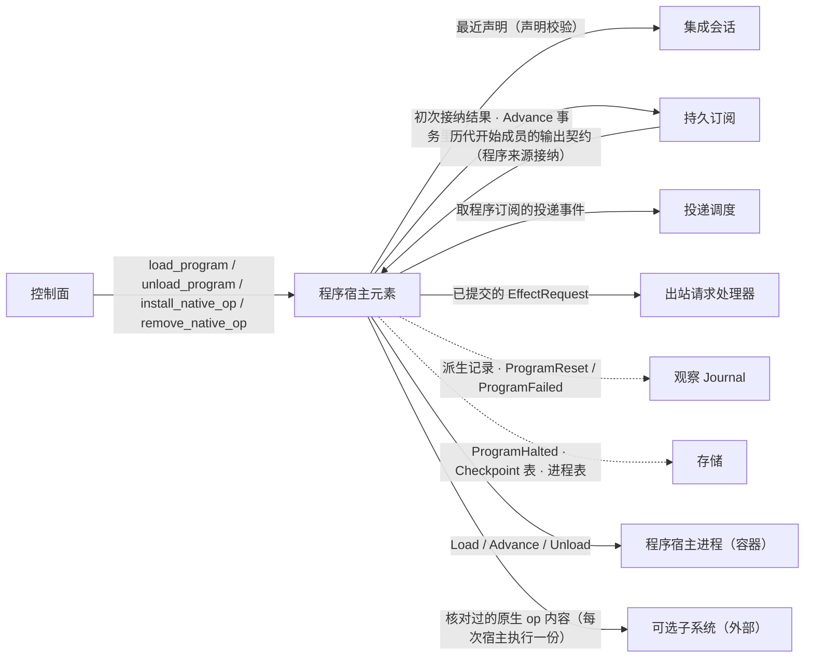
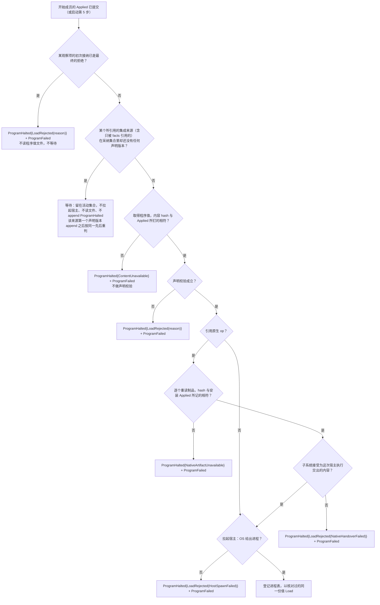
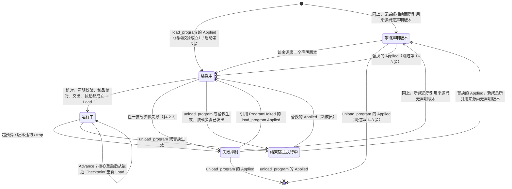
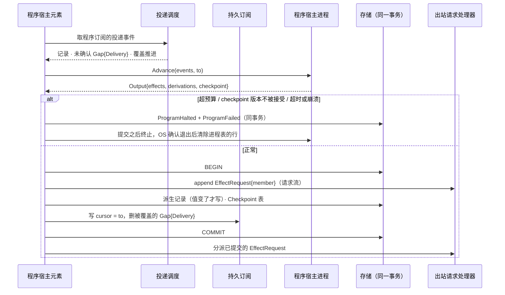

# 程序宿主元素

## 0 定位

- **层级与元素**：L3 component，核心进程里的**程序宿主元素**。它不属观察侧也不属效应侧（[core-process/design.md §4.1 组件指南](design.md#41-组件指南)）。
- **上级文档**：[核心进程](design.md)（L2）。它把宿主协议、程序的控制动作与核心↔可选子系统接口分配给本组件（[core-process/design.md §4.2 对外接口总表](design.md#42-对外接口总表)）。
- **本文决定**：
  - 程序作为核心的运行单元是什么：程序值、成员、活动集合、失败抑制、已安装原生 op 集合；
  - 控制动作 `load_program`、`unload_program`、`install_native_op`、`remove_native_op` 的完整规格；
  - 装载期校验的两段及其先后，卸载与替换，程序流的 epoch，`Reset` 与状态迁移，预算；
  - 核心↔程序宿主进程的宿主协议 `Load` / `Advance` / `Unload`；
  - 核心↔可选行情派生计算子系统的接口：`Pooled`、原生 op 的安装与每次宿主执行前的交出。
- **读者**：实现核心进程的工程师；实现程序宿主进程的工程师（按本文 §4.6 实现宿主一端）；可选子系统的作者（按本文 §4.7 实现子系统一端）。审批者：仓库维护者。
- **状态**：已定。
- **非目标**：
  - 宿主进程内部的解释器、增量引擎与决策解释，在[程序宿主进程](../program-host/design.md)；
  - 程序订阅的项与 cursor 怎样建立、沿用与结束，在 [subscription.md §4.7 程序订阅](subscription.md#47-程序订阅)；
  - 投递事件怎样从存储与订阅表取出，在 [delivery.md §4.4 程序订阅投递事件的取得](delivery.md#44-程序订阅投递事件的取得)；
  - `EffectRequest` 的分派、处理器与重派，在 [outbound-requests.md §3.2 处理器注册表：出现了什么，则做什么](outbound-requests.md#32-处理器注册表出现了什么则做什么)；
  - 子系统的实现（布局、IPC、段生命周期），在 [hpc-derivation/design.md](../../hpc-derivation/design.md)。本文只拥有核心一侧的接口。
- 证据标签与编号约定见 [README.md §0.4 阅读约定](../../README.md#04-阅读约定)。

## 1 问题域

### 1.1 分配给本组件的需求与契约

| 来源 | 内容 | 本组件承担的部分 |
|---|---|---|
| C4、H2（[README.md §2 问题域](../../README.md#2-问题域)） | 程序不可信；超预算被隔离，不影响其他程序、账户与核心 | 预算检查、失败抑制、宿主进程的拉起与终止 |
| P12 | 程序的行动者身份 = 程序制品 hash + 装载 principal | `load_program` 的 `Applied` 以值记下这两者 |
| H9、C14 | 程序状态跨重启不丢、版本演进显式 | `Checkpoint` 与 `state_version` 的契约 |
| C7 | 程序不接触凭据 | 宿主不接触 SQLite 与凭据 |
| Q17、Q23、Q24、Q25、Q30 | 见 §2 | 见 §2 |
| 核心↔宿主契约 | `Load` / `Advance` / `Unload`，程序值的规范序列化 | §4.6 |
| 核心↔解释层契约（控制组） | 四个程序与原生 op 的控制动作 | §4.1；控制组的共同部分见 [control-plane.md §4.2 共同流程](control-plane.md#42-共同流程) |
| 核心↔可选子系统契约 | `Pooled`、原生 op 的安装与每次交出 | §4.7 |
| 核心↔Alice 文件契约 | 程序装载清单、程序值文件、原生计算制品目录的内容 | §4.8；统一路径、写者与原子替换见 [core-process/design.md §4.6 统一路径文件](design.md#46-统一路径文件) |

### 1.2 本组件直接面对的域

- **程序宿主进程（OS 进程）**。拉起可能失败：OS 可能给不出进程。进程可能随时异常退出。它是否已退出只有 OS 能确认。CPU 时间与内存只能由 OS 进程机制限制（rlimit / job object）。[设计]
- **Alice 写的文件**。装载清单、程序值文件与原生计算制品都是 Alice 写的目录，核心只读。它们随时可能被改或删去，核心无法阻止（[core-process/design.md §4.6 统一路径文件](design.md#46-统一路径文件)）。
- **可选子系统**。它可能不在本实例里。它在时也可能联系不上、拒绝接收交出，或迟迟不回答。它是否接受一次交出，只有它自己是源头。核心没有它时必须完整可运行。
- **集成来源的声明**。程序引用的集成来源可能已在采纳集合里，却还没有任何声明版本（新登记、尚未握手成功）。声明的源头是集成会话（[integration-session.md §3.6 声明的两种解释](integration-session.md#36-声明的两种解释-设计)）。
- **订阅表**。程序订阅的接纳结果、cursor 与投递缺口的源头是持久订阅（[subscription.md §4.7 程序订阅](subscription.md#47-程序订阅)）。本组件只请求，不写订阅表。

## 2 驱动

| Q | 本组件的响应 | 响应度量 |
|---|---|---|
| Q25 | 超预算、trap、内容不符、装载失败只使该程序进入失败抑制，跨重启保持，只由显式重装解除 | 验收 #15（三 OS，在[程序宿主进程](../program-host/design.md)）、#16、#82、#86 |
| Q17 | 核心在任何点崩溃，程序从最近已提交的 `Checkpoint` 与同事务的 cursor 续跑，不重复 `Emit`，不重复 `Reset` | 验收 #16、#86 |
| Q23 | 装载校验只凭程序值与所引用集成来源的最近声明，不等会话、不等别的程序 | 验收 #76、#83 |
| Q24、Q30 | 没有子系统时含 `Pooled` 或原生 op 的程序在装载期被拒，其余程序不受影响；子系统只运行核心核对过、为这次宿主执行交出的内容 | 验收 #7 |

## 3 模型

### 3.1 程序值

程序是 **deep embedding 的小闭合值**，节点即值树（[core-process/design.md §3.12 组合子值树与五个 fold](design.md#312-组合子值树与五个-fold)）。程序值的五个部分：

```rust
struct Program   { nodes: Vec<DerivationNode>, rules: Vec<DecisionStep>, inputs: Vec<InputDecl>, facts: Vec<FactDecl>, outputs: Vec<Output> }
struct InputDecl { name: InputName, source: Source, stream: StreamName, subjects: Option<Set<Subject>>,
                   usage: Usage, mode: Consume, wait: Option<WaitWindow>, start: Start }
    // 观察输入声明，Input(name) 节点指名它；source 只能是 Integration(_)；同一 (source, stream) 至多一个 InputDecl；
    // subjects 无 = 整条流；wait 是该输入的等待窗口，无则不按时间截止，只与 Ordered、Latest 同用
enum Usage   { Supply, DeliveryOnly }                         // 缺省 Supply；与消费方订阅项的用途及接纳规则相同
enum Consume { AwaitAll(RequirementPoint), Ordered, Latest }  // 三种消费方式；await-all 带要求点
enum Start   { Tail, Origin }                                 // 输入的起点策略，缺省 Tail；不是 cursor 的 Start{from} 分支
struct FactDecl  { source: IntegrationId, scope: Option<WriteScope>, start: Start }
    // 执行事实输入声明：执行事实订阅的 selector (来源, WriteScope?) 加它的起点，解释②读它
struct Output    { name: StreamName, node: Id }               // 输出声明：节点 node 的值导出到该程序的流 name
```

- `DerivationNode` 与 `Field`、`Input(name)`、`Op1(Field(name), i)` 等构造子，以及“输出类型”fold，定义在 [core-process/design.md §3.12 组合子值树与五个 fold](design.md#312-组合子值树与五个-fold)。`DecisionStep` 与 `EffectRequest` 的形状在 [outbound-requests.md §3.1 EffectRequest：唯一出口，请求是值](outbound-requests.md#31-effectrequest唯一出口请求是值)。
- 三种消费方式与等待窗口的语义在 [delivery.md §3.1 三种消费方式（投递侧）](delivery.md#31-三种消费方式投递侧)。`await-all` 的覆盖证据在 [subscription.md §3.6 序号覆盖](subscription.md#36-序号覆盖)。
- 程序自己的请求流是隐含的输入，不在任何声明里，起点为 `Tail`（§3.4）。
- **程序可见的时间只来自记录** [设计]：程序值里没有“此刻”。程序看得到的时间有两种，都是记录上的：经记录时间访问器读到的输入记录的记录时间（[core-process/design.md §3.12 组合子值树与五个 fold](design.md#312-组合子值树与五个-fold)）；请求流上定时器请求的 `EffectResponse{Fired}` 的到达（它自己的记录时间就是触发时刻，[outbound-requests.md §4.2 读处理器](outbound-requests.md#42-读处理器)）。程序规则时限 `Expire(t, k)` 由后者驱动（§4.6.2）。
- **规范序列化形式** [设计]：程序值不编译。“编译单元”就是值代数的规范序列化形式：按 schema 校验的 JSON 值树，与 `Program { nodes, rules, inputs, facts, outputs }` 一一对应。节点对 `DerivationNode`，决策步对 `DecisionStep`，观察输入声明对 `InputDecl`，执行事实输入声明对 `FactDecl`，输出声明对 `Output`。任何面向 AI 的文本糖都编译到同一值，且不是核心的一部分。表达力不足时加构造子（[core-process/design.md §3.12 组合子值树与五个 fold](design.md#312-组合子值树与五个-fold)）。
- 同一个程序值有两种解释：解释①（派生）与解释②（决策），在宿主进程里求值（[program-host/design.md §3.2 解释①：派生](../program-host/design.md#32-解释①派生)、[program-host/design.md §3.3 解释②：决策](../program-host/design.md#33-解释②决策)）。两种解释的消费约束在 [core-process/design.md §3.4 两个类型宇宙与唯一边](design.md#34-两个类型宇宙与唯一边)。

**为什么是值而不是黑盒函数。** 值代数可预算、可静态检查，状态由结构本身保证可序列化（[core-process/design.md §3.12 组合子值树与五个 fold](design.md#312-组合子值树与五个-fold)）。不选：黑盒函数 `(State, Input) -> (State, Output)`：无法预算、无法静态检查，状态可序列化只靠作者承诺。

### 3.2 成员、活动集合与失败抑制

- **程序成员** [设计]：一个程序 id 在一段时间内按一份钉住的内容运行，就是一个成员。开始锚点是 `load_program` 的 `Applied`（首次装载、卸载后再装载，或替换）。结束锚点是 `unload_program` 的 `Applied`，或替换它的那条 `Applied`。确认者是控制面。成员不嵌在核心实例里，跨实例持续（[core-process/design.md §4.7.2 生命周期与嵌套](design.md#472-生命周期与嵌套)）。
- **成员事实**：开始成员的 `Applied` 以值记下：
  - 装载 principal（该控制动作的 principal）；
  - 程序值的内容 hash；
  - 预算；
  - 接受的 `state_version` 集合；
  - `facts` 声明的执行事实输入集合（各 `FactDecl`）；
  - 值树引用的原生 op 名集合；
  - 输出契约（§3.3）；
  - 替换时另记所沿用的 `Checkpoint`（位置或无）；解除失败抑制时另带被解除的 `ProgramHalted` 位置。

  后三类成员事实（执行事实输入、原生 op 名、输出契约）从同一次读到的程序值取出，不依赖任何来源的声明与子系统。它们是核心在这一控制动作里定下的事实，不是程序值的副本：程序值文件之后可被改或删去，而下列读者在成员结束之后仍要读它们：
  - 成员发出的请求仍按发出成员的事实处理（[outbound-requests.md §3.3 发出成员](outbound-requests.md#33-发出成员)）；
  - 替换的沿用判定与程序来源的订阅接纳要读已结束成员的输出契约（§3.3）；
  - `remove_native_op` 的 `InUse` 判定要读活动成员引用的原生 op 名，而等待中与失败抑制中的成员从未或不再读程序值文件。
- **活动集合**：控制流上 `load_program` / `unload_program` 的 `Applied` 的 fold（含替换）（[core-process/design.md §4.5 持久化视图](design.md#45-持久化视图)）。改装载清单或程序值文件本身不改变它。
- **失败抑制**：执行事实 `ProgramHalted{program, reason}` 断言核心不再自动装载该程序。它跨核心重启保持。只有以位置引用它的 `load_program` `Applied` 能解除它。被抑制的程序仍在活动集合里：它的程序订阅与 `Checkpoint` 的保留引用都不结束，重新装载时交回 `Checkpoint`。同一事务的程序观察 `ProgramFailed{reason}` 只供展示。
- **已安装 op 集合**：控制流上 `install_native_op` 与 `remove_native_op` 的 `Applied` 的 fold。每个名字至多一个已安装的 op：以它为名、其后没有被 `remove_native_op` 移除的那条 `install_native_op` `Applied` 所记的签名、引用与内容 hash。没有另存的一份。
- **宿主执行**：成员在一个核心实例里的一次运行，是成员与核心实例两者的内层（[core-process/design.md §4.7.2 生命周期与嵌套](design.md#472-生命周期与嵌套)）。成员引用原生 op 时，宿主执行从子系统接受这次交出开始；否则从拉起宿主开始。它结束于：
  - `Unload` 或终止之后 OS 确认宿主退出；
  - 拉起未成；
  - 卸载、替换或受控停止时交出已被接受而不再拉起；
  - 实例崩溃（结束锚点是继任者的 fence 事务）。

  每个成员在每个核心实例里至多一个宿主进程。

**为什么活动集合与失败抑制由控制流承载。** 与集成的 `Halted` 同理（[integration-session.md §4.6 会话状态机](integration-session.md#46-会话状态机)）：“重启不自动重试”要由不压缩的执行事实承载，观察记录可被压缩；活动集合只能有一个源头，清单是目录，不是状态；只存清单引用而不钉内容，重启就可能在同一引用下装载另一份程序。不选：
- **以装载清单为活动集合**：清单与控制记录成为两个源头，重启装载哪些程序取决于重启时刻文件的样子；
- **由 `ProgramFailed` 观察 fold 出失败状态**：重启正确性依赖可压缩的观察记录；
- **核心另存一份程序值**：程序值的源头是作者的文件，钉住 hash 足以发现它变了，复制一份是没有实测需要的近处副本。

### 3.3 输出契约与程序流

- **输出由 `outputs` 声明**：每个 `Output` 把节点 `node` 的值导出到流 `(Program(id), name)`（`Source` 见 [core-process/design.md §3.1 流、位置与三种进度](design.md#31-流位置与三种进度)）。其余节点的值是程序内部的，不落任何流。alert 本质上是派生观察，与外部观察同形。
- **输出契约**是 `outputs` 每项的 `(name, 值类型)`。值类型由“输出类型”fold 从 `Output.node` 求出，只由程序值本身求得：
  - 字段的类型取访问器的类型标签；
  - 原生 op 的结果类型取值树里它的引用所带的声明类型（§4.7.6）。

  两者都不取任何声明或子系统状态，所以开始成员的 `Applied` 在来源还没有声明版本时也能以值记下输出契约。结构校验在 `Applied` 之前拒绝输出契约无定义的程序值（§4.2.1），所以每条 `Applied` 记下的输出契约都有定义。
- **输出记录是节点的当前值** [设计]：一条程序流在一个流 epoch 内承载 `Output.node` 的当前类型化值。它的 `fold_state` 就是这个值：该流 epoch 最新一条值记录的正贡献（fold 规则见 [observation-journal.md §2.3 程序流的 fold](observation-journal.md#23-程序流的-fold-设计)）。每次 `Advance` 的输出事务按该节点在这批推进之后的值写：
  - 本流 epoch 第一次有定义的值：写一条记录，只含这个值的正贡献。每个流 epoch 由此开始，新 epoch 不撤回上一 epoch 的值。
  - 值变了：写一条记录，原子地撤回此前仍生效的那个贡献（`neg`，指名它所在的位置），并加入新值的正贡献。
  - 值按其类型的语义相等：不写记录。这批推进的其余结果照常提交。
  - `Window` 节点导出的是它在这批推进之后的完整值，不是逐元素各一条记录。
  - 记录里的值按 `V` 公开的类型化值编码写出：与值树里 `Const(V)` 的 `V` 同一 schema，不带 `Const` 包装。`Window` 的值是它的各元素值按位置先后排成的序列。字节级的规范化由随 release 发布的 IDL 定形。
  - 记录不带 `subject`，所以程序流只能按整条流订阅（[subscription.md §4.1 核心↔解释层：订阅组与 rewind_cursor](subscription.md#41-核心解释层订阅组与-rewind_cursor)）。
  - 写“值变了”的记录所需的此前仍生效的值与位置，本组件从流上读出：当前流 epoch 的最新一条值记录。核心重启与沿用旧状态的替换之后也这样读，不另存一份。一条记录的形状是它自己的性质：只含正贡献的是本流 epoch 的首个值，撤回加新值的是一次改变。压缩时每个流 epoch 在保留边界之下的最新一条原样留作基线，不改写任何记录（[observation-journal.md §2.4 保留：边界与删除规则](observation-journal.md#24-保留边界与删除规则)），留作基线的改变记录仍是改变记录。
- **每条输出记录带 `basis`**：同一事务提交的该程序各输入的 cursor。提交的 `Advance` 已使各 cursor 都是 `At`（§4.6.2），所以 `basis` 是位置集。`basis` 契约 [设计]：每条输出记录的值，是程序对到 `basis` 为止实际投递给它的记录求得的值。下面两条都成立时，这个值等于程序对各输入流到 `basis` 为止的前缀求得的值，两份实现在同样的输入推进完之后给出相等的值：
  - (a) 值树的每个节点都是各输入前缀的函数：没有 `Scan` 或 `Window` 作用在依赖不止一个输入的节点上。这是值树的静态性质，只看程序值即可判定。
  - (b) 到 `basis` 为止的前缀里，没有任何输入有 `Gap{origin: Delivery}`（含 `latest` 输入的 `conflated`），也没有被跳过的等待窗口区间。

  任一条不成立时，值还取决于记录跨流投递给程序的交错次序，以及投递给它的这些缺口。跨流的投递次序不在契约里（[delivery.md §3.1 三种消费方式（投递侧）](delivery.md#31-三种消费方式投递侧)）。设计写明这种依赖，不为它另定次序。修正不改写已有位置：迟到记录使值改变时，照上面的“值变了”写一条新记录，撤回旧贡献；引用被撤回贡献的 `basis` 随之为 `Retracted`（[ticket.md §3.5 第一层：依据有效性 basis_validity](ticket.md#35-第一层依据有效性-basis_validity)；W16）。
- **`Advance` 的分批不在契约里** [设计]：一批推进含哪些记录取决于记录何时到达，而流与流之间没有投递顺序，也没有来源证据给出跨流的切分。所以两份实现可以给出不同的中间记录序列，但每条记录都满足上面的 `basis` 契约；满足 (a)、(b) 的程序，在同样的输入推进完之后值相等。
  - 理由：分批若进契约，就要替到达时间定一个来源从未给出的跨流顺序（[core-process/design.md §3.1 流、位置与三种进度](design.md#31-流位置与三种进度)）；`basis` 契约只由已提交的记录决定，对 (a)、(b) 成立的程序两份实现都能按记录检验。
  - (b) 是一次运行的性质：投递缺口在覆盖它的 `Advance` 提交时就删去（[subscription.md §3.3 投递缺口 Gap{origin: Delivery}](subscription.md#33-投递缺口-gaporigin-delivery)），事后不能从记录判定它是否成立。所以按记录检验只对事先保证 (b) 的程序进行，例如只用 `ordered` 或 `await-all`、不声明等待窗口、第一个 `Checkpoint` 之前不推进保留边界。
  - 要看到中间状态的消费方，自己消费这些输入。
- **程序流的 epoch** [设计]：
  - 开始一个**不沿用旧状态**的成员的 `Applied`，在同一事务为这个成员的每条程序流开新 epoch：append 首条记录 `Gap{origin: Source}`。确认者是控制面，`StreamId.epoch` 由核心分配。
  - 让 id 进入活动集合的 `load_program`（首次装载，或卸载之后再装载）带 `reason: start`；不沿用旧状态的替换带 `reason: program_upgrade`（§4.5）。该 id 下第一次被声明的流（此前没有任何 `Applied` 的输出契约含它），这条 gap 没有前驱，不论原因是哪一个。
  - 这个成员不声明的流，这一事务不写记录：它的 epoch 照旧开着，流上只是不再有记录，与卸载之后一样。
  - 每条程序流的 epoch 到同一条流上下一条开 epoch 的 `Gap{origin: Source}` 为止，即同一 id 此后第一个声明这条流、不沿用旧状态的成员开始时写的那条；它同时开始下一个 epoch。`unload_program` 与不声明这条流的成员都不结束它。沿用旧状态的替换（它要求输出契约相同）与实例更替（崩溃或受控停止之后第 5 步重新 `Load`）都接着它。
  - 让 id 进入活动集合的装载不是 `Reset`：它不结束任何成员，没有被丢弃的运行中状态，不 append `ProgramReset`。
  - 流 epoch 的一般定义与 gap 的三种来源见 [core-process/design.md §3.1 流、位置与三种进度](design.md#31-流位置与三种进度)。
  - 理由：程序流的记录出自成员的状态，冷启动的成员与此前的输出之间没有可证明的续接，这正是 `start` 与 `program_upgrade` 标出的断代；沿用旧状态的成员从同一状态接着算，续接成立。沿用因此要求输出契约不变：沿用的替换不写 gap，流名变了，新声明的流就没有开 epoch 的记录；值类型变了，同一个 epoch 里就有两种类型的记录，这与载荷 schema 版本变化即开新 epoch 同理（[envelope.md §3.3 payload_schema 与 schema 发布](envelope.md#33-payload_schema-与-schema-发布)）。卸载不写程序流，断代要到下一次开始声明它的成员时才有写者与确认者，所以它落在那个 `Applied` 里。
- **输出契约以值记下的理由**：内容 hash 只能发现程序值变了，文件被改或删去之后取不回输出契约；而沿用判定、程序流的 epoch 与程序来源的接纳在那之后仍要读它。这不是程序值的副本，只是这一个成员事实。本文各条按流的规则只读各 `Applied` 所记输出契约里的流名，不读程序值文件。

### 3.4 程序的输入

- **输入就是声明** [设计]：程序只经三种输入看到记录：
  - 程序值 `inputs` 声明的观察输入；
  - `facts` 声明的执行事实输入：每个 `FactDecl` 的 `(source, scope)` 与执行事实订阅同一个 selector `(来源, WriteScope?)`，含此后出现的 lane 流（[subscription.md §4.1 核心↔解释层：订阅组与 rewind_cursor](subscription.md#41-核心解释层订阅组与-rewind_cursor)）；
  - 隐含的该程序自己的请求流（[outbound-requests.md §3.4 完成事实 EffectResponse 与请求流](outbound-requests.md#34-完成事实-effectresponse-与请求流-设计)）。

  宿主与投递不按记录内容挑选，只按位置搬运。解释②在程序内按自己的锚点认出自己的事实。
- **一条流只有一个输入** [设计]：程序订阅在每条选中流上只有一个 cursor，起点、消费方式与等待窗口都跟着这一个输入。所以 `inputs` 里两项的 `(source, stream)` 相同被结构校验拒绝。要对同一条流的几个主体子集分别计算的程序，声明一个主体集取它们之并的输入，在值树里按字段分开。同理，同一来源的执行事实 selector 总共用该来源的声明流，所以 `facts` 里两项来源相同而起点不同也被拒；起点相同而选中的流重叠的，共用每条流的一个 cursor。
- **观察输入只取集成来源** [设计]：`InputDecl.source` 是 `Program(_)` 时结构校验拒绝。程序之间的组合在编写程序值时完成：文本糖编译成同一棵值树，一个程序要用另一个程序算出的值，就把那些节点写进自己的值。
- **每个输入声明起点**：`InputDecl` 与 `FactDecl` 各带起点：
  - `Tail`（缺省）：cursor 建立时该流的流末，cursor 为 `At{流末}`；
  - `Origin`：执行事实流的第一条记录；观察流的当前保留边界。cursor 为 `Start{from}`，先交出前导（[subscription.md §3.2 cursor 与确认](subscription.md#32-cursor-与确认)）。

  请求流的起点是 `Tail`。建立之后才出现的 lane 流一律从它的第一条记录起（`Start{第一条记录}`）。cursor 在开始成员的 `Applied` 同一事务里定下，`Tail` 就是控制动作生效那一刻的流末。理由：推迟到首次装载，等待所引用集成来源的声明版本或崩溃都会让起点漂移。cursor 的建立、沿用、重建与结束的完整规则在 [subscription.md §4.7 程序订阅](subscription.md#47-程序订阅)。
- **程序看得到自己的请求的结果** [设计]：程序只经它声明的输入得知结果，与其他输入同一套 cursor：
  - 请求流是隐含的输入：同一条流上先有它自己的 `EffectRequest`（位置由此得知；程序按自己放进载荷的内容认出它们），后有指回这些位置的 `EffectResponse`，同流有序。定时器请求（`Expire` 化归出的）也在这里：它的 `Fired` 在核心墙钟到点之后才出现在请求流上。
  - 要看写请求之后的单据与尝试，程序在 `facts` 里声明执行事实输入。该作用域各 lane 流上的单据记录（含 `Close` 的结局；放行时 `Close(Prepared(p))` 给出尝试位置 `p`）与 `p` 这次尝试的记录（`SendBarrier`、回执、`NotSent`、`Undetermined`、`ResolutionEvidence`、`ReconciliationReopened`、`Expired`、`Abandoned`）按位置投给它。
  - 解释②在程序内按自己的锚点（`Drafted(ticket_id)` 所指单据、`Close(Prepared(p))` 所给的 `p`）挑出属于自己的事实；宿主与投递不做关联。请求流与 lane 流之间不定投递顺序：`Draft` 与 `Drafted` 同事务提交，程序可能先看到单据记录、后看到指向它的 `Drafted`，解释②按 `ticket_id` 两种次序都能匹配。解释①的节点不消费这些事实。
  - 写请求的作用域必须在发出成员所记的执行事实输入之内，否则 `NotDrafted(ScopeNotObserved)`（[outbound-requests.md §4.3 写处理器](outbound-requests.md#43-写处理器-设计)）。所以程序不会写进一个自己看不到结果的作用域。
  - 理由：未调用与 `NotDrafted` 都不产生观察记录，程序只有经响应才看得到它们；伪造观察记录去承载它们会把效应侧结论放进观察宇宙。程序若要组合多次写（例如先撤单、确认后再下单），它自己的尝试有没有结局只能从这些事实得知。撤单的回执或 `Found` 只说明撤单请求到达，不说明目标订单已结束：目标订单的状态要从订单状态观察读。
  - 代价：执行事实输入投来声明作用域里全部 principal 的单据与尝试，每批都唤起一次 `Advance`，计入程序预算。这是接受的代价。
  - 不选：**宿主按锚点动态关联、只投递程序自己的单据与尝试**：宿主要按已看到的 `EffectResponse` 维护一份可达集合决定投递资格，是一个新的关联索引机制（机制即信号）；**为程序另设结果订阅种类**：同一事实两条投递路径。

### 3.5 不变量

每条写出由谁保证。

1. 活动集合、失败抑制与已安装 op 集合都只是控制流的 fold，没有另存的一份。由本组件只读已提交的控制记录保证。
2. 结构校验不成立的程序值没有 `Applied`：不开 epoch，不建程序订阅、订阅项与 cursor；该 id 已在活动集合里的，旧成员照旧。由“结构校验在 `Applied` 之前”的顺序保证。
3. 每条 `Applied` 记下的输出契约都有定义，且只由程序值求得。由结构校验与“输出类型”fold 保证。
4. `Load` 交出的程序值是核对过内容 hash、并通过两段校验的那一份；宿主进程里的解释器不做需要核心状态的校验，也没有拒绝装载的返回。由装载先后（§4.2.3）保证。
5. 结束成员的 `Applied` 只在它的宿主执行已结束、已发出的装载步骤都已得出结论之后 append。由卸载与替换的顺序（§4.4）保证。
6. 本成员可交回的每个 `Checkpoint`，其 `state_version` 都在本成员接受的集合内。由替换时的比对与 `Output` 检查（§4.5）保证。
7. 未提交的 `Advance` 视为未发生，不会重复 `Emit`。由输出事务的原子性（§4.6.2）保证。
8. 活动成员引用的原生 op 不会从已安装 op 集合消失，也不会被同名安装覆盖。由 `InUse` 与 `AlreadyInstalled` 两条拒绝保证。
9. 子系统对一次宿主执行只运行核心为它核对并交出的内容，从不自己读制品文件。由交出协议（§4.7.5）保证。
10. 程序无写能力：`EffectRequest` 是值，不是外部调用；程序不接触 SQLite 与凭据。由宿主协议只交换值、宿主进程是独立 OS 进程保证。

### 3.6 术语

| 词 | 在本组件中的意思 |
|---|---|
| 成员 | 一个程序 id 按一份钉住的内容运行的一段时间，起止于控制流上的 `Applied` |
| 替换 | 对已在活动集合里的 id 再 `load_program`：一条 `Applied` 结束旧成员、开始新成员 |
| 沿用 | 替换时把旧成员的状态（`Checkpoint`）、共有输入的 cursor 与保留引用转给新成员 |
| 宿主执行 | 成员在一个核心实例里的一次运行（§3.2） |
| 装载步骤 | 装载期的核对、声明校验、原生 op 制品核对、交出、拉起宿主 |
| `Output`（程序值） / `Output`（宿主返回） | 程序值里的输出声明 `Output{name, node}` / `Advance` 返回的 `Output{effects, derivations, checkpoint}`；本文 §4.6 起的 `Output` 都指后者 |
| `Pooled` 组合子 / 原生 op | `Pooled`：值树里的读侧组合子，也是核心暴露给可选子系统的唯一组合子，属核心代数 / 原生 op：由 `install_native_op` 安装、子系统运行的黑盒 op，属于已安装 op 集合（不是新节点种类，也不在处理器注册表里），要求输入是 `Pooled` 的；安装与否是核心控制流的 fold（§4.7） |

## 4 结构与接口



### 4.1 控制动作

四个动作都属核心↔解释层契约的控制组。它们共同的部分在 [control-plane.md §4.2 共同流程](control-plane.md#42-共同流程)：principal、授权、结果 `Applied(position) | Rejected(reason)` 作为控制记录 append 在控制流上、带所读文件的内容 hash、受控停止期间的结论。下面只写各动作自己的语义。

#### `load_program(manifest_ref, cold_start?)`

- **读**：从装载清单读该程序的条目与程序值文件（§4.8）。`cold_start` 缺省为假。
- **结构校验**：先对读到的程序值做结构校验（§4.2.1）。不成立即 `Rejected(reason)`，原因指出违反项；不 append `Applied`，不开 epoch，不建程序订阅、订阅项与 cursor；该 id 已在活动集合里的，旧成员照旧。
- **成立才 append `Applied`**，以值记下成员事实（§3.2）。同一事务：
  - 定下该程序全部输入的 cursor，为各观察输入建立订阅项，都在该程序的程序订阅上。持久订阅按 [subscription.md §4.7 程序订阅](subscription.md#47-程序订阅) 写；同事务的参与者见 [core-process/design.md §4.3.5 同事务集合](design.md#435-同事务集合)。
  - 该 id 处于失败抑制中时（含卸载之前已被抑制、`unload_program` 之后再装载的 id，以及替换在“装载中的成员”里得出装载失败的），`Applied` 另带被解除的 `ProgramHalted` 位置，由此解除失败抑制。下面两支都是如此。
- **id 不在活动集合里**（首次装载，或 `unload_program` 之后再装载）：该程序由此进入活动集合，同一事务建立它的程序订阅（按这条 `Applied` 的位置排入配额重新接纳次序），cursor 按各输入声明的起点建立，并为新成员的每条程序流开新 epoch：`Gap{origin: Source, reason: start}`（§3.3）。不交回旧 `Checkpoint`：它只作记录保留。
- **id 已在活动集合里**（含失败抑制中的与等待所引用集成来源声明版本的）：这是一次**替换**，按 §4.4 进行。
- **提交之后**：本组件按 §4.2.3 的先后判定新成员：失败、等待所引用集成来源的声明版本，或做声明校验之后装载。
- 成员发出的 `EffectRequest` 以这条 `Applied` 的位置指回它，处理器与重派只读这些成员事实（[outbound-requests.md §3.3 发出成员](outbound-requests.md#33-发出成员)）。
- **错误**：越权 → `Unauthorized`；结构校验不成立 → `Rejected(reason)`；清单或文件不合法 → `Rejected(reason)`。

#### `unload_program(id)`

- 按 §4.4 先结束该程序的宿主执行：停止调度 `Advance`，等在途输出事务提交或确知不提交，`Unload` 且 OS 确认退出。装载步骤已发出的成员先等到这些步骤的结论（§4.4.2）。没有宿主、也没有已发出的装载步骤的成员跳过这一步。
- 然后才 append `Applied`：该程序离开活动集合；它的程序订阅（全部 cursor 与观察输入的订阅项）结束；`Checkpoint` 的保留引用解除（[core-process/design.md §4.3.7 保留引用的登记与解除](design.md#437-保留引用的登记与解除)）。程序流上不写记录，它的 epoch 不结束（§3.3）。
- 该成员已提交的 `EffectRequest` 仍按开始该成员的 `Applied` 所记事实分派与重派。
- 错误：越权 → `Unauthorized`；id 不在活动集合里 → `Rejected(reason)`。

#### `install_native_op(artifact)`

- `artifact` 是原生计算制品目录（§4.8）里一个文件的引用。制品文件与程序值文件一样由 Alice 写，核心只读。
- 核心读这个文件，取出它声明的 op 名与签名（输入要求与结果类型）。成立才 append `Applied`，以值记下 op 名、声明的签名、`artifact` 引用、这次读到的内容的 hash 与 principal，落控制流。它是这个 op 的开始锚点。
- 安装不看本实例有没有子系统：子系统在不在是实例的运行期事实，缺了由声明校验拒绝（§4.7.4）。
- **安装即授权，授权的是这一份内容**：此后每次拉起引用它的宿主之前，核心按这条 `Applied` 所记的引用重读文件、核对内容 hash（§4.7.5）。
- 错误：`artifact` 读不到或不合法 → `Rejected(reason)`；同名 op 已在已安装 op 集合里 → `Rejected(AlreadyInstalled)`，安装从不覆盖已安装的 op。都不 append `Applied`。

#### `remove_native_op(name)`

- `Applied` 记下 op 名与 principal，该 op 由此离开已安装 op 集合。这是它的结束锚点。
- 错误：`name` 不在已安装 op 集合里 → `Rejected(NotInstalled)`；活动集合里（含失败抑制中的与等待中的）任一成员的 `Applied` 所记的原生 op 名集合含 `name` → `Rejected(InUse)`，已安装 op 集合不变。
- 所以移除从不使活动成员引用的 op 消失。要换一个同名 op，先让引用它的成员离开活动集合，或被不引用它的成员替换，再移除、再安装。

### 4.2 装载期校验

装载期校验分两段，都由本组件做。宿主进程里的解释器不做任何需要核心状态的校验；`Load` 只交出已通过两段校验的程序值。[设计]

#### 4.2.1 结构校验

只看程序值本身。在 `load_program` 读到程序值时、任何 `Applied` 之前做。违反下列任一项即不成立：

- `Id` 越界或成环；
- `outputs` 里名字重复、`Output.node` 不存在、是 `Pooled` 节点（输出是段视图，§4.7.2），或它的类型要从 `payload_schema` 才能求出（`Input` 节点给出的整条记录，及未经字段访问器由它组成的值）；
- `inputs` 里名字重复、两项的 `(source, stream)` 相同（主体集、起点或消费方式不同也一样）、某项的来源是 `Program(_)`、某项同时给了 `AwaitAll` 与等待窗口（要求点与时间截止不能同时决定何时计算）；
- `facts` 里两项的来源相同而起点不同；
- 树里有 `Field` 叶子（程序值只经 `Op1(Field(name), i)` 读输入的字段）；
- `Input(name)` 指名不存在的输入。
- 某个 `Expire(t, k)` 的 t 不存在，或“输出类型”fold 求出的类型不是 UTC 时刻。

原生 op 的结果类型取值树里它的引用所带的声明类型，所以这一段不需要子系统的任何状态。

#### 4.2.2 声明校验

在开始成员的 `Applied` 提交之后、`Load` 之前做。对象是已核对内容 hash 的程序值（§4.2.4）。本组件向集成会话取所引用集成来源的**最近声明**（[integration-session.md §3.6 声明的两种解释](integration-session.md#36-声明的两种解释-设计)），向持久订阅取该成员各观察项初次接纳的结果（[subscription.md §4.7 程序订阅](subscription.md#47-程序订阅)），读控制流上的已安装 op 集合，然后判定：

- 所选流在最近声明里；
- 字段访问器读的字段在该流的 `payload_schema` 里，且与访问器的类型标签相符；
- 要求来源覆盖的 `await-all` 输入有来源证据，按最近声明静态判定：该流的最近声明含 `joinable_venue_seq`；且程序对这条流的输入声明是整条流的供给（用途不是只投递、不带主体集），这条流也不在配额池里——这两种情形下来源不会被要求供给整条流，序号覆盖只计入来源确认整条流供给之后的推送（[subscription.md §3.6 序号覆盖](subscription.md#36-序号覆盖)、[§4.5 实时边界、回填任务与回填进度](subscription.md#45-实时边界回填任务与回填进度)）。覆盖本身按流 epoch 由记录决定（epoch 开始时的会话有效声明，以及该 epoch 上确认整条流供给的路由结论记录），装载时不检查；装载之后某个流 epoch 没有覆盖或覆盖停住（声明撤去 `joinable_venue_seq`、流进入配额池、来源拒绝了部分主体），该输入在这个 epoch 上的要求不满足，程序不因它推进，这是“完备未确立”，在该流的覆盖上可见，不另设出口。要求点是核心日志位置的 `await-all` 不受这项检查；声明等待窗口的输入只能是 `ordered` 或 `latest`（等待窗口与 `AwaitAll` 同给被结构校验拒绝，§4.2.1），也不受这项检查；
- 各观察项已被接纳；
- `facts` 声明的执行事实输入按执行事实 selector 的接纳规则成立（带作用域的判作用域键，[subscription.md §4.1 核心↔解释层：订阅组与 rewind_cursor](subscription.md#41-核心解释层订阅组与-rewind_cursor)）；
- 含 `Pooled` 或原生 op 的程序：本实例有子系统；值树里每个原生 op 引用所指名的 op 在已安装 op 集合里，所声明的签名（输入要求与结果类型）与该集合记下的相符；`Pooled` 的 `input` 的记录类型（输出类型 fold 求出，需要时读声明的 `payload_schema`）满足四条前置条件（§4.7.3）。

不成立即 fail-closed：同一事务 `ProgramHalted{LoadRejected(reason)}` 与 `ProgramFailed`（§4.3），错误指出违反项。

声明校验读**最近声明**而不是会话有效声明：程序是否装载是核心自己的决定，不随会话的来去装卸。来源已有声明版本而此刻没有会话时，按最近声明照常校验与装载（验收 #83）。

#### 4.2.3 等待的先后

每次开始新成员的 `Applied`（首次装载、替换、卸载后再装载）之后，以及启动第 5 步的每次装载，都按这一先后：



- **最终的拒绝**：某个观察项的初次接纳已被拒绝（按订阅组的错误，例如来源不在采纳集合里且从未有过声明版本的“来源未登记”，或 `QuotaExceeded`）。它以“被拒”留在程序订阅里到成员结束，所以崩溃重启之后读到的仍是同一结论。成员立即按声明校验失败处理，不读程序值文件，不等待，即使另有来源还没有声明版本。
- **等待**：没有这种拒绝，而某个所引用的集成来源在采纳集合里却还没有任何声明版本时，成员留在活动集合里等待：不拉起宿主，不读程序值文件，不 append `ProgramHalted`。所引用的来源包括只被 `facts` 引用的来源：执行事实输入不是订阅项，没有待接纳的状态，但它要在声明校验里按该来源的声明历史判定，来源还没有声明版本时无从判定，所以同样等到该来源的第一个声明版本。该来源第一次握手成功、append 它的第一个声明版本之后（它的待接纳项随之转为接纳或被拒；成员在它上面没有项时也一样），再按同一先后判定。来源握手返回 `Refused`、投影不合法，一直没有声明版本时，程序继续等待。
- 理由：`Applied` 以值记下的输出契约、它开的 epoch 与建的项，只在程序值本身成立时有定义，所以结构校验在 `Applied` 之前。声明校验读的最近声明与接纳结果是集成会话与持久订阅的状态，本组件向这两个源头请求并等待结论；宿主进程只经宿主协议与它交换值。已安装 op 集合是控制流的 fold，与活动集合同源。已被拒绝的项不会因等待而改变，等待只为还没有结论的项与还无从判定的执行事实输入。

#### 4.2.4 按钉住的内容装载

声明校验之前，核心取得程序值并核对它与 `Applied` 所钉的内容 hash：

- `load_program` 生效时，就是这个动作为结构校验读到的值，它的 hash 就是 `Applied` 所钉的；
- 启动第 5 步，以及等待中的成员在所引用来源第一次握手之后重新判定时，从清单所指的文件读。

不符（文件被改或删去）就不做声明校验、不装载，按失败抑制处理（原因 `ContentUnavailable`）。不以文件此刻的内容代替已钉住的内容。核对过的这一份值交给声明校验与 `Load`，其间不再读文件。

### 4.3 失败抑制

- **触发**：超预算、trap（宿主进程异常退出）、`Output` 的 `checkpoint` 版本不被本成员接受（视同 trap，§4.5）、内容不符、声明校验失败、原生 op 制品不符、制品交出未被子系统接受，以及拉起宿主时 OS 没有给出进程。
- **写法**：核心在同一事务 append 执行事实 `ProgramHalted{program, reason}`（控制流）与程序观察 `ProgramFailed{reason}`，提交之后才终止宿主进程：请求退出，超时后强制终止，OS 确认退出之后清除进程表的行（[storage.md §4.3 进程表](storage.md#43-进程表)）。在拉起宿主之前判定的失败与拉起未成的，没有宿主可终止。
- **拉起未成**的原因是 `LoadRejected(HostSpawnFailed)`，不是 `Trap`：没有进程，就没有代码运行过。引用原生 op 的成员，这次宿主执行已随子系统接受交出而开始；OS 没有给出进程时它就此结束，交出随之结束。
- **解除**：只有以位置引用这条 `ProgramHalted` 的 `load_program` `Applied`。不引用它的控制记录不解除。结构校验不成立的程序值没有 `Applied`，也就没有成员可抑制。
- **运维冷启动**：`load_program(manifest_ref, cold_start = true)` 对已在活动集合里的程序是一次不沿用旧状态的替换，`Applied` 事务按 `Reset(Operator)` 处理（§4.5）。已持久化的状态本身导致反复 trap 时，失败抑制中的程序由它脱出；运行中的程序也以它冷启动，不必先 `unload_program`。
- 失败抑制中的程序仍在活动集合里，程序订阅与保留引用都不结束；第 5 步不装载它（[core-process/design.md §4.7.3 启动五步](design.md#473-启动五步)）。其他程序、账户、核心不受影响。

### 4.4 卸载与替换

`unload_program` 与替换都结束一个程序成员。成员结束之前先结束它的内层，顺序同受控停止第 2 步（[core-process/design.md §4.7.4 受控停止](design.md#474-受控停止-设计)）。[设计]

#### 4.4.1 顺序

1. 停止为该程序调度 `Advance`。
2. 等在途 `Advance` 的输出事务提交，或确知它不提交。
3. `Unload` 宿主，OS 确认退出，清除进程表的行。
   - 没有宿主、也没有已发出的装载步骤的成员没有在途 `Advance`，跳过第 1–3 步：失败抑制中的，宿主已在抑制时被终止；等待所引用集成来源声明版本的，从未拉起宿主。
   - 装载步骤已经发出的成员，先按 §4.4.2 等到这些步骤的结论，再照结论走本步或跳过。
4. 然后才 append `Applied`，它是旧成员的结束锚点：
   - `unload_program`：见 §4.1。
   - 替换：同一个 `Applied` 结束旧成员、开始新成员，以值记下新成员的事实。程序订阅留下，principal 换成新成员的装载 principal。沿用与否按下面的判定：
     - **沿用**，当且仅当 `cold_start` 为假，开始旧成员的 `Applied` 所记的输出契约与新成员的相同，且（旧成员没有 `Checkpoint`，或新程序接受它的 `state_version`）。沿用时：`Applied` 记下沿用的 `Checkpoint`；共有输入的 cursor 与保留引用在这一事务里原样转给新成员；程序流接着原 epoch，不写 gap。共有输入是新旧程序值里名字、来源与流都相同的输入。各订阅项沿用、重建或重新接纳，执行事实流 cursor 按流沿用，都按 [subscription.md §4.7 程序订阅](subscription.md#47-程序订阅)（被拒的项在任何替换里都不沿用，由这条 `Applied` 重新接纳）。
     - **不沿用**（`cold_start`、新程序不接受旧 `Checkpoint` 的 `state_version`，或新旧成员的输出契约不同）：这一事务照 `Reset` 处理（§4.5），`Applied` 记下沿用的 `Checkpoint` 为无。
5. 替换提交之后，按 §4.2.3 判定新成员。新成员若不再等待，以同一份值按 §4.6.1 `Load`，交回沿用的 `Checkpoint`，或不携带。

- 第 2 步之前已提交的 `EffectRequest` 照常有效，照常分派与响应；第 2 步之后该程序不再有输出事务。它们在旧成员结束之后才分派或重派时，仍按各自记下的发出成员所记事实开单与判定作用域，不按新成员的。
- 理由：`Applied` 是成员的结束锚点，也结束 cursor 与保留引用。先写它，在途的 `Advance` 仍可能提交，推进已结束的 cursor、写下新 `Checkpoint`，为一个已不在集合里的程序登记一条无人解除的引用，并落下它的 `EffectRequest`。替换若拆成 `unload_program` 与 `load_program` 两个动作，中间有一段程序不在集合里，cursor 与引用先结束再重建，沿用无从表达。
- 不选：
  - **先 append `Applied` 再 `Unload`**：见上；
  - **以 `ProgramReset` 观察判定不沿用**：观察记录可被压缩，重启时装载哪个 `Checkpoint` 要由执行事实决定，所以由 `Applied` 记下沿用的 `Checkpoint`。

#### 4.4.2 装载中的成员

装载在开始成员的 `Applied` 提交之后才进行，启动第 5 步也不等全部程序装载成功就开放消费面，所以 `unload_program` 或替换可能遇到一个装载步骤已经发出的成员。本组件不再为它开始新的装载步骤，并在 append 结束它的 `Applied` 之前，等每个已发出步骤的结论，按原有规则处理：[设计]

- 交出已被子系统接受而宿主还没有拉起的：不再拉起。不拉起就是这次宿主执行的结束（确认者是核心），交出随之结束。
- 交出未被接受，或得出别的装载失败（核对不符、声明校验不成立）的：照常同一事务 append `ProgramHalted` 与 `ProgramFailed`，都在结束成员的 `Applied` 之前。成员由此是失败抑制中的成员；替换的 `Applied` 另带被解除的这条 `ProgramHalted` 的位置，所以重启后新成员不因它被抑制。
- 已发出的步骤成立而下一步尚未开始的：不再往下走。
- 这些结论都到了，成员就没有已发出的装载步骤：宿主已在此前拉起的（`Load` 已发出），照第 1–3 步结束它；没有宿主的，跳过第 1–3 步。然后 append `Applied`，控制动作在它之后才完成。核心不为这一等待设超时，与第 2 步等在途 `Advance` 相同。
- 理由：交出一旦被接受就开始一次宿主执行，它的外层是这个成员。先写结束成员的 `Applied`，迟到的接受就开始一个外层已结束的内层；迟到的拒绝就为一个已离开活动集合、或已换成新成员的 id append `ProgramHalted`，影响这个 id 此后的失败抑制。这次交出的结论只有子系统是源头，核心只能等。

#### 4.4.3 受控停止时

- **受控停止本身不改变成员**：它不是 `unload_program`。停止第 1 步起本组件不再开始新的装载步骤，等待中的成员也不再判定装载；已发出的装载步骤在实例结束锚点之前等到结论（这一等待不挡停止的第 2–4 步），得出的装载失败照常 `ProgramHalted` + `ProgramFailed`，停止不吞掉它；交出已被接受（含停止之后才到的接受）而宿主还没有拉起的不再拉起，这次宿主执行就此结束。停止第 2 步等每个在途 `Advance` 的输出事务提交或确知不提交，然后 `Unload`。cursor 与保留引用不变，下一实例第 5 步照常判定装载。完整的停止顺序见 [core-process/design.md §4.7.4 受控停止](design.md#474-受控停止-设计)。
- **停止开始时正在进行的卸载与替换**照常完成：已发出的装载步骤照停止第 1 步等到结论，在途 `Advance` 在停止第 2 步提交或确知不提交、然后 `Unload`，宿主 OS 确认退出（至迟在停止第 4 步）之后、实例结束锚点之前 append `Applied`。替换的 `Applied` 照常开始新成员、以值记下它的事实，但停止中不走 §4.4.1 第 5 步：不为新成员开始任何装载步骤，下一实例第 5 步照常判定。
- **交出始终没有回答**：停止第 2–4 步都已完成而交出仍没有回答的，停止以失败报告：不写结束锚点、不释放 fence，也不因没有回答而 append `ProgramHalted`。核心不替子系统判定超时。正在进行的卸载或替换因此没有 `Applied` 也没有 `Rejected`：它随实例结束，结束锚点即继任者取得 fence 的事务，不留记录、不生效；旧成员仍在活动集合里，继任实例第 5 步照常判定装载。
  - 理由：这次交出的结论只有子系统是源头；没有回答的等待没有上界，只能以报告失败的停止结束，不能以核心猜出的结论结束。不选：**核心为交出设超时并记为 `NativeHandoverFailed`**：核心成了子系统结论的作者，还留下跨重启的 `ProgramHalted`，挡住下一实例的自动装载；**超时后当作这次交出随停止结束**：交出是否被接受没有源头确认，由它开始的宿主执行是否存在也就无从确认，实例的结束锚点之前便有一个内层没有确认者。

### 4.5 `Reset` 与状态迁移

**`Reset(reason)`** 是不沿用旧状态的替换 `Applied` 事务里的核心侧处理，不是宿主协议的消息。

- `reason ∈ {Replace, Operator}`：`Operator` 由 `cold_start` 的替换触发；`Replace` 由其余不沿用的替换（新程序不接受旧版本，或新旧成员的输出契约不同）触发。
- 同一事务（就是替换的 `Applied` 事务）：
  - append 程序观察 `ProgramReset{reason}`；
  - 新成员的每条程序流开新 epoch：`Gap{origin: Source, reason: program_upgrade}`（§3.3），按 H9 回填；
  - 程序订阅的全部项与 cursor（含请求流）按各输入声明的起点重新建立，重建的 cursor 上未确认的投递缺口随之删除（[subscription.md §4.7 程序订阅](subscription.md#47-程序订阅)）；
  - 旧保留引用解除。
- 旧成员的宿主执行此前已经结束（§4.4.1 第 1–3 步），新宿主在这一事务提交之后才拉起，所以没有宿主接收 `Reset`：新宿主不携带 `checkpoint` 装载。丢弃的状态里记着的请求，其之后到达的结果对新状态只是请求流与执行事实流上的普通记录。旧成员的定时器请求照常触发：`Reset` 之前已 append 的 `Fired` 在新 cursor（请求流起点为 `Tail`）之前，不交给新成员；之后才 append 的照常交出，新状态里没有它的待触发项，解释②忽略它。沿用的替换交回的 `Checkpoint` 仍记着待触发项，旧成员发出的定时器触发时由新成员执行对应的回调。

**状态迁移契约** [设计]：`Checkpoint` 带 `state_version`；每个成员的 `Applied` 记下它接受的 `state_version` 集合。契约：本成员可交回的每个 `Checkpoint`，其 `state_version` 都在本成员接受的集合内。核心在两处保证它：

- 替换在 `Applied` 里比对旧 `Checkpoint`：接受只满足沿用的版本条件，是否沿用还要看 §4.4.1 的其余条件；不接受则不沿用，该事务按 `Reset` 处理（`cold_start` 为真用 `Operator`，否则用 `Replace`），显式记录（C14），不以 `ProgramHalted{LoadRejected}` 拒绝运行。
- 持久化 `Output` 之前比对它的 `checkpoint`：不在集合内是程序违反契约，视同 trap：`Output` 不持久化，同一事务 append `ProgramHalted{Trap}` 与 `ProgramFailed{Trap}`（§4.3）。

所以 `Load` 交回的 `Checkpoint` 总被接受，没有装载时的比对与 `Reset`；`ProgramReset` 只在不沿用的替换 `Applied` 事务里出现。

- 不选：
  - **`Load` 时比对、不接受就 `Reset`**：`Reset` 只 append 可压缩的 `ProgramReset` 观察，没有执行事实结束旧 `Checkpoint` 的可交回性；`Reset` 之后、新宿主第一个 `Checkpoint` 之前崩溃，重启又交回同一个 `Checkpoint`、再 `Reset` 一次，`Tail` 的 cursor 重建在更晚的流末。
  - **保留装载时的 `Reset`、另写一条结束旧 `Checkpoint` 可交回性的控制记录**：为程序自己就能避免的违例增加一种控制事实，而契约在 `Output` 上即可检查。

### 4.6 宿主协议

核心 ↔ 程序宿主进程，同一 IDL 传输（编码见 [core-process/design.md §4.2 对外接口总表](design.md#42-对外接口总表)）。消息是 `Load`、`Advance` 与 `Unload`，都由核心发起。宿主进程一端的实现在[程序宿主进程](../program-host/design.md)。

#### 4.6.1 `Load(program, checkpoint?, budget) → Loaded{state_version}`

- 装载程序值。`program` 是本组件核对过内容 hash、并做过结构校验与声明校验的那一份值（§4.2）。它引用的原生 op 的制品，核心已在拉起宿主之前逐个核对，并把核对过的内容交给子系统、为这次宿主执行被接受（§4.7.5）。
- `checkpoint` 是本成员可交回的最近 `Checkpoint{bytes, state_version}`：开始本成员的 `Applied` 所沿用的那个，或该 `Applied` 之后持久化的最近一个；都没有则不携带。开始本成员之前的 `Checkpoint` 不交回。它的 `state_version` 总在本成员接受的集合内（§4.5），所以 `Load` 不比对版本，也不因版本 `Reset`。
- `budget` 取开始本成员的 `Applied` 所钉的预算。
- 宿主进程里的解释器不再校验，没有拒绝装载的返回。宿主超时或崩溃是 trap（§4.6.4）。拉起宿主时 OS 没有给出进程就没有 `Load`（§4.3）。

#### 4.6.2 `Advance(events, to: cursor) → Output{effects, derivations, checkpoint}`

推进一批投递事件（解释①、② 纯语义）。

- **`events`** 是一个投递事件序列。每条流上按位置先后排列，流与流之间不定次序。事件有三种：
  1. **流上的记录**：该程序各输入流 cursor 之后的记录，即观察流连同流上的控制记录（`Gap{origin: Source}`、读结论记录、路由结论记录等）、声明的执行事实流与请求流（§3.4）。cursor 为 `Start{from}` 的流上，每批先按位置交出整段前导（该流此刻在 `from` 之下留下的记录），再交出 `from` 及以上已被压缩删去的各段的 `compacted` 缺口与 `from` 起的记录。
  2. **投递缺口** `Gap{origin: Delivery}` `{流, from, to, reason}`：程序订阅上 cursor 之后仍未确认的缺口。与记录按位置先后合排：排在该流 `to` 之后的记录之前、它自己 `from` 之前的记录之后。
  3. **覆盖推进** `{流, through}`：`await-all` 输入上来源证据证明的序号覆盖推进到了 `through`。使该流 `through` 前进的每条记录之后各排一条。另有两处先给出一条按已有记录 fold 出的 `through`，因为使它前进的记录不在这批里：
     - **初始覆盖**：每次宿主执行的第一次 `Advance`，即每次 `Load` 之后（核心重启、失败抑制之后的重新装载、替换，含沿用的输入在新成员里改为 `AwaitAll` 的情形），为每个 `await-all` 输入在它的**起始位置**给出覆盖。起始位置是该输入第一个待交出的位置：起始 cursor 为 `At{p}` 的是 `p` 的后一位置，给出的是 fold 到 `p` 为止的覆盖；为 `Start{from}` 的是 `from`，给出的是 `from` 之下严格前缀的覆盖，即 fold 到 `from` 的前一位置为止。这条事件排在该输入的前导与第一条不低于起始位置的记录之前，只在可算时给出。
     - **缺口之后**：一个 `Gap{Delivery}` 之后，给出到该缺口末位为止 fold 出的 `through`，同样只在可算时给出。

     **可算的位置**：一条 fold 到位置 q 为止的 `through`，只在 q 在该流当前流 epoch 里、且不低于这个 epoch 的覆盖检查点的 `folded_below` 的前一位置时给出（覆盖检查点见 [subscription.md §4.6 覆盖检查点](subscription.md#覆盖检查点)）。更低处的覆盖已无从 fold；当前流 epoch 之外的位置与它的覆盖不可比。q 恰是这个前一位置时，值就是检查点的 `through`；q 更高时，值是从检查点起接着 fold 到 q 的覆盖；这个 epoch 还没有覆盖检查点时，它里面的每个位置都可算。所以：
     - 起始位置低于 `folded_below` 时（例如第一个 `Checkpoint` 之前保留边界已推进越过程序的 cursor），没有初始事件；
     - 该输入开头那些末位低于 `folded_below` 前一位置的投递缺口之后都没有 `through`。这些缺口是 `compacted`，或更早记下、随 cursor 从 `latest` 沿用来的 `slow_consumer` 或 `conflated`（只出现在沿用的输入在新成员里由 `latest` 改为 `AwaitAll` 的情形；`await-all` 输入自己只背压）；
     - 此后第一条可算的 `through` 取代初始事件。集成来源的流在保留边界之下不留记录，开头最后一条 `Gap{Delivery, compacted}` 止于 `folded_below` 的前一位置，紧随它的 `through` 就是检查点的 `through`。

     程序只经这种事件看到覆盖。覆盖不存进 `Checkpoint`，每次宿主执行都由初始事件或取代它的那一条重新得到。
  - 本组件向投递调度取这些事件（[delivery.md §4.4 程序订阅投递事件的取得](delivery.md#44-程序订阅投递事件的取得)）；一批含哪些记录由核心按记录到达调度，不在契约里（§3.3）。
- **`to`** 是交出这批事件之后各输入流的 cursor。提交的 `Advance` 就是程序订阅的确认，只确认它交出的投递事件，不确认任何未交出的留存记录或缺口：
  - cursor 为 `At{pos}` 的流，`to` 不越过这批在该流上交出的最后一个位置；这批在该流上没有交出事件时不变。
  - cursor 为 `Start{from}` 的流，`to` 取这批在该流上交出的最后一个位置与 `from` 的前一位置中较大者。所以第一次提交的 `Advance` 总使它成为 `At`，即使这批在该流上什么也没交出：`from` 之下没有交出的位置在 cursor 建立之前已被删去，在这个订阅从 `from` 开始的承诺之外，不是损失。
- **返回**：每次返回都带新 `Checkpoint`。
- **时间以记录到达** [设计]：`Advance` 只带投递事件与 `to`，不带时间输入；宿主进程不读时钟。宿主只在有投递事件时被调度，程序要在没有新输入时于某个时刻做事，靠的是定时器请求：`Expire(t, k)` 生效的那次输出里有一条 `EffectRequest{timer, {fire_at: t, tag}}`，核心墙钟到点之后请求流上出现它的 `EffectResponse{Fired}`，这条记录本身就是一个投递事件，于是有下一次 `Advance`。时间因此进入 cursor 的重放边界：`Fired` 已 append 而消费它的 `Advance` 未提交时崩溃，重启后从同一 cursor 重新交出它，结果与不崩溃时相同。
- **等待窗口不向程序交出时间**：`InputDecl.wait` 由投递调度在核心侧按核心时钟执行，只决定一批含哪些记录（[delivery.md §3.1 三种消费方式（投递侧）](delivery.md#31-三种消费方式投递侧)）；它不产生时间事件，不进解释①，也不产生不带投递事件的 `Advance`。分批本就不在契约里（§3.3）。
- **输出事务** [设计]：核心把下列各项在**同一事务**持久化。事务由本组件编排，参与者见 [core-process/design.md §4.3.5 同事务集合](design.md#435-同事务集合)：
  - `effects`：append 为 `EffectRequest` 记录，落该程序的请求流，每条记下这次 `Advance` 所属成员（开始它的 `Applied` 的位置）。由出站请求处理器 append（[core-process/design.md §4.3.4 执行事实的唯一写入口](design.md#434-执行事实的唯一写入口)）。
  - `derivations`：程序值 `outputs` 里每项所指节点在这批推进之后的值，按 §3.3“输出记录是节点的当前值”写在流 `(Program(id), name)` 上，可以一条也没有。
  - `checkpoint`：写在 `Checkpoint` 自己的表里。
  - 该程序的 cursor：由持久订阅写在程序订阅上，同一次写删去新 cursor 覆盖的投递缺口。
  - 这批推进没有派生记录时，cursor 与 `checkpoint` 照常提交。
  - 提交之后，本组件把 `EffectRequest` 交给出站请求处理器分派。
- **事务未提交**则这批推进视为未发生：重启后从同一组已提交的 cursor 重新推进。这一批可以与崩溃前的不同；cursor 仍为 `Start{from}` 的，前导整段重新交出。因此不会重复 `Emit`（验收 #16）。
- **检查**：宿主超时或崩溃 → 视同 trap。`Output` 超预算（意图速率 / 状态大小），或它的 `checkpoint` 的 `state_version` 不在本成员接受的集合内 → 整个 `Output` 不持久化，按 §4.6.4 处理。

#### 4.6.3 `Unload`

- 请求宿主进程退出，超时后强制终止，OS 确认退出之后清除登记。
- `Unload` 结束的是宿主执行，不改变活动集合、cursor 与保留引用。受控停止第 2 步经它结束宿主，最近已持久化的 `Checkpoint` 留给下一实例 `Load`；`unload_program` 与替换也经它结束宿主，OS 确认退出之后才 append 它们的 `Applied`（§4.4）。只有它们改变活动集合。

#### 4.6.4 预算

- **预算语义**：CPU 时间与内存由 OS 进程限制（rlimit / job object）；意图速率、状态大小与 `checkpoint` 的版本由核心在 `Output` 上检查，检查不过的 `Output` 整个不持久化。意图速率按 `Output.effects` 计，定时器请求也在其中。预算值由开始成员的 `Applied` 钉住（P12），不是设计常量。
- 超预算、`checkpoint` 的版本不被本成员接受（视同 trap）或 trap（宿主进程异常退出；trap 以有过宿主进程为前提）时：
  - 核心在同一事务 append `ProgramHalted{reason: Budget(kind) | Trap}` 与失败观察 `ProgramFailed{reason}`，然后终止宿主进程；
  - 程序停在失败抑制，直到控制面 `load_program` 重新装载（其 `Applied` 引用这条 `ProgramHalted`）；
  - 其他程序、账户、核心不受影响。
- 预算靠宿主进程隔离，不靠类型系统。宿主为什么是受监督子进程而不是 Wasm，在 [program-host/design.md §6.1 替代方案](../program-host/design.md#61-替代方案)。

### 4.7 核心↔可选行情派生计算子系统

行情派生高性能计算子系统是可选项，独立于核心，不属于核心；核心在没有它时完整可运行。核心与它之间只有两处接口，本节完整拥有：值代数里的一个组合子 `Pooled`；核心在拉起引用原生 op 的宿主之前，把核对过的制品内容交给它。实现细节在 [hpc-derivation/design.md](../../hpc-derivation/design.md)，证据在其 `research/` 目录。

#### 4.7.1 存在理由（核心层）

- **完整窗口**：黑盒闭包计算每次触发可见指定输入的完整最新窗口，而非 delta。核心不理解其算法，只把已注册的行情读数据与触发信号交给它，把它产生的值交给程序中已约定的消费者。
- **一次洗入**：进入这种内存要求高度对齐的布局，边界上的一次拷贝就是洗入（记录 → 对齐布局），有意为之。零拷贝指洗入之后每次调用不再搬窗口。
- **段池与 `Journal` 分离**：段池是为高性能计算设计的运行期快照，由 `Pooled` 洗入，不持久；`Journal` 是记录的载体，持久于 SQLite。两套存储互不派生，只共用 `LogPosition` 标定；持久化行情归 `Journal`。
- **扇出复用**：同一个指标被 N 个策略复用，并派生出一堆计算。共享只读映射让派生 DAG 里每条“一个段被多个消费者读”的边成本为零，每个段只物化一份。按消费者复制的方案成本是 O(窗口 × 消费者)。
- **独立故障域**：只读共享内存映射让计算在独立进程里，既零拷贝又有故障域。op 进程 panic/OOM 只死计算进程，核心记失败观察。独立进程与扇出共享同时成立，只有共享段这一条路。
- **无 sandbox / 安装即授权**：只读映射保证计算不能写核心内存，但仍可任意 syscall：是故障域，不是 sandbox。原生制品由 principal 经 `install_native_op` 安装，安装即授权（信任边界在安装期）：授权的是安装时读到、以内容 hash 记下的那一份制品，执行的也只是这一份（§4.7.5）；值树程序仍不可信、受预算。

#### 4.7.2 `Pooled` 组合子

```rust
DerivationNode::Pooled { input: Id, window: Window }   // 输出不是逐条值流，而是可借用的完整窗口段视图
```

- `Pooled` 是值树里的**读侧组合子**，也是核心在值树里暴露给子系统的唯一组合子。它把完整窗口物化为可借用的段视图交给原生 op。
- `Window(Id, W)` 与 `Pooled{input, window}` 是不同入口，不是同一物：前者是核心内按位置产出值的滑动窗口节点，输出是逐条值流，走普通增量 DAG；后者的输出是段视图，不是逐条值，所以不能被 `outputs` 导出（结构校验，§4.2.1）。
- 程序输入被 `Pooled` 引用时由子系统洗入，其余按普通流投递。

#### 4.7.3 四条前置条件及装载期判定

由“输出类型”fold 在声明校验里判定，不满足即拒绝该程序，错误指出违反了哪一条件。`input` 的记录类型须：

1. **定长**：洗入后每字段元素字节数固定；
2. **位置线性**：`LogPosition` 单调、同列内相邻位置相邻；
3. **无指针**：无引用 / `Vec` / 字符串；
4. **可容忍 ring 回收**：旧位置被回收只产生 `BeyondRetention`，不产生错误结果。

quote / bar / tick 及其指标满足；余额 / 持仓 / 订单状态 / 新闻不满足。这是条件不满足，不是架构隔离。

#### 4.7.4 失败语义

五种失败都是装载期 fail-closed，不影响运行期其他程序：

1. 本实例没有子系统时，含 `Pooled` 或原生 op 的程序在声明校验时被拒：`ProgramHalted{LoadRejected(reason)}` + `ProgramFailed`。
2. 值树里某个原生 op 引用所指名的 op 不在已安装 op 集合里，或所声明的签名（输入要求与结果类型）与该集合记下的不符：同样在声明校验时被拒，错误指出那个引用。
3. 前置条件不满足：同样在声明校验时被拒（同一 fold 判定，`input` 的记录类型需要时取声明的 `payload_schema`），错误指出违反了哪一条件。
4. 声明校验成立之后，某个被引用的 op 的制品文件读不到，或内容 hash 与它的安装 `Applied` 所记的不符：在拉起宿主之前被拒，`ProgramHalted{NativeArtifactUnavailable}` + `ProgramFailed`，错误指出那个 op。它与 `Trap` 分开：它在任何代码执行之前判定，说的是制品已不是被授权的那一份，不是程序或 op 运行出错。
5. 制品全部相符之后交出，这次交出未被接受（子系统此刻不在、联系不上或拒绝接收）：不拉起宿主，`ProgramHalted{LoadRejected(NativeHandoverFailed)}` + `ProgramFailed`，错误指出未被接受的 op（子系统不在或联系不上时是这次交出的全部 op）。它也在任何代码执行之前判定，不是 `Trap`。还没有回答的交出遇到卸载、替换或受控停止时，按 §4.4.2、§4.4.3 等它的回答。

它们都不是结构校验：子系统在不在、是否接受交出是本实例的运行期事实，已安装 op 集合是控制流的 fold，记录类型可能要读声明，制品文件在目录里可被改；结构校验只看程序值。结构校验与输出契约只用引用所带的声明类型，不读它们。

#### 4.7.5 原生 op 的安装与执行

- **安装的源头** [设计]：哪些原生 op 已安装、各自的签名与制品，是核心自己的控制事实：已安装 op 集合（§3.2）。开始锚点是 `install_native_op` 的 `Applied`，结束锚点是同名 `remove_native_op` 的 `Applied`，确认者都是控制面。声明校验读这个 fold。
- **与活动成员的嵌套**：活动成员引用的 op 不能移除（`Rejected(InUse)`，依据是各成员 `Applied` 所记的原生 op 名集合）；同名 op 已安装时安装被拒（`Rejected(AlreadyInstalled)`）。所以一个活动成员装载时核对过的安装记录在它结束之前不会被换掉。制品文件本身仍可能被改或删去，那由每次拉起宿主之前的核对发现。
- **子系统在不在**：是本实例的运行期事实，不是控制记录；安装与移除不看它。
- **每次拉起宿主之前核对**：每次 `Load` 之前（启动第 5 步、失败抑制之后的重新装载、替换、等待所引用来源之后的装载，都是一次新的宿主执行），在声明校验成立之后，核心自己逐个读成员引用的每个 op 的制品文件：按该 op 的安装 `Applied` 所记的引用读，把内容 hash 与那条 `Applied` 所记的比对。读不到或不符即失败（§4.7.4 第 4 种），不拉起宿主。
- **只运行交出的内容**：全部相符时，核心才把这些核对过的内容交给子系统，子系统接受之后再拉起宿主；交出未被接受即失败（§4.7.4 第 5 种）。交出已被接受而宿主还没有拉起时，成员被卸载或替换结束（§4.4.2），或受控停止时（含停止之后才到的接受），不再拉起，这次宿主执行与交出由核心确认结束。子系统只运行核心交给它的内容，从不自己读制品文件。
- **每次交出属于一次宿主执行**：核心为一次宿主执行一并交出它引用的全部 op 内容，这次交出只属于那次宿主执行，其中每份内容的身份是 (op 名, 内容 hash)。子系统接受这次交出就是那次宿主执行的开始，在拉起宿主与 `Load` 之前。交出随那次宿主执行结束而结束（OS 确认宿主退出、拉起未成，或卸载、替换、受控停止时不再拉起；崩溃时随实例结束）。对那次宿主执行，子系统只运行为它交出的内容。(op 名, 内容 hash) 相同的几次宿主执行可以共用一份已载入的内容；子系统怎样接收、缓存与运行交给它的内容是子系统内部的事，不在本文。
  - 理由：同名 op 可以在移除之后以另一份内容重新安装，交出若只按 op 名对应，子系统就可能为新的宿主执行运行授权已随移除结束的旧内容；按宿主执行与内容 hash 界定，每次宿主执行运行的都是它拉起之前刚核对过的那一份。
- 这与程序值的“按钉住的内容装载”（§4.2.4）同构：文件是 Alice 写的目录，授权与钉住的是核心记下的 hash；核对过的内容才交给执行者，其间不再读文件。
- 理由：
  - 安装决定哪个程序能装载，是核心按 principal 授权的决定，它的源头只能是核心的控制记录。
  - 安装即授权，授权的是安装时那一份内容；制品文件之后可以被改或删去，只有核心持有被授权的 hash。由子系统按引用读文件，它要么不核对、运行的就不一定是被授权的代码，要么要从核心取得授权事实再自己判定，授权判定就有了两个执行者。
- 不选：
  - **由子系统报告已安装的 op、核心照抄**：可选的外部进程成了装载判定的源头，已安装状态没有开始与结束锚点；
  - **安装覆盖同名 op**：运行中的成员会被悄悄换上另一个制品，覆盖就要另加一条 `InUse` 规则；
  - **核心另存一份已安装 op 表**：与控制流上的记录是两个源头；
  - **只在安装时核对**：之后被换掉的文件照样运行；
  - **核心在安装时另存一份制品**：钉住 hash 足以发现它变了，复制一份是没有实测需要的近处副本（同 §3.2 不选的另存程序值）；
  - **把不符记为 `Trap`**：`Trap` 说的是已在执行的程序出错，这里什么都没有执行，原因不同、处置也不同（把文件改回安装时的内容后重新装载，或卸载引用它的程序、移除并重新安装该 op，而不是修程序）。

#### 4.7.6 原生 op 是已安装 op 集合里的黑盒

- 原生计算不是新节点种类，而是已安装 op 集合里的黑盒 op：由控制面安装，由子系统运行，要求输入是 `Pooled` 的。
- 值树里对原生 op 的引用带它声明的签名（输入要求与结果类型）[设计]：“输出类型”fold 只读其中的结果类型，所以结构校验与 `Applied` 记下的输出契约不需要子系统的任何状态，本实例没有子系统时输出契约也有定义；声明校验再把声明的签名与已安装 op 集合记下的核对；拉起宿主之前再核对制品内容。理由：输出契约在 `Applied` 之前只由程序值求出，而已安装 op 集合是控制流的 fold，不在程序值里。
- 输出是一个普通节点值：下游节点像读任何节点值一样读它；只有 `outputs` 导出它时才落在程序流上，按程序流的记录规则（§3.3）。
- “程序不是黑盒函数”对决策（解释②）继续成立。
- 若产生外部写，走单据 → STS → IO 壳，不增设旁路。“唤醒对应订单的 AI”是程序里的 `On(pattern) → Emit(EffectRequest)`。

#### 4.7.7 对核心的零影响

- `Journal`、`LogPosition`、五个 fold、处理器注册表的含义不变。
- 效应侧、单据、读模型、保留语义不受影响。
- 核心在这个接口上只读三样：本实例有没有子系统（运行期事实）、控制流上的已安装 op 集合（核心自己的控制事实）、子系统是否接受交出（它对这次交出的答复）。只交出一样：每次拉起宿主之前按安装 `Applied` 所记引用重读、核对过的制品内容，只为那次宿主执行。本文不复制子系统的验收标准；核心层的验收是验收 #7，它不依赖子系统内部的任何结果。

### 4.8 程序装载清单与原生计算制品目录

统一路径、写者义务、原子替换与格式版本见 [core-process/design.md §4.6 统一路径文件](design.md#46-统一路径文件)。两类文件的内容：

| 文件 | 写者 | 内容 | 核心何时读 |
|---|---|---|---|
| 程序装载清单 | Alice | 每个程序的条目：程序值文件引用、预算、接受的 `state_version` 集合 | `load_program` 生效时；启动第 5 步与等待之后，经清单所指的文件取程序值并核对所钉 hash |
| 程序值文件 | Alice | 程序值的规范序列化形式（§3.1） | 同上 |
| 原生计算制品目录 | Alice | 原生 op 的制品文件，每个文件声明 op 名与签名 | `install_native_op` 生效时；每次拉起引用该 op 的宿主之前按安装 `Applied` 重读、核对 hash |

改这些文件不改变活动集合或已安装 op 集合：只有控制动作改变它们。

### 4.9 与同级组件的接口

| 方向 | 交换的内容 | 语义与错误 |
|---|---|---|
| 本组件 → 集成会话 | 所引用集成来源的**最近声明** | 以公共值类型给出；来源还没有声明版本是一种情形（等待），不是错误 |
| 本组件 → 持久订阅 | 各观察项初次接纳的结果；在 `Advance` 事务里写程序订阅的 cursor、删被覆盖的投递缺口 | 订阅表的写者始终只有持久订阅 |
| 持久订阅 → 本组件 | 历代开始成员的 `Applied` 所记输出契约 | 以公共值（流名与值类型）给出，供程序来源的只投递项接纳；取自已提交的控制记录，不是活动集合的当前态 |
| 控制面 → 本组件 | 四个控制动作；控制面在开始、替换、卸载成员的 `Applied` 同事务请持久订阅建立、沿用、重建与结束程序订阅的项 | 见 §4.1 |
| 本组件 → 投递调度 | 取程序订阅的投递事件 | 单向使用；投递调度不使用本组件 |
| 本组件 → 出站请求处理器 | 已提交的 `EffectRequest` | 事务之后分派 |
| 本组件 → 存储 | 读已提交的 `load_program` / `unload_program` / `install_native_op` / `remove_native_op` `Applied` 与 `ProgramHalted`；append `ProgramHalted`；写 `Checkpoint` 表；写、清进程表中 `role` 为宿主的行 | 进程表是指向 OS 进程的索引，进程存亡只问 OS |
| 本组件 → 观察 Journal | append 派生记录、`ProgramReset`、`ProgramFailed`；读当前流 epoch 的最新一条值记录 | 程序流上开 epoch 的 `Gap{Source}` 由控制面随 `Applied` 同事务 append |

- 三对互相使用的组件与同事务集合的完整表在 [core-process/design.md §4.3 组件间接口](design.md#43-组件间接口)、[core-process/design.md §4.3.5 同事务集合](design.md#435-同事务集合)。
- **持久状态**：
  - `ProgramHalted`：控制流，与 `ProgramFailed` 观察同事务。
  - **程序状态（`Checkpoint`）**：宿主进程按宿主协议交出 `Checkpoint{bytes, state_version}`；本组件写在 `Checkpoint` 自己的表里，与持久订阅写在程序订阅上的该程序 cursor 同一事务提交。状态与 cursor 原子对应，重放边界由此确定。`state_version` 不在本成员接受集合内的不持久化，视同 trap。`Load` 交回本成员可交回的最近 `Checkpoint`。字节形状由宿主解释器定义，核心不解释；`state_version` 是核心可比对的整数。它同时承载解释①的 `Scan`/`Window` 累加器与解释②对自己所发请求的进度跟踪（[program-host/design.md §3.4 不变量](../program-host/design.md#34-不变量)）。
  - **`Checkpoint` 的保留引用**：本组件在 `Advance` 输出事务里交出 `Checkpoint` 依赖的 cursor 位置作为锚点，并在 `unload_program` 与替换的 `Applied` 事务里参与解除或转交；登记、取代、解除与转交的规则只在 [observation-journal.md §2.5 引用登记](observation-journal.md#25-引用登记-设计)。

### 4.10 成员的状态



- 核心重启：活动集合里未被抑制的程序在第 5 步按 §4.2.3 重新判定（`[*] → LOADING / WAIT`）；`HALTED` 跨重启保持。
- 受控停止不在图中改变成员：它只结束宿主执行（§4.4.3），成员留在原状态，由下一实例第 5 步判定。

### 4.11 崩溃恢复

核心在任何时刻崩溃，恢复只来自记录：

- **核心重启**：第 5 步装载活动集合中未被失败抑制的程序，每个从本成员可交回的最近 `Checkpoint` `Load`（它与 cursor 同事务持久化）。程序因此不会看到已折入状态的记录。启动步骤的全貌见 [core-process/design.md §4.7.3 启动五步](design.md#473-启动五步)。
- **宿主崩溃**是 trap，按失败抑制处理；重新装载时同样从最近 `Checkpoint` `Load`。
- **`Advance` 输出事务提交之前崩溃**：整批不存在，重启从同一组已提交的 cursor 重新推进。
- **替换的 `Applied` 之前崩溃**：旧成员照旧。之后崩溃：新成员按它的 `Applied` 所记沿用或不携带装载，不重复 `Reset`。
- **`Applied` 与 `ProgramHalted` 之间崩溃**（例如初次接纳被拒）：重启后读到的仍是这条被拒的项，程序同样失败，不等待也不装载。
- **`ProgramHalted` 与 `ProgramFailed`**同事务，崩溃后要么都在、要么都不在。
- **定时器请求**：已随输出事务提交、`Fired` 未 append 时崩溃：重启第 4 步由出站请求处理器重派重新挂上（[outbound-requests.md §4.4 重启重派](outbound-requests.md#44-重启重派)）；`Fired` 已 append、消费它的 `Advance` 未提交时崩溃：cursor 没有越过它，下一次 `Advance` 重新交出，回调不会执行两次，也不会漏执行。
- **孤儿宿主**：上一实例的宿主进程由继任实例第 1 步按进程表回收（[core-process/design.md §4.7.3 启动五步](design.md#473-启动五步)），这次宿主执行与它的交出随之结束。

崩溃窗口 #10、#16、#18、#19、#21 的矩阵行在 [core-process/design.md §5.2 崩溃矩阵（#1–#21）](design.md#52-崩溃矩阵121)，上面是它们在本组件内的恢复动作。

## 5 走查

组件内的细化；各 W 的主 trace 在 [core-process/design.md §5 走查](design.md#5-走查)，场景定义在 [README.md §5 场景（W1–W20）](../../README.md#5-场景w1w20)。

### 5.1 一轮 `Advance`（W17 的程序宿主元素细化）

主 trace：[core-process/design.md §5.1 W17](design.md#w17-程序-emit-读处理器fetchbars闭环走观察侧)。



1. 输入：程序订阅上 cursor 之后的事件。经过：投递调度取出，本组件组成 `events` 与 `to`。
2. 宿主返回 `Output`。本组件先查预算与 `state_version`：不过则走失败抑制，`Output` 一条都不落，此前的 `Checkpoint` 与 cursor 不变。
3. 通过则编排输出事务：`EffectRequest` 经出站请求处理器 append；派生记录按“值变了才写”写在程序流上，读当前流 epoch 的最新一条值记录得出要撤回的位置；`Checkpoint` 写表；持久订阅写 cursor 并删被覆盖的缺口。
4. 提交之后才分派 `EffectRequest`。读处理器的结果（观察记录与读结论）落在观察流上，下一轮 `Advance` 经程序的观察输入或请求流上的 `EffectResponse` 交给程序：闭环走观察侧。

卡点：无。步骤 3 的四个参与者都在 [core-process/design.md §4.3.5 同事务集合](design.md#435-同事务集合) 登记，每项的写者唯一。

### 5.2 超预算、跨重启与内容变更（W10 的程序宿主元素细化）

主 trace：[core-process/design.md §5.1 W10](design.md#w10q25程序超预算隔离)。

1. 程序死循环：OS 的 CPU 限制使宿主异常退出，或 `Advance` 超时。本组件视同 trap：同一事务 `ProgramHalted{Trap}` + `ProgramFailed{Trap}`，提交之后终止宿主，OS 确认退出后清除进程表的行。超意图速率或状态大小时同理，原因为 `Budget(kind)`。
2. 程序仍在活动集合里，程序订阅与 `Checkpoint` 引用不变。
3. 核心重启：第 5 步 fold 出活动集合与未解除的 `ProgramHalted`，不装载它。
4. 运维 `load_program`（替换）：`Applied` 以位置引用 `ProgramHalted`，解除抑制；沿用时交回最近 `Checkpoint`；状态本身致 trap 时用 `cold_start`。
5. 变体：`load_program` 之后作者改了程序值文件，核心重启。第 5 步按 §4.2.3 读文件，hash 不符 → `ProgramHalted{ContentUnavailable}` + `ProgramFailed`，不做声明校验；不会装入另一份内容。改装载清单则活动集合不变。

卡点：无。

### 5.3 含 `Pooled` 的程序（W15 的程序宿主元素细化）

主 trace：[core-process/design.md §5.1 W15](design.md#w15q24含-pooled-的程序)。

1. 无子系统：结构校验不看子系统，`load_program` 得 `Applied`，输出契约里原生 op 输出的类型取引用所带的声明类型。声明校验发现本实例没有子系统 → `ProgramHalted{LoadRejected}`。其余程序照常。
2. 有子系统：声明校验按已安装 op 集合核对引用的名与签名，按四条前置条件判定 `Pooled` 输入。成立之后重读制品、核对 hash，一并交给子系统；被接受才拉起宿主并 `Load`。
3. 运行中 op 进程崩溃（panic / OOM）：只死计算进程，核心记失败观察（观察 J 上该程序的派生失败记录，§4.7.1），不改名为 `Gap{origin: Source}` 或 `NoResponse`；段借用的回收在子系统一侧（[hpc-derivation/design.md](../../hpc-derivation/design.md)）。核心与其他消费者不受影响。
4. 核心崩溃：继任实例回收宿主进程，这次宿主执行与交出随之结束；op 孤儿由子系统处理。
5. 卸载之后移除 op X（hash h1），以 h2 重新安装 X，再装载引用 X 的程序：交出的是 h2，按 (op 名, 内容 hash) 属于这次宿主执行。

卡点：无。子系统内部的段生命周期与 op 崩溃回收不属本组件，已在 [hpc-derivation/design.md](../../hpc-derivation/design.md) 自成一体；核心侧结论只依赖“交出是否被接受”这一个答复。

### 5.4 替换与装载中的成员

1. 运维对运行中的程序 P 发 `load_program`（新程序值 P'，非 `cold_start`）。结构校验成立。
2. 停止为 P 调度 `Advance`；等在途 `Advance` 提交；`Unload`；OS 确认退出。
3. 比对：开始 P 的 `Applied` 所记输出契约等于 P' 的，P' 接受 P 最近 `Checkpoint` 的 `state_version` → 沿用。append 替换的 `Applied`，记下沿用的 `Checkpoint`；持久订阅在同一事务按项与按流沿用或重建（[subscription.md §4.7 程序订阅](subscription.md#47-程序订阅)）。程序流上不写 gap。
4. 按 §4.2.3 判定 P'：所引用来源都有声明版本 → 核对 hash（就是步骤 1 读到的那份）→ 声明校验 → `Load(P', checkpoint)`。
5. 扩展路径：P 此时正在装载中，交出已发给子系统而未回答。本组件不开始新步骤，等回答。接受 → 不拉起，宿主执行结束；拒绝 → `ProgramHalted{LoadRejected(NativeHandoverFailed)}` + `ProgramFailed` 在 `Applied` 之前，替换的 `Applied` 以位置引用它。
6. 扩展路径：步骤 3 里输出契约不同（P' 多一条输出）→ 不沿用，同一事务 `ProgramReset{Replace}`，P' 的每条程序流开 `program_upgrade` epoch（多出的那条无前驱），项与 cursor 按起点重建，旧引用解除。事务提交后、P' 第一个 `Checkpoint` 之前崩溃：重启按 `Applied` 所记“沿用为无”装载，不再记第二条 `ProgramReset`。

卡点：无。

### 5.5 等待所引用来源的声明版本（验收 #83 的主线）

1. `load_program` 引用新登记、尚未握手成功的集成 X。结构校验成立，`Applied` 提交；X 上的观察项为“待接纳”。
2. 按 §4.2.3：没有最终拒绝，X 在采纳集合里而没有声明版本 → 等待。不拉起宿主、不读文件、不写 `ProgramHalted`。
3. 核心重启：第 5 步同样判定为等待。
4. X 第一次握手成功，append 第一个声明版本；同一事务里持久订阅把待接纳项转为接纳或被拒。
5. 本组件重判：项被拒 → `ProgramHalted{LoadRejected}`；否则从文件读程序值、核对 hash → 声明校验 → 装载。程序从它的 cursor 起收到等待期间 append 的记录。

卡点：无。步骤 4 的“待接纳项转为接纳或被拒”由集成会话编排的握手事务完成，本组件在该事务提交之后读结果，不参与事务。

### 5.6 程序规则时限（W1、W17 的时限变体）

主 trace：[core-process/design.md §5.1 W1（Q1）正常下单闭环](design.md#w1q1正常下单闭环)、[core-process/design.md §5.1 W17 程序 Emit 读处理器（fetch.bars）闭环走观察侧](design.md#w17-程序-emit-读处理器fetchbars闭环走观察侧)。

1. 程序 P 的一次 `Advance`：一条规则走到 `Expire(t, k)`，t 由记录时间访问器与时长相加求得。宿主返回的 `Output.effects` 里有一条定时器请求，`Checkpoint` 里记下它的待触发项（[program-host/design.md §3.3 解释②：决策](../program-host/design.md#33-解释②决策)）。本组件查预算（意图速率计入这条），编排输出事务：出站请求处理器 append `EffectRequest{timer, …, member}`，`Checkpoint` 与 cursor 同事务。
2. 提交之后分派：定时器处理器挂上唤醒（[outbound-requests.md §4.2 读处理器](outbound-requests.md#42-读处理器)）。P 的输入此后没有新记录，宿主不被调度。
3. 下一次 `Advance`：宿主收到请求流上 P 自己的 `EffectRequest`（按 tag 绑定位置）；这一步可以与第 1 步之后的其他事件同批或稍后。
4. 核心墙钟到 t：请求流 append `EffectResponse{Fired}`。投递调度把它作为请求流上的记录交给本组件，本组件组成 `Advance`；解释②从待触发集合移除该项并执行 k，k 的输出与新 `Checkpoint`、cursor 同一输出事务提交。
5. 扩展路径：第 4 步的 `Advance` 输出事务提交之前核心崩溃：重启第 5 步从最近 `Checkpoint`（仍含待触发项）`Load`，cursor 在 `Fired` 之前，下一次 `Advance` 重新交出它，k 执行一次。
6. 扩展路径：第 2 步之后、到点之前 P 被不沿用旧状态的替换：旧状态丢弃；`Fired` 在替换之后才 append，新成员收到它而没有待触发项，忽略。沿用的替换：新成员从 `Checkpoint` 继承待触发项，照常执行 k。
7. 扩展路径：请求载荷里的 `fire_at` 解析不出 UTC 时刻（解释器写出的载荷不会如此，t 求不出值时这一步不生效、不发请求，[program-host/design.md §3.3 解释②：决策](../program-host/design.md#33-解释②决策)；这里是处理器对不可信载荷的判定）：`NotCalled(InvalidRequest)`，解释②移除该项，不执行 k。

卡点：无。宿主进程不读时钟，时间只以请求流上的记录进入程序（§4.6.2）。

## 6 评估

### 6.1 风险 / 敏感点 / 权衡

- **敏感点：装载期的等待没有超时。** 卸载、替换与受控停止等子系统对交出的回答，核心不设超时（§4.4.2、§4.4.3）。子系统挂死时，卸载或替换不完成，受控停止以失败报告。这是有意的：结论的源头是子系统。影响 Q25 的运维可用性。
- **权衡：执行事实输入投来作用域内全部 principal 的记录**（§3.4）。换来“宿主不做关联”；代价是预算消耗随作用域活跃度上升。
- **权衡：输出只写值的变化**（§3.3）。订阅者看到的是当前值及其每次变化，值未变的 `Advance` 不额外写记录（每次都写的做法会让订阅者收到并未发生的变化，还让记录序列随分批而变；中间值的记录序列本就可以随分批不同，§3.3）；代价是写“值变了”的记录要读当前流 epoch 的最新一条值记录。
- **权衡：程序规则时限走请求流**（§4.6.2）。换来宿主协议不带时间输入、重放确定、注册跨崩溃持久；代价是每个定时器在请求流上永久留两条记录、无取消（失效的照样触发并唤起一次 `Advance`），代价的细节在 [outbound-requests.md §6.1 权衡](outbound-requests.md#61-权衡)。
- **非风险：可选子系统的跨平台验收**。本组件的接口只读“本实例有没有子系统”“已安装 op 集合”“交出是否被接受”三样，不依赖子系统内部的任何结果；子系统本身的验收在它自己的文档。

### 6.2 替代方案

各决定的“不选”已就近写在 §3.1、§3.2、§3.3、§3.4、§4.4、§4.5、§4.7.5。另有两项关于程序输入与输出的整体取舍：

- 不选 **程序以另一程序的程序流为输入** [设计]：没有正文要求跨成员消费程序输出；组合在编写程序值时完成（§3.4）。运行期跨成员耦合要为等待另一程序的 `Applied`、按生产者记录的类型校验、跨程序的环规则各加机制，正是“机制即信号”。代价：多个程序共用的输出在每个程序里各算一次。
- 不选 **每次 `Advance` 为每个输出写一条记录（值未变也写）**：订阅者收到一次并未发生的变化，记录序列还随分批而变。
- 不选 **输出是历史样本序列**：旧样本不能撤回，行情修订时旧信号不会消失（W16）。
- 不选 **`Window` 逐元素导出**：同一次推进的中间值成为可观察记录，记录序列依赖分批。
- 不选 **只按名字记录输出、沿用只比较名字**：值类型变了而不开新 epoch，同一 epoch 里就有两种类型的记录。
- 不选 **按来源种类推断输入的用途**：同一来源上供给与只投递的上游调用、配额与覆盖后果都不同，要由声明给出。
- 不选 **为多条输入流定一个规范的合并次序**：来源从未给出跨流顺序，这个次序只能由核心按到达编出来，按 `basis` 重算的检验也要重放同一个编出来的次序。
- 不选 **拒绝对次序敏感的算子**（作用在依赖不止一个输入的节点上的 `Scan`/`Window`）：跨流累加是合法的派生，禁掉它只为让等式无条件成立。代价：这类程序的值依赖投递交错，不在“同样的输入推进完值相等”的承诺之内（§3.3）。
- 不选 **同一条流声明多个输入**：程序订阅在每条流上只有一个 cursor，几个输入的起点与 `latest` 合并就无从各自成立。
- 不选 **同一来源的执行事实输入各带不同起点、重叠的流取其中之一**：要另定一条挑选规则，程序也看不出哪个起点落了空；执行事实输入也不写成只在值树里出现、没有字段承载的声明：起点与 `ScopeNotObserved` 所读的执行事实输入要从程序值取出并由 `Applied` 以值记下，须有 `facts` 这一个字段。
- 不选 **压缩时去掉基线里指名已删记录的撤回部分**：改写一个可能已经交出的位置；**按撤回代数 fold 程序流**：漏收了中间记录的订阅者撤不掉更早的值（[observation-journal.md §2.3 程序流的 fold](observation-journal.md#23-程序流的-fold-设计)）。

### 6.3 证伪条件

36. **程序按钉住的内容装载**（§3.2、§4.2.4）：程序作者的工作流要求改了程序值文件即在重启后生效，而每次 `load_program` 的代价不可接受 → 须另定按清单引用而不钉内容的装载，并说明重启装载的是哪份内容由谁确认。

### 6.4 验收

7. **核心层最小验收**（§4.7）（对应 Q24/Q30）：
    - 含 `Pooled` 的程序在无可选子系统时被拒，且其余程序不受影响；
    - 导出原生 op 输出的程序在无子系统时 `load_program` 仍得 `Applied`，它记下的输出契约里该输出的值类型就是值树里 op 引用所带的声明结果类型，之后在声明校验时被拒（`ProgramHalted{LoadRejected}`）；
    - 有子系统而 op 引用所指名的 op 不在已安装 op 集合里、或所声明的签名与 `install_native_op` 的 `Applied` 记下的不符时，同样在声明校验时被拒，错误指出该引用；
    - `install_native_op` 的 `Applied` 在控制流上记下 op 名、签名、`artifact` 引用、内容 hash 与 principal；引用的制品文件读不到或不合法时得 `Rejected`、没有 `Applied`；同名再安装得 `Rejected(AlreadyInstalled)`；
    - 安装之后改写或删去该制品文件，引用它的程序下一次装载（核心重启、或以位置引用 `ProgramHalted` 重新装载）在拉起宿主之前得 `ProgramHalted{NativeArtifactUnavailable}` + `ProgramFailed`，不是 `Trap`，宿主未被拉起、子系统没有收到任何内容；文件未改时子系统收到的内容的 hash 等于安装 `Applied` 所记的，子系统没有读取制品目录；
    - 制品相符而 fixture 子系统拒绝接收交出（或在声明校验之后、交出之前退出）时得 `ProgramHalted{LoadRejected(NativeHandoverFailed)}` + `ProgramFailed`，不是 `Trap`，宿主未被拉起；
    - 引用 op X（内容 hash h1）的程序卸载之后移除 X、以内容 hash 为 h2 的另一份制品重新安装 X，再装载引用 X 的程序：子系统为这次宿主执行收到的是 h2，新宿主里 X 的输出按 h2 的内容算出，不是 h1；
    - 活动集合里（含失败抑制中与等待中的）有成员的 `Applied` 所记原生 op 名集合含它时，`remove_native_op` 得 `Rejected(InUse)`，该成员 `unload_program` 之后移除得 `Applied`；核心重启之后已安装 op 集合由控制流 fold 出、不变；
    - 子系统 op 的输出经 `outputs` 导出时，程序流上的记录与普通节点导出的同形（订阅者与下游节点无需知道它由原生 op 产出）。
16. **程序状态跨重启**（§4.6、§4.9、§4.11、§3.4）（对应 Q25、H9）：
    - 带状态程序在若干次 `Advance` 后重启，`Load` 最近已提交的 `Checkpoint`，并从与之同事务持久化的 cursor 续读，不重复 `Emit`；
    - 在 `Advance` 输出持久化前崩溃，则该批记录整批重放，且无重复 `Emit`；
    - 在 `EffectRequest` 提交后、`EffectResponse` 持久化前崩溃，重启后每条请求恰得一条 `EffectResponse`，写请求至多一张 `Draft`；
    - 读结论记录被压缩后重启，不重派（崩溃矩阵 #21）；
    - 替换时新程序不接受旧 `state_version`：同一 `Applied` 事务显式记录 `ProgramReset{Replace}`，而非静默丢失；`Output` 交出不被本成员接受的 `state_version` 按 trap 处理（#86），`Load` 从不因版本 `Reset`；
    - 程序规则时限：程序在 `Expire(t, k)` 生效之后没有任何新输入：核心墙钟到 t 之后请求流上恰有一条该定时器请求的 `EffectResponse{Fired}`，它的记录时间不早于 t；随后恰一次 `Advance` 交出它，k 恰执行一次；到 t 之前重启核心，重启本身不产生响应，到点照常 `Fired`；重启时已过 t 则重派即 `Fired`；`Fired` 已 append、消费它的 `Advance` 提交之前注入崩溃，重启后 k 仍只执行一次；
    - 程序规则时限与替换：定时器未触发时做不沿用的替换（`ProgramReset`），之后的 `Fired` 仍 append、交给新成员而被忽略，不执行旧回调；沿用的替换之后，新成员执行旧成员发出的定时器的回调；宿主进程在全程没有读取时钟（以 fixture 宿主的时钟注入验证：改变宿主进程看到的时钟不改变任何 `Output`）。
76. **`await-all` 只等证据**（§4.2.2）（对应 Q23/Q31）：一个程序以 `await-all` 声明两个输入的覆盖要求，其一的流没有 `joinable_venue_seq`：装载被拒，错误指出该输入；把该输入改为要求核心日志位置的 `await-all`，或改为声明等待窗口的 `ordered` / `latest`，同一程序可装载；同一输入同时给 `AwaitAll` 与等待窗口，`load_program` 在结构校验被拒（`Rejected`，没有 `Applied`）；两条流都有序号覆盖时，程序只在两者的覆盖都越过要求点后推进，事件时间与到达顺序都不使它提前。
82. **程序的活动集合与失败抑制**（§3.2、§3.3、§4.1、§4.3、§4.4、§4.6）（对应 Q25）：
    - 超预算与 trap：同一事务 `ProgramHalted` + `ProgramFailed`（`ProgramHalted` 在控制流上），之后宿主被终止；核心重启后该程序不被装载；一条以位置引用该 `ProgramHalted` 的 `load_program` `Applied` 之后重新装载，从最近 `Checkpoint` `Load`；不引用它的控制记录不解除；
    - 在 `ProgramHalted` 与 `ProgramFailed` 之间注入崩溃：重启后二者要么都在、要么都不在；
    - `load_program` 之后修改程序值文件再重启核心：不装载，同一事务 `ProgramHalted{ContentUnavailable}` + `ProgramFailed`；修改装载清单再重启：活动集合不变；
    - 宿主拉起未成：fixture 让 OS 给不出宿主进程（引用原生 op 的程序，在 fixture 子系统接受交出之后）：同一事务 `ProgramHalted{LoadRejected(HostSpawnFailed)}` + `ProgramFailed`，不是 `Trap`，进程表里没有它的行，没有宿主被终止；核心重启后该程序不被装载，以位置引用这条 `ProgramHalted` 的 `load_program` `Applied` 之后重新装载；
    - `unload_program` 之后该程序 `Checkpoint` 的 cursor 引用解除，`advance_retention` 不再被它阻止；受控停止、宿主崩溃与失败抑制不解除该引用；程序进入活动集合之后、第一个 `Checkpoint` 之前没有登记的引用；
    - 卸载与在途 `Advance`：宿主正在 `Advance` 时发出 `unload_program`：`Applied` 只在该 `Advance` 的输出事务提交（或确知不提交）且宿主 OS 确认退出之后出现；该输出事务里的 `EffectRequest` 照常分派并各得一条 `EffectResponse`；`Applied` 之后没有该程序的 `Advance` 提交、没有新的 `Checkpoint` 与新的引用登记；替换（对同一 id 再 `load_program`）同样如此；
    - 卸载与未回答的交出：引用原生 op 的程序装载中，fixture 子系统对它的交出还没有回答时发出 `unload_program`：回答到来之前 `unload_program` 不完成，控制流上没有它的 `Applied`，核心不开始新的装载步骤、不写 `ProgramHalted`；之后 fixture 子系统接受这次交出：宿主未被拉起，进程表里没有它的行，然后才出现 `Applied`，控制流上没有该程序新的 `ProgramHalted`；另一轮里 fixture 子系统拒绝这次交出：同一事务 `ProgramHalted{LoadRejected(NativeHandoverFailed)}` + `ProgramFailed` 出现在 `Applied` 之前，宿主未被拉起。替换同样如此，拒绝时替换的 `Applied` 以位置引用这条 `ProgramHalted`，重启后新成员不因它被抑制；
    - 替换是一条 `Applied`：其间任一位置的活动集合都含该程序，程序订阅不变（同一个订阅，principal 换成新成员的装载 principal）；非 `cold_start`、新旧成员的输出契约相同、新程序接受旧 `state_version` 时，`Applied` 记下沿用的 `Checkpoint`，共有输入的 cursor 与保留引用不变，共有输入里主体集与用途也相同、且不是被拒的订阅项不变，主体集或用途变了的（例如由供给改为只投递）同一事务结束旧项、建立并接纳新项：fixture 集成收到的 `route` 需求随之变化，而该输入的 cursor 不变；新程序从该 `Checkpoint` `Load`，只有它新加的输入从其声明的起点开始，程序流上没有新的 `Gap{Source}`；`cold_start`、不接受或输出契约不同时，同一事务有 `ProgramReset{Operator | Replace}`、新成员每条程序流新 epoch 的 `Gap{Source, program_upgrade}` 与重建的项和 cursor，旧引用解除；新程序接受旧 `state_version` 而输出契约不同（多一条或少一条输出，或同名输出的值类型变了）时，替换不沿用：非 `cold_start` 的记 `ProgramReset{Replace}`，`Load` 不携带旧 `Checkpoint`；在该事务提交之后、新宿主第一个 `Checkpoint` 之前注入崩溃：重启后不交回旧 `Checkpoint`、不再记第二条 `ProgramReset`；
    - 替换与投递缺口：两个共有输入都声明为 `latest`，它们的程序订阅项上都有未确认的 `Gap{Delivery}`（fixture 宿主停住造成的 `slow_consumer`，或 `conflated`；`ordered` 与 `await-all` 输入只背压、不跳过）时做沿用的替换，其中一个输入的主体集变了（项重建）：两个输入的 cursor 不变，缺口都还在订阅表里，新成员装载之后的第一次 `Advance` 按位置交出它们，覆盖它们的 `Advance` 提交时才删除；同一场景里若重建的新项在配额里放不下（重新接纳失败），新成员立即 `ProgramHalted{LoadRejected}`、不装载，cursor 与缺口仍原样留在订阅表里，腾出配额后以同一程序值再 `load_program` 重新接纳成功，此后第一次 `Advance` 才交出并确认它们；不沿用的替换（`Reset`）重建这些 cursor，缺口在同一事务删除；新程序不再声明的输入，其缺口随它的 cursor 在替换的 `Applied` 里删除；
    - `unload_program` 之后再 `load_program` 同一 id：cursor 按声明的起点在新 `Applied` 同事务建立，`Load` 不携带旧 `Checkpoint`；
    - 程序流的 epoch：首次 `load_program` 与卸载之后再 `load_program` 同一 id，各在自己的 `Applied` 同一事务为新成员的每条程序流 append 一条 `Gap{Source, start}`，开出新 epoch，事务里没有 `ProgramReset`；在该 `Applied` 提交之前注入崩溃：重启后既没有这个成员，也没有这条 gap；`unload_program` 的 `Applied` 不在程序流上写记录，卸载与再装载之间程序流上没有记录，再装载的成员声明的流上，卸载之前的 epoch 由这条 gap 结束；核心重启（崩溃或受控停止之后第 5 步重新 `Load`）与失败抑制之后沿用旧状态的重新装载，都不在程序流上开新 epoch；
    - 输出契约改变的替换：旧成员声明流 A、B，新成员声明 B、C，替换不沿用；同一事务在 B 上 append 一条 `Gap{Source, program_upgrade}`，带前一 epoch 的最后 `Seq`，结束 B 的上一 epoch；在 C 上 append 一条无前驱的 `Gap{Source, program_upgrade}`，开出 C 的第一个 epoch；A 上没有任何记录，A 的 epoch 不结束，此后 A 上不再有记录；之后又一个不沿用旧状态、声明 A 的成员开始时，它的 `Applied` 在 A 上 append 的 gap 带 A 上一 epoch 的最后 `Seq`，结束那个 epoch；
    - 输出契约以值记在 `Applied` 里：每条开始成员的 `Applied` 带该成员的输出契约（`outputs` 各项的 `(name, 值类型)`）；导出原生 op 输出的程序值，结构校验不查子系统，`Applied` 记下的该输出值类型就是值树里 op 引用所带的声明结果类型，本实例没有子系统或该 op 尚未安装时也一样；程序值声明重名输出、指向不存在的节点、指向 `Pooled` 节点、输出类型要从 `payload_schema` 才能求出，或两个输入的 `(source, stream)` 相同（主体集、起点或消费方式不同也一样）：`load_program` 的控制记录为 `Rejected`，原因指出违反项，控制流上没有这次的 `Applied`，程序流上没有新 epoch，订阅表里没有新的程序订阅或项；该 id 已在运行的，旧成员照常运行；装载后改写程序值文件（多一条输出）、重启核心（旧内容已不可读，得 `ContentUnavailable`），再以新内容替换：沿用判定比对的是开始旧成员的 `Applied` 所记的输出契约，不同即不沿用（`ProgramReset{Replace}`），多出的那条流得一条无前驱的 `Gap{Source, program_upgrade}`；只改同名输出值类型的替换同样不沿用，该流开新 epoch；
    - 输出记录：一条声明输出的流在新 epoch 里第一次有值时得一条只含正贡献的记录，不撤回上一 epoch 的值；之后一次 `Advance` 使值改变，得一条记录，撤回前一贡献（指名它的位置）并加入新值，`fold_state` 只剩新值；再一次 `Advance` 值不变，流上没有新记录，cursor 与 `Checkpoint` 照常前进；每条记录的 `basis` 等于同一事务提交的输入 cursor；对满足 §3.3 (a)、(b) 的 fixture 程序（值树里没有作用在多输入节点上的 `Scan`/`Window`，输入只用 `ordered` 或 `await-all`、不声明等待窗口，保留边界在第一个 `Checkpoint` 之前不推进，全程没有投递缺口），按 `basis` 截取各输入前缀重算得同一值；迟到的输入记录改变已输出的值时，得一条新的撤回加新值记录，此前的位置不变，以被撤回贡献为 `basis` 的单据得 `Retracted`；导出 `Window` 节点的流每次 `Advance` 至多一条记录，值是窗口的完整值；未声明为输出的节点的值不出现在任何流上；以带主体集的项订阅程序流被拒；
    - 程序流的压缩：一条输出久未改变，保留边界推进越过它的那条记录之后，该记录作为基线留在原位置，内容与压缩前逐字节相同，`as_of ≥ 边界` 的 `fold_state` 仍是该值；之后一次改变写出的记录撤回的正是这条基线；核心在此期间重启，改变记录照样指名这条基线。同一流 epoch 里 a0（值 A0）、a1（撤回 a0，值 A1）被删，基线 b 撤回 a1 并加入值 B 时，各消费方都收到原样的基线、都得到 B：从边界订阅的只投递项先收到 b；cursor 在 a0 之前的订阅得到只覆盖被删位置的 `Gap{Delivery, compacted}`，随后收到 b；已折入 a0 而 cursor 在 a1 之前的订阅得到覆盖 a1 的缺口，随后收到 b，持有 B 而不是 A0 与 B 并存；已折入 a1 的订阅没有缺口，收到 b 时得到 B。按程序流的 fold 独立 fold 这些订阅收到的记录，都与 `as_of ≥ 边界` 的 `fold_state` 相等；b 按改变记录翻译；
    - 程序订阅：每个活动程序 id 在订阅表里恰有一个程序订阅，`subscriptions` 读模型不列出它，消费方会话的 `ack`、`unsubscribe`、`rewind_cursor` 不能指向它；`Advance` 提交之后程序订阅上的 cursor 前进，被新 cursor 覆盖的 `Gap{Delivery}` 在同一事务里被删；没有另存的程序 cursor。fixture 宿主收到的 `Advance` 事件序列里，每个未确认的 `Gap{Delivery}` 都排在该流 `to` 之后的记录之前，`await-all` 输入的覆盖推进以 `{流, through}` 事件出现；一次提交的 `Advance` 不确认任何未交出的留存记录或缺口：cursor 为 `At` 的流，提交的 cursor 不越过这批在该流上交出的最后一个位置；为 `Start{from}` 的流，提交的 cursor 是交出的最后一个位置与 `from` 前一位置中较大者；
    - 覆盖在每次 `Load` 之后重新给出：程序有两个 `await-all` 输入 A、B，A 的要求点在一次已提交的 `Advance` 里已被覆盖满足、B 未满足，之后 A 的流不再有记录；核心重启（以及失败抑制后以位置引用 `ProgramHalted` 重新装载）之后的第一次 `Advance` 里，A、B 各先有一条在起始位置给出的 `{流, through}`（cursor 为 `At{p}`，即 fold 到 `p` 为止的覆盖），排在该输入的新记录之前，B 的记录到达使它满足时程序照常计算，不因 A 的流安静而停住；`Checkpoint` 里没有覆盖。沿用的替换把共有输入 A 由 `Ordered` 改为 `AwaitAll`：cursor 不动，新成员的第一次 `Advance` 同样先给出 A 的 `through`。`Start` 情形：`Origin` 的 `await-all` 输入（cursor 为 `Start{from}`），该流当前流 epoch 已有覆盖检查点、`from` 在这个 epoch 里且不低于它的 `folded_below` 时，在第一次 `Advance` 里先得一条 `from` 之下严格前缀的覆盖，排在它的前导与 `from` 起的第一条记录之前；当前流 epoch 还没有覆盖检查点时（从未压缩的流：`from` 不晚于这个 epoch 的第一个位置，它的前一位置不在这个 epoch 里），第一次 `Advance` 里没有初始事件。`folded_below` 情形：程序第一个 `Checkpoint` 之前保留边界推进越过某 `await-all` 输入的起始位置（`Tail` 输入的 `At{p}` 之后、或 `Origin` 输入的 `from` 之上已有记录被删），当前流 epoch 覆盖检查点的 `folded_below` 高于起始位置；之后的第一次 `Advance`（首次装载或核心重启）里该输入在起始位置没有覆盖事件，开头是覆盖被删位置、止于 `folded_below` 前一位置的 `Gap{Delivery, compacted}`，紧随其后是一条等于检查点的 `through` 的 `{流, through}`，要求点按它照常判定。两条开头缺口的情形：`Tail` 输入 `At{p}`、第一个 `Checkpoint` 之前，保留边界推进到 B1，第一次 `Advance` 记下并交出 `compacted` 缺口（`p` 的后一位置到 B1 的前一位置），在它提交之前注入核心崩溃；保留边界再推进到 B2（检查点的 `folded_below` 为 B2）；重启后的第一次 `Advance` 里该输入在起始位置没有覆盖事件，第一条缺口之后没有 `{流, through}`，第二条缺口（B1 到 B2 的前一位置）之后紧随一条等于 B2 检查点的 `through` 的 `{流, through}`，此后随记录照常推进；重启后的这次 `Advance` 里没有 fold 到 B1 前一位置为止的 `{流, through}`（崩溃前未提交的那次里有），核心也没有因此得 `BeyondRetention`。`slow_consumer` 开头的情形：同一 `Tail` 输入先声明为 `Latest`（cursor 为 `At{p}`）；第一个 `Checkpoint` 之前 fixture 宿主停住，该输入被记下 `slow_consumer` 缺口（`p` 的后一位置到 s），在途的 `Advance` 超时视同 trap、没有提交（`ProgramHalted{Trap}`，仍没有 `Checkpoint`）；以位置引用这条 `ProgramHalted` 的沿用替换把该输入改为 `AwaitAll`，cursor 与缺口随之沿用（缺口随 cursor）；新成员的第一次 `Advance` 之前保留边界推进越过 s 的后一位置；这次 `Advance` 按位置先交出这条缺口，它之后没有 `{流, through}`；止于 `folded_below` 前一位置的 `compacted` 缺口之后紧随一条等于检查点的 `through` 的 `{流, through}`；
    - 从边界起的集成输入（来源为 `Integration(_)` 的 `Origin` 观察输入，cursor 为 `Start{from}`，`from` 是 cursor 建立时的保留边界）：集成来源的一般观察流在边界之下不留记录，前导为空；该流在 `from` 及以上有了记录之后、第一次 `Advance` 提交之前把它的保留边界推进越过这些记录（程序还没有 `Checkpoint`，没有登记的引用阻止推进）：此后的 `Advance` 交出覆盖 `from` 及以上被删位置的 `Gap{Delivery, compacted}`，`from` 之下被删的位置不给任何缺口；在第一次 `Advance` 提交之前注入核心崩溃：重启后 cursor 仍是 `Start{from}`，下一次 `Advance` 从 `Start{from}` 重新交出这些缺口与边界起的记录；第一次提交的 `Advance` 交出了这些缺口时，cursor 成为 `At`，位置为交出的最后一个位置，被覆盖的缺口同一事务删除；这批取出时该流在 `from` 及以上还没有任何记录或缺口可交（记录与压缩都在取出之后、提交之前才发生）时，提交使 cursor 成为 `At{pred(from)}`（`from` 的前一位置），被删的位置都在它之后，此后的 `Advance` 按逐段规则交出覆盖它们的 `compacted` 缺口并由提交确认。非空前导的重交由消费方订阅覆盖：程序流各流 epoch 的基线与原位置留下的开 epoch 的 `Gap{Source}` 见上文“程序流的压缩”，健康流各键的基线见验收 #43；
    - 执行事实流在替换里按流沿用：旧成员 `facts` 为 `(X, S1, Tail)`，新成员为 `(X, S1, Tail)` 与 `(Y, 无作用域, Origin)`、并去掉了一个旧成员才有的 `(Z, S3, Tail)`，沿用的替换：X 的声明流与 S1 各 lane 流的 cursor 不变，请求流的 cursor 不变；Y 的声明流与各 lane 流按 `Origin` 建为 `Start{第一条记录}`，新成员第一次 `Advance` 从 Y 的第一条记录起交出；Z 的声明流与 S3 各 lane 流的 cursor 在替换的 `Applied` 里结束，此后 Z 的记录不再交给程序；替换之后 S1 第一次出现的 lane 流从它的第一条记录起交出；不沿用的替换按 `Reset` 按各 `FactDecl` 的起点重建全部这些 cursor。
83. **程序装载期校验读最近声明**（§3.4、§4.2）（对应 Q23/Q25）：
    - 来源已有声明版本而此刻没有会话（fixture 集成断开）：`load_program` 之后的声明校验由本组件按该来源的最近声明（取自集成会话）比对各输入声明；最近声明提供所读的字段时程序照常装载并运行，不等会话；最近声明缺该字段时按声明校验失败处理，错误指出该字段；校验结果与该来源此刻有没有会话无关；fixture 宿主收到的 `Load` 只带已校验的程序值，宿主不返回拒绝；
    - 所引用的来源在采纳集合里而从未有过声明版本（新登记、尚未握手成功）：`load_program` 的 `Applied` 之后程序在活动集合里，核心不为它拉起宿主，控制流上没有它的 `ProgramHalted`，观察侧也没有它的 `ProgramFailed`；核心在此期间重启，第 5 步同样不拉起它、不写 `ProgramHalted`；
    - 该来源第一次握手成功（append 第一个声明版本）之后：待接纳的项按这一版声明转为接纳或被拒，核心再按“等待的先后”判定：有项被拒即 `ProgramHalted{LoadRejected}` + `ProgramFailed`；否则按这一版声明做声明校验，成立则拉起宿主装载，程序从它的 cursor 起收到等待期间 append 的记录，不成立则按声明校验失败处理；该来源握手返回 `Refused` 或投影不合法、一直没有声明版本时，程序继续等待，不写 `ProgramHalted`；
    - 等待中的程序可被 `unload_program` 卸载，此后该来源第一次握手成功也不再装载它；
    - 替换一个等待中的成员：`Applied` 直接 append，fixture 宿主观测不到 `Unload`；新程序所引用的来源都已有声明版本时照常装载，否则新成员继续等待，不拉起宿主、不写 `ProgramHalted`；
    - 替换一个运行中或失败抑制中的程序、或卸载之后再装载，而新程序引用一个从未有声明版本的来源：`Applied` 之后没有宿主被拉起，控制流上没有 `ProgramHalted`；该来源第一次握手成功之后才按其声明校验与装载；
    - 输入声明成为订阅项：`load_program` 的 `Applied` 同一事务里，缺省用途的输入是该程序的程序订阅上的供给项，fixture 集成随后收到的 `route` 需求含它的主体，配额按它计量；只投递用途的输入不进入需求；在配额池里放不下的供给输入得 `QuotaExceeded`，以“被拒”留在程序订阅里，该程序声明校验失败（`ProgramHalted` 与 `ProgramFailed` 同事务）；在 `Applied` 与 `ProgramHalted` 之间注入崩溃：重启后读到的仍是这条被拒的项，程序同样失败，不等待也不装载；`unload_program` 的 `Applied` 之后，该程序的供给不再在需求里，它的程序订阅不在订阅表里；
    - 来源未登记：一项输入的来源不在采纳集合里且从未有过声明版本：该项初次接纳被拒（来源未登记），程序在 `Applied` 之后立即 `ProgramHalted{LoadRejected}` + `ProgramFailed`，不等待；
    - 被拒与待接纳同在：一项输入的来源未登记（或放不下而 `QuotaExceeded`），另一项的来源在采纳集合里而从未有过声明版本：程序不等待，立即 `ProgramHalted{LoadRejected}` + `ProgramFailed`；只有待接纳的项、没有被拒的项时才等待；等待中的项在来源第一次握手时被拒，程序随即失败，即使还有别的来源没有声明版本；
    - 被拒之后重新装载同一程序值：一项供给输入因 `QuotaExceeded` 被拒、程序 `ProgramHalted{LoadRejected}`；腾出配额之后以同一程序值（非 `cold_start`）再 `load_program`：这是一次沿用的替换，被拒的项不沿用，替换的 `Applied` 结束它、在同一事务建立新项并重新判定接纳，该输入的 cursor 照沿用规则不变；这次放得下时新成员照常做声明校验并装载，仍放不下时新项被拒、新成员立即 `ProgramHalted{LoadRejected}`；来源未登记而被拒的项，在该来源被采纳并有了声明版本之后，同样由再一次 `load_program` 重新接纳；
    - 程序值文件与等待的先后：有项已被最终拒绝的成员，程序值文件即使已被改或删去，也得 `ProgramHalted{LoadRejected}` 而不是 `ContentUnavailable`（不读文件）；等待中的成员在其间程序值文件被改，所引用来源第一次握手之后得 `ProgramHalted{ContentUnavailable}`，不做声明校验；文件未改时，声明校验与 `Load` 用的是同一份核对过的值，fixture 宿主收到的程序值的 hash 等于 `Applied` 所钉的；
    - 程序 Q 的 `inputs` 里有一项的来源是 `Program(P)`：`load_program` 的控制记录为 `Rejected`（结构校验），控制流上没有 Q 的这次 `Applied`，也没有 `ProgramHalted`；与 P 有没有开始成员的 `Applied`、是否在运行，以及 Q 引用的集成来源有没有声明版本都无关，之后 P 的装载也不使 Q 装载；
    - 执行事实输入的起点：`facts` 里 `(X, S1, Origin)` 与 `(X, S2, Tail)`（两者都选中 X 的声明流），或 `(X, 无作用域, Origin)` 与 `(X, S, Tail)`：`load_program` 的控制记录为 `Rejected`（结构校验，原因指出这两项），没有 `Applied`；`(X, S1, Origin)` 与 `(X, S2, Origin)`：照常 `Applied`，X 的声明流在程序订阅里只有一个 cursor，为 `Start{第一条记录}`，声明版本与 `CapabilityObserved` 从第一条起各交给程序一次；`Applied` 记下的执行事实输入集合含这两项，写请求的作用域按它们判定 `ScopeNotObserved`。
86. **`Checkpoint` 的版本契约**（§4.5、§4.6.4、§4.11）（对应 Q17/Q25）：
    - fixture 程序在某次 `Output` 里交出 `state_version` 不在其接受集合内的 `checkpoint`：该 `Output` 的 `EffectRequest`、派生记录、`checkpoint` 与 cursor 都不持久化；同一事务 `ProgramHalted{Trap}` + `ProgramFailed`，之后宿主被终止；此前的 `Checkpoint` 与 cursor 不变；
    - 任意次重启、失败抑制后的重新装载与沿用的替换之后，`Load` 交回的 `Checkpoint` 的 `state_version` 都在当时成员的接受集合内，没有 `ProgramReset` 出现在替换的 `Applied` 事务之外；
    - 替换时新程序不接受旧版本：`ProgramReset{Replace}` 在该 `Applied` 事务里；该事务提交之后、新宿主第一个 `Checkpoint` 之前反复注入崩溃：重启后没有第二条 `ProgramReset`、程序流没有第二个新 epoch，`Tail` 输入的 cursor 仍是该 `Applied` 所定的位置。
