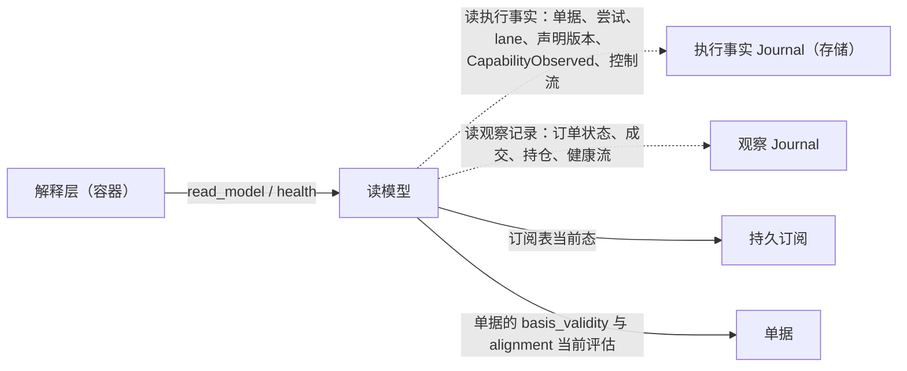

# 读模型

## 0 定位

- **层级与元素**：L3 component，核心进程里的**读模型**。它是效应侧的元素：有的种类读执行事实；它读观察记录，走效应侧读观察侧的那条单向边（[core-process/design.md §3.4 两个类型宇宙与唯一边](design.md#34-两个类型宇宙与唯一边)）。
- **上级文档**：[核心进程](design.md)（L2）。上级把核心↔解释层契约里的 `read_model` 与 `health`，以及核心↔集成契约里“成交与订单状态的契约语义”分配给本组件（[core-process/design.md §4.2 对外接口总表](design.md#42-对外接口总表)）。
- **本文决定**：
  - 核心维护哪些读模型（封闭集合），各自读什么、能否按历史 `as_of` 重建；
  - `Snapshot`、`as_of`、`gaps` 的含义与一致性承诺；
  - `read_model` 与 `health` 两个操作的完整规格；
  - 公共 schema 里成交与订单状态两个种类的契约语义：执行身份、按执行计数、订单身份、来源顺序、最近观察、完整界的前提；
  - 健康面 `IntegrationHealth` 的字段与 fold 规则。
- **读者**：实现核心进程的工程师；实现解释层的工程师（`read_model` 与 `health` 的调用方）；集成作者（成交与订单状态怎样填）；自行 fold 原始记录的下游开发者。审批者：仓库维护者。
- **状态**：已定。
- **非目标**：
  - 健康观察的写入（会话状态与调用计数由集成会话写，回填进度与覆盖检查点由持久订阅写），在 [integration-session.md §4.6 会话状态机](integration-session.md#46-会话状态机)、[subscription.md §4.5 实时边界、回填任务与回填进度](subscription.md#45-实时边界回填任务与回填进度)；
  - readiness 的语义与上报，在 [integration-session.md §4.3.2 集成→核心的推送](integration-session.md#432-集成核心的推送)；
  - 读模型之外的订阅与投递，在 [subscription.md §4.1 核心↔解释层：订阅组与 rewind_cursor](subscription.md#41-核心解释层订阅组与-rewind_cursor)；
  - 解释层把读模型翻成对外概念，在[解释层](../../downstream/design.md)。
- 证据标签与编号约定见 [README.md §0.4 阅读约定](../../README.md#04-阅读约定)。

## 1 问题域

### 1.1 分配给本组件的需求与契约

| 来源（[README.md §2 问题域](../../README.md#2-问题域)） | 内容 | 本组件承担的部分 |
|---|---|---|
| S10 | Alice 的消费面可实现，不必每个消费方重复 fold | 提供读模型；读模型等于对原始记录的独立 fold |
| Q1、Q5 | 同一笔执行、同一笔订单经多个渠道到达，只计一次、不倒退 | 按执行计数的 fold；最近观察 |
| Q13、Q16 | 解释层取得声明；“不支持 / 未确认”与写门用的是同一份能力 | `sources` |
| Q29 | 下游断连重连后按 `as_of` 取当前状态 | `Snapshot{as_of}` |
| Q31、Q14 | 显式缺失，不伪造完整 | `gaps`；完整界只在有来源证据时给出 |
| Q32、P16、O4 | 按调用目标看出“公共可用、私有失败” | `health` |
| Q11、Q12、Q15 | 三种 gap 各在各处可见 | `gaps` 只列来源缺口 |
| 核心↔集成契约 | 成交与订单状态的契约语义 | §3.2–§3.4；集成怎样按映射填出这些字段见 [integration-session.md §3.4 记录映射](integration-session.md#34-记录映射-设计) |
| 核心↔解释层契约 | `read_model(kind, as_of?)`、`health()` | §4.1、§4.4 |

### 1.2 本组件直接面对的域

- **上游的执行身份**。上游给不给一笔执行的稳定身份、给不给修正次序，是上游的事实，UTA 不能设计。[证据：F12] IBKR 的修正是另一条执行回报，除 execId 最后一个点之后的数字外参数全同；文档证明了修正关联，没有说明这些数字的先后。Binance 执行回报里 trade id 为 -1 的行不是执行；它的 `I` 字段是非成交事件也带的回报编号。
- **上游的订单身份**。订单号在订单生命周期内是否不变、在什么范围内唯一，由上游文档给出。
- **来源顺序**。同一订单两条记录谁更新，只有上游知道；UTA 只能凭来源声明的定序证据比较（§3.3）。这些声明可能是错的，要由一致性测试证伪。
- **流与时钟**。流与流之间没有可比的序；墙钟不定序（[core-process/design.md §3.1 流、位置与三种进度](design.md#31-流位置与三种进度)、[core-process/design.md §3.8 基础值类型](design.md#38-基础值类型)）。
- **保留边界**。观察记录可被压缩；执行事实没有保留边界（[observation-journal.md §2.4 保留：边界与删除规则](observation-journal.md#24-保留边界与删除规则)）。读模型的历史切面只能在保留边界之上精确重建。

## 2 驱动

| Q | 本组件的响应 | 响应度量 |
|---|---|---|
| Q1、Q5 | 同一执行在任何 fold 里至多贡献一次；订单状态只按来源证据取代 | 验收 #39、#45、#69 |
| Q29、Q31 | 每个可重建的读模型与对 `as_of` 以内原始记录的独立 fold 相等 | 验收 #18 |
| Q13、Q16 | `sources` 与写门、读路由使用的会话有效声明逐项相同 | 验收 #25 |
| Q14、Q16、Q31 | 完整界只在全部前提成立时给出；无身份来源读成交得 `Unsupported` | 验收 #40 |
| Q32 | 健康不留旧值；计数按目标；跨保留与重启不变 | 验收 #38、#56 |
| Q11、Q12、Q15 | `gaps` 只含 `Gap{origin: Source}` | 验收 #71 |

## 3 模型

### 3.1 读模型是非权威的 fold

- **读模型**（read model）是读副作用的一种消费产物：核心对记录的**非权威**只读 fold（订单、持仓等），经核心↔解释层契约由 `read_model` 读取。每一种读什么（执行事实、观察记录，或 `subscriptions` 的订阅表当前态）、能否按历史 `as_of` 重建，在 §4.2 一处定。
- 读模型不作权威、不被规则引用，只服务下游可实现性，避免每个消费方重复 fold。规则禁止引用读模型由关系表保证（[core-process/design.md §3.4 两个类型宇宙与唯一边](design.md#34-两个类型宇宙与唯一边)）。
- 消费方也可直接订阅原始记录自行 fold：**原始记录是消费契约**（§4.3）。
- 一次性读的结果是观察流上与推送同形的记录（[one-shot-read.md §4.1 核心→集成：read](one-shot-read.md#41-核心集成readstream-request-range--answered--unavailable--refused)），所以读模型对它与对推送用同一套 fold，只按 §3.3 的来源顺序区分。
- 不选：
  - **让规则直接引用读模型（把它当权威）**：读模型是可重建 fold，一旦被规则依赖就要为它承担权威与一致性，违反“核心状态最小化”；
  - **为每个消费方各自 fold 而不提供读模型**：S10 要求 Alice 消费面可实现，重复 fold 是浪费且易分叉。

### 3.2 成交的计数身份 [设计]

公共 schema 里成交与订单状态两个种类的语义，决定同一笔执行、同一笔订单经不同渠道到达时怎样被计数与取值。集成怎样填、核心 `orders` 读模型与程序、下游怎样 fold 都依它，所以它是契约，不留给实现。公共 schema 的发布与身份版本见 [envelope.md §3.3 payload_schema 与 schema 发布](envelope.md#33-payload_schema-与-schema-发布)。

**执行身份 `execution_id`。**

- 成交种类的每条记录带注册字段 `execution_id`：不透明，只比较相等；在来源 × 该成交所属 `WriteScope` 内唯一且稳定。
- 它只是上游那一笔执行的函数：同一笔执行经推送、一次性 `read`、`list_fills`、回执、`backfill` 到达，跨流 epoch、会话、重新握手与 UTA 重启，值都相同。
- 集成在记录映射里构造它（身份构造，[integration-session.md §3.4 记录映射](integration-session.md#34-记录映射-设计)），只用上游文档证明能唯一识别一笔执行的原生键；上游声明的唯一范围比作用域窄时，与界定该范围的字段组成复合键（例如 instrument 与只在 instrument 内唯一的成交号）。消息顺序、时间 / 价格 / 数量的相同或相近、venue seq、`LogPosition`、`venue_order_id`、`AttemptRef`、请求或回执编号、非成交事件也带的回报编号（如 Binance 的 `I`，F12）都不是这种证明。
- 它是注册字段，也是公共成交 schema 的字段：核心的 `orders` 读模型按注册字段读它（核心读的字段 = 锚点 ∪ 处理器读的字段，[envelope.md §3.2 处理器字段注册表](envelope.md#32-处理器字段注册表)），程序与下游按公共 schema 读同一个值，所以按执行计数的 fold 在核心之外也有同一输入。注册留在效应侧：读它的处理器（`orders` 的计数）属效应侧；程序读公共 schema 字段不需要观察侧处理器，所以不为它另设观察侧注册，也不由核心向程序提供一个计数节点。`execution_revision` 同。
- 它不是归因：不产生 `FromAttempt`，不构成 `Found`。成交与尝试的关联只由 `attribution` 承载（[core-process/design.md §4.4 效应侧归因处理器](design.md#44-效应侧归因处理器)）。

**修订 `execution_revision`。**

- 可选注册字段。上游明确给出某笔执行的修正关联、修正先后与完整替代内容时，集成在同一 `execution_id` 下以更大的 `execution_revision` 输出修正后的内容；不按到达先后编造修订号。没有修订号按 0 计，只表示没有可用于取舍的修订次序，不证明上游从未修正。
- 作废只在上游明确给出时出现：它是一个修订，其内容把该执行标为作废（公共成交 schema 的字段）；不是负成交，也不是反向交易。
- 修订记录自带完整替代内容，所以只看同一身份的记录就能求值，不依赖被修正的那条是否还在保留边界内。
- [证据：F12] IBKR：集成以去掉 execId 最后一个点之后后缀的部分构造 `execution_id`；没有别的上游证据给出先后时，不填修订号，同一身份下内容不同即按下述冲突处理，不取最大后缀。

**按执行计数的 fold 规则。** 同一笔执行无论经哪个渠道、到达几次、以什么顺序到达，在任何按执行计数的 fold 里至多贡献一次；同一身份下内容不同只按修订取值，不相加，也不按到达先后任取。对每个 `(来源, WriteScope, execution_id)`：

1. 取已见记录中最大的修订号。
2. 该修订号上只有一种执行内容，它就是这笔执行；内容为作废则该执行保留身份、没有贡献。比较的只是公共成交 schema 定义的执行字段，不含执行身份与修订本身，不比较出处、原始负载、`received_at`、质量标记与 venue seq。
3. 该修订号上有不止一种内容，该执行为**冲突**：不贡献数量或价格，全部候选内容照实给出；之后到达更大修订号的记录取代它。
4. 缺 `execution_id` 的成交记录是集成违约：不计入，照实标为**无身份**。

- 结果与渠道、质量标记（`one_shot` / `backfilled` / `replayed` / `out_of_order`）、流 epoch、`LogPosition` 及到达顺序无关。
- 去重只作用于执行的贡献：观察记录照常 append、不删除，`Evidence` 不合并，归因处理器对每条记录照常触发（同一执行经另一渠道到达，可能带来新的归因证据）。
- 事件时间窗口在归并之后应用：先按身份与修订选出每笔执行的内容，再按所选内容的执行时间判断是否落在窗口内。
- 按执行计数的去重、投递去重（按 `LogPosition`，[subscription.md §3.2 cursor 与确认](subscription.md#32-cursor-与确认)）、回填与实时的边界（按范围，[subscription.md §4.5 实时边界、回填任务与回填进度](subscription.md#45-实时边界回填任务与回填进度)）是三件事，互不替代。

**增量与累计。**

- 成交记录的数量与价格是**这一笔**执行的量与成交价。
- 订单状态的 `cumulative_filled_quantity` 与平均成交价（载荷）是该订单到这次观察为止的累计值：快照，不是增量。
- `orders` 的订单累计成交量取自订单状态观察，不以成交之和替代；逐笔成交按上述规则列出；二者不一致时照实并列，不修账。程序或下游对去重后的成交求和是它们自己的派生计算，不是上游原值；它们按公共成交 schema 的执行身份与修订字段套用同一规则。
- `positions` 只 fold 持仓观察，不消费成交，不在本规则内。

**一个回应里的多笔执行。**

- 一次操作结果或一条推送的上游回应含若干笔执行时（例如立即成交的 `submit` 回执、`list_fills` 的结果），每笔可识别的执行各落一条成交记录到该作用域的成交流，与该回应的其余观察记录同一事务、同一出处（[io-shell.md §4.3 输出与记录模型](io-shell.md#43-输出与记录模型-设计)）。
- 各条的 `attribution` 只按该笔执行自己的关联证据填写，不因同在一个回应里而继承。
- 上游回应里不是执行的行（例如 Binance 执行回报的 trade id 为 -1 的那些，F12）由记录映射丢弃，不产生成交记录。
- 回执里的执行给不出合格身份时，只落订单状态与 `Evidence`，不产生成交记录。

**没有执行身份的来源。**

- 声明成交种类的流与渠道（推送、`read`、`backfill`、`list_fills`），即断言它送达的每笔执行都带上游证明的身份。作用域的成交推送流在被路由为 `All` 时送达该作用域的全部执行，不是其子集。
- 一次读或回填不能为结果里的某笔执行给出身份时，该操作返回 `Unavailable`，不返回删过项的集合（操作粒度见 [integration-session.md §3.1 契约的粒度：操作是 UTA 的意图](integration-session.md#31-契约的粒度操作是-uta-的意图-设计)）。
- 任何渠道都给不出合格身份的来源，对该作用域不声明成交种类：对成交的读得 typed `Unsupported`（Q16），不是空结果；执行只以订单状态的累计值可见，原始负载只作审计证据。
- 不选：
  - **以时间、价格、数量的散列合成身份**：这是猜测。同一毫秒两笔相同的成交会被并成一笔，不同渠道的时间精度会把同一笔拆成两笔；
  - **以扩展 schema 输出不带身份的成交**：公共 schema 已有的种类必须以它输出，且各 fold 只能各自猜怎样去重；
  - **按 venue seq 去重**：venue seq 可无（P2），也不跨渠道；一次性读、回执、取证得到的成交本就是同一执行的另一条记录；
  - **同身份内容不同时按到达先后取值**：迟到的旧读结果会覆盖新推送，两个实现得出两种结果；
  - **从成交累加订单或持仓数量**：那是上游原值的本地拷贝；
  - **身份只作注册字段、不进公共 schema**：程序与下游读不到它，只能各自猜去重键；**由解释层替下游去重**：解释层不持有状态。

### 3.3 订单身份、来源顺序与最近观察 [设计]

**订单身份 `venue_order_id`。**

- 订单状态种类的每条记录带注册字段 `venue_order_id`：上游给该订单的身份，不透明，只比较相等，在来源 × 该订单所属 `WriteScope` 内唯一且在订单生命周期内不变。集成按构造 `execution_id` 的同一规则构造它：上游声明的唯一范围比作用域窄时，与界定该范围的字段组成复合键（例如只在 instrument 内唯一的订单号）。
- 它本就是写路径的锚点：`submit` 的 `Ack` 带它，撤单按它寻址（[io-shell.md §4.6 submit](io-shell.md#submitattempt--ack--reject--notsent--noresponse)、[ticket.md §4.5 交易协议：操作种类、目标、可执行性、检查目录](ticket.md#45-交易协议操作种类目标可执行性检查目录-交易协议)）。
- 缺它的订单状态记录是集成违约，不归入任何订单，照实标为**无身份**。

**一笔订单只在一条流上。** 一笔订单的订单状态记录，无论经推送、回执、取证、一次性读还是回填，都落在它所属作用域的同一条订单状态流上。一个作用域可以有多条订单状态流，但只按订单生命周期内不变的属性划分（例如产品线），不按生命周期阶段划分：“未结 / 已结”是这条流上的请求参数（`request_schema`），不是两条流。这是集成义务，由一致性测试验证。核心查得出的违反是同一 `(来源, WriteScope, venue_order_id)` 出现在两条订单状态流上：该订单标为**跨流冲突**，各流上的最近观察照实给出，不选其一。

**一个持仓只在一条流上。** 同一持仓身份（持仓公共 schema）的持仓记录，无论经哪个渠道，都落在它所属作用域的同一条持仓流上，持仓流只按持仓生命周期内不变的属性划分。这同样是集成义务，由一致性测试验证；核心查得出的违反是同一 `(来源, WriteScope, 持仓身份)` 出现在两条持仓流上：该持仓标为**跨流冲突**，各流上的最近观察照实给出，不选其一、不相加；读它的检查项（敞口的 `q0`、持仓在）得 `Undecidable`（[ticket.md §4.5 交易协议：操作种类、目标、可执行性、检查目录](ticket.md#45-交易协议操作种类目标可执行性检查目录-交易协议)）。理由同订单：流间没有可比的序，任取一条就让放行结论取决于实现怎样挑。

**来源顺序。** 同一身份的两条记录谁反映了上游较新的状态，是上游的事实，UTA 只凭来源给的定序证据比较。证据只有下列四种，都是声明的、可证伪的（流声明见 [integration-session.md §3.3 投影 Projection](integration-session.md#33-投影-projection)）：

1. **venue 序号**：两条记录都带、且在同一流 epoch 内：序号大者新。回执与取证的观察记录，只在它自己的发出 epoch（它所带 `dispatch_end` 所在的流 epoch）就是它被 append 的流 epoch 时，它带的序号才是这条证据。调用在途期间会话内集成为这条流上报 `Gap{origin: Source}` 开了新 epoch 的，它照常作为证据 append 在当前 epoch 上、不丢弃，但它的序号是已结束的 epoch 坐标上的值，不作本条证据，也不计入序号覆盖；这条记录按不带序号的回答处理（第 3 条与下文 `dispatch_end`）。同一回应落到不同流上的记录各按自己那条流判定。
2. **`order_revision`**：流声明它（订单状态种类）且两条记录都带：值大者新。上游保证它对同一订单跨推送与查询渠道单调（证伪 #30）。
3. **`query_not_lagging`**：流声明它时，一条不带序号的回答（一次性读、回执、取证的结果）不早于在它所带的 `dispatch_end` 及之前 append 到它所在这条流的任何记录（证伪 #31）。
4. **`push_ordered`**：流声明它时，同一会话 epoch、同一流 epoch 内该流的两条推送，后送达的不早于先送达的（证伪 #37）。它断言上游经一条有序通道、按状态次序交付该流的推送：不是多路上游 feed 的合并，也不是由轮询合成的推送。上游推送通道重连是供给中断，集成上报 `Gap{origin: Source}` 开新流 epoch，所以重连两侧的推送落在不同流 epoch：这条证据的边界就是这项已有的上报义务（[integration-session.md §4.4 集成义务清单](integration-session.md#44-集成义务清单)）。集成按收到的次序送出推送的义务只保证送达次序不被集成打乱，本身不是证据。它不比较推送与回答，也不跨会话 epoch 或流 epoch。

- 其余一切都不定序：append 位置（到达顺序）、`received_at`、累计成交量、状态的先后格（终态吸收），以及不声明 `push_ordered` 的流上两条推送的送达次序。一条回答与一条推送即使先后到达，没有上述证据就不可比；回答之后才 append 的推送也不因后到而更新。
- 证据自相矛盾时不选边：同一序号或同一 `order_revision` 值上内容不同，两种证据给出相反的先后，或几条记录按证据成环，这些记录之间都按不可比处理，记录照实保留。这是来源违反自己的声明，由一致性测试证伪（证伪 #30、#31、#37；验收 #69）。

**`dispatch_end`。**

- 每条回答记录（一次性读的结果项与读结论记录、回执与取证的观察记录），以及一次性读失败时记下的 `Gap{origin: Channel}`，带核心记下的 `dispatch_end`：这次调用发出时、这条记录所在的流已提交的流末位置。
- 调用发出时，发出方为这次调用可能写入的每条流各记下一个：一次性读只写它读的那条流，由一次性读元素记下，即 `Pending.from`（[one-shot-read.md §4.2 核心↔解释层：read](one-shot-read.md#42-核心解释层readtargets-deadline--vectargetresult)）；回执与取证可能写入该作用域的订单状态流与成交流，由 IO 壳为其中每条流各记一个（[io-shell.md §4.3 输出与记录模型](io-shell.md#43-输出与记录模型-设计)）。同一回应落到不同流上的记录，出处（`provenance`）相同，`dispatch_end` 各是自己那条流的。
- 它是一个 `LogPosition`，所带的流 epoch 就是这条记录的**发出 epoch**：一次性读与回执、取证的结果按它判定是否跨过了所在流的流 epoch 更替。
- 它是 UTA 自有的调用出处，只供三处使用：上面第 3 条、发出 epoch 的判定、一次性读的等待者认出自己的结果。它本身不给上游状态定序：调用在途期间（`dispatch_end` 之后、回答 append 之前）到达的记录，第 3 条不为它与回答定序，只有第 1、2 条的证据能比较它们。

**最近观察**是同一身份在它所在流上、按来源顺序的极大记录。`orders` 的订单状态与累计量、`positions` 的持仓、检查项的“原单仍在”“持仓在”与敞口都用它。

- 极大记录只有一条，或几条极大记录的公共 schema 状态字段相同：最近观察**确立**，就是它。
- 几条极大记录彼此不可比而内容不同：最近观察**顺序未确立**。读模型不把它压成一个值：并列给出这些记录，各带渠道（推送 / 一次性读 / 回执 / 取证）、出处与收到时间，并说明它们之间的来源顺序未确立；读它的检查项得 `Undecidable`。之后按证据比它们都新的记录到达，最近观察重新确立。
- 可以另给一个标明“按收到顺序”的视图（最后收到的那条）。它只是收到顺序，不作来源顺序，任何判断都不读它。
- 结果只依赖记录集，对同一记录集的独立 fold 相同（验收 #18）。它是“UTA 凭来源证据能证明的最近一次观察”，不是上游此刻的状态。

理由：流与流之间没有可比的序，时钟也不定序，所以一笔订单的状态只能在一条流上取；按阶段分流时，订单在“未结”流上的最后一条记录会永远停在未结。同一条流上，推送与回答走的是两条通道：一次查询可能读到上游较早的副本，它的回答可能比此前或调用期间送达的推送更旧，所以回答到得晚不等于它新（同步等待：不以到达顺序代替源头）。推送之间同理：多路上游 feed 合并、由轮询合成的推送、上游重连之后重送的推送，送达次序都不是上游的状态次序，所以推送之间的先后也要来源声明（`push_ordered`）才成立，且只在一个会话 epoch 与流 epoch 之内。代价：在四种证据都不声明的 venue 上，订单视图经常并列推送与回答两个渠道的不同状态，不声明 `push_ordered` 的流上两条内容不同的推送也并列，依赖它的检查项 fail-closed。

不选：
- **按 append 位置取代**（不带序号的记录按到达取代）：到达顺序是 UTA 的接收顺序，一条滞后的查询回答会盖掉更新的推送；
- **回答以调用窗口为界取代窗口之前的记录**：查询可能读到上游较早的副本，没有来源保证就不成立；
- **按 `received_at` 跨流比较**：以时钟定序，墙钟可跳；
- **按流声明“带不带 venue 序号”整流判定**：同一流上带与不带的记录混在一起；
- **各流各取最近观察并列给出**：按阶段分流时，过时的“未结”永远并列在已成交旁边；
- **按流的声明顺序或渠道定优先**：优先级不是先后；
- **终态吸收或累计量取最大**：掩盖上游的修正。

### 3.4 精确重建的前提与完整界 [设计]

- 无条件成立：对 `as_of` 以内的同一记录集，§3.2、§3.3 的 fold 结果确定（验收 #18）。
- 某作用域 fold 出的有效执行集合，只在下列条件全部成立时，才承诺它含上游在该作用域成交流当前流 epoch e 上、venue 序号小于 n 的全部执行（完整界 `(e, n)`）。命题的坐标是 e 的 venue 序号，由 e 的序号覆盖 `[Origin, n)` 证明（[subscription.md §3.6 序号覆盖](subscription.md#36-序号覆盖)）；它只由当前流 epoch 算出，上一 epoch 的界不沿用（序号跨 epoch 不可比）：
  1. 该作用域有成交推送流，e 的声明含 `joinable_venue_seq` 与 `backfill_from_origin`；e 的回填任务以 `Origin`（上游该流历史的起点）为起点、主体集为 `All`，且已 `Closed`（[subscription.md §4.5 实时边界、回填任务与回填进度](subscription.md#45-实时边界回填任务与回填进度)）：`[Origin, live_from)` 由来源的 `Covered` 答复连成，`live_from` 起由推送送达，二者在同一可衔接序号上相接，e 的序号覆盖因此是 `[Origin, n)`。于是早于 e 的流 epoch 与 e 开头的 `Gap{origin: Source}` 都不再遮住序号 n 之前的任何执行：它们送达过的执行在 e 里重新取得，没送达的也在其中。有限深度的任务即使 `Closed`，也只证明 `[起点, n)`，不闭合 e 开头的 `Gap{origin: Source}`；衔接未证明的 `Reached` 不算。
  2. 从 `live_from` 到 n，e 的有效供给是 `All`：`[live_from, n)` 的推送都计入了 e 的序号覆盖，即每条都 append 在 e 上一条同会话、确认供给为 `All` 且 `refused` 为空的路由结论记录之后（与序号覆盖是同一个输入）。流在配额池里时核心不要求 `All`，此条不成立。完整的证明只来自推送流及其回填：只经一次性读、回执或取证得到的成交，即使恰好齐全，UTA 也没有证明，不承诺完整。
  3. e 上序号小于 n 的记录，以及归并这些执行的修订所需的记录，都不低于保留边界；序号小于 n 的记录里没有冲突或无身份执行。`orders` 给界另要求该成交流从未被压缩，比本条更严（§4.2）。
  4. 订阅者自行 fold 时，它实际收到了这些记录。它订阅上未确认的 `Gap{origin: Delivery}` 是损失，不是覆盖。
- “完整”指执行集合完整，不承诺之后不再有修订：序号不小于 n 的记录可能修订或作废此前的执行。条件不全时，结果仍是已有记录上的确定性去重，但不是完整集合；`orders` 怎样标出这一点见 §4.2。
- 界只陈述在来源的序号坐标上，不陈述事件时间：一个执行时间在 W 内的执行，可能在 n 之后才发出。能说的只有“W 内、序号小于 n 的执行都在”；事件时间窗口的完整需要事件时间闭合的来源证据，契约里没有。
- 理由：完整只能以来源自己的坐标陈述。`Origin` 回填证明 `[Origin, live_from)` 的每个序号都已取得，推送证明 `[live_from, n)`，二者相接，于是 `[Origin, n)` 的每一条都在。有限起点的回填只证明回填坐标上的一段：可衔接序号与执行时间之间没有顺序关系，所以它给不出事件时间上的任何界，也不闭合起点之前的历史。能否从 `Origin` 回填由集成在流声明里断言（`backfill_from_origin`），一致性测试验证，与 `joinable_venue_seq` 同类。代价：每个不能以游标续接的新流 epoch 都要重取一次全部历史，重取完成前没有完整界；上游只保留部分历史的来源、没有可衔接序号的成交流永远没有完整界。
- 不选：
  - **以 `received_at` 或上游文档的迟到上限把 n 换算成事件时间界**：推断上游的未来输出；
  - **取回填起点或首条记录的执行时间作下界**：有限覆盖推不出时间下界；
  - **要求上游序号与执行时间同序**：多数上游的修正与迟报都不满足；
  - **把前后几个 epoch 的有限回填拼接成连续覆盖**：序号只在 epoch 内可衔接，跨 epoch 不可比。
- 会推翻它的观测是证伪 #23、#29（[subscription.md §6.1 证伪条件](subscription.md#61-证伪条件)）。

### 3.5 健康面 [设计]

每个集成一份 `IntegrationHealth`，经读模型对解释层可见（P16）。它有两个输入：

- **成员**是 `as_of` 时的采纳集合，由控制流上的执行事实（采纳记录与之后带同一 `instance_id` 的 `restart_integration` `Applied`）按 `as_of` 在控制流上的位置 fold 出（[integration-session.md §3.7 由控制流 fold 出的四项持久事实](integration-session.md#37-由控制流-fold-出的四项持久事实)）。被移除的登记不在其中：它的健康观察仍在健康流里，可订阅、可按历史 `as_of` 读，核心不为它补写记录。
- **每个成员的各字段**只由健康观察 fold 出：

| 字段 | 含义 | 源头与写者 |
|---|---|---|
| `session` | `Connecting{since}` / `Established{epoch, since}` / `Halted{cause, since}` / `Unobserved`；`epoch` 是该会话的 `SessionEpoch`；一个切面上的值按下文“会话值”取；`Unobserved` 不是记录 | 核心自己的会话生命周期；集成会话在会话状态改变时 append，每条会话观察带 append 它的核心实例的 `instance_id`（`Established` 的即其 `SessionEpoch.instance_id`）（[integration-session.md §4.6 会话状态机](integration-session.md#46-会话状态机)） |
| `readiness` | 每条流的 readiness（下文“readiness 的 fold”）；`Disconnected` 是派生值 | 集成在某个会话里、对某个流 epoch 的陈述（副本）；核心盖上到达会话的 `SessionEpoch` 与该流当时的流 epoch 后 append（[integration-session.md §4.3.2 集成→核心的推送](integration-session.md#432-集成核心的推送)） |
| `backfill` | 每条流当前流 epoch 的回填进度；值为 `None` 的不列 | 持久订阅：进度改变时与读结论记录同事务 append；epoch 起点的 `None{epoch}` 与起点的 `Gap{origin: Source}` 同事务（[subscription.md §4.5 实时边界、回填任务与回填进度](subscription.md#45-实时边界回填任务与回填进度)） |
| 按调用目标的 `consecutive_failures`、`last_success_at` | 下文“调用结果计数” | 集成会话给出内容，调用发起方在记录该结果的同一事务里提交（[integration-session.md §4.10 调用结果的计数](integration-session.md#410-调用结果的计数)、[core-process/design.md §4.3.6 调用结果与计数的提交协议](design.md#436-调用结果与计数的提交协议)） |

健康流上另有持久订阅 append 的**覆盖检查点**（[subscription.md §4.6 覆盖检查点](subscription.md#覆盖检查点)），它是 `health` 的 fold 输入之一，供序号覆盖在压缩后重建。

**每条健康观察是状态值**：它带所属键（集成、流、逻辑流、调用目标）上的完整当前值，同键后一条取代前一条。健康流因此按键保留（[observation-journal.md §2.4 保留：边界与删除规则](observation-journal.md#24-保留边界与删除规则)），`IntegrationHealth` 对任一不低于保留边界的 `as_of` 都 fold 得出，且与压缩前相等；唯一的例外是某个成员走到下文“会话值”的 `BeyondRetention` 分支，这个切面得 `BeyondRetention`。

**健康不留旧值。** 健康流按键只保留最近一条，一个键上的值只在有新观察时改变。所以旧值会因流 epoch 更替或核心重启而失效的键，要么在失效的那一刻由它的写者写入新值，要么由 fold 规则限定它的适用范围：

- **回填进度**：写者义务。流 epoch 起点的 `Gap{origin: Source}` 与该逻辑流的 `None{epoch}` 在同一事务 append（握手时开的与会话内上报开的新 epoch 一样，由集成会话编排这一事务，`None{epoch}` 由持久订阅写）；这一 epoch 建立任务时由 `Backfilling{起点}` 取代。上一 epoch 的 `Closed` 或 `Reached` 因此不会被当作新 epoch 的进度，崩溃也不会把 gap 与 `None` 分开。
- **会话**：写者义务与 fold 规则各一半。写者义务：核心启动第 3 步让各集成进入初始状态时，集成会话为每个集成 append 一条会话健康观察，与采纳记录同一事务；进入 `Connecting` 的为 `Connecting{since = 本步时刻}`，恢复为 `Halted` 的沿用那条未解除的 `IntegrationHalted` 的原因与起始时间（[integration-session.md §4.6 会话状态机](integration-session.md#46-会话状态机)）。**会话值的 fold 规则**：一个切面（`as_of`）上集成 X 的会话值，设 i 是该切面控制流前缀里 X 最近一次采纳（第 3 步的采纳记录，或采纳 X 的 `restart_integration` `Applied`）所带的 `instance_id`：
  - 该切面健康流前缀里有带 i 的 X 的会话观察：取其中最近一条，它就是会话值。
  - 没有：看健康流前缀里 X 最近的一条会话观察（不论实例），设它带 j。没有这样一条，或控制流前缀里有带 j 的采纳：会话值为 `Unobserved`，这个切面把 i 的采纳与它的初始观察分开了，i 的实例还没有写下会话观察。控制流前缀里没有带 j 的采纳：对 X 而言健康流走在控制流前缀前面，而 i 的观察已被压缩删去，这个切面的 `health` 读得 `BeyondRetention`。
  - 实例的先后只由采纳在控制流上的位置给出，不比较不同流上记录的先后。所以含整个事务的切面（第 3 步的采纳记录与初始观察，或采纳本实例尚未运行的 id 的 `Applied` 与它的 `Connecting`）给出初始观察；把二者分开的切面（控制流位置含采纳，健康流位置在初始观察之前）给出 `Unobserved`；上一实例的 `Established` 在之后的采纳之后从不适用，第 5 步开放下游会话之前也不会显得仍在。
  - 这一规则只读两条流上已有的字段（采纳所带的 `instance_id`、会话观察所带的 `instance_id`），对任一合法切面都确定：独立 fold 控制流与健康流的消费方，从同样的两个前缀得到同一个值或同一个 `BeyondRetention`；不需要判定切面是否“完整”，也不需要跨流的全局序。
- **readiness**：不另写，由 fold 规则限定（下一条）。旧会话、旧实例、旧流 epoch 的 `Live` 随会话值或回填进度的更替自动失效，所以不为各流 append `Disconnected` 或 `Starting`。

**readiness 的 fold。** 一条流当前的 readiness 只取同时带着该集成的会话值（上文，按会话值一条取）的 `SessionEpoch` 与该流当前流 epoch 的值，且只在会话值是 `Established` 时。该流当前流 epoch 取自健康流上该逻辑流最近一条回填进度所带的 epoch（新 epoch 的 `None{epoch}` 与起点 gap 同事务 append），所以取当前流 epoch 不读健康流之外的输入。

- 会话已建立而该流在当前流 epoch 里尚无这样的 readiness：`Starting`。
- 会话值为 `Connecting`、`Halted` 或 `Unobserved`：各流为 `Disconnected`。它由会话值派生，不是记录，不带自己的时刻，只随附会话值及其 `since`（那是会话状态记录的时刻，不是断线时刻；核心不回填崩溃发生的时刻；`Unobserved` 没有 `since`）。

理由：集成失效或核心重启时，旧值的写者恰好不再写；按键保留又使旧值一直可见。会话与回填进度由它们的写者（集成会话、持久订阅）在失效点写新值；readiness 的写者是集成，失效时它恰好写不了，所以由它所属的会话限定有效范围，而不是由核心代写一条集成没说过的话。会话值按采纳所带的 `instance_id` 取舍，而不是取健康流上的最近一条：两条流各自有序、彼此没有全局序，一个切面可以含一次采纳而不含同一事务的初始观察，这时最近一条可能是上一实例的 `Established`。不选：
- **由读模型按流的当前 epoch 过滤回填进度**：`IntegrationHealth` 就要从健康流与控制流之外再读一个输入；
- **重启时不写会话、等第一次状态变化**：`Halted` 的集成不再有状态变化，旧的 `Established` 会一直显示；
- **由核心为各流 append `Disconnected{since}`**：同一个键有两个写者，且 `since` 只能取核心写它的时刻，把重启时刻冒充断线时刻；
- **拒绝把采纳与初始观察分开的切面**：独立 fold 的消费方要另有判定切面是否完整的规则，而这需要跨流的序；
- **会话值取健康流上的最近一条**：把采纳与初始观察分开的切面会给出上一实例的 `Established`；
- **会话键按（集成，实例）分、每对各留一条基线**：基线随实例累积而无界增长，而走到 `BeyondRetention` 分支的成员，它最近一次采纳之实例的观察已被压缩，这个切面本就读不到被压缩的历史，得 `BeyondRetention` 即可。

**调用结果计数的读侧。** 每个调用目标一个键。调用目标是什么、哪些结果计入、哪些算失败、哪些算成功，在 [integration-session.md §4.10 调用结果的计数](integration-session.md#410-调用结果的计数) 一处定。本组件读到的两个字段：

- `consecutive_failures`：该目标最近连续失败的次数，每条计数观察带计数后的值。
- `last_success_at`：该目标最近一次得到上游回答的结果被接受的时刻。它回答“这个目标最近一次得到上游回答是什么时候”，不表示业务成功，也不表示历史已取全。从未成功过的目标没有它。
- 计数跨会话、跨核心重启延续：按键保留使它不随压缩丢失。

由此“公共可用、私有失败”可以观察：公共流这一目标最近成功，某个作用域这一目标连续失败；逐流 readiness 另给流一级。它只说各个被调用目标自己的近况，不推断整个账户或鉴权域是否可用。

- **删去 `reach` 与 `tier`**：`reach`（旧 UTA 的 down / connected / readable 阶梯）由 `session`、逐流 readiness 与按目标的调用结果分别表达；合成单一可达度会丢掉“哪一面不通”。`tier`（旧 UTA 由 keyless / readOnly 推出的 data / account / trading，O4）说的是作用域能做什么，已由投影里的能力判定表达；在健康里再存一份会与能力证据分叉。
- **降级 / 离线的阈值**（旧 UTA 按连续失败 3 次、6 次）是呈现策略，不在核心：解释层或下游按上述字段自定。
- **健康不进写路径**：它只供运维与下游观察。放行门读能力证据，发出前门读集成会话的会话状态与能力证据（[io-shell.md §4.2 发送屏障与发出前门](io-shell.md#42-发送屏障与发出前门)）；集成失效时它的健康观察恰好停止更新，拿它作门的输入会在最需要时过时。
- 不选：
  - **从回执、取证等异质记录推算计数**：一条记录不说明它属哪次调用，空结果成功时没有记录，会漏计或重计；
  - **把每键最新位置登记为保留引用**：一个久不变化的键压住整条健康流；
  - **健康流免压缩**：每次调用一条，无界增长；
  - **另设健康表或存进快照**：第二种持久形状，`as_of` 与订阅拿不到；
  - **压缩时重新 append 当前值**：订阅者收到并未发生的变化。

### 3.6 不变量

1. 读模型非权威、不被规则引用。由关系表（规则禁止引用读模型）保证。
2. 读模型只读、不写：不 append 任何记录。由存储的写入口表（[core-process/design.md §4.3.4 执行事实的唯一写入口](design.md#434-执行事实的唯一写入口)）保证。
3. `orders`、`positions`、`lanes`、`health`、`sources` 的每个 `Snapshot` 等于对 `as_of` 以内原始记录的独立 fold。由各种类只以记录为输入、fold 规则确定保证。
4. 同一执行在任何按执行计数的 fold 里至多贡献一次。由 §3.2 的 fold 规则保证。
5. 最近观察只按四种来源证据取代，顺序未确立时并列而不压成一个值。由 §3.3 保证。
6. 完整界只在 §3.4 的前提与“从未被压缩”门都成立时给出。由 §4.2 `orders` 保证。
7. 健康面不把旧会话、旧实例、旧流 epoch 的值当作当前值。由 §3.5 的写者义务与 fold 规则保证。
8. `gaps` 只列未被来源证据闭合的 `Gap{origin: Source}`。由 §4.3 保证。

### 3.7 术语

| 词 | 在本组件中的意思 |
|---|---|
| 最近观察 | 同一身份在它所在流上按来源顺序的极大记录；确立，或顺序未确立 |
| 顺序未确立 | 几条极大记录彼此不可比而内容不同，读模型并列给出 |
| 冲突 / 无身份 / 跨流冲突 | 同一执行最高修订上不止一种内容 / 缺 `execution_id` 或 `venue_order_id` / 同一身份出现在两条流上 |
| 完整界 `(e, n)` | `orders` 每作用域给出的成交完整性：上游在当前流 epoch e 上序号小于 n 的全部执行都在 fold 里；不说事件时间 |
| 快照（读模型） | `read_model` 的一次读取结果 `Snapshot`，带 `as_of`；与核心的重启加速快照不同（[storage.md §2.4 快照是近处副本](storage.md#24-快照是近处副本-设计)） |
| 读模型 / 归因后的订单观察 | 读模型是核心对记录的非权威 fold，规则不引用；归因后的订单观察是集成产出的带出处记录，钩子可读。都描述“订单现在什么状态”，一个是解释、一个是记录 |

## 4 结构与接口

### 4.1 `read_model(kind, as_of?) → Snapshot{value, as_of?, gaps?}`

- **动作轴**：读（核心内 fold）。不产生记录。
- **启动期**：核心启动第 5 步开放下游会话之前返回 `Starting`（[session-entry.md §4.1 handshake](session-entry.md#41-handshakecontract_version-actor--sessionprincipal-instance_id-contract_version)）。
- **不另授权**：读不按 principal 授权（[session-entry.md §4.2 请求的身份与授权的入口](session-entry.md#42-请求的身份与授权的入口)）。
- **`as_of`** 是 `Set<LogPosition>`：fold 吃到的位置集，可跨观察与执行事实两个 `Journal`。不给即当前态。
- **错误**：
  - `kind` 未定义 → 拒绝；
  - `as_of` 未达（其中有位置在所涉流上尚未提交）→ `NotYetAvailable{positions}`，带所涉各流当前已提交的流末位置；观察流与执行事实流同一判定；
  - 对只给当前态的种类（`tickets`、`subscriptions`）带历史 `as_of` → 拒绝；
  - `as_of` 所涉某条观察流的位置低于该流的保留边界，或 `health` 的切面上某个成员走到 §3.5 会话值的 `BeyondRetention` 分支 → `BeyondRetention`，不给该切面的状态。
- `as_of` 的位置都已提交即照常 fold：位置是核心自己的事实，可判定。来源侧是否还有记录未到不是未达：读模型只在有来源证据时给出完整界，并列出 `gaps`。`BeyondRetention` 也不属未达：那段观察历史已被压缩，不会再变得可读。

### 4.2 读模型集合

核心维护的读模型是封闭集合，各自的输入如下。[设计]

**`orders`**：按 `WriteScope`，执行事实（单据记录、尝试记录）+ 该作用域的订单状态 / 成交观察（带 `attribution`，含 `External` / `Unattributed`）的 fold。

- 订单按 `venue_order_id` 归并：单据的尝试经 `submit` 的 `Ack` 与撤单目标带上同一身份，外部订单只有观察记录。
- 每笔订单的状态取其订单状态记录的最近观察（§3.3）。最近观察顺序未确立时不压成一个值：并列给出各渠道的不可比记录，带渠道、出处与收到时间，并说明来源顺序未确立；可另附一个标明“按收到顺序”的视图。跨流冲突的订单并列各流的最近观察、不选其一；缺 `venue_order_id` 的订单状态记录照实列为无身份，不归入任何订单。
- 订单的上游累计成交量取自同一条最近观察（顺序未确立时随各条并列），不以成交之和替代；逐笔成交按 §3.2 的执行计数规则列出（冲突、无身份照实标出），二者不一致时并列，不修账。
- 每个作用域另给**完整界** `(e, n)`（§3.4）。给出它要同时满足：§3.4 里核心可判定的条件 1–3，以及“从未被压缩”门：该作用域的成交流没有任何位置落到保留边界之下。n 是 e 的序号覆盖 `[Origin, n)` 的上端；界只由当前流 epoch 算出，新 epoch 开始时旧界不沿用，新 epoch 的 `Origin` 回填 `Closed` 之前没有界。成交流在配额池里、没有 `joinable_venue_seq` 或 `backfill_from_origin`、回填深度不是 `Origin`、或任务尚未 `Closed` 时，不给完整界。完整界不陈述事件时间。该流一经压缩，`orders` 不再给完整界，只标出“无可证明的完整范围”。
  - 理由（从未被压缩门）：被压缩的可能正是某笔执行的最高修订、作废或冲突内容，留下的较低修订会被重新计入，而核心无从由保留边界算出哪些执行未受影响；压缩后仍要可证明完整，只能另改保留契约（保留按身份归并所需的记录）。
  - 消费方是否确实收到全部记录由它自己的 cursor 与投递缺口判定，不在界内。

**`positions`**：按 `WriteScope`，只 fold 该作用域的持仓观察。

- 对每条持仓流上的每个持仓身份，给出该身份在 `as_of` 以内的最近观察（§3.3 的同一规则，顺序未确立时同样并列），契约载荷原样给出，不承诺它重建出完整的持仓集合。
- 同一持仓身份出现在两条持仓流上时标为跨流冲突，并列各流的最近观察，不选其一、不相加。
- 某次读或推送里没出现的持仓身份不因此被移除，该身份最近的记录照常给出。
- 它不从本地成交或回执推算持仓（那是上游原值的本地拷贝，F1），不跨作用域或来源合并，没观察到的不当作零。

**`lanes`**：每 lane 的阻塞头集合（等待中的尝试）与结果未知的尝试（含已放弃等待的），执行事实的 fold。阻塞头集合的定义见 [lane.md §3.3 阻塞头集合](lane.md#33-阻塞头集合)，结果与等待两根轴见 [io-shell.md §3.5 等待与结果：两根轴](io-shell.md#35-等待与结果两根轴-设计)。

**`tickets`**：单据 fold 的当前态（[ticket.md §3.1 单据：锁 = 责任持有](ticket.md#31-单据锁--责任持有)）：执行事实 + 其 `basis_validity` 与 `alignment` 的当前评估。

- 逐版本给出 fold 到的理由（退回原因、否决原因、规则 `Rejection` 及其违反项）与该版本上 `Applied` 的 `bypass_lane` 控制记录（谁、所记阻塞头），以及当前版本的参数有效性。
- 评估还取决于各流的当前流末、撤回、保留边界与当时生效的能力证据和策略，所以这一种只给当前态。`Snapshot` 仍带它实际消费的位置（含 `checked_as_of`）供追溯，但那不是可重建的切面。
- 单据的偏离不是记录：某项此刻是否偏离，解释层在呈现时读 `tickets` 当前态，真正放行仍由核心当次的门判定。

**`subscriptions`**：订阅表与 cursor 的当前态（[subscription.md §4.9 订阅表（持久化）](subscription.md#49-订阅表持久化)）：每个订阅的整体状态与逐项状态（挂起原因、逐主体的“来源拒绝”），以及各项所在流上未确认的投递缺口（按（订阅，流）记，列在该流的各项下，不按项存）。程序订阅不在其中。订阅表不是 `Journal`，没有历史切面，所以这一种只给当前态：它的 `Snapshot` 不带 `as_of`、不带 `gaps`，每个订阅已确认的 cursor 在 `value` 里给出。

**`sources`**：按已有声明版本的来源，给出其最近声明：最近声明版本（作用域及 `account_ref`、`label`，流声明，写能力，配额，扩展 schema 身份），再 fold 引用该版本的 `CapabilityObserved`；以及每个 `account_ref` 是否可解析及原因（[integration-session.md §3.3 投影 Projection](integration-session.md#33-投影-projection)）。

- 它的输入只有各来源的声明流（声明版本与针对逻辑流读 / 回填能力的 `CapabilityObserved`）与各 lane 流上的 `CapabilityObserved`，不读控制流，也不标来源是否在采纳集合里。它的值里没有记录映射。
- 它是来源说过什么的记录，即集成会话的“最近声明”（[integration-session.md §3.6 声明的两种解释](integration-session.md#36-声明的两种解释-设计)）：来源处于已建立会话时，它就是写门与读路由此刻使用的会话有效声明；离线时它只是来源上一次会话里的陈述，不是此刻的能力。
- 它只 fold 执行事实，可按历史 `as_of` 读取；历史切面只含该切面上已有声明版本的来源。
- 来源的会话状态不在其中，在 `health`；“此刻能不能”由解释层合并二者（[解释层](../../downstream/design.md)）。

**`health`**：成员是 `as_of` 时的采纳集合，由控制流 fold：`as_of` 在控制流上的位置及以前最近一条采纳记录列出的 id，加上该位置及以前、`instance_id` 与那条采纳记录相同的 `restart_integration` `Applied` 采纳的 id。每个成员一份 `IntegrationHealth`（§3.5），各字段只由健康观察 fold。

- 健康流按键保留：按 `as_of ≥ 边界` 读 `health` 时，先得到每个键在边界之下保留的基线（原位置），再是边界起的记录；fold 结果与压缩前相等，唯一的例外是 §3.5 会话值的 `BeyondRetention` 分支。非成员的键（例如只被较新实例采纳的集成的会话键）不进入 fold，不影响这一等式。`as_of` 低于边界仍得 `BeyondRetention`。

理由：持仓、订单状态、健康的原值在上游或来自观察，读模型只能 fold 已观察到的记录；lane 与单据是 UTA 自己的执行事实。

### 4.3 `Snapshot`、`gaps` 与一致性

- `orders`、`positions`、`lanes`、`health`、`sources` 的每个 `Snapshot` 带 `as_of: Set<LogPosition>` 与 `gaps`，可按历史 `as_of` 读取。消费者把 `as_of` 与自己的 cursor 比对，即知快照含哪些记录。
- **`gaps` 只列连续性缺口**：该 fold 所依赖的观察流在该范围内生效、未被来源证据闭合的 `Gap{origin: Source}` 记录。gap 三种来源的定义见 [core-process/design.md §3.1 流、位置与三种进度](design.md#31-流位置与三种进度)。
  - 闭合只有一种：流 epoch e 的回填任务从 `Origin` 起、对 `All`、已 `Closed`，由来源的 `Covered` 链证明 e 起点之前的历史都在，于是闭合 e 起点的那条 `Gap{origin: Source}`（不论它的原因是什么，也不论它由握手事务、会话内上报还是控制面写下）。其余一切（有限深度的回填、`Reached`、`backfill_incomplete`）都不闭合，它们在 `as_of` 以内一直列出。
  - `Gap{origin: Channel}` 是核心某次调用的结果，不说流少了什么，不列入；它在流上（回填、一次性读）或执行事实里（取证）照常可见。
  - `Gap{origin: Delivery}` 属订阅，读模型不经投递，也不列入；订阅者自己的投递缺口在订阅上。
  - 只 fold 执行事实的 `lanes`、`sources` 没有观察输入，`gaps` 为空。
- **原始记录是消费契约**：观察记录与执行事实（含控制流）都可订阅，消费方可以自行 fold。压缩不改写任何记录；程序流按其 fold 规则求值（[observation-journal.md §2.3 程序流的 fold](observation-journal.md#23-程序流的-fold-设计)），所以消费方不论从哪里开始、中间是否收到 `Gap{Delivery, compacted}`，收到同一条记录之后都得到同一个当前值。
- **确定性等式**：`orders`、`positions`、`lanes`、`health` 是对 `as_of` 以内原始记录的确定性 fold，与对同一记录集的独立 fold 相等（验收 #18）。`health` 的输入是健康流与控制流，任一合法切面上的会话值（含把采纳与初始观察分开的切面上的 `Unobserved`）都由这两条流按 §3.5 的规则确定。`sources` 同样是对执行事实的确定性 fold（验收 #25）。`tickets` 与 `subscriptions` 只给当前态，不在此等式内。

### 4.4 `health() → Vec<IntegrationHealth>`

- 当前采纳集合中每个集成一份：会话状态、逐流 readiness、回填进度、按调用目标的连续失败数与最近成功时间（§3.5）。
- 它等于 `read_model(health)` 的当前态：成员取自控制流，每个字段从健康流 fold 出，按键保留使它在保留边界推进与核心重启之后不变。会话状态为 `Halted` 时带 `IntegrationHalted` 记下的原因。被移除的登记不在其中。
- 动作轴：读。不产生记录。启动期同其他操作返回 `Starting`。

### 4.5 解释层怎样得到声明 [设计]

解释层读 `sources` 取得来源、账户（`account_ref`）、流与读写能力；订阅各来源的执行事实得知声明版本与 `CapabilityObserved` 的变化（[subscription.md §4.1 核心↔解释层：订阅组与 rewind_cursor](subscription.md#41-核心解释层订阅组与-rewind_cursor)），再重读 `sources`。`WriteLaneKey` 与 `Verdict` 只在解释层内部使用，对外翻成“账户”“支持 / 不支持 / 未确认”（[解释层](../../downstream/design.md)）。

- 理由：`sources` 与写门、读路由用的是同一份能力记录，解释层对“不支持 / 未确认”的回答与核心的判定不分叉（Q16）；声明变化经执行事实订阅到达，重连后从已确认 cursor 续，不丢（Q29）。
- 不选：
  - **把声明放进会话 `handshake` 的返回值**：重新握手或能力变化后它就过时，且无从得知变化；
  - **把声明写成观察流**：能力证据属效应侧，写门据以判定的与解释层看到的会成为两份；
  - **提供读模型的变更推送**：那是一套新的变更引擎，重连与续传语义要另定；只准轮询则推送变轮询。

### 4.6 输入、依赖与内部结构

| 种类 | 输入 | 历史 `as_of` | `gaps` |
|---|---|---|---|
| `orders` | 执行事实（单据、尝试）+ 订单状态与成交观察 | 可 | 有 |
| `positions` | 持仓观察 | 可 | 有 |
| `lanes` | 执行事实 | 可 | 空 |
| `tickets` | 执行事实 + 单据当前评估 | 否 | 否 |
| `subscriptions` | 订阅表当前态 | 否 | 否 |
| `sources` | 声明流 + lane 流上的 `CapabilityObserved` | 可 | 空 |
| `health` | 控制流 + 健康流 | 可 | 有 |

- **拥有**：每种读模型的 fold 与它的数据结构（隐藏的决定）。
- **不写任何持久状态**：只读、不写（不变量 2）。各方不争同一秘密：append-only 保证归存储，写内容归各自元素，只读 fold 归读模型。
- **读观察记录走效应侧读观察侧的单向边**：观察侧不因此引用效应侧（[core-process/design.md §3.4 两个类型宇宙与唯一边](design.md#34-两个类型宇宙与唯一边)）。
- 读执行事实的按位置 fold，不经投递调度。

## 5 走查

组件内的细化；主 trace 在 [core-process/design.md §5 走查](design.md#5-走查)，场景定义在 [README.md §5 场景（W1–W20）](../../README.md#5-场景w1w20)。

### 5.1 重连后取当前状态（W14 的读模型细化）

主 trace：[core-process/design.md §5.1 W14](design.md#w14q29下游alice断连重连)。

1. 解释层代下游重连、握手取得 principal；持久订阅自动重新挂接。
2. 解释层 `read_model(orders, as_of = 当前)`：本组件按 `as_of` fold 执行事实与该作用域的订单、成交观察，返回 `Snapshot{value, as_of, gaps}`。`gaps` 列出期间未闭合的 `Gap{origin: Source}`。
3. 解释层 `read_model(tickets)`、`read_model(subscriptions)`：只给当前态，不带 `as_of`；带历史 `as_of` 被拒。
4. 解释层把 `Snapshot.as_of` 与自己的订阅 cursor 比对：cursor 之后的记录从订阅续收；未确认区间可能重复可见，按 `LogPosition` 去重后与不断连时结果相同（验收 #18）。

卡点：无。

### 5.2 取得声明（W20 的读模型细化）

主 trace：[core-process/design.md §5.1 W20](design.md#w20q13q15q16解释层取得声明按账户与无账户来源读推送待审与结果未知)。

1. 集成 X（两个作用域）与公共来源 P 握手成功，各有一个声明版本 append 在各自声明流上。
2. `read_model(sources)`：X 的两个账户（`account_ref`、`label`）与各自的流、写能力；P 的流及其读 / 回填能力；P 不带账户。
3. X 重连后新声明版本改了某作用域的 `account_ref`：该引用在新声明版本里标为不可解析。解释层经执行事实订阅收到新声明版本，重读 `sources`，得到“账户引用冲突”。
4. X 离线时 `sources` 仍给出最近声明；在线与否只在 `health`。

卡点：无。

### 5.3 同一订单经多个渠道到达（验收 #45、#69 的主线）

1. 推送 P1（venue 序号 10）append 在订单状态流 e 上。`orders` 的最近观察 = P1。
2. 回执 A（不带序号，`dispatch_end` 在 P1 之后）append 在同一流上，内容不同。流不声明 `order_revision` 与 `query_not_lagging`：P1 与 A 不可比 → 顺序未确立，`orders` 并列 P1 与 A，各带渠道、出处与收到时间；“原单仍在”得 `Undecidable`。
3. 同一流声明 `query_not_lagging` 时：P1 在 A 的 `dispatch_end` 及之前 append → A 取代 P1。
4. 推送 P2（序号 11）到达：按序号新于 P1；与 A 之间，若流声明 `query_not_lagging` 而 P2 在 A 的 `dispatch_end` 之后，二者仍不可比。第 1 条证据只在同一流 epoch 内比较序号。
5. 核心重启：`orders` 由记录重建，结果与重启前相同。
6. 同一执行经推送、回执、`list_fills`、`read`、`backfill` 各到一次：观察 J 各有一条记录，`orders` 按 `(来源, WriteScope, execution_id)` 只计一次。

卡点：无。

### 5.4 健康跨重启（验收 #56 的主线）

1. 集成 X `Established`（实例 i1），各流 `Live`。核心崩溃。
2. 实例 i2 启动第 3 步：采纳记录（带 i2）与 X 的 `Connecting{since}`（带 i2）同事务。
3. 在 X 重新握手之前读 `health`：会话值取带 i2 的最近一条 = `Connecting`；各流 `Disconnected`（派生，不是记录）；i1 的 `Established` 与各流 `Live` 不再适用。
4. 一个切面的控制流位置含 i2 的采纳、健康流位置在 `Connecting` 之前：会话值 `Unobserved`。
5. X 的旧 `Halted{Refused}` 跨重启：第 3 步沿用原因与起始时间，`health` 给出的与重启前相同。

卡点：无。

## 6 评估

### 6.1 风险 / 敏感点 / 权衡

- **敏感点：来源顺序证据的声明**（§3.3）。四种证据都不声明的 venue 上，订单视图经常并列两个渠道的不同状态，依赖它的检查项 fail-closed。声明错了，最近观察就会错；这由一致性测试证伪（#30、#31、#37）。影响 Q1、Q5 的可用性与正确性。
- **权衡：“从未被压缩”才给完整界**（§4.2）。换来完整界的可证明；代价是成交流一经压缩就永久失去完整界，除非另改保留契约。
- **权衡：按执行计数只信上游证明的身份**（§3.2）。换来跨渠道不重不漏；代价是无身份来源不能声明成交种类。

### 6.2 证伪条件

18. **成交的计数身份**（§3.2，F12）：某在范围内的 venue 在任何渠道都给不出上游证明的稳定执行身份，或只能以“另一条记录引用被修正记录”的形式给出修正、而同一身份下给不出修正次序，同时下游（S10）确实需要该 venue 的逐笔成交可精确计数 → “每条成交记录自带身份与完整修订内容、fold 只看同一身份的记录”不足以承载该 venue，须另定公共契约（例如以订单为单位的累计量作为该来源的公共种类），不得以合成身份或到达先后补上。
22. **订单身份与一单一流**（§3.3）：某在范围内的 venue 在订单生命周期内更换订单号（例如改单后给新号，且新旧号之间只有另一条记录作链接），或同一订单的记录只能分别从按阶段划分、不能合成一条流的上游接口取得 → `venue_order_id` 的不变性或“一笔订单只在一条流上”不成立，`orders` 的归并键与最近观察须重定（例如以上游给出的身份链归并，或要求跨接口可比的上游序号）。
30. **`order_revision` 单调**（§3.3 来源顺序）：声明 `order_revision` 的某上游被观测到，同一订单跨推送与查询渠道的修订值不单调（较新的状态带较小的值），或同一值对应不同内容 → 该流的声明不成立，须撤回，该流上的推送与回答回到不可比；若范围内的 venue 普遍如此，`order_revision` 不能作为来源顺序证据。
31. **查询不落后于推送**（§3.3 来源顺序）：声明 `query_not_lagging` 的某上游被观测到，一次查询回答了比调用发出前已送达本流的某条推送更早的状态（例如终态推送之后，查询仍返回未结或较小的累计成交量）→ 该流的声明不成立，须撤回；若范围内的 venue 普遍如此，一次性读、回执与取证的回答只能与推送不可比，依赖它们的检查项在这些 venue 上 fail-closed。
37. **推送按状态次序送达**（§3.3 来源顺序）：声明 `push_ordered` 的某上游被观测到，同一会话 epoch、同一流 epoch 内同一身份的两条推送里后送达的反映了更早的状态（例如终态推送之后又送达未结或较小的累计成交量，且没有更大的 venue 序号或 `order_revision` 说明它是修正），或该流的推送实为多路上游 feed 的合并、由轮询合成，或上游推送通道重连而集成没有上报 `Gap{origin: Source}`（重连两侧的推送因此落在同一流 epoch 里）→ 该流的声明不成立，须撤回，该流上不带序号也不带 `order_revision` 的推送之间回到不可比；若范围内的 venue 普遍如此，`push_ordered` 不能作为来源顺序证据，依赖推送之间先后的检查项在这些 venue 上 fail-closed。

### 6.3 验收

18. **读模型可重建**（§4.2、§4.3）（对应 Q29/Q31）：`orders`、`positions`、`lanes`、`health` 的任一 `Snapshot{value, as_of, gaps}` 与对同一原始记录集（≤ `as_of`，含保留边界之下按键保留的基线与覆盖检查点）的独立 fold 结果相等；`gaps` 只列 `Gap{origin: Source}`；`positions` 不含从成交推算的值；`tickets`、`subscriptions` 带历史 `as_of` 的请求被拒；`as_of` 与订阅 cursor 可比对；断连重连后重复只出现在未确认区间，且按 `LogPosition` 去重后与不断连时结果相同。
25. **声明交给解释层**（§4.2 `sources`、§4.5）（对应 Q13/Q16）：
    - 每次握手成功恰 append 一个声明版本；`read_model(sources, as_of)` 与对 `as_of` 以内声明版本与 `CapabilityObserved` 的独立 fold 相等，历史切面不含当时尚无声明版本的来源；
    - 来源会话 `Established` 时，`sources` 给出的写能力与流的读 / 回填能力，与同一时刻写门、一次性读路由使用的会话有效声明逐项相同（含 `Unknown`）；来源没有已建立会话时二者不作比较：写门与一次性读按“无已建立会话”判定，`sources` 仍给出最近声明，它不带会话状态，来源在线与否只在 `health` 里（验收 #50、#73）；
    - 重新握手或能力变更后，该来源的执行事实订阅者在新声明生效的同一位置之后收到声明版本或 `CapabilityObserved`；
    - `sources` 的值里没有记录映射；解释层对外的全部输出里不出现 `WriteLaneKey` 与 `Verdict`（与验收 #23 泄露检查同一词表）。
38. **健康面**（§3.5）（对应 Q32）：
    - 一串注入的调用结果（`Unavailable`、`NoResponse`、`NotSent`、空 `Answered`、记录集为空的 `Covered`、`Routed`、`Reject`、`Refused`、`Absent`、`Inconclusive`）使对应目标的连续失败数按“失败加一、其余归零”变化，每个结果恰一条健康观察，与该结果的记录同一事务；握手、推送、`Attributed`、`Abandoned`、`CrashWindow` 与无会话时未发出的调用不改变计数；
    - 公共流的读成功、某作用域的调用连续失败时，健康同时给出二者；
    - 会话断开后该集成各流 readiness 为由会话状态派生的 `Disconnected`，健康流上没有为它们 append 的记录；`Halted` 与 `Connecting` 在健康中可区分，且跨核心重启不变；
    - 健康中没有 `reach` 与 `tier`；`read_model(health)` 按任一不低于保留边界的历史 `as_of` 与对同一健康观察集与控制流的独立 fold 相等（同 #18；低于边界得 `BeyondRetention`，见验收 #43；某个成员走到 §3.5 会话值 `BeyondRetention` 分支的切面二者都得 `BeyondRetention`，见验收 #80）。
39. **成交跨渠道计数**（§3.2）（对应 Q1/Q5）：以 fixture 上游让同一笔执行经推送、`submit` 回执、`list_fills` 取证命中、一次性 `read`、`backfill` 各到达一次，其间断线重连换流 epoch、核心重启一次：
    - 观察 J 中每次到达各有一条记录；`orders` 读模型与一个按 §3.2 规则独立写的参照 fold 都只计该执行一次，二者相等；
    - 两笔价格、数量、时间都相同而 `execution_id` 不同的执行计两笔；同一原生成交号在两个 `WriteScope` 下计两笔；
    - 修订号 2 先到、修订号 1 后到，结果为修订 2 的内容；最高修订号上两种内容时该执行标为冲突、不贡献数量并给出两份内容，之后到达的更大修订号取代它；上游明确作废的执行保留身份、无贡献；
    - 回执里立即成交的执行与之后推送的同一执行只计一次；同一回应里不同订单的成交各按自己的归因证据归因；非成交的上游行（如 trade id 为 -1 的回报）不产生成交记录；
    - 订单累计成交量来自订单状态观察，逐笔之和与之不等时二者并列；`positions` 的值与成交记录无关；
    - 集成一致性：成交记录的 `execution_id` 在各渠道、各会话一致；映射未对齐 `execution_id` 的成交流使投影不合法。
40. **无身份与精确重建前提**（§3.2、§3.4、§4.2 `orders`）（对应 Q14/Q16/Q31）：
    - 给不出合格执行身份的集成不声明成交种类，对成交的读得 typed `Unsupported`，不是空结果；读或回填的结果中某笔执行给不出身份时，该操作返回 `Unavailable`，不返回删过项的集合；缺 `execution_id` 的推送成交记录不计入并标为无身份；
    - 正例：该作用域的成交流从未被压缩、声明 `joinable_venue_seq` 与 `backfill_from_origin`、回填深度为 `Origin`、不在配额池里，当前流 epoch e 上有一条同会话、确认供给为 `All` 且 `refused` 为空的路由结论记录，此后的推送都计入覆盖，e 的回填任务从 `Origin` 起、对 `All`、已 `Closed`，序号覆盖从 `Origin` 连到 venue 序号 n，序号 n 以下没有冲突或无身份执行：`orders` 给出完整界 `(e, n)`，fold 出的序号低于 n 的执行集合等于 fixture 上游在 e 内序号低于 n 的执行；完整界不带任何事件时间；
    - 反例：分别注入 `backfill_incomplete`、回填 `Unavailable` 后不再成功、序号 n 以下出现冲突执行、只经 `read` / `list_fills` 取得成交（无推送流）、成交流只有事件时间而回填到达 `Reached`、成交流在配额池里只被路由部分主体六种情形，`orders` 不给到 n 的完整界；上一 epoch 的完整界在新 epoch 开始后不再给出；对该成交流执行一次 `advance_retention` 使任一位置落到保留边界之下，此后 `orders` 不给完整界、标出“无可证明的完整范围”。
45. **订单的最近观察**（§3.3、§4.2 `orders`）（对应 Q1/Q5/Q31）：以 fixture 上游让同一笔订单经推送（带 venue 序号）、`submit` 回执、取证与一次性 `read`（不带序号）到达，其间注入序号倒退与重复、断线换流 epoch、核心重启一次：
    - `orders` 给出的订单状态与累计成交量，与一个只按 §3.3 规则、只读公共 schema 字段独立写的参照 fold 相等（#18 的等式对 `orders` 成立）；带序号而低于同 epoch 已见最大序号的记录不取代当前选中者；不带序号的回答不因后到而取代推送，二者内容不同时 `orders` 并列给出并标出顺序未确立（其余情形见 #69）；
    - 未结查询与已结查询都落在同一条订单状态流上：订单成交后不再显示为未结；
    - fixture 集成把同一 `venue_order_id` 放到两条流上：`orders` 对该订单标出跨流冲突、并列两条流各自的最近观察、不选其一；缺 `venue_order_id` 的订单状态记录列为无身份、不归入任何订单；
    - 单据链的订单与 `Ack` 所带的 `venue_order_id` 归并为一笔；外部订单只凭观察出现；
    - `positions` 对同一持仓身份用同一规则，给出的值与参照 fold 相等；
    - 集成一致性：订单状态记录的 `venue_order_id` 与 `Ack` 所带的相等，一笔订单的记录在各渠道都落在同一条流上。
56. **健康不留旧值**（§3.5）（对应 Q32）：
    - 一条流在上一 epoch 回填到 `Closed` 后断线、新 epoch 以 `Gap{origin: Source}` 开始而没有任务（能力收紧或深度为 0）：`health` 不再列该流的回填进度；在起点 gap 与 `None{epoch}` 之间注入崩溃，重启后二者要么都在、要么都不在；
    - 集成 `Established`、各流 `Live` 时杀掉核心并重启，在集成重新握手之前读 `health`（第 5 步之后）：会话为 `Connecting`，各流为由会话状态派生的 `Disconnected`，健康流上没有核心为各流 append 的 `Disconnected`，也没有旧的 `Established` 或 `Live` 被当作当前值；
    - `Halted{Refused}` 的集成跨核心重启：`health` 给出的原因与起始时间与重启前相同。
69. **来源顺序与顺序未确立**（§3.3）（对应 Q1/Q5）：同一订单经推送 P 与不带序号的回答 A 到达：
    - 流不声明 `order_revision` 与 `query_not_lagging`：P 在 A 的 `dispatch_end` 之前、调用在途期间或 A 之后到达，且内容不同：`orders` 都并列 P 与 A（各带渠道、出处与收到时间）并标出顺序未确立，“原单仍在”检查得 `Undecidable`；内容相同时最近观察确立；可选的“按收到顺序”视图给出后到的那条，任何检查都不读它；
    - 流声明 `query_not_lagging`：P 在 A 的 `dispatch_end` 及之前 append 时 A 取代 P；P 在调用在途期间或 A 之后 append 时二者仍不可比；
    - 流声明 `order_revision`：两条记录都带时按值定序，不论渠道与到达先后；同一值而内容不同时二者不可比、照实保留；
    - 流声明 `push_ordered`：同一会话 epoch、同一流 epoch 内两条不带序号的推送按送达次序，后送达者取代先送达者；跨会话 epoch 或跨流 epoch 的两条推送不可比，会话内集成上报 `Gap{origin: Source}` 之前与之后的两条推送也如此；流不声明 `push_ordered` 时，同一会话 epoch 内两条不带序号也不带 `order_revision`、内容不同的推送并列并标出顺序未确立，不论到达先后；
    - 之后到达一条按证据比两者都新的记录，最近观察重新确立；
    - 集成一致性：声明 `order_revision` 的集成，fixture 上同一订单跨推送与查询的值单调；声明 `query_not_lagging` 的集成，fixture 先推送终态再被查询时，回答不早于该终态；fixture 上推送来自多路 feed 合并或由轮询合成时，集成不声明 `push_ordered`；声明了 `push_ordered` 的集成，fixture 上的上游推送通道重连时先上报 `Gap{origin: Source}` 再送出重连后的推送，同一流 epoch 内后送出的推送反映更早状态、或重连而未上报 gap 的，判为声明不实（证伪 #30/#31/#37）。
71. **`gaps` 只列来源缺口**（§4.3）（对应 Q11/Q12/Q15）：同一段时间内注入来源断代、一次性读 `Unavailable`、回填 `Unavailable` 与一个 `latest` 订阅的慢消费跳过：`read_model(orders | positions | health)` 的 `gaps` 只含 `Gap{origin: Source}`；`Gap{origin: Channel}` 只作为该次调用的结果与该流上的控制记录可见；投递缺口只在该订阅的投递与 `subscriptions` 里可见。
