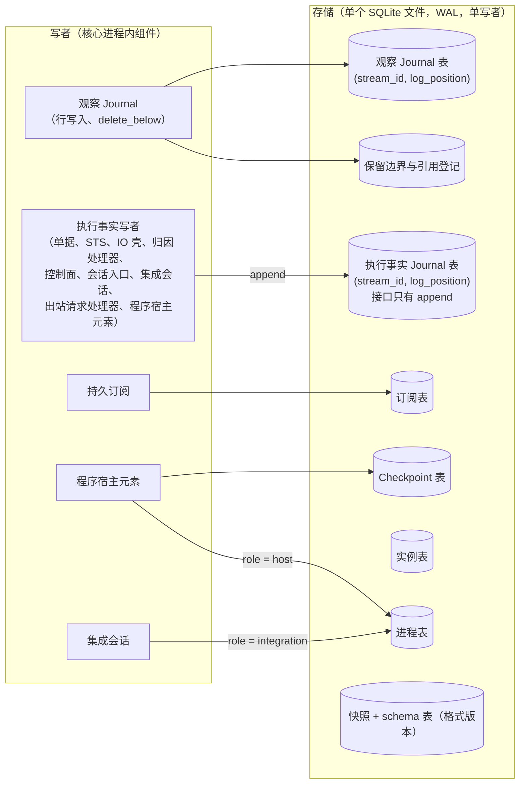

# 存储

## 0 定位

- **层级与元素**：L3 component，核心进程内的“存储”组件：单写者 SQLite 文件及其 Rust 侧接口。上级文档：[核心进程](design.md)。
- **本文决定**：两侧记录与核心自有的表落在哪里、以什么原子单位提交、“执行事实只追加”由谁保证、快照与格式版本怎样演进、实例表与进程表的持久接口，以及控制动作 `request_snapshot` 的规格。
- **读者**：实现存储层与恢复路径的实现者；审查持久化与崩溃语义的评审者。
- **状态**：已定。
- **非目标**：
  - 各种记录的**内容**与写入时机：归写它的组件（写者清单见 [core-process/design.md §4.3.4 执行事实的唯一写入口](design.md#434-执行事实的唯一写入口)、[core-process/design.md §4.5 持久化视图](design.md#45-持久化视图)）。
  - 哪些写落在同一事务：由编排该事务的组件决定，集合列在 [core-process/design.md §4.3.5 同事务集合](design.md#435-同事务集合)；本文只保证“一个事务要么全在、要么全无”。
  - 观察侧的保留规则、压缩判定与 `LogPosition` 的分配：归 [观察 `Journal`](observation-journal.md)；本文只提供按行删除与按位置读取的原语。
  - 启动顺序（fence、孤儿回收、重建）：归 [core-process/design.md §4.7.3 启动五步](design.md#473-启动五步)；本文只给出其中用到的表的语义。
  - 表名、SQL、索引与迁移脚本的具体写法：实现细节（`ARCHITECTURE.md`）。
- 证据标签与编号前缀的约定见 [README.md §0.4 阅读约定](../../README.md#04-阅读约定)。

## 1 问题域与驱动

### 1.1 上级分配给本组件的需求

| 来源 | 内容 | 本组件承担的部分 |
|---|---|---|
| [README.md §2 问题域](../../README.md#2-问题域) P15 | 快照、按存储类别的保留规则、压缩点、格式版本、迁移结果 | 快照与格式版本、迁移；压缩的删除原语（规则归观察 `Journal`） |
| C14 | 持久记录带格式版本；升级只前进；迁移失败拒绝启动而非部分迁移 | 全部 |
| H10 | 同一用户状态根上只能有一个核心实例持有单据与订阅表 | SQLite 独占与实例表（fence 的持久一半） |
| C7、H2 | 凭据只沿注入链；程序不可信 | 集成进程与程序宿主不接触数据库 |
| Q17 | 追加或替换订阅表中途 `kill -9`：只恢复完整记录，半写不可见 | 事务原子性 |
| Q21 | N+1 读 N 等价、反向拒绝、迁移中断电不出现第三态 | 格式版本与迁移 |
| Q22 | 秒级 K 线与大量增量指标不落后 | 单写者吞吐是这一响应的敏感点（§6） |
| Q28 | 保留边界推进不越过仍被引用的位置 | 只提供删除原语；判定归观察 `Journal` |

### 1.2 本组件直接面对的域性质

- **SQLite 文件与 fsync** [证据：`investigation/rust-feasibility.md`]：WAL 模式下一个事务提交即持久，未提交的事务在崩溃后不可见；SQLite 自带文件锁。本组件不另写分段日志与索引。
- **OS 文件锁**（H10）：锁由进程持有，随进程消亡释放。SQLite 独占与 OS 文件锁同向生效，所以取得 fence 的实例是唯一写者。
- **核心 UTC 时钟**：只用于实例表与快照的时刻标注，不参与任何顺序判断（顺序只由位置给出，[core-process/design.md §3.1 流、位置与三种进度](design.md#31-流位置与三种进度)）。

## 2 模型

### 2.1 一个文件、一个写者 [设计]

两侧 `Journal`、订阅表、`Checkpoint` 表、实例表、进程表、保留边界与引用登记、快照，全部持久化于**单个 SQLite 文件**（WAL 模式）。核心进程独占该文件，是唯一写者。

- 理由：`fold_state`、`AS OF` 与 cursor 之后的记录查询都要按 `(stream_id, log_position)` 取范围；放进一个有原生索引的引擎，这些都退化为范围扫描，不必自己写索引。一个文件里的多张表才能在一个事务里原子提交（同事务集合，[core-process/design.md §4.3.5 同事务集合](design.md#435-同事务集合)）。
- 集成进程与程序宿主**不接触**数据库，只经内部协议与核心交换记录：这同时满足凭据链（C7，凭据不经任何能读数据库的进程之外的路径）与程序不可信（H2，程序不能直接改记录）。
- 段池不在这里：它是可选子系统的另一套非持久存储（[program-host-element.md §4.7 核心↔可选行情派生计算子系统](program-host-element.md#47-核心可选行情派生计算子系统)）。
- 不选：**自写分段日志 + 索引**：需要自己写索引，且 okaywal 自述不宜生产 [证据：`investigation/rust-feasibility.md`]。

### 2.2 两侧共享存储原语，不共享抽象 [设计]

- 观察 `Journal` 与执行事实 `Journal` 都以 `(stream_id, log_position)` 为主键、`pos` 单调；这是**实现事实**。
- 两侧不共享类型宇宙是**设计事实**（[core-process/design.md §3.4 两个类型宇宙与唯一边](design.md#34-两个类型宇宙与唯一边)）：观察侧可撤回、可压缩，执行事实侧只追加。
- 表是否物理共表由实现按写放大与查询成本定，不改本节。
- 不选：**两侧共用同一表结构与代数**：为对账设计的类型扩到全体会污染认知，负 diff 也不能当外部写的补偿 [证据：fp-05 命题 12；fp-03 命题 1]。

### 2.3 “只追加”由 Rust 接口保证 [设计]

第一边界的第二层“执行事实侧只 append”（[core-process/design.md §3.3 两类记录与第一边界](design.md#33-两类记录与第一边界)）由本组件的 **Rust 侧接口**保证：执行事实各表的模块 API 只暴露 `append`，不依赖 SQL 权限约束。

- 观察侧另有一个删除原语 `delete_below`，只对 `RetractableDelta` 表存在，按调用方给出的行集删除、只删不改（§3）。它不存在于执行事实侧的任何表上，所以“删执行事实”写不出来。
- 执行事实 `Journal` 的每个写者都只经这个 `append` 写入，写者与其记录见 [core-process/design.md §4.3.4 执行事实的唯一写入口](design.md#434-执行事实的唯一写入口)。各方不争同一秘密：append-only 保证归本组件，写内容归各自组件，只读 fold 归读模型。

### 2.4 快照是近处副本 [设计]

状态随时可由 `fold_state` 重建，但重建从保留边界（执行事实侧从首条记录）扫起，成本随历史增长。快照因此是**重启延迟的必需项**，不只是加速。

它按 [README.md §1.2 权威源头与生命周期](../../README.md#12-权威源头与生命周期) 的“近处副本”规则写清：

| 项 | 内容 |
|---|---|
| 派生自 | 两侧 `Journal` 与订阅表：快照是 `fold_state` 在一个位置集 S 上的结果，带 S 与格式版本 |
| 依赖 | 该位置集之前的记录；本组件的格式版本 |
| 何时失效 | 格式版本与当前不符；S 在某条观察流上低于该流当前保留边界时，该流部分失效（见下）。快照（按频率的与 `request_snapshot` 的）都在一个 SQLite 事务里写，没有半写可见态：未提交的快照不存在 |
| 由谁刷新 | 本组件：按运行期参数的快照频率，或控制动作 `request_snapshot`（§3.1） |
| 不是 | 源头。它只加速读，不改 append-only 语义；丢弃任何快照都只增加重启延迟 |

- **观察流部分的失效** [推断]：快照在某条观察流上的位置低于该流此后推进到的保留边界时，那部分折入了已被压缩删去的记录的贡献；从它续 fold 与从记录重建可能给出两个答案，副本就成了第二个源头。所以重启时这条流的 fold 不取快照，从该流的保留边界起按留下的记录（含基线与覆盖检查点，[观察 `Journal`](observation-journal.md) §2.4）重建；其余部分照常取快照。推导依据：快照是 `fold_state` 在位置集上的结果、不是源头，失效即丢弃并从记录重建（本节表）；压缩后对任一 `as_of ≥ 边界` 的 fold 与压缩前相等（[观察 `Journal`](observation-journal.md) §2.4）；近处副本必须写清何时失效（[README.md §1.2 权威源头与生命周期](../../README.md#12-权威源头与生命周期)）。三条合起来，边界之上从留下的记录重建与原快照等价，边界之下的快照内容不再有可对照的源头。
- 快照频率与派生侧留存窗口都是运行期参数（[core-process/design.md §4.6 统一路径文件](design.md#46-统一路径文件)）。
- 不选：**纯 fold 重放、不设检查点**：重建从保留边界扫起，成本随历史长度线性增长，Q17 的重启延迟不受控 [证据：fp-05 命题 13]。

### 2.5 格式版本只前进 [设计]

- 格式版本持久化在 schema 表里（C14）。启动时核心先校验它（[core-process/design.md §4.7.3 启动五步](design.md#473-启动五步)）：文件版本高于二进制支持的，以专用退出码拒绝启动并报告版本；低于的，按顺序迁移到当前版本。
- 迁移在一个事务里完成：断电后文件要么仍是旧版本完整可读，要么已是新版本完整可读，没有部分迁移态。迁移失败拒绝启动，不进入部分运行态。
- 迁移只前进；没有向下迁移。
- 统一路径下配置文件的格式版本是同一规则的另一处落点，由 [core-process/design.md §4.6 统一路径文件](design.md#46-统一路径文件) 规定；本组件只管 SQLite 文件。
- 不选：**双向迁移 / 部分迁移**：部分迁移产生半迁移态，违反 C14 [证据：域 O9、C14]。

### 2.6 不变量

1. 一个事务的写要么全部可见，要么全部不可见；崩溃后只有已提交的事务。由 SQLite WAL 事务保证。
2. 执行事实侧的记录一经提交，永不删除、永不改写。由 §2.3 的接口形状保证。
3. 观察侧的删除只删不改：留下的行逐字节不变。由 `delete_below` 只接受行集、不接受更新保证。
4. 任一时刻只有一个进程写这个文件。由 OS 文件锁 + SQLite 独占（H10）保证。
5. 快照从不是源头：丢弃快照、从记录重建得到同一状态。由 §2.4 的失效条件保证。

## 3 接口

本组件对核心进程内的其他组件提供下列接口；这些都是进程内接口，不是跨进程契约。

| 接口 | 使用者 | 语义 |
|---|---|---|
| 事务 `tx(…)` | 编排同事务集合的各组件（[core-process/design.md §4.3.5 同事务集合](design.md#435-同事务集合)） | 事务内的全部写原子提交；函数返回错误或进程崩溃即全部回滚 |
| 执行事实 `append(stream, record)` | [core-process/design.md §4.3.4 执行事实的唯一写入口](design.md#434-执行事实的唯一写入口) 所列写者 | 在调用方的事务里、于该流末追加，分配该流的下一个 `Seq`（位置由核心在 append 时创建，[core-process/design.md §3.1 流、位置与三种进度](design.md#31-流位置与三种进度)）；追加后不可改删 |
| 观察记录的行写入与 `delete_below(stream, rows)` | [观察 `Journal`](observation-journal.md) | 行写入与按行删除；位置分配与“删哪些”的判定都在观察 `Journal` |
| 按位置读 `read_range(stream, from, to)` | 各 fold、投递调度 | 按位置先后交出已提交记录的**字节**，两侧通用、不解析；投递调度据此原样搬运执行事实订阅所选的记录（[delivery.md §3.4 执行事实的搬运](delivery.md#34-执行事实的搬运)） |
| 订阅表、`Checkpoint` 表、保留边界与引用登记表的行读写 | 各自的唯一写者（[core-process/design.md §4.5 持久化视图](design.md#45-持久化视图)） | 普通表；本组件不解释内容 |
| 实例表 | 启动第 1 步、受控停止 | §4.2 |
| 进程表 | 集成会话、程序宿主元素、启动第 1 步 | §4.3 |
| 快照 `write_snapshot(S)` / `load_snapshot()` | 本组件自身、`request_snapshot`、启动第 2 步 | §4.4 |

**undesired events**：

- SQLite 报告磁盘满或 I/O 错误：事务回滚，调用方得到错误；本组件不重试、不部分提交。调用方按各自规则处理（例如 IO 壳的 `SendBarrier` 持久化失败即不发出，[io-shell.md §4.2 发送屏障与发出前门](io-shell.md#42-发送屏障与发出前门)）。
- 读到格式版本不符的快照：丢弃，从记录重建；不作错误上报。

### 3.1 控制动作 `request_snapshot`

核心↔解释层控制组的一员；授权、控制记录的共同形状与受控停止期间的结论见 [control-plane.md §4.2 共同流程](control-plane.md#42-共同流程)，本节只写它自己的语义。

- **语义**：请核心立刻写一份重启加速快照（P14）。它不改变任何源头状态，不对外提供读：快照不是可读的“账户快照”（[README.md §0.3 非目标](../../README.md#03-非目标)）。
- **参数**：无。
- **动作轴**：写（append 控制记录，落控制流，[core-process/design.md §4.5 持久化视图](design.md#45-持久化视图)）。
- **核心内部结果** [设计]：本组件编排一个事务，写入一份快照（§4.4），控制面在同一事务里写 `Applied`（控制记录的写者仍是控制面，[control-plane.md §4.2 共同流程](control-plane.md#42-共同流程)）。快照所截的位置集 S 是这个事务之前已提交的切面，不含这条 `Applied`；重启载入它之后照常 fold S 之后的记录，这条 `Applied` 在其中。
  - 所以 `Applied` 蕴含：那一份快照与它的位置集 S 曾完整提交。它不蕴含下一次启动一定采用这份快照：此后格式版本升级或保留边界推进仍可使它（或它在某些观察流上的部分）失效（§2.4），那时按失效条件丢弃或从边界重建。
  - 快照写入失败（磁盘满、I/O 错误）：事务回滚，没有新快照、也没有 `Applied`；控制面在一个新事务里 append `Rejected(reason)`。存储连这条也写不进时，这次动作没有结论记录，按控制组的共同规则不生效（[control-plane.md §4.3 错误与 undesired events（共同部分）](control-plane.md#43-错误与-undesired-events共同部分)）；核心不以内存里的返回值冒充结论。
  - 理由：快照与控制记录都在同一个 SQLite 文件里，一个事务就能让“`Applied` 在”与“快照在”同真同假；运维看到 `Applied` 就知道这份快照曾经存在，而不必另查快照表。S 截在 `Applied` 之前，快照不必把自己的结论折进去。
  - 不选：**收到请求即 `Applied`、快照随后写**：`Applied` 说不出快照是否存在，写失败时已有的 `Applied` 无法撤回；**快照事务提交之后再单独 append `Applied`**：两次提交之间崩溃留下一份没有结论的快照，动作按共同规则未生效，快照却在，两者说法相反。
- **错误**：越权 → `Unauthorized`（共同规则）；快照写入失败 → `Rejected(reason)`。
- **崩溃**：提交之前崩溃，快照与 `Applied` 都不在，旧快照照旧有效，动作没有结论、不生效；提交之后（含答复发起方之前）崩溃，二者都在，发起方重连后在控制流上读到 `Applied`（崩溃矩阵 #11，[core-process/design.md §5.2 崩溃矩阵（#1–#21）](design.md#52-崩溃矩阵121)）。

## 4 内部结构

### 4.1 表的分组

图里只画本组件的表与直接写它们的组件；保留边界与引用登记的内容规则见 [观察 `Journal`](observation-journal.md) §2.5–§2.6。

### 4.2 实例表

- **写**：启动第 1 步的 fence 事务写入新实例的一行，`instance_id` 为上一行加一，与 fence 同事务持久化；受控停止在本实例的行上写**结束锚点**，只在全部内层结束之后写，写了之后本实例不再写任何记录（顺序见 [core-process/design.md §4.7.4 受控停止](design.md#474-受控停止-设计)）。
- **读**：启动时取下一个 `instance_id`；诊断报告上一实例是受控停止（有结束锚点）还是崩溃（没有）。
- **性质**：`instance_id` 单调递增，是 `SessionEpoch` 与各记录上实例身份的来源（[integration-session.md §3.5 会话：核心创建的通道化身](integration-session.md#35-会话核心创建的通道化身-设计)）。上一实例没有结束锚点时，新实例的 fence 事务就是它的失权点。

### 4.3 进程表

- **性质**：指向 OS 进程的**索引**，不是进程状态。进程的存亡只问 OS，按 `(pid, start_time)` 核对（[README.md §1.2 权威源头与生命周期](../../README.md#12-权威源头与生命周期)）。
- **行**：`(instance_id, pid, start_time, role)`，`role ∈ {integration, host}`。
- **写**：集成会话拉起集成进程、程序宿主元素拉起宿主时各写一行；OS 确认该进程退出之后，由写它的组件清除。两个写者按 `role` 分行，各写各的行。拉起与退出确认的规则在 [integration-session.md §4.5 进程、通道与凭据](integration-session.md#45-进程通道与凭据)、[program-host-element.md §3.2 成员、活动集合与失败抑制](program-host-element.md#32-成员活动集合与失败抑制)。
- **读**：新实例启动时回收旧 `instance_id` 名下仍匹配的进程（[core-process/design.md §4.7.3 启动五步](design.md#473-启动五步)）；同一集成拉起下一个进程之前，确认上一个的行已清除。
- **传播**：与 fence 同库；一行从拉起存在到 OS 确认退出；受控停止之后不留行。

### 4.4 快照的写与读

- **写**：按运行期参数的快照频率，或 `request_snapshot`。快照带位置集 S 与格式版本，在一个 SQLite 事务里提交（`request_snapshot` 的 `Applied` 同在这个事务里，§3.1）；事务未提交的快照不存在；新快照提交之后旧快照可删去。
- **读**：启动第 2 步。取已提交的快照里最新的一份；格式版本不符的丢弃；否则载入，再对每条流 fold S 之后的记录；观察流上 S 低于当前保留边界的部分按 §2.4 从边界重建。重建失败拒绝启动（[core-process/design.md §4.7.3 启动五步](design.md#473-启动五步)）。

## 5 走查

组件内细化；主 trace 在 [core-process/design.md §5.1 W7（Q17）核心 append 中途崩溃](design.md#w7q17核心-append-中途崩溃) 与崩溃矩阵。

**W7 的存储细化（追加或替换订阅表中途 `kill -9`，Q17）**

1. 某组件在 `tx` 里写观察记录并更新订阅表的 cursor，提交前进程被杀。
2. WAL 里的未提交事务在下次打开文件时不可见：两处写都不在（不变量 1）。
3. 重启第 2 步：载入快照（若有且有效），fold 之后的已提交记录；订阅表是提交前的状态。
4. 对外可见：没有半条记录；订阅者从已确认 cursor 之后续接。
5. 卡点：无。事务边界由调用方决定、原子性由 SQLite 给出，二者在本组件接口上分开。

**崩溃矩阵 #11 的恢复细节（快照写入中途）**

1. 快照事务未提交时崩溃：新快照不存在，只有旧快照有效；`request_snapshot` 触发的这次也没有 `Applied`。
2. 重启时存储里只有已提交的快照（§4.4）：从上一份有效快照、或没有快照时从记录 fold。
3. 对外可见：只有重启延迟变大；记录与 append-only 语义不受影响；控制流上没有这次动作的结论。
4. 卡点：无。

**格式升级（Q21）**

1. 版本 N+1 的核心打开版本 N 的文件：fence 之后、重建之前，在一个事务里迁移到 N+1。
2. 迁移中断电：事务未提交，文件仍是完整的 N；再次启动重新迁移。
3. 版本 N 的核心打开 N+1 的文件：以专用退出码拒绝启动并报告版本，不写任何东西。
4. 卡点：无。

**快照早于压缩（§2.4 观察流部分的失效）**

1. 快照 S 在健康流 h 上的位置为 100；之后 `advance_retention` 把 h 的边界推到 200，删去 100–200 之间被同键取代的记录。
2. 重启：h 的快照位置 100 < 边界 200，这一部分不取快照；从边界起按留下的基线与记录 fold。边界、覆盖检查点与删除在同一事务里提交（[observation-journal.md §3.2 控制动作 advance_retention(to: Set<LogPosition>)](observation-journal.md#32-控制动作-advance_retentionto-setlogposition)），所以重启时读到的边界之下只有该留的记录。
3. 结果与“丢弃全部快照、从记录重建”相同。
4. 这条失效条件是 §2.4 标 [推断] 的推导。卡点：无。

**`request_snapshot` 的结论（§3.1）**

1. 运维经控制面发 `request_snapshot`，授权通过。
2. 本组件开事务：截取已提交切面 S，写快照；控制面在同一事务写 `Applied`；提交。
3. 变体：写快照时磁盘满，事务回滚；控制面在新事务 append `Rejected(reason)`。若这条也写不进，动作没有结论，发起方重连后在控制流上看不到它，即它没有生效。
4. 变体：提交之前 `kill -9`：重启后没有新快照、没有 `Applied`，从旧快照（或记录）恢复；提交之后、答复之前 `kill -9`：`Applied` 与带 S 的完整快照都已持久；重启所得状态与从记录重建的相等，其间没有格式升级、保留边界推进或更新的快照时，启动第 2 步载入的就是这份快照，再 fold S 之后的记录（含这条 `Applied`）。
5. 卡点：无。

## 6 评估

### 6.1 风险 / 敏感点 / 权衡

- **风险：单写者吞吐**。单 SQLite 文件、单写者在 Q22 负载下的写放大与重启延迟。它不改变“两侧抽象不共享”的裁决；以验收 #19（秒级负载不落后，[core-process/design.md §6.3 验收标准](design.md#63-验收标准)）测量。
- **敏感点：`fold_state` 重建成本 vs 快照周期**。周期拉长，Q17 的重启延迟随历史长度线性恶化；缩短则写放大增加，触碰单写者吞吐（下一条）。
- **敏感点：单写者吞吐 vs B1**。秒级 K 线清洗与大量增量指标（Q22）若超过单写者吞吐，派生分发响应劣化。这是“单文件单写者”裁决的敏感点，同样以验收 #19 测量；超出时改的是落点（批量提交、表布局），不是单写者与事务原子性这两条模型。

### 6.2 验收

20. **格式升级**（本文 §2.5；对应 Q21）：
    - 版本 N+1 的核心读版本 N 的 SQLite 文件与配置文件后，`fold_state` 与读模型和升级前等价（配置文件的格式版本规则见 [core-process/design.md §4.6 统一路径文件](design.md#46-统一路径文件)）；
    - 版本 N 的核心读 N+1 文件，以专用退出码拒绝启动并报告版本；
    - 迁移中任一点断电后重启，文件为旧或新之一完整可读，无部分迁移态。
88. **`request_snapshot` 的结论与快照同事务**（本文 §3.1；对应 Q17、Q21）：
    - 成功：控制流上有 `Applied`，存储里有一份带位置集 S 的完整快照，S 不含这条 `Applied`；随后重启核心，恢复所得状态与删去全部快照、从记录重建的相同；这次动作与重启之间没有格式升级、保留边界推进或更新的快照时，启动第 2 步载入的就是这份快照，并 fold S 之后的记录（含这条 `Applied`）；
    - fixture 使快照写入失败（磁盘满或 I/O 错误）：没有新快照，也没有 `Applied`；控制流上有这次动作的 `Rejected(reason)`；旧快照照旧可用；
    - 在快照事务提交之前注入崩溃：重启后没有新快照、没有这次动作的结论记录，从旧快照（没有快照时从记录）恢复；在提交之后、答复发起方之前注入崩溃：重启后快照与 `Applied` 都在，重连的发起方在控制流上读到 `Applied`；
    - fixture 使 `Rejected` 自身也写不进：这次动作在控制流上没有任何结论记录，发起方重连后看不到它，按共同规则视为未生效；核心没有向发起方返回任何未持久化的结论。
