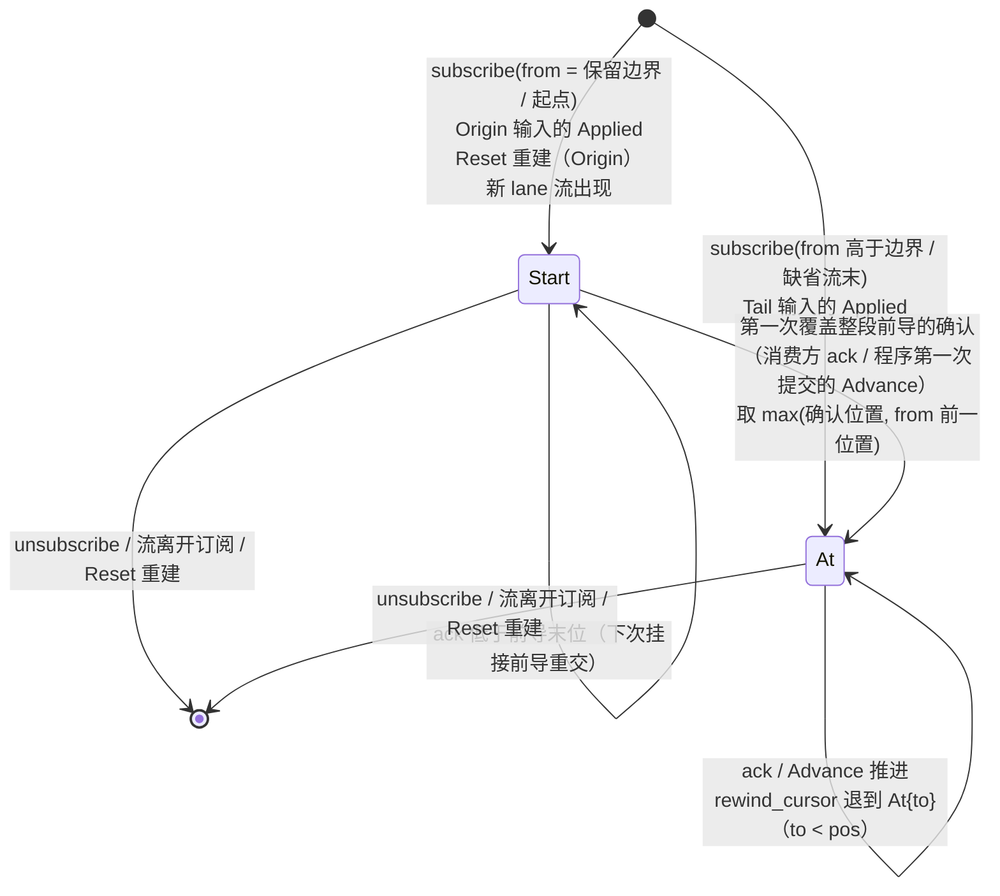
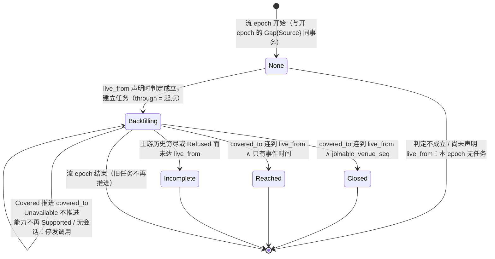
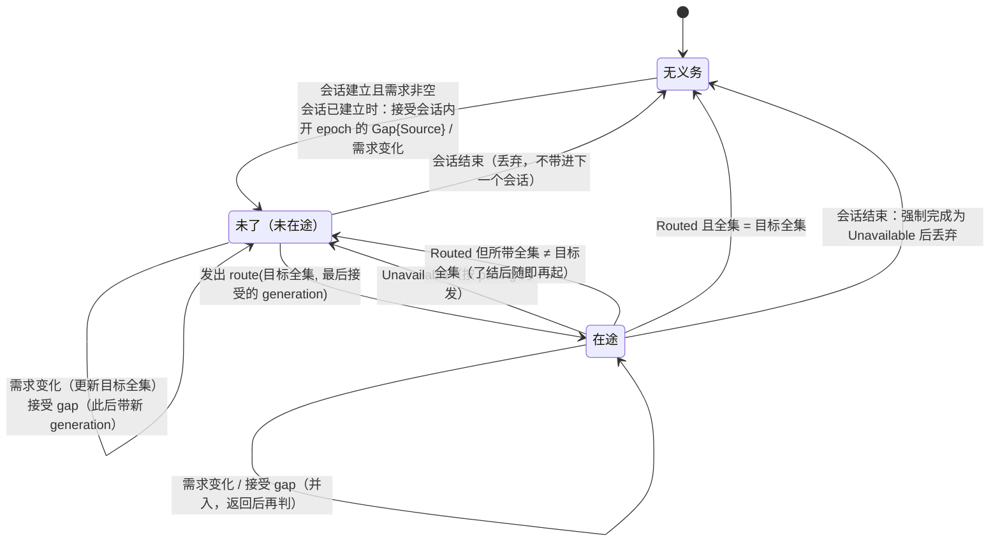
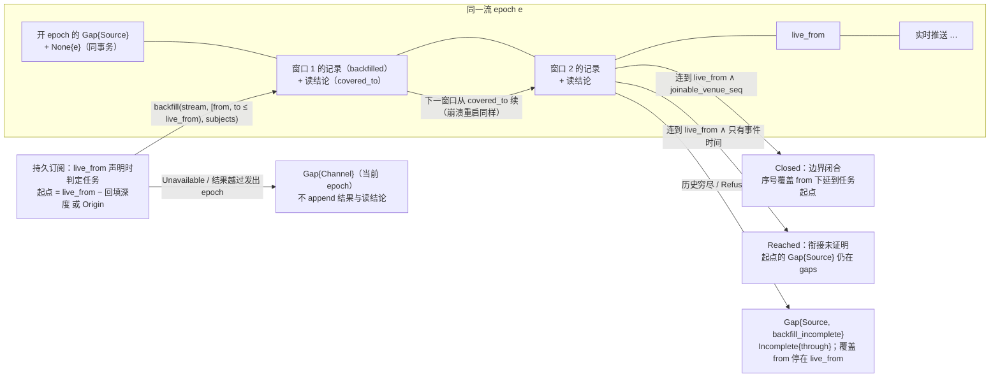

# 持久订阅

## 0 定位

- **层级与元素**：L3 component，核心进程里的“持久订阅”元素。上级：[core-process/design.md §4.1 组件指南](design.md#41-组件指南)。
- **本文决定**：订阅表（订阅、逐项状态、cursor、投递缺口）的内容、转移与唯一写入口；消费方订阅组的操作 `subscribe` / `ack` / `unsubscribe` 与控制动作 `rewind_cursor` 的完整规格；逐项接纳与配额；核心→集成的 `route` 与 `backfill` 的完整规格；回填任务、实时边界与回填进度；序号覆盖与覆盖检查点；程序订阅的项与 cursor 的生命周期。
- **读者**：实现持久订阅与它的相邻组件（投递调度、集成会话、程序宿主元素、控制面、读模型）的人；实现集成的人读 §4.3–§4.5 的对端义务。
- **状态**：已定。
- **非目标**：
  - 记录怎样按 cursor 交给订阅者、何时判定跳过：[delivery.md](delivery.md)；本文只拥有“跳过之前先写下缺口”这件事的写入与删除。
  - 一次性读：[one-shot-read.md](one-shot-read.md)。回填不经一次性读，由本文发起。
  - readiness、握手、声明的两种解释、`generation` 的集成侧义务：[integration-session.md §4.3.2 集成→核心的推送](integration-session.md#432-集成核心的推送)、[integration-session.md §4.3.1 handshake](integration-session.md#431-handshake--projection--refused--unavailable)、[integration-session.md §3.6 声明的两种解释](integration-session.md#36-声明的两种解释-设计)、[integration-session.md §4.4 集成义务清单](integration-session.md#44-集成义务清单)。
  - 保留边界与引用登记的规则、按键保留：[observation-journal.md §2.4 保留：边界与删除规则](observation-journal.md#24-保留边界与删除规则)。
  - 健康面的 fold 与 `subscriptions`、`orders` 读模型：[read-model.md §3.5 健康面](read-model.md#35-健康面-设计)、[read-model.md §4.2 读模型集合](read-model.md#42-读模型集合)、[read-model.md §3.4 精确重建的前提与完整界](read-model.md#34-精确重建的前提与完整界-设计)。
  - 宿主协议与程序的装载、替换、卸载的编排：[program-host-element.md §4.6 宿主协议](program-host-element.md#46-宿主协议)、[program-host-element.md §4.4 卸载与替换](program-host-element.md#44-卸载与替换)。
  - 同事务集合与调用计数的提交协议：[core-process/design.md §4.3.5 同事务集合](design.md#435-同事务集合)、[core-process/design.md §4.3.6 调用结果与计数的提交协议](design.md#436-调用结果与计数的提交协议)。

证据标签与编号前缀见 [README.md §0.4 阅读约定](../../README.md#04-阅读约定)。

## 1 问题域

### 1.1 分配给本组件的需求与契约

来自上级（需求原文见 [README.md §2 问题域](../../README.md#2-问题域)）：

| 来源 | 分给本组件的部分 |
|---|---|
| P3 | 投递缺口的三种原因 `slow_consumer` / `compacted` / `conflated` 的记录；订阅的挂起与恢复是状态通知，不是损失 |
| P4 | 订阅需求的“机→集成”一半（`route`）、逐项订阅状态、逐主体“来源拒绝” |
| P5 | 历史回填（`backfill`） |
| C5、H5 | 订阅的 owner 是核心、归属 principal，与消费方连接无关 |
| C6 | 不伪造连续：跳过、未覆盖区间、主体从何处起有记录都显式标出 |
| F7、F11 | 上游供给是按主体的、有配额的；多数 venue 无续传游标 |
| Q11、Q12、Q13、Q14、Q15、Q29、Q31 | 见 §2 |

核心进程分配给本组件的接口：核心↔解释层的订阅组与 `rewind_cursor`；核心↔集成的 `route`、`backfill`、实时边界与序号覆盖（[core-process/design.md §4.2 对外接口总表](design.md#42-对外接口总表)）。本组件在核心进程里的位置与同级元素的互用见 [core-process/design.md §4.3.1 uses 图](design.md#431-uses-图)；本文 §4.8 写本组件一侧的接口。

### 1.2 本组件直接面对的域性质

- **供给是来源的结论** [设计]：UTA 要什么主体是 UTA 的意图；来源此刻确认供给了什么，只有来源在对 `route` 的回答里说得出。所以需求与供给是两个事实，前者在订阅表，后者在流上的路由结论记录（§4.3）。
- **上游历史的可得性由上游决定**：能回填多远、是否保留从起点起的全部修订，是上游的性质；集成以 `backfill_from_origin` 声明，一致性测试查它（[integration-session.md §3.3 投影 Projection](integration-session.md#33-投影-projection)）。
- **只有可衔接序号能证明衔接** [证据：域 F7；事件时间不定序，见 [core-process/design.md §3.8 基础值类型](design.md#38-基础值类型)]：`joinable_venue_seq` 的流在一个流 epoch 内序号连续、回填与推送同一序号空间；只有事件时间的流不定序，也不能证明某段上游输出是否送达。
- **流 epoch 的边界属于集成**：上游连接是集成的，`Gap{origin: Source}` 由它上报；`generation` 是它创建的名字（[integration-session.md §4.4 集成义务清单](integration-session.md#44-集成义务清单)）。
- **订阅表在核心独占的 SQLite 文件里**，单写者、事务原子（[storage.md §2.1 一个文件、一个写者](storage.md#21-一个文件一个写者-设计)）。

## 2 驱动

分配给本组件的质量场景（六要素原文见 [README.md §3.1 质量场景](../../README.md#31-质量场景)），本组件的响应度量：

| Q | 本组件的响应 | 度量（验收） |
|---|---|---|
| Q13 | 超配额的项在路由前被拒或挂起，集成从不收到超限主体，既有订阅不受影响 | 验收 #28、#47 |
| Q14 | 回填与实时的衔接只在可证明时报告闭合；崩溃后从覆盖边界续，同 epoch 无重复 | 验收 #28、#49、#68、#74 |
| Q15 | 订阅逐项接纳，一项被拒不连累其余 | 验收 #48、#75 |
| Q29 | 重连后自动挂接、从已确认 cursor 续，投递缺口先于记录再次交出 | 验收 #29、#37、#70 |
| Q11、Q12 | 断代与投递损失都以缺口显式记下；慢者不拖累他人 | 验收 #70 |
| Q31 | 完备只来自来源证据（序号覆盖） | 验收 #68 |

## 3 模型

### 3.1 订阅与项

订阅是核心自有的状态（源头是核心），存在订阅表里（§4.9）。订阅有两种：消费方的订阅（归属 principal，经 `subscribe` 建立），与每个活动程序 id 一个的程序订阅（§4.7）。

消费方订阅的 `selector` 有三种，互斥：

- **观察流**：一组项，每项 `(来源, 流, 主体集?, 用途)`；各项可以是不同的流、不同的来源，来源是 `Integration(_)` 或 `Program(_)`（[core-process/design.md §3.1 流、位置与三种进度](design.md#31-流位置与三种进度) 中的 `Source`）。主体是该流种类的订阅主体（如 instrument 身份）；不带主体集的项即订整条流。`用途` 二选一，缺省为供给：
  - **供给项**：它的主体（整条流为 `All`）进入该流的需求，由核心经 `route` 向集成要推送（§4.3），在配额池里计入用量（§4.1 配额）；
  - **只投递项**：只搬运该流上已有或将有的记录，不进入需求、不占配额，也不使集成推送任何东西。它在集成来源的流上收到的数据记录只有别的需求带来的推送、回填，以及一次性读、回执与对账写在该流上的记录；在程序产出的流上是该程序的派生记录（[program-host-element.md §3.3 输出契约与程序流](program-host-element.md#33-输出契约与程序流)）。
- **执行事实**：`(来源, WriteScope?)`：该来源（或其一个作用域）的执行事实，包括单据记录、Decision/`Outcome`/`Rejection`、`bypass_lane` 的控制记录 `Applied`、`Prepared` 起的尝试记录（含 `NotSent`、`Abandoned`）、`ResolutionEvidence`、`ReconciliationReopened`、取证 `Gap{origin: Channel}`、`CapabilityObserved`，以及该来源的声明版本。执行事实按 `WriteLaneKey` 各成一条流，针对 `(WriteLaneKey, OperationKind)` 的 `CapabilityObserved` 与带该单据 `WriteLaneKey` 的 `bypass_lane` 控制记录随该 lane 的流；每个来源的声明版本与针对其逻辑流读 / 回填能力的 `CapabilityObserved` 同成该来源的一条声明流。带 `WriteScope` 的订阅得到该作用域各 lane 的流与该来源的声明流。selector 选中的是这组流的**成员规则**，不是订阅时已有的流：此后才出现的 lane 流（新的 `WriteLaneKey` 第一次有记录）自动进入订阅，从它的第一条记录起投递。另有两种不属任何来源的执行事实流：每个程序一条**请求流**，按程序 id，承载该程序的 `EffectRequest` 与全部 `EffectResponse`（[outbound-requests.md §3.4 完成事实 EffectResponse 与请求流](outbound-requests.md#34-完成事实-effectresponse-与请求流-设计)），它是该程序自己的隐含输入（§4.7），不经任何 selector 订阅；核心唯一的一条**控制流**，经下一种 selector 订阅。
- **控制**：`Control`：核心的控制流：登记的采纳记录、除 `bypass_lane` 之外的控制记录（`Applied` / `Rejected`）、`IntegrationHalted`、轮换兑现记录、`ProgramHalted`（控制流的记录模型见 [core-process/design.md §4.5 持久化视图](design.md#45-持久化视图)）。它不属任何来源，不经 `(来源, WriteScope?)` 选中，接纳不看采纳集合与声明。只能 `ordered`，可从起点订阅；执行事实没有保留边界，所以没有投递损失。健康的成员按它 fold（[read-model.md §3.5 健康面](read-model.md#35-健康面-设计)），所以自行 fold 健康的消费方订阅它与健康流即可。

这些流都有 `LogPosition`，所以 cursor 与确认对三种 selector 同一套（§3.2）。

[设计] 一个观察流订阅可选多条流、跨来源，逐项接纳。理由：下游的一个关注对象（一组 instrument 的报价与 bar、一个账户的订单与持仓）本就跨流甚至跨来源，而订阅状态、cursor 与重连挂接都按订阅给出；每流一个订阅要下游自己维护一组订阅的生死与 cursor。逐项接纳沿用一次性读逐 target 独立的结构，一项被拒不连累其余。不选：每流一个订阅（同上）；只准同一来源的多条流（跨来源的关注对象仍要拆成多个订阅，而逐项判定已使来源之间互不影响）；把观察流与执行事实放进同一 selector（执行事实只能 `ordered`、不受声明与会话影响、没有保留边界，混在一个订阅里整体状态与消费方式都要分叉）。

[设计] 执行事实 selector 按成员规则选流、包括之后才出现的 lane。理由：下游订阅一个账户的执行事实，是要看到它此后的每一笔单据；lane 流在第一笔单据时才出现，若只选订阅时已有的流，新 lane 的单据会静默缺失。不选：订阅时固定流集、新 lane 另订：下游无从得知新 lane 何时出现，除非再订阅执行事实。

[设计] 执行事实可订阅。理由：读模型 `orders`、`lanes` 读执行事实，而“原始记录是消费契约、消费方可自行 fold”（[read-model.md §4.2 读模型集合](read-model.md#42-读模型集合)）要求这些记录本身可取得；解释层对下游的待审事项、结果未知与已确认推送（[downstream/design.md §4 结构](../../downstream/design.md#4-结构)）也需要一个与观察订阅同样持久、可续传的来源。不选：提供读模型的变更推送（那是一套新的变更引擎，重连与续传语义要另定）；只准轮询读模型并收窄自行 fold 的承诺（推送变成轮询，续传语义与其余订阅不同）。

单据的偏离（`basis_validity`、`alignment` 的重算）不是记录，不出现在执行事实订阅里：待审事项的出现、决定与关闭经订阅推送；某项此刻是否偏离，解释层在呈现时读 `tickets` 当前态（[read-model.md §4.2 读模型集合](read-model.md#42-读模型集合)），真正放行仍由核心当次的门判定（[decision-chain.md §4.5 放行门](decision-chain.md#45-放行门)）。

**供给项与只投递项分开** [设计]：需求按主体路由、配额按主体计；“接着看一次读的结果”“审计已退役的来源”这样的用法只要搬运已有记录，不向上游多要推送，也就不该占配额。数据记录按主体过滤的投递规则见 [delivery.md §3.3 按主体投递](delivery.md#33-按主体投递)。不选：以空主体集表示“只投递”：空集已是“撤回需求”的意思（§4.3），同一个值有两种用途；以供给项等一次读的结果：为接着看一次读而向集成要推送，还占配额。

### 3.2 cursor 与确认

每个订阅者在每条选中流上持有一个 cursor，由本组件作为唯一物理写者持久化（§4.9）。它是一个和类型 [设计]：

```rust
enum CursorPos { Start { from: LogPosition }, At { pos: LogPosition } }   // 每条选中流一个；与输入声明的起点策略 Start { Tail, Origin } 不是一回事
```

- **`At{pos}`**：已确认到 `pos`（含 `pos`），投递从 `pos` 之后开始。`pos` 可能落在保留边界之下（保留边界推进越过它，或 `rewind_cursor` 退到那里），这时按 §3.3 的逐段规则交出 `compacted` 缺口与各段之间留下的记录。
- **`Start{from}`**：cursor 在 `Origin` 或保留边界上建立或重建时取这一支，`from` 是那个起点（观察流的保留边界，执行事实流与控制流的第一条记录；此后才进入订阅的 lane 流为它的第一条记录）。它表示订阅从 `from` 开始、还没有任何确认。cursor 为 `Start{from}` 时，每次挂接与重新挂接（程序订阅是每次 `Advance`）都按位置先后交出：该流此刻在 `from` 之下留下的记录（健康流各键的基线；程序流各流 epoch 的基线与原位置留下的开 epoch 的 `Gap{origin: Source}`，[observation-journal.md §2.4 保留：边界与删除规则](observation-journal.md#24-保留边界与删除规则)），称为**前导**；然后是 `from` 及以上此刻已被压缩删去的各段的 `compacted` 缺口；然后是 `from` 起的记录（排列的执行见 [delivery.md §4.2 前导与缺口的排列（按 cursor 的两支投递）](delivery.md#42-前导与缺口的排列按-cursor-的两支投递)）。`from` 之下被删去的记录不是损失，不记缺口：订阅本就从 `from` 开始。
- **从 `Start` 到 `At`**：开始锚点是 cursor 的建立或重建（确认者是建立它的一方：消费方的 `subscribe`，或控制面的 `Applied`）；结束锚点是第一次覆盖整段前导的确认，确认者是订阅者：消费方的 `ack(c)` 在 `c` 不低于该流此刻在 `from` 之下的每一条留下的记录时生效（前导为空时任何一次确认都满足），程序订阅是第一次提交的 `Advance`（每批都先交出整段前导，[program-host-element.md §4.6 宿主协议](program-host-element.md#46-宿主协议)）。cursor 由此成为 `At{p}`，`p` 取确认的位置与 `from` 的前一位置中较大者：`from` 之下没有交出的位置都已被删去，不是损失，所以越过它们不确认任何未交出的记录。低于前导末位的 `ack` 不结束 `Start`：前导在下次挂接时照样整段交出，订阅者按 `LogPosition` 去重。这一个和类型就是前导的起止，不另设标志。
- **建立时的取支**：消费方 `subscribe` 的 `from` 等于该观察流的保留边界，或执行事实流 / 控制流的起点，建为 `Start{from}`；高于保留边界的位置 `p` 建为 `At`，投递从 `p` 起（含 `p`），即 `At` 取 `p` 的前一位置；缺省为当前流末，建为 `At{流末}`，不补历史，即使流末恰与保留边界相同。程序的输入按声明的起点：`Origin` 建为 `Start{from}`，`Tail` 建为 `At{流末}`，`Reset` 照同样的起点重建（§4.7）。`rewind_cursor` 只退回 `At{pos}`、只退到低于 `pos` 的 `to`，退回的 cursor 是 `At{to}`，不回到 `Start`（§4.1）。
- **确认 = 消费方已处理**：消费者向核心提交“已处理到 `LogPosition` p”，本组件把 cursor 推进到 p（`Start` 时按上一条）。已投递未确认的记录是消费者内存里的事。
- **重投**：确认前崩溃或断连后，从已确认 cursor 之后重投（`Start` 时从前导重新交出），所以同一记录可能被同一订阅者重复看到。重复只发生在未确认区间；消费者按 `LogPosition` 去重，每条记录的 `(StreamId, Seq)` 唯一（[core-process/design.md §3.1 流、位置与三种进度](design.md#31-流位置与三种进度)）。这是投递去重，只认同一条记录；同一笔执行经不同渠道到达是不同的记录，它们按执行身份计数（[read-model.md §3.2 成交的计数身份](read-model.md#32-成交的计数身份-设计)），与投递去重互不替代。
- **已确认区间不重投**。退回 cursor 是显式控制动作 `rewind_cursor`，不是恢复路径。
- **程序订阅同样受此约束**：它不 `ack`，提交的 `Advance` 就是确认（§4.7）。所以程序重启后从其 `Checkpoint` 对应的 cursor 续读，不会看到已折入状态的记录；第一次 `Advance` 提交之前崩溃的，cursor 仍是 `Start{from}`，重启后前导整段重新交出。

cursor 是三种进度之一，与完备进度、保留边界互不替代（[core-process/design.md §3.1 流、位置与三种进度](design.md#31-流位置与三种进度)）：它来自订阅者的确认，不说任何完备。



### 3.3 投递缺口 `Gap{origin: Delivery}`

`reason ∈ {slow_consumer, compacted, conflated}`（P3），分别是 `latest` 订阅的投递缓冲耗尽而被停投、订阅位置已被压缩到保留边界之下、`latest` 消费合并（何时出现由投递调度判定，[delivery.md §3.1 三种消费方式（投递侧）](delivery.md#31-三种消费方式投递侧)）。它与来源缺口、渠道缺口的区别见 [core-process/design.md §3.2 gap 的三种来源](design.md#32-gap-的三种来源)。

- **它是订阅的状态，不是流上的记录**：说的是“这个订阅在这条流上没有收到位置 `from` 到 `to`（两端都含）的记录”，流本身并不缺这些记录。源头是核心的投递，拥有者与唯一写者是本组件，存在订阅表里，按（订阅，流）记，与该流的 cursor 同一粒度：`{流, from, to, reason}`。
- **开始锚点**：投递调度要跳过一段时，请本组件写下这一项，写下之后才跳过，所以崩溃不会留下没有记下的跳过。`to` 是被跳过的最后一个位置：`slow_consumer` 与 `conflated` 为跳过时该流已交出范围的末位。`compacted` 只覆盖压缩删去的位置：该订阅 cursor 之后、保留边界之下，且不在同一（订阅，流）上尚未确认的投递缺口里的被删位置，每一段连续的各记一项，`to` 是这一段的最后一个位置；各段之间留下的基线（健康流按键、程序流按流 epoch，[observation-journal.md §2.4 保留：边界与删除规则](observation-journal.md#24-保留边界与删除规则)）不在缺口里，与缺口一起按位置先后交出。
- **交出**：确认之前，每次投递与重新挂接都把它按位置交出：排在该流 `to` 之后的记录之前，不排在它自己的 `from` 之前的记录之前（[delivery.md §4.2 前导与缺口的排列（按 cursor 的两支投递）](delivery.md#42-前导与缺口的排列按-cursor-的两支投递)）。
- **结束锚点**：订阅者确认一个不低于 `to` 的 cursor，即显式确认这次损失：cursor 推进与该项删除在同一次写里；确认到 `to` 不确认任何尚未交出的记录。程序订阅的确认是提交的 `Advance`，它只确认这一批交给程序的投递事件：每批都按位置交出 cursor 之后仍未确认的缺口，新 cursor 不确认任何未交出的留存记录或缺口，所以新 cursor 不低于 `to` 的那个 `Advance` 一定交出了这一项，该项在那个 `Advance` 事务里由本组件删除（§4.7）。
- **它属于（订阅，流）的 cursor，不属于该流上的某一项**：cursor 沿用时它随之沿用，包括该流的项被重建或重新接纳失败时（§4.7）；项的挂起（如 `StreamUndeclared`）也不动它。它只在四种情形删除：cursor 确认它（上一条）；该流离开订阅（取消订阅，或该流的项与 cursor 一起结束）；`Reset` 重建该流的 cursor（§4.7）；`rewind_cursor` 把该流的 cursor 退到低于它的 `from`：`At{pos}` 把 `pos` 算作已确认，所以只有 `from` 高于新 cursor 的缺口与 cursor 退回同一次写删除，`from` 等于新 cursor 的缺口留着，此后投递重新跳过时照常记新的缺口，其间被压缩删去的段按上文逐段规则重新成为 `compacted` 缺口。
- **谁看得见**：执行事实订阅与控制订阅没有这种缺口。读模型直接 fold 日志、不经投递，所以它不出现在 `Snapshot.gaps` 里（[read-model.md §4.3 Snapshot、gaps 与一致性](read-model.md#43-snapshotgaps-与一致性)）；消费方订阅者在自己的投递里与 `subscriptions` 读模型里看到它，程序在 `Advance` 的投递事件里、在该流 `to` 之后的记录之前看到它。

[设计] 投递缺口是订阅的状态而不是流上的记录。不选：作为观察流上的记录：它是一个订阅没收到，不是流缺了记录，写在流上会让所有订阅者和读模型都看到别人的损失。

### 3.4 需求、`route` 义务与路由结论记录

- **需求** [设计]：一条流的需求由两部分合成：
  - 该流上各订阅的供给项的主体之并，不带主体集的供给项计为 `All`。只投递项不计入（它只搬运已有的记录）；挂起（`StreamUndeclared`、`QuotaExceeded`、`WholeStreamInPool`）与被拒的项不计入。
  - 核心自己的需求：每个作用域的订单状态流与成交流，只要不在配额池里，恒为 `All`。效应侧的被动取证渠道 `Attributed`（[io-shell.md §4.7 被动渠道 Attributed](io-shell.md#47-被动渠道-attributed)）与成交完整性（[read-model.md §3.4 精确重建的前提与完整界](read-model.md#34-精确重建的前提与完整界-设计) 条件 2）都靠这些流的推送，不能等某个消费方恰好订阅了它们。在配额池里的这类流不接受 `All`（§4.1 配额），核心对它没有自己的需求：该作用域只有被订阅主体的推送，被动渠道只看得见这些主体，成交完整性的条件 2 不成立，`orders` 不给完整界。重新握手使这类流进入配额池时，核心自己的需求随新声明撤去；离开配额池时恢复。两种情形下该流的全集都按新声明重算，由新会话按 §4.3 会话建立的规则下发。
- 需求是 UTA 的意图，存在订阅表里；它不是供给。
- **`route` 义务**：本组件在内存里为（集成会话，逻辑流）持有的下发意图，每条流至多一项，嵌在集成会话里（完整规则见 §4.3“谁调、何时调”）。
- **路由结论记录**：`route` 返回 `Routed` 时写在流上的控制记录，记这次生效的主体全集与 `refused` 及原因。它是来源在一个流 epoch 内对供给的结论，是序号覆盖计入的唯一依据（§3.6）。

### 3.5 回填任务与回填进度

一次**回填任务**是核心为一个流 epoch 补齐 `[起点, live_from)` 的义务；每个流 epoch 至多一个，在该 epoch 的 `live_from` 声明时一次判定是否建立（§4.5）。进度值是它的 fold，写成健康观察：



### 3.6 序号覆盖

今天契约里唯一的完备证据（完备进度的定义见 [core-process/design.md §3.1 流、位置与三种进度](design.md#31-流位置与三种进度)）。**命题与坐标**：流 epoch e 内，venue 序号落在 `[from, through)` 的每条记录都已 append 在核心日志里。坐标是 e 的 venue 序号，只在 e 内可比；它不说事件时间，也不说序号 `through` 及以后。命题由来源的断言（`joinable_venue_seq`、路由结论、`covered_to`、记录上的序号）与核心自己的事实（这些记录已 append）合取而成，不多走一步，所以不是核心替来源断言完备。fold 规则、计入条件与覆盖检查点见 §4.6。

### 3.7 不变量

1. 订阅表的唯一物理写者是本组件；同一订阅的需求变更、cursor 推进与投递缺口在本组件内串行化，不交叠。由单写者与本组件内的串行化保证。
2. 每次跳过都先有一条投递缺口：缺口写下之后投递调度才跳过。由“请求写下 → 提交 → 跳过”的先后保证（§4.8）。
3. 已确认区间不重投；确认一个不低于 `to` 的 cursor 与删除该缺口在同一次写里。
4. 每条流至多一项未了的 `route` 义务，同一流同一时刻至多一次 `route` 在途。
5. 一个流 epoch 至多一个回填任务；它的起点、深度与主体集在建立时取定，此后不变。
6. 一个流 epoch 的 `Covered` 链与 `covered_to` 只来自发出 epoch 就是所在 epoch 的 `backfill` 调用。
7. 序号覆盖只由记录（声明版本、路由结论记录、推送与回填记录、覆盖检查点）求出，不读订阅表；推送只在 e 上同会话、确认整条流供给的路由结论记录之后计入。
8. 回填进度每次改变都与引起它的读结论记录或 `backfill_incomplete` 同事务 append；流 epoch 起点的 `None{epoch}` 与开 epoch 的 `Gap{origin: Source}` 同事务。
9. 程序的 cursor 只有一份，在程序订阅里；它只由提交的 `Advance` 推进。
10. 观察侧的本组件不依赖效应侧类型：接纳所读的声明与程序输出契约都以公共值给出（§4.8）。

### 3.8 术语

| 词 | 在本组件里的意思 |
|---|---|
| 需求 | 核心要集成为一条流推送的主体全集（订阅表 + 核心自己的 `All`），UTA 的意图 |
| 供给 | 来源在一个流 epoch 内对 `route` 的结论，落在路由结论记录上 |
| 前导 | cursor 为 `Start{from}` 时，该流此刻在 `from` 之下留下的记录 |
| 项的“活” | 项已接纳、有记录就投递；不表示实时数据在线（在线看 `health`） |
| 回填任务 | 核心为一个流 epoch 补齐 `[起点, live_from)` 的义务 |
| 到达 / 闭合 | 回填补到 `live_from`：只有事件时间的流称到达（`Reached`），可衔接序号的流称闭合（`Closed`） |

## 4 结构与接口

### 4.1 核心↔解释层：订阅组与 `rewind_cursor`

本组契约的消费者只有解释层（契约整体的会话、授权与动作轴约定见 [session-entry.md §3 模型](session-entry.md#3-模型)）。订阅、一次性读与读模型不按 principal 授权（[session-entry.md §4.2 请求的身份与授权的入口](session-entry.md#42-请求的身份与授权的入口)）。

**`subscribe(selector, mode, from?) → Subscription{id, items} | Rejected{items}`**；**`ack(subscription, cursor)`**；**`unsubscribe`**。

- `mode` 是 `ordered` 或 `latest`（语义与损失见 [delivery.md §3.1 三种消费方式（投递侧）](delivery.md#31-三种消费方式投递侧)）。`await-all` 不是订阅的消费方式：它的要求点只在程序的输入声明里，订阅契约没有要求点，也不按要求点延迟投递。
- 动作轴：非动作。
- **核心内部结果**：
  - 建 / 改订阅表；`ack` 推进 cursor（§3.2）。cursor 每条选中流一个；它已确认到的位置合起来是一个 `Set<LogPosition>`。
  - `from` 是 `Set<LogPosition>`，每条流至多一个位置；没有给位置的选中流从当前流末开始，cursor 为 `At{流末}`：新订阅不补历史，要历史就显式给 `from`。给出的 `from` 等于观察流的保留边界时，cursor 为 `Start{from}`；高于边界的 `from` 从该位置起投递，cursor 为 `At`。执行事实订阅与控制订阅的 `from` 可以是起点，cursor 为 `Start{第一条记录}`：执行事实不压缩，从起点订阅即可重放全部历史，没有前导。订阅之后才出现的流一律从它的第一条记录起，同样是 `Start{第一条记录}`。
  - 订阅持久、归属 principal，同一 principal 的新会话自动重新挂接，投递从已确认 cursor 续（[session-entry.md §4.3 订阅归属与重新挂接](session-entry.md#43-订阅归属与重新挂接)）；程序订阅除外（§4.7）。
  - `unsubscribe` 结束该订阅：它的项、cursor 与投递缺口同一次写删除；它的供给项离开需求，受影响流的全集重算（§4.3）。
  - 投递由投递调度执行（[delivery.md](delivery.md)）。执行事实订阅只能用 `ordered`：它无损（压缩与合并都不会发生），慢消费者只对自己形成背压，不被停投、没有 `slow_consumer`，不影响提交与其他订阅者；长期停住的订阅在 `subscriptions` 里可见。它不依赖任何集成的会话，也不受声明变化影响（§4.2）：lane 流一经出现就不会从订阅里消失。执行事实流的名字由记录的锚点给出（来源与 `WriteLaneKey`；带 `WriteScope` 的 selector 以该作用域的键 `WriteScope.key` 选中它的 lane 流），不需要读声明版本的内容。

**订阅状态**（P4）逐项给出，整体状态由逐项派生：至少一项“活”即为“活”；否则有挂起项为“挂起”，再否则有待接纳项为“待接纳”；全部被拒为“被拒”。

- 观察流的项在来源有声明时即为“活”，与来源此刻有没有会话无关：“活”只表示项已接纳、有记录就投递，不表示实时数据在线，也不断言来源此刻有这种能力；供给项的“活”另表示它的主体已在需求里。来源在采纳集合里而从未有过声明版本时，该项为“待接纳”，在该来源第一次握手成功时按其声明转为“活”或“被拒”（§4.8 与集成会话的接口）。`Program(_)` 来源的只投递项一经接纳即为“活”，没有“待接纳”。
- 一条流上有未确认的投递缺口时，`subscriptions` 在该订阅于这条流上的各项下列出它们（来源于订阅表本身，不是推断）：列出的是（订阅，该流）的缺口，不是逐项存的状态，同一订阅在这条流上有几项，每项下列的都是同一组缺口。
- 被路由的主体里上游拒绝推送的，在该项内逐主体列为“来源拒绝”（§4.3），不改变该项的状态。

**配额** [设计]：配额池属于来源（`Quota` 的声明见 [integration-session.md §3.3 投影 Projection](integration-session.md#33-投影-projection)）。一个池的用量 = 其各流上当前需求（§3.4）里的不同订阅主体数：同一流上同一主体被多个订阅（含不同 principal）订阅只算一次，因为核心只向集成路由一次；上游拒绝推送的主体仍在需求里，仍计入。配额池里的流只接受带主体集的供给项，不接受整条流的供给项，否则一个请求就能绕过上限。只投递项不进入需求，不受配额约束，整条流的只投递项在配额池里同样接受：它不向上游多要任何东西，而读不按 principal 授权，没有要它守住的范围。

- 接纳以项为单位、不拆分：一项的主体集里尚不在需求中的主体全部放得下，该项才被接纳，否则整项不接纳；已在需求中的主体不再占用量，同一请求里前面各项已接纳的主体也算在需求中。一个请求内按项在请求里的次序判定。
- 订阅时放不下的项得 `QuotaExceeded`，不留在订阅里，也不会自动恢复；要它就在有余量时另行订阅。程序订阅的项例外：它以“被拒”留到成员结束（§4.7）。
- 重新握手使上限变小时，按订阅创建先后、订阅内按项的次序重新接纳既有的供给项，放不下的项转“挂起”（原因 `QuotaExceeded`），留在订阅里，有余量时按同一顺序恢复。一个订阅的项可能因此全部挂起，这时订阅整体为“挂起”。程序订阅在这个次序里的位置按创建它的那条 `Applied` 计（§4.7）。
- 重新握手使一条流进入配额池时，该流上整条流的供给项转“挂起”（原因 `WholeStreamInPool`），留在订阅里，不计入需求；该流不再列在任何配额池里时恢复。它与 `QuotaExceeded` 分开：挂起的原因是项的形状在池里不合法，不是余量不够，余量再多也不会恢复它；要在池里继续得到推送，消费方改订带主体集的项。同一次握手使核心自己的 `All` 需求随之撤去（§3.4），该流的全集按新声明重算，由新会话按 §4.3 会话建立的规则下发（需求为空则不下发）。
- 接纳与配额读集成会话给出的**最近声明**：需求是核心自己保存的意图，按集成最后说过的话管理，不断言来源此刻能供给（声明的两种解释见 [integration-session.md §3.6 声明的两种解释](integration-session.md#36-声明的两种解释-设计)）。

**错误**：逐项判定，与一次性读的 target 一样各项独立（Q15）。`Subscription.items` 给出每项的接纳结果；没有任何一项被接纳或待接纳时返回 `Rejected{items}`，不建订阅。

- 本条与下两条（供给项、只投递项）只说 `Integration(_)` 来源：来源不在本实例的采纳集合里且从未有过声明版本 → 该项拒绝（来源未登记）。来源在采纳集合里而从未有过声明版本时不按流判定，该项为“待接纳”；该来源首次握手成功时再按其声明与配额判定，所选流不在声明里或放不下即转“被拒”（附原因）。
- 供给项：要来源自己供给，按采纳集合与声明判定：来源不在采纳集合里 → 该项拒绝（来源未登记）；来源已有声明版本而该项引用其最近声明版本里没有的流 → 该项拒绝（需求只按最近声明下发）。
- 只投递项：只读 UTA 自己的日志，只按声明历史判定，不看采纳集合，也不看来源此刻有没有会话：所选流在该来源任何一个声明版本里出现过 → 接纳，不要求在最近的声明版本里；从未声明过 → 拒绝。理由同执行事实：已 append 的记录比声明与登记长寿，核心不为它们补造任何东西；只投递项只搬运它们（包括一次性读 `Pending` 之后的结论，[one-shot-read.md §4.2 核心↔解释层：read](one-shot-read.md#42-核心解释层readtargets-deadline--vectargetresult)），不向上游要任何东西。所以登记已被移除的来源，其历史流仍可以只投递项订阅（审计已退役的来源）。
- `Program(p)` 来源：接纳依据是控制流上 `p` 的开始成员的 `load_program` `Applied`（含替换的）所记的输出契约（[program-host-element.md §3.3 输出契约与程序流](program-host-element.md#33-输出契约与程序流)），它对程序来源的作用与声明版本对集成来源相同；不看采纳集合与声明。`p` 没有任何这种 `Applied` → 该项拒绝（来源未登记）。供给项 → 该项拒绝（原因 `ProgramStreamNotRouted`：程序流由核心产出，没有可经 `route` 要推送的来源）。带主体集的项 → 该项拒绝：程序流的记录不带 `subject`，只能按整条流投递。整条流的只投递项：所选流在 `p` 任何一条这种 `Applied` 所记的输出契约里出现过 → 接纳，不要求在最近一条里，也不要求 `p` 此刻在活动集合里；从未出现过 → 拒绝。理由同集成来源的只投递项：已 append 的程序流记录比成员长寿，卸载或不再声明的程序流的历史仍可订阅。
- 执行事实 selector 的来源只能是 `Integration(_)`：`Program(_)` → 拒绝（程序的请求流不经任何 selector）。`WriteScope.key` 不在该来源任何一个声明版本里 → 拒绝。不要求在最近的声明版本里，也不看采纳集合：执行事实比声明与登记长寿，已不再声明的作用域、登记已被移除的来源的历史仍可订阅；
- 观察流的某条流上 `from` < 保留边界 → 该项 `BeyondRetention`。这是接纳时对 `from` 的检查，只在建立订阅时判定：`from` 等于边界得 `Start`，高于边界得 `At`；此后保留边界推进越过已有的 `At`，或 `rewind_cursor` 退到边界之下，都不是这一错误，按 §3.3 的逐段规则投递；
- 执行事实或控制订阅用 `ordered` 以外的消费方式 → 拒绝；
- 配额池里的流上不带主体集的供给项 → 该项拒绝；放不下 → 该项 `QuotaExceeded{quota, limit}`。本组件在路由前判定，集成不收到超限主体，既有订阅不受影响（Q13）；
- 断连后从已确认 cursor 重投（cursor 仍为 `Start{from}` 的，前导整段重新交出）；未确认的投递缺口先于记录交出。

[设计] 只投递项与执行事实 selector 按历代声明接纳。不选：只投递项也按最近声明接纳：离线或流不再声明时，已有的历史与 `Pending` 的结论都订不到；只投递项与执行事实 selector 也要求来源在采纳集合里：登记移除之后，已 append 的历史再也订不到，而这些项并不需要来源运行；配额池流上的只投递项只准带主体集或只收控制记录：配额守的是上游供给，只投递项不增加需求，读又不按 principal 授权，多一种项的形状没有要守的范围。

**控制动作 `rewind_cursor(subscription, to)`**（控制组的共同部分：授权、`Applied | Rejected` 的控制记录、所读文件的 hash、受控停止期间的结论，见 [control-plane.md §4.2 共同流程](control-plane.md#42-共同流程)）：

- 只退回 `At{pos}`，且只退到低于 `pos` 的位置：把该消费方订阅在 `to` 所涉各流上的 cursor 置为 `At{to}`，与删除这些流上 `from` 高于新 cursor 的未确认投递缺口同一次写（`At{to}` 把 `to` 算作已确认，`from` 等于 `to` 的缺口不删）；此后投递从新 cursor 之后重投，再次跳过时照常记新的缺口，被压缩删去的段按 §3.3 的逐段规则重新成为 `compacted` 缺口。
- 它只指向消费方订阅；程序订阅的 cursor 不经它改动（§4.7）。
- 错误：逐流判定，任一流不通过即整体拒绝，不改任何 cursor 与投递缺口：该流的 cursor 是 `Start{from}` → `Rejected(CursorNotConfirmed)`：`Start{from}` 上还没有确认过的位置可退，退回会不经订阅者确认前导就结束 `Start`；是 `At{pos}` 而 `to` 不低于 `pos` → `Rejected(NotBackward)`：不低于 `pos` 的 `to` 不是退回。

### 4.2 既有订阅随新声明

握手的判定与事务由集成会话编排（[integration-session.md §4.3.1 handshake](integration-session.md#431-handshake--projection--refused--unavailable)）；本组件在该事务里重算需求与项的状态 [设计]：

- 观察流订阅的 selector 按逻辑流 `(source, stream)` 匹配，不随流 epoch 变。执行事实订阅不受本节影响：它的流由记录锚点命名，与声明无关。
- 新声明不再声明某条已选流时，该订阅对这条流**挂起**（P4），原因 `StreamUndeclared`：这条流的需求不再下发，已 append 的记录仍按 cursor 投递，cursor 不变。挂起与恢复是由订阅状态派生的状态通知（P3），不是损失，不需确认。
- 同一订阅的其他已选流照常。订阅的整体状态由逐项状态派生（§4.1）。
- 这条流再次被声明时需求恢复下发，续接与否按握手的流 epoch 规则：能以游标证明续接则同 epoch、`Seq` 接续（有未兑现的轮换时不续接）；否则新 epoch 首条是 `Gap{origin: Source}`，断代显式。cursor 不重置。
- 集成断连或 `Halted` 不使订阅挂起：流仍在最近一次声明里，没有新记录只是没有会话，由会话状态派生的 readiness `Disconnected` 表达（[integration-session.md §4.3.2 集成→核心的推送](integration-session.md#432-集成核心的推送)）。
- 待接纳的项在来源第一次握手成功的事务里按新声明转为接纳或被拒（§4.1）。
- 配额上限变小与流进入配额池的重新接纳见 §4.1 配额。
- 理由：订阅的 owner 是核心、归属 principal（C5），集成换了声明不能删除它；挂起保留需求，流回来时下游不必重新订阅。只停路由、不停投递，是因为已 append 的记录与声明无关。
- 不选：删除订阅或把它转为“被拒”（需求丢失，下游须自行发现后重订）；照旧“活”却不再有供给（与正常安静的流不可区分）。

### 4.3 核心→集成：`route(stream, subjects, generation) → Routed{refused} | Unavailable`

- **语义**：订阅需求，即 P4 里“机→集成”的那一半：本会话内要集成为该流推送哪些主体。`subjects` 是一个主体集，或 `All`（整条流）；空集撤回该流的全部需求。每次调用给出全集而不是增减，集成以本会话内最后收到的一次为准。核心对同一流同一时刻至多有一次 `route` 在途，上一次返回后才发下一次，所以“最后收到的”就是核心最新的需求，迟到的旧调用不会覆盖新的；重发同一全集幂等。**动作轴**：非动作（会话内的供给声明，不改变上游的业务状态）。
- **`generation`** [设计]：指名这次调用问的是该流的哪个流 epoch。集成在会话内为某流上报的每条 `Gap{origin: Source}` 都带一个 `generation`：它由集成创建，按流、按会话计，会话开始时为 0，该流每上报一条加一并带上新值（[integration-session.md §4.3.2 集成→核心的推送](integration-session.md#432-集成核心的推送)）。核心在 `route` 里带上它在本会话里为该流最后接受的那个：本会话里集成为该流上报、核心已接受的最近一条 `Gap{origin: Source}` 所带的值，还没有这样一条则为 0。握手事务里 append 的与 `backfill_incomplete` 的 `Gap{origin: Source}` 不是集成在会话内上报的，不带 `generation`，不改变这个值。核心只转交集成给的值，不自己计数；下一个会话从 0 重新开始。
- **谁调、何时调**：本组件，只在该集成会话已建立时调用，经集成会话的调用通道发出、取会话有效声明（[integration-session.md §3.6 声明的两种解释](integration-session.md#36-声明的两种解释-设计)）。**每条流至多一项未了的 `route` 义务** [设计]：义务是本组件在内存里为（集成会话，逻辑流）持有的下发意图，嵌在集成会话里，由本组件确认。
  - **开始**：会话建立时，为此刻需求非空的每条流各起一项；需求为空的流不起，新会话里没有要撤回的供给。会话已建立期间，核心接受该流一条会话内上报的 `Gap{origin: Source}`（新流 epoch），或该流的需求变化，也起一项；义务已在时，这两种事件并入它，不另起一项：需求变化把它的目标全集更新为新需求，gap 不改变义务本身，只改变此后发出所带的 `generation`。
  - **发出**：义务在“同一时刻至多一次在途”之下逐次发出，每次带发出时的目标全集与上文所说的 `generation`；得 `Unavailable` 的在本会话内按 pacing 再发，仍是这一项。
  - **结束**：第一次 `Routed` 了结它；这次调用所带的全集已不是目标全集的（需求在它在途期间变了），了结之后随即以目标全集再起一项。会话结束时，在途的 `route` 先按“会话结束时在途调用恰好完成一次”完成（[integration-session.md §4.6 会话状态机](integration-session.md#46-会话状态机)），然后在核心关闭通道之前丢弃该会话的全部未了义务，不再重发；下一个会话建立时按那时的需求重新起。没有已建立的会话时没有义务，需求变化只改变需求本身。
  - 所以核心接受一条开 epoch 的 gap 之后，按 pacing 的重试与这条 gap 触发的重发是同一项义务，新 epoch 的第一条路由结论记录来自一次带新 `generation` 的 `route`。流 epoch 的供给只由在它之内向来源问得的路由结论证明，不沿用上一 epoch 的（§4.6）。一个 epoch 在任何 `Routed` 之前就结束的，没有自己的路由结论记录，也就没有确认的供给；它只能由下一条开 epoch 的 gap 结束。会话结束只丢弃该会话的义务，不结束流 epoch：之后的会话握手以游标续接这个 epoch 时，那个会话的 `Routed` 写下这个 epoch 的路由结论记录。
  - 需求的合成见 §3.4。
- **返回**：
  - `Routed{refused}`：`refused` 是上游明确拒绝推送的主体（或整条流）及原因，例如未开通或主体不受支持；其余主体此后由集成推送。
  - `Unavailable`：没有得到上游的完整结论，比如任一次上游调用失败；或这次调用所带的 `generation` 早于集成为该流最近上报的那个（见“错误”）。
- **对端义务**（集成侧的完整清单见 [integration-session.md §4.4 集成义务清单](integration-session.md#44-集成义务清单)）：只推送最近一次 `route` 给出且未拒绝的主体；在送出 `Routed` 之后才推送新加入主体的记录；会话开始或新流 epoch 开始后，在收到该流带当前 `generation` 的 `route` 之前不推送该流；只以 `Routed` 回答带它当前 `generation` 的调用；上报 `Gap{origin: Source}` 之前先以 `Unavailable` 完成已收到的这条流的 `route`。
- **核心内部结果**：
  - `Routed` → 同一事务在该流上 append 一条**路由结论记录**：这次生效的主体全集（与这次 `route` 的 `subjects` 相同，`All` 或一个主体集），及 `refused` 与原因；相对同一流 epoch 内上一条的增减由相邻两条算出。它同读结论记录一样是流上的控制记录，不是载荷。同一会话上集成→核心的消息按发送顺序处理，所以这条记录总在新主体的第一条记录之前。记全集而不记增减，一条记录自己就说出此刻确认的供给，序号覆盖的计入（§4.6）只读这一条，不需从上一 epoch 或上一会话的记录累加。计数观察与这条记录同一事务提交（[core-process/design.md §4.3.6 调用结果与计数的提交协议](design.md#436-调用结果与计数的提交协议)）；调用目标是该逻辑流。
  - 一个主体在一个流 epoch 内的记录，从加入它的那条路由结论记录之后开始。此前没有它的记录不是缺口，那时没有它的需求，这一点由这条记录显式标出（C6）。以 `from` 订阅较早位置的订阅者由此知道该主体从哪里起有记录。握手以游标续接原 epoch 时，新会话的第一条路由结论记录只表示需求在本会话恢复，不重置已在需求里的主体的记录起点。
  - `refused` 里的主体在选中它的每个订阅的状态里逐主体列为“来源拒绝”（P4）。它仍在需求之内，仍计入配额；本会话内核心不为它自动重发，直到该流下一次 `route` 或下一个会话：上游的明确拒绝不会自己好，与 `read` 的 `Refused` 同理。
- **错误**：
  - `Unavailable` → 不 append 路由结论记录；该流的 `route` 义务未了，本会话内按 pacing 再发，每次带其时的目标全集；会话结束时的强制完成也是 `Unavailable`，之后义务随会话丢弃，不再发。最近一条路由结论记录仍是已确认的供给，这次的增减未经确认；集成因这次失败失去了对已路由主体的供给时，按断代上报 `Gap{origin: Source}`。
  - 调用跨过会话内的流 epoch 更替 → 只由集成按 `generation` 判定，核心不另判：集成上报 `Gap{origin: Source}` 之前，先以 `Unavailable` 完成已收到的这条流的 `route`；集成送出 gap 之后才收到、带旧 `generation` 的 `route`，集成答 `Unavailable`，不改变任何供给。所以集成只以 `Routed` 回答带它当前 `generation` 的调用；同一会话上集成→核心的消息按发送顺序处理，在 gap 之前送出的 `Routed` 总在 gap 之前到达，它的路由结论记录落在它确认的那个 epoch 里。这两种 `Unavailable` 按上一条处置，两种到达次序都有定义：在 gap 之前送出的那种先于 gap 到达核心，核心在接受 gap 之前按 pacing 再发的仍带旧 `generation`，集成照样答 `Unavailable`，只多一次无害的失败；核心接受 gap 之后的每次再发都带这条 gap 的 `generation`。接受 gap 前后的这些发出是同一项义务，不多出一次。
- **重试**：同一全集的重发幂等；重试前需求已变的，重发的是新的全集。

[设计] 需求按流的全集下发，而不是按订阅或增减下发。全集可以在每个新会话上原样重发，崩溃后不需要知道集成已经收到过什么；同流串行，最后一次即最新需求；多个订阅对同一主体的需求在核心合并一次，配额只在核心计量。路由结论记录落在流上而不是执行事实侧：需求是按主体的，`Gap{origin: Source}` 按流，只有带主体的记录能如实说出哪个主体从哪里起有记录、来源此刻确认了哪些供给；它落在流上，读这条流的程序与订阅者才看得见，序号覆盖也只读它而不读订阅表。不选：
- 集成对声明的每条流一律全量推送：公共行情做不到，按主体计的配额也就无从执行；
- 按订阅逐个下发：同一主体被重复要求，退订时集成要自己做引用计数；
- 增减式下发：丢一次或乱序一次，集成与核心对需求的认识就分叉，重连后要先对账；
- 路由结论记录只记增减：计入覆盖要从上一 epoch 或上一会话的记录累加；
- 路由结论记录带发出 epoch、由各读者按它过滤：覆盖、记录起点、`refused`、增减的每个读者都要各做一次同一判断，而一条已结束 epoch 的供给结论不说明任何在新 epoch 里仍成立的事。

[设计] `route` 跨过流 epoch 更替只有一个判定者，就是集成。流 epoch 的边界属于集成：上游连接是它的，`Gap{origin: Source}` 也是它上报的，所以只有它答得出一次 `route` 问的是不是它当前的 epoch。核心因此只用集成拥有的名字指名自己问的是哪个 epoch，即它最后接受的 `generation`。集成从不以 `Routed` 回答旧 `generation`；集成→核心的消息按发送顺序处理，此前的 `Routed` 都先于 gap 到达。所以核心不需要再判一次。`read` 与 `backfill` 不同，仍由核心按发出 epoch 处置（§4.4、[one-shot-read.md §3.5 发出 epoch](one-shot-read.md#35-发出-epoch)）：它们的发出 epoch 是 UTA 自己记下的事实（`dispatch_end`、回填任务）。不选：
- 核心按发出 epoch 过滤迟到的 `Routed`、把它完成为 `Unavailable`：这次路由是否属于当前 epoch，这一件事有核心与集成两个判定者（按 [README.md §1.2 权威源头与生命周期](../../README.md#12-权威源头与生命周期)“机制即信号”，这说明权威划错了）；集成已答 `Routed` 而核心不认，供给就在两边分叉；
- 集成上报 gap 之后等核心回一条确认，再处理之后的 `route`：多一种 IDL 消息和一段等待状态，而它要表达的“核心已接受这条 gap”，调用所带的 `generation` 本来就说出了。



### 4.4 核心→集成：`backfill(stream, window, subjects) → Covered | Unavailable | Refused`

- **语义**：历史回填（P5）：取该流在 `window` 内、`subjects` 的历史记录。`window = [from, to)` 用该流 `live_from` 的坐标（声明 `joinable_venue_seq` 的流用 venue 序号，否则用事件时间），`to` 不超过 `live_from`。`from` 是该坐标上的一个值，或 `Origin`：上游该流历史的真实起点，只对声明 `backfill_from_origin` 的流合法；任务的第一个窗口从起点开始，后续窗口从上一次的 `covered_to` 续。`subjects` 是回填任务建立时该流被路由的主体集（整条流为 `All`），同一任务的各窗口不变，记在每条读结论记录里。任务建立后才加入需求的主体在本 epoch 不回填：它在本 epoch 的记录从加入它的路由结论记录之后开始，更早的历史用带 `range` 的一次性 `read` 取（[one-shot-read.md §4.1 核心→集成：read](one-shot-read.md#41-核心集成readstream-request-range--answered--unavailable--refused)）；已撤出需求的主体照常补完本任务。每次调用属于发出它的任务所在的流 epoch，即这次调用的**发出 epoch**，`window` 就在这个 epoch 的坐标上。**动作轴**：**读**。
- **谁调、何时调**：本组件按回填任务发起（§4.5）：任务定起点，本组件决定切成几个窗口；经集成会话的调用通道发出，按会话有效声明判定回填能力。
- **返回**：`Covered{records, covered_to}` / `Unavailable` / `Refused(reason)`。
  - `covered_to` 表示本次实际取得的是从 `from` 起到 `covered_to` 的连续前缀；只在上游历史已穷尽时小于 `to`。
  - 从 `Origin` 起的窗口，`Covered` 断言取得的是上游该流（对 `subjects`）自有历史以来、到 `covered_to` 为止的全部记录，含归并所需的修订与作废，且落在与实时相同的回填坐标上。取不全时不能以 `Covered` 作答：一次取失败是 `Unavailable`；上游已不保留起点处的历史，说明 `backfill_from_origin` 声明不实，由一致性测试查出，不能把“上游此刻保留的最早一条”当作起点。
  - 上游分页、pacing 与重试都在适配器内：一次调用一个封闭结果，任一页失败即整体 `Unavailable`，不交出缺项结果。
- **核心内部结果**：记录打 `backfilled` 标记 append 观察 `Journal`，与实时推送同形、同 epoch（发出 epoch），`LogPosition` 仍由核心按到达顺序分配；同一事务再 append 一条读结论记录，带窗口、`covered_to` 与 `subjects`；`Refused` 只 append 结论记录。回填进度的健康观察与计数观察在同一事务（§4.5；[core-process/design.md §4.3.6 调用结果与计数的提交协议](design.md#436-调用结果与计数的提交协议)）。覆盖到 `live_from` 时，`joinable_venue_seq` 的流边界闭合，序号覆盖的起点下延到任务起点；其余的流补到实时起点而衔接未证明（§4.5）。
- **错误**：
  - `Unavailable` → 该流上 `Gap{origin: Channel}`（渠道为回填），可再发；
  - 结果到达时该流的当前流 epoch 已不是这次调用的发出 epoch（会话内集成上报的 `Gap{origin: Source}` 已开新 epoch：集成在送出 gap 之后才收到这次调用的，是合规的竞态；送出之前已收到、却在之后作答的，是集成违约）→ 不论集成返回什么，核心把这次调用完成为 `Unavailable`：在当前 epoch 上记 `Gap{origin: Channel}`，不 append 结果记录与读结论记录，所以该流的 `Covered` 链与 `covered_to` 只来自发出 epoch 就是所在 epoch 的调用。发出 epoch 的任务已被新 epoch 取代、不再推进，核心不为它再发；
  - `Refused` → 上游明确拒绝这次回填（如未开通该历史数据）；不记 `Gap{origin: Channel}`（渠道没有失败），该窗口按穷尽处理；
  - `covered_to < to` 或 `Refused` 使边界无法闭合 → `Gap{origin: Source, reason: backfill_incomplete}` 标出未覆盖的区间；
  - 该流在会话有效声明里的 `backfill` 能力不是 `Supported`（`Unsupported`、`Unknown`，或来源此刻没有已建立会话）→ 核心不调用。任务是否建立在该 epoch 声明 `live_from` 时一次判定（§4.5）；已建立的任务在能力不再是 `Supported` 或没有会话期间不发调用、停在 `Backfilling`，恢复后从最近的 `covered_to` 续；
  - 窗口内某笔成交给不出上游证明的执行身份时返回 `Unavailable`，不返回删过项的集合；上游回应里不是成交的行由记录映射丢弃，不算缺项（[read-model.md §3.2 成交的计数身份](read-model.md#32-成交的计数身份-设计)）。
- **重试**：可重试。核心可以把一个窗口切成若干连续的小窗口依次请求，续点是已覆盖的边界，不需要集成保存游标；窗口之间、崩溃重启之后都从最近的读结论接着请求。有多少次上游调用、按什么节奏发，是适配器的事。

[设计] 回填与一次性读一样，分页留在适配器内：核心只需要“这一段有没有取全”，续点由已 append 记录的覆盖边界给出，崩溃后从这里重发即可。不选：由集成交出不透明的 `next_cursor` 让核心逐页驱动：核心要持久化一个自己不懂的游标才能续，且 pacing 本是上游的限制，放在核心就要把它声明成值再由核心执行。

### 4.5 实时边界、回填任务与回填进度

**实时边界** [设计]。

- 集成在 readiness 进入 `Live` 时声明 `live_from`：实时供给在该流回填坐标上的起点（readiness 的推送与 fold 见 [integration-session.md §4.3.2 集成→核心的推送](integration-session.md#432-集成核心的推送)）。声明 `joinable_venue_seq` 的流上，序号从 `live_from` 起的记录都由推送送达；只有事件时间的流上，它只表示实时供给已建立，不保证事件时间不早于它的记录都会被推送（见“衔接”）。
  - 声明 `joinable_venue_seq` 的流：实时订阅一经上游确认即声明，`live_from` 为下一个期望的 venue 序号，不必等首条记录。
  - 其余流：`live_from` 是首条实时记录的事件时间，与该记录同时或先于它声明。订阅确认的时刻本身不是边界：迟到或修订的记录可能带更早的事件时间。
  - 核心在 `live_from` 声明之后才请求回填，所以同一条流上实时记录照常到达、回填同时进行。
- 核心只请求 `< live_from` 的回填窗口。各窗口的 `covered_to` 连成一段、到达 `live_from` 时，这次回填到达终点。声明 `joinable_venue_seq` 的流上，序号覆盖的起点由此从 `live_from` 下延到任务起点（§4.6）；只有事件时间的流没有完备进度，到达不改变这一点，它所在 epoch 起点的 `Gap{origin: Source}` 仍在读模型的 `gaps` 里。
- **衔接** [设计]：只有可衔接序号能证明回填与实时之间既不重叠也不留洞。
  - 声明 `joinable_venue_seq` 的流：回填止于 `live_from` 的前一个序号，实时从 `live_from` 起，序号连续，边界**闭合**。Q14 在这类流上成立：边界本身不产生重复，也不留洞，不靠逐条去重。上游自己重放或乱序送来的记录仍照常 append、打 `replayed` / `out_of_order` 标记（[integration-session.md §4.3.2 集成→核心的推送](integration-session.md#432-集成核心的推送)），不使 `Closed` 失效。`joinable_venue_seq` 所断言的序号语义以上游文档为证据；一致性测试只验证适配器按声明行事（证伪 #21）。
  - 只有事件时间的流：回填补到 `live_from`，称**到达**，不称闭合。实时订阅确认之前上游已发出、事件时间不早于首条实时记录的记录，既不在回填窗口里，也不在实时推送里；首条实时记录迟到时，这样的洞核心看不出来。迟到或修订的实时记录也可能与回填取得的同一对象并存：二者照常 append，按该种类的 fold 语义取值，核心不逐条去重。所以该 epoch 起点的 `Gap{origin: Source}` 不因到达而视为由回填闭合：它仍列在读模型的 `gaps` 里，成交完整性的条件 1 不成立（[read-model.md §3.4 精确重建的前提与完整界](read-model.md#34-精确重建的前提与完整界-设计)）。
  - 理由：事件时间不定序，也不能证明某段上游输出是否送达；把到达当闭合，就是把可能存在的洞报告成连续（C6）。不选：以订阅确认时刻或其前的某个时间为边界、向后多回填一段再按内容去重：确认时刻不在该流坐标上，按内容去重会并掉两条真实的相同记录；也不选：没有可衔接序号的流一律不回填：丢掉仍有价值的历史，而衔接未证明本身可以如实标出。
- 上游历史穷尽（`covered_to` 小于窗口末端）或上游拒绝回填（`Refused`）而未达 `live_from`，则 append `Gap{origin: Source, reason: backfill_incomplete}` 标出未覆盖的区间（C6：不伪造连续）；它不结束也不开流 epoch，所以不重置该流的 readiness、路由结论与 `generation`；序号覆盖的起点停在 `live_from`，不越过这段区间。

**回填任务的判定** [设计]：是否建立任务，在该 epoch 的 `live_from` 声明时一次判定，每个流 epoch 至多一次；下列条件在那一刻全部成立，本组件为该 epoch 建立任务，否则这个 epoch 没有任务：

- 该 epoch 以 `Gap{origin: Source}` 开始：握手时开的新 epoch 与会话内集成上报开的新 epoch 一样（握手以 venue 游标续接原 epoch 的不开任务）；
- 该流在会话有效声明里的 `backfill` 为 `Supported`；
- 该流的需求非空：§3.4 合成的全集，含核心自己的 `All`；
- 该逻辑流的**回填深度**不为 0；为 `Origin` 时，会话有效声明含 `backfill_from_origin`。

判定之后能力、需求、深度或声明的变化只影响下一个流 epoch 的判定，不在本 epoch 补建、改建或撤销任务：epoch 中途新增的需求不建任务，已建立的任务在需求撤去后仍按建立时的主体集进行（需求的变化只改 `route` 下发的全集，不改任务；任务的主体集不是需求）。理由：本设计让一个流 epoch 至多有一个回填任务，它的起点与主体集在 `live_from` 声明时取定，`health` 与完整界说的都是这一个任务。中途才订阅的消费方：若该 epoch 没有任务，或任务没有闭合起点的 `Gap{origin: Source}`，这条 gap 仍标出未覆盖的区间，要那段历史就用带 `range` 的一次性读。

已建立的任务在能力不再是 `Supported` 或来源没有已建立会话期间不发调用、停在 `Backfilling{through}`；恢复后从最近的 `covered_to` 续，直到终态或该 epoch 结束。一直恢复不了的任务没有终态：到 epoch 结束仍是 `Backfilling`，下一 epoch 开新的判定，旧任务不再推进；它在 epoch 结束时仍在途的调用，集成已收到的由集成在 gap 之前以 `Unavailable` 完成，在途跨过 gap 的由核心按发出 epoch 完成为 `Unavailable`，结果都不 append（§4.4），那段未补的历史由 e 起点的 `Gap{origin: Source}` 继续标出。

**回填深度**是运行期参数（文件与重载见 [core-process/design.md §4.6 统一路径文件](design.md#46-统一路径文件)），按逻辑流给，缺省取全局值；取值是该流回填坐标上的一段长度、`0`（不回填），或 `Origin`。长度的单位随坐标：声明 `joinable_venue_seq` 的流为 venue 序号个数，其余流为时长；全局缺省因此给两个值，按流的坐标取其一。起点 = `live_from` 往前一个回填深度；深度为 `Origin` 时起点为 `Origin`，即上游该流历史的真实起点。深度、起点与主体集在任务建立时取定，同一任务内不变；`reload_config(runtime)` 改了深度，只影响之后的判定。

**回填进度**（按流 epoch，本组件判定）[设计]。没有任务的流 epoch（判定时条件不全：握手以 venue 游标续接原 epoch、能力不支持回填、需求为空、回填深度为 0、或深度为 `Origin` 而声明没有 `backfill_from_origin`；以及尚未声明 `live_from` 的 epoch）没有回填进度，不显示为已补齐。有任务的，进度取值如下：

- `Backfilling{through}`：任务建立即是此状态，`through` 为起点；此后是最近一次成功的 `covered_to`，即由读结论记录证明的、从起点起的连续覆盖上界，用与回填窗口、`live_from` 相同的该流坐标（不是核心分配的 `Seq`）。`Unavailable` 不推进它，任务仍在进行。
- `Closed`：声明 `joinable_venue_seq` 的流，`covered_to` 连到 `live_from`，边界闭合。它只说这一个流 epoch 的这一次任务，不说该流任意历史都可取得。
- `Reached`：只有事件时间的流，`covered_to` 连到 `live_from`：`[起点, live_from)` 已取得，与实时的衔接未证明。它与 `Closed` 同为终态，不再请求回填。
- `Incomplete{through}`：上游历史穷尽或 `Refused` 而未达 `live_from`，已 append `Gap{origin: Source, reason: backfill_incomplete}`；`through` 保留实际取得的上界。
- 本组件在任务建立时 append 一条 `Backfilling{起点}` 的健康观察；此后进度每改变一次，在 append 那条读结论记录或 `backfill_incomplete` 的同一事务 append 一条健康观察，所以崩溃不会留下与读结论记录分叉的进度。新 epoch 开新任务，旧任务的终态不沿用；断连不改变已取得的覆盖。
- 进度值都带所属的流 epoch；没有任务的 epoch 的值是 `None{epoch}`，健康的 `backfill` 字段不列它。流 epoch 起点的 `Gap{origin: Source}` 与该逻辑流的 `None{epoch}` 在同一事务 append：握手时开的与会话内上报开的新 epoch 一样，由集成会话编排这一事务，`None{epoch}` 由它请本组件写（§4.8）；这一 epoch 建立任务时由 `Backfilling{起点}` 取代。上一 epoch 的 `Closed` 或 `Reached` 因此不会被当作新 epoch 的进度，崩溃也不会把 gap 与 `None` 分开。健康观察的键、按键保留与 `health` 的 fold 见 [read-model.md §3.5 健康面](read-model.md#35-健康面-设计)。
- 理由：`through` 与边界闭合只有核心凭读结论记录能证明，集成不持有这些记录；而回填必须在 `live_from` 之后才有终点。把二者都塞进集成推送的 readiness，要么回填先于它的终点，要么由集成宣布它证明不了的覆盖。
- 理由（回填深度）：`live_from` 之前要补多少，是运维者按成本与用途定的取舍，不是哪个订阅能表达的量：订阅的 `from` 是核心日志上的位置，说不出上游坐标上的一段历史；多个订阅各要一段，还要再合并一次，且任务建立后仍会变。回填深度与需求一样按逻辑流给，任务在建立时取定它，窗口序列与读结论记录因此只对应一个起点。
- 不选：从上一 epoch 的最后覆盖接着补：新 epoch 正是因为续接无法证明才开的，`joinable_venue_seq` 的序号只在一个流 epoch 内可比，拿旧 epoch 的覆盖上界当新 epoch 的起点，是把不可比的两个坐标当作一条；一律从 `Origin` 起：每个不能以游标续接的 epoch 都要把该流的全部历史重取一次，而多数用途只需要近处一段；由最早的订阅需求决定起点：订阅说不出上游坐标上的历史；epoch 中途按新能力、需求或深度补建任务：同一 epoch 有两个起点可说；拼接多个 epoch 的有限回填：序号跨 epoch 不可比。

**安静的无序号流** [设计]：没有可衔接序号而一直没有实时记录的流，在首条记录到达前不回填；健康里可见它仍是 `Starting`、没有回填进度，读模型的 `gaps` 仍列着该 epoch 起点的 `Gap{origin: Source}`。回填只是推迟：首条记录一到，`live_from` 随之确定，回填窗口取 `[起点, live_from)` 内上游给得出的历史，终态为 `Reached`，与实时的衔接同样未证明。等待期间要历史的消费方用带 `range` 的一次性 `read` 取，它不推进完备进度，也不闭合 gap。理由：这类流的回填终点只能是首条实时记录的事件时间，此前没有落在该流坐标上的终点。不选：以订阅确认时刻或核心的当前时间作 `live_from`：它不在该流的事件时间坐标上，确认之前发出、事件时间更晚的记录会同时出现在回填与实时里，或两边都不在；先无终点地回填到“现在”、首条记录到达后再补一段：两段之间的衔接同样无从证明，却多出一次回填与一种进度状态。



### 4.6 序号覆盖与覆盖检查点

**存在与计入只看记录** [设计]：流 epoch e 的序号覆盖只在 e 开始时（首条 `Gap{origin: Source}` 所在会话）的会话有效声明含 `joinable_venue_seq` 时存在。推送的 venue 序号计入覆盖，要求它 append 在 e 上一条**确认整条流供给**的路由结论记录 R 之后：R 与这条推送带同一 `SessionEpoch`，R 表明 e 的有效供给是 `All` 且 `refused` 为空（R 在 e 之内，上一 epoch 的路由结论不算），且从 R 到这条推送之间同一会话里没有不再这样确认的路由结论记录。覆盖从 R 的位置起才有推送证据。

- 理由：覆盖说的是整条流，而推送与 `Covered` 只证明来源确认供给了的主体，只有来源确认了整条流被供给、没有拒绝，推送才证明整条流。供给是来源在 e 之内对 `route` 的结论，落在路由结论记录里；订阅表里的需求只是 UTA 要什么，不是输入，所以覆盖崩溃后从记录（声明版本、路由结论记录、推送与回填记录、覆盖检查点）重建，不读订阅表。
- 之后同一会话里一条路由结论记录不再确认整条流供给（例如该流进入配额池，核心的 `All` 随之撤去；上游拒绝了部分主体），此后的推送不计入，`through` 停在当时的值，直到又有一条确认整条流供给的记录；其间 append 而未计入的序号仍是缺口，压住 `through`。续接 e 的某次握手的声明不再含 `joinable_venue_seq` 时，覆盖在 e 内停住，不再恢复。`route` 返回 `Unavailable` 不 append 记录，不改变计入；需求变了而来源尚未确认，也不改变。此前由证据建立的覆盖始终成立（它说的是那时已 append 的记录）。没有这些条件的流 epoch 没有序号覆盖，也就没有完备进度。流 epoch 结束不闭合 `through` 处的缺口：缺口里的序号是否存在过，来源没有给出结论。
- **来源证据**（都是来源给的，核心只 fold）：`joinable_venue_seq` 的声明（来源断言序号在 epoch 内连续、回填与推送同一序号空间）；回填读结论记录里的 `covered_to`（来源断言 `[窗口 from, covered_to)` 是连续前缀）；推送与回填记录上的 venue 序号。一次性读、回执与取证的结果不计入：它们的序号不在这份断言之内。
- **fold**：`from` 为 `live_from`；该 epoch 的回填任务 `Closed` 后（来源的 `Covered` 答复从任务起点连到 `live_from`，任务的主体集为 `All`，记在读结论记录里）为任务起点，起点为 `Origin` 时即 `Origin`。`through` 为从 `live_from` 起、计入的推送的 venue 序号连续到达的第一个缺口（尚未计入的最小序号）：缺口在补上之前一直压住它；乱序的计入记录补上缺口时 `through` 前进，重复的序号不改变它。
- **生命周期**：随 e 开始（首条 `Gap{origin: Source}`）而存在，随 e 结束（下一 epoch 的 `Gap{origin: Source}`）而停止变化；它是上述记录的 fold，崩溃后从记录重建。
- **消费者**：程序 `await-all` 输入的覆盖要求（覆盖推进事件的取得见 [delivery.md §4.4 程序订阅投递事件的取得](delivery.md#44-程序订阅投递事件的取得)，事件的契约见 [program-host-element.md §4.6 宿主协议](program-host-element.md#46-宿主协议)）与 `orders` 的完整界（[read-model.md §3.4 精确重建的前提与完整界](read-model.md#34-精确重建的前提与完整界-设计)）。放行门不读它（[ticket.md §3.5 第一层：依据有效性 basis_validity](ticket.md#35-第一层依据有效性-basis_validity)）。

[设计] 完备只来自来源证据，今天唯一的是序号覆盖；没有事件时间上的完备。不选：
- 单一“进度”标量同时表达消费、完备与保留：它把“读到哪”与“之前不再变”混同，`latest` 消费者被误当作已跟上完备进度，阈值策略误触发；
- 由 `received_at`、核心或运维声明的滞后界、上游文档的迟到上限推出事件时间完备：越过上限的迟到记录与从未发出的记录不可区分，违反不可观察，是以就近数据代替源头；
- 核心维持跨流的事件时间对齐：没有任何来源证据支撑，对齐点只是核心的猜测；
- 以核心自己的需求（订阅表里的 `All`）代替来源的确认计入推送：需求是 UTA 要什么，不是来源给了什么。
[证据：fp-05 案例 10④/11⑤/13⑤；fp-04 命题 10]

#### 覆盖检查点

覆盖所依的记录会被保留边界推进删掉，所以保留边界推进要删掉当前 epoch 内的记录之前，本组件先把到新边界为止的 fold 状态作为健康观察 append：`{epoch, from, through, above, frozen, folded_below}`，键是逻辑流，按键保留（[observation-journal.md §2.4 保留：边界与删除规则](observation-journal.md#24-保留边界与删除规则)）。推进的判定与压缩的执行序列在 [observation-journal.md §3.2 控制动作 advance_retention(to: Set<LogPosition>)](observation-journal.md#32-控制动作-advance_retentionto-setlogposition)，其中压缩之前的一步就是请本组件写检查点。

- `above` 是被删记录里序号不小于 `through` 的那些序号（按连续段记），缺口之后补到时 `through` 靠它越过。
- `frozen` 记下到 `folded_below` 为止的计入状态：声明是否已撤去 `joinable_venue_seq`，以及被删的最近一条路由结论记录（带它的 `SessionEpoch`）是否确认整条流供给。R 在 e 之内，所以删 R 的就是这条规则里的删除，不另设触发。
- 它只说 `folded_below` 之下的记录，是核心自有的派生记录，写下它的锚点是那次删除，不是周期：它不是当前值的重发，是被删证据的唯一留存。
- 之后的 fold 从当前 epoch 最近的检查点起，接着读 `folded_below` 及以上的记录，`as_of` 不低于 `folded_below` 的读因此与压缩前相等；`as_of` 低于它得 `BeyondRetention`。
- 检查点在 e 内不失效，被同键下一个检查点取代，e 结束后不再被读。

### 4.7 程序订阅

程序订阅是本组件为程序持有的订阅（程序的输入、宿主协议与装载的编排由程序宿主元素拥有：[program-host-element.md §3.4 程序的输入](program-host-element.md#34-程序的输入)、[program-host-element.md §4.6 宿主协议](program-host-element.md#46-宿主协议)）。程序只经三种输入看到记录：程序值 `inputs` 声明的观察输入（`InputDecl`）、`facts` 声明的执行事实输入（每个 `FactDecl` 的 `(source, scope)` 与执行事实订阅同一个 selector `(来源, WriteScope?)`，含此后出现的 lane 流），以及隐含的该程序自己的请求流。每个输入声明起点：`Tail`（缺省：cursor 建立时该流的流末，cursor 为 `At{流末}`）或 `Origin`（执行事实流的第一条记录；观察流的当前保留边界；cursor 为 `Start{from}`，先交出前导）。请求流的起点是 `Tail`。建立之后才出现的 lane 流一律从它的第一条记录起（`Start{第一条记录}`）。

**程序订阅** [设计]：活动集合里的每个程序 id 恰有一个程序订阅，在订阅表里，唯一写者仍是本组件：

- 让该 id 进入活动集合的 `Applied`（首次装载，或 `unload_program` 之后再装载）在同一事务建立它；`unload_program` 的 `Applied` 结束它（全部 cursor、观察项与投递缺口同一事务删除）；替换保留它：它的观察项按下文沿用或重建，不沿用旧状态的替换（`Reset`）按各输入声明的起点重建项与 cursor。这些 `Applied` 由控制面在它们的事务里请本组件写（§4.8）。
- 它的 principal 是当前成员的装载 principal；它在配额重新接纳次序（§4.1 配额）里的位置按创建它的那条 `Applied` 计。
- 它选中程序的三种输入：各 `InputDecl` 各成一个观察项，次序同 `inputs`，只有这些项有需求、接纳与配额；各 `FactDecl` 按执行事实 selector 的成员规则、该程序的请求流作为隐含的成员，建立即选中，不另判接纳（执行事实输入的作用域键在声明校验里判定，[program-host-element.md §4.2 装载期校验](program-host-element.md#42-装载期校验)）。几个 `FactDecl` 选中同一条流（同一来源的声明流，或无作用域与带作用域的 selector 共有的 lane 流）时，它们的起点相同（结构校验保证），这条流只有一个 cursor，按那个起点建立。每个观察项按它自己的消费方式投递（`await-all` 按 `ordered`），执行事实与请求流按 `ordered`；它没有消费方订阅那样的单一 `mode` 与整体状态。它只是核心内部的订阅，消费方的 `subscribe` 仍只有互斥的三种 selector，那里不把观察流与执行事实放进同一 selector 的理由只说消费方订阅。
- 消费方会话看不到它：不重新挂接、不接受 `ack`，`unsubscribe` 与 `rewind_cursor` 不指向它，`subscriptions` 读模型不列出它。
- **cursor 只有一份**：程序的 cursor 就是这个订阅在订阅表里每条选中流的 cursor。提交的 `Advance` 就是它的确认，只确认这一批交给程序的投递事件：在程序宿主元素编排的 `Advance` 事务里，本组件写下新的 cursor（值即宿主协议的 `to`），并删去新 cursor 覆盖的 `Gap{origin: Delivery}`（§3.3）；`Checkpoint` 在程序宿主元素自己的表里，同一事务提交（[core-process/design.md §4.3.5 同事务集合](design.md#435-同事务集合)）。
- 理由：程序的供给与消费方的供给是同一种需求，走同一套接纳、路由、配额与投递缺口，订阅表是 cursor 与缺口的唯一源头；程序自己不 `ack`，所以它的确认锚点是 `Advance` 的提交。不选：**cursor 与 `Checkpoint` 存在程序自己的表里、另在订阅表里留项**：同一消费位置有两份，投递缺口没有能删除它的确认者；**另设程序专用的需求表**：同一条流上的需求与配额就有两个写者。

**观察输入的订阅项** [设计]：每个 `InputDecl` 在开始成员的 `Applied` 同一事务里成为程序订阅中的一个观察项 `(来源, 流, 主体集?, 用途)`，用途取声明（缺省供给），按 §4.1 逐项判定接纳：供给项的主体进入该流的需求、计入配额池；来源在采纳集合里而还没有声明版本的项待接纳，该来源第一次握手成功时按其声明转为接纳或被拒。一条流至多一个 `InputDecl`（结构校验），所以程序订阅在每条选中流上至多一个观察项。

- 初次接纳被拒的项（在 `Applied` 里被拒，或待接纳而在来源第一次握手时被拒；原因见 §4.1 的错误，例如来源未登记、`QuotaExceeded`）是**最终的拒绝**：它不进入需求、不会自动恢复，但与消费方订阅不同，它以“被拒”留在程序订阅里，直到成员结束，所以程序宿主元素在崩溃重启之后读到的仍是同一结论；程序宿主元素向本组件取初次接纳结果，据它决定成员失败或等待（[program-host-element.md §4.2 装载期校验](program-host-element.md#42-装载期校验)）。
- 已接纳的项此后因新声明挂起或恢复，照 §4.1 配额与 §4.2 的规则，不使程序失败。
- 项随开始成员的 `Applied` 建立，随 `unload_program` 或替换的 `Applied` 按下列规则结束。沿用旧状态的替换里（是否沿用由程序宿主元素按 [program-host-element.md §4.4 卸载与替换](program-host-element.md#44-卸载与替换) 判定），**共有输入**是新旧程序值里名字、来源与流都相同的输入：它的 cursor 原样沿用（保留引用的转交见 [observation-journal.md §2.4 保留：边界与删除规则](observation-journal.md#24-保留边界与删除规则)）；它的订阅项只在主体集与用途也相同、且不是被拒的项时原样沿用，否则同一事务结束旧项、按新声明建立新项并判定接纳，这时 cursor 接着走而项重建，项的结束锚点与 cursor 的不同。被拒的项从不沿用：任何替换的 `Applied` 都结束它，并在同一事务为新成员建立新项、重新判定接纳，cursor 按沿用规则接着走或按 `Reset` 重建；所以腾出配额或采纳来源之后以同一程序值再 `load_program`，就是一次重新接纳。
- 投递缺口属于该流的 cursor，不属于项（§3.3）：cursor 沿用时，未确认的缺口随之沿用，项被重建或重新接纳失败也一样；它只在新 cursor 覆盖它的 `Advance` 提交、该流离开程序订阅（`unload_program`，或新程序不再声明的输入的 cursor 结束）或 `Reset` 重建该流的 cursor 时删除。
- `ordered` 与 `latest` 按 [delivery.md §3.1 三种消费方式（投递侧）](delivery.md#31-三种消费方式投递侧) 投递给程序；`await-all` 输入的订阅项按 `ordered` 投递，它的要求点与等待窗口是程序在投递之上的调度，不是订阅项的属性。

**cursor 的生命周期**：该程序的 cursor（程序订阅每条选中流一个）在让它进入活动集合（或替换它）的 `load_program` `Applied` 的同一事务里定下：按各输入声明的起点建立，`Tail` 取该 `Applied` 提交时该流的流末（`At`），`Origin` 为 `Start{from}`。

- 沿用旧状态的替换：共有输入的 cursor 原样沿用；新程序才有的输入按声明的起点建立；旧程序才有的输入的 cursor 与订阅项结束。执行事实流的 cursor 按流沿用，不按输入：新旧成员的 `facts` 都选中的流，cursor 原样沿用；只有新成员的 `facts` 选中的流，按选中它的 `FactDecl` 的起点建立；只有旧成员的 `facts` 选中的流，cursor 在这个 `Applied` 里结束；此后才出现的 lane 流照常从它的第一条记录起。请求流属于程序 id，新旧成员都有，它的 cursor 原样沿用。
- 此后只由 `Advance` 的提交推进，与 `Checkpoint` 同事务：第一次提交的 `Advance` 使每个 `Start{from}` 成为 `At`（§3.2），在它之前崩溃的，重启后前导整段重新交出。
- **`Reset`** 时丢弃状态，全部输入的 cursor（含请求流）按声明的起点重新建立（`Origin` 的重新成为 `Start{from}`），全部观察项按声明重建并判定接纳，重建的 cursor 上未确认的投递缺口随之删除，都在替换的 `Applied` 事务里（`Reset` 的其余处理见 [program-host-element.md §4.5 Reset 与状态迁移](program-host-element.md#45-reset-与状态迁移)）。
- `unload_program` 的 `Applied` 结束它。
- 理由：cursor 在 `Applied` 里定下，`Tail` 就是控制动作生效那一刻的流末；推迟到首次装载，等待所引用集成来源的声明版本或崩溃都会让起点漂移。

### 4.8 与同级组件的接口

本组件与核心进程里其他组件之间的方向与同事务参与关系在上级定义（[core-process/design.md §4.3.1 uses 图](design.md#431-uses-图)、[core-process/design.md §4.3.5 同事务集合](design.md#435-同事务集合)）；下表是本组件一侧的承诺。经过这些接口的都只是公共值（流名、值类型、接纳结果、位置、声明），不引入任何一侧的类型。

| 对方 | 本组件提供 | 本组件使用 |
|---|---|---|
| 投递调度 | 订阅、项的范围（主体集）、消费方式、每条选中流的 cursor 与未确认的投递缺口；“写下缺口”：投递调度请求写 `{流, from, to, reason}`，本组件提交之后才答复，投递调度收到答复才跳过；序号覆盖的当前值（程序 `await-all` 输入的覆盖推进） | —（投递调度按位置读记录，不经本组件） |
| 集成会话 | 在它编排的握手事务里：重算需求与项的状态（§4.2）、待接纳项转为接纳或被拒、为开新 epoch 的逻辑流写 `None{epoch}`；在它编排的会话内上报 gap 的事务里：为该逻辑流写 `None{epoch}`，并为该流起或并入一项 `route` 义务 | 调用通道发 `route` 与 `backfill`、调用的封闭结果与计数观察的内容；最近声明（供给项接纳、配额）、历代声明出现过的流与作用域键（只投递项、执行事实 selector）、会话有效声明（回填判定、实际发出 `route`）；会话的建立与结束（义务的开始与丢弃） |
| 程序宿主元素 | 各观察项的初次接纳结果；在它编排的 `Advance` 事务里写程序订阅的新 cursor、删被覆盖的投递缺口 | 历代开始成员的 `Applied` 所记的输出契约（流名与值类型），作 `Program(_)` 来源的接纳依据；本组件不读 `Applied` 本身 |
| 控制面 | 在开始、替换、卸载成员的 `Applied` 事务里建立、沿用、重建与结束程序订阅及其项（§4.7）；`rewind_cursor` 的判定与写入（§4.1） | 控制动作的授权与控制记录（[control-plane.md §4.2 共同流程](control-plane.md#42-共同流程)） |
| 观察 Journal | append 路由结论记录、回填记录与读结论记录、`backfill_incomplete`、回填进度与覆盖检查点的健康观察、回填的 `Gap{origin: Channel}` | 读路由结论记录、推送与回填记录上的序号、声明版本（序号覆盖的 fold）；保留边界（接纳时的 `BeyondRetention`）；推进保留边界之前被请求写覆盖检查点 |
| 会话入口 | 按 principal 重新挂接的订阅集合 | 消费方会话的 principal |
| 读模型 | 订阅表的当前态（`subscriptions`，只列消费方订阅） | — |

### 4.9 订阅表（持久化）

订阅表是核心自有的状态（源头是核心），存在核心独占的 SQLite 文件里（[storage.md §2.1 一个文件、一个写者](storage.md#21-一个文件一个写者-设计)）。内容：订阅与逐项状态、每条选中流的 cursor（`Start{from} | At{pos}`）、按（订阅，流）记的未确认投递缺口 `{流, from, to, reason}`。订阅有两种：消费方的订阅（归属 principal），与每个活动程序 id 一个的程序订阅；程序的 cursor 只在这里，没有另存的一份。cursor 的 `Start` 支就是边界起步的前导尚未确认这一事实，不另存标志。

- **写**：物理写者只有本组件；按流合成的需求经 `route` 下发给集成，`Routed` 的路由结论记录落观察 `Journal`，不在订阅表里。
  - 订阅需求来自消费方的 RPC 与程序订阅的观察项；cursor 推进来自消费方的 `ack` 与程序订阅所在的 `Advance` 事务；投递缺口来自投递调度的请求：写下之后才跳过。
  - 三类写在本组件内串行化，同一订阅的需求变更、cursor 推进与投递缺口不交叠。确认一个不低于缺口 `to` 的 cursor 时，该缺口在同一次写里删除。缺口随（订阅，流）的 cursor 存亡，不随项。
- **读**：集成路由（需求）、投递（投递调度在每次投递与重新挂接时读未确认的缺口并先交出）、重连恢复、程序宿主元素（初次接纳结果）、读模型 `subscriptions`（当前态，只列消费方的订阅）。
- **传播**：cursor 前进；消费方订阅的退回只经 `rewind_cursor`；程序订阅的 cursor 只在 `Reset` 里按声明的起点重建；投递损失只存为订阅上的缺口，不写进任何流。
- 订阅表不是 `Journal`，没有历史切面：`subscriptions` 只给当前态。
- **内存中的状态**：`route` 义务与在途的 `route`、`backfill` 调用只在内存里，嵌在集成会话里；实例崩溃时随实例结束。回填任务与进度不在订阅表里：它们是读结论记录与健康观察的 fold，启动时由记录重建。

## 5 走查

本节是组件内的细化；各 W 的场景定义见 [README.md §5 场景（W1–W20）](../../README.md#5-场景w1w20)，组件级主 trace 见 [core-process/design.md §5.1 场景 trace（W1–W20）](design.md#51-场景-tracew1w20)，崩溃窗口的编号与恢复总表见 [core-process/design.md §5.2 崩溃矩阵（#1–#21）](design.md#52-崩溃矩阵121)。

### 5.1 W6 的持久订阅细化（断线、慢消费者）

主 trace：[core-process/design.md §5.1 W6](design.md#w6q11q12q31行情断线-gap慢消费者三种消费方式)。

1. **断线无续传**：200 个主体的供给项在订阅表里。集成重连握手，不能以游标证明续接，集成会话在握手事务里 append 新 epoch 首条 `Gap{origin: Source, disconnect}`，并请本组件在同一事务写该逻辑流的 `None{e'}`（§4.5）；同一事务里本组件按新声明重算需求（§4.2）。会话建立，本组件为需求非空的该流起一项 `route` 义务，发 `route(stream, 200 个主体, generation = 0)`（新会话里尚未接受会话内 gap）。集成在收到之前不推送；`Routed{}` → 同一事务 append 路由结论记录与计数观察。这些主体在 e' 里的记录从这条记录之后开始。需求不是 `All`，所以 e' 没有序号覆盖（§4.6）。
2. **有游标变体**：续用原 epoch；新会话的第一条路由结论记录不重置主体的记录起点（§4.3）。
3. **会话内再断代**：集成上报 `Gap{Source, generation = 1}`；集成会话编排该事务，本组件写 `None{e''}`，并为该流起一项义务（已有则并入）。此后发出的 `route` 带 1；此前已发出、带 0 的 `route` 由集成答 `Unavailable`，按 pacing 再发（带 1）——同一项义务。
4. **慢消费者**：一个 `latest` 订阅者的投递缓冲耗尽，投递调度请本组件写 `{流, from, to, slow_consumer}`；提交之后投递调度才停投、跳过。该订阅者确认 `c ≥ to`：cursor 推进与缺口删除同一次写（§3.3）。确认前重连：缺口仍在订阅表里，先于 `to` 之后的记录交出。`ordered` 的慢者不走这一支。

### 5.2 W14 的持久订阅细化（下游断连重连）

主 trace：[core-process/design.md §5.1 W14](design.md#w14q29下游alice断连重连)。

1. 消费方会话结束：本组件不写任何东西；订阅、cursor、未确认缺口都在订阅表里。
2. 同一 principal 的新会话建立：会话入口取该 principal 的订阅集合，本组件把它们交给投递调度重新挂接；投递调度先交出未确认缺口，再从已确认 cursor 之后重投；cursor 仍为 `Start{from}` 的，前导整段重交。
3. 执行事实订阅同样续，没有投递缺口。

### 5.3 W20 步 4 的持久订阅细化（多项订阅与配额）

主 trace：[core-process/design.md §5.1 W20](design.md#w20q13q15q16解释层取得声明按账户与无账户来源读推送待审与结果未知)。

一个订阅选 P 的报价流（配额池，带主体集）、P 最近声明里没有的一条流、X 某账户的持仓流三项。按项次序判定：第一项主体并入后超上限 → `QuotaExceeded{quota, limit}`；第二项供给项的流不在最近声明里 → 拒绝；第三项接纳为“活”。返回 `Subscription`，逐项结果。第三项进入需求；X 会话建立后，本组件对该持仓流按 §4.3 会话建立的规则 `route` 一次全集（`All`）；此后 X 的持仓推送才到达该订阅。集成不收到超限主体。

### 5.4 回填：正常、失败与崩溃

1. e 以 `Gap{Source}` 开始，`None{e}` 同事务。集成推送 readiness `Live{live_from}`（`joinable_venue_seq` 流在上游确认订阅时即声明）。本组件判定：会话有效声明 `backfill = Supported`、需求非空、回填深度 d ≠ 0 → 建任务，起点 `live_from − d`，主体集取此刻路由的全集，append `Backfilling{起点}`。
2. 发 `backfill(stream, [起点, w1), subjects)` → `Covered{records, covered_to = w1}`：同一事务 append `backfilled` 记录、读结论记录、`Backfilling{w1}` 与计数观察。
3. 下一窗口 `[w1, live_from)` 得 `Unavailable`：记 `Gap{Channel}` 与计数观察，进度不变，按 pacing 再发。
4. **崩溃**于第 3 步再发之前：重启后回填任务由读结论记录与健康观察重建（`Backfilling{w1}`），会话重新建立后从 `w1` 续；同 epoch 无重复记录，因为续点来自已提交的读结论。
5. 再发得 `Covered{covered_to = live_from}` → `Closed`（同事务）；序号覆盖 `from` 下延到起点。
6. **epoch 更替变体**：第 3 步的调用在途时集成上报 `Gap{Source, generation}`：已收到的调用由集成在 gap 前以 `Unavailable` 完成；跨过 gap 才返回的，本组件按发出 epoch 完成为 `Unavailable`，在当前 epoch 记 `Gap{Channel}`，不 append 结果。e 的任务停在 `Backfilling{w1}`，不再推进；e' 在它自己的 `live_from` 声明时重新判定。
7. **拒绝变体**：上游对窗口 `Refused`：只 append 拒绝的读结论记录，`Gap{Source, backfill_incomplete}` 标出 `[w1, live_from)`，`Incomplete{w1}`，同事务；计数按成功计。

### 5.5 序号覆盖的压缩与重启

`live_from = 10`，R（`All`，`refused` 空）已在 e 上。序号 10、12 到达并计入：`through = 11`。`advance_retention` 要删掉这两条记录：观察 Journal 在压缩之前请本组件写覆盖检查点 `{e, from = 10, through = 11, above = [12], frozen, folded_below}`。压缩之后序号 11 到达：fold 从检查点起接着读，`through` 越过 11 与 `above` 里的 12，为 13。重启核心：覆盖从检查点与 `folded_below` 及以上的记录重建，与压缩前相同，不读订阅表。

### 5.6 程序订阅：替换与 `Reset`

1. 程序 P 首次 `load_program`：控制面的 `Applied` 事务里，本组件建立 P 的程序订阅：`InputDecl` A（`Tail`，供给）建项并判定接纳、cursor `At{流末}`；`FactDecl`（`Origin`）选中的流 cursor 为 `Start{第一条记录}`；请求流 cursor `At{流末}`。
2. 程序宿主元素向本组件取 A 的初次接纳结果（活），做声明校验、装载。
3. 第一次 `Advance` 提交：本组件在该事务里写新 cursor（`Start` 成为 `At`），删去被覆盖的缺口。
4. 沿用旧状态的替换，新程序把 A 的主体集改了：同一事务结束 A 的旧项、建新项并判定接纳；A 的 cursor 与未确认缺口原样沿用。
5. 不沿用（`Reset`）：同一事务按声明起点重建全部 cursor 与项，删除重建 cursor 上的未确认缺口。
6. `unload_program`：程序订阅整体结束，同一事务删除 cursor、项与缺口。

### 5.7 本组件拥有的崩溃窗口细节

| 窗口 | 持久状态 | 恢复 |
|---|---|---|
| 记录已提交、cursor 未推进（崩溃矩阵 #6） | 订阅表里仍是旧 cursor | 从已确认 cursor 之后重投，未确认区间重复可见，按 `LogPosition` 去重 |
| 投递缺口写下之前 | 没有缺口、也没有跳过 | 投递从原 cursor 续 |
| 投递缺口写下之后、确认之前 | 缺口在订阅表里 | 重新挂接时先于 `to` 之后的记录交出 |
| `Routed` 已返回、路由结论记录未提交 | 无记录 | 义务在内存里随实例结束；重启后会话建立时按需求重新起 `route` |
| `Covered` 已返回、读结论未提交 | 无结果记录、无读结论、进度不变 | 从最近的读结论续；同 epoch 无重复 |
| 保留边界推进时覆盖检查点已提交、压缩未完成 | 检查点在健康流上 | 检查点只说 `folded_below` 之下，与记录并存无矛盾；压缩按 [observation-journal.md §3.2 控制动作 advance_retention(to: Set<LogPosition>)](observation-journal.md#32-控制动作-advance_retentionto-setlogposition) 重做 |

### 5.8 卡点

走查中核对了两处跨组件的衔接，均已由上级接口承担，不是本组件的卡点：

- 覆盖检查点的写入时机依赖观察 Journal 在压缩之前请求本组件（§4.8）；这一请求方向需在 [core-process/design.md §4.3.1 uses 图](design.md#431-uses-图) 里出现（此前的设计只以“持久订阅先 append”陈述，未画出请求方向）。
- 程序 `await-all` 输入的覆盖推进由本组件的序号覆盖给出、经投递调度组成投递事件；上级 uses 图里“程序宿主元素向投递调度取覆盖推进”一条已覆盖取得路径，本组件对投递调度提供覆盖当前值（§4.8）。

## 6 评估

替代方案与“不选”就近写在各决定旁（§3.1、§3.3、§4.1–§4.7）。本组件没有分配到的风险 / 敏感点条目。

### 6.1 证伪条件

- **证伪 #21 边界证明的依据**：两个方向。其一，声明 `joinable_venue_seq` 的某上游被观测到流 epoch 内序号跳号而无记录缺失、或回填与实时用不同的序号空间 → 该流的声明不成立，须撤为只有事件时间；若范围内的 venue 普遍如此，`Closed` 须另找证明依据。其二，某在范围内的 venue 的流没有可衔接的 venue 序号，而下游（S10）确实需要该流回填与实时之间可证明无洞、无重复（例如按每根 bar 精确累计的程序），且上游另有能证明衔接的依据（例如订阅快照附带的截止事件时间并承诺其后全部推送）→ “只有事件时间的流只能 `Reached`”过于保守，须把该依据定为第二种可衔接证明并写进流声明与一致性测试。（§4.5 衔接）
- **证伪 #23 回填起点的可证明性**：某在范围内、下游（S10）确实需要成交可证明完整的 venue，其成交流在任何渠道都取不到从上游历史起点起、含修订与作废的全部记录（只保留最近一段，或最早的记录已被上游改写），或能取到但不在与实时相同的可衔接序号坐标上 → 该 venue 永远没有完整界：若这不可接受，“下界只能来自上游历史起点”须重定，另找上游对某个序号以下历史的完整性证明（例如上游给出的“此序号之前的全部执行”快照），完整界的形状随之改为序号坐标上带下端的区间。（§4.4 `Origin`、§4.5 回填进度；完整界见 [read-model.md §3.4 精确重建的前提与完整界](read-model.md#34-精确重建的前提与完整界-设计)）
- **证伪 #29 完备只来自序号覆盖**：某在范围内的上游随流给出自己的事件时间闭合陈述（“此后不再发出 `occurred_at` 早于 t 的记录”），且它可被证伪（之后到达的早于 t 的记录就是违反），而下游（S10）确实需要按事件时间对齐多条流 → “契约里没有事件时间完备”过于保守：须把该陈述定为第二种完备证据，写进流声明、`await-all` 的要求点与一致性测试；若只能靠核心或运维设定的滞后界得到它，本决定不变。（§4.6）

### 6.2 验收标准

- **验收 #28 读侧声明：配额、回填、数据等级**（对应 Q13/Q14）：
  - 同一流同一主体被两个 principal 订阅，配额用量只计一次；配额池里的流上的整流订阅被拒；重新握手使上限变小后，按创建先后保留、超出者转挂起（原因 `QuotaExceeded`），集成不收到超限主体，有余量时按同一顺序恢复；
  - 回填：注入任一页失败得 `Unavailable`：不 append 部分页的记录，也不 append 读结论记录，按失败契约记 `Gap{origin: Channel}` 与健康观察；上游历史穷尽时 `covered_to` 为连续前缀，未覆盖区间以 `Gap{Source, backfill_incomplete}` 标出；崩溃重启后从最近的读结论接着请求，同 epoch 无重复记录；
  - 回填：fixture 上游明确拒绝一个未覆盖到 `live_from` 的窗口（`Refused`）：该流上只有一条拒绝的读结论记录、没有结果项、不记 `Gap{origin: Channel}`，未覆盖区间以 `Gap{Source, backfill_incomplete}` 标出，健康里该流 epoch 的回填进度为 `Incomplete{through}` 且 `through` 不前进；健康把这次 `Refused` 计为成功回答；
  - 回填进度：集成声明 `live_from` 之后才出现回填请求，回填期间实时记录照常 append；声明 `joinable_venue_seq` 的流在没有任何实时记录时也于订阅确认后声明 `live_from` 并开始回填；任务建立即有 `Backfilling`，各窗口连到 `live_from` 后恰一次变为终态（`Closed` 或 `Reached`，见 #49）；尚未声明 `live_from`、以 venue 游标续接原 epoch、能力不支持回填、需求为空或回填深度为 0 的流没有回填进度，不显示为终态；新 epoch 开新任务，`health` 只给当前 epoch 的进度；崩溃重启后回填进度与重启前相同；
  - 声明的名义数据等级与记录上报告的实际等级不同时，下游对该记录显示记录上的等级。
- **验收 #29 执行事实订阅**（对应 Q9/Q29）：
  - 从起点订阅某来源的执行事实，fold 得到的 `lanes` 与 `read_model(lanes)` 相等；
  - 执行事实订阅不接受 `ordered` 以外的消费方式，从不出现 `Gap{origin: Delivery}`；一个停住的执行事实订阅者不延迟记录提交与其他订阅者的投递；
  - 集成无会话期间，执行事实订阅照常投递；
  - 解释层断连重连后，断连期间的送审、决定、`Undetermined` 与取证终结都按原顺序补到，按 `LogPosition` 去重后与不断连时相同。
- **验收 #37 重握手不再声明的流**（对应 Q14/Q29）：订阅选中流 A、B，重握手后声明只剩 A：
  - 该订阅对 B 挂起（原因 `StreamUndeclared`），订阅者收到挂起通知且不需确认；A 照常投递；B 在挂起前已 append 而未确认的记录仍照常投递，cursor 不变；
  - B 再被声明：订阅者收到恢复通知；能以游标证明续接则同 epoch 续投，否则先收到 `Gap{origin: Source}`；
  - 集成断开或 `Halted` 时订阅不挂起，只见由会话状态派生的 readiness `Disconnected`。
- **验收 #47 订阅需求下发**（对应 Q13/Q14/Q29）：以 fixture 上游驱动：
  - 会话建立后，fixture 在收到某流的第一次 `route` 之前不推送该流；每条需求非空的流恰收到一次全集，其主体集等于各供给项主体之并（加上非配额池作用域的订单状态流与成交流的 `All`），挂起、被拒与只投递项都不在其中；
  - 同一主体被三个订阅选中、退订其中两个：`route` 全集不变；退订第三个：该主体从下一次全集中消失，fixture 停止推送它；
  - fixture 明确拒绝一个主体：该流上一条路由结论记录列出它与原因，选中它的订阅逐主体显示“来源拒绝”，该主体仍计入配额，本会话内核心不自动重发；
  - `route` 返回 `Unavailable`：不 append 路由结论记录，按 pacing 重发，需求未变时是同一全集，直到 `Routed`；重连后每条需求非空的流再恰收到一次全集；上一会话未了的 `route` 义务不带进新会话：某流的撤回（空集的 `route`）到会话结束仍未 `Routed`，新会话建立时该流需求为空，fixture 在新会话里收不到该流的 `route`；没有已建立的会话期间需求变了的流，核心不为它发任何 `route`，下一个会话建立时按那时的需求判定（非空才恰收到一次全集）；
  - 某流的 `route` 在途时需求再变：fixture 在上一次返回之前收不到下一次；之后收到的是新的全集，旧全集不在它之后生效；
  - 以 `from` 订阅较早位置的订阅者，从路由结论记录看出每个主体从哪里起有记录；每条路由结论记录带这次生效的全集；握手以游标续接原 epoch 时，新会话的路由结论记录不改变已有主体的记录起点；会话内集成上报 `Gap{origin: Source}` 开新流 epoch 后，核心为该流重发 `route`，所带 `generation` 等于这条 gap 所带的值，新 epoch 有自己的路由结论记录；`generation` 在每个会话里从 0 起、不沿用上一会话的值：核心接受该流任何一条会话内上报的 `Gap{origin: Source}` 之前发出的 `route` 带 0，之后发出的带最后接受的值；
  - gap 先于第一次 `route`：握手以游标续接原 epoch，fixture 集成在收到该流本会话的任何 `route` 之前暂存溢出、上报 `Gap{origin: Source}`（带 1）：核心接受它之后发出的该流 `route` 都带 1，核心此前尚未发出的本会话第一次 `route` 也带 1；核心在接受之前已发出的（带 0）由集成答 `Unavailable`、供给不变；fixture 集成只以 `Routed` 回答带 1 的，新 epoch 的推送在它之后；
  - 健康把 `route` 的结果计在该逻辑流上；
  - 集成一致性：只推送最近一次 `route` 给出且未拒绝的主体；续接原 epoch 时等待 `route` 期间的上游记录在 `route` 后补送、不丢，补不上则上报 `Gap{origin: Source}`；已路由主体的供给中断时（含上游推送通道重连）上报 `Gap{origin: Source}`，会话内的每条带 `generation`：每条流的 `generation` 在会话开始时为 0，每上报一条加一并带上新值，所以本会话第一条带 1；之后在收到带这个新 `generation` 的 `route` 之前不推送该流；带旧 `generation` 的 `route` 得 `Unavailable`，供给与推送都不变。
- **验收 #48 多流订阅与执行事实的新 lane**（对应 Q13/Q15/Q29）：
  - 一个观察流订阅选中两个来源的三条流：一条来源未登记、一条超配额、一条可接纳：返回 `Subscription`，逐项结果依次为拒绝、`QuotaExceeded`、活；三项都不可接纳时返回 `Rejected{items}`、不建订阅；
  - 投递在每条流内按位置有序；对不同流不断言投递先后；cursor 每条流一个位置，断连重连后每条流各自从已确认位置续；
  - 该订阅的一条流被重握手撤掉：该项挂起，整体仍为“活”；只剩挂起项时整体为“挂起”；
  - 执行事实订阅在某作用域尚无单据时建立，之后该作用域第一次出现新的 `WriteLaneKey`：订阅者从该 lane 的第一条记录起收到它，不需重订；重握手不再声明该作用域后，已有与新到的 lane 记录照常投递；
  - 以某来源历史上声明过、最近声明里已没有的 `WriteScope.key` 订阅执行事实：被接纳，可从起点重放；从未声明过的键被拒；
  - 程序来源：程序 P 的开始成员的 `Applied` 所记输出契约含流 `alerts`；以整条流的只投递项订 `(Program(P), alerts)`：被接纳且为“活”，收到 P 此后写在其上的派生记录与开 epoch 的 `Gap{Source}`；以带主体集的只投递项订同一条流：该项拒绝（程序流的记录不带 `subject`）；以供给项订同一条流：该项拒绝，原因 `ProgramStreamNotRouted`，任何集成都收不到对它的 `route`；订 P 从未在任何 `Applied` 的输出契约里记下的流：被拒；订一个从无开始成员 `Applied` 的程序 id：被拒（来源未登记）；P 卸载之后、或被不声明 `alerts` 的成员替换之后，再以只投递项订 `alerts`：仍被接纳，从 `from` 收到已 append 的记录；与 P 同名的集成 id 的流与 `(Program(P), alerts)` 互不相干，各按自己的规则接纳；以 `Program(P)` 为来源的执行事实 selector 被拒，对 `(Program(P), alerts)` 的一次性 `read` 得 `UnknownTarget`、不调用任何集成。
- **验收 #49 实时边界的两种终态**（对应 Q14）：
  - 声明 `joinable_venue_seq` 的流：fixture 在回填与实时之间不留洞、不重叠，进度恰一次变为 `Closed`；同 epoch 无重复记录；
  - 只有事件时间的流：fixture 在实时订阅确认前发出一条事件时间晚于首条实时记录的记录、并让首条实时记录迟到：进度恰一次变为 `Reached`，不是 `Closed`；该 epoch 起点的 `Gap{origin: Source}` 仍在读模型的 `gaps` 里；迟到或修订的实时记录与回填记录并存时二者都 append、核心不去重；
  - 只有事件时间、一直没有实时记录的流：没有回填任务，健康为 `Starting`、无回填进度，`gaps` 里仍有该 epoch 起点的 `Gap{origin: Source}`；此间带 `range` 的一次性 `read` 可取得历史，不改变回填进度与完备进度；首条实时记录到达后建立任务，回填窗口为 `[起点, live_from)`，终态为 `Reached`；
  - 集成一致性：`joinable_venue_seq` 只在上游序号于流 epoch 内连续、回填与实时同一序号空间时声明；`live_from` 的声明时机按两种流各自的规则。
- **验收 #68 序号覆盖**（对应 Q11/Q14/Q31）：以 fixture 上游驱动声明 `joinable_venue_seq` 的流：
  - 推送序号 1..5、7 到达：覆盖 `through` 为 6；序号 6 乱序补到后 `through` 为 8；重复的序号 5 不改变它；
  - 回填任务从 `Origin` 起 `Closed` 后，覆盖的 `from` 下移到 `Origin`；有限深度回填 `Closed` 后下移到任务起点；回填 `Refused` 或历史穷尽时 `from` 停在 `live_from`；
  - 该流只路由部分主体（路由结论记录不是 `All`）、路由结论 `refused` 非空、或流不声明 `joinable_venue_seq`：没有序号覆盖，依赖它的读得“完备未确立”；epoch 中途重握手不再声明 `joinable_venue_seq`：覆盖停在当时的值，之后再声明也不恢复；
  - 计入只看路由结论记录：e 上第一条确认 `All` 且 `refused` 为空的路由结论记录之前到达的推送不计入覆盖；先确认一部分主体、之后才确认 `All` 时，`from` 仍是 `live_from`，确认之前缺的序号使 `through` 停在那里；之后一条不确认 `All` 或 `refused` 非空的路由结论记录使计入停住（`through` 不再推进），直到下一条确认的记录；路由 `Unavailable`、订阅增减而没有新的路由结论记录时覆盖不变；崩溃重启后覆盖由记录与检查点重建，与崩溃前相同，重建不读订阅表；
  - 会话内集成上报 `Gap{origin: Source}` 开新流 epoch：核心为它重发 `route`，新 epoch 有自己的路由结论记录，覆盖只计入其中确认之后的推送，上一 epoch 的路由结论记录不使新 epoch 的推送计入；
  - 流 epoch 以 `Gap{origin: Source}` 结束：该 epoch 的覆盖不再变化，`through` 处的缺口不被闭合，新 epoch 的覆盖从新的 `live_from` 起；
  - 一次性读、回执与取证结果上的序号不推进覆盖；
  - `advance_retention` 删掉当前 epoch 的记录之前，健康流上出现该逻辑流的覆盖检查点；`live_from` = 10，序号 10、12 到达后二者都被删掉，之后序号 11 到达：`through` 为 13（检查点的 `above` 记着 12）；epoch 中途重握手去掉 `joinable_venue_seq` 后再压缩：覆盖仍停在当时的值；之后重启核心，覆盖与压缩前相同，对 `as_of ≥ folded_below` 的读与压缩前相等。
- **验收 #70 投递缺口的生命周期**（对应 Q12/Q29）：一个 `latest` 订阅的投递缓冲耗尽，被停投、跳过一段：
  - 在持久订阅写下缺口 `{流, from, to, reason}` 之前注入崩溃：重启后没有被跳过的记录，投递从原 cursor 续；写下之后崩溃：缺口仍在订阅表里，重新挂接时先于 `to` 之后的记录交出；
  - 观察 `Journal` 上没有任何投递缺口记录，同一流的其他订阅者与 `read_model` 的 `gaps` 都看不到它；`subscriptions` 对该（订阅，流）列出它；
  - 订阅者确认一个低于 `to` 的 cursor，缺口仍在；确认不低于 `to` 的 cursor，缺口在同一次写里删除，之后重连不再交出；取消订阅或移除该流时缺口随之删除；
  - 同一场景里以 `ordered` 订阅的慢者（其间保留边界不推进）：不写投递缺口、不被停投，只有它自己的 cursor 落后，其他订阅者的投递不受影响。
- **验收 #74 回填任务一次判定**（对应 Q14）：新 epoch 声明 `live_from` 时需求为空：该 epoch 没有任务，之后新增的订阅不建任务，该 epoch 起点的 `Gap{origin: Source}` 仍在 `gaps` 里，带 `range` 的一次性读能取到那段历史；另一 epoch 建任务后需求撤空：任务仍按原主体集进行到终态；任务进行中能力变为 `Unsupported` 或会话断开：不发 `backfill` 调用、进度停在 `Backfilling{through}`，恢复后从最近的 `covered_to` 续。
- **验收 #75 只投递项按历史声明接纳**（对应 Q15/Q29）：来源离线，或重握手后的声明里已没有某条流：以只投递项订该流被接纳为“活”，从 `from` 收到已 append 的记录与之后的读结论；以供给项订同一条流按最近声明判定（流不在最近声明里则被拒）；从未被任何声明提到的流上的只投递项被拒；`from` 低于保留边界时仍按保留语义处理。
