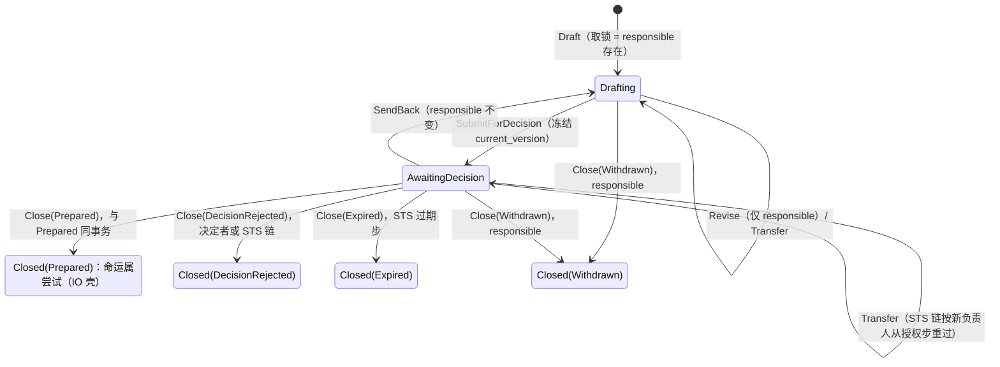

# 单据（含交易协议）

- **层级与元素**：L3 component，核心进程内的单据。
- **上级文档**：[core-process/design.md §4.1 组件指南](design.md#41-组件指南)。
- **决定什么**：意图形成期的抽象：一张单据 = 一把锁（`responsible`）+ 一条线性版本链 + 一个对账钩子；意图怎样构造（锚点）、参数怎样判定合规、依据与世界的关系怎样成为单据的状态（两层对账），以及预置写侧基本类型“订单”的交易协议：操作种类、目标身份、可执行性、平仓与改单的上游保证、检查目录。本文也是核心↔解释层单据组操作的规格所在。
- **读者**：核心实现者；集成作者（交易协议、意图参数 schema、目标种类的含义）；解释层实现者（单据组）。
- **状态**：已定。
- **非目标**：STS 链怎样读这些状态并放行（[decision-chain.md §4.2 顺序固定链：授权 → 输入约束 → 审批 → lane → 过期](decision-chain.md#42-顺序固定链授权--输入约束--审批--lane--过期)）；lane 阻塞头（[lane.md §3.3 阻塞头集合](lane.md#33-阻塞头集合)）；`Prepared` 之后尝试的命运（[io-shell.md §3.3 尝试与 AttemptRef](io-shell.md#33-尝试与-attemptref)）；写能力与意图参数 schema 身份的声明形状（[integration-session.md §3.3 投影 Projection](integration-session.md#33-投影-projection)）；读模型 `tickets` 的呈现（[read-model.md §4.2 读模型集合](read-model.md#42-读模型集合)）；阈值、比例、允许集合等业务取值（规则文件，[decision-chain.md §4.9 规则文件的内容与合法性](decision-chain.md#49-规则文件的内容与合法性)）。

证据标签与编号前缀的约定见 [README.md §0.4 阅读约定](../../README.md#04-阅读约定)。

## 1 问题域

### 1.1 上级分配给本组件的需求

| 来源（[README.md §2 问题域](../../README.md#2-问题域)） | 内容 |
|---|---|
| C9、C10 | 写只在目标作用域内、以合法参数发生；数量 / 名义有限且为正；子账户已枚举。 |
| C11 | 意图有负责人；决定绑定所决定的版本；谁、何时、依据什么可追溯。 |
| C12 | 必要项不可判定即 fail-closed。 |
| H2 | 程序不可信，会输出非法值。 |
| P6、P7 | 意图的依据是它引用的观察位置；决定集合（批准 / 否决 / 退回 / 过期）。 |
| F6、F9、F10 | 能力部分且未必文档化；外部订单只能按上游证据识别；listing 滞后。 |
| S8 | 记录回答谁、何时、依据哪些位置、哪一版。 |
| Q7、Q8、Q9、Q16、Q26、Q27 | 送审即否决有意图 + 否决记录；审批人看到的是当下的偏离；并发编辑可判定；平仓与改单不产生加仓一类伤害。 |

核心进程分配给本组件的接口：执行事实唯一写入口中 `TicketAction`（含 `Close(Prepared)` 与同事务的 `Prepared`）的写者（[core-process/design.md §4.3.4 执行事实的唯一写入口](design.md#434-执行事实的唯一写入口)）；`Prepared` 双认中“我已交出”的一方（[core-process/design.md §4.3.3 Prepared 双认](design.md#433-prepared-双认)）。

### 1.2 本组件直接面对的域性质

- **意图形成期可以任意长**：起单、编辑、退回、再送审可能跨越数小时；期间世界照常变化，而单据不应被世界的变化改写。
- **决定者与负责人是不同的 principal**，可能是人，也可能是下游的自动决定者或程序的装载 principal。
- **上游的写能力部分、会变**（F6）：同一来源在不同握手里可能收紧或放宽某个操作、换一版参数 schema、改变接受的目标种类。
- **订单与持仓的状态在上游**（[README.md §1.2 权威源头与生命周期](../../README.md#12-权威源头与生命周期)）：核心手边只有观察副本，副本只是对新鲜度的有界赌注，不能担保一次不可逆写的数量或时机。

## 2 驱动

Q7、Q8、Q9、Q16、Q26、Q27（[README.md §3.1 质量场景](../../README.md#31-质量场景)）。本组件的响应度量写在 §6.3 各验收项。

## 3 模型

### 3.1 单据：锁 = 责任持有

单据是意图形成期的抽象，它的锁 = 责任持有。

- 单据锁**不驱动 IO 壳，IO 壳不知道单据的存在**。
- 它不是“事务发起时加的锁”，而是在事务之前就存在，覆盖整个意图形成期：起单 → 编辑 → 送审 → 决定 → 进入 `Prepared` 关闭。
- IO 壳的模型是 Haskell `IO`（[io-shell.md §3.2 IO 壳是效应侧的解释器](io-shell.md#32-io-壳是效应侧的解释器)）；单据锁的模型是**责任持有**。
- 单据**单向读取** IO 壳 append 的记录（能力证据、`VenueAccepted`、归因后的订单观察）作为依据，不存在反向耦合。

意图在 `Prepared` 之前是脚本 / 值。两个 AI 对同一个暂存订单编辑，这时根本不是一般数据库事务形态下的锁：等于事务还没提交，外面有人想改 SQL 脚本。草稿是否自己就是个锁，这才是 UTA 里加锁的地方；单据本身就是锁。UTA 其余地方为什么都不需要锁，见 [core-process/design.md §3.9 无锁定位](design.md#39-无锁定位)。

```rust
/// 一张单据 = 一把锁 + 一条线性版本链 + 一个对账钩子。锁的持有者是单据的负责人。
struct Ticket<Intent> {
    id: TicketId,
    responsible: Principal,      // 当前负责人；锁 = 这个字段的存在
    current_version: Hash,       // 版本链末端（内容寻址，每版带父 hash）
    versions: Vec<Version<Intent>>, // 只追加；Intent = 交易协议的意图类型（§4.5）；每版带其参数所依据的意图参数 schema 身份
    basis: Basis,               // 位置集，可含派生侧（观察）与执行事实侧位置
    parameter_validity: ParameterValidity, // 参数合规（§3.4）；不读观察，不属两层对账；输入约束步读取
    basis_validity: BasisValidity, // 第一层：依据有效性（§3.5）
    alignment: IntentAlignment,   // 第二层：意图专属对账，逐项状态（可能全部 InputMissing，§3.6）
    latest_revision: Option<Revision<Intent>>,  // 最近一次 Revise 的结构差（派生，§3.7）
    state: Drafting | AwaitingDecision(Hash) | Closed(Outcome),
}

enum TicketAction<Intent> {
    Draft   { by: Principal, initial: Intent, basis: Basis },  // 建立单据 = 取得锁 = 声明负责
    Revise  { by: Principal, next: Intent, basis: Basis },     // 仅 responsible；追加版本，current_version 前进
    Transfer{ by: Principal, from: Principal, to: Principal },  // 显式移交，记录，不静默；by = from（自愿）或持有控制授权的 principal（强制）
    SubmitForDecision { by: Principal, at: Hash },           // 送审：冻结 current_version，Drafting → AwaitingDecision
    SendBack { by: Principal, reason },                      // 审批退回：AwaitingDecision → Drafting，responsible 不变
    Close   { outcome: Prepared(LogPosition) | Withdrawn | DecisionRejected | Expired },
}
```

- **锁的本质是 `responsible` 字段**：`Draft` 即取锁，`Close` 即释放。持锁期间仅 `responsible` 可 `Revise`/`SubmitForDecision`；其他 principal 的 `Revise` 被拒绝，不排队、不产生分支。
- **`TicketAction` 均为 append 记录**：每条带 principal 与依据 `LogPosition`。`Ticket` 自身是这些记录的 fold（[observation-journal.md §2.1 Journal 与撤回代数](observation-journal.md#21-journal-与撤回代数)），不是原地修改的对象。
- “锁”因此也是记录的解释：`responsible` 由最近一次 `Draft`/`Transfer` 决定。STS 的授权、允许集合与是否需人工都以它为主体，所以 `AwaitingDecision` 中的 `Transfer` 使链按新负责人从授权步起重过（[decision-chain.md §4.7 移交](decision-chain.md#47-移交-设计)）。

**意义与产品规则。**

- **锁最大的意义不是互斥，是入口**：它是 UTA 表达“**现在有一张单据，我是负责人**”的唯一方式。取得单据 = 单据存在 + 某 principal 从此负责；后续编辑、送审都以这个身份记账。没有负责人的单据不存在。
- **一份单据只有一种交易意图**：不分叉不合并，订单不能“同时想买又想卖两个价”。版本链线性；`Revise` 在锁内追加，不需要 hash 期望比较。
- **产品层代价与协作边界**：两个 AI 不能同时处理同一张单据。合理，但不好用。核心有意接受这个代价，不用分叉 / 合并修补。协作在核心之外：`Transfer` 移交；第二个 AI 另起单据，由决定者二选一；或把建议发给负责人。
- **决定绑定 current_version**：批准的 Decision 引用 `AwaitingDecision(current_version)` 的 hash，进入 `Prepared` 要求它所决定的版本 = 当前 current_version。策略要求人工时审批步等这样一条 Decision；这一版没有 Decision 而策略不要求人工时，依据是审批步对当前 current_version 给出、带 `rule_version` 的 `Outcome`（[decision-chain.md §4.3 审批步](decision-chain.md#43-审批步)、[decision-chain.md §4.5 放行门](decision-chain.md#45-放行门)）。规则版本变更或移交之后，这一版已有的 Decision 仍是它的依据。`SendBack` 后的 `Revise` 使 current_version 前进，旧 Decision 与旧 `Outcome` 都自然失效。
- **一张单据至多一次 `Close(Prepared)`**：之后的改动是新单据（改单 / 撤单 / 平仓各自起单），各走各的写边界。
- **单据不记起单理由** [设计]：`Draft`/`Revise` 与批准都不带负责人或审批人撰写的自由文本。单据记录回答“谁、何时、依据哪些位置、哪一版”（S8）；自由文本只出现在对他人意图的判断上：`SendBack` 的原因、否决的原因、规则 `Rejection` 的违反项，读模型 `tickets` 按版本给出它们。“为什么想下这一单”是策略的业务上下文，由下游按它拿到的请求引用自己保存（[README.md §0.3 非目标](../../README.md#03-非目标)）；它不能放进意图参数，意图参数会原样交给集成。不选：`Draft`/`Revise`/每条 Decision 都带备注，没有任何核心代数读它，而批准本就不带原因（P7）。

为什么（锁的形状）：`responsible` 字段无死锁、无超时释放。不选：

- **互斥原语作锁**：死锁、超时释放复杂；负责人失联改由策略层处理（§6.1 权衡）。
- **分叉 / 合并（git 式）修补协作**：一次订单草稿理应只有一种交易意图，借线性历史不借分叉合并（C11）。

### 3.2 术语：偏离 / 修订 与决议

- 本文的“偏离 / fit”回答“我的意图还对不对”；决议 / resolution（[io-shell.md §4.5 对账驱动](io-shell.md#45-对账驱动)）回答“我的动作发生了没有”。两者不同名，不共用状态。
- **修订 / 偏离**：修订（`Revision<Intent>`）是意图改了、世界没变；偏离（`Diverged`）是世界变了、意图没变。二者来源不同（`Revise` vs 观察推进），分开收束（§3.7）。

### 3.3 意图构造与锚点：构造不出的不是意图

意图的锚点（[envelope.md §3.1 锚点表 × 链路](envelope.md#31-锚点表--链路)）：`WriteLaneKey`、交易协议的操作种类（§4.5）、`basis`；撤单 / 改单还要 `target: VenueRef | IdemKey`；平仓的 `target: PositionRef` 由核心从 `basis` 所指的持仓观察记录构造（§4.5 目标身份）。以下任一情形意图**构造不出**，不开单：

- 缺锚点（`WriteLaneKey`、操作种类、`basis`；撤单 / 改单的 `target`）；
- 操作种类不在交易协议的封闭集合内；
- `IdemKey` 目标不是该作用域内某次尝试的 `SendBarrier` 记为订单键的键（键由核心按尝试单射铸造，至多对应一次尝试，[io-shell.md §3.4 调用方键的铸造](io-shell.md#34-调用方键的铸造-设计)；见 §4.5 订单身份来源之二）；
- 平仓所指的持仓观察记录取不出合规的 `PositionRef`（不存在、已落到保留边界之下、不是持仓记录或不属目标作用域）。

后果：会话的 `draft` 得 `Rejected(Malformed)`、不 append 任何记录（与畸形记录在入口被拒同理，[envelope.md §3.1 锚点表 × 链路](envelope.md#31-锚点表--链路)）；程序的请求得 `EffectResponse{NotDrafted(Malformed)}`（[outbound-requests.md §4.3 写处理器](outbound-requests.md#43-写处理器-设计)）。`revise` 交来的下一版构造不出时同样得 `Rejected(Malformed)`：不 append，单据与其 `current_version` 不变。

带 `target` 的意图类型在构造时**必须**携带目标身份（parse-don't-validate）。无目标即构造不出意图，不需要事后规则。

`deadline`：意图未带 `deadline` 时，在 `Draft`/`Revise` 规范化时按规则文件的 `(WriteLaneKey, OperationKind)` 缺省填入该版本，此项也缺则取运行期参数的全局缺省（[decision-chain.md §4.9 规则文件的内容与合法性](decision-chain.md#49-规则文件的内容与合法性)）；版本 hash 含它，审批人看到的即放行的。

### 3.4 参数合规：意图参数 schema [设计]

每个订单意图，无论来自解释层代开的会话还是程序的写处理器，都按**目标来源为该操作声明的意图参数 schema** 判定参数是否合规，在任何 `Prepared` 之前。

- **schema 从哪来。** 每个 `Supported` 的写能力 `(scope, OperationKind)` 在其 `CapabilityProof` 里声明它接受的意图参数 schema 身份 `(schema_id, schema_version)`（[integration-session.md §3.3 投影 Projection](integration-session.md#33-投影-projection)）：交易协议该操作种类的公共意图 schema（随 IDL 发布，[envelope.md §3.3 payload_schema 与 schema 发布](envelope.md#33-payload_schema-与-schema-发布)），或该集成以它为基础只增加字段与约束的扩展 schema，因而合扩展者必合公共者。schema 覆盖意图的全部参数：已注册的守卫字段与载荷（订单类型、time-in-force、来源专有选项等没有处理器读的参数）。判定读的是该来源的**会话有效声明**（[integration-session.md §3.6 声明的两种解释](integration-session.md#36-声明的两种解释-设计)），不读离线时留下的最近声明。
- **schema 语言。** JSON Schema，与配置文件的 schema 同一语言，钉在一个 draft 版本与一个关键字子集上，`format` 只作注解不作断言；schema 与一个参考校验器随 IDL 发布，两个实现对同一参数得出同一结论由此可测（验收 #30、#31）。类型相关的必填与互斥（限价单要限价、追踪单的偏移量与百分比二选一、某来源只对市价单接受名义金额、某来源不支持的选项被禁止）写成 schema 自身的条件约束；合规与否只由该语言的校验语义决定，没有第二道由实现各自补写的语义校验。来源相关的限制由该来源的 schema 选定，不是交易协议的全局事实。
- **意图带身份。** 每版意图带它的参数所依据的 schema 身份，版本 hash 覆盖它。下游的参数在构建期按某个 schema 版本生成（[downstream/design.md §4.3 命令与参数从哪里来](../../downstream/design.md#43-命令与参数从哪里来)），程序按它读到的声明写参数；带身份使“按哪一版写的”不靠猜。
- **守卫字段的数量规则**（交易协议注册的字段，不随来源变）：下单与改单的新单部分，`quantity` 与 `notional` 恰有一个，有限且为正；平仓只可带 `quantity`（有限且为正），不带 `notional`；撤单两者都不带。C10 的“数量 / 名义有限且为正”即此。改单另带新单的**数量口径**：绝对量（改后的订单按意图所带的 `quantity` 或 `notional`）或剩余量（只与 `quantity` 合法：改后的订单按意图的 `quantity` 减去原单已成交的量）。口径的含义由上游在改单的那一次写里按它自己的成交记录落实（§4.5 改单）；核心只按 schema 校验口径是否被接受，不据它计算任何数量。
- **结果是单据 fold 的状态** `parameter_validity`：

```rust
enum ParameterValidity { Valid, Invalid(NonEmpty<Violation>), CapabilityNotEstablished(Unknown | NoSession), NotSupported, SchemaMismatch, TargetNotAccepted }
```

  - `Valid`；
  - `Invalid(violations)`：参数不合该 schema 或违反数量规则，逐项列出违反之处；
  - `CapabilityNotEstablished(Unknown | NoSession)`：可执行性此刻无从判定：会话有效声明对该 `(scope, OperationKind)` 为 `Unknown`，或该来源此刻没有已建立的会话。它不是来源的否定，是非终结状态：单据等待（[decision-chain.md §4.2 顺序固定链：授权 → 输入约束 → 审批 → lane → 过期](decision-chain.md#42-顺序固定链授权--输入约束--审批--lane--过期)），会话建立或能力证据变化时重算，出口是等来确立的能力，或 `deadline` 到期（过期步）；
  - `NotSupported`、`SchemaMismatch`、`TargetNotAccepted`：会话有效声明已确立，而该版本对它不可执行，三者依次是可执行性（§4.5）的三个条件不成立，原因可区分：来源声明不提供这个操作（`Unsupported`，没有补救）；按新版 schema 重写参数即可；换一种目标身份（例如按 venue 订单身份）另起或改写即可；
  - 从 `Draft` 起即求值，每次 `Revise` 对完整的新版本重算（不只校验 diff），能力证据变化与该来源会话进入或离开 `Established` 时重算；负责人与审批人经读模型 `tickets` 看得到。
- **在哪里否决。** 输入约束步无条件读取它（[decision-chain.md §4.2 顺序固定链：授权 → 输入约束 → 审批 → lane → 过期](decision-chain.md#42-顺序固定链授权--输入约束--审批--lane--过期)）：`Invalid`、`NotSupported`、`SchemaMismatch`、`TargetNotAccepted` 即否决；`CapabilityNotEstablished` 使单据停在输入约束步等待，不产生记录。它不是检查项，策略不能把它降为 advisory。草稿可以带着不合规的参数保存与修改，送审之前没有任何外部写；已确立为不合规的版本一经送审必得一对记录：意图与否决（Q8）。放行之后到发送之间可执行性若变，发出前门再核对一次（[io-shell.md §4.2 发送屏障与发出前门](io-shell.md#42-发送屏障与发出前门)）。
- **核心仍不解释载荷。** 这是协议输入边界上的形状校验：核心按 schema 判定合不合规，不读取载荷里的值参与任何计算；没有处理器读的参数校验之后原样交给集成（[envelope.md §2.2 三部分](envelope.md#22-三部分-设计)）。意图参数 schema 是 UTA 的契约，不是上游请求格式。

理由：程序不可信、会输出非法值（H2），只在解释层校验就留下程序这条绕过口；而参数到了集成才被发现不合规，集成只能在 `SendBarrier` 之后不发，返回 `NotSent`（[io-shell.md §4.6.1 NotSent：可证明的未交出](io-shell.md#461-notsent可证明的未交出-设计)）：审批人已批准、`SendBarrier` 已在、冷却已计时，负责人却要到那时才知道这一版注定发不出。参数合规作为单据状态，既让负责人在草稿期就看到问题，又让所有来源在同一步得到同一对记录。能力未确立单列为等待而不是 `NotSupported`：来源没有说“不提供”，把 `Unknown` 或离线记成来源的否定，就是替来源写了一条它没说过的结论（[README.md §1.2 权威源头与生命周期](../../README.md#12-权威源头与生命周期)）。

不选：

- **只在解释层按生成的参数校验**：程序发出的意图绕过它（H2）。
- **作为一项检查（`AlignmentCheck`）**：检查项可被策略设为 advisory，且检查读观察、到放行门才生效，审批人会先批准一张注定不能发的单。
- **在 `draft` / `revise` 时拒绝参数不合规的版本**：留不下 Q8 要求的意图与否决记录；schema 声明在草稿与放行之间还会随握手变化，构造期的判定本就要重算。
- **交给集成拒绝**：见理由，`SendBarrier` 之后的本地拒绝只能是 `NotSent`，批准、屏障与冷却都已发生。
- **能力未确立即否决（`Unknown` 视同 `Unsupported`，或离线时按最近声明判定）**：来源没有给出否定，否决记录却说“来源不提供”；瞬断就关闭送审中的单据。
- **另设等待标志**：等待是记录的 fold（[decision-chain.md §3.4 RuleState 是记录的 fold，不另存](decision-chain.md#34-rulestate-是记录的-fold不另存-设计)）。
- **把参数约束写成组合子值树**（与规则、检查同一表示，[core-process/design.md §3.12 组合子值树与五个 fold](design.md#312-组合子值树与五个-fold)）：值树不能同时充当下游在构建期生成参数的来源，同一份约束就要写两遍；JSON Schema 既是生成来源又是校验依据，钉住版本与参考校验器后两实现结论相同。

### 3.5 第一层：依据有效性 `basis_validity`

`basis` 的方向、基数与可追溯性见 [core-process/design.md §3.6 basis：方向、基数、可追溯性](design.md#36-basis方向基数可追溯性)。它的有效性语义是效应侧进入 prepare 的**只读校验边界**，单据在放行时**应用**此门（读取 `basis_validity == Fresh`），不重新定义 `basis`：

```rust
fn basis_valid(basis: &Basis, world: &Observed, window: Lag) -> BasisValidity;
enum BasisValidity { Fresh, Stale(Lag), Retracted(LogPositions), BeyondRetention(LogPositions) }
```

- `Fresh`：每个依据位置与所在流当前已提交流末的距离不超过该操作声明的窗口、未被撤回、未落到保留边界下。
- `Stale` / `Retracted`：只对派生侧（`RetractableDelta`）位置，分别是距离超窗、旧贡献被撤回（[observation-journal.md §2.1 Journal 与撤回代数](observation-journal.md#21-journal-与撤回代数)）。
- `BeyondRetention`：只对观察侧位置。引用位置落到其所在流的保留边界之下，不再能精确重建（[observation-journal.md §2.4 保留：边界与删除规则](observation-journal.md#24-保留边界与删除规则)）；执行事实侧没有保留边界。
- 执行事实侧的引用**不会因年龄变假**（只 append，[core-process/design.md §3.3 两类记录与第一边界](design.md#33-两类记录与第一边界)）。

**逐位置判定与集合值** [设计]。对 `basis` 每个位置按 **边界 → 撤回 → 滞后** 的顺序判定。后一项以前一项通过为前提：边界下的位置已无记录可查撤回，被撤回的位置谈滞后无意义。

- 集合值为 `Fresh`，当且仅当全部位置通过。
- 否则取失败位置中最严重的一类作为 `BasisValidity`：`BeyondRetention` > `Retracted` > `Stale`（不可重建 > 已被否定 > 只是滞后）。
- 全部失败位置及各自原因进入单据 fold，供审批人查看。
- 门只读 `== Fresh`，严重度只影响呈现。

**比较切面与窗口** [设计]。有效性窗口是 `操作种类 × WriteLaneKey 策略` 的参数（规则文件的 `Lag`），而非全局常量。

- **比较的只是 UTA 自己的位置。** 滞后层把依据位置与该 `StreamId` **当前已提交的流末**比较：两者都是核心日志上的位置，核心是它们的源头。它不读完备进度：上游历史是否已闭合是来源的性质，只有来源证据能证明，而且证明的是来源自己的坐标（序号覆盖、`covered_to`），不是这里要的“依据之后日志上又来了多少”（[core-process/design.md §3.1 流、位置与三种进度](design.md#31-流位置与三种进度)）。撤回与保留边界同样是核心日志上的事实。
- **`Lag` 的度量**：以同一 `StreamId` 上的 `Seq` 距离计：依据位置之后，该流在同一 epoch 上已提交的记录数。`basis` 位置的 epoch 早于该流当前 epoch 即 `Stale`：跨 epoch 无可比序。
- **默认窗口 `Lag = 0`。** 未声明窗口的操作，`basis` 中每条派生侧流的位置必须就是该流当前已提交的流末；此后该流又提交了任何记录即 `Stale`。即决定看到了核心此刻已有的全部记录。
  - 理由：没有来源证据时，核心能确知的只有“依据之后日志上还有没有新记录”。以它为默认，使未声明策略的操作 fail-closed 于最保守的一侧，而不是静默接受任意滞后。
  - 代价：默认窗口不承诺可用率：拟单与放行之间该流只要又提交了一条记录就 `Stale`，行情类流上几乎总是如此。需要容忍决策延迟的操作，由策略显式声明 `Lag`。
  - 本门不承诺依据“看到了上游此刻的全部事实”：那需要来源证据证明的完备，本门不用它。
  - 不选：**按完备进度（或由收到时间推出的进度）比较**：完备与否是来源的性质，核心没有来源证据时给不出；由收到时间推出的进度是以本地时钟代替来源，推出的“闭合”没有源头。

这条只读校验边界**不参与两阶段协议**（[io-shell.md §3.1 两阶段协议与它的位置](io-shell.md#31-两阶段协议与它的位置)），只决定是否进入 prepare。它是写的前置条件（依据有效性）向读侧延伸出的一条边界。

### 3.6 第二层：意图专属对账 `alignment`；偏离是状态

**偏离是状态，不是动作。** `basis_validity` 与 `alignment` 均为单据 fold 的一部分，在**效应侧**评估。评估用组合子（`AlignmentCheck.eval` 是 `Comb<Observed, CheckResult>`，[core-process/design.md §3.12 组合子值树与五个 fold](design.md#312-组合子值树与五个-fold)）与 `fold_state` 机制。

```rust
/// 一组检查，每项声明它需要哪些观察输入（required_inputs 由值树 fold 求出）。
/// 由 (意图类型 × 该 venue 当前能力证据) 在评估时解析，不存在单据上；握手变了它就变。
struct AlignmentCheck<Intent> { name: CheckName, required_inputs: Set<StreamKind>, eval: fn(&Intent, &Observed) -> CheckResult }
type AlignmentChecks<Intent> = Vec<AlignmentCheck<Intent>>;
enum CheckResult { Aligned, Diverged(Divergence), Undecidable(Reason) }  // Undecidable：范围内有 gap，或该流没有本项主体的观察
type IntentAlignment = Map<CheckName, Aligned | Diverged(Divergence) | Undecidable(Reason) | InputMissing(Set<StreamKind>)>;
//                                                                   ^ 该项需要的输入观察侧没有（集成不提供该流）
```

两层输入不同：

- **第一层（`basis_validity`）**：只读 `basis` 位置集与各流当前已提交的流末、撤回、保留边界。
- **第二层（`alignment`）**：读 `required_inputs` 各流**当前流末**的 `fold_state`，经单向边“钩子读观察值”（[core-process/design.md §3.4 两个类型宇宙与唯一边](design.md#34-两个类型宇宙与唯一边)）。
  - 当前流末 = 该 `StreamId` 已提交的全部记录，含 `one_shot` 与 `backfilled`，各带质量标记。
  - 不按任何完备进度截断：一次性读不推进完备进度，截断就看不见为补齐输入而读来的观察。
  - 不读 `basis` 位置处的旧值，否则世界变了单据不会变。

**`checked_as_of`。** 每次评估把实际消费的位置集记为 `checked_as_of: Set<LogPosition>`，随 `CheckResult` 进入单据 fold，并写进依据它放行或否决的 Decision / `Outcome` / `Rejection` 记录（[decision-chain.md §4.5 放行门](decision-chain.md#45-放行门)）。`basis` 回答“拟单时看到了什么”；`checked_as_of` 回答“这次判断看到了什么”；二者都不复制观察值。

**重算触发**（本身不是 `TicketAction`）：

- `basis` 引用的流或 `required_inputs` 各流推进、被撤回、出现 gap；
- 能力证据变化，该来源会话进入或离开 `Established`（也重算参数合规）；
- 保留边界推进；
- 策略必要项集、检查参数 / `Lag` 变化（`reload_config(rules)`）。

因此**单据是否偏离是状态字段，不需要外部触发对账**；单据始终知道自己与世界的关系。放行门在提交时退化为读取 `basis_validity == Fresh` 及策略要求的必要项；`AwaitingDecision` 期间世界变了，审批人看到的就是一张 `Diverged` 单据，不需要另一套失效逻辑。

**两层分开的原因。** 第一层只依赖 `LogPosition`，对所有单据均可计算；第二层依赖意图类型与 venue 提供的观察。混成一层，会让“不能做意图对账”的单据连新鲜度都丢掉。

**门只看必要项。** 放行策略按 `(WriteLaneKey, OperationKind)` 为检查目录（§4.5）中的每项声明取 **必要**、**advisory** 或不列，并给出该项的参数（规则文件）。

- 仅必要项的 `Diverged`、`Undecidable` 或 `InputMissing` 触发 fail-closed（C12）。
- 其余检查项为 **advisory**：结果对审批人可见并写入依据，但不参与门。
- 不存在“所有 `Undecidable` 均阻断”的总门：那会让 advisory 在语义上重新变成 guard。
- 策略没有列出的项不求值；列出了需要参数的项却没给参数，或把只能 advisory 的项列为必要，该规则文件不合法（[decision-chain.md §4.9 规则文件的内容与合法性](decision-chain.md#49-规则文件的内容与合法性)）。

**能力项恒为必要项**，是唯一不由策略声明、恒求值的必要项。

- 意图对会话有效声明**可执行**（§4.5 可执行性）才 `Aligned`；已确立而不可执行即 `Diverged`，偏离原因即不成立的那个条件（`Unsupported`、声明的 schema 已不是意图所带的那个、目标种类不被接受）。
- 能力未确立（会话有效声明为 `Unknown`，或该来源没有已建立的会话，即参数合规的 `CapabilityNotEstablished`）时，能力项不给结论：它不是 `Diverged`，单据停在放行门前等待（[decision-chain.md §4.5 放行门](decision-chain.md#45-放行门)），会话建立或能力证据变化时重算，`deadline` 到期由过期步关闭。
- 策略不能把它降为 advisory：IO 壳对无能力的操作没有转移可走。

**钩子不一定存在，不一定能对账。** 第二层是多项独立检查的乘积，而非单一函数。

- 限价买单要对价格（报价流）、资金（余额流）、持仓（持仓流）、能力（能力证据）、可交易性（目录流）。
- venue 给报价不给持仓，就是“价格能对、持仓不能对”，不是整个钩子消失。
- 因此 `IntentAlignment` 逐项记 `InputMissing(缺哪些输入)`，不用 `Aligned` 冒充，也不设全局 `NoHook`。

**缺观察是可行动的。** 流在但没有本项主体的观察（`Undecidable`，如从没见过该 instrument 的持仓）时，若该流可一次性读，发一次只读查询就产生一条观察记录，该项随即可算。读是安全的、可批处理的（[one-shot-read.md §3.2 identity 与并入（只读批处理条件）](one-shot-read.md#32-identity-与并入只读批处理条件)）。

- 策略可对一项声明“先查后判”：该版本送审时，此项若缺主体的观察，单据为它经一次性读发一次 `read`（发起方 `Ticket(TicketId)`，[one-shot-read.md §4.1 核心→集成：read](one-shot-read.md#41-核心集成readstream-request-range--answered--unavailable--refused)），结果到达即重算；每个送审的版本至多一次，不自动重试。
- 真正的“不能对账” = `InputMissing`：该集成不提供这条流，没有任何渠道可得。

**钩子的输入是观察值及其出处**：派生 `Journal` 的 `fold_state`、能力证据、归因后的订单观察。

- 执行事实记录只作**身份与因果依据**（`basis` 中的 `VenueAccepted`/`SendBarrier` 位置），不进钩子的 `eval`。
- 归因后的订单观察是**记录**（集成或 IO 壳产出并带出处），不是读模型。“规则不引用读模型”不放宽。

**检查是纯函数、按 `Intent` 分派。** 每种操作种类的检查集是交易协议检查目录的一部分（§4.5）；撤单的“原单仍在”只能是 advisory。新意图类型 = 新的检查集，核心不变。

不选：**外部触发对账**：单据统一对账钩子使偏离成为状态问题，不需外部触发。

### 3.7 编辑 diff 与偏离

单据是不可变量的线性版本链，每次 `Revise` 都是一个 diff（`version_n → version_{n+1}`），而这个 diff 本身触发副作用。它与对账产生的偏离方向相反，必须分开收束：

| | 编辑 diff | 偏离（对账 diff） |
|---|---|---|
| 变的是 | 单据（意图）变了，世界没变 | 世界变了，单据没变 |
| 来源 | `TicketAction::Revise`（负责人主动） | 观察侧推进 → `basis_validity`/`alignment` 重算 |
| 类型 | `Revision<Intent>`：两版意图的结构差（价格改了 / 数量改了 / 目标换了） | `IntentAlignment` 的变化：`Aligned → Diverged` |
| 触发 | 变更通知（`Revise` 只在 `Drafting` 里成立；重新送审时，上一次 `SubmitForDecision` 所送审的版本以来的每个相邻 `Revision` 都随这次 `SubmitForDecision` 呈给审批人，按记下的版本锚定，守卫字段的变更由此不会被后来的编辑遮住）、限额差额校验、审计记录 | 偏离警告（审批人可 `SendBack`）、放行门 fail-closed |

- `Revision<Intent>` 是派生字段：`revision(versions[n], versions[n+1])` 由意图类型定义（交易协议提供 `Revision<PlaceOrder>`）。核心不解释，与 `IntentAlignment` 同为单据 fold 的派生结果。
- 编辑 diff 的处理器是字段处理器（[envelope.md §3.2 处理器字段注册表](envelope.md#32-处理器字段注册表)）。它属效应抽象但**不进入 IO 壳**：发生在 `Prepared` 之前，与两阶段无关。它触发的对外写（通知）自己作为新请求走完整路径。
- 它与撤回代数 `RetractableDelta`（[observation-journal.md §2.1 Journal 与撤回代数](observation-journal.md#21-journal-与撤回代数)）不是一回事：那是观察侧的撤回代数（有逆元）；这里是意图版本间的结构差，无逆元需求，不会“撤回一次编辑”，只会再编辑一次。
- 不收束的后果：审批人分不清“我要重看”（意图改了）与“市场跑了”（世界变了）。

### 3.8 不变量

- 一张单据**至多一个负责人**（`responsible` 存在即锁），持锁期间仅 `responsible` 可 `Revise`。由单据锁保证。
- 一张单据**至多一次** `Close(Prepared)`；`AwaitingDecision` 期间 `Revise` 被拒。由状态机穷尽转移（§4.2）保证。
- 门只对必要项 fail-closed，advisory 不参与门。由放行策略声明保证。
- `basis_validity == Fresh` 且必要项 `Aligned` 才进 prepare。由放行门读取单据 fold 保证（门的求值在 [decision-chain.md §4.5 放行门](decision-chain.md#45-放行门)）。
- 参数不合目标来源声明的意图参数 schema 的版本送审即被否决，不进 prepare；这对所有来源成立。由输入约束步无条件读取 `parameter_validity` 保证。
- `basis` 是位置集，不含观察状态的拷贝。由类型（`Set<LogPosition>`）保证。

## 4 结构

### 4.1 与同级组件的接口

| 方向 | 对方 | 交换 | 语义 |
|---|---|---|---|
| 被用 | 会话入口（单据组） | `draft`/`revise`/…（§4.3） | 消费方意图的入口 |
| 被用 | 出站请求处理器 | `Draft` + `SubmitForDecision`（同一事务） | 程序意图的入口，负责人 = 发出成员的装载 principal |
| 被用 | STS 规则链 | 读单据 fold：`responsible`、`current_version`、`parameter_validity`、`basis_validity`、`alignment`、Decision 与 `TicketAction`；链判定放行或否决后，请求单据执行 `Close(Prepared)`（单据在同一事务写 `Prepared`）或 `Close(DecisionRejected \| Expired)`，这些 `TicketAction` 的写者是单据；链自己只写 Decision / `Outcome` / `Rejection` | 链的输入与放行出口；单据只提供状态并执行关闭，判定在链里 |
| 交出 | IO 壳 | `Prepared` 记录 | **写向**：单据 → `Prepared` → IO 壳，唯一交出点；IO 壳不知道单据的存在 |
| 读 | IO 壳的记录 | 能力证据、`VenueAccepted`/`SendBarrier` 位置、归因后的订单观察 | **读向**：作 `basis` 与检查项的依据 |
| 使用 | 一次性读 | “先查后判”的 `read`，发起方 `Ticket(TicketId)` | 每个送审版本至多一次 |
| 读 | 集成会话 | 会话有效声明 | 参数合规与能力项 |

唯一耦合点是 `Close(Prepared)` 与 `Prepared` 的 append 必须在同一 SQLite 事务内（[core-process/design.md §4.3.5 同事务集合](design.md#435-同事务集合)）。单据与 IO 壳之间两条流都经记录中介、方向相反，没有反向调用。

### 4.2 状态机与穷尽转移



| 源状态 | 动作 | 目标状态 |
|---|---|---|
| `Drafting` | `Revise` | `Drafting` |
| `Drafting` | `SubmitForDecision` | `AwaitingDecision` |
| `AwaitingDecision` | `SendBack` | `Drafting` |
| `AwaitingDecision` | `Close(Prepared)` | `Closed` |
| `Drafting` \| `AwaitingDecision` | `Close(Withdrawn)` | `Closed` |
| `AwaitingDecision` | `Close(Expired \| DecisionRejected)` | `Closed` |
| `Drafting` \| `AwaitingDecision` | `Transfer` | 同态（`AwaitingDecision` 中移交后，STS 链按新负责人从授权步起重过） |

- `Closed` 无出边：之后任何 `TicketAction` 被拒，含再次 `Close`。`Prepared` 之后的命运属尝试，不再经单据。
- `AwaitingDecision` 期间 `Revise` 被拒：决定绑定的 current_version 不能变（C11）。
- **触发者**：`Withdrawn` 由 `responsible` 发起；`DecisionRejected` 由决定者或 STS 链的否决；`Expired` 由 STS 过期步，只对 `AwaitingDecision` 触发（H6）；`Prepared` 仅由放行链。
- **`Drafting` 没有过期。** 草稿不占 lane、不产生外部动作、不在 STS 链上。`deadline` 已过的草稿，在送审后立即由过期步关闭；失联的草稿，由持有控制授权的 principal 强制 `Transfer` 后 `Withdrawn` 关闭。

### 4.3 单据组（核心↔解释层）

`draft(intent) → TicketId`；`revise(ticket, expected_version, diff)`；`submit_for_decision(ticket, expected_version)`；`decide(ticket, expected_version, Approve | Reject(reason))`；`send_back`；`withdraw`；`transfer(ticket, to: principal)`。会话、principal 与授权规则族的入口见 [session-entry.md §3 模型](session-entry.md#3-模型)。

- **动作轴**：写（append `TicketAction`，`decide` append Decision）。
- **核心内部结果**：单据 fold 转移（§4.2）；`Approve` 触发 STS 链放行（[decision-chain.md §4.2 顺序固定链：授权 → 输入约束 → 审批 → lane → 过期](decision-chain.md#42-顺序固定链授权--输入约束--审批--lane--过期)）；`AwaitingDecision` 中的 `transfer` 使 STS 链按新负责人从授权步起重过（[decision-chain.md §4.7 移交](decision-chain.md#47-移交-设计)）。
- `draft` / `revise` 不因参数不合规被拒：参数合规是单据 fold 的状态，读模型 `tickets` 返回它，送审时由输入约束步否决并留下意图与否决记录（§3.4）。
- `decide` 由人或下游的自动决定者调用，二者同受一版一条 Decision 的约束，也同样只在当前规则对该单据要求人工审批时被接受（[decision-chain.md §4.3 审批步](decision-chain.md#43-审批步)）；交易协议检查目录之外的 guard 只能以这种身份出现（§4.5 目录之外的 guard）。
- `transfer` 的 `by` 是 `from`（自愿）或持有控制授权的 principal（强制，负责人失联时由规则处理的出口）。
- **错误**：
  - `draft` 的意图构造不出（§3.3 各条）→ `Rejected(Malformed)`，不开单、不 append；
  - `revise` 的 diff 使下一版意图构造不出 → `Rejected(Malformed)`，不 append，单据与 `current_version` 不变；
  - `expected_version ≠ current_version` → `Conflict`，不执行；
  - `decide` 时当前规则对该单据的 `(principal, WriteLaneKey, OperationKind)` 不要求人工审批（自动通过的单据，含已停在 lane 步的）→ 拒绝，不 append（错误名由实现定）；规则改为要求人工之后照常接受；
  - `decide` 时该 `(ticket, current_version)` 已有 Decision → `Conflict(AlreadyDecided)`。单据可能仍停在 lane 步而版本未变；
  - 越权 → `Unauthorized`；
  - `Closed` 后任何动作 → `Rejected(Closed)`；
  - 非 `responsible` 的 `revise` → `Rejected(NotResponsible)`。
- 期望版本比较与“这一版已有 Decision”是 UTA 对自己记录的版本判定（C11 的待决集合版本期望），不是对 venue 状态的锁（[core-process/design.md §3.9 无锁定位](design.md#39-无锁定位)）。

### 4.4 单据记录的持久化

- **写**：单据负责人 / 决定者（各 `TicketAction`；Decision 由 STS 规则链落，[decision-chain.md §4.3 审批步](decision-chain.md#43-审批步)）。
- **读**：单据 fold、审批人视图（读模型 `tickets`）、STS 规则链、按执行事实 selector 订阅该作用域的消费方与程序。
- **传播**：每条带 principal 与依据；`Ticket` 是这些记录的 fold，按 `WriteLaneKey` 落在该 lane 的执行事实流上（[subscription.md §3.1 订阅与项](subscription.md#31-订阅与项)）。没有另存的单据状态表。

### 4.5 交易协议：操作种类、目标、可执行性、检查目录 [交易协议]

> 本节是预置写侧基本类型“订单”的协议内容（[README.md §1.3 UTA 不含业务](../../README.md#13-uta-不含业务)），不属于核心代数：核心只按锚点、已注册字段与本节列出的检查求值。阈值、比例、允许集合、间隔等取值是业务，在规则文件。

**操作种类是封闭集合** [设计]：`Place`（下单）、`Cancel`（撤单）、`Replace`（改单）、`Close`（平仓）。`OperationKind` 是锚点，集合外的值构造不出意图（§3.3）。加一种是扩展轴 B（[integration-session.md §4.3.4 扩展与演进](integration-session.md#434-扩展与演进)）。

| 操作种类 | `target` | 守卫字段 | 写操作（一次上游写） |
|---|---|---|---|
| `Place` | 无 | `side`、`instrument`、`quantity` 与 `notional` 恰有一个 | `submit` |
| `Cancel` | 订单身份 `VenueRef \| IdemKey` | 无 | `cancel` |
| `Replace` | 订单身份 `VenueRef \| IdemKey` | 新单部分同 `Place`；数量口径 | `submit`，上游以这一次写原子地完成改单，见下 |
| `Close` | 持仓身份 `PositionRef`（含 instrument） | `instrument` 由 `PositionRef` 给出，不单独填；`quantity` 可有可无 | `submit` |

一个操作种类恰是一次上游写：一次意图放行得一次尝试，一次尝试至多一次写调用（[io-shell.md §3.3 尝试与 AttemptRef](io-shell.md#33-尝试与-attemptref)、[integration-session.md §3.2 契约的三部分](integration-session.md#32-契约的三部分-设计)）。写证明怎样按本表声明、哪些声明使握手投影不合法（表外的写操作；撤单的键角色只能是 `None` 或 `RequestKey`；不带键的写不能声明 by-key 与 replay-by-key 渠道；撤单不能声明 listing 与成交 / 持仓对账渠道），见 [integration-session.md §3.4 记录映射](integration-session.md#34-记录映射-设计)；撤单为什么没有 listing 与对账渠道见 [io-shell.md §4.5 对账驱动](io-shell.md#45-对账驱动)。

**目标身份是构造前提，“仍在”是 advisory。** 身份进意图的 `target`，其来源记录的位置进 `basis`。

订单身份来源三种：

1. 本地 `VenueAccepted(venue_order_id)`；
2. 本地 `SendBarrier` 记为订单键（`OrderKey`）的调用方键：无回执的提交。记为请求键的键只标识一次请求，不是订单身份；
3. 归因观察记录中的 venue 身份（外部订单，F9/P11）。

持仓身份只有一种来源：持仓观察记录里作用域内稳定的持仓身份（公共持仓 schema；区分同一 instrument 的多空分仓与 venue 自有的持仓身份）。`PositionRef` 是含持仓身份与 instrument 的不透明值，由核心在构造平仓意图时从那条记录取得：调用方只指出持仓观察记录的位置（它进 `basis`）。平仓意图的 `instrument` 就是 `PositionRef` 的 instrument，不另填，所以“目标持仓与 instrument 不一致”构造不出来，这由接纳边界保证，不靠调用方自律。

- 构造期只保证“目标存在且与账户作用域匹配”，**不**保证 venue 此刻能按该身份撤单、改单或平仓。撤单与改单的那一半是下文的可执行性：有调用方键 ≠ 能按键撤单（F6）。
- “原单仍在”来自观察侧 listing，按 F10 只能是 advisory，永不作为撤单放行的必要项。否则最安全的动作在 listing 滞后时被 fail-closed。

**可执行性** [设计]。一版意图对目标来源的写能力**可执行**，当且仅当在该来源的会话有效声明（只在会话 `Established` 时存在）中：

1. 该 `(WriteLaneKey, OperationKind)` 为 `Supported`；
2. 其 `CapabilityProof` 声明的意图参数 schema 身份等于意图所带的那个；
3. 意图以订单身份为 `target`（`Cancel`、`Replace`）时，`target` 的种类（`VenueRef` 或 `IdemKey`）在声明的 `target_kinds` 里。

该来源没有会话有效声明（此刻没有已建立的会话），或第 1 条的判定为 `Unknown`，可执行性**未确立**：它不成立也不被否定，读它的三处都等待而不否决。

这是一个谓词，三处读它，只是求值时刻不同：参数合规（依次得 `NotSupported`、`SchemaMismatch`、`TargetNotAccepted`，送审即在输入约束步否决；未确立得 `CapabilityNotEstablished`，在输入约束步等待）；能力项（放行门）；发出前门的能力条件（[io-shell.md §4.2 发送屏障与发出前门](io-shell.md#42-发送屏障与发出前门)）。

- 理由：只有调用方键、没有 venue 订单身份的撤单（例如撤一次结果未知的尝试投放的订单，[lane.md §4.2 无第二类越顶队列；撤阻塞头的撤单](lane.md#42-无第二类越顶队列撤阻塞头的撤单)）落在只能按 venue 订单身份撤单的来源上，集成只能不发、返回 `NotSent`：审批与屏障都已发生，撤单才被发现发不出。目标种类与参数 schema 一样只回答“这一版能不能被这个来源执行”，与世界状态无关，所以与 `NotSupported` 同在参数合规里：负责人从起单就看得到，送审即关闭，不会有人先批准一张注定发不出的单。
- 同一 `(scope, OperationKind)` 的各目标种类共用一个写声明与一组取证渠道；上游按目标种类走不同执行路径的，集成只声明它能按所声明写操作执行的那些种类（会推翻它的观测见证伪 #20）。
- 不选：
  - **只放在能力项**：审批人先批准，再在放行门失败；
  - **写进意图参数 schema**：`target` 是锚点，不是参数；
  - **交给集成判断**：只能在屏障之后得 `NotSent`，正是要消除的缺陷；
  - **按订单或 instrument 细分**：没有证据需要，证伪 #20 是会推翻它的观测。

**平仓是有 venue 锁的操作种类** [设计]。

- `(scope, Close)` 的 `Supported` 断言的是上游自己给出的保证（venue 的锁，[core-process/design.md §3.9 无锁定位](design.md#39-无锁定位)）：对该来源意图参数 schema 接受的**每一个**平仓请求，执行它**不会增大目标持仓的绝对数量，也不会开出反方向持仓**，例如上游原生的平仓接口，或上游强制执行的 reduce-only 单。只能用普通反向单模拟的来源声明 `Unsupported`；只对部分品种有此保证的来源，要么以 schema 把接受域收窄到有保证的请求，要么声明 `Unsupported`。
- 数量口径由该来源的意图参数 schema 定：上游原生支持“按执行时的整个持仓平掉”，schema 才允许省略 `quantity`（全平）；上游只能下有界的 reduce-only 单，schema 要求 `quantity`（至多减少这么多）。在 `submit` 里先读持仓再按读到的数量下 reduce-only 单，保证不增仓但不是“全平”：读与执行之间持仓可能变大。
- 集成在一次 `submit` 内可以先读后写，改变上游状态的调用至多一次。
- 下游仍可以自己组装一张反向 `Place`：那是业务，UTA 对它不作不增仓的任何保证。
- 理由：P6 与既有入口 A31/A34 把平仓列为操作；有的上游按持仓身份平仓，反向单根本不是平仓；而“平仓穿过零变成反向开仓”是加仓一类的伤害。UTA 自己的持仓观察只是对新鲜度的有界赌注，不能担保不增仓；担保只能来自上游的锁。
- 不选：
  - **不设平仓操作种类，平仓一律是下游组装的反向下单**：按持仓身份平仓的上游从此不可达，不增仓的保证对 UTA 与下游都不可见。
  - **反向下单 + UTA 发送前重查持仓**：把本地观察当作权威，读与执行之间仍可穿过零。
  - **按 instrument 在目录观察上声明“此处平仓不增仓”**：不增仓是安全断言，放在观察上就随观察的新鲜度成立，陈旧的观察会把一次普通反向单当成有锁的平仓。保证只对部分品种成立的来源以 schema 把接受域收窄，否则声明 `Unsupported`；接受域之外的品种由下游自己组装平仓。

**改单是单一意图类型 `Replace`，一次上游写原子完成，否则不支持** [设计]。

- `(scope, Replace)` 的 `Supported` 断言的是上游自己的保证：该来源意图参数 schema 接受的每一个改单请求，上游以**一次写**完成撤旧下新（或原地改单），并按意图所带的数量口径的原义落实（剩余量口径下“原单已成交的量”由上游按它自己的成交记录在这次写里计入）。不能按原义执行的口径不进 schema；不能以一次写完成改单的来源声明 `Unsupported`。
- 这只保证执行的是意图声明的口径，不是不增仓的保证：改单本可以加量。
- 核心不从观察计算任何数量，也不在尝试之内编排第二次写。需要“先撤、确认原单已结束、再下”的调用方，自己把撤单与下单作为**两张单据**组合：各自走完整的单据、STS 与 IO 壳，各有自己的授权、审批、冷却与尝试。撤单的回执或 `Found` 只说明撤单请求到达了上游，**不**证明原单已结束（[io-shell.md §4.5 对账驱动](io-shell.md#45-对账驱动)）；原单是否结束、成交了多少，要由调用方从订单状态观察判断（程序经它声明的执行事实输入与观察流看得到，[outbound-requests.md §4.3 写处理器](outbound-requests.md#43-写处理器-设计)），这是业务（[README.md §1.3 UTA 不含业务](../../README.md#13-uta-不含业务)：下单的组合方式）。
- 理由：一次写之内的原子改单，结果是上游对这一次写的回答；拆成两次写，第二次写的时机与数量就要由核心从它手边的观察（原单终态与累计成交量的某条副本）得出，而那是上游的状态，核心只能请求并等待，不能在副本上作出结论去授权一次不可逆的写（[README.md §1.2 权威源头与生命周期](../../README.md#12-权威源头与生命周期)）。撤了再下的时机与数量本是业务，放在调用方，它按自己的风险承担去读、去等、再下新单；新单作为一张独立的 `Place` 照常过授权、审批与冷却。
- 不选：
  - **核心以两腿计划 `[cancel, submit]` 执行不能原子改单的来源**：新单的数量与放行只能来自核心对原单终态观察的选取，上游之后更正终态或累计量时已发出的新单收不回；新单还绕过了 `Place` 的授权、审批与冷却。会推翻这一取舍的观测见证伪 #19；
  - **把两种执行做成两个操作种类**：同上，非原子的那一种仍要核心编排第二次写；
  - **由集成在一次 `submit` 里自行先撤后下**：两次上游写，`SendBarrier` 二分崩溃窗口的保证不再成立。

**尝试的结论与订单的状态分开。** 取证的 found/absent 回答“我的这次写到达了吗”；订单的状态与累计成交量是观察记录。二者来自同一次 venue 交互时同一事务落两侧记录，记录模型见 [io-shell.md §4.3 输出与记录模型](io-shell.md#43-输出与记录模型-设计)；订单状态与成交怎样计数、取“最近观察”，见 [read-model.md §3.2 成交的计数身份](read-model.md#32-成交的计数身份-设计)。

**检查目录** [设计]。交易协议的第二层检查项是下表这个闭合集合（`CheckName` 按操作种类闭合）。每项对同一组记录与同一组参数给出同一结果；数值一律按精确有理数计算（[core-process/design.md §3.8 基础值类型](design.md#38-基础值类型)），不做舍入。“最近观察”指该流当前流末的 `fold_state` 中该主体最近的记录；订单状态与持仓的“最近”按 [read-model.md §3.3 订单身份、来源顺序与最近观察](read-model.md#33-订单身份来源顺序与最近观察-设计) 的规则取（只按来源给出的定序证据排序）：最近观察**顺序未确立**（同一身份有两条以上内容不同、彼此不可比的记录），或订单、持仓的身份出现在两条流上（跨流冲突），依赖它的检查项为 `Undecidable`。

| 检查项 | 适用 | `required_inputs` | `Aligned` / `Diverged` / `Undecidable` | 规则文件参数 |
|---|---|---|---|---|
| 能力 | 全部 | ∅（读能力证据，执行事实，不是观察流） | 见 §3.6“能力项恒为必要项” | 无；恒为必要项 |
| 可交易性 | `Place`、`Replace`、`Close` | 目录 | 该作用域该 instrument 的最近目录观察声明本操作种类“可写” / 声明“不可写” / 没有该 instrument 的目录观察 | 无；它判断的是最近观察的声明，不承诺上游此刻可写；观察陈旧的后果是上游对一笔真写的回应（通常 `VenueRejected`），不越过写边界的任何安全不变量 |
| 敞口 | `Place`、`Replace` 的新单部分 | 持仓、余额、目录、报价 | 见下 / 情景值 > `ratio · E` / 见下 | `ratio`（> 0） |
| 持仓在 | `Close` | 持仓 | 目标持仓的最近观察为未平，且带 `quantity` 时其绝对数量 ≥ `quantity` / 已平或数量不足 / 没有目标持仓的观察，最近观察顺序未确立，或目标持仓身份为跨流冲突 | 无 |
| 原单仍在 | `Cancel`、`Replace` | 订单状态 | 目标订单的最近观察为非终态 / 为终态 / 没有目标订单的观察，最近观察顺序未确立，或目标订单身份为跨流冲突 | 无；只能 advisory（F10） |

**敞口的情景值。** 它回答“按声明数量全部成交之后，这个 instrument 在该作用域的名义敞口占权益多少”，是按合约价格的情景估值，不是风险模型：不算 delta、不做换汇、不算保证金。

- `s`：`side` 买为 +1、卖为 −1。
- `q0`：该作用域该 instrument 的持仓在其所在持仓流上的最近观察中的带符号数量；同一 instrument 有多于一个持仓身份（多空分仓），其最近观察顺序未确立，或其持仓身份为跨流冲突时 `Undecidable`，不净额化，也不在不可比的记录或两条流之间任取其一。
- `p`：意图参数带限价（公共意图 schema 的限价字段）时取限价，否则取最近报价观察中公共报价 schema 指定的参考价字段。
- `m`：最近目录观察中的合约乘数。
- `V`：意图带 `notional` 时取它，否则 `quantity · p · m`。
- `E`：该作用域最近余额观察中的权益。
- 情景值 = `|q0 · p · m + s · V|`；`Aligned` 当且仅当情景值 ≤ `ratio · E`。
- `Undecidable`：任一所需主体没有观察；`p ≤ 0`、`m ≤ 0` 或 `E ≤ 0`；`p`、`V`、`E` 的币种不全相同。缺值与 gap 都不放行必要项；实际消费的观察进 `checked_as_of`。
- `Replace` 以意图声明的新单数量作全部成交的情景：剩余量口径下上游实际改成的数量不大于它；原单在改单之前的成交不在 `q0` 里，所以它不是对改后敞口的担保。

**目录之外的 guard 是下游的决定者。** 目录与 STS 参数之外的任何规则（按策略、按组合、按外部模型的判断）由下游代码实现：一个 principal 订阅待决单据并经 `decide` 作决定，或程序在 `Emit` 之前自己把关。其边界：

- 它只在策略要求人工审批的单据上起作用：当前规则对该单据的 `(principal, WriteLaneKey, OperationKind)` 不要求人工时，它的 `decide` 被拒、不 append 任何记录（[decision-chain.md §4.3 审批步](decision-chain.md#43-审批步)），规则改为要求人工之后才被接受。它占用该 `current_version` 唯一的一条 Decision：它批准后同一版本不能再由另一审批人决定，它否决则单据关闭。要“自动 guard + 人工审批”，它只作否决或 `SendBack`（`SendBack` 不是 Decision，不占这一版的决定），批准留给人工审批人；或由人工审批人参考它的输出作决定。它想改判一个已批准的版本，只能经 `SendBack` 退回草稿、由负责人 `Revise` 出新版本。
- 它的判断在作出时一次成立，不随世界推进重算；目录检查会重算。
- 它不能越过核心的否决：放行时依据有效性门与必要项照常生效。
- 程序在自己 `Emit` 之前的把关只管它自己发出的意图，不是对所有来源的 guard。
- 加一项目录检查是改交易协议（`CheckName` 加一个变体，编译器指出全部遗漏），不是改规则文件。

理由：放行与否是外部可观测的行为，同一个规则文件在两个实现里必须给出同一个放行 / 否决，所以每项检查的输入、判据与参数都在这里写定；阈值与比例本身仍是业务，由规则文件给出。判据按读什么分处：只读意图字段、规则文件与执行事实的（人工审批的名义阈值、允许集合、冷却）在 STS 链（[decision-chain.md §4.2 顺序固定链：授权 → 输入约束 → 审批 → lane → 过期](decision-chain.md#42-顺序固定链授权--输入约束--审批--lane--过期)），读观察的（可交易性、敞口、持仓在、原单仍在）是本目录的项。

不选：

- **只在规则文件列检查名、判据留给实现**：两实现对同一单给出不同结果；
- **把所有 guard 都做成下游决定者**：它不能对所有来源生效，也不随世界重算，还占用唯一的 Decision；
- **instrument 级的写资格靠能力再细到 instrument 或品种**：锚点要引入品种词汇，且停牌、权限等是运行期变化的观察（F4）；选中的是来源 schema 的静态约束 + 目录观察上的可交易性检查，两者都不拦时交给上游，上游拒绝即 `VenueRejected`；
- **instrument 级的写资格只靠上游拒绝**：已知不可写的单也要真发一次。

## 5 走查

组件级主 trace 在 [core-process/design.md §5.1 W1（Q1）正常下单闭环](design.md#w1q1正常下单闭环) 等处；这里只走单据内部。

**W11 的单据细化（Q26 并发编辑与 SendBack）。**

1. 单据已有负责人，`current_version` 已前进。第二个 principal 的 `revise` → `Rejected(NotResponsible)`，不排队不分叉；线性化点 = 单写者 append 顺序 + `Ticket` fold（[storage.md §2.1 一个文件、一个写者](storage.md#21-一个文件一个写者-设计)）。
2. 送审后审批人 `send_back{reason}` → `AwaitingDecision → Drafting`，`responsible` 不变；之后 `revise` 使 `current_version` 前进，旧 Decision 与旧 `Outcome` 失效；`AwaitingDecision` 期间 `revise` 被拒。`revise` 的 diff 把 `target` 改成不是任何尝试记为订单键的 `IdemKey` → `Rejected(Malformed)`，不 append，`current_version` 不变。
3. 两 principal 以同一期望版本 `decide` → 第二个 `Conflict(AlreadyDecided)`（判据在 [decision-chain.md §4.3 审批步](decision-chain.md#43-审批步)），即使单据仍停在 lane 步。
4. 负责人失联：过期步 `Close(Expired)`，或持有控制授权的 principal `transfer`；`AwaitingDecision` 中的移交由 STS 按新负责人重过。

**W12 的单据细化（Q27 改单）。** 能原子改单的来源：`Replace` 意图带 `target` 构造成功 → 可执行性三条成立 → 参数合规 `Valid` → 链照常放行，一次尝试、写操作 `submit`。声明 `Unsupported` 的来源：`parameter_validity = NotSupported`，送审即否决，无外部写。`target` 种类不被接受：`TargetNotAccepted`。能力未确立：`CapabilityNotEstablished`，停在输入约束步。组合路径：调用方起 `Cancel` 单据；撤单的结果不改变任何其他单据的状态；调用方按原单自己的记录决定是否另起 `Place` 单据，`basis` 引用它所依据的原单观察位置，这张单照常过全链。核心里没有把两张单连成一条的状态。

**W18 步 1–2 的单据细化（Q8）。** 参数不合 schema 的意图照常 `draft`，`parameter_validity` 从起单即 `Invalid(违反项)`，负责人可 `revise` 改正；送审后输入约束步读它否决。锚点构造不出（缺 `WriteLaneKey`）→ `draft` 得 `Rejected(Malformed)`，无 append。

**偏离的路径。** 单据 `AwaitingDecision` 停在审批步期间报价流推进两条、策略 `Lag = 0`：`basis_validity` 从 `Fresh` 变 `Stale`，读模型 `tickets` 呈现；审批人可 `send_back`；若仍批准，放行门读到 `Stale` → `PredicateFailure`。敞口项必要、余额流出现 gap：该项 `Undecidable`，同样不放行。

**“先查后判”的路径。** 策略对“持仓在”声明先查后判，平仓单送审时没有目标持仓的观察：单据经一次性读发一次 `read`（发起方 `Ticket(id)`）；结果以 `one_shot` 观察记录到达该持仓流 → 重算触发“`required_inputs` 流有新观察” → 该项可算。同一版本不会发第二次。

**卡点。** 无停在本组件之内的步骤。走查依赖的外部定义：会话有效声明（集成会话）、订单与持仓的“最近观察”规则（读模型）、检查项求值的值树 fold（core L1）。

## 6 评估

### 6.1 风险 / 敏感点 / 权衡点

- **敏感点：`basis` 有效性窗口**（§3.5）：判定 `Fresh` 的窗口收紧，则 Q1/Q9 更多决策因依据滞后被门拦下；放宽则可能据过期依据下写。
- **权衡点：`responsible` 字段 vs 互斥原语**（§3.1）：无死锁、无超时释放的复杂性；代价是“负责人失联”必须由策略层经 `Expired` 或带 principal 的强制 `Transfer` 处理：责任归规则而非锁机制。
- **权衡：单据锁不驱动 IO 壳**：意图形成期可以任意长、任意多次退回，IO 壳完全不感知；单据只单向读 IO 壳的记录作依据。唯一耦合点是 `Close(Prepared)` 与 `Prepared` 同事务。
- **权衡：保护边界限于意图形成期**：这把锁保护的是意图形成期的线性与责任归属，不是任何 venue 域事实；执行阶段与观察侧仍然没有锁。

### 6.2 证伪条件

14. **平仓的上游锁**（§4.5）：声明 `(scope, Close)` 为 `Supported` 的某上游，被观测到执行平仓后目标持仓的绝对数量变大或开出反方向持仓（含原生平仓接口与 reduce-only 单）→ 该来源的 `Close` 必须改为 `Unsupported`；若没有上游能给出这一保证，平仓操作种类的 `Supported` 语义须重定，或平仓退为下游组装的普通下单。
15. **意图参数 schema 的表达力**（§3.4）：某来源对某操作有一条确实需要的参数约束（例如取决于账户状态或另一条记录）写不成 JSON Schema 的条件约束 → 输入约束步不能单靠 schema 校验闭合；这条约束若只能在集成内判定，它要么移成目录观察上的检查项，要么该组合声明为不支持，否则“不合规参数不到 `SendBarrier`”对它不成立。
19. **改单只有一次写**（§4.5 `Replace`）：下游确实需要在某个只能先撤后下的上游上改单，而调用方组合两张单据不可接受（例如两张单据之间的审批或冷却使改单在业务上失效，或调用方无法可靠读到原单已结束），并且有上游证据能证明原单的终态与累计成交量的最终性 → “改单只在上游一次写时受支持、核心不编排第二次写”须重审：核心若要编排非原子改单，第二次写的时机与数量只能依据那份最终性证明，并写进流声明与一致性测试。
20. **目标种类按操作种类声明**（§4.5 可执行性）：某上游能否按调用方键撤单或改单，随订单而变（例如只对某些订单类型、某些时段或键仍在上游保证期限内的订单成立），而这种变化既不能拆成不同作用域或操作种类，也不能在撤单时由上游明确拒绝 → 按 `(scope, OperationKind)` 声明 `target_kinds` 的模型被推翻；这类撤单要么只能按 venue 订单身份声明，要么目标种类须按订单细分进声明。

### 6.3 验收

30. **参数合规门**（§3.3、§3.4、[decision-chain.md §4.2 顺序固定链：授权 → 输入约束 → 审批 → lane → 过期](decision-chain.md#42-顺序固定链授权--输入约束--审批--lane--过期)、[outbound-requests.md §4.3 写处理器](outbound-requests.md#43-写处理器-设计)）：（对应 Q8）
    - 以 fixture 集成声明一份含条件约束的意图参数 schema（限价单必须带限价、追踪单偏移量与百分比二选一、只对市价单接受名义金额）；会话与程序各发出违反每条约束、以及 `quantity` 与 `notional` 同时出现或都缺的意图：每笔在起单后 `parameter_validity` 为 `Invalid` 且列出违反项，送审后得输入约束步的 `Rejection` + `Close(DecisionRejected)`，无 `Prepared`、无 `SendBarrier`、fixture 上游写调用数为 0；
    - 意图所带 schema 身份不是声明的那个：得 `SchemaMismatch`；该操作不是 `Supported` 时得 `NotSupported`；三者与参数违反可区分；已放行的单在握手换了 schema 后停在发出前门，到 `deadline` 记 `Expired`，从不带旧版参数 `submit`；
    - 锚点构造不出的请求：会话 `draft` 得 `Rejected(Malformed)`、无任何 append；程序请求得唯一一条 `EffectResponse{NotDrafted(Malformed)}`，重启后不重派；`IdemKey` 目标不是该作用域内任何尝试记为订单键的键时同样 `Malformed`；`revise` 的 diff 使下一版构造不出时得 `Rejected(Malformed)`，无 append，`current_version` 不变。
33. **平仓**（§4.5）：fixture 上游在持仓读取与执行之间改变持仓：声明 `(scope, Close)` 为 `Supported` 的集成，执行后目标持仓的绝对数量从不变大、从不反向；只支持有界 reduce-only 的来源，其 schema 使省略 `quantity` 的平仓在输入约束步被否决；只能以反向普通单模拟的来源声明 `Unsupported`，对它的平仓意图送审即以 `NotSupported` 被否决，无 `Prepared`；每次平仓的上游写调用数 ≤ 1。（对应 Q27 同类伤害）
34. **写资格**（§4.5 可交易性）：目录观察把某 instrument 标为不可写时，可交易性列为必要项的单据在放行门 `PredicateFailure`，无 `SendBarrier`；没有该 instrument 的目录观察时为 `Undecidable`，必要则不放行；未列可交易性时，单子照常发出，上游的明确拒绝记为 `VenueRejected`；能力证据不因 instrument 而变。（对应 Q16）
42. **目标种类**（§4.5 可执行性、[lane.md §4.2 无第二类越顶队列；撤阻塞头的撤单](lane.md#42-无第二类越顶队列撤阻塞头的撤单)）：（对应 Q7/Q8）
    - 只接受 `VenueRef` 的来源上，`target` 为 `IdemKey` 的撤单与改单在起单后 `parameter_validity` 为 `TargetNotAccepted`，送审得输入约束步 `Rejection` + `Close(DecisionRejected)`，无 `Prepared`、无 `SendBarrier`；与 `NotSupported`、`SchemaMismatch` 可区分；
    - 阻塞头 `Undetermined` 时，以其订单键为 `target` 的撤单在该来源上同样被否决，阻塞头集合仍只有一条；
    - 已放行的撤单在重握手移除 `IdemKey` 后停在发出前门，到 `deadline` 记 `Expired`，从不发出。
67. **依据的滞后只比较核心的位置**（§3.5）：（对应 Q9）
    - 缺省 `Lag = 0`：依据位置就是该流当前已提交的流末时 `Fresh`；此后该流又提交一条记录即 `Stale`；策略声明 `Lag = n` 时，依据之后同 epoch 已提交记录数不超过 n 即 `Fresh`；依据位置的 epoch 早于当前 epoch 即 `Stale`；
    - 两个实现对同一组记录给出相同的 `basis_validity`；判定不读完备进度，也不读任何记录的收到时间。

改单的一次写与组合路径的端到端验收见 [core-process/design.md §6.3 验收 #41](design.md#63-验收标准)；单据在 `Close(Prepared)` 后拒绝任何 `TicketAction` 见 [core-process/design.md §6.3 验收 #10](design.md#63-验收标准)；决定与审批可追溯见 [decision-chain.md §6.3 验收 #11](decision-chain.md#63-验收)。
