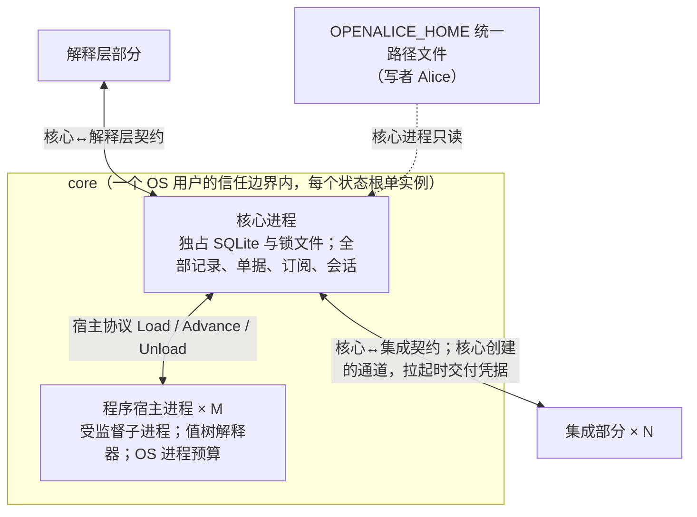

# core：系统上下文

## 0 定位

- **层级与元素：** C4 L1，core 部分作为黑盒。上级是景观文档 [../README.md](../README.md)，全局原则、问题域与需求编号都定义在那里。
- **本文决定：** core 为谁服务、与哪些外部部分和系统交换什么、分配到哪些需求、拆成哪两个容器及理由。
- **读者：** 实现 core 的人，以及实现集成、解释层时需要知道 core 边界的人。审批者无（K3）。
- **状态：** 已定。
- **非目标：** 本文不写任何契约的操作规格（它们在实现各操作的核心进程组件文档里）、不写核心进程或程序宿主进程的内部结构。

## 1 问题域

### 1.1 分配给 core 的需求

- 推出的需求：C1–C7、C9–C14；质量场景 Q1–Q32（Q24、Q30 只到 `Pooled` 接口为止）。分配表见 [../README.md §4.3](../README.md#43-需求分配)。
- 全局原则 [../README.md §1](../README.md#1-全局原则) 在 core 里落地：抽象只在 core 里；core 只对自己的意图及其推进记录有权威。

### 1.2 外部与它们的固有性质

| 外部 | 它是什么 | 与 core 相关的固有性质 |
|---|---|---|
| 解释层部分 | 下游经它接触 core；不持有状态 | 可随时断开、崩溃、重启（Q29）；每个连接带 OS 对端凭据与下游自报的 `actor`（H7） |
| 集成部分 × N | 每个上游一个进程，上游的唯一消费点 | 可崩溃、可成孤儿（H10）；它说的能力只代表那次握手（F6）；写可能无回执（F5） |
| 可选行情派生计算子系统 | 运行原生 op | 可能不存在；它在不在是实例的运行期事实 |
| Alice（经统一路径文件） | `OPENALICE_HOME` 下全部共享配置文件的唯一写者 | 文件以原子替换写入；它可在任何时刻改写文件，core 不能假设文件与运行态一致（H3） |
| OS | 进程、文件锁、对端凭据、时钟 | 进程的存亡只有 OS 能确认；文件锁随进程消亡而释放（H10）；同一 OS 用户的进程互相不隔离（H7）；Windows 无 UDS（H8） |

运维者与程序作者不直接接触 core：运维动作经解释层的控制组到达；程序作者写的程序值文件由 Alice 放进统一路径，经运维的 `load_program` 装载。

## 2 驱动

core 承担的质量场景全部在 [../README.md §3.1](../README.md#31-质量场景)；约束 K1（独立进程、序列化文本或跨语言 RPC）与 K2（优先 Rust）直接塑造本层的划分：

- K1 → core 是独立二进制；它与其余部分、与程序宿主之间的每条边界都由 IDL 或协议定义语义。语义边界不等于物理进程边界：集成与程序宿主各是独立进程，解释层的长连接端点可以落在核心进程内部转发（[../downstream/design.md §4.1 组件与部署](../downstream/design.md#41-组件与部署)）。
- H2 + C4 + Q25 → 不可信的程序不能与核心进程同处一个故障域，这是把程序宿主拆成单独容器的理由（§4.1）。
- H10 + Q20 → 每个用户状态根只有一个 core 实例（§4.3）。
- Q22（秒级负载）→ 线缆编码与单写者的吞吐要实测（验收 #19，[core-process/design.md §6.3 验收标准](core-process/design.md#63-验收标准)）。

## 3 模型

本节只写两个容器都服从的设计中心，以及它们与集成部分共用同一表示这一决定；模型本身（含 core 与外部之间各种关联的承载）在 [core-process/design.md §3 模型](core-process/design.md#3-模型)。

### 3.1 设计中心

core 的主线是两类记录与它们之间唯一的边：观察（看到了什么，派生部分可撤回、可压缩）与执行事实（UTA 的意图及其推进，只追加）；唯一跨越二者的依赖方向是效应侧引用观察侧的位置，反向不存在。两个容器都服从它：程序宿主进程只算值、不写记录，它交回的派生值与效应请求由核心进程落成记录。展开见 [core-process/design.md §3.4 两个类型宇宙与唯一边](core-process/design.md#34-两个类型宇宙与唯一边)。

### 3.2 共用的值树表示

规则守卫、处理器触发、单据检查项（核心进程）、程序（程序宿主进程）与记录映射的换算（集成部分）共用同一个组合子值树表示；它们的区别在谁构造、何时校验，校验按各使用方的输入模型落实。理由：程序必须是可静态检查、可预算、状态可显式序列化的封闭值（H2、Q25）；其余几处复用同一个值，两个容器与集成部分就不必各造一套表示。表示、五个 fold、各使用方的校验、不变量、替代方案与证伪条件定义在 [core-process/design.md §3.12 组合子值树与五个 fold](core-process/design.md#312-组合子值树与五个-fold)，随 core 发布给集成作者与程序作者。

## 4 结构

### 4.1 容器

| 容器 | 拥有 | 隐藏的决定 | 假设 | 文档 |
|---|---|---|---|---|
| 核心进程 | SQLite 单文件与锁文件（独占）、观察与执行事实日志、单据与规则链、IO 壳、订阅与投递、读模型、集成会话、程序的活动集合与宿主的监督、控制面；拉起并登记集成进程与程序宿主进程 | 全部核心代数、持久化、进程与会话的生命周期 | 每个用户状态根单实例；集成与宿主不接触 SQLite | [core-process/design.md](core-process/design.md) |
| 程序宿主进程 | 一个程序的值树解释（解释①派生、解释②决策）与增量求值；每个程序一个进程 | 增量引擎、节点粒度的重算与 cutoff、状态的序列化 | 只经宿主协议与核心进程交换值；不接触 SQLite 与凭据；CPU 与内存能由 OS 进程机制限制（[设计] 前提，证伪 #3） | [program-host/design.md](program-host/design.md) |

**为什么程序宿主是单独的容器。** 程序是不可信的（H2）：会死循环、吃内存、超产意图。预算与隔离要由 OS 进程机制给出，而不是类型系统（C4、Q25）；宿主死亡只影响该程序。不选让程序在核心进程内运行：一个死循环或内存爆炸的程序会带走全部记录、会话与写路径。宿主为何是受监督子进程而不是 Wasm 见 [program-host/design.md §6.1 替代方案](program-host/design.md#61-替代方案)。

**两者之间的关系。** 核心进程拉起宿主，经宿主协议交给它程序并推进它；宿主只交回值，从不写记录，记录由核心进程落下。协议规格在 [program-host-element.md §4.6 宿主协议](core-process/program-host-element.md#46-宿主协议)。经过两个容器的场景是 W10（程序超预算隔离）与 W17（程序发出读请求），trace 在 [core-process/design.md §5.1 W10](core-process/design.md#w10q25程序超预算隔离) 与 [§5.1 W17](core-process/design.md#w17-程序-emit-读处理器fetchbars闭环走观察侧)。

SQLite 文件与锁文件是核心进程独占的持久化资源，不作为容器：只有核心进程读写它们（[storage.md](core-process/storage.md)）。

### 4.2 与外部的关系

每条关系的规格写在实现它的核心进程组件文档里；这里只写交换什么、谁发起。

| 外部 | 交换什么 | 谁发起 | 规格所在 |
|---|---|---|---|
| 解释层部分 | 会话与 principal；订阅、确认与投递；一次性读；读模型与健康；单据操作与决定；结果未知的放弃与重开；控制动作 | 解释层开会话、发请求；核心进程在会话上投递 | 各操作一行，见 [core-process/design.md §4.2 对外接口总表](core-process/design.md#42-对外接口总表) |
| 集成部分 | 握手与能力声明；推送（观察记录、来源 gap、能力变更、readiness）；`route`、`backfill`、`read`；`submit`、`cancel` 与取证读 | 核心进程拉起集成进程、创建通道、交付凭据、发起调用；集成在会话上推送 | [integration-session.md §4.3 核心↔集成契约的会话部分](core-process/integration-session.md#43-核心集成契约的会话部分)，各操作见 [core-process/design.md §4.2 对外接口总表](core-process/design.md#42-对外接口总表) |
| 可选子系统 | `Pooled` 段视图；原生 op 的安装记录与每次宿主执行交出的制品内容；原生 op 的输出值 | 核心进程在拉起宿主之前交出 | [program-host-element.md §4.7 核心↔可选行情派生计算子系统](core-process/program-host-element.md#47-核心可选行情派生计算子系统) |
| Alice（文件） | 封存凭据、集成登记、规则、程序装载清单与程序值文件、运行期参数、原生计算制品 | Alice 写；核心进程只在规定时刻读 | [core-process/design.md §4.6 统一路径文件](core-process/design.md#46-统一路径文件) |
| OS | 文件锁与 fence、进程的拉起与退出确认、对端凭据、UTC 与单调时钟 | 核心进程 | [core-process/design.md §4.7 进程视图与生命周期](core-process/design.md#47-进程视图与生命周期) |

### 4.3 部署与信任

结论如下；机制与规格在所链接处。

- **独立生命周期。** core 独立启动、独立存活、独立停止；下游或解释层退出、崩溃或重启，均不改变 core 的订阅、程序、lane 与日志：订阅与程序的 owner 是 core（H5/C5）。断连期间的投递损失显式标记，不伪造连续性。停止的顺序见 [core-process/design.md §4.7.4 受控停止](core-process/design.md#474-受控停止-设计)。
- **独立进程。** 核心进程、每个集成、每个程序宿主都是独立 OS 进程。下游只经解释层接触 core；Alice 是下游之一，不是核心的父进程或守护者。可选子系统在 core 之外，没有它 core 照常运行。
- **信任单位是 OS 用户（H7）。** 本机非本用户的进程不可信；本用户的进程视为用户本人。能连到 core 不等于有权发写：写权限来自认证得到的 principal × 策略 scope，不来自连接。理由：core 是独立进程，IPC 是正式边界，而 UDS 对端凭据 / 命名管道 ACL 的粒度都是 OS 用户；同用户进程之间要互相隔离属升级路径（证伪 #8，[../README.md §6.1](../README.md#61-证伪条件部分级)）。
- **单实例。** 同一用户状态根（`OPENALICE_HOME`）只有一个 core 实例（H10）；接管与孤儿回收见 [core-process/design.md §4.7.3 启动五步](core-process/design.md#473-启动五步)。
- **核心进程拉起子进程并创建通道。** 集成进程与程序宿主进程都由核心进程拉起；核心↔集成的通道由核心创建、只交给该子进程（[integration-session.md §3.5 会话：核心创建的通道化身](core-process/integration-session.md#35-会话核心创建的通道化身-设计)）。
- **凭据只经核心交付。** 凭据链是 `统一路径封存文件 → 核心进程 → 该集成进程`（C7）；程序与消费方只见账户身份（[integration-session.md §4.5 进程、通道与凭据](core-process/integration-session.md#45-进程通道与凭据)）。
- **共享配置走文件。** core 与 Alice 共享的配置都是统一路径下的文件，写者是 Alice，核心进程只读（[core-process/design.md §4.6 统一路径文件](core-process/design.md#46-统一路径文件)）。
- **跨进程语义由 IDL 固定，编码与信道按 OS 选择**（K1、H8）；取舍见 [core-process/design.md §4.7.1 进程形状](core-process/design.md#471-进程形状)。

## 5 评估

本层的决定只有一个：把程序宿主拆成单独的容器（§4.1，替代方案“程序在核心进程内运行”与不选的理由写在那里）。它依赖的前提是 OS 进程机制能给出 CPU / 内存预算与终止语义，这是一条 [设计] 前提，由证伪 #3 与验收 #15 检验（[program-host/design.md §6 评估](program-host/design.md#6-评估)）。本层没有另外的证伪条件与验收项。
