# UTA 核心进程设计

**层级与元素：** L2，独立运行的 UTA 核心进程。上级 [UTA 系统设计](../uta.md) 决定与集成、程序宿主、解释层及上游之间的契约；本文只细化核心进程内部如何拥有记录、解释观察与意图、控制唯一写出口，并在崩溃后从自有事实恢复。读者是核心实现者与维护者，状态随上级本轮结构切换为评审中；不在这里另定上游格式、业务策略、下游对外词汇或可选计算子系统内部。

**阅读路径。** §2 定义信封、投影、位置与保留，§3 定义观察/效应两宇宙的边，§4–§5 处理观察及依据，§6 处理写侧，§7.2–§7.7 处理核心生命周期、元素、存储与代码映射。§1、§7.1、§8–§11 在[系统设计](../uta.md)；D 编号在本文末尾“核心内部视图”或系统设计末尾“容器交互视图”，不是独立的规范来源。

## 2 记录与位置

## 2.1 信封、锚点、处理器、载荷

> 图：D2.1 在[系统交互视图](../uta.md#容器交互视图)；本页 D2.2–D2.5 在[核心内部视图](#核心内部视图)。

UTA 是一个反向代理。经过它的不是上游协议，而是集成消费上游之后产出的契约值（§0.1）。它可以处理契约值的任何部分，但**只看自己代数要消费的字段**，其余原封不动打包转发。

**信封之于 UTA，如主键之于数据库**：数据库只坚持看主键，其余列它不解释；UTA 只坚持看信封，载荷它不解释。

### 规则

集成输出分三部分：

- **信封字段**：锚点与已注册处理器要读的字段。入口解析并验证（parse-don't-validate，隐藏构造器）。
- **载荷**：集成对上游的消费结论，由记录映射（§8.1）按 UTA 契约的 schema 写成，打 `payload_schema`（§2.2、§8.1）。核心原封直通，不解释。
- **原始负载**：集成所消费的上游原文，作为证据保留。写路径的回执与取证、可带 `attribution` 的流必须完整保留（C13）；其余观察流按记录映射的声明保留与否（§8.1）。它不交给任何解释器，UTA 内没有谁从它读值；它只供审计与追溯。

一个字段若没有任何进度 / lane / 规则 / 保留 / 钩子去读它，它就必须是不透明载荷。

被核心读的信封字段分两类，性质不同：

- **锚点**：没有它构不成链路（如上游端点与端口）。
  - 闭合、必填、入口即验。
  - 缺锚点不是规则否决（那是 fail-closed），而是**畸形记录**，在集成边界拒绝。
  - 锚点只服务路由与关联（§11.2），不服务业务判断。
  - 锚点集合按链路种类不同，像 port 取决于 scheme。
- **处理器**：“header 里出现了什么，则做什么”。
  - 非锚点字段的语义完全由注册的处理器定义。
  - 处理器 = (触发条件：某字段存在；`required_inputs`：读哪些字段，定义见 §2.5；效果：append 什么记录或触发什么动作)。
  - 字段不存在 → 处理器不触发，**不是错误**。
  - 注册表按两个类型宇宙分开（§3）：观察侧处理器只产生派生记录与进度；效应侧处理器才涉及 lane / 决议 / 规则。

完整锚点表（× 链路种类）与处理器字段注册表是核心↔集成契约的一部分，见 §8.1。

### 推论与不变量

1. **“核心看哪些字段”是推导出来的**：`锚点 ∪ ⋃ handler.required_inputs`。没有处理器声明要读的字段自动是载荷。`AlignmentCheck.required_inputs`（§6.2）已是这个形状，推广到所有处理器。一个字段可以既是注册字段又是公共 schema 的字段（`cumulative_filled_quantity`、`execution_id`、`execution_revision`、`venue_order_id`，§8.1）：注册决定核心读它，公共 schema 决定程序与下游把它当数据读；值只有一份，集成对齐一次。
2. **加处理器不改锚点**：轴 A 的 additive 扩展落到协议层，新 venue 带来的新字段只需注册处理器。轴 B（加 `OperationKind`）改实现该协议的所有集成，因为 `OperationKind` 是锚点。
3. **两类规则组合的物理依据**：
   - 锚点驱动顺序固定链（授权 → 输入约束 → 审批 → lane → 过期），每步读锚点。
   - 处理器按字段触发、彼此独立，天然是可交换集。
   - 若一个处理器依赖另一个的输出，它读的是前者 append 的记录，属链不属处理器集（§6.3）。
4. **解释载荷的不是核心**：程序（§4.3、§6.1）与单据钩子（§6.2）按 `payload_schema` 解释载荷；核心只路由字节、存它们的输出。nginx 不看 body，filter 看。它们解释的是契约载荷，即集成已经消费过的结论；原始负载不进任何解释器。money/quantity 精确类型只在核心**计算**处出现（§2.6）：观察侧信封不含价格，行情价格在载荷里；效应侧意图的守卫字段（名义金额等）是写侧基本类型注册的字段，以精确类型出现。
5. **集成义务随之收缩**：集成消费上游，填锚点、填它认识的可选字段，按记录映射把其余结论写成契约载荷并打 `payload_schema`，附上应保留的原始负载。集成不需要理解 UTA 的规则，只需要锚点表、字段注册表与载荷 schema。“集成不一定用 Rust 写”由此成立。

另外两条不变量：

- **失败面不混淆**：锚点缺失 = 畸形记录（入口拒绝）；处理器字段缺失 = 不触发（不是错误）。由入口解析 + 注册表保证。
- **对称的无知**：核心不知道账户长什么样，集成不知道规则长什么样，信封是两者唯一的共同语言。由入口解析（集成侧填、核心侧验）与注册表保证。

接入层不只是网络协议转换器。把上游混乱的 API 转成好消费的内容是一半。另一半是把上游的账户结构、市场地址、身份体系**对齐到 UTA 的锚点契约**：什么是 lane 键、`basis` 能引用哪些流、`target` 用什么身份。这是需要判断的设计动作，每个集成自己做、自己负责；做错了只影响它自己的流。

### 为什么

现实中不可能拿自造的假账户去交易，只能用上游真账户。账户的 schema 完全由上游协议决定：有的券商只有账号，有的有子账号，有的跨国家账号通用但另有独立账户概念。

这些结构不可能在程序里预先构建；任何预先构建都是把某一家券商的结构冒充为通用模型。因此核心永远不知道账户长什么样，但知道它的投影（`WriteScope`，§2.2）。

这条 litmus 本身就是防“业务对齐大对象”的机制：核心没有 30 条规则去读 30 个字段，`Order { 30 个字段 }` 就写不出来；核心没有地方消费账户结构，`Account` 就写不出来。写侧基本类型“订单”（§0.1）不是这样的对象：它的字段就是 litmus 推出的那些，即核心代数实际读取的字段。[证据：fp-00 §1；fp-04 命题 15/16；域 F2/F6]

### 不选

- **面向对象**：把“长什么样”与“能做什么”绑在同一个类上，UTA 一旦要知道后者就被迫定义前者，`Account`/`Order` 大对象由此产生。不选：它把上游权威冒充为本地模型，且随每个 venue 膨胀。
- **把投影藏进适配器，再在核心里造 `账户 id=1 / id=2`**：与预先构建账户结构没有区别。不选，同一理由。[证据：fp-03 命题 8；fp-01 M1 Haxl `DataSource`]

构造子 / 字段注册的完整集合随协议演进，属集成契约（§8.1），不属核心代数。

## 2.2 协议 = 注册单元；形状与投影

> 图：系统交互视图中的 D9.5；核心内部视图中的 D2.5。

### 协议 = 注册单元

UTA 处理订单、新闻还是期权，只是协议不同的处理对象。协议改变的是 UTA 如何响应内部的值，不透明的部分交给下游。

一个协议 = 它填的锚点 + 它注册的字段 + 这些字段触发的处理器 + 它的 `payload_schema` 集。例如 `cumulative_filled_quantity = 100` 对核心没有意义；交易协议注册了“`cumulative_filled_quantity` 出现 → `orders` 读模型的订单累计成交量”，UTA 才对它有响应。

协议 ≠ venue：一个 venue 实现一个或多个协议。每个协议至少有观察半边；只有可写协议才有效应半边。[证据：fp-04 命题 15/16]

| 处理对象 | 锚点 | 注册的字段与处理器 | 载荷交给谁 |
|---|---|---|---|
| 新闻 | 观察链路 | 可能只有 `occurred_at`；无效应半边 | 程序做派生、消费方展示 |
| 期权 | 观察 + 意图链路 | 与股票同一交易写协议；守卫要读 greeks/到期则注册 | 同交易 |
| 订单 | 观察 + 意图/尝试链路 | `attribution`、`cumulative_filled_quantity`、`venue_order_id`、`order_revision`、`idempotency_key`、`execution_id`、`execution_revision`、守卫字段 | 程序、钩子、读模型 |

“交给下游”的下游包括程序与钩子。它们解释载荷，但输出仍经过核心（派生记录、Intent、`IntentAlignment`）。不透明是对**核心的路由与存储**不透明；解释权在下游，记录权在核心。

交易协议是预置的写侧基本类型“订单”所在的协议（§0.1）；以后加写侧基本类型，就是加一个可写协议。交易协议注册的内容标 [交易协议]，不属于核心代数，例如：lane 键对齐为 (账户, 子账户)、撤改单 / `Replace` / `cumulative_filled_quantity`、`OperationKind` 具体集合、money/quantity 值类型。

### 形状与投影

**上游形状留在集成，越过集成的是契约。** UTA 不知道上游的任何东西（账户、订单、持仓、行情流、证据渠道）在上游长什么样，也不需要知道：上游形状只在集成里被消费（§0.1）。越过集成的三样都由 UTA 契约定形：

- **信封**：锚点与已注册字段（§2.1、§8.1）。
- **载荷**：集成的消费结论，按契约的载荷 schema 写成（§8.1）。核心不解释它，程序与钩子解释它。
- **投影**（`Projection`）：由 UTA 定 schema、由集成填内容。核心按它路由；它的声明部分（除记录映射外的全部，§8.1）作为执行事实落盘，经核心↔解释层契约交给解释层，由解释层翻成对外概念（§8.5 读模型 `sources`；`design/downstream/design.md` 第 2、4 节）。外部下游看不到投影本身。

没有投影，UTA 无法知道、也就无法经解释层告诉下游“你可以和我的哪些作用域通信、每个能做什么、载荷按哪份 schema 读”。同一上游对象可有多种投影，投影随握手变化，UTA 从不持有对象本身。[证据：fp-03 命题 3；域 P1/C2]

**投影 = 握手声明的值**，带来源与观察时间，随握手变化：

```rust
struct Projection {
    scopes: Vec<WriteScope>,                     // 可写作用域：多账户在 UTA 里的存在形式；键不透明
    streams: Vec<StreamDecl>,                    // 观察流的声明（见下）
    capabilities: Vec<Capability>,               // 写侧：(scope, OperationKind) → Verdict
    quotas: Vec<Quota>,                          // 订阅配额池（见下）
    extension_schemas: Vec<SchemaDoc>,           // 该集成声明的扩展 schema 文本（载荷、读请求、意图参数，§8.1）；公共 schema 随 IDL 发布，不在此
    mappings: Vec<RecordMapping>,                // 记录映射（§8.1）：集成侧求值；核心只做静态校验并求每条流提供的字段集
    source: Source, observed_at: Instant,
}
struct WriteScope { key: WriteLaneKey, account_ref: Text, label: Text, streams: Vec<StreamName> }
    // account_ref：对外账户引用（见下）；label 只给人看；streams：挂在该作用域的流名（epoch 由核心定，§8.2 handshake）
struct StreamDecl {
    stream: StreamName, kind: StreamKind,
    payload_schema: SchemaRef,                   // 记录载荷的 schema；与 epoch 绑定（见下）
    request_schema: SchemaRef,                   // 一次性读请求参数的 schema；不与 epoch 绑定
    read: Verdict, backfill: Verdict,            // 读侧能力：一次性读 / 回填，按流
    quality: NominalQuality,                     // 声明的名义数据等级，不担保逐条记录
    has_venue_cursor: bool, has_event_time: bool,
    joinable_venue_seq: bool,                    // 推送与回填的记录带本流 epoch 内连续、可衔接的 venue 序号（回填坐标、实时边界与序号覆盖，§8.4）
    backfill_from_origin: bool,                  // 回填能从上游该流历史的起点（Origin）起给出全部历史（§8.2 backfill、§8.4）
    order_revision: bool,                        // 订单状态种类：每条记录带注册字段 order_revision，上游保证它对同一订单跨渠道单调（§8.1 最近观察）
    query_not_lagging: bool,                     // 一次性读、回执与取证的回答不早于发出前已送达本流的任何记录（§8.1 最近观察）
    push_ordered: bool,                          // 同一 (会话 epoch, 流 epoch) 内本流的推送按上游状态次序送达，后到的推送不旧于先到的（§8.1 最近观察）
}
struct Quota { streams: Vec<StreamName>, max_subjects: u32 }   // 这些流上核心要求集成推送（route，§8.2）的不同订阅主体数上限
struct Capability { scope: WriteLaneKey, operation: OperationKind, verdict: Verdict<CapabilityProof> }
enum Verdict<P = ()> { Supported(P), Unsupported, Unknown }   // 写能力的 Supported 带证明；流的读 / 回填能力是 Verdict<()>
struct CapabilityProof {
    write: WriteOp,                              // Submit | Cancel：这个 (scope, OperationKind) 用哪个 IDL 写操作，一次上游写（§8.2）
    key: KeyRole,                                // None | OrderKey(KeyGuarantee) | RequestKey(KeyGuarantee)：调用方键的角色；KeyGuarantee = 键的作用域与上游保证唯一的期限（见下）
    channels: Vec<EvidenceChannel>,              // Undetermined 时的取证渠道，按 §6.6 的固定顺序
    intent_schema: SchemaRef,                    // 接受的意图参数 schema 身份（§6.2 参数合规）
    target_kinds: Set<OrderTargetKind>,          // 以订单身份为 target 的操作种类（Cancel、Replace）接受的目标种类，⊆ {VenueRef, IdemKey} 且非空；其余操作种类为空
}
```

`WriteScope` 就是“多账户”。核心不知道它是账号、子账号还是跨国独立账户，只知道有几个、各自能做什么、各自挂哪些流。

- F6“部分未文档化”的能力不可能是静态保证。
- 写操作的 `CapabilityProof` 声明三件事（类型见上，语义与理由在所引各节）：
  - **写操作与键角色**：这个 `(scope, OperationKind)` 在上游以哪一个写操作执行（一次上游写，§6.2 操作种类表），调用方键的角色（`None`：不带键；`OrderKey`：上游能以该键找到并撤改这次写投放的订单；`RequestKey`：只标识这次请求），以及 unknown 时的取证渠道（by-key / listing+venue id / fills-positions / 保留期内 replay-by-key；空表即无渠道）。键由核心铸造（§6.5），声明 `None` 以外的角色即断言上游原样接受核心的键，并同时声明键的作用域与上游保证它唯一的期限：只在这个作用域与期限内，集成才凭键把记录归因到这次写（`FromAttempt`），其外记 `Unattributed`（§8.1 `idempotency_key` 处理器、§8.3）。
  - **意图参数 schema 身份** `(schema_id, schema_version)`：交易协议该操作种类的公共意图 schema，或以它为基础只增加字段与约束的扩展 schema（§6.2、§8.1）。
  - **接受的订单目标种类**：撤单与改单能按 venue 订单身份（`VenueRef`）还是按调用方键（`IdemKey`）找到目标；有调用方键不等于能按键撤单（F6，§6.2 可执行性）。

UTA 对投影只做两件事：按投影路由（lane 按 `WriteScope`、订阅与一次性读按 `StreamDecl`、写门按 `Capability`）；把声明部分交给解释层，由它翻成对外概念。它不解释形状，也不发明投影。投影含 `WriteLaneKey`、`Verdict` 等核心概念，所以只到解释层为止（§0.1 三段）。

**流与作用域的关系** [设计]。流名在一个来源内唯一。一条流的数据依赖某个作用域（该账户的持仓、订单、余额），就声明为只挂在那一个作用域上的流；不依赖作用域的数据（公共行情、目录、新闻）可以挂在多个作用域上，也可以不挂在任何作用域上。一次性读、订阅与读模型都按流寻址，作用域不另作读的地址（§8.5）。

- 理由：地址只有一个时，读的目标不会与作用域互相矛盾；按作用域取数据的需要已由“私有数据是单作用域流”满足。
- 不选：一次性读同时带作用域与流：同一请求有两个可相互矛盾的目标。不选：为只读来源虚构不可写的 `WriteScope`：`WriteScope` 是 lane 的来源（§6.4），虚构一个会凭空造出账户与写门项。
- 由此，只读公共来源（无凭据的公共行情等）就是只声明流、不声明作用域的集成：它没有账户，照常可读、可订阅。

**对外账户引用 `account_ref`** [设计]。下游要能在命令里写出一个账户并在下次写出同一个账户；`label` 只给人看，可重复、可改；`WriteLaneKey` 是核心概念，不外露。所以作用域另带一个由集成给出的契约引用：

- 集成义务（§8.3）：在本集成内唯一；同一上游账户跨握手、重启、换凭据不变；一旦用过，不再给另一个账户。它可以由上游账号与子账号组成，不要求等于上游的某个原生字段。
- 核心校验，只查声明之间的矛盾：一个引用在同一版声明里出现两次，或历史上任一版声明曾把它绑定到另一个键，或同一个键在历史上曾带另一个引用，这个引用就标为**不可解析**，原因记入该版声明；曾经歧义的引用此后一直不可解析。核心仍按键路由，所以标记不影响 lane、门与记录，只使解释层不能用这个引用找到账户。
- 理由：外部名字若能改绑到另一个键，下游按旧名字发的写就落到另一个账户；拒绝整个集成又会因为一个作用域的问题停掉其余账户（启动隔离）。只让名字失效，最坏结果是“账户引用冲突，需要处理”，不会写错账户。
- 核心查不出“同一引用、同一键却指向另一个上游账户”：那是集成义务，由一致性测试验证（§10.5 #26）。

**读侧声明** [设计]。一次性读、回填与订阅按 `StreamDecl` 判定，与写侧 `Capability(scope, OperationKind)` 分开：读的对象是流，不是作用域上的操作。

- `read` / `backfill` 各是一个三值 `Verdict`，按流声明；握手后的变化经能力变更推送进入 `CapabilityObserved`（§8.3）。`Unsupported` 与 `Unknown` 都不调用集成，但给发起方的结果不同：前者是“不支持”，后者是“能力未确认”（§8.2 `read`、§8.5 一次性读）。
- 声明是来源在一次握手里给出的副本，只代表那次会话（§7.2）。同一份声明有两种读法：**最近声明**（历史上最后一版加引用它的 `CapabilityObserved`）回答“来源说过什么”，用于 `sources`、历史回放、订阅需求与程序的装载期校验（按 §8.6 装载期校验“等待的先后”：没有已被最终拒绝的项时，在采纳集合里而还没有声明版本的来源不判定，程序等到它第一次握手成功）；**会话有效声明**只在该来源的会话处于 `Established` 时存在，回答“此刻能不能”。此刻的判断（一次性读能否发、回填能否调用）只读会话有效声明；没有已建立会话时结果是“没有会话”，不以最近声明报“不支持”或“未确认”（§8.2 `read`、§8.5）。
- 能力只到流的粒度。上游只对部分主体提供某种读时，集成要么把这部分声明成单独的流，要么在请求时由上游明确拒绝，得到 `Refused`（§8.2）；核心不按主体细分能力。
- `request_schema`：一次性读的参数（查询主体：已解析的 instrument、目录键或文本；领域过滤条件：到期日、行权价、条数上限等）是按这份 schema 写成的一个值，与意图载荷同理：核心只校验形状并原样交给集成，不解释（§8.2）。有公共 schema 的种类随 IDL 发布公共请求 schema；来源专有的请求参数写在该集成的扩展 schema 里。
- `quotas`：配额池属于来源；每个池列出共享一个上限的流与上限值，计量单位见 §8.5 订阅组。
- `quality`：声明该流名义上的数据等级，分两个维度：时效（实时 / 延迟 / 未知）与覆盖（全市场 / 部分场所 / 未知）；词表随公共 schema 发布，核心不解释。它是来源对该流开通情况的声明，**不担保**每条记录：上游在回答里报告实际等级时，那是公共载荷的字段，逐条以记录为准。理由：数据等级常随 instrument 与开通状态变化，只有上游作答时才知道（运行期的量不冒充静态保证）；声明值只用来在读之前告诉下游“这条流通常是什么”。
- `joinable_venue_seq`：该流推送与回填的记录是否带本流 epoch 内连续、可衔接的 venue 序号。它是集成对上游序号语义的断言（由一致性测试验证），不是“记录上有序号字段”：只有这样的序号能证明回填与实时在边界上既不重叠也不留洞，所以它决定该流的回填坐标与实时边界的证明（§8.4）。不声明它的流以事件时间作回填坐标；两者都没有的流不能回填（§8.1 握手校验）。
- `backfill_from_origin`：该流的回填能否以 `Origin`（上游该流历史的真实起点，不是上游此刻保留的最早一条）为窗口起点，交回从起点到窗口终点的全部历史，含归并所需的修订与作废。它同样是集成对上游语义的断言，由一致性测试验证：上游只保留近期历史，或起点之前的历史取不全、或落不到与实时相同的回填坐标上的流不声明它。只有从 `Origin` 起补齐的回填能闭合流 epoch 开头的 `Gap{origin: Source}`，所以它决定成交流能否给出完整界（§8.1 精确重建的前提）。
- `order_revision`、`query_not_lagging` 与 `push_ordered`：除 venue 序号之外仅有的三种来源定序证据，按流声明，用于同一身份的最近观察（§8.1“订单身份与最近观察”）。`order_revision` 断言上游给每条订单状态记录一个对同一订单、跨推送与查询渠道都单调的修订（或更新时间）值，以注册字段 `order_revision` 送达，只在订单状态种类的流上声明；`query_not_lagging` 断言一次性读、回执与取证的回答反映的上游状态，不早于该流上在这次调用发出之前已送达核心的任何记录；`push_ordered` 断言同一会话 epoch、同一流 epoch 内该流的两条推送，后送达的反映的上游状态不早于先送达的：上游经一条有序通道、按状态次序交付该流的推送，不是多路上游 feed 的合并，也不是由轮询合成的推送。上游推送通道重连是一次供给中断，集成本就要上报 `Gap{origin: Source}` 并开新流 epoch（§8.3），所以重连两侧的推送落在不同流 epoch，没有别的证据时不可比。三者都是集成对上游语义的断言，以上游文档为证据，一致性测试可证伪（§10.4 #30、#31、#37）；不声明的流，对应的顺序不成立，UTA 不以到达顺序代替：不声明 `push_ordered` 的流上，不带序号也不带 `order_revision` 的两条推送不可比。

**能力未知 ≠ 结果未知。**

- 三值 `Verdict` 属握手阶段，与“结果未知”（§6.5）分开：能力未知约束启动阶段（能不能发），结果未知约束恢复阶段（发了之后）。
- `Verdict` 是**运行期值**，不抬进类型 [设计]。能力随握手与运行期观察变化（能力变更推送、`CapabilityObserved`，§8.3），静态类型无法表达运行期才知道的三值。
- 单据的能力项与参数合规读会话有效的能力（§7.2）：`Unknown` 或没有已建立会话 = 能力未确立，不终结，单据等待（§6.2、§6.3）；`Unsupported` 才否决。[证据：fp-03 命题 3]

**`payload_schema` 身份** [设计]：`StreamDecl.payload_schema` 是 `(schema_id, schema_version)` 对，由集成在握手声明。

- `schema_id` 指向契约里的一份 schema：公共 schema，或该集成声明的扩展 schema（§8.1）。它不指向上游的消息格式。
- 同一 `StreamId` 内版本不变，版本变化即开新 epoch（§8.1）。
- 核心不解释 schema 内容，只按身份路由与存储：程序与钩子的解释器按身份精确匹配（§8.1）；身份也随声明交给解释层，解释层据此判断该来源专有字段此刻能否使用（来源专有字段本身在构建期从集成发布制品生成，`design/downstream/design.md` 第 4 节）。
- `request_schema` 同样是 `(schema_id, schema_version)`，但它描述的是请求，不是记录：它变化不开新 epoch，已有记录不受影响。一次性读请求带上它所依据的请求 schema 身份，与会话有效声明不一致即不执行（§8.5），所以按旧 schema 写成的参数不会被新 schema 当成另一种含义。

**信封解析，载荷直通。** 订单状态（终态 / 非终态）是被路由的少数字段之一。上游状态的映射在集成里做：它是记录映射中的枚举映射表（§8.1），按 venue 列举输入枚举，映射到契约的有限词表（C13）；映射不了的输出**必须是 `Unmapped(raw)`**，不能靠“无 catch-all”伪造穷尽映射。核心入口只验证该字段是契约词表中的一个值（含 `Unmapped`），由信封解析保证。[证据：fp-04 命题 15/16；域 C13/F6]

**只读批处理条件。** 只读请求允许批处理 / 去重，条件是：无可观测副作用 + 稳定 identity + 幂等 + 可接受的批窗口。写操作永不走此路径。一次性读的稳定 identity 是 `(来源, 流, 请求 schema 身份, 规范化参数, range)`；同一集成会话 epoch 内同一 identity 的在途调用一律并入同一次调用，不论发起方（由一次性读元素执行，§7.3）：`origins` 含全部并入者、在调用完成提交时冻结，这次调用只计一次（§8.4）；合并只发生在在途调用之间，调用完成之后的同一请求是新调用，不以缓存或旧结果作答；各发起方的 `deadline` 各自生效（§8.2、§8.5 一次性读）。[设计] 理由：上游收到几次调用、健康计几次、结论记录带哪些发起方都是外部可观测的，合并可选就有两种答案；“`Pending` 之后重试不会再发一次”（§8.5）也只在合并是必然时成立。[证据：fp-03 命题 4；fp-02 命题 1/2]

venue 词汇不越过集成。[域 B6]

**命名约定。** “投影”一词只指握手 `Projection`。消费侧对记录的非权威 fold（订单、持仓等）一律称**读模型**（§4.4；种类与输入见 §8.5）。二者区别见同名异义表（§11.3）。

## 2.3 位置与三种进度

> 图：本页 D2.2。

### 位置

```
StreamId    = (source: Source, stream: StreamName, epoch)   // 每个范围独立维持位置单调；系统内不存在全局入口序
Source      = Integration(IntegrationId) | Program(ProgramId)
LogPosition = (StreamId, Seq)           // 一条记录的顺序身份
```

- 每个 `StreamId` 独立维持 `LogPosition` 单调递增。`Seq` 在该 `StreamId` 内**每 epoch 独立**单调。系统内不存在全局入口序。[证据：fp-04 命题 11；域 P2]
- 有序范围 = `StreamId=(source, stream, epoch)`。这一对应由 P2（`Seq` 在“来源 × 流 × epoch”有序范围内赋）、P3（新 epoch 首条记录）与本节位置定义共同给出。
- **来源是带标签的值** [设计]：集成 id 与程序 id 是两个命名空间，同名也不是同一来源。集成只拥有 `Integration(_)` 的流（声明、开 epoch、供给、作答，§8.2）；`Program(_)` 的流由核心产出：流名来自程序值的 `outputs`（§4.3），控制面只在这些流上开 epoch（§8.6 程序流的 epoch）。声明、采纳、会话、`route`、回填与一次性读只对 `Integration(_)` 来源成立，程序的观察输入也只取 `Integration(_)` 来源（§4.3）。`Program(_)` 的流只经只投递项订阅，接纳依据是控制流上该程序 id 的开始成员的 `Applied` 所记的输出契约（§8.5 订阅组、§8.6 程序流的 epoch）。

**位置作为关联。** `LogPosition` 集合只用于两项语义：

- **输入依据**：例如某决策观察到的行情流 A@120、汇率流 B@57、账户流 C@90。
- **重放位置**。

它不替代外部订单身份、幂等键或 causation id；后者属独立的名义关联（§11.2）。

- 效应侧引用观察侧位置的 `basis` 是**位置集** `Set<LogPosition>`（§5.1）。
- 撤 / 改单的目标身份（`venue_order_id` / `idempotency_key`）不放进 `basis`，放进意图自身的 `target` 字段；`basis` 只记录该身份来自哪条记录的位置。

### 三种进度

三种进度互不替代，源头也各不相同：

| 进度 | 含义 | 源头与承载 |
|---|---|---|
| 消费位置（cursor） | 某消费者已确认处理到的位置（`At{pos}`）；从起点或保留边界建立、还没有确认的为 `Start{from}` | 消费方的确认（程序是提交的 `Advance`）；核心在它确认之后记入订阅状态（§4.2 cursor 与确认） |
| 完备进度 | 来源证据证明的覆盖：某一坐标上的哪一段记录已全部到达，命题与坐标随证据写明 | 来源；核心只从来源证据 fold 出来，只在保留边界推进要删掉它所依的记录前留一个覆盖检查点（§8.4 序号覆盖）。没有证据的流没有 |
| 保留边界（retention） | 每条观察流上存储仍能精确重建的最早位置（执行事实侧不压缩，没有保留边界） | 核心的存储事实（§2.4） |

**不变量：**

- cursor 与完备进度没有强制关系：cursor 可以落在已证明的覆盖之内或之外。
- 引用的 `LogPosition` 一旦 < retention，其精确重建不再保证。边界推进前必须显式处理仍被引用的位置（§2.4）；`basis` 与 retention 的关系见 §5.2。
- **位置归核心，完备归来源** [设计]：
  - `LogPosition` 是核心在 append 时创建的，核心是它的源头；集成给的 venue 序号、游标与事件时间是来源给的字段，随记录作为副本保存。
  - 某段历史是否已全部到达，是上游历史的性质，源头是上游（§0.1）。核心只 fold 来源给出的证据，并写明它证明的命题与坐标。契约里今天只有一种这样的证据：声明 `joinable_venue_seq` 的流上的**序号覆盖**，即“流 epoch e 内 venue 序号落在 `[from, through)` 的记录都已 append”（§8.4）。它的坐标是该 epoch 的 venue 序号，不是事件时间：可衔接序号与事件时间之间没有顺序关系（§8.1 精确重建的前提）。
  - “此后不再有 `occurred_at` 早于 t 的记录”（事件时间闭合）是关于上游未来输出的命题，契约里没有证明它的证据，所以没有哪条流有事件时间上的完备进度。`received_at`、核心或运维声明的滞后界、上游文档写的迟到上限都不是证据：越过上限的迟到记录与从未发出的记录不可区分，违反不是一条可观察的记录（§10.4 #29）。
  - 没有证据的流没有完备进度；依赖它的判断得“完备未确立”，不以时钟、到达顺序或消费位置补上（§4.2 `await-all`、§8.5 完整界）。

**为什么。** 读到哪不说明之前的记录是否已全部到达，所以 `await-all` 按证据证明的覆盖触发，而非按消费位置。三者度量三件不同的事（确认处理到哪、来源证明了哪段已全部到达、还能重建到哪），源头分别是消费方、来源与核心，任一都无法从另两者算出。[证据：fp-05 案例 10④/11⑤/13⑤；fp-04 命题 10]

**不选。**

- 用单一“进度”标量同时表达消费、完备与保留：它把“读到哪”与“已全部到达”混同，`latest` 消费者会被误当作已跟上完备进度，阈值策略据此误触发（§4.2）。
- 由核心按 `received_at` 与声明的滞后界推导完备进度：以本地时钟推断上游的未来输出。迟到记录照常 append 而进度不退，推断失真时没有任何记录说明，依赖它的判断却已当真执行。上游文档给出的迟到上限同理，它不可证伪。

## 2.4 保留语义

> 图：本页 D8.1、D8.2。

保留语义回答两件事：哪些历史必须保留，谁批准边界推进。存储引擎（单个 SQLite 文件、表结构、事务、快照、格式版本）是持久化归属，见 §7.4。

### 规则

**引用处理与边界推进。** 保留边界的推进不越过仍被登记引用的 `LogPosition`：已登记的引用阻止推进，直到它的持有者解除它（下文“审批方”）。[证据：fp-05 案例 13⑤ Materialize] 另外两件事都不是拒绝推进之外的替代 [设计]：取证与回执的证据字节在执行 J 里，执行 J 不压缩（§3.1、§6.5）；未登记的位置只把重放承诺缩小到 `AS OF ≥ 保留边界`，落到边界之下读得 `BeyondRetention`（§5.2）。

**双侧保留策略。** [域 P15]

- 派生侧按保留边界压缩；`compact_below_retention` 仅对 `RetractableDelta` 表存在（§4.1）。
- 执行事实侧保持纯 append（不变量 §6.9-2）。
- 快照是重启延迟的必需项，不改变 append-only 语义。

**边界按观察流分别维持** [设计]。

- `LogPosition` 只在同一 `StreamId` 内有序（§2.3），所以保留边界是每条观察流一个位置。合起来与 `basis` 同形（`Set<LogPosition>`）；cursor 每条流一个，是 `Start{from} | At{pos}`（§4.2 cursor 与确认），它已确认到的位置同样合成一个 `Set<LogPosition>`。
- 执行事实侧原始记录不压缩、不删除，没有保留边界；登记只对观察位置起作用。

**健康流按键保留** [设计]。健康观察（§8.4）是状态值：每条带它那个键上的完整当前值，fold 一个键只取该键不高于 `as_of` 的最新一条；会话状态一键另按采纳取舍（下文）。键是：一个集成的会话状态（每条带 append 它的核心实例的 `instance_id`，`Established` 另带其 `SessionEpoch`；一个切面上的会话值只取带该切面控制流前缀里最近一次采纳之 `instance_id` 的最新一条，没有时按 §8.4 健康不留旧值“会话”一条为 `Unobserved` 或 `BeyondRetention`）；一条流的 readiness（带它到达时所在会话的 `SessionEpoch` 与该流当时的流 epoch，只在该会话是该切面上的会话值且为 `Established`、该流 epoch 仍是当前流 epoch 时有效，当前流 epoch 取自同一健康流上该逻辑流最近一条回填进度，§8.4）；一个逻辑流的回填进度（值带所属流 epoch，没有回填任务的 epoch 为 `None`，§8.4）；一个逻辑流的覆盖检查点（值带流 epoch 与 `folded_below`，只说 `folded_below` 之下的记录，序号覆盖的 fold 按 `folded_below` 读它，§8.4）；一个调用目标的计数（带计数后的 `consecutive_failures` 与 `last_success_at`）。同键的后一条取代前一条，这就是健康流的 `RetractableDelta`（§4.1），它的压缩因此按键进行：

- 边界之下只删每个键被同键后续记录取代的记录；每个键在边界之下的最新一条作为**基线**留下，位置不变。对任一 `as_of ≥ 边界`，按键 fold 与压缩前相等，唯一的例外是某个成员走到 §8.4 健康不留旧值“会话”一条的 `BeyondRetention` 分支：健康流前缀里没有带它在控制流前缀里最近一次采纳之 `instance_id` 的会话观察（已被同键后续记录取代而删去），而它最近一条会话观察所带的实例在控制流前缀里没有采纳；这个切面得 `BeyondRetention`，独立 fold 的消费方从同样两个前缀得出同一结论。只有成员进入这一判定：不在该切面采纳集合里的键（例如只被较新实例采纳的集成的会话键）不进入 fold，它的基线带哪个实例不影响这一等式。`as_of` 低于边界仍得 `BeyondRetention`（§5.2）。
- 从边界订阅健康流的消费者（cursor 为 `Start{边界}`，§4.2 cursor 与确认）每次挂接都先收到这些基线（原位置，低于边界），称为前导，再收到边界起的记录，直到第一次覆盖整段前导的确认使 cursor 成为 `At`；在那之前断连或崩溃，重新挂接时前导整段重新交出，不因 cursor 已记在边界而丢掉任何一个安静的键的当前值。cursor 为 `At` 而落在边界之下的订阅者，`Gap{origin: Delivery, compacted}` 只覆盖被删去的位置（每一段连续被删、且不在未确认缺口里的位置一项），各段之间的基线照常按位置交给它（§4.2）。这是压缩的结果，不是 cursor 退回（§8.5）。
- 键集有界：登记的集成 × 声明的流 × 调用目标（§8.4）；键不退役，基线至多每键一条。
- 理由：会话状态、readiness、回填进度与调用计数（含“从未成功过”）都是历史的函数；按位置压缩掉早期记录会改变当前值，新消费者与跨重启的读模型就 fold 出错的健康。`Halted` 跨重启另有执行事实为据（§7.2 第 3 步），不依赖健康流。
- 不选：**把每键最新位置登记为引用**：登记按位置压住整条流（边界不得越过已登记引用的最早位置），一个久未变化的键就让健康流永远压不动；**健康流免压缩**：每次调用一条记录，无界增长；**另设健康表或存进快照**：第二种持久形状，`as_of` 重建与订阅都拿不到它；**压缩时把当前值重新 append**：改变位置与 `as_of` 语义，订阅者会收到并未发生的变化。

**程序流按流 epoch 保留** [设计]。程序流（§4.3）也是状态值：每条值记录的正贡献就是该输出在一个流 epoch 里的完整值，fold 取该流 epoch 最新一条值记录的正贡献（§4.1 程序流的 fold）；值改变的记录另以 `neg` 指名被取代的那条记录。它的压缩因此按流 epoch 进行：

- 边界之下只删被同一流 epoch 里后续值记录取代的值记录；每个流 epoch 在边界之下的最新一条值记录作为**基线**原样留下，位置与内容都不变，边界之上撤回它的那条记录仍指名它。压缩不改写任何记录：基线若是一条改变记录，它的撤回部分仍指名同一次压缩删去的那条记录；按 §4.1 程序流的 fold，记录的正贡献取代 fold 方所持的值，所以这一指名不改变结果。开 epoch 的 `Gap{origin: Source}` 不是值记录，不被取代，原位置留下。对任一 `as_of ≥ 边界`，前缀 fold 与压缩前相等；`as_of` 低于边界仍得 `BeyondRetention`（§5.2）。
- 从边界订阅程序流的消费者（cursor 为 `Start{边界}`）每次挂接都先按原位置先后收到这些留下的记录（低于边界，含开 epoch 的 `Gap{origin: Source}`），即前导，再收到边界起的记录，直到第一次覆盖整段前导的确认使 cursor 成为 `At`（§4.2 cursor 与确认）；cursor 为 `At` 而落在边界之下的订阅者，`Gap{origin: Delivery, compacted}` 只覆盖被删去的位置（每一段连续被删、且不在未确认缺口里的位置一项），各段之间留下的记录照常按位置交给它（§4.2）。与健康流相同，这是压缩的结果，不是 cursor 退回（§8.5）。设同一流 epoch 里 a0（值 A0）、a1（撤回 a0，值 A1）被删，它们之后的基线 b 撤回 a1 并加入值 B：从边界起新 fold（完整重放或从边界订阅）、cursor 在 a0 之前的订阅者、已折入 a0 而 cursor 在 a1 之前的订阅者（它收到覆盖 a1 的缺口），以及已折入 a1 的订阅者，收到 b 之后都持有 B：b 的正贡献取代各自所持的值。
- 写下一条改变记录所需的此前仍生效的值与它的位置（核心重启之后、沿用旧状态的替换之后也一样），程序宿主元素从流本身读出：当前流 epoch 的最新一条值记录。这份 journal 由核心拥有，没有另存的副本；当前流 epoch 还没有值记录时，下一个有定义的值就是本 epoch 的第一个值（§4.3）。
- 基线至多每个流 epoch 一条，只随不沿用旧状态的成员开始而增加（§8.6 程序流的 epoch）：新 epoch 不撤回上一 epoch 的值（§4.3）。
- 理由：程序流的当前值是流上记录的 fold（§4.3）；按位置压缩掉一个久未改变的输出仍生效的贡献，`fold_state` 就不再是当前值。
- 不选：**把仍生效的贡献位置登记为引用**：一个久未改变的输出就让整条流压不动（同健康流）；**程序流免压缩**：值每变一次一条记录，无界增长；**压缩时把当前值重新 append**：改变位置与 `as_of` 语义，订阅者收到并未发生的变化；**压缩时去掉基线里指名已删记录的撤回部分**：改写了一个可能已经交出的位置的内容，一条改变记录变成只含正贡献、与首个值同形的记录，同一位置在不同订阅者那里是两种记录；**按撤回代数 fold（`neg` 只撤回前缀里所指的那个贡献）**：已折入 a0 而漏收 a1 的订阅者，收到撤回 a1 的基线时撤不掉 a0，同时持有两个值；**另存每条程序流的当前值与位置供宿主元素读取**：第二个源头，与流上的记录可能分叉。

**登记方 = 核心** [设计]。引用在产生时由核心自动登记，随持有者的生命周期自动解除，消费者不手工登记：

| 引用 | 何时登记 | 何时解除 |
|---|---|---|
| 意图的 `basis`（§5.1） | `Prepared` 持久化时 | 该尝试的等待结束后（结果确立、`Expired` 或 `Abandoned`） |
| 程序 `Checkpoint` 依赖的 cursor 位置 | 程序进入活动集合后的每个 checkpoint 持久化时（第一个 checkpoint 之前没有登记） | 下一个 checkpoint 持久化即替换；`unload_program` 的 `Applied`，或不沿用旧 checkpoint 的替换 `Applied` 时解除；宿主 `Unload` 与失败抑制不解除 |
| 对账 `ResolutionEvidence` 引用的观察位置 | 等待仍 `Active` 时 append 的，append 时 | 该尝试的等待结束后 |

已解除的引用仍可读作审计。它落到边界之下时读得 `BeyondRetention`（§5.2），不再阻止压缩；未解除的引用即使已在边界之下也照样阻止边界推进（下文“不变量”）。

**审批方 = 控制面 principal** [设计]，经 `advance_retention`（§8.5）。

- 核心逐流算出该流已登记引用的最早位置；边界不得越过它，越过即 `Rejected(ReferencedBelow{min})`。
- 要越过只能先让持有者解除：该尝试的等待结束（`Undetermined` 经证据收敛或被 principal 放弃）；程序推进 checkpoint、被卸载或被不沿用旧 checkpoint 的替换。没有旁路。

**留存时长 = 配置参数** [设计]（§7.6）。

- 派生历史与原始观察的保留窗口由配置给出；窗口内的历史必须保留，越过窗口下界即 `Rejected(InsideWindow{bound})`。
- 每条流的边界可推进上限 = `min(该流配置窗口下界, 该流已登记引用最早位置)`。

### 不变量

每条观察流的保留边界推进都**不越过该流已登记引用的最早位置**（执行事实侧不压缩，没有边界）。程序 `Checkpoint` 的 cursor 引用登记时可能已在边界之下：第一次提交的 cursor 可以是 `from` 的前一位置，或一段被删位置的末位（§8.6 `Advance`）；这样的引用此后照样阻止边界推进，直到下一个 `Checkpoint` 取代它。未登记而落到边界之下的引用不静默失真，而在校验时得 `BeyondRetention`（§5.2）。健康流上每个键、程序流上每个流 epoch 在边界之下的最新值记录原样保留为基线（压缩不改写任何记录），任一 `as_of ≥ 边界` 的 fold 与压缩前相等；健康读唯一的例外是某个成员走到 §8.4 健康不留旧值“会话”一条的 `BeyondRetention` 分支，这个切面得 `BeyondRetention`（上文健康流按键保留）。

由核心自动登记 + `advance_retention` 逐流比对该流已登记引用的最早位置（越过即 `Rejected(ReferencedBelow{min})`）保证（登记方核心、审批方控制面 principal）。

## 2.5 组合子值树与五个 fold

> 图：本页 D2.3。

规则守卫（§6.3）、程序节点（§4.3）、处理器触发（§2.1）、单据检查项（§6.2）、记录映射的换算（§8.1）共用**同一个派生机制**，前四处分属两个类型宇宙（§3），换算在集成侧求值、不属任何一个宇宙。

谓词可以处理任意协议，因为它们是底层无关的纯组合子。组合子的核心意义是**让类型可以顺利派生**。[证据：fp-01 案例 3 Composing Contracts；fp-03 条目 5 Servant]

### 值树

组合子树在 Rust 里是**一个 enum 值**（deep embedding），不是泛型类型：

```rust
// 值树 = 一个 enum（deep embedding）。判断的共同底层表示。
enum DerivationNode {
    Const(V),
    Field(FieldName),                 // field::<T>(name)：带类型标签的访问器叶子，读树隐含的那条记录（处理器、检查项）；协议差异压在这一层
    Input(InputName),                 // 程序的观察输入：指名 Program.inputs 里的一项，值是该输入流 cursor 之后的记录（§4.3）
    Pred(PredOp, Vec<Id>),            // 谓词/比较算子：InBand / Eq / Lt / And / Or / Not …，输出 bool
    Op1(Op1, Id), Op2(Op2, Id, Id),   // 一元/二元值算子；Op1 含访问器 Field(FieldName)，程序值里读一个 Input 节点给出的记录的字段
    Scan(ScanOp, Id),                 // 状态累加节点（即 Fold）
    Window(Id, W),                    // 核心内按位置产出值的滑动窗口节点
    Join(JoinOp, Vec<Id>),
    Pooled { input: Id, window: Window },  // 读侧组合子；输出段视图，交可选子系统（§4.5）
}
```

- `Field::<T>(name)` 是带类型标签的访问器；类型随访问器进入表达式，启动 / 装载期校验。处理器与检查项的树有一条隐含的记录（`Pred<Envelope>`、`Comb<Observed, _>`，见下文“同一 enum 的五处使用”），叶子 `Field(name)` 读它，启动期按字段注册（§8.1）校验。程序值有多个具名输入、没有隐含记录 [设计]：访问器写作 `Op1(Field(name), i)`，`i` 是一个 `Input(name)` 节点，读该输入给出的记录的字段；它的类型由访问器的类型标签给出，装载期与该输入流在最近声明里的 `payload_schema` 核对（§8.6 装载期校验）；含 `Field` 叶子的程序值在装载期被拒。理由：访问器与它所读的输入之间的绑定就是树里的一条边，两个实现者从同一棵树读出同一个绑定；类型取标签，程序的输出类型才能不等声明就从程序值求出（§4.3 输出契约）。不选：给 `Field` 叶子加上所读的节点，处理器与检查项的树就要为隐含的记录另造一个节点。
- 组合子从不提 venue，只接受三种输入：锚点、注册表里的具名字段（带类型）、经 `payload_schema` 访问器取得的载荷值。记录映射的换算是唯一例外的输入：它的输入是上游字段值，但树里仍不出现上游字段名，字段名只在处置表里（§8.1）。
- 协议差异被压在访问器一层，谓词之上一律纯组合：`InBand(field("px"), lo, hi)` 对任何注册了 `px: Price` 的 venue 都成立。
- 程序值是一组节点加决策步、输入声明与输出声明：`Program { nodes, rules, inputs, facts, outputs }`（§4.3）。`InputDecl`、`FactDecl` 与 `Output` 都不是节点构造子：`InputDecl` 声明 `Input(name)` 所指的观察输入，`FactDecl` 声明解释②读的执行事实输入及其起点（§6.1），`Output` 只指名哪个节点的值落在该程序的哪条流上；程序的派生记录只落在 `outputs` 声明的流上，其余节点的值是程序内部的。

类型别名视图（把已隐含的关系写明，不是四个独立类型）：

- **`Pred<X>`** = 对输入 X 输出类型为 `bool` 的树。
- **`Comb<X, Y>`** = 输入 X、输出 Y 的树；`Pred<X>` 即 `Comb<X, bool>`。
- **`Scan`** = 状态累加节点；`Fold` 在此表示为 `Scan`。

值树是权威表示。类型化的 builder API 可以叠在值树之上，但 builder 只是构造糖。[证据：fp-01 M9 Marlowe 闭合构造子]

### 五个 fold

五种“派生”是对这同一棵树的 fold，在**装载 / 启动期**求出，而不是编译期。

| fold | 结果 | 替代的旧做法 |
|---|---|---|
| `required_inputs` | 树里所有 `Field` 叶子的 stream kind 之并；启动期与所引用集成来源的最近声明比对，缺失即 fail-closed。程序值不用它：程序的输入就是 `inputs` 声明，装载期逐项与所引用集成来源的最近声明比对（§8.6 装载期校验） | 登记 → 字面意义的推导 |
| 输出类型 | 每节点值类型：`Field::<T>` 给基类型，`Input` 节点给该输入流 `payload_schema` 所定的记录类型，`Op`/`Scan`/`Join` 按算子推导，对原生 op 的引用取它在值树里带的声明结果类型（§8.7）；`Pooled` 节点输出类型即段布局，导出给原生计算作者（§4.5）；程序的输出契约取 `outputs` 各项所指节点的这个类型（§4.3） | 手写的布局/输出类型 |
| 求值 | `Pred` → `bool`；`Comb` → 值；`Scan`/`Fold` → 状态 | — |
| 失败 | **单一 kind enum + 路径上下文**（`InBand{field, lo, hi, actual}`、`FieldAbsent(kind)`…，附树中路径） | 组合子层失败不再是各组合子变体的类型级并集 |
| 说明 | 为审批人生成“为何否决”；静态检查“引用了没有集成提供的字段” | 每条规则各写一遍 |

组合子层的失败是单一 kind enum。规则层的 `Rejection`（§6.3）是具名 enum，包装本层的 kind enum。两层各自封闭，不是同一个类型。

**`required_inputs` 的唯一定义。** `required_inputs` = 对值树整体做上表第一个 fold 的结果 = 树中 `Field` 叶子引用的 `StreamKind` 集。

- 处理器与检查项都是组合子树，所以“处理器的 `required_inputs`”就是对其树做**同一个** fold。
- 程序的输入不由这个 fold 求：它就是程序值的 `inputs` 声明（§4.3），程序值里没有 `Field` 叶子。程序输入被 `Pooled` 引用时由子系统洗入，其余按普通流投递（§4.5）。
- `AlignmentCheck.required_inputs`（§6.2）与字段注册（§8.1）只引用此定义，不重新定义一套语义。

### 同一 enum 的五处使用

五个 fold 是同一 enum 的解释器；五处使用是同一 enum 的五种消费：

| 使用点 | 该处的树形状 | 谁构造 / 何时校验 |
|---|---|---|
| 处理器触发、订阅过滤（§2.1） | `Pred<Envelope>` | 集成注册 / 启动期 |
| 规则守卫（STS guard，§6.3） | `Pred<(Context, RuleState, Input)>` | 实现者 / 启动期 |
| 单据检查项 `AlignmentCheck.eval`（§6.2） | `Comb<Observed, CheckResult>` | 由 (意图类型 × venue 能力) 解析 / 评估期 |
| 程序节点（解释①派生的 `Comb`，§4.3；解释②决策，§6.1；读模型对记录的 `Fold`，§8.5） | `Comb` / `Scan` / `Fold` | 程序作者 / 装载期 |
| 记录映射的换算（§8.1） | `Comb<上游值, 契约值>` | 集成作者 / 握手期由核心静态校验，集成侧由本仓库发布的解释器求值 |

核心与程序的区别**只在谁构造、何时校验**：核心规则由实现者构造、启动期校验；AI 程序由程序作者构造、装载期校验；记录映射由集成作者构造、握手期校验。校验相同、表示相同、解释器相同。

**不统一的**：组合子是**判断**的底层，不是**控制流**的底层。

- 顺序固定链（授权 → 输入约束 → 审批 → lane → 过期）是对组合子结果的**顺序消费**，读的是前一步 append 的记录（§6.3）。
- IO 壳的阶段链是协议驱动器（§6.5）。
- 单据锁是责任持有（§6.2）。

### 不变量

- `required_inputs` 是启动期可算的确定集。引用了没有集成提供字段的树 **fail-closed**。由启动期 `required_inputs` fold + 与所引用集成来源的最近声明比对保证；程序值由装载期把 `inputs` 声明与其上的字段访问器逐项同所引用集成来源的最近声明比对保证（§8.6）。
- 组合子层失败与规则层 `Rejection` 是两个封闭类型，互不塌陷。由两层各自 enum 保证。
- 值树是权威表示，builder / 文本糖必须编译到同一值。由装载期按 schema 校验保证（规范序列化形式，§6.1）。

### 为什么

核心规则、处理器、检查项与程序共享一个表示，直接动因是 Rust 缺口：没有类型级和 / 积的自动构造，`required_inputs` 与失败变体之并无法从关联类型派生。

程序已经选了值树（§4.3）；规则 / 处理器 / 检查项复用同一表示，即可让这四处的类型顺利派生。[证据：fp-01 M9/M10；fp-03 条目 2/4]

### 不选

- **泛型关联类型派生（cardano 式 `Embed`）**：Rust 无类型级和 / 积自动构造，泛型嵌套是 O(N²) 样板或退化到 `BoxError` catch-all（§6.3）。
- **黑盒函数 `(State,Input)->(State,Output)` 作程序**：无法预算、无法静态检查，状态可序列化仅依赖作者承诺（§4.3、§6.1）。
- **builder API 作权威表示**：会让“引用了没有集成提供的字段”这类静态检查失去单一 fold 入口。

### 扩展与证伪

构造子全集即上面的 `enum DerivationNode`；程序值另带的 `inputs` 与 `outputs` 是对输入与节点的声明（§4.3），不增加构造子。

- 表达力不足时的扩展轴是**显式加构造子**：改这个 enum，五个 fold 随之各加一臂，编译器指出全部遗漏。这与加规则同一纪律：显式接受，不做泛型逃生口（§6.3）。
- 会推翻本节统一表示的观测见 §10.4 #1：规则 / 程序 / 处理器需要不同代数或生命周期，或同一树得不到稳定规范化描述。
- 求值开销与 `dyn` 分发成本是实现期 profiling 的对象，落点变化不改本节。

## 2.6 基础值类型

money/quantity 为 [交易协议] 处理器的值类型（§2.1 推论 4）。它们是核心**计算**处出现的值类型：写侧基本类型的守卫字段、`cumulative_filled_quantity`、程序 / 钩子解释器。观察侧信封不含价格，行情价格只在载荷里，由程序与钩子按 schema 解释。

| 类型 | 设计 | 依据 |
|---|---|---|
| 金额 | 精确有理数/定点数 + 货币索引；离散化返回余数，不静默丢钱 | fp-04 命题 1 safe-money |
| 数量 | 精确数值；**不**做“数量带 instrument 尺度”（无证据） | — |
| 身份 | 上游身份一律 `(venue, native_id)` opaque + 智能构造器（出现位置见表下） | fp-04 命题 16；域 F2 |
| 时间 | `occurred_at` / `received_at` 分离；`deadline` 以 UTC 时刻声明并随记录持久化，运行期计时器用单调钟；来源顺序只由来源给的定序证据（venue 序号等，§8.1）给出，日志顺序只是 `(stream, seq)` 偏序，都不由任何时钟推导 | fp-04 命题 9/11；域 F11 |
| 错误 | 每规则封闭 sum；venue 映射保留 `Unmapped` | fp-04 命题 8；域 C13 |
| 外部写结果 | `Prepared \| SendBarrier \| VenueAccepted \| VenueRejected \| NotSent \| Undetermined \| Expired` + `ResolutionEvidence` 记录；另有 UTA 自己的 `Abandoned`（放弃等待，不是结果）；非 `Option`/字符串 | fp-06 命题 1（MongoDB `UnknownTransactionCommitResult`、Oracle in-doubt）；fp-01 M11 DAML 反例 |

- **身份** 出现在四处：投影里的 `WriteLaneKey`/`StreamId`（§2.2）、意图的 `target`（§6.2）、观察记录的 `attribution`（§5.3）、成交记录的 `execution_id`（§8.1）。instrument 只在 venue 作用域内有意义。换名不是安全，隐藏构造器才是。
- **时间**：`deadline` 以 UTC 时刻持久化，所以发出前门与过期步跨重启仍可比。
## 3 观察与效应的单向边

UTA 的类型分成两个宇宙：可撤回的观察，只追加的效应。本章定义这条边界、两边之间唯一允许的依赖方向，以及读与写两类副作用的区别。

## 3.1 第一边界

> 图：本页 D2.4、D2.5。

研究中确立的最稳定边界，是**可撤回 / 可压缩的派生内容 | 只追加的执行事实**，而不是问题域现象（§1.2）的分组。本设计把这条代数边界命名为观察（不可写）| 效应（可写）两个类型宇宙。名字借自问题域的现象分组，所指是这条代数边界。[证据：fp-05 命题 12“不能把负 diff 当外部 Write 的补偿”；fp-03 命题 1 log+fold 仅在不可丢/须审计条件下成立]

| 内容 | 修正方式 | 例 |
|---|---|---|
| 派生计算结果（bar、指标、信号、alert） | 撤回旧贡献、加入新贡献、重算受影响子图 | 迟到 tick 修订 bar → 均线重算 → 旧信号撤回 |
| 已发生的决策与执行事实（意图、批准、预约、发出、回执、对账） | 仅追加后续事实，永不改写为“从未发生” | 行情修订导致信号消失，但已发出的买单仍然存在；反向交易属于新行为 |

撤回派生结果不等于删除原始输入证据。原始证据的保留义务由保留语义单独定义（§2.4）。

该边界由三层分别保证，**任何一层均不可替代其他两层**：

1. **代数能力**：`Delta`/`RetractableDelta` 决定能否在代数上表达撤回（§4.1）。
2. **持久化接口**：执行事实侧的存储接口仅暴露 `append`；替换、删除、快照属于独立且需显式授权的操作（§7.4）。
3. **保留协议**：明确哪些历史必须保留、谁有权批准边界推进（§2.4）。

“无逆元”仅约束第一层，不构成存储层面的不可变保证。

**不变量（执行事实只 append）：** 执行事实侧**只 append**，永不改写为“从未发生”。由持久化接口保证：对应表模块 API 仅暴露 `append`（第二层，§7.4）。

## 3.2 两套抽象与唯一边的方向

### 两套抽象

所有锁与对账机制都是为写操作存在的。为对账设计的类型若扩展到全体代码，会污染认知，并让组合子处理过多兼容项。

因此可写对象与不可写对象是**两套独立的抽象**，不共享类型宇宙。两者之间的边（§5）不只是一个形状的两次实例化，而是两套类型。

| | 观察（不可写） | 效应（可写） |
|---|---|---|
| 主体 | range：`StreamId` / `LogPosition` / 进度 / 保留 | 可写对象：有 venue 侧身份、作用域键、能力证据、可能有幂等键 |
| 载体 | `Journal<RetractableDelta>`，可撤回可压缩（§4.1） | append-only 记录链（§6.5、§7.4） |
| 组合子宇宙 | `Pred` / `Comb` / `Fold`：输出是值与派生记录，**没有失败 sum** | guard：`Pred<(Context, RuleState, Input)>` → `Result<_, Failure>`；`Check` 带 `required_inputs` 与 `IntentAlignment` |
| 处理器（§2.1） | `occurred_at`、`payload_schema` | `idempotency_key`、`attribution`、`cumulative_filled_quantity`、`execution_id`、`execution_revision`、`deadline`、守卫字段、`venue_order_id` |
| 机制 | 订阅、派生 DAG、程序解释① | 单据锁、STS 链、lane、IO 壳、两阶段、证据 gate、程序解释② |

### 唯一的边是单向的

**效应侧读观察侧：**

- `basis` 引用观察位置；
- 钩子读观察值；
- 决议读带归因的订单状态观察；
- 读模型 fold 观察记录（订单状态 / 成交、持仓、健康，§8.5）。

四者读的都是位置与记录，不复制观察状态；各用自己的位置集标定读到哪：意图的 `basis`、检查的 `checked_as_of`、取证的 `Found{observation}`、读模型的 `as_of`。

效应侧也**产生**观察记录：回执、取证、一次性读的结果落观察 `Journal`（§3.4、§6.5）；控制面在开始不沿用旧状态之成员的 `Applied` 事务里 append 程序流开 epoch 的 `Gap{origin: Source}`（§8.6 程序流的 epoch）。控制面也使用观察侧的持久订阅：在开始、替换与卸载程序成员的 `Applied` 事务里，请持久订阅建立、沿用、重建或结束该程序的程序订阅及其项（§8.6 程序的输入）。此外集成会话按会话状态与调用结果给出健康观察（§8.4）；它不属任一侧（§7.3），健康观察是观察侧记录。

**反向不存在**：观察侧的任何类型、组合子、处理器都不引用效应侧类型、不按效应侧状态求值。

这条边约束的是**类型依赖与语义消费**，不是不透明的出处元数据 [设计]：

- 观察记录上的 `provenance`（`OneShot{origins, request}`、`Receipt{attempt}`、`Reconciliation{attempt, channel}`，§8.2）与 `attribution` 字段，只是位置、`AttemptRef`、单据身份、principal、请求参数这类不透明值。
- 观察侧存它、路由它、不解析它，正如载荷字节。
- 解析它们的处理器注册在效应侧：**记录归观察，响应归效应**。

程序是值不是类型，同一个程序值可以跨两边：解释①在观察宇宙，解释②在效应宇宙。

这条边的方向、基数、可追溯性与 retention 约束在 §5 完整定义。

**不变量（观察侧不引用效应侧）：** 类型依赖与语义消费反向不编译；不透明出处值除外。由本节单向边 + crate 依赖方向保证（§7.3）。

## 3.3 允许 / 禁止关系表

谁能引用谁、谁能产生 / 消费什么：

| 主体 | 允许产生 | 允许消费 / 引用 | 禁止 |
|---|---|---|---|
| 观察侧处理器（§2.1） | 派生记录、进度推进 | 信封字段、派生流 | 引用效应侧任何类型 |
| 效应侧处理器（§2.1、§6.1） | lane / 决议 / 规则记录、写请求 | 信封字段、执行事实记录、经单向边读的观察值 | 绕过效应路径直接写 venue |
| 程序（值，§4.3、§6.1） | 派生记录（解释①）、`EffectRequest`（解释②） | 各输入 cursor 之后的记录（观察流；解释②另读声明的执行事实流与自己的请求流，§8.6 程序的输入）、来源证据证明的覆盖（§2.3 完备进度） | 直接调用 venue 写接口 |
| 规则 STS（§6.3） | `Outcome` 记录 | 执行事实记录（含冷却所读的 `SendBarrier`、lane 步所读的 `bypass_lane` 控制记录）、单据 fold 已算好的状态（`parameter_validity`、`basis_validity`、`alignment`） | 引用读模型 |
| 读模型（§4.4） | 供解释层经 `read_model` 读取的只读 fold（§8.5） | 按种类：执行事实记录、观察记录、订阅表当前态（§8.5） | 被规则引用、被当作权威 |
| IO 壳（§6.5） | 执行事实记录；回执与取证读产生的观察记录 | `Prepared`、证据响应 | 修改任何记录、知道单据存在 |
| 单据（§6.2） | `TicketAction` append 记录 | IO 壳 append 的记录、观察值 | 反向耦合进 IO 壳 |
| 效应侧 → 观察侧（单向边，§5） | 观察记录（回执/取证/一次性读，带不透明 `provenance`；控制面在程序流上开 epoch 的 `Gap{origin: Source}`，§8.6）；控制面请持久订阅建立、沿用、重建或结束程序订阅及其项（与开始、替换、卸载成员的 `Applied` 同事务，§8.6 程序的输入） | 观察位置集 `Set<LogPosition>`（`basis`、`checked_as_of`、`Found{observation}`、`as_of`）、观察值 | — |
| 观察侧 → 效应侧 | — | 只存不解析的出处值（`provenance`/`attribution`）；投递调度按位置搬运执行事实订阅所选记录的字节（经存储读出，不解析、不经读模型，§8.5） | **类型依赖与语义消费全部禁止**（反向不编译） |

表中各格的补充：

- 规则禁止引用读模型，因为读模型非权威。
- IO 壳产生的执行事实记录包括 `SendBarrier`/`VenueAccepted`/`Expired`/…，回执与取证的 `Evidence`（契约载荷与原始负载，C13）在其中（§6.5）。
- IO 壳产生的回执与取证观察记录落观察 `Journal`，与一次性读同形（§3.4）。
- 单据读 IO 壳 append 的记录，用作 `basis` 或检查项依据。

## 3.4 读副作用与写副作用

> 图：本页 D6.1、D6.2、D2.4、D4.3、D9.2。

§3.2 分的是**对象**（可写 / 不可写）；本节分的是**动作**。

- **读副作用**：“读进来”这个动作本身就改变了系统内部：多一条记录、进度推进、程序被唤醒。它不改变外部世界。
- **写副作用**：改变世界。

### 读的两条推论

- **读即观察记录**：读本身是带 `LogPosition` 的观察记录。一次性查询也写入派生侧 `Journal`：每个结果项一条记录，与推送观察同形（§4.1），再加一条读结论记录，使空回答与“还没回答”可区分。操作是核心→集成的 `read`（§8.2），记录带 `provenance: OneShot{origins, request}` 与质量标记 `one_shot`。
- **发起者是任何人**：集成推送、程序、单据检查项的“先查后判”（§6.2）、消费方、IO 壳的对账取证都可发起读。

### 两类副作用对照

| | 读副作用 | 写副作用 |
|---|---|---|
| 对外 | 不改变世界；可重复、可批处理、可并发、可丢 | 改变世界；一次；不可批、不可去重、不可重放 |
| 结果 | 总是可判定（拿到了或没拿到） | 可能不可判定（`Undetermined`） |
| 失败处理 | 重试、换渠道、标 gap | 对账，永不重试 |
| 对内的副作用 | 见表下 | append 执行事实（`SendBarrier`/回执/`Undetermined`/`Expired`）、推进 lane、关闭单据 |
| 时间 | 事件时间 + 收到时间 | 只有发出时间（venue 的时间是回执的观察） |
| 发起者 | 任何人：集成推送、程序、单据检查项的“先查后判”、消费方、IO 壳的对账取证 | 只有 IO 壳 |
| 机制 | 进度、保留、去重、批处理 | 单据锁、STS 链、lane、两阶段、证据 gate |

读副作用对内的副作用：append 观察记录、推进进度、触发处理器与 DAG 重算、唤醒程序、更新单据 `alignment`。对账取证还 append 执行事实侧的 `ResolutionEvidence`，记录“我为这次尝试问过谁、得到什么”（§6.6）。

### 两轴正交

有意义的格子三个：

- 观察对象 × 读：行情、新闻。
- 可写对象 × 读：`query_by_key`、`list_open`、`list_fills`。IO 壳的对账取证**是读副作用**，所以才能重试、按渠道依次做。
- 可写对象 × 写：`submit`、`cancel`。

观察对象 × 写不存在。

### 推论

- 调用方先撤后下是两张单据、两次写：各自一次，中间看目标是否已结束的读由调用方自己做（§6.2）。撤单的回执或取证 `Found` 只说这次撤单请求的结果，不证明目标已结束；核心不把两次写拼成一个复合操作。
- `replay_by_key` 形式是写、语义是读。分类边界上的操作必须显式声明属于哪边（§6.6）。
- `Undetermined` 只属于写：读没有 in-doubt，只有“没拿到”。这就是为什么检查项的 `Unavailable` 可行动（再发一次读），而 IO 壳的 `inconclusive` 只能停等：读已穷尽，写的结果仍未知，只由新到的来源证据终结；principal 可以放弃等待（`Abandoned`），但那不改写结果（§6.6）。

### 不变量

- 写副作用只由 IO 壳发起、一次、永不重试；读副作用任何人可发起、可重试、可批。由本节对照表 + IO 壳（§6.5）保证。
- 读结果总可判定；`Undetermined` 只属于写，读只有“没拿到”。由读的定义与结果可判定性保证。

### 为什么

UTA 的真正副作用不是数据库写（SQLite 是记录，不是效应），而是对 venue 的写。

而写是由读副作用产生的：AI 读了观察发出请求，程序读了观察满足规则产生 Intent，审批人读了待决集合作出决定。三者都是“读的副作用消费为写”，这就是四步导览的因果方向：看到 → 决定 → 执行（§0.1）。

读的结果总是可判定（拿到了或没拿到），失败可重试、可换渠道、可标 gap；写可能不可判定。所以读与写必须分成两类动作分开处理，而非按对象轴划分。[证据：fp-03 命题 4]
## 4 观察侧：记录、派生与消费

观察宇宙是不可写的一半：记录派生内容，用可撤回代数修正，供订阅与程序消费。它的类型不引用效应侧（§3.2）。

## 4.1 `Journal`、撤回代数、压缩

> 图：本页 D2.5；系统交互视图中的 D3.1。

观察侧的载体是 `Journal`。存储原语可与效应侧共享，抽象不共享。

### 规则

```rust
trait Delta: Monoid { fn is_zero(&self) -> bool }                  // fp-05 案例 12 difference.rs
trait RetractableDelta: Delta { fn neg(&self) -> Self }            // 只有派生侧要求

struct Journal<Record, D: Delta> { stream: StreamId, ops: Vec<(LogPosition, D)> }
fn fold_state<Record, D: Delta>(journal: &Journal<Record, D>, at: LogPosition) -> State<Record>   // state = 前缀和 = fold
fn compact_below_retention<Record, D: RetractableDelta>(journal: &mut Journal<Record, D>, retention: LogPosition)   // 按该流的保留规则删边界之下的记录（§2.4）
```

- **`Record`**：该流的记录词表，必须为具体类型；退化为 `dyn Any` 即违反解析边界。集成来源的流上，它由集成侧在边界处解析给出（§2.1）；程序流上，它是解释器产出的类型化值，类型是输出契约里该流的值类型（§4.3），不经任何集成解析。[证据：fp-04 命题 15/16]
- **`StreamId = (source, stream, epoch)`**：每个范围独立维持 `LogPosition` 单调递增；系统内不存在全局入口序（§2.3）。[证据：fp-04 命题 11；域 P2]
- **状态计算**：状态是 `fold_state` 的计算结果（前缀和折叠），可随时重建与缓存，而非由规则原地修改的对象。[证据：fp-03 命题 1；fp-01 M8]
- **程序流的 fold** [设计]：程序流（§4.3）上每条值记录的正贡献就是该输出在这个流 epoch 的完整值。fold 一条程序流时，一条记录的正贡献取代 fold 方为该流 epoch 所持的值；撤回部分只以位置指名被取代的那条记录，这一指名使以该位置为 `basis` 的依据为 `Retracted`（§5.2），不参与求值。所以程序流在 `as_of` 的 fold 就是该流 epoch 在 `as_of` 及以前最新一条值记录的正贡献。由此撤回部分所指的位置不在 fold 方已折入的前缀里时（它已被压缩删去，或在这次 fold 的起点之前：完整重放、从中途位置起的重放、订阅从流末起收到的尾部），这一部分不改变结果。每个 fold 方都收敛到同一个当前值：从边界起的新 fold、已折入被删记录的订阅者，以及收到 `Gap{Delivery, compacted}` 的订阅者，收到同一条记录之后都持有它的正贡献（§2.4 程序流按流 epoch 保留）。理由：压缩不改写任何记录，已交出的位置内容不变；值由最新一条记录决定，自行 fold 原始记录的消费方（§8.5）不必知道自己看过或漏过哪些被删的记录。

**不变量：**

- 派生侧使用 `Delta: RetractableDelta`（可撤回多重集、正负 diff）。
- 执行事实侧的 append-only 记录链在存储上可复用同一原语（`Delta: Monoid`，无逆元，第一边界的第一层，§3.1），但它属于效应抽象，类型不与观察侧共享。由单向边 + crate 依赖方向保证（§3.2）。
- `compact_below_retention` 仅对 `RetractableDelta` 表存在；边界推进不越过已登记引用的最早位置（程序 `Checkpoint` 的 cursor 引用登记时可能已在边界之下，§2.4 不变量），状态值的流（健康流按键、程序流按流 epoch）在边界之下原样留基线，压缩不改写任何记录，`as_of ≥ 边界` 的 `fold_state` 不因压缩改变（§2.4）。

### 为什么

派生内容会被迟到 tick 修正，需要在代数上表达撤回（负 diff）。`RetractableDelta` 的 `neg` 使旧贡献可撤、新贡献可加、受影响子图可重算。

执行事实不可如此修正（第一边界，§3.1），所以逆元只在派生侧要求。[证据：fp-05 命题 12；fp-03 命题 1；域 P15]

### 不选

- **把执行历史也建成可撤回 delta**：负 diff 不能当外部 Write 的补偿，已发出的写不能被撤回代数抹成“从未发生”（§3.1）。
- **让状态由规则原地修改而非 fold**：状态就无法随时重建与缓存，重放 / 审计失去依据。

### 实现事实与设计事实

两侧共用存储原语（单 SQLite 文件、同一 `(stream_id, log_position)` 主键形状，§7.4）是实现事实；不共享类型宇宙是设计事实。表结构是否物理共表由实现按写放大与查询成本定，不改本节。

## 4.2 消费方式、gap、cursor 与确认

> 图：本页 D3.5、D3.6；系统交互视图中的 D3.4。

### 三种消费方式

在 `LogPosition` 的积序 `Set<LogPosition>`（≅ `Map<StreamId, Seq>`）上定义比较子，支持三种消费策略。三种都可用于程序的输入（§8.6）；订阅（§8.5）的消费方式只有 `ordered` 与 `latest`：`await-all` 的要求点是程序输入声明的一部分，订阅契约没有要求点，也不按要求点延迟投递。

| 方式 | 语义 | 损失 |
|---|---|---|
| await-all（只作程序输入） | 待所有指定输入均达到要求点后再行计算：要求点是核心日志位置，或来源证据证明的覆盖（§2.3）在它自己坐标上的一点 | 无（引入等待；慢时只背压，从不停投、不跳过） |
| ordered | 按单条流的顺序依次处理，不跳过中间记录；一个订阅选多条流时各流各自有序，流与流之间不定投递顺序（§8.5） | 无（引入背压；慢时从不停投、不跳过） |
| latest / conflated | 允许合并中间更新，仅保留最新值 | **有**：通常的合并记为订阅的投递缺口 `Gap{origin: Delivery, reason: conflated}`，或以消费者声明的等待窗口作为其可接受的丢失界；投递缓冲耗尽时对它停投，跳过的区间记为 `Gap{origin: Delivery, reason: slow_consumer}` |

- `await-all` 按**来源证据证明的覆盖**触发，而非按消费位置（§2.3）。今天唯一的这种证据是声明 `joinable_venue_seq` 的流上的序号覆盖（§8.4）：要求点是该输入当前流 epoch 的一个 venue 序号，覆盖的 `through` 越过它即满足。要求点为核心日志位置时（例如“各输入都已 append 到这些位置”），它只说日志，核心自己就能判定，不说任何完备。
- 没有完备证据的输入上，按覆盖的要求永远不满足（完备未确立），不以时钟、到达顺序或位置替代。跨流按事件时间对齐（“各流 t 之前的记录都到了再算”）没有任何来源证据，所以不提供。要按时间截止的消费者声明自己的**等待窗口**（例如收到时间 t + w 时用已到的记录计算）：这是消费者的意图，写在它的消费声明里，不是流的元数据，也不冒充完备；窗口之后到达的记录照常 append、照常投递，窗口就是它接受的丢失界，它的输出以 `basis` / `as_of` 记下实际用到的位置，事后可追溯漏了什么。
- 程序装载时按最近声明检查：某输入以 `await-all` 声明、要求点是来源证据证明的覆盖，而该流的最近声明不给这种证据（没有 `joinable_venue_seq`），或程序对这条流的输入声明不是整条流的供给（用途为只投递，或带主体集）、或这条流在配额池里（这两种情形下来源不会被要求供给整条流，序号覆盖只计入来源确认整条流供给之后的推送，§8.4），该程序装载被拒，错误指出该输入，与字段访问器缺字段同属装载期 fail-closed（§2.5、§8.6）。要求点是核心日志位置的 `await-all` 与声明等待窗口的消费不受此检查。装载时的检查只看最近声明，是静态的；覆盖本身按流 epoch 由记录决定：epoch 开始时的会话有效声明，以及该 epoch 上确认整条流供给的路由结论记录（§8.4）。装载之后某个流 epoch 没有覆盖或覆盖停住（声明撤去 `joinable_venue_seq`、流进入配额池、来源拒绝了部分主体），该输入在这个 epoch 上的要求不满足，程序不因它推进，这是“完备未确立”，在该流的覆盖上可见，不另设出口。
- `latest` 属于传输层 conflation，而非完备消费。它的损失有两种，都由投递调度判定：通常的合并得 `conflated`；消费者慢到它的投递缓冲（运行期参数的投递缓冲上限，§7.6）耗尽时，投递调度对它停投，跳过的区间得 `slow_consumer`，确认之后从 `to` 之后恢复（下文 `Gap{origin: Delivery}`）。`ordered` 与 `await-all` 只背压：慢消费者只让自己的 cursor 落后，从不被停投、从不因慢被跳过（cursor 落到保留边界之下的 `compacted` 是压缩的结果，不是慢消费）。UI 报价显示可接受 conflation，但依赖完整状态路径的阈值策略不能默认接受。
- 损失语义必须由消费者显式声明。[证据：fp-05 命题 2/15；域 C6]

### gap 的三种来源

三种 gap 按 `origin` 区分。它们说的事、源头与落点各不相同，不是同一种记录：

**`Gap{origin: Source, reason}`：来源流有缺口。** 它说的是来源流本身的连续性：新 epoch 的首条记录（带前一范围与最后 `Seq`；该逻辑流的第一个 epoch 没有前一范围，记为无前驱），或回填未能补齐时标出未覆盖区间的 epoch 内记录，落在观察 `Journal` 该流上。`reason` 取 P3 的集合，各自的触发者与写者如下：

| `reason` | 触发者与写者 |
|---|---|
| `start`、`disconnect`、`quota`、`ingress_overflow` | 集成来源的流：集成上报（会话内上报的断代由集成推送）；握手时决定开新 epoch 的，由集成会话 append（§8.2 `handshake`）。程序产出的派生流上的 `start`：让程序 id 进入活动集合的 `load_program`（首次装载，或卸载之后再装载），控制面在它的 `Applied` 事务里、在新成员的每条程序流上 append（§8.6 程序流的 epoch） |
| `credential_rotated` | 会话重建（§7.2），集成会话 append |
| `schema_change` | 载荷版本变化（§8.1） |
| `backfill_incomplete` | 回填穷尽（§8.4），持久订阅 append |
| `program_upgrade` | 程序产出的派生流也是来源；不沿用旧状态的替换（程序升级、输出契约改变或运维冷启动，即 `Reset`）开新 epoch 时，控制面在替换的 `Applied` 事务里、在新成员的每条程序流上 append（§8.6 程序流的 epoch） |

**`Gap{origin: Delivery, reason}`：某个订阅的投递有缺口。** `reason ∈ {slow_consumer, compacted, conflated}`（P3），分别是 `latest` 订阅的投递缓冲耗尽而被停投、订阅位置已被压缩到保留边界之下、`latest` 消费合并。程序是订阅消费者（输入 = 位置推进，§4.3），经它的程序订阅消费（§8.6 程序的输入），程序的 `latest` 输入滞后被跳过的区间是这个订阅上的 `Delivery` gap；`ordered` 与 `await-all` 输入只背压（上文三种消费方式）。

- 它是订阅的状态，不是流上的记录：说的是“这个订阅在这条流上没有收到位置 `from` 到 `to`（两端都含）的记录”，流本身并不缺这些记录。源头是核心的投递，拥有者与唯一写者是持久订阅元素，存在订阅表里，按（订阅，流）记，与该流的 cursor 同一粒度（§7.5）：`{流, from, to, reason}`。
- 开始锚点：投递调度要跳过一段时，请持久订阅写下这一项，写下之后才跳过，所以崩溃不会留下没有记下的跳过。`to` 是被跳过的最后一个位置：`slow_consumer` 与 `conflated` 为跳过时该流已交出范围的末位。`compacted` 只覆盖压缩删去的位置：该订阅 cursor 之后、保留边界之下，且不在同一（订阅，流）上尚未确认的投递缺口里的被删位置，每一段连续的各记一项，`to` 是这一段的最后一个位置；各段之间留下的基线（健康流按键、程序流按流 epoch，§2.4）不在缺口里，与缺口一起按位置先后交出。确认之前，每次投递与重新挂接都把它按位置交出：排在该流 `to` 之后的记录之前，不排在它自己的 `from` 之前的记录之前。结束锚点：订阅者确认一个不低于 `to` 的 cursor，即显式确认这次损失：cursor 推进与该项删除在同一次写里；确认到 `to` 不确认任何尚未交出的记录。程序订阅的确认是提交的 `Advance`，它只确认这一批交给程序的投递事件：每批都按位置交出 cursor 之后仍未确认的缺口，新 cursor 不确认任何未交出的留存记录或缺口，所以新 cursor 不低于 `to` 的那个 `Advance` 一定交出了这一项，该项在那个 `Advance` 事务里由持久订阅元素删除（§8.6 `Advance`）。
- 缺口属于（订阅，流）的 cursor，不属于该流上的某一项：cursor 沿用时它随之沿用，包括该流的项被重建或重新接纳失败时（§8.6 观察输入的订阅项）；项的挂起（如 `StreamUndeclared`）也不动它。它只在四种情形删除：cursor 确认它（上一条）；该流离开订阅（取消订阅，或该流的项与 cursor 一起结束）；`Reset` 重建该流的 cursor（§8.6 `Reset`）；`rewind_cursor` 把该流的 cursor 退到低于它的 `from`（§8.5 控制组）：`At{pos}` 把 `pos` 算作已确认，所以只有 `from` 高于新 cursor 的缺口与 cursor 退回同一次写删除，`from` 等于新 cursor 的缺口留着，此后投递重新跳过时照常记新的缺口，其间被压缩删去的段按上一条的逐段规则重新成为 `compacted` 缺口。
- 执行事实订阅没有这种缺口（§8.5）。读模型直接 fold 日志、不经投递，所以它不出现在 `Snapshot.gaps` 里（§8.5）；消费方订阅者在自己的投递里与 `subscriptions` 读模型里看到它，程序在 `Advance` 的投递事件里、在该流 `to` 之后的记录之前看到它（§8.6 `Advance`）。

**`Gap{origin: Channel, channel}`：读渠道不可用。** `channel` 为返回 `Unavailable` 的那个渠道：对账取证渠道（§6.6）、回填操作（§8.4）或一次性读 `read`（§8.2）。它是核心自己那次调用的结果（UTA 自有事实），不是流的断代：它不说来源少了什么记录，所以不计入读模型的 `gaps`（§8.5）。落点随发起者：

- 取证渠道的 gap 记在执行事实侧，属该 Attempt（§6.5）。
- 回填与一次性读的 gap 记在观察侧该流上，作为流上的控制记录，让等这次读的人看得到结论（§8.5 一次性读）。一次性读的 gap 带这次调用的 `provenance: OneShot{origins, request}`、`dispatch_end` 与发出这次调用的会话的 `session_epoch`，与它的结论记录会带的相同，等待者凭它们从同一流上的多次读里认出自己的那一次（§8.2 `read`）。

**集成崩溃的观察流面。** 集成在**观察流侧**崩溃（订阅 / 推送进程掉线）时，仅波及其负责的流，记录为 `Gap{origin: Source}`，核心不受影响。这是集成崩溃两个故障面之一；另一面与两面的判别边界见 §6.7。

### cursor 与确认

每个订阅者在每条选中流上持有一个 cursor，由核心作为唯一物理写者持久化（§7.5）。它是一个和类型 [设计]：

```rust
enum CursorPos { Start { from: LogPosition }, At { pos: LogPosition } }   // 每条选中流一个；与输入声明的起点策略 Start { Tail, Origin }（§4.3）不是一回事
```

- **`At{pos}`**：已确认到 `pos`（含 `pos`），投递从 `pos` 之后开始。`pos` 可能落在保留边界之下（保留边界推进越过它，或 `rewind_cursor` 退到那里），这时按上文的逐段规则交出 `compacted` 缺口与各段之间留下的记录。因为 `pos` 算作已确认，`rewind_cursor` 退到 `At{to}` 时只删去 `from` 高于 `to` 的缺口（上文）。
- **`Start{from}`**：cursor 在 `Origin` 或保留边界上建立或重建时取这一支，`from` 是那个起点（观察流的保留边界，执行事实流与控制流的第一条记录；此后才进入订阅的 lane 流为它的第一条记录）。它表示订阅从 `from` 开始、还没有任何确认。cursor 为 `Start{from}` 时，每次挂接与重新挂接（程序订阅是每次 `Advance`）都按位置先后交出：该流此刻在 `from` 之下留下的记录（健康流各键的基线；程序流各流 epoch 的基线与原位置留下的开 epoch 的 `Gap{origin: Source}`，§2.4），称为**前导**；然后是 `from` 及以上此刻已被压缩删去的各段的 `compacted` 缺口（逐段规则同上）；然后是 `from` 起的记录。`from` 之下被删去的记录不是损失，不记缺口：订阅本就从 `from` 开始。
- **从 `Start` 到 `At`**：开始锚点是 cursor 的建立或重建（确认者是建立它的一方：消费方的 `subscribe`，或控制面的 `Applied`）；结束锚点是第一次覆盖整段前导的确认，确认者是订阅者：消费方的 `ack(c)` 在 `c` 不低于该流此刻在 `from` 之下的每一条留下的记录时生效（前导为空时任何一次确认都满足），程序订阅是第一次提交的 `Advance`（每批都先交出整段前导，§8.6 `Advance`）。cursor 由此成为 `At{p}`，`p` 取确认的位置与 `from` 的前一位置中较大者：`from` 之下没有交出的位置都已被删去，不是损失，所以越过它们不确认任何未交出的记录。低于前导末位的 `ack` 不结束 `Start`：前导在下次挂接时照样整段交出，订阅者按 `LogPosition` 去重（下文）。这一个和类型就是前导的起止，不另设标志。
- 消费方 `subscribe` 的 `from`（§8.5 订阅组）：等于该观察流的保留边界，或执行事实流 / 控制流的起点，建为 `Start{from}`；高于保留边界的位置 `p` 建为 `At`，投递从 `p` 起（含 `p`），即 `At` 取 `p` 的前一位置；缺省为当前流末，建为 `At{流末}`，不补历史，即使流末恰与保留边界相同。程序的输入按声明的起点：`Origin` 建为 `Start{from}`，`Tail` 建为 `At{流末}`，`Reset` 照同样的起点重建（§8.6 程序的输入）。`rewind_cursor` 只退回 `At{pos}`、只退到低于 `pos` 的 `to`，退回的 cursor 是 `At{to}`，不回到 `Start`；cursor 仍是 `Start{from}` 时它被拒（`CursorNotConfirmed`）：那里还没有确认过的位置可退，退回会不经订阅者确认前导就结束 `Start`（§8.5 控制组）。
- **确认 = 消费方已处理**：消费者向核心提交“已处理到 `LogPosition` p”，核心把 cursor 推进到 p（`Start` 时按上一条）。已投递未确认的记录是消费者内存里的事。
- **重投**：确认前崩溃或断连后，核心从已确认 cursor 之后重投（`Start` 时从前导重新交出），所以同一记录可能被同一订阅者重复看到。重复只发生在未确认区间；消费者按 `LogPosition` 去重，每条记录的 `(StreamId, Seq)` 唯一（§2.3）。这是投递去重，只认同一条记录；同一笔执行经不同渠道到达是不同的记录，它们按执行身份计数（§8.1“成交与订单状态的契约语义”），与投递去重互不替代。
- **已确认区间不重投**。退回 cursor 是显式控制动作（§8.5），不是恢复路径。
- **程序订阅同样受此约束**：程序的输入（观察流、`facts` 声明的执行事实流与它自己的请求流，§8.6 程序的输入）都在它的程序订阅里，各有一个 cursor，这就是程序的 cursor，存在订阅表里；它不 `ack`，提交的 `Advance` 就是确认，程序状态 `Checkpoint` 与这组 cursor 同事务持久化（§7.5、§8.6）。第一次提交的 `Advance` 使每个 `Start` 成为 `At`，所以写出的输出记录的 `basis` 都是位置。因此程序重启后从其 checkpoint 对应的 cursor 续读，不会看到已折入状态的记录；第一次 `Advance` 提交之前崩溃的，cursor 仍是 `Start{from}`，重启后前导整段重新交出。

## 4.3 派生 DAG 与程序解释①

> 图：系统交互视图中的 D4.1。

程序是 **deep embedding 的小闭合值**，节点即值树（§2.5）：

```rust
struct Program   { nodes: Vec<DerivationNode>, rules: Vec<DecisionStep>, inputs: Vec<InputDecl>, facts: Vec<FactDecl>, outputs: Vec<Output> }
struct InputDecl { name: InputName, source: Source, stream: StreamName, subjects: Option<Set<Subject>>,
                   usage: Usage, mode: Consume, wait: Option<WaitWindow>, start: Start }
    // 观察输入声明，Input(name) 节点指名它（§2.5）；source 只能是 Integration(_)，Program(_) 被 load_program 的结构校验拒绝（§8.6）；同一 (source, stream) 至多一个 InputDecl，第二个被结构校验拒绝；subjects 无 = 整条流；wait 是该输入声明的等待窗口（§4.2），无则不按时间截止，只与 Ordered、Latest 同用，与 AwaitAll 同给被结构校验拒绝（要求点与时间截止不能同时决定何时计算）
enum Usage   { Supply, DeliveryOnly }                         // 缺省 Supply；与 §8.5 观察流订阅项的用途及接纳规则相同
enum Consume { AwaitAll(RequirementPoint), Ordered, Latest }  // §4.2 三种消费方式；await-all 带要求点
enum Start   { Tail, Origin }                                 // 输入的起点策略，缺省 Tail（§8.6 程序的输入）；不是 cursor 的 Start{from} 分支（§4.2 cursor 与确认）
struct FactDecl  { source: IntegrationId, scope: Option<WriteScope>, start: Start }
    // 执行事实输入声明：即执行事实订阅的 selector (来源, WriteScope?)（§8.5 订阅组）加它的起点，解释②读它（§6.1）；来源相同而 start 不同的两个 FactDecl 被结构校验拒绝（同一来源的 selector 总共用该来源的声明流），start 相同而选中的流重叠的共用每条流的一个 cursor（§8.6 程序的输入）
struct Output    { name: StreamName, node: Id }   // 输出声明：节点 node 的值导出到该程序的流 name
// DerivationNode 见 §2.5；DecisionStep 见 §6.1；程序自己的请求流是隐含的输入，不在任何声明里，起点为 Tail（§8.6 程序的输入）
```

### 规则

同一个程序值有两种解释。观察半边是**解释①（派生）**；解释②见 §6.1。

- `nodes` → 增量 DAG，仅重算受影响节点，并通过 cutoff 截断。
- **输入由 `inputs` 声明**：每个 `InputDecl` 是程序对一条集成来源观察流的消费声明：主体集、用途（与 §8.5 订阅项同一接纳规则）、消费方式与要求点、等待窗口（§4.2）与起点（§8.6 程序的输入）；`Input(name)` 节点给出该流 cursor 之后的记录，节点经 `Op1(Field(_), _)` 读其字段（§2.5）。`inputs` 里名字重复、两项的 `(source, stream)` 相同，或某项的来源是 `Program(_)`，`load_program` 的结构校验拒绝该程序值，控制记录为 `Rejected`，没有 `Applied`（§8.6 装载期校验）。一条流只有一个输入 [设计]：程序订阅在每条选中流上只有一个 cursor（§8.6 程序订阅），起点、消费方式与等待窗口都跟着这一个输入；要对同一条流的几个主体子集分别计算的程序，声明一个主体集取它们之并的输入，在值树里按字段分开。程序之间的组合在编写程序值时完成：文本糖编译成同一棵值树（§8.6），一个程序要用另一个程序算出的值，就把那些节点写进自己的值（§10.1 程序的输入与输出）。执行事实输入不在 `inputs` 里，由 `facts` 声明（每个 `FactDecl` 是一个执行事实 selector 加起点，§6.1、§8.6 程序的输入）：同理一条流只有一个起点，同一来源的 selector 总共用该来源的声明流，所以 `facts` 里两项来源相同而起点不同，结构校验同样拒绝；请求流是隐含的输入，不在任何声明里。
- **输出由 `outputs` 声明**：每个 `Output` 把节点 `node` 的值导出到流 `(Program(id), name)`（§2.3 `Source`）；其余节点的值是程序内部的，不落任何流。程序的**输出契约**是 `outputs` 每项的 `(name, 值类型)`，值类型由输出类型 fold（§2.5）从 `Output.node` 求出，只由程序值本身求得：字段的类型来自访问器的类型标签，原生 op 的结果类型来自值树里它的引用所带的声明类型（§4.5），都不取任何声明或子系统状态，所以开始成员的 `Applied` 在来源还没有声明版本时也能记下它（§8.6 程序流的 epoch）；这些 `name` 的流就是程序流。`load_program` 的结构校验在 `Applied` 之前拒绝 `outputs` 里名字重复、`Output.node` 不存在、是 `Pooled` 节点（输出是段视图，§4.5），或它的类型要从 `payload_schema` 才能求出（`Input` 节点给出的整条记录，及未经字段访问器由它组成的值）的程序值（§8.6 装载期校验），所以每条 `Applied` 记下的输出契约都有定义。alert 本质上是派生观察，与外部观察同形。
- **输出记录是节点的当前值** [设计]：一条程序流在一个流 epoch 内承载 `Output.node` 的当前类型化值，它的 `fold_state`（§4.1 程序流的 fold）就是这个值：该流 epoch 最新一条值记录的正贡献。每次 `Advance` 的输出事务按该节点在这批推进之后的值写：
  - 本流 epoch 第一次有定义的值：一条记录，只含这个值的正贡献；每个流 epoch 由此开始，新 epoch 不撤回上一 epoch 的值（§8.6 程序流的 epoch）；
  - 值变了：一条记录，原子地撤回此前仍生效的那个贡献（`neg`，指名它所在的位置）并加入新值的正贡献；
  - 值按其类型的语义相等：不写记录（这批推进的其余结果照常提交，§8.6 `Advance`）；
  - `Window` 节点导出的是它在这批推进之后的完整值，不是逐元素各一条记录。
  - 记录里的值按 `V` 公开的类型化值编码写出：与值树里 `Const(V)` 的 `V` 同一 schema，不带 `Const` 包装；`Window` 的值是它的各元素值按位置先后排成的序列。字节级的规范化随 release 发布的 IDL 定形。
  - 记录不带 `subject`，程序流只能按整条流订阅（§8.5 订阅组）。
  - 压缩按流 epoch 进行：保留边界之下每个流 epoch 的最新一条值记录作为基线原样留下，压缩不改写任何记录；它的撤回部分所指的记录已删也不影响 fold，正贡献照样取代所持的值（§4.1 程序流的 fold、§2.4）。所以一条记录的形状是它自己的性质：只含正贡献的是本流 epoch 的首个值，撤回加新值的是一次改变，留作基线的改变记录仍是改变记录。写“值变了”的记录所需的此前仍生效的值与位置，程序宿主元素从流上读出（当前流 epoch 的最新一条值记录），核心重启与沿用旧状态的替换之后也一样，不另存一份。
- **每条输出记录带 `basis`**：同一事务提交的该程序各输入的 cursor。契约 [设计]：每条输出记录的值，是程序对到 `basis` 为止实际投递给它的记录求得的值。下面两条都成立时，这个值等于程序对各输入流到 `basis` 为止的前缀求得的值，两份实现在同样的输入推进完之后也给出相等的值：
  - (a) 值树的每个节点都是各输入前缀的函数：没有 `Scan` 或 `Window` 作用在依赖不止一个输入的节点上。这是值树的静态性质，只看程序值即可判定；
  - (b) 到 `basis` 为止的前缀里，没有任何输入有 `Gap{origin: Delivery}`（含 `latest` 输入的 `conflated`），也没有被跳过的等待窗口区间（等待窗口之外的记录，§4.2）。

  任一条不成立时，值还取决于记录跨流投递给程序的交错次序，以及投递给它的这些缺口：跨流的投递次序不在契约里（§4.2、§8.5），设计写明这种依赖，不为它另定次序（§10.1 程序的输入与输出）。修正不改写已有位置：迟到记录使值改变时，照上面的“值变了”写一条新记录，撤回旧贡献；引用被撤回贡献的 `basis` 随之为 `Retracted`（§5.2；W16）。
- **`Advance` 的分批不在契约里** [设计]：一批推进含哪些记录取决于记录何时到达，而流与流之间没有投递顺序（§4.2、§8.5），也没有来源证据给出跨流的切分（§4.2 `await-all`）。所以两份实现可以给出不同的中间记录序列，但每条记录都满足上面的 `basis` 契约；满足上面 (a)、(b) 两条的程序，在同样的输入推进完之后值相等。理由：分批若进契约，就要替到达时间定一个来源从未给出的跨流顺序（§2.3）；`basis` 契约只由已提交的记录决定，对 (a)、(b) 成立的程序两份实现都能按记录检验。(b) 是一次运行的性质：投递缺口在覆盖它的 `Advance` 提交时就删去（§4.2），事后不能从记录判定它是否成立，所以按记录检验只对事先保证 (b) 的程序进行（例如只用 `ordered` 或 `await-all`、不声明等待窗口、第一个 `Checkpoint` 之前不推进保留边界）。要看到中间状态的消费方，自己消费这些输入。
- 程序状态就是 `Scan`/`Window` 节点的累加器（见下文“状态正交划分”），经 `Checkpoint` 持久化（§8.6），不另有状态声明。
- **增量在节点粒度**（哪些节点因输入变化重跑），不在算法内部。一个节点被触发时可以看它声明的完整窗口，输出相等时 cutoff 仍成立。记录渐进不要求算法渐进。[证据：fp-01 M3 Mu `Work_`；fp-05 案例 7 Incremental；域 B3/P2]
- **输入 = 位置推进**：程序经 `Advance` 的投递事件看到输入（§8.6 `Advance`）：`inputs` 各流 cursor 之后的记录（含流上的 `Gap{origin: Source}` 等控制记录）、程序订阅上未确认的 `Gap{origin: Delivery}`（§4.2），以及 `await-all` 输入上来源证据证明的覆盖推进；覆盖只经这种事件交给程序：每次宿主执行（每次 `Load` 之后）的第一次 `Advance` 先在每个 `await-all` 输入的起始位置给出覆盖（起始 cursor 为 `At{p}` 的是 fold 到 `p` 为止的覆盖，为 `Start{from}` 的是 `from` 之下严格前缀的覆盖，排在前导与第一条不低于起始位置的记录之前），之后随记录推进，每个 `Gap{Delivery}` 之后也给出一条到它末位为止的覆盖；覆盖不进 `Checkpoint`。每条覆盖只在可算时给出：它 fold 到的位置在该流当前流 epoch 里，且不低于该 epoch 的覆盖检查点的 `folded_below` 的前一位置，恰在这个前一位置时就是检查点的 `through`。所以起始位置低于 `folded_below` 时没有初始事件，末位低于那个前一位置的开头投递缺口之后也没有覆盖，此后第一条可算的覆盖取代初始事件。程序可见记录的两种时间。解释②另读 `facts` 声明的执行事实流与该程序的请求流（§6.1、§8.6 程序的输入），解释①的节点不消费它们。
- **输出 = (effect 请求集, 派生记录集)**：锚点经处理器成为 Intent 或读结果。

**`Window` 与 `Pooled{window}`。** 两者都以窗口为入口，但语义与物化策略不同：

- `Window(Id, W)` 是**核心内**按位置产出值的滑动窗口节点，输出是逐条值流，走普通增量 DAG；被 `outputs` 导出时见上文“输出记录是节点的当前值”。
- `Pooled{input, window}` 把完整窗口**物化为可借用的段视图**交给原生 op（§4.5），输出是段视图，不是逐条值。

**状态正交划分：**

- **可安全重算的数据状态**：`Scan`/`Window` 累加器，归属解释①。
- **程序对自己所发请求的进度跟踪**：它发过哪些请求、各自在它的请求流上得到了什么回应（§6.1），归属解释②。这只是程序自己的记账，写进它的 `Checkpoint`；放行与否仍由核心按执行事实判定（§6.3），程序的这份记账不是任何门的输入。

### 不变量

- 请求进度跟踪不进入派生 DAG（无自反馈环）。由增量引擎的 height/cycle 约束保证。
- 核心越小且越封闭，穷尽验证、预算控制与静态分析能力越强；构造子膨胀至 TradingView 当量即退化为 Pine-with-limits。由封闭构造子集保证（§2.5）。[证据：fp-01 M9/M10；fp-05 案例 14⑥]
- **无写能力**：程序无写能力，Intent 是值而非外部调用，capability token 仅用于授权而不执行动作。预算依赖宿主进程隔离（受监督子进程，§8.6），而非类型系统（§6.1）。[证据：fp-03 命题 7；域 H2/H3]

### 为什么

值代数替代黑盒函数，是为了可预算、可静态检查、状态由结构本身保证纯性（§2.5）。

请求进度跟踪不进入派生 DAG：Incremental 的 height/cycle 约束与 Salsa 的 cycle panic 均禁止自反馈环。[证据：fp-05 案例 7⑤/9⑤；fp-01 M7 Mercury Workflow]

### 不选

- **黑盒函数 `(State, Input) -> (State, Output)`**：无法预算、无法静态检查，且状态可序列化仅依赖作者承诺。
- **增量在算法内部而非节点粒度**：记录渐进不要求算法渐进，节点粒度的 cutoff 足够且更简单。

程序表达力不足时加构造子（扩展轴，§2.5）。程序状态的序列化与重放边界，由 `Checkpoint` 与 cursor 同事务持久化给出（§4.2、§7.5、§8.6）。

## 4.4 读模型

> 图：本页 D2.4、D9.2。

**读模型**（read model）是读副作用（§3.4）的一种消费产物：核心对记录的**非权威**只读 fold（订单、持仓等），经核心↔解释层契约由 `read_model` 读取（§8.5）。每一种读什么（执行事实、观察记录，或 `subscriptions` 的订阅表当前态）、能否按历史 `as_of` 重建，在 §8.5“读模型集合”一处定。

- 读模型元素不属于观察宇宙：有的种类读执行事实，所以它落在效应侧（§7.3）；它读观察记录走效应侧读观察侧的单向边（§3.2），观察侧不因此引用效应侧。放在本章，是因为它消费的是读副作用留下的记录。
- 消费方也可直接订阅原始记录自行 fold。
- 读模型不作权威、不被规则引用（§6.3），只服务下游可实现性，避免每个消费方重复 fold。
- 读模型的 `as_of` 与 gap 一致性见 §8.5。

### 不变量

- 读模型非权威、不被规则引用。由关系表（规则禁止引用读模型，§3.3）保证。
- 一次性读写入派生侧 `Journal`，与推送观察同形。由载体（§4.1）保证。

### 不选

- **让规则直接引用读模型（把它当权威）**：读模型是可重建 fold，一旦被规则依赖就要为它承担权威与一致性，违反“核心状态最小化”（§6.3）。
- **为每个消费方各自 fold 而不提供读模型**：利益相关者 S10 要求 Alice 消费面可实现，重复 fold 是浪费且易分叉。

## 4.5 `Pooled`：观察侧的可选扩展点

`Pooled` 是值树（§2.5）里的**读侧组合子**，也是核心在值树里暴露给可选行情派生计算子系统的唯一组合子；此外核心只在拉起宿主之前把核对过的原生 op 制品内容交给子系统，每次交出只属于那次宿主执行（§8.7 原生 op 的执行）。

- 形式：`DerivationNode::Pooled { input, window }`，输出是可借用的完整窗口**段视图**，不是逐条值。
- 原生 op 不是新节点种类，而是已安装 op 集合（§8.7 原生 op 的安装）里的黑盒 op：由控制面的 `install_native_op` 安装（已安装 op 集合是控制流的 fold，§8.5 控制组），由子系统运行，运行的只是核心在拉起宿主之前按安装记录核对过内容 hash、为那次宿主执行交给它的制品（§8.7 原生 op 的执行）。值树里对它的引用带它声明的签名（输入要求与结果类型），输出类型 fold 只读其中的结果类型，所以结构校验与输出契约不需要子系统的任何状态；所指名的 op 是否已安装、声明的签名与已安装的是否相符在声明校验里核对（§8.7）。它要求输入是 `Pooled` 的，输出是一个普通节点值：下游节点像读任何节点值一样读它，只有 `outputs` 导出它时才落在程序流上，按程序流的记录规则（§4.3）。
- “程序不是黑盒函数”对决策（解释②）继续成立。
- 本实例没有子系统时，含 `Pooled` 的程序在**装载期被拒绝**（声明校验），其余程序不受影响。

`Pooled` 的存在理由、四条前置条件及其装载期判定、原生 op 的安装与执行、没有子系统 / op 未安装 / 制品与安装时不符 / 不满足 / 交出未被接受时的失败语义、对核心的零影响与核心层最小验收，见 §8.7。子系统的实现细节在 `design/hpc-derivation/design.md`。
## 5 依据边：效应侧引用观察侧

> 图：本页 D2.4、D8.3。

两个类型宇宙之间只有一条边，方向单一：效应侧读观察侧。本章定义这条边上意图的承载 `basis`、它的有效性语义，以及 `Prepared` 与归因记录在边两侧的归属；效应侧对 `basis` 的消费（单据门、STS）见 §6。

## 5.1 `basis`：方向、基数、可追溯性

`basis` 是意图引用观察侧位置的承载：一个 `Set<LogPosition>`。

效应侧读观察侧有四种表现，都经这条单向边：

- `basis` 引用观察位置；
- 钩子读观察值；
- 决议读带归因的订单状态观察；
- 读模型 fold 观察记录（§4.4、§8.5）。

后三种各有自己的位置集（钩子的 `checked_as_of`、取证的 `Found{observation}`、读模型的 `as_of`），不经 `basis`；它们与 `basis` 同是位置、不拷观察值，方向相同。

反向不存在：观察侧的任何类型、组合子、处理器都不引用效应侧类型、不按效应侧状态求值。观察记录上不透明的出处值不算引用（§3.2）。

程序是值不是类型，同一个程序值可以跨两边（解释①在观察宇宙，解释②在效应宇宙）。它对效应侧的输出仍经核心（Intent、`IntentAlignment`），不构成反向引用。[证据：域 P6]

### 方向

效应 → 观察，单向。

问题域依据是 P6（§1.2）：意图的依据是它引用的观察位置，意图对观察侧的连接点只有 `basis` 这一处。程序输出是现象 P6，不是直接的 venue 调用。venue 调用是 IO 壳的事（§6.5），不是这条边。

### 基数

`basis` 是**位置集** `Set<LogPosition>`（≅ `Map<StreamId, Seq>`）。它可同时含两类位置：

- **派生侧（观察）位置**：真正的跨边引用。例如记录某决策观察到的行情流 A@120、汇率流 B@57、账户流 C@90；撤 / 改单目标身份来源之三的归因观察记录（§6.2）也在此侧，与其他观察位置同样受保留边界约束。
- **执行事实侧位置**：`VenueAccepted` / `SendBarrier` / `EffectRequest` 的位置，作为**身份与因果依据**（§6.1、§6.2）。它属效应宇宙内部的自引用，不是跨边。

撤 / 改单的目标身份（`venue_order_id` / `idempotency_key`）不放进 `basis`，放进意图自身的 `target` 字段；`basis` 只记录该身份来自哪条记录的位置（§2.3）。

### 可追溯性

`basis` 记录意图实际消费的 `LogPosition` 集。取值不复制进 `basis`，由观察 `Journal` 在这些位置 `fold_state` 重建（§4.1）。因此从 `basis` 能重建“这个决定当时看到了什么”。

intent ↔ 结果 / 审计 / 重放的名义关联，由执行事实日志的位置 + causation id 承载（§11.2）。`basis` 提供的是决定的输入侧可追溯性，与结果侧关联互补、不重叠。

## 5.2 `basis_validity`

`basis` 的有效性语义是效应侧进入 prepare 的**只读校验边界**：

```rust
fn basis_valid(basis: &Basis, world: &Observed, window: Lag) -> BasisValidity;
enum BasisValidity { Fresh, Stale(Lag), Retracted(LogPositions), BeyondRetention(LogPositions) }
```

### 各取值的含义

- `Fresh`：每个依据位置与所在流当前已提交流末的距离不超过该操作声明的窗口、未被撤回、未落到保留边界下。
- `Stale` / `Retracted`：只对派生侧（`RetractableDelta`）位置，分别是距离超窗、旧贡献被撤回。
- `BeyondRetention`：只对观察侧位置。引用位置落到其所在流的保留边界之下，不再能精确重建（§2.4）；执行事实侧没有保留边界。
- 执行事实侧的引用**不会因年龄变假**（只 append，§3.1）。

### 逐位置判定与集合值 [设计]

对 `basis` 每个位置按 **边界 → 撤回 → 滞后** 的顺序判定。后一项以前一项通过为前提：边界下的位置已无记录可查撤回，被撤回的位置谈滞后无意义。

- 集合值为 `Fresh`，当且仅当全部位置通过。
- 否则取失败位置中最严重的一类作为 `BasisValidity`：`BeyondRetention` > `Retracted` > `Stale`（不可重建 > 已被否定 > 只是滞后）。
- 全部失败位置及各自原因进入单据 fold，供审批人查看。
- 门只读 `== Fresh`，严重度只影响呈现。

### 比较切面与窗口 [设计]

有效性窗口是 `操作种类 × WriteLaneKey 策略` 的参数，而非全局常量。

**比较的只是 UTA 自己的位置。** 滞后层把依据位置与该 `StreamId` **当前已提交的流末**比较：两者都是核心日志上的位置，核心是它们的源头（§2.3）。它不读完备进度：上游历史是否已闭合是来源的性质，只有来源证据能证明，而且证明的是来源自己的坐标（序号覆盖、`covered_to`），不是这里要的“依据之后日志上又来了多少”（§2.3、§4.2）。撤回与保留边界同样是核心日志上的事实。

**`Lag` 的度量。**

- `Lag` 以同一 `StreamId` 上的 `Seq` 距离计：依据位置之后，该流在同一 epoch 上已提交的记录数。
- `basis` 位置的 epoch 早于该流当前 epoch 即 `Stale`：跨 epoch 无可比序（§2.3）。

**默认窗口 `Lag = 0`。** 未声明窗口的操作，`basis` 中每条派生侧流的位置必须就是该流当前已提交的流末；此后该流又提交了任何记录即 `Stale`。即决定看到了核心此刻已有的全部记录。

- 理由：没有来源证据时，核心能确知的只有“依据之后日志上还有没有新记录”。以它为默认，使未声明策略的操作 fail-closed 于最保守的一侧，而不是静默接受任意滞后。
- 代价：默认窗口不承诺可用率：拟单与放行之间该流只要又提交了一条记录就 `Stale`，行情类流上几乎总是如此。需要容忍决策延迟的操作，由策略显式声明 `Lag`。
- 本门不承诺依据“看到了上游此刻的全部事实”：那需要来源证据证明的完备，本门不用它（§4.2）。
- 不选：**按完备进度（或由收到时间推出的进度）比较**：完备与否是来源的性质，核心没有来源证据时给不出；由收到时间推出的进度是以本地时钟代替来源，推出的“闭合”没有源头。

### 与两阶段协议的关系

这条只读校验边界**不参与两阶段协议**（§6.5），只决定是否进入 prepare。它是写的前置条件（依据有效性）向读侧延伸出的一条边界。

单据在提交时**应用**此门：读取 `basis_validity == Fresh` 等状态字段（§6.2），**不重新定义** `basis` 或其有效性语义。

## 5.3 `Prepared` 双认；归因记录归观察、响应归效应

### `Prepared` 的双认

`Prepared` 是同一条记录，是单据 → IO 壳的**唯一交出点**。两者同属效应宇宙（§3.2）。

- 单据侧只认它是“我已交出”：`Close(Prepared(position))` 的结果（§6.2）。
- IO 壳只认它是“我该做的”：一次尝试的起点 `Prepared → SendBarrier → …`（§6.5）。

两边各认一半，中间隔着整条 STS 链。

### 归因记录归观察，响应归效应

归因字段落在观察记录上，但读它的处理器注册在效应侧。

- **记录归观察**：`attribution` 落在订单 / 成交观察记录上。
- **响应归效应**：读它的处理器（lane 决议匹配、读模型归因）注册在效应侧。
- **由谁填**：
  - 集成填 `attribution`：`FromAttempt`、`External`、`Unattributed` 都是集成依上游关联证据作出的判定（§8.3）。只凭调用方键时，集成只在它声明的键作用域与唯一期内填 `FromAttempt`，其外填 `Unattributed`；键字节相同本身不证明属于哪次尝试（§6.5 调用方键由核心铸造）。
  - IO 壳在回执与取证的观察记录上，只对由该条自己的关联证据确定属于这次尝试的记录填 `FromAttempt(AttemptRef)`；同一回应里的其余记录保留集成给出的归因，不因同在一个回应、指向同一目标订单或共享 `provenance` 而继承（记录模型，§6.5）。
  - 核心不补归因：集成填不出的就是 `Unattributed`，核心不按键字节把它改成 `FromAttempt`，也从不断定 `External`。

### 不变量

- `basis` 是位置集，不含观察状态的拷贝。由类型（`Set<LogPosition>`）保证。
- 反向不存在：观察侧不引用效应侧（类型依赖与语义消费）。由单向边 + crate 依赖方向保证，反向不编译（§3.2）。
- 边界推进前必须显式处理仍被 `basis` 引用的派生侧位置。由保留协议保证（§2.4）。
- 执行事实侧引用不因年龄变假。由 append-only 语义保证（第一边界第二层，§3.1）。
- `Prepared` 是唯一接触点，单据与 IO 壳各认一半。由 `Prepared` 记录的双认语义保证。

### 为什么

两个宇宙独立成型（§3.2）后，效应侧仍必须知道“依据什么下的决定”，以支持决议、审批与重放。

把这个依据建成对观察位置的引用，而非把观察状态复制进效应对象，既保持单向，又让依据可随观察侧撤回 / 推进而重算（偏离是状态，§6.2）。[证据：fp-03 命题 2；域 F9/P11]

### 不选

- **把观察状态复制进效应对象（自带一份行情快照）**：会在效应侧造出与观察侧并行的第二份状态，撤回 / gap 无法传播，且引入反向耦合。
- **把目标身份塞进 `basis`**：`basis` 是位置语义，身份是名义关联（§11.2）；混同会让“依据滞后”与“目标是谁”两件事互相污染。
## 6 效应侧：单据、决定与写出口

效应宇宙是可写的一半：形成意图、经决策代数放行、受控执行一次、用证据确认。它的机制都为写操作存在（§3.2）；效应侧对观察侧的引用只沿那条单向边，以位置引用承载，意图的那一份是 `basis`（§5）。

## 6.1 `EffectRequest`、处理器、程序解释②

> 图：本页 D4.3；系统交互视图中的 D5.2。

程序的决策半边是**解释②（决策）**：`rules` → 对日志的 fold。其纯性由数据结构本身保证，而非开发约定。程序作为共享抽象见 §4.3。[证据：fp-01 M7 Mercury Workflow]

```rust
enum DecisionStep { On(Pattern, Box<DecisionStep>), Emit(EffectRequest), Require(Guard, OnFail), Expire(Deadline, Box<DecisionStep>) }
Emit(EffectRequest { effect_kind: EffectKind, payload: Bytes, basis: Basis })
// 解释②读的执行事实输入由 Program.facts 的 FactDecl { source, scope, start } 声明（§4.3）
```

### 规则

程序需要请求核心不认识的副作用：发通知、拉一次历史 K 线、调外部模型、下单。程序的唯一出口是一个 `EffectRequest`，不是对每种副作用各加一个构造子。

**请求是值，不是调用**（`IO a` 的纪律，§6.5）。它被 append 为记录；核心不解释 `payload`。

**响应由处理器决定。** 注册了该 `EffectKind` 的处理器接手。未注册则记录留在日志里为 `Unhandled`：有请求无处理器不是错误，与字段无处理器不触发同理（§2.1）。

**处理器在注册时声明读 / 写。**

**读处理器：**

- 立即经一次性读元素（§7.3）执行一次核心→集成的 `read`（§8.2）；同 identity 的在途调用照常并入（§2.2）。
- 集成作答（含上游明确拒绝）时，该流上同一事务 append 作答的 N 条观察记录与一条读结论记录（§8.2），出处 `OneShot{origins ∋ Request(该 EffectRequest 记录的 LogPosition), request}`（§3.4）。
- 程序按位置推进看到作答的记录：闭环走观察侧。
- `Unavailable` → 观察侧 `Gap{origin: Channel}`。核心未调用集成的情形（来源未登记或不是集成来源、来源从未有过声明版本、来源无当前会话、流不在会话有效声明里、会话有效声明对该流为 `Unsupported` 或 `Unknown`、请求不合 schema，判定顺序见 §8.2 `read`、§8.5 一次性读）不调用、不 append 观察记录。
- 读处理器**不自行重试**：一条请求一次执行，是否再请求由程序看到结果 / gap 后决定。读可重试的主体是发起者（§3.4）。

**写处理器：**

- 请求被当作 Intent，进入单据 → STS → IO 壳的完整效应路径；结果是执行事实与决议记录。
- **构造**：写处理器从请求载荷构造意图，只要求意图的锚点（§8.1）：`WriteLaneKey`、交易协议的操作种类之一、`basis`，撤单 / 改单还要 `target: VenueRef | IdemKey`；平仓的 `target: PositionRef` 由核心从 `basis` 所指的持仓观察记录构造（§6.2）。锚点构造不出（缺锚点、操作种类不在交易协议的封闭集合内、`IdemKey` 不是该作用域内某次尝试的 `SendBarrier` 记为订单键的键、平仓所指的持仓观察记录取不出 `PositionRef`，§6.2）即不是意图，不开单，记 `NotDrafted(Malformed{reason})`（见下）。参数（守卫字段与载荷）不在构造时判定：参数是否合规是单据 fold 的状态，送审时由输入约束步否决（§6.2、§6.3），所以程序发出的非法参数与人起的非法参数得到同一对记录（意图 + 否决，Q8）。[设计]
- **负责人**：写处理器以**发出成员的装载 principal**（装载该程序成员的人或服务账户，即开始该成员的 `Applied` 所记的 principal，见下文“发出成员”）为 `responsible` 开单（§6.2）。程序本身不是 principal。
- 该 principal 的授权范围决定单据能否不经人工直接放行（授权步，§6.3）。
- 开单的 `Draft.basis` 含该 `EffectRequest` 记录的位置：执行事实侧位置作因果依据（§5.1）。
- 程序意图没有编辑期：写处理器在同一事务 `Draft` 并 `SubmitForDecision`，单据直接进入 `AwaitingDecision`。
- 之后的退回、改写、移交由该 principal 经单据操作进行（§8.5），与人起的单据无异。

**完成事实在执行事实侧** [设计]。

- 每条被处理的 `EffectRequest` 恰有一条执行事实记录 `EffectResponse{request: LogPosition, outcome}`。
- `outcome` 按处理器分：
  - 读处理器：`Concluded(conclusion: LogPosition)`（读结论记录，含零条结果与上游拒绝）| `Unavailable(gap: LogPosition)` | `NotCalled(reason)`，`reason ∈ {Unsupported, Unconfirmed, NoSession, InvalidRequest, UnknownTarget}`（§8.5 一次性读；来源从未有过声明版本与此刻无已建立会话同为 `NoSession`，对应 §8.5 的 `Unavailable{source_state}`）；
  - 写处理器：`Drafted(ticket_id)` | `NotDrafted(Malformed{reason} | ScopeNotObserved)`。
- `EffectResponse` 与产生它的读结论记录 / `Gap` / `Draft` 同一事务 append；`NotCalled` 与 `NotDrafted` 没有伴随记录，`EffectResponse` 单独 append。
- **落点**：`EffectRequest` 与它的 `EffectResponse`（全部结果，含 `NotCalled` 与 `NotDrafted`）都在该程序的**请求流**上：按程序 id 各成一条的执行事实流。它们是 UTA 关于这个程序自己生命周期的事实，不属任何来源、lane 或作用域，所以没有有效 lane 或未登记来源的请求也有落点（§8.5 执行事实流）。
- **发出成员**：每条 `EffectRequest` 记下发出它的程序成员 `member`，即开始该成员的 `load_program` 或替换 `Applied` 在控制流上的位置。核心在 `Advance` 的输出事务里写下它：哪个成员在运行是核心自己的控制事实（§8.6）。
  - 该 `Applied` 以值记下成员的事实：装载 principal（该控制动作的 principal）、`facts` 声明的执行事实输入集合、值树引用的原生 op 名集合、输出契约、钉住的内容 hash 与接受的 `state_version` 集合（§8.5 `load_program`）。
  - 写处理器与重启重派只读发出成员的这些事实，不读当前成员的，也不重读程序值文件。请求可以在发出成员结束之后才被处理（§8.6 卸载与替换）；`Applied` 是控制流上的执行事实，成员结束、程序值文件被改或删去之后照样可读。
  - 不选：**按处理时的当前成员判定**：替换或卸载之后分派的请求会以另一成员的 principal 开单、按另一份声明判定作用域，卸载之后则无成员可读；**按请求与 `Applied` 的位置先后推断成员**：请求流与控制流之间没有可比的序（§2.3）；**结束成员之前处理完它的全部请求**：`Unhandled` 请求永远没有响应，在途读没有上界。
- 理由：观察记录可压缩（§2.4），`EffectRequest` 永存（§7.5）；“是否已处理”必须能从与请求同寿命的事实重建。
- `Concluded` 引用的读结论记录落到保留边界下后，`EffectResponse` 仍成立，不钉住保留。
- `Unhandled` 请求没有 `EffectResponse`，也不重派。
- **程序看得到自己的请求的结果** [设计]：程序只经它声明的输入得知结果，与其他输入同一套 cursor（§4.2、§8.6）：
  - 它的请求流是隐含的输入：同一条流上先有它自己的 `EffectRequest`（位置由此得知；程序按自己放进载荷的内容认出它们），后有指回这些位置的 `EffectResponse`，同流有序；
  - 要看写请求之后的单据与尝试，程序在程序值的 `facts` 里声明执行事实输入 `FactDecl { source, scope, start }`（§4.3）：`(source, scope)` 与执行事实订阅同一个 selector `(来源, WriteScope?)`（§8.5 订阅组），`start` 是它的起点（§8.6 程序的输入）。该作用域各 lane 流上的单据记录（含 `Close` 的结局；放行时 `Close(Prepared(p))` 给出尝试位置 `p`）与 `p` 这次尝试的记录（`SendBarrier`、回执、`NotSent`、`Undetermined`、`ResolutionEvidence`、`ReconciliationReopened`、`Expired`、`Abandoned`，§6.5）按位置投给它；
  - 解释②在程序内按自己的锚点（`Drafted(ticket_id)` 所指单据、`Close(Prepared(p))` 所给的 `p`）挑出属于自己的事实；宿主与投递不做关联，只按位置搬运。请求流与 lane 流之间不定投递顺序（§8.5）：`Draft` 与 `Drafted` 同事务提交，程序可能先看到单据记录、后看到指向它的 `Drafted`，解释②按 `ticket_id` 两种次序都能匹配。解释①的节点不消费这些事实。
  - **构造规则**：写请求意图的 `WriteLaneKey` 所属的 `(来源, 作用域)` 不被发出成员的 `Applied` 所记的任何执行事实输入选中时，写处理器不开单，记 `NotDrafted(ScopeNotObserved)`（在 `Malformed` 判定之后）。它只由 UTA 自己的事实（发出成员的 `Applied` 与请求锚点）判定，所以程序不会写进一个自己看不到结果的作用域。
  - 理由：未调用与 `NotDrafted` 都不产生观察记录，程序只有经响应才看得到它们，而伪造观察记录去承载它们会把效应侧结论放进观察宇宙；程序若要组合多次写（例如先撤单、确认后再下单，§6.2 改单），它自己的尝试有没有结局只能从这些事实得知。撤单的回执或 `Found` 只说明撤单请求到达，不说明目标订单已结束：目标订单的状态要从订单状态观察读（§6.6 撤单的取证）。
  - 代价：声明的作用域里其他 principal 的单据与尝试同样投给程序，每批都唤起一次 `Advance`、计入它的预算；这是接受的代价。
  - 不选：**宿主按锚点动态关联、只投递程序自己的单据与尝试**：宿主要按已看到的 `EffectResponse` 维护一份可达集合决定投递资格，是一个新的关联索引机制（§0.1“机制即信号”）；**为程序另设结果订阅种类**：同一事实两条投递路径。

**请求与响应的关联是引用，不是事务。** `EffectRequest` 记录随程序 `Advance` 输出持久化（§8.6），处理器在其后执行。核心重启时 fold 出**无 `EffectResponse`** 的已注册请求（§9.2 #21）：

- 读处理器重新执行一次；
- 写处理器重新开单。`Drafted` 与 `Draft` 同事务，所以“有 `Draft` 无 `EffectResponse`”不可达；`NotDrafted` 已是响应，不重派。
- 重派同首次分派一样按发出成员的 `Applied` 所记事实开单与判定作用域；发出成员此后已被替换或卸载时亦然。

核心只保证：写类走两阶段，读类可重试，两类都被记录、都带 `basis`。

### 不变量

- `Emit(EffectRequest)` 是唯一出口；副作用的种类是注册表的事，程序代数不膨胀。由单一出口构造子保证。
- 对程序与核心同形：下单 `trade.place`（写）、发通知 `notify.telegram`（写，对外部世界也是写）、拉历史 `fetch.bars`（读），三者对程序是同一构造子。由 `EffectKind` 注册区分保证。
- 两个注册表对称：入站字段 → 处理器（§2.1）；出站请求 → 处理器（本节）。都是“出现了什么，则做什么”。
- **写处理器不绕过效应路径**：注册为写处理器即意味着经过规则链（至少授权与预算），不因“只是发个消息”就直通。否则程序拿到一条不经审批的外部写通道，H2 的不可信程序前提被破坏。由处理器注册语义保证。[域 H2]

### 为什么

若为每种副作用各加一个构造子，程序的封闭代数就随副作用种类膨胀，突破“构造子膨胀”红线（§4.3）。把副作用的种类推到注册表，`DerivationNode`/`DecisionStep` 就不动。

### 不选

- **对每种副作用各加一个 `DecisionStep` 构造子**：代数随副作用膨胀，退化为 Pine-with-limits（§4.3）。
- **让写处理器“轻量”消息直通、不走规则链**：破坏不可信程序前提。

### 程序隔离运行时的前提

程序无写能力，预算依赖宿主进程隔离而非类型系统。宿主 = **受监督子进程**（§8.6）：

- 每程序一个宿主进程，预算由 OS 进程机制限制。
- 状态经宿主协议以 `Checkpoint` 值显式序列化，不依赖运行时快照。
- 封闭值代数与两种解释不变（§4.3）：宿主仅是解释器的宿主，不进入设计中心。
- **运行时状态要求**：程序状态只经 `Checkpoint{bytes, state_version}` 序列化，与程序 cursor 同事务持久化（§7.5）。

**为何不是 Wasm**（§1.6.2）：

- Wasmtime 缺乏 live `Store` 快照 / 恢复 API；Component Model async ABI 尚未完成；fuel 虽能提供确定性指令预算，但无法限制阻塞性 host 调用。
- 三 OS 开箱即用未证：作为普通 Rust 依赖即可构建运行、预算与 trap 语义一致、独立二进制无平台差异。
- 这些是能力缺口，足以不选它作初始宿主。它可作实现阶段的替代宿主，走同一宿主协议（§8.6），不改设计。

## 6.2 单据 `Ticket`

> 图：本页 D5.1、D5.3、D5.5；系统交互视图中的 D5.2。

单据是意图形成期的抽象，它的锁 = 责任持有。

- 单据锁**不驱动 IO 壳，IO 壳不知道单据的存在**。
- 它不是“事务发起时加的锁”，而是在事务之前就存在，覆盖整个意图形成期：起单 → 编辑 → 送审 → 决定 → 进入 `Prepared` 关闭。
- IO 壳（§6.5）的模型是 Haskell `IO`；单据锁的模型是**责任持有**。
- 单据**单向读取** IO 壳 append 的记录（能力证据、`VenueAccepted`、归因后的订单观察）作为依据，不存在反向耦合。

术语：本节的“偏离 / fit”回答“我的意图还对不对”；决议 / resolution（§6.6）回答“我的动作发生了没有”。两者不同名，不共用状态（§11.3）。

### 类型

```rust
/// 一张单据 = 一把锁 + 一条线性版本链 + 一个对账钩子。锁的持有者是单据的负责人。
struct Ticket<Intent> {
    id: TicketId,
    responsible: Principal,      // 当前负责人；锁 = 这个字段的存在
    current_version: Hash,       // 版本链末端（内容寻址，每版带父 hash）
    versions: Vec<Version<Intent>>, // 只追加；Intent = 意图类型（交易协议：下单 / 撤单 / 改单 / 平仓，见“交易协议”）；每版带其参数所依据的意图参数 schema 身份
    basis: Basis,               // §5：位置集，可含派生侧（观察）与执行事实侧位置
    parameter_validity: ParameterValidity, // 参数合规：当前版本的参数是否合目标来源声明的意图参数 schema（见“参数合规”）；不读观察，不属两层对账；输入约束步读取
    basis_validity: BasisValidity, // 第一层：依据有效性（§5.2 定义 basis_valid / BasisValidity；单据只应用此门）
    alignment: IntentAlignment,   // 第二层：意图专属对账，逐项状态（可能全部 InputMissing）
    latest_revision: Option<Revision<Intent>>,  // 最近一次 Revise 的结构差（派生；见编辑 diff；重新送审时呈给审批人的是上一次 SubmitForDecision 以来的每个相邻 Revision，不只这一个）
    state: Drafting | AwaitingDecision(Hash) | Closed(Outcome),
}

/// 第二层：意图专属对账。一组检查，每项声明它需要哪些观察输入（required_inputs 见 §2.5）。
/// 由 (意图类型 × 该 venue 当前能力证据) 在评估时解析，不存在单据上；握手变了它就变。
struct AlignmentCheck<Intent> { name: CheckName, required_inputs: Set<StreamKind>, eval: fn(&Intent, &Observed) -> CheckResult }
type AlignmentChecks<Intent> = Vec<AlignmentCheck<Intent>>;
enum CheckResult { Aligned, Diverged(Divergence), Undecidable(Reason) }     // 输入齐全时的三种结果；Undecidable 的原因：范围内有 gap，或该流没有本项主体（该 instrument / 该持仓）的观察
type IntentAlignment = Map<CheckName, Aligned | Diverged(Divergence) | Undecidable(Reason) | InputMissing(Set<StreamKind>)>;
//                                                                   ^ 该项需要的输入观察侧没有（集成不提供该流）
enum ParameterValidity { Valid, Invalid(NonEmpty<Violation>), CapabilityNotEstablished(Unknown | NoSession), NotSupported, SchemaMismatch, TargetNotAccepted }  // 含义见“参数合规”

enum TicketAction<Intent> {
    Draft   { by: Principal, initial: Intent, basis: Basis },  // 建立单据 = 取得锁 = 声明负责
    Revise  { by: Principal, next: Intent, basis: Basis },     // 仅 responsible；追加版本，current_version 前进
    Transfer{ by: Principal, from: Principal, to: Principal },  // 显式移交，记录，不静默；by = from（自愿）或持有控制授权的 principal（强制，§8.5）；AwaitingDecision 中移交使 STS 链按新负责人从授权步起重过（§6.3 移交）
    SubmitForDecision { by: Principal, at: Hash },           // 送审：冻结 current_version，Drafting → AwaitingDecision
    SendBack { by: Principal, reason },                      // 审批退回：AwaitingDecision → Drafting，responsible 不变
    Close   { outcome: Prepared(LogPosition) | Withdrawn | DecisionRejected | Expired },  // 锁消失；Withdrawn 仅 responsible，DecisionRejected 仅决定者或 STS 链的否决，Expired 仅过期规则，Prepared 仅放行链
}
```

### 锁与转移

- **锁的本质是 `responsible` 字段**：`Draft` 即取锁，`Close` 即释放。持锁期间仅 `responsible` 可 `Revise`/`SubmitForDecision`；其他 principal 的 `Revise` 被拒绝，不排队、不产生分支。
- **`TicketAction` 均为 append 记录**：每条带 principal 与依据 `LogPosition`。`Ticket` 自身是这些记录的 fold（`fold_state`，§4.1），不是原地修改的对象。
- “锁”因此也是记录的解释：`responsible` 由最近一次 `Draft`/`Transfer` 决定。STS 的授权、允许集合与是否需人工都以它为主体，所以 `AwaitingDecision` 中的 `Transfer` 使链按新负责人从授权步起重过（§6.3 移交）。

**穷尽转移表：**

| 源状态 | 动作 | 目标状态 |
|---|---|---|
| `Drafting` | `Revise` | `Drafting` |
| `Drafting` | `SubmitForDecision` | `AwaitingDecision` |
| `AwaitingDecision` | `SendBack` | `Drafting` |
| `AwaitingDecision` | `Close(Prepared)` | `Closed` |
| `Drafting` \| `AwaitingDecision` | `Close(Withdrawn)` | `Closed` |
| `AwaitingDecision` | `Close(Expired \| DecisionRejected)` | `Closed` |
| `Drafting` \| `AwaitingDecision` | `Transfer` | 同态（`AwaitingDecision` 中移交后，STS 链按新负责人从授权步起重过，§6.3 移交） |

- `Closed` 无出边：之后任何 `TicketAction` 被拒，含再次 `Close`。`Prepared` 之后的命运属尝试（§6.5），不再经单据。
- `AwaitingDecision` 期间 `Revise` 被拒：决定绑定的 current_version 不能变（C11）。

**触发者：**

- `Withdrawn` 由 `responsible` 发起。
- `DecisionRejected` 由决定者。
- `Expired` 由 STS 过期步（H6），只对 `AwaitingDecision` 触发（§6.3）。

**`Drafting` 没有过期。** 草稿不占 lane、不产生外部动作、不在 STS 链上。

- `deadline` 已过的草稿，在送审后立即由过期步关闭。
- 失联的草稿，由持有控制授权的 principal 强制 `Transfer` 后 `Withdrawn` 关闭（§8.5）。

**与写边界的接口。** 决策链（§6.3）对 `AwaitingDecision(current_version)` 放行后 append `Prepared`，并在同一事务中 `Close(Prepared(position))`。单据与 IO 壳之间有两条都经记录中介、方向相反的流：

- **写向**：单据 → `Prepared` 记录 → IO 壳（唯一的交出点，§5.3）。
- **读向**：IO 壳 append 的记录 → 单据的 `basis` / 检查项。

IO 壳不知道单据的存在。

### 参数合规：意图参数 schema [设计]

每个订单意图，无论来自解释层代开的会话还是程序的写处理器，都按**目标来源为该操作声明的意图参数 schema** 判定参数是否合规，在任何 `Prepared` 之前。

- **schema 从哪来。** 每个 `Supported` 的写能力 `(scope, OperationKind)` 在其 `CapabilityProof` 里声明它接受的意图参数 schema 身份 `(schema_id, schema_version)`（§2.2、§8.1）：交易协议该操作种类的公共意图 schema（随 IDL 发布），或该集成以它为基础只增加字段与约束的扩展 schema，因而合扩展者必合公共者。schema 覆盖意图的全部参数：已注册的守卫字段与载荷（订单类型、time-in-force、来源专有选项等没有处理器读的参数）。判定读的是该来源的**会话有效声明**（§7.3 集成会话：只在该来源会话 `Established` 时存在，等于这一会话的声明版本及其 `CapabilityObserved` 的 fold），不读离线时留下的最近声明。
- **schema 语言。** JSON Schema，与配置文件的 schema 同一语言（§7.6），钉在一个 draft 版本与一个关键字子集上，`format` 只作注解不作断言；schema 与一个参考校验器随 IDL 发布，两个实现对同一参数得出同一结论由此可测（§10.5 #30、#31）。类型相关的必填与互斥（限价单要限价、追踪单的偏移量与百分比二选一、某来源只对市价单接受名义金额、某来源不支持的选项被禁止）写成 schema 自身的条件约束；合规与否只由该语言的校验语义决定，没有第二道由实现各自补写的语义校验。来源相关的限制由该来源的 schema 选定，不是交易协议的全局事实。
- **意图带身份。** 每版意图带它的参数所依据的 schema 身份，版本 hash 覆盖它。下游的参数在构建期按某个 schema 版本生成（`design/downstream/design.md` 第 4 节），程序按它读到的声明写参数；带身份使“按哪一版写的”不靠猜。
- **守卫字段的数量规则**（交易协议注册的字段，不随来源变）：下单与改单的新单部分，`quantity` 与 `notional` 恰有一个，有限且为正；平仓只可带 `quantity`（有限且为正），不带 `notional`；撤单两者都不带。C10 的“数量 / 名义有限且为正”即此。改单另带新单的**数量口径**：绝对量（改后的订单按意图所带的 `quantity` 或 `notional`）或剩余量（只与 `quantity` 合法：改后的订单按意图的 `quantity` 减去原单已成交的量）。口径的含义由上游在改单的那一次写里按它自己的成交记录落实（见“交易协议”改单）；核心只按 schema 校验口径是否被接受，不据它计算任何数量。
- **结果是单据 fold 的状态** `parameter_validity`：
  - `Valid`；
  - `Invalid(violations)`：参数不合该 schema 或违反数量规则，逐项列出违反之处；
  - `CapabilityNotEstablished(Unknown | NoSession)`：可执行性此刻无从判定：会话有效声明对该 `(scope, OperationKind)` 为 `Unknown`，或该来源此刻没有已建立的会话（没有会话有效声明）。它不是来源的否定，是非终结状态：单据等待（§6.3 输入约束步），会话建立或能力证据变化时重算，出口是等来确立的能力，或 `deadline` 到期（过期步）；
  - `NotSupported`、`SchemaMismatch`、`TargetNotAccepted`：会话有效声明已确立，而该版本对它不可执行，三者依次是下文“可执行性”的三个条件不成立，原因可区分：来源声明不提供这个操作（`Unsupported`，没有补救）；按新版 schema 重写参数即可；换一种目标身份（例如按 venue 订单身份）另起或改写即可。
  - 从 `Draft` 起即求值，每次 `Revise` 对完整的新版本重算（不只校验 diff），能力证据变化与该来源会话进入或离开 `Established` 时重算；负责人与审批人经读模型 `tickets` 看得到（§8.5）。
- **在哪里否决。** 输入约束步（§6.3）无条件读取它：`Invalid`、`NotSupported`、`SchemaMismatch`、`TargetNotAccepted` 即 `Rejection`（带违反项或原因）+ `Close(DecisionRejected)`；`CapabilityNotEstablished` 使单据停在输入约束步等待，不产生记录。它不是检查项，策略不能把它降为 advisory。草稿可以带着不合规的参数保存与修改，送审之前没有任何外部写；已确立为不合规的版本一经送审必得一对记录：意图与否决（Q8）。放行之后到发送之间可执行性若变，发出前门再核对一次（§6.5）。
- **核心仍不解释载荷。** 这是协议输入边界上的形状校验：核心按 schema 判定合不合规，不读取载荷里的值参与任何计算；没有处理器读的参数校验之后原样交给集成（§2.1）。意图参数 schema 是 UTA 的契约，不是上游请求格式。
- **构造不出的不是意图。** 缺锚点（`WriteLaneKey`、操作种类、`basis`；撤单 / 改单的 `target`）、操作种类不在交易协议的封闭集合内、`IdemKey` 目标不是该作用域内某次尝试的 `SendBarrier` 记为订单键的键（键由核心按尝试单射铸造，至多对应一次尝试，§6.5；见“交易协议”订单身份来源之二），或平仓所指的持仓观察记录取不出合规的 `PositionRef`（平仓的 `target` 由核心从该记录构造，见“交易协议”），意图构造不出，不开单：会话的 `draft` 得 `Rejected(Malformed)`、不 append 任何记录（与畸形记录在入口被拒同理，§2.1）；程序的请求得 `EffectResponse{NotDrafted(Malformed)}`（§6.1）。`revise` 交来的下一版构造不出时同样得 `Rejected(Malformed)`：不 append，单据与其 `current_version` 不变。

理由：程序不可信、会输出非法值（H2），只在解释层校验就留下程序这条绕过口；而参数到了集成才被发现不合规，集成只能在 `SendBarrier` 之后不发，返回 `NotSent`（§8.3）：审批人已批准、`SendBarrier` 已在、冷却已计时，负责人却要到那时才知道这一版注定发不出。参数合规作为单据状态，既让负责人在草稿期就看到问题，又让所有来源在同一步得到同一对记录。能力未确立单列为等待而不是 `NotSupported`：来源没有说“不提供”，把 `Unknown` 或离线记成来源的否定，就是替来源写了一条它没说过的结论（§0.1 权威源头与生命周期）。

不选：

- **只在解释层按生成的参数校验**：程序发出的意图绕过它（H2）。
- **作为一项检查（`AlignmentCheck`）**：检查项可被策略设为 advisory，且检查读观察、到放行门才生效，审批人会先批准一张注定不能发的单。
- **在 `draft` / `revise` 时拒绝参数不合规的版本**：留不下 Q8 要求的意图与否决记录；schema 声明在草稿与放行之间还会随握手变化，构造期的判定本就要重算。
- **交给集成拒绝**：见理由，`SendBarrier` 之后的本地拒绝只能是 `NotSent`，批准、屏障与冷却都已发生。
- **能力未确立即否决（`Unknown` 视同 `Unsupported`，或离线时按最近声明判定）**：来源没有给出否定，否决记录却说“来源不提供”；瞬断就关闭送审中的单据。
- **把参数约束写成组合子值树**（与规则、检查同一表示，§2.5）：值树不能同时充当下游在构建期生成参数的来源（`design/downstream/design.md` 第 4 节），同一份约束就要写两遍；JSON Schema 既是生成来源又是校验依据，钉住版本与参考校验器后两实现结论相同。

### 两层对账：偏离是状态

**偏离是状态，不是动作。** `basis_validity` 与 `alignment` 均为单据 fold 的一部分，在**效应侧**评估。评估用组合子（`AlignmentCheck.eval` 是 `Comb<Observed, CheckResult>`，§2.5）与 `fold_state` 机制（§4.1）。

两层输入不同：

- **第一层（`basis_validity`）**：只读 `basis` 位置集与各流当前已提交的流末、撤回、保留边界（§5.2）。
- **第二层（`alignment`）**：读 `required_inputs` 各流**当前流末**的 `fold_state`，经单向边“钩子读观察值”（§5.1）。
  - 当前流末 = 该 `StreamId` 已提交的全部记录，含 `one_shot` 与 `backfilled`，各带质量标记。
  - 不按任何完备进度截断：一次性读不推进完备进度（§4.2），截断就看不见为补齐输入而读来的观察（§3.4）。
  - 不读 `basis` 位置处的旧值，否则世界变了单据不会变。

**`checked_as_of`。** 每次评估把实际消费的位置集记为 `checked_as_of: Set<LogPosition>`，随 `CheckResult` 进入单据 fold。它还写进依据它放行或否决的 Decision/`Outcome`/`Rejection` 记录（§6.3）。

- `basis` 回答“拟单时看到了什么”；`checked_as_of` 回答“这次判断看到了什么”。
- 二者都不复制观察值。

**重算触发**（本身不是 `TicketAction`）：

- `basis` 引用的流或 `required_inputs` 各流推进、被撤回、出现 gap；
- 能力证据变化，该来源会话进入或离开 `Established`（也重算参数合规）；
- 保留边界推进；
- 策略必要项集、检查参数 / `Lag` 变化。

因此**单据是否偏离是状态字段，不需要外部触发对账**；单据始终知道自己与世界的关系。

- 只读校验门（§5.2）在提交时退化为读取 `basis_validity == Fresh` 及策略要求的必要项。
- `AwaitingDecision` 期间世界变了，审批人看到的就是一张 `Diverged` 单据，不需要另一套失效逻辑。

**两层分开的原因。** 第一层只依赖 `LogPosition`，对所有单据均可计算；第二层依赖意图类型与 venue 提供的观察。混成一层，会让“不能做意图对账”的单据连新鲜度都丢掉。

### 门只看必要项

放行策略按 `(WriteLaneKey, OperationKind)` 为交易协议检查目录（见“交易协议”）中的每项声明取 **必要**、**advisory** 或不列，并给出该项的参数（§7.6）。

- 仅必要项的 `Diverged`、`Undecidable` 或 `InputMissing` 触发 fail-closed（C12）。
- 其余检查项为 **advisory**：结果对审批人可见并写入依据，但不参与门。
- 不存在“所有 `Undecidable` 均阻断”的总门：那会让 advisory 在语义上重新变成 guard。
- 策略没有列出的项不求值；列出了需要参数的项却没给参数，或把只能 advisory 的项列为必要，该规则文件不合法（重载 `Rejected`，启动期按读配置失败处理，§7.6）。

**能力项恒为必要项**，是唯一不由策略声明、恒求值的必要项。

- 意图对会话有效声明**可执行**（交易协议“可执行性”）才 `Aligned`；已确立而不可执行即 `Diverged`，偏离原因即不成立的那个条件（`Unsupported`、声明的 schema 已不是意图所带的那个、目标种类不被接受，§2.2）。
- 能力未确立（会话有效声明为 `Unknown`，或该来源没有已建立的会话，即参数合规的 `CapabilityNotEstablished`）时，能力项不给结论：它不是 `Diverged`，单据停在放行门前等待（§6.3 放行门），会话建立或能力证据变化时重算，`deadline` 到期由过期步关闭。
- 策略不能把它降为 advisory：IO 壳对无能力的操作没有转移可走（§6.5）。

### 钩子

**钩子不一定存在，不一定能对账。** 第二层是多项独立检查的乘积，而非单一函数。

- 限价买单要对价格（报价流）、资金（余额流）、持仓（持仓流）、能力（能力证据）、可交易性（目录流）。
- venue 给报价不给持仓，就是“价格能对、持仓不能对”，不是整个钩子消失。
- 因此 `IntentAlignment` 逐项记 `InputMissing(缺哪些输入)`，不用 `Aligned` 冒充，也不设全局 `NoHook`。

**缺观察是可行动的。** 流在但没有本项主体的观察（`Undecidable`，如从没见过该 instrument 的持仓）时，若该流可一次性读，发一次只读查询就产生一条观察记录（§3.4），该项随即可算。读是安全的、可批处理的（§2.2）。

- 策略可对一项声明“先查后判”：该版本送审时，此项若缺主体的观察，核心为它发一次 `read`（出处 `OneShot{origins ∋ Ticket(TicketId)}`，§8.2），结果到达即重算；每个送审的版本至多一次，不自动重试。
- 真正的“不能对账” = `InputMissing`：该集成不提供这条流，没有任何渠道可得。

**钩子的输入是观察值及其出处**：派生 `Journal` 的 `fold_state`、能力证据、归因后的订单观察。

- 执行事实记录只作**身份与因果依据**（`basis` 中的 `VenueAccepted`/`SendBarrier` 位置），不进钩子的 `eval`。
- 归因后的订单观察是**记录**（集成或 IO 壳产出并带出处），不是读模型。“规则不引用读模型”不放宽。

**检查是纯函数、按 `Intent` 分派。** 每种操作种类的检查集是交易协议检查目录的一部分（见“交易协议”）；撤单的“原单仍在”只能是 advisory。新意图类型 = 新的检查集，核心不变。

### 编辑 diff 与偏离

单据是不可变量的线性版本链，每次 `Revise` 都是一个 diff（`version_n → version_{n+1}`），而这个 diff 本身触发副作用。它与对账产生的偏离方向相反，必须分开收束：

| | 编辑 diff | 偏离（对账 diff） |
|---|---|---|
| 变的是 | 单据（意图）变了，世界没变 | 世界变了，单据没变 |
| 来源 | `TicketAction::Revise`（负责人主动） | 观察侧推进 → `basis_validity`/`alignment` 重算 |
| 类型 | `Revision<Intent>`：两版意图的结构差（价格改了 / 数量改了 / 目标换了） | `IntentAlignment` 的变化：`Aligned → Diverged` |
| 触发 | 变更通知（审批人看到“改了什么”；`Revise` 只在 `Drafting` 里成立，重新送审时，上一次 `SubmitForDecision` 所送审的版本以来的每个相邻 `Revision` 都随这次 `SubmitForDecision` 呈给审批人，按记下的版本锚定，守卫字段的变更由此不会被后来的编辑遮住）、限额差额校验、审计记录 | 偏离警告（审批人可 `SendBack`，§6.3 放行门）、放行门 fail-closed |

- `Revision<Intent>` 是派生字段：`revision(versions[n], versions[n+1])` 由意图类型定义（[交易协议] 提供 `Revision<PlaceOrder>`）。核心不解释，与 `IntentAlignment` 同为单据 fold 的派生结果。
- 编辑 diff 的处理器是字段处理器（§2.1）。它属效应抽象但**不进入 IO 壳**：发生在 `Prepared` 之前，与两阶段无关。它触发的对外写（通知）自己作为新请求走完整路径。
- 它与撤回代数 `RetractableDelta`（§4.1）不是一回事：那是观察侧的撤回代数（有逆元）；这里是意图版本间的结构差，无逆元需求，不会“撤回一次编辑”，只会再编辑一次。
- 不收束的后果：审批人分不清“我要重看”（意图改了）与“市场跑了”（世界变了）。

### 交易协议：操作种类、目标、检查目录 [交易协议]

> 本节是预置写侧基本类型“订单”的协议内容（§0.1、§2.2），不属于核心代数：核心只按锚点、已注册字段与本节列出的检查求值。阈值、比例、允许集合、间隔等取值是业务，在规则文件（§7.6）。

**操作种类是封闭集合** [设计]：`Place`（下单）、`Cancel`（撤单）、`Replace`（改单）、`Close`（平仓）。`OperationKind` 是锚点（§8.1），集合外的值构造不出意图（见“参数合规”）。加一种是轴 B（§8.3）。

| 操作种类 | `target` | 守卫字段 | 写操作（一次上游写，§2.2） |
|---|---|---|---|
| `Place` | 无 | `side`、`instrument`、`quantity` 与 `notional` 恰有一个 | `submit` |
| `Cancel` | 订单身份 `VenueRef \| IdemKey` | 无 | `cancel` |
| `Replace` | 订单身份 `VenueRef \| IdemKey` | 新单部分同 `Place`；数量口径 | `submit`，上游以这一次写原子地完成改单，见下 |
| `Close` | 持仓身份 `PositionRef`（含 instrument） | `instrument` 由 `PositionRef` 给出，不单独填；`quantity` 可有可无 | `submit` |

一个操作种类恰是一次上游写：一次意图放行得一次尝试，一次尝试至多一次写调用（§6.5、§8.1）。声明表外的写操作使握手投影不合法；撤单的键角色只能是 `None` 或 `RequestKey`，不带键的写不能声明 by-key 与 replay-by-key 渠道，撤单不能声明 listing 与成交 / 持仓对账渠道（它们返回的记录不会归因到撤单请求，§6.6 撤单的取证）。

**目标身份是构造前提，“仍在”是 advisory。** 带 `target` 的意图类型在构造时**必须**携带目标身份（parse-don't-validate）。无目标即构造不出意图，不需要事后规则。身份进意图的 `target`，其来源记录的位置进 `basis`（§2.3）。

订单身份来源三种：

1. 本地 `VenueAccepted(venue_order_id)`；
2. 本地 `SendBarrier` 记为订单键（`OrderKey`，§2.2）的调用方键：无回执的提交。记为请求键的键只标识一次请求，不是订单身份；
3. 归因观察记录中的 venue 身份（外部订单，F9/P11）。

持仓身份只有一种来源：持仓观察记录里作用域内稳定的持仓身份（公共持仓 schema，§8.1；区分同一 instrument 的多空分仓与 venue 自有的持仓身份）。`PositionRef` 是含持仓身份与 instrument 的不透明值，由核心在构造平仓意图时从那条记录取得：调用方只指出持仓观察记录的位置（它进 `basis`），记录不存在、已落到保留边界之下、不是持仓记录或不属目标作用域，意图即构造不出（`Malformed`）。平仓意图的 `instrument` 就是 `PositionRef` 的 instrument，不另填，所以“目标持仓与 instrument 不一致”构造不出来，这由接纳边界保证，不靠调用方自律。

- 构造期只保证“目标存在且与账户作用域匹配”，**不**保证 venue 此刻能按该身份撤单、改单或平仓。撤单与改单的那一半是下文的可执行性：有调用方键 ≠ 能按键撤单（F6）。
- “原单仍在”来自观察侧 listing，按 F10 只能是 advisory，永不作为撤单放行的必要项。否则最安全的动作在 listing 滞后时被 fail-closed。

**可执行性** [设计]。一版意图对目标来源的写能力**可执行**，当且仅当在该来源的会话有效声明（§7.3 集成会话；只在会话 `Established` 时存在）中：

1. 该 `(WriteLaneKey, OperationKind)` 为 `Supported`；
2. 其 `CapabilityProof` 声明的意图参数 schema 身份等于意图所带的那个；
3. 意图以订单身份为 `target`（`Cancel`、`Replace`）时，`target` 的种类（`VenueRef` 或 `IdemKey`）在声明的 `target_kinds` 里。

该来源没有会话有效声明（此刻没有已建立的会话），或第 1 条的判定为 `Unknown`，可执行性**未确立**：它不成立也不被否定，读它的三处都等待而不否决。

这是一个谓词，三处读它，只是求值时刻不同：参数合规（依次得 `NotSupported`、`SchemaMismatch`、`TargetNotAccepted`，送审即在输入约束步否决；未确立得 `CapabilityNotEstablished`，在输入约束步等待，见“参数合规”）；能力项（放行门，§6.3）；发出前门的能力条件（§6.5）。

- 理由：只有调用方键、没有 venue 订单身份的撤单（例如撤一次结果未知的尝试投放的订单，§6.4）落在只能按 venue 订单身份撤单的来源上，集成只能不发、返回 `NotSent`（§8.3）：审批与屏障都已发生，撤单才被发现发不出。目标种类与参数 schema 一样只回答“这一版能不能被这个来源执行”，与世界状态无关，所以与 `NotSupported` 同在参数合规里：负责人从起单就看得到，送审即关闭，不会有人先批准一张注定发不出的单。
- 同一 `(scope, OperationKind)` 的各目标种类共用一个写声明与一组取证渠道；上游按目标种类走不同执行路径的，集成只声明它能按所声明写操作执行的那些种类（会推翻它的观测见 §10.4 #20）。
- 不选：
  - **只放在能力项**：审批人先批准，再在放行门失败；
  - **写进意图参数 schema**：`target` 是锚点，不是参数；
  - **交给集成判断**：只能在屏障之后得 `NotSent`，正是要消除的缺陷；
  - **按订单或 instrument 细分**：没有证据需要，§10.4 #20 是会推翻它的观测。

**平仓是有 venue 锁的操作种类** [设计]。

- `(scope, Close)` 的 `Supported` 断言的是上游自己给出的保证（§6.8 的 venue 锁）：对该来源意图参数 schema 接受的**每一个**平仓请求，执行它**不会增大目标持仓的绝对数量，也不会开出反方向持仓**，例如上游原生的平仓接口，或上游强制执行的 reduce-only 单。只能用普通反向单模拟的来源声明 `Unsupported`；只对部分品种有此保证的来源，要么以 schema 把接受域收窄到有保证的请求，要么声明 `Unsupported`。
- 数量口径由该来源的意图参数 schema 定（见“参数合规”）：上游原生支持“按执行时的整个持仓平掉”，schema 才允许省略 `quantity`（全平）；上游只能下有界的 reduce-only 单，schema 要求 `quantity`（至多减少这么多）。在 `submit` 里先读持仓再按读到的数量下 reduce-only 单，保证不增仓但不是“全平”：读与执行之间持仓可能变大。
- 集成在一次 `submit` 内可以先读后写，改变上游状态的调用至多一次（§8.1）。
- 下游仍可以自己组装一张反向 `Place`：那是业务，UTA 对它不作不增仓的任何保证。
- 理由：P6 与既有入口 A31/A34 把平仓列为操作；有的上游按持仓身份平仓，反向单根本不是平仓；而“平仓穿过零变成反向开仓”是加仓一类的伤害。UTA 自己的持仓观察只是对新鲜度的有界赌注（§6.8），不能担保不增仓；担保只能来自上游的锁。
- 不选：
  - **不设平仓操作种类，平仓一律是下游组装的反向下单**：按持仓身份平仓的上游从此不可达，不增仓的保证对 UTA 与下游都不可见。
  - **反向下单 + UTA 发送前重查持仓**：把本地观察当作权威（§0.1），读与执行之间仍可穿过零。
  - **按 instrument 在目录观察上声明“此处平仓不增仓”**：保证只对部分品种成立的来源因此仍可平那些品种；但不增仓是安全断言，放在观察上就随观察的新鲜度成立，陈旧的观察会把一次普通反向单当成有锁的平仓。保证只对部分品种成立的来源以 schema 把接受域收窄到有上游保证的请求，否则声明 `Unsupported`；接受域之外的品种由下游自己组装平仓。

**改单是单一意图类型 `Replace`，一次上游写原子完成，否则不支持** [设计]。

- `(scope, Replace)` 的 `Supported` 断言的是上游自己的保证：该来源意图参数 schema 接受的每一个改单请求，上游以**一次写**完成撤旧下新（或原地改单），并按意图所带的数量口径的原义落实（剩余量口径下“原单已成交的量”由上游按它自己的成交记录在这次写里计入）。不能按原义执行的口径不进 schema；不能以一次写完成改单的来源声明 `Unsupported`。
- 这只保证执行的是意图声明的口径，不是不增仓的保证：改单本可以加量。
- 核心不从观察计算任何数量，也不在尝试之内编排第二次写。需要“先撤、确认原单已结束、再下”的调用方，自己把撤单与下单作为**两张单据**组合：各自走完整的单据、STS 与 IO 壳，各有自己的授权、审批、冷却与尝试。撤单的回执或 `Found` 只说明撤单请求到达了上游，**不**证明原单已结束（§6.6 撤单的取证）；原单是否结束、成交了多少，要由调用方从订单状态观察判断（程序经 §6.1 看得到自己的尝试结局与观察流），这是业务（§0.1 下单的组合方式）。
- 理由：一次写之内的原子改单，结果是上游对这一次写的回答；拆成两次写，第二次写的时机与数量就要由核心从它手边的观察（原单终态与累计成交量的某条副本）得出，而那是上游的状态，核心只能请求并等待，不能在副本上作出结论去授权一次不可逆的写（§0.1 权威源头与生命周期）。撤了再下的时机与数量本是业务，放在调用方，它按自己的风险承担去读、去等、再下新单；新单作为一张独立的 `Place` 照常过授权、审批与冷却。
- 不选：
  - **核心以两腿计划 `[cancel, submit]` 执行不能原子改单的来源**：新单的数量与放行只能来自核心对原单终态观察的选取，上游之后更正终态或累计量时已发出的新单收不回；新单还绕过了 `Place` 的授权、审批与冷却。会推翻这一取舍的观测见 §10.4 #19；
  - **把两种执行做成两个操作种类**：同上，非原子的那一种仍要核心编排第二次写；
  - **由集成在一次 `submit` 里自行先撤后下**：两次上游写（§8.1 禁止），`SendBarrier` 二分崩溃窗口的保证不再成立。

**`ResolutionEvidence` 指尝试，终态与成交量是观察记录。**

- 执行侧 `ResolutionEvidence` 的 found/absent 回答“我的这次写到达了吗”。
- 派生侧观察记录反映订单的状态与累计成交量。
- 二者来自同一次 venue 交互：`Found` 时同一事务落执行侧一条记录与观察侧该回应的观察记录（回应含订单状态时订单状态一条，及每笔可识别执行一条成交记录，§6.5、§8.1），`Found` 以位置引用命中的那条观察记录，`Evidence`（契约载荷与原始负载）留在执行侧（记录模型，§6.5）。

**检查目录** [设计]。交易协议的第二层检查项是下表这个闭合集合（`CheckName` 按操作种类闭合，§7.7）。每项对同一组记录与同一组参数给出同一结果；数值一律按精确有理数计算（§2.6），不做舍入。“最近观察”指该流当前流末的 `fold_state` 中该主体最近的记录（见“两层对账”）；订单状态与持仓的“最近”按 §8.1“订单身份与最近观察”的规则取（只按来源给出的定序证据排序）：最近观察**顺序未确立**（同一身份有两条以上内容不同、彼此不可比的记录），或订单、持仓的身份出现在两条流上（跨流冲突），依赖它的检查项为 `Undecidable`。

| 检查项 | 适用 | `required_inputs` | `Aligned` / `Diverged` / `Undecidable` | 规则文件参数 |
|---|---|---|---|---|
| 能力 | 全部 | ∅（读能力证据，执行事实，不是观察流） | 见“门只看必要项” | 无；恒为必要项 |
| 可交易性 | `Place`、`Replace`、`Close` | 目录 | 该作用域该 instrument 的最近目录观察声明本操作种类“可写” / 声明“不可写” / 没有该 instrument 的目录观察 | 无；它判断的是最近观察的声明，不承诺上游此刻可写；观察陈旧的后果是上游对一笔真写的回应（通常 `VenueRejected`），不越过写边界的任何安全不变量 |
| 敞口 | `Place`、`Replace` 的新单部分 | 持仓、余额、目录、报价 | 见下 / 情景值 > `ratio · E` / 见下 | `ratio`（> 0） |
| 持仓在 | `Close` | 持仓 | 目标持仓的最近观察为未平，且带 `quantity` 时其绝对数量 ≥ `quantity` / 已平或数量不足 / 没有目标持仓的观察，最近观察顺序未确立，或目标持仓身份为跨流冲突 | 无 |
| 原单仍在 | `Cancel`、`Replace` | 订单状态 | 目标订单的最近观察为非终态 / 为终态 / 没有目标订单的观察，最近观察顺序未确立，或目标订单身份为跨流冲突 | 无；只能 advisory（F10） |

**敞口的情景值。** 它回答“按声明数量全部成交之后，这个 instrument 在该作用域的名义敞口占权益多少”，是按合约价格的情景估值，不是风险模型：不算 delta、不做换汇、不算保证金。

- `s`：`side` 买为 +1、卖为 −1。
- `q0`：该作用域该 instrument 的持仓在其所在持仓流上的最近观察中的带符号数量；同一 instrument 有多于一个持仓身份（多空分仓），其最近观察顺序未确立，或其持仓身份为跨流冲突（§8.1“订单身份与最近观察”），时 `Undecidable`，不净额化，也不在不可比的记录或两条流之间任取其一。
- `p`：意图参数带限价（公共意图 schema 的限价字段）时取限价，否则取最近报价观察中公共报价 schema 指定的参考价字段。
- `m`：最近目录观察中的合约乘数。
- `V`：意图带 `notional` 时取它，否则 `quantity · p · m`。
- `E`：该作用域最近余额观察中的权益。
- 情景值 = `|q0 · p · m + s · V|`；`Aligned` 当且仅当情景值 ≤ `ratio · E`。
- `Undecidable`：任一所需主体没有观察；`p ≤ 0`、`m ≤ 0` 或 `E ≤ 0`；`p`、`V`、`E` 的币种不全相同。缺值与 gap 都不放行必要项；实际消费的观察进 `checked_as_of`。
- `Replace` 以意图声明的新单数量作全部成交的情景：剩余量口径下上游实际改成的数量不大于它；原单在改单之前的成交不在 `q0` 里，所以它不是对改后敞口的担保。

**目录之外的 guard 是下游的决定者。** 目录与 STS 参数（§6.3）之外的任何规则（按策略、按组合、按外部模型的判断）由下游代码实现：一个 principal 订阅待决单据并经 `decide` 作决定（§8.5），或程序在 `Emit` 之前自己把关。其边界：

- 它只在策略要求人工审批的单据上起作用：当前规则对该单据的 `(principal, WriteLaneKey, OperationKind)` 不要求人工时，它的 `decide` 被拒、不 append 任何记录（§6.3 审批步），规则改为要求人工之后才被接受。它占用该 `current_version` 唯一的一条 Decision（§6.3）：它批准后同一版本不能再由另一审批人决定，它否决则单据关闭。要“自动 guard + 人工审批”，它只作否决或 `SendBack`（`SendBack` 不是 Decision，不占这一版的决定），批准留给人工审批人；或由人工审批人参考它的输出作决定。它想改判一个已批准的版本，只能经 `SendBack` 退回草稿、由负责人 `Revise` 出新版本。
- 它的判断在作出时一次成立，不随世界推进重算；目录检查会重算。
- 它不能越过核心的否决：放行时依据有效性门与必要项照常生效（§6.3）。
- 程序在自己 `Emit` 之前的把关只管它自己发出的意图，不是对所有来源的 guard。
- 加一项目录检查是改交易协议（`CheckName` 加一个变体，编译器指出全部遗漏），不是改规则文件。

理由：放行与否是外部可观测的行为，同一个规则文件在两个实现里必须给出同一个放行 / 否决，所以每项检查的输入、判据与参数都在这里写定；阈值与比例本身仍是业务，由规则文件给出。不选：只在规则文件列检查名、判据留给实现（两实现对同一单给出不同结果）；把所有 guard 都做成下游决定者（它不能对所有来源生效，也不随世界重算）。

### 意义与产品规则

- **锁最大的意义不是互斥，是入口**：它是 UTA 表达“**现在有一张单据，我是负责人**”的唯一方式。取得单据 = 单据存在 + 某 principal 从此负责；后续编辑、送审都以这个身份记账。没有负责人的单据不存在。
- **一份单据只有一种交易意图**：不分叉不合并，订单不能“同时想买又想卖两个价”。版本链线性；`Revise` 在锁内追加，不需要 hash 期望比较。
- **产品层代价与协作边界**：两个 AI 不能同时处理同一张单据。合理，但不好用。核心有意接受这个代价，不用分叉 / 合并修补。协作在核心之外：`Transfer` 移交；第二个 AI 另起单据，由决定者二选一；或把建议发给负责人。
- **决定绑定 current_version**：批准的 Decision 引用 `AwaitingDecision(current_version)` 的 hash，进入 `Prepared` 要求它所决定的版本 = 当前 current_version。策略要求人工时审批步等这样一条 Decision；这一版没有 Decision 而策略不要求人工时，依据是审批步对当前 current_version 给出、带 `rule_version` 的 `Outcome`（§6.3 审批步、放行门）。规则版本变更或移交之后，这一版已有的 Decision 仍是它的依据（§6.3 规则版本变更、移交）。`SendBack` 后的 `Revise` 使 current_version 前进，旧 Decision 与旧 `Outcome` 都自然失效。
- **一张单据至多一次 `Close(Prepared)`**：之后的改动是新单据（改单 / 撤单 / 平仓各自起单），各走各的写边界。
- **单据不记起单理由** [设计]：`Draft`/`Revise` 与批准都不带负责人或审批人撰写的自由文本。单据记录回答“谁、何时、依据哪些位置、哪一版”（S8）；自由文本只出现在对他人意图的判断上：`SendBack` 的原因、否决的原因、规则 `Rejection` 的违反项，读模型 `tickets` 按版本给出它们（§8.5）。“为什么想下这一单”是策略的业务上下文，由下游按它拿到的请求引用自己保存（§10.6）；它不能放进意图参数，意图参数会原样交给集成。不选：`Draft`/`Revise`/每条 Decision 都带备注，没有任何核心代数读它，而批准本就不带原因（P7）。

### 不变量

- 一张单据**至多一个负责人**（`responsible` 存在即锁），持锁期间仅 `responsible` 可 `Revise`。由单据锁保证。
- 一张单据**至多一次** `Close(Prepared)`；`AwaitingDecision` 期间 `Revise` 被拒。由状态机穷尽转移保证。
- 门只对必要项 fail-closed，advisory 不参与门。由放行策略声明保证。
- `basis_validity == Fresh` 且必要项 `Aligned` 才进 prepare。由单据应用只读校验门保证（门定义在 §5.2）。
- 参数不合目标来源声明的意图参数 schema 的版本送审即被否决，不进 prepare；这对所有来源成立。由输入约束步无条件读取 `parameter_validity` 保证（§6.3）。

### 为什么

意图在 `Prepared` 之前是脚本 / 值。两个 AI 对同一个暂存订单编辑，这时根本不是一般数据库事务形态下的锁：等于事务还没提交，外面有人想改 SQL 脚本。草稿是否自己就是个锁，这才是 UTA 里加锁的地方；单据本身就是锁。

### 不选

- **互斥原语作锁**：死锁、超时释放复杂；`responsible` 字段无这些（代价见权衡）。
- **分叉 / 合并（git 式）修补协作**：一次订单草稿理应只有一种交易意图，借线性历史不借分叉合并（C11）。
- **外部触发对账**：单据统一对账钩子使偏离成为状态问题，不需外部触发。

### 权衡

- **`responsible` 字段替代互斥原语**：无死锁、无超时释放的复杂性。代价是“负责人失联”必须由策略层通过 `Expired` 或带 principal 的强制 `Transfer` 处理（§6.3）：责任归于规则而非锁机制。
- **单据锁不驱动 IO 壳**：意图形成期可以任意长、任意多次退回，IO 壳完全不感知；单据只单向读 IO 壳的记录作依据。唯一耦合点是 `Close(Prepared)` 与 `Prepared` 的 append 必须在同一 SQLite 事务内（§7.4）。
- **保护边界限于意图形成期**：这把锁保护的是意图形成期的线性与责任归属，不是任何 venue 域事实；执行阶段与观察侧仍然没有锁（§6.8）。

## 6.3 STS 规则与顺序固定链

> 图：本页 D5.3；系统交互视图中的 D5.6。

决策是 State Transition System 规则，不是订单对象：

```rust
trait Rule {
    type Context;    // 本次判断依据：时钟、授权策略、能力证据
    type RuleState;  // 规则判断要用的状态：冷却、待决集合版本、lane 阻塞头、过期；每次求值由记录 fold 出，不另存（见下）
    type Input;      // 本次输入：意图、决定、deadline 到时、回执、对账证据
    type Rejection;  // 规则层具名 enum，包装组合子层的失败 kind；无 catch-all
    type Outcome;    // 接受转换产生的事实
    fn step(ctx: &Context, st: RuleState, input: Input) -> Result<(RuleState, Vec<Outcome>), NonEmpty<Rejection>>;
}
```

### 规则

**规则独立、组合具名。** [证据：fp-01 M8 cardano STS；fp-04 命题 5]

- 授权、输入约束、审批、期限、lane、fail-closed 各为独立规则，各有自己的 `RuleState`/`Outcome`/`Rejection`，不共同修改单一全局对象。
- 组合状态是**具名 struct**；组合 rejection 是**具名 enum**，每个变体 `From` 一条子规则的 rejection。
- 子规则内部的守卫失败是组合子层的 kind enum（§2.5），由规则层包装，两层各自封闭。
- 扩展轴是 venue 与协议，不是规则。加规则改这两个具名类型，显式接受。

**执行解耦。** 规则计算“允许执行” ≠ 调用 venue。所有决定先持久化为记录，再由 IO 壳执行（§6.5）。

**核心状态最小化。** 核心只持有规则运行所需的状态。订单、持仓等读模型只是对记录的非权威 fold（种类与输入见 §8.5），可表现为具名数据结构，但**不作权威、不被规则引用**（§4.4）。[证据：fp-03 命题 1]

**记录类型按 stream 参数化。** 每条 lane / 账户 stream 拥有独立的 Input 集与 decider（Equinox `Category`/`StreamId` 模式），核心不定义全局 effect enum。[证据：fp-03 条目 7]

**失败类型结构。** `NonEmpty<Rejection>` 保留依赖结构；`Validated` 式累积仅用于相互独立的校验项。[证据：fp-04 命题 8]

**`RuleState` 是记录的 fold，不另存** [设计]。`step` 读的 `RuleState` 是一个值，每次求值时从执行事实与规则文件求出；`step` 的输出是记录（Decision、`Outcome`、`Rejection`、`Close`、`Prepared`），不是对某张状态表的更新。每个成员的源头：

| 成员 | 源头（fold 的输入） |
|---|---|
| 冷却时钟 | 该 `(WriteLaneKey, instrument)` 上下单写的 `SendBarrier` 记录（见“冷却”），间隔取规则文件 |
| 待决集合版本 | 该单据的 `TicketAction` 与 Decision 记录：`(ticket, current_version)` 有无 Decision |
| lane 阻塞头 | 该 lane 执行事实流上各尝试的记录与 `bypass_lane` 控制记录（§6.4、§6.5） |
| 过期 | 单据当前版本所带的 `deadline` 与核心 UTC 时钟（§2.6） |

- **等待与重入。** 链的一步可以不产生记录而停下：单据保持 `AwaitingDecision`，停在该步。停下的点有三类：审批步（待 Decision）、lane 步（阻塞头集合非空）、能力未确立（输入约束步读到 `CapabilityNotEstablished`，或放行门的能力项未确立，§6.2）。停下不是一条记录，也没有等待标志；链由 STS 规则链在下列事件的事务提交之后对相关单据重新求值：
  - 停在 lane 步：该 lane 上 `SendBarrier`、`VenueAccepted`、`VenueRejected`、`NotSent`、`Undetermined`、`ResolutionEvidence`、`Expired`、`Abandoned` 与 `bypass_lane` 控制记录的 append；
  - 停在审批步：该单据的 Decision；
  - 能力未确立：该来源的声明版本、`CapabilityObserved`，会话进入或离开 `Established`；
  - 任一停下的点：该单据 `deadline` 的计时器到期（过期步对停在任一点的 `AwaitingDecision` 单据生效，见“过期步”），`reload_config(rules)`，该单据的 `Transfer`（见“移交”）。
- **重入经过 lane 步** [设计]。从任一等待（能力或会话未确立、审批、lane）恢复的单据，重跑链时都依次重过 lane（阻塞头）→ 冷却 → 过期 → 放行门，每一步照常可以停下或否决：停在审批步、lane 步或放行门前的单据从 lane 步起重跑；停在输入约束步的单据还没有过审批与 lane，从输入约束步起重跑，同样经过 lane 步。单据从不由放行门前的等待直接进入 `Prepared`：append `Prepared` 的那次求值必定刚过了 lane 步与冷却。例外都不产生 `Prepared` 的捷径：规则版本变更与 `Transfer` 从授权步起重过全部五步（见“规则版本变更”“移交”）；`deadline` 计时器只求值过期步（见“过期步”）。
  - 理由：阻塞头只算已 `Prepared` 的尝试（§6.4），停在放行门前的单据不是阻塞头。同一 lane 的两张单据可以在离线期间都过了 lane 步、停在放行门前；会话恢复时若从门续跑，两张先后 `Prepared`，同 lane 出现两次等待中的尝试，冷却也被绕过。从 lane 步重跑，先放行的那张成为阻塞头，后一张在 lane 步看到它而停下。
- **原子性。** 一步产生的全部记录同一事务 append；放行时 `Prepared` 与 `Close(Prepared)` 同事务（§6.2）。没有“记录 + 状态表”的双写。
- **恢复。** 重启后对每张 `AwaitingDecision` 单据按记录重新求值（§7.2 第 4 步）：停在哪一步、等什么，都由记录与当时的会话、能力、时钟重新得出。
- 理由：这些成员都是 UTA 自己的记录的函数；另存一份就是在源头之外的副本，它的写者（STS）看不到改变它的全部输入（阻塞头由 IO 壳的记录改变），会陈旧而误放或误挡（§0.1 近处副本）。没有实测的性能需要，不加缓存；需要时按近处副本的纪律另加，写清派生、失效与刷新（会推翻它的观测见 §10.4 #28）。
- 不选：**持久化 `RuleState` 表并与决策同事务更新**：两个源头（表与记录的 fold）并存，IO 壳 append 的记录不经 STS 就改变阻塞头，表随之陈旧，还要一个没有归属的唤醒者。

### 顺序固定链：授权 → 输入约束 → 审批 → lane → 过期

规则组合分两类：

- **可交换集**：相互独立的 guard，以交换性测试保证。
- **顺序固定链**：由代码固定执行顺序并测试。

不存在“任意装配顺序均不改变结果”的默认前提。[证据：fp-03 命题 6]

分类 [设计]：

- 五步之间是顺序固定链：每步读前一步 append 的记录（§2.1 推论 3）。
- 可交换集只出现在**一步之内**：输入约束步的各守卫字段校验、授权步的各 scope 判定彼此独立，以 `Validated` 累积并要求交换性测试。
- 跨步的守卫一律不可交换。

| 步 | 读什么 / 做什么 | 依据 |
|---|---|---|
| 授权 | 以单据 `responsible` 为主体查 `(principal, WriteLaneKey, OperationKind)` scope | §6.8；C11 |
| 输入约束 | 读单据 fold 的 `parameter_validity`（§6.2 参数合规）；守卫字段校验：子账户已枚举、instrument 在策略的允许集合内（允许集合只对带 instrument 的操作种类，`Cancel` 不适用） | C9/C10；守卫字段处理器（§2.1） |
| 审批 | 策略要求人工则送审，等待带版本的 Decision；不要求人工则以 `rule_version` 为依据直接通过，结果是本步对当前 current_version 的 `Outcome`，不写 Decision | C3；H6；C11 |
| lane | 读该 `WriteLaneKey` 的阻塞头集合；集合非空则停在本步；集合为空时判冷却，冷却期内否决，否则放行 | H4；C12 |
| 过期 | `deadline` 过期规则，由 `deadline` 到时触发 | H6 |

**授权步。** 查询的是：哪些 principal 的记录足以让写进入 prepare。程序意图的单据以发出成员的装载 principal 为负责人，它的授权范围决定能否不经人工直接放行。

**输入约束步** [设计]。以下各项彼此独立，以 `Validated` 累积，一次否决列出全部违反：

- `parameter_validity` 为 `Invalid`（带逐项违反）、`NotSupported`、`SchemaMismatch` 或 `TargetNotAccepted`，各自单列，四者原因可区分（§6.2）。它无条件生效，策略不能关闭。为 `CapabilityNotEstablished` 时本步不否决也不放行：单据停在本步等待（见“`RuleState` 是记录的 fold”），与其余各项无关；能力确立后重新求值全部各项。
- 目标子账户已枚举（C10）。
- **允许集合**：策略为该 `(principal, WriteLaneKey, OperationKind)` 给出 instrument 允许集合时，意图的 instrument 不在集合内即否决；不给出即不限制；给出空集即全部否决。
- **不在本步：instrument 是否属目标账户。** 这是 venue 的事实，UTA 没有它的源头，也没有可询问的契约操作；核心在写调用之前只否决由自己的记录与声明值判得出的不合规（C9）。instrument 能否在该账户交易，由上游对这次写的回答给出（`VenueRejected`）；策略要求提前挡住已知不可写的 instrument 时，列出可交易性检查（目录观察，§6.2 检查目录）。
- **各项的适用范围** [设计]：一项校验只对带它所读字段的操作种类求值（守卫字段表，§6.2 交易协议）。意图的 instrument 是 `Place` 与 `Replace` 新单部分的守卫字段，`Close` 取 `PositionRef` 的 instrument；`Cancel` 没有 instrument，允许集合对它不适用，它的目标订单属于目标作用域已由构造保证（§6.2 目标身份）。C10 按作用域而定，对全部操作种类照常适用。策略给 `Cancel` 配 instrument 允许集合，规则文件不合法（§7.6），不在运行期忽略。理由：`Cancel` 没有 instrument，规则无从比较；否决全部、放行全部或在运行期忽略，是三种都说得通、结果不同的做法，而写这条规则的人以为它在起作用。给文件判不合法与“给 `Close` 配冷却”同理。
- 否决 = `Rejection`（带违反项与 `rule_version`）+ `Close(DecisionRejected)`。

**审批步。**

- 是否需人工由策略按 `(principal, WriteLaneKey, OperationKind)` 给出：总是、从不，或“名义超过阈值 N 时”。第三种下，意图带 `notional` 且 ≤ N 则不需人工；带 `notional` 且 > N、或以 `quantity` 定量（不带 `notional`）则需人工。STS 不读观察，不估算以数量定量的单子值多少钱；估算属于敞口检查（§6.2），而不能比较时一律走人工是 fail-closed 的一侧。`Cancel` 既不带 `notional` 也不带 `quantity`，第三种条件对它无从判定，只能给“总是”或“从不”；给它第三种条件，规则文件不合法（§7.6），理由同输入约束步的适用范围。
- 决定者按 `(principal, 动作种类)` 授权。
- 另一笔过期未决独立处理。
- **`decide` 只在要求人工时被接受** [设计]：当前规则对该单据的 `(principal, WriteLaneKey, OperationKind)` 要求人工审批时，`decide` 才被接受；否则它被拒，不 append 任何记录，错误名由实现定（§8.5 单据组的错误）。这里的 principal 是 `decide` 调用时该单据的负责人（最近一次 `Draft`/`Transfer` 所定，§6.2），所以 `Transfer` 之后按新负责人判定（见“移交”）。这包括审批步已以 `Outcome` 自动通过、仍停在 lane 步的单据。之后规则改为要求人工时，人的 `decide` 照常被接受（见“规则版本变更”）。
  - 理由：不要求人工时，没有 Decision 的单据以审批步的 `Outcome` 放行（下文“放行门”第 3 项）；这时接受 `decide`，批准不起任何作用，否决却关闭一张规则已放行的单据，决定者就借此越过了“不要求人工”这条规则。下游决定者本就只在要求人工的单据上起作用（§6.2 目录之外的 guard）。
- **一个 `current_version` 至多一条 Decision** [设计]：被接受的 `decide` 另以“该 `(ticket, current_version)` 尚无 Decision 记录”为判据（C11 的待决集合版本即此）；已有 → `Conflict(AlreadyDecided)`。不要求人工时审批步只写 `Outcome`、不写 Decision，所以只以 `Outcome` 自动通过、从未有过 Decision 的版本，之后规则改为要求人工（或移交给要求人工的负责人）时还没有 Decision，人的 `decide` 不得 `Conflict(AlreadyDecided)`；已有 Decision 的版本在规则变更或移交之后仍以它为依据，第二条 `decide` 照常 `Conflict(AlreadyDecided)`。
- 理由：决定之后单据可能仍停在 lane 步而版本不变，靠 `Closed` 挡不住同版本的第二条决定。

**lane 步。** 阻塞头集合的定义与语义见 §6.4。

- 集合非空时本笔停在此步，单据保持 `AwaitingDecision`，不产生 `Prepared`。
- 不等待阻塞头的只有两种（§6.4）：以阻塞头中某次尝试记下的订单键为 `target` 的撤单意图；有覆盖当前全部阻塞头的绕过控制记录的单据版本。

**冷却** [设计]。冷却是 lane 规则的判断，其时钟是执行事实的 fold：

- **键与时钟**：`(WriteLaneKey, instrument)` 上最近一次“下单写”的 `SendBarrier` 记录时间（UTC，§2.6）；instrument 经 `SendBarrier` 的 `AttemptRef` 回连其 `Prepared` 所载的意图取得。下单写 = `Place` 与 `Replace` 的尝试；撤单与平仓的尝试不设、也不受冷却。
- **间隔与键同轴**：间隔由策略按 `(WriteLaneKey, OperationKind)` 给出（只对 `Place`、`Replace` 可给），跨 principal 共享，不按 principal 分。理由：时钟本就跨 principal；若间隔按 principal 给，间隔短的 principal 不断刷新共享时钟，间隔长的 principal 永远等不到，结果是“最先用完的那个限制”而不是任何一行声明的限制。
- **更新点**：`SendBarrier` 持久化之时（可能已发出，§6.5）。`Prepared` 未发即 `Expired` 的不计；因而没有真正发往上游的写也可能计时（`SendBarrier` 之后、调用之前崩溃，或集成返回 `NotSent`），这是有意接受的保守代价。
- **判定点**：单据经 lane 步放行的那一刻判定，不是等待条件；单据从等待重入时重过 lane 步，冷却随之重判（见“等待与重入”）。该 `(WriteLaneKey, OperationKind)` 有间隔 `d` 时，当前时刻 < 该键时钟 + `d` 即否决：`Rejection::Cooldown{until}` + `Close(DecisionRejected)`；等于或晚于即通过。正常路径下放行时同 lane 前一次尝试已结束等待，它的 `SendBarrier` 已在记录里；同一键上若有已 `Prepared` 而尚无 `SendBarrier` 的下单写（只在绕过时出现），本次判定不放行（否决）；它不设时钟，那次尝试越过屏障或 `Expired` 后这一阻碍随之消失。间隔为 0 等同不设冷却。`bypass_lane` 只越过阻塞头等待，不越过冷却。
- **恢复**：时钟是对 `SendBarrier` 记录的 fold，重启后由记录重建，没有另存的状态。
- 理由：在检查通过时计时，放行后未发出也占冷却，且审批等待期间计时已开始（旧实现的缺陷，O11）；以业务回执计时，被拒或结果未知的发送不计冷却，丢掉了“可能已发出”的依据。放在 lane 步而不是输入约束步，因为单据可能在审批与 lane 上等很久，判定必须贴近放行。撤单与平仓是减少风险的动作，不应被冷却挡住。
- 不选：冷却作为一项检查（`AlignmentCheck`）：检查只读观察值，执行事实不进钩子的 `eval`（§6.2）；冷却让单据等待而不是否决：待决单据会在 lane 上堆积，与 C12 的“规则否决”不符。

**过期步。** `AwaitingDecision` 期间到期 = `Close(Expired)` 否决记录，不补偿。这包括停在审批步、lane 步，以及因能力未确立停在输入约束步或放行门前时：`deadline` 计时器到期即对该单据求值过期步，不先重跑它前面停下的那一步。

### 放行门

进入 `Prepared` 前，链读取单据 fold 的三项状态：

1. `basis_validity == Fresh`（§5.2）；
2. 必要项 `alignment` 为 `Aligned`（§6.2）；能力项恒在必要项内，不由策略声明，它按会话有效声明核对可执行性（含意图所带的参数 schema 身份仍是声明的那个）；
3. 审批的依据绑定当前版本：这一版有批准的 Decision 时，它所绑定的版本 = `AwaitingDecision(current_version)`；没有 Decision 时（审批步只在策略不要求人工时不等 Decision），审批步对这一 current_version 给出了带 `rule_version` 的 `Outcome`（不写 Decision，§6.2 决定绑定 current_version）。规则版本变更或移交之后，已有的 Decision 仍是这一版的依据，即使当前规则已不要求人工（见“规则版本变更”“移交”）。

能力项未确立（该来源此刻没有已建立的会话，或会话有效声明对该操作为 `Unknown`）时，门不求值：单据停在门前等待，能力确立后从 lane 步起重跑（见“等待与重入”），`deadline` 到期由过期步关闭。其余任一不满足 → `PredicateFailure`（fail-closed，C12），不发出。

- 它与链上其他步的否决同形：`Rejection` 记录带 `rule_version`，单据 `Close(DecisionRejected)`（W18），负责人按当前世界另起单据。
- 等待期间已呈 `Diverged` 的单据，可由审批人在放行前 `SendBack`（§6.2）。
- 规则**不自己算**这三项：它们是单据 fold 已经算好的状态字段。
- 此门即只读校验边界（§5.2）在 STS 链上的读取点，不参与两阶段。

**审计字段。** 每条 Decision/`Outcome`/`Rejection` 记录携带它所依据的 `checked_as_of`（该次 `alignment` 评估实际消费的位置集，§6.2）与 `rule_version`。审计由此重放这次判断。

### 规则版本变更 [设计]

链每次评估读当时生效的规则版本（§8.5），规则不冻结进单据。

待决单据放行时，若当前 `rule_version` 与它此前各步通过时所依据的不同，链从授权步起按当前规则重过全部五步：

- 已有 Decision 仍绑定 `current_version`，仍是“这一版批不批”的回答。一版至多一条 Decision，不因规则变更再要一条。
- 决定者对该动作的授权与“是否需人工”按当前规则重判：
  - 原单自动通过而新规则要求人工 → 单据停在审批步等 Decision；
  - 原决定者在新规则下已无该授权 → 审批步否决。
- 任一步在新规则下否决即 `Rejection`（带新 `rule_version`），单据 `Close(DecisionRejected)`。

### 移交 [设计]

授权步、输入约束步的允许集合与审批步的“是否需人工”都以单据的负责人为 `(principal, WriteLaneKey, OperationKind)` 的主体，而负责人由最近一次 `Draft`/`Transfer` 决定（§6.2）。此前各步的通过依据的是当时的负责人，负责人换了，这些依据随之结束。所以 `AwaitingDecision` 中的 `Transfer` 是一个重新求值事件（见“等待与重入”）：它的事务提交之后，不论单据停在哪一步，链都与规则版本变更一样从授权步起重过全部五步，主体是新负责人：

- 授权步与输入约束步按新负责人判定：新负责人没有该 `(WriteLaneKey, OperationKind)` 的授权即授权步否决，意图的 instrument 不在新负责人的允许集合内即输入约束步否决，都是 `Rejection`（带 `rule_version`）+ `Close(DecisionRejected)`。
- 审批步：已有绑定 `current_version` 的人工 Decision 仍算数（Decision 决定的是一个版本，§6.2 决定绑定 current_version），不因移交再要一条，新负责人的规则不要求人工时也由它作放行门第 3 项的依据。没有时按当前规则对新负责人的 `(principal, WriteLaneKey, OperationKind)` 判定：要求人工 → 停在审批步等 Decision；不要求 → 本步对这一 current_version 给出 `Outcome`。
- 然后照常过 lane、冷却、过期与放行门。
- 理由：不重过授权与输入约束，单据就会按旧负责人的授权与允许集合放行，新负责人的规则要求否决的意图照样进入 `Prepared`；只从 lane 步续跑，又会让放行门读到旧负责人名下的 `Outcome`，越过新负责人要求的人工审批。
- 不选：**`AwaitingDecision` 中拒绝 `Transfer`、先 `SendBack` 再移交**：强制移交是负责人失联时由规则处理的出口（§6.2 权衡），而 `SendBack` 只能由审批人发起。

### 不变量

- 组合状态是具名 struct、组合 rejection 是具名 enum，每变体 `From` 一条子规则 rejection。
- 组合子层失败与规则层 `Rejection` **两层各自封闭**，由两层各自 enum + `From` 保证（§2.5）。
- 核心不定义全局 effect enum；记录类型按 stream 参数化。由 decider per stream 保证。

### 不选

- **cardano 式泛型 `Embed` 组合规则**：Rust 无类型级和 / 积自动构造，泛型嵌套是 O(N²) 样板或退化到 `BoxError` catch-all；规则集本就闭合，具名 struct/enum 更直接。
- **全局 effect enum**：按 stream 参数化（Equinox 模式）避免全局耦合。
- **“任意装配顺序不改变结果”作默认前提**：fp-03 命题 6 表明不成立，须区分可交换集与顺序固定链。

## 6.4 lane

> 图：本页 D5.4。

lane 是对 venue 写入通道的有序队列，= unknown 阻塞半径。

核心只要求写通道作用域键 `WriteLaneKey` 是意图链路的锚点，取自集成握手声明的 `WriteScope`（§2.2）。核心不知道它对应上游的什么结构。

### 键与粒度 [交易协议]

- **对齐**：集成通常把 `WriteLaneKey` 对齐为 `(账户, 子账户)`；无子账户的 venue 退化为账户。枚举子账户是集成做契约对齐时的义务（C10、§2.1），核心不要求、也不知道。
- **粒度权衡**：此粒度恰为 H4 要求的写全序范围。
  - 细于该粒度（如按 instrument）虽能防重复投放，却无法阻止“资金状态未知时继续加仓”。H1 本质：unknown 占用的 buying power 不按 instrument 隔离，且 venue 限流按账户生效。
  - 粗于该粒度（整账户）则超出 H4 范围，导致单笔卡住的订单冻结无关子账户。

### 队首阻塞是通讯协议

**队首阻塞是通讯协议的一部分，不是 UTA 选择的锁。** 提交属于消费动作，仅在消费者自身有权消费时才存在加锁概念；UTA 无权决定是否消费，消费方始终是 venue。

**等待机理。** lane 上有等待中的尝试（最长的情形是队首 `Undetermined`）时，后续意图必须等待。

- 原因：**后续写入的语义依赖队首结果**，即同账户 buying power、待撤订单是否存在、venue 侧顺序。这是与 venue 的通讯协议语义，而非数据库层面的并发互斥。
- **lane 阻塞头等待发生在 `Prepared` 之前**：等待者是 `AwaitingDecision` 的单据，不是已放行的记录。停在放行门前等会话或能力的单据也还不是阻塞头，所以它恢复时从 lane 步重跑（§6.3 等待与重入）。因此正常路径下同 lane 至多一次等待中的尝试；`Prepared` 一旦 append 即交给 IO 壳，过发出前门即发；门的会话或能力条件不成立时，尝试在门前等待，仍是阻塞头（§6.5）。
- 等待期间单据的 `basis_validity`/`alignment` 照常重算（偏离是状态，§6.2）。放行时链先过过期步，再过依据有效性门。
- 等待超过 `deadline` 由过期步 `Close(Expired)` 终结。

**阻塞头集合。** 阻塞头是该 `WriteLaneKey` 上**等待中的尝试的集合**：UTA 仍在等它的结论、还没有结束等待的尝试（§6.5 等待与结果）。等待中 = `Prepared` 无 `SendBarrier` 且未 `Expired`、`SendBarrier` 无后继，或 `Undetermined` 既无 `Found`/`Absent` 也无 `Abandoned`。集合是该 lane 执行事实流上这些记录（与 `bypass_lane` 控制记录）的 fold，不另存（§6.3“`RuleState` 是记录的 fold”）。

- 正常路径下集合至多一条。
- 两个例外使集合扩大：撤阻塞头的撤单意图、显式绕过（见下）。
- 集合内每条独立结束等待：由各自的对账驱动得到结论（§6.6），或由 principal 放弃（`Abandoned`，§6.6）。任何一条结束只把它移出集合；**集合为空**才解除普通写的等待，不存在“部分解除”。
- 集合非空时仍可继续加入获准的例外（再一笔撤阻塞头、再一次绕过）。

### 无第二类越顶队列

队首取证期间 lane 上只发生决议动作。读侧的决议动作（按键查询、listing、成交 / 持仓对账）属于 IO 壳的对账协议，不是队列项。

**唯一不违反协议而越过阻塞头的写**：**以阻塞头中某次尝试记下的订单键为 `target` 的撤单意图** [设计]（目标身份来源之二，§6.2）。

- 键按尝试铸造与登记（§6.5、§8.1），所以资格按尝试判定：`target` 必须精确等于阻塞头集合中某次已有 `SendBarrier` 的尝试在其 `SendBarrier` 里记为订单键（`OrderKey`，§2.2）的键。键角色取自该尝试发出时的声明、随 `SendBarrier` 落盘，之后的声明不改写它。撤单尝试的键只标识一次撤单请求，不合格；下单、平仓与改单的尝试只有声明了订单键时才合格；尚无 `SendBarrier` 的尝试没有登记的键，也不合格。
- 该键能否被上游用来撤单，仍由可执行性判定（目标种类 `IdemKey` 在 `(scope, Cancel)` 的 `target_kinds` 里，§6.2），不因它越过等待而放宽：只能按 venue 订单身份撤单的来源上，这笔撤单送审即以 `TargetNotAccepted` 否决，不进阻塞头集合；那里的阻塞头只由取证渠道、`Attributed` 得到结论，或由 principal 放弃。
- 它经单据与 STS 全链；lane 步对它不施加阻塞头等待。
- 理由：等待的依据是“后续写的语义依赖队首结果”，而这笔撤单不依赖队首结果，它存在的目的就是把 venue 侧推到一个读得出的状态。
- 放行后它成为该 lane 阻塞头集合的第二个成员，与阻塞头各自独立结束等待。
- 它不是对协议的违反，不需要 `bypass_lane`。

**它自身的结果不决议阻塞头。** 撤单的回执与 `Found` 只说明撤单请求到达了上游；把“撤单被受理”解释成“原单已撤”，或把“撤单被拒”解释成“原单不存在”或“已成交”，都是 heuristic，禁止（§6.6）。阻塞头的结果只由它自己的取证渠道与 `Attributed` 给出，撤单不提升任何渠道的证明力（listing 未见仍是 `Inconclusive`，F10），也不自动重开阻塞头的取证：撤单有了结论之后要不要再问一次阻塞头，由 principal 经 `retry_reconciliation` 决定（§6.6）。

### 显式绕过

带 principal 的显式绕过仍可存在。它是控制动作 `bypass_lane(ticket)`（§8.5）的结果，记为控制记录 `Applied`，是**对协议的自觉违反**，不是队列的一种模式，也不是 Decision：它不回答“这一版批不批”，不占该 `current_version` 唯一的 Decision（§6.3），不出现在 P7 的裁决集合里。

绕过的语义 [设计]：

- **范围**：`Applied` 记录带 principal、单据、该单据的 `WriteLaneKey`（由单据取得，请求不另给）、该单据生效时的 `current_version`，以及生效时刻该 lane 阻塞头集合的位置集。它只对这一版本、只对这些阻塞头有效：`SendBack` 后 `Revise` 出的新版本不继承它；它生效之后才加入集合的阻塞头不在其内，单据仍为它们等待。它随该 lane 的执行事实流投递（§8.5），lane 的订阅者看得到每次绕过。
- **生效条件**：单据处于 `AwaitingDecision`；否则控制记录 `Rejected`。
- **作用**：lane 步在放行时读这条执行事实，只跳过它所列阻塞头的等待。它不越过授权、输入约束、审批、冷却、过期与放行门：未获批准的单据照常停在审批步。
- 放行后该 lane 同时存在多次等待中的尝试，按阻塞头集合的规则各自结束等待。
- 绕过只影响本 lane。
- 理由：绕过授权的是“不等这些阻塞头”，不是对意图版本的审批；把它记成 Decision，要么占掉批准所需的那一条，要么让一版有两条 Decision。

lane 的有序与队首阻塞来自通讯协议，不是 UTA 抢占通道的锁；无锁定位见 §6.8。

### 不变量

- 同 lane 的**阻塞头集合**在正常路径下至多一次等待中的尝试；任一 `Undetermined` 在结果确立或被 principal 放弃之前，同 lane 无新普通写。例外只有两个，且二者都扩大阻塞头集合：以阻塞头中某次尝试记下的订单键为 `target` 的撤单意图；显式绕过（`bypass_lane` 的控制记录在案，只对所记版本与所记阻塞头有效）。由 STS lane 步在 `Prepared` 之前等待、任何重入都重过 lane 步（§6.3）+ IO 壳按序推进保证。
- 显式绕过必须有带 principal 的 `bypass_lane` 控制记录。由绕过语义保证。

### 为什么

提交是消费动作，消费方始终是 venue，UTA 从头到尾自己都不能决定是否消费。所以“队首阻塞”只能是与 venue 的通讯协议语义，而非 UTA 的锁。

lane 的键取自握手 `WriteScope`，因为核心不知道也不该知道上游账户结构（§2.2）。[域 H4/H1；证据：fp-03 条目 7]

## 6.5 IO 壳：两阶段、尝试、转移表

> 图：本页 D6.1、D6.3、D7.1。

### 两阶段协议与它的位置

unknown 并非孤立的类型问题，其实质是一个**对账系统**。写边界协议即为**两阶段事务**：

| 两阶段 | UTA |
|---|---|
| prepare | `Prepared` 持久化 |
| commit | 发出并取得业务回执 |
| in-doubt | `Undetermined` |
| resolution | 对账 |

in-doubt 作为一等持久状态有直接先例：MongoDB `UnknownTransactionCommitResult` error label、Oracle `in-doubt` + `DBA_2PC_PENDING`、PostgreSQL/MySQL `PREPARED`、Kafka `PREPARE_COMMIT`、Seata `PhaseOne_Timeout`。它不是 `Option`、字符串或普通 pending 状态。[证据：fp-06 命题 1、修正 1]

**“两阶段只在写边界”窄义成立、广义不成立。**

- **窄义成立**：prepare 记录的归属、持久化及协议驱动只在写边界（IO 壳），9 个先例案例完全一致。
- **广义不成立**：in-doubt **状态**无一例外泄漏到四个面：
  - 串行化阻塞：PostgreSQL 持锁、Oracle `ORA-01591`、Kafka LSO；
  - 对账发起端：Oracle RECO、外部 TM、客户端 worker；
  - 审计读模型：`DBA_2PC_PENDING`、`pg_prepared_xacts`、`serverStatus`；
  - 上游超时语义：`ORA-02050`、MongoDB label 直达 driver、Binance `-1007`。

因此：**协议逻辑只在 IO 壳**。`Prepared`/`SendBarrier`/`Undetermined` 作为记录，对 lane 队列（§6.4）、读模型、对账发起及审批人视图合法可见，且各方均须按“可能已发生”解释。这些面只是把状态读出去的通道，不把 prepare 逻辑复制至读 / 编排 / 对账层。[证据：fp-06 修正 6]

**不锁 ≠ 不要两阶段。** 两阶段协议的价值不在锁，而在**已经定义了中间态的副作用语义**。

- prepare 之后、resolution 之前，效果被定义为“可能已发生”：既非成功亦非未发生，不能重发，也不能当作没做过，只能由 resolution 用证据收敛。
- 这正是 F5 所需的定义。故 `Prepared → SendBarrier → (VenueAccepted | VenueRejected | NotSent | Undetermined) → ResolutionEvidence*` 保持为两阶段协议，而非退化为“发一次、超时算失败”的单阶段调用。[证据：fp-06 命题 1]

**在 2PC 中的位置。** UTA 是协调者；venue 是**总是单方面决定的参与者**：不 prepare、不等协调者裁决，收到请求即自行 commit 或 reject，协调者事后只能发现结果。[证据：fp-06 命题 5 与案例——Stripe/Binance/Temporal 均无 participant prepare]

- 把这一情形类比为 2PC 中“参与者单方面完成、协调者进入 in-doubt 并以查询 / 日志决议”的分支（XA heuristic outcome），是**设计类比** [设计]。
- venue 从未参加 prepare，也没有 commit/rollback 可下达；UTA 这一侧缺少 XA 的 participant 契约（prepare/commit/rollback），只借用它对中间态与决议出口（found / absent / inconclusive）的定义。
- 名字保持“两阶段”，因为中间态语义与决议流程都来自它；只是 UTA 永远处在参与者已单方面决定的那一支。[证据：fp-06 命题 1（in-doubt 一等化）]

### IO 壳是效应侧的解释器

IO 壳不是“调用 venue 的那个函数”，而是效应侧的解释器：`Prepared` 之后、决议之前发生的一切都在它里面。它与 Haskell 的 `IO` 同构，先定义，再运行：

| Haskell | UTA |
|---|---|
| `IO a` 值（纯，可构造、可组合、可检查） | `Prepared` 记录：已持久化的“将对 venue 做什么”的描述；构造过程（草稿 → 决策 → append）不接触 venue |
| `>>=` 组合：后一步依赖前一步的结果 | lane 全序：同 lane 后一次尝试的语义依赖前一次的结果，故 lane 步在前一次仍在等待时不放行下一次（§6.4） |
| runtime 运行 `main` | IO 壳解释 `Prepared`：核心中唯一发出写调用的环节；调用在上游的落实由集成完成（§8.1） |
| 效果发生后只剩结果值与外部状态变更 | 效果发生后只剩 append 的记录（`VenueAccepted`/`VenueRejected`/`NotSent`/`Undetermined`/`ResolutionEvidence`；未发出即到期则 `Expired`）与 venue 侧变更 |
| `unsafePerformIO` 是禁忌 | 规则、程序、消费方直接调用 venue 写接口，或集成在 IO 壳的调用之外自行发起写，是禁忌 |
| 纯代码可随意重算，`IO` 不能 | 派生侧与决策可以重放重算，`Prepared` 的实际执行不能重放 |

二者唯一差异正是 F5：Haskell runtime 总能知道 `IO` 动作做完没有；UTA runtime 面对 venue 时可能不知道。因此 UTA 的“运行”多出 `Undetermined` 结果与配套对账，其余纪律与 `IO` 相同。

“先定义再运行”是 IO 壳的全部设计原则：任何“运行”的东西先是一条记录；任何记录都不是运行。

**位置。** 单据（§6.2）与 STS 决策（§6.3）位于上游，产出 `Prepared` 记录；读模型与消费方位于下游，只读记录。IO 壳是核心中**唯一**向集成发出写调用、把集成的返回值变成记录的地方；核心内不存在第二处接触集成进程写接口的路径。

### 输出

执行事实侧只有 append：

- `SendBarrier`、`VenueAccepted`、`VenueRejected(reason)`、`NotSent(reason)`、`Undetermined(reason)`、`Expired(deadline)`；
- `ResolutionEvidence`、`ReconciliationReopened`、`Abandoned{principal, note, rule_version}`；
- `CapabilityObserved`；
- `Gap{origin: Channel}`。

关联身份：

- 尝试的记录与取证渠道的 `Gap{origin: Channel}` 都带 `AttemptRef`（见下“代数”）。
- `CapabilityObserved` 是能力证据，带 `(WriteLaneKey, OperationKind)` 或逻辑流 `(source, stream)` 的读 / 回填能力，以及它所更新的声明版本（被接受的推送或回应所在的会话 epoch，由核心盖印），不属于任何尝试（§7.5）。

`Undetermined` 的 `reason` 封闭为两种，二者进入同一对账驱动，只是审计出处不同：

- `NoResponse`：写调用在可能已交出之后没有业务回执（§8.2）；
- `CrashWindow`：重启时 `SendBarrier` 无后继（§6.7）。

IO 壳**不修改**任何记录，不持有权威状态；重启后其全部状态由 `fold_state` 重建。

### 回执与取证的记录模型 [设计]

venue 对我方写的响应是执行事实：C13 原始负载完整保留，执行事实永不删除（§3.1）。同一响应里的订单 / 成交状态又是观察（§3.4）。

响应经集成消费后到达核心，由两部分组成（§2.1）：集成的结论（契约载荷 + `payload_schema`）与所消费的上游原文（原始负载）。执行事实侧永存的证据值 `Evidence = {payload, payload_schema, raw}` 同时保存两者：前者是 UTA 据以行动的结论，后者是结论的出处。集成为一次操作调用了多个上游接口时，`raw` 是全部上游响应的原文，按调用顺序（§8.1 操作的粒度）。[设计]

因此一次 venue 交互在**同一 SQLite 事务**内落两侧记录：

- **执行事实侧**一条，**持有 `Evidence`**（永存）。
- **观察 `Journal`** 上该回应的观察记录，可压缩：订单状态一条（回应含订单状态时），加回应所含每笔可识别执行各一条成交记录（§8.1）。各条的 `attribution` 只按该条自己的关联证据填写，不因同在一个回应里继承；`provenance` 相同，由 IO 壳填（§8.3）。它们供单据钩子与读模型消费、供订阅者与推送观察同形地看到。
- **`dispatch_end` 按落点的流记** [设计]：IO 壳在发出写调用或取证调用时，为这次调用可能写入的每条流（该作用域的订单状态流与成交流）各记下那一刻已提交的流末位置。append 回应的观察记录时，每条带它所在那条流的这个位置作 `dispatch_end`；同一回应的各条 `provenance` 相同，`dispatch_end` 各是自己那条流的（§8.1 来源顺序与 `dispatch_end`）。理由：`dispatch_end` 所在的流 epoch 是这条记录的发出 epoch，流末位置与流 epoch 都只对一条流有意义；拿订单状态流的位置去标成交记录，成交流上的来源顺序与发出 epoch 就都没有依据。

具体：

| 交互 | 执行事实侧 | 观察侧 |
|---|---|---|
| 写调用返回 `Ack` | `VenueAccepted{venue_order_id, receipt: Evidence, observation: LogPosition}`；`observation` 指订单状态记录 | `provenance: Receipt{attempt}` 的观察记录，各带所在流的 `dispatch_end` |
| 写调用返回 `Reject` | `VenueRejected`，`reason` 保留 `Unmapped(raw)`（§2.6） | 无（venue 侧不存在订单） |
| 写调用返回 `NotSent` | `NotSent{reason, evidence: Evidence}`；`raw` 是集成据以判定未交出的本地原文，可为空 | 无（没有交给上游） |
| 取证命中 | `ResolutionEvidence{attempt, channel, round, outcome: Found{observation: LogPosition, evidence: Evidence}}`；`observation` 指命中的那条记录（`list_fills` 命中多笔归因到该尝试的成交时，它们同在该作用域成交流上，取其中 `Seq` 最小者） | `provenance: Reconciliation{attempt, channel}` 的观察记录，各带所在流的 `dispatch_end`；`list_fills` 命中不造订单状态记录 |
| 取证 `Absent` / `Inconclusive` | `ResolutionEvidence` | 无（没有订单状态可记） |
| `Unavailable` | 只落 `Gap{origin: Channel}`，不是取证结果（§6.6） | 无 |

撤单尝试的回执里目标订单的状态是目标订单的记录：它的 `attribution` 按它自己的关联证据填写，不因出现在撤单回执里而成为 `FromAttempt(撤单尝试)`（§6.6 撤单尝试的取证）。

**`channel ∈ {ByKey, Listing, Fills, Replay, Attributed}`：**

- 前四种是 IO 壳依序取证的渠道（§6.6）。
- `Attributed`：带 `attribution: FromAttempt(r)`、r 处于 `Undetermined` 且结果未知的观察记录，不论它从哪里来：推送、回执、取证响应或一次性读的结果项；由效应侧归因处理器 append（§6.6 被动渠道 `Attributed`、§8.1）。

**`outcome ∈ {Found{observation, evidence}, Absent, Inconclusive}`。**

**每条 `Found` 都带 `evidence`**，C13 对五种渠道一视同仁：主动取证取集成返回的该次响应；`Attributed` 取那条带 `FromAttempt(r)` 的观察记录的载荷与原始负载（可带 `attribution` 的流必须保留原文，§8.1）。

**`round`** 是该次取证**发起时**所属的轮次：最近一条 `ReconciliationReopened` 的位置，首轮为空。`Attributed` 取 append 时的当前轮。

观察侧那些记录落到保留边界下后，执行侧的 `Evidence` 仍在。审计读执行事实，不依赖可压缩的观察记录。

### 代数：尝试与 `AttemptRef`

**尝试（Attempt）** = 一条 `Prepared` 记录及其后继记录 = **对上游的一次写** [设计]。身份 `AttemptRef = attempt_position`（该 `Prepared` 的 `LogPosition`）。一种操作种类只对应一次上游写（§6.2 协议表），所以一次尝试没有更细的内部结构。

所有尝试的记录（`SendBarrier`、`VenueAccepted`、`VenueRejected`、`NotSent`、`Undetermined`、`Expired`、`ResolutionEvidence`、`ReconciliationReopened`、`Abandoned`）与观察侧的 `FromAttempt`/`provenance` 都以 `AttemptRef` 关联。

**发出所依据的声明落进记录** [设计]。`SendBarrier` 记下这次尝试所用的写操作（`submit` / `cancel`）、所带的调用方键及其角色（订单键 / 请求键，§2.2），都取自它过发出前门时的会话有效声明（§7.5）。此后取证渠道与撤阻塞头的资格都按记录判定，不按之后变化的声明：键角色决定撤阻塞头的资格（§6.4），不能被后来的声明改写。

**调用方键由核心铸造** [设计]。发出前门选定的写证明（§2.2）键角色不是 `None` 时，IO 壳以固定的单射编码从 `AttemptRef` 生成调用方键 `K(AttemptRef)`，记进 `SendBarrier`。

- 编码随 IDL 发布（§8.2），是 `attempt_position` 的定长文本编码：不取哈希、不截断，所以不同尝试的键不同。
- 集成只在上游在该作用域逐字接受这一编码的每个值（字符集、长度）时声明订单键或请求键，否则声明 `None`（§8.3）。键装不进上游约束时不压缩、不改写，而是没有键。
- 键登记（§8.1）是 `SendBarrier` 所记键到 `AttemptRef` 的唯一索引。编码单射只保证 UTA 自己的尝试互不冲突，**不证明**上游一条带同样字节的记录属于这次尝试：同一作用域里别的写者可以发同样的字节，上游也可以在它自己的周期后复用键。核心因此从不凭键字节归因，也从不断定一条记录是 `External`；按键归因由集成在它声明的键作用域与唯一期内填 `FromAttempt`，其外是 `Unattributed`（§8.3）。同一作用域没有别的写者使用这一编码，是运维义务，UTA 观察不到它被违反（§10.4 #25）。
- 意图不带键：`EffectRequest` 没有键字段（§6.1），键只在发出时由核心产生。

尝试是线性阶段链：

```
[发出前门] → (SendBarrier → (VenueAccepted | VenueRejected | NotSent | Undetermined → ResolutionEvidence* [→ Abandoned])) | Expired(deadline)
```

- IO 壳是尝试的驱动器。每一步转移由 `集成的回应类型 × 该集成的会话状态 × 该 (WriteLaneKey, OperationKind) 的会话有效能力与 SendBarrier 所记的写操作和键角色 × deadline` 决定。
- 链是闭合 sum，转移表穷尽（见下），没有“其他”分支。

### 等待与结果：两根轴 [设计]

一次尝试有两个不同源头的问题，分开记、分开 fold：

| 轴 | 问题 | 源头 | 值 |
|---|---|---|---|
| **等待**（continuation） | UTA 还要不要为这次尝试等下去、问下去 | UTA 自己的记录 | `Active` \| `Finished` \| `Expired` \| `Abandoned` |
| **结果**（outcome） | 这次写在上游发生没有 | 上游（经集成的回执、取证与推送取回的副本）；`NotSent` 与 `Expired` 是 UTA 自己确知的“未交出” | `Accepted` \| `Rejected` \| `NotSent`（确知未交出：`NotSent` 记录，或 `Expired` 折为同一个值，不另写 `NotSent` 记录）\| `Unknown` → `Found` \| `Absent` |

**等待** 是执行事实的 fold，不另存：

- `Active`：`Prepared` 无 `SendBarrier` 且无 `Expired`；或 `SendBarrier` 无后继；或 `Undetermined` 之后既无 `Found`/`Absent` 的 `ResolutionEvidence`，也无 `Abandoned`。
- `Finished`：结果已确立，即 `VenueAccepted`、`VenueRejected`、`NotSent`，或 `Undetermined` 之后第一条 `Found`/`Absent`（任一渠道、任一轮次，含 `Attributed`）。
- `Expired`：发出前门判定 `deadline` 已过，尚未交出即终止。它的结果就是“未交出”，由 UTA 确知：结果轴上折为 `NotSent` 这个值，不是写调用的结果，也不另写 `NotSent` 记录。
- `Abandoned`：principal 在结果仍未知时放弃跟踪（§6.6）。

`Expired` 与 `Abandoned` 是 UTA 拥有的两种出口；`Abandoned` 是唯一一种在可能已交出之后由 UTA 结束等待的出口。**`Abandoned` 是吸收态**：此后到达的 `Found`/`Absent` 只补上结果，不改变等待，不重新阻塞 lane，也不恢复保留钉。

**结果** 是上游事实的副本，从不作为门：

- `Undetermined` 的尝试，在等待是 `Active` 或 `Abandoned` 时都可以由第一条 `Found`/`Absent` 补上结果；此后的 `ResolutionEvidence` 照常 append 作审计，结果不再改变。
- `Found` 只回答“这次写到达了上游”；观察记录里 venue 已受理 / 已拒 / 已成交的状态，由读模型与钩子 fold。
- 放弃之后结果仍未知，对外显示“已放弃跟踪，结果未知”，不显示为已发生或未发生（§8.5）。

等待离开 `Active` 的那一刻，这次尝试移出 lane 阻塞头集合（§6.4），它对观察记录的保留钉随之释放（§2.4）。

**取证渠道与轮次。**

- 一次尝试的取证渠道集取自当前会话有效能力（§7.5）：会话有效声明的写证明与 `SendBarrier` 所记的写操作、键角色都相同时，是它声明的渠道；否则为空，尝试停等（§6.6）。渠道顺序固定（§6.6）。渠道集按当前能力求，所以某次尝试停等之后，能力变更使集合出现本轮尚未取证的渠道，它就是下一渠道。
- 本轮已取证渠道 = `round` 等于当前轮（最近一条 `ReconciliationReopened` 的位置）的 `ResolutionEvidence`。因此“渠道穷尽”与“下一渠道”都由 fold 重建（§9.2 #7）。
- IO 壳自动取证只为等待是 `Active` 的 `Undetermined`；等待是 `Abandoned` 的尝试只在 principal 的 `retry_reconciliation` 开出的那一轮里取证，渠道穷尽即停（§6.6）。

**`SendBarrier` 是发送屏障。** durable append（fsync）之后才允许调用写操作（`submit` / `cancel`）。它把崩溃窗口二分：

- `Prepared` 无 `SendBarrier` = **确未发出**；
- `SendBarrier` 无后继 = **可能已发出**。

先例：PostgreSQL `EndPrepare` 先 `XLogFlush` 再 `MarkAsPrepared`。[证据：fp-06 修正 5]

**发出前门** [设计]。IO 壳在 append `SendBarrier` 的那一刻对该尝试求值三个条件，全部成立才 durable append `SendBarrier`，并在同一会话上调用写操作：

1. 意图的 `deadline` 未过：核心 UTC 时钟早于 `deadline`（§2.6），记录的事件时间与收到时间不参与；
2. 该 `WriteLaneKey` 所属集成的会话已建立（会话有效声明为 `Established`，§7.2、§7.5），写调用将在这个会话上发出；
3. 意图对该 `(WriteLaneKey, OperationKind)` 的会话有效能力（§7.5）**可执行**（§6.2 可执行性：`Supported`、声明接受意图所带的参数 schema、`target` 的种类在接受之列）。

结果只有三种：

- **发送**：三条都成立。
- **过期**：`deadline` 已过 → `Expired(deadline)`，等待结束。
- **等待**：其余条件不成立。尝试保持 `Prepared` 无 `SendBarrier`，不 append 任何记录；它仍是确未发出，仍在 lane 阻塞头集合里（§6.4）。会话建立、能力证据变化、`deadline` 到时重新求值。等待永不变成 `Undetermined`；`deadline` 只终止尚无 `SendBarrier` 的尝试。

`SendBarrier` fsync 之后会话才断开时，写调用的结果取决于集成能否证明未交出：能证明得 `NotSent`，否则得 `NoResponse` → `Undetermined`（§8.2）；已有 `SendBarrier` 的尝试永不退回等待。

理由：

- **会话条件**：没有会话时写调用只能失败于传输，一笔核心明知未发出的写就成了结果未知，阻塞 lane 直到取证收敛；在没有按键回读渠道的 venue 上只能等被动证据或由 principal 放弃（§1.6.1）。会话状态是核心自己运行的状态机（§7.2），不是健康观察，所以本门不读读模型。
- **能力条件**：放行后单据已 `Closed`（§6.2），此后再没有别处按当前能力复查这次尝试。重握手或 `CapabilityObserved` 收紧、移除该操作或它接受的参数 schema 时，不能凭放行时的旧能力发出。
- **等待而不终止**：短暂断线或能力暂失不否决已放行的意图。放行时的批准在 `deadline` 内保持有效，这是有意的：时效由 `deadline` 界定（H6）。

不选：

- **在发出前门把无会话集成的能力当作 `Unsupported`**：离线时的声明副本只是最近声明，不是此刻的能力（§7.5）；一次瞬断就会让已放行的意图被当作不可执行。
- **被拒或需干预的集成由核心追加一版全 `Unknown` 能力证据**：那是核心替集成伪造声明；能力证据只记握手声明与能力观察（§7.5）。发送已由本门挡住，集成此刻的状态由健康面给出（§8.5）。
- **以健康观察作必要检查项的输入**：集成死了就不再推送健康，最新的健康观察恰在它失效时过时；规则也不引用读模型（§6.3）。
- **`Degraded` 阻断发送**：`Degraded` 是按流的 readiness 子态（§8.4），属观察侧；其中与写有关的能力收紧已经经 `CapabilityObserved` 进入能力证据与本门。

### `NotSent`：可证明的未交出 [设计]

`NotSent(reason)` 是写调用的封闭返回之一，只在集成能证明这次写**没有交给任何可能把它送出的部件**时返回（§8.3）。SDK 发送缓冲、重连后补发的队列都算已交出；证明不了就是 `NoResponse`。

- `reason` 封闭：`SchemaMismatch`（过屏障之后集成发现意图的参数 schema 身份已不是它此刻接受的，§8.2）与 `LocalRefusal(raw)`（集成在交出前自行拒绝，原文保留）。
- `NotSent` 结束等待（`Finished`），结果是“未交出”；不是 `Undetermined`，不进对账驱动，lane 随即解除。
- 冷却照常：冷却时钟由 `SendBarrier` 设起（§6.3），不因未交出而撤销。
- 健康计数按失败计（§8.4）：它说明集成没能完成这次写，不说明上游回答了。

理由：过屏障之后的 schema 漂移与本地拒绝都是集成确知“没交出去”的情形；记成 `NoResponse` 等于把一个确定的否定变成未知，让 lane 为一件没发生的事等取证。不选：**所有过屏障后的失败一律 `NoResponse`**：理由同上；**`NotSent` 允许按“大概没发出”返回**：交出之后的不确定正是 F5，只能是 `NoResponse`。

### 转移表（穷尽）

以下按尝试状态 × 事件列出全部转移；未列出的组合在 fold 中不可达（sum 穷尽，C13 风格：无“其他”分支）。

| 尝试状态 | 事件 | 结果 |
|---|---|---|
| `Prepared` | 过发出前门 | durable append `SendBarrier`，随后按所记写操作调用 `submit` 或 `cancel`（二者返回同一回执形态，§8.2） |
| `Prepared` | 发出前门：`deadline` 已过 | `Expired(deadline)`（等待结束，未交出） |
| `Prepared` | 发出前门：会话或能力条件不成立 | 保持 `Prepared`，不 append 记录；条件变化或 `deadline` 到时重新求值 |
| `SendBarrier` | 写调用返回 `Ack` | `VenueAccepted`（等待结束） |
| `SendBarrier` | 写调用返回 `Reject` | `VenueRejected`（等待结束） |
| `SendBarrier` | 写调用返回 `NotSent` | `NotSent`（等待结束，未交出） |
| `SendBarrier` | 写调用返回 `NoResponse` | `Undetermined` |
| `Undetermined`，等待 `Active` | `ResolutionEvidence{Found}` / `{Absent}` | 结果确立，等待结束 |
| `Undetermined`，等待 `Active` | `ResolutionEvidence{Inconclusive}` | 当前轮的下一渠道（只推进当前轮的进度：旧轮在途读迟到的结果不计入本轮，§6.6 重开与轮次）；渠道穷尽 → 停等（§6.6） |
| `Undetermined`，等待 `Active` | `Attributed`（任一时刻到达） | 与 `Found` 同效 |
| `Undetermined`，等待 `Active` | `abandon` 在在途取证完成后结果仍未知 | `Abandoned`（等待结束，结果仍未知） |
| `Undetermined`，等待 `Abandoned`，结果仍未知 | `Found`/`Absent`（`Attributed`，或 principal 发起的 `retry_reconciliation`） | 补上结果；等待仍是 `Abandoned` |
| `Undetermined`，等待 `Abandoned`，结果仍未知 | `ResolutionEvidence{Inconclusive}`（principal 发起的 `retry_reconciliation` 那一轮） | 什么都不变：等待仍是 `Abandoned`，结果仍未知；本轮下一渠道，渠道穷尽即停（§6.6） |
| `Undetermined`，结果仍未知（等待 `Active`；`Manual` 重开时也可以是等待 `Abandoned`） | `ReconciliationReopened{cause}`（`SessionRestored` 只对渠道穷尽而停等、等待 `Active` 的；`Manual` 对任一结果仍未知的） | 新一轮：已取证渠道集从空开始，按渠道顺序重新取证；等待与结果都不变（§6.6 重开与轮次） |
| `Undetermined`，等待 `Active`，结果仍未知，本轮渠道已穷尽而停等 | 同一会话里的能力变更（`CapabilityObserved`）使渠道集出现本轮尚未取证的渠道 | 本轮继续：该渠道是下一渠道；不开新一轮，不 append `ReconciliationReopened`（§6.6 停等） |
| `Undetermined`，结果已确立（等待 `Finished`，或等待 `Abandoned` 而结果已补上） | 结果确立之后才完成的取证调用的 `ResolutionEvidence`（任一结果） | 只 append 作审计：结果与等待都不变，不推进任何渠道 |

### 与集成操作集的关系

核心对集成的操作集（IDL，小且闭合：`handshake`/`submit`/`query_by_key`/`list_open`/`list_fills`/`cancel`/`replay_by_key`/`backfill`/`read`/`route`）是核心↔集成契约，完整操作集与返回值见 §8.2。所有调用都经集成会话（§7.3）的调用通道。

- IO 壳只用其中的写操作（`submit`/`cancel`）与取证操作，且只在该集成会话已建立时调用（发出前门；无会话时的取证见 §6.6）。
- 每个写调用由集成在它自己的时限内给出封闭结果；可能已交出之后超出时限，结果就是 `NoResponse`（§8.3）。核心不另设写调用的超时。
- `backfill`、`route` 由订阅侧发起；`read` 由读处理器、钩子取证与消费方发起（§3.4）。
- `NotSent`、`NoResponse` 与 `Unavailable` 是一等返回值而非异常。

### 不变量

- IO 壳是核心中唯一向集成发出写调用的地方，不修改记录、不持权威。由关系表（§3.3）与 `fold_state` 重建保证。
- `Prepared` 无 `SendBarrier` = 确未发出；`SendBarrier` 无后继 = 可能已发出；IO 壳不对已有 `SendBarrier` 的尝试再调用写操作。由发送屏障 durable append（fsync）保证。
- 每次尝试发出前过发出前门：`deadline` 已过即 `Expired(deadline)`、永不发出；集成无已建立会话或会话有效能力不可执行时只等待，不 append `SendBarrier`。由发出前门保证。
- 取证渠道与撤阻塞头资格只按 `SendBarrier` 所记的写操作与键角色判定，不随之后的声明变化。由声明落进记录保证。
- 调用方键是 `AttemptRef` 的单射编码，由核心铸造；核心从不凭键字节归因，也从不断定 `External`。由键铸造与归因分工（§8.3）保证。
- 每次尝试的等待**至多**结束一次，且在证据充分（回执、`NotSent`、`Found`/`Absent`、`deadline`）或 principal 放弃时必结束；`Abandoned` 之后等待不再改变。由闭合 sum 与转移表保证。
- 结果只由上游证据（回执、`Found`/`Absent`）或集成确知的未交出（`NotSent`）与发出前门的到期（`Expired`）给出，至多确立一次；放弃不给出结果。由两根轴的分工保证。
- `Undetermined` 的收敛不承诺时限（C2），只承诺停等可被推进：新证据（任一时刻到达的 `Attributed`、`ReconciliationReopened` 重开后的取证、同一会话里的能力变更使本轮尚未取证的渠道进入渠道集之后的取证），或 principal 的 `abandon`。
- `VenueAccepted` 只认业务回执；`NotSent` 只认集成可证明的未交出；其余落 `Undetermined`。由写操作（`submit`/`cancel`）的返回契约保证。

## 6.6 对账驱动与放弃跟踪

> 图：本页 D6.2、D6.4。

### 渠道顺序

进入 `Undetermined` 后，只要等待是 `Active`，IO 壳按该尝试的取证渠道集（§6.5：取自当前会话有效能力中与 `SendBarrier` 所记一致的写证明）**自动**依次取证：

```
by-key → listing + venue 身份 → fills/positions → replay-by-key
```

`by-key` 与 `replay-by-key` 都以该尝试 `SendBarrier` 所记的调用方键发问，不以意图的 `target`；该尝试未带键时，这两条渠道不会出现在它的声明里（§6.2 协议表、§8.3）。两者都带 `barrier_at`（该 `SendBarrier` 的核心时刻）、作用域与键角色：这个键此刻是否仍在上游的保留期与唯一期内，由集成按 `barrier_at` 判断，窗口之外返回 `Unavailable`（§8.3），不返回 `Absent`。核心不持有上游的保留期或唯一期，也不自己比较。

**撤单尝试的取证** [设计]。撤单尝试问的是“这次撤单请求到达上游没有”，不是目标订单此刻处于什么状态。它的回执（`Ack` → `VenueAccepted`）是同一次调用的回应，直接给出结果，不经归因（§6.5）；回执里目标订单的状态照常是目标订单的记录。归因到撤单尝试的记录只有一种：上游以该尝试的请求键把某条记录关联到这次撤单请求，集成在它声明的键作用域与唯一期内据此填了 `FromAttempt(撤单尝试)`（§8.3）。目标订单自己的记录（订单状态、成交、listing 里的条目、带目标订单键的记录）归目标订单所属的尝试，或按集成的判定为 `External`/`Unattributed`，不因为它说的是目标就归因到撤单尝试，也就不是撤单尝试的 `Found`。各渠道因此是：

- by-key、replay-by-key：以撤单尝试自己的请求键发问，回答的是这次撤单请求（§8.3 集成义务），`Found`/`Absent`/`Inconclusive` 照常；只在该尝试带请求键时声明。
- listing、fills/positions：listing 列的是未结订单，成交对账列的是订单的执行，返回的记录都不是撤单请求，永远不会归因到撤单尝试。撤单写证明不声明这两条渠道（§6.2、§8.1 握手校验）。
- `Attributed` 照常。不带键的撤单尝试因此没有自动取证渠道，只由 `Attributed`（集成能以别的上游关联证据把记录归到这次撤单请求时）收敛，或由 principal 放弃跟踪。

撤单尝试有了结果，也**不证明目标已结束**：`VenueAccepted` 或 `Found` 只说明撤单请求到达了上游，目标可能已在此前成交、仍在撤单中，或上游随后拒绝了撤单。目标是否已结束只看目标订单自己的记录（§8.1 订单身份与最近观察）。把撤单与后续下单组合成改单的调用方，按目标的记录决定是否提交第二张单据（§6.2 `Replace`）。

理由：listing 上仍有目标，不证明撤单没到（可能滞后，F10）；不再有目标，也不证明撤单到了（目标可能已成交或被别人撤掉）。把目标的记录当作撤单尝试的 `Found`，一笔结果未知的撤单就被当成已送达，这是 heuristic。不选：**撤单写证明可以声明 listing 与成交对账，命中目标即 `Found`**：理由同上；**可以声明，但规定它们永不命中**：一条注定只得 `Inconclusive` 的声明渠道只增加调用与 pacing 负载，而声明应如实（§8.3）。

### 取证结果与记录的对应（固定矩阵）

| 取证结果 | 记录 | 尝试 |
|---|---|---|
| 命中归因到该尝试的订单 / 成交 / 原响应（撤单尝试见上） | 同事务：观察记录 + `ResolutionEvidence{Found}` | 结果确立 |
| 渠道给出明确否定 | `ResolutionEvidence{Absent}` | 结果确立 |
| 未命中 | `ResolutionEvidence{Inconclusive}` | 转下一渠道 |
| `Unavailable` | 只落 `Gap{origin: Channel}` | 不变；同渠道按 pacing 再发 |

- 明确否定只有 by-key 的 `Absent`，且只在集成判断该键仍在上游唯一期内时给出；listing/fills 没有这一语义（F10）。**空列表永远不是 `Absent`**：listing 或 fills 的空答只是 `Inconclusive`。listing 是否需要隔一段时间再确认一次、间隔多长，都由集成按上游的保证判断，保证之外返回 `Unavailable`（§8.3）。
- `Unavailable` **不算取证**、不换渠道。一个不可用的渠道不是证据；跳过它会把“没查到”伪装成“查过了”。
- **集成无已建立会话时不取证**：IO 壳不对它发任何取证读，也不因此记 `Gap{origin: Channel}`；没有发出的读不是渠道不可用。会话重新建立后，本轮进行中的驱动从本轮进度续跑（下一渠道由 fold 重建，§6.5）；已渠道穷尽而停等、等待仍是 `Active` 的尝试按下文 `SessionRestored` 重开一轮。[设计] 理由：无会话时的“调用”只会是核心自造的失败，把它记成 `Gap{Channel}` 等于伪造渠道证据的出处。

### 停等

渠道穷尽仍 `Inconclusive`，append 后**停下**。停等可由四种事件推进：

- 一条 `ReconciliationReopened{attempt, cause}` [设计] 重开一轮；
- 被动渠道 `Attributed` 在任一时刻到达（见下）；
- 同一会话里的能力变更（`CapabilityObserved`）使渠道集出现本轮尚未取证的渠道 [设计]：只对等待是 `Active` 的尝试；本轮继续，该渠道就是下一渠道（§6.5 取证渠道与轮次），不开新一轮；
- principal 经 `abandon` 放弃跟踪（见下）：它结束等待，不给出结果。

IO 壳**永不 heuristic**。取证是读副作用，可以重试；写调用是写副作用，永不重试（§3.4）。

### 重开与轮次

- 新一轮的已取证渠道集从空开始。
- `ResolutionEvidence.round` 在**发起读**时取当前轮，并随记录落盘。
- 旧轮在途读的迟到响应带旧 `round`，不计入新轮：响应归属其发起轮次，不按到达顺序冒充。
- 结果已确立的尝试不受重开影响：重开只重置读进度，不撤销结果。

`cause ∈ {SessionRestored, Manual(principal)}`：

| cause | 谁 append | 何时 | 对象 |
|---|---|---|---|
| `SessionRestored` | IO 壳自动 | 该 venue 的集成会话实际建立（新会话，§7.2）时 | 该集成所有停等、等待仍是 `Active` 的 `Undetermined` |
| `Manual(principal)` | 运维 principal | 经 `retry_reconciliation`（§8.5） | 一次结果仍未知的 `Undetermined`，等待是 `Active` 或 `Abandoned` |

- `SessionRestored` 的理由：渠道穷尽常因 venue 当时不可达。它不作用于 `Abandoned` 的尝试：放弃之后不再有自动的询问。
- `Manual` 重开的一轮对 `Abandoned` 的尝试也依序取证一遍、渠道穷尽即停；它只能补上结果，不改变等待。
- 两种触发在 append 前都重查目标尝试仍处于 `Undetermined` 且结果未知，否则不写。

### 放弃跟踪 `abandon` [设计]

`abandon(attempt, note)` 是带 principal 的控制动作（§8.5）。它回答的是 UTA 自己的问题：**还要不要为这次尝试等下去**；它不回答“这次写发生没有”。

- **资格**：该尝试处于 `Undetermined`、等待是 `Active`、结果未知。否则返回 `Rejected(NotUndetermined)`，不写记录。
- **次序**（在途的取证调用是集成会话的内层，§7.2 生命周期表；`abandon` 等已发出的调用完成，`Abandoned` 记下的才是“每个已发出的调用之后结果仍未知”，见下文不选的“取消在途的取证调用”；结果确立而等待结束之后才完成的调用只 append 审计证据；`Abandoned` 之后 principal 重开的一轮照常可补上结果（§6.6 重开与轮次））：
  1. IO 壳不再为该尝试发起新的取证调用；
  2. 已在途的取证调用照常完成，各自按上表 append 自己的结果；
  3. 然后 IO 壳在一个事务里重查：结果仍未知则 append `Abandoned{attempt, principal, note, rule_version}` 并返回 `Abandoned(position)`；在途调用已给出结果则不写，返回 `Rejected(NotUndetermined)`。
- **受控停止时正在进行的 `abandon`**：照常完成（§7.2 受控停止“停止之前已在执行的控制动作”）。第 2 步等的在途取证调用自行完成，或在停止第 3 步随会话结束被强制完成为 `Unavailable`（只记 `Gap{Channel}`，不给出结果）；然后照第 3 步重查，`Abandoned` 或 `Rejected(NotUndetermined)` 都在实例结束锚点之前得出。发起它的消费方会话已在停止第 1 步关闭，调用方重连之后从该尝试的执行事实看到结果：有 `Abandoned`，或结果已由在途调用的证据确立。
- **不设持久的“放弃中”标志**：第 1 步只是 IO 壳进程内的停发，不是记录。第 3 步之前崩溃，日志里没有 `Abandoned`，恢复后该尝试照常 `Active`；调用方没有收到返回，重发 `abandon` 即可。
- **效果**：等待变为 `Abandoned`，这是吸收态。该尝试移出 lane 阻塞头集合（§6.4），它的保留钉释放（§2.4）；IO 壳不再自动取证，`SessionRestored` 不再重开它。
- **结果仍可补上**：被动的 `Attributed` 与 principal 的 `retry_reconciliation` 照常可以给出 `Found`/`Absent`；它们只补结果，不恢复等待，不重新阻塞 lane。
- **对外**：结果未补上时显示“已放弃跟踪，结果未知”，从不显示为已发生或未发生；补上之后显示补上的结果，并保留曾放弃跟踪的记录（§8.5）。
- **代价**：放弃之后 lane 放行后续写，而这次写可能已经发生，后续写所依据的 buying power 与持仓可能不含它（H1）。这是 principal 带名承担的取舍，记录在 `Abandoned` 上。

理由：尝试的结果是上游事实，UTA 只持有它的副本；能否继续是 UTA 自己的决定。principal 能拍板的只有后者。放弃因此只写 UTA 拥有的那一半，结果仍等上游证据。

不选：

- **principal 直接写 `Found`/`Absent`（人工决议）**：那是由 UTA 一侧写出一份上游事实，没有上游证据作源头；之后到达的真实证据与它矛盾时，无从裁决。
- **先持久化“放弃中”，再等在途调用**：多出一条需要与在途调用结果对账的记录；`Abandoned` 只在已发出的取证调用全部完成之后才写，不需要中间态。
- **取消在途的取证调用**：它们的回答是证据，丢弃等于放弃一个可能的结果。
- **放弃后仍按会话恢复自动重开**：放弃就是不再为它自动询问；要再问一次由 principal 经 `retry_reconciliation` 显式发起。

### 被动渠道 `Attributed`

顺序之外还有一条被动渠道。

- 带 `attribution: FromAttempt(r)` 的观察记录到达时，若 r 处于 `Undetermined` 且结果未知（等待是 `Active` 或 `Abandoned`），效应侧归因处理器在同一事务 append `ResolutionEvidence{r, Attributed, Found{observation: 该记录, evidence: 该记录的载荷与原始负载}}`。
- `FromAttempt(r)` 由集成填写（§5.3、§8.3），核心不从键字节推出它：只带调用方键的记录是否属于 r，由集成在它声明的键作用域与唯一期内判断，其外集成填 `Unattributed`。核心也从不把一条记录判为 `External`。
- append `Undetermined(r)` 的事务内，同样检查已到达的、归因到 **r** 的观察。
- r 仍在 `SendBarrier` 等回执时不产生该记录：链保持线性，回执由写调用返回值落 `VenueAccepted`/`VenueRejected`/`NotSent`。
- 迟到回执（W2 步 4）由此并入同一尝试，与取证 `Found` 同效。

[证据：fp-06 修正 7；域 C1/C2/C12]

### 先例谱系

- 能全自动收敛的系统，同时拥有权威结果源与防重身份：Oracle RECO、Kafka coordinator log、Seata TC state。
- 权威源在系统外的系统（PostgreSQL/MySQL 外部 TM、Stripe、Binance、Temporal），自动化止于“重建状态 / 触发查询 / 一次安全重放”，决议交外部。
- UTA 因 F1 权威恒在外，属于后者。

### `replay_by_key`

形式上似写，但保留期内同幂等键重放在语义上是查询：Stripe 同 key 拿回原响应。保留期判断错误即重复下单（Longbridge 10 分钟缓存、IBKR 无键）。

因此它**默认关闭，按 venue 显式开启**，渠道顺序里排最后。IO 壳每次调用都带 `barrier_at`；这个键是否仍在上游保留期内由集成判断，保留期之外返回 `Unavailable`、不重放（§8.3）。上游的保留期是上游的性质，核心不持有它的副本。

### 不变量

- 取证（读副作用）可重试，写调用（写副作用）永不重试。由两类副作用的区分保证（§3.4）。
- `Inconclusive` 停等，IO 壳永不 heuristic；停等只由新证据推进（含同一会话里的能力变更使本轮尚未取证的渠道进入渠道集之后的取证），或由 principal 放弃跟踪结束。由对账驱动保证。
- 放弃跟踪从不给出结果；`Abandoned` 只在在途取证全部完成、结果仍未知时 append，之后等待不再改变，也不再自动取证。由 `abandon` 的次序保证。
- 按键的取证在上游保留期或唯一期之外返回 `Unavailable`，空列表不是 `Absent`。由集成义务（§8.3）保证。

## 6.7 崩溃恢复与集成崩溃两故障面

> 图：本页 D7.1。

### 恢复

恢复时 IO 壳从日志 fold 各 lane 上每次尝试的等待与结果（§6.5 两根轴）。判定顺序固定 [设计]：

1. **等待已结束者无动作**：`Finished`（`VenueAccepted`、`VenueRejected`、`NotSent`，或已有 `Found`/`Absent`）、`Expired` 或 `Abandoned`。`Expired` 不会被再过一次发出前门；`Abandoned` 的尝试只有在最近一次重开是它之后的 `Manual`、且该轮渠道尚未穷尽时，才在会话建立后续跑该轮。
2. **无 `SendBarrier` 者**仍是确未发出的尝试，过发出前门（§6.5）：发送、等待（该集成尚无已建立会话或会话有效能力不可执行）或 `Expired`。
3. **`SendBarrier` 无后继者**，append `Undetermined(CrashWindow)`，进入对账驱动。
4. **`Undetermined` 且等待 `Active` 者**，按 `round == 当前轮` 的 `ResolutionEvidence` 重建本轮进度（发起轮次归属，不按 append 先后），在该集成会话建立后续跑下一渠道或停等。

崩溃前正在进行的 `abandon` 若尚未 append `Abandoned`，日志里没有它的痕迹，尝试按第 4 条照常 `Active`（§6.6）。IO 壳不对任何已有 `SendBarrier` 的尝试再调用写操作。

### 集成崩溃两故障面

集成崩溃按崩溃发生在哪条路径分为两个面。判别边界唯一：**崩溃是否落在 IO 壳的写调用（`submit`/`cancel`）投放路径上**。

| 故障面 | 判别边界 | 领域状态 | 收敛 |
|---|---|---|---|
| 观察流侧崩溃 | 崩溃在订阅/推送路径上（无在途 `submit`） | `Gap{origin: Source}`（§4.2） | 续传 / 重连补齐 |
| 写投放侧崩溃 | 崩溃在写调用路径上（已 `SendBarrier`、等业务回执） | `NoResponse` = `Undetermined` | 对账驱动取证 |

- 两面**可以并发**：同一集成进程既跑观察流又有在途 `submit` 时崩溃，观察流记 `Gap{origin: Source}`，在途 Attempt 记 `Undetermined`。它们是同一进程的两个不同职责面，各自独立收敛，互不替代。
- 前者是流内记录，可续、可标 gap；后者是一次可能已发生的写，只能由对账收敛。
- 写投放侧不区分“集成挂了”和“venue 没回”；区分靠后续证据（`ResolutionEvidence`），不靠猜。

### 为什么（写边界整体）

F1 使权威恒在 venue，UTA 面对 venue 时可能不知道动作是否完成（F5）。所以必须有 in-doubt 一等状态与对账收敛，而非把 timeout 当终态；这与 9 个一手先例一致。[证据：fp-06 命题 1–命题 6；域 F1/F5/C1/C2/C12]

### 不选

- **把 IO 壳做薄（“就是个 HTTP 调用”）**：会让两阶段、unknown 与队列语义散落至规则与集成里。
- **用泛型 typestate 保证发送屏障**：泛型 typestate 在崩溃恢复路径失效，从记录重建不能产回不同类型。故用 move-semantics token：`SendBarrier` 无 `Copy`、构造器私有且内含 durable append，写调用（`submit` / `cancel`）只接受 `SendBarrier` 值。静态保证只覆盖首执一次的调用栈，恢复路径全部是运行期 enum。
- **把 timeout 当收敛终态（单阶段“发一次超时算失败”）**：无一先例把 timeout 当终态，会造成重复投放或漏单。
- **宣称“unknown 的可组合代数”**：9 个一手案例未见“多个 unknown 组合成新 unknown”的运算，不写成行业无先例。

[证据：fp-06 修正 2/4/5]

崩溃窗口的恢复协议以 fsync 崩溃注入验收：`Prepared`/`SendBarrier`/`submit` 各窗口不重复投放（§10.5 #8）。

### 权衡

- IO 壳是效应侧**最大**的组件而非最薄的。代价是内部转移表与渠道策略是设计重点，由走查（§9）与验收 §10.5 #8/#17 覆盖。
- 它的一切状态都是记录：每一步取证都写日志（体积与噪音），换来重启零丢失与审计完整。留存由保留语义（§2.4）与运行期参数（§7.6）约束。
- 它与集成之间是 JSON-RPC（§7.1、§8.1）：集成在 `submit` 中途崩溃 = `NoResponse` = `Undetermined`。
- **单据锁在它之外**（属于意图形成期，§6.2）。因此“UTA 唯一的锁”与“IO 壳内没有锁”两句同时成立。

## 6.8 无锁定位

UTA 唯一的锁是单据；执行阶段与观察侧没有锁。本节说明为什么其余地方都不需要锁。

### 规则

- **唯一的锁是单据（§6.2）**：提交是消费动作，只有有权消费者才谈得上锁。意图形成期的单据确实有多个编辑者争同一份东西，单据本身就是锁。过期读由 C11 的依据版本**可见**，不需要锁让它不可能。
- **venue 域事实无锁（F1）**：账户、持仓、订单、成交、价格由 venue 消费与裁决，UTA 无权决定是否消费，因此对它们**不存在 UTA 的锁**。
- **UTA 自身记录的权威不是锁**：审批、意图、尝试、队列顺序、程序装载、订阅表是 UTA 说出的话，UTA 对它们有权威。但 append-only 日志上顺序就是位置本身：单写者（H10）、每次 append 原子、没有第二个写者争同一位置。
- **对 venue 的写入通道**：每 `WriteLaneKey` 一条有序队列（H4；交易协议下键为 (账户, 子账户)）。其有序与队首阻塞来自**通讯协议**（后续写的含义依赖队首结果，§6.4），不是 UTA 抢占通道的锁。UTA 不能通过“先拿到通道”改变 venue 消费什么，只能决定自己以什么顺序把请求交给协议。
- **记录追加与因果引用**：执行事实侧只 append，位置即顺序；SQLite 单写者是记录器的实现事实而非域语义。
  - C11 的“待决集合版本期望”是决定对 UTA 自身单据版本的**因果引用**：Decision 绑定 `(ticket, current_version)`（审批步，§6.3）。
  - 期望版本不等于 `current_version`，或该版本已有 Decision → `Conflict`，不执行、不改状态（§8.5）。
  - 这是 UTA 对自己记录的版本判定，不是对 venue 状态的锁。决定所依据的观察是否已过时，另由依据有效性门判定（§5.2）。
- **对外部状态无锁**：“依据有效性”只是对证据新鲜度的有界赌注，不阻止世界在 prepare 与 venue 执行之间变化（那是 F5 / 对账的领域）。
  - venue 若提供真正的锁（cancel/replace 引原单身份、条件单、expected-version 改单、幂等键唯一性、保证金预占），那把锁是 **venue 的**。
  - 它经能力证据声明（§2.2）后由 IO 壳使用；未声明则不存在，不得假装。

**结论。** 悲观锁由消费者自身持有、不侵入外部；乐观锁要比较的版本住在被消费状态的拥有者那里。UTA 不是消费者，既做不了悲观锁，做乐观校验时锁也不在它这里。DB 隔离级别的词汇（可重复读、串行化、悲观 / 乐观锁）不用于描述 UTA 自身。

### 读触发的写同形；授权是规则不是记录种类

AI 发请求、程序满足规则、审批人作决定，都是“读的副作用消费为写”，记录形状相同：带 principal、带依据 `LogPosition`。

- 差别只在**哪些 principal 的记录足以让写进入 prepare**，这由授权规则（顺序固定链，§6.3）决定。
- “谁、何时、依据什么”由记录上的 principal 与依据字段满足，不需要为审批另设记录种类。

### 不变量

UTA 对 venue 域事实无锁；DB 隔离词汇不描述 UTA 自身。由 F1 + 本节定位保证。

### 不选

- **给 UTA 自身造悲观 / 乐观锁**：UTA 不是消费者，锁不在它这里；过期读用依据版本可见即可（§5.2）。
- **为审批另设记录种类**：读触发的写同形，principal + 依据字段已足够；授权是规则不是记录种类。

## 6.9 不变量索引

以下不变量在任何时刻成立。完整表述与保证者在所有者节。

| # | 不变量 | 所有者 |
|---|---|---|
| 1 | 同 lane 阻塞头集合正常路径下至多一次等待中的尝试；`Undetermined` 在结果确立或被 principal 放弃之前同 lane 无新普通写；两个例外扩大集合，集合为空才解除等待 | §6.4 |
| 2 | 执行事实侧只 append，永不改写为“从未发生” | §3.1 |
| 3 | 保留边界推进不越过所在观察流已登记引用的最早位置；程序 `Checkpoint` 的 cursor 引用登记时可能已在边界之下（第一次提交的 cursor 例如为 `from` 的前一位置或一段被删位置的末位），此后阻止边界推进直到下一个 `Checkpoint` 取代它；未登记者得 `BeyondRetention` | §2.4 |
| 4 | 一张单据至多一个负责人 | §6.2 |
| 5 | 写处理器不绕过效应路径 | §6.1 |
| 6 | 观察侧不引用效应侧（不透明出处值除外） | §3.2 |
| 7 | 一张单据至多一次 `Close(Prepared)` | §6.2 |
| 8 | `Prepared` 无 `SendBarrier` = 确未发出；`SendBarrier` 无后继 = 可能已发出 | §6.5 |
| 9 | 组合子层失败与规则层 `Rejection` 两层各自封闭 | §2.5、§6.3 |
| 10 | 引用了没有集成提供字段的树 fail-closed | §2.5 |
| 11 | 锚点缺失 = 畸形记录；处理器字段缺失 = 不触发 | §2.1 |
| 12 | venue 状态映射保留 `Unmapped(raw)`，不伪造穷尽映射 | §2.2、§2.6 |
| 13 | 一次尝试的等待至多结束一次，`Abandoned` 是吸收态；结果只来自上游证据、集成确知的未交出或发出前的到期，放弃从不给出结果 | §6.5、§6.6 |
| 14 | 调用方键由核心以 `AttemptRef` 的单射编码铸造；核心从不凭键字节归因，也从不断定 `External` | §6.5 |
## 7.2 生命周期、启动与停止、会话 epoch

> 图：本页 D1.3；系统交互视图中的 D1.2、D1.6。

### 生命周期与嵌套 [设计]

启动与停止的调用顺序由下表推出：内层在外层之内开始；结束外层之前先结束它的全部内层，最后写外层的结束锚点。每个锚点写明确认者；只在内存里的对象，锚点由持有它的核心元素确认。

| 对象 | 开始锚点（确认者） | 结束锚点（确认者） | 外层 | 留下的持久痕迹 |
|---|---|---|---|---|
| 核心实例 | 第 1 步 fence 事务：OS 文件锁 + SQLite 独占 + `instance_id` 加一（OS、SQLite） | 受控停止：全部内层结束之后写的实例结束锚点，之后释放 fence（核心，见下文“受控停止”）；崩溃：没有结束锚点，继任实例取得 fence 的事务提交就是它的失权点（OS 随进程释放锁，继任者确认） | — | 实例表：每个 `instance_id` 一行，受控停止时带结束锚点 |
| 消费方会话 | `handshake(contract_version, actor)` 返回 `Session`（OS 对端凭据，§8.5） | 传输关闭：对端关闭，或受控停止第 1 步由会话入口关闭；实例死亡（核心） | 核心实例 | 无；它不拥有订阅、单据与在途读（§8.5） |
| 集成运行（每个采纳的集成登记 × 实例） | 让一个采纳的集成进入初始状态的 `Connecting` 会话健康观察：第 3 步为它写的那一条（与采纳记录同一事务），或 `restart_integration` 采纳一个本实例尚未运行的 id 时与其 `Applied` 同一事务的那一条；或解除 `Halted` 的 `Applied` 事务（与其 `Connecting` 健康观察同一事务，只在上一次运行结束之后提交）。受控停止开始时还没有提交的这两种 `Applied` 以 `Rejected(Stopping)` 结束，不开始运行，见下文“停止之前已在执行的控制动作”（集成会话、控制面） | `Halted` 路径：`IntegrationHalted` 之后，该会话已结束、最后一个集成进程 OS 确认退出并清除它的进程表行，这次清除就是运行的结束锚点（OS；核心在确认之前崩溃的，由继任实例第 1 步回收确认）；或实例结束：受控停止的实例结束锚点、崩溃后继任者的 fence。受控停止时没有集成进程的运行（开始它的事务或换进程的 `Applied` 已提交，上一个进程已退出而下一个还没有拉起），停止中不再拉起（下文“受控停止”第 1 步），没有进程要等 OS 确认退出，同样以实例结束锚点结束（核心）。`Connecting` 中换进程不结束运行 | 核心实例 | 会话健康观察、`IntegrationHalted`；结束之后进程表里没有它的行 |
| 集成进程 | 拉起并写进程表 `(instance_id, pid, start_time, role)`（OS） | OS 确认退出之后清除该行（OS）；本实例没来得及确认的，由继任实例第 1 步回收（OS） | 集成运行；同一集成同时至多一个：下一个进程在上一个 OS 确认退出之后才拉起 | 进程表 |
| 凭据副本 | 拉起时经继承句柄交付（核心写入后关闭己端，§7.1 凭据链） | 该进程 OS 确认退出（OS） | 集成进程 | 无 |
| 集成会话（通道化身） | 拉起时核心创建通道并为它分配 `SessionEpoch`（核心，§7.1） | 在途调用恰好完成一次，再丢弃它的全部未了 `route` 义务，然后核心关闭通道（核心；关闭之后读不到该化身的任何消息） | 集成进程：一个进程恰有一个会话，会话在进程之内结束 | 核心 append 的记录带它的 `SessionEpoch`（见下文“会话 epoch”） |
| `Established` | 握手返回合法投影：声明版本与 `Established` 健康观察同一事务（集成会话） | 会话结束（集成会话） | 集成会话 | 声明版本、会话健康观察 |
| 流 epoch（集成来源的每条逻辑流） | 该流一条开 epoch 的 `Gap{origin: Source}`：握手时集成不能以 venue 游标证明续接，或该集成有未兑现的轮换（§7.6），由集成会话在握手事务里 append（§8.2 `handshake`）；或会话内由集成上报开 epoch 的 `Gap{origin: Source}`（供给中断、`schema_change` 等），核心按通道次序接受（§8.3、§8.4“会话内开的新流 epoch”）。边界由集成确认（未兑现的轮换强制的，由集成会话按控制流确认），身份 `StreamId.epoch` 由核心分配 | 该流下一条开 epoch 的 `Gap{origin: Source}`，它同时开始下一个 epoch（确认者同左）；`backfill_incomplete` 是 epoch 内标出回填未覆盖区间的记录，不结束也不开 epoch（§4.2）；会话结束与实例更替本身不结束它 | 不嵌在实例或会话里：握手以游标续接时跨会话、跨实例延续 | 流上的 `Gap{origin: Source}` |
| 流 epoch（程序产出的每条派生流） | 开始一个不沿用旧状态的成员的 `Applied` 事务里、该流的 `Gap{origin: Source}`，只写在这个成员的程序流上：让程序 id 进入活动集合的 `load_program`（首次装载，或 `unload_program` 之后再装载）带 `reason: start`，不沿用旧状态的替换带 `reason: program_upgrade`；该 id 下第一次被声明的流，这条 gap 无前驱（控制面；身份 `StreamId.epoch` 由核心分配，§8.6 程序流的 epoch） | 该流下一条开 epoch 的 `Gap{origin: Source}`：同一程序 id 此后第一个声明该流、不沿用旧状态的成员开始时，写在它的 `Applied` 事务里，同时开始下一个 epoch（控制面）；`unload_program` 不结束它，卸载期间流上没有记录；开始的成员不声明该流时也不结束它，流上同样不再有记录；沿用旧状态的替换（输出契约不变）与实例更替也不结束它 | 不嵌在实例或程序成员里 | 流上的 `Gap{origin: Source}` |
| 核心→集成的在途读侧调用（`read`、`backfill`、`route`） | 经通道发出（集成会话，内存）。发出时这条流的当前流 epoch 是它的发出 epoch：`read` 由 `dispatch_end` 记下，`backfill` 是任务所在的 epoch，`route` 由它所带的 `generation` 指名（§8.2） | 封闭返回值（集成；它在上报 `Gap{origin: Source}` 之前以 `Unavailable` 完成已收到的这类调用，§8.3）；会话结束时的强制完成（集成会话）；实例崩溃时随实例结束，结束锚点即继任者的 fence 事务，调用结果无从记录，由发起方按各自规则重来。结果按发出 epoch 准入：`read`、`backfill` 的结果到达时发出 epoch 已结束的，调用仍以这个返回值结束，核心不准入它、记为 `Unavailable`（§8.2 两者的“错误”）；`route` 所带 `generation` 早于集成最近上报的，集成答 `Unavailable`、供给不变（§8.2 `route`） | 集成会话。发出 epoch 是调用的属性，不是外层：流 epoch 何时结束由集成决定，与核心的调用互不等待，集成送出 gap 时仍在通道上的调用只能在 gap 之后结束（§8.4“会话内开的新流 epoch”） | 结果记录与计数观察同一事务 |
| 核心→集成的 `route` 义务（每条逻辑流至多一项） | 会话建立时，为需求非空的流各起一项；会话已建立期间，核心接受该流一条会话内上报的 `Gap{origin: Source}`，或该流的需求变化时起一项，已有则并入（持久订阅元素，内存，§8.2 `route`“谁调、何时调”） | 第一次 `Routed`（持久订阅元素），发出全集已非目标全集时随即另起（§8.2）；会话结束：在途调用完成之后、关闭通道之前丢弃，不再重发（持久订阅元素）；实例崩溃时随实例结束 | 集成会话：没有已建立的会话就没有义务，需求变化只改变需求；它逐次发出的 `route` 是上一行的调用 | 无；`Routed` 的路由结论记录是那次调用的结果 |
| 核心→集成的在途写与取证调用（`submit`、`cancel`、`query_by_key`、`list_open`、`list_fills`、`replay_by_key`） | 经通道发出（集成会话，内存） | 封闭返回值（集成）；会话结束时的强制完成（集成会话）；实例崩溃时随实例结束，结束锚点即继任者的 fence 事务，调用结果无从记录（写由第 2 步记为 `Undetermined(CrashWindow)`，取证由 IO 壳按恢复规则重做，§6.7） | 集成会话：按作用域寻址，不是流 epoch 的内层；跨过流 epoch 更替的回答按 §8.1 来源顺序第 1 条处理 | 结果记录与计数观察同一事务 |
| 程序（活动集合的成员） | `load_program` 的 `Applied`：钉住内容 hash，以值记下预算、接受的 `state_version`、执行事实输入（各 `FactDecl`）、引用的原生 op 名集合与输出契约（`(name, 值类型)` 集合）；替换时同一个 `Applied` 结束旧成员、开始新成员（控制面，§8.6） | `unload_program` 的 `Applied`，或替换它的那个 `Applied`（控制面）；只在它的宿主执行已结束之后 append：停止调度 `Advance`、在途输出事务已提交或确知不提交、宿主 OS 确认退出（§8.6 卸载与替换）；装载步骤已发出的成员，先等到每个已发出步骤的结论（交出已被接受而宿主还没有拉起的不再拉起；交出未被接受或别的装载失败照常 `ProgramHalted` + `ProgramFailed`，在这条 `Applied` 之前），不开始新的装载步骤，核心不为这一等待设超时（§8.6 装载中的成员）；替换的沿用判定读开始它的 `Applied` 所记的输出契约，执行事实流 cursor 的沿用读新旧两条 `Applied` 所记的执行事实输入 | 不嵌在实例里：跨实例持续 | 控制记录（控制流） |
| 程序订阅（程序的输入 cursor 与观察项） | 让程序 id 进入活动集合的 `Applied`（首次装载，或 `unload_program` 之后再装载）同一事务建立：按各输入声明的起点建立 cursor（`Tail` 为 `At`，`Origin` 为 `Start{from}`），每条观察输入按声明的用途成为一个观察项，按 §8.5 判定接纳（持久订阅元素，在控制面的 `Applied` 事务里，§8.6 程序的输入）。替换保留它：沿用旧状态时共有输入的 cursor 原样沿用，项只在主体集与用途也相同、且不是被拒的项时沿用，否则同一事务结束旧项、建立并接纳新项；执行事实流按流：新旧成员的 `facts` 都选中的流 cursor 原样沿用，只有新成员选中的按其 `FactDecl` 的起点建立（§8.6 cursor 的生命周期） | `unload_program` 的 `Applied`（持久订阅元素，同一事务）。其中的项与 cursor 另可在替换的 `Applied` 里结束：新程序不再声明的输入（项与 cursor 都结束）；只有旧成员的 `facts` 选中的执行事实流（cursor 结束）；主体集或用途变了的项，以及被拒的项（初次接纳被拒的项从不沿用，任何替换的 `Applied` 都结束它并在同一事务建立新项、重新判定接纳；它的 cursor 照沿用规则接着走，项的结束锚点与 cursor 的不同）；不沿用时同一事务按 `Reset` 重建全部项与 cursor | 程序 id 在活动集合里的时段：跨替换，不嵌在单个成员里 | 订阅表：项、cursor 与投递缺口（缺口随 cursor，不随项，§4.2）；cursor 只由 `Advance` 的提交推进，与 `Checkpoint` 同事务，`Start{from}` 在第一次提交时成为 `At`（前导的结束锚点，§4.2） |
| 程序宿主执行 | 成员引用原生 op 时，子系统接受为这次执行交出的原生 op 内容（子系统，§8.7 原生 op 的执行）；然后拉起并写进程表，`Load`（OS、宿主）。不引用原生 op 的，从拉起开始 | `Unload` 或终止之后 OS 确认退出、清除该行（OS）；继任实例回收；拉起未成（OS 没有给出进程）即结束（OS），同一事务 append `ProgramHalted{LoadRejected(HostSpawnFailed)}` 与 `ProgramFailed`，没有宿主可终止（§8.6 失败抑制）；交出已被接受而宿主还没有拉起时成员被 `unload_program` 或替换结束的：不再拉起即结束（核心，§8.6 装载中的成员）；此时实例结束的：受控停止时不再拉起即结束（核心，下文“受控停止”第 1 步），崩溃时随实例结束（继任者的 fence 事务） | 程序成员 ∩ 核心实例 | 进程表 |
| 交给子系统的原生 op 内容（每次宿主执行、每个引用的 op 一份，一并交出） | 这次宿主执行的开始：制品核对全部相符之后核心一并交出，子系统接受（子系统）；每份内容的身份是 (op 名, 内容 hash)；未被接受即这次执行不开始、不拉起宿主，`ProgramHalted{LoadRejected(NativeHandoverFailed)}`（§8.7 失败语义） | 这次宿主执行结束（上一行的结束锚点） | 程序宿主执行：子系统对这次执行只运行为它交出的内容；(op 名, 内容 hash) 相同的几次宿主执行可以共用一份已载入的内容，怎样接收与缓存是子系统内部的事（§8.7 原生 op 的执行） | 无 |
| `Checkpoint` 的保留引用 | 进入活动集合之后的第一个 `Checkpoint`，与 cursor 同一事务（核心） | 下一个 `Checkpoint` 取代它；`unload_program` 的 `Applied`，或不沿用旧状态的替换 `Applied` 解除；沿用的替换原样转给新成员（核心，§2.4）；宿主的 `Unload` 与失败抑制不解除它 | 程序成员 | 引用登记 |
| 已安装的原生 op（每个 op 名） | `install_native_op` 的 `Applied`：以值记下 op 名、声明的签名、`artifact` 引用（原生计算制品目录里的文件，§7.6）、安装时读到的内容 hash 与 principal（控制面，§8.7 原生 op 的安装） | 以同名移除它的 `remove_native_op` 的 `Applied`（控制面）；活动集合里有成员的 `Applied` 所记的原生 op 名集合含它时移除被拒（`InUse`），所以它不先于引用它的成员结束 | 不嵌在实例里：跨实例持续；子系统在不在是实例的运行期事实，不是它的外层；制品文件由 Alice 管理，每次拉起引用它的宿主之前由核心重读核对（§8.7 原生 op 的执行） | 控制记录（控制流） |

表外还有几种不嵌在实例里、跨实例持续的对象，都是核心作为源头的持久事实，由记录的 fold 恢复：`Halted` 抑制（`IntegrationHalted` 起，以位置引用它的解除 `Applied` 止）、程序的失败抑制（`ProgramHalted` 起，以位置引用它的 `load_program` `Applied` 止，§8.6）、集成登记的采纳（下文第 3 步）、未兑现的轮换（`rotate_credential` 的 `Applied` 起，以位置引用它的轮换兑现记录止，§7.6），这四者都在控制流上（§7.3）；以及消费方的订阅（归属 principal，止于 `unsubscribe`，§8.5；程序订阅见上表）、单据（止于 `Close`，§6.2）。

启动顺序由这张表与存储归属（§7.4、§7.5）、写边界恢复（§6.7）推出。失败分两级 [设计]：

- **核心级**：核心自身不能安全运行时整体拒绝启动，不进入部分运行态。只有四种：第 1 步取不到 fence（专用退出码，此时无权写 SQLite）；第 2 步格式版本校验或迁移失败（C14）；第 2 步从快照 + 记录重建失败（状态重建不出，核心就无法判定哪些写可能已经发出）；第 3 步读取统一路径配置失败（§7.6、C14）。后三种以专用退出码与诊断报告原因。
- **单元级**：只涉及一个集成或一个程序的失败，只使该单元不可用，其余照常启动：集成处于 `Connecting` 或 `Halted`（第 3 步会话状态）；程序声明校验失败、宿主拉起未成（OS 没有给出进程）、被失败抑制，或所引用的集成来源（含只被 `facts` 引用的来源）在采纳集合里而还没有声明版本、因而等待（§8.6 装载期校验、失败抑制）。

理由：集成与程序宿主各是独立故障域（§7.1、§8.6）；一个 venue 不通就让全部账户与程序停摆，违背 Q15、Q18 的隔离。C14 管的是持久格式与迁移，不管集成是否可用。

### 1. 取 fence

- OS 文件锁 + SQLite 独占（H10）。取不到即以专用退出码退出（§7.1）。
- 锁由进程持有、随进程消亡，所以取到 fence 蕴含旧核心已退出。仍可能存活的，是它拉起的集成进程与程序宿主进程（H10 的孤儿）。
- 取到 fence 即在 SQLite 实例表中写入新一行，`instance_id` 加一。`instance_id` 是单调递增的实例序号，与 fence 同事务持久化。上一实例若没有结束锚点，这一事务就是它的失权点：它的全部会话与在途调用随之结束。

**回收孤儿：**

- 核心拉起的每个集成进程与程序宿主进程，都以 `(instance_id, pid, start_time, role)` 登记在 SQLite 进程表（§7.5）。进程表是指向 OS 进程的索引：进程的存亡只问 OS，按 `(pid, start_time)` 核对。
- 新实例对旧 `instance_id` 名下、`(pid, start_time)` 仍匹配的进程，先请求退出，超时后强制终止，OS 确认它已退出之后清除该行。受控停止之后这里没有要回收的行。
- 未登记或匹配失败的孤儿也无法造成双写：它的通道只通向已经退出的旧核心，新实例从不读它（§7.1），且它不接触 SQLite（单写者，§7.4）。

### 2. 从记录重建

- 校验格式版本（C14），失败拒绝启动。
- 从快照 + 记录 `fold_state` 重建各尝试、单据、订阅表与程序的活动集合（§8.6）；重建失败拒绝启动。
- IO 壳按恢复规则（§6.7）把 `SendBarrier` 无后继者 append 为 `Undetermined(CrashWindow)`。

这一步**不接触任何集成**：恢复结论只来自记录，不依赖外部回音。

### 3. 采纳集成登记，建立会话

读统一路径配置（§7.6）。集成登记只在两种时刻读取：本步，与 `restart_integration(id)` 生效时（§8.5）；文件变了而没有这两种时刻，核心不重读。

- **采纳** [设计]：本步读到的集成登记，由集成会话 append 一条采纳记录（执行事实）：该文件的内容 hash 与其中列出的集成 id；启动时没有运维 principal，发起方记为本实例（`instance_id`）。同一事务为每个采纳的集成 append 它的初始会话健康观察（进入 `Connecting`，或恢复的 `Halted`，见下文），所以含整个事务的健康切面给出初始观察；把采纳记录与初始观察分开的切面（控制流位置含采纳记录，健康流位置在初始观察之前）给出 `Unobserved`，而不是上一实例的会话值（§8.4 健康不留旧值）。`restart_integration(id)` 的 `Applied` 带它所读文件的内容 hash 与生效时的 `instance_id`，采纳的只是该 id 的条目（§8.5）。二者都在**控制流**上（见下文“控制流”）。一个切面（`as_of` 在控制流上的位置）的**采纳集合** = 该位置及以前最近一条采纳记录列出的 id，并上它之后、该位置及以前、`instance_id` 与它相同的各 `restart_integration` `Applied` 采纳的 id；本实例当前的采纳集合即流末的切面。它只由控制流这一条流按位置 fold 出，不比较不同流上记录的先后；健康面按它列出集成（§8.4、§8.5 `health`）。采纳记录是“本实例按哪一版登记运行”这件核心自己的事实；登记内容的源头仍是 Alice 的文件。
- **集成 id 的稳定是 Alice 的义务** [设计]：同一 id 始终指同一个集成，用过的 id 不再给另一个集成，与 `account_ref` 同形（§2.2）。核心查不出复用：被复用的 id 会接上旧 id 的声明历史、健康键、`Halted` 抑制与订阅。
- **被移除的登记** [设计]：上一版采纳里有、这一版没有的 id，在本实例没有集成运行：不拉起进程、没有会话、不产生新的声明版本。它已有的流记录、声明历史、健康观察与订阅都保留；核心不为它补写任何记录，也没有“已退役”一类的锚点或状态。要来源自己供给或作答的新请求（一次性读、供给项）对它按“来源未登记”判定（“登记”指本实例的采纳集合，§8.5）；只读 UTA 自己日志的新订阅项（只投递项、执行事实 selector）只按声明历史判定，不看采纳集合，所以它的历史仍可订阅审计（§8.5 订阅组）。健康面只列采纳集合里的集成（§8.4）。之后的采纳里重新出现这个 id，就是这个集成再次运行。
- **运行中改文件**：文件里新加的 id，经 `restart_integration(id)` 采纳并开始运行：其 `Applied` 带文件 hash，与该集成转入 `Connecting` 的健康观察同一事务，这一条就是它在本实例的运行的开始锚点，提交之后才拉起进程（受控停止开始时还没有提交的，以 `Rejected(Stopping)` 结束、不采纳，见下文“停止之前已在执行的控制动作”）；从文件里删去的 id，本实例的运行照常继续，对它的 `restart_integration` 因 id 不在文件里得 `Rejected`、不改变它，下一次启动时它按“被移除的登记”处理。核心不因文件变化自行增减运行。

每个采纳的集成有一个由集成会话元素（§7.3）运行的**会话状态** [设计]：

| 状态 | 含义 | 核心的行为 |
|---|---|---|
| `Connecting` | 本实例的集成运行在进行，还没有已建立的会话；可自动恢复 | 没有进程时拉起集成进程（上一个进程 OS 确认退出之后），随之创建通道、分配新的 `session_seq`（§7.1）；在这条通道上握手（§8.2），`Unavailable` 按 pacing 在同一通道上再握手；通道断开或进程退出，该会话结束，进程 OS 确认退出之后按 pacing 拉起下一个 |
| `Established(SessionEpoch)` | 会话已建立 | 只读这条通道；核心给读入的记录盖上它的 `SessionEpoch`；IO 壳可对它发写与取证（发出前门，§6.5） |
| `Halted{cause}` | 没有会话；自动握手被抑制，需要人处理 | 不拉起、不握手；进程的终止是另一个生命周期的结束（见下文“进入 `Halted`”） |

`cause ∈ {ProjectionInvalid, ContractIncompatible, Refused(reason)}`：前两种由核心判定握手交来的投影不合法、契约版本不兼容；`Refused` 是集成报告上游明确拒绝了该登记的身份或配置（§8.2 `handshake`）。

本步各集成独立推进，不等全部集成建立会话。持久为 `Halted` 的集成（见下文“`Halted` 的持久化”）保持 `Halted`，不拉起；其余一律以本实例进入 `Connecting`。旧实例的会话不延续：它们已随旧实例结束（第 1 步）。

**转移（穷尽）：**

| 当前 | 事件 | 结果 |
|---|---|---|
| `Connecting` | 握手返回合法 `Projection` | `Established`：集成会话编排这一事务：append 该握手的声明版本（§7.5）与 `Established` 健康观察；各流按 §8.2 决定续 epoch 或开新 epoch，开新 epoch 的流由集成会话 append 新 epoch 首条的 `Gap{origin: Source}`；该集成有未兑现的轮换时各流一律开新 epoch，原因 `credential_rotated`，同一事务在控制流上 append 以位置引用这些 `rotate_credential` `Applied` 的轮换兑现记录（§7.6）；并请持久订阅在同一事务 append 该逻辑流的 `None{epoch}` 回填进度（§8.4），把待接纳的订阅项（含程序订阅的项）按新声明转为接纳或被拒（§8.5 订阅组）；第 4、5 步中与它有关的恢复随之进行 |
| `Connecting` | 握手返回 `Unavailable` | `Connecting`（同一会话，按 pacing 再握手） |
| `Connecting` | 通道断开、集成进程退出 | `Connecting`（该会话结束；进程 OS 确认退出之后，按 pacing 拉起新进程与新会话） |
| `Connecting` | 投影不合法 / 契约版本不兼容 | `Halted{ProjectionInvalid}` / `Halted{ContractIncompatible}` |
| `Connecting` | 握手返回 `Refused(reason)` | `Halted{Refused(reason)}` |
| `Established` | 通道断开、集成进程退出（含集成因上游在会话中拒绝身份而结束会话，§8.3） | `Connecting`（同上） |
| `Connecting` / `Established` | `rotate_credential` 或 `restart_integration` 生效 | `Connecting`：结束该会话、终止进程；它的 `Applied` 在旧进程（有的话）OS 确认退出之后、拉起新进程之前提交，提交之后才拉起新进程（重读封存文件；`restart_integration` 另重读该 id 的登记条目）；`rotate_credential` 另留下一项未兑现的轮换，此后第一次成功的握手强制各流开新 epoch（§7.6） |
| `Halted{Refused}` | `rotate_credential` 或 `restart_integration` 生效 | `Connecting` |
| `Halted{ProjectionInvalid}` / `Halted{ContractIncompatible}` | `restart_integration` 生效 | `Connecting` |
| `Halted{ProjectionInvalid}` / `Halted{ContractIncompatible}` | `rotate_credential` | 不转移，控制记录 `Rejected`：要重新拉起只经 `restart_integration`，届时照常读凭据文件 |

- 一条通道上的握手是串行的：上一次返回之前不发下一次；旧会话的通道已关闭，它的握手结果读不到。所以没有“别的握手结果”要识别或丢弃。
- 未生效的控制动作（越权、文件不合法、id 不在登记里，§8.5）不转移。
- 状态每改变一次（`Connecting → Connecting` 不算），集成会话 append 一条会话健康观察（新状态、原因、起始时间；每条都带 append 它的核心实例的 `instance_id`，`Established` 另带它的 `SessionEpoch`，其 `instance_id` 即此，§8.4）。集成进入初始状态时也 append 一条：本步的各集成（`Connecting`，或恢复的 `Halted`；与本步的采纳记录同一事务），以及 `restart_integration` 采纳的本实例尚未运行的 id（与其 `Applied` 同一事务）。这样的 `Connecting` 一条就是本实例该集成运行的开始锚点。一个健康切面上的会话值只取带该切面上该集成最近一次采纳之 `instance_id` 的最近一条会话观察；没有时为 `Unobserved`，只在该集成最近一条会话观察所带的实例在控制流前缀里没有采纳（最近一次采纳之实例的观察已被压缩）时得 `BeyondRetention`（§8.4 健康不留旧值）。readiness 不另写：它只在会话值为 `Established` 时，取同时带着该会话的 `SessionEpoch` 与该流当前流 epoch 的值（没有这样的值为 `Starting`），否则由 fold 派生为 `Disconnected`（§8.4），所以旧实例、旧会话与旧流 epoch 的 `Live` 都不会延续。
- **进入 `Halted`** [设计]：集成会话在同一事务 append 执行事实 `IntegrationHalted{integration, cause, session_epoch}`（P14）与该 `Halted` 的健康观察。`IntegrationHalted` 断言的是核心自己的决定：该集成失去被接受的资格，本实例与此后各实例都不再自动握手，直到运维动作解除；它开始的是 `Halted` 抑制，不是本次集成运行的结束，也不断言进程已经退出。提交之后才清理：结束该会话（此时只有已返回的握手，没有别的在途调用）、关闭通道、请求进程退出，超时后强制终止，OS 确认退出之后清除进程表的行。这次清除是本次集成运行的结束锚点：运行的内层（会话、进程、凭据副本）都已结束。清理的确认者是 OS；核心在确认之前崩溃的，由继任实例第 1 步回收。集成登记、该集成已有的流记录与订阅不变。
  - 理由：先终止再记录，则二者之间崩溃会让重启自动重试（持久的 `Halted` 还没写下）；把“进程已终止”写进 `Halted` 的含义，又让持久记录先于它所断言的事实。所以 `Halted` 只记核心的决定，进程的结束由 OS 另行确认。
- 解除 `Halted` 的控制记录 `Applied`（`restart_integration`，或 `Halted{Refused}` 上的 `rotate_credential`）带被解除的那条 `IntegrationHalted` 的位置，与转入 `Connecting` 的健康观察同一事务：这是新一次集成运行的开始锚点。这一事务只在该集成上一次运行结束（上一个进程 OS 确认退出、进程表的行已清除）之后提交；提交之后集成会话才拉起进程、握手。所以同一集成的两次运行不重叠。受控停止开始时还没有提交的解除以 `Rejected(Stopping)` 结束，`Halted` 仍在（下文“受控停止”）。
- 不在 `Established` 时该集成没有可用的会话：IO 壳不向它发写，也不发取证读（§6.5、§6.6）；已放行未发出的尝试在发出前门等待或到期。
- **会话结束时在途调用恰好完成一次** [设计]：会话结束（离开 `Established`、`Connecting` 中的会话结束、受控停止第 3 步）时，经该会话通道发出、尚未返回的每个调用立即以封闭返回值完成：写（`submit`/`cancel`）为 `NoResponse`（→ `Undetermined`，§6.5），其余为 `Unavailable`，各按 §8.4 计数一次；再丢弃该会话的全部未了 `route` 义务，不再重发（§8.2 `route`“谁调、何时调”）；然后核心关闭通道。关闭之后这条通道上再也读不到消息，已完成的调用不会再被迟到的回应完成，也不再计数。理由：让调用悬着等回应，发起方就永远等不到结果；同一调用若既被会话结束完成、又被迟到回应完成，就会有两条记录与两次计数。先完成调用、丢弃义务，再关闭通道，是内层在外层之前结束；义务不带进下一个会话，下一个会话建立时按那时的需求重新起。

**`Halted` 的持久化** [设计]：持久的 `Halted` 只由执行事实判定。一个集成最近的 `IntegrationHalted` 没有被某条 `Applied` 以位置引用解除，它就是 `Halted`，原因取该记录；重启时本步据此恢复，不读健康观察。

- 理由：`Halted` 是运维者要处理的事实（P14），也是重启不得自动重试的依据，属于执行事实这种不压缩的记录；健康观察是观察侧、供展示的派生记录，按键压缩（§2.4）。`IntegrationHalted` 与解除它的 `Applied` 都在控制流上（§7.3）；解除以位置显式引用被解除的那条记录，由 `Applied` 自己写明解除的是哪一条。
- 不选：**由健康观察 fold 出持久状态**：让重启正确性依赖观察侧记录的保留；**按控制流上的先后隐式解除**（`IntegrationHalted` 之后有针对该集成的 `Applied` 即解除）：不是每条 `Applied` 都能解除（`rotate_credential` 不解除投影不合法与契约不兼容），隐式判定就要在 fold 里重复一遍这条规则。

理由：

- `Halted` 只由显式运维动作解除，是 fail-closed 的运维策略：握手不合格或身份被上游拒绝，说明集成、配置或凭据需要人处理。自动重试会在无人察觉时反复拉起一个不合格的凭据终点（C7），或用同一份被拒凭据反复登录上游、得到同一拒绝；反复登录还可能触发上游的账户锁定 [推断]。
- 核心重启不解除 `Halted`：否则重启就是一次未声明的自动重试。
- `Refused` 与传输失败分开：传输失败会自己好，自动重连是对的；上游明确拒绝不会自己好。二者对运维是“等一等”与“去处理”的区别，必须可辨（§8.5 健康）。
- **拒绝的粒度是整个集成登记** [设计]：上游拒绝登记所列的任何一个账户、凭据或配置，整个登记 `Halted{Refused}`，同一登记下其他账户随之不可用。这是有意承担的代价：独立故障域是集成进程（§7.1），`rotate_credential` 与 `restart_integration` 也按集成作用；需要账户之间互不牵连，就把它们登记为不同集成。单笔操作被上游拒绝权限（某一单、某一次读）不是握手拒绝，按该操作的封闭返回值处理（写仍是 `Reject` 或 `NoResponse`，§8.2），不使集成 `Halted`。

不选：

- **按账户拒绝**（握手照常建立，被拒账户单列，核心此后不再向集成注入这些账户的凭据，直到运维动作）：它要另定配置账户 → 凭据 → `WriteScope` 的对应、共享登录下的拒绝范围、按账户的抑制记录与解除规则，是第二套持久生命周期；而核心不知道上游账户结构（§2.1）。
- **拒绝也按传输失败重连**：同一份凭据反复登录，运维看到的只是“离线”，分不清该等还是该处理。

**会话 epoch** [设计] `SessionEpoch = (instance_id, session_seq)`：

- `instance_id` 来自第 1 步；`session_seq` 在同一实例内对同一集成每创建一条通道加一，也就是每拉起一个集成进程一次：重连、换凭据、重启集成都拉起新进程。
- 它是核心给一次通道化身起的名字：核心把它盖在自己 append 的、属于该会话的记录上（声明版本、`CapabilityObserved`、会话健康观察、`IntegrationHalted`、轮换兑现记录、经该通道读入的观察记录与回执，以及经该通道发出的一次性读的结果项、读结论记录与 `Gap{origin: Channel}`）。集成不必知道它，也不回填它（§8.3）。
- 接受条件是“经当前会话的通道读入”：核心只读当前化身的通道，旧化身的通道已关闭（§7.1），它的推送、回执、握手结果与迟到回调都读不到，所以没有要在边界逐条比较的 epoch。
- 若某目标 OS 给不出核心创建、可确认关闭、别的进程连不上的通道，核心在调用通道层给每个化身一个内部编号，只处理当前化身的消息。这是实现，契约与验收（§10.5 #78）不变。三个目标 OS 都给得出（§7.1）。
- 不选：**集成在每条推送与回执上回填 epoch、核心逐条比较**：会话的边界就落在一个由对方填写的标签上，而不是核心自己创建与关闭的通道上，迟到消息能否进入核心取决于对方是否如实回填；**一个进程承载先后多个会话**：要在运行中的进程上开新通道，就要在旧会话里传递新通道的句柄，新旧通道之间的迟到消息又要另行区分；凭据也在拉起时交付（§7.1），换凭据本就要换进程。代价：通道断开或进程退出就换进程，比同进程重连慢；上游暂时不可达（握手 `Unavailable`）仍在同一通道上重试，不换进程。

### 4. 恢复效应侧

按恢复判定（先 fold 每个尝试是否已结束等待，§6.7）依次：

1. 为每条结果未知且未被放弃的 `Undetermined`，以及最近一次重开是放弃之后的 `Manual`、该轮渠道尚未穷尽的 `Abandoned` 尝试（续跑该轮，§6.7），启动对账驱动（读，可重试）。渠道已穷尽而停等者，在其集成建立新会话时自动 append `ReconciliationReopened{SessionRestored}`（§6.6），然后重走一轮；该集成尚无会话时，停等只能由新证据或 principal 的 `retry_reconciliation` 推进；principal 可 `abandon` 结束 UTA 的等待（§6.6）。
2. 对无 `SendBarrier` 的尝试过发出前门（§6.5）：过期则 `Expired`；其集成会话已建立且会话有效声明下可执行则 `SendBarrier` → 该尝试的写调用；否则等待。
3. fold 出无 `EffectResponse` 的 `EffectRequest` 重派（§6.1、§9.2 #21）。
4. STS 链按记录重新评估每张待决单据（`RuleState` 是记录的 fold，不另存，§6.3）；过期计时器按各单据的 `deadline`（UTC，§2.6）重新装上。

顺序理由：取证在前，可让已结束等待的尝试先移出阻塞头集合；发送与取证都需要该集成已建立的会话，尚无会话的集成，其尝试在发出前门等会话建立再发、其取证等会话建立再续。

### 5. 恢复观察侧与消费面

1. 为已建立会话的集成，持久订阅按订阅表与核心自己的需求（每个不在配额池里的作用域订单状态流与成交流恒为 `All`）合成各流需求，按会话建立时起的 `route` 义务下发（需求非空的流才有义务，§8.2 `route`“谁调、何时调”），并续回填；`Gap{origin: Source}` 标记断代（§4.2）。
2. 装载程序的活动集合：控制流上 `load_program` / `unload_program` 的 `Applied` 的 fold，减去未解除失败抑制的程序（§8.6）；每个程序按它的 `Applied` 所钉的内容 hash 与预算，从本成员可交回的最近 `Checkpoint`（与 cursor 同事务持久化，§8.6 `Load`）交回状态；这个 `Checkpoint` 的 `state_version` 总在该 `Applied` 所记的接受集合内（§8.6 状态迁移），装载时不再比对。装载之前按 §8.6 装载期校验的“等待的先后”判定：有观察项初次接纳已被最终拒绝的，按声明校验失败处理，不读程序值文件；否则所引用的集成来源（含只被 `facts` 引用的来源）在采纳集合里而还没有声明版本的程序留在活动集合里等待，不拉起宿主，该来源第一次握手成功之后再判定；都不是的先从装载清单所指的文件读程序值、核对它与 `Applied` 所钉的内容 hash（不符即 `ProgramHalted{ContentUnavailable}`），再对这份核对过的值做声明校验；成立之后再逐个读它引用的原生 op 的制品文件、核对各自安装 `Applied` 所记的内容 hash（不符即 `ProgramHalted{NativeArtifactUnavailable}`，§8.7 原生 op 的执行），都相符才把核对过的制品内容只为这次宿主执行交给子系统（交出未被接受即 `ProgramHalted{LoadRejected(NativeHandoverFailed)}`），被接受才拉起宿主（OS 没有给出进程即 `ProgramHalted{LoadRejected(HostSpawnFailed)}`，§8.6 失败抑制），以同一份程序值 `Load`。
3. 最后开放下游会话（经解释层，§8.5）。

第 4、5 步只建立恢复任务与路由，不等取证收敛、回填完成或全部程序装载成功；之后才建立会话的集成，在会话建立时做同样的恢复。

消费方在第 5 步之前连接，得到 `Starting`（§8.5），不得到部分状态。启动完成后个别集成或程序不可用不是 `Starting`：各自的会话与程序状态照实可见。

### 受控停止 [设计]

核心收到 OS 的停止请求（服务管理器、终端中断）时，按生命周期表从内到外结束本实例：

1. **关闭新工作的入口**：会话入口不再接受消费方会话，并关闭已有的全部消费方会话，不再接受新的控制动作；停止之前已在执行的控制动作照常完成，其中 `Applied` 还没有提交的 `restart_integration` 与 `rotate_credential` 在这一步以 `Rejected(Stopping)` 结束（见下文“停止之前已在执行的控制动作”）。核心内不再发起新的集成调用：IO 壳不再 append `SendBarrier`、不再推进取证（已 append 的 `SendBarrier` 的写调用照常发出，它是同一动作的一部分），持久订阅不再发 `route` 与 `backfill`（未了的 `route` 义务不再发出，第 3 步随会话丢弃），一次性读不再发调用，出站请求处理器不再分派，过期计时器与链的重新评估停止。集成会话元素不再拉起任何集成进程：`Connecting` 中按 pacing 拉起下一个进程、停止之前已提交的控制动作之后拉起新进程，都不再发生，`Connecting` 的会话也不再发新的握手；已拉起的进程由第 3、4 步结束。程序宿主元素不再开始任何新的装载步骤，等待中的成员也不再判定装载；已发出的装载步骤在第 5 步之前等到结论（还没有回答的交出等子系统的回答，已在进行的核对或声明校验等它完成；这一等待不挡第 2–4 步，第 2–4 步都已完成而交出仍没有回答的，停止失败，见下文），按原有规则处理（§8.6 等待的先后、§8.7 失败语义）：核对不符、声明校验不成立或交出未被接受的，照常同一事务 append `ProgramHalted` 与 `ProgramFailed`，真实的装载失败是事实，停止不吞掉它；交出已被子系统接受（含停止之后才到的接受）而宿主还没有拉起的宿主执行不再拉起，不拉起就是它的结束（核心确认），这次交出随之结束；成立而下一步尚未开始的，不再往下走。已拉起的宿主由第 2 步结束。已在途的调用照常等结果。
2. **程序**：每个程序在途的 `Advance`，等它的输出事务提交（或确知不提交），然后 `Unload`。受控停止本身不改变成员：它不是 `unload_program`；停止之前已在执行的控制动作照常完成，它改变的成员由它自己的 `Applied` 记下。下一实例第 5 步照常判定装载活动集合里的程序。
3. **集成会话**：每个会话按“会话结束时在途调用恰好完成一次”结束（写为 `NoResponse` → `Undetermined`，其余为 `Unavailable`，照常与计数同事务提交；未了的 `route` 义务丢弃），然后关闭通道。
4. **进程**：请求每个集成进程与程序宿主进程退出，超时后强制终止；OS 确认退出之后清除进程表的行。
5. **实例结束锚点**：在实例表本实例的行上写结束锚点。这是本实例的最后一次写。
6. **释放 fence**：关闭 SQLite，释放 OS 文件锁。

- **停止之前已在执行的控制动作** [设计]：第 1 步之后不再接受新的控制动作；停止开始时已在执行的控制动作照常完成，结论在第 5 步之前得出。`unload_program`、替换与 `abandon` 要等的内层结论，照原有规则等到，这些等待都在停止本来的顺序里；`restart_integration` 与 `rotate_credential` 不等，在第 1 步得出结论：
  - `unload_program` 与替换（§8.6 卸载与替换）：已发出的装载步骤照第 1 步等到结论（§8.6 装载中的成员）；在途的 `Advance` 在第 2 步提交或确知不提交，然后 `Unload`；宿主 OS 确认退出（至迟在第 4 步）之后 append 结束成员的 `Applied`。替换的 `Applied` 照常开始新成员、记下它的事实，但停止中不为新成员开始任何装载步骤，下一实例第 5 步照常判定装载它。
  - `abandon`（§6.6 放弃跟踪）：它等的在途取证调用自行完成，或在第 3 步随会话结束被强制完成为 `Unavailable`；然后照常在一个事务里重查：结果仍未知则 append `Abandoned`，在途调用已给出结果则不写、返回 `Rejected(NotUndetermined)`。
  - `restart_integration` 与 `rotate_credential`（§8.5 控制组、§7.6）：停止开始时 `Applied` 还没有提交的，不论在等该集成上一个进程 OS 确认退出，还是 `restart_integration` 要采纳本实例尚未运行的 id，都在第 1 步以控制记录 `Rejected(Stopping)` 结束：不采纳、不解除 `Halted`、不换凭据，也不留下未兑现的轮换。这条记录就是这个动作的结论，与其余结论记录一样在实例结束锚点之前提交；动作已经结束的会话、已请求退出的进程不因此恢复，照停止本来的顺序在第 3、4 步结束。发起方重连之后在控制流上看到 `Rejected(Stopping)`，在服务再次启动之后重新发起。
    - 停止开始之前已提交 `Applied` 的，`Applied` 与它记下的事实（采纳、解除、未兑现的轮换）不变；新进程还没有拉起的不再拉起（第 1 步）：它开始或延续的运行此时没有进程，以实例结束锚点结束，停止不为它写健康观察（见下文）。`rotate_credential` 的 `Applied` 留下的未兑现轮换照常留着，直到该集成此后（下一实例或更晚）第一次成功的握手兑现它（§7.6）。
    - 理由：这两个动作生效就是开始或延续一次集成运行（拉起进程、握手），而实例正在结束，它的内层运行不能在这时开始。若让它们在停止开始之后提交 `Applied` 却不开始运行，采纳或解除就成了停止自己制造的、没有运行的事实，下一实例还要另定怎样接续它。以 `Rejected(Stopping)` 结束，动作在第 1 步就有确定的结论，要做的事留给服务再次启动之后。
  - 这些结论记录（`Applied`、`Rejected(Stopping)`、`Abandoned`）都在实例结束锚点之前提交。发起它的消费方会话已在第 1 步关闭，会话不拥有它（§8.5 会话的生命周期）；发起方重连之后从记录得知结果：`unload_program`、替换、`restart_integration` 与 `rotate_credential` 看控制流，`abandon` 看该尝试的执行事实。
  - **未完成的控制动作的结束锚点**：`unload_program` 或替换等的结论始终没有到（停止之前已发出的交出没有回答，或它等的宿主进程得不到 OS 确认退出）时，停止按下文失败。这个控制动作没有 `Applied` 也没有 `Rejected`：它随实例结束，结束锚点即继任者取得 fence 的事务，不留记录、不生效；它要结束的成员仍在活动集合里，继任实例第 5 步照常判定装载。发起方重连之后从控制流看到它没有结论记录，即它没有生效。
  - 理由：`unload_program`、替换与 `abandon` 的每个内层都有确认者，而停止本来就要等到它们结束，所以动作的结论能在外层结束之前写下；停止时丢弃这样一个已在执行的动作，就要为一个已开始、内层已部分结束的动作另定取消记录与确认者。

- 停止在两种情形下失败：第 4 步有进程得不到 OS 确认退出；或第 2–4 步都已完成时，停止之前已发出的交出仍没有子系统的回答。两种情形都不写结束锚点、不释放 fence，停止以失败报告；后一种不因这次没有回答而 append `ProgramHalted`：核心不替子系统判定超时，也不把没有回答当作未被接受或已被接受，等这次交出的 `unload_program` 或替换也就没有结论记录（上文“未完成的控制动作的结束锚点”）。之后实例被外力结束，就是崩溃：继任实例取得 fence（第 1 步）即本实例的失权点，由它回收孤儿，第 5 步照常判定装载。
  - 理由：这次交出的结论只有子系统是源头，核心不是；没有回答的等待没有上界，只能以报告失败的停止结束，不能以核心猜出的结论结束。不选：**核心为交出设超时并记为联系不上**（`NativeHandoverFailed`）：核心就成了子系统结论的作者，还留下跨重启的 `ProgramHalted`，挡住下一实例的自动装载；**超时后当作这次交出随停止结束**：交出是否被接受没有源头确认，由它开始的宿主执行是否存在也就无从确认，实例的结束锚点之前便有一个内层没有确认者。
- 受控停止不为各集成另写会话健康观察：集成运行是实例的内层，实例结束锚点即是它们的结束锚点，停止时没有进程的运行也一样；下一实例第 3 步为每个采纳的集成写初始状态；不在 `Halted` 抑制下的开始新的运行。
- 崩溃路径不变：没有结束锚点的实例，由继任者的 fence 事务结束，它的孤儿进程在第 1 步回收，无后继的 `SendBarrier` 在第 2 步记为 `Undetermined(CrashWindow)`，在途的一次性读随实例结束而不再有结论（`Pending.instance_id`，§8.5）。受控停止后这三件都不会发生：第 3 步已为在途的写与读留下结果。
- 理由：没有停止顺序时，停止就是一次崩溃：外层（实例）结束时它的会话、在途调用、程序宿主与集成进程都还活着，全部留给继任者的崩溃恢复。按嵌套从内到外结束，每个内层都有自己的结束与确认者，实例的结束锚点最后写。
- 不选：**以控制动作触发停止**：停止要在控制面也关闭之后完成，且同一 OS 用户的进程本就能终止核心（H7）；**第 3 步等在途调用自然返回**：等待没有上界，而会话结束的强制完成已给每个调用恰好一个结果。

## 7.3 模块指南

> 图：本页 D1.3、D1.4、D9.2；[系统交互视图](../uta.md#容器交互视图)中的 D1.1。

每个元素写它**拥有**什么、**隐藏**什么决定、**假设**什么、对应哪个抽象。

约束：没有元素承担两个抽象的秘密。公共值类型（`StreamId`、`LogPosition`、`Projection` 等）被多个元素消费不等于多 owner；owner 约束的是可变状态、状态转换与唯一写入口。

### 观察侧元素

| 元素 | 拥有 | 隐藏的决定 | 假设 | 抽象 |
|---|---|---|---|---|
| 信封解析入口 | 边界处解析并验证信封字段（parse-don't-validate，隐藏构造器）、契约载荷与原始负载直通 | 智能构造器、畸形记录拒绝逻辑 | 锚点闭合必填、入口即验 | §2.1 |
| 观察 `Journal` | 观察侧记录载体、`RetractableDelta` 撤回代数、按保留边界压缩 | 存储原语、`fold_state` 重建、`compact` 实现 | 派生侧可撤回 | §4.1 |
| 派生 DAG（程序解释①） | 增量重算、cutoff 截断、节点粒度依赖；算出节点值与每项输出在这批推进之后的值，经宿主协议交回（持久化归程序宿主元素） | 增量引擎（`salsa`/differential）、cutoff 判定 | 无自反馈环；执行状态不进 DAG | §4.3 |
| 持久订阅 | 订阅需求、selector（观察流：一组来源 × 流 × 主体集的项，可跨流跨来源；执行事实：来源 × 作用域，含此后出现的 lane 流）、cursor（每条选中流一个，`Start{from}` 或 `At{pos}`，§4.2 cursor 与确认）、消费方式声明、逐项订阅状态、按（订阅，流）记、随 cursor 存亡的投递缺口 `Gap{origin: Delivery}`（订阅表状态，唯一写者；投递调度请它写下）、按流合成需求并调用 `route`（§8.2）、配额计量；回填任务及其进度的健康观察（§8.4），其中新流 epoch 的 `None{epoch}` 在集成会话编排的握手事务或会话内上报 gap 的事务里写；待接纳项在来源第一次握手的事务里转为接纳或被拒（集成会话请它写）；程序订阅（每个活动程序 id 一个，§8.6 程序的输入）：它的项在控制面的 `Applied` 事务里建立、沿用或重建，它的 cursor 与被覆盖缺口的删除在程序宿主元素编排的 `Advance` 事务里写，初次接纳结果交给程序宿主元素 | 匹配与路由细节 | 订阅 owner 是核心，与消费方连接无关；供给项的接纳与配额是核心保存的需求，读最近声明的流与配额；只投递项与执行事实 selector 读历代声明的流与作用域键；此刻的判定（回填、实际发出 `route`）读集成会话给出的会话有效声明，来源没有已建立的会话是单独的情形（见下文“集成会话”） | §4.2、§8.5、§8.6 |
| 一次性读 | 除回填外全部核心→集成 `read`（§8.2）的发起与完成：按 §8.2 的顺序判定不调用集成的情形；在途表：同一集成会话 epoch 内同一 identity（§2.2）的在途调用一律并入，`origins` 取全部并入的发起方、在完成提交时冻结，各发起方的 `deadline` 各自生效；经集成会话发出调用；调用结束时在同一事务提交结果项与读结论记录或 `Gap{origin: Channel}`，以及这次调用的一条计数观察；发起方的 `deadline` 先到（`Pending`）或其会话已结束，调用照常完成并提交 | 在途表的数据结构、判定的实现 | 发起方是读处理器、钩子“先查后判”与消费方 `read`（§3.4）；它只处理不透明的 `origins`，不解释发起方的记录：`EffectResponse` 由出站请求处理器构造，在同一事务 append；在途表只在内存，在途调用嵌套在集成会话之内：集成会话结束时（含受控停止第 3 步）在途调用由集成会话以 `Unavailable` 完成、照常提交（§7.2）；核心实例死亡时在途调用随实例结束，不留结论、gap 或计数，读处理器的请求按 §6.1 重派，消费方凭 `Pending` 所带的 `instance_id` 得知它不再有结果（§8.5） | §3.4、§8.2、§8.5 |
| 投递调度 | 投递、背压、conflation；按 cursor 的两支投递：`At{pos}` 从 `pos` 之后交出，`Start{from}` 每次挂接先交出整段前导（§4.2 cursor 与确认）；投递缺口的检测：要跳过一段时请持久订阅把 `Gap{origin: Delivery}` 写进订阅表之后才跳过，每次投递与重新挂接把未确认的缺口按位置交出，排在该流 `to` 之后的记录之前（§4.2、§7.5）；程序订阅的投递事件由程序宿主元素向它取，组成 `Advance`（§8.6）；执行事实按位置原样搬运、不解析（§8.5） | 传输层 conflation 实现 | 损失语义由消费者显式声明 | §4.2 |
| 入站处理器注册表 | 字段→处理器映射（观察侧/效应侧分区）、`required_inputs`、触发效果 | 载荷语义解释 | 字段缺失=不触发，不是错误 | §2.1、§6.1 |

集成进程的两项补充：

- 交互契约对齐指 `WriteLaneKey`、`basis` 可引用的流、`target` 身份。
- 位置证据是 venue seq/cursor/事件时间；`LogPosition` 由核心分配；完备只来自来源证据（§2.3、§8.4 序号覆盖）。

**一次性读** [设计]。它解释的是 §8.2 `read` 的操作与它已有的记录模型（结果项、读结论记录、`Gap{origin: Channel}`、`provenance: OneShot{origins, request}`），不拥有新的记录代数。

- 理由：`origins` 是一个集合、同一 identity 的再读并入在途调用（§8.2、§8.5 一次性读），所以在途调用必须有一个跨发起方的 owner；消费方 `read` 返回 `Pending` 之后调用仍要完成、结论与计数仍要提交，而那时发起的会话可能已经结束，这个 owner 不能是会话或解释层。计数规则要求“发起方在同一事务提交”，它就是这些读的发起方。
- 它在观察侧：它写的全是观察记录，发起方的身份以不透明的 `origins` 存储、不解析（§3.2）。效应侧的发起方用它，是效应侧读观察侧的方向。
- 不选：
  - **在途表放进集成会话的调用通道**：合并按读的 identity、结论要带合并后的 `origins`，这是 `read` 自己的语义，放进中性通道就让它解释读结果；
  - **各发起方各自发读、只在同一发起方内合并**：同一查询是否共享一次上游调用取决于谁发起，与 `origins` 是集合、`Pending` 后再读并入在途调用相矛盾；消费方的调用在其会话结束后无人完成；
  - **交给持久订阅**：它拥有的是订阅表与回填，读处理器、单据与消费方的一次性读与订阅无关。

### 程序相关元素

| 元素 | 拥有 | 隐藏的决定 | 假设 | 抽象 |
|---|---|---|---|---|
| 程序宿主元素（核心，不属任一侧） | 程序的活动集合（控制流上 `load_program` / `unload_program` 的 `Applied` 的 fold，含替换）与失败抑制（`ProgramHalted`）；已安装 op 集合（控制流上 `install_native_op` / `remove_native_op` 的 `Applied` 的 fold）与 `remove_native_op` 的 `InUse` 判定（读活动成员的 `Applied` 所记的原生 op 名集合，§8.5 控制组）；装载期校验的两段（§8.6）：结构校验在 `load_program` 读到程序值时、任何 `Applied` 之前（`Id` 越界/环、`outputs` 名字重复、所指节点不存在、是 `Pooled` 或类型要从 `payload_schema` 才能求出、`inputs` 名字重复、两项 `inputs` 的 `(source, stream)` 相同、来源是 `Program(_)` 或 `AwaitAll` 与等待窗口同给、`facts` 里两项来源相同而起点不同、`Field` 叶子、`Input(name)` 指名不存在的输入），不成立即控制记录 `Rejected`；声明校验在 `Applied` 之后、`Load` 之前，对已核对内容 hash 的程序值做（各输入声明及其上的字段访问器与所引用集成来源的最近声明比对、`await-all` 的覆盖证据、各观察项的初次接纳结果、`Pooled` 的前置条件、本实例有没有子系统、原生 op 引用所指名的 op 是否在已安装 op 集合里且所声明的签名相符），以及它与等待所引用来源声明版本的先后；声明校验成立之后、拉起宿主之前，按各 op 的安装 `Applied` 所记引用读制品文件、核对内容 hash，把核对过的内容一并交给子系统、只为这次宿主执行，未被接受即 `ProgramHalted{LoadRejected(NativeHandoverFailed)}`（§8.7 原生 op 的执行）；历代开始成员的 `Applied` 所记的输出契约，以公共值（流名与值类型）交给订阅接纳（§8.5 订阅组）；卸载与替换的顺序（先结束宿主执行，再 append `Applied`）；程序宿主进程的拉起、登记与 OS 确认退出、trap、意图速率与状态大小预算的检查、`Load`/`Advance`/`Unload` 协议的编排；`Advance` 的投递事件向投递调度取（§8.6 `Advance`）；`Advance` 输出事务的编排：派生记录（写“值变了”的记录时读当前流 epoch 的最新一条值记录）、`EffectRequest`（由出站请求处理器 append，见下文“执行事实 append 链的唯一写入口”）、`Checkpoint`（写在它自己的表里）与该程序的 cursor 在同一事务提交，cursor 由持久订阅元素写在程序订阅上并删去被覆盖的投递缺口，提交之后把 `EffectRequest` 交给出站请求处理器分派；`ProgramHalted`、`ProgramReset` 与 `ProgramFailed` 的 append | 宿主进程的 OS 机制（rlimit / job object） | 预算靠宿主进程，不靠类型；程序值在声明校验之前从装载清单所指的文件读取，与 `Applied` 所钉的内容 hash 不符即 `ProgramHalted{ContentUnavailable}`、不做声明校验（`load_program` 生效时用结构校验在同一动作里读到的值），核对过的同一份值交给声明校验与 `Load`（§8.6）；原生 op 的制品同样由它自己读：每次拉起宿主之前重读、核对安装 `Applied` 所记的内容 hash，不符即 `ProgramHalted{NativeArtifactUnavailable}`，子系统不读制品文件（§8.7）；只读已提交的控制记录，不向宿主进程取成员事实；声明向集成会话取，初次接纳结果向持久订阅取 | §6.1、§8.6 |
| 出站请求处理器 | `EffectRequest`→读/写处理器分派；读处理器立即执行成观察，写处理器以装载 principal 开单 | 副作用具体种类 | 写处理器不绕效应路径 | §6.1 |

### 效应侧元素

| 元素 | 拥有 | 隐藏的决定 | 假设 | 抽象 |
|---|---|---|---|---|
| 单据 | 意图形成期锁（`responsible`）、线性版本链、`basis`、两层对账状态、编辑 diff | 意图类型解释、`Revision<Intent>` | 单据不驱动 IO 壳，只单向读其记录 | §6.2 |
| STS 规则链 | 顺序固定链（授权→输入约束→审批→lane→过期）、`RuleState`（记录的 fold，不存储）、`Rejection`、放行判定 | 规则内部守卫（组合子 kind enum） | 规则不引用读模型 | §6.3 |
| lane 驱动 | 每 `WriteLaneKey` 的阻塞头集合（该 lane 执行事实与 `bypass_lane` 控制记录的 fold，§6.4）与按 `Prepared` 位置的执行顺序 | 上游账户结构对齐 | 有序与阻塞来自通讯协议，不是 UTA 的锁；lane 阻塞头等待发生在 `Prepared` 之前 | §6.4 |
| IO 壳 | 核心内唯一的写调用发起者（经集成会话的调用通道）、`Prepared` 链驱动、两阶段、`SendBarrier`、`NotSent` 与 `Abandoned` 的写入、对账驱动、崩溃恢复 | 转移表、渠道顺序 | 核心内唯一效应处，写在上游的落实由集成完成；不知道单据存在 | §6.5–§6.7 |
| 效应侧归因处理器 | 效应侧的 `attribution` 与 `idempotency_key` 处理器：`SendBarrier` 所记键到尝试的唯一索引（键由核心按 `AttemptRef` 单射铸造，§6.5）；带 `FromAttempt(r)` 的观察记录到达、r 的结果仍未知时（含 r 已 `Abandoned`）append `ResolutionEvidence{r, Attributed, Found}`，结果已是 `Found`/`Absent` 的不再 append | 索引的数据结构 | `attribution` 由集成按它自己的关联证据填写（§5.3、§8.3）：只带键的记录，只在集成声明的键作用域与唯一期内由集成填 `FromAttempt`，其外为 `Unattributed`；核心从不把键的字节相同当作归属，也不下 `External` 的结论 | §5.3、§6.6、§8.1 |
| 读模型 | 对记录的只读 fold（种类、输入与能否按历史 `as_of` 重建见 §8.5；`subscriptions` 为订阅表当前态；`sources` 为声明版本与能力变化的 fold），非权威，经核心↔解释层契约暴露 | fold 的具体数据结构 | 不被规则引用；消费方也可自行 fold 原始记录 | §4.4、§8.5 |
| 控制面 | 认证 principal 传入的运维动作通道（P14） | 传输 | 只经认证 principal，不经进程信号或 flag 文件 | §6.3、§8.5 |
| 会话入口 | 核心↔解释层会话（消费方会话）的开始与结束：由 OS 对端凭据与 `actor` 组成 principal、契约版本检查、启动第 5 步之前返回 `Starting`；受控停止第 1 步关闭入口与全部消费方会话（§7.2）；拒绝未完成握手的请求并记安全事件 | 传输（UDS / 命名管道） | 信任单位是 OS 用户（H7）；请求体里的身份不参与授权；消费方会话不拥有订阅、单据或在途读（§8.5） | §8.5 |

控制面的补充：

- 它拥有控制组的操作集（装卸程序、安装与移除原生 op、重载配置、换凭据、重启集成、请求快照、推进保留边界、退回 cursor、绕过 lane），以及未知结果组 `abandon`（经 IO 壳在该尝试的在途取证调用完成后，一个事务里重查结果仍未知才 append `Abandoned`，否则不写、返回 `Rejected(NotUndetermined)`，§6.6）、`retry_reconciliation`（append `ReconciliationReopened{Manual}`）（§8.5）。
- 控制动作与 `abandon` 按 `(principal, 动作种类)` 授权，与写授权同一规则族（授权步，§6.3）。
- 结果为控制记录 `Applied | Rejected(reason)` 或 `Abandoned`。

### 共同组件

| 元素 | 拥有 | 隐藏的决定 | 假设 | 抽象 |
|---|---|---|---|---|
| 存储（SQLite 单写者） | 单文件、表主键、事务原子性、append-only 的 Rust 接口保证、快照、格式版本；按位置交出已提交记录的字节（两侧通用，不解析），供投递调度搬运执行事实订阅 | SQL、索引、WAL 细节 | 核心独占；集成/宿主不接触 | §7.4（持久化落点：§4.1、§6.5） |
| 集成会话 | 每个采纳的集成登记的会话状态机（§7.2 第 3 步）与登记的采纳记录；集成进程的拉起、终止与它们的进程表登记，拉起时创建通道、交付凭据副本、分配 `SessionEpoch`（§7.1）；握手、投影与契约版本的判定；核心→集成的调用通道：全部 IDL 操作经它发出，只读当前会话的通道，每个调用恰好完成一次；每个来源的声明的两种解释：**最近声明**与**会话有效声明**（见下文）；声明版本、`IntegrationHalted`、轮换兑现记录（未兑现的轮换按控制流 fold，§7.6）、握手时新流 epoch 首条的 `Gap{origin: Source}`，以及会话状态与调用计数这些健康观察的内容（§8.4） | 传输与重连 pacing、进程监督与通道的 OS 机制 | 只按调用的封闭返回值分“失败 / 非失败”计数，不读 Attempt、单据或订阅记录；声明只由声明版本与 `CapabilityObserved` 求出，不读 Decision、Attempt 或 STS 的输出；发起方在自己的事务里提交它给出的计数观察 | §2.2、§7.1、§7.2、§8.2–§8.4 |

**集成会话** [设计]。它解释的是两个已有的核心代数：会话状态机（闭合 sum，§7.2 第 3 步）与 IDL 操作的封闭返回值（§8.2）；它不拥有新的记录代数，健康观察是观察侧记录的一个种类（§8.4），`IntegrationHalted`、登记的采纳记录与声明版本是执行事实。

- 为什么不属任一侧：会话状态与声明被两侧共同使用。IO 壳的发出前门读会话有效声明（§6.5），STS 与单据按会话有效声明判可执行性（§6.2、§6.3）；持久订阅按最近声明接纳供给项、计量配额，经它发 `route`/`backfill`，并按会话有效声明判定回填；一次性读经它发 `read`，按会话有效声明判定读能力与请求 schema。放进效应侧，观察侧就要依赖效应侧元素（§3.2 的唯一边反向）；放进观察侧，发出前门就要读观察侧的可变状态。它的接口只以契约值为参数与返回值：IDL 消息，以及声明里的 `StreamDecl`、`Quota`、写能力的 `Verdict` 与作用域键（历代声明版本出现过的键集合，作不透明值比较）。这些是核心↔集成契约的公共值类型（§2.2）；声明版本与 `CapabilityObserved` 存在执行事实日志里、只追加，但它们承载的只是契约声明，不是效应侧的状态。它写的执行事实类型不经这个接口暴露，所以观察侧元素依赖它不引入对效应侧类型的依赖。
- **声明的两种解释** [设计]：声明版本是集成在握手时交来的声明的副本，只代表那次握手；此后只在同一会话里由 `CapabilityObserved` 更新。所以同一份记录有两种用法，集成会话分别给出：
  - **最近声明**：该来源最近的声明版本，加引用这一版本 `SessionEpoch` 的 `CapabilityObserved`，同一能力目标按位置先后（§7.5）。它是历史：读模型 `sources`、`account_ref` 的可解析判定读它；供给项的接纳与配额读它的流与 `Quota`，因为需求是核心自己保存的意图，按集成最后说过的话管理，不断言来源此刻能供给（§8.5 订阅组）；程序装载期对各输入声明的比对也读它，程序是否装载是核心自己的决定，不随会话的来去装卸（§8.6）。只投递项与执行事实 selector 另读历代声明版本出现过的流与作用域键。它不说“此刻能不能”。
  - **会话有效声明**：`Established{epoch, 声明} | NoSession{Connecting | Halted{cause}}`。只在该来源的会话 `Established` 时存在，这时它就是该会话声明版本的上述 fold；会话一结束它就不存在。写门、发出前门、取证渠道的选择、回填判定与一次性读的读能力判定，这些“此刻能不能”的判定只读它：`NoSession` 是它们各自的一种情形（等待，或报告没有会话），从不由最近声明换成 `Unsupported` 或 `Unknown`。
  - IO 壳只是 `CapabilityObserved` 的 appender：它把经当前会话读入的能力变更登记成带该会话 `SessionEpoch` 的契约值，不把 Attempt、lane 或决策状态写进去。两种解释都只由记录求出，没有第二份日志；历史 `as_of` 照样由记录重建（§8.5）。
  - 理由：声明是集成在某次握手时说的话，会话结束之后没有人让它保持新鲜；拿它作此刻的判定，就是用副本代替源头。会话在时，集成会把变化推来，副本与源头一致；会话不在时，此刻的判定只能等会话或如实报告没有会话。
  - 不选：**会话结束时清掉声明**：历史、`sources`、账户解析与订阅的保留都要读它（§8.2“既有订阅随新声明”）；**把声明版本与 `CapabilityObserved` 定为不属任一侧的记录种类，由各读者自行 fold**：持久订阅、一次性读、写门与 `sources` 各 fold 一遍同一规则，唯一边上要另开一个例外；**把订阅接纳移进集成会话**：订阅表的唯一写者与读的判定顺序就移进一个声明不做判定的中性元素；**改由集成会话 append `CapabilityObserved`**：只改谁调用 append，不改语义依赖，却要推翻已定的记录写者。
- **计数规则**：每个经调用通道发出、属当前会话的调用恰好得到一个封闭结果，恰好计一次（§8.4）；会话结束时在途调用由本元素完成（§7.2 第 3 步）。计数观察由集成会话给出内容，由发起方在记录该结果的同一事务里提交（IO 壳的 `Undetermined`/回执、持久订阅的回填与路由结论记录、一次性读的读结论记录或 `Gap{origin: Channel}`），所以崩溃不会留下与结果记录分叉的计数。一次并入了多个发起方的 `read` 仍是一个调用，计一次。它只看返回值的标签，不看结果对发起方意味着什么。
- 只有 IO 壳经它发写（`submit`/`cancel`）；它自己从不发起写。
- 不选：
  - **由 IO 壳拥有会话**：观察侧的 `route`/`backfill` 就要经过效应侧元素；
  - **由持久订阅拥有会话**：写的发出前门依赖观察侧的可变状态；
  - **各发起方自己计数**：同一目标的计数有多个写者，“连续失败数”这种状态值没有唯一的前一值可接；
  - **另设健康元素**：它看不到调用结果，只能再从各发起方收一遍，成了没有秘密的转发者。

### 执行事实 append 链的唯一写入口

执行事实 `Journal` 只经“存储”元素暴露的 append 接口写入。写入者及各自写的记录：

| 写入者 | 记录 |
|---|---|
| 单据 | `TicketAction`，含 `Close(Prepared)` + 同事务 `Prepared` |
| STS 规则链 | Decision/`Outcome`/`Rejection`；授权步否决时的安全事件 |
| IO 壳 | `SendBarrier`/`VenueAccepted`/`VenueRejected`/`NotSent`/`Undetermined`/取证 `ResolutionEvidence`/`ReconciliationReopened{SessionRestored}`/`Expired`/`Abandoned`/`CapabilityObserved`/取证 `Gap{Channel}` |
| 效应侧归因处理器 | `ResolutionEvidence{Attributed}`（§8.1） |
| 控制面 | 控制记录：除 `bypass_lane` 之外都落控制流（见下）；解除 `Halted` 的 `Applied` 带被解除的 `IntegrationHalted` 位置，§7.2 第 3 步；`restart_integration` 的 `Applied` 带文件 hash 与 `instance_id`，§7.2 第 3 步；`load_program` 的 `Applied` 钉住内容 hash、预算与 `state_version`，以值记下执行事实输入、引用的原生 op 名集合与输出契约，并记下所沿用的 `Checkpoint`（位置或无），解除失败抑制时带被解除的 `ProgramHalted` 位置，§8.6；`install_native_op` 的 `Applied` 以值记下 op 名、声明的签名、`artifact` 引用、内容 hash 与 principal，`remove_native_op` 的记下 op 名与 principal，§8.7。另有控制动作与 `abandon` 越权时的安全事件、`ReconciliationReopened{Manual}`（§8.5） |
| 会话入口 | 未完成握手的连接发起请求时的安全事件（§8.5） |
| 集成会话（§7.2 第 3 步） | 登记的采纳记录（控制流）、握手成功时的声明版本（§7.5）、`IntegrationHalted`（控制流，与 `Halted` 健康观察同事务）、轮换兑现记录（控制流，与兑现它的那次握手同事务，§7.6） |
| 出站请求处理器 | `EffectRequest`、`EffectResponse`（§6.1），都落该程序的请求流（按程序 id 的执行事实流） |
| 程序宿主元素 | `ProgramHalted`（控制流，与 `ProgramFailed` 观察同事务，§8.6） |

- 集成产出的外部变更观察是**观察记录**，落观察 `Journal`（记录归观察，§5.3）。
- 读模型只读、不写。
- 各方不争同一秘密：append-only 保证归“存储”，写内容归各自元素，只读 fold 归读模型。

**控制流** [设计]：每个用户状态根一条执行事实流，不属任何来源、lane 或作用域，承载核心对自己的控制面及其监管的运行所记的事实：登记的采纳记录、除 `bypass_lane` 之外的全部控制记录（`load_program`、`unload_program`、`install_native_op`、`remove_native_op`、`reload_config`、`rotate_credential`、`restart_integration`、`request_snapshot`、`advance_retention`、`rewind_cursor` 的 `Applied | Rejected`）、`IntegrationHalted`、轮换兑现记录与 `ProgramHalted`。`bypass_lane` 的控制记录随它所绕过的 lane 的流（§6.4）。它有三个写者（集成会话写采纳记录、`IntegrationHalted` 与轮换兑现记录，程序宿主元素写 `ProgramHalted`，其余由控制面写），都经存储的 append 接口。它跨实例延续，不随实例开新流。

- 理由：采纳集合、持久 `Halted`、程序的活动集合与失败抑制、已安装 op 集合、未兑现的轮换都是这些记录的 fold（§7.5）。放在一条有序的流上，每个 fold 都只按这条流上的位置求值，不需要跨流的先后（执行事实侧没有跨流的全局序，§2.3）。
- 它经自己的执行事实 selector `Control` 订阅（只能 `ordered`、可从起点，§8.5 订阅组），不经 `(来源, WriteScope?)` 选中；消费方由此能自行 fold 出采纳集合、`Halted` 与活动集合。
- 不选：**每种事实各一条流**（采纳一条、程序一条……）：采纳集合与活动集合就各要自己的流身份，而“哪条 `Applied` 之后”的判定仍要先说清它们在哪条流上；**按来源分流**：采纳记录一次列出全部集成，程序与控制动作不属任何来源。

### uses 图

依赖方向如下：箭头起点使用终点给出的接口。两个方向各有一条的元素对恰有三对，都含持久订阅：持久订阅↔程序宿主元素、持久订阅↔投递调度、持久订阅↔集成会话；每对里两个方向用的是对方不同的接口，各自向对方的源头请求（见图下）。其余各对元素之间只有一个方向。§3.2 的“反向不存在”说的是观察侧对效应侧的 crate 依赖方向，不是不属任一侧的元素与观察侧元素之间的互用。

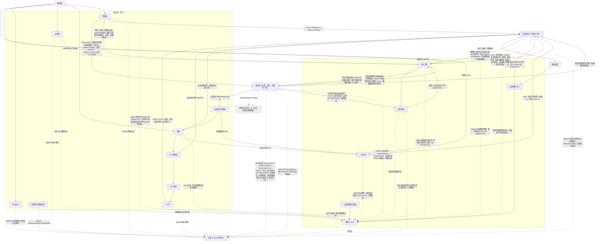
```mermaid
flowchart TB
  SESS["集成会话（不属任一侧）"]
  subgraph EFFECT["效应侧（可写）"]
    TICKET["单据"] --> STS["STS 规则链"] --> LANE["lane 驱动"] --> IOSHELL["IO 壳"]
    OUTH["出站请求处理器"] --> TICKET
    ATTR["效应侧归因处理器"]
    RM["读模型"]
    CTL["控制面"]
    ENTRY["会话入口"]
  end
  subgraph OBSERVE["观察侧（不可写）"]
    ENV["信封解析入口"] --> OJ["观察 Journal"]
    SUB["持久订阅"] --> DELIV["投递调度"]
    ONE["一次性读"]
    INH["入站处理器注册表"] --> OJ
  end
  INT["集成进程"] --> ENV
  HCORE["程序宿主元素（核心，不属任一侧）"] -->|"Load / Advance / Unload"| HPROC["程序宿主进程 × M（外部；内含值树解释器）"]
  HCORE -->|"已提交的 EffectRequest 分派"| OUTH
  SESS -->|"拉起 · 通道 · 凭据副本"| INT
  OUTH -->|"读处理器的 read"| ONE
  TICKET -->|"先查后判的 read"| ONE
  IL -->|"消费方 read"| ONE
  ONE -->|"read · 会话有效声明（读能力、请求 schema）"| SESS
  IOSHELL -->|"submit / cancel · 取证 · 会话有效声明（发出前门）"| SESS
  TICKET -->|"会话有效声明（参数合规、能力项）"| SESS
  STS -->|"会话有效声明（放行门）"| SESS
  HCORE -->|"集成来源的最近声明（装载期声明校验）"| SESS
  HCORE -->|"各观察项的初次接纳结果（声明校验）· Advance 事务里写程序订阅的 cursor、删被覆盖的投递缺口"| SUB
  HCORE -->|"取程序订阅的投递事件（cursor 之后的记录、未确认 Gap{Delivery}、覆盖推进）"| DELIV
  CTL -->|"load_program 读到的程序值交结构校验（成立才 append Applied，否则 Rejected）· remove_native_op 的 InUse 判定"| HCORE
  CTL -->|"开始、替换、卸载成员的 Applied 同事务：程序订阅及其项的建立、沿用、重建与结束"| SUB
  SUB -->|"route（需求全集）· backfill · 会话有效声明（回填）· 最近声明（供给项接纳、配额）· 历代声明（只投递项、执行事实作用域）"| SESS
  SUB -->|"历代开始成员的 Applied 所记输出契约（程序来源只投递项接纳；公共值）"| HCORE
  HCORE -.读已提交的 load_program / unload_program / install_native_op / remove_native_op Applied 与 ProgramHalted（活动集合、失败抑制、各成员输出契约与已安装 op 集合的 fold）.-> STORE
  HCORE -.append 派生记录 · ProgramReset / ProgramFailed · 读当前流 epoch 的最新一条值记录.-> OJ
  HCORE -.append ProgramHalted · 把 Checkpoint 写在它自己的表里.-> STORE
  SESS -->|"编排握手事务与会话内上报 gap 的事务：请它 append None{epoch} · 待接纳项转为接纳或被拒"| SUB
  DELIV -->|"跳过一段之前请它写下 Gap{Delivery}"| SUB
  CTL -->|"restart_integration / rotate_credential"| SESS
  CTL -.append 控制记录.-> STORE
  CTL -.append 程序流开 epoch 的 Gap{Source}（与开始不沿用旧状态之成员的 Applied 同事务）.-> OJ
  ATTR -.读观察记录上的归因.-> OJ
  ATTR -.append ResolutionEvidence{Attributed}.-> STORE
  ENTRY -.append 未完成握手请求的安全事件.-> STORE
  ONE -.append 结果项 · 读结论记录或 Gap{Channel} · 计数观察.-> OJ
  SESS -.append 会话健康观察 · 握手时新流 epoch 的 Gap{Source}.-> OJ
  STORE["存储（SQLite 单写者）"]
  SESS -.append 登记的采纳记录 · 声明版本 · IntegrationHalted · 轮换兑现记录.-> STORE
  SESS -.调用计数观察的内容（由发起方同事务提交）.-> OJ
  SUB -.append 路由结论记录 · 回填的读结论与进度（含 None{epoch}）.-> OJ
  SESS -->|"编排会话内上报 gap 的事务：请它 append 该 Gap{Source}"| ENV
  TICKET -.basis 位置 · 钩子读观察值与归因观察.-> OJ
  IOSHELL -.append 回执 / 取证的观察记录.-> OJ
  IOSHELL -.append 执行事实.-> STORE
  OJ -.持久化.-> STORE
  DELIV -.按位置读观察记录.-> OJ
  DELIV -.按位置读执行事实订阅所选记录的字节（不解析）.-> STORE
  RM -.只读 fold 执行事实.-> STORE
  RM -.只读 fold 观察记录.-> OJ
  RM -.subscriptions 当前态.-> SUB
  IL["解释层"] --> ENTRY
  IL --> SUB
  IL --> RM
  IL --> TICKET
  IL --> CTL
  classDef ext fill:#eee,stroke:#999,stroke-dasharray:3;
  class INT,HPROC,IL ext;
```

唯一跨边是效应侧读观察侧：`basis` 引用的观察位置、钩子读的观察值与归因观察、归因处理器读的观察记录、读模型 fold 的观察记录与读取的订阅表当前态；效应侧的发起方经一次性读发读、IO 壳 append 回执与取证的观察记录、控制面在开始不沿用旧状态之成员的 `Applied` 事务里 append 程序流开 epoch 的 `Gap{origin: Source}`（§8.6 程序流的 epoch）、控制面在开始、替换与卸载成员的 `Applied` 事务里请持久订阅建立、沿用、重建或结束程序订阅及其项（§8.6 程序的输入），也沿这个方向（§3.2）。STS 规则链不读观察（§6.3），它读的是单据 fold 已算好的状态。存储、集成会话与程序宿主元素不属任何一侧：投递调度经存储按位置读出执行事实订阅所选记录的字节、原样搬运，不经读模型、不解析（§8.5）；两侧都经集成会话调用集成、取得会话有效声明与最近声明，它的接口只是契约值（IDL 消息与声明，见上文“集成会话”）。能力证据的记录存在执行事实侧，但写门、订阅接纳与读路由读的都是集成会话给出的会话有效声明。程序宿主元素同理：它把已提交的 `EffectRequest` 交给出站请求处理器分派，但交给持久订阅的只是公共值，即历代开始成员的 `Applied` 所记的输出契约（流名与值类型），持久订阅不读 `Applied` 本身（§8.5 订阅组）。程序宿主元素向投递调度取程序订阅的投递事件（cursor 之后的记录、未确认的 `Gap{origin: Delivery}` 与 `await-all` 输入的覆盖推进），按它们组成 `Advance` 的 `events`（§8.6 `Advance`）；这是单向的使用，投递调度不使用程序宿主元素，所以不在下面的三对里。程序宿主元素自己经存储写的是：程序流上的派生记录与程序观察 `ProgramReset`、`ProgramFailed`（写“值变了”的记录时读当前流 epoch 的最新一条值记录，§2.4），控制流上的 `ProgramHalted`，以及 `Checkpoint` 自己的表；派生 DAG 在宿主进程里只算值，不写任何记录。三对互相使用的元素各用对方不同的接口，订阅表的写者始终只有持久订阅：

- **持久订阅↔程序宿主元素**：持久订阅向程序宿主元素取程序来源的接纳依据（输出契约，它的源头是控制流上的 `Applied`，由程序宿主元素 fold）；程序宿主元素向持久订阅取各观察项的初次接纳结果（源头是订阅表），并在它编排的 `Advance` 事务里请持久订阅写程序订阅的 cursor、删去被覆盖的投递缺口。
- **持久订阅↔投递调度**：持久订阅把订阅、cursor 与未确认的缺口交给投递调度去投递；投递调度要跳过一段时，请持久订阅先写下 `Gap{origin: Delivery}`（§4.2）。
- **持久订阅↔集成会话**：持久订阅经集成会话发 `route` 与 `backfill`、取声明；集成会话编排握手事务与会话内上报 gap 的事务，请持久订阅在其中 append 新流 epoch 的 `None{epoch}`，并把待接纳的项按新声明转为接纳或被拒（§7.2 第 3 步、§8.4）。

这些方向经过的都只是公共值（流名、值类型、接纳结果、位置、声明），不引入任何一侧的类型。程序宿主进程只经宿主协议与程序宿主元素交换值，不接触存储。核心给可选计算的接口只在上级系统文档中定义，不在本组件 uses 图里展开。观察侧任何元素都不依赖效应侧类型：观察侧元素经不属任一侧的元素得到的只是公共值，crate 依赖方向即此，观察侧代码引用效应侧类型不编译（§3.2）。

## 7.4 存储引擎

> 图：本页 D1.4、D1.5。

两侧 `Journal`、订阅表与其余核心自有的表统一持久化于**单个 SQLite 文件**（WAL 模式），不手写分段日志与索引。理由：否则需要自己写索引。


- **表结构与索引**：每张 trace 表以 `(stream_id, log_position)` 为主键，`pos` 单调。`fold_state`、`AS OF` 以及 cursor 之后的记录查询，均退化为引擎原生索引支持的范围扫描。
- **append 由 Rust 接口保证**：第一边界的第二层“执行事实侧只 append”（§3.1）由 **Rust 侧存储接口**保证：对应表的模块 API 仅暴露 `append`，不依赖 SQL 权限约束。派生侧 `compact_below_retention` 实现为保留边界之下按该流保留规则的 `DELETE`，仅适用于 `RetractableDelta` 表：集成来源的一般观察流删边界之下的全部记录；健康流只删被同键后续记录取代的记录，程序流只删被同一流 epoch 里后续值记录取代的值记录。它只删不改：留下的记录原样不动，程序流基线上指名已删记录的撤回部分也留着，fold 取最新一条值记录的正贡献，不受影响（§2.4、§4.1 程序流的 fold）。
- **事务原子性**：
  - 决策 append（规则 `Outcome`/Decision 记录）是一次 SQLite 事务；规则判断所用的状态（`RuleState`）每次由记录 fold 出、不另存，没有需要与决策同事务更新的状态表（§6.3）。
  - 单据 `Close(Prepared)` 与 `Prepared` 记录的 append 也在同一事务内（§6.2）。
  - 对外投递是订阅者按 cursor 读 `Journal`（§4.2），不设待投递表。记录提交后投递失败只是 cursor 不推进，记录不丢（§9.2 #6）。
- **单写者**：核心进程独占该数据库文件（H10 的 OS 文件锁与 SQLite 锁同向生效）。集成进程与程序宿主**不接触**数据库，仅通过内部协议与核心交换记录，满足 C7 凭据链与 H2 程序不可信要求。
- **快照与版本演进**：
  - 状态随时可由 `fold_state` 重建，但重建从保留边界（执行事实侧从首条记录）扫起，成本随历史增长。快照因此是**重启延迟的必需项**，不只是加速。
  - 格式版本持久化于 schema 表，升级只前进（C14）。
  - 快照频率与派生侧留存窗口是配置参数（运行期参数，§7.6）。引用登记方、边界推进审批方与留存语义见 §2.4。

## 7.5 持久化归属表

> 图：本页 D2.5。

每份状态谁写、谁读、怎么传播。

| 状态 | 侧 |
|---|---|
| 观察 `Journal` | 观察 |
| 执行事实 `Journal` | 效应 |
| 规则状态（`RuleState`） | 效应（执行事实的 fold，不另存，§6.3） |
| 单据记录（`TicketAction`） | 效应 |
| 订阅表 / cursor | 观察 |
| 能力证据（握手的声明版本、`CapabilityObserved`） | 记录在效应侧（执行 J）；最近声明与会话有效声明由集成会话求出并以契约值给出（§7.3） |
| 程序状态（`Checkpoint`） | 观察（解释①的 `Scan`/`Window` 累加器）与效应（解释②的执行状态：程序对自己所发请求的进度跟踪） |
| 进程表 | 核心（集成会话与程序宿主元素，各写自己拉起的进程） |
| 实例表 | 核心（fence） |
| 保留边界与引用登记 | 观察 |
| 快照 | 两侧 |

### 观察 `Journal`

- **写**：
  - 程序宿主元素：程序解释①产出的派生记录，随 `Advance` 的输出事务写在程序流上（§4.3、§8.6 `Advance`）；
  - 一次性读元素：除回填外的一次性读的结果项及其读结论记录或 `Gap{origin: Channel}`，发起方为读处理器、检查项的“先查后判”与消费方 `read`（§3.4、§7.3、§8.2）；持久订阅元素：回填的结果及其读结论记录（§8.4）；
  - IO 壳：回执与取证的观察记录（该回应的订单状态与每笔可识别执行的成交记录，带 `dispatch_end`，记录模型，§6.5）；
  - 集成会话：健康观察中的会话状态与调用结果计数（§8.4），计数观察由调用发起方在记录结果的同一事务里提交（§7.3）；握手时决定开新流 epoch 的 `Gap{origin: Source}`（含未兑现的轮换强制的 `credential_rotated`，§7.6）：集成会话编排这一事务，请持久订阅在其中为该逻辑流写 `None{epoch}`（§8.2 `handshake`、§8.4）；
  - 集成推送入口：集成推送的观察记录、会话内上报的断代 `Gap{origin: Source}` 与 readiness（核心盖上到达会话的 `SessionEpoch` 与 `LogPosition`，§8.3）；会话内上报的断代由集成会话编排它的事务，持久订阅在同一事务写该逻辑流的 `None{epoch}`（§8.4）；
  - 持久订阅元素：各逻辑流当前流 epoch 的回填进度健康观察（含新 epoch 的 `None{epoch}`，§8.4）；`backfill_incomplete` 的 `Gap{origin: Source}`；路由结论记录（`route` 返回 `Routed` 时，§8.2）；
  - 程序宿主元素：程序观察 `ProgramReset{reason}`、`ProgramFailed{reason}`（§8.6）；
  - 控制面：程序流开 epoch 的 `Gap{origin: Source}`（`start` 或 `program_upgrade`），在开始不沿用旧状态之成员的 `Applied` 同一事务里、该成员的每条程序流上（§8.6 程序流的 epoch）。
  - 投递缺口 `Gap{origin: Delivery}` 不写在这里：它是订阅的状态，在订阅表里（见下）。
- **读**：订阅者、程序、单据 `basis`/检查项、读模型、效应侧归因处理器。
- **传播**：按 `LogPosition` 推进；`RetractableDelta` 可撤回可压缩；回执 / 取证的观察记录可压缩，`Evidence` 在执行 J。健康流按键压缩，每键保留基线；程序流按流 epoch 压缩，每个流 epoch 原样保留基线（§2.4）。压缩只删不改。

### 执行事实 `Journal`

- **写**：见唯一写入口表（§7.3）。补充：STS 规则链的 Decision/`Outcome`/`Rejection` 记录带 `checked_as_of`；IO 壳的 `VenueAccepted` 与取证 `ResolutionEvidence{Found}` 含 `Evidence`（契约载荷与原始负载，§6.5）；控制记录为 `Applied | Rejected`。
- **读**：读模型、单据 `basis`、lane 规则（阻塞头集合、`bypass_lane` 控制记录）、IO 壳（重启重建链）、对账驱动、出站处理器（重启重派判定）、程序宿主元素（控制流上的 `load_program` / `unload_program` `Applied` 与 `ProgramHalted`：活动集合、失败抑制，与交给订阅接纳的各成员输出契约；`install_native_op` / `remove_native_op` 的 `Applied`：已安装 op 集合，§8.5、§8.6、§8.7）。投递调度经存储按位置搬运执行事实订阅所选的记录，不解析（§8.5）。
- **传播**：纯 append；位置即顺序。lane 上每次尝试的等待与结果、阻塞头集合是它的 fold，不另存（§6.4、§6.5）。
- **会话与程序的持久状态也是它的 fold，不另存**：都在控制流上（§7.3），按这条流上的位置 fold：集成的持久 `Halted`（`IntegrationHalted` 与以位置解除它的 `Applied`，§7.2 第 3 步）；未兑现的轮换（`rotate_credential` 的 `Applied` 与以位置引用它的轮换兑现记录，§7.6）；程序的活动集合（`load_program` / `unload_program` 的 `Applied`）与失败抑制（`ProgramHalted` 与以位置解除它的 `load_program` `Applied`，§8.6）；已安装 op 集合（`install_native_op` 与以同名移除它的 `remove_native_op` 的 `Applied`，§8.7）；登记的采纳（采纳记录与之后带同一 `instance_id` 的 `restart_integration` `Applied`，§7.2 第 3 步）。

### 规则状态（`RuleState`）

- **写**：无，它不是持久化状态。
- **读**：STS 规则链每次求值时由执行事实 fold 出：单据动作与 Decision、lane 上各尝试的记录、`bypass_lane` 控制记录、`deadline` 与核心 UTC 时钟（§6.3）。
- **传播**：没有副本；重启后与平时同样按记录求值。

### 单据记录（`TicketAction`）

- **写**：单据负责人 / 决定者（各 `TicketAction`）。
- **读**：单据 fold、审批人视图。
- **传播**：每条带 principal 与依据；`Ticket` 是这些记录的 fold。

### 订阅表 / cursor

订阅表是核心自有的状态（源头是核心），内容：订阅与逐项状态、每条选中流的 cursor（`Start{from} | At{pos}`，§4.2 cursor 与确认）、按（订阅，流）记的未确认投递缺口 `Gap{origin: Delivery}`（`{流, from, to, reason}`，与该流的 cursor 同一粒度，§4.2）。订阅有两种：消费方的订阅（归属 principal，经 `subscribe` 建立），与每个活动程序 id 一个的程序订阅（§8.6 程序的输入）；程序的 cursor 只在这里，没有另存的一份。cursor 的 `Start` 支就是边界起步的前导尚未确认这一事实，不另存标志。

- **写**：物理写者只有核心的“持久订阅”元素（§7.3）；按流合成的需求经 `route` 下发给集成，`Routed` 的路由结论记录落观察 `Journal`，不在订阅表里。
  - 订阅需求来自消费方的 RPC 与程序订阅的观察项（开始成员的 `Applied` 同一事务按声明的用途建立、沿用或重建，§8.6 程序的输入）；cursor 推进来自消费方的 `ack`（确认 = 已处理，§4.2；`Start{from}` 由第一次覆盖整段前导的确认转为 `At`），程序订阅的 cursor 推进来自提交的 `Advance`：本元素在程序宿主元素编排的 `Advance` 事务里写下新 cursor（第一次提交即转为 `At`，§8.6 `Advance`）；投递缺口来自投递调度的请求：投递调度要跳过一段时先请持久订阅写下这一项，写下之后才跳过。
  - 三类写在该元素内串行化，同一订阅的需求变更、cursor 推进与投递缺口不交叠。确认一个不低于缺口 `to` 的 cursor 时（消费方的 `ack`，或程序订阅所在的 `Advance` 事务），该缺口在同一次写里删除。缺口随（订阅，流）的 cursor 存亡，不随项：cursor 沿用时它沿用（含该流的项被重建或重新接纳失败），只在 cursor 确认它、该流离开订阅、`Reset` 重建该流的 cursor，或 `rewind_cursor` 把 cursor 退到低于它的 `from` 时删除（§4.2）。
- **读**：集成路由、投递（投递调度在每次投递与重新挂接时读未确认的缺口并先交出）、重连恢复、程序宿主元素（程序订阅各观察项的初次接纳结果，§8.6 装载期校验）、读模型 `subscriptions`（当前态，只列消费方的订阅，§8.5）。
- **传播**：cursor 前进；消费方订阅的退回只经控制面 `rewind_cursor`（只把 `At{pos}` 退到低于 `pos` 的 `At{to}`，cursor 仍是 `Start{from}` 时被拒，§8.5 控制组），程序订阅的 cursor 只在不沿用旧状态的替换里按声明的起点重建（§8.6 `Reset`；`Origin` 的重建为 `Start{from}`）；投递损失只存为订阅上的缺口，不写进任何流。

### 能力证据

- **写**：
  - 每次集成握手成功，由集成会话 append 一个**声明版本**（执行 J）：该握手 `Projection` 的声明部分（除记录映射外的全部，§8.1），含作用域与 `account_ref` 的可解析判定（§2.2）；
  - IO 壳在运行期观察到能力变化（含能力变更推送，§8.3；写能力与流的读 / 回填能力）时 append `CapabilityObserved`。它带所更新的声明版本：该来源（由记录锚点承载）加读入那条推送或回应的会话的 `SessionEpoch`（核心按通道盖上，§7.2），不是 append 时另取的当前 epoch。
- **读**：集成会话（求出最近声明与会话有效声明，§7.3）。经它读会话有效声明的有：STS `Context`、单据 `AlignmentCheck` 解析与 `parameter_validity`、IO 壳发出前门的可执行性与取证渠道集、持久订阅的回填判定、一次性读的路由与判定（§8.2、§8.5）；经它读最近声明的有：持久订阅的供给项接纳与配额、`account_ref` 的可解析判定、程序装载期对各输入声明的比对（§8.6）；经它读历代声明版本的有：只投递项的流与执行事实 selector 的作用域键。读模型 `sources` 按同一规则直接 fold 这些记录（可按历史 `as_of`）。执行事实订阅只按位置搬运这些记录，不读其内容（§8.5）。
- **传播**：
  - 只 append，最新一版生效：取该来源最近的声明版本，只 fold 引用这一版本的 `CapabilityObserved`，同一能力目标的多条按其所在流的位置先后；旧会话的更新不覆盖新声明，不需要跨流的全局序（§2.3、§8.5 订阅组）。重启后由持久的声明版本与这些关联的更新重建的是最近声明；会话有效声明要等该来源在本实例建立会话、append 新的声明版本之后才存在（§7.3）。
  - 取证渠道按会话有效的能力证据选：取证是读，只在会话已建立时发出（§6.5）。旧尝试不绑定历史版本，但只取写操作、键角色与该尝试 `SendBarrier` 所记一致的声明（§6.5）：尝试的写操作与键角色来自 `SendBarrier`，不来自声明。
  - `account_ref` 的可解析判定对照该来源的全部历史声明版本（§2.2）。

### 程序状态（`Checkpoint`）

- **写**：程序宿主进程按宿主协议（§8.6）交出 `Checkpoint{bytes, state_version}`；程序宿主元素把它写在 `Checkpoint` 自己的表里，与持久订阅元素写在程序订阅上的该程序 cursor 同一事务提交。状态与 cursor 原子对应，重放边界由此确定。`state_version` 不在本成员接受集合内的不持久化，视同 trap（§8.6 状态迁移）。
- **读**：`Load`（核心重启后与重新装载时）交回本成员可交回的最近 `Checkpoint`；它的 `state_version` 总在本成员接受的集合内（沿用的由替换的 `Applied` 比对，其后持久化的由上一条检查，§8.6 状态迁移），所以 `Load` 不比对版本，也不在装载时 `Reset`。
- **传播**：字节形状由宿主解释器定义，核心不解释；`state_version` 是核心可比对的整数。

### 进程表

- **性质**：指向 OS 进程的索引，不是进程状态：进程的存亡只问 OS，按 `(pid, start_time)` 核对。
- **写**：集成会话拉起集成进程、程序宿主元素拉起程序宿主时写 `(instance_id, pid, start_time, role)`；OS 确认该进程退出之后清除。两个写者按 `role` 分行，各写各的行。
- **读**：新实例启动时回收旧实例进程（§7.2 第 1 步）；同一集成拉起下一个进程之前，确认上一个的行已清除（§7.2 第 3 步）。
- **传播**：与 fence 同库；一行从拉起存在到 OS 确认退出，受控停止之后不留行。

### 实例表

- **写**：第 1 步 fence 事务写入新实例的一行（`instance_id` 加一）；受控停止第 5 步在本实例的行上写结束锚点（§7.2）。
- **读**：启动时取下一个 `instance_id`；诊断报告上一实例是受控停止还是没有结束锚点（崩溃）。
- **传播**：`instance_id` 单调递增；结束锚点只在全部内层结束之后写，写了之后本实例不再写任何记录。

### 保留边界与引用登记

- **写**：核心。边界推进由控制面 `advance_retention` 经审批写新边界；引用登记随 `Prepared`、`Checkpoint` 与等待仍 `Active` 时的 `ResolutionEvidence` 的 append 自动写入（§2.4）。
- **读**：`compact_below_retention`、`basis_valid`（`BeyondRetention` 判定）、快照。
- **传播**：每条观察流一个边界，只前进；推进不得越过该流已登记引用最早位置与配置窗口下界；执行事实侧没有边界。

### 快照

- **写**：核心（按 P15 快照规则：运行期参数的快照频率，或控制面 `request_snapshot`）。
- **读**：重启恢复。
- **传播**：快照是 `fold_state` 在某个位置集上的结果，带这个位置集与格式版本；重启时先载入快照，再 fold 位置集之后的记录。它是为重启延迟而设的近处副本（§7.4）：派生自两侧 `Journal`，只加速读，不改 append-only 语义，也不是源头；格式版本不符或半写的快照丢弃，从记录重建。

## 7.6 配置与凭据

- **统一路径**：所有核心与 Alice 共享的配置，以文件形式持久化在 `OPENALICE_HOME` 下的统一路径。两个进程均从文件读取，不经进程间注入、环境变量或启动参数传递（集成进程得到凭据的方式另见下文“凭据链”）。
- **每个文件的写者是 Alice**：核心只读，不写统一路径下的任何文件。核心只在这些时刻读一个文件：启动（§7.2 第 3 步）、读取该文件的控制动作生效时（下表“重载”列）、拉起集成进程时读该集成的凭据（§7.1 凭据链），以及装载程序时按清单读程序值文件、核对 `Applied` 所钉的内容 hash（启动第 5 步、等待中的成员重新判定时，§8.6 按钉住的内容装载），拉起引用原生 op 的宿主之前按安装 `Applied` 所记的引用读原生计算制品、核对所记的内容 hash（§8.7 原生 op 的执行）；文件变了而没有这些时刻，核心不重读。控制动作读到的文件以控制记录带它的内容 hash 记下（§8.5 控制组），启动时读到的集成登记由采纳记录记下（§7.2 第 3 步）。
- **格式版本只前进**：文件附带格式版本，升级只前进（C14）；迁移失败拒绝启动而非部分迁移。
- **schema 发布**：每个文件带格式版本；schema 的文本形式（JSON schema）随 IDL 一起作为 release 产物发布，是实现阶段工件。
- **凭据链**：`统一路径封存文件 → UTA 核心 → 该集成进程`，拉起时经继承句柄交付，副本随进程结束（§7.1）；程序与消费方只见账户身份（C7）。
- **Alice 侧的适配**（密钥位置调整、移除 flag 重启）属于接入阶段，不在本设计范围内；本设计只定义核心读取的文件契约。
- **原子替换与重载失败**：
  - 配置文件以整文件原子替换（临时文件 + rename，与既有快照 index 的写法一致，O9/`design/investigation/existing-capabilities.md:189`），不存在半写可见态。
  - 运行期重载失败保留上一有效版本，控制结果为 `Rejected(reason)` 记录（§8.5）。
  - 启动期读取失败按 C14 拒绝启动，而非部分迁移。

### 文件清单与每文件契约

| 文件 | 写者 | 内容 | 重载 |
|---|---|---|---|
| 账户封存信封 | Alice | 每账户的封存凭据密文与账户身份（`WriteScope` 对齐用的上游账户标识） | 每次拉起该集成进程时读取；`rotate_credential` 立即以重读的文件重启该集成（见表下） |
| 封存密钥引用 | Alice | 解封密钥的位置引用（OS keychain / 文件路径），不含密钥本体 | 同上 |
| 集成登记 | Alice | 每个集成的 id、二进制路径、启动参数、负责的账户集、契约版本；id 的稳定是写者的义务（§7.2 第 3 步） | 启动时整份采纳；`restart_integration(id)` 重读该 id 的条目，id 不在文件里则 `Rejected` |
| 策略/审批规则 | Alice | 见表下 | `reload_config(rules)`；版本 = 内容 hash |
| 程序装载清单 | Alice | 程序值文件引用、预算、接受的 `state_version` | `load_program`（`Applied` 钉住程序值的内容 hash、预算与 `state_version`，§8.6） |
| 原生计算制品目录 | Alice | 原生 op 的制品文件，每个文件声明 op 名与签名；`install_native_op(artifact)` 的 `artifact` 是其中一个文件的引用 | `install_native_op`（`Applied` 记下引用与读到的内容 hash，§8.5 控制组）；每次拉起引用该 op 的宿主之前按这条 `Applied` 重读、核对 hash，不符即 `ProgramHalted{NativeArtifactUnavailable}`（§8.7 原生 op 的执行） |
| 运行期参数 | Alice | 快照频率、派生侧留存窗口、`deadline` 全局缺省（仅在策略规则未按 scope 给出时生效）、投递缓冲上限、回填深度（全局缺省与按逻辑流的取值，§8.4） | `reload_config(runtime)` |

**`rotate_credential` 的重载效果**：结束目标集成的会话、终止它的进程，OS 确认退出之后以重读的封存文件拉起新进程（新 `session_seq`，进入 `Connecting`，§7.2 第 3 步）。凭据的旧副本随旧进程的退出结束，新副本只在新进程里（§7.1 凭据链）。它也解除 `Halted{Refused}`，其 `Applied` 带被解除的 `IntegrationHalted` 位置；对因投影不合法或契约版本不兼容而 `Halted` 的集成被拒，那只经 `restart_integration` 解除（§7.2 第 3 步）。

**轮换强制的新流 epoch** [设计]：`rotate_credential` 的 `Applied` 开始一项**未兑现的轮换**；它结束于该集成此后第一次成功的握手（返回合法投影、转入 `Established`，§7.2 第 3 步），那次握手强制各流开新 epoch（`Gap{origin: Source, reason: credential_rotated}`），不续接，游标证明也不使它续接（§8.2 `handshake`）。这次握手通常就是轮换拉起的新进程的握手；`Applied` 提交之后、新进程拉起之前受控停止开始，本实例不再拉起进程（受控停止开始时 `Applied` 还没有提交的以 `Rejected(Stopping)` 结束，不开始这一项，§7.2 受控停止），或核心在 `Applied` 之后、这次握手之前崩溃时，它是之后某个实例里该集成第一次成功的握手。

- **兑现记录**：在这次握手的事务里（与声明版本、`Established` 健康观察、各流新 epoch 的 `Gap{origin: Source}` 同一事务，§7.2 第 3 步转移表），集成会话在控制流上 append 一条**轮换兑现记录**：该集成、以位置引用的每条被兑现的 `rotate_credential` `Applied`，与这次会话的 `SessionEpoch`。这次事务提交即未兑现轮换的结束锚点（确认者是集成会话）；握手已返回合法投影而事务没有提交（其间崩溃），轮换仍未兑现。
- **未兑现的轮换是控制流的 fold**：该集成的 `rotate_credential` `Applied` 之后，控制流上没有以位置引用它的轮换兑现记录。集成会话在每次握手时读这个 fold，包括下一实例第 3 步的握手；一次成功的握手兑现当时全部未兑现的 `Applied`。握手返回 `Unavailable`、`Refused`，或投影不合法、契约版本不兼容，都没有转入 `Established`，不兑现。
- 理由：这项强制跨实例存在，而声明版本在该来源的声明流上、健康观察按键压缩，都不能按位置说明“这次轮换之后是否已有成功的握手”；控制流是这些持久事实唯一按位置 fold 的流（§7.3 控制流）。兑现记录以位置显式引用它兑现的 `Applied`，与解除 `Halted` 的 `Applied` 引用 `IntegrationHalted` 同形，不比较不同流上记录的先后。不选：**只在内存里记下一次握手要强制**：受控停止与崩溃之后丢失，继任实例的握手就会续接；**比较控制流上的 `Applied` 与声明流上声明版本的先后**：执行事实侧没有跨流的全局序（§2.3）；**每个实例的第一次握手都强制**：没有轮换时也丢掉可证明的续接。

**策略 / 审批规则文件的内容：**

- principal → scope 表，每行键为 `(principal, WriteLaneKey, OperationKind)`（`OperationKind` 取交易协议的封闭集合，§6.2），值为：
  - 人工审批条件：总是 / 从不 / 名义超过阈值 N（§6.3 审批步；`Cancel` 只可给前两种）；
  - instrument 允许集合（可缺；缺 = 不限，空集 = 全部否决，§6.3 输入约束步；`Cancel` 没有 instrument，不可给）；
  - 检查目录各项（§6.2）：必要 / advisory、该项参数（敞口的 `ratio`）、是否“先查后判”；能力项恒为必要项，不在此列；
  - 依据有效性窗口 `Lag`（§5.2）。
- 按 `(WriteLaneKey, OperationKind)` 的冷却间隔（只对 `Place`、`Replace` 可给，跨 principal 共享，§6.3 冷却）。
- 规则文件的合法性在重载与启动时校验：键中的 `OperationKind` 不在封闭集合内、参数不在其合法域（`ratio` ≤ 0、间隔为负、名义阈值为负）、给了不接受该参数的操作种类（如对 `Close` 给冷却，对 `Cancel` 给 instrument 允许集合或名义阈值条件）、列出了需要参数的检查项却没给参数、把“原单仍在”列为必要，都使整份文件不合法（重载 `Rejected` 并保留上一有效版本；启动期按读配置失败拒绝启动）。
- 判据不在规则文件里：每项参数的含义与比较边界由交易协议写定（§6.2、§6.3），规则文件只给取值；不认识的键使文件不合法，不被忽略。
- 控制动作与 `abandon` 授权。
- 按 `(WriteLaneKey, OperationKind)` 的 `deadline` 缺省：意图未带 `deadline` 时，在 `Draft`/`Revise` 规范化时填入该版本；版本 hash 含它，审批人看到的即放行的。此项也缺，则取运行期参数的全局缺省。
- 规则版本 = 内容 hash，写进此后每条 `Outcome`/`Rejection`/控制记录（§8.5）。

## 7.7 Rust 映射

所需机制均不依赖 HKT，也不需要 ZIO 式 API。ZIO 解决效应多态与依赖注入；UTA 把效应收敛到“IO 壳是核心内唯一效应处”，依赖注入就是 `Context` 参数，两个问题在设计层已消掉。

三档：

| 档 | 机制 | Rust 形状 |
|---|---|---|
| 直接 | `Journal<Record, Delta>`、`fold_state`、`compact_below_retention` | 泛型 struct + supertrait；`compact` 是一个 `impl<D: RetractableDelta>` 块 |
| 直接 | 三种进度（完备进度为序号覆盖） | 自写 `Antichain<T: PartialOrder>`，不引 timely |
| 直接 | `Program` 值、`Ticket` 状态机、IO 壳链转移表 | `serde` → enum → 穷尽 match；`Id` 越界与环在装载期校验 |
| 直接 | 增量 DAG | `salsa`（cycle panic 与 fp-05 案例 9⑤ 同形） |
| 直接 | 唯一单向边（§3.2） | crate 依赖方向，反向不编译 |
| 直接 | SQLite 单写者 | `rusqlite`，事务即函数 |
| 变形 | 组合子多种解释（§2.5） | 一个 enum 值树 + 五个 fold（启动/装载期），不是泛型关联类型派生 |
| 变形 | 规则组合（§6.3） | 具名 struct + 具名 enum `#[from]`，不是泛型 `Embed` |
| 变形 | 处理器注册表（§6.1、§8.1） | `HashMap<Kind, Box<dyn Handler>>` + 元数据（schema、`required_inputs`、读/写）；启动期求并集与握手比对；不宣称全局穷尽 |
| 变形 | 发送屏障（§6.5） | move-semantics token（私有构造器 + 内含 fsync），不是泛型 typestate |
| 变形 | 检查项（§6.2 单据） | `CheckName` 为 per-`Intent` 闭合 enum；`AlignmentCheck` 的 `eval` 写作 `fn` 指针，Rust 里为对象安全 trait 的 `Box<dyn …>`，二者同一意图；`Hash` 需规定 canonical 序列化 |
| 变形 | capability | 不可伪造 token 类型只授权不执行 |

- 痛点全是同一个缺口（Rust 没有类型级和 / 积的自动构造）的不同面孔。规避一律是“值化 + 启动期校验”或“具名类型 + 显式 `From`”。
- 增量引擎按指标是否可撤回，选节点图（Incremental 式）或 differential。二者不是任选，都不能承载外部 unknown Write。
- 不迁移 tagless-final 多态与 Haxl `<*>` 违反 `ap` 的技巧。

**Rust 形状不反向决定 §2–§6 的模型。** 上表是把已定的类型与抽象落到 Rust 的可行形状；性能与样板量由实现期 profiling 定落点。

- 若实测只推翻某个落点（如 `salsa` vs 手写节点图、`dyn` vs 静态分发、文本 JSON-RPC vs 同一 IDL 的二进制编码），改的是落点而非模型。模型由 §2–§6 的推导与不变量决定，不由 Rust 表达能力反推。
- 唯一例外是 §10.4 #1：若规则 / 程序 / 处理器需要不同代数或生命周期，或同一树得不到稳定规范化描述，改的是表示（§2.5、§4.3、§6.1、§6.3），而不只是落点。

## 核心内部视图

以下图示只展开核心进程内的状态、组件和持久化关系；相邻进程只作为接口对端出现。

## D1.3 集成的会话状态与会话的通道

对照：§7.1 核心创建的通道、§7.2 第 3 步（会话状态、转移表、会话 epoch）与受控停止、§7.3 集成会话、§8.2 `handshake`、§8.3（推送、会话中吊销身份）、§8.4 readiness 与健康、§7.6 `rotate_credential`。

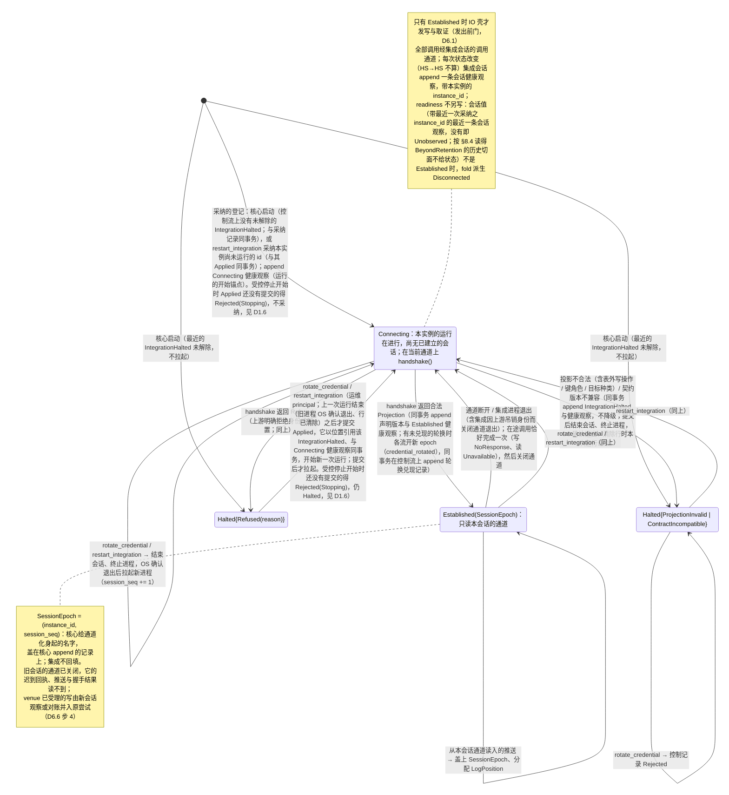
```mermaid
stateDiagram-v2
  state "Connecting：本实例的运行在进行，尚无已建立的会话；在当前通道上 handshake()" as HS
  state "Established(SessionEpoch)：只读本会话的通道" as EST
  state "Halted{ProjectionInvalid | ContractIncompatible}" as REJ
  state "Halted{Refused(reason)}" as REF
  [*] --> HS : 采纳的登记：核心启动（控制流上没有未解除的 IntegrationHalted；与采纳记录同事务），或 restart_integration 采纳本实例尚未运行的 id（与其 Applied 同事务）；append Connecting 健康观察（运行的开始锚点）。受控停止开始时 Applied 还没有提交的得 Rejected(Stopping)，不采纳，见 D1.6
  [*] --> REJ : 核心启动（最近的 IntegrationHalted 未解除，不拉起）
  [*] --> REF : 核心启动（最近的 IntegrationHalted 未解除，不拉起）
  HS --> EST : handshake 返回合法 Projection（同事务 append 声明版本与 Established 健康观察；有未兑现的轮换时各流开新 epoch（credential_rotated），同事务在控制流上 append 轮换兑现记录）
  HS --> REJ : 投影不合法（含表外写操作 / 键角色 / 目标种类）/ 契约版本不兼容（同事务 append IntegrationHalted 与健康观察，不降级；提交后结束会话、终止进程，OS 确认退出、清除行时本次运行结束）
  HS --> REF : handshake 返回 Refused（上游明确拒绝身份或配置；同上）
  HS --> HS : handshake 返回 Unavailable → 按 pacing 在同一通道上重握手
  HS --> HS : 通道断开 / 进程退出 → 结束该会话；OS 确认退出后拉起新进程、新通道（session_seq += 1）
  HS --> HS : rotate_credential / restart_integration → 结束会话、终止进程，OS 确认退出后拉起新进程（session_seq += 1）
  EST --> HS : 通道断开 / 集成进程退出（含集成因上游吊销身份而关闭通道退出）；在途调用恰好完成一次（写 NoResponse、读 Unavailable），然后关闭通道
  EST --> HS : rotate_credential / restart_integration（同上）
  EST --> EST : 从本会话通道读入的推送 → 盖上 SessionEpoch、分配 LogPosition
  REF --> HS : rotate_credential / restart_integration（运维 principal；上一次运行结束（旧进程 OS 确认退出、行已清除）之后才提交 Applied，它以位置引用该 IntegrationHalted、与 Connecting 健康观察同事务，开始新一次运行；提交后才拉起。受控停止开始时还没有提交的得 Rejected(Stopping)，仍 Halted，见 D1.6）
  REJ --> HS : restart_integration（同上）
  REJ --> REJ : rotate_credential → 控制记录 Rejected
  note right of EST
    SessionEpoch = (instance_id, session_seq)：核心给通道化身起的名字，
    盖在核心 append 的记录上；集成不回填。
    旧会话的通道已关闭，它的迟到回执、推送与握手结果读不到；
    venue 已受理的写由新会话观察或对账并入原尝试（D6.6 步 4）
  end note
  note left of HS
    只有 Established 时 IO 壳才发写与取证（发出前门，D6.1）
    全部调用经集成会话的调用通道；每次状态改变（HS→HS 不算）集成会话 append 一条会话健康观察，带本实例的 instance_id；
    readiness 不另写：会话值（带最近一次采纳之 instance_id 的最近一条会话观察，没有即 Unobserved；按 §8.4 读得 BeyondRetention 的历史切面不给状态）不是 Established 时，fold 派生 Disconnected
  end note
```

读法：

- 一个集成进程恰有一个会话（一条通道）；会话在进程之内结束，进程在 OS 确认退出之后才让位给下一个。上游暂时不可达只在同一通道上重握手，不换进程。
- 会话 epoch 与流 epoch 独立：重连后集成若能以 venue 游标证明续接，流 epoch 不变、`Seq` 接续；证明不了才开新流 epoch（D3.2）。
- `rotate_credential` 留下未兑现的轮换（控制流的 fold）：该集成此后第一次成功的握手，不论在本实例还是之后的实例，强制新流 epoch（`credential_rotated`），不允许续接，并在同一事务 append 以位置引用它的轮换兑现记录（§7.6）；`Unavailable`、`Refused` 与投影不合法都不兑现。
- `Connecting` 会自己恢复，两种 `Halted` 只由运维动作解除，核心重启不解除（它来自执行事实 `IntegrationHalted`，解除的 `Applied` 以位置引用它）；健康面把二者分开给出。`Halted` 记的是核心不再自动握手的决定，进程的结束另由 OS 确认。
- 会话结束时在途调用先恰好完成一次，再关闭通道，已完成的调用不会被迟到回应再完成，也不再计数（§7.2 第 3 步）。
- 重握手后不再声明的流：选中它的订阅对该流挂起（原因 `StreamUndeclared`），流再被声明时恢复；断连与 `Halted` 不使订阅挂起（§8.2）。


## D1.4 持久化归属：谁写哪张表

对照：§7.5 持久化归属表；§7.3“执行事实 append 链的唯一写入口”。


```mermaid
flowchart LR
  subgraph W["写者（都在核心进程内）"]
    PUSH["集成推送入口<br/>（位置由核心分配）"]
    RD["一次性读元素：除回填外的 read（发起方：读处理器 · 钩子先查后判 · 消费方 read）<br/>（结果项 + 读结论记录或 Gap{Channel} + 计数观察；并入的读处理器的 EffectResponse 由其 owner 同事务 append）"]
    IOR["IO 壳：回执 / 取证的观察记录（订单状态；每笔可识别执行一条成交记录）"]
    TK["单据（TicketAction）"]
    STS["STS 规则链（含授权步否决时的安全事件）"]
    IOE["IO 壳：SendBarrier（写操作 · 键 · 键角色）/ VenueAccepted / VenueRejected / NotSent / Undetermined / Expired / Abandoned /<br/>ResolutionEvidence / ReconciliationReopened{SessionRestored} / CapabilityObserved / 取证 Gap{Channel}"]
    ATTR["效应侧归因处理器：ResolutionEvidence{Attributed}"]
    CTL["控制面：控制记录（bypass_lane 随其 lane 流，其余都在控制流；解除 Halted 的 Applied 引用 IntegrationHalted；restart_integration 的 Applied 带文件 hash 与 instance_id；load_program 的 Applied 钉内容 hash、以值记下执行事实输入、引用的原生 op 名集合与输出契约、记下沿用的 Checkpoint，解除失败抑制时引用 ProgramHalted；install_native_op 的 Applied 以值记下 op 名、签名、artifact 引用与内容 hash，remove_native_op 的记下 op 名）· 越权安全事件 · ReconciliationReopened{Manual}"]
    SESS["会话入口：未完成握手请求的安全事件"]
    OUT["出站请求处理器：EffectRequest · EffectResponse"]
    SUBEL["持久订阅元素"]
    ISESS["集成会话"]
    HOSTP["宿主协议 / 程序宿主元素"]
    FENCE["fence"]
    RET["保留协议"]
  end
  subgraph T["SQLite 表"]
    OJ[("观察 Journal<br/>RetractableDelta，可压缩")]
    EJ[("执行事实 Journal<br/>纯 append；lane 流 · 声明流 · 请求流 · 控制流")]
    SUB[("订阅表 / cursor")]
    CAP[("能力证据")]
    CK[("Checkpoint")]
    PT[("进程表 (instance_id, pid, start_time, role)：OS 进程的索引")]
    RB[("保留边界 + 引用登记")]
    SN[("快照")]
    IID[("实例表：instance_id 与结束锚点")]
  end
  PUSH --> OJ
  RD --> OJ
  IOR --> OJ
  TK --> EJ
  STS --> EJ
  IOE --> EJ
  ATTR --> EJ
  CTL --> EJ
  CTL -->|"程序流开 epoch 的 Gap{Source}（start / program_upgrade），与开始不沿用旧状态之成员的 Applied 同事务"| OJ
  SESS --> EJ
  OUT --> EJ
  SUBEL -->|"需求 · cursor · 逐项状态 · 投递缺口 Gap{Delivery}；程序订阅：开始 / 替换 / 卸载成员的 Applied 同事务建立、沿用、重建或结束它及其项，Advance 事务里写它的 cursor 并删被覆盖的缺口"| SUB
  SUBEL -->|"回填的结果项与读结论记录 · 回填进度健康观察 · 覆盖检查点 · 路由结论记录"| OJ
  ISESS --> CAP
  ISESS -->|"登记的采纳记录 · IntegrationHalted · 轮换兑现记录（控制流）· 声明版本"| EJ
  ISESS -->|"集成进程的行"| PT
  ISESS -->|"会话健康观察 · 调用计数（计数由发起方同事务提交）· 握手时新流 epoch 的 Gap{Source}（与持久订阅的 None{epoch} 同事务）"| OJ
  HOSTP -->|"程序宿主进程的行"| PT
  IOE --> CAP
  HOSTP -->|"Checkpoint（与持久订阅写在程序订阅上的 cursor 同一 Advance 事务）"| CK
  HOSTP -->|"Advance 输出的派生记录（解释①）· 程序观察 ProgramReset / ProgramFailed"| OJ
  HOSTP -->|"ProgramHalted（控制流，与 ProgramFailed 同事务）"| EJ
  FENCE -->|"新实例一行、instance_id += 1（与 fence 同事务）；受控停止的结束锚点"| IID
  RET --> RB
  TK -.->|"Prepared 同事务自动登记 basis"| RB
  IOE -.->|"等待仍 Active 时的 ResolutionEvidence 自动登记引用"| RB
  ATTR -.->|"等待仍 Active 时的 ResolutionEvidence 自动登记引用"| RB
  CTL -.->|"unload_program 与不沿用旧状态的替换的 Applied 解除程序 cursor 引用（在宿主 OS 确认退出之后 append）"| RB
  HOSTP -.->|"进入活动集合后每个 Checkpoint 自动登记 cursor"| RB
```

读法：

- 观察 J 有七类写者（含一次性读元素的读结果、集成会话的会话健康观察与握手时的新 epoch `Gap{Source}`、持久订阅的回填结果、回填进度与路由结论、程序宿主元素写的派生记录与程序观察、控制面的程序流开 epoch 的 `Gap{Source}`），执行 J 有九类（含会话入口的安全事件、集成会话的采纳记录、声明版本、`IntegrationHalted` 与轮换兑现记录、程序宿主元素的 `ProgramHalted`）；两侧共享存储原语但类型宇宙不共享（§4.1）。采纳记录、`IntegrationHalted`、轮换兑现记录、`ProgramHalted` 与除 `bypass_lane` 外的控制记录都在一条控制流上（§7.3），采纳集合、`Halted`、未兑现的轮换、活动集合与失败抑制、已安装 op 集合都只按这条流上的位置 fold。
- 进程表有两个写者，按 `role` 分行：集成会话写集成进程的行，程序宿主元素写宿主进程的行（§7.5）。订阅表只有持久订阅元素一个写者：消费方订阅与程序订阅都在其中，程序的 cursor 只存在这里；程序宿主元素编排 `Advance` 事务、写 `Checkpoint` 表，控制面的 `Applied` 事务里的程序订阅变更也由持久订阅元素写（§7.5 订阅表）。
- 读模型不写任何表：它是按种类对执行 J、观察 J 的只读 fold（`subscriptions` 读订阅表当前态，§8.5），供 `read_model` 读取。
- 引用登记不是独立写者动作：随 `Prepared`、`Checkpoint` 与等待仍 `Active` 时的 `ResolutionEvidence` 的 append 自动写入，随尝试等待结束（结果确立、`Expired`、`Abandoned`）、下一 checkpoint、`unload_program` 或不沿用旧状态的替换自动解除（D8.1）。
- 核心不写统一路径下的任何文件（§7.6）。


## D1.5 同事务集合

对照：§7.4 事务原子性；§6.1 请求完成事实；§6.2 与写边界的接口；§6.5 记录模型；§8.6 `Advance` 与失败抑制；§7.2 第 1、3 步；§7.6 轮换强制的新流 epoch。

| 同一 SQLite 事务内必须一起提交 | 依据 | 崩在中途的后果（§9.2） |
|---|---|---|
| `Close(Prepared(position))` + `Prepared` | §6.2、§7.4 | #1：二者皆无，单据仍 `AwaitingDecision` |
| Decision / `Outcome` / `Rejection` 记录 | §7.4 | 链步未发生，重启按记录重新求值该步（`RuleState` 由记录 fold 出，§6.3） |
| 程序写处理器的 `Draft` + `SubmitForDecision` + `EffectResponse{Drafted}` | §6.1 | #21：无 `EffectResponse` → 重派开单 |
| 读处理器的结果项与读结论记录 / `Gap{Channel}` + `EffectResponse{Concluded / Unavailable}` | §6.1 | #21：无 `EffectResponse` → 重新执行一次 |
| 写调用（`submit` / `cancel`）的 `Ack`：`VenueAccepted`（含 `Evidence`）+ 该回应的观察记录（订单状态；每笔可识别执行一条成交记录）+ 该调用的计数健康观察 | §6.5 记录模型、§8.4 | #5：视为无后继 → `Undetermined` → by-key 取证重得同一状态 |
| 写调用返回 `NotSent`：`NotSent` 记录 + 该调用的计数健康观察 | §6.5、§8.4 | 视为无后继 → `Undetermined(CrashWindow)`（保守） |
| 一次取证命中：`ResolutionEvidence{Found}`（含 `Evidence`）+ `provenance: Reconciliation` 的该回应观察记录 | §6.5 | #7：该次取证不存在；fold 显示本轮该渠道未取证，重做（读可重试） |
| 归因命中：带 `FromAttempt` 的观察记录 + `ResolutionEvidence{Attributed}`（记录来自回执、取证响应或一次性读时，与该回应的其余记录同一事务） | §6.6、§8.1 | 推送带来的未 append：核心崩溃即集成成孤儿被回收，重启握手后该流续接（集成以 venue 游标证明）或新 epoch + `Gap{Source}`；续接则记录重到，仍处 `Undetermined` 且结果未知的尝试照常归因。来自回执、取证响应的，随该回应一起未落，按上面对应的行恢复。来自一次性读的按发起方：读处理器的结果项按上面读处理器那一行恢复（#21 重新执行一次）；消费方 `read` 与“先查后判”的读随实例结束、没有结论，核心不重发（§7.2 生命周期表、§8.5 一次性读的 `Pending`、§10.5 #50）。两种情形下该尝试都仍处 `Undetermined`，经它自己的渠道或此后的记录收敛 |
| `Undetermined` append + 回查已到达的归因观察 | §6.6 | 二者同事务，不存在"归因已到但未匹配"的持久态 |
| `Advance` 输出：`EffectRequest` 记录 + 派生记录 + `Checkpoint` + 程序订阅上的程序 cursor（持久订阅元素写）+ 新 cursor 覆盖的 `Gap{Delivery}` 的删除 | §8.6 | #16：整批不存在，从同一组已提交 cursor 重新推进，未确认的缺口仍在 |
| fence 取得 + 实例表新一行（`instance_id += 1`） | §7.2 第 1 步 | 未提交则旧 `instance_id` 仍有效，重来 |
| 单条观察 append + `LogPosition` 分配 | §7.4 | #9：半写不可见 |
| 调用结果的记录（回执、取证、读结论、`Gap{Channel}`、`Undetermined`）+ 该调用的计数健康观察 | §7.3、§8.4 | 二者皆无：调用结果未落，计数不前进；不存在“计了数却无结果”的持久态 |
| 握手成功（集成会话编排）：声明版本 + `Established` 健康观察 + 开新 epoch 的流的 `Gap{Source}` 与各自的 `None{epoch}` 回填进度（集成会话请持久订阅写）+ 待接纳订阅项（含程序订阅的项）按新声明转为接纳或被拒；有未兑现的轮换时，各流 `Gap{Source, credential_rotated}` + 控制流上以位置引用被兑现的 `rotate_credential` `Applied` 的轮换兑现记录 | §7.2 第 3 步、§7.6、§8.2 `handshake`、§8.4 | 二者皆无：会话未建立，轮换仍未兑现，重启后在新进程的新通道上再握手，那次成功的握手照样开新 epoch 并兑现 |
| 会话内上报开新 epoch（集成会话编排）：集成推送入口 append 的 `Gap{Source}` + 持久订阅为该逻辑流写的 `None{epoch}` | §8.3、§8.4 会话内开的新流 epoch | 二者皆无：这条 gap 未被接受，重启后该流在新会话的握手里按续接或新 epoch 决定 |
| 启动第 3 步：登记的采纳记录（控制流）+ 每个采纳的集成的初始会话健康观察（`Connecting`，或恢复的 `Halted{cause, since}`；都带本实例的 `instance_id`） | §7.2 第 3 步、§8.4 健康不留旧值 | 二者皆无：本实例还没有采纳记录，重启后由继任实例第 3 步重来；含整个事务的健康切面给出初始观察，把二者分开的切面给出 `Unobserved`，不给上一实例的会话值 |
| `IntegrationHalted` + `Halted` 健康观察（进程的终止在提交之后，另由 OS 确认） | §7.2 第 3 步 | 二者皆无：仍在上一状态，重启按执行事实重判；已提交而进程未确认退出：继任实例第 1 步回收 |
| 解除 `Halted` 的控制记录 `Applied`（引用 `IntegrationHalted`）+ `Connecting` 健康观察；只在上一次集成运行结束（进程 OS 确认退出、行已清除）之后提交 | §7.2 第 3 步 | 二者皆无：仍 `Halted`，没有握手发生 |
| `restart_integration` 采纳本实例尚未运行的 id：`Applied`（带文件 hash 与 `instance_id`）+ `Connecting` 健康观察 | §7.2 第 3 步、§8.5 | 二者皆无：该 id 不在采纳集合里，没有运行、没有进程 |
| `load_program` 的 `Applied`（钉内容 hash、以值记下输出契约、记下沿用的 `Checkpoint`）+ 程序订阅上全部输入的 cursor 与观察输入的订阅项；让 id 进入活动集合的（首次装载、卸载之后再装载）另加程序订阅本身的建立与新成员每条程序流新 epoch 的 `Gap{Source, start}`；替换保留程序订阅，共有输入的项只在主体集与用途也相同、且不是被拒的项时沿用，否则同事务结束旧项、建立并接纳新项；替换不沿用旧状态时（`cold_start`、不接受旧 `state_version`，或开始旧成员的 `Applied` 所记的输出契约与新成员的不同）另加 `ProgramReset`、新成员每条程序流新 epoch 的 `Gap{Source, program_upgrade}`、项与 cursor 的重建（重建的 cursor 上的投递缺口随之删除）、旧保留引用的解除；新成员不声明的流不写记录。结构校验不成立的程序值只有控制记录 `Rejected`，不在这个集合里 | §8.5、§8.6 卸载与替换、程序流的 epoch、装载期校验 | 二者皆无：id 不在活动集合里的，程序仍不在集合里，没有程序订阅，程序流没有新 epoch；替换的，旧成员照旧（替换时旧宿主已结束，重启照常判定装载旧成员，失败抑制中的仍被抑制）；已提交：按 `Applied` 所记沿用或不携带装载，不重复 `Reset`，不再开 epoch |
| `unload_program` 的 `Applied` + 程序订阅（cursor 与观察输入订阅项）的结束 + 保留引用的解除（宿主已 OS 确认退出、已发出的装载步骤都已得出结论之后）；程序流上不写记录，它的 epoch 不结束 | §8.6 卸载与替换 | 二者皆无：程序仍在活动集合里，重启照常判定装载（等待中得出装载失败、已在它之前提交 `ProgramHalted` 的，仍在失败抑制里） |
| `ProgramHalted` + `ProgramFailed` 观察（宿主的终止在提交之后） | §8.6 | 二者皆无：重启时程序仍在活动集合里且未被抑制，按 `Checkpoint` 重新装载；超预算或 trap 若再发生，再记一次 |

读法：`SendBarrier` 不在任何集合里——它单独 durable append（fsync）后才允许该尝试的写调用，这正是把崩溃窗口二分的屏障（D6.1）。


## D2.2 一条流的时间线：epoch、Seq、三种进度

对照：§2.3（位置、三种进度、位置归核心而完备归来源）、§2.4（保留语义）、§4.2 gap 三来源、§8.4 实时边界与序号覆盖。

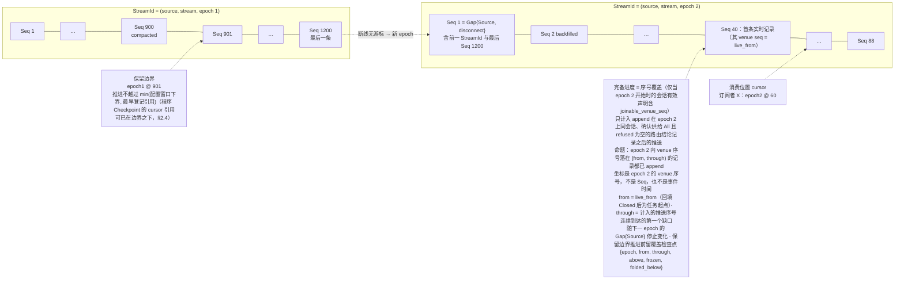
```mermaid
flowchart LR
  subgraph E1["StreamId = (source, stream, epoch 1)"]
    direction LR
    A1["Seq 1"] --- A2["…"] --- A3["Seq 900<br/>compacted"] --- A4["Seq 901"] --- A5["…"] --- A6["Seq 1200<br/>最后一条"]
  end
  subgraph E2["StreamId = (source, stream, epoch 2)"]
    direction LR
    B0["Seq 1 = Gap{Source, disconnect}<br/>含前一 StreamId 与最后 Seq 1200"] --- B1["Seq 2 backfilled"] --- B2["…"] --- B3["Seq 40：首条实时记录<br/>（其 venue seq = live_from）"] --- B4["…"] --- B5["Seq 88"]
  end
  A6 -.->|"断线无游标 → 新 epoch"| B0
  RET["保留边界<br/>epoch1 @ 901<br/>推进不越过 min(配置窗口下界, 最早登记引用)（程序 Checkpoint 的 cursor 引用可已在边界之下，§2.4）"] -.-> A4
  CUR["消费位置 cursor<br/>订阅者 X：epoch2 @ 60"] -.-> B4
  COV["完备进度 = 序号覆盖（仅当 epoch 2 开始时的会话有效声明含 joinable_venue_seq）<br/>只计入 append 在 epoch 2 上同会话、确认供给 All 且 refused 为空的路由结论记录之后的推送<br/>命题：epoch 2 内 venue 序号落在 [from, through) 的记录都已 append<br/>坐标是 epoch 2 的 venue 序号，不是 Seq，也不是事件时间<br/>from = live_from（回填 Closed 后为任务起点）· through = 计入的推送序号连续到达的第一个缺口<br/>随下一 epoch 的 Gap{Source} 停止变化 · 保留边界推进前留覆盖检查点 {epoch, from, through, above, frozen, folded_below}"] -.-> B3
```

读法：

- `Seq` 每 epoch 独立单调；跨 epoch 的顺序只由 `Gap{Source}` 记录里的"前一范围与最后 Seq"给出，没有全局序。venue 序号也只在一个流 epoch 内可比。
- 三种进度互不推导，源头各不相同：X 读到 60 不代表之前的记录已全部到达（只有来源证据证明的覆盖才说这个），也不代表 60 还能重建（保留边界才说这个）。
- 没有证据的流没有完备进度：没有 `joinable_venue_seq`、来源没有确认整条流的供给（路由结论记录不是 `All` 或 `refused` 非空），或只有事件时间的流，依赖完备的判断得"完备未确立"，不以时钟、到达顺序、消费位置或 UTA 自己的需求补上。放行门不读序号覆盖（§5.2）；它的消费者是 `await-all` 的覆盖要求与 `orders` 的完整界。
- 回填只覆盖 `< live_from` 的范围，与实时记录按范围不重叠；覆盖不到就 `Gap{Source, backfill_incomplete}`，序号覆盖的起点停在 `live_from`。


## D2.3 `DerivationNode` 值树与五个 fold

对照：§2.5（组合子值树、五个 fold、同一 enum 的五处使用）、§4.3、§6.1、§8.1 记录映射、§8.6 装载期校验。

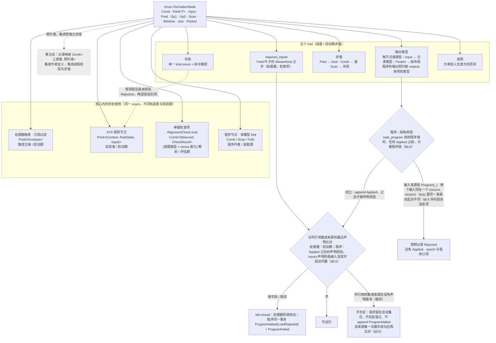
```mermaid
flowchart TB
  ENUM["enum DerivationNode<br/>Const · Field&lt;T&gt; · Input · Pred · Op1 · Op2 · Scan · Window · Join · Pooled"]
  subgraph FOLDS["五个 fold（装载 / 启动期求值）"]
    F1["required_inputs<br/>Field 叶子的 StreamKind 之并（处理器、检查项）"]
    F2["输出类型<br/>每节点值类型；Input → 记录类型；Pooled → 段布局<br/>程序的输出契约取 outputs 各项的类型"]
    F3["求值<br/>Pred → bool · Comb → 值 · Scan → 状态"]
    F4["失败<br/>单一 kind enum + 树中路径"]
    F5["说明<br/>为审批人生成为何否决"]
  end
  ENUM --> F1 & F2 & F3 & F4 & F5
  F1 --> CMP{"与所引用集成来源的最近声明比对<br/>处理器：启动期；程序：Applied 之后的声明校验，inputs 声明的各输入及其字段访问器（§8.6）"}
  F2 --> STRUCT{"程序：结构校验<br/>load_program 读到程序值时、任何 Applied 之前，只看程序值（§8.6）"}
  STRUCT -->|"输入来源是 Program(_) · 两个输入同在一个 (source, stream) · facts 里同一来源的起点不同 · §8.6 所列其余违反项"| SREJ["控制记录 Rejected<br/>没有 Applied、epoch 与程序订阅"]
  STRUCT -->|"成立：append Applied，之后才做声明校验"| CMP
  CMP -->|"缺字段 / 缺流"| FC["fail-closed：处理器拒绝启动；程序同一事务 ProgramHalted{LoadRejected} + ProgramFailed"]
  CMP -->|"齐"| OK["可运行"]
  CMP -->|"所引用的集成来源还没有声明版本（程序）"| WAIT["不判定：程序留在活动集合，不拉起宿主、不 append ProgramHalted<br/>该来源第一次握手成功后再比对（§8.6）"]
  subgraph USES["核心内的四处使用（同一 enum，不同构造者与校验期）"]
    U1["处理器触发 · 订阅过滤<br/>Pred&lt;Envelope&gt;<br/>集成注册 / 启动期"]
    U2["STS 规则守卫<br/>Pred&lt;(Context, RuleState, Input)&gt;<br/>实现者 / 启动期"]
    U3["单据检查项 AlignmentCheck.eval<br/>Comb&lt;Observed, CheckResult&gt;<br/>(意图类型 × venue 能力) 解析 / 评估期"]
    U4["程序节点 · 读模型 fold<br/>Comb / Scan / Fold<br/>程序作者 / 装载期"]
  end
  ENUM --> U1 & U2 & U3 & U4
  ENUM -.->|"契约值，集成侧独立求值"| U5["第五处：记录映射 Comb&lt;上游值, 契约值&gt;<br/>集成作者定义；集成进程校验与求值"]
  classDef ext fill:#eee,stroke:#999,stroke-dasharray:3;
  class U5 ext;
  F4 -.->|"规则层包装成具名 Rejection，两层各自封闭"| U2
```

读法：

- 表达力不足时唯一扩展轴是加构造子；五个 fold 各加一臂，编译器指出遗漏。
- 组合子是判断的底层，不是控制流的底层：STS 五步链、IO 壳阶段链、单据锁都不是值树。
- 第五处记录映射只复用封闭值代数的契约形状；上游原值由集成独自消费，核心不求值、不保存一份映射状态（§8.1）。


## D2.4 两个类型宇宙与唯一边（含边的五种承载）

对照：§3.1–§3.3（第一边界、两套抽象、允许/禁止关系表）、§3.4（读副作用、读即观察记录）、§4.4 与 §8.5（读模型的输入）、§5（唯一边、`basis`、归因记录归观察/响应归效应）、§6.5 记录模型。

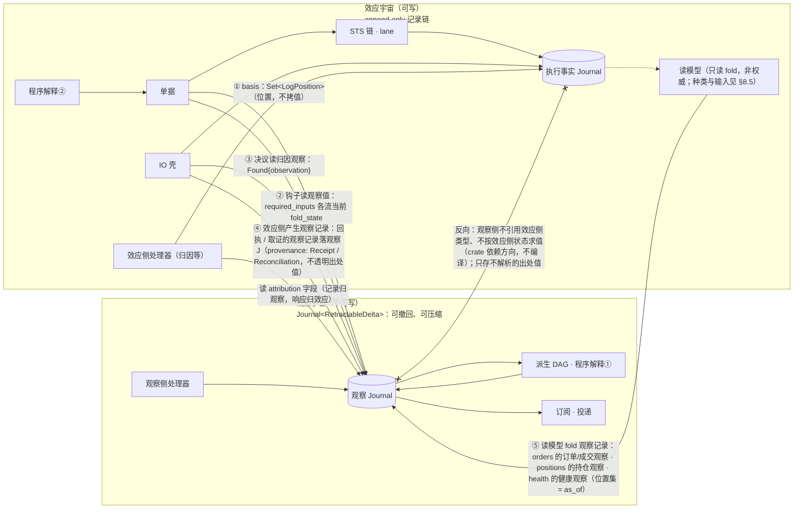
```mermaid
flowchart LR
  subgraph OBS["观察宇宙（不可写）<br/>Journal&lt;RetractableDelta&gt;：可撤回、可压缩"]
    OJ[("观察 Journal")]
    ODAG["派生 DAG · 程序解释①"]
    OSUB["订阅 · 投递"]
    OH["观察侧处理器"]
    OJ --> ODAG --> OJ
    OJ --> OSUB
    OH --> OJ
  end
  subgraph EFF["效应宇宙（可写）<br/>append-only 记录链"]
    EJ[("执行事实 Journal")]
    TK["单据"]
    STS["STS 链 · lane"]
    IO["IO 壳"]
    EH["效应侧处理器（归因等）"]
    P2["程序解释②"]
    RM["读模型（只读 fold，非权威；种类与输入见 §8.5）"]
    P2 --> TK --> STS --> EJ
    IO --> EJ
    EH --> EJ
    EJ -.-> RM
  end
  TK -->|"① basis：Set&lt;LogPosition&gt;（位置，不拷值）"| OJ
  TK -->|"② 钩子读观察值：required_inputs 各流当前 fold_state"| OJ
  IO -->|"③ 决议读归因观察：Found{observation}"| OJ
  IO -->|"④ 效应侧产生观察记录：回执 / 取证的观察记录落观察 J（provenance: Receipt / Reconciliation，不透明出处值）"| OJ
  EH -->|"读 attribution 字段（记录归观察，响应归效应）"| OJ
  RM -->|"⑤ 读模型 fold 观察记录：orders 的订单/成交观察 · positions 的持仓观察 · health 的健康观察（位置集 = as_of）"| OJ
  OJ x--x|"反向：观察侧不引用效应侧类型、不按效应侧状态求值（crate 依赖方向，不编译）；只存不解析的出处值"| EJ
```

读法：

- 边的方向唯一：效应侧读观察侧，或效应侧产生观察记录，都以位置引用承载。①–③、⑤ 是"效应侧记录里放一个观察位置"或"效应侧代码读观察值"，各用自己的位置集（意图的 `basis`、检查的 `checked_as_of`、取证的 `Found{observation}`、读模型的 `as_of`）；④ 是效应侧写入观察 J。观察记录上的 `provenance`/`attribution` 是不透明的位置值，观察侧存它、路由它、不解析它——边约束的是类型依赖与语义消费（§3.2）。
- 同一个程序值跨两边：解释①在观察宇宙产派生记录，解释②在效应宇宙产 `EffectRequest`——程序是值不是类型，所以不构成反向引用。
- 撤回不跨边：行情修订撤回旧派生信号，已发出的 `SendBarrier` 只能追加后续事实（W16）。


## D2.5 记录种类总表（假想磁盘上有什么）

对照：§3.1、§4.1、§4.2、§6.1、§6.2、§6.3、§6.5、§7.5、§7.6、§8.1、§8.4、§8.5、§8.6。这张表是 D1.4 的"内容"侧：每种记录归哪个 `Journal`、谁 append、关键字段、引用了谁。

| Journal | 记录 | 写者 | 关键字段 | 位置引用（→ 谁） |
|---|---|---|---|---|
| 观察 | 推送观察记录 | 集成推送入口（核心盖上到达会话的 `SessionEpoch` 与 `LogPosition`） | `StreamId`、`Seq`、`session_epoch`、`received_at`、venue 序号 / 游标证据、`occurred_at?`、`attribution?`、`idempotency_key?`、契约载荷 + `payload_schema`、原始负载（写路径与可带 `attribution` 的流必带，其余按记录映射声明，§8.1）、质量标记 | — |
| 观察 | `Gap{origin: Source, reason}` | 集成推送入口（会话内上报的断代）/ 集成会话（握手开新 epoch，含 `credential_rotated`；与该逻辑流的 `None{epoch}` 同事务）/ 持久订阅（`backfill_incomplete`）/ 控制面（程序流新 epoch，在开始不沿用旧状态之成员的 `Applied` 同事务：`load_program` 让 id 进入活动集合为 `start`，不沿用旧状态的替换为 `program_upgrade`，§8.6） | 开 epoch 的：前一 `StreamId` 与最后 `Seq`（该逻辑流的第一个 epoch 为无前驱）、`reason`；会话内由集成上报的另带集成给的 `generation`（按流、按会话，会话开始为 0，每上报一条加一并带上新值；`route` 所带的见 §8.2）。`backfill_incomplete` 是 epoch 内的记录：标出未覆盖的区间，不开也不结束 epoch，不带 `generation` | 开 epoch 的 → 前一 epoch（第一个 epoch 无）；`backfill_incomplete` 无 |
| 观察 | 一次性读 / 回填的结果项 | 一次性读元素（发起方：读处理器 / 检查项的"先查后判" / 消费方 `read`，§7.5）/ 持久订阅元素（回填） | 与该流推送记录同形；一次性读：`provenance: OneShot{origins, request}`（`origins ⊆ {Request(pos), Ticket(id), Session(principal)}`）、`dispatch_end`、发出这次调用的会话的 `session_epoch`、`one_shot`；回填：`backfilled`；只在调用的发出 epoch（一次性读为 `dispatch_end` 所在的流 epoch，回填为任务所在的流 epoch）仍是当前流 epoch 时 append，否则该调用完成为 `Unavailable`，只在当前 epoch 记 `Gap{Channel}`（§8.2） | 出处值（不解析）；`Request` → `EffectRequest` 位置；`dispatch_end` → 调用发出时该流已提交的流末 |
| 观察 | 读结论记录 | 同上（集成作答或上游 `Refused` 时） | 请求身份、`origins`、本次结果项的位置、`dispatch_end` 与发出会话的 `session_epoch`（一次性读）或窗口与 `covered_to`（回填）、或拒绝原因；控制记录，不是载荷 | → 本次结果项 |
| 观察 | 路由结论记录 | 持久订阅元素（`route` 返回 `Routed` 时，§8.2；`route` 义务嵌在集成会话里，每条流至多一项：会话建立时为需求非空的流起，已建立期间接受会话内开 epoch 的 gap 或需求变化时起或并入，第一次 `Routed` 了结，会话结束时丢弃；所带 `generation` 见 §8.2）；集成只以 `Routed` 回答带它当前 `generation` 的调用，跨过流 epoch 更替的 `route` 由集成答 `Unavailable`，核心不另判 | 本次生效的主体全集（`All` 或主体集）、`refused` 与原因，不记增减；控制记录，不是载荷；主体的记录从加入它的这条记录之后开始；同会话、全集为 `All` 且 `refused` 为空的记录之后的推送才计入该流 epoch 的序号覆盖（§8.4） | 前一条路由结论记录（同流 epoch；增减由这两条算出） |
| 观察 | 回执的观察记录 | IO 壳 | 该回应的观察记录：回应含订单状态时订单状态一条，加回应所含每笔可识别执行一条成交记录（带 `execution_id`）；同一回应的各条 `provenance: Receipt{AttemptRef}` 相同，`dispatch_end` 各是自己所在流的：IO 壳在发出调用时为该作用域的订单状态流与成交流各记下已提交的流末位置（§6.5）；`attribution` 按各条自己的关联证据填写，不因同在一个回应而继承：订单状态一条只在这次尝试投放了该订单时为 `FromAttempt(AttemptRef)`，撤单回执里目标订单的状态按目标订单自己的关联证据填写，不归到这次撤单；一条记录的 `dispatch_end` 所在的流 epoch（发出 epoch）不是它 append 所在的流 epoch 时照常 append，但所带 venue 序号不作来源顺序证据，按不带序号的回答处理（§8.1）；可压缩；契约载荷与原始负载永存于执行侧 `Evidence` | 出处值（不解析）；`dispatch_end` → 所在流的流末位置 |
| 观察 | 取证的观察记录 | IO 壳 | 同上，`provenance: Reconciliation{AttemptRef, channel}` 相同，`dispatch_end` 各是自己所在流的；只对由自己的关联证据属于该尝试的记录填 `FromAttempt(AttemptRef)`；`list_fills` 命中只有成交记录，不造订单状态记录；可压缩 | 出处值（不解析）；`dispatch_end` → 所在流的流末位置 |
| 观察 | 派生记录（含 alert） | 程序宿主元素（`Advance` 的输出事务；值由解释①求出） | 程序流 `StreamId`：`(Program(id), name)`，`name` 取自程序值的 `outputs`，只有输出声明所指节点的值落流；解释器产出的类型化值（输出契约里该流的值类型），按 `V` 的类型化值编码写出，不带 `subject`；`RetractableDelta`：流 epoch 里第一次有值写一条正贡献，值变了写一条撤回前一贡献（指名其位置）并加入新值，值相等不写；fold 取该流 epoch 最新一条值记录的正贡献（§4.1 程序流的 fold）；按流 epoch 压缩，每个流 epoch 在保留边界之下的最新一条原样留作基线，不改写（§2.4）；`basis` = 同一事务提交的该程序各输入的 cursor（§4.3） | `basis` → 输入流位置；撤回 → 被取代贡献的位置（只作指名，使以它为 `basis` 的依据为 `Retracted`，§5.2） |
| 观察 | `ProgramReset{reason}` / `ProgramFailed{reason}` | 程序宿主元素 | 程序 id、`reason` | — |
| 观察 | 健康观察 | readiness（`Starting` / `Live{live_from}` / `Degraded`）由集成推送入口，核心盖上到达会话的 `SessionEpoch` 与该流当时的流 epoch；会话状态（每条带 append 它的核心实例的 `instance_id`，`Established` 另带其 `SessionEpoch`）由集成会话；调用计数由集成会话给出内容、调用发起方在记录该结果的同一事务提交；回填进度与覆盖检查点由持久订阅（§8.4） | 状态值：每条带其键上的完整当前值——集成的 `session`（切面上的会话值取带该切面控制流前缀里最近一次采纳之 `instance_id` 的最近一条；没有时看该集成最近一条会话观察所带的实例：没有这样一条或它在控制流前缀里有采纳为 `Unobserved`（不是记录），没有采纳为 `BeyondRetention`（最近一次采纳之实例的观察已被压缩））；流的 readiness（只在所带 `SessionEpoch` 的会话是该切面的会话值且为 `Established`、所带流 epoch 是该流当前流 epoch（最近一条回填进度所带的 epoch）时有效；已建立而当前流 epoch 里没有这样的值为 `Starting`；`Disconnected` 由会话值派生，不是记录）；逻辑流的回填进度，值带所属流 epoch（`None{epoch}` / `Backfilling{through}` / `Closed` / `Reached` / `Incomplete{through}`；`None` 与新 epoch 起点的 `Gap{Source}` 同事务）；逻辑流的覆盖检查点 `{epoch, from, through, above, frozen, folded_below}`（保留边界推进要删掉当前 epoch 的记录之前写）；调用目标与计数后的 `consecutive_failures`、`last_success_at`；按键保留（§2.4） | — |
| 执行 | `TicketAction`：`Draft` / `Revise` / `Transfer` / `SubmitForDecision` / `SendBack` / `Close(outcome)` | 单据 | `ticket_id`、`by: principal`、`basis`、意图版本 hash | `basis` → 观察位置（含归因观察）+ 执行事实侧位置（`EffectRequest` / `VenueAccepted` / `SendBarrier`） |
| 执行 | Decision / `Outcome` / `Rejection` | STS 规则链 | `ticket_id`、绑定 `current_version`、`principal`、`rule_version`、`checked_as_of` | → 单据记录；`checked_as_of` → 观察位置 |
| 执行 | `Prepared` | 单据（放行事务） | `attempt_position` 即自身位置、`WriteLaneKey`、`OperationKind`、`deadline`、`target?`、意图载荷 | → `Close(Prepared)` 同事务 |
| 执行 | `SendBarrier` | IO 壳（fsync） | `AttemptRef`、`idempotency_key`（核心按 `AttemptRef` 单射铸造）；这一次写的操作（`submit` / `cancel`）、所带调用方键及其角色（订单键 / 请求键） | → `Prepared` |
| 执行 | `VenueAccepted{venue_order_id, receipt, observation}` | IO 壳 | `AttemptRef`、`venue_order_id`、`receipt: Evidence`（契约载荷 + 原始负载，永存） | `observation` → 该回应的订单状态记录 |
| 执行 | `VenueRejected(reason)` | IO 壳 | `AttemptRef`、`reason`（含 `Unmapped(raw)`） | → `Prepared` |
| 执行 | `NotSent(reason)` | IO 壳 | `AttemptRef`、`reason`：可证明没有交给上游（写调用的封闭返回 `NotSent`） | → `Prepared` |
| 执行 | `Undetermined(reason)` | IO 壳 | `AttemptRef`、`NoResponse` 或 `CrashWindow` | → `Prepared` |
| 执行 | `Expired(deadline)` | IO 壳（发出前门到期） | `AttemptRef` | → `Prepared` |
| 执行 | `Abandoned` | IO 壳（经 `abandon` 授权；该尝试的在途取证调用先完成） | `AttemptRef`、`principal`、`note`、`rule_version`；随该 lane 的执行事实流；UTA 自己的放弃等待，不是结果 | → `Prepared` |
| 执行 | `IntegrationHalted` | 集成会话 | 集成、`cause`（`ProjectionInvalid` / `ContractIncompatible` / `Refused(reason)`）、`session_epoch`；落控制流；与 `Halted` 健康观察同事务 | — |
| 执行 | 轮换兑现记录 | 集成会话（兑现轮换的那次成功握手的事务里，与声明版本、`Established` 健康观察与各流 `Gap{Source, credential_rotated}` 同事务，§7.6） | 集成、`session_epoch`；落控制流 | → 被兑现的每条 `rotate_credential` `Applied`（控制流上的位置；其后没有兑现记录引用的即未兑现的轮换） |
| 执行 | 采纳记录 | 集成会话（启动第 3 步，与每个采纳的集成的初始会话健康观察同事务，§7.2） | 集成登记文件的内容 hash、其中列出的集成 id、本实例的 `instance_id`；落控制流 | — |
| 执行 | `ProgramHalted{program, reason}` | 程序宿主（核心） | 程序 id、`reason`；落控制流；与 `ProgramFailed` 观察同事务 | — |
| 执行 | `ResolutionEvidence{AttemptRef, channel, round, outcome}` | IO 壳 / 归因处理器 | `channel ∈ {ByKey, Listing, Fills, Replay, Attributed}`、`round`（主动取证：发起时所属轮次；`Attributed`：append 时的当前轮）、`outcome ∈ {Found{observation, evidence: Evidence}, Absent, Inconclusive}`；每条 `Found` 都带 `evidence`（五渠道一视同仁） | `Found` → 命中的那条观察记录（`list_fills` 命中多笔归因到该尝试的成交时，取同一成交流上 `Seq` 最小者）；`round` → `ReconciliationReopened` |
| 执行 | `ReconciliationReopened{AttemptRef, cause}` | IO 壳（`SessionRestored`，不重开已 `Abandoned` 的）/ 控制面（`retry_reconciliation`） | `cause ∈ {SessionRestored, Manual(principal)}` | → `Undetermined` |
| 执行 | `CapabilityObserved` | IO 壳 | `(WriteLaneKey, OperationKind)` 或逻辑流 `(source, stream)` 的读 / 回填、新 `Verdict`、所更新声明版本的 `session_epoch`（被接受的那条推送或回应所携的 `SessionEpoch`）；不属于任何 Attempt | → 同来源同 `session_epoch` 的声明版本 |
| 执行 | 声明版本 | 集成会话 | 该握手 `Projection` 除记录映射外的全部（作用域与 `account_ref` 可解析判定、流声明、写能力、配额、扩展 schema）、`session_epoch` | — |
| 执行 | `Gap{origin: Channel, channel}`（取证渠道） | IO 壳 | `AttemptRef`、渠道 | → `Prepared` |
| 观察 | `Gap{origin: Channel, channel}`（回填 / 一次性读） | 持久订阅元素（回填）/ 一次性读元素（调用后 `Unavailable`，含会话结束时强制完成与发出 epoch 已结束的；无会话不调用、不记） | 流、渠道；一次性读的另带这次调用的 `provenance: OneShot{origins, request}`、`dispatch_end` 与发出这次调用的会话的 `session_epoch`（核心强制完成时也是），与它的结论记录会带的相同（§8.2 `read`） | 一次性读的：出处值（不解析）；`dispatch_end` → 调用发出时该流已提交的流末 |
| 执行 | `EffectRequest` | 出站请求处理器（随 `Advance` 输出提交） | 程序 id（即所在请求流）、`member`（发出成员：开始该成员的 `load_program` / 替换 `Applied` 的位置，核心在输出事务里写下）、`effect_kind`、`basis`、载荷；不带调用方键（键由核心在发出时按 `AttemptRef` 铸造，§6.5） | `basis` → 观察位置；`member` → 控制流上的 `Applied`（处理器与重派读它所记的装载 principal 与执行事实输入，§6.1） |
| 执行 | `EffectResponse{request, outcome}` | 出站请求处理器 | 同一请求流；读：`Concluded(读结论记录位置)` / `Unavailable(gap)` / `NotCalled(reason)`；写：`Drafted(ticket)` / `NotDrafted(Malformed{reason} \| ScopeNotObserved)`（§6.1） | → `EffectRequest` |
| 执行 | 控制记录 `Applied(position)` / `Rejected(reason)` | 控制面 | principal、动作、配置版本 hash；落控制流（`bypass_lane` 的除外，见下）；`restart_integration` 的 `Applied` 带本实例的 `instance_id`；解除 `Halted` 的 `restart_integration` / `rotate_credential` 的 `Applied` 带被解除的 `IntegrationHalted` 位置；`load_program` 的 `Applied` 记下装载 principal（即其 principal）、内容 hash、预算、接受的 `state_version` 集合、`facts` 声明的执行事实输入集合、值树引用的原生 op 名集合、输出契约（`outputs` 各项的 `(name, 值类型)`，以值记下，供沿用判定、程序流的 epoch 与程序来源的接纳）、沿用的 `Checkpoint`（位置或无），解除失败抑制时带被解除的 `ProgramHalted` 位置；`install_native_op` 的 `Applied` 以值记下 op 名、声明的签名、artifact 引用与内容 hash，`remove_native_op` 的记下 op 名，这两种的 fold 是已安装 op 集合（§8.7） | — |
| 执行 | 安全事件 | 会话入口（未完成握手的请求）/ STS 授权步（写越权）/ 控制面（控制动作、`abandon` 与 `retry_reconciliation` 越权） | principal（或未认证连接标识）、请求种类 | — |
| 执行 | `bypass_lane` 的控制记录 `Applied`（不是 Decision） | 控制面 | principal、单据、该单据的 `WriteLaneKey`（随该 lane 的执行事实流投递）、生效时的 `current_version`、被绕过的阻塞头位置集 | → 被绕过的 `Prepared` 集合 |

读法：

- 两个 `Journal` 的记录种类就是上表。执行 J 上除 lane 流、各来源的声明流、各程序的请求流之外，有一条核心唯一、不属任何来源的控制流：采纳记录、除 `bypass_lane` 之外的控制记录、`IntegrationHalted`、轮换兑现记录、`ProgramHalted`（§8.5 订阅组）。lane 的阻塞头集合、尝试的结果是否确立、"下一取证渠道"是执行 J 的 fold（§6.4）；单据状态是执行 J 与其评估所读观察、当前能力证据和策略的 fold（§6.2）。它们都不是记录。
- 投递缺口 `Gap{origin: Delivery}` 不在表里：它是订阅的状态，按（订阅，流）记为 `{流, from, to, reason}`，存在订阅表里，唯一写者是持久订阅元素；不是任何 `Journal` 的记录，不在任何流上（§4.2、§7.5）。
- 一个尝试是一次写：`SendBarrier` 之后，写调用的封闭结果落为 `VenueAccepted` / `VenueRejected` / `NotSent`，或 `Undetermined(NoResponse)`；崩溃窗口为 `Undetermined(CrashWindow)`。`Expired` 与 `Abandoned` 是 UTA 自己的出口：`Expired` 不是写调用的结果，但结果轴上是确知的未交出（与 `NotSent` 同一个值，不另写 `NotSent` 记录）；`Abandoned` 只结束等待，不是结果，之后被动来源证据（`Attributed`）仍可补上结果，补上的结果不是门。
- 观察 J 的记录可被压缩到其所在流的保留边界之下；执行 J 的记录永不删除，没有保留边界（§2.4）。

## D3.2 集成 × 流的 readiness、回填进度与流 epoch 决定

对照：§8.4 readiness 的 fold、回填进度与健康不留旧值、会话内开的新流 epoch、§8.3 上报 gap 之前先完成已收到的调用、§7.2 会话状态、§8.2 `handshake`、§4.2 `Gap{Source}` 原因集、§7.6 `rotate_credential`。

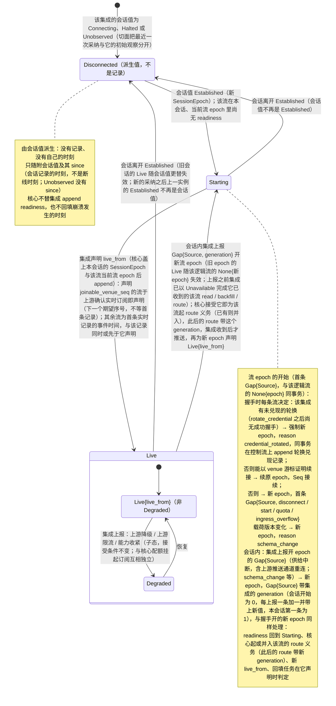
```mermaid
stateDiagram-v2
  state "Disconnected（派生值，不是记录）" as DC
  state "Live{live_from}（非 Degraded）" as LN
  [*] --> DC : 该集成的会话值为 Connecting、Halted 或 Unobserved（切面把最近一次采纳与它的初始观察分开）
  DC --> Starting : 会话值 Established（新 SessionEpoch）；该流在本会话、当前流 epoch 里尚无 readiness
  Starting --> Live : 集成声明 live_from（核心盖上本会话的 SessionEpoch 与该流当前流 epoch 后 append）：声明 joinable_venue_seq 的流于上游确认实时订阅即声明（下一个期望序号，不等首条记录）；其余流为首条实时记录的事件时间，与该记录同时或先于它声明
  state Live {
    [*] --> LN
    LN --> Degraded : 集成上报：上游降级 / 上游限流 / 能力收紧（子态，接受条件不变；与核心配额挂起订阅互相独立）
    Degraded --> LN : 恢复
  }
  Starting --> DC : 会话离开 Established（会话值不再是 Established）
  Live --> DC : 会话离开 Established（旧会话的 Live 随会话值更替失效；新的采纳之后上一实例的 Established 不再是会话值）
  Live --> Starting : 会话内集成上报 Gap{Source, generation} 开新流 epoch（旧 epoch 的 Live 随该逻辑流的 None{新 epoch} 失效；上报之前集成已以 Unavailable 完成它已收到的该流 read / backfill / route）；核心接受它即为该流起 route 义务（已有则并入），此后的 route 带这个 generation，集成收到后才推送，再为新 epoch 声明 Live{live_from}
  note right of DC
    由会话值派生：没有记录、没有自己的时刻
    只随附会话值及其 since（会话记录的时刻，不是断线时刻；Unobserved 没有 since）
    核心不替集成 append readiness，也不回填崩溃发生的时刻
  end note
  note right of Starting
    流 epoch 的开始（首条 Gap{Source}，与该逻辑流的 None{epoch} 同事务）：
    握手时每条流决定：该集成有未兑现的轮换（rotate_credential 之后尚无成功握手）→ 强制新 epoch，reason credential_rotated，同事务在控制流上 append 轮换兑现记录；
    否则能以 venue 游标证明续接 → 续原 epoch，Seq 接续；
    否则 → 新 epoch，首条 Gap{Source, disconnect / start / quota / ingress_overflow}
    载荷版本变化 → 新 epoch，reason schema_change
    会话内：集成上报开 epoch 的 Gap{Source}（供给中断，含上游推送通道重连；schema_change 等）→ 新 epoch，Gap{Source} 带集成的 generation（会话开始为 0，每上报一条加一并带上新值，本会话第一条为 1），与握手开的新 epoch 同样处理：
    readiness 回到 Starting、核心起或并入该流的 route 义务（此后的 route 带新 generation）、新 live_from、回填任务在它声明时判定
  end note
```

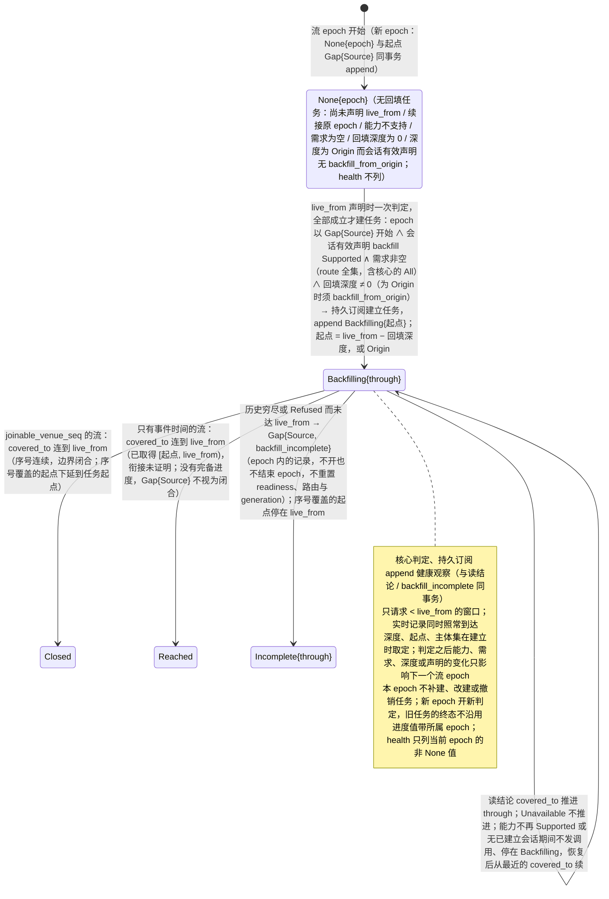
```mermaid
stateDiagram-v2
  state "None{epoch}（无回填任务：尚未声明 live_from / 续接原 epoch / 能力不支持 / 需求为空 / 回填深度为 0 / 深度为 Origin 而会话有效声明无 backfill_from_origin；health 不列）" as NONE
  state "Backfilling{through}" as BF
  state "Closed" as CL
  state "Reached" as RE
  state "Incomplete{through}" as INC
  [*] --> NONE : 流 epoch 开始（新 epoch：None{epoch} 与起点 Gap{Source} 同事务 append）
  NONE --> BF : live_from 声明时一次判定，全部成立才建任务：epoch 以 Gap{Source} 开始 ∧ 会话有效声明 backfill Supported ∧ 需求非空（route 全集，含核心的 All）∧ 回填深度 ≠ 0（为 Origin 时须 backfill_from_origin）→ 持久订阅建立任务，append Backfilling{起点}；起点 = live_from − 回填深度，或 Origin
  BF --> BF : 读结论 covered_to 推进 through；Unavailable 不推进；能力不再 Supported 或无已建立会话期间不发调用、停在 Backfilling，恢复后从最近的 covered_to 续
  BF --> CL : joinable_venue_seq 的流：covered_to 连到 live_from（序号连续，边界闭合；序号覆盖的起点下延到任务起点）
  BF --> RE : 只有事件时间的流：covered_to 连到 live_from（已取得 [起点, live_from)，衔接未证明；没有完备进度，Gap{Source} 不视为闭合）
  BF --> INC : 历史穷尽或 Refused 而未达 live_from → Gap{Source, backfill_incomplete}（epoch 内的记录，不开也不结束 epoch，不重置 readiness、路由与 generation）；序号覆盖的起点停在 live_from
  note right of BF
    核心判定、持久订阅 append 健康观察（与读结论 / backfill_incomplete 同事务）
    只请求 < live_from 的窗口；实时记录同时照常到达
    深度、起点、主体集在建立时取定；判定之后能力、需求、深度或声明的变化只影响下一个流 epoch
    本 epoch 不补建、改建或撤销任务；新 epoch 开新判定，旧任务的终态不沿用
    进度值带所属 epoch；health 只列当前 epoch 的非 None 值
  end note
```

读法：readiness 是集成在一个会话里、对该流一个流 epoch 的实时供给的陈述：集成推送，核心盖上到达会话的 `SessionEpoch` 与该流当时的流 epoch 后 append；fold 只取同时带着该集成会话值（切面上带最近一次采纳之 `instance_id` 的最近一条会话观察，§8.4）的 `SessionEpoch` 与该流当前流 epoch 的值，且只在会话值是 `Established` 时；已建立而当前流 epoch 里没有这样的值为 `Starting`，会话值不是 `Established`（含 `Unobserved`）时为派生的 `Disconnected`。会话内上报的 `Gap{Source}` 开新流 epoch，readiness 回到 `Starting`，与握手开的新 epoch 同样处理：同一会话里 e0 为 `Live`、之后 `Gap{Source}` 与 `None{e1}` 已 append 而 e1 尚无 readiness，该流是 `Starting`，不是 e0 的 `Live`。流上的 `read`、`backfill`、`route` 调用只嵌在会话里，发出时的流 epoch 是它们问的那个 epoch、决定结果能否准入，不是它们的外层：集成在上报 `Gap{Source}` 之前以 `Unavailable` 完成它已收到的这些调用；`read`、`backfill` 的结果在更替之后才到核心的，由核心完成为 `Unavailable`、不作新 epoch 的记录；`route` 是否跨过更替只由集成按 `generation` 判定（§8.2、§8.3、§8.4）。回填进度由核心凭读结论记录判定、持久订阅 append，只说当前流 epoch 的 `[起点, live_from)` 补齐到哪。二者都是健康观察（不需确认），经 `health` 读模型对解释层可见，再由它翻成下游的连接状态；它们不改变记录接受条件——核心只从当前会话的通道读入。


## D3.5 三种消费方式

对照：§4.2 消费方式表、`await-all` 的要求点与装载期检查；§2.3 位置归核心、完备归来源。

| 方式 | 触发依据 | 是否跳过 | 损失记法 |
|---|---|---|---|
| await-all | 所有指定输入都达到要求点：核心日志位置（核心自己可判定，不说任何完备），或来源证据证明的覆盖在它自己坐标上的一点（今天只有序号覆盖：当前流 epoch 的一个 venue 序号，`through` 越过即满足） | 否（等待；无完备证据的输入上覆盖要求永不满足；慢时只背压，从不停投） | — |
| ordered | 单流顺序；多条流各自有序，流与流之间不定序 | 否（背压；慢时从不停投） | — |
| latest / conflated | 最新值 | 是 | 通常的合并：订阅上的投递缺口 `Gap{Delivery, conflated}`，或消费者声明的等待窗口；投递缓冲耗尽：停投，跳过的区间为 `Gap{Delivery, slow_consumer}` |

读法：

- `await-all` 的覆盖要求看来源证据证明的覆盖，不看 cursor——读到 Seq 60 不说明之前的记录已全部到达。没有 `joinable_venue_seq` 的输入没有完备证据：按最近声明，要求覆盖的 `await-all` 在装载时被拒（与字段访问器缺字段同属 fail-closed），程序改等核心日志位置、用 `ordered`，或声明自己的等待窗口；装载后某个新流 epoch 不再有证据时，该 epoch 上的覆盖要求不满足，程序不因它推进。
- 跨流按事件时间对齐没有来源证据，不提供；要按时间截止的消费者声明等待窗口：它是消费者的意图，不是流的元数据，也不冒充完备，窗口之后到达的记录照常 append、照常投递。
- 损失语义由消费者显式声明：UI 报价显示可接受 conflation，依赖完整状态路径的阈值策略不能默认接受。


## D3.6 gap 来源判定

对照：§4.2 gap 三来源、§7.5 观察 `Journal` 写者与订阅表、§8.3 映射表、§6.7 两故障面。

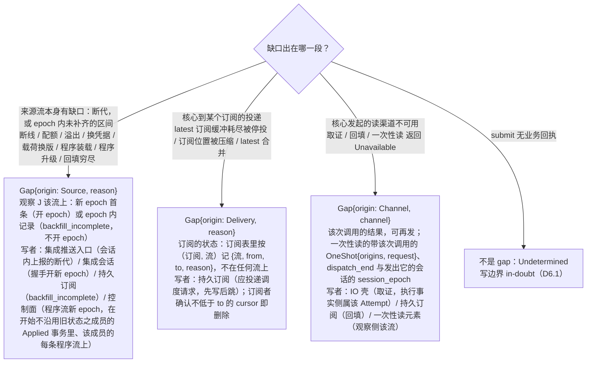
```mermaid
flowchart TB
  Q{"缺口出在哪一段？"}
  Q -->|"来源流本身有缺口：断代，或 epoch 内未补齐的区间<br/>断线 / 配额 / 溢出 / 换凭据 / 载荷换版 / 程序装载 / 程序升级 / 回填穷尽"| S["Gap{origin: Source, reason}<br/>观察 J 该流上：新 epoch 首条（开 epoch）或 epoch 内记录（backfill_incomplete，不开 epoch）<br/>写者：集成推送入口（会话内上报的断代）/ 集成会话（握手开新 epoch）/ 持久订阅（backfill_incomplete）/ 控制面（程序流新 epoch，在开始不沿用旧状态之成员的 Applied 事务里、该成员的每条程序流上）"]
  Q -->|"核心到某个订阅的投递<br/>latest 订阅缓冲耗尽被停投 / 订阅位置被压缩 / latest 合并"| D["Gap{origin: Delivery, reason}<br/>订阅的状态：订阅表里按（订阅, 流）记 {流, from, to, reason}，不在任何流上<br/>写者：持久订阅（应投递调度请求，先写后跳）；订阅者确认不低于 to 的 cursor 即删除"]
  Q -->|"核心发起的读渠道不可用<br/>取证 / 回填 / 一次性读 返回 Unavailable"| C["Gap{origin: Channel, channel}<br/>该次调用的结果，可再发；一次性读的带该次调用的 OneShot{origins, request}、dispatch_end 与发出它的会话的 session_epoch<br/>写者：IO 壳（取证，执行事实侧属该 Attempt）/ 持久订阅（回填）/ 一次性读元素（观察侧该流）"]
  Q -->|"submit 无业务回执"| U["不是 gap：Undetermined<br/>写边界 in-doubt（D6.1）"]
```

读法：集成一个进程崩溃可能同时产生 `Gap{Source}`（它的流）和 `Undetermined`（它在途的 `submit`）；两面各自收敛，互不替代。读模型的 `Snapshot.gaps` 只列 `Gap{Source}`：`Channel` 是调用结果，`Delivery` 属订阅。

## D4.3 `EffectRequest` 分派与重启重派

对照：§6.1（读/写处理器、发出成员、`EffectResponse`、请求与响应的关联是引用）、§8.6 卸载与替换、§3.4 读即观察记录、§7.3 出站请求处理器、§9.2 #21、§7.2 第 4 步。

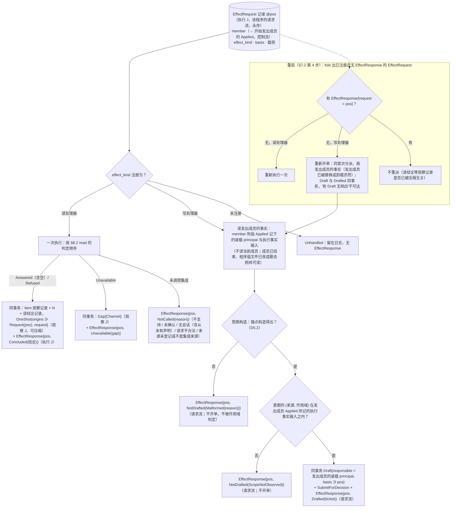
```mermaid
flowchart TB
  ER[("EffectRequest 记录 @pos（执行 J，该程序的请求流，永存）<br/>member（→ 开始发出成员的 Applied，控制流）· effect_kind · basis · 载荷")]
  REG{"effect_kind 注册为？"}
  ER --> REG
  REG -->|"读处理器"| RD["一次执行：按 §8.2 read 的判定顺序"]
  RD -->|"Answered（含空）/ Refused"| R1["同事务：item 观察记录 × N + 读结论记录，OneShot{origins ∋ Request(pos), request}（观察 J，可压缩）<br/>+ EffectResponse{pos, Concluded(结论)}（执行 J）"]
  RD -->|"Unavailable"| R2["同事务：Gap{Channel}（观察 J）<br/>+ EffectResponse{pos, Unavailable(gap)}"]
  RD -->|"未调用集成"| R3["EffectResponse{pos, NotCalled(reason)}（不支持 / 未确认 / 无会话（含从未有声明）/ 请求不合法 / 来源未登记或不是集成来源）"]
  REG -->|"写处理器"| WM["读发出成员的事实：member 所指 Applied 记下的装载 principal 与执行事实输入<br/>（不读当前成员；成员已结束、程序值文件已改或删去照样可读）"]
  WM --> WCON{"意图构造：锚点构造得出？（D5.2）"}
  WCON -->|"否"| WMAL["EffectResponse{pos, NotDrafted(Malformed{reason})}（请求流；不开单，不做作用域判定）"]
  WCON -->|"是"| WSC{"意图的 (来源, 作用域) 在发出成员 Applied 所记的执行事实输入之内？"}
  WSC -->|"否"| WN["EffectResponse{pos, NotDrafted(ScopeNotObserved)}（请求流；不开单）"]
  WSC -->|"是"| WR["同事务 Draft{responsible = 发出成员的装载 principal, basis ∋ pos}<br/>+ SubmitForDecision + EffectResponse{pos, Drafted(ticket)}（请求流）"]
  REG -->|"未注册"| UH["Unhandled：留在日志，无 EffectResponse"]
  subgraph RESTART["重启（§7.2 第 4 步）：fold 出已注册且无 EffectResponse 的 EffectRequest"]
    Q1{"有 EffectResponse{request = pos}？"}
    Q1 -->|"无，读处理器"| RD2["重新执行一次"]
    Q1 -->|"无，写处理器"| WR2["重新开单：同首次分派，按发出成员的事实（发出成员已被替换或卸载亦然）；Draft 与 Drafted 同事务，'有 Draft 无响应'不可达"]
    Q1 -->|"有"| SKIP["不重派（读结论等观察记录是否已被压缩无关）"]
  end
  ER -.-> Q1
  WR2 --> WM
```

读法：请求与响应是引用关系不是事务：请求先持久，完成事实稍后以位置指回它。完成事实与请求同在执行 J、同寿命，重派判定不依赖可压缩的观察记录；读的结果最终恰一条 `EffectResponse`、写至多一张单据。读处理器不自行重试——是否再请求由程序看到结果/gap 后决定。写处理器先构造意图，构造不出即 `Malformed`，构造成功才判定作用域；负责人与作用域都取发出成员的 `Applied` 所记事实（请求的 `member`），所以替换或卸载之前提交、之后才分派或在重启后重派的请求，仍以旧成员的 principal 开单、按旧成员的执行事实输入判定。

## D5.1 单据状态机

对照：§6.2 `TicketAction`、穷尽转移表、与写边界的接口。

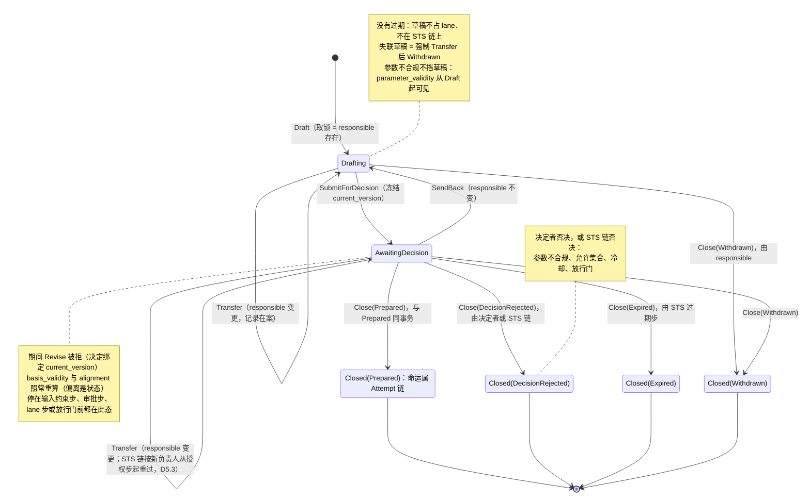
```mermaid
stateDiagram-v2
  state "Closed(Prepared)：命运属 Attempt 链" as CP
  state "Closed(DecisionRejected)" as CR
  state "Closed(Expired)" as CE
  state "Closed(Withdrawn)" as CW
  [*] --> Drafting : Draft（取锁 = responsible 存在）
  Drafting --> Drafting : Revise（仅 responsible，版本链前进）
  Drafting --> Drafting : Transfer（responsible 变更，记录在案）
  Drafting --> AwaitingDecision : SubmitForDecision（冻结 current_version）
  AwaitingDecision --> AwaitingDecision : Transfer（responsible 变更；STS 链按新负责人从授权步起重过，D5.3）
  AwaitingDecision --> Drafting : SendBack（responsible 不变）
  AwaitingDecision --> CP : Close(Prepared)，与 Prepared 同事务
  AwaitingDecision --> CR : Close(DecisionRejected)，由决定者或 STS 链
  AwaitingDecision --> CE : Close(Expired)，由 STS 过期步
  Drafting --> CW : Close(Withdrawn)，由 responsible
  AwaitingDecision --> CW : Close(Withdrawn)
  CP --> [*]
  CR --> [*]
  CE --> [*]
  CW --> [*]
  note right of AwaitingDecision
    期间 Revise 被拒（决定绑定 current_version）
    basis_validity 与 alignment 照常重算（偏离是状态）
    停在输入约束步、审批步、lane 步或放行门前都在此态
  end note
  note left of CR
    决定者否决，或 STS 链否决：
    参数不合规、允许集合、冷却、放行门
  end note
  note left of Drafting
    没有过期：草稿不占 lane、不在 STS 链上
    失联草稿 = 强制 Transfer 后 Withdrawn
    参数不合规不挡草稿：parameter_validity 从 Draft 起可见
  end note
```

读法：

- 锁 = `responsible` 字段：不是互斥原语，没有超时释放；失联由规则处理（过期或强制 `Transfer`）。
- `Closed` 无出边，一张单据至多一次 `Close(Prepared)`；改单撤单各自起新单据。
- 其他 principal 的 `Revise` 直接被拒，不排队不分叉；协作在核心之外（移交、另起单据）。


## D5.3 STS 顺序固定链（从 `AwaitingDecision` 到 `Prepared`）

对照：§6.3 五步表、等待与重入、放行门、规则版本变更、移交；§6.2 门只看必要项；§5.2 `basis_validity`。

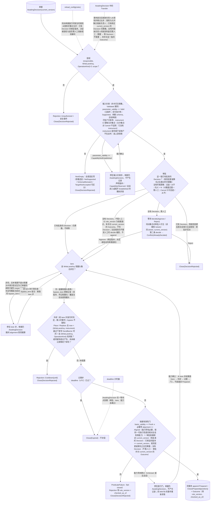
```mermaid
flowchart TB
  IN[("单据 AwaitingDecision(current_version)")]
  IN --> A{"授权<br/>(responsible, WriteLaneKey, OperationKind) ∈ scope？"}
  A -->|"否"| RJ1["Rejection::Unauthorized + 安全事件<br/>Close(DecisionRejected)"]
  A -->|"是"| B{"输入约束（步内可交换集，Validated 累积）<br/>parameter_validity == Valid（无条件；含可执行性：Supported、参数 schema、目标种类）<br/>子账户已枚举、instrument ∈ 策略允许集合（允许集合对 Cancel 不适用：它没有 instrument）<br/>instrument 是否属于该账户不在此判：由上游拒绝"}
  B -->|"否"| RJ2["NonEmpty<Rejection>：全部违反项（参数违反 / NotSupported / SchemaMismatch / TargetNotAccepted 可区分）<br/>Close(DecisionRejected)"]
  B -->|"parameter_validity == CapabilityNotEstablished"| WAITB["停在输入约束步，单据仍 AwaitingDecision，不产生记录<br/>声明版本 / CapabilityObserved / 会话进入或离开 Established 时重新求值"]
  WAITB -->|"能力确立"| B
  B -->|"是"| C{"审批<br/>这一版已有批准的 Decision？（规则变更或移交之后重过时仍算数）<br/>没有时看策略：总是 / 从不 / 名义 > N（以数量定量 = 需人工；Cancel 只可总是 / 从不）"}
  C -->|"已有批准的 Decision：仍算数，不再等"| D
  C -->|"已有 Decision，而规则变更后原决定者已无该授权：审批步否决"| RJ3
  C -->|"没有 Decision，需人工"| WAITC["等待 decide(Approve / Reject)<br/>待决集合对审批人可见（读模型 tickets）<br/>同 (ticket, current_version) 第二条 decide → Conflict(AlreadyDecided)"]
  WAITC -->|"Reject"| RJ3["Close(DecisionRejected)"]
  WAITC -->|"Approve（绑定版本；决定者按动作种类授权）"| D
  C -->|"没有 Decision，不需人工：以 rule_version 为依据通过，本步对 current_version 的 Outcome，不写 Decision；当前规则仍不要求人工时 decide 被拒、不 append"| D
  D{"lane<br/>该 WriteLaneKey 阻塞头集合非空？"}
  D -->|"非空，且本笔既不是以阻塞头中某次尝试记为订单键的调用方键为 target 的撤单，也没有覆盖当前全部阻塞头的 bypass_lane 控制记录"| WAITD["停在 lane 步，单据仍 AwaitingDecision<br/>期间 alignment 照常重算"]
  WAITD -->|"该 lane 执行事实或 bypass_lane 提交：重跑 lane 步"| D
  D -->|"空 / 是撤阻塞头意图 / bypass_lane 控制记录（本版本、所记阻塞头）覆盖当前全部阻塞头"| CD
  CD{"冷却（经 lane 步放行时判定，重入时重判；bypass 不豁免）<br/>Place / Replace 且 now < (WriteLaneKey, instrument) 最近下单写 SendBarrier 时间 + 该 (WriteLaneKey, OperationKind) 的间隔？<br/>或同键有绕过产生、尚未越过屏障的下单写？"}
  CD -->|"是"| RJ6["Rejection::Cooldown{until}<br/>Close(DecisionRejected)"]
  CD -->|"否 / 未配置"| E
  E{"过期步<br/>deadline（UTC）已过？"}
  E -->|"是"| RJ5["Close(Expired)：不补偿"]
  E -->|"否"| G
  G{"依据有效性门<br/>basis_validity == Fresh ∧ 必要项 alignment == Aligned（能力项恒必要，按同一可执行性谓词核对会话有效能力）∧ 审批依据绑定 current_version（有批准的 Decision：它绑定的版本 == current_version，规则变更或移交之后仍算数；没有 Decision（不需人工）：审批步对 current_version 的 Outcome）"}
  G -->|"否"| RJ4["PredicateFailure（fail-closed）<br/>Rejection 带 rule_version + checked_as_of<br/>Close(DecisionRejected)"]
  G -->|"能力项未确立（Unknown 或无会话）"| WAITG["停在放行门，单据仍 AwaitingDecision，不产生记录；同 WAITB 的事件重新求值"]
  WAITG -->|"能力确立：从 lane 步起重跑（lane → 冷却 → 过期 → 门），不直接进 Prepared"| D
  G -->|"是"| OUT[("同事务 append Prepared + Close(Prepared(position))<br/>+ Outcome（带 rule_version、checked_as_of）")]
  TMR["deadline 计时器"] -.->|"AwaitingDecision 任一等待点到期（审批、lane、能力未确立）"| RJ5
  RL["reload_config(rules)"] -.->|"待决单据放行时按当时规则从授权步重过五步：已有 Decision 仍绑定版本，决定者授权与是否需人工按新规则重判"| A
  TR["AwaitingDecision 中的 Transfer"] -.->|"事务提交后按新负责人从授权步重过五步：授权与允许集合按新负责人；已有绑定 current_version 的 Decision 仍算数，没有时按新负责人的规则判是否需人工（需要 → 等 Decision；不需要 → 本步对这一版的 Outcome）"| A
```

读法（假想运行时）：

- 链是事件驱动的：`SubmitForDecision` 跑到第一个等待点；`decide`、该 lane 上的新执行事实、能力或会话变化、`reload_config(rules)`、`Transfer`、`deadline` 到时各自让它重新求值（§6.3 等待与重入）；每推一步只持久化该步产生的记录（`Vec<Outcome>` 或 `NonEmpty<Rejection>`）。规则判断所用的状态（`RuleState`）每次由记录 fold 出，不另存。
- 重入都经过 lane 步：停在审批步、lane 步或放行门前的单据从 lane 步起重跑，停在输入约束步的从输入约束步起重跑，依次过 lane（阻塞头）→ 冷却 → 过期 → 门；没有从放行门前的等待直达 `Prepared` 的边。同 lane 两张单据离线时都停在门前，会话恢复后先放行的那张成为阻塞头，另一张停在 lane 步（§6.3 等待与重入）。规则版本变更与 `Transfer` 从授权步起重过（`RL`、`TR` 两条边）：授权、允许集合与是否需人工都以负责人为主体，换了负责人，此前各步的通过不再作依据（§6.3 移交）。
- 审批、lane 与能力未确立的等待都发生在 `Prepared` 之前：单据在等，不是已放行的记录在等；停在门前的单据也不是阻塞头，所以才要重过 lane 步。已放行的尝试只会在发出前门等会话或能力（D6.1）。
- 过期步是第五步：每次重跑都先看 `deadline` 再进门；计时器只是让等待中的单据也能到期，不是让过期单据仍能 `Prepared` 的旁路。
- 门读的是单据 fold 已算好的字段，规则自己不算；世界变了单据先变 `Diverged`，审批人看得到，放行时门自然失败。
- 重启后链按记录重新求值：停在审批步的仍等 `decide`；停在 lane 步的等集合清空；停在能力未确立的等能力确立；计时器按 `deadline`（UTC）重装（D1.2 第 4 步）；冷却时钟由 `SendBarrier` 记录 fold 出。
- 冷却的时钟在 `SendBarrier` 持久化时设（D6.1），不在检查通过时设；撤单与平仓既不设也不受。


## D5.4 lane 阻塞头

对照：§6.4 lane、队首阻塞协议语义、无第二类越顶队列、显式绕过；不变量 §6.9-1；§6.5 等待与结果。

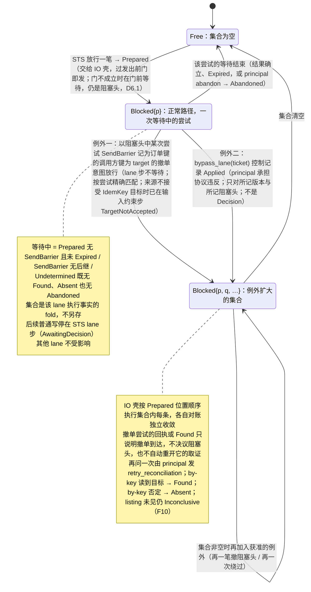
```mermaid
stateDiagram-v2
  state "Free：集合为空" as Free
  state "Blocked{p}：正常路径，一次等待中的尝试" as B1
  state "Blocked{p, q, …}：例外扩大的集合" as BN
  [*] --> Free
  Free --> B1 : STS 放行一笔 → Prepared（交给 IO 壳，过发出前门即发；门不成立时在门前等待，仍是阻塞头，D6.1）
  B1 --> Free : 该尝试的等待结束（结果确立、Expired，或 principal abandon → Abandoned）
  B1 --> BN : 例外一：以阻塞头中某次尝试 SendBarrier 记为订单键的调用方键为 target 的撤单意图放行（lane 步不等待；按尝试精确匹配；来源不接受 IdemKey 目标时已在输入约束步 TargetNotAccepted）
  B1 --> BN : 例外二：bypass_lane(ticket) 控制记录 Applied（principal 承担协议违反；只对所记版本与所记阻塞头；不是 Decision）
  BN --> BN : 集合内任一尝试的等待结束但集合非空（只移出自己）
  BN --> BN : 集合非空时再加入获准的例外（再一笔撤阻塞头 / 再一次绕过）
  BN --> Free : 集合清空
  note right of B1
    等待中 = Prepared 无 SendBarrier 且未 Expired / SendBarrier 无后继 /
    Undetermined 既无 Found、Absent 也无 Abandoned
    集合是该 lane 执行事实的 fold，不另存
    后续普通写停在 STS lane 步（AwaitingDecision）
    其他 lane 不受影响
  end note
  note right of BN
    IO 壳按 Prepared 位置顺序执行集合内每条，各自对账独立收敛
    撤单尝试的回执或 Found 只说明撤单到达，不决议阻塞头，也不自动重开它的取证
    再问一次由 principal 发 retry_reconciliation；by-key 读到目标 → Found；by-key 否定 → Absent；listing 未见仍 Inconclusive（F10）
  end note
```

读法：阻塞不是锁——后续写的语义依赖队首结果（buying power、待撤订单是否存在、venue 侧顺序），所以是与 venue 的通讯协议语义。撤阻塞头的意图不依赖队首结果，它存在的目的是把 venue 侧推到一个读得出的状态，所以是唯一不违反协议而不等待的写；绕过是另一种不等待，但它是记在控制记录里的协议违反。任何一次尝试的等待结束只移出自己；集合为空才放行普通写。


## D5.5 两层对账状态的重算触发

对照：§6.2 偏离是状态、两层分开的原因、缺观察可行动、参数合规、检查目录；§5.2 `basis_validity`；§8.3 能力变更。

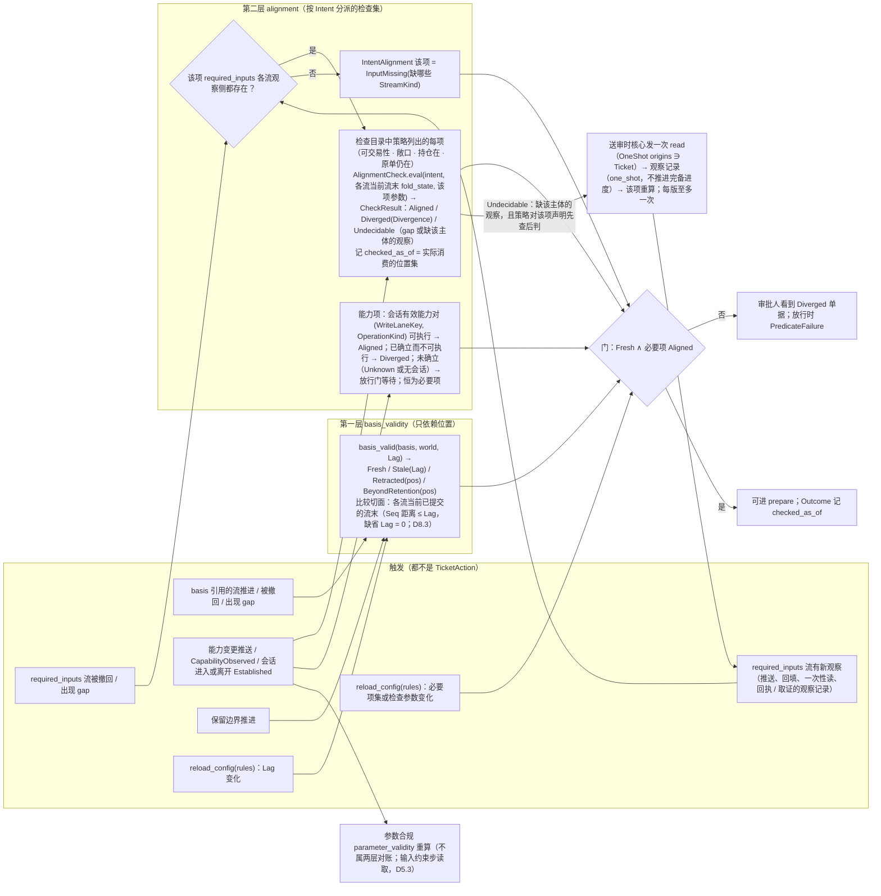
```mermaid
flowchart LR
  subgraph TRIG["触发（都不是 TicketAction）"]
    T1["basis 引用的流推进 / 被撤回 / 出现 gap"]
    T1b["required_inputs 流被撤回 / 出现 gap"]
    T2["required_inputs 流有新观察（推送、回填、一次性读、回执 / 取证的观察记录）"]
    T3["能力变更推送 / CapabilityObserved / 会话进入或离开 Established"]
    T4["保留边界推进"]
    T5a["reload_config(rules)：Lag 变化"]
    T5b["reload_config(rules)：必要项集或检查参数变化"]
  end
  subgraph L1["第一层 basis_validity（只依赖位置）"]
    V["basis_valid(basis, world, Lag) →<br/>Fresh / Stale(Lag) / Retracted(pos) / BeyondRetention(pos)<br/>比较切面：各流当前已提交的流末（Seq 距离 ≤ Lag，缺省 Lag = 0；D8.3）"]
  end
  subgraph L2["第二层 alignment（按 Intent 分派的检查集）"]
    IM{"该项 required_inputs 各流观察侧都存在？"}
    CK["检查目录中策略列出的每项（可交易性 · 敞口 · 持仓在 · 原单仍在）<br/>AlignmentCheck.eval(intent, 各流当前流末 fold_state, 该项参数) →<br/>CheckResult：Aligned / Diverged(Divergence) / Undecidable（gap 或缺该主体的观察）<br/>记 checked_as_of = 实际消费的位置集"]
    MISS["IntentAlignment 该项 = InputMissing(缺哪些 StreamKind)"]
    CAP["能力项：会话有效能力对 (WriteLaneKey, OperationKind) 可执行 → Aligned；已确立而不可执行 → Diverged；未确立（Unknown 或无会话）→ 放行门等待；恒为必要项"]
  end
  T1 --> V
  T4 --> V
  T5a --> V
  T1b --> IM
  T2 --> IM
  IM -->|"是"| CK
  IM -->|"否"| MISS
  T3 --> CK
  T3 --> CAP
  T3 --> PV["参数合规 parameter_validity 重算（不属两层对账；输入约束步读取，D5.3）"]
  T5b --> GATE
  V --> GATE{"门：Fresh ∧ 必要项 Aligned"}
  CK --> GATE
  MISS --> GATE
  CAP --> GATE
  CK -->|"Undecidable：缺该主体的观察，且策略对该项声明先查后判"| RD["送审时核心发一次 read（OneShot origins ∋ Ticket）→ 观察记录（one_shot，不推进完备进度）→ 该项重算；每版至多一次"]
  RD --> T2
  GATE -->|"否"| DIV["审批人看到 Diverged 单据；放行时 PredicateFailure"]
  GATE -->|"是"| OK["可进 prepare；Outcome 记 checked_as_of"]
```

读法：第一层只看位置（对所有单据可算），第二层看值（依赖意图类型与 venue 给的观察）。第二层读的是各流**当前流末**的 `fold_state`（含 `one_shot`/`backfilled` 记录，各带质量标记），不按任何完备进度截断——否则为补齐输入读来的一次性观察永远看不见；也不是 `basis` 位置处的旧值——否则世界变了单据不会变。每次评估消费的位置集记为 `checked_as_of`，进入放行/否决记录。


身份约定（代数，§6.5）：一次尝试 = 一条 `Prepared` 及其后继 = 对上游的一次写，身份 `AttemptRef = attempt_position`（该 `Prepared` 的位置）。图中 `p` 指一次尝试。
## D6.1 尝试的状态机

对照：§6.5 代数（线性阶段链、发出前门、`SendBarrier`、`NotSent`、`VenueAccepted` 只认业务回执）、转移表；§6.7 恢复；§8.2 `submit` / `cancel`。

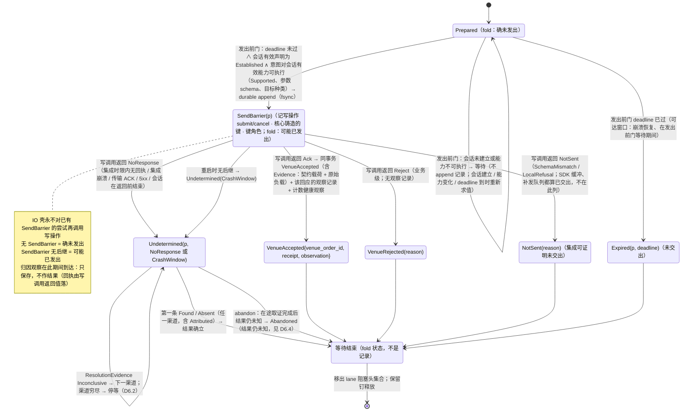
```mermaid
stateDiagram-v2
  state "Prepared（fold：确未发出）" as P
  state "SendBarrier(p)（记写操作 submit/cancel · 核心铸造的键 · 键角色；fold：可能已发出）" as SB
  state "VenueAccepted{venue_order_id, receipt, observation}" as VA
  state "VenueRejected(reason)" as VR
  state "NotSent(reason)（集成可证明未交出）" as NS
  state "Undetermined(p, NoResponse 或 CrashWindow)" as UD
  state "Expired(p, deadline)（未交出）" as EX
  state "等待结束（fold 状态，不是记录）" as FIN
  [*] --> P
  P --> SB : 发出前门：deadline 未过 ∧ 会话有效声明为 Established ∧ 意图对会话有效能力可执行（Supported、参数 schema、目标种类）→ durable append（fsync）
  P --> P : 发出前门：会话未建立或能力不可执行 → 等待（不 append 记录；会话建立 / 能力变化 / deadline 到时重新求值）
  P --> EX : 发出前门 deadline 已过（可达窗口：崩溃恢复、在发出前门等待期间）
  SB --> VA : 写调用返回 Ack → 同事务 VenueAccepted（含 Evidence：契约载荷 + 原始负载）+ 该回应的观察记录 + 计数健康观察
  SB --> VR : 写调用返回 Reject（业务级；无观察记录）
  SB --> NS : 写调用返回 NotSent（SchemaMismatch / LocalRefusal；SDK 缓冲、补发队列都算已交出，不在此列）
  SB --> UD : 写调用返回 NoResponse（集成时限内无回执 / 集成崩溃 / 传输 ACK / 5xx / 会话在返回前结束）
  SB --> UD : 重启时无后继 → Undetermined(CrashWindow)
  UD --> UD : ResolutionEvidence Inconclusive → 下一渠道；渠道穷尽 → 停等（D6.2）
  UD --> FIN : 第一条 Found / Absent（任一渠道，含 Attributed）→ 结果确立
  UD --> FIN : abandon：在途取证完成后结果仍未知 → Abandoned（结果仍未知，见 D6.4）
  VA --> FIN
  VR --> FIN
  NS --> FIN
  EX --> FIN
  FIN --> [*] : 移出 lane 阻塞头集合；保留钉释放
  note right of SB
    IO 壳永不对已有 SendBarrier 的尝试再调用写操作
    无 SendBarrier = 确未发出
    SendBarrier 无后继 = 可能已发出
    归因观察在此期间到达：只保存，不作结果（回执由写调用返回值落）
  end note
```

读法（假想运行时）：

- 正常路径 `P → SB → VA`：`SendBarrier` 单独 fsync，`VenueAccepted` 与该回应的观察记录同一事务。
- 只有 `SB → UD` 这一条边把系统带进对账；进去以后写已经"可能发生"，永不重发，只能用读收敛或由 principal 放弃跟踪。`P → P` 的等待与 `SB → NS` 都不进对账：前者没有 `SendBarrier`，后者集成确知没有交出。
- `Found` 之后没有 `VenueAccepted`：`Evidence` 在 `ResolutionEvidence` 里，该回应的观察记录供读模型 / 钩子 fold。


## D6.2 取证循环（`Undetermined` 之后）

对照：§6.6 对账驱动（渠道顺序、撤单尝试的取证、取证结果与记录的固定矩阵、停等、`ReconciliationReopened`）、`replay_by_key`；§8.2 四个取证操作；§8.3 按 `barrier_at` 判断窗口；§8.5 `retry_reconciliation`；§4.2 `Gap{Channel}`。

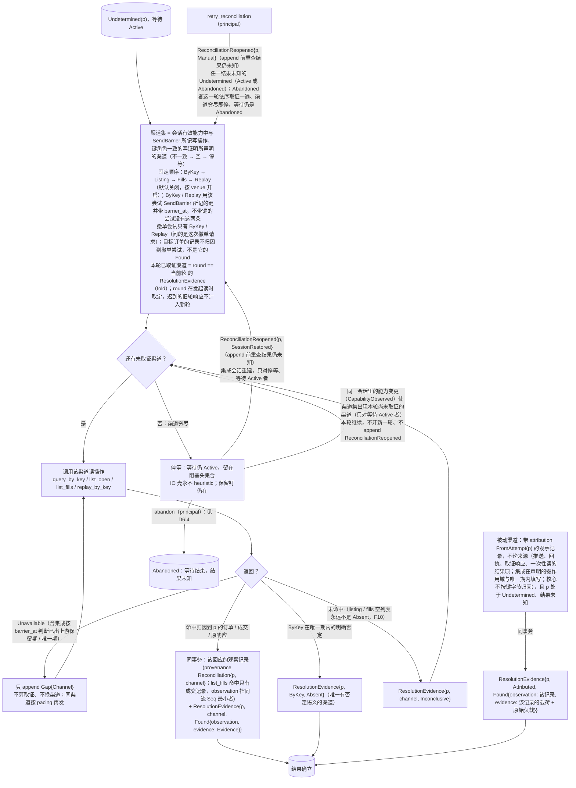
```mermaid
flowchart TB
  UD[("Undetermined(p)，等待 Active")]
  UD --> CH0["渠道集 = 会话有效能力中与 SendBarrier 所记写操作、键角色一致的写证明所声明的渠道（不一致 → 空 → 停等）<br/>固定顺序：ByKey → Listing → Fills → Replay（默认关闭，按 venue 开启）；ByKey / Replay 用该尝试 SendBarrier 所记的键并带 barrier_at，不带键的尝试没有这两条<br/>撤单尝试只有 ByKey / Replay（问的是这次撤单请求）；目标订单的记录不归因到撤单尝试，不是它的 Found<br/>本轮已取证渠道 = round == 当前轮 的 ResolutionEvidence（fold）；round 在发起读时取定，迟到的旧轮响应不计入新轮"]
  CH0 --> NEXT{"还有未取证渠道？"}
  NEXT -->|"是"| CALL["调用该渠道读操作<br/>query_by_key / list_open / list_fills / replay_by_key"]
  CALL --> RES{"返回？"}
  RES -->|"Unavailable（含集成按 barrier_at 判断已出上游保留期 / 唯一期）"| GAP["只 append Gap{Channel}<br/>不算取证、不换渠道；同渠道按 pacing 再发"]
  GAP --> CALL
  RES -->|"命中归因到 p 的订单 / 成交 / 原响应"| FOUND["同事务：该回应的观察记录(provenance Reconciliation{p, channel}；list_fills 命中只有成交记录，observation 指同流 Seq 最小者)<br/>+ ResolutionEvidence{p, channel, Found{observation, evidence: Evidence}}"]
  RES -->|"ByKey 在唯一期内的明确否定"| ABS["ResolutionEvidence{p, ByKey, Absent}（唯一有否定语义的渠道）"]
  RES -->|"未命中（listing / fills 空列表永远不是 Absent，F10）"| INC["ResolutionEvidence{p, channel, Inconclusive}"]
  INC --> NEXT
  NEXT -->|"否：渠道穷尽"| WAIT["停等：等待仍 Active，留在阻塞头集合<br/>IO 壳永不 heuristic；保留钉仍在"]
  WAIT -->|"ReconciliationReopened{p, SessionRestored}（append 前重查结果仍未知）<br/>集成会话重建，只对停等、等待 Active 者"| CH0
  WAIT -->|"同一会话里的能力变更（CapabilityObserved）使渠道集出现本轮尚未取证的渠道（只对等待 Active 者）<br/>本轮继续，不开新一轮、不 append ReconciliationReopened"| NEXT
  MAN["retry_reconciliation（principal）"] -->|"ReconciliationReopened{p, Manual}（append 前重查结果仍未知）<br/>任一结果未知的 Undetermined（Active 或 Abandoned）；Abandoned 者这一轮依序取证一遍、渠道穷尽即停，等待仍是 Abandoned"| CH0
  WAIT -->|"abandon（principal）：见 D6.4"| AB[("Abandoned：等待结束，结果未知")]
  ATTR["被动渠道：带 attribution FromAttempt(p) 的观察记录，不论来源（推送、回执、取证响应、一次性读的结果项；集成在声明的键作用域与唯一期内填写；核心不按键字节归因），且 p 处于 Undetermined、结果未知"] -->|"同事务"| ATT["ResolutionEvidence{p, Attributed, Found{observation: 该记录, evidence: 该记录的载荷 + 原始负载}}"]
  FOUND --> RS[("结果确立")]
  ABS --> RS
  ATT --> RS
```

读法：

- 每一步取证都是一条记录，所以重启后"做到第几个渠道"由 fold 重建，不需要驱动器内存。
- 停等由四种事件推进：重开新一轮（`SessionRestored` 或 `Manual`）、`Attributed`、`abandon`，以及同一会话里的能力变更使渠道集出现本轮尚未取证的渠道：渠道集按当前会话有效能力求，所以这时本轮接着取证，不等重连（§6.5 取证渠道与轮次、§6.6 停等）。
- `Unavailable` 不是证据：一个不可用的渠道不能被"跳过"，否则"没查到"会伪装成"查过了"；同渠道按 pacing 重试直到可用。
- 按键渠道的窗口由集成按 `barrier_at` 判断，核心不持有上游的保留期或唯一期。
- 撤阻塞头（D6.7）的结果不重开阻塞头的取证，也不是阻塞头的证据；要再问一次由 principal 发 `retry_reconciliation`。


## D6.3 一次 venue 交互的记录矩阵

对照：§6.5 回执与取证的记录模型；§10.5 #17；§5.3 归因由谁填；§8.3。

| 交互 | 执行事实侧（永存，含 `Evidence` = 契约载荷 + 原始负载） | 观察侧（该回应的观察记录，可压缩） | 同事务 |
|---|---|---|---|
| 写调用（`submit` / `cancel`）→ `Ack` | `VenueAccepted{venue_order_id, receipt: Evidence, observation}`（`observation` 指订单状态记录） | 订单状态一条 + 每笔可识别执行一条成交记录，归因各按自己的关联证据（撤单回执里目标订单的状态是目标订单的记录，不归到撤单）；同为 `provenance: Receipt{p}` | 是 |
| 写调用 → `Reject` | `VenueRejected(reason)`（`Unmapped(raw)` 保留） | 无（venue 侧无订单） | — |
| 写调用 → `NotSent` | `NotSent{reason, evidence}`（`raw` 是集成据以判定未交出的本地原文，可为空） | 无（没有交给上游） | — |
| 写调用 → `NoResponse` | `Undetermined(p, NoResponse)` | 无 | — |
| 取证命中 | `ResolutionEvidence{p, channel, Found{observation, evidence: Evidence}}`（`observation` 指命中的那条；`list_fills` 取同一成交流上 `Seq` 最小者） | 回应含订单状态时订单状态一条 + 每笔可识别执行一条成交记录；同为 `provenance: Reconciliation{p, channel}`；只对由自己的关联证据属于 p 的记录填 `FromAttempt(p)` | 是 |
| ByKey 否定 | `ResolutionEvidence{p, ByKey, Absent}` | 无 | — |
| 未命中 | `ResolutionEvidence{p, channel, Inconclusive}` | 无 | — |
| 渠道不可用 | `Gap{origin: Channel, channel}`（属 p） | 无 | — |
| 归因命中（带 `FromAttempt(p)` 的观察记录，不论来自推送、回执、取证响应还是一次性读） | `ResolutionEvidence{p, Attributed, round, Found{observation, evidence: 该记录的载荷 + 原始负载}}` | 该记录本身 | 是（与带来它的推送、回执或响应同一事务） |
| 放弃跟踪 | `Abandoned{p, principal, note, rule_version}`（在途取证全部完成、结果仍未知之后） | 无 | — |

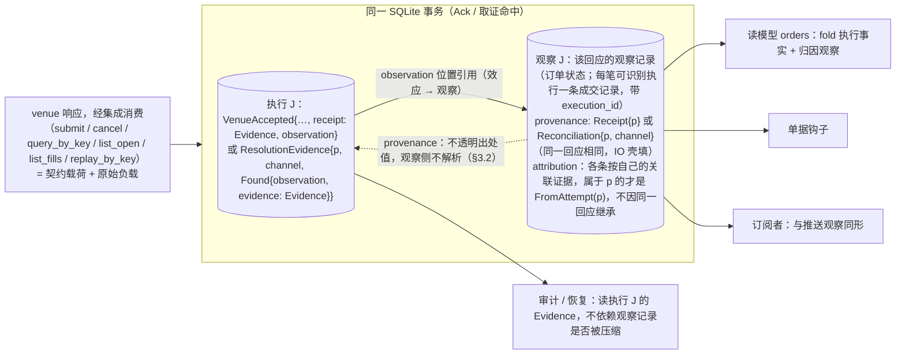
```mermaid
flowchart LR
  V["venue 响应，经集成消费（submit / cancel / query_by_key / list_open / list_fills / replay_by_key）<br/>= 契约载荷 + 原始负载"] --> TX
  subgraph TX["同一 SQLite 事务（Ack / 取证命中）"]
    E[("执行 J：VenueAccepted{…, receipt: Evidence, observation}<br/>或 ResolutionEvidence{p, channel, Found{observation, evidence: Evidence}}")]
    O[("观察 J：该回应的观察记录（订单状态；每笔可识别执行一条成交记录，带 execution_id）<br/>provenance: Receipt{p} 或 Reconciliation{p, channel}（同一回应相同，IO 壳填）<br/>attribution：各条按自己的关联证据，属于 p 的才是 FromAttempt(p)，不因同一回应继承")]
    E -->|"observation 位置引用（效应 → 观察）"| O
    O -.->|"provenance：不透明出处值，观察侧不解析（§3.2）"| E
  end
  E --> AUD["审计 / 恢复：读执行 J 的 Evidence，不依赖观察记录是否被压缩"]
  O --> RM["读模型 orders：fold 执行事实 + 归因观察"]
  O --> HOOK["单据钩子"]
  O --> SUBS["订阅者：与推送观察同形"]
```

读法：尝试只回答"我的写到达了吗"；订单是什么状态、成交了多少，在观察记录里给观察宇宙的消费者看，在执行记录的 `Evidence` 里给审计看（契约载荷是结论，原始负载是出处）。


## D6.4 等待与结果两根轴（放弃跟踪）

对照：§6.5 等待与结果：两根轴；§6.6 放弃跟踪 `abandon`、重开与轮次、被动渠道 `Attributed`；§8.5 结果未知组；W2。

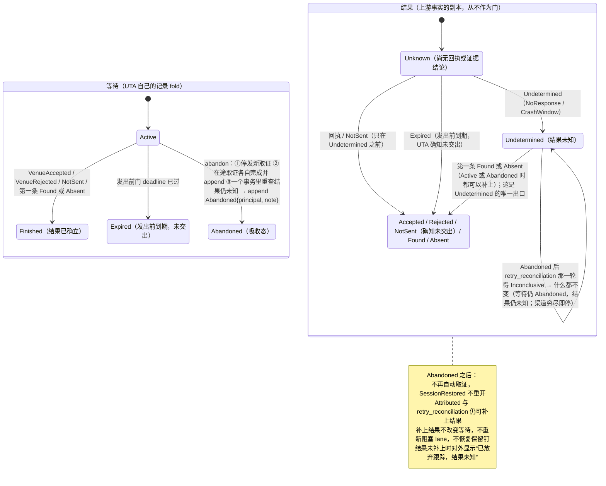
```mermaid
stateDiagram-v2
  state "等待（UTA 自己的记录 fold）" as C {
    state "Active" as ACT
    state "Finished（结果已确立）" as FINW
    state "Expired（发出前到期，未交出）" as EXW
    state "Abandoned（吸收态）" as ABW
    [*] --> ACT
    ACT --> FINW : VenueAccepted / VenueRejected / NotSent / 第一条 Found 或 Absent
    ACT --> EXW : 发出前门 deadline 已过
    ACT --> ABW : abandon：①停发新取证 ②在途取证各自完成并 append ③一个事务里重查结果仍未知 → append Abandoned{principal, note}
  }
  state "结果（上游事实的副本，从不作为门）" as O {
    state "Unknown（尚无回执或证据结论）" as UNK
    state "Undetermined（结果未知）" as UND
    state "Accepted / Rejected / NotSent（确知未交出）/ Found / Absent" as KNOWN
    [*] --> UNK
    UNK --> KNOWN : 回执 / NotSent（只在 Undetermined 之前）
    UNK --> KNOWN : Expired（发出前到期，UTA 确知未交出）
    UNK --> UND : Undetermined（NoResponse / CrashWindow）
    UND --> KNOWN : 第一条 Found 或 Absent（Active 或 Abandoned 时都可以补上）；这是 Undetermined 的唯一出口
    UND --> UND : Abandoned 后 retry_reconciliation 那一轮得 Inconclusive → 什么都不变（等待仍 Abandoned，结果仍未知；渠道穷尽即停）
  }
  note right of O
    Abandoned 之后：
    不再自动取证，SessionRestored 不重开
    Attributed 与 retry_reconciliation 仍可补上结果
    补上结果不改变等待，不重新阻塞 lane，不恢复保留钉
    结果未补上时对外显示“已放弃跟踪，结果未知”
  end note
```

读法：

- 左轴回答"UTA 还要不要等"，源头是 UTA；右轴回答"这次写发生没有"，源头是上游，只有“未交出”（`NotSent`，与 `Expired` 折成的同一个值）由 UTA 确知。principal 只能动左轴：没有人工写结果的操作。
- `abandon` 没有中间记录：①只是 IO 壳进程内的停发；③之前崩溃，日志里没有 `Abandoned`，恢复后仍 `Active`（§9.2 #8）。在途调用已给出结果时不写 `Abandoned`，返回 `Rejected(NotUndetermined)`。受控停止开始时已在执行的 `abandon` 照常完成：②里没有返回的调用在停止第 3 步被强制完成为 `Unavailable`，③在实例结束锚点之前得出（§7.2 受控停止“停止之前已在执行的控制动作”）。
- 离开 `Active` 的那一刻移出 lane 阻塞头集合、释放保留钉（§6.4、§2.4）。


## D7.1 重启时每次尝试的恢复判定

对照：§6.7“恢复”（判定顺序固定：先 fold 等待是否已结束，再看有无 `SendBarrier`）、§6.5 发出前门与转移表、§6.6 放弃跟踪；§7.2 第 2/4 步；§9.2 #1–#5、#7、#8。

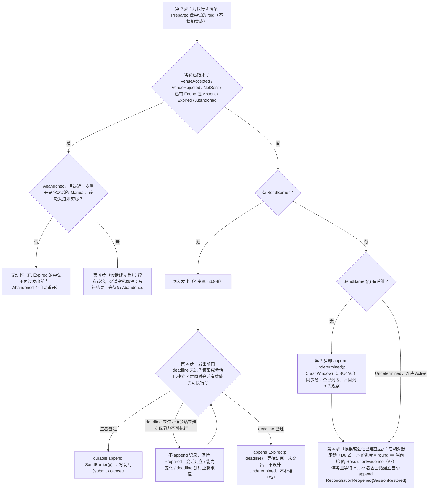
```mermaid
flowchart TB
  START["第 2 步：对执行 J 每条 Prepared 做尝试的 fold（不接触集成）"]
  START --> Q0{"等待已结束？<br/>VenueAccepted / VenueRejected / NotSent / 已有 Found 或 Absent / Expired / Abandoned"}
  Q0 -->|"是"| Q4{"Abandoned，且最近一次重开是它之后的 Manual、该轮渠道未穷尽？"}
  Q4 -->|"否"| DONE["无动作（已 Expired 的尝试不再过发出前门；Abandoned 不自动重开）"]
  Q4 -->|"是"| MANR["第 4 步（会话建立后）：续跑该轮，渠道穷尽即停；只补结果，等待仍 Abandoned"]
  Q0 -->|"否"| Q1{"有 SendBarrier？"}
  Q1 -->|"无"| SAFE["确未发出（不变量 §6.9-8）"]
  SAFE --> G{"第 4 步：发出前门<br/>deadline 未过？该集成会话已建立？意图对会话有效能力可执行？"}
  G -->|"三者皆是"| SEND["durable append SendBarrier(p) → 写调用（submit / cancel）"]
  G -->|"deadline 未过，但会话未建立或能力不可执行"| WAIT["不 append 记录，保持 Prepared；会话建立 / 能力变化 / deadline 到时重新求值"]
  WAIT --> G
  G -->|"deadline 已过"| EXP["append Expired(p, deadline)：等待结束，未交出；不误升 Undetermined，不补偿（#2）"]
  Q1 -->|"有"| Q2{"SendBarrier(p) 有后继？"}
  Q2 -->|"无"| UD["第 2 步即 append Undetermined(p, CrashWindow)（#3/#4/#5）<br/>同事务回查已到达、归因到 p 的观察"]
  UD --> DRV["第 4 步（该集成会话已建立后）：启动对账驱动（D6.2）；本轮进度 = round == 当前轮 的 ResolutionEvidence（#7）<br/>停等且等待 Active 者因会话建立自动 append ReconciliationReopened{SessionRestored}"]
  Q2 -->|"Undetermined，等待 Active"| DRV
```

读法：判定只用记录；先问"等待是否已结束"，把已结束的尝试（含只有 `Expired` 的、已 `Abandoned` 的）挡在自动驱动之外；其余归入"重发 / 过期 / 对账"三个桶。"重发"桶在集成会话建立前停在发出前门等待，不产生记录；只有 `deadline` 能把它变成 `Expired`。崩溃前进行中的 `abandon` 若未 append `Abandoned`，日志里没有痕迹，尝试照常落进对账桶（#8）。


## D7.2 崩溃窗口在 W1 时序上的位置

对照：§9.2 #1–#6、#14、#16、#21；D6.5。

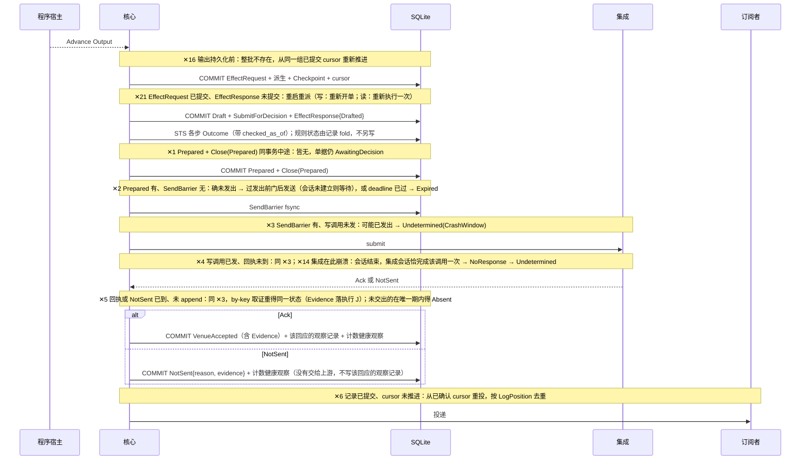
```mermaid
sequenceDiagram
  participant H as 程序宿主
  participant C as 核心
  participant DB as SQLite
  participant I as 集成
  participant A as 订阅者
  H-->>C: Advance Output
  Note over C,DB: ✕16 输出持久化前：整批不存在，从同一组已提交 cursor 重新推进
  C->>DB: COMMIT EffectRequest + 派生 + Checkpoint + cursor
  Note over C,DB: ✕21 EffectRequest 已提交、EffectResponse 未提交：重启重派（写：重新开单；读：重新执行一次）
  C->>DB: COMMIT Draft + SubmitForDecision + EffectResponse{Drafted}
  C->>DB: STS 各步 Outcome（带 checked_as_of）；规则状态由记录 fold，不另写
  Note over C,DB: ✕1 Prepared + Close(Prepared) 同事务中途：皆无，单据仍 AwaitingDecision
  C->>DB: COMMIT Prepared + Close(Prepared)
  Note over C,DB: ✕2 Prepared 有、SendBarrier 无：确未发出 → 过发出前门后发送（会话未建立则等待），或 deadline 已过 → Expired
  C->>DB: SendBarrier fsync
  Note over C,I: ✕3 SendBarrier 有、写调用未发：可能已发出 → Undetermined(CrashWindow)
  C->>I: submit
  Note over C,I: ✕4 写调用已发、回执未到：同 ✕3；✕14 集成在此崩溃：会话结束，集成会话恰完成该调用一次 → NoResponse → Undetermined
  I-->>C: Ack 或 NotSent
  Note over C,DB: ✕5 回执或 NotSent 已到、未 append：同 ✕3，by-key 取证重得同一状态（Evidence 落执行 J）；未交出的在唯一期内得 Absent
  alt Ack
    C->>DB: COMMIT VenueAccepted（含 Evidence）+ 该回应的观察记录 + 计数健康观察
  else NotSent
    C->>DB: COMMIT NotSent{reason, evidence} + 计数健康观察（没有交给上游，不写该回应的观察记录）
  end
  Note over C,A: ✕6 记录已提交、cursor 未推进：从已确认 cursor 重投，按 LogPosition 去重
  C->>A: 投递
```

读法：每个 ✕ 后的持久状态是 §9.2 对应行的"崩溃后持久状态"列；恢复动作由 D7.1 判定。fixture 验收：✕2 venue 调用 0；✕3/✕4/✕5 venue 调用 ≤ 1。


## D7.4 程序侧、派生侧与快照崩溃（#10、#11、#16、#21、宿主 trap）

对照：§8.6 崩溃恢复、预算语义；§6.1 `EffectResponse`、请求与响应的关联；§4.1/§4.3 派生可重算；§7.4/§7.5 快照仅加速；§9.2 #10/#11/#16/#21。

```mermaid
flowchart TB
  Q{"崩在哪？"}
  Q -->|"宿主进程异常退出（trap），或 Output 的 checkpoint 版本不在本成员接受的集合内（视同 trap）"| T1["核心同一事务 append ProgramHalted{Trap}（执行 J）+ ProgramFailed{Trap}（观察 J，只供展示）；版本违例的 Output 不落<br/>提交之后终止宿主，OS 确认退出后清除登记；程序 Halted（失败抑制，跨重启保持），等引用该 ProgramHalted 的 load_program"]
  Q -->|"核心在 Advance 输出 COMMIT 前"| T2["整批不存在；重启从最近 Checkpoint Load<br/>从同一组已提交 cursor 重新推进，不重复 Emit（#16）"]
  Q -->|"核心在 COMMIT 后、EffectResponse 持久化前"| T3["fold 出无 EffectResponse 的已注册请求（D4.3）<br/>读：重新执行一次；写：按 member 所指发出成员的 Applied 重新开单，发出成员已被替换或卸载亦然（Draft 与 EffectResponse{Drafted} 同事务，不存在有 Draft 无响应）（#21）"]
  Q -->|"派生 DAG 重算中途（#10）"| T5["核心崩溃：这批 Advance 的输出事务未提交，派生记录、EffectRequest、Checkpoint 与 cursor 一条也没有落<br/>恢复：同 T2，从最近 Checkpoint Load，从已提交的 cursor 重新推进（#16）<br/>只有宿主进程崩溃：trap，同 T1 失败抑制"]
  Q -->|"快照写入中途（#11）"| T6["持久：快照部分写、原记录完整<br/>恢复：半写快照丢弃，从保留边界 fold_state 重建；只增加重启延迟"]
```

读法：程序状态只有一条持久边界（`Checkpoint` 与 cursor 同事务）；一切恢复都从它开始重放。本成员可交回的 `Checkpoint` 总被本成员接受（沿用的由替换的 `Applied` 比对，其后持久化的由 `Output` 检查，§8.6 状态迁移），所以重启 `Load` 不比对版本，也没有装载时的 `Reset` 可以重复。请求的完成事实在执行 J（`EffectResponse`），读结论等观察记录被压缩不影响重派判定。派生记录与 `EffectRequest`、`Checkpoint`、cursor 同批提交，没有提交的批次不留任何记录，所以 DAG 重算中途的崩溃（T5）不留半批；快照不是权威，只加速重建。trap 的顺序与 D4.2 相同：失败抑制的执行事实 `ProgramHalted` 先提交，核心才终止宿主；程序的状态是 `Halted`，`ProgramFailed` 是可压缩的展示观察，不承载状态（§8.6 失败抑制）。


## D8.1 引用登记的生命周期（三种持有者）

对照：§2.4 登记方与解除时机；§7.5 保留边界与引用登记。

```mermaid
stateDiagram-v2
  state "意图 basis（派生侧位置）" as B {
    state "未登记" as B0
    state "已登记" as B1
    state "已解除" as B2
    [*] --> B0 : Draft / Revise 携带 basis（Drafting / AwaitingDecision 期间）
    B0 --> B1 : Prepared append（核心自动登记）
    B1 --> B2 : 该尝试等待结束（结果确立、Expired、Abandoned）
    B0 --> B0 : 边界越过 → basis_validity BeyondRetention（单据 Diverged，fail-closed）
  }
  state "程序 Checkpoint 的 cursor" as C {
    state "已登记" as C1
    state "已解除" as C2
    [*] --> C1 : 程序进入活动集合后的第一个 Checkpoint 与 cursor 同事务持久化（此前没有登记；登记时可能已在边界之下，照样阻止推进）
    C1 --> C1 : 下一个 Checkpoint 持久化即替换；沿用旧状态的替换原样转给新成员；宿主 Unload、受控停止、失败抑制都不解除
    C1 --> C2 : unload_program 的 Applied，或不沿用旧状态的替换的 Applied（都在宿主 OS 确认退出之后 append；最近 Checkpoint 保留作审计）
  }
  state "取证 ResolutionEvidence 引用的观察位置" as R {
    state "已登记" as R1
    state "已解除" as R2
    [*] --> R1 : 等待仍 Active 时 append 的 ResolutionEvidence
    R1 --> R2 : 该尝试等待结束（结果确立、Expired、Abandoned）
  }
```

读法：

- 登记方是核心、消费者不手工登记；解除随持有者生命周期自动发生。
- 解除后的历史引用仍可读作审计；已解除的引用落到边界之下读得 `BeyondRetention`，不阻止压缩。未解除的引用即使已在边界之下（程序第一个 `Checkpoint` 登记的 cursor 可能如此）也照样阻止边界推进，直到被取代或解除（§2.4 不变量）。
- `Undetermined` 停等时，它的 `basis` 与取证引用钉住保留边界；解除随该尝试等待结束自动发生——任一入口（`Attributed Found`、`ReconciliationReopened` 后的自动取证、同一会话里的能力变更使本轮尚未取证的渠道进入渠道集之后的取证、`abandon` 之后 IO 壳 append 的 `Abandoned`，D6.2）都行，没有绕过记录的旁路。


## D8.2 `advance_retention` 与压缩

对照：§2.4 保留语义、§8.5 控制组、§7.4 `compact_below_retention`、§7.5 保留边界与引用登记、§4.1、W13。

```mermaid
flowchart TB
  OP["控制面 principal：advance_retention(to: Set&lt;LogPosition&gt;)<br/>每条要推进的观察流一个新边界"] --> AUTH{"(principal, 动作种类) 授权？"}
  AUTH -->|"否"| U["Rejected(Unauthorized)"]
  AUTH -->|"是"| EACH["逐流判定 to(s)；任一流不通过即整体拒绝，无流被推进"]
  EACH --> MONO{"to(s) > 该流当前边界？（边界只前进）"}
  MONO -->|"否"| RJ0["Rejected(NotForward)"]
  MONO -->|"是"| MIN["核心算该流已登记引用的最早位置 min(s)"]
  MIN --> CMP{"to(s) ≤ min(s)？"}
  CMP -->|"否"| RJ["Rejected(ReferencedBelow{min})<br/>要越过只能先让持有者解除：该尝试等待结束（结果确立、Expired、Abandoned）/ 程序推进 checkpoint、unload_program 或不沿用旧状态的替换"]
  CMP -->|"是"| WIN{"to(s) ≤ 该流配置窗口下界？"}
  WIN -->|"否"| RJ2["Rejected(InsideWindow{bound})"]
  WIN -->|"是，且各流都通过"| APPLY["写各流新边界；控制记录 Applied(position)"]
  APPLY --> COMPACT["compact_below_retention：仅观察侧 RetractableDelta 表，逐流按该流保留规则删边界之下，只删不改<br/>一般观察流：边界之下全部删去<br/>健康流：只删被同键后续记录取代的，每键最新一条留作基线<br/>程序流：只删被同一流 epoch 里后续值记录取代的值记录，每个流 epoch 最新一条值记录原样留作基线（撤回部分照留），开 epoch 的 Gap{Source} 留下<br/>执行 J 没有保留边界：不压缩、不删除"]
  COMPACT --> INV["不变量 §6.9-3：边界推进不越过所在观察流已登记引用的最早位置；程序 Checkpoint 的 cursor 引用登记时可能已在边界之下（第一次提交的 cursor 例如为 from 的前一位置或一段被删位置的末位），此后阻止推进直到下一个 Checkpoint 取代它；未登记者得 BeyondRetention"]
```

读法：边界按观察流分别维持、只前进（`LogPosition` 只在同一 `StreamId` 内有序）；执行事实永不删除；派生历史的 `DELETE` 只在各流边界之下，留下的记录一条也不改写。健康流与程序流是状态值的流，按键 / 按流 epoch 留基线，所以任一 `as_of ≥ 边界` 的 fold 与压缩前相等（健康读唯一的例外是某个成员走到 §8.4 会话值的 `BeyondRetention` 分支：健康流前缀里没有带它最近一次采纳之实例的会话观察，而它最近一条会话观察所带的实例在控制流前缀里没有采纳，这个切面得 `BeyondRetention`；非成员的键不影响这一等式，§2.4、§8.4）；从边界订阅的消费者 cursor 为 `Start{边界}`，每次挂接先收到边界之下留下的记录（前导），第一次覆盖整段前导的确认之前断连或崩溃就再收一遍，确认之后成为 `At`，前导之下被删的段不是它的损失（§4.2 cursor 与确认）；cursor 为 `At` 而落在边界之下的订阅者得到的 `Gap{Delivery, compacted}` 只覆盖被删去的位置（每一段连续被删、且不在未确认缺口里的位置一项），各段之间的基线照常按位置投递（§2.4、§4.2）。程序流的 fold 取最新一条值记录的正贡献，撤回部分只指名被取代的位置，所以基线指名已删记录不影响结果：新 fold、已折入被删记录的订阅者与收到压缩缺口的订阅者，收到基线之后都持有同一个值（§4.1 程序流的 fold）。


## D8.3 `basis_validity` 判定

对照：§5.2 `basis_valid`（`BeyondRetention` 只对观察侧位置）、默认窗口 `Lag = 0`、执行事实侧引用不因年龄变假；§6.2 门。

```mermaid
flowchart TB
  IN["basis: Set<LogPosition>；操作的 Lag（策略声明，缺省 0）"]
  IN --> EACH["对每个位置（逐位置顺序：边界 → 撤回 → 滞后，后一项以前一项通过为前提，§5.2）"]
  EACH --> SIDE{"位置在哪侧？"}
  SIDE -->|"执行事实侧（VenueAccepted / SendBarrier / EffectRequest 位置）"| EOK["有效（执行事实侧没有保留边界，不因年龄变假）"]
  SIDE -->|"派生侧（观察，含归因观察）"| D1{"≥ 该流保留边界？"}
  D1 -->|"否"| BR["BeyondRetention(pos)"]
  D1 -->|"是"| D2{"该位置的贡献被撤回？"}
  D2 -->|"是"| RT["Retracted(pos)"]
  D2 -->|"否"| D3{"同 epoch 且依据之后该流已提交的记录数 ≤ Lag？<br/>Lag 以同一 StreamId 上的 Seq 距离计；只比较核心自己的位置<br/>Lag = 0：依据位置就是该流当前流末；epoch 早于当前 → Stale"}
  D3 -->|"否"| ST["Stale(Lag)"]
  D3 -->|"是"| DOK["有效"]
  EOK --> AGG
  DOK --> AGG
  AGG{"全部有效？"} -->|"是"| FRESH["Fresh"]
  AGG -->|"否"| NOT["取最严重一类作 BasisValidity：BeyondRetention > Retracted > Stale（§5.2）<br/>门 fail-closed；全部失败位置及原因给审批人"]
  BR --> AGG
  RT --> AGG
  ST --> AGG
```

读法：`Lag = 0`（缺省）时 `Fresh` 是"决定看到了核心此刻已有的该流全部记录"；策略声明正 `Lag` 时允许依据之后该流再提交至多 `Lag` 条记录。判定不读完备进度，也不读收到时间：完备是来源的性质，本门不用它（§5.2）。空 `basis` 空真为 `Fresh`，此时能不能放行由第二层必要项决定（D5.5）。

## D9.2 操作集到核心元素的落点

对照：§8.5 操作集；§7.3 模块指南；§3.4 读副作用、§4.4 读模型；§8.2 `read`。这些是解释层代下游发出的核心操作，下游看到的对外概念见 `design/downstream/design.md` 第 2 节。

```mermaid
flowchart LR
  subgraph OPS["核心↔解释层操作（同一 JSON-RPC，§8.5）"]
    S1["subscribe(观察流 {(来源, 流, 主体集?, 用途：供给 | 只投递)} 或 执行事实 (来源, WriteScope?) 或 控制（控制流）, mode = ordered | latest) / ack / unsubscribe"]
    S2["read(targets = (来源, 流, request_schema 身份, request, range?), deadline)"]
    S3["read_model(kind, as_of?)"]
    S4["draft / revise / submit_for_decision / decide / send_back / withdraw / transfer"]
    S5["load_program(manifest_ref, cold_start?) · unload_program · install_native_op · remove_native_op · reload_config · rotate_credential · restart_integration · request_snapshot · advance_retention · rewind_cursor · bypass_lane"]
    S6["abandon(attempt: AttemptRef, note)"]
    S6b["retry_reconciliation(attempt: AttemptRef)"]
    S7["health()"]
  end
  subgraph EL["核心元素"]
    SUB["持久订阅 / 投递调度"]
    RDP["一次性读元素（§7.3）→ 判定 → 同一集成会话 epoch 内同一 identity 的在途调用并入 → 集成 read（经集成会话）→ item 观察记录 + 读结论记录，或 Gap{Channel}（都带 OneShot{origins ∋ Session(principal), request}、dispatch_end 与发出会话的 session_epoch）+ 计数观察"]
    RM["读模型（只读 fold；含 sources：执行 J 声明版本的 fold）"]
    TK["单据（TicketAction）→ STS 链"]
    CTL["控制面（控制记录 Applied / Rejected）"]
    IOR["控制面授权 → 该尝试的在途取证调用先完成 → 一个事务里重查，结果仍未知才 append Abandoned{attempt, principal, note, rule_version}（否则不写，Rejected(NotUndetermined)）；Abandoned 在 lane 流 → 尝试移出阻塞头集合（D9.3）"]
    RRO["控制面 append ReconciliationReopened{Manual(principal)} → IO 壳重开一轮取证（D6.2）"]
    HL["健康读模型"]
  end
  S1 --> SUB
  S2 --> RDP
  S3 --> RM
  S4 --> TK
  S5 --> CTL
  S6 --> IOR
  S6b --> RRO
  S7 --> HL
  S2 -.->|"逐 target，按序判定：UnknownTarget（来源未登记，或来源是 Program(_)）/ Unavailable{source_state}（从未有声明）/ Unavailable{source_state}（此刻无已建立会话；以上都不调用、不记 gap）→ 按会话有效声明：Unsupported（流不在其中，或 read 为 Unsupported）/ Unconfirmed（read 为 Unknown）/ InvalidRequest{reason} → 调用之后：Answered{conclusion, items} / Refused{conclusion, reason} / Unavailable{gap}（渠道失败，已记 Gap{Channel}）/ Pending{from, request, instance_id}（deadline 到而调用在途；之后照常记结论或 gap，从 from 订阅只投递项可收到，按 request、origins、dispatch_end 与 session_epoch.instance_id 认出自己的那一条；核心实例已换则不再保证）"| S2
  S1 -.->|"逐项判定，没有任何一项被接纳或待接纳 → Rejected{items}：集成来源：来源不在采纳集合且从未有声明 → 该项拒绝；在采纳集合而从未有声明 → 该项待接纳；供给项：来源不在采纳集合 → 拒绝（来源未登记）；流不在最近声明里 / 配额池流上不带主体集 → 拒绝，放不下 → QuotaExceeded{quota, limit}；只投递项（不看采纳集合与会话）：流在任何一个声明版本里出现过 → 接纳（不进需求、不占配额），从未声明过 → 拒绝；程序来源 Program(p)（按 p 历代开始成员的 Applied 所记输出契约）：没有这种 Applied → 拒绝（来源未登记）；供给项 → 拒绝（ProgramStreamNotRouted）；带主体集 → 拒绝；整条流的只投递项：流在任一条输出契约里出现过 → 接纳，否则拒绝；from < 保留边界 → BeyondRetention；执行事实（不看采纳集合）：非 ordered、来源是 Program(_)，或 WriteScope.key 不在任何声明版本里 → 拒绝；控制：非 ordered → 拒绝"| S1
  S3 -.->|"kind 未定义 → 拒绝；as_of 有位置尚未提交 → NotYetAvailable{positions}（各流已提交的流末）；tickets / subscriptions 带历史 as_of → 拒绝；as_of 有位置低于所涉观察流的保留边界，或 health 切面上某成员走到会话值的 BeyondRetention 分支 → BeyondRetention"| S3
  S4 -.->|"expected_version ≠ current_version → Conflict；当前规则对该单据不要求人工审批时 decide → 拒绝、不 append；同版本已有 Decision → Conflict(AlreadyDecided)"| S4
  S5 -.->|"越权 → Unauthorized；配置不合法 → Rejected 并保留上一有效版本；advance_retention 逐流判定 → NotForward / ReferencedBelow / InsideWindow"| S5
  S6 -.->|"越权 → Unauthorized（安全事件）；尝试不处于 Undetermined、等待已不是 Active 或结果已确立 → Rejected(NotUndetermined)"| S6
```

读法：写类按 `(principal, WriteLaneKey, OperationKind)` 授权，控制动作与放弃等待按 `(principal, 动作种类)` 授权，同一规则族；三组都留下带 principal 的记录。一次性读先判 UTA 自己记录里的事实（登记、有无声明），再看来源此刻有没有会话，最后才按会话有效声明判能力：离线时不拿上一次会话的声明报“不支持”。


## D9.3 放弃等待流程

对照：§8.5 结果未知组；§6.6 对账驱动；§2.4 引用登记；§8.4 调用结果计数。

```mermaid
flowchart TB
  L["读模型 lanes：某 lane 的 Undetermined 尝试 r（仍在取证，或渠道已穷尽 Inconclusive 而停等）"]
  L --> OP["运维 principal 判断"]
  OP --> R1{"下一步？"}
  R1 -->|"venue 当时不可达 / 想再自动查一轮"| RT["retry_reconciliation(r) → ReconciliationReopened{r, Manual(principal)}（D6.2）"]
  R1 -->|"仍等"| KEEP["不动作：r 留在阻塞头集合；新到的来源证据照常确立结果"]
  R1 -->|"不再等"| AB["abandon(r, note)"]
  AB --> CHK{"授权 ∧ r 处于 Undetermined、等待 Active、结果未确立？"}
  CHK -->|"否"| RJ["Unauthorized（安全事件）/ Rejected(NotUndetermined)"]
  CHK -->|"是"| INF["r 的在途取证调用先完成（各自照常记 ResolutionEvidence 或 Gap{Channel}，照常计数）"]
  INF --> RCK{"一个事务里重查（与 append 同一事务）：r 的结果仍未知？"}
  RCK -->|"否：在途调用已给出结果"| RJN["Rejected(NotUndetermined)（不写）"]
  RCK -->|"是"| AN["IO 壳 append Abandoned{r, principal, note, rule_version}（r 所在 lane 的执行事实流）<br/>此后不再自动询问：SessionRestored 不重开它"]
  AN --> OUT["r 移出阻塞头集合，集合空才解除 lane；不再发起任何写<br/>r 的 basis 引用登记随之解除；结果仍未知"]
  AN -.->|"结果仍可补上，不是门"| LATE["被动的 Attributed 来源证据可随时到达并确立结果<br/>retry_reconciliation(r) 仍可再问一轮"]
```

读法：放弃等待是 UTA 自己的出口，与 `Expired` 同类：它只结束 UTA 对这次写的等待，不断言写发生或未发生；解释层对外呈现见 `design/downstream/design.md`。它不要求渠道已穷尽（可在任一时刻），但永远带 principal；核心自己永不 heuristic。


## D9.4 控制动作触发的记录

对照：§8.5 控制组；§7.6 每文件契约、原子替换与轮换强制的新流 epoch；§7.2 第 3 步与受控停止；§4.2 gap 原因；W8。

```mermaid
flowchart LR
  subgraph ACT["控制动作（带 principal，先授权）"]
    A1["reload_config(rules)"]
    A1r["reload_config(runtime)"]
    A2["rotate_credential(integration)"]
    A3["restart_integration(id)"]
    A4["load_program / unload_program"]
    A5["request_snapshot"]
    A6["advance_retention(to)"]
    A7["rewind_cursor(subscription, to)"]
    A8["bypass_lane(ticket)"]
  end
  A1 --> F1["读策略/审批规则文件（Alice 原子替换写入）<br/>合法 → Applied，规则版本 = 内容 hash，写进此后每条 Outcome / Rejection<br/>不合法 → Rejected，保留上一有效版本"]
  A1 --> F1b["待决单据放行时按新规则重过五步（不冻结）；必要项集 / Lag 变化触发 alignment 重算（D5.5）"]
  A1r --> F1c["读运行期参数文件：快照频率 · 派生侧留存窗口 · deadline 全局缺省 · 投递缓冲上限 · 回填深度（按逻辑流，缺省取全局值；只影响下一个流 epoch 的回填任务判定）<br/>合法 → Applied；不合法 → Rejected，保留上一有效版本；不改规则版本"]
  A2 --> F2["凭据链 文件 → 核心 → 集成；该集成新 session_seq<br/>Applied 留下一项未兑现的轮换：该集成此后第一次成功的握手（可能在之后的实例里）强制各流新 epoch Gap{Source, credential_rotated}，同一事务在控制流上 append 以位置引用这条 Applied 的轮换兑现记录（§7.6）"]
  A3 --> F3["终止并重新拉起集成进程；新 session_seq<br/>没有未兑现的轮换时，各流按游标证明决定续接或新 epoch；有则第一次成功的握手一律新 epoch Gap{Source, credential_rotated}，同一事务 append 轮换兑现记录（§7.6）"]
  A2 -.-> FS["受控停止开始时 Applied 还没有提交的 rotate_credential / restart_integration：停止第 1 步以 Rejected(Stopping) 结束，不采纳、不解除 Halted、不留下未兑现的轮换（§7.2 受控停止）"]
  A3 -.-> FS
  A4 --> F4["宿主 Load / Unload（D4.2）<br/>load_program，id 不在活动集合里：新成员每条程序流 Gap{Source, start}，不是 Reset<br/>load_program，id 已在活动集合里：沿用的替换（非 cold_start、输出契约相同、无旧 Checkpoint 或接受其 state_version）不写程序流；不沿用的替换：ProgramReset{cold_start 为 Operator，否则 Replace} + 新成员每条程序流 Gap{Source, program_upgrade}<br/>新成员不声明的流不写记录；unload_program 不写程序流，epoch 都不结束"]
  A5 --> F5["写快照（仅加速重建，不改 append-only）"]
  A6 --> F6["D8.2"]
  A7 --> F7["消费方订阅所涉各流的 cursor 都是 At{pos} 且 to 低于 pos：退回为 At{to}（to 算作已确认）；from 高于新 cursor 的未确认投递缺口同一次写删除；此后重投，重新跳过时再记缺口，被删的段按逐段规则重新成为 compacted 缺口（显式控制动作，不是恢复路径）<br/>任一流的 cursor 是 Start{from} → Rejected(CursorNotConfirmed)；to 不低于 pos → Rejected(NotBackward)；被拒时不改任何 cursor 与缺口"]
  A8 --> F8["控制记录 Applied（自觉违反，不是 Decision）：记单据当时的 current_version 与阻塞头位置集；单据不在 AwaitingDecision → Rejected<br/>lane 步只对这些阻塞头不等待，其余各步照常 → Prepared；阻塞头成集合（D5.4）"]
```

读法：控制动作不经进程信号或 flag 文件；每个动作的结果是一条带 principal 与配置版本 hash 的控制记录，落核心的控制流（`bypass_lane` 的落该单据的 lane 流，§8.5 订阅组），生效动作再触发相应记录。
