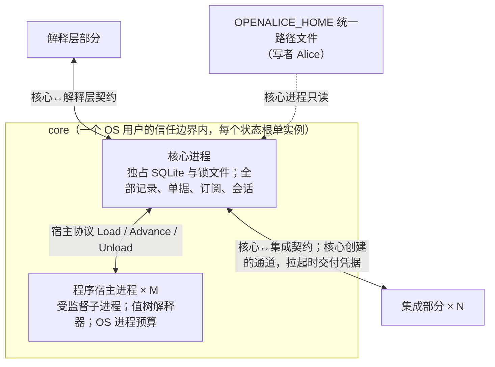

# core：系统上下文

## 0 定位

- **层级与元素：** C4 L1，core 部分作为黑盒。上级是景观文档 [../README.md](../README.md)，全局原则、问题域与需求编号都定义在那里。
- **本文决定：** core 为谁服务、与哪些外部部分和系统交换什么、分配到哪些需求、拆成哪两个容器及理由；以及两个容器与集成部分共用的表示（组合子值树）。
- **读者：** 实现 core 的人，以及实现集成、解释层时需要知道 core 边界的人。审批者无（K3）。
- **状态：** 已定。下属的程序宿主进程与程序宿主元素为“评审中”（一项卡点，[program-host/design.md §5.4 卡点](program-host/design.md#54-卡点)），不改变本层的容器划分与关系。
- **非目标：** 本文不写任何契约的操作规格（它们在实现各操作的核心进程组件文档里）、不写核心进程或程序宿主进程的内部结构。

## 1 问题域

### 1.1 分配给 core 的需求

- 推出的需求：C1–C7、C9–C14；质量场景 Q1–Q32（Q24、Q30 只到 `Pooled` 接口为止）。分配表见 [../README.md §4.3](../README.md#43-需求分配)。
- 全局原则 [../README.md §1](../README.md#1-全局原则) 在 core 里落地：抽象只在 core 里；core 只对自己的意图及其推进记录有权威。

### 1.2 外部与它们的固有性质

| 外部 | 它是什么 | 与 core 相关的固有性质 |
|---|---|---|
| 解释层部分 | 下游经它接触 core；不持有状态 | 可随时断开、崩溃、重启（Q29）；每个连接带 OS 对端凭据与下游自报的 `actor`（H7） |
| 集成部分 × N | 每个上游一个进程，上游的唯一消费点 | 可崩溃、可成孤儿（H10）；它说的能力只代表那次握手（F6）；写可能无回执（F5） |
| 可选行情派生计算子系统 | 运行原生 op | 可能不存在；它在不在是实例的运行期事实 |
| Alice（经统一路径文件） | `OPENALICE_HOME` 下全部共享配置文件的唯一写者 | 文件以原子替换写入；它可在任何时刻改写文件，core 不能假设文件与运行态一致（H3） |
| OS | 进程、文件锁、对端凭据、时钟 | 进程的存亡只有 OS 能确认；文件锁随进程消亡而释放（H10）；同一 OS 用户的进程互相不隔离（H7）；Windows 无 UDS（H8） |

运维者与程序作者不直接接触 core：运维动作经解释层的控制组到达；程序作者写的程序值文件由 Alice 放进统一路径，经运维的 `load_program` 装载。

## 2 驱动

core 承担的质量场景全部在 [../README.md §3.1](../README.md#31-质量场景)；约束 K1（独立进程、序列化文本或跨语言 RPC）与 K2（优先 Rust）直接塑造本层的划分：

- K1 → core 是独立二进制；它与其余三个部分、与程序宿主之间的每条边界都是跨进程的、有 IDL 或协议的。
- H2 + C4 + Q25 → 不可信的程序不能与核心进程同处一个故障域，这是把程序宿主拆成单独容器的理由（§4.1）。
- H10 + Q20 → 每个用户状态根只有一个 core 实例（§4.3）。
- Q22（秒级负载）→ 线缆编码与单写者的吞吐是本层要验收的量（验收 #19，§6.3）。

## 3 模型

本节只写两个容器与集成部分共用、必须在 core 层定下的表示。核心进程自己的模型（位置与三种进度、两个类型宇宙与唯一边、依据）在 [core-process/design.md §3 模型](core-process/design.md#3-模型)。

### 3.1 设计中心

core 的主线是两类记录与它们之间唯一的边：观察（看到了什么，派生部分可撤回、可压缩）与执行事实（UTA 的意图及其推进，只追加）；唯一跨越二者的依赖方向是效应侧引用观察侧的位置，反向不存在。两个容器都服从它：程序宿主进程只算值、不写记录，它交回的派生值与效应请求由核心进程落成记录。展开见 [core-process/design.md §3.4 两个类型宇宙与唯一边](core-process/design.md#34-两个类型宇宙与唯一边)。

### 3.2 组合子值树与五个 fold

规则守卫、程序节点、处理器触发、单据检查项、记录映射的换算共用**同一个派生机制**。前四处在核心进程与程序宿主进程里，换算在集成进程里求值、不属 core 的任一类记录；所以这个表示在 core 这一层定，并随 core 发布给集成作者与程序作者。

谓词可以处理任意协议，因为它们是底层无关的纯组合子。组合子的核心意义是**让类型可以顺利派生**。[证据：fp-01 案例 3 Composing Contracts；fp-03 条目 5 Servant]

#### 值树

组合子树在 Rust 里是**一个 enum 值**（deep embedding），不是泛型类型：

```rust
// 值树 = 一个 enum（deep embedding）。判断的共同底层表示。
enum DerivationNode {
    Const(V),
    Field(FieldName),                 // field::<T>(name)：带类型标签的访问器叶子，读树隐含的那条记录（处理器、检查项）；协议差异压在这一层
    Input(InputName),                 // 程序的观察输入：指名 Program.inputs 里的一项，值是该输入流 cursor 之后的记录
    Pred(PredOp, Vec<Id>),            // 谓词/比较算子：InBand / Eq / Lt / And / Or / Not …，输出 bool
    Op1(Op1, Id), Op2(Op2, Id, Id),   // 一元/二元值算子；Op1 含访问器 Field(FieldName)，程序值里读一个 Input 节点给出的记录的字段
    Scan(ScanOp, Id),                 // 状态累加节点（即 Fold）
    Window(Id, W),                    // 核心内按位置产出值的滑动窗口节点
    Join(JoinOp, Vec<Id>),
    Pooled { input: Id, window: Window },  // 读侧组合子；输出段视图，交可选子系统
}
```

- `Field::<T>(name)` 是带类型标签的访问器，类型随访问器进入表达式，启动 / 装载期校验。处理器与检查项的树有一条隐含的记录，叶子 `Field(name)` 读它，启动期按字段注册（[envelope.md §3.2 处理器字段注册表](core-process/envelope.md#32-处理器字段注册表)）校验。
- 程序值有多个具名输入、没有隐含记录 [设计]：访问器写作 `Op1(Field(name), i)`，`i` 是一个 `Input(name)` 节点，读该输入给出的记录的字段；类型由访问器的类型标签给出，装载期与该输入流在最近声明里的 `payload_schema` 核对；含 `Field` 叶子的程序值在装载期被拒（[program-host-element.md §4.2 装载期校验](core-process/program-host-element.md#42-装载期校验)）。理由：访问器与它所读的输入之间的绑定就是树里的一条边，两个实现者从同一棵树读出同一个绑定；类型取标签，程序的输出类型才能不等声明就从程序值求出。不选：给 `Field` 叶子加上所读的节点，处理器与检查项的树就要为隐含的记录另造一个节点。
- 组合子从不提 venue，只接受三种输入：锚点、注册表里的具名字段（带类型）、经 `payload_schema` 访问器取得的载荷值。记录映射的换算是唯一例外的输入：它的输入是上游字段值，但树里仍不出现上游字段名，字段名只在记录映射的处置表里（[integration-session.md §3.4 记录映射](core-process/integration-session.md#34-记录映射-设计)）。
- 协议差异被压在访问器一层，谓词之上一律纯组合：`InBand(field("px"), lo, hi)` 对任何注册了 `px: Price` 的 venue 都成立。
- 程序值是一组节点加决策步、输入声明与输出声明：`Program { nodes, rules, inputs, facts, outputs }`（[program-host-element.md §3.1 程序值](core-process/program-host-element.md#31-程序值)）。`InputDecl`、`FactDecl` 与 `Output` 都不是节点构造子。

类型别名视图（把已隐含的关系写明，不是四个独立类型）：`Pred<X>` = 对输入 X 输出 `bool` 的树；`Comb<X, Y>` = 输入 X、输出 Y 的树，`Pred<X>` 即 `Comb<X, bool>`；`Scan` = 状态累加节点，`Fold` 在此表示为 `Scan`。

值树是权威表示。类型化的 builder API 可以叠在值树之上，但 builder 只是构造糖。[证据：fp-01 M9 Marlowe 闭合构造子]

#### 五个 fold

五种“派生”是对这同一棵树的 fold，在**装载 / 启动期**求出，而不是编译期。

| fold | 结果 | 替代的旧做法 |
|---|---|---|
| `required_inputs` | 树里所有 `Field` 叶子的 stream kind 之并；启动期与所引用集成来源的最近声明比对，缺失即 fail-closed。程序值不用它：程序的输入就是 `inputs` 声明，装载期逐项与所引用集成来源的最近声明比对 | 登记 → 字面意义的推导 |
| 输出类型 | 每节点值类型：`Field::<T>` 给基类型，`Input` 节点给该输入流 `payload_schema` 所定的记录类型，`Op`/`Scan`/`Join` 按算子推导，对原生 op 的引用取它在值树里带的声明结果类型；`Pooled` 节点输出类型即段布局；程序的输出契约取 `outputs` 各项所指节点的这个类型 | 手写的布局 / 输出类型 |
| 求值 | `Pred` → `bool`；`Comb` → 值；`Scan`/`Fold` → 状态 | — |
| 失败 | **单一 kind enum + 路径上下文**（`InBand{field, lo, hi, actual}`、`FieldAbsent(kind)`…，附树中路径） | 组合子层失败不再是各组合子变体的类型级并集 |
| 说明 | 为审批人生成“为何否决”；静态检查“引用了没有集成提供的字段” | 每条规则各写一遍 |

组合子层的失败是单一 kind enum。规则层的 `Rejection` 是具名 enum，包装本层的 kind enum（[decision-chain.md §3.1 规则是 STS，不是订单对象](core-process/decision-chain.md#31-规则是-sts不是订单对象)）。两层各自封闭，不是同一个类型。

`required_inputs` 的唯一定义：对值树整体做上表第一个 fold 的结果 = 树中 `Field` 叶子引用的 `StreamKind` 集。处理器与检查项都是组合子树，“处理器的 `required_inputs`”就是对其树做同一个 fold；程序的输入不由它求，而是程序值的 `inputs` 声明（程序值里没有 `Field` 叶子）。检查项的 `required_inputs` 与字段注册只引用此定义，不重新定义。

#### 同一 enum 的五处使用

| 使用点 | 所在容器 / 部分 | 该处的树形状 | 谁构造 / 何时校验 |
|---|---|---|---|
| 处理器触发、订阅过滤 | 核心进程 | `Pred<Envelope>` | 集成注册 / 启动期 |
| 规则守卫 | 核心进程 | `Pred<(Context, RuleState, Input)>` | 实现者 / 启动期 |
| 单据检查项 | 核心进程 | `Comb<Observed, CheckResult>` | 由 (意图类型 × venue 能力) 解析 / 评估期 |
| 程序节点（解释①派生、解释②决策）；读模型对记录的 `Fold` | 程序宿主进程；读模型在核心进程 | `Comb` / `Scan` / `Fold` | 程序作者 / 装载期 |
| 记录映射的换算 | 集成部分 | `Comb<上游值, 契约值>` | 集成作者 / 握手期由核心静态校验，集成侧由本仓库发布的解释器求值 |

核心与程序的区别**只在谁构造、何时校验**：核心规则由实现者构造、启动期校验；AI 程序由程序作者构造、装载期校验；记录映射由集成作者构造、握手期校验。校验相同、表示相同、解释器相同。

**不统一的**：组合子是**判断**的底层，不是**控制流**的底层。规则链的顺序固定链是对组合子结果的顺序消费，IO 壳的阶段链是协议驱动器，单据锁是责任持有；它们都在核心进程里，各有自己的模型。

#### 不变量

- `required_inputs` 是启动期可算的确定集。引用了没有集成提供字段的树 **fail-closed**：规则、处理器、检查项由启动期 `required_inputs` fold + 与所引用集成来源的最近声明比对保证；程序值由装载期把 `inputs` 声明与其上的字段访问器逐项同所引用集成来源的最近声明比对保证。
- 组合子层失败与规则层 `Rejection` 是两个封闭类型，互不塌陷。由两层各自 enum 保证。
- 值树是权威表示，builder / 文本糖必须编译到同一值。由装载期按 schema 校验保证（程序值的规范序列化形式，[program-host-element.md §3.1 程序值](core-process/program-host-element.md#31-程序值)）。

#### 为什么 / 不选

核心规则、处理器、检查项与程序共享一个表示，直接动因是 Rust 缺口：没有类型级和 / 积的自动构造，`required_inputs` 与失败变体之并无法从关联类型派生。程序已经选了值树（它要可静态检查、可预算、状态显式可序列化，Q25）；规则 / 处理器 / 检查项复用同一表示，即可让这四处的类型顺利派生，Q22/Q23/Q31 的五处共用同一校验。[证据：fp-01 M9/M10；fp-03 条目 2/4]

- 不选 **泛型关联类型派生（cardano 式 `Embed`）**：Rust 无类型级和 / 积自动构造，泛型嵌套是 O(N²) 样板或退化到 `BoxError` catch-all。
- 不选 **黑盒函数 `(State,Input)->(State,Output)` 作程序**：无法预算、无法静态检查，状态可序列化仅依赖作者承诺。
- 不选 **builder API 作权威表示**：会让“引用了没有集成提供的字段”这类静态检查失去单一 fold 入口。

#### 扩展

构造子全集即上面的 `enum DerivationNode`；程序值另带的 `inputs` 与 `outputs` 是对输入与节点的声明，不增加构造子。表达力不足时的扩展轴是**显式加构造子**：改这个 enum，五个 fold 随之各加一臂，编译器指出全部遗漏。这与加规则同一纪律：显式接受，不做泛型逃生口。求值开销与 `dyn` 分发成本是实现期 profiling 的对象，落点变化不改本节。会推翻本节的观测见证伪 #1（§6.2）。

### 3.3 五种关系，五种承载

core 与外部之间的关联各有自己的承载，不塞进一个对象的字段互指。[证据：fp-03 命题 2]

| 关系 | 承载 | 验证阶段 |
|---|---|---|
| operation ↔ capability | 能力证据值（[integration-session.md §3.3 投影 Projection](core-process/integration-session.md#33-投影-projection)） | 运行期握手 |
| request / resource ↔ provider 身份 | `StreamId`、外部订单 id、幂等键 | 构造期 / 运行期 |
| 多 effect ↔ 同一作用域 | 单条规则链事务 | 构造期 |
| program ↔ 解释器 | 解释选择（①派生 / ②决策） | 构造期 |
| intent ↔ 结果 / 审计 / 重放 | 执行事实日志的位置 + causation id | 运行期，持久 |

## 4 结构

### 4.1 容器



| 容器 | 拥有 | 隐藏的决定 | 假设 | 文档 |
|---|---|---|---|---|
| 核心进程 | SQLite 单文件与锁文件（独占）、观察与执行事实日志、单据与规则链、IO 壳、订阅与投递、读模型、集成会话、程序的活动集合与宿主的监督、控制面；拉起并登记集成进程与程序宿主进程 | 全部核心代数、持久化、进程与会话的生命周期 | 每个用户状态根单实例；集成与宿主不接触 SQLite | [core-process/design.md](core-process/design.md) |
| 程序宿主进程 | 一个程序的值树解释（解释①派生、解释②决策）与增量求值；每个程序一个进程 | 增量引擎、节点粒度的重算与 cutoff、状态的序列化 | 只经宿主协议与核心进程交换值；不接触 SQLite 与凭据；CPU 与内存由 OS 进程限制 | [program-host/design.md](program-host/design.md) |

**为什么程序宿主是单独的容器。** 程序是不可信的（H2）：会死循环、吃内存、超产意图。预算与隔离要由 OS 进程机制给出，而不是类型系统（C4、Q25）；宿主死亡只影响该程序。不选让程序在核心进程内运行：一个死循环或内存爆炸的程序会带走全部记录、会话与写路径。宿主为何是受监督子进程而不是 Wasm 见 [program-host/design.md §6.1 替代方案](program-host/design.md#61-替代方案)。

**两者之间的关系。** 核心进程拉起宿主、以宿主协议交给它已校验的程序值与最近的状态、按位置推进它，并在同一事务里把它交回的派生值、效应请求与状态落成记录；宿主从不写记录。协议规格在 [program-host-element.md §4.6 宿主协议](core-process/program-host-element.md#46-宿主协议)。

SQLite 文件与锁文件是核心进程独占的持久化资源，不作为容器：只有核心进程读写它们（[storage.md](core-process/storage.md)）。

### 4.2 与外部的关系

每条关系的规格写在实现它的核心进程组件文档里；这里只写交换什么、谁发起。

| 外部 | 交换什么 | 谁发起 | 规格所在 |
|---|---|---|---|
| 解释层部分 | 会话与 principal；订阅、确认与投递；一次性读；读模型与健康；单据操作与决定；结果未知的放弃与重开；控制动作 | 解释层开会话、发请求；核心进程在会话上投递 | 各操作一行，见 [core-process/design.md §4.2 对外接口总表](core-process/design.md#42-对外接口总表) |
| 集成部分 | 握手与能力声明；推送（观察记录、来源 gap、能力变更、readiness）；`route`、`backfill`、`read`；`submit`、`cancel` 与取证读 | 核心进程拉起集成进程、创建通道、交付凭据、发起调用；集成在会话上推送 | [integration-session.md §4.3 核心↔集成契约的会话部分](core-process/integration-session.md#43-核心集成契约的会话部分)，各操作见 [core-process/design.md §4.2 对外接口总表](core-process/design.md#42-对外接口总表) |
| 可选子系统 | `Pooled` 段视图；原生 op 的安装记录与每次宿主执行交出的制品内容；原生 op 的输出值 | 核心进程在拉起宿主之前交出 | [program-host-element.md §4.7 核心↔可选行情派生计算子系统](core-process/program-host-element.md#47-核心可选行情派生计算子系统) |
| Alice（文件） | 封存凭据、集成登记、规则、程序装载清单与程序值文件、运行期参数、原生计算制品 | Alice 写；核心进程只在规定时刻读 | [core-process/design.md §4.6 统一路径文件](core-process/design.md#46-统一路径文件) |
| OS | 文件锁与 fence、进程的拉起与退出确认、对端凭据、UTC 与单调时钟 | 核心进程 | [core-process/design.md §4.7 进程视图与生命周期](core-process/design.md#47-进程视图与生命周期) |

### 4.3 部署与信任

结论如下；机制与规格在所链接处。

- **独立生命周期。** core 独立启动、独立存活、独立停止；停止按生命周期的嵌套从内到外进行（[core-process/design.md §4.7.4 受控停止](core-process/design.md#474-受控停止-设计)）。下游或解释层退出、崩溃或重启，均不改变 core 的订阅、程序、lane 与日志：订阅与程序的 owner 是 core（H5/C5）。断连期间的投递损失按 gap 语义显式标记，不伪造连续性。
- **进程。** 核心、每个集成、每个程序宿主、可选子系统的每个原生 op 都是独立 OS 进程。下游只经解释层接触 core；Alice 是下游之一，不是核心的父进程或守护者。解释层落在 CLI 自身还是核心进程内由实现定，落点不改变外部行为（[../downstream/design.md](../downstream/design.md)）。
- **信任边界是 OS 用户（H7）。** 本机非本用户的进程不可信；本用户的进程视为用户本人。同机进程能连到 core 不等于有权发写：写权限来自认证得到的 principal × 策略 scope，不来自连接；解释层的对外端点沿用同一边界。理由：core 是独立进程后，IPC 成为正式边界，而 UDS 对端凭据 / 命名管道 ACL 的粒度都是 OS 用户。代价：同用户进程之间不互相隔离；要隔离就需能力令牌 / 管道句柄传递，这是一条升级路径（证伪 #8，[../README.md §6.1](../README.md#61-证伪条件部分级)）。
- **单实例。** 同一用户状态根（`OPENALICE_HOME`）只允许一个 core 实例，由 OS 文件锁 + fence 保证（H10）；第二实例以专用退出码拒绝启动，不做接管；持有者死后，新实例取 fence 接管并回收旧实例拉起的孤儿进程（[core-process/design.md §4.7.3 启动五步](core-process/design.md#473-启动五步)）。核心进程独占 SQLite，OS 文件锁与 SQLite 锁同向生效。
- **共享配置走文件。** core 与 Alice 共享的配置都以文件形式放在统一路径下，每个文件的写者是 Alice，核心进程只读；不经进程间注入、环境变量或启动参数传递（[core-process/design.md §4.6 统一路径文件](core-process/design.md#46-统一路径文件)）。
- **核心进程拉起子进程并创建通道。** 集成进程与程序宿主进程都由核心进程拉起并登记；核心↔集成的通道由核心在拉起时创建、经句柄继承只交给该子进程，别的进程连不上；会话就是这条通道的一次化身（[integration-session.md §3.5 会话：核心创建的通道化身](core-process/integration-session.md#35-会话核心创建的通道化身-设计)）。
- **凭据链。** `统一路径封存文件 → 核心进程 → 该集成进程`（C7）。核心在拉起集成进程时读封存文件、解封，经只交给该子进程的继承句柄交付副本；副本的生命周期就是该进程；换凭据 = 换进程。凭据只出现在这条链上，程序与消费方只见账户身份（[integration-session.md §4.5 进程、通道与凭据](core-process/integration-session.md#45-进程通道与凭据)）。
- **传输按 OS 选择。** 核心↔集成、核心↔解释层的语义由一份 IDL 固定（核心↔集成部分随 release 发布给集成作者，核心↔解释层部分只在本仓库内部）；IDL 之下的编码与信道按 OS 选择。Windows 缺少 UDS（H8），核心↔解释层退化为本地回环 + 本地令牌或命名管道，只改信道、不改 IDL。默认文本 JSON-RPC：跨语言、可读、可录制回放；验收 #19 的负载下推送流不达标时，另加二进制编码，作为同一 IDL 的另一种编码而非第二套协议（取舍见 [core-process/design.md §4.7.1 进程形状](core-process/design.md#471-进程形状)）。

## 5 走查

本层粒度是容器与外部部分之间的步骤；核心进程内部的组件级步骤只链接。其余场景只经过核心进程一个容器，trace 在 [core-process/design.md §5 走查](core-process/design.md#5-走查)。

### 5.1 W10（Q25）程序超预算隔离

1. 程序宿主进程运行程序时死循环或超内存：OS 进程限制（rlimit / job object）使它被终止，核心进程看到宿主异常退出（trap）；或宿主交回的输出超出意图速率 / 状态大小预算，核心进程在输出上检查不过。输出整体不持久化。
2. 核心进程在同一事务里记下该程序停止（`ProgramHalted{Budget | Trap}`）与失败观察（`ProgramFailed`），提交之后终止宿主进程，OS 确认退出之后清除它的进程登记（[program-host-element.md §4.6.4 预算](core-process/program-host-element.md#464-预算)）。
3. 其他程序宿主进程、集成部分、解释层不受影响；程序停在失败抑制，核心重启也不自动装回，直到运维经解释层 `load_program` 重新装载。
4. 对外可见：解释层显示该程序“已停止”（附原因）；其他程序、账户、core 的响应度量不变。

组件级 trace 见 [core-process/design.md §5.1 W10（Q25）程序超预算隔离](core-process/design.md#w10q25程序超预算隔离)；三 OS 预算验收见验收 #15（[program-host/design.md §6.4 验收 #15](program-host/design.md#64-验收)）。

### 5.2 W17 程序发出读请求（fetch.bars）闭环走观察侧

1. 核心进程以 `Advance` 推进程序；程序宿主进程在交回的输出里带一条效应请求 `EffectRequest{effect_kind: fetch.bars, basis}`。核心进程在同一事务里把它记下。
2. 该请求注册为读：核心进程立即判定目标来源此刻是否有已建立会话、该流是否支持读、参数是否合请求 schema；成立则经集成会话向集成部分发 `read`（[one-shot-read.md §4.1 核心→集成：read](core-process/one-shot-read.md#41-核心集成readstream-request-range--answered--unavailable--refused)）。
3. 集成部分向上游询问并作答；核心进程在同一事务里 append 每个结果项一条观察记录与一条读结论记录，并记下指向读结论的效应响应。
4. 下一次 `Advance` 把这些记录按位置交给程序宿主进程：闭环走观察侧，不进单据、规则链与写路径。
5. 失败路径：来源无会话、不支持、能力未确认或请求不合法时，核心进程不调用集成部分，只记下带相应结论的效应响应，程序从自己的请求流看到它；不返回看似成功的空数组。核心进程在响应持久化前崩溃，重启后按崩溃 #21 重派（[core-process/design.md §5.2 崩溃矩阵（#1–#21）](core-process/design.md#52-崩溃矩阵121)）。

组件级 trace 见 [core-process/design.md §5.1 W17 程序 Emit 读处理器（fetch.bars）闭环走观察侧](core-process/design.md#w17-程序-emit-读处理器fetchbars闭环走观察侧)。

### 5.3 卡点

按本层两个容器与外部部分走 W10、W17：每一步的发起方、接收方与跨越的契约都能指到 §4.1、§4.2 的一行，没有需要第三个容器或未定义关系才能闭合的步骤。其余 W 只经核心进程与外部部分，容器级上没有新的跨容器步骤。本层卡点：无。

## 6 评估

### 6.1 风险与权衡

- **风险：同一 enum 类型视图**（§3.2，证伪 #1）：若真实策略需要超出 `DerivationNode` 的代数，扩展轴是加构造子；若需要不同代数或生命周期，则统一表示被推翻，规则层与字段注册表的下游序列化一并受影响。影响 Q22/Q23/Q31。
- **权衡：值树启动 / 装载期校验 vs 编译期**（§3.2）：装载期 fold 让 AI 程序与核心规则共用一套校验与表示；代价是“引用了没有集成提供的字段”这类检查落在启动 / 装载期而非编译期。

### 6.2 证伪条件

1. **同一 enum 类型视图**（§3.2）：实现表明规则、程序、处理器、记录映射的换算需要不同代数或不同生命周期，或同一组合子树不能得到稳定规范化描述 → “一个 enum 值树 + 五个 fold”被推翻，五处使用（§3.2 的使用表）须拆分。加构造子不算推翻（扩展轴）。

### 6.3 验收标准

19. **秒级负载不落后**（§3.2、§4.3；[storage.md §2.1 一个文件、一个写者](core-process/storage.md#21-一个文件一个写者-设计)、[program-host/design.md §4.1 组件](program-host/design.md#41-组件)）：以 Q24 沟通场景规模（约 1500 流选 15、24 h 逐秒）构造 Q22 负载：（对应 Q22、B1）
    - 秒级 bar 的清洗 + 增量指标在下一根 bar 到达前完成，积压不随时间增长，分发不阻塞清洗；
    - 推送流的文本 JSON-RPC 在同一负载下不丢记录、`latest` 订阅不触发 `slow_consumer`（`ordered` 订阅只背压）；否则启用同一 IDL 的二进制编码（§4.3）后须达标。
