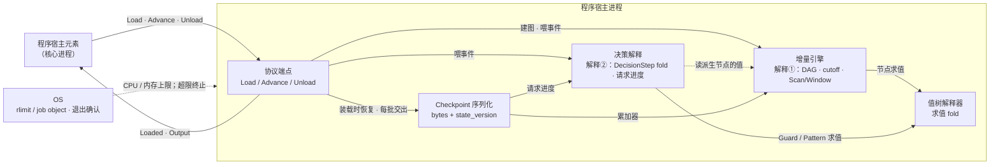
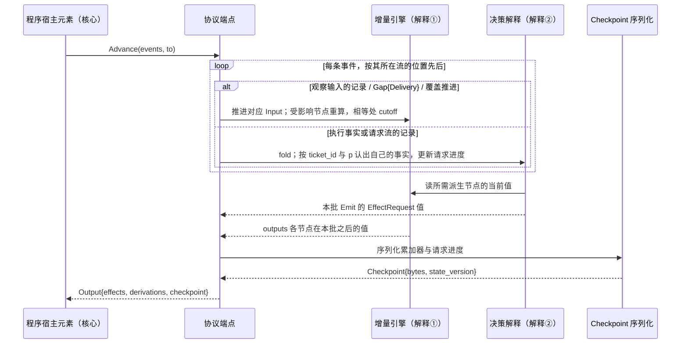

# 程序宿主进程

- **层级与元素**：C4 L2 container：程序宿主进程（core 系统的第二个容器）。上级文档：[core/design.md §4.1 容器](../design.md#41-容器)。
- **决定什么**：程序值在宿主进程里怎样被解释（派生与决策两种解释）、宿主进程内部拆成哪几个组件、宿主协议的每条消息在进程内怎样被满足、预算与 trap 在进程这一侧怎样成立。
- **读者**：实现宿主二进制的人；审查程序隔离前提的人。审批者：维护者。
- **状态**：已定。
- **非目标**：
  - 宿主协议 `Load` / `Advance` / `Unload` 的规格、装载期两段校验、活动集合与失败抑制、`Advance` 输出事务、预算检查与状态迁移的核心侧：都在 [program-host-element.md §4.6 宿主协议](../core-process/program-host-element.md#46-宿主协议) 及同文相关节，本文把它们当输入。
  - 值树的构造子全集与五个 fold：[core-process/design.md §3.12 组合子值树与五个 fold](../core-process/design.md#312-组合子值树与五个-fold)。
  - 程序值的类型（`Program`、`InputDecl`、`FactDecl`、`Output`）与输出记录的形状、`basis` 契约：[program-host-element.md §3.1 程序值](../core-process/program-host-element.md#31-程序值)、[program-host-element.md §3.3 输出契约与程序流](../core-process/program-host-element.md#33-输出契约与程序流)。
  - 可选行情派生计算子系统的内部；本文只写宿主进程怎样把 `Pooled` 与原生 op 当作值树里的节点求值。

证据标签与编号前缀的约定见 [README.md §0.4 阅读约定](../../README.md#04-阅读约定)。

## 1 分配给本容器的需求与它面对的域

### 1.1 分配的需求与契约

| 来源 | 内容 | 本容器承担的部分 |
|---|---|---|
| [README.md §2.1 H 假设 / 威胁模型](../../README.md#h-假设--威胁模型) H2 | 程序（AI 写的决策代码）不可信：会死循环、吃内存、超产意图、输出非法 | 进程是隔离单位；进程内不假设程序良好 |
| [README.md §2.3.3 推出的需求 C](../../README.md#233-推出的需求-c) C4 | 一个程序的 CPU / 内存 / 意图速率 / 状态大小有预算；超预算被隔离并报告；其他程序、账户、核心不受影响 | CPU 时间与内存由本进程承受的 OS 限制实现；意图速率与状态大小由核心在 `Output` 上检查（[program-host-element.md §4.6.4 预算](../core-process/program-host-element.md#464-预算)），本进程只如实交出 |
| [README.md §2.3.3 推出的需求 C](../../README.md#233-推出的需求-c) C14 | 程序状态带状态版本，不兼容时显式重置而非静默丢失 | `Checkpoint` 带 `state_version`，由本进程的序列化组件给出（§4.1） |
| [README.md §2.2 机器与域共享的现象](../../README.md#22-机器与域共享的现象) P12 | 程序：制品身份、输入声明、预算、状态版本、状态、trap、alert | 状态、trap 在本进程产生；其余由核心记下 |
| 宿主协议 | `Load(program, checkpoint?, budget) → Loaded{state_version}`、`Advance(events, to) → Output{effects, derivations, checkpoint}`、`Unload` | 本进程是协议的宿主一端（§4.2） |
| 两种解释的消费约束 | 解释①只消费观察输入；解释②另读执行事实输入与请求流；请求进度不进派生 DAG | 由本进程的两个解释组件分别遵守（§3） [core-process/design.md §3.4 两个类型宇宙与唯一边](../core-process/design.md#34-两个类型宇宙与唯一边) |

### 1.2 本容器直接面对的域

- **OS 进程机制**：进程退出由 OS 确认，子进程可由父进程终止 [证据：`investigation/rust-feasibility.md` §9，`Child` wait/kill 与按进程组 / job object 管理子进程树]。CPU 时间与内存能按进程设上限（POSIX 上 rlimit，Windows 上 job object）、超限由 OS 终止进程，是沿用旧设计的 [设计] 前提，不是已证的域性质：现有调查没有给出三个目标 OS 上的 CPU / 内存配额 API、预算粒度与超限行为的实测。这一前提是本容器能给出预算与 kill 语义的依据，由证伪 #3（§6.3）与验收 #15（§6.4）检验。
- **三个目标 OS**：macOS、Windows、Linux（[README.md §3.2 运行目标](../../README.md#运行目标)，H8）。宿主二进制是普通 Rust 程序，不依赖额外运行时。
- **程序作者**：AI；它写的程序值可能在求值时不终止、分配无界内存、每批产出大量请求、给出无法序列化的状态（H2）。
- **本进程接触不到的**：SQLite 文件、凭据封存文件与任何凭据、集成通道。它只经宿主协议与核心里的程序宿主元素交换值（C7、H2）。

### 1.3 共享现象（本容器边界）

| 方向 | 现象 | 说明 |
|---|---|---|
| 程序宿主元素 → 本进程 | `Load`：已核对内容 hash、已通过结构校验与声明校验的程序值，可交回的最近 `Checkpoint`（可无），预算 | 本进程不再校验，也没有拒绝装载的返回 |
| 程序宿主元素 → 本进程 | `Advance`：一批投递事件与交出之后的 cursor `to` | 事件三种：流上的记录、未确认的 `Gap{origin: Delivery}`、`await-all` 输入的覆盖推进 |
| 本进程 → 程序宿主元素 | `Loaded{state_version}`；`Output{effects, derivations, checkpoint}` | 都是值，不是调用 |
| 程序宿主元素 → 本进程 | `Unload` | 请求退出，超时后强制终止 |
| OS → 核心 | 本进程的退出（正常、超限被杀、崩溃） | 核心只凭 OS 确认判定存亡 |

## 2 驱动

- **Q25（程序超预算隔离）**，定义见 [README.md §3.1 质量场景](../../README.md#31-质量场景)。本容器的响应度量：死循环、超内存的程序在装载时声明的 CPU / 内存预算内被 OS 终止；进程终止不影响任何其他宿主进程与核心进程的响应度量。超意图速率与超状态大小的判定不在本进程（核心在 `Output` 上检查），本进程只需在每次 `Advance` 返回里如实给出全部 `effects` 与完整 `checkpoint`。
- **约束 K1**（独立进程、跨进程通讯为序列化文本或跨语言 RPC）：本容器是独立进程，与核心的消息走同一份 IDL（[core-process/design.md §4.2 对外接口总表](../core-process/design.md#42-对外接口总表)）。
- **可预算、可静态检查**：程序是封闭值树，不是黑盒函数（[core-process/design.md §3.12 组合子值树与五个 fold](../core-process/design.md#312-组合子值树与五个-fold)）。本容器不得引入使预算或静态检查失效的机制（例如在解释器里执行程序作者提供的任意代码）。原生 op 的代码只在可选子系统里运行，不在本进程里（§3.2）。

## 3 模型

### 3.1 宿主是解释器的宿主，不进入设计中心

- 程序值不编译：“编译单元”就是值代数的规范序列化形式（JSON 值树）。宿主二进制是随核心发布的值树解释器，同一版本的宿主二进制对同一程序值给出同一解释。[设计]
- 宿主进程只拥有进程内、可丢的状态：由程序值建出的求值结构、`Scan` / `Window` 的累加器、解释②的请求进度记账。跨宿主执行保留的只有 `Checkpoint`，它由核心与 cursor 同事务持久化（[program-host-element.md §4.6 宿主协议](../core-process/program-host-element.md#46-宿主协议)）。进程随时可被终止，终止不丢失任何已提交的事实。
- 同一个程序值有两种解释：观察半边是解释①（派生），决策半边是解释②（决策）。两者共用一个值，不共用状态（§3.4）。
- **术语**：`Program` 值 / 程序运行时。前者是 JSON 值树，由解释器解释；后者是本容器，受监督子进程，解释器的宿主。运行时的选择不改变值；预算靠宿主不靠类型。Wasm 若作替代宿主，走同一宿主协议（§6.1）。

### 3.2 解释①：派生

- `nodes` 建成增量 DAG，每次推进只重算受影响节点，节点输出按其类型的语义与上次相等时 cutoff 截断，下游不重算。[设计]
- **增量在节点粒度，不在算法内部**：哪些节点因输入变化重跑，由依赖决定；一个节点被触发时可以看它声明的完整窗口，输出相等时 cutoff 仍成立。记录渐进不要求算法渐进。[证据：fp-01 M3 Mu `Work_`；fp-05 案例 7 Incremental；域 B3/P2]
  - 不选：**增量在算法内部**：要求每个算子都给出增量版本，算子全集随之翻倍；节点粒度的 cutoff 已足够，且更简单。
- **输入 = 位置推进**：`Input(name)` 节点给出该输入流 cursor 之后交来的记录（含流上的 `Gap{origin: Source}` 等控制记录）；节点经字段访问器读其字段。输入按它声明的消费方式推进：`ordered` 逐条、`latest` 取最新，`await-all` 只在 `Advance` 交来的覆盖推进越过它的要求点时参与计算（[delivery.md §3.1 三种消费方式（投递侧）](../core-process/delivery.md#31-三种消费方式投递侧)）。覆盖只经 `Advance` 的覆盖事件得到，本进程不存它，也不写进 `Checkpoint`：每次 `Load` 之后的第一次 `Advance` 重新给出初始覆盖（[program-host-element.md §4.6 宿主协议](../core-process/program-host-element.md#46-宿主协议)）。
- **程序状态就是 `Scan` / `Window` 节点的累加器**，不另有状态声明；它们是可安全重算的数据状态。
- **输出**：`outputs` 声明的每个节点在这批推进之后的值随 `Output.derivations` 交回；未声明为输出的节点的值不交出。写成哪条记录（首值、改变、值相等不写）由核心的程序宿主元素按 [program-host-element.md §3.3 输出契约与程序流](../core-process/program-host-element.md#33-输出契约与程序流) 决定，本进程只交值。
- **`Window` 与 `Pooled{window}`**：两者都以窗口为入口，语义与物化策略不同。
  - `Window(Id, W)` 是本进程内按位置产出值的滑动窗口节点，输出是逐条值流，走普通增量 DAG；被 `outputs` 导出时交出的是它在这批推进之后的完整值。
  - `Pooled{input, window}` 把完整窗口物化为可借用的段视图交给原生 op；物化与原生 op 的运行在可选子系统里，本进程在 DAG 里把原生 op 的结果当作一个普通节点值读（[program-host-element.md §4.7 核心↔可选行情派生计算子系统](../core-process/program-host-element.md#47-核心可选行情派生计算子系统)）。
  - **术语**：窗口 / delta。窗口是触发时可见的完整 `LogPosition` 区间（`Pooled` 下在段池里物化为若干段的有序引用集，不向保留边界登记）；delta 是本次推进的增量记录。二者并存正因为记录渐进不要求算法渐进。

### 3.3 解释②：决策

- `rules`（`DecisionStep`：`On(Pattern, _)`、`Emit(EffectRequest)`、`Require(Guard, OnFail)`、`Expire(Id, _)`）解释为对日志的 fold。纯性由数据结构本身保证，不靠开发约定。[证据：fp-01 M7 Mercury Workflow]
- **唯一出口**：`Emit(EffectRequest{effect_kind, payload, basis})`。请求是值，不是调用；它随 `Output.effects` 交回，是否与何时被处理由核心的出站请求处理器决定（[outbound-requests.md §3.1 EffectRequest：唯一出口，请求是值](../core-process/outbound-requests.md#31-effectrequest唯一出口请求是值)）。请求不带调用方键。本进程没有任何写能力。
- **解释②读的输入**：`facts` 声明的执行事实输入与该程序自己的请求流（隐含输入），另可读派生节点的值。解释①的节点不消费执行事实与请求流。
- **请求进度跟踪**：程序对自己所发请求的记账——它发过哪些请求（在请求流上的位置由 `EffectRequest` 记录得知；程序按自己放进载荷的内容认出它们）、各自得到什么 `EffectResponse`、写请求之后的单据与尝试走到哪一步。解释②在进程内按自己的锚点（`Drafted(ticket_id)` 所指单据、`Close(Prepared(p))` 所给的 `p`）从执行事实输入里挑出属于自己的事实；请求流与 lane 流之间没有投递顺序，`Draft` 可能先于指向它的 `Drafted` 到达，按 `ticket_id` 两种次序都能匹配。本进程的投递接收不做关联，只按位置接收（[outbound-requests.md §6.1 权衡](../core-process/outbound-requests.md#61-权衡)）。
- 这份记账只是程序自己的，写进 `Checkpoint`；放行与否仍由核心按执行事实判定，它不是任何门的输入。
- **`Expire(t, k)` 的解释** [设计]：它按定义是一条定时器请求加一个等它响应的 `On`（[outbound-requests.md §3.1 EffectRequest：唯一出口，请求是值](../core-process/outbound-requests.md#31-effectrequest唯一出口请求是值)），决策解释用请求进度跟踪实现它，不另设机制：
  - **生效**：这一步每生效一次，求出 t（派生节点的当前值，类型为 UTC 时刻）；t 求不出值时这一次不生效、不发请求。求得时发出一条 `EffectRequest{effect_kind: timer, payload: {fire_at: t, tag}, basis}`，并在待触发集合里记下 tag → k。
  - **tag**：由解释器从 `Checkpoint` 里的一个计数确定性地生成，每发一条加一；作者不给 tag，两条规则的定时器不会撞号。
  - **绑定位置**：请求流上该程序的 `EffectRequest` 记录到达时，按载荷里的 tag 认出它，把待触发项绑定到这条记录的位置。
  - **触发**：请求流上 `EffectResponse.request` 指回已绑定位置、结果为 `Fired`，而该项仍在待触发集合里：先移除该项，再执行 k；移除、k 的输出与新 `Checkpoint` 随同一次 `Advance` 返回，由核心在同一输出事务里持久化。结果为 `NotCalled(InvalidRequest)`：移除该项，不执行 k。
  - **回调是值**：k 以值存在 `Checkpoint` 里（去函数化的回调），触发时按当时的状态与派生节点的值求值。
  - **没有取消**：已失效的定时器（例如它等的结果已先到）照样触发：待触发项还在，就照常移除并执行 k，由 k 自己判断是否还有事可做，“到时还没等到就放弃”写成 k = `Require(仍在等, …)`；待触发项已不在（不沿用旧状态的替换之后，状态里没有它）时，决策解释忽略它的 `Fired`。
  - 待触发集合是请求进度跟踪的一部分，写进 `Checkpoint`，不进派生 DAG；时间只以 `Fired` 这条记录进入本进程，本进程不读时钟。

### 3.4 不变量

| 不变量 | 由谁保证 |
|---|---|
| 请求进度跟踪不进入派生 DAG（无自反馈环） | 增量引擎的 height / cycle 约束：DAG 里没有从解释②状态出发的边 [证据：fp-05 案例 7⑤ / 9⑤；fp-01 M7] |
| 状态正交划分：`Scan` / `Window` 累加器归解释①，请求进度归解释② | 两个解释组件各自拥有自己的状态，`Checkpoint` 分两部分序列化（§4.1） |
| 本进程无写能力：Intent 是值，不是外部调用 | 进程只有一条通道，通向程序宿主元素；不持有凭据、不接触 SQLite 与集成 |
| 本进程不做需要核心状态的校验，也不拒绝装载 | `Load` 只交来已通过两段校验的值（[program-host-element.md §4.2 装载期校验](../core-process/program-host-element.md#42-装载期校验)） |
| 跨宿主执行的程序状态只经 `Checkpoint` | 进程内状态在进程退出时全部丢弃；`Load` 是唯一恢复入口 |
| 同一批投递事件、同一 `Checkpoint` 给出同一 `Output` | 两种解释是纯语义；本进程不读时钟、不读随机源、不读投递事件之外的输入。程序看得到的时间只有记录上的：输入记录的记录时间，与请求流上定时器请求的 `Fired`（§3.3） |

- 不选：**黑盒函数 `(State, Input) -> (State, Output)` 作程序**：见 [core-process/design.md §3.12 组合子值树与五个 fold](../core-process/design.md#312-组合子值树与五个-fold)；本容器因此只需一个解释器，不需要执行任意代码。

## 4 结构

### 4.1 组件

| 组件 | 拥有 | 隐藏的决定 | 假设 |
|---|---|---|---|
| 协议端点 | 与程序宿主元素的唯一通道；消息的反序列化与回答 | 线缆编码之下的消息循环 | 每条请求一个回答；`Load` 之前不收 `Advance` |
| 值树解释器 | 五个 fold 中的“求值”在本进程的实现 | `dyn` 分发与求值开销的实现选择 | 程序值已通过结构校验（`Id` 不越界、无环） |
| 增量引擎 | 由 `nodes` 建出的 DAG、每个节点的当前值、`Scan` / `Window` 累加器 | 重算调度、cutoff 判定、依赖跟踪的数据结构（例如 `salsa` / differential 一类引擎） | 输入只来自 `Input` 节点与原生 op 的结果；DAG 无环 |
| 决策解释 | `rules` 的 fold 状态与请求进度跟踪 | 模式匹配与锚点关联的实现 | 执行事实与请求流按位置交来，两流之间无序 |
| `Checkpoint` 序列化 | `Checkpoint{bytes, state_version}` 的格式 | 字节布局；`state_version` 与格式的对应 | 核心把 `bytes` 当作不透明值存取 |

- 值树解释器与增量引擎是两件事：前者回答“一个节点对给定输入的值是什么”，后者回答“这批推进之后哪些节点要重新问”。把它们分开，求值 fold 就能与核心进程里规则、检查项、处理器的求值共用同一份解释器代码（[core-process/design.md §3.12 组合子值树与五个 fold](../core-process/design.md#312-组合子值树与五个-fold)），增量调度只属于本进程。
- `state_version` 标识 `bytes` 的格式。它由宿主二进制的版本决定；核心据装载成员的 `Applied` 所记的接受集合判定能否交回（[program-host-element.md §4.5 Reset 与状态迁移](../core-process/program-host-element.md#45-reset-与状态迁移)）。本进程在 `Loaded{state_version}` 与每个 `Output.checkpoint` 里如实给出，不自行迁移旧格式。

### 4.2 宿主协议在进程内怎样被满足

规格见 [program-host-element.md §4.6 宿主协议](../core-process/program-host-element.md#46-宿主协议)。本节只写进程内的动作。

| 消息 | 进程内动作 | 回答 |
|---|---|---|
| `Load(program, checkpoint?, budget)` | 协议端点把 `program` 交给增量引擎建 DAG、交给决策解释建规则 fold；带 `checkpoint` 时由序列化组件还原累加器与请求进度，不带时两者取初值 | `Loaded{state_version}`；不校验，不拒绝 |
| `Advance(events, to)` | 按事件在每条流上的先后逐条喂给两个解释：观察输入的记录与投递缺口、覆盖推进进入增量引擎，执行事实与请求流的记录进入决策解释；喂完之后求出 `outputs` 各节点的当前值，收集这批 `Emit` 的请求，序列化新 `Checkpoint` | `Output{effects, derivations, checkpoint}`；每次都带新 `Checkpoint` |
| `Unload` | 退出进程 | 无；核心以 OS 确认退出为准 |

- `to` 由核心定、只由核心使用：本进程不据它丢弃或重排事件。事件里流与流之间不定次序，两种解释都不依赖跨流次序给出确定结果以外的保证：满足 [program-host-element.md §3.3 输出契约与程序流](../core-process/program-host-element.md#33-输出契约与程序流) 所述 (a)(b) 两条的程序，结果与分批无关；其余程序的值还取决于跨流交错次序，设计写明这种依赖，不另定次序。
- 投递缺口 `Gap{origin: Delivery}` 与流上的 `Gap{origin: Source}` 都作为输入交给程序，由程序值自己决定怎样对待；本进程不伪造连续。

### 4.3 进程、部署与持久化视图

- **一程序成员一次宿主执行一个进程**：活动集合里的每个程序，在每个核心实例里至多一个宿主进程；由核心拉起并登记进程表；它在程序成员与核心实例两者之内开始与结束（[core-process/design.md §4.7 进程视图与生命周期](../core-process/design.md#47-进程视图与生命周期)）。
- **预算落点**：CPU 时间与内存按 `Load` 所带的预算设为本进程的 OS 限制（rlimit / job object）；意图速率、状态大小与 `checkpoint` 的版本由核心在 `Output` 上检查。
- **持久化**：无。本进程不写任何文件；`Checkpoint` 的持久化与 cursor 同事务，由程序宿主元素编排（[core-process/design.md §4.3.5 同事务集合](../core-process/design.md#435-同事务集合)）。
- **信任**：同一 OS 用户内的受监督子进程（[core/design.md §4.3 部署与信任](../design.md#43-部署与信任)）；它对程序不可信的防护是进程边界与 OS 限制，不是同用户进程之间的访问控制。

## 5 走查

每步：输入 → 经过的组件 → 输出 → 行动者 / 恢复者。组件级主 trace 在 [core-process/design.md §5.1 W10（Q25）程序超预算隔离](../core-process/design.md#w10q25程序超预算隔离) 与 [core-process/design.md §5.1 W17 程序 Emit 读处理器（fetch.bars）闭环走观察侧](../core-process/design.md#w17-程序-emit-读处理器fetchbars闭环走观察侧)，本节是它们在本进程内的细化。

### 5.1 一轮 `Advance`（W17 的宿主细化）

主 trace：[core-process/design.md §5.1 W17](../core-process/design.md#w17-程序-emit-读处理器fetchbars闭环走观察侧)。

1. 程序宿主元素交来一批事件（例：`fetch.bars` 读请求的 `EffectResponse` 与它指向的观察记录，分别在请求流与观察输入流上）。→ 协议端点按流内先后喂入。
2. 观察记录进入增量引擎，受影响的 `Scan` / `Window` 与下游节点重算，未变节点截断。→ 节点新值。
3. `EffectResponse{Concluded}` 进入决策解释，请求进度把该请求记为已有结论；规则 `On(...)` 满足时 `Emit` 新请求。→ 请求值。
4. 求出 `outputs` 各节点的值，序列化新 `Checkpoint`，交回 `Output`。→ 行动者：本进程；持久化与分派由核心在其后完成。
- 走通。本进程的每步都只用投递事件与 `Checkpoint`，没有需要核心状态的判断。

### 5.2 `Load` 与跨重启续跑（W10 变体的宿主细化）

主 trace：[core-process/design.md §5.1 W10](../core-process/design.md#w10q25程序超预算隔离)。

1. 核心重启第 5 步或重新装载：程序宿主元素拉起本进程，交来程序值、可交回的最近 `Checkpoint` 与预算。→ 协议端点建 DAG 与规则 fold，序列化组件还原状态。
2. 第一次 `Advance` 先带每个 `await-all` 输入的初始覆盖，再带 cursor 之后的记录。→ 增量引擎从还原的累加器继续；覆盖不来自 `Checkpoint`。
3. 程序因此不会看到已折入状态的记录，也不重复 `Emit`：cursor 与 `Checkpoint` 同事务持久化（验收 #16，[program-host-element.md §6.4 验收 #16](../core-process/program-host-element.md#64-验收)）。
- 不带 `Checkpoint` 的 `Load`（首次装载、`Reset`）：累加器与请求进度取初值。
- 走通。

### 5.3 超预算与 trap（W10 的宿主细化）

主 trace：[core-process/design.md §5.1 W10](../core-process/design.md#w10q25程序超预算隔离)。

1. **死循环**：某节点求值不终止。→ CPU 时间达到 OS 限制，OS 终止本进程。→ 核心观察到异常退出，按 trap 处理（同事务 `ProgramHalted{Trap}` 或 `Budget(kind)` 与 `ProgramFailed`，[program-host-element.md §4.6.4 预算](../core-process/program-host-element.md#464-预算)）。
2. **超内存**：分配超过 OS 内存限制。→ OS 拒绝分配或终止进程；进程异常退出。→ 同上。
3. **超意图速率 / 状态过大**：本进程照常交回 `Output`。→ 核心检查不过，`Output` 整个不持久化，按预算处理，然后终止本进程。
4. **`Advance` 迟迟不答**：核心的时限到，视同 trap 并终止本进程。
5. **`Checkpoint` 版本不被本成员接受**：核心视同 trap。
- 恢复者都是核心；本进程终止后没有要清理的持久状态。其他宿主进程是独立进程，不受影响。崩溃矩阵 #10、#16 的核心侧处置见 [core-process/design.md §5.2 崩溃矩阵（#1–#21）](../core-process/design.md#52-崩溃矩阵121)。
- 走通，以 §1.2 的 [设计] 前提为条件：OS 能按进程限制 CPU / 内存并在超限时终止；它在三个目标 OS 上是否成立由验收 #15 实测，不成立即命中证伪 #3。

### 5.4 程序规则时限（W1、W17 时限变体的宿主细化）

主 trace：[core-process/design.md §5.1 W1（Q1）正常下单闭环](../core-process/design.md#w1q1正常下单闭环)、[core-process/design.md §5.1 W17](../core-process/design.md#w17-程序-emit-读处理器fetchbars闭环走观察侧)；程序宿主元素一侧的细化在 [program-host-element.md §5.6 程序规则时限（W1、W17 的时限变体）](../core-process/program-host-element.md#56-程序规则时限w1w17-的时限变体)。

1. 一次 `Advance` 里决策解释走到 `Expire(t, k)`：向增量引擎读 t 的当前值（例如某输入最近一条记录的记录时间 + 30 s），得 UTC 时刻；从 `Checkpoint` 的计数取 tag 7，记下 7 → k，收集 `EffectRequest{timer, {fire_at: t, tag: 7}}` 进本批 `effects`。→ `Output` 带着新 `Checkpoint`（计数与待触发项都在里面）。
2. 之后某批事件里有请求流上本程序 tag 7 的 `EffectRequest` 记录：决策解释把 7 绑定到它的位置。
3. 之后没有任何输入，本进程不被调度，也不需要被调度。
4. 核心墙钟到 t 之后，某批事件里有 `EffectResponse{request: 该位置, Fired}`：决策解释从待触发集合移除 7，执行 k，收集 k 的输出。→ `Output`。
5. 变体：第 4 步之前 k 等的结果已先到：7 仍在待触发集合里，`Fired` 到达时照常移除 7、执行 k，k 里的 `Require(仍在等, …)` 不成立，这一步不再做事。本进程由不沿用旧状态的替换装载、集合为空时：`Fired` 到达时忽略。
6. 变体：第 1 步 t 求不出值：这一步不生效，不发请求，不记待触发项。
- 走通。本进程的每步都只用投递事件与 `Checkpoint`；改变本进程能读到的时钟不改变任何 `Output`。

## 6 评估

### 6.1 替代方案

**程序隔离运行时：受监督子进程 vs Wasm。**

- 选中：受监督子进程。每程序一个宿主进程，预算由 OS 进程机制限制，状态经宿主协议以 `Checkpoint` 显式序列化，不依赖运行时快照。
- Q 场景后果：Q25：三 OS 上无需额外运行时即可构建与运行；超预算即 OS 终止进程、核心记失败观察。
- 不选：Wasm（wasmtime）作初始宿主。[证据：`investigation/rust-feasibility.md:133-139`；同报告 `:117-119,131`]
  - Wasmtime 48.0.2 没有 live `Store` 快照 / 恢复 API；Wizer 只快照初始化，`Module::serialize` 只保存编译产物。
  - fuel 是确定性指令预算，epoch 不确定，二者都管不住阻塞的 host 调用；Component Model async ABI 尚不完整。
  - 三 OS 开箱即用未证：作为普通 Rust 依赖即可构建运行、预算与 trap 语义一致、独立二进制无平台差异，都没有证据。
  - 这些是能力缺口，足以不选它作初始宿主。它可作实现阶段的替代宿主，走同一宿主协议，不改设计。

**增量的粒度**：见 §3.2（节点粒度；不选算法内部增量）。

### 6.2 风险、敏感点、权衡

- **风险：受监督子进程作为唯一宿主。** 预算靠 OS 进程机制，粒度粗于 Wasm fuel：CPU 超限要到 OS 计时的粒度才被发现。影响 Q25 “超预算被隔离”响应的及时性，不影响其成立。
- **敏感点：每程序一个进程。** 程序数 M 决定进程数；进程开销随 M 线性增长。换取的是故障域与预算的逐程序隔离。
- **权衡：`Checkpoint` 每批全量交回。** 每次 `Advance` 都带新 `Checkpoint`，状态越大每批序列化越贵；换取的是任何时刻崩溃都能从与 cursor 同事务的状态续跑。状态大小受预算约束。

### 6.3 证伪条件

3. **程序隔离前提**：受监督子进程在某个目标 OS 上无法给出 CPU / 内存 / 意图速率预算与 kill 语义（验收 #15）→ “预算靠宿主”与 C4 隔离前提被推翻，宿主须换为进程外沙箱或放弃不可信程序前提。

### 6.4 验收

15. **宿主预算与隔离**：在三个目标 OS 上，死循环、超内存、超意图速率的程序分别在声明预算内被 kill，并在同一事务留下 `ProgramHalted` 与失败观察；同宿主协议下其他程序、账户、核心的响应度量不变。（对应 Q25）
