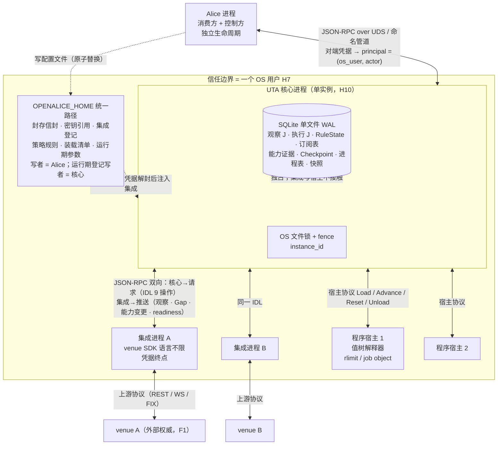
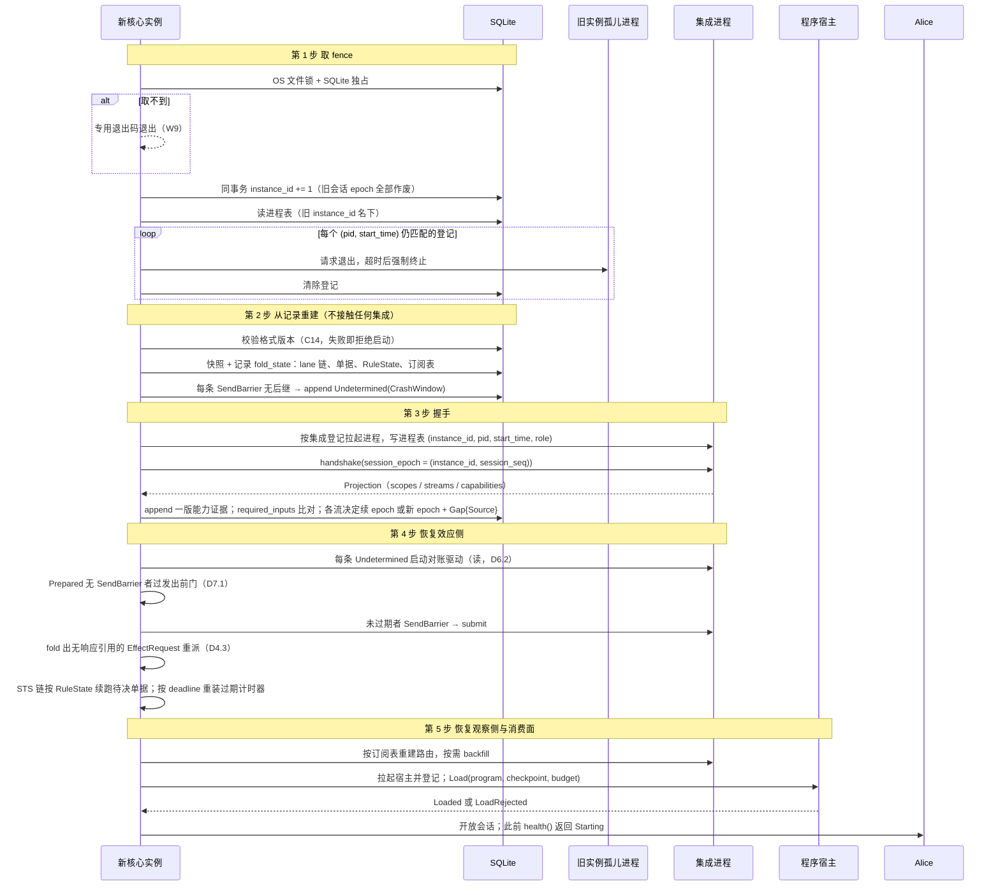
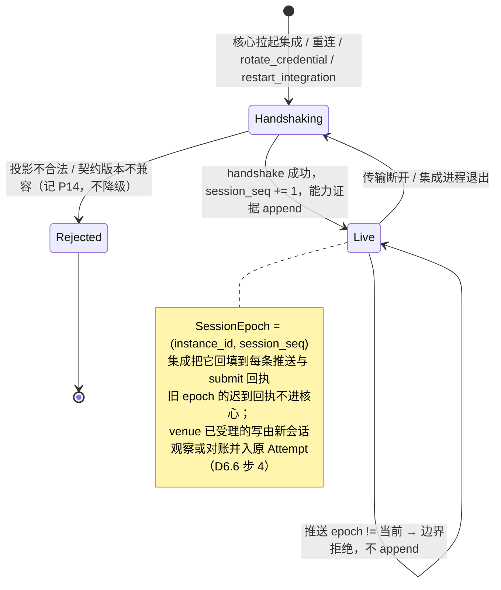
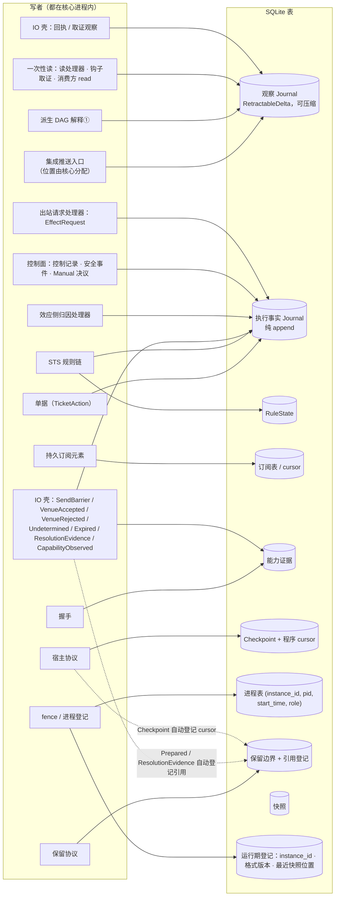

# 01 进程拓扑、启动、会话 epoch、持久化归属

对照：§6.1、§6.3.6、§6.7。索引见 `README.md`。

## D1.1 进程拓扑与信道

对照：§6.1（进程、信任边界、凭据链、传输）、§6.7.1（单写者）。

读法（假想运行时）：

- 三类子进程都由核心拉起、登记在进程表，各自可以独立崩溃：集成崩了只影响它的流与在途 `submit`（D7.1）；宿主崩了只影响该程序（D4.2）；核心崩了子进程成孤儿，下次启动按进程表回收（D1.2）。
- 所有 RPC 语义在一份 IDL；Windows 只换信道（回环 + 令牌或命名管道），不换 IDL。
- 凭据只走 `文件 → 核心 → 集成` 一条链；Alice、程序、宿主从不见凭据本体。

核出：无。

## D1.2 启动五步

对照：§6.1"启动与接管的顺序"第 1–5 步；§5.4 恢复；§7.2 #15/#21。

读法：

- 第 2 步的结论只来自记录：`Undetermined(CrashWindow)` 在没有任何集成在线时就已 append；随后第 4 步才去问 venue。
- 第 4 步先取证后发送：已能 `Resolved` 的 lane 先解除，再放未发出的 `Prepared`；发送依赖第 3 步的会话 epoch。
- 任一步失败整体拒绝启动，不进入部分运行态；消费方在第 5 步之前只看到 `Starting`。

核出：第 4 步原文只写了取证与发送，没写 `EffectRequest` 重派与待决单据的计时器重装——已并入 §6.1 第 4 步。

## D1.3 会话 epoch 与边界接受

对照：§6.1 第 3 步、§6.3.6（推送错误列）、§6.3.10 readiness、§6.7.3 `rotate_credential`。

读法：

- 会话 epoch 与流 epoch 独立：重连后集成若能以 venue 游标证明续接，流 epoch 不变、`Seq` 接续；证明不了才开新流 epoch（D3.2）。
- `rotate_credential` 强制新流 epoch（`credential_rotated`），不允许续接。

核出：无。

## D1.4 持久化归属：谁写哪张表

对照：§6.7.2 持久化归属表；§6.2"执行事实 append 链的唯一写入口"。

读法：

- 观察 J 有四类写者，执行 J 有七类；两侧共享存储原语但类型宇宙不共享（§3.1）。
- 读模型不写任何表：它是执行 J（+ 归因观察）的只读 fold，随请求或订阅计算。
- 引用登记不是独立写者动作：随 `Prepared`/`Checkpoint`/`ResolutionEvidence` 的 append 自动写入，随 `Resolved`/下一 checkpoint 自动解除（D8.1）。

核出：无。

## D1.5 同事务集合

对照：§6.7.1 事务原子性；§5.2 与写边界的接口；§5.4 记录模型；§6.5 `Advance`；§6.1 第 1 步。

| 同一 SQLite 事务内必须一起提交 | 依据 | 崩在中途的后果（§7.2） |
|---|---|---|
| `Close(Prepared(position))` + `Prepared` | §5.2、§6.7.1 | #1：二者皆无，单据仍 `AwaitingDecision` |
| Decision / `Outcome` / `Rejection` 记录 + `RuleState` 更新 | §6.7.1 | 链步未发生，重启按 `RuleState` 重跑该步 |
| 程序写处理器的 `Draft` + `SubmitForDecision` | §5.1 | #21：无 `Draft` 引用 → 重派开单 |
| `submit` 的 `Ack`：回执观察记录 + `VenueAccepted(venue_order_id, receipt)` | §5.4 记录模型 | #5：视为无后继 → `Undetermined` → by-key 取证重得同一回执 |
| 一次取证：`provenance: Reconciliation` 观察记录 + `ResolutionEvidence` | §5.4 | #7：该次取证不存在，下一轮重做（读可重试） |
| 推送归因命中：观察记录 + `ResolutionEvidence{Attributed}` | §5.4、§6.3.3 | 推送未 append，集成按 cursor 语义重推 |
| `Undetermined` append + 回查已到达的归因观察 | §5.4 | 二者同事务，不存在"归因已到但未匹配"的持久态 |
| `Advance` 输出：`EffectRequest` 记录 + 派生记录 + `Checkpoint` + 程序 cursor | §6.5 | #16：整批不存在，重放同一批记录 |
| fence 取得 + `instance_id += 1` | §6.1 第 1 步 | 未提交则旧 `instance_id` 仍有效，重来 |
| 单条观察 append + `LogPosition` 分配 | §6.7.1 | #9：半写不可见 |

读法：`SendBarrier` 不在任何集合里——它单独 durable append（fsync）后才允许 `submit`，这正是把崩溃窗口二分的屏障（D6.1）。

核出：无。
