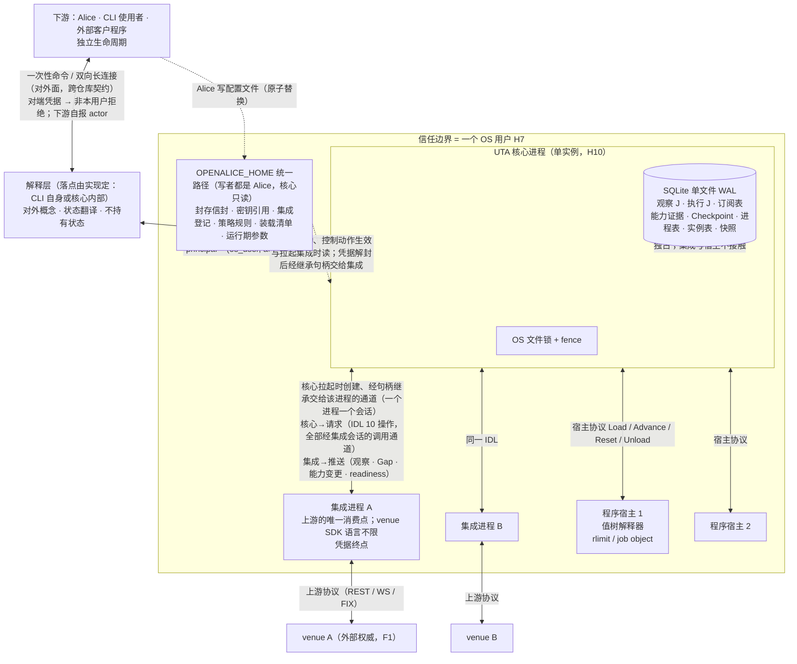
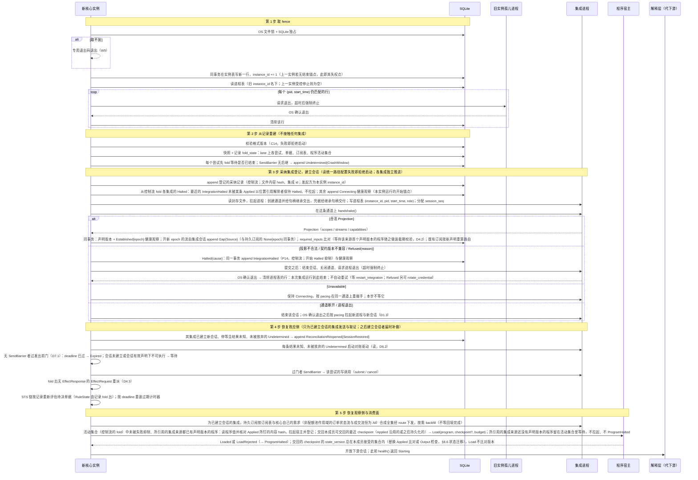
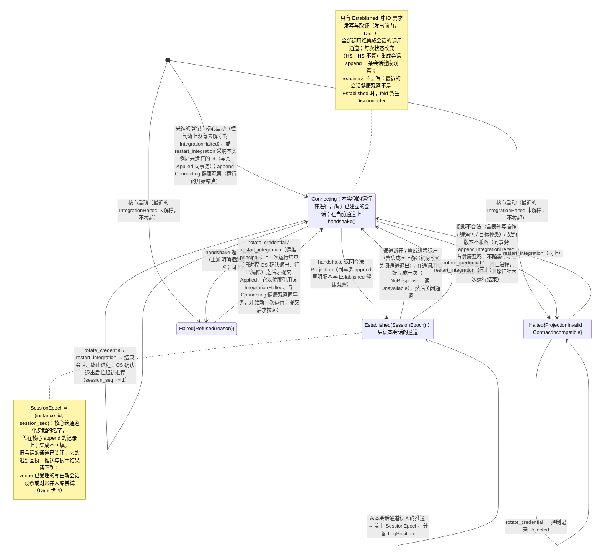
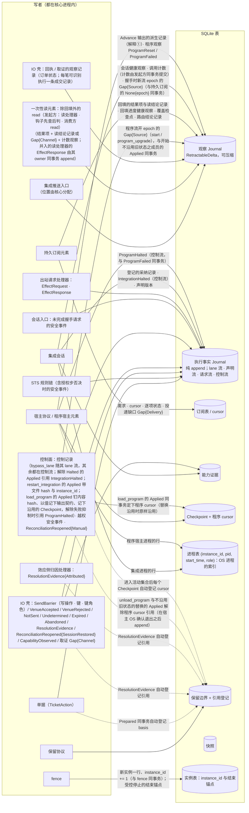
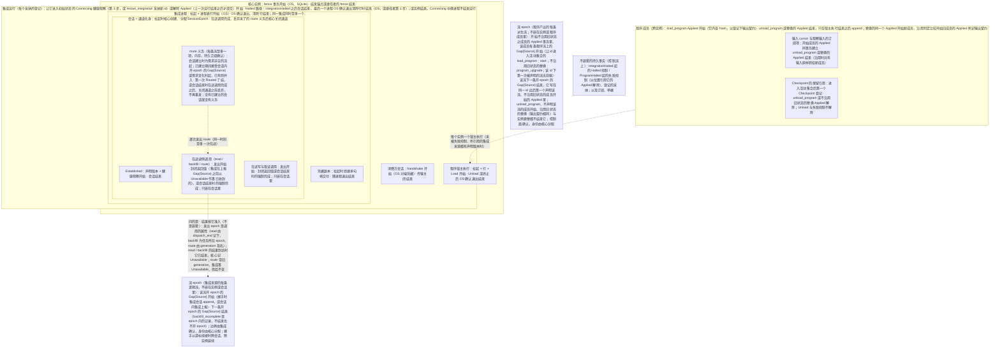
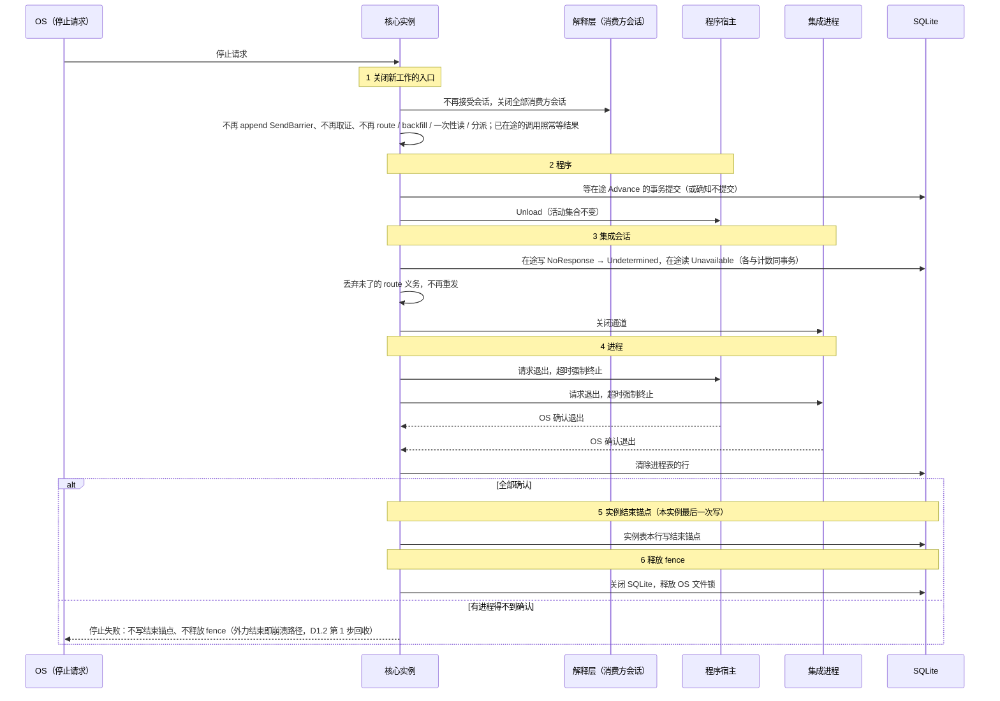

# 01 进程拓扑、启动、会话 epoch、持久化归属

对照：§0.1、§7.1、§7.2、§7.4、§7.5、§8.3。索引见 `README.md`。

## D1.1 进程拓扑与信道

对照：§0.1（权威在上游，上游只在集成内被消费；三段：清洗、抽象、清洗）、§7.1（进程、信任边界、凭据链、传输）、§7.3（核心→集成调用全部经集成会话的调用通道）、§8.5（principal、核心↔解释层）、§7.4（单写者）、§7.6（配置文件）。

读法（假想运行时）：

- 两类子进程（集成、程序宿主）都由核心拉起、登记在进程表，各自可以独立崩溃：集成崩了只影响它的流与在途写调用（D7.1）；宿主崩了只影响该程序（D4.2）。核心受控停止时先结束它们、OS 确认退出之后才写实例结束锚点（D1.6）；核心崩了子进程成孤儿，下次启动按进程表回收（D1.2）。
- 核心↔集成的通道由核心在拉起时创建、只交给该子进程；会话就是这条通道的一次化身，通道关闭之后读不到它的任何消息（§7.1、§7.2）。核心↔解释层的 Windows 信道退化为回环 + 令牌或命名管道，不换 IDL。下游只见解释层的对外面，不见这份 IDL。
- 凭据只走 `文件 → 核心 → 集成` 一条链，拉起时交付，副本随集成进程结束；下游、解释层、程序、宿主从不见凭据本体。
- 解释层不持有状态：它或下游崩溃，对核心只是会话断开，订阅与确认进度仍在核心。

核出：无。

## D1.2 启动五步

对照：§7.2 生命周期表与启动第 1–5 步；§6.7 恢复；§9.2 #15/#21。

读法：

- 第 2 步的结论只来自记录：`Undetermined(CrashWindow)` 在没有任何集成在线时就已 append；随后第 4 步才去问 venue。上一实例受控停止时，第 1 步没有要回收的行，第 2 步没有无后继的 `SendBarrier`。
- 第 4 步先取证后发送：等待已结束的尝试先移出阻塞头集合，再放未发出的 `Prepared`；发送与取证都依赖该集成已建立的会话，尚无会话的集成其尝试在发出前门等会话建立（或 `deadline` 到期）。
- 失败分两级：取不到 fence、格式版本 / 迁移 / 重建失败、统一路径配置读不出，整体拒绝启动，不进入部分运行态；单个集成 `Connecting` 或 `Halted`、单个程序装载失败、被失败抑制或等待所引用集成来源的首个声明版本，只使该单元不可用，其余照常启动。`Halted` 与程序的失败抑制跨核心重启保持：它们来自控制流上的执行事实 `IntegrationHalted`、`ProgramHalted`，不来自可压缩的观察记录。消费方在第 5 步之前只看到 `Starting`。
- 旧实例的 readiness 不另写：第 3 步的 `Connecting` 记录之后，readiness 由 fold 派生为 `Disconnected`，直到新会话 `Established`（§8.4）。

核出：第 4 步原文只写了取证与发送，没写 `EffectRequest` 重派与待决单据的计时器重装——已并入 §7.2 第 4 步。

## D1.3 集成的会话状态与会话的通道

对照：§7.1 核心创建的通道、§7.2 第 3 步（会话状态、转移表、会话 epoch）、§7.3 集成会话、§8.2 `handshake`、§8.3（推送、会话中吊销身份）、§8.4 readiness 与健康、§7.6 `rotate_credential`。

读法：

- 一个集成进程恰有一个会话（一条通道）；会话在进程之内结束，进程在 OS 确认退出之后才让位给下一个。上游暂时不可达只在同一通道上重握手，不换进程。
- 会话 epoch 与流 epoch 独立：重连后集成若能以 venue 游标证明续接，流 epoch 不变、`Seq` 接续；证明不了才开新流 epoch（D3.2）。
- `rotate_credential` 强制新流 epoch（`credential_rotated`），不允许续接。
- `Connecting` 会自己恢复，两种 `Halted` 只由运维动作解除，核心重启不解除（它来自执行事实 `IntegrationHalted`，解除的 `Applied` 以位置引用它）；健康面把二者分开给出。`Halted` 记的是核心不再自动握手的决定，进程的结束另由 OS 确认。
- 会话结束时在途调用先恰好完成一次，再关闭通道，已完成的调用不会被迟到回应再完成，也不再计数（§7.2 第 3 步）。
- 重握手后不再声明的流：选中它的订阅对该流挂起（原因 `StreamUndeclared`），流再被声明时恢复；断连与 `Halted` 不使订阅挂起（§8.2）。

核出：无。

## D1.4 持久化归属：谁写哪张表

对照：§7.5 持久化归属表；§7.3“执行事实 append 链的唯一写入口”。

读法：

- 观察 J 有七类写者（含一次性读元素的读结果、集成会话的会话健康观察与握手时的新 epoch `Gap{Source}`、持久订阅的回填结果、回填进度与路由结论、程序宿主元素写的派生记录与程序观察、控制面的程序流开 epoch 的 `Gap{Source}`），执行 J 有九类（含会话入口的安全事件、集成会话的采纳记录、声明版本与 `IntegrationHalted`、程序宿主元素的 `ProgramHalted`）；两侧共享存储原语但类型宇宙不共享（§4.1）。采纳记录、`IntegrationHalted`、`ProgramHalted` 与除 `bypass_lane` 外的控制记录都在一条控制流上（§7.3），采纳集合、`Halted`、活动集合与失败抑制都只按这条流上的位置 fold。
- 进程表有两个写者，按 `role` 分行：集成会话写集成进程的行，程序宿主元素写宿主进程的行（§7.5）。
- 读模型不写任何表：它是按种类对执行 J、观察 J 的只读 fold（`subscriptions` 读订阅表当前态，§8.5），供 `read_model` 读取。
- 引用登记不是独立写者动作：随 `Prepared`/`Checkpoint`/`ResolutionEvidence` 的 append 自动写入，随尝试等待结束（结果确立、`Expired`、`Abandoned`）、下一 checkpoint、`unload_program` 或不沿用旧状态的替换自动解除（D8.1）。
- 核心不写统一路径下的任何文件（§7.6）。

核出：无。

## D1.5 同事务集合

对照：§7.4 事务原子性；§6.1 请求完成事实；§6.2 与写边界的接口；§6.5 记录模型；§8.6 `Advance` 与失败抑制；§7.2 第 1、3 步与受控停止。

| 同一 SQLite 事务内必须一起提交 | 依据 | 崩在中途的后果（§9.2） |
|---|---|---|
| `Close(Prepared(position))` + `Prepared` | §6.2、§7.4 | #1：二者皆无，单据仍 `AwaitingDecision` |
| Decision / `Outcome` / `Rejection` 记录 | §7.4 | 链步未发生，重启按记录重新求值该步（`RuleState` 由记录 fold 出，§6.3） |
| 程序写处理器的 `Draft` + `SubmitForDecision` + `EffectResponse{Drafted}` | §6.1 | #21：无 `EffectResponse` → 重派开单 |
| 读处理器的结果项与读结论记录 / `Gap{Channel}` + `EffectResponse{Concluded / Unavailable}` | §6.1 | #21：无 `EffectResponse` → 重新执行一次 |
| 写调用（`submit` / `cancel`）的 `Ack`：`VenueAccepted`（含 `Evidence`）+ 该回应的观察记录（订单状态；每笔可识别执行一条成交记录）+ 该调用的计数健康观察 | §6.5 记录模型、§8.4 | #5：视为无后继 → `Undetermined` → by-key 取证重得同一状态 |
| 写调用返回 `NotSent`：`NotSent` 记录 + 该调用的计数健康观察 | §6.5、§8.4 | 视为无后继 → `Undetermined(CrashWindow)`（保守） |
| 一次取证命中：`ResolutionEvidence{Found}`（含 `Evidence`）+ `provenance: Reconciliation` 的该回应观察记录 | §6.5 | #7：该次取证不存在；fold 显示本轮该渠道未取证，重做（读可重试） |
| 推送归因命中：观察记录 + `ResolutionEvidence{Attributed}` | §6.6、§8.1 | 推送未 append：核心崩溃即集成成孤儿被回收，重启握手后该流续接（集成以 venue 游标证明）或新 epoch + `Gap{Source}`；续接则记录重到，仍处 `Undetermined` 且结果未知的尝试照常归因 |
| `Undetermined` append + 回查已到达的归因观察 | §6.6 | 二者同事务，不存在"归因已到但未匹配"的持久态 |
| `Advance` 输出：`EffectRequest` 记录 + 派生记录 + `Checkpoint` + 程序 cursor | §8.6 | #16：整批不存在，从同一组已提交 cursor 重新推进 |
| fence 取得 + 实例表新一行（`instance_id += 1`） | §7.2 第 1 步 | 未提交则旧 `instance_id` 仍有效，重来 |
| 单条观察 append + `LogPosition` 分配 | §7.4 | #9：半写不可见 |
| 调用结果的记录（回执、取证、读结论、`Gap{Channel}`、`Undetermined`）+ 该调用的计数健康观察 | §7.3、§8.4 | 二者皆无：调用结果未落，计数不前进；不存在“计了数却无结果”的持久态 |
| 握手成功：声明版本 + `Established` 健康观察 + 开新 epoch 的流的 `Gap{Source}` 与各自的 `None{epoch}` 回填进度 | §7.2 第 3 步、§8.2 `handshake`、§8.4 | 二者皆无：会话未建立，重启后在新进程的新通道上再握手 |
| `IntegrationHalted` + `Halted` 健康观察（进程的终止在提交之后，另由 OS 确认） | §7.2 第 3 步 | 二者皆无：仍在上一状态，重启按执行事实重判；已提交而进程未确认退出：继任实例第 1 步回收 |
| 解除 `Halted` 的控制记录 `Applied`（引用 `IntegrationHalted`）+ `Connecting` 健康观察；只在上一次集成运行结束（进程 OS 确认退出、行已清除）之后提交 | §7.2 第 3 步 | 二者皆无：仍 `Halted`，没有握手发生 |
| `restart_integration` 采纳本实例尚未运行的 id：`Applied`（带文件 hash 与 `instance_id`）+ `Connecting` 健康观察 | §7.2 第 3 步、§8.5 | 二者皆无：该 id 不在采纳集合里，没有运行、没有进程 |
| `load_program` 的 `Applied`（钉内容 hash、以值记下输出契约、记下沿用的 `Checkpoint`）+ 程序全部输入的 cursor 与观察输入的订阅项；让 id 进入活动集合的（首次装载、卸载之后再装载）另加新成员每条程序流新 epoch 的 `Gap{Source, start}`；替换不沿用旧状态时（`cold_start`、不接受旧 `state_version`，或开始旧成员的 `Applied` 所记的输出契约与新成员的不同）另加 `ProgramReset`、新成员每条程序流新 epoch 的 `Gap{Source, program_upgrade}`、旧保留引用的解除；新成员不声明的流不写记录 | §8.5、§8.6 卸载与替换、程序流的 epoch | 二者皆无：id 不在活动集合里的，程序仍不在集合里，程序流没有新 epoch；替换的，旧成员照旧（替换时旧宿主已结束，重启照常装载旧成员）；已提交：按 `Applied` 所记沿用或不携带装载，不重复 `Reset`，不再开 epoch |
| `unload_program` 的 `Applied` + 程序 cursor 与观察输入订阅项的结束 + 保留引用的解除（宿主已 OS 确认退出之后）；程序流上不写记录，它的 epoch 不结束 | §8.6 卸载与替换 | 二者皆无：程序仍在活动集合里，重启照常装载 |
| `ProgramHalted` + `ProgramFailed` 观察（宿主的终止在提交之后） | §8.6 | 二者皆无：重启时程序仍在活动集合里且未被抑制，按 `Checkpoint` 重新装载；超预算或 trap 若再发生，再记一次 |

读法：`SendBarrier` 不在任何集合里——它单独 durable append（fsync）后才允许该尝试的写调用，这正是把崩溃窗口二分的屏障（D6.1）。

核出：无。

## D1.6 生命周期嵌套与受控停止

对照：§7.2 生命周期表、会话结束时在途调用恰好完成一次、受控停止；§7.1 凭据链与核心创建的通道；§8.2 `route` 的 `generation` 与谁调、何时调，§8.3 上报 gap 之前先完成已收到的调用、§8.4 会话内开的新流 epoch；§8.5 会话的生命周期；§8.6 程序的活动集合与失败抑制、卸载与替换、程序流的 epoch。

读法：

- 每层都在外层之内开始、在外层之前结束；每个锚点都有确认者。持久事实（`Halted`、失败抑制、采纳、订阅、单据）不嵌在实例里，由记录的 fold 跨实例恢复；前三者都在控制流上，按这条流上的位置 fold。
- 流 epoch 也不嵌在实例或会话里：集成来源的流，握手以游标续接时它跨会话、跨实例延续，只由下一条开 epoch 的 `Gap{Source}` 结束，`backfill_incomplete` 不结束它；程序产出的派生流，由开始不沿用旧状态之成员的 `Applied` 在该成员的每条程序流上开出（让 id 进入活动集合的 `load_program` 带 `start`，不沿用旧状态的替换带 `program_upgrade`），到该流下一条开 epoch 的 `Gap{Source}` 为止，即同一 id 此后第一个声明该流、不沿用旧状态的成员开始时；`unload_program`、不声明该流的成员开始、沿用旧状态的替换（输出契约相同）与实例更替都不结束它。读侧调用与写、取证调用一样只嵌在会话里，会话结束时强制完成。`route` 义务也嵌在会话里：它跨过多次 `route` 调用（`Unavailable` 按 pacing 再发，gap 与需求变化并入），第一次 `Routed` 了结；会话结束时，在途调用完成之后、关闭通道之前丢弃，不带进下一个会话，下一个会话建立时按那时的需求重新起；会话结束只丢弃义务，不结束流 epoch。发出 epoch 是读侧调用的属性，不是外层：流 epoch 何时结束由集成决定，送出 `Gap{Source}` 时仍在通道上的调用只能在它之后结束，所以 CALLR 到 EPOCH 的虚线是“问的是、结果按它准入”，不是嵌套。集成在上报 `Gap{Source}` 之前以 `Unavailable` 作答它已收到的调用；`read`、`backfill` 的结果在发出 epoch 结束之后才到核心的，由核心完成为 `Unavailable`；带旧 `generation` 的 `route` 由集成答 `Unavailable`、供给不变，核心不另判。写与取证按作用域寻址，同样只嵌在会话里。
- 集成运行在 `Halted` 路径上的结束锚点是最后一个进程 OS 确认退出、清除进程表的行，不是 `IntegrationHalted`：后者先提交（§7.2 第 3 步“进入 `Halted`”），只开始 `Halted` 抑制，会话与进程在它之后才结束。`Connecting` 中换进程不结束运行。解除 `Halted` 的 `Applied` 只在上一次运行结束之后提交，所以同一集成的两次运行不重叠。
- 程序成员跨实例，宿主执行是成员与实例的共同内层；受控停止结束宿主执行而不改变成员。`unload_program` 与替换先结束宿主执行（停调度、等在途输出事务、OS 确认退出），再 append 结束成员的 `Applied`，cursor 与保留引用随之结束或转给新成员（§8.6 卸载与替换）。
- 受控停止不为集成另写会话健康观察：实例结束锚点就是本实例各集成运行的结束；下一实例第 3 步写新的初始状态。

核出：无。
