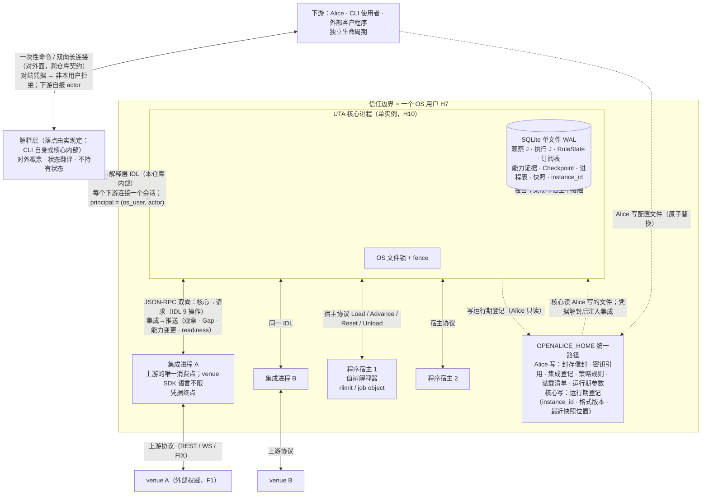
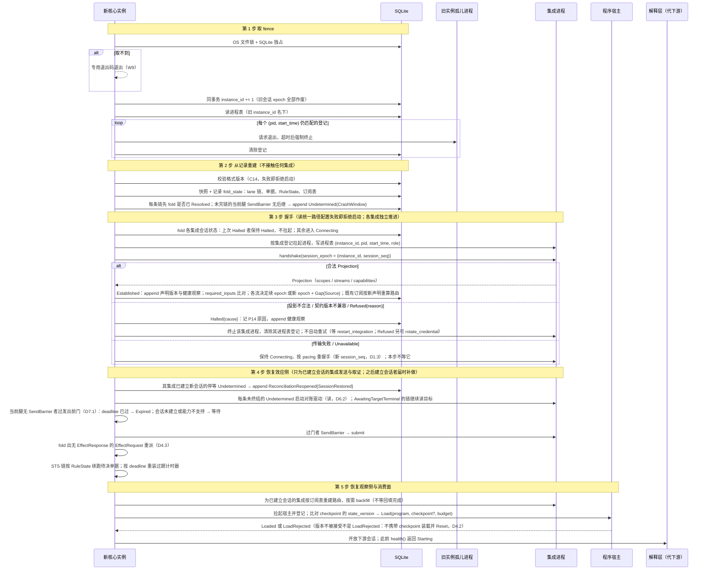
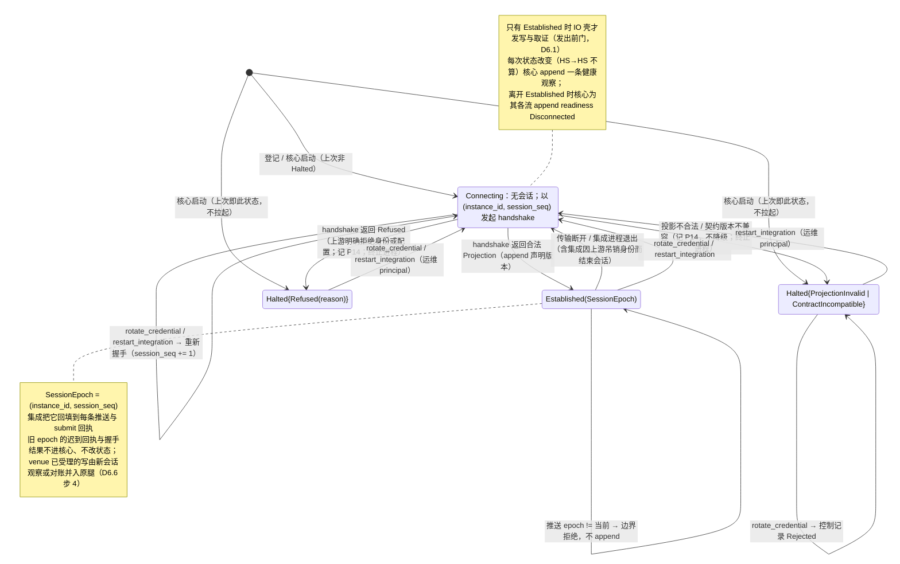
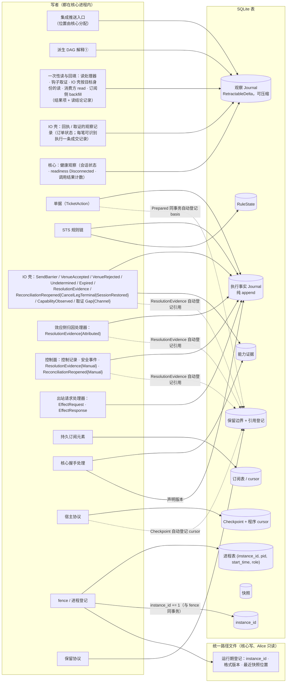

# 01 进程拓扑、启动、会话 epoch、持久化归属

对照：§0.1、§7.1、§7.2、§7.4、§7.5、§8.3。索引见 `README.md`。

## D1.1 进程拓扑与信道

对照：§0.1（权威在上游，上游只在集成内被消费；三段：清洗、抽象、清洗）、§7.1（进程、信任边界、凭据链、传输）、§8.5（principal、核心↔解释层）、§7.4（单写者）、§7.6（配置文件与运行期登记）。

读法（假想运行时）：

- 两类子进程（集成、程序宿主）都由核心拉起、登记在进程表，各自可以独立崩溃：集成崩了只影响它的流与在途 `submit`（D7.1）；宿主崩了只影响该程序（D4.2）；核心崩了子进程成孤儿，下次启动按进程表回收（D1.2）。
- 核心↔集成、核心↔解释层的语义在一份 IDL；Windows 只换信道（回环 + 令牌或命名管道），不换 IDL。下游只见解释层的对外面，不见这份 IDL。
- 凭据只走 `文件 → 核心 → 集成` 一条链；下游、解释层、程序、宿主从不见凭据本体。
- 解释层不持有状态：它或下游崩溃，对核心只是会话断开，订阅与确认进度仍在核心。

核出：无。

## D1.2 启动五步

对照：§7.2 启动与接管顺序第 1–5 步；§6.7 恢复；§9.2 #15/#21。

读法：

- 第 2 步的结论只来自记录：`Undetermined(CrashWindow)` 在没有任何集成在线时就已 append；随后第 4 步才去问 venue。
- 第 4 步先取证后发送：已能 `Resolved` 的 lane 先解除，再放未发出的 `Prepared`；发送与取证都依赖该集成已建立的会话 epoch，尚无会话的集成其腿在发出前门等会话建立（或 `deadline` 到期）。
- 失败分两级：取不到 fence、格式版本 / 迁移 / 重建失败、统一路径配置读不出，整体拒绝启动，不进入部分运行态；单个集成 `Connecting` 或 `Halted`、单个程序装载失败，只使该单元不可用，其余照常启动。`Halted` 跨核心重启保持。消费方在第 5 步之前只看到 `Starting`。

核出：第 4 步原文只写了取证与发送，没写 `EffectRequest` 重派与待决单据的计时器重装——已并入 §7.2 第 4 步。

## D1.3 集成的会话状态与边界接受

对照：§7.2 第 3 步（会话状态、转移表）、§8.2 `handshake`、§8.3（推送错误、会话中吊销身份）、§8.4 readiness 与健康、§7.6 `rotate_credential`。

读法：

- 会话 epoch 与流 epoch 独立：重连后集成若能以 venue 游标证明续接，流 epoch 不变、`Seq` 接续；证明不了才开新流 epoch（D3.2）。
- `rotate_credential` 强制新流 epoch（`credential_rotated`），不允许续接。
- `Connecting` 会自己恢复，两种 `Halted` 只由运维动作解除，核心重启不解除；健康面把二者分开给出。
- 重握手后不再声明的流：选中它的订阅对该流挂起（原因 `StreamUndeclared`），流再被声明时恢复；断连与 `Halted` 不使订阅挂起（§8.2）。

核出：无。

## D1.4 持久化归属：谁写哪张表

对照：§7.5 持久化归属表；§7.6 运行期登记文件；§7.3“执行事实 append 链的唯一写入口”。

读法：

- 观察 J 有五类写者，执行 J 有七类；两侧共享存储原语但类型宇宙不共享（§4.1）。
- 读模型不写任何表：它是按种类对执行 J、观察 J 的只读 fold（`subscriptions` 读订阅表当前态，§8.5），供 `read_model` 读取。
- 引用登记不是独立写者动作：随 `Prepared`/`Checkpoint`/`ResolutionEvidence` 的 append 自动写入，随 `Resolved`/下一 checkpoint 自动解除（D8.1）。

核出：无。

## D1.5 同事务集合

对照：§7.4 事务原子性；§6.1 请求完成事实；§6.2 与写边界的接口；§6.5 记录模型；§8.6 `Advance`；§7.2 第 1 步。

| 同一 SQLite 事务内必须一起提交 | 依据 | 崩在中途的后果（§9.2） |
|---|---|---|
| `Close(Prepared(position))` + `Prepared` | §6.2、§7.4 | #1：二者皆无，单据仍 `AwaitingDecision` |
| Decision / `Outcome` / `Rejection` 记录 + `RuleState` 更新 | §7.4 | 链步未发生，重启按 `RuleState` 重跑该步 |
| 程序写处理器的 `Draft` + `SubmitForDecision` + `EffectResponse{Drafted}` | §6.1 | #21：无 `EffectResponse` → 重派开单 |
| 读处理器的结果项与读结论记录 / `Gap{Channel}` + `EffectResponse{Concluded / Unavailable}` | §6.1 | #21：无 `EffectResponse` → 重新执行一次 |
| `submit` 的 `Ack`：`VenueAccepted`（含 `Evidence`）+ 该回应的观察记录（订单状态；每笔可识别执行一条成交记录） | §6.5 记录模型 | #5：视为无后继 → `Undetermined` → by-key 取证重得同一状态 |
| 一次取证命中：`ResolutionEvidence{Found}`（含 `Evidence`）+ `provenance: Reconciliation` 的该回应观察记录 | §6.5 | #7：该次取证不存在；fold 显示本轮该渠道未取证，重做（读可重试） |
| 推送归因命中：观察记录 + `ResolutionEvidence{Attributed}` | §6.6、§8.1 | 推送未 append：核心崩溃即集成成孤儿被回收，重启握手后该流续接（集成以 venue 游标证明）或新 epoch + `Gap{Source}`；续接则记录重到，仍处 `Undetermined` 的腿照常归因 |
| `Undetermined` append + 回查已到达的归因观察 | §6.6 | 二者同事务，不存在"归因已到但未匹配"的持久态 |
| `Advance` 输出：`EffectRequest` 记录 + 派生记录 + `Checkpoint` + 程序 cursor | §8.6 | #16：整批不存在，重放同一批记录 |
| fence 取得 + `instance_id += 1` | §7.2 第 1 步 | 未提交则旧 `instance_id` 仍有效，重来 |
| 单条观察 append + `LogPosition` 分配 | §7.4 | #9：半写不可见 |

读法：`SendBarrier` 不在任何集合里——它单独 durable append（fsync）后才允许 `submit`，这正是把崩溃窗口二分的屏障（D6.1）。

核出：无。
