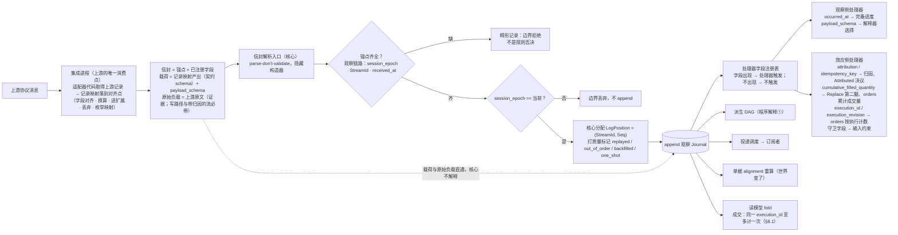
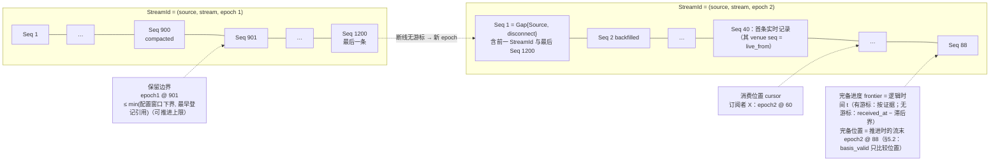
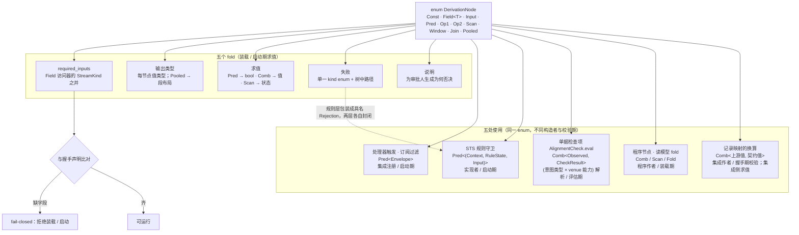
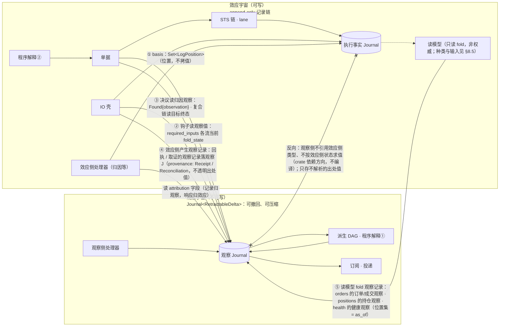

# 02 记录模型：信封、位置、值树、两个宇宙

对照：§0.1、§2.1、§2.3、§2.5、§3.1、§5、§6.5 记录模型、§7.5。索引见 `README.md`。

## D2.1 一条记录进核心：信封 / 锚点 / 处理器 / 载荷

对照：§0.1（上游只在集成内被消费）、§2.1（信封与反向代理）、§2.2（协议 = 注册单元）、§8.1 锚点表、处理器字段注册表、`payload_schema`。

读法：

- "核心看哪些字段" = `锚点 ∪ ⋃ handler.required_inputs`，其余自动是载荷；加一个 venue 字段只是注册一个处理器。
- 两种失败面互不混淆：缺锚点是畸形（拒绝）；缺处理器字段是不触发（不是错误）。
- 载荷是集成的消费结论，解释权在下游（程序、钩子、消费方），记录权在核心；原始负载只作证据，不进任何解释器。

核出：无。

## D2.2 一条流的时间线：epoch、Seq、三种进度

对照：§2.3（位置、三种进度）、§2.4（保留语义）、§4.2 gap 三来源、§8.4 实时边界。

读法：

- `Seq` 每 epoch 独立单调；跨 epoch 的顺序只由 `Gap{Source}` 记录里的"前一范围与最后 Seq"给出，没有全局序。
- 三种进度互不推导：X 读到 60 不代表 60 之前不再变（frontier 才说这个），也不代表 60 还能重建（保留边界才说这个）。frontier 本身是逻辑时间；与 `basis` 比较用的是推进时记下的完备位置。
- 回填只覆盖 `< live_from` 的范围，与实时记录按范围不重叠；覆盖不到就 `Gap{Source, backfill_incomplete}`，frontier 跳过。

核出：无。

## D2.3 `DerivationNode` 值树与五个 fold

对照：§2.5（组合子值树、五个 fold、同一 enum 的五处使用）、§4.3、§6.1、§8.1 记录映射、§8.6 装载期校验。

读法：

- 表达力不足时唯一扩展轴是加构造子；五个 fold 各加一臂，编译器指出遗漏。
- 组合子是判断的底层，不是控制流的底层：STS 五步链、IO 壳阶段链、单据锁都不是值树。

核出：无。

## D2.4 两个类型宇宙与唯一边（含边的五种承载）

对照：§3.1–§3.3（第一边界、两套抽象、允许/禁止关系表）、§3.4（读副作用、读即观察记录）、§4.4 与 §8.5（读模型的输入）、§5（唯一边、`basis`、归因记录归观察/响应归效应）、§6.5 记录模型。

读法：

- 边的方向唯一：效应侧读观察侧，或效应侧产生观察记录，都以位置引用承载。①–③、⑤ 是"效应侧记录里放一个观察位置"或"效应侧代码读观察值"，各用自己的位置集（意图的 `basis`、检查的 `checked_as_of`、取证的 `Found{observation}`、读模型的 `as_of`）；④ 是效应侧写入观察 J。观察记录上的 `provenance`/`attribution` 是不透明的位置值，观察侧存它、路由它、不解析它——边约束的是类型依赖与语义消费（§3.2）。
- 同一个程序值跨两边：解释①在观察宇宙产派生记录，解释②在效应宇宙产 `EffectRequest`——程序是值不是类型，所以不构成反向引用。
- 撤回不跨边：行情修订撤回旧派生信号，已发出的 `SendBarrier` 只能追加后续事实（W16）。

核出：无。

## D2.5 记录种类总表（假想磁盘上有什么）

对照：§3.1、§4.1、§4.2、§6.1、§6.2、§6.3、§6.5、§8.5、§8.6、§7.5。这张表是 D1.4 的"内容"侧：每种记录归哪个 `Journal`、谁 append、关键字段、引用了谁。

| Journal | 记录 | 写者 | 关键字段 | 位置引用（→ 谁） |
|---|---|---|---|---|
| 观察 | 推送观察记录 | 集成推送入口 | `StreamId`、`Seq`、`received_at`、`occurred_at?`、`attribution?`、`idempotency_key?`、契约载荷 + `payload_schema`、原始负载（写路径与可带 `attribution` 的流必带，其余按记录映射声明，§8.1）、质量标记 | — |
| 观察 | `Gap{origin: Source, reason}` | 集成推送入口 / 核心（新 epoch 首条） | 前一 `StreamId` 与最后 `Seq`、`reason` | 前一 epoch |
| 观察 | `Gap{origin: Delivery, reason}` | 投递调度 | 订阅、from/to `Seq`、`reason` | — |
| 观察 | 一次性读 / 回填的结果项 | 读处理器 / 钩子取证 / IO 壳按目标身份的读 / 消费方 `read` / 订阅侧回填 | 与该流推送记录同形；`provenance: OneShot{origins, request}`（`origins ⊆ {Request(pos), Ticket(id), Attempt(AttemptRef), Session(principal)}`）、`one_shot` 或 `backfilled` | 出处值（不解析）；`Request` → `EffectRequest` 位置 |
| 观察 | 读结论记录 | 同上（集成作答或上游 `Refused` 时） | 请求身份、`origins`、本次结果项的位置（一次性读）或窗口与 `covered_to`（回填）、或拒绝原因；控制记录，不是载荷 | → 本次结果项 |
| 观察 | 路由结论记录 | 持久订阅元素（`route` 返回 `Routed` 时，§8.2） | 本次生效主体集相对上一条的增减、`refused` 与原因；控制记录，不是载荷；主体的覆盖从加入它的这条记录之后开始 | 前一条路由结论记录（同流） |
| 观察 | 回执的观察记录 | IO 壳 | 该回应的观察记录：回应含订单状态时订单状态一条，加回应所含每笔可识别执行一条成交记录（带 `execution_id`）；同一回应的各条 `provenance: Receipt{AttemptRef}` 相同；`attribution` 按各条自己的关联证据填写，不因同在一个回应而继承（订单状态一条为 `FromAttempt(AttemptRef)`）；可压缩；契约载荷与原始负载永存于执行侧 `Evidence` | 出处值（不解析）|
| 观察 | 取证的观察记录 | IO 壳 | 同上，`provenance: Reconciliation{AttemptRef, channel}`；只对由自己的关联证据属于该腿的记录填 `FromAttempt(AttemptRef)`；`list_fills` 命中只有成交记录，不造订单状态记录；可压缩 | 出处值（不解析）|
| 观察 | 派生记录（含 alert） | 派生 DAG | 程序流 `StreamId`、`RetractableDelta` | — |
| 观察 | `ProgramReset{reason}` / `ProgramFailed{reason}` | 宿主协议（核心） | 程序 id、`reason` | — |
| 观察 | 健康观察 | readiness（`Starting` / `Live{live_from}` / `Degraded`）由集成推送入口；会话状态、readiness `Disconnected`、调用计数由集成会话；回填进度由持久订阅（§8.4） | 状态值：每条带其键上的完整当前值——集成的 `session`；流与 readiness；逻辑流与当前 epoch 的回填进度（`Backfilling{through}` / `Closed` / `Reached` / `Incomplete{through}`）；调用目标与计数后的 `consecutive_failures`、`last_success_at`；按键保留（§2.4） | — |
| 执行 | `TicketAction`：`Draft` / `Revise` / `Transfer` / `SubmitForDecision` / `SendBack` / `Close(outcome)` | 单据 | `ticket_id`、`by: principal`、`basis`、意图版本 hash | `basis` → 观察位置（含归因观察）+ 执行事实侧位置（`EffectRequest` / `VenueAccepted` / `SendBarrier`） |
| 执行 | Decision / `Outcome` / `Rejection` | STS 规则链 | `ticket_id`、绑定 `current_version`、`principal`、`rule_version`、`checked_as_of` | → 单据记录；`checked_as_of` → 观察位置 |
| 执行 | `Prepared` | 单据（放行事务） | `attempt_position` 即自身位置、`WriteLaneKey`、`OperationKind`、`deadline`、`target?`、意图载荷 | → `Close(Prepared)` 同事务 |
| 执行 | `SendBarrier` | IO 壳（fsync） | `AttemptRef = (attempt_position, leg)`、该腿的 `idempotency_key`；该腿的写操作（`submit` / `cancel`）、所带调用方键及其角色（订单键 / 请求键）；首腿的写操作即链的腿计划（§6.5） | → `Prepared` |
| 执行 | `VenueAccepted{venue_order_id, receipt, observation}` | IO 壳 | `AttemptRef`、`venue_order_id`、`receipt: Evidence`（契约载荷 + 原始负载，永存） | `observation` → 该回应的订单状态记录 |
| 执行 | `VenueRejected(reason)` | IO 壳 | `AttemptRef`、`reason`（含 `Unmapped(raw)`） | → `Prepared` |
| 执行 | `Undetermined(reason)` | IO 壳 | `AttemptRef`、`NoResponse` 或 `CrashWindow` | → `Prepared` |
| 执行 | `Expired(deadline)` | IO 壳（发出前门 / `AwaitingTargetTerminal` 到期） | `AttemptRef` | → `Prepared` |
| 执行 | `TargetTerminal` | IO 壳 | `AttemptRef`（(p, 2)）、`observation`、`evidence`（契约载荷与原始负载）、`quantity`（按意图数量口径算出；≤ 0 = 链 `Resolved`，不发新腿） | `observation` → 观察位置；→ `Prepared` |
| 执行 | `IntegrationHalted` | 集成会话 | 集成、`cause`（`ProjectionInvalid` / `ContractIncompatible` / `Refused(reason)`）、`session_epoch`；与 `Halted` 健康观察同事务 | — |
| 执行 | `ResolutionEvidence{AttemptRef, channel, round, outcome}` | IO 壳 / 归因处理器 / 控制面 | `channel ∈ {ByKey, Listing, Fills, Replay, Attributed, Manual}`、`round`（发起时所属轮次）、`outcome ∈ {Found{observation, evidence: Evidence}, Absent, Inconclusive}`；每条 `Found` 都带 `evidence`（六渠道一视同仁）；`Manual` 带 principal 与 note | `Found` → 命中的那条观察记录（`list_fills` 命中多笔归因到该腿的成交时，取同一成交流上 `Seq` 最小者）；`round` → `ReconciliationReopened` |
| 执行 | `ReconciliationReopened{AttemptRef, cause}` | IO 壳 / 控制面 | `cause ∈ {CancelLegTerminal(AttemptRef), SessionRestored, Manual(principal)}` | → `Undetermined` |
| 执行 | `CapabilityObserved` | IO 壳 | `(WriteLaneKey, OperationKind)` 或逻辑流 `(source, stream)` 的读 / 回填、新 `Verdict`、所更新声明版本的 `session_epoch`（取自被接受的推送 / 回应）；不属于任何 Attempt | → 同来源同 `session_epoch` 的声明版本 |
| 执行 | 声明版本 | 集成会话 | 该握手 `Projection` 除记录映射外的全部（作用域与 `account_ref` 可解析判定、流声明、写能力、配额、扩展 schema）、`session_epoch` | — |
| 执行 | `Gap{origin: Channel, channel}`（取证渠道） | IO 壳 | `AttemptRef`、渠道 | → `Prepared` |
| 观察 | `Gap{origin: Channel, channel}`（回填 / 一次性读） | 回填 / 一次性读（调用后 `Unavailable`；无会话不记） | 流、渠道 | — |
| 执行 | `EffectRequest` | 出站请求处理器 | 程序 id、`effect_kind`、`basis`、`key?`、载荷 | `basis` → 观察位置 |
| 执行 | `EffectResponse{request, outcome}` | 出站请求处理器 | 读：`Concluded(读结论记录位置)` / `Unavailable(gap)` / `NotCalled(reason)`；写：`Drafted(ticket)` / `NotDrafted(Malformed{reason})`（§6.1） | → `EffectRequest` |
| 执行 | 控制记录 `Applied(position)` / `Rejected(reason)` | 控制面 | principal、动作、配置版本 hash；解除 `Halted` 的 `restart_integration` / `rotate_credential` 的 `Applied` 带被解除的 `IntegrationHalted` 位置 | — |
| 执行 | 安全事件 | 会话入口（未完成握手的请求）/ STS 授权步（写越权）/ 控制面（控制动作与人工决议越权） | principal（或未认证连接标识）、请求种类 | — |
| 执行 | `bypass_lane` 的控制记录 `Applied`（不是 Decision） | 控制面 | principal、单据、该单据的 `WriteLaneKey`（随该 lane 的执行事实流投递）、生效时的 `current_version`、被绕过的阻塞头位置集 | → 被绕过的 `Prepared` 集合 |

读法：

- 两个 `Journal` 的记录种类就是上表。lane 的阻塞头、`Resolved`、"下一取证渠道"是执行 J 的 fold（阻塞头集合由 lane 规则存在 `RuleState`，§6.4）；单据状态是执行 J 与其评估所读观察、当前能力证据和策略的 fold（§6.2）。它们都不是记录。
- 观察 J 的记录可被压缩到其所在流的保留边界之下；执行 J 的记录永不删除，没有保留边界（§2.4）。

核出：回执与取证的 `Evidence`（契约载荷与原始负载，C13）归执行事实、观察侧的记录可压缩；腿身份 `AttemptRef`；`EffectResponse`；`ReconciliationReopened`；`checked_as_of`——均在画图/复核时并入正文（§6.1、§6.2、§6.3、§6.5）。
