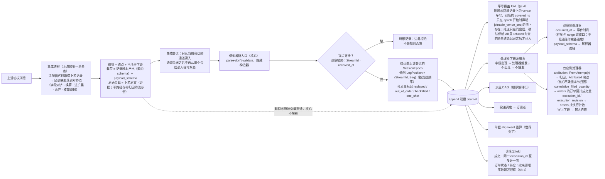
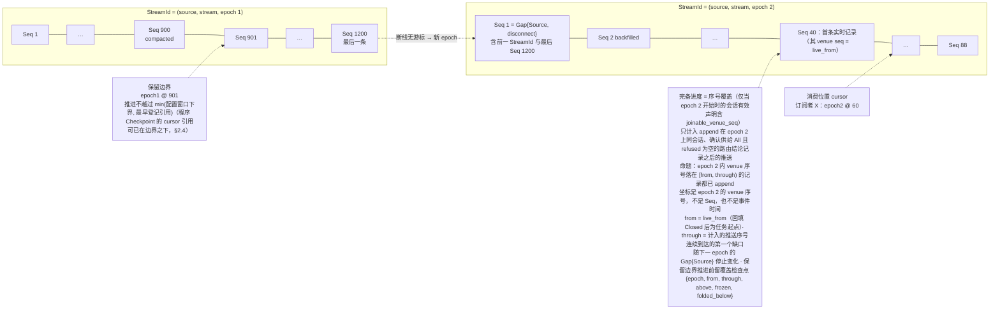
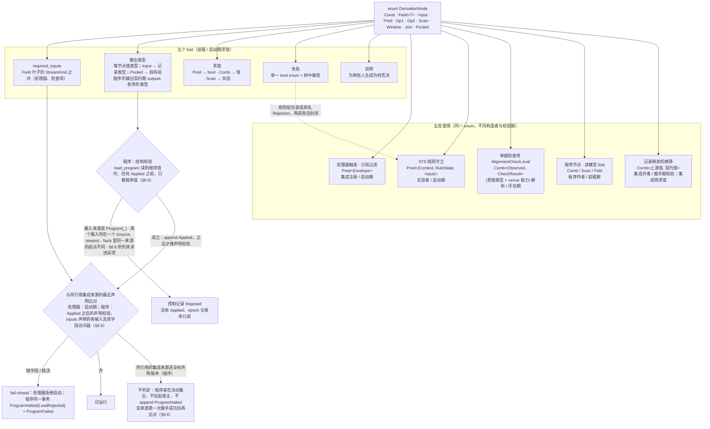
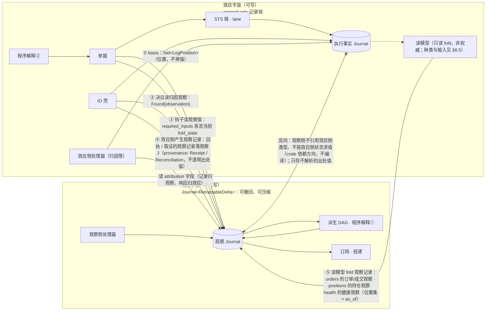

# 02 记录模型：信封、位置、值树、两个宇宙

对照：§0.1、§2.1、§2.3、§2.5、§3.1、§5、§6.5 记录模型、§7.5。索引见 `README.md`。

## D2.1 一条记录进核心：信封 / 锚点 / 处理器 / 载荷

对照：§0.1（上游只在集成内被消费）、§2.1（信封与反向代理）、§2.2（协议 = 注册单元）、§7.2（会话 epoch）、§8.1 锚点表、处理器字段注册表、`payload_schema`、§8.3 推送、§8.4 序号覆盖。

读法：

- "核心看哪些字段" = `锚点 ∪ ⋃ handler.required_inputs`，其余自动是载荷；加一个 venue 字段只是注册一个处理器。
- 两种失败面互不混淆：缺锚点是畸形（拒绝）；缺处理器字段是不触发（不是错误）。
- 会话归属不是集成填的锚点：核心只从当前会话的通道读入，并给接受的记录盖上该会话的 `SessionEpoch`；旧会话的消息不进信封解析，也不 append。
- `LogPosition` 归核心，完备归来源：到达顺序只是日志顺序；是否全部到达只由来源证据（序号覆盖）说明，`occurred_at` 与到达时刻都不说明。
- 载荷是集成的消费结论，解释权在下游（程序、钩子、消费方），记录权在核心；原始负载只作证据，不进任何解释器。

核出：无。

## D2.2 一条流的时间线：epoch、Seq、三种进度

对照：§2.3（位置、三种进度、位置归核心而完备归来源）、§2.4（保留语义）、§4.2 gap 三来源、§8.4 实时边界与序号覆盖。

读法：

- `Seq` 每 epoch 独立单调；跨 epoch 的顺序只由 `Gap{Source}` 记录里的"前一范围与最后 Seq"给出，没有全局序。venue 序号也只在一个流 epoch 内可比。
- 三种进度互不推导，源头各不相同：X 读到 60 不代表之前的记录已全部到达（只有来源证据证明的覆盖才说这个），也不代表 60 还能重建（保留边界才说这个）。
- 没有证据的流没有完备进度：没有 `joinable_venue_seq`、来源没有确认整条流的供给（路由结论记录不是 `All` 或 `refused` 非空），或只有事件时间的流，依赖完备的判断得"完备未确立"，不以时钟、到达顺序、消费位置或 UTA 自己的需求补上。放行门不读序号覆盖（§5.2）；它的消费者是 `await-all` 的覆盖要求与 `orders` 的完整界。
- 回填只覆盖 `< live_from` 的范围，与实时记录按范围不重叠；覆盖不到就 `Gap{Source, backfill_incomplete}`，序号覆盖的起点停在 `live_from`。

核出：无。

## D2.3 `DerivationNode` 值树与五个 fold

对照：§2.5（组合子值树、五个 fold、同一 enum 的五处使用）、§4.3、§6.1、§8.1 记录映射、§8.6 装载期校验。

读法：

- 表达力不足时唯一扩展轴是加构造子；五个 fold 各加一臂，编译器指出遗漏。
- 组合子是判断的底层，不是控制流的底层：STS 五步链、IO 壳阶段链、单据锁都不是值树。

核出：无。

## D2.4 两个类型宇宙与唯一边（含边的五种承载）

对照：§3.1–§3.3（第一边界、两套抽象、允许/禁止关系表）、§3.4（读副作用、读即观察记录）、§4.4 与 §8.5（读模型的输入）、§5（唯一边、`basis`、归因记录归观察/响应归效应）、§6.5 记录模型。

读法：

- 边的方向唯一：效应侧读观察侧，或效应侧产生观察记录，都以位置引用承载。①–③、⑤ 是"效应侧记录里放一个观察位置"或"效应侧代码读观察值"，各用自己的位置集（意图的 `basis`、检查的 `checked_as_of`、取证的 `Found{observation}`、读模型的 `as_of`）；④ 是效应侧写入观察 J。观察记录上的 `provenance`/`attribution` 是不透明的位置值，观察侧存它、路由它、不解析它——边约束的是类型依赖与语义消费（§3.2）。
- 同一个程序值跨两边：解释①在观察宇宙产派生记录，解释②在效应宇宙产 `EffectRequest`——程序是值不是类型，所以不构成反向引用。
- 撤回不跨边：行情修订撤回旧派生信号，已发出的 `SendBarrier` 只能追加后续事实（W16）。

核出：无。

## D2.5 记录种类总表（假想磁盘上有什么）

对照：§3.1、§4.1、§4.2、§6.1、§6.2、§6.3、§6.5、§7.5、§7.6、§8.1、§8.4、§8.5、§8.6。这张表是 D1.4 的"内容"侧：每种记录归哪个 `Journal`、谁 append、关键字段、引用了谁。

| Journal | 记录 | 写者 | 关键字段 | 位置引用（→ 谁） |
|---|---|---|---|---|
| 观察 | 推送观察记录 | 集成推送入口（核心盖上到达会话的 `SessionEpoch` 与 `LogPosition`） | `StreamId`、`Seq`、`session_epoch`、`received_at`、venue 序号 / 游标证据、`occurred_at?`、`attribution?`、`idempotency_key?`、契约载荷 + `payload_schema`、原始负载（写路径与可带 `attribution` 的流必带，其余按记录映射声明，§8.1）、质量标记 | — |
| 观察 | `Gap{origin: Source, reason}` | 集成推送入口（会话内上报的断代）/ 集成会话（握手开新 epoch，含 `credential_rotated`；与该逻辑流的 `None{epoch}` 同事务）/ 持久订阅（`backfill_incomplete`）/ 控制面（程序流新 epoch，在开始不沿用旧状态之成员的 `Applied` 同事务：`load_program` 让 id 进入活动集合为 `start`，不沿用旧状态的替换为 `program_upgrade`，§8.6） | 开 epoch 的：前一 `StreamId` 与最后 `Seq`（该逻辑流的第一个 epoch 为无前驱）、`reason`；会话内由集成上报的另带集成给的 `generation`（按流、按会话，会话开始为 0，每上报一条加一并带上新值；`route` 所带的见 §8.2）。`backfill_incomplete` 是 epoch 内的记录：标出未覆盖的区间，不开也不结束 epoch，不带 `generation` | 开 epoch 的 → 前一 epoch（第一个 epoch 无）；`backfill_incomplete` 无 |
| 观察 | 一次性读 / 回填的结果项 | 一次性读元素（发起方：读处理器 / 检查项的"先查后判" / 消费方 `read`，§7.5）/ 持久订阅元素（回填） | 与该流推送记录同形；一次性读：`provenance: OneShot{origins, request}`（`origins ⊆ {Request(pos), Ticket(id), Session(principal)}`）、`dispatch_end`、发出这次调用的会话的 `session_epoch`、`one_shot`；回填：`backfilled`；只在调用的发出 epoch（一次性读为 `dispatch_end` 所在的流 epoch，回填为任务所在的流 epoch）仍是当前流 epoch 时 append，否则该调用完成为 `Unavailable`，只在当前 epoch 记 `Gap{Channel}`（§8.2） | 出处值（不解析）；`Request` → `EffectRequest` 位置；`dispatch_end` → 调用发出时该流已提交的流末 |
| 观察 | 读结论记录 | 同上（集成作答或上游 `Refused` 时） | 请求身份、`origins`、本次结果项的位置、`dispatch_end` 与发出会话的 `session_epoch`（一次性读）或窗口与 `covered_to`（回填）、或拒绝原因；控制记录，不是载荷 | → 本次结果项 |
| 观察 | 路由结论记录 | 持久订阅元素（`route` 返回 `Routed` 时，§8.2；`route` 义务嵌在集成会话里，每条流至多一项：会话建立时为需求非空的流起，已建立期间接受会话内开 epoch 的 gap 或需求变化时起或并入，第一次 `Routed` 了结，会话结束时丢弃；所带 `generation` 见 §8.2）；集成只以 `Routed` 回答带它当前 `generation` 的调用，跨过流 epoch 更替的 `route` 由集成答 `Unavailable`，核心不另判 | 本次生效的主体全集（`All` 或主体集）、`refused` 与原因，不记增减；控制记录，不是载荷；主体的记录从加入它的这条记录之后开始；同会话、全集为 `All` 且 `refused` 为空的记录之后的推送才计入该流 epoch 的序号覆盖（§8.4） | 前一条路由结论记录（同流 epoch；增减由这两条算出） |
| 观察 | 回执的观察记录 | IO 壳 | 该回应的观察记录：回应含订单状态时订单状态一条，加回应所含每笔可识别执行一条成交记录（带 `execution_id`）；同一回应的各条 `provenance: Receipt{AttemptRef}` 相同，`dispatch_end` 各是自己所在流的：IO 壳在发出调用时为该作用域的订单状态流与成交流各记下已提交的流末位置（§6.5）；`attribution` 按各条自己的关联证据填写，不因同在一个回应而继承：订单状态一条只在这次尝试投放了该订单时为 `FromAttempt(AttemptRef)`，撤单回执里目标订单的状态按目标订单自己的关联证据填写，不归到这次撤单；一条记录的 `dispatch_end` 所在的流 epoch（发出 epoch）不是它 append 所在的流 epoch 时照常 append，但所带 venue 序号不作来源顺序证据，按不带序号的回答处理（§8.1）；可压缩；契约载荷与原始负载永存于执行侧 `Evidence` | 出处值（不解析）；`dispatch_end` → 所在流的流末位置 |
| 观察 | 取证的观察记录 | IO 壳 | 同上，`provenance: Reconciliation{AttemptRef, channel}` 相同，`dispatch_end` 各是自己所在流的；只对由自己的关联证据属于该尝试的记录填 `FromAttempt(AttemptRef)`；`list_fills` 命中只有成交记录，不造订单状态记录；可压缩 | 出处值（不解析）；`dispatch_end` → 所在流的流末位置 |
| 观察 | 派生记录（含 alert） | 程序宿主元素（`Advance` 的输出事务；值由解释①求出） | 程序流 `StreamId`：`(Program(id), name)`，`name` 取自程序值的 `outputs`，只有输出声明所指节点的值落流；解释器产出的类型化值（输出契约里该流的值类型），按 `V` 的类型化值编码写出，不带 `subject`；`RetractableDelta`：流 epoch 里第一次有值写一条正贡献，值变了写一条撤回前一贡献（指名其位置）并加入新值，值相等不写；fold 取该流 epoch 最新一条值记录的正贡献（§4.1 程序流的 fold）；按流 epoch 压缩，每个流 epoch 在保留边界之下的最新一条原样留作基线，不改写（§2.4）；`basis` = 同一事务提交的该程序各输入的 cursor（§4.3） | `basis` → 输入流位置；撤回 → 被取代贡献的位置（只作指名，使以它为 `basis` 的依据为 `Retracted`，§5.2） |
| 观察 | `ProgramReset{reason}` / `ProgramFailed{reason}` | 程序宿主元素 | 程序 id、`reason` | — |
| 观察 | 健康观察 | readiness（`Starting` / `Live{live_from}` / `Degraded`）由集成推送入口，核心盖上到达会话的 `SessionEpoch` 与该流当时的流 epoch；会话状态（每条带 append 它的核心实例的 `instance_id`，`Established` 另带其 `SessionEpoch`）由集成会话；调用计数由集成会话给出内容、调用发起方在记录该结果的同一事务提交；回填进度与覆盖检查点由持久订阅（§8.4） | 状态值：每条带其键上的完整当前值——集成的 `session`（切面上的会话值取带该切面控制流前缀里最近一次采纳之 `instance_id` 的最近一条；没有时看该集成最近一条会话观察所带的实例：没有这样一条或它在控制流前缀里有采纳为 `Unobserved`（不是记录），没有采纳为 `BeyondRetention`（最近一次采纳之实例的观察已被压缩））；流的 readiness（只在所带 `SessionEpoch` 的会话是该切面的会话值且为 `Established`、所带流 epoch 是该流当前流 epoch（最近一条回填进度所带的 epoch）时有效；已建立而当前流 epoch 里没有这样的值为 `Starting`；`Disconnected` 由会话值派生，不是记录）；逻辑流的回填进度，值带所属流 epoch（`None{epoch}` / `Backfilling{through}` / `Closed` / `Reached` / `Incomplete{through}`；`None` 与新 epoch 起点的 `Gap{Source}` 同事务）；逻辑流的覆盖检查点 `{epoch, from, through, above, frozen, folded_below}`（保留边界推进要删掉当前 epoch 的记录之前写）；调用目标与计数后的 `consecutive_failures`、`last_success_at`；按键保留（§2.4） | — |
| 执行 | `TicketAction`：`Draft` / `Revise` / `Transfer` / `SubmitForDecision` / `SendBack` / `Close(outcome)` | 单据 | `ticket_id`、`by: principal`、`basis`、意图版本 hash | `basis` → 观察位置（含归因观察）+ 执行事实侧位置（`EffectRequest` / `VenueAccepted` / `SendBarrier`） |
| 执行 | Decision / `Outcome` / `Rejection` | STS 规则链 | `ticket_id`、绑定 `current_version`、`principal`、`rule_version`、`checked_as_of` | → 单据记录；`checked_as_of` → 观察位置 |
| 执行 | `Prepared` | 单据（放行事务） | `attempt_position` 即自身位置、`WriteLaneKey`、`OperationKind`、`deadline`、`target?`、意图载荷 | → `Close(Prepared)` 同事务 |
| 执行 | `SendBarrier` | IO 壳（fsync） | `AttemptRef`、`idempotency_key`（核心按 `AttemptRef` 单射铸造）；这一次写的操作（`submit` / `cancel`）、所带调用方键及其角色（订单键 / 请求键） | → `Prepared` |
| 执行 | `VenueAccepted{venue_order_id, receipt, observation}` | IO 壳 | `AttemptRef`、`venue_order_id`、`receipt: Evidence`（契约载荷 + 原始负载，永存） | `observation` → 该回应的订单状态记录 |
| 执行 | `VenueRejected(reason)` | IO 壳 | `AttemptRef`、`reason`（含 `Unmapped(raw)`） | → `Prepared` |
| 执行 | `NotSent(reason)` | IO 壳 | `AttemptRef`、`reason`：可证明没有交给上游（写调用的封闭返回 `NotSent`） | → `Prepared` |
| 执行 | `Undetermined(reason)` | IO 壳 | `AttemptRef`、`NoResponse` 或 `CrashWindow` | → `Prepared` |
| 执行 | `Expired(deadline)` | IO 壳（发出前门到期） | `AttemptRef` | → `Prepared` |
| 执行 | `Abandoned` | IO 壳（经 `abandon` 授权；该尝试的在途取证调用先完成） | `AttemptRef`、`principal`、`note`、`rule_version`；随该 lane 的执行事实流；UTA 自己的放弃等待，不是结果 | → `Prepared` |
| 执行 | `IntegrationHalted` | 集成会话 | 集成、`cause`（`ProjectionInvalid` / `ContractIncompatible` / `Refused(reason)`）、`session_epoch`；落控制流；与 `Halted` 健康观察同事务 | — |
| 执行 | 轮换兑现记录 | 集成会话（兑现轮换的那次成功握手的事务里，与声明版本、`Established` 健康观察与各流 `Gap{Source, credential_rotated}` 同事务，§7.6） | 集成、`session_epoch`；落控制流 | → 被兑现的每条 `rotate_credential` `Applied`（控制流上的位置；其后没有兑现记录引用的即未兑现的轮换） |
| 执行 | 采纳记录 | 集成会话（启动第 3 步，与每个采纳的集成的初始会话健康观察同事务，§7.2） | 集成登记文件的内容 hash、其中列出的集成 id、本实例的 `instance_id`；落控制流 | — |
| 执行 | `ProgramHalted{program, reason}` | 程序宿主（核心） | 程序 id、`reason`；落控制流；与 `ProgramFailed` 观察同事务 | — |
| 执行 | `ResolutionEvidence{AttemptRef, channel, round, outcome}` | IO 壳 / 归因处理器 | `channel ∈ {ByKey, Listing, Fills, Replay, Attributed}`、`round`（主动取证：发起时所属轮次；`Attributed`：append 时的当前轮）、`outcome ∈ {Found{observation, evidence: Evidence}, Absent, Inconclusive}`；每条 `Found` 都带 `evidence`（五渠道一视同仁） | `Found` → 命中的那条观察记录（`list_fills` 命中多笔归因到该尝试的成交时，取同一成交流上 `Seq` 最小者）；`round` → `ReconciliationReopened` |
| 执行 | `ReconciliationReopened{AttemptRef, cause}` | IO 壳（`SessionRestored`，不重开已 `Abandoned` 的）/ 控制面（`retry_reconciliation`） | `cause ∈ {SessionRestored, Manual(principal)}` | → `Undetermined` |
| 执行 | `CapabilityObserved` | IO 壳 | `(WriteLaneKey, OperationKind)` 或逻辑流 `(source, stream)` 的读 / 回填、新 `Verdict`、所更新声明版本的 `session_epoch`（被接受的那条推送或回应所携的 `SessionEpoch`）；不属于任何 Attempt | → 同来源同 `session_epoch` 的声明版本 |
| 执行 | 声明版本 | 集成会话 | 该握手 `Projection` 除记录映射外的全部（作用域与 `account_ref` 可解析判定、流声明、写能力、配额、扩展 schema）、`session_epoch` | — |
| 执行 | `Gap{origin: Channel, channel}`（取证渠道） | IO 壳 | `AttemptRef`、渠道 | → `Prepared` |
| 观察 | `Gap{origin: Channel, channel}`（回填 / 一次性读） | 持久订阅元素（回填）/ 一次性读元素（调用后 `Unavailable`，含会话结束时强制完成与发出 epoch 已结束的；无会话不调用、不记） | 流、渠道；一次性读的另带这次调用的 `provenance: OneShot{origins, request}`、`dispatch_end` 与发出这次调用的会话的 `session_epoch`（核心强制完成时也是），与它的结论记录会带的相同（§8.2 `read`） | 一次性读的：出处值（不解析）；`dispatch_end` → 调用发出时该流已提交的流末 |
| 执行 | `EffectRequest` | 出站请求处理器（随 `Advance` 输出提交） | 程序 id（即所在请求流）、`member`（发出成员：开始该成员的 `load_program` / 替换 `Applied` 的位置，核心在输出事务里写下）、`effect_kind`、`basis`、载荷；不带调用方键（键由核心在发出时按 `AttemptRef` 铸造，§6.5） | `basis` → 观察位置；`member` → 控制流上的 `Applied`（处理器与重派读它所记的装载 principal 与执行事实输入，§6.1） |
| 执行 | `EffectResponse{request, outcome}` | 出站请求处理器 | 同一请求流；读：`Concluded(读结论记录位置)` / `Unavailable(gap)` / `NotCalled(reason)`；写：`Drafted(ticket)` / `NotDrafted(Malformed{reason} \| ScopeNotObserved)`（§6.1） | → `EffectRequest` |
| 执行 | 控制记录 `Applied(position)` / `Rejected(reason)` | 控制面 | principal、动作、配置版本 hash；落控制流（`bypass_lane` 的除外，见下）；`restart_integration` 的 `Applied` 带本实例的 `instance_id`；解除 `Halted` 的 `restart_integration` / `rotate_credential` 的 `Applied` 带被解除的 `IntegrationHalted` 位置；`load_program` 的 `Applied` 记下装载 principal（即其 principal）、内容 hash、预算、接受的 `state_version` 集合、`facts` 声明的执行事实输入集合、值树引用的原生 op 名集合、输出契约（`outputs` 各项的 `(name, 值类型)`，以值记下，供沿用判定、程序流的 epoch 与程序来源的接纳）、沿用的 `Checkpoint`（位置或无），解除失败抑制时带被解除的 `ProgramHalted` 位置；`install_native_op` 的 `Applied` 以值记下 op 名、声明的签名、artifact 引用与内容 hash，`remove_native_op` 的记下 op 名，这两种的 fold 是已安装 op 集合（§8.7） | — |
| 执行 | 安全事件 | 会话入口（未完成握手的请求）/ STS 授权步（写越权）/ 控制面（控制动作、`abandon` 与 `retry_reconciliation` 越权） | principal（或未认证连接标识）、请求种类 | — |
| 执行 | `bypass_lane` 的控制记录 `Applied`（不是 Decision） | 控制面 | principal、单据、该单据的 `WriteLaneKey`（随该 lane 的执行事实流投递）、生效时的 `current_version`、被绕过的阻塞头位置集 | → 被绕过的 `Prepared` 集合 |

读法：

- 两个 `Journal` 的记录种类就是上表。执行 J 上除 lane 流、各来源的声明流、各程序的请求流之外，有一条核心唯一、不属任何来源的控制流：采纳记录、除 `bypass_lane` 之外的控制记录、`IntegrationHalted`、轮换兑现记录、`ProgramHalted`（§8.5 订阅组）。lane 的阻塞头集合、尝试的结果是否确立、"下一取证渠道"是执行 J 的 fold（§6.4）；单据状态是执行 J 与其评估所读观察、当前能力证据和策略的 fold（§6.2）。它们都不是记录。
- 投递缺口 `Gap{origin: Delivery}` 不在表里：它是订阅的状态，按（订阅，流）记为 `{流, from, to, reason}`，存在订阅表里，唯一写者是持久订阅元素；不是任何 `Journal` 的记录，不在任何流上（§4.2、§7.5）。
- 一个尝试是一次写：`SendBarrier` 之后，写调用的封闭结果落为 `VenueAccepted` / `VenueRejected` / `NotSent`，或 `Undetermined(NoResponse)`；崩溃窗口为 `Undetermined(CrashWindow)`。`Expired` 与 `Abandoned` 是 UTA 自己的出口：`Expired` 不是写调用的结果，但结果轴上是确知的未交出（与 `NotSent` 同一个值，不另写 `NotSent` 记录）；`Abandoned` 只结束等待，不是结果，之后被动来源证据（`Attributed`）仍可补上结果，补上的结果不是门。
- 观察 J 的记录可被压缩到其所在流的保留边界之下；执行 J 的记录永不删除，没有保留边界（§2.4）。

核出：回执与取证的 `Evidence`（契约载荷与原始负载，C13）归执行事实、观察侧的记录可压缩；尝试身份 `AttemptRef`；`EffectResponse`；`ReconciliationReopened`；`checked_as_of`——均在画图/复核时并入正文（§6.1、§6.2、§6.3、§6.5）。
