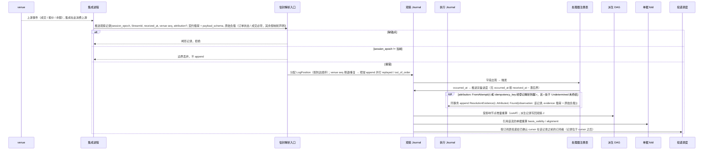
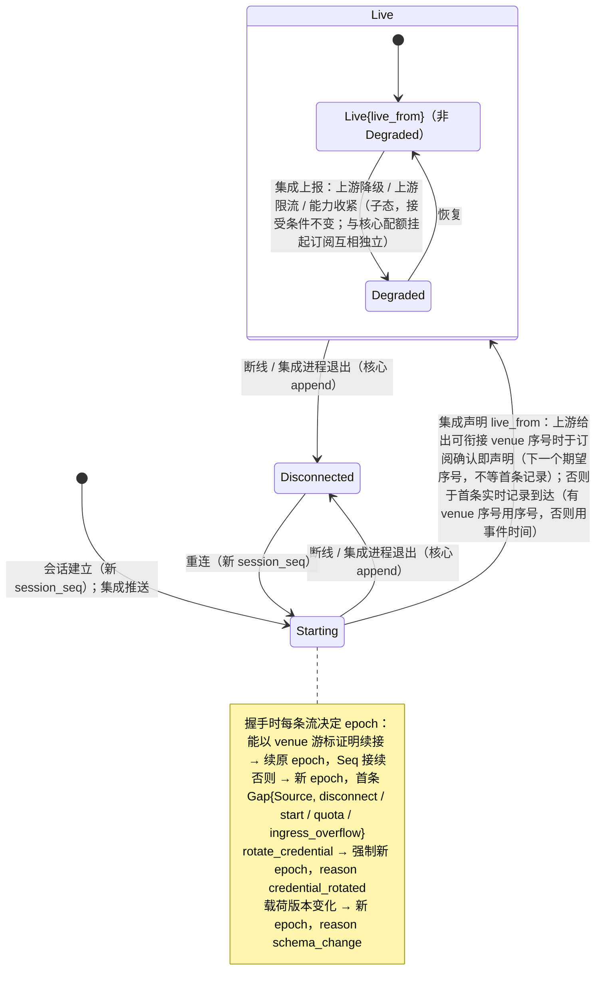
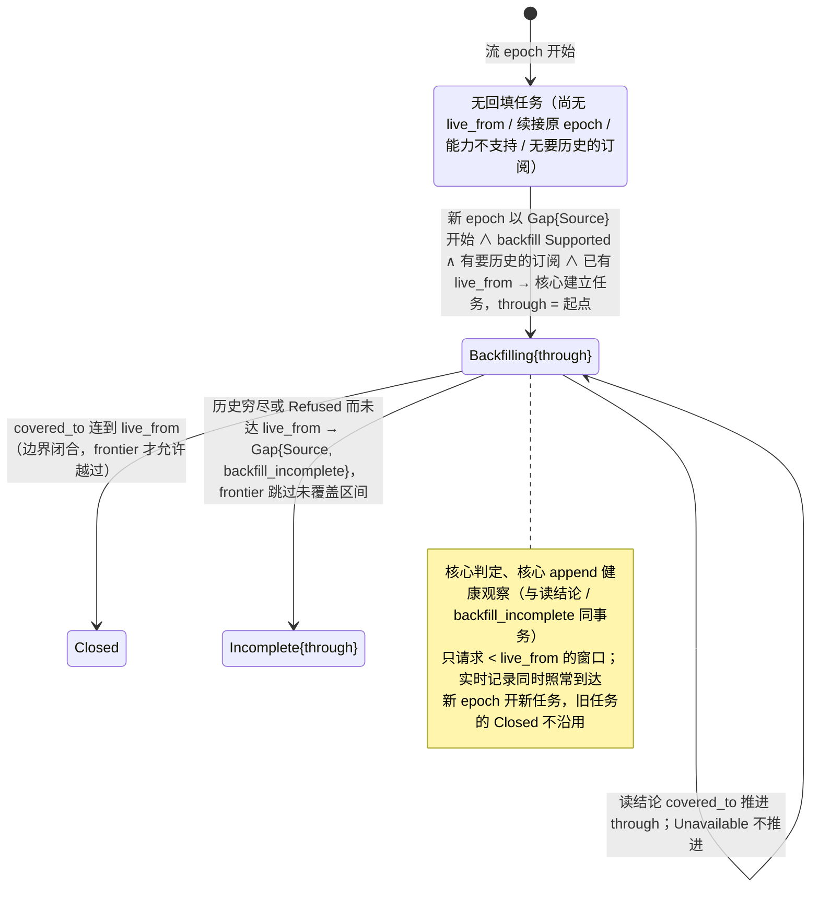
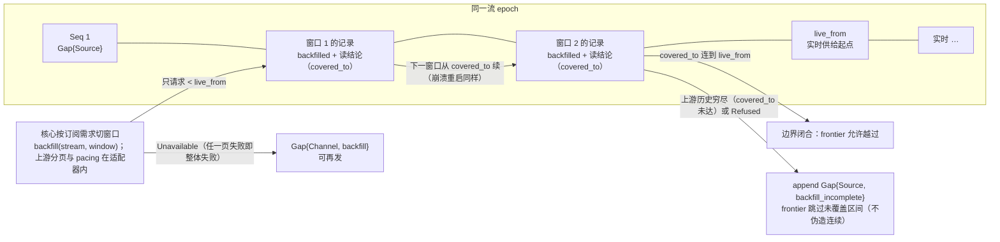
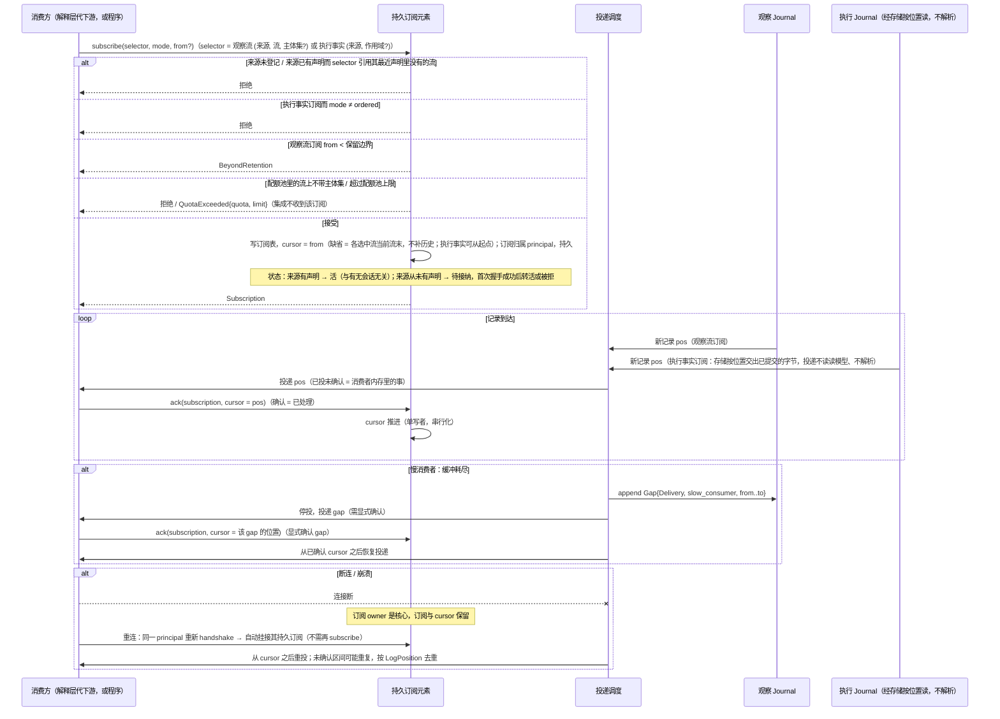
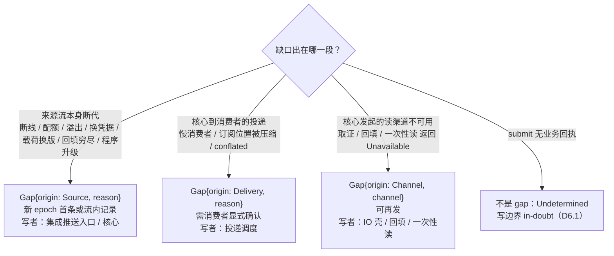

# 03 观察入库、readiness、回填、订阅与 gap

对照：§4.1、§4.2、§8.3、§8.4、§8.5 订阅组、W6。索引见 `README.md`。

## D3.1 一次推送的入库时序

对照：§8.3 推送表与集成义务（时间权威与归因）、§2.1 处理器、§4.3、§4.2 投递、§6.2 偏离是状态。

读法：

- 核心是时间权威：`LogPosition` 按到达顺序分配，venue seq 只是证据；乱序与重复不被核心修正，由派生侧 fold 按种类处理：成交按 execution_id 与修订计数（§8.1），其余种类按 venue seq 等证据。
- 同一条推送可能同时是三件事：订阅者的一条记录、某单据偏离状态的触发、某 `Undetermined` Attempt 的决议证据。
- 迟到回执走的就是这条路：旧 epoch 的被丢在第二个分支；新会话重送的在 `opt` 分支并入原 Attempt。

核出：无。

## D3.2 集成 × 流的 readiness、回填进度与流 epoch 决定

对照：§8.4 readiness 状态机与回填进度、§8.2 `handshake`、§4.2 `Gap{Source}` 原因集、§7.6 `rotate_credential`。

读法：readiness 由集成推送（`Disconnected` 由核心），只说实时供给；回填进度由核心凭读结论记录判定，只说这一个流 epoch 的 `[起点, live_from)` 补齐到哪。二者都是派生健康观察（不需确认），经 `health` 读模型对解释层可见，再由它翻成下游的连接状态；它们不改变记录接受条件——接受只看 `session_epoch`。

核出：readiness 原把 `Backfilling` 放在 `Live` 之前，而回填窗口的终点 `live_from` 要到 `Live` 才有，`through` 又是核心凭读结论记录才证明得了的——已拆为集成推送的 readiness 与核心判定的回填进度（§8.4）。

## D3.3 回填与实时边界

对照：§8.2 `backfill`、§8.4 回填、实时边界；Q14。

读法：回填记录与实时记录同形、同 epoch，只多一个 `backfilled` 标记；按范围不重叠，所以不需要逐条去重。续点是读结论记录里的覆盖边界，不需要任何一方保存游标。

核出：无。

## D3.4 订阅、cursor、ack、慢消费者与重连

对照：§4.2 cursor 与确认、§8.5 订阅组（两种 selector、配额、订阅状态）、§7.5 订阅表、W6 步 3–4、W14、W20。

读法：

- 确认语义唯一：`ack` = 已处理。已投未确认的记录在崩溃后会再见一次；已确认的永不重投（退回只经控制面 `rewind_cursor`）。
- 程序是同一种订阅者：它的 cursor 与 `Checkpoint` 同事务持久化（D4.1），所以程序永远不会看到已折入状态的记录。
- 执行事实订阅走同一套 cursor 与 ack，但只能 `ordered`：执行事实不压缩、不合并，所以慢消费者只背压自己，不出现 `Gap{Delivery}`；投递经存储按位置读出已提交的记录、原样搬运，不经读模型、不解析，所以观察侧的订阅与投递元素不依赖效应侧类型（§7.3 uses 图）。

核出：无。

## D3.5 三种消费方式

对照：§4.2 消费方式表。

| 方式 | 触发依据 | 是否跳过 | 损失记法 |
|---|---|---|---|
| await-all | 所有输入流的**完备进度**到达要求位置 | 否（等待） | — |
| ordered | 单流顺序 | 否（背压） | — |
| latest / conflated | 最新值 | 是 | `Gap{Delivery, conflated}` 或消费者声明的窗口界 |

读法：

- `await-all` 看 frontier 不看 cursor——读到 Seq 60 不等于 60 之前的事件时间不再迟到。
- 损失语义由消费者显式声明：UI 报价显示可接受 conflation，依赖完整状态路径的阈值策略不能默认接受。

核出：无。

## D3.6 gap 来源判定

对照：§4.2 gap 三来源、§8.3 映射表、§6.7 两故障面。

读法：集成一个进程崩溃可能同时产生 `Gap{Source}`（它的流）和 `Undetermined`（它在途的 `submit`）；两面各自收敛，互不替代。

核出：`Gap{Channel}` 的落点（取证 → 执行事实侧属该 Attempt；回填 / 一次性读 → 观察侧该流）原文未写——已并入 §4.2。
