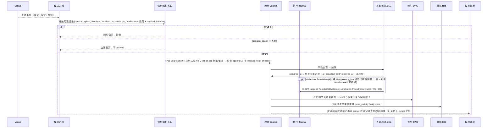
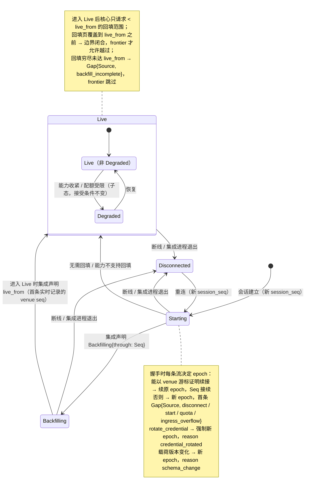
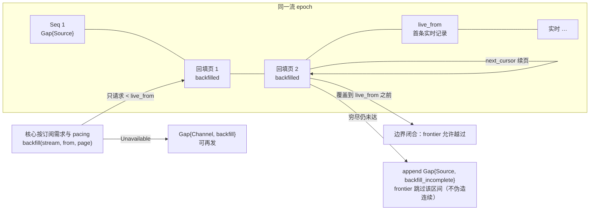
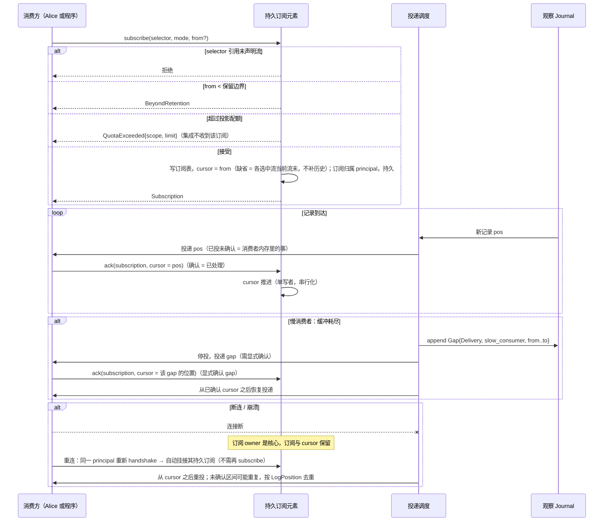
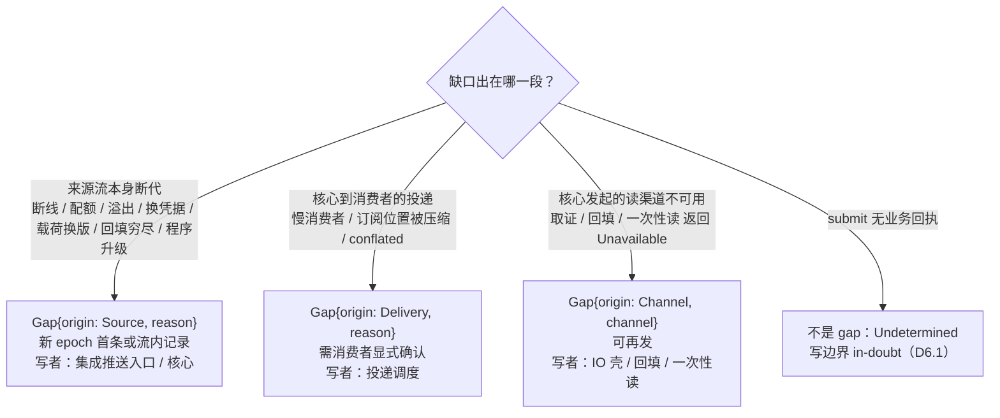

# 03 观察入库、readiness、回填、订阅与 gap

对照：§3.1、§3.2、§6.3.6、§6.3.8、§6.3.10、§6.4 订阅组、W6。索引见 `README.md`。

## D3.1 一次推送的入库时序

对照：§6.3.6 推送表、§6.3.8 时间权威与归因、§2.2 处理器、§3.3、§3.2 投递、§5.2 偏离是状态。

读法：

- 核心是时间权威：`LogPosition` 按到达顺序分配，venue seq 只是证据；乱序与重复不被核心修正，由派生侧 fold 按 venue seq 处理。
- 同一条推送可能同时是三件事：订阅者的一条记录、某单据偏离状态的触发、某 `Undetermined` Attempt 的决议证据。
- 迟到回执走的就是这条路：旧 epoch 的被丢在第二个分支；新会话重送的在 `opt` 分支并入原 Attempt。

核出：无。

## D3.2 集成 × 流的 readiness 与流 epoch 决定

对照：§6.3.10 readiness 状态机、§6.3.5 `handshake` 行、§3.2 `Gap{Source}` 原因集、§6.7.3 `rotate_credential`。

读法：readiness 变化是派生健康观察（不需确认），经 `health` 读模型对 Alice 可见；它不改变记录接受条件——接受只看 `session_epoch`。

核出：无。

## D3.3 回填与实时边界

对照：§6.3.10 回填、实时边界；Q14。

读法：回填记录与实时记录同形、同 epoch，只多一个 `backfilled` 标记；按范围不重叠，所以不需要逐条去重。

核出：无。

## D3.4 订阅、cursor、ack、慢消费者与重连

对照：§3.2 cursor 与确认、§6.4 订阅组、§6.7.2 订阅表、W6 步 3–4、W14。

读法：

- 确认语义唯一：`ack` = 已处理。已投未确认的记录在崩溃后会再见一次；已确认的永不重投（退回只经控制面 `rewind_cursor`）。
- 程序是同一种订阅者：它的 cursor 与 `Checkpoint` 同事务持久化（D4.1），所以程序永远不会看到已折入状态的记录。

核出：无。

## D3.5 三种消费方式

对照：§3.2 消费方式表。

| 方式 | 触发依据 | 是否跳过 | 损失记法 | 典型消费者 |
|---|---|---|---|---|
| await-all | 所有输入流的**完备进度**到达要求位置 | 否（等待） | — | 依赖完整状态路径的阈值策略、程序节点的 `Join` |
| ordered | 单流顺序 | 否（背压） | — | 程序 cursor、读模型 fold |
| latest / conflated | 最新值 | 是 | `Gap{Delivery, conflated}` 或消费者声明的窗口界 | UI 报价显示 |

读法：`await-all` 看 frontier 不看 cursor——读到 Seq 60 不等于 60 之前的事件时间不再迟到。

## D3.6 gap 来源判定

对照：§3.2 gap 三来源、§6.3.7 映射表、§5.4 两故障面。

读法：集成一个进程崩溃可能同时产生 `Gap{Source}`（它的流）和 `Undetermined`（它在途的 `submit`）；两面各自收敛，互不替代。

核出：`Gap{Channel}` 的落点（取证 → 执行事实侧属该 Attempt；回填 / 一次性读 → 观察侧该流）原文未写——已并入 §3.2。
