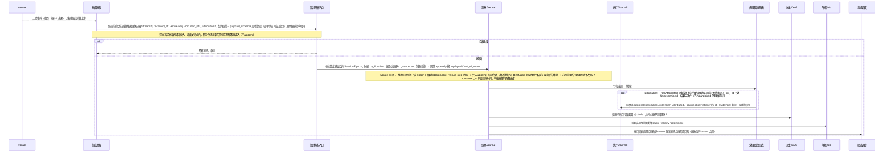
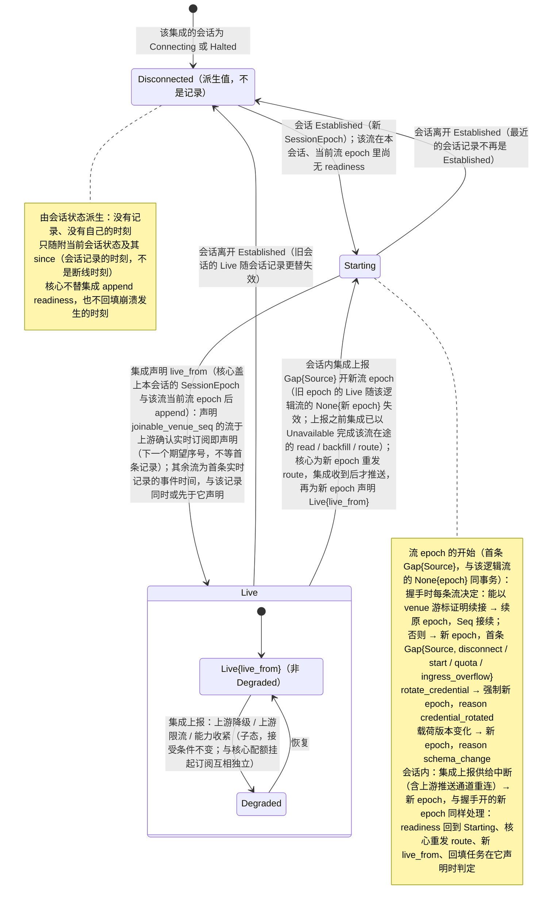
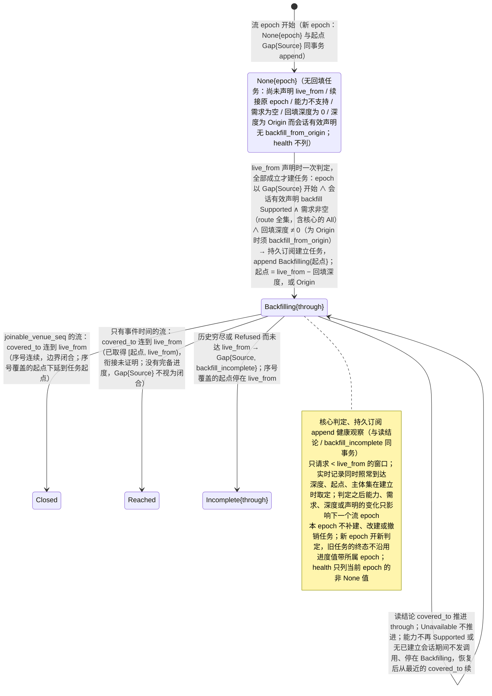
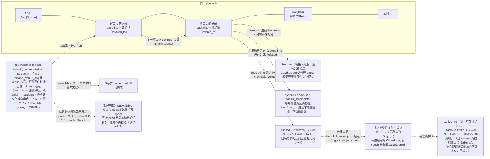
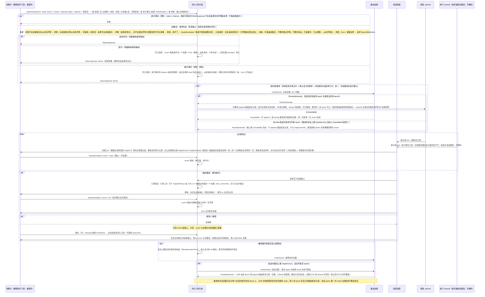
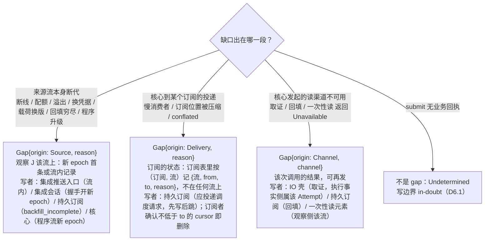

# 03 观察入库、readiness、回填、订阅与 gap

对照：§4.1、§4.2、§8.3、§8.4、§8.5 订阅组、W6。索引见 `README.md`。

## D3.1 一次推送的入库时序

对照：§8.3 推送表与集成义务（位置与完备、归因）、§7.2 会话 epoch、§2.1 处理器、§4.3、§4.2 投递、§6.2 偏离是状态、§8.1 来源顺序、§8.4 序号覆盖。

读法：

- 位置归核心，完备归来源：`LogPosition` 由核心按到达顺序分配，核心是它的源头，但到达顺序只是日志顺序，不是来源顺序；venue seq、`occurred_at` 是来源给的字段，随记录作为副本保存。完备只来自来源证据（序号覆盖），不从到达时刻或任何时限推导。
- 乱序与重复不被核心修正，由派生侧 fold 按种类处理：成交按 execution_id 与修订计数；订单状态与持仓按身份取最近观察，只凭四种声明的来源定序证据比较（同一 epoch 的 venue 序号、`order_revision`、声明 `query_not_lagging` 的流上不带序号的回答对 `dispatch_end` 及之前的记录、声明 `push_ordered` 的流上同一会话 epoch 且同一流 epoch 内的两条推送；上游推送通道重连由集成报为 `Gap{Source}` 开新流 epoch，两侧推送不可比），其余不可比，最近观察顺序未确立时并列；其余种类由各自的 fold 规定（§8.1）。
- 同一条推送可能同时是三件事：订阅者的一条记录、某单据偏离状态的触发、某 `Undetermined` Attempt 的决议证据。
- 迟到回执走的就是这条路：旧会话的通道关闭后不再读入（其在途调用已在会话结束时完成为 `NoResponse`）；新会话重送的在 `opt` 分支并入原 Attempt。

核出：无。

## D3.2 集成 × 流的 readiness、回填进度与流 epoch 决定

对照：§8.4 readiness 的 fold、回填进度与健康不留旧值、§7.2 会话状态、§8.2 `handshake`、§4.2 `Gap{Source}` 原因集、§7.6 `rotate_credential`。

读法：readiness 是集成在一个会话里、对该流一个流 epoch 的实时供给的陈述：集成推送，核心盖上到达会话的 `SessionEpoch` 与该流当时的流 epoch 后 append；fold 只取同时带着最近一条会话记录的 `SessionEpoch` 与该流当前流 epoch 的值，且只在那条会话记录是 `Established` 时；已建立而当前流 epoch 里没有这样的值为 `Starting`，会话不在 `Established` 时为派生的 `Disconnected`。会话内上报的 `Gap{Source}` 开新流 epoch，readiness 回到 `Starting`，与握手开的新 epoch 同样处理：同一会话里 e0 为 `Live`、之后 `Gap{Source}` 与 `None{e1}` 已 append 而 e1 尚无 readiness，该流是 `Starting`，不是 e0 的 `Live`。流上的 `read`、`backfill`、`route` 调用是发出时那个流 epoch 的内层：集成在上报 `Gap{Source}` 之前以 `Unavailable` 完成它们，迟到的结果由核心完成为 `Unavailable`、不作新 epoch 的记录（§8.2、§8.4）。回填进度由核心凭读结论记录判定、持久订阅 append，只说当前流 epoch 的 `[起点, live_from)` 补齐到哪。二者都是健康观察（不需确认），经 `health` 读模型对解释层可见，再由它翻成下游的连接状态；它们不改变记录接受条件——核心只从当前会话的通道读入。

核出：readiness 原把 `Backfilling` 放在 `Live` 之前，而回填窗口的终点 `live_from` 要到 `Live` 才有，`through` 又是核心凭读结论记录才证明得了的——已拆为集成推送的 readiness 与核心判定的回填进度（§8.4）。

## D3.3 回填与实时边界

对照：§8.2 `backfill`、§8.4 回填、实时边界、衔接、序号覆盖；§8.1 精确重建的前提；Q14。

读法：回填记录与实时记录同形、同 epoch，只多一个 `backfilled` 标记；回填窗口都在 `live_from` 之前。有可衔接序号的流上二者按序号不重叠也不留洞，不需要逐条去重。只有事件时间的流上，实时订阅确认前上游已发出的记录可能两边都不在，迟到的实时记录也可能与回填的同一对象并存，所以只称“到达”，也没有完备进度。续点是读结论记录里的覆盖边界，不需要任何一方保存游标。

核出：无。

## D3.4 订阅、route、cursor、ack、慢消费者与重连

对照：§4.2 cursor 与确认、§8.5 订阅组（两种 selector、逐项接纳、配额、订阅状态）、§8.2 `route`、§7.5 订阅表、W6 步 3–4、W14、W20。

读法：

- 确认语义唯一：`ack` = 已处理。已投未确认的记录在崩溃后会再见一次；已确认的永不重投（退回只经控制面 `rewind_cursor`）。
- 程序是同一种订阅者：它的 cursor 与 `Checkpoint` 同事务持久化（D4.1），所以程序永远不会看到已折入状态的记录。
- 需求按流的全集下发：多个订阅对同一主体只路由一次，配额在核心计量。序号覆盖只看记录：推送只在该流 epoch 上同会话、确认供给 `All` 且 `refused` 为空的路由结论记录之后才计入；之后一条不确认这一点的路由结论记录使计入停住，直到下一条确认的记录（§8.4）。订阅表与核心自己的需求都不是它的输入。
- 投递按主体：数据记录只看信封上的 `subject`，不论来自推送、回填、一次性读还是回执；控制记录投给该流每一项。只投递项不改变需求与配额，一次性读得 `Pending{from, instance_id}` 后从 `from` 订阅一个只投递项，即收到那条结论或 gap（同一核心实例内）。
- 投递缺口是订阅的状态，不是流上的记录：投递调度要跳过时先请持久订阅写进订阅表，写下之后才跳过；每次投递与重新挂接都先交出它；确认不低于 `to` 的 cursor 时与 cursor 推进同一次写删除，取消订阅或该流从订阅里移除时随之删除。`subscriptions` 读模型逐项列出未确认的缺口；其他订阅者看不到它。
- 执行事实订阅走同一套 cursor 与 ack，但只能 `ordered`：执行事实不压缩、不合并，所以慢消费者只背压自己，没有投递缺口；投递经存储按位置读出已提交的记录、原样搬运，不经读模型、不解析，所以观察侧的订阅与投递元素不依赖效应侧类型（§7.3 uses 图）。它不经 `route`，不受声明与会话影响。

核出：无。

## D3.5 三种消费方式

对照：§4.2 消费方式表、`await-all` 的要求点与装载期检查；§2.3 位置归核心、完备归来源。

| 方式 | 触发依据 | 是否跳过 | 损失记法 |
|---|---|---|---|
| await-all | 所有指定输入都达到要求点：核心日志位置（核心自己可判定，不说任何完备），或来源证据证明的覆盖在它自己坐标上的一点（今天只有序号覆盖：当前流 epoch 的一个 venue 序号，`through` 越过即满足） | 否（等待；无完备证据的输入上覆盖要求永不满足） | — |
| ordered | 单流顺序；多条流各自有序，流与流之间不定序 | 否（背压） | — |
| latest / conflated | 最新值 | 是 | 订阅上的投递缺口 `Gap{Delivery, conflated}`，或消费者声明的等待窗口 |

读法：

- `await-all` 的覆盖要求看来源证据证明的覆盖，不看 cursor——读到 Seq 60 不说明之前的记录已全部到达。没有 `joinable_venue_seq` 的输入没有完备证据：按最近声明，要求覆盖的 `await-all` 在装载时被拒（与 `required_inputs` 缺字段同属 fail-closed），程序改等核心日志位置、用 `ordered`，或声明自己的等待窗口；装载后某个新流 epoch 不再有证据时，该 epoch 上的覆盖要求不满足，程序不因它推进。
- 跨流按事件时间对齐没有来源证据，不提供；要按时间截止的消费者声明等待窗口：它是消费者的意图，不是流的元数据，也不冒充完备，窗口之后到达的记录照常 append、照常投递。
- 损失语义由消费者显式声明：UI 报价显示可接受 conflation，依赖完整状态路径的阈值策略不能默认接受。

核出：无。

## D3.6 gap 来源判定

对照：§4.2 gap 三来源、§7.5 观察 `Journal` 写者与订阅表、§8.3 映射表、§6.7 两故障面。

读法：集成一个进程崩溃可能同时产生 `Gap{Source}`（它的流）和 `Undetermined`（它在途的 `submit`）；两面各自收敛，互不替代。读模型的 `Snapshot.gaps` 只列 `Gap{Source}`：`Channel` 是调用结果，`Delivery` 属订阅。

核出：`Gap{Channel}` 的落点（取证 → 执行事实侧属该 Attempt；回填 / 一次性读 → 观察侧该流）原文未写——已并入 §4.2。
