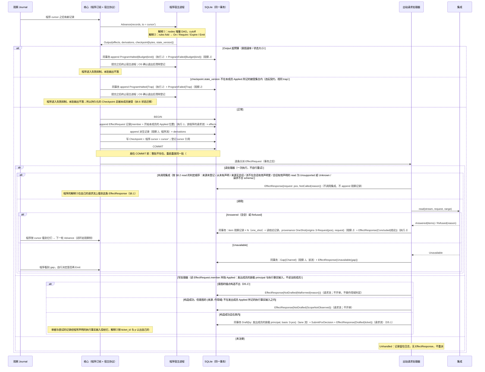
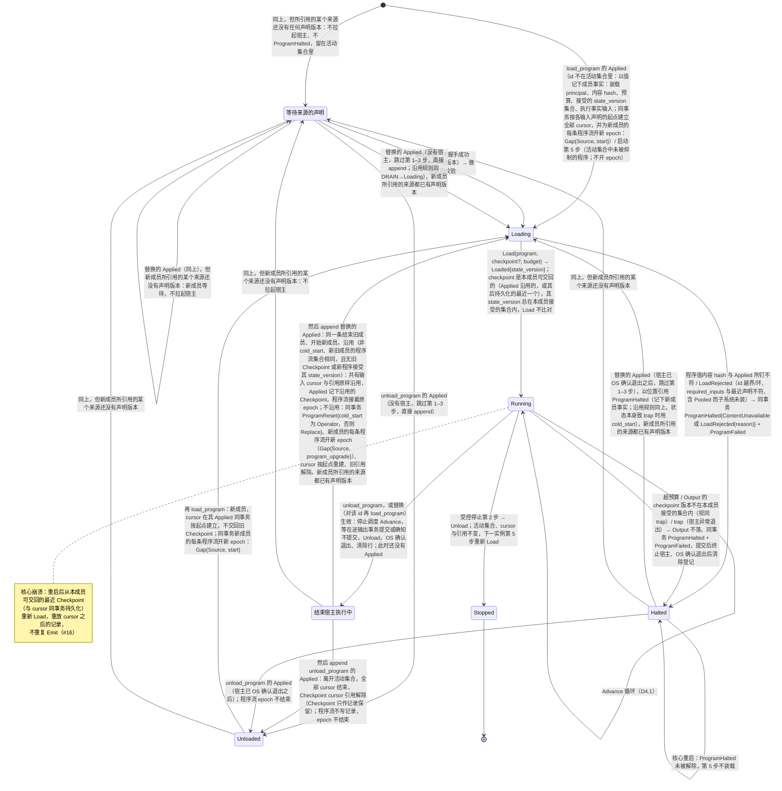
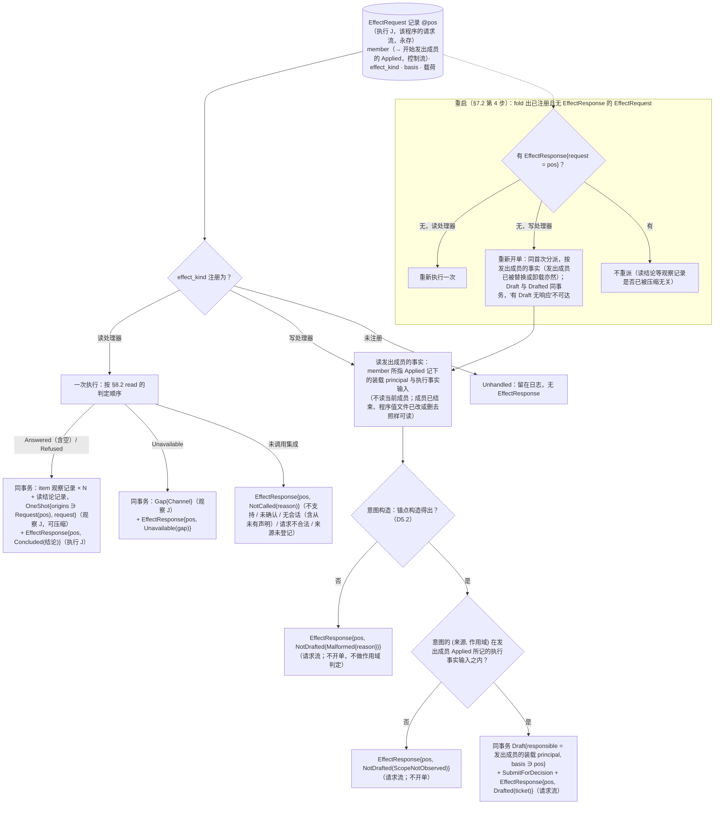

# 04 程序宿主：`Advance` 循环、生命周期、`EffectRequest` 分派

对照：§4.3、§6.1、§8.6、§7.5 程序状态、W10、W17、§9.2 #16/#21。索引见 `README.md`。

## D4.1 一轮 `Advance`

对照：§8.6 宿主协议、§4.3 输入 = 位置推进、§6.1 出口、§7.5 `Checkpoint` 与 cursor 同事务、§4.2 程序订阅。

读法：

- 程序看到的只有 cursor 之后的记录；它的输出是值（`EffectRequest`、派生记录、`Checkpoint`），不是调用。
- 事务边界在 `COMMIT`：`Emit` 是否"发生"以 `EffectRequest` 记录是否持久为准；处理器执行在其后，通过位置引用与请求关联（D4.3）。
- `fetch.bars`（读）与 `trade.place`（写）对程序是同一构造子；差别在注册表。

核出：读处理器的每种完成结果（含空结果、上游拒绝、`Unavailable`、未调用集成）都需要与请求同寿命的完成事实——已并入 §6.1（`EffectResponse`）；空结果在观察侧由读结论记录表示——已并入 §8.2。

## D4.2 程序生命周期

对照：§8.6 装载期校验、`Load`/`Reset`/`Unload`、程序的活动集合与失败抑制、卸载与替换、程序流的 epoch、预算语义、状态迁移、运维冷启动；§8.5 `load_program`/`unload_program`；§6.1 发出成员；§4.2 `start`、`program_upgrade`；§7.2 生命周期表与受控停止。

读法：

- `Halted` 是失败抑制：它由控制流上的执行事实 `ProgramHalted` 承载，跨核心重启保持，不自动恢复——超预算是程序作者的问题，由控制面 principal 决定是否重装；其他程序、账户、核心不受影响。`ProgramFailed` 只供展示。
- 活动集合是控制流上 `load_program`/`unload_program` 的 `Applied` 的 fold；改装载清单或程序值文件不改变它，内容与所钉 hash 不符时不装载。替换是一个动作、一条 `Applied`，中间没有程序不在集合里的时刻。
- 宿主执行在程序成员与核心实例两者之内：`Stopped`（受控停止）与崩溃都只结束宿主执行，成员、cursor 与 `Checkpoint` 引用不变；`unload_program` 与替换先经“结束宿主执行中”结束它，再写结束成员的 `Applied`；没有宿主的成员（等待来源的声明、`Halted`）跳过这一步。
- 等待来源的声明不是失败：没有 `ProgramHalted`，来源一有声明版本就照常校验与装载（§8.6）。任何开始新成员的 `Applied`（首次装载、替换、卸载后再装载），只要新成员所引用的某个来源还没有声明版本，就进入等待，不拉起宿主。
- 没有装载时的 `Reset`：本成员可交回的 `Checkpoint` 总被本成员接受（替换的 `Applied` 比对沿用的，`Output` 检查其后持久化的，§8.6 状态迁移）；`ProgramReset` 只在不沿用的替换 `Applied` 事务里出现。
- 程序流的 epoch 由开始不沿用旧状态之成员的 `Applied` 开出，与该 `Applied` 同一事务，只开在这个新成员的程序流上：让 id 进入活动集合的 `load_program`（`[*]` 与 `Unloaded` 出发的那条）为 `start`，不沿用的替换为 `program_upgrade`；该 id 下第一次被声明的流，这条 gap 无前驱，不论原因是哪一个。每条程序流的 epoch 到该流下一条开 epoch 的 `Gap{Source}` 为止，即同一 id 此后第一个声明该流、不沿用旧状态的成员开始时；开始的成员不声明的流不写记录，epoch 照旧开着。卸载、沿用的替换（要求程序流集合相同）、`Stopped` 与崩溃之后的重新 `Load` 都不开也不结束它。装载开 epoch 而不是 `Reset`，没有 `ProgramReset`（§8.6 程序流的 epoch）。
- 成员结束之后，它已提交的 `EffectRequest` 仍按开始它的 `Applied` 所记事实分派与重派（D4.3）。

核出：无。

## D4.3 `EffectRequest` 分派与重启重派

对照：§6.1（读/写处理器、发出成员、`EffectResponse`、请求与响应的关联是引用）、§8.6 卸载与替换、§3.4 读即观察记录、§7.3 出站请求处理器、§9.2 #21、§7.2 第 4 步。

读法：请求与响应是引用关系不是事务：请求先持久，完成事实稍后以位置指回它。完成事实与请求同在执行 J、同寿命，重派判定不依赖可压缩的观察记录；读的结果最终恰一条 `EffectResponse`、写至多一张单据。读处理器不自行重试——是否再请求由程序看到结果/gap 后决定。写处理器先构造意图，构造不出即 `Malformed`，构造成功才判定作用域；负责人与作用域都取发出成员的 `Applied` 所记事实（请求的 `member`），所以替换或卸载之前提交、之后才分派或在重启后重派的请求，仍以旧成员的 principal 开单、按旧成员的执行事实输入判定。

核出：见 D4.1。
