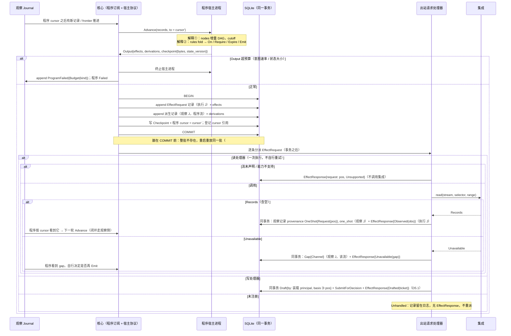
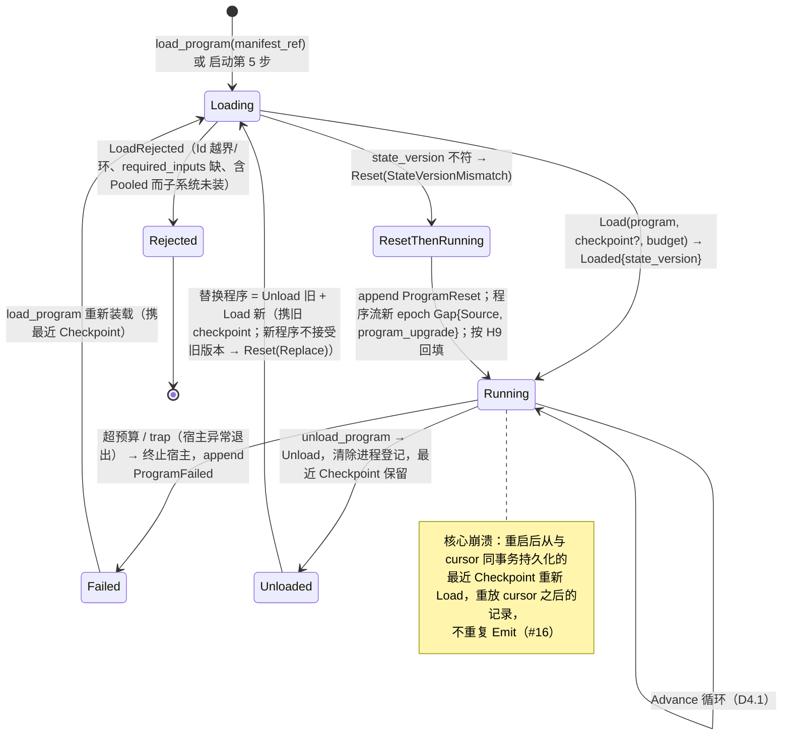
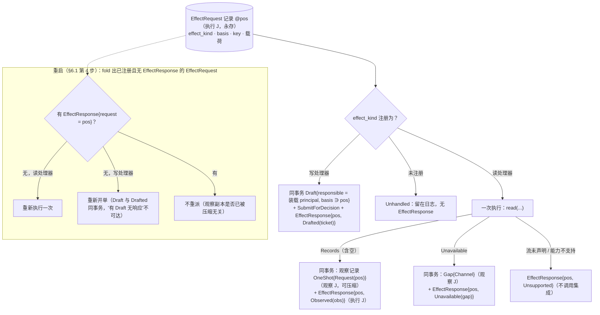

# 04 程序宿主：`Advance` 循环、生命周期、`EffectRequest` 分派

对照：§3.3、§5.1、§6.5、§6.7.2 程序状态、W10、W17、§7.2 #16/#21。索引见 `README.md`。

## D4.1 一轮 `Advance`

对照：§6.5 宿主协议、§3.3 输入 = 位置推进、§5.1 出口、§6.7.2 `Checkpoint` 与 cursor 同事务、§3.2 程序订阅。

读法：

- 程序看到的只有位置之后的记录与 frontier；它的输出是值（`EffectRequest`、派生记录、`Checkpoint`），不是调用。
- 事务边界在 `COMMIT`：`Emit` 是否"发生"以 `EffectRequest` 记录是否持久为准；处理器执行在其后，通过位置引用与请求关联（D4.3）。
- `fetch.bars`（读）与 `trade.place`（写）对程序是同一构造子；差别在注册表。

核出：读处理器的每种完成结果（含空结果、`Unavailable`、`Unsupported`）都需要与请求同寿命的完成事实——已并入 §5.1（`EffectResponse`）。

## D4.2 程序生命周期

对照：§6.5 `Load`/`Reset`/`Unload`、预算语义、状态迁移；§6.4 `load_program`/`unload_program`；§3.2 `program_upgrade`。

读法：`Failed` 不自动恢复——超预算是程序作者的问题，由控制面 principal 决定是否重装；其他程序、账户、核心不受影响。

核出：无。

## D4.3 `EffectRequest` 分派与重启重派

对照：§5.1（读/写处理器、请求与响应的关联是引用）、§6.2 出站请求处理器、§7.2 #21、§6.1 第 4 步。

读法：请求与响应是引用关系不是事务：请求先持久，完成事实稍后以位置指回它。完成事实与请求同在执行 J、同寿命，重派判定不依赖可压缩的观察记录；读的结果最终恰一条 `EffectResponse`、写至多一张单据。读处理器不自行重试——是否再请求由程序看到结果/gap 后决定。

核出：见 D4.1。
