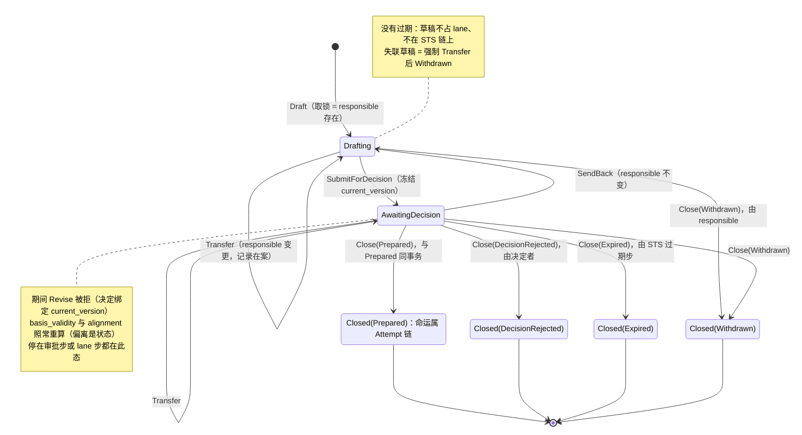
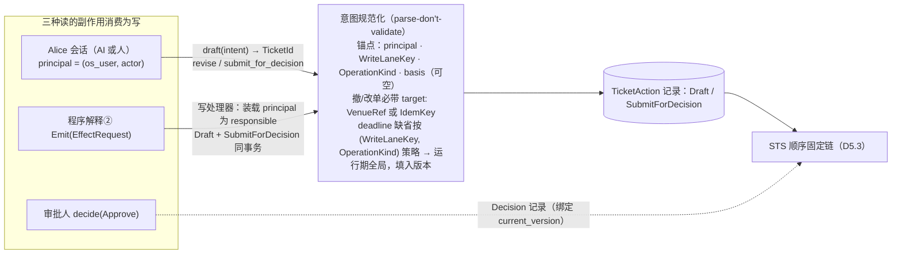
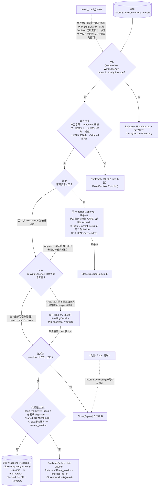
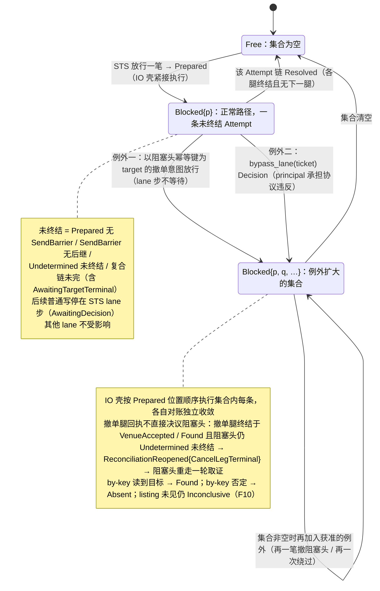
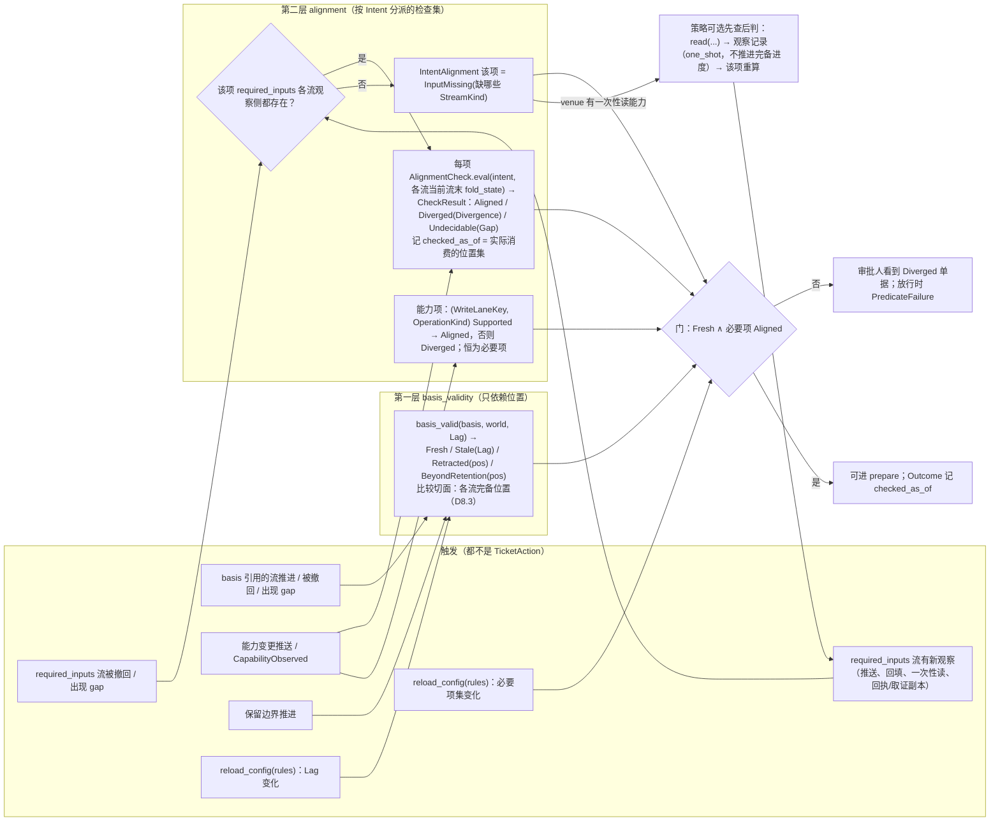
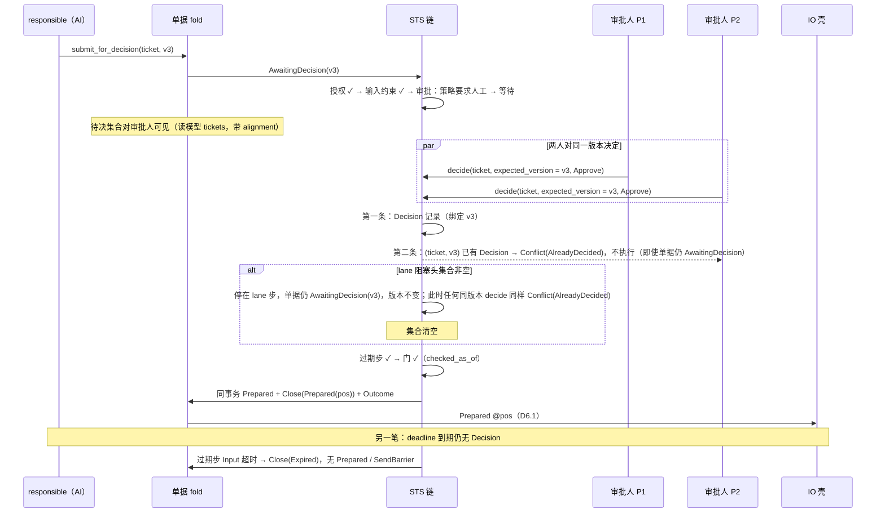

# 05 单据与决策代数 STS

对照：§6.2、§6.3、§6.4、§5.2、§6.1 写处理器、§8.5 单据组、W5、W11、W18。索引见 `README.md`。

## D5.1 单据状态机

对照：§6.2 `TicketAction`、穷尽转移表、与写边界的接口。

读法：

- 锁 = `responsible` 字段：不是互斥原语，没有超时释放；失联由规则处理（过期或强制 `Transfer`）。
- `Closed` 无出边，一张单据至多一次 `Close(Prepared)`；改单撤单各自起新单据。
- 其他 principal 的 `Revise` 直接被拒，不排队不分叉；协作在核心之外（移交、另起单据）。

核出：`Drafting → Close(Expired)` 上一轮已删（无触发者）。

## D5.2 意图从哪来、怎么开单

对照：§6.1 写处理器、§8.5 单据组、§7.6 `deadline` 缺省、§8.1 意图锚点。

读法：三种来源的记录同形（principal + 依据位置）；差别只在授权规则里"哪些 principal 的记录足以进 prepare"。

核出：程序意图无编辑期这一点原文未写——已并入 §6.1（写处理器 `Draft` + `SubmitForDecision` 同事务）。

## D5.3 STS 顺序固定链（从 `AwaitingDecision` 到 `Prepared`）

对照：§6.3 五步表、放行门、规则版本变更；§6.2 门只看必要项；§5.2 `basis_validity`。

读法（假想运行时）：

- 链是事件驱动的：`SubmitForDecision` 跑到第一个等待点；`decide`、阻塞头集合清空、超时各自把它往下推一步；每推一步把该步产生的记录（`Vec<Outcome>` 或 `NonEmpty<Rejection>`）与 `RuleState` 同事务持久化。
- 等待都发生在 `Prepared` 之前：单据在等，不是已放行的记录在等；所以正常路径下同 lane 至多一条未终结 Attempt。
- 过期步是第五步：等待结束后先看 `deadline` 再进门；计时器只是让等待中的单据也能到期，不是让过期单据仍能 `Prepared` 的旁路。
- 门读的是单据 fold 已算好的字段，规则自己不算；世界变了单据先变 `Diverged`，审批人看得到，放行时门自然失败。
- 重启后链从 `RuleState` 续跑：停在审批步的仍等 `decide`；停在 lane 步的等集合清空；计时器按 `deadline`（UTC）重装（D1.2 第 4 步）。

核出：授权步的主体（`responsible`）、不要求人工时审批步的依据（`rule_version`）、门失败的去向（`Close(DecisionRejected)`）、一个版本至多一条 Decision（`Conflict(AlreadyDecided)`）、Decision/`Outcome` 携带 `checked_as_of` 原文未写——已并入 §6.3。

## D5.4 lane 阻塞头

对照：§6.4 lane、队首阻塞协议语义、无第二类越顶队列、显式绕过；不变量 §6.9-1；§6.5 `Resolved`。

读法：阻塞不是锁——后续写的语义依赖队首结果（buying power、待撤订单是否存在、venue 侧顺序），所以是与 venue 的通讯协议语义。撤阻塞头的意图不依赖队首结果，它存在的目的就是让队首结果可判定，所以是唯一不等待的写。任何终结只移出自己；集合为空才放行普通写。

核出：集合语义曾按"单条终结即解除"表述——已统一为集合（§6.4、§6.5、§8.5、§10.5 #3）。

## D5.5 两层对账状态的重算触发

对照：§6.2 偏离是状态、两层分开的原因、`InputMissing` 可行动；§5.2 `basis_validity`；§8.3 能力变更。

读法：第一层只看位置（对所有单据可算），第二层看值（依赖意图类型与 venue 给的观察）。第二层读的是各流**当前流末**的 `fold_state`（含 `one_shot`/`backfilled` 记录，各带质量标记），不是完备位置处的截断值——否则为补齐输入读来的一次性观察永远看不见；也不是 `basis` 位置处的旧值——否则世界变了单据不会变。每次评估消费的位置集记为 `checked_as_of`，进入放行/否决记录。

核出：第二层取值位置原文写作"最新完备进度处"，会看不见一次性读——已改为当前流末（§6.2）；`checked_as_of` 进 Decision/`Outcome` 原文未写——已并入 §6.2、§6.3。

## D5.6 人工审批、过期与版本冲突（W18）

对照：W18 步 3–5、§6.2 决定绑定 `current_version`、§8.5 `decide`、C11。

读法：冲突不是锁：一个 `current_version` 至多一条 Decision，第二个决定返回冲突记录即可；`Closed` 不是挡第二条决定的条件——lane 等待期间单据仍开着、版本未变。

核出：同版本第二次决定在 lane 等待窗口内无判据——已并入 §6.3 审批步（`Conflict(AlreadyDecided)`）。
