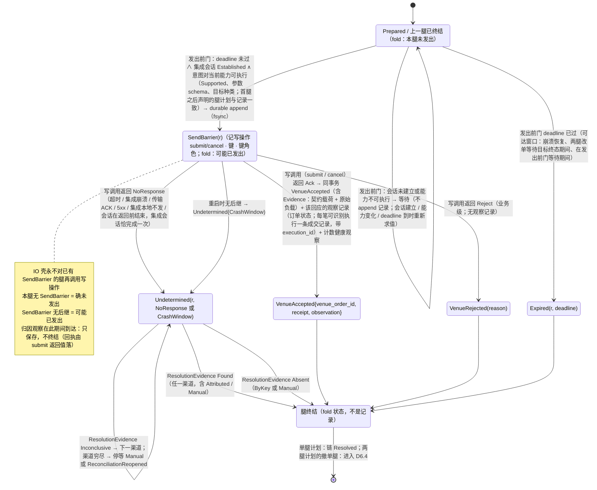
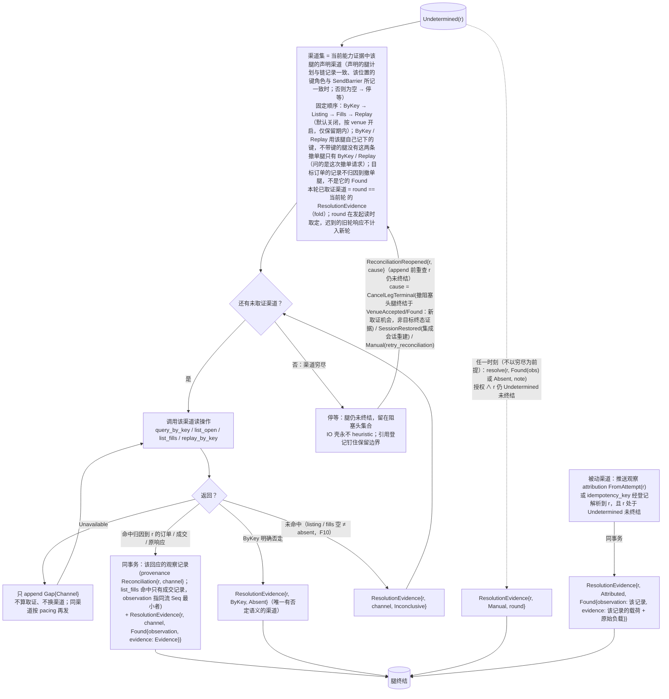
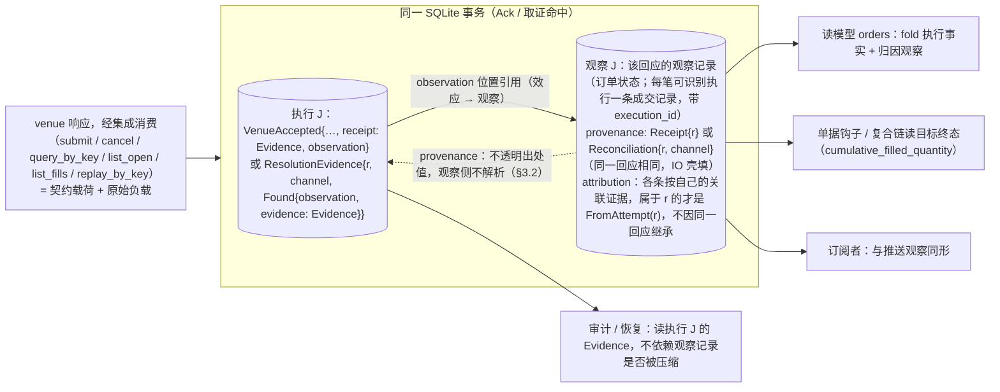
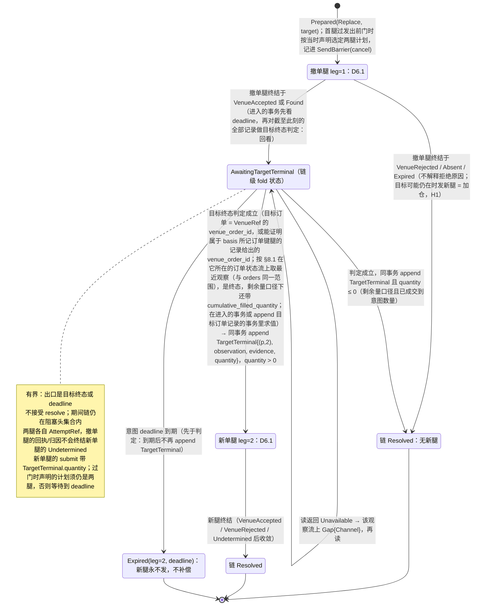
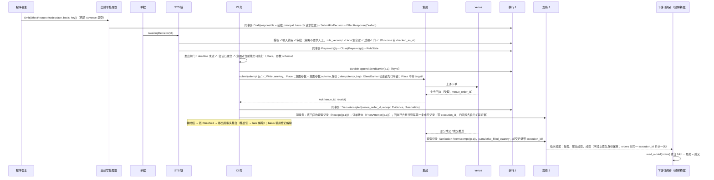
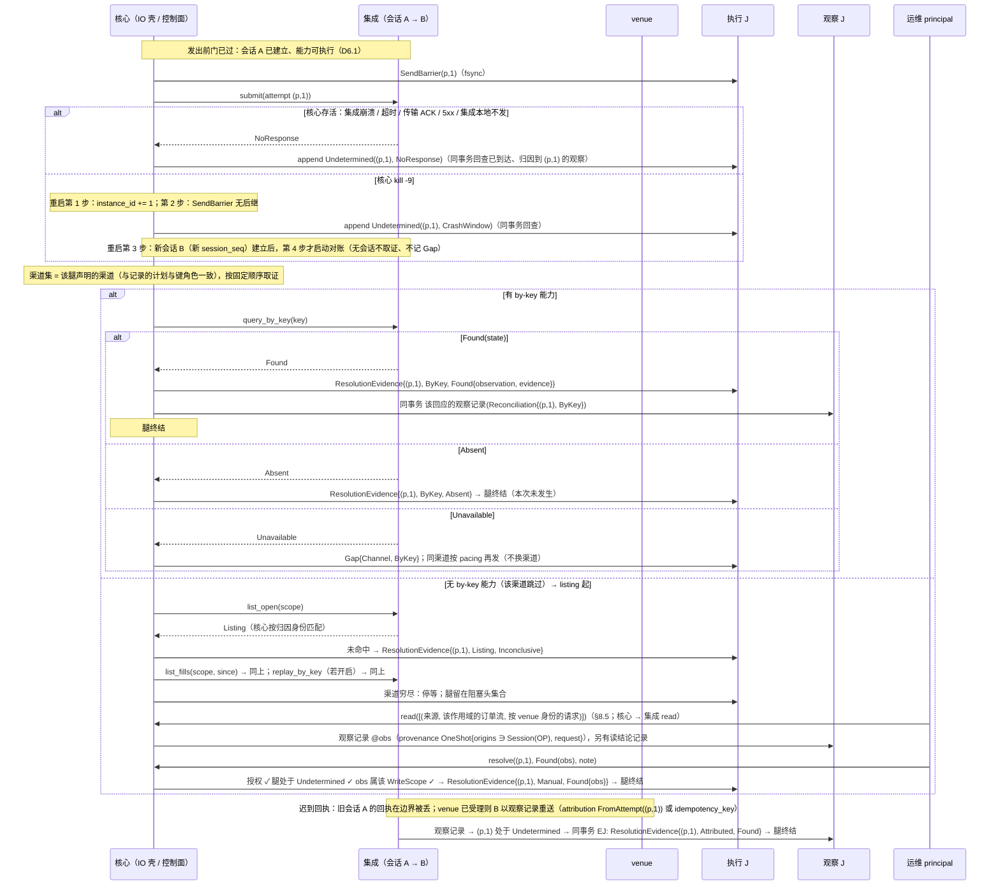
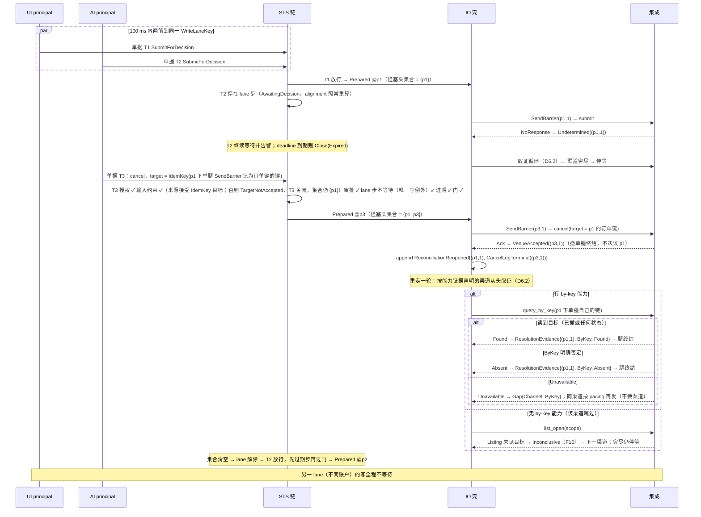

# 06 IO 壳：Attempt 链、取证、两腿改单、时序

对照：§6.5、§6.6、§3.4、§8.2、§8.1 归因、W1、W2、W5、W12。索引见 `README.md`。

身份约定（代数，§6.5）：Attempt 身份 = `attempt_position`；腿身份 `AttemptRef = (attempt_position, leg)`，单腿计划 `leg = 1`（含原子改单）；`Replace` 按两腿计划执行时 `leg = 1` 撤单、`leg = 2` 新单，计划由首腿 `SendBarrier` 记下。图中 `r` 指一条腿。

## D6.1 腿的状态机

对照：§6.5 代数（腿的线性阶段链、发出前门、`SendBarrier`、`VenueAccepted` 只认业务回执）、转移表（单腿）；§6.7 恢复；§8.2 `submit`。

读法（假想运行时）：

- 正常路径 `P → SB → VA`：`SendBarrier` 单独 fsync，`VenueAccepted` 与该回应的观察记录同一事务。
- 只有 `SB → UD` 这一条边把系统带进对账；进去以后写已经"可能发生"，永不重发，只能用读收敛。`P → P` 的等待不进对账：没有 `SendBarrier`，写确未发出。
- `Found` 之后没有 `VenueAccepted`：`Evidence` 在 `ResolutionEvidence` 里，该回应的观察记录供读模型/钩子 fold。

核出：无。

## D6.2 取证循环（`Undetermined` 之后）

对照：§6.6 对账驱动（取证结果与记录的固定矩阵、`ReconciliationReopened`）、先例谱系、`replay_by_key`；§8.2 四个读操作；§8.1 `CapabilityProof` 渠道声明；§8.5 `resolve`/`retry_reconciliation`；§4.2 `Gap{Channel}`。

读法：

- 每一步取证都是一条记录，所以重启后"做到第几个渠道"由 fold 重建，不需要驱动器内存。
- `Unavailable` 不是证据：一个不可用的渠道不能被"跳过"，否则"没查到"会伪装成"查过了"；同渠道按 pacing 重试直到可用。
- 撤阻塞头（D6.7）让 venue 侧到达可读终态，它的作用是触发 `ReconciliationReopened{CancelLegTerminal}` 重走一轮，不是自己产生证据。

核出：撤单后"重访已取证渠道"的触发原文没有——已并入 §6.6（`ReconciliationReopened`）。

## D6.3 一次 venue 交互的记录矩阵

对照：§6.5 回执与取证的记录模型；§10.5 #17；§5.3 归因由谁填；§8.3。

| 交互 | 执行事实侧（永存，含 `Evidence` = 契约载荷 + 原始负载） | 观察侧（该回应的观察记录，可压缩） | 同事务 |
|---|---|---|---|
| 写调用（`submit` / `cancel`）→ `Ack` | `VenueAccepted{venue_order_id, receipt: Evidence, observation}`（`observation` 指订单状态记录） | 订单状态一条（`FromAttempt(r)`）+ 每笔可识别执行一条成交记录（归因按各自的关联证据）；同为 `provenance: Receipt{r}` | 是 |
| 写调用 → `Reject` | `VenueRejected(reason)`（`Unmapped(raw)` 保留） | 无（venue 侧无订单） | — |
| 写调用 → `NoResponse` | `Undetermined(r, NoResponse)` | 无 | — |
| 取证命中 | `ResolutionEvidence{r, channel, Found{observation, evidence: Evidence}}`（`observation` 指命中的那条；`list_fills` 取同一成交流上 `Seq` 最小者） | 回应含订单状态时订单状态一条 + 每笔可识别执行一条成交记录；同为 `provenance: Reconciliation{r, channel}`；只对由自己的关联证据属于 r 的记录填 `FromAttempt(r)` | 是 |
| ByKey 否定 | `ResolutionEvidence{r, ByKey, Absent}` | 无 | — |
| 未命中 | `ResolutionEvidence{r, channel, Inconclusive}` | 无 | — |
| 渠道不可用 | `Gap{origin: Channel, channel}`（属 r） | 无 | — |
| 推送归因命中 | `ResolutionEvidence{r, Attributed, round, Found{observation, evidence: 该推送的载荷 + 原始负载}}` | 该推送记录本身 | 是 |
| 人工决议 | `ResolutionEvidence{r, Manual, round, outcome, principal, note}`；`Found.evidence` = 被引用观察记录在 `resolve` 时的载荷 + 该记录保留的原始负载（所在流不保留原文时为空） | `Found` 引用已存在的观察记录（通常先经 `read` 造出，可压缩） | — |

读法：Attempt 只回答"我的提交到达了吗"；订单是什么状态、成交了多少，在观察记录里给观察宇宙的消费者看，在执行记录的 `Evidence` 里给审计看（契约载荷是结论，原始负载是出处）。

核出：回执证据的永存归属（C13）原文只写了观察侧记录——已并入 §6.5（执行侧持有 `Evidence`）。

## D6.4 `Replace` 两腿计划（`[cancel, submit]`）

对照：§6.2 改单是单一意图类型、腿计划与可执行性；§6.5 腿计划落进记录、转移表复合链（`AwaitingTargetTerminal`、`TargetTerminal`）、按目标身份的读；§3.4 写→读→写、W12、§9.2 #8。原子计划 `[submit]` 是 D6.1 的一条腿，不经本图。

读法：

- 这是 `>>=`：第二腿读目标终态判定选中的那条观察，发生在 IO 壳内，不是单据层两次起单；每条实际发出的腿各过一次发出前门、各至多一条 `SendBarrier`（发出前过期或链已终结的腿没有）、各自记下声明的键与键角色。撤单腿不带键时没有 by-key 渠道；撤单腿都不声明 listing 与成交 / 持仓对账，不带键的撤单腿只由 `Attributed` 或 `Manual` 收敛（§6.6 撤单腿的取证）。
- 撤单腿被拒、缺席或过期 → 链终结、新腿永不发；负责人看观察记录另起单据。
- 崩在撤单腿终态已持久、新腿未 `SendBarrier`（#8）：先 fold 链是否已 `Resolved`（含 `TargetTerminal` 数量 ≤ 0）；已有数量 > 0 的 `TargetTerminal` 则数量取记录、过门后发新腿；否则续 `AwaitingTargetTerminal`，不对已有记录重新判定，此后到达的记录使目标终态判定成立时再 append `TargetTerminal`。

核出：等待目标终态的完整出边（非终态 / 未见 / 不可用 / `deadline`）与腿身份原文没有——已并入 §6.5。

## D6.5 正常下单闭环时序（W1）

对照：W1 步 1–7；§6.1、§6.2、§6.3、§6.5、§8.2、§8.3、§8.5 读模型。

读法：从 `Emit` 到 `VenueAccepted` 是一串各自原子的事务（D1.5）、1 次 fsync 屏障、1 次 venue 写调用；此后一切都是观察推送。

核出：无。

## D6.6 `NoResponse` → 取证 → 停等 → 人工（W2）

对照：W2 步 1–4；§6.7 恢复、§6.6 对账驱动；§7.2 第 1/3 步；§8.5 `read`、`resolve`。

读法：末态可枚举（found → `Evidence` + 观察记录 / absent → 未发生 / 无渠道 → 停等）；停等态之后仍有多条收敛入口：带 principal 的 `resolve`、任一时刻到达的 `Attributed Found`、或 `ReconciliationReopened`（撤阻塞头 / 会话重建 / `retry_reconciliation`）重开的自动取证。

核出：无。

## D6.7 同 lane 并发与撤阻塞头（W5）

对照：W5 正常—失败路径与扩展路径；§6.4 lane 步、无第二类越顶队列；§6.2 目标身份来源之二；§6.6 `ReconciliationReopened{CancelLegTerminal}`。

读法：撤单让 venue 侧到达一个读得出的终态，并触发阻塞头重开一轮取证；阻塞头仍只由取证收敛，撤单不提升任何渠道的证明力（listing 未见仍是 `Inconclusive`）。T3 的 `target` 必须是 p1 某条腿 `SendBarrier` 记为订单键的键（按腿精确匹配）；只能按 venue 订单身份撤单的来源上，T3 在输入约束步以 `TargetNotAccepted` 关闭，不会成为第二条 `Undetermined`。两条路径（撤阻塞头 / `bypass_lane`）都让该 lane 出现两条 `SendBarrier`，区别只在有无 `bypass_lane` 控制记录（它不是 Decision）。

核出："读不到即 `Absent`"的原表述违反 F10——已改为 by-key 否定才 `Absent`（§6.4、W5）。
