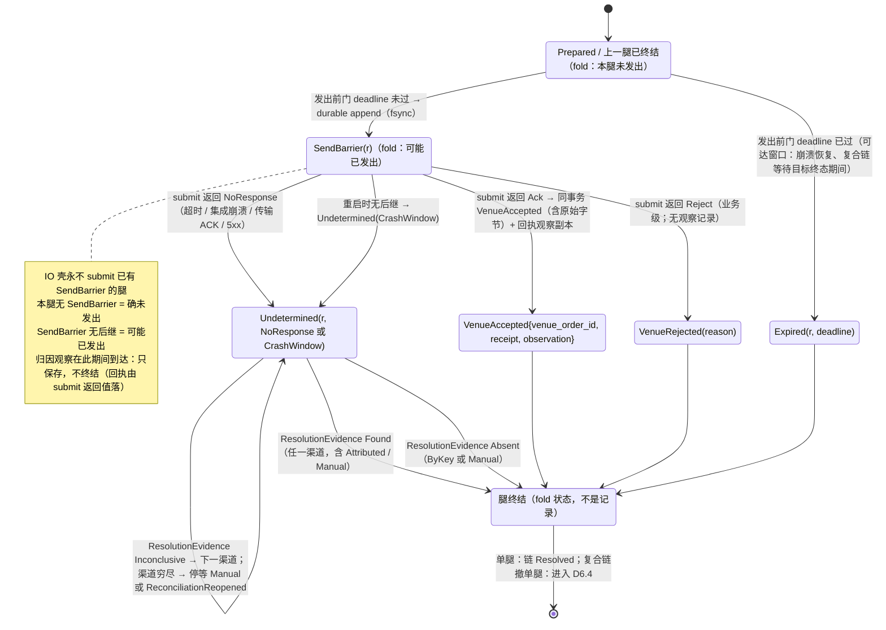
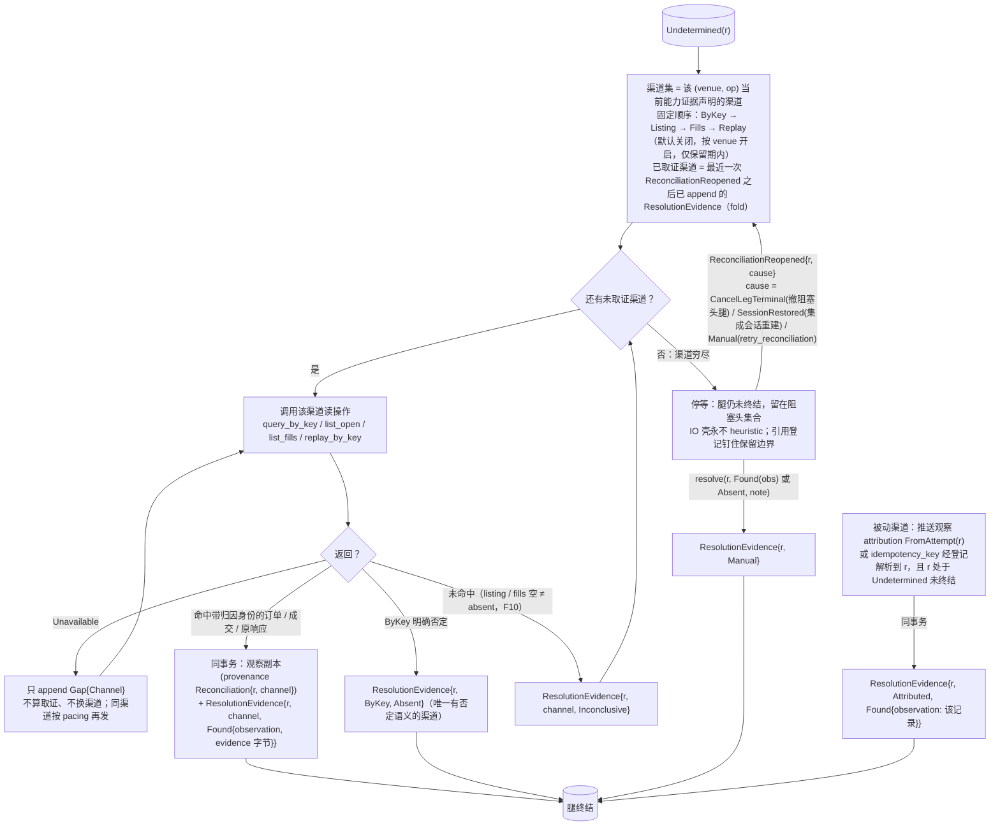
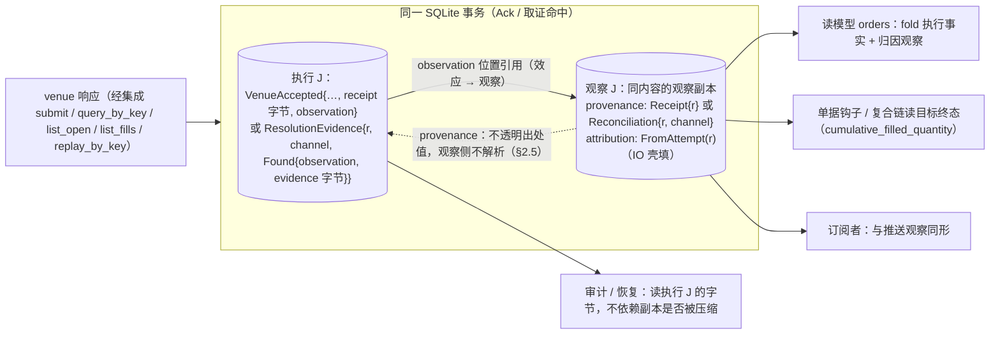
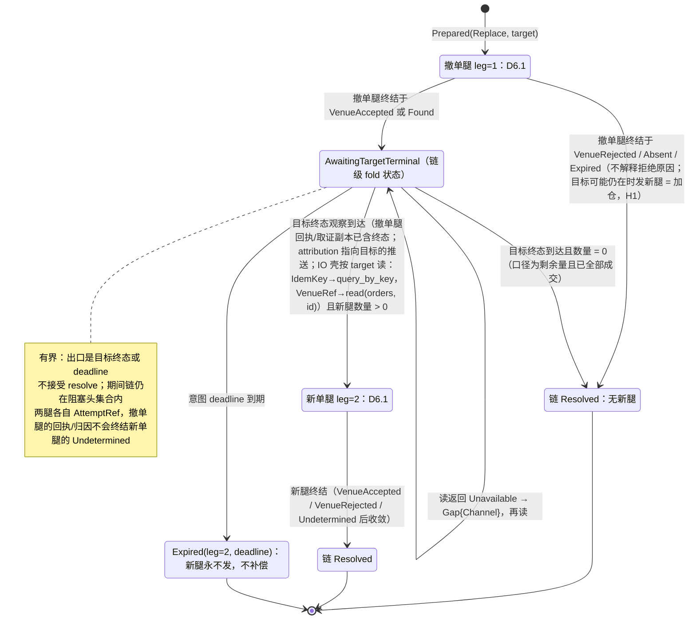
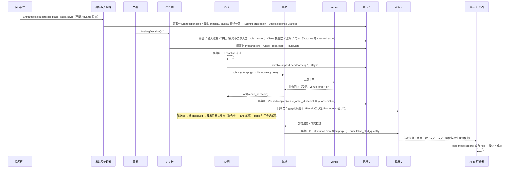
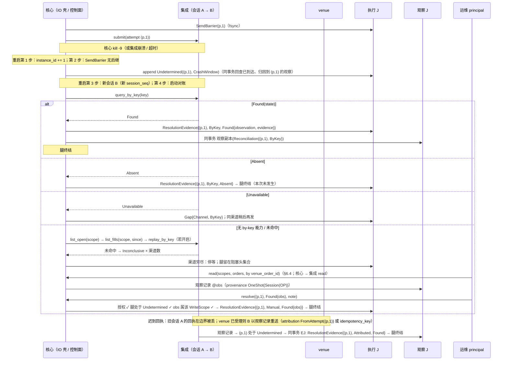
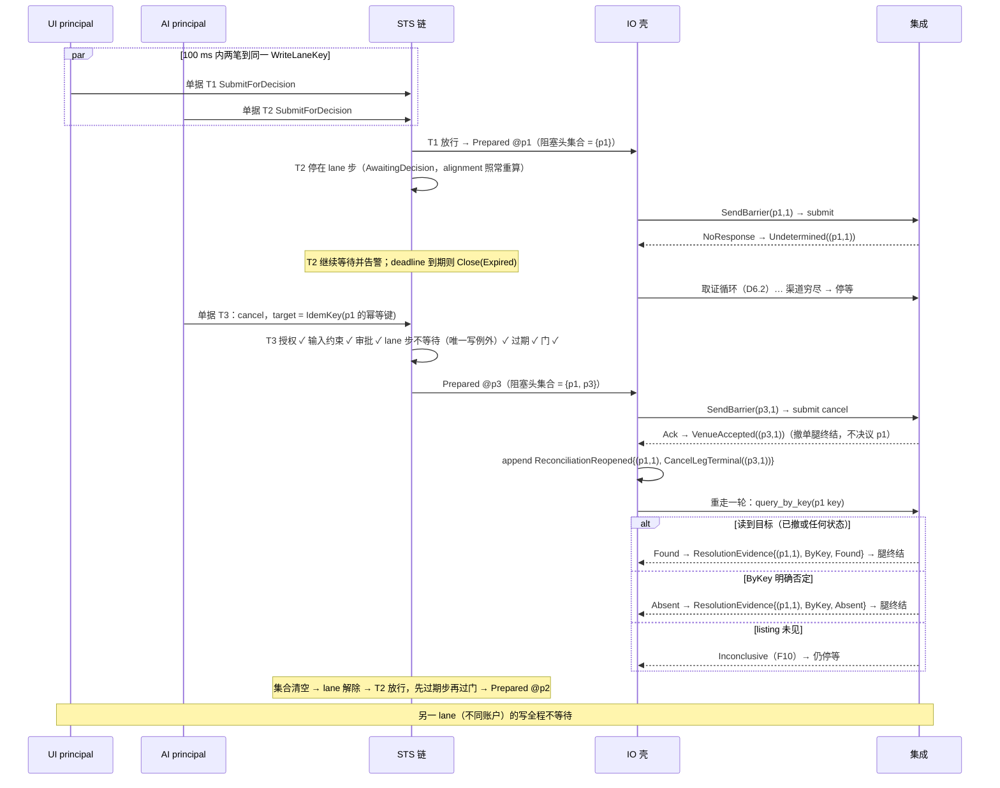

# 06 IO 壳：Attempt 链、取证、复合链、时序

对照：§5.4、§5.5、§6.3.5、§6.3.3 归因、W1、W2、W5、W12。索引见 `README.md`。

身份约定（§5.4 代数）：Attempt 身份 = `attempt_position`；腿身份 `AttemptRef = (attempt_position, leg)`，单腿 `leg = 1`，`Replace` 无原子能力时 `leg = 1` 撤单、`leg = 2` 新单。图中 `r` 指一条腿。

## D6.1 腿的状态机

对照：§5.4 代数（腿的线性阶段链、发出前门、`SendBarrier`、`VenueAccepted` 只认业务回执）、转移表（单腿）、恢复；§6.3.5 `submit`。

读法（假想运行时）：

- 正常路径 `P → SB → VA`：`SendBarrier` 单独 fsync，`VenueAccepted` 与回执观察副本同一事务。
- 只有 `SB → UD` 这一条边把系统带进对账；进去以后写已经"可能发生"，永不重发，只能用读收敛。
- `Found` 之后没有 `VenueAccepted`：证据字节在 `ResolutionEvidence` 里，观察副本供读模型/钩子 fold。

核出：无。

## D6.2 取证循环（`Undetermined` 之后）

对照：§5.4 对账驱动的自动化边界（取证结果与记录的固定矩阵、`ReconciliationReopened`）、先例谱系、`replay_by_key`；§6.3.5 四个读操作；§6.3.1 `CapabilityProof` 渠道声明；§6.4 `resolve`/`retry_reconciliation`；§3.2 `Gap{Channel}`。

读法：

- 每一步取证都是一条记录，所以重启后"做到第几个渠道"由 fold 重建，不需要驱动器内存。
- `Unavailable` 不是证据：一个不可用的渠道不能被"跳过"，否则"没查到"会伪装成"查过了"；重试同渠道直到可用，或等会话重建后 `SessionRestored` 重开。
- 撤阻塞头（D6.7）让 venue 侧到达可读终态，它的作用是触发 `ReconciliationReopened{CancelLegTerminal}` 重走一轮，不是自己产生证据。

核出：撤单后"重访已取证渠道"的触发原文没有——已并入 §5.4（`ReconciliationReopened`）。

## D6.3 一次 venue 交互的记录矩阵

对照：§5.4 回执与取证的记录模型；§8.5 #17；§4 归因由谁填；§6.3.8。

| 交互 | 执行事实侧（永存，含原始字节） | 观察侧（可压缩副本） | 同事务 |
|---|---|---|---|
| `submit` → `Ack` | `VenueAccepted{venue_order_id, receipt: RawPayload, observation}` | `provenance: Receipt{r}`、`attribution: FromAttempt(r)` | 是 |
| `submit` → `Reject` | `VenueRejected(reason)`（`Unmapped(raw)` 保留） | 无（venue 侧无订单） | — |
| `submit` → `NoResponse` | `Undetermined(r, NoResponse)` | 无 | — |
| 取证命中 | `ResolutionEvidence{r, channel, Found{observation, evidence: RawPayload}}` | `provenance: Reconciliation{r, channel}`、`attribution: FromAttempt(r)` | 是 |
| ByKey 否定 | `ResolutionEvidence{r, ByKey, Absent}` | 无 | — |
| 未命中 | `ResolutionEvidence{r, channel, Inconclusive}` | 无 | — |
| 渠道不可用 | `Gap{origin: Channel, channel}`（属 r） | 无 | — |
| 推送归因命中 | `ResolutionEvidence{r, Attributed, Found{observation}}`（无 `evidence`） | 该推送记录本身 | 是 |
| 人工决议 | `ResolutionEvidence{r, Manual, outcome, principal, note}` | `Found` 引用已存在的观察记录（通常先经 `read` 造出） | — |

读法：Attempt 只回答"我的提交到达了吗"；订单是什么状态、成交了多少，在观察副本里给观察宇宙的消费者看，在执行记录的字节里给审计看。

核出：回执字节的永存归属（C13）原文只写了观察侧记录——已并入 §5.4（执行侧持有原始字节）。

## D6.4 `Replace` 复合链（无原子 cancel/replace 能力）

对照：§5.2 改单是单一意图类型、§5.4 转移表复合链（`AwaitingTargetTerminal`）、§5.5 写→读→写、W12、§7.2 #8。

读法：

- 这是 `>>=`：第二腿读第一腿的终态观察，发生在 IO 壳内，不是单据层两次起单；两腿各过一次发出前门、各一条 `SendBarrier`、各自的幂等键登记。
- 撤单腿被拒、缺席或过期 → 链终结、新腿永不发；负责人看观察记录另起单据。
- 崩在撤单腿终态已持久、新腿未 `SendBarrier`（#8）：先 fold 链是否已 `Resolved`；未完则续 `AwaitingTargetTerminal`，读目标终态算量，过门后发新腿。

核出：等待目标终态的完整出边（非终态 / 未见 / 不可用 / `deadline`）与腿身份原文没有——已并入 §5.4。

## D6.5 正常下单闭环时序（W1）

对照：W1 步 1–7；§5.1、§5.2、§5.3、§5.4、§6.3.5、§6.3.6、§6.4 读模型。

读法：从 `Emit` 到 `VenueAccepted` 是一串各自原子的事务（D1.5）、1 次 fsync 屏障、1 次 venue 写调用；此后一切都是观察推送。

核出：无。

## D6.6 `NoResponse` → 取证 → 停等 → 人工（W2）

对照：W2 步 1–4；§5.4 恢复、对账驱动；§6.1 第 1/3 步；§6.4 `read`、`resolve`。

读法：末态可枚举（found → 证据字节 + 观察副本 / absent → 未发生 / 无渠道 → 停等）；停等态只能由带 principal 的 `resolve`、或 `ReconciliationReopened`（撤阻塞头 / 会话重建 / `retry_reconciliation`）推进。

核出：无。

## D6.7 同 lane 并发与撤阻塞头（W5）

对照：W5 正常—失败路径与扩展路径；§5.3 lane 步、无第二类越顶队列；§5.2 目标身份来源之二；§5.4 `ReconciliationReopened{CancelLegTerminal}`。

读法：撤单让 venue 侧到达一个读得出的终态，并触发阻塞头重开一轮取证；阻塞头仍只由取证收敛，撤单不提升任何渠道的证明力（listing 未见仍是 `Inconclusive`）。两条路径（撤阻塞头 / `bypass_lane`）都让该 lane 出现两条 `SendBarrier`，区别只在有无 `bypass_lane` Decision。

核出："读不到即 `Absent`"的原表述违反 F10——已改为 by-key 否定才 `Absent`（§5.3/W5）。
