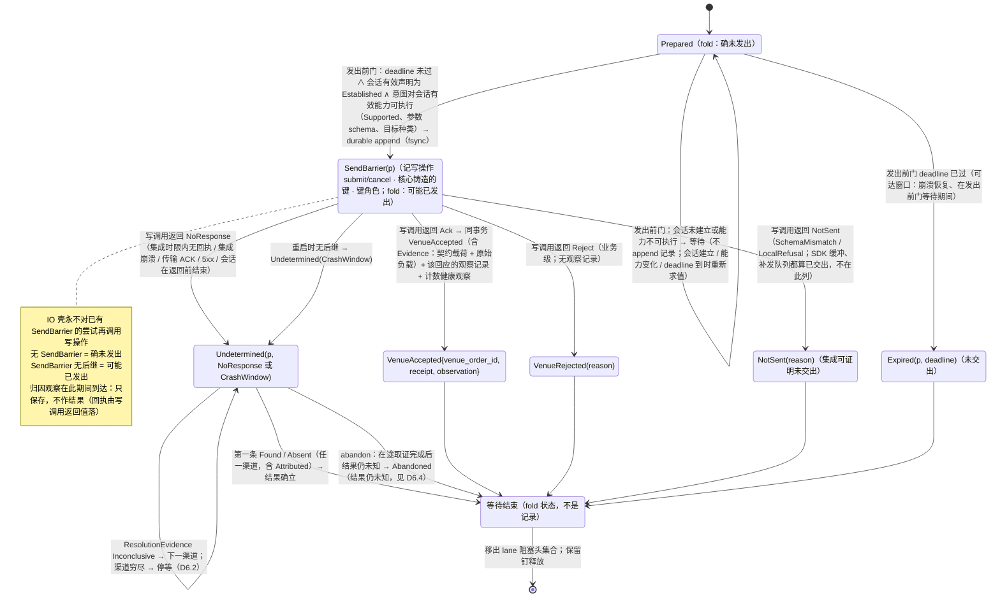
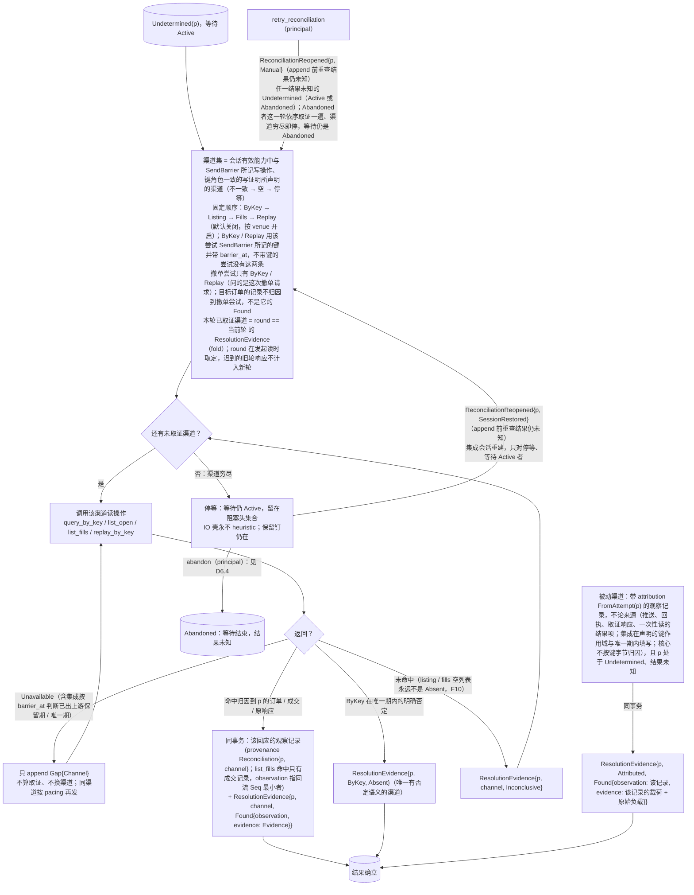
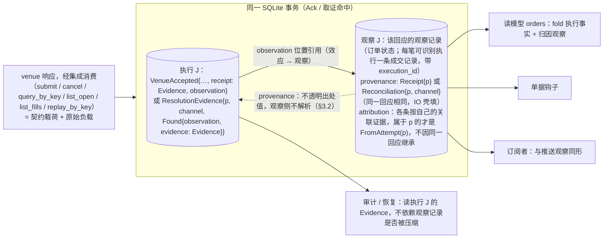
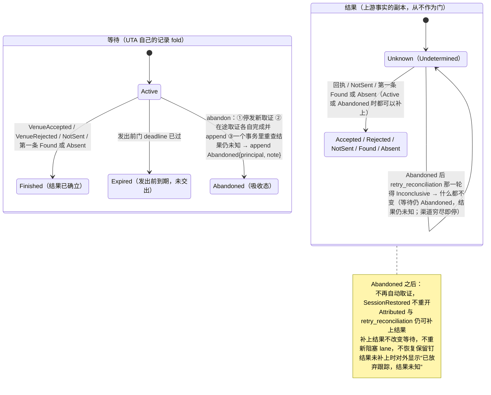
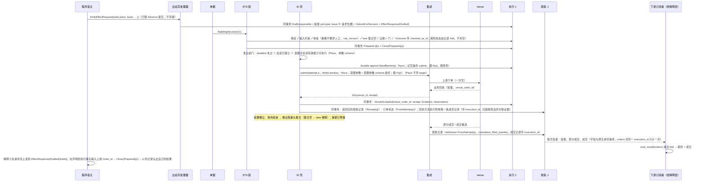
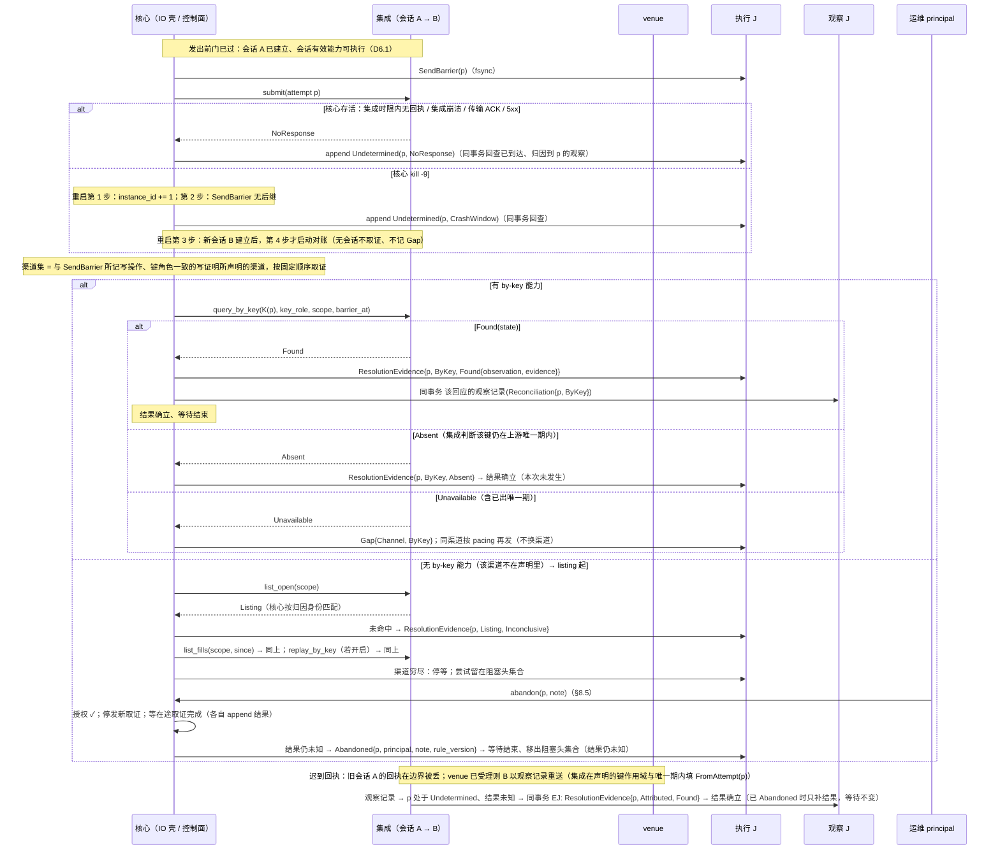
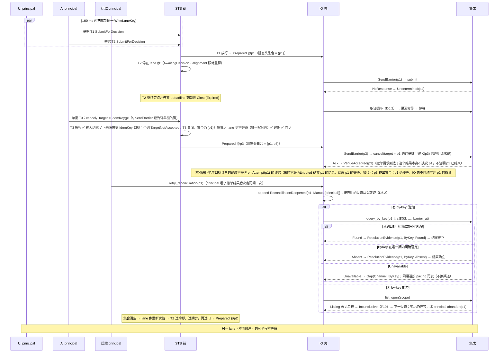

# 06 IO 壳：尝试、取证、放弃跟踪、时序

对照：§6.5、§6.6、§3.4、§8.2、§8.1 归因、W1、W2、W5。索引见 `README.md`。

身份约定（代数，§6.5）：一次尝试 = 一条 `Prepared` 及其后继 = 对上游的一次写，身份 `AttemptRef = attempt_position`（该 `Prepared` 的位置）。图中 `p` 指一次尝试。

## D6.1 尝试的状态机

对照：§6.5 代数（线性阶段链、发出前门、`SendBarrier`、`NotSent`、`VenueAccepted` 只认业务回执）、转移表；§6.7 恢复；§8.2 `submit` / `cancel`。

读法（假想运行时）：

- 正常路径 `P → SB → VA`：`SendBarrier` 单独 fsync，`VenueAccepted` 与该回应的观察记录同一事务。
- 只有 `SB → UD` 这一条边把系统带进对账；进去以后写已经"可能发生"，永不重发，只能用读收敛或由 principal 放弃跟踪。`P → P` 的等待与 `SB → NS` 都不进对账：前者没有 `SendBarrier`，后者集成确知没有交出。
- `Found` 之后没有 `VenueAccepted`：`Evidence` 在 `ResolutionEvidence` 里，该回应的观察记录供读模型 / 钩子 fold。

核出：无。

## D6.2 取证循环（`Undetermined` 之后）

对照：§6.6 对账驱动（渠道顺序、撤单尝试的取证、取证结果与记录的固定矩阵、`ReconciliationReopened`）、`replay_by_key`；§8.2 四个取证操作；§8.3 按 `barrier_at` 判断窗口；§8.5 `retry_reconciliation`；§4.2 `Gap{Channel}`。

读法：

- 每一步取证都是一条记录，所以重启后"做到第几个渠道"由 fold 重建，不需要驱动器内存。
- `Unavailable` 不是证据：一个不可用的渠道不能被"跳过"，否则"没查到"会伪装成"查过了"；同渠道按 pacing 重试直到可用。
- 按键渠道的窗口由集成按 `barrier_at` 判断，核心不持有上游的保留期或唯一期。
- 撤阻塞头（D6.7）的结果不重开阻塞头的取证，也不是阻塞头的证据；要再问一次由 principal 发 `retry_reconciliation`。

核出：无。

## D6.3 一次 venue 交互的记录矩阵

对照：§6.5 回执与取证的记录模型；§10.5 #17；§5.3 归因由谁填；§8.3。

| 交互 | 执行事实侧（永存，含 `Evidence` = 契约载荷 + 原始负载） | 观察侧（该回应的观察记录，可压缩） | 同事务 |
|---|---|---|---|
| 写调用（`submit` / `cancel`）→ `Ack` | `VenueAccepted{venue_order_id, receipt: Evidence, observation}`（`observation` 指订单状态记录） | 订单状态一条 + 每笔可识别执行一条成交记录，归因各按自己的关联证据（撤单回执里目标订单的状态是目标订单的记录，不归到撤单）；同为 `provenance: Receipt{p}` | 是 |
| 写调用 → `Reject` | `VenueRejected(reason)`（`Unmapped(raw)` 保留） | 无（venue 侧无订单） | — |
| 写调用 → `NotSent` | `NotSent{reason, evidence}`（`raw` 是集成据以判定未交出的本地原文，可为空） | 无（没有交给上游） | — |
| 写调用 → `NoResponse` | `Undetermined(p, NoResponse)` | 无 | — |
| 取证命中 | `ResolutionEvidence{p, channel, Found{observation, evidence: Evidence}}`（`observation` 指命中的那条；`list_fills` 取同一成交流上 `Seq` 最小者） | 回应含订单状态时订单状态一条 + 每笔可识别执行一条成交记录；同为 `provenance: Reconciliation{p, channel}`；只对由自己的关联证据属于 p 的记录填 `FromAttempt(p)` | 是 |
| ByKey 否定 | `ResolutionEvidence{p, ByKey, Absent}` | 无 | — |
| 未命中 | `ResolutionEvidence{p, channel, Inconclusive}` | 无 | — |
| 渠道不可用 | `Gap{origin: Channel, channel}`（属 p） | 无 | — |
| 归因命中（带 `FromAttempt(p)` 的观察记录，不论来自推送、回执、取证响应还是一次性读） | `ResolutionEvidence{p, Attributed, round, Found{observation, evidence: 该记录的载荷 + 原始负载}}` | 该记录本身 | 是（与带来它的推送、回执或响应同一事务） |
| 放弃跟踪 | `Abandoned{p, principal, note, rule_version}`（在途取证全部完成、结果仍未知之后） | 无 | — |

读法：尝试只回答"我的写到达了吗"；订单是什么状态、成交了多少，在观察记录里给观察宇宙的消费者看，在执行记录的 `Evidence` 里给审计看（契约载荷是结论，原始负载是出处）。

核出：无。

## D6.4 等待与结果两根轴（放弃跟踪）

对照：§6.5 等待与结果：两根轴；§6.6 放弃跟踪 `abandon`、重开与轮次、被动渠道 `Attributed`；§8.5 结果未知组；W2。

读法：

- 左轴回答"UTA 还要不要等"，源头是 UTA；右轴回答"这次写发生没有"，源头是上游。principal 只能动左轴：没有人工写结果的操作。
- `abandon` 没有中间记录：①只是 IO 壳进程内的停发；③之前崩溃，日志里没有 `Abandoned`，恢复后仍 `Active`（§9.2 #8）。在途调用已给出结果时不写 `Abandoned`，返回 `Rejected(NotUndetermined)`。受控停止开始时已在执行的 `abandon` 照常完成：②里没有返回的调用在停止第 3 步被强制完成为 `Unavailable`，③在实例结束锚点之前得出（§7.2 受控停止“停止之前已在执行的控制动作”）。
- 离开 `Active` 的那一刻移出 lane 阻塞头集合、释放保留钉（§6.4、§2.4）。

核出：无。

## D6.5 正常下单闭环时序（W1）

对照：W1 步 1–7；§6.1、§6.2、§6.3、§6.5、§8.2、§8.3、§8.5 读模型。

读法：从 `Emit` 到 `VenueAccepted` 是一串各自原子的事务（D1.5）、1 次 fsync 屏障、1 次 venue 写调用；此后一切都是观察推送。

核出：无。

## D6.6 `NoResponse` → 取证 → 停等 → 放弃跟踪（W2）

对照：W2 步 1–4；§6.7 恢复、§6.6 对账驱动与放弃跟踪；§7.2 第 1/3 步；§8.5 结果未知组。

读法：末态可枚举（found → `Evidence` + 观察记录 / absent → 未发生 / 无渠道 → 停等）；停等态之后仍有多条入口：任一时刻到达的 `Attributed Found`、`ReconciliationReopened`（会话重建 / `retry_reconciliation`）重开的取证，或 principal 的 `abandon`：它只结束等待，结果仍等上游证据。

核出：无。

## D6.7 同 lane 并发与撤阻塞头（W5）

对照：W5 正常—失败路径与扩展路径；§6.4 lane 步、无第二类越顶队列；§6.2 目标身份来源之二；§6.6 撤单尝试的取证。

读法：撤单把 venue 侧推到一个读得出的状态，但它自己的回执与 `Found` 只说明撤单请求到达，不是阻塞头的证据，也不自动重开阻塞头的取证；阻塞头仍只由自己的取证与 `Attributed` 收敛，或由 principal 放弃跟踪。T3 的 `target` 必须是 p1 的 `SendBarrier` 记为订单键的键（按尝试精确匹配）；只能按 venue 订单身份撤单的来源上，T3 在输入约束步以 `TargetNotAccepted` 关闭。两条路径（撤阻塞头 / `bypass_lane`）都让该 lane 出现两条 `SendBarrier`，区别只在有无 `bypass_lane` 控制记录（它不是 Decision）。

核出：无。
