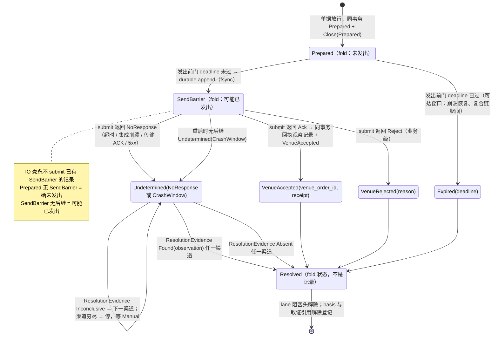
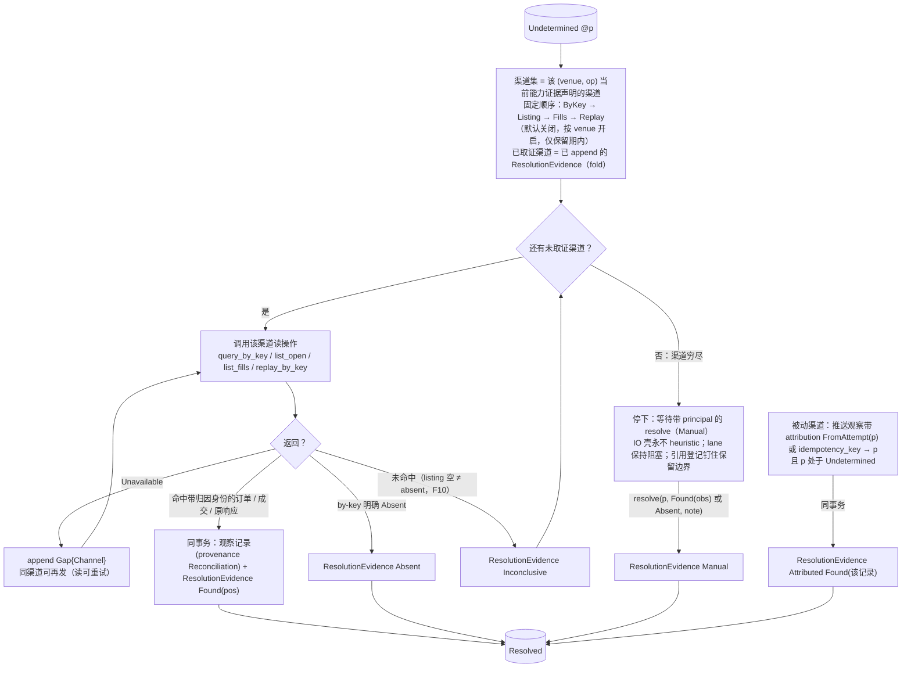
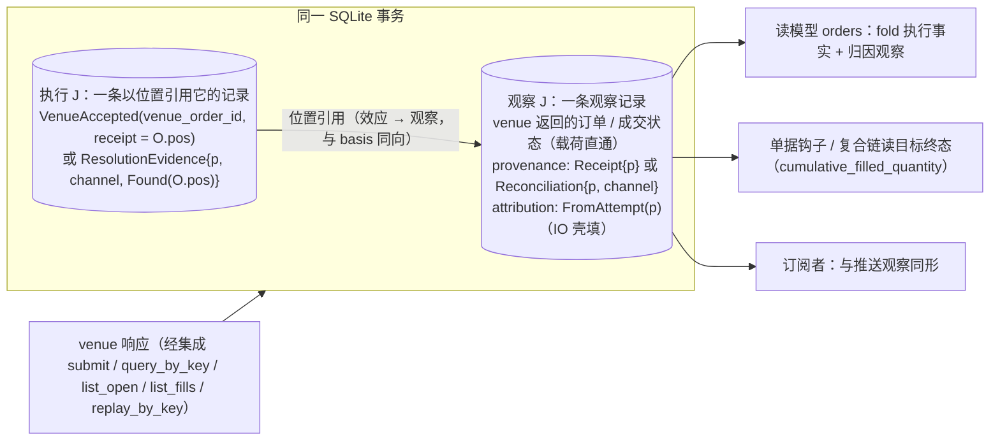
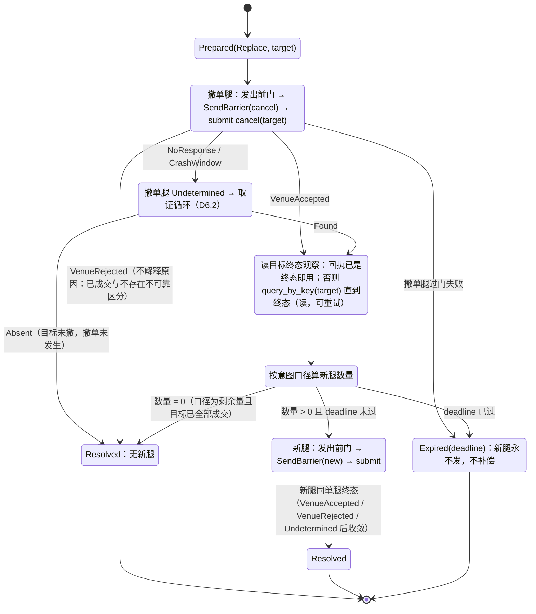
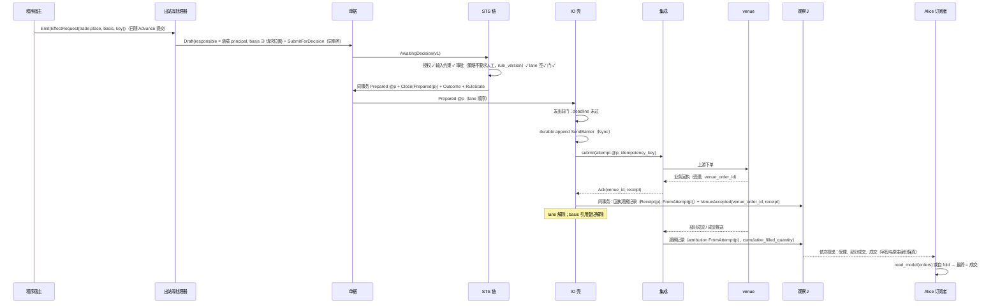
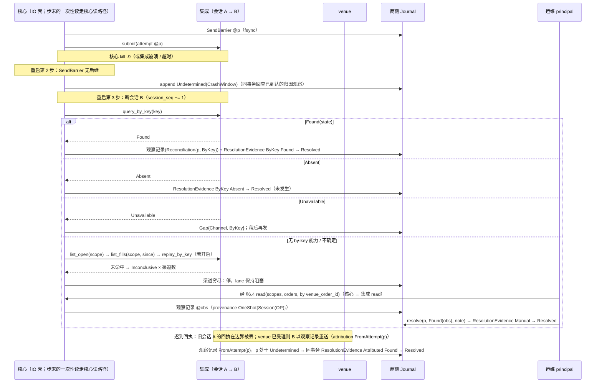
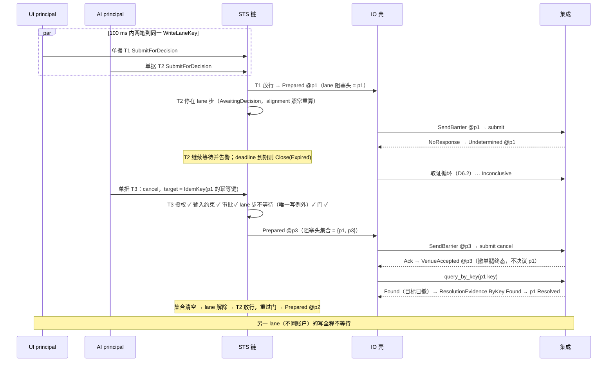

# 06 IO 壳：Attempt 链、取证、复合链、时序

对照：§5.4、§5.5、§6.3.5、§6.3.3 归因、W1、W2、W5、W12。索引见 `README.md`。

## D6.1 Attempt 单腿状态机

对照：§5.4 代数（Attempt、发出前门、`SendBarrier`、`VenueAccepted` 只认业务回执）、转移表、恢复；§6.3.5 `submit`。

读法（假想运行时）：

- 正常路径 `P → SB → VA` 在毫秒级内完成，三条记录两次事务（`SendBarrier` 单独 fsync）。
- 只有 `SB → UD` 这一条边把系统带进对账；进去以后写已经"可能发生"，永不重发，只能用读收敛。
- `Found` 之后没有 `VenueAccepted`：回执就是被引用的观察记录；读模型从观察记录 fold 出受理/拒绝/成交。

核出：无。

## D6.2 取证循环（`Undetermined` 之后）

对照：§5.4 对账驱动的自动化边界、先例谱系、`replay_by_key`；§6.3.5 四个读操作；§6.3.1 `CapabilityProof` 渠道声明；§6.4 `resolve`；§3.2 `Gap{Channel}`。

读法：

- 每一步取证都是一条记录，所以重启后"做到第几个渠道"由 fold 重建，不需要驱动器内存。
- 自动化止于"重建状态 / 触发查询 / 一次安全重放"（权威在系统外，F1）；穷尽即停，人工决议必须带 principal。
- 撤阻塞头的意图（D5.4 例外一）是让 venue 侧到达一个 by-key 读得出的终态，它本身不产生这条循环里的证据。

核出：无（`Attributed`/`Manual` 渠道上一轮已并入 §5.4/§6.4）。

## D6.3 一次 venue 交互落两条记录

对照：§5.4 回执与取证的记录模型；§4 归因由谁填；§6.3.8。

读法：Attempt 只回答"我的提交到达了吗"；订单是什么状态、成交了多少，永远在观察记录里。`VenueRejected` 例外：venue 侧没有订单，无观察记录，`reason` 保留 `Unmapped(raw)`。

核出：回执内容的落点原文未写（见 D2.5 核出）。

## D6.4 `Replace` 复合链（无原子 cancel/replace 能力）

对照：§5.2 改单是单一意图类型、§5.4 转移表复合链、§5.5 写→读→写、W12、§7.2 #8。

读法：

- 这是 `>>=`：第二腿读第一腿的终态观察，发生在 IO 壳内，不是单据层两次起单；两腿各过一次发出前门、各一条 `SendBarrier`。
- 撤单腿被拒、缺席或过期 → 链终结、新腿永不发：目标可能仍在时发新腿等于加仓（H1）；负责人看观察记录另起单据。
- 崩在撤单腿终态已持久、新腿未 `SendBarrier`（#8）：重启续跑，读目标终态算量，过门后发新腿（确未发出语义）。

核出：撤单 `Ack` 常只表示"撤单请求已受理"，目标终态可能晚到——原文未写等待方式，已并入 §5.4 转移表（`query_by_key(target)` 读到终态为止）。

## D6.5 正常下单闭环时序（W1）

对照：W1 步 1–7；§5.1、§5.2、§5.3、§5.4、§6.3.5、§6.3.6、§6.4 读模型。

读法：从 `Emit` 到 `VenueAccepted` 是一串各自原子的事务（D1.5）、1 次 fsync 屏障、1 次 venue 写调用；此后一切都是观察推送。

核出：无。

## D6.6 `NoResponse` → 取证 → 人工（W2）

对照：W2 步 1–4；§5.4 恢复、对账驱动；§6.1 第 3 步；§6.4 `resolve`、`read`。

读法：三种末态可枚举（found → 回执即观察记录 / absent → 未发生 / 无渠道 → 人工）；人工态只能由带 principal 的 `resolve` 关闭，且通常先用一次性 `read` 造出可引用的观察记录。

核出：无。

## D6.7 同 lane 并发与撤阻塞头（W5）

对照：W5 正常—失败路径与扩展路径；§5.3 lane 步、无第二类越顶队列；§5.2 目标身份来源之二。

读法：撤单让 venue 侧到达一个读得出的终态，阻塞头仍由取证收敛；两条路径（撤阻塞头 / `bypass_lane`）都让该 lane 出现两条 `SendBarrier`，区别只在有无 `bypass_lane` Decision。

核出：无。
