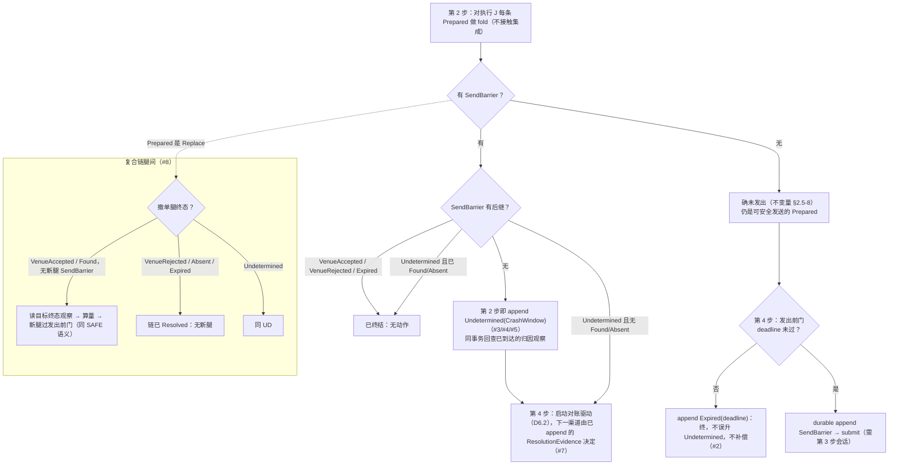
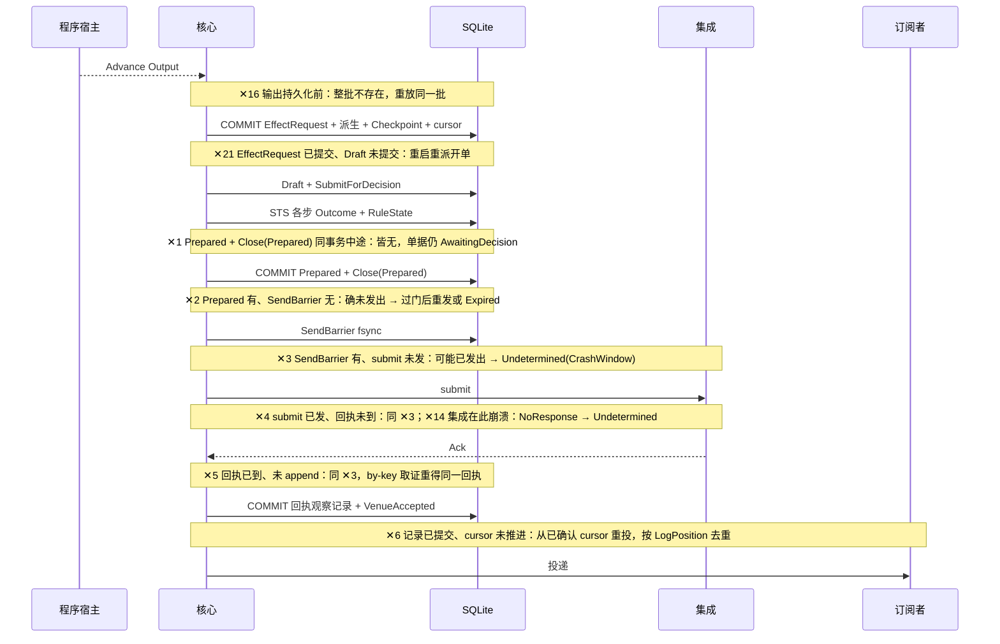
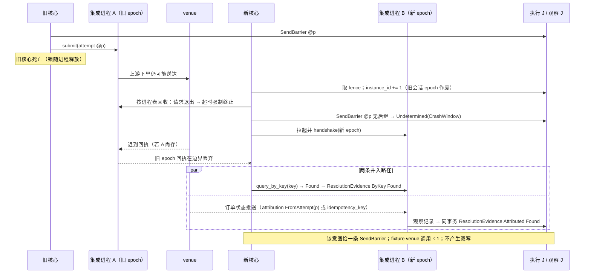
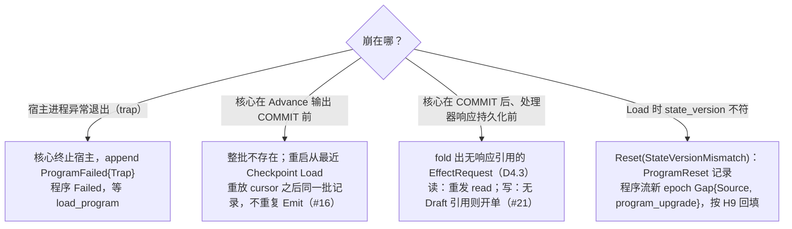

# 07 崩溃与恢复

对照：§5.4 崩溃恢复、§6.1 启动第 1–5 步、§6.5 崩溃恢复、§7.2 崩溃矩阵 #1–#21、W2 脑裂变体、W3、W9。索引见 `README.md`。

## D7.1 重启时每条 Attempt 链的恢复判定

对照：§5.4"恢复"、发出前门、转移表；§6.1 第 2/4 步；§7.2 #1–#5、#7、#8。

读法：判定只用记录，两个二分点（有无 `SendBarrier`、有无后继）把每条链归入"重发 / 过期 / 对账 / 已完"四个桶，没有第五个桶。

核出：无。

## D7.2 崩溃窗口在 W1 时序上的位置

对照：§7.2 #1–#6、#21；D6.5。

读法：每个 ✕ 后的持久状态是 §7.2 对应行的"崩溃后持久状态"列；恢复动作由 D7.1 判定。fixture 验收：✕2 venue 调用 0；✕3/✕4/✕5 venue 调用 ≤ 1。

核出：无。

## D7.3 脑裂 / 孤儿接管（W2 变体、W9、#15）

对照：§6.1 第 1 步（fence、`instance_id`、进程表回收）、第 3 步（会话 epoch）；§6.3.6 边界拒绝；§5.4；W2.4。

读法：安全不依赖 A 的回执到达；三条不变量（`SendBarrier` 可能已发出、同 lane 无新 Attempt、对账经 B 独立取证）共同保证。

核出：无。

## D7.4 程序侧崩溃（#16、#21、宿主 trap）

对照：§6.5 崩溃恢复、预算语义；§5.1 请求与响应的关联；§7.2 #16/#21。

读法：程序状态只有一条持久边界（`Checkpoint` 与 cursor 同事务）；一切恢复都从它开始重放。

核出：无。

## D7.5 崩溃矩阵 → 图元素对照

| §7.2 行 | 图 | 落点 |
|---|---|---|
| #1 | D7.2 ✕1、D1.5 | 同事务集合 |
| #2 | D7.1 SAFE→G、D7.2 ✕2 | 发出前门 |
| #3 | D7.1 UD、D7.2 ✕3 | `Undetermined(CrashWindow)` |
| #4 | D7.2 ✕4、D6.2 | 取证循环 |
| #5 | D7.2 ✕5、D6.3 | 回执即观察记录 |
| #6 | D7.2 ✕6、D3.4 | cursor 语义 |
| #7 | D7.1 DRV、D6.2 | 下一渠道由 fold 重建 |
| #8 | D7.1 REPL、D6.4 | 复合链续跑 |
| #9 | D1.5 末行 | 半写不可见 |
| #10 | D2.4 OBS | 派生侧可重算 |
| #11 | D1.4 快照 | 快照仅加速 |
| #12 | D9.4 | 原子替换 |
| #13 | D3.6 S、D3.2 | `Gap{Source}` |
| #14 | D7.2 ✕14、D3.6 U | 写投放侧 |
| #15 | D7.3 | 脑裂 / 孤儿 |
| #16 | D7.4 T2、D4.1 | `Checkpoint` + cursor |
| #17–#19 | — | hpc 子系统，当前阶段不画 |
| #20 | D9.1 | Alice 重连 |
| #21 | D7.4 T3、D4.3 | `EffectRequest` 重派 |
