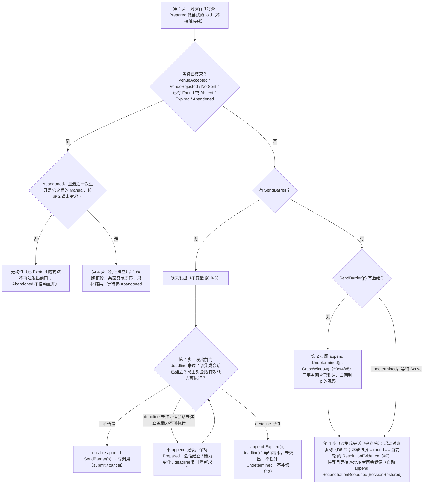
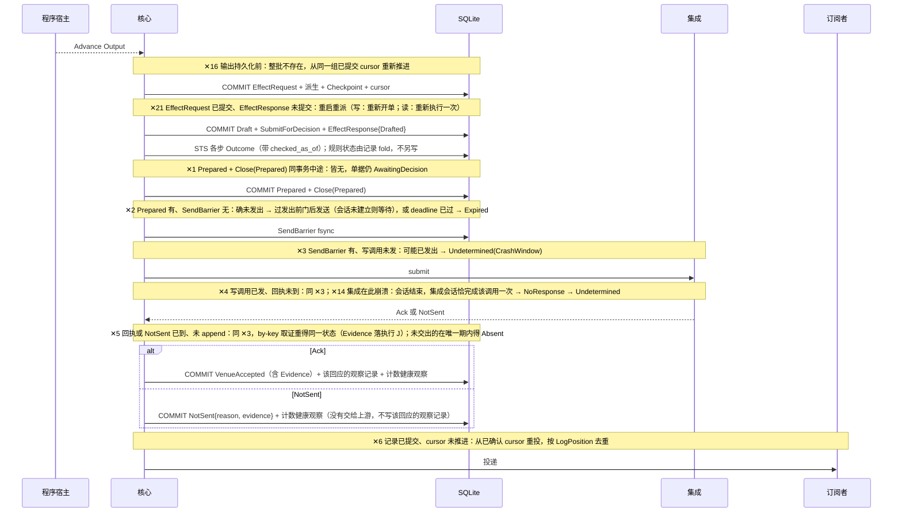
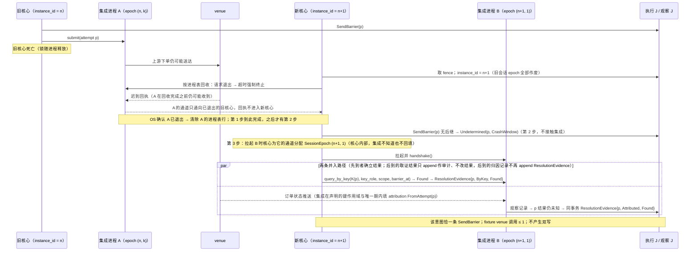
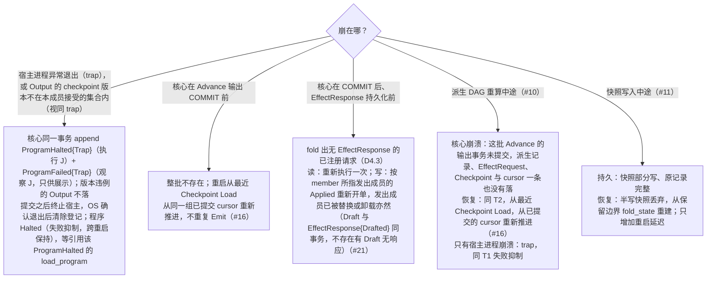

# 07 崩溃与恢复

对照：§6.7 崩溃恢复、§7.2 启动第 1–5 步、§8.6 崩溃恢复、§9.2 崩溃矩阵 #1–#21、W2 脑裂变体、W3、W9。索引见 `README.md`。

## D7.1 重启时每次尝试的恢复判定

对照：§6.7“恢复”（判定顺序固定：先 fold 等待是否已结束，再看有无 `SendBarrier`）、§6.5 发出前门与转移表、§6.6 放弃跟踪；§7.2 第 2/4 步；§9.2 #1–#5、#7、#8。

读法：判定只用记录；先问"等待是否已结束"，把已结束的尝试（含只有 `Expired` 的、已 `Abandoned` 的）挡在自动驱动之外；其余归入"重发 / 过期 / 对账"三个桶。"重发"桶在集成会话建立前停在发出前门等待，不产生记录；只有 `deadline` 能把它变成 `Expired`。崩溃前进行中的 `abandon` 若未 append `Abandoned`，日志里没有痕迹，尝试照常落进对账桶（#8）。

核出：无。

## D7.2 崩溃窗口在 W1 时序上的位置

对照：§9.2 #1–#6、#14、#16、#21；D6.5。

读法：每个 ✕ 后的持久状态是 §9.2 对应行的"崩溃后持久状态"列；恢复动作由 D7.1 判定。fixture 验收：✕2 venue 调用 0；✕3/✕4/✕5 venue 调用 ≤ 1。

核出：无。

## D7.3 脑裂 / 孤儿接管（W2 变体、W9、#15）

对照：§7.2 第 1 步（fence、`instance_id`、进程表回收）、第 3 步（会话 epoch）；§8.3 边界拒绝；§6.6；W2 步 4。

读法：安全不依赖 A 的回执到达；三条不变量（`SendBarrier` 可能已发出、阻塞头集合非空时同 lane 无新普通写、对账经 B 独立取证）共同保证。同一集成任何时刻至多一个进程：A 的 OS 确认退出与进程表行的清除是第 1 步的结束，之后才有第 2 步的恢复与第 3 步拉起 B；A 在回收完成之前收到的迟到回执只能送进通向旧核心的通道。`SessionEpoch` 由核心在拉起 B 时为通道分配，`handshake()` 不带参数，集成从不知道它。核心重启必然换 `instance_id`；同核心内重连只换 `session_seq`。

核出：无。

## D7.4 程序侧、派生侧与快照崩溃（#10、#11、#16、#21、宿主 trap）

对照：§8.6 崩溃恢复、预算语义；§6.1 `EffectResponse`、请求与响应的关联；§4.1/§4.3 派生可重算；§7.4/§7.5 快照仅加速；§9.2 #10/#11/#16/#21。

读法：程序状态只有一条持久边界（`Checkpoint` 与 cursor 同事务）；一切恢复都从它开始重放。本成员可交回的 `Checkpoint` 总被本成员接受（沿用的由替换的 `Applied` 比对，其后持久化的由 `Output` 检查，§8.6 状态迁移），所以重启 `Load` 不比对版本，也没有装载时的 `Reset` 可以重复。请求的完成事实在执行 J（`EffectResponse`），读结论等观察记录被压缩不影响重派判定。派生记录与 `EffectRequest`、`Checkpoint`、cursor 同批提交，没有提交的批次不留任何记录，所以 DAG 重算中途的崩溃（T5）不留半批；快照不是权威，只加速重建。trap 的顺序与 D4.2 相同：失败抑制的执行事实 `ProgramHalted` 先提交，核心才终止宿主；程序的状态是 `Halted`，`ProgramFailed` 是可压缩的展示观察，不承载状态（§8.6 失败抑制）。

核出：以可压缩观察记录判断"请求已响应"会在压缩后误重派——已并入 §6.1（`EffectResponse`）。

## D7.5 崩溃矩阵 → 图元素对照

| §9.2 行 | 图 | 落点 |
|---|---|---|
| #1 | D7.2 ✕1、D1.5 | 同事务集合 |
| #2 | D7.1 SAFE→G、D7.2 ✕2 | 发出前门 |
| #3 | D7.1 UD、D7.2 ✕3 | `Undetermined(CrashWindow)` |
| #4 | D7.2 ✕4、D6.2 | 取证循环 |
| #5 | D7.2 ✕5、D6.3 | `Evidence` 在执行 J |
| #6 | D7.2 ✕6、D3.4 | cursor 语义 |
| #7 | D7.1 DRV、D6.2 | 下一渠道由 fold 重建 |
| #8 | D7.1 Q0/Q4、D6.4 | `abandon` 没有中间记录：未 append `Abandoned` 则仍 `Active`，落进对账桶 |
| #9 | D1.5（单条观察 append 行） | 半写不可见 |
| #10 | D7.4 T5 | 批次未提交即不存在；核心崩溃同 #16 重放，宿主崩溃是 trap |
| #11 | D7.4 T6 | 半写快照丢弃，fold 重建 |
| #12 | D9.4 | 原子替换 |
| #13 | D3.6 S、D3.2 | `Gap{Source}` |
| #14 | D7.2 ✕14、D3.6 U | 写投放侧 |
| #15 | D7.3 | 脑裂 / 孤儿 |
| #16 | D7.4 T2、D4.1 | `Checkpoint` + cursor |
| #17–#19 | — | hpc 子系统，当前阶段不画 |
| #20 | D9.1 | 下游重连（经解释层） |
| #21 | D7.4 T3、D4.3 | `EffectResponse` 重派判定 |
