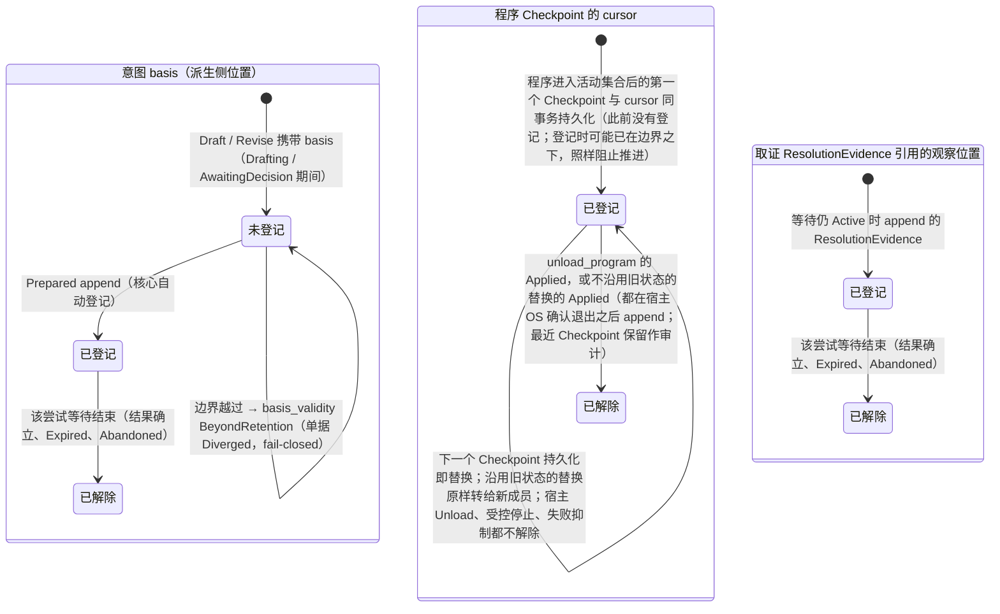
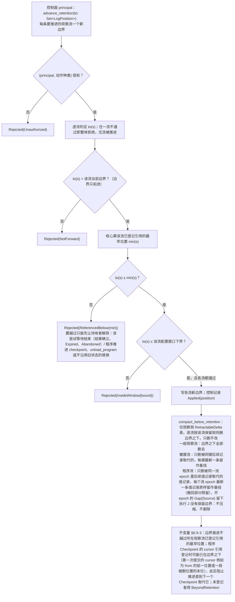
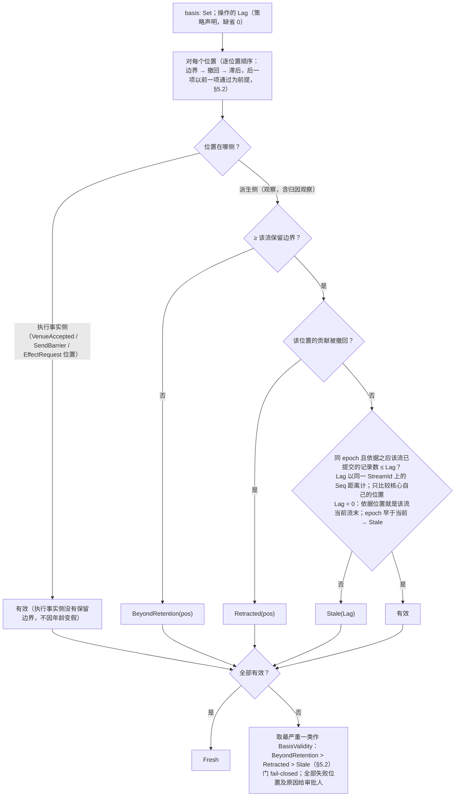

# 08 保留边界、引用登记、`basis_validity`

对照：§2.4 保留语义、§5.2、§8.5 `advance_retention`、§7.5 保留边界与引用登记、W13。索引见 `README.md`。

## D8.1 引用登记的生命周期（三种持有者）

对照：§2.4 登记方与解除时机；§7.5 保留边界与引用登记。

读法：

- 登记方是核心、消费者不手工登记；解除随持有者生命周期自动发生。
- 解除后的历史引用仍可读作审计；已解除的引用落到边界之下读得 `BeyondRetention`，不阻止压缩。未解除的引用即使已在边界之下（程序第一个 `Checkpoint` 登记的 cursor 可能如此）也照样阻止边界推进，直到被取代或解除（§2.4 不变量）。
- `Undetermined` 停等时，它的 `basis` 与取证引用钉住保留边界；解除随该尝试等待结束自动发生——任一入口（`Attributed Found`、`ReconciliationReopened` 后的自动取证、`abandon` 之后 IO 壳 append 的 `Abandoned`，D6.2）都行，没有绕过记录的旁路。

核出：无。

## D8.2 `advance_retention` 与压缩

对照：§2.4 保留语义、§8.5 控制组、§7.4 `compact_below_retention`、§7.5 保留边界与引用登记、§4.1、W13。

读法：边界按观察流分别维持、只前进（`LogPosition` 只在同一 `StreamId` 内有序）；执行事实永不删除；派生历史的 `DELETE` 只在各流边界之下，留下的记录一条也不改写。健康流与程序流是状态值的流，按键 / 按流 epoch 留基线，所以任一 `as_of ≥ 边界` 的 fold 与压缩前相等（健康读另要求 `as_of` 的控制流前缀不落后于健康流基线，落后的得 `BeyondRetention`，§2.4、§8.4）；从边界订阅的消费者 cursor 为 `Start{边界}`，每次挂接先收到边界之下留下的记录（前导），第一次覆盖整段前导的确认之前断连或崩溃就再收一遍，确认之后成为 `At`，前导之下被删的段不是它的损失（§4.2 cursor 与确认）；cursor 为 `At` 而落在边界之下的订阅者得到的 `Gap{Delivery, compacted}` 只覆盖被删去的位置（每一段连续被删、且不在未确认缺口里的位置一项），各段之间的基线照常按位置投递（§2.4、§4.2）。程序流的 fold 取最新一条值记录的正贡献，撤回部分只指名被取代的位置，所以基线指名已删记录不影响结果：新 fold、已折入被删记录的订阅者与收到压缩缺口的订阅者，收到基线之后都持有同一个值（§4.1 程序流的 fold）。

核出：边界是逐流的位置集、越过留存窗口的拒绝名 `InsideWindow{bound}`、执行事实侧没有边界，原文未写——已并入 §2.4、§8.5、§7.5。

## D8.3 `basis_validity` 判定

对照：§5.2 `basis_valid`（`BeyondRetention` 只对观察侧位置）、默认窗口 `Lag = 0`、执行事实侧引用不因年龄变假；§6.2 门。

读法：`Lag = 0`（缺省）时 `Fresh` 是"决定看到了核心此刻已有的该流全部记录"；策略声明正 `Lag` 时允许依据之后该流再提交至多 `Lag` 条记录。判定不读完备进度，也不读收到时间：完备是来源的性质，本门不用它（§5.2）。空 `basis` 空真为 `Fresh`，此时能不能放行由第二层必要项决定（D5.5）。

核出：默认窗口语义为"依据位置就是当前流末"（§5.2，`Lag = 0` 限定）；逐位置顺序与集合值的严重度取法原文未写——已并入 §5.2。
