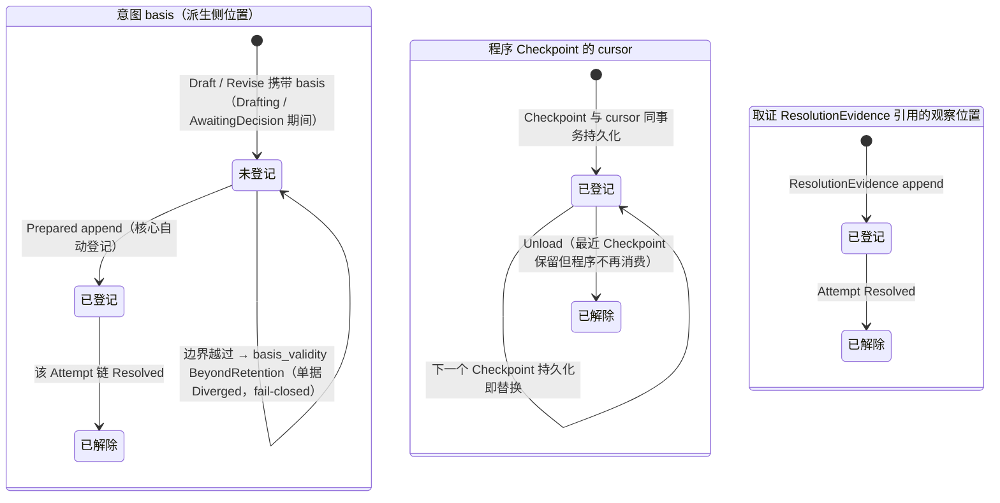
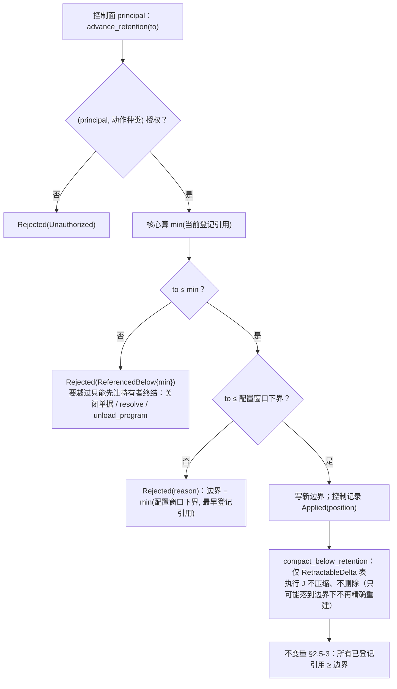
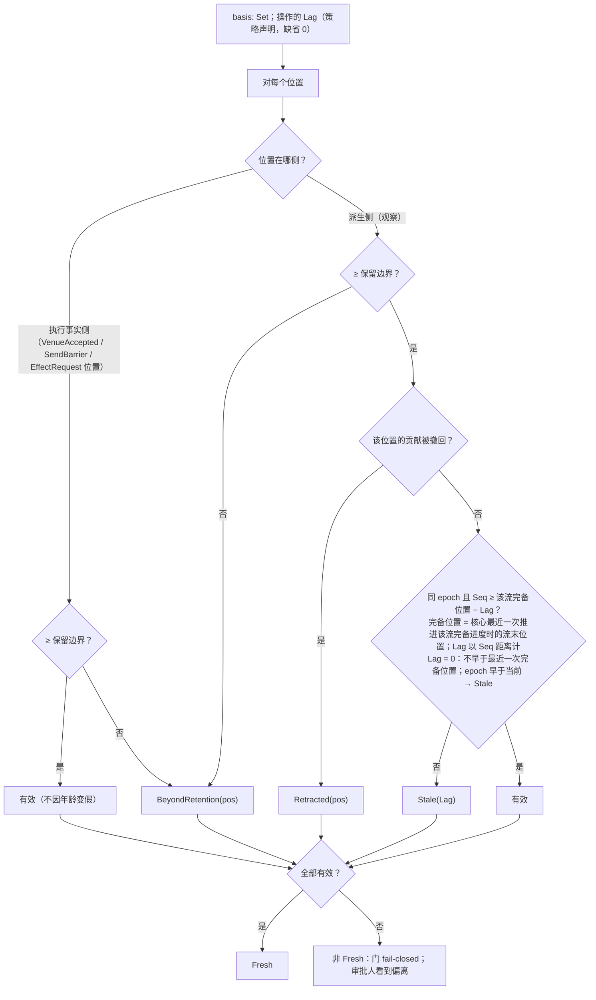

# 08 保留边界、引用登记、`basis_validity`

对照：§2.3 保留语义、§4、§6.4 `advance_retention`、§6.7.2 保留边界与引用登记、W13。索引见 `README.md`。

## D8.1 引用登记的生命周期（三种持有者）

对照：§2.3"权责与周期归属"；§6.7.2 引用登记行。

读法：

- 登记方是核心、消费者不手工登记；解除随持有者生命周期自动发生。
- 解除后的历史引用仍可读作审计；落到边界之下读得 `BeyondRetention`，不阻止压缩。
- `Undetermined` 停人工时，它的 `basis` 与取证引用钉住保留边界——解冻只能靠 `resolve` 或撤阻塞头（D6.2、D6.7），没有旁路。

核出：无。

## D8.2 `advance_retention` 与压缩

对照：§2.3 保留语义、§6.4 控制组、§6.7.1 `compact_below_retention`、§3.1、W13。

读法：边界只前进；执行事实永不删除；派生历史的 `DELETE` 只在边界之下。

核出：无。

## D8.3 `basis_validity` 判定

对照：§4 `basis_valid`、默认窗口 `Lag = 0`、执行事实侧引用不因年龄变假；§5.2 门。

读法：`Fresh` 是"决定至少看到了所有之前不再变的记录"；空 `basis` 空真为 `Fresh`，此时能不能放行由第二层必要项决定（D5.5）。

核出：默认窗口语义上一轮已改为"不早于完备进度"（§4）。
