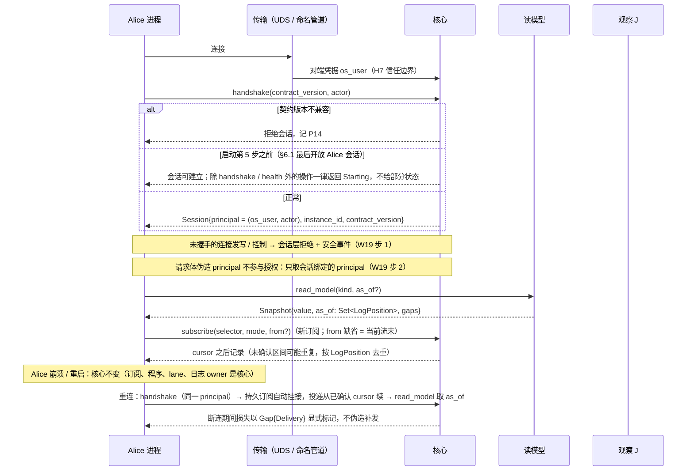
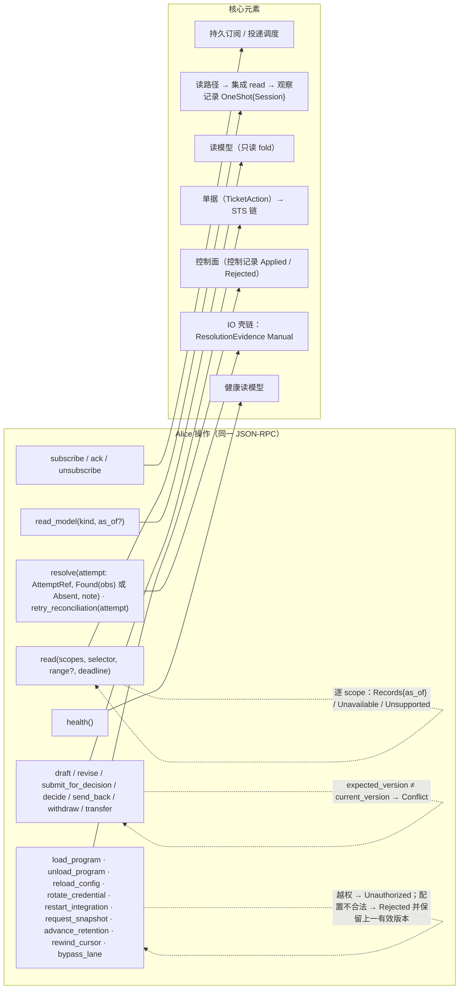
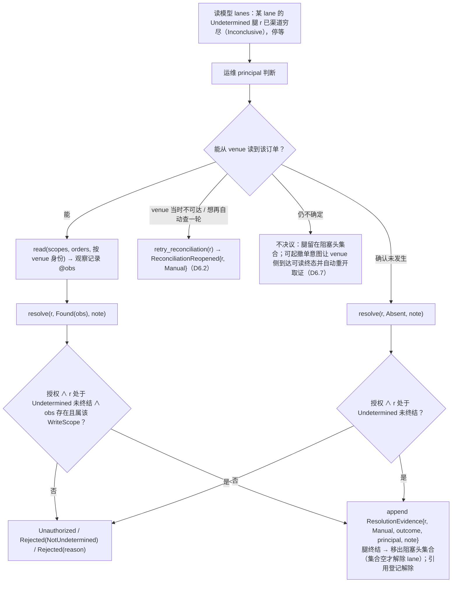
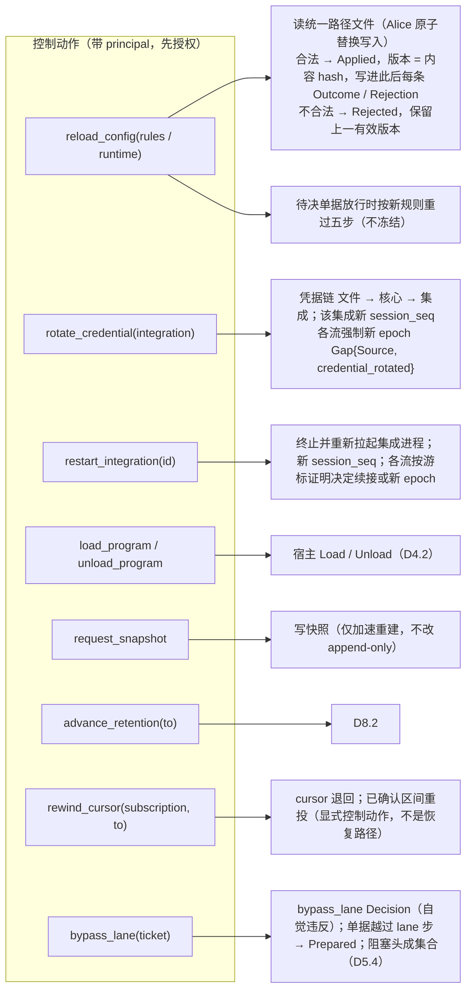

# 09 Alice 会话、操作集落点、人工决议、控制动作

对照：§6.4、§6.1 信任边界、§6.7.3、W14、W19、W8。索引见 `README.md`。

## D9.1 会话建立、身份与重连（W14、W19）

对照：§6.4 会话与 principal、已定事实；§6.1 H7；W14 步 3；W19 步 1–2；§7.2 #20。

读法：`actor` 是审计与 scope 的键，不是信任来源；信任来自 OS 对端凭据。`as_of` 与 cursor 可比对，消费者据此知道快照含哪些记录。

核出：无。

## D9.2 操作集到核心元素的落点

对照：§6.4 操作集表；§6.2 模块指南；§6.3.5 `read`。

读法：写类按 `(principal, WriteLaneKey, OperationKind)` 授权，控制与决议按 `(principal, 动作种类)` 授权，同一规则族；三组都留下带 principal 的记录。

核出：`read` 与 `resolve` 两组上一轮已并入 §6.4。

## D9.3 人工决议流程

对照：§6.4 决议组；§5.4 对账驱动的自动化边界；§3.4 读即观察记录。

读法：人工决议不要求渠道已穷尽（可在任一时刻），但永远带 principal；核心自己永不 heuristic。

核出：无。

## D9.4 控制动作触发的记录

对照：§6.4 控制组；§6.7.3 每文件契约与原子替换；§6.1 第 3 步；§3.2 gap 原因；W8。

读法：控制动作不经进程信号或 flag 文件；每个动作的结果是一条带 principal 与配置版本 hash 的控制记录，生效动作再触发相应记录。

核出：无。
