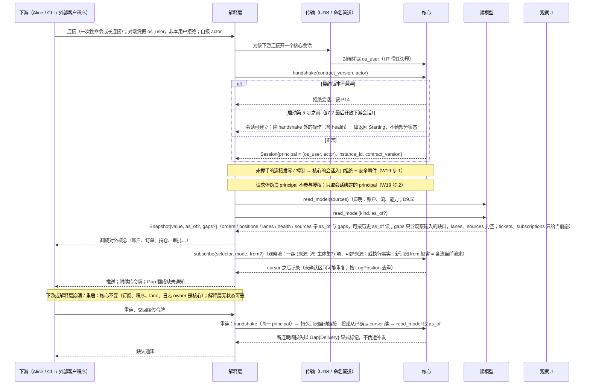
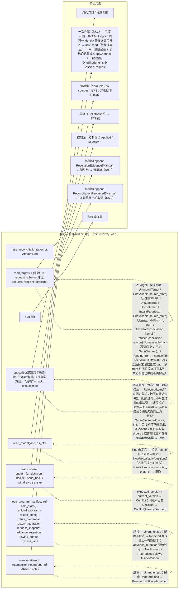
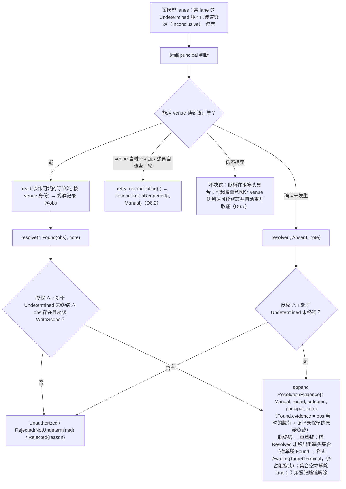
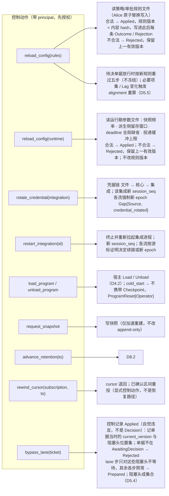
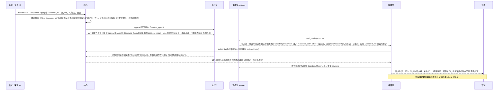

# 09 下游会话（经解释层）、操作集落点、人工决议、控制动作

对照：§8.5、§7.1 信任边界、§7.6、W14、W19、W8、W20；`design/downstream/design.md`。索引见 `README.md`。

## D9.1 会话建立、身份与重连（W14、W19）

对照：§8.5 会话与 principal、已定事实；§7.1 H7；W14 步 3；W19 步 1–2；§9.2 #20；`design/downstream/design.md` 第 3、6、7 节。

读法：`actor` 是审计与 scope 的键，不是信任来源；信任来自 OS 对端凭据。`as_of` 与 cursor 在解释层与核心之间比对，下游只见续传令牌与缺失通知。

核出：无。

## D9.2 操作集到核心元素的落点

对照：§8.5 操作集；§7.3 模块指南；§3.4 读副作用、§4.4 读模型；§8.2 `read`。这些是解释层代下游发出的核心操作，下游看到的对外概念见 `design/downstream/design.md` 第 2 节。

读法：写类按 `(principal, WriteLaneKey, OperationKind)` 授权，控制与决议按 `(principal, 动作种类)` 授权，同一规则族；三组都留下带 principal 的记录。

核出：`read` 与 `resolve` 两组上一轮已并入 §8.5；一次性读按流寻址、读结论记录、`sources` 读模型与执行事实订阅已并入 §2.2、§8.2、§8.5。

## D9.3 人工决议流程

对照：§8.5 决议组；§6.6 对账驱动；§3.4 读即观察记录。

读法：人工决议不要求渠道已穷尽（可在任一时刻），但永远带 principal；核心自己永不 heuristic。

核出：无。

## D9.4 控制动作触发的记录

对照：§8.5 控制组；§7.6 每文件契约与原子替换；§7.2 第 3 步；§4.2 gap 原因；W8。

读法：控制动作不经进程信号或 flag 文件；每个动作的结果是一条带 principal 与配置版本 hash 的控制记录，生效动作再触发相应记录。

核出：无。

## D9.5 解释层取得声明与执行事实推送（W20）

对照：§2.2 Projection / `StreamDecl` / `account_ref`；§7.5 能力证据；§8.2 `handshake`；§8.5 订阅组、一次性读、`sources`；W20；`design/downstream/design.md` 第 2、3.2、4 节。

读法：声明是执行事实，所以取得它是一次读模型 fold、它的变化随执行事实订阅到达，不依赖当前会话；会话状态另在 `health`（§8.4）。按旧 `account_ref` 发出的命令在引用不可解析时不解析到任何账户。

核出：无。
