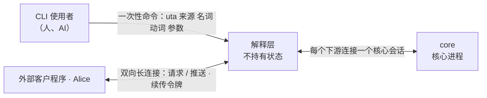
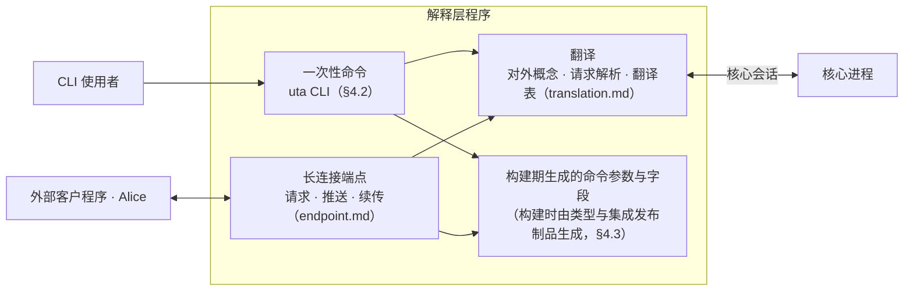

# 解释层（下游接口）

- **层级与元素**：解释层部分的 C4 树。第 1 节是它的 L1（系统上下文，黑盒）；这一部分只有一个容器——解释层程序——所以容器视图与组件指南写在本文第 3–4 节。四个组件里，翻译与长连接端点各自成文（[translation.md](translation.md)、[endpoint.md](endpoint.md)）；一次性命令与构建期生成是本文 §4.2、§4.3。上级：[README.md §4.1 划分与理由](../README.md#41-划分与理由)。
- **决定什么**：解释层为什么存在；对下游以什么形态交互；它不持有状态；它拆成哪些组件、各自拥有与隐藏什么、怎样部署；命令的形态；哪些参数与字段手写、哪些在构建期生成；身份与发布物；跨组件的场景走查；怎样证明合格。
- **读者**：实现 `uta` CLI 与长连接端点的人；OpenAlice 等下游的接入者（经本仓库发布的对外 schema）。审批者：无（K3）。
- **状态**：已定。
- **非目标**：
  - 核心↔解释层契约（会话、操作集、订阅与确认、一次性读、读模型、单据组、结果未知组、控制组）：由 core 拥有，每个操作的规格在实现它的核心组件文档里（[core-process/design.md §4.2 对外接口总表](../core/core-process/design.md#42-对外接口总表)）。本文只引用。
  - 命令与 flag 的具体名字、消息字段的序列化形状、长连接的传输：实现阶段制品。
  - 业务：仓位计算、组合下单、策略都在下游或程序里（[README.md §1.3 UTA 不含业务](../README.md#13-uta-不含业务)）。

证据标签与编号前缀的约定见 [README.md §0.4 阅读约定](../README.md#04-阅读约定)。

## 1 系统上下文（L1）

### 1.1 为什么有这一层

> 根本约束：抽象只在核心里，两侧是清洗（[README.md §1.4 三段：清洗、抽象、清洗](../README.md#14-三段清洗抽象清洗)）。

核心的抽象是为保证而造的：位置与三种进度、尝试与它的等待和结果两根轴、单据版本、三值能力。下游要的是能懂的接口：账户、订单、持仓、行情、审批。把核心契约直接交给下游，每个下游都要自己理解这些抽象、自己翻译一遍；抽象外泄出去，翻译各写各的就会分叉。[设计]

解释层把这件事集中到一处。它与集成对称：集成把上游清洗成契约值（[integration/design.md §1.1 为什么有这一层](../integration/design.md#11-为什么有这一层)），解释层把核心清洗成下游接口。两者都是明确的逐项清洗，不是抽象的延伸，可以写得具体、逐条列举。

### 1.2 黑盒与外部

| 外部 | 关系 | 交换什么 | 契约归属 |
|---|---|---|---|
| CLI 使用者 | 发一次性命令，读输出 | 对外概念的命令与结果；结构化输出按对外 schema | 对外面，本仓库随 release 发布（§4.4），跨仓库契约 |
| 外部客户程序（含 Alice） | 保持一条双向长连接 | 请求、推送、续传令牌、读取令牌、缺失通知 | 同上 |
| core（核心进程） | 解释层为每个下游连接开一个核心会话 | 核心↔解释层操作集 | core 拥有，只在本仓库内部 [core-process/design.md §4.2 对外接口总表](../core/core-process/design.md#42-对外接口总表) |

- 下游看到的是解释层定义的对外概念（来源、账户、订单、持仓与行情、审批、结果未知的订单、策略程序、原生计算组件、连接状态、运维动作），每个概念与它在核心里的对应见 [translation.md §3.1 对外概念](translation.md#31-对外概念)。
- Alice 是下游之一，不是核心的父进程或守护者；下游只经解释层接触核心（[README.md §4.1 划分与理由](../README.md#41-划分与理由)）。
- **容器与部署**：一次性命令在 `uta` CLI 进程里运行；长连接端点由 CLI 自身提供，或在核心进程内部转发，两种部署都允许，外部行为相同，所以解释层不必是一个独立进程（§4.1）。

### 1.3 分配给解释层的需求

需求编号与定义见 [README.md §4.3 需求分配](../README.md#43-需求分配)；解释层承担的是它们的对外呈现：

- **Q2、Q3、Q4**（依 H1）：结果未知永远不显示成失败，不给重新下单的提示；结果未知、放弃跟踪、取证确立的结果、尚未发送与未发送各有明确对外说法（[translation.md §3.2 翻译规则](translation.md#32-翻译规则)）。
- **Q9**：待审、审批驳回、过期各有对外说法。
- **Q13、Q15、Q16**：配额拒绝、一次性读逐项结果、`Unsupported` / 未确认 / 不可用与空结果互不混同。
- **Q14、Q32**：回填进度、逐流 readiness 与来源连接状态的对外说法；会自己恢复的离线与需要处理的停止可区分。
- **C11、Q19**（依 H7）：对外端点的信任边界是本机 OS 用户；下游自报的 actor 由解释层带入握手，principal 由核心组成，授权全在核心，请求体里的身份不参与授权（§4.4）。
- **C5、Q29**（依 H5）：下游或解释层崩溃重启不改变核心的订阅与程序；断连损失以缺失通知给出（§3.1、[endpoint.md §4.3 续传与确认](endpoint.md#43-续传与确认)）。
- **C6**：缺失照实通知，不伪造连续（[translation.md §4.5 缺失通知](translation.md#45-缺失通知)）。
- 另依 **S10**：Alice 现有消费面在新边界上仍可实现。

## 2 驱动

| 场景 | 本部分的响应 | 响应度量 |
|---|---|---|
| Q29（Alice 断连重连） | 解释层不持有状态；客户凭续传令牌重连，核心从已确认 cursor 续投 | 验收 #23 第 5 条 |
| Q16（能力不支持） | 不支持、未确认、来源离线、空结果逐项区分，离线先于能力判定 | 验收 #23 第 7 条 |
| Q2、Q3、Q4（`SendBarrier` 后崩溃、收敛与放弃跟踪、未发出） | “结果未知，正在核实，请勿重下”；取证确立后改为已确认发生 / 未发生；放弃跟踪后“已放弃跟踪，结果未知”；未发出的给“尚未发送 / 未发送”，不说结果未知 | 验收 #23 第 2、3 条 |
| Q9 / Q13 / Q14 / Q15 / Q19 / Q32 | 逐项给出审批与过期、订阅与读的结果、回填进度与连接状态；拒绝未认证与越权请求的结果如实呈现 | 验收 #23 第 4 条（翻译表每行） |

泄露检查（§6.2）是解释层特有的可证伪度量：对外面上不出现任何核心概念名。

## 3 模型

### 3.1 解释层不持有状态

- 订阅、确认进度、单据、链都在核心。解释层只持有翻译所需的会话：一次命令或一条长连接对应一个核心会话（[session-entry.md §3 模型](../core/core-process/session-entry.md#3-模型)）。
- 解释层崩溃或重启，对下游就是一次断连：客户凭续传令牌重连，断连期间的损失以缺失通知给出（[endpoint.md §4.3 续传与确认](endpoint.md#43-续传与确认)）。解释层自己没有要恢复的东西。
- 理由：订阅与程序的 owner 已经是核心（H5 / C5）。解释层另持状态，就多一个有状态的下游、多一套恢复协议。[设计]
- 推论：进程落点自由（§4.1），两种落点的外部行为相同。

### 3.2 对外面与翻译

- 对外面由解释层定：对外概念用下游已有的说法，核心的状态与结果逐项翻成对外说法，规则与翻译表在 [translation.md](translation.md)。
- **解释层不做什么**：不在对外面（命令、参数、输出、消息、错误）上出现核心概念；不持有状态、不做决策、不重试写、不补全缺失；不含业务。

## 4 结构

### 4.1 组件与部署

| 组件 | 拥有 | 隐藏的决定 | 假设 | 文档 |
|---|---|---|---|---|
| 一次性命令 | `uta` 命令行、输出格式 | 命令与 flag 的名字、人读输出的措辞 | 一次命令一个核心会话 | §4.2 |
| 长连接端点 | 与外部客户程序的双向连接、推送的组装、续传令牌 | 传输与消息的序列化形状 | 一条连接一个核心会话；连接断即会话结束 | [endpoint.md](endpoint.md) |
| 翻译 | 对外概念、请求到核心目标的解析、状态与结果的翻译表、读取令牌的认定、错误文案 | 措辞 | 核心的结果集合是封闭的，每项都有翻译行 | [translation.md](translation.md) |
| 构建期生成 | 订单参数、读侧字段与查询参数、来源专有参数与字段 | 生成器实现 | 类型与集成发布制品在构建时可得 | §4.3 |

- 一次性命令与长连接端点是下游接触解释层的两种形态，对同一组操作；二者都经翻译落到核心的操作、把结果翻成对外说法，都使用构建期生成的参数与字段。
- **部署映射**：一次性命令在 `uta` CLI 进程里。长连接端点由 CLI 自己提供，还是由核心进程内部转发（含零拷贝转发），是实现选择；两种映射都允许，因为解释层不持有状态（§3.1），外部行为相同。设计不宣称长连接端点必是独立进程。取舍见 §6.1 敏感点。
- **信任**：对外端点沿用本机 OS 用户的信任边界，非本用户的连接拒绝（[core/design.md §4.3 部署与信任](../core/design.md#43-部署与信任)，H7；§4.4）。

### 4.2 一次性命令

- 来源作用域的命令：`uta <来源> <名词> <动词> [参数]`，例如 `uta ibkr order list`、`uta ibkr position list`。不属于某个来源的名词（审批、策略程序、原生计算组件、连接状态、运维）不带来源一段；策略程序具名输出的目标怎样给出见 [translation.md §4.2 策略程序的具名输出](translation.md#42-策略程序的具名输出)。
- 输出默认给人读；结构化输出按解释层发布的对外 schema（§4.4），不是核心记录。
- 写命令返回于下游能理解的稳定状态之一：待审、已受理、被拒、未发送、结果未知；或返回于调用方指定的等待上限，此时给出当前状态。返回的请求引用供后续命令使用。
- 读命令在等待上限内尚未作答时给出读取令牌（[translation.md §4.4 读取令牌](translation.md#44-读取令牌)）。
- 一次命令一个核心会话，命令结束即会话结束；每次命令按当时的 `sources` 与 `health` 解析（[translation.md §4.1 请求的解析：此刻能不能](translation.md#41-请求的解析此刻能不能)）。

### 4.3 命令与参数从哪里来

**手写的**：核心概念翻成对外说法的部分。对外概念与动词（[translation.md §3.1 对外概念](translation.md#31-对外概念)）、状态与结果的翻译（[translation.md §4.3 状态与结果的翻译](translation.md#43-状态与结果的翻译)）、错误文案都逐条写出，不生成。理由：这是清洗本身，每一项都需要判断。

**生成的**：本来就是下游词汇的部分，由构建期生成组件产出。

- 订单参数：写侧基本类型的已注册字段（处理器字段注册表里的守卫字段，如 side、instrument，[envelope.md §3.2 处理器字段注册表](../core/core-process/envelope.md#32-处理器字段注册表)），以及该来源为每种操作声明的意图参数 schema（公共意图 schema 或其扩展，含订单类型、time-in-force 等没有处理器读的参数；核心按它校验、不读其值，原样交给集成，[ticket.md §3.4 参数合规：意图参数 schema](../core/core-process/ticket.md#34-参数合规意图参数-schema-设计)）；
- 读侧字段：公共 schema。成交的执行身份与修订号也是公共 schema 字段，对外以成交编号、修订号给出：下游自行计数时读的就是它们，与核心 `orders` 读的是同一个值（[read-model.md §3.2 成交的计数身份](../core/core-process/read-model.md#32-成交的计数身份-设计)）；
- 读侧查询参数：各流的请求 schema（公共请求 schema 或来源扩展，[integration-session.md §3.3 投影 Projection](../core/core-process/integration-session.md#33-投影-projection)）：查询主体（已解析的 instrument、目录键或文本）与领域过滤条件（到期日、行权价、条数上限等）；时间段落到核心的 `range`；
- 来源专有的参数与字段：该集成发布的扩展 schema 与记录映射（[integration/design.md §4.3 发布物](../integration/design.md#43-发布物)）。

生成在构建期完成，从类型与集成的发布制品生成，不在运行期远程发现。命令是否存在在构建时就定了；运行期只回答“此刻能不能”（[translation.md §4.1 请求的解析：此刻能不能](translation.md#41-请求的解析此刻能不能)）。

构建时与运行时的 schema 版本不同：

- 运行期遇到构建时没有的载荷 schema 版本：该来源专有的字段不可用并如实提示，公共字段不受影响。这与核心“未注册的 schema 组合不触发解释器”一致（[envelope.md §3.3 payload_schema 与 schema 发布](../core/core-process/envelope.md#33-payload_schema-与-schema-发布)）。
- 构建时的请求 schema 或意图参数 schema 版本与该来源此刻声明的不同：该读或该操作如实提示暂不能执行，不提交旧版参数（[one-shot-read.md §4.2 核心↔解释层：read](../core/core-process/one-shot-read.md#42-核心解释层readtargets-deadline--vectargetresult)、[decision-chain.md §4.2 顺序固定链：授权 → 输入约束 → 审批 → lane → 过期](../core/core-process/decision-chain.md#42-顺序固定链授权--输入约束--审批--lane--过期)）。

### 4.4 身份与发布物

**身份。**

- 解释层对外端点沿用 H7：信任边界是本机 OS 用户，非本用户的连接拒绝（[endpoint.md §4.1 连接与请求](endpoint.md#41-连接与请求)）。一次性命令本就在该用户的进程里运行。
- 下游自报 actor（哪个人、哪个 AI），解释层以它握手开核心会话，核心以传输给出的 OS 对端凭据与这个 actor 组成 `principal = (os_user, actor)`（[session-entry.md §3 模型](../core/core-process/session-entry.md#3-模型)）。授权全在核心（[decision-chain.md §4.2 顺序固定链：授权 → 输入约束 → 审批 → lane → 过期](../core/core-process/decision-chain.md#42-顺序固定链授权--输入约束--审批--lane--过期)），解释层不授权；请求体里的身份不参与授权。

**发布物。** 本仓库随 release 发布：

- CLI（含生成的命令）；
- 长连接的消息协议 schema 与对外结构化输出的 schema；
- 对外概念与翻译表的实现（[translation.md §3.1 对外概念](translation.md#31-对外概念)、[translation.md §4.3 状态与结果的翻译](translation.md#43-状态与结果的翻译)）；
- 成交的计数规则（[read-model.md §3.2 成交的计数身份](../core/core-process/read-model.md#32-成交的计数身份-设计) 的对外表述：按来源、账户与成交编号计一次；未带修订号的按 0，修订号大者取代小者；同一修订号内容矛盾为冲突，不计入；来源明确作废的保留编号、不计入；无成交编号的不计入），供自行计数的下游依从。订单当前状态不要求下游自行选取：它取自解释层给出的订单视图（[read-model.md §4.2 读模型集合](../core/core-process/read-model.md#42-读模型集合)），选取所需的来源序号不在对外面上。

这是跨仓库契约，OpenAlice 从 release 消费。核心↔解释层的 IDL 只在本仓库内部。

## 5 走查

场景定义与端到端成败标准见 [README.md §5 场景（W1–W20）](../README.md#5-场景w1w20)；核心内部的组件级 trace 见 [core-process/design.md §5.1 W14（Q29）下游（Alice）断连重连](../core/core-process/design.md#w14q29下游alice断连重连) 等。本节只走解释层内部的组件。

### 5.1 W14（Q29）下游断连重连

主 trace：[core-process/design.md §5.1 W14](../core/core-process/design.md#w14q29下游alice断连重连)。

1. Alice 断连：Alice 崩溃 / 重启，或长连接端点所在的 `uta` 进程崩溃 / 重启，核心存活（端点在核心进程内转发时，端点随核心进程存亡，不在本场景）。→ 连接关闭，端点为它开的核心会话随传输关闭而结束，核心不为此写记录。解释层没有要恢复的状态（§3.1）。
2. Alice 凭续传令牌重连。→ 长连接端点以下游自报的 actor 开核心会话；同一 principal 的持久订阅由核心自动重新挂接，投递从核心持久化的已确认 cursor 之后继续（[session-entry.md §4.6 已定事实](../core/core-process/session-entry.md#46-已定事实)）。续传令牌是客户保存的、对核心侧确认进度的不透明编码（[endpoint.md §4.3 续传与确认](endpoint.md#43-续传与确认)），不是第二份进度源头：续投的起点只由核心的已确认 cursor 决定。
3. 端点读当前状态（读模型的 `Snapshot`），先收到断连期间未确认的投递缺口，再收到记录。→ 翻译把投递缺口翻成“本订阅漏收了这一段”的缺失通知，端点把它排在后续推送之前；未确认区间可能重复，端点按位置去重或原样标出。
4. 执行事实订阅同样续投：断连期间的待审事项、结果未知与取证终结都补到，没有缺失通知。
- 对外可见：当前状态、断连之后的推送、缺失通知；`as_of` 与 cursor 只在解释层与核心之间比对，不出现在对外说法里。走通。

### 5.2 W19（Q19）会话身份与未授权控制

主 trace：[core-process/design.md §5.1 W19](../core/core-process/design.md#w19q19会话身份与未授权控制)。

1. 非本 OS 用户的连接到达长连接端点。→ 按 H7 拒绝，不开核心会话。
2. 本用户的客户在请求体里填了另一个身份。→ 端点只用开会话时的 actor，请求体身份不进核心会话；核心按会话 principal 授权（[decision-chain.md §4.2 顺序固定链：授权 → 输入约束 → 审批 → lane → 过期](../core/core-process/decision-chain.md#42-顺序固定链授权--输入约束--审批--lane--过期)）。
3. 已认证但无 scope 的运维请求（例如重启来源的集成）。→ 核心返回 `Rejected(Unauthorized)`；翻译答“无权限”，没有其他副作用可呈现。
- 走通。解释层不做授权判断，只保证身份不从请求体进入。

### 5.3 W20（Q13+Q15+Q16）取得声明、按账户与无账户来源读、推送待审与结果未知

主 trace：[core-process/design.md §5.1 W20](../core/core-process/design.md#w20q13q15q16解释层取得声明按账户与无账户来源读推送待审与结果未知)。

1. 构建期：生成器从公共 schema 与集成 X、公共来源 P 的发布制品生成命令参数与字段。
2. 连接建立后，端点读 `sources`：X 的两个账户以 `account_ref` / `label` 出现在账户列表，P 不出现；能力翻成“支持 / 不支持 / 未确认”。端点再以 X、P 订阅执行事实。
3. 下游读 X 两个账户的持仓与 P 的某 instrument 报价。→ 命令按 `sources` 解析到各自的流，带请求 schema 身份与参数发一次性读；各 target 的结果逐项翻译：X 离线得“来源离线，正在重连”（先于能力判定），P 作答得数据，上游拒绝得“来源拒绝”，迟迟不答得读取令牌。
4. 下游在一个订阅里选三项：超配额的一项得“订阅超出该来源的数量上限”，来源不提供的一项得“订阅请求不成立”，其余照常生效；逐项给出。
5. X 重连、`account_ref` 被标为不可解析：执行事实订阅送来新声明版本，端点重读 `sources`，该账户显示“账户引用冲突，需要处理”。
6. 一张单据送审、一次尝试进入 `Undetermined`：执行事实推送到达，翻成“待审”“结果未知，正在核实，请勿重下”；取证确立后翻成“已确认发生 / 未发生”；运维放弃跟踪后翻成“已放弃跟踪，结果未知”，结果之后补上再翻成该结果并注明曾放弃跟踪。
- 走通。每步只用翻译表的一行或 `sources` 的一次读；没有需要解释层保存的状态。

卡点：无。三条走查各步都只经本部分的四个组件与 core 公布的操作；解释层需要的每项输入都来自核心会话里的一次读或一个订阅。

## 6 评估

### 6.1 风险与权衡

- **权衡：翻译表手写**（§4.3）。每项都要人判断，表随核心的封闭结果集合增长；换取的是对外说法不随核心内部改名而漂移，且能逐行被验收 #23 触发检查。
- **风险：核心新增结果变体而翻译表漏行。** 泄露检查与“翻译表每一行都有 fixture 触发”在验收 #23 里同时生效；漏行的变体会以核心概念名出现在输出里，被泄露检查发现。
- **敏感点：长连接端点的进程落点**（§4.1）。放在核心进程内转发可省一次拷贝，放在 CLI 自身则解释层与核心故障域分离；二者外部行为相同，取舍在实现期按实测定，不改本文。

### 6.2 验收

23. **解释层**：以 fixture 上游与 fixture 下游客户驱动解释层观测：（对应 Q2/Q3/Q4/Q16/Q29）
    - 泄露检查：以下文的核心概念词表检查全部命令帮助、结构化输出、长连接消息与错误，不出现任何核心概念名；
    - 注入 `NoResponse` 后，下游看到“结果未知”，输出中没有“失败”也没有重新下单的提示；随后取证确立结果时，下游收到“已确认发生 / 未发生”；
    - 放弃跟踪：principal `abandon` 之后，下游看到“已放弃跟踪，结果未知”，输出中没有“已发生 / 未发生”、没有“失败”、也没有重新下单的提示；之后 fixture 给出归因到该尝试的推送时，下游看到补上的结果并注明曾放弃跟踪；撤单请求被受理时，下游看到“撤单请求已送达”，原单是否已结束以原单的状态为准，输出中没有“原单已撤 / 已结束”（除非原单自己的状态如此）；`NotSent` 时下游看到“未发送”，不是“结果未知”；
    - [translation.md §4.3 状态与结果的翻译](translation.md#43-状态与结果的翻译) 翻译表的每一行（含订阅挂起的每种原因、一次性读的每个结果、跨流冲突的订单与持仓、策略程序的每种停止原因）都有 fixture 触发，下游得到该行的对外含义，不出现核心概念名；策略程序停止时下游看到的是“已停止、服务重启后也不会自行恢复、排除原因后重新装载”，等待所需来源的策略程序显示为“已登记、未启动”而不是失败；
    - 长连接存续期间重启解释层：客户凭续传令牌重连，收到的记录与不重启时相同（未确认区间可能重复），断连期间的损失以缺失通知给出；
    - 完整界对外只以不透明的完整性令牌出现：输出里读不出 epoch 或 venue 序号；同一成交流 epoch 内两次回答的令牌周期部分相等；fixture 让该成交流开新 epoch 后，回答的周期部分与之前的不等，旧周期的令牌不再出现，新 epoch 的 `Origin` 回填 `Closed` 之前回答只带新周期的标记、没有界；订阅选项里没有“等齐再给”；
    - 能力 `Unsupported` 与 `Unknown` 对外分别得到明确的“不支持”与“未确认”，不返回空结果；
    - 某集成新增扩展字段后重新构建，只有该来源下出现对应参数与字段；运行期遇到构建时没有的 schema 版本，该来源专有字段如实提示不可用，公共字段照常。

**核心概念词表。** 泄露检查的对象是全部命令帮助与 fixture 驱动下的全部输出（结构化输出、长连接消息、错误）。对外概念（[translation.md §3.1 对外概念](translation.md#31-对外概念)）与公共、扩展 schema 的字段名不在词表内；完整性令牌以不透明编码给出，其中的周期与界同样不以可读形式出现。词表由四组组成：

1. **核心的类型、记录、状态、字段与操作名**（各核心文档模型节里定义的标识符）：`abandon`、`Abandoned`、`account_ref`、`ack`、`Active`、`Advance`、`alignment`、`AlreadyInstalled`、`Applied`、`as_of`、`At`、`Attempt`、`attempt_position`、`AttemptRef`、`attribution`、`AwaitingDecision`、`backfill`、`backfill_from_origin`、`Backfilling`、`barrier_at`、`basis`、`basis_validity`、`BeyondRetention`、`bypass_lane`、`Cancel`、`capabilities`、`Capability`、`CapabilityNotEstablished`、`CapabilityObserved`、`CapabilityProof`、`Channel`、`checked_as_of`、`Checkpoint`、`Close`、`Closed`、`cold_start`、`Comb`、`compacted`、`Concluded`、`Connecting`、`ContentUnavailable`、`ContractIncompatible`、`CursorNotConfirmed`、`deadline`、`DecisionStep`、`Delivery`、`Delta`、`DerivationNode`、`Disconnected`、`dispatch_end`、`Drafted`、`EffectRequest`、`EffectResponse`、`Emit`、`epoch`、`Established`、`Evidence`、`Expire`、`Expired`、`extension_schemas`、`FactDecl`、`Fired`、`facts`、`Finished`、`folded_below`、`Found`、`Fresh`、`Gap`、`gaps`、`generation`、`Halted`、`HostSpawnFailed`、`Incomplete`、`InputDecl`、`inputs`、`install_native_op`、`instance_id`、`IntegrationHalted`、`IntegrationHealth`、`IntegrationId`、`IntentAlignment`、`InUse`、`Invalid`、`joinable_venue_seq`、`Journal`、`KeyGuarantee`、`lanes`、`live_from`、`Load`、`load_program`、`LoadRejected`、`LocalRefusal`、`LogPosition`、`Malformed`、`Manual`、`mappings`、`member`、`NativeArtifactUnavailable`、`NativeHandoverFailed`、`neg`、`nodes`、`None`、`NoSession`、`NotCalled`、`NotDrafted`、`NotSent`、`NotSupported`、`NotUndetermined`、`On`、`OneShot`、`OperationKind`、`Operator`、`ordered`、`orders`、`Origin`、`origin`、`origins`、`os_user`、`Outcome`、`Output`、`outputs`、`parameter_validity`、`payload_schema`、`Pending`、`pid`、`Place`、`Pooled`、`PositionRef`、`positions`、`Pred`、`Prepared`、`principal`、`ProgramFailed`、`ProgramHalted`、`ProgramId`、`ProgramReset`、`ProgramStreamNotRouted`、`Projection`、`ProjectionInvalid`、`push_ordered`、`query_not_lagging`、`Quota`、`quotas`、`Reached`、`read`、`ReconciliationReopened`、`RecordMapping`、`RecordTime`、`refused`、`Refused`、`Rejected`、`Rejection`、`remove_native_op`、`Replace`、`request_schema`、`Require`、`required_inputs`、`Reset`、`ResolutionEvidence`、`responsible`、`restart_integration`、`RetractableDelta`、`Retracted`、`retry_reconciliation`、`Revision`、`rewind_cursor`、`rotate_credential`、`route`、`Routed`、`rules`、`RuleState`、`Scan`、`schema_id`、`schema_version`、`SchemaMismatch`、`ScopeNotObserved`、`scopes`、`SendBarrier`、`Seq`、`session_epoch`、`session_seq`、`SessionEpoch`、`SessionRestored`、`Snapshot`、`sources`、`Stale`、`start_time`、`state_version`、`Stopping`、`StreamDecl`、`StreamId`、`streams`、`Submit`、`subscribe`、`subscriptions`、`Supported`、`Tail`、`TargetNotAccepted`、`Ticket`、`TicketAction`、`tickets`、`Transfer`、`Unavailable`、`Undecidable`、`Undetermined`、`Unknown`、`Unload`、`unload_program`、`Unobserved`、`Unsupported`、`Valid`、`Verdict`、`WholeStreamInPool`、`WriteLaneKey`、`WriteProof`、`WriteScope`。
2. **核心里跨上下文的概念名**：锚点、锚点对齐、字段对齐、对齐点、处理器字段、入站处理器、出站处理器、投影、上游形状、载荷、原始负载、对账、决议、偏离、撤回、读模型、读副作用、写副作用、发送屏障、送审、段池、原生 op、声明版本、最近声明、会话有效声明、名义数据等级、程序运行时。
3. **[translation.md §4.3 状态与结果的翻译](translation.md#43-状态与结果的翻译)“核心里”一列出现的全部名字**：记录、状态、变体、字段与操作名（例如 `SendBarrier`、`Prepared`、`bypass_lane`、`CapabilityNotEstablished`、`Unmapped`、`QuotaExceeded`、`StreamUndeclared`、`WholeStreamInPool`、`NotYetAvailable`、`ProgramFailed`、`ProgramReset`、`NativeArtifactUnavailable`、`NativeHandoverFailed`、`HostSpawnFailed`、`Malformed`、`NotResponsible`、`Unauthorized`、`Conflict`、`Degraded`、`Reached`、`Incomplete`、`Unobserved`、`ProjectionInvalid`、`ContractIncompatible`、`Refused`、`InvalidRequest`、`UnknownTarget`、`Unconfirmed`、`disconnect`、`quota`、`ingress_overflow`、`credential_rotated`、`schema_change`、`backfill_incomplete`、`program_upgrade`）。
4. **核心内部机制词**：cursor、retention、epoch、venue 序号、序号覆盖、完整界、覆盖检查点、采纳集合、请求流、控制流、链、单据、单据版本、principal、await-all。
