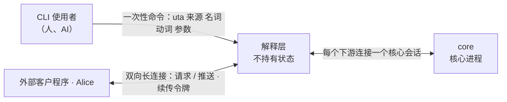
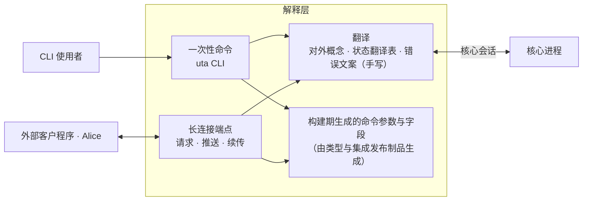

# 解释层（下游接口）

- **层级与元素**：解释层部分的 C4 树。第 1 节是它的 L1（系统上下文，黑盒）；第 3–4 节是它的容器与组件视图。上级：[README.md §4.1 划分与理由](../README.md#41-划分与理由)。
- **决定什么**：解释层为什么存在；它对下游说哪些概念；以什么形态交互；核心的状态与结果怎样翻成对外说法；续传、确认与缺失怎样呈现；身份与发布物；怎样证明合格。
- **读者**：实现 `uta` CLI 与长连接端点的人；OpenAlice 等下游的接入者（经本仓库发布的对外 schema）。审批者：维护者。
- **状态**：已定。
- **非目标**：
  - 核心↔解释层契约（会话、操作集、订阅与确认、一次性读、读模型、单据组、结果未知组、控制组）：由 core 拥有，每个操作的规格在实现它的核心组件文档里（[core-process/design.md §4.2 对外接口总表](../core/core-process/design.md#42-对外接口总表)）。本文只引用。
  - 命令与 flag 的具体名字、消息字段的序列化形状、长连接的传输：实现阶段制品。
  - 业务：仓位计算、组合下单、策略都在下游或程序里（[README.md §1.3 UTA 不含业务](../README.md#13-uta-不含业务)）。

证据标签与编号前缀的约定见 [README.md §0.4 阅读约定](../README.md#04-阅读约定)。

## 1 系统上下文（L1）

### 1.1 为什么有这一层

> 根本约束：抽象只在核心里，两侧是清洗（[README.md §1.4 三段：清洗、抽象、清洗](../README.md#14-三段清洗抽象清洗)）。

核心的抽象是为保证而造的：位置与三种进度、尝试与它的等待和结果两根轴、单据版本、三值能力。下游要的是能懂的接口：账户、订单、持仓、行情、审批。把核心契约直接交给下游，每个下游都要自己理解这些抽象、自己翻译一遍；抽象外泄出去，翻译各写各的就会分叉。[设计]

解释层把这件事集中到一处。它与集成对称：集成把上游清洗成契约值（[integration/design.md §1.1 为什么有这一层](../integration/design.md#11-为什么有这一层)），解释层把核心清洗成下游接口。两者都是明确的逐项清洗，不是抽象的延伸，可以写得具体、逐条列举。

### 1.2 黑盒与外部

| 外部 | 关系 | 交换什么 | 契约归属 |
|---|---|---|---|
| CLI 使用者 | 发一次性命令，读输出 | 对外概念的命令与结果；结构化输出按对外 schema | 对外面，本仓库随 release 发布（§4.6），跨仓库契约 |
| 外部客户程序（含 Alice） | 保持一条双向长连接 | 请求、推送、续传令牌、读取令牌、缺失通知 | 同上 |
| core（核心进程） | 解释层为每个下游连接开一个核心会话 | 核心↔解释层操作集 | core 拥有，只在本仓库内部 [core-process/design.md §4.2 对外接口总表](../core/core-process/design.md#42-对外接口总表) |

- Alice 是下游之一，不是核心的父进程或守护者；下游只经解释层接触核心（[README.md §4.1 划分与理由](../README.md#41-划分与理由)）。

### 1.3 分配给解释层的需求

需求编号与定义见 [README.md §4.3 需求分配](../README.md#43-需求分配)；解释层承担的是它们的对外呈现：

- **C1 / H1**：结果未知永远不显示成失败，不给重新下单的提示（§3.3）。
- **Q2、Q3**（呈现侧）：结果未知、放弃跟踪、取证确立的结果各有明确对外说法。
- **Q13、Q15、Q16**：配额拒绝、一次性读逐项结果、`Unsupported` / 未确认 / 不可用与空结果互不混同。
- **Q19、H7**：对外端点的信任边界是本机 OS 用户；授权全在核心，请求体里的身份不参与授权。
- **Q29、H5 / C5**：下游或解释层崩溃重启不改变核心的订阅与程序；断连损失以缺失通知给出。
- **S10**：Alice 现有消费面在新边界上仍可实现。

## 2 驱动

| 场景 | 本部分的响应 | 响应度量 |
|---|---|---|
| Q29（Alice 断连重连） | 解释层不持有状态；客户凭续传令牌重连，核心从已确认 cursor 续投 | 验收 #23 第 5 条 |
| Q16（能力不支持） | 不支持、未确认、来源离线、空结果逐项区分，离线先于能力判定 | 验收 #23 第 7 条 |
| Q2（`SendBarrier` 后崩溃） | “结果未知，正在核实，请勿重下”；取证确立后改为已确认发生 / 未发生 | 验收 #23 第 2、3 条 |
| Q13 / Q15 / Q19 | 逐项给出订阅与读的结果；拒绝未认证与越权请求的结果如实呈现 | 验收 #23 第 4 条（翻译表每行） |

泄露检查（§6.2）是解释层特有的可证伪度量：对外面上不出现任何核心概念名。

## 3 模型

### 3.1 对外概念

对外概念由解释层定，用下游已有的说法。每个概念在核心里对应什么，只在解释层内部出现。

| 对外概念 | 下游看到的 | 核心里对应（仅解释层内部） |
|---|---|---|
| 来源 | 一个券商、交易所或公共行情连接的名字；它有哪些数据可读、数据通常是实时还是延迟 | 集成；读模型 `sources` 的流声明、读 / 回填能力与名义数据等级（[read-model.md §4.2 读模型集合](../core/core-process/read-model.md#42-读模型集合)、[integration-session.md §3.3 投影 Projection](../core/core-process/integration-session.md#33-投影-projection)） |
| 账户 | 账户名（在来源内唯一、稳定）与显示名；它能做哪些操作 | `WriteScope.account_ref` 作账户名，`label` 作显示名；`Capability`（[integration-session.md §3.3 投影 Projection](../core/core-process/integration-session.md#33-投影-projection)）。`WriteLaneKey` 不外露；只读公共来源没有账户 |
| 订单 | 下单、撤单、改单、平仓请求；订单当前状态（UTA 最近观察到的，不是来源此刻的） | 交易协议的操作种类（下单、撤单、改单、平仓）的意图与单据（[ticket.md §4.5 交易协议：操作种类、目标、可执行性、检查目录](../core/core-process/ticket.md#45-交易协议操作种类目标可执行性检查目录-交易协议)）、IO 壳的尝试（[io-shell.md §3.3 尝试与 AttemptRef](../core/core-process/io-shell.md#33-尝试与-attemptref)）、订单状态观察按 `venue_order_id` 取最近观察（[read-model.md §3.3 订单身份、来源顺序与最近观察](../core/core-process/read-model.md#33-订单身份来源顺序与最近观察-设计)）。来源不能一次写完成改单时，改单不受支持，下游自己组合撤单与下单两个请求 |
| 持仓、余额、成交、行情等 | 按公共或扩展 schema 的字段；查询条件（查什么、按什么过滤、取哪段时间）；记录上报告的数据等级；成交带成交编号与修订号，按公布的计数规则每笔只计一次 | 观察流的契约载荷，直通（[envelope.md §2.6 信封解析，载荷直通](../core/core-process/envelope.md#26-信封解析载荷直通)）；一次性读的请求参数与 `range`（[one-shot-read.md §4.1 核心→集成：read](../core/core-process/one-shot-read.md#41-核心集成readstream-request-range--answered--unavailable--refused)）；成交的执行身份与修订号是公共 schema 字段（[read-model.md §3.2 成交的计数身份](../core/core-process/read-model.md#32-成交的计数身份-设计)） |
| 审批 | 待审请求；批准、驳回、退回、转交 | 单据的 `TicketAction` 与 Decision（[ticket.md §4.3 单据组（核心↔解释层）](../core/core-process/ticket.md#43-单据组核心解释层)、[decision-chain.md §4.2 顺序固定链：授权 → 输入约束 → 审批 → lane → 过期](../core/core-process/decision-chain.md#42-顺序固定链授权--输入约束--审批--lane--过期)） |
| 结果未知的订单 | 列表；再核实一轮；放弃跟踪（放行该账户后续请求，结果仍未知） | 结果未知的 `Undetermined` 尝试；`retry_reconciliation`、`abandon`（[io-shell.md §4.8 结果未知组（核心↔解释层）：放弃跟踪与重开](../core/core-process/io-shell.md#48-结果未知组核心解释层放弃跟踪与重开)） |
| 策略程序 | 装载、卸载、运行状态；它的**具名输出**：调用方给出策略程序与输出名即可订阅，接收该输出的值及其变化（只能订阅接收，不能读取；§4.3） | `load_program` / `unload_program`、程序观察（[program-host-element.md §4.1 load_program(manifest_ref, cold_start?)](../core/core-process/program-host-element.md#load_programmanifest_ref-cold_start)）；具名输出落到 `(Program(p), name)` 上整条流的只投递项（[subscription.md §4.1 核心↔解释层：订阅组与 rewind_cursor](../core/core-process/subscription.md#41-核心解释层订阅组与-rewind_cursor)），值按程序流记录的类型化值编码给出（[program-host-element.md §3.3 输出契约与程序流](../core/core-process/program-host-element.md#33-输出契约与程序流)） |
| 原生计算组件 | 安装、移除一个原生计算组件（按组件文件，组件名取自文件）；安装即授权该组件的代码在计算子系统里运行，它不受沙箱限制，与本机用户同等权限，策略程序由此才能使用它；安装之后组件文件被改动或删除，使用它的策略程序此后启动时被拒（已在运行的不受影响，直到下一次启动） | `install_native_op` / `remove_native_op`；每次启动使用它的策略程序之前的内容核对（[program-host-element.md §4.7.5 原生 op 的安装与执行](../core/core-process/program-host-element.md#475-原生-op-的安装与执行)） |
| 连接状态 | 在线 / 离线·重连中 / 需要处理（凭据或配置被来源拒绝；集成不合格，需重启集成）/ 尚未观察到该来源本次运行的连接状态；各数据流：连接准备中 / 在线 / 离线，以及补数据中 / 历史已补齐 / 历史已补到实时开始处（衔接处可能有缺漏）/ 历史未能补齐（附已补到哪）；最近成功时间与连续失败数 | 来源的会话状态（[integration-session.md §4.6 会话状态机](../core/core-process/integration-session.md#46-会话状态机)）、健康面的会话值、readiness 与回填进度（[read-model.md §3.5 健康面](../core/core-process/read-model.md#35-健康面-设计)、[subscription.md §4.5 实时边界、回填任务与回填进度](../core/core-process/subscription.md#45-实时边界回填任务与回填进度)） |
| 运维动作 | 换凭据（按新凭据重启该来源的集成）、重启来源的集成（按集成登记里的条目）、重载规则、清理历史 | 控制组（[control-plane.md §4.2 共同流程](../core/core-process/control-plane.md#42-共同流程)） |

新增写侧基本类型时（[README.md §1.3 UTA 不含业务](../README.md#13-uta-不含业务)），对外概念随之加一项。

### 3.2 解释层不持有状态

- 订阅、确认进度、单据、链都在核心。解释层只持有翻译所需的会话：一次命令或一条长连接对应一个核心会话（[session-entry.md §3 模型](../core/core-process/session-entry.md#3-模型)）。
- 解释层崩溃或重启，对下游就是一次断连：客户凭续传令牌重连，断连期间的损失以缺失通知给出（§4.5）。解释层自己没有要恢复的东西。
- 理由：订阅与程序的 owner 已经是核心（H5 / C5）。解释层另持状态，就多一个有状态的下游、多一套恢复协议。[设计]
- 推论：进程落点自由（§4.1），两种落点的外部行为相同。

### 3.3 翻译规则

- **结果未知不是失败。** 对外永远不把它显示成失败，也不给出“重新下单”的提示；否则下游会重复下单（C1）。
- **不把核心未确立的事说成确定。** 对外只陈述核心记录已确立的结论：原单是否已结束以原单自己的订单状态为准，撤单请求被来源受理或确认送达不等于原单已结束；放弃跟踪不是结论，结果补上之前一律说“结果未知”；未确立的一律说“尚未确认”，同样不给出重新下单的提示（否则下游会在仍在工作的原单之外再下一单，H1）。
- **不补全。** 缺失照实通知，不伪造连续；未识别照实给原文，不猜。
- **内部标识不透明。** 单据版本、规则版本等内部标识需要随请求往返时（例如改待审请求、批准），以不透明令牌形式由解释层带过，下游不解读它。
- **解释层不做什么**：不在对外面（命令、参数、输出、消息、错误）上出现核心概念；不持有状态、不做决策、不重试写、不补全缺失；不含业务。

## 4 结构

### 4.1 组件与部署

| 组件 | 拥有 | 隐藏的决定 | 假设 |
|---|---|---|---|
| 一次性命令 | `uta` 命令行、输出格式 | 命令与 flag 的名字、人读输出的措辞 | 一次命令一个核心会话 |
| 长连接端点 | 与外部客户程序的双向连接、推送的组装 | 传输与消息的序列化形状 | 一条连接一个核心会话；连接断即会话结束 |
| 翻译 | 对外概念、状态与结果的翻译表（§4.4）、错误文案 | 措辞 | 核心的结果集合是封闭的，每项都有翻译行 |
| 构建期生成 | 订单参数、读侧字段与查询参数、来源专有参数与字段 | 生成器实现 | 类型与集成发布制品在构建时可得 |

- **部署映射**：一次性命令在 `uta` CLI 进程里。长连接端点由 CLI 自己提供，还是由核心进程内部转发（含零拷贝转发），是实现选择；两种映射都允许，因为解释层不持有状态（§3.2），外部行为相同。设计不宣称长连接端点必是独立进程。
- **信任**：对外端点沿用本机 OS 用户的信任边界，非本用户的连接拒绝（[core/design.md §4.3 部署与信任](../core/design.md#43-部署与信任)，H7）。

### 4.2 两种交互形态

**一次性命令。**

- 来源作用域的命令：`uta <来源> <名词> <动词> [参数]`，例如 `uta ibkr order list`、`uta ibkr position list`。不属于某个来源的名词（审批、策略程序、原生计算组件、连接状态、运维）不带来源一段。策略程序的具名输出以调用方给出的（策略程序, 输出名）为目标，同样不带来源一段、不按来源解析：与某个来源同名的策略程序不是那个来源。
- 输出默认给人读；结构化输出按解释层发布的对外 schema（§4.6），不是核心记录。
- 写命令返回于下游能理解的稳定状态之一：待审、已受理、被拒、未发送、结果未知；或返回于调用方指定的等待上限，此时给出当前状态。返回的请求引用供后续命令使用。

**双向长连接。**

- 外部客户程序（包括 Alice）与解释层保持一条双向长连接：同一连接上发请求（与一次性命令同一组操作），收推送（订单状态、成交、行情、策略程序具名输出的当前值、待审事项、结果未知通知、连接状态变化）。推流靠它。
- 待审事项、结果未知、“已确认发生 / 未发生”与“已放弃跟踪，结果未知”来自解释层对各来源执行事实的订阅（[subscription.md §3.1 订阅与项](../core/core-process/subscription.md#31-订阅与项)），与行情推送一样持久、可续传，重连不丢。推送的是事项的出现、决定与关闭；某待审事项此刻是否已偏离（市场变了），不单独推送，解释层在呈现该事项时读取单据的当前状态（[read-model.md §4.2 读模型集合](../core/core-process/read-model.md#42-读模型集合)），放行与否仍由核心当时的门判定。
- 账户、可读数据与能力变化时（来源重新连接、能力变更），解释层经同一订阅得知并重读声明，对下游的账户列表与“此刻能不能”随之更新。

### 4.3 命令与参数从哪里来

**手写的**：核心概念翻成对外说法的部分。对外概念与动词（§3.1）、状态与结果的翻译（§4.4）、错误文案都逐条写出，不生成。理由：这是清洗本身，每一项都需要判断。

**生成的**：本来就是下游词汇的部分。

- 订单参数：写侧基本类型的已注册字段（处理器字段注册表里的守卫字段，如 side、instrument，[envelope.md §3.2 处理器字段注册表](../core/core-process/envelope.md#32-处理器字段注册表)），以及该来源为每种操作声明的意图参数 schema（公共意图 schema 或其扩展，含订单类型、time-in-force 等没有处理器读的参数；核心按它校验、不读其值，原样交给集成，[ticket.md §3.4 参数合规：意图参数 schema](../core/core-process/ticket.md#34-参数合规意图参数-schema-设计)）；
- 读侧字段：公共 schema。成交的执行身份与修订号也是公共 schema 字段，对外以成交编号、修订号给出：下游自行计数时读的就是它们，与核心 `orders` 读的是同一个值（[read-model.md §3.2 成交的计数身份](../core/core-process/read-model.md#32-成交的计数身份-设计)）；
- 读侧查询参数：各流的请求 schema（公共请求 schema 或来源扩展，[integration-session.md §3.3 投影 Projection](../core/core-process/integration-session.md#33-投影-projection)）：查询主体（已解析的 instrument、目录键或文本）与领域过滤条件（到期日、行权价、条数上限等）；时间段落到核心的 `range`；
- 来源专有的参数与字段：该集成发布的扩展 schema 与记录映射（[integration/design.md §4.3 发布物](../integration/design.md#43-发布物)）。

生成在构建期完成，从类型与集成的发布制品生成，不在运行期远程发现。命令是否存在在构建时就定了。

**运行期只回答“此刻能不能”：**

- 来源与账户来自读模型 `sources`：账户名是 `account_ref`，显示名是 `label`。只读公共来源不出现在账户列表里。某账户引用被核心标为不可解析时，该账户显示为“账户引用冲突，需要处理”，按这个名字的命令不解析到任何账户。
- 某账户某操作：来源在线且 `Supported` 照常执行；来源在线且 `Unsupported` 答“该账户不支持此操作”；`Unknown` 或来源离线答“能力未确认 / 来源离线，请求会等待能力确立，到期未确立即过期”（[ticket.md §3.4 参数合规：意图参数 schema](../core/core-process/ticket.md#34-参数合规意图参数-schema-设计)）。离线时不按最近一次声明答“不支持”。
- 某项数据的读：解释层按 `sources` 把（来源, 账户?, 数据类别）解析到一条声明的流。同一账户或来源下同一类别有多条流（例如实时与延迟两个 feed）时，不擅自选一条：让调用者按来源公开的数据类别与名义等级选择，未选则以歧义错误拒绝。读的结果逐项翻译（§4.4）：不支持、未确认、来源重连中 / 需要处理、来源拒绝、参数不合法与空结果互不混同，不返回看似成功的空结果（[one-shot-read.md §4.2 核心↔解释层：read](../core/core-process/one-shot-read.md#42-核心解释层readtargets-deadline--vectargetresult)）。来源此刻没有连接时先答来源离线，不答“不支持”或“能力未确认”：那只是来源上一次连接时说过的话，要等它重新连上后按当时的声明判定。
- 显示数据等级：读之前按流的名义等级说“通常是实时 / 延迟”；记录上报告了实际等级时，以记录为准。
- 运行期遇到构建时没有的载荷 schema 版本：该来源专有的字段不可用并如实提示，公共字段不受影响。这与核心“未注册的 schema 组合不触发解释器”一致（[envelope.md §3.3 payload_schema 与 schema 发布](../core/core-process/envelope.md#33-payload_schema-与-schema-发布)）。
- 构建时的请求 schema 或意图参数 schema 版本与该来源此刻声明的不同：该读或该操作如实提示暂不能执行，不提交旧版参数（[one-shot-read.md §4.2 核心↔解释层：read](../core/core-process/one-shot-read.md#42-核心解释层readtargets-deadline--vectargetresult)、[decision-chain.md §4.2 顺序固定链：授权 → 输入约束 → 审批 → lane → 过期](../core/core-process/decision-chain.md#42-顺序固定链授权--输入约束--审批--lane--过期)）。

**策略程序的具名输出不经来源解析：**

- 目标由调用方给出：策略程序与它的输出名两者都由调用方指定，解释层不按 `sources` 解析（那里只有来源的声明），也不列举某策略程序有哪些输出。策略程序不是来源：同名的来源与策略程序是两个目标（[core-process/design.md §3.1 流、位置与三种进度](../core/core-process/design.md#31-流位置与三种进度) 中 `Source` 的两个命名空间）。
- 解释层把它落到该程序这条输出流上一个整条流的只投递项（[subscription.md §4.1 核心↔解释层：订阅组与 rewind_cursor](../core/core-process/subscription.md#41-核心解释层订阅组与-rewind_cursor)）：不向任何来源要推送，不计入任何来源的订阅上限，也不带订阅对象（策略程序的输出不按对象划分）。
- 订阅是否成立只看该策略程序历来声明过的输出（[subscription.md §3.1 订阅与项](../core/core-process/subscription.md#31-订阅与项)）：从未装载生效过的策略程序答“没有这个策略程序”；装载生效过、却从未声明过这个输出名的答“该策略程序从未声明过这项输出”，二者分开给出。曾经声明、后来的版本不再声明或策略程序已卸载的输出仍可订阅，它已记下的数据按订阅起点与保留范围照常接收。订阅成立不表示该策略程序此刻在运行，收到的每个值只表示它那一次给出的输出：卸载或不再声明时这项输出不另发通知（[program-host-element.md §3.3 输出契约与程序流](../core/core-process/program-host-element.md#33-输出契约与程序流)），运行与否看它的运行状态。
- 值按程序流记录的类型化值编码原样给出（[program-host-element.md §3.3 输出契约与程序流](../core/core-process/program-host-element.md#33-输出契约与程序流)）：值的类型由策略程序决定，内容是策略自己的业务，解释层不解读，也不在构建期为它生成字段（它不是集成发布的 schema）。同一段数据里值的类型不变，只在该输出重新开始（§4.4）之后才可能不同：接续原有状态的更新要求各输出的名字与类型都不变，否则按重新开始处理（[program-host-element.md §4.1 load_program(manifest_ref, cold_start?)](../core/core-process/program-host-element.md#load_programmanifest_ref-cold_start)）。同一类型的值，其 JSON 的具体结构（例如序列的长度）仍可逐次不同。
- 每条推送是该输出的一个值，按 §4.4“策略程序具名输出上的值记录”两行翻译：区分首次给出与改变的是那条数据本身的形状，不是这个订阅者是否见过此前的值，从现在开始的订阅收到的第一条也可能是“变为 X”。每条推送都带该输出的完整值，下游持有的当前值就是最近收到的那一条，与此前收到过或漏收了哪些推送无关（[observation-journal.md §2.3 程序流的 fold](../core/core-process/observation-journal.md#23-程序流的-fold-设计)）。订阅从现在开始时不补发已经记下的值：此后该输出首次给出值或值改变时才收到；值未改变不重复推送。通知（重新开始、缺失）照常按 §4.4 给出。

### 4.4 状态与结果的翻译

翻译表是解释层的核心内容，逐项写出。下表是必须覆盖的项与对外含义，措辞由实现定：

| 核心里 | 对外 |
|---|---|
| 单据草稿、送审中 | 待审 |
| `Close(DecisionRejected)` | 审批驳回（附原因） |
| STS `Rejection` | 被规则拒绝（附原因与违反项，如参数不合该来源 schema、冷却未过） |
| 参数有效性 `TargetNotAccepted` | 该账户不能按这种订单身份撤单 / 改单（来源只接受另一种身份）；换用来源接受的身份重新发起撤单／改单请求 |
| 参数有效性 `NotSupported`（改单） | 该账户不支持改单；可以先撤单、确认原单已结束后再下新单 |
| 参数有效性 `CapabilityNotEstablished` | 待审：等待来源能力确认 / 等待来源恢复连接 |
| `Close(Expired)`；未发出的尝试 `Expired(deadline)` | 已过期，未发送 |
| `Prepared` 之后、`SendBarrier` 之前（在发出前门等待来源或能力恢复） | 尚未发送：等待来源恢复 / 等待能力恢复 |
| `SendBarrier` 之后、回执之前 | 发送中 |
| `VenueAccepted` 之后 | 已受理；此后按订单状态词表显示部分成交、已成交、已撤等（C13） |
| `VenueRejected(reason)` | 被来源拒绝（附原因） |
| `NotSent(reason)` | 未发送：连接器没有把请求交给来源（附原因；参数版本已过时的，提示按来源当前的参数重新提交） |
| `Undetermined` | **结果未知，正在核实，请勿重下** |
| 单据版本上的 `bypass_lane` 控制记录 | 运维已允许这一版不等该账户上结果未定的请求（附谁、绕过了哪些请求）；它不代替审批：已批准的照常放行，尚未批准的仍待审 |
| 取证 `Found` / `Absent` 确立结果 | 已确认发生 / 已确认未发生 |
| `Abandoned`，结果仍未知 | **已放弃跟踪，结果未知**（附谁放弃、备注）；不显示为已发生或未发生，不提示重新下单 |
| `Abandoned` 之后结果补上 | 已确认发生 / 已确认未发生，并注明曾放弃跟踪 |
| 撤单请求的 `VenueAccepted` 或 `Found` | 撤单请求已送达；原单是否已结束以原单自己的状态为准 |
| `Unmapped(raw)` | 未识别的状态，并给出来源原文 |
| `Conflict` | 请求已被他人修改或已被决定，请重看 |
| `Unauthorized` | 无权限 |
| 操作结果 `Starting`（核心启动第 5 步之前） | 服务启动中 |
| 核心受控停止关闭消费方会话（[core-process/design.md §4.7.4 受控停止](../core/core-process/design.md#474-受控停止-设计) 第 1 步） | 服务已停止：连接关闭，服务再次启动后才能重连；重连后按“读取令牌”的规则判断未完成的读取。连接关闭不等于操作失败：停止之前已受理、尚未答复的操作照常得出结果，重连后以记下的结果为准：卸载或更新策略程序看其状态，放弃跟踪看该笔请求的状态；重启集成或更换凭据在停止时还没有生效的不再执行，结果按下一行给出，停止之前已生效的要到服务再次启动后才连接来源，看来源的连接状态；服务停止之后仍没有它的结果的，这次操作没有生效 |
| 控制操作 `Rejected(Stopping)`（重启集成或更换凭据，[core-process/design.md §4.7.4 受控停止](../core/core-process/design.md#474-受控停止-设计) 第 1 步） | 服务正在停止，这次操作未执行；服务重新启动后再发起 |
| 流 readiness `Starting` / `Live`（`Degraded`）；会话值不是 `Established` 时由会话值派生的 `Disconnected` | 该数据流连接准备中 / 在线（来源降级）/ 离线（附来源的连接状态，有起始时间时附起始时间，不是断线时刻） |
| 回填进度 `Backfilling{through}` / `Closed` / `Reached` / `Incomplete{through}` | 补数据中（已补到哪）/ 历史已补齐 / 历史已补到实时开始处，衔接处可能有缺漏 / 历史未能补齐（附已补到哪） |
| 会话 Connecting | 离线·重连中 |
| 会话 Established | 在线 |
| 会话值 `Unobserved`（这个时间点上还没有该来源本次运行的会话记录，[read-model.md §3.5 健康面](../core/core-process/read-model.md#35-健康面-设计)） | 尚未观察到该来源本次运行的连接状态 |
| 会话 Halted{Refused} | 需要处理：凭据或配置被来源拒绝 |
| 会话 Halted{ProjectionInvalid / ContractIncompatible} | 需要处理：集成不合格（需重启集成） |
| 来源不在核心采纳的集成登记里（登记被移除，[integration-session.md §4.7 集成登记的采纳](../core/core-process/integration-session.md#47-集成登记的采纳)） | 来源已移除：不再连接，已有的历史与订阅保留；它历史上提供过的数据与订单记录仍可订阅查阅，新的读取与需要来源推送的订阅不再受理 |
| 一次性读 `Unsupported` | 该来源 / 账户不支持此数据 |
| 一次性读 `Unconfirmed` | 能力未确认，暂不能读取 |
| 一次性读 `Unavailable{source_state}` | 按来源状态：来源离线，正在重连 / 需要处理（见连接状态）；来源此刻没有连接（或从未连接过）时一律答这一项，先于“不支持”“能力未确认”，这时是否支持要等来源连上后才知道 |
| 一次性读 `Refused` | 来源拒绝了此请求（附原因，如未开通该数据） |
| 一次性读 `InvalidRequest` | 查询参数不合法（附违反项），或参数格式已随来源更新 |
| 一次性读 `UnknownTarget` | 没有这个来源（来源未登记），或所读的是策略程序的具名输出：它不能读取，只能订阅接收（§4.3） |
| 一次性读 `Unavailable{gap}` | 本次读取失败（向来源的这次调用没有得到回答）；可重试。它是这次读取的结果，不是数据缺失通知 |
| 一次性读 `Pending{from, request, instance_id}` | 已向来源发出，等待上限内尚未作答；读取令牌让客户接着等这次读取的结果，不向来源新发请求；其间来源重新连接、改了声明或离线，这次读取的结论（作答、被拒或失败）仍会送到；令牌记着发出它的 UTA 实例：UTA 重启只使对这次读取的等待失效，重启之前已记下的结论照样从令牌所记的起点送到；重启之前没有得出结论的，或令牌所记的起点已早于该数据保留的范围的，显示为“读取作废、需重新读取”，不显示为仍在等待 |
| 其余 `Unavailable` | 来源暂不可用 |
| `Snapshot` 的 `gaps` 非空（逐条按下文 `Gap{origin: Source}` 各行翻译） | 该视图依据的数据在来源侧从此处开始接收而此前历史是否取全未经确认、重新开始、中断或历史未能补齐之处，逐条给出，说法与数据推送里的同一条通知相同（附来源与区段）。只列来源侧的：渠道失败是那次读取的结果，订阅自己漏收的数据以缺失通知在订阅里给出 |
| 读模型 `NotYetAvailable{positions}` | 不直接显示：解释层按所带的已提交位置改读或稍后重读；仍未就绪时答“数据尚未就绪，请稍后重试” |
| 读模型 `BeyondRetention`（`as_of` 有位置低于所涉观察流的保留边界；或 `health` 切面上某个成员走到会话值的 `BeyondRetention` 分支，该切面无法由保留的记录重建，[observation-journal.md §2.4 保留：边界与删除规则](../core/core-process/observation-journal.md#24-保留边界与删除规则)、[read-model.md §3.5 健康面](../core/core-process/read-model.md#35-健康面-设计)） | 所请求时间点的视图已无法由保留的记录重建；不返回该时间点的状态 |
| `orders` 的完整界 / 无完整界 | 成交记录已确认完整到某处，附一个不透明的完整性令牌：令牌内含来源侧的周期（该账户成交数据的当前周期，编码含来源、账户与数据身份）与该周期里的界，编码稳定、不让客户读出或排序其中任何部分；客户不解读它，只判断两个令牌是否属于同一周期（周期部分逐字节相等），不比较先后。周期不同即来源侧的完整性已重新开始：新周期的令牌不与旧周期的比较，旧周期的完整确认不沿用；新周期在重新补齐历史之前没有界，这时回答只附当前周期的不透明标记，客户据它看出周期已变。确认只针对解释层这次给出的订单视图，不陈述某时刻之前的成交都已到齐，只在来源给出可证明完整的依据时给出 / 成交记录的完整性无法确认（来源不提供可衔接的序号或从起点的全部历史、历史尚未补齐、来源历史已清理、有缺口，或 UTA 已清理该段记录） |
| 单据操作 `Rejected(Malformed)` | 请求缺少必要信息，无法形成订单请求（附缺什么） |
| 单据操作 `Rejected(Closed)` | 该请求已结束，不能再操作 |
| 单据操作 `Rejected(NotResponsible)` | 只有该请求的负责人能修改 |
| 单据操作 `decide` 被拒：当前规则对该请求不要求人工审批（含已自动通过、仍在排队等待的，[decision-chain.md §4.3 审批步](../core/core-process/decision-chain.md#43-审批步)） | 该请求按当前规则不需要审批，这次批准或驳回未被记录 |
| 账户引用不可解析 | 账户引用冲突，需要处理 |
| 订阅被拒（来源未登记、来源不提供所选数据、订单与审批推送用了逐条有序以外的方式、有数量上限的数据未指定订阅对象） | 订阅请求不成立（附原因），与超出数量上限分开给出；一个订阅含多项数据时逐项给出，其余项照常生效 |
| 策略程序具名输出的订阅项被拒：`Program(p)` 没有任何开始成员的 `Applied`（来源未登记）/ 所选的名字不在 `p` 任何一条这种 `Applied` 所记的输出契约里 | 没有这个策略程序 / 该策略程序从未声明过这项输出，二者分开给出；与其他被拒项一样逐项给出，其余项照常生效 |
| `install_native_op` 的 `Applied` / `remove_native_op` 的 `Applied` | 原生计算组件已安装 / 已移除 |
| `install_native_op` 的 `Rejected(reason)`：`artifact` 读不到或不合法 | 组件文件读不到或不是合法的组件，未安装（附原因） |
| `install_native_op` 的 `Rejected(AlreadyInstalled)` | 同名组件已安装，这次未安装；安装不覆盖已有组件，要更换先移除 |
| `remove_native_op` 的 `Rejected(NotInstalled)` | 没有安装这个组件 |
| `remove_native_op` 的 `Rejected(InUse)` | 仍有策略程序使用该组件（含已停止或正在等待启动的），未移除；先卸载这些策略程序，或更新为不使用它的版本 |
| `ProgramHalted{Budget(kind)}` | 策略程序已停止：超出运行资源限额（附哪一项：计算时间、内存、下单请求频率或状态大小）；服务重启后也不会自行恢复；排除原因（调整策略程序或它的限额）后重新装载策略程序 |
| `ProgramHalted{Trap}` | 策略程序已停止：运行中出错（程序异常退出或无响应，或交出的保存状态不是当前版本接受的格式；附原因）；服务重启后也不会自行恢复；排除原因后重新装载策略程序（保存的状态本身导致反复出错时，重新装载并丢弃原有状态） |
| `ProgramHalted{ContentUnavailable}` | 策略程序已停止，未启动：策略程序文件在装载之后被改动或已不存在；服务重启后也不会自行恢复；排除原因（恢复装载时的文件，或以现在的文件为准）后重新装载策略程序 |
| `ProgramHalted{LoadRejected(reason)}`：声明校验不成立，含某个观察项的初次接纳已被最终拒绝 | 策略程序已停止，未启动：它的输入与来源提供的数据不符（来源不提供所选数据、字段缺失或类型不符、来源不提供按来源等齐所需的依据）、它要看的账户不在来源提供的范围里、它用到的组件未安装或签名不符、输入数据不满足组件的要求、计算子系统不可用，或它的某项输入订阅被拒（来源未登记、超出数量上限）（附原因）；服务重启后也不会自行恢复；排除原因后重新装载策略程序 |
| `ProgramHalted{NativeArtifactUnavailable}` | 策略程序已停止，未启动：它使用的组件文件在安装之后被改动或已不存在（附组件名）；服务重启后也不会自行恢复；恢复安装时的组件文件后重新装载策略程序，或卸载它、移除并重新安装该组件 |
| `ProgramHalted{LoadRejected(NativeHandoverFailed)}` | 策略程序已停止，未启动：计算子系统此刻不可用，或没有接收它使用的组件（附组件名）；服务重启后也不会自行恢复；计算子系统恢复后重新装载策略程序 |
| `ProgramHalted{LoadRejected(HostSpawnFailed)}` | 策略程序已停止，未启动：系统没能为它启动运行进程；服务重启后也不会自行恢复；排除原因（例如运行环境资源不足）后重新装载策略程序 |
| `ProgramFailed{reason}`（与同一事务的 `ProgramHalted` 原因相同） | 不另成一项：与同时记下的停止原因相同，按上面对应的一行给出 |
| 活动集合里的成员因所引用的集成来源还没有声明版本而等待（没有 `ProgramHalted`） | 已登记、未启动，等待所需来源接入并声明；这不是失败：所需来源都接入并声明之后自行启动，或给出上面某一种停止原因 |
| `ProgramReset{reason}`（在不沿用旧状态的替换 `Applied` 事务里，新成员的每条程序流上同时有原因 `program_upgrade` 的 `Gap{origin: Source}`，有前驱或无前驱） | 不另成一项：此前已有的输出按下文“该输出重新开始（策略程序重新装载，或更新时未接续原有状态）”一行给出，新增的输出按“该输出的数据从此处开始”一行给出 |
| 订阅 `QuotaExceeded` | 订阅超出该来源的数量上限（附上限） |
| 订阅待接纳 | 已登记，来源尚未连接过；来源首次连接后生效或被拒 |
| 订阅由待接纳转被拒 | 来源连接后不提供所订数据，订阅未生效 |
| 订阅 `BeyondRetention` | 请求的起点早于该数据保留的范围，无法从该处开始接收 |
| 订阅挂起（原因 `QuotaExceeded`） | 订阅中的这项数据因来源上限降低暂停，有余量后恢复；同一订阅的其他数据照常 |
| 订阅挂起（原因 `StreamUndeclared`） | 来源不再提供这项数据，订阅中的这项暂停；已记录的数据仍照常接收，来源重新提供时恢复（其间的断档以缺失通知给出）；同一订阅的其他数据照常 |
| 订阅挂起（原因 `WholeStreamInPool`） | 该数据改为有数量上限，订阅中的这项暂停，需改为按对象订阅；该流不再有上限时恢复；同一订阅的其他数据照常 |
| 路由结论里上游拒绝推送的主体（订阅项内的“来源拒绝”） | 来源拒绝提供该对象的推送（附原因）；同一订阅的其他对象照常 |
| 成交冲突（同一身份内容矛盾） | 来源对同一笔成交给出了矛盾内容，附各内容 |
| 无身份成交 | 来源数据不合规，未计入 |
| 订单跨流冲突（同一订单身份出现在两条流上） | 来源对同一订单给出了两处状态，附各处最近状态；不选其一 |
| 订单 / 持仓的最近观察顺序未确立（几条彼此不可比、内容不同的记录） | 来源给出的状态先后未确立，并列各渠道最近状态（附渠道与收到时间）；不选其一；依赖它的检查显示为无法判定；可另附标明“按收到顺序”的视图，它不代表来源的先后 |
| 持仓跨流冲突（同一持仓身份出现在两条流上） | 来源对同一持仓给出了两处值，附各处最近值；不选其一；依赖该持仓的检查（敞口、持仓）显示为无法判定 |
| 无身份的订单状态 | 来源数据不合规，未归入任何订单 |
| 策略程序具名输出上的值记录，只有新值的贡献（即该流 epoch 的首个值） | 该输出的当前值为 X |
| 策略程序具名输出上的值记录，撤回此前的贡献并加入新值（同一流 epoch 内值改变，同一条记录；压缩后作为基线留下的这种记录不变，它撤回的记录可能已被清理或在订阅起点之前；新值总是取代此前持有的值，[observation-journal.md §2.3 程序流的 fold](../core/core-process/observation-journal.md#23-程序流的-fold-设计)） | 该输出的当前值变为 X（取代此前的值） |
| `Gap{origin: Source}`，无前驱（该数据的第一段，不论原因，例如 `start`、`program_upgrade`），策略程序具名输出的流 | 该输出的数据从此处开始，这里没有缺失；值在它首次给出时另行推送 |
| `Gap{origin: Source}`，无前驱（该数据的第一段，不论原因，例如 `start`、`credential_rotated`），集成来源的流 | 从此处开始接收；此前的来源历史是否取全未经确认（来源证据补齐后不再列出） |
| `Gap{origin: Source}`，有前驱，原因 `start`、`program_upgrade`，策略程序具名输出的流 | 该输出重新开始（策略程序重新装载，或更新时未接续原有状态）：与此前的值之间无法证明衔接；此前收到的值属于上一段，不延续到这一段，这一段的值以此后收到的为准，这一段首次给出值之前不沿用上一段的值；值的类型可能与上一段不同 |
| `Gap{origin: Source}`，有前驱，原因 `start`、`credential_rotated` 或 `schema_change`，集成来源的流 | 来源重新开始或重建，与此前的数据之间无法证明衔接 |
| `Gap{origin: Source}`，有前驱，原因 `disconnect`、`quota` 或 `ingress_overflow` | 来源中断，这一段可能缺失 |
| `Gap{origin: Source}`，原因 `backfill_incomplete` | 历史未能补齐（附缺失的区段） |
| `Gap{origin: Delivery}`（订阅上的投递缺口） | 本订阅漏收了这一段（只要最新的订阅里合并掉的，或客户处理不及、推送被暂停时跳过的；或这一段在接收之前已被清理），数据本身不缺；这是该订阅者自己待确认的损失通知：每次重连先于后续推送给出，客户确认后消去 |

### 4.5 续传、确认、缺失

- **续传令牌**：不透明，编码核心侧的确认进度。客户保存，重连时交回；解释层不保存（§3.2）。
- **读取令牌**：一次性读等待上限内尚未作答（`Pending`）时给出，不透明，编码该数据的起点位置、这次读取的请求身份（核心给出的 `Pending.request`，原样带着，解释层不解读、不自行规范化）与发出这次读取的 UTA 实例。客户凭它订阅即收到这次读取的结果，不向来源新发请求；其间来源重新连接、改了声明或离线，结果仍会送到。同一数据上别的读取的结论与失败也会经这个订阅到来，解释层只把请求身份与令牌所记相同、发起方含本客户、起点与令牌所记相同、且由令牌所记的 UTA 实例记下的那一条当作这次读取的结果（[one-shot-read.md §4.2 核心↔解释层：read](../core/core-process/one-shot-read.md#42-核心解释层readtargets-deadline--vectargetresult)），其余的不交给客户。解释层在核心会话里看到的 UTA 实例与令牌所记不同时，失效的只是对这次在途读取的等待：解释层只在重连那一刻该数据已记下的范围里找，结论若在旧实例退出之前已记下，照样从令牌所记的起点送到；别的 UTA 实例记下的结果即使请求相同、起点相同，也不当作这次读取的；没有这样的结论，或起点已早于该数据保留的范围，才答“读取作废、需重新读取”。解释层不为此保存任何东西，结论在不在只看核心的记录。
- **确认**：客户表示“已处理”，解释层转为核心的确认（确认 = 已处理，[subscription.md §3.2 cursor 与确认](../core/core-process/subscription.md#32-cursor-与确认)）。未确认的区间重连后可能重复收到。确认越过一条缺失通知所标的区段，即确认了这次损失，该通知不再给出。
- **订阅选项**：从现在开始 / 从令牌续 / 只要最新（可能合并；客户处理不及时暂停推送、跳过一段；两者都以缺失通知标出）/ 逐条有序（客户处理不及时只放慢推送，不暂停、不跳过；落后到保留范围之外的段仍以缺失通知给出），分别落到核心的 `from` 与两种订阅消费方式（`latest`、`ordered`，[delivery.md §3.1 三种消费方式（投递侧）](../core/core-process/delivery.md#31-三种消费方式投递侧)、[subscription.md §4.1 核心↔解释层：订阅组与 rewind_cursor](../core/core-process/subscription.md#41-核心解释层订阅组与-rewind_cursor)）。一个订阅可含多项数据（可跨来源，也可含策略程序的具名输出），每项各自生效或被拒；逐条有序只在同一项数据内成立，不同数据之间不保证先后（[delivery.md §3.2 投递的单位与次序](../core/core-process/delivery.md#32-投递的单位与次序)）。策略程序的具名输出从现在开始订阅时不补发已经记下的值（§4.3）。订阅没有“等齐再给”：按来源证据等齐只是策略程序的输入方式，核心的订阅不带等待点。需要多项数据到齐再计算的客户在自己一侧处理：按时间截止的，声明自己的等待窗口（例如到某时刻再等一段后用已收到的数据），窗口之后才到的数据照常收到，不当作完整。
- **订单与审批的推送**：解释层对执行事实的订阅只用逐条有序，可从最早开始，没有缺失；新接入的客户要历史时，从最早开始重放即可得到 UTA 的全部请求、审批与执行过程记录（[subscription.md §3.1 订阅与项](../core/core-process/subscription.md#31-订阅与项)）。订阅一个账户之后，该账户此后的全部请求都在同一订阅里，不需重订。上游的订单状态与成交是观察记录，走观察订阅，按其缺失与保留规则给出（[observation-journal.md §2.4 保留：边界与删除规则](../core/core-process/observation-journal.md#24-保留边界与删除规则)）。
- **补数据开始之前的历史**：某项数据尚未开始补数据时（例如该数据一直没有新记录，连接状态为“连接准备中”），要历史的下游按时间段直接读取（`read` 的 `range`，[one-shot-read.md §4.1 核心→集成：read](../core/core-process/one-shot-read.md#41-核心集成readstream-request-range--answered--unavailable--refused)）；它不改变补数据进度，也不消去缺失通知（[subscription.md §4.5 实时边界、回填任务与回填进度](../core/core-process/subscription.md#45-实时边界回填任务与回填进度)）。
- **缺失通知**：来源侧的通知（`Gap{origin: Source}`）按 §4.4 各行给出：策略程序具名输出从此处开始的那一种是起点通知，不是缺失；它重新开始的那一种说明此前的值不延续到这一段、与此前无法证明衔接；外部来源从此处开始接收的那一种说明此前的来源历史是否取全未经确认，来源证据补齐后不再列出；来源重新开始或重建的只说明无法证明衔接；中断的说明这一段可能缺失；历史未能补齐的附缺失区段。本订阅的投递缺口翻成缺失通知（§4.4），标明漏收的是哪一段。渠道失败（`Gap{origin: Channel}`）是那次读取的失败结果，不翻成缺失通知（[core-process/design.md §3.2 gap 的三种来源](../core/core-process/design.md#32-gap-的三种来源)）。

### 4.6 身份与发布物

**身份。**

- 解释层对外端点沿用 H7：信任边界是本机 OS 用户，非本用户的连接拒绝。
- 下游自报 actor（哪个人、哪个 AI），解释层以它开核心会话，`principal = (os_user, actor)`（[session-entry.md §3 模型](../core/core-process/session-entry.md#3-模型)）。授权全在核心（[decision-chain.md §4.2 顺序固定链：授权 → 输入约束 → 审批 → lane → 过期](../core/core-process/decision-chain.md#42-顺序固定链授权--输入约束--审批--lane--过期)），解释层不授权；请求体里的身份不参与授权。

**发布物。** 本仓库随 release 发布：

- CLI（含生成的命令）；
- 长连接的消息协议 schema 与对外结构化输出的 schema；
- 本文 §3.1 与 §4.4 的实现（对外概念与翻译表）；
- 成交的计数规则（[read-model.md §3.2 成交的计数身份](../core/core-process/read-model.md#32-成交的计数身份-设计) 的对外表述：按来源、账户与成交编号计一次；未带修订号的按 0，修订号大者取代小者；同一修订号内容矛盾为冲突，不计入；来源明确作废的保留编号、不计入；无成交编号的不计入），供自行计数的下游依从。订单当前状态不要求下游自行选取：它取自解释层给出的订单视图（[read-model.md §4.2 读模型集合](../core/core-process/read-model.md#42-读模型集合)），选取所需的来源序号不在对外面上。

这是跨仓库契约，OpenAlice 从 release 消费。核心↔解释层的 IDL 只在本仓库内部。

## 5 走查

场景定义与端到端成败标准见 [README.md §5 场景（W1–W20）](../README.md#5-场景w1w20)、[README.md §5 场景（W1–W20）](../README.md#5-场景w1w20)、[README.md §5 场景（W1–W20）](../README.md#5-场景w1w20)；核心内部的组件级 trace 见 [core-process/design.md §5.1 W14（Q29）下游（Alice）断连重连](../core/core-process/design.md#w14q29下游alice断连重连) 等。本节只走解释层内部的组件。

### 5.1 W14（Q29）下游断连重连

主 trace：[core-process/design.md §5.1 W14](../core/core-process/design.md#w14q29下游alice断连重连)。

1. Alice 或解释层崩溃 / 重启。→ 长连接端点随进程消失；它开的核心会话随传输关闭而结束，核心不为此写记录。解释层没有要恢复的状态（§3.2）。
2. Alice 凭续传令牌重连。→ 长连接端点以下游自报的 actor 开核心会话；同一 principal 的持久订阅由核心自动重新挂接，投递从令牌所编码的已确认进度之后继续（[session-entry.md §4.6 已定事实](../core/core-process/session-entry.md#46-已定事实)）。
3. 端点读当前状态（读模型的 `Snapshot`），先收到断连期间未确认的投递缺口，再收到记录。→ 翻译把投递缺口翻成“本订阅漏收了这一段”的缺失通知，排在后续推送之前；未确认区间可能重复，端点按位置去重或原样标出。
4. 执行事实订阅同样续投：断连期间的待审事项、结果未知与取证终结都补到，没有缺失通知。
- 对外可见：当前状态、断连之后的推送、缺失通知；续传令牌与位置只在解释层与核心之间比对。走通。

### 5.2 W19（Q19）会话身份与未授权控制

主 trace：[core-process/design.md §5.1 W19](../core/core-process/design.md#w19q19会话身份与未授权控制)。

1. 非本 OS 用户的连接到达长连接端点。→ 按 H7 拒绝，不开核心会话。
2. 本用户的客户在请求体里填了另一个身份。→ 端点只用开会话时的 actor，请求体身份不进核心会话；核心按会话 principal 授权（[decision-chain.md §4.2 顺序固定链：授权 → 输入约束 → 审批 → lane → 过期](../core/core-process/decision-chain.md#42-顺序固定链授权--输入约束--审批--lane--过期)）。
3. 已认证但无 scope 的运维请求（例如重启来源的集成）。→ 核心返回 `Rejected(Unauthorized)`；翻译答“无权限”，没有其他副作用可呈现。
- 走通。解释层不做授权判断，只保证身份不从请求体进入。

### 5.3 W20（Q13+Q15+Q16）取得声明、按账户与无账户来源读、推送待审与结果未知

主 trace：[core-process/design.md §5.1 W20](../core/core-process/design.md#w20q13q15q16解释层取得声明按账户与无账户来源读推送待审与结果未知)。

1. 构建期：生成器从公共 schema 与集成 X、公共来源 P 的发布制品生成命令参数与字段。
2. 连接建立后，端点读 `sources`：X 的两个账户以 `account_ref` / `label` 出现在账户列表，P 不出现；能力翻成“支持 / 不支持 / 未确认”。端点再以 X、P 订阅执行事实。
3. 下游读 X 两个账户的持仓与 P 的某 instrument 报价。→ 命令按 `sources` 解析到各自的流，带请求 schema 身份与参数发一次性读；各 target 的结果逐项翻译：X 离线得“来源离线，正在重连”（先于能力判定），P 作答得数据，上游拒绝得“来源拒绝”，迟迟不答得读取令牌。
4. 下游在一个订阅里选三项：超配额的一项得“订阅超出该来源的数量上限”，来源不提供的一项得“订阅请求不成立”，其余照常生效；逐项给出。
5. X 重连、`account_ref` 被标为不可解析：执行事实订阅送来新声明版本，端点重读 `sources`，该账户显示“账户引用冲突，需要处理”。
6. 一张单据送审、一次尝试进入 `Undetermined`：执行事实推送到达，翻成“待审”“结果未知，正在核实，请勿重下”；取证确立后翻成“已确认发生 / 未发生”；运维放弃跟踪后翻成“已放弃跟踪，结果未知”，结果之后补上再翻成该结果并注明曾放弃跟踪。
- 走通。每步只用翻译表的一行或 `sources` 的一次读；没有需要解释层保存的状态。

卡点：无。三条走查各步都只经本部分的四个组件与 core 公布的操作；解释层需要的每项输入都来自核心会话里的一次读或一个订阅。

## 6 评估

### 6.1 风险与权衡

- **权衡：翻译表手写。** 每项都要人判断，表随核心的封闭结果集合增长；换取的是对外说法不随核心内部改名而漂移，且能逐行被验收 #23 触发检查。
- **风险：核心新增结果变体而翻译表漏行。** 泄露检查与“翻译表每一行都有 fixture 触发”在验收 #23 里同时生效；漏行的变体会以核心概念名出现在输出里，被泄露检查发现。
- **敏感点：长连接端点的进程落点。** 放在核心进程内转发可省一次拷贝，放在 CLI 自身则解释层与核心故障域分离；二者外部行为相同，取舍在实现期按实测定，不改本文。

### 6.2 验收

23. **解释层**：以 fixture 上游与 fixture 下游客户驱动解释层观测：（对应 Q2/Q16/Q29）
    - 泄露检查：以下文的核心概念词表检查全部命令帮助、结构化输出、长连接消息与错误，不出现任何核心概念名；
    - 注入 `NoResponse` 后，下游看到“结果未知”，输出中没有“失败”也没有重新下单的提示；随后取证确立结果时，下游收到“已确认发生 / 未发生”；
    - 放弃跟踪：principal `abandon` 之后，下游看到“已放弃跟踪，结果未知”，输出中没有“已发生 / 未发生”、没有“失败”、也没有重新下单的提示；之后 fixture 给出归因到该尝试的推送时，下游看到补上的结果并注明曾放弃跟踪；撤单请求被受理时，下游看到“撤单请求已送达”，原单是否已结束以原单的状态为准，输出中没有“原单已撤 / 已结束”（除非原单自己的状态如此）；`NotSent` 时下游看到“未发送”，不是“结果未知”；
    - §4.4 翻译表的每一行（含订阅挂起的每种原因、一次性读的每个结果、跨流冲突的订单与持仓、策略程序的每种停止原因）都有 fixture 触发，下游得到该行的对外含义，不出现核心概念名；策略程序停止时下游看到的是“已停止、服务重启后也不会自行恢复、排除原因后重新装载”，等待所需来源的策略程序显示为“已登记、未启动”而不是失败；
    - 长连接存续期间重启解释层：客户凭续传令牌重连，收到的记录与不重启时相同（未确认区间可能重复），断连期间的损失以缺失通知给出；
    - 完整界对外只以不透明的完整性令牌出现：输出里读不出 epoch 或 venue 序号；同一成交流 epoch 内两次回答的令牌周期部分相等；fixture 让该成交流开新 epoch 后，回答的周期部分与之前的不等，旧周期的令牌不再出现，新 epoch 的 `Origin` 回填 `Closed` 之前回答只带新周期的标记、没有界；订阅选项里没有“等齐再给”；
    - 能力 `Unsupported` 与 `Unknown` 对外分别得到明确的“不支持”与“未确认”，不返回空结果；
    - 某集成新增扩展字段后重新构建，只有该来源下出现对应参数与字段；运行期遇到构建时没有的 schema 版本，该来源专有字段如实提示不可用，公共字段照常。

**核心概念词表。** 泄露检查的对象是全部命令帮助与 fixture 驱动下的全部输出（结构化输出、长连接消息、错误）。对外概念（§3.1）与公共、扩展 schema 的字段名不在词表内；完整性令牌以不透明编码给出，其中的周期与界同样不以可读形式出现。词表由四组组成：

1. **核心的类型、记录、状态、字段与操作名**（各核心文档模型节里定义的标识符）：`abandon`、`Abandoned`、`account_ref`、`ack`、`Active`、`Advance`、`alignment`、`AlreadyInstalled`、`Applied`、`as_of`、`At`、`Attempt`、`attempt_position`、`AttemptRef`、`attribution`、`AwaitingDecision`、`backfill`、`backfill_from_origin`、`Backfilling`、`barrier_at`、`basis`、`basis_validity`、`BeyondRetention`、`bypass_lane`、`Cancel`、`capabilities`、`Capability`、`CapabilityNotEstablished`、`CapabilityObserved`、`CapabilityProof`、`Channel`、`checked_as_of`、`Checkpoint`、`Close`、`Closed`、`cold_start`、`Comb`、`compacted`、`Concluded`、`Connecting`、`ContentUnavailable`、`ContractIncompatible`、`CursorNotConfirmed`、`deadline`、`DecisionStep`、`Delivery`、`Delta`、`DerivationNode`、`Disconnected`、`dispatch_end`、`Drafted`、`EffectRequest`、`EffectResponse`、`Emit`、`epoch`、`Established`、`Evidence`、`Expire`、`Expired`、`extension_schemas`、`FactDecl`、`facts`、`Finished`、`folded_below`、`Found`、`Fresh`、`Gap`、`gaps`、`generation`、`Halted`、`HostSpawnFailed`、`Incomplete`、`InputDecl`、`inputs`、`install_native_op`、`instance_id`、`IntegrationHalted`、`IntegrationHealth`、`IntegrationId`、`IntentAlignment`、`InUse`、`Invalid`、`joinable_venue_seq`、`Journal`、`KeyGuarantee`、`lanes`、`live_from`、`Load`、`load_program`、`LoadRejected`、`LocalRefusal`、`LogPosition`、`Malformed`、`Manual`、`mappings`、`member`、`NativeArtifactUnavailable`、`NativeHandoverFailed`、`neg`、`nodes`、`None`、`NoSession`、`NotCalled`、`NotDrafted`、`NotSent`、`NotSupported`、`NotUndetermined`、`On`、`OneShot`、`OperationKind`、`Operator`、`ordered`、`orders`、`Origin`、`origin`、`origins`、`os_user`、`Outcome`、`Output`、`outputs`、`parameter_validity`、`payload_schema`、`Pending`、`pid`、`Place`、`Pooled`、`PositionRef`、`positions`、`Pred`、`Prepared`、`principal`、`ProgramFailed`、`ProgramHalted`、`ProgramId`、`ProgramReset`、`ProgramStreamNotRouted`、`Projection`、`ProjectionInvalid`、`push_ordered`、`query_not_lagging`、`Quota`、`quotas`、`Reached`、`read`、`ReconciliationReopened`、`RecordMapping`、`refused`、`Refused`、`Rejected`、`Rejection`、`remove_native_op`、`Replace`、`request_schema`、`Require`、`required_inputs`、`Reset`、`ResolutionEvidence`、`responsible`、`restart_integration`、`RetractableDelta`、`Retracted`、`retry_reconciliation`、`Revision`、`rewind_cursor`、`rotate_credential`、`route`、`Routed`、`rules`、`RuleState`、`Scan`、`schema_id`、`schema_version`、`SchemaMismatch`、`ScopeNotObserved`、`scopes`、`SendBarrier`、`Seq`、`session_epoch`、`session_seq`、`SessionEpoch`、`SessionRestored`、`Snapshot`、`sources`、`Stale`、`start_time`、`state_version`、`Stopping`、`StreamDecl`、`StreamId`、`streams`、`Submit`、`subscribe`、`subscriptions`、`Supported`、`Tail`、`TargetNotAccepted`、`Ticket`、`TicketAction`、`tickets`、`Transfer`、`Unavailable`、`Undecidable`、`Undetermined`、`Unknown`、`Unload`、`unload_program`、`Unobserved`、`Unsupported`、`Valid`、`Verdict`、`WholeStreamInPool`、`WriteLaneKey`、`WriteProof`、`WriteScope`。
2. **核心里跨上下文的概念名**：锚点、锚点对齐、字段对齐、对齐点、处理器字段、入站处理器、出站处理器、投影、上游形状、载荷、原始负载、对账、决议、偏离、撤回、读模型、读副作用、写副作用、发送屏障、送审、段池、原生 op、声明版本、最近声明、会话有效声明、名义数据等级、程序运行时。
3. **§4.4“核心里”一列出现的全部名字**：记录、状态、变体、字段与操作名（例如 `SendBarrier`、`Prepared`、`bypass_lane`、`CapabilityNotEstablished`、`Unmapped`、`QuotaExceeded`、`StreamUndeclared`、`WholeStreamInPool`、`NotYetAvailable`、`ProgramFailed`、`ProgramReset`、`NativeArtifactUnavailable`、`NativeHandoverFailed`、`HostSpawnFailed`、`Malformed`、`NotResponsible`、`Unauthorized`、`Conflict`、`Degraded`、`Reached`、`Incomplete`、`Unobserved`、`ProjectionInvalid`、`ContractIncompatible`、`Refused`、`InvalidRequest`、`UnknownTarget`、`Unconfirmed`、`disconnect`、`quota`、`ingress_overflow`、`credential_rotated`、`schema_change`、`backfill_incomplete`、`program_upgrade`）。
4. **核心内部机制词**：cursor、retention、epoch、venue 序号、序号覆盖、完整界、覆盖检查点、采纳集合、请求流、控制流、链、单据、单据版本、principal、await-all。
