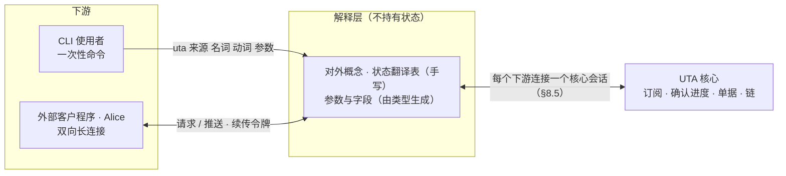

# 解释层（下游接口）设计

本文设计解释层：它为什么存在、对下游说哪些概念、以什么形态交互、核心的状态怎样翻成对外说法，以及怎样证明合格。核心↔解释层的契约（会话、操作集、订阅与确认）由核心设计 §8.5 拥有，本文只引用；核心章节号 `§N.M` 指 `design/core/` 下前缀为 N 的文件，本文自己的节写作“本文第 N 节”。

- **范围**：对外概念、两种交互形态、命令与参数的来源、状态翻译、续传与缺失、身份、发布物与合格判定。
- **不在范围**：命令与 flag 的具体名字、消息字段的序列化形状、长连接的传输与进程落点（实现阶段制品）；业务（§0.1）。
- **状态**：已定。

## 1 为什么有这一层

> 根本约束见 §0.1：抽象只在核心里，两侧是清洗。

核心的抽象是为保证而造的：位置与三种进度、腿与链、单据版本、三值能力。下游要的是能懂的接口：账户、订单、持仓、行情、审批。把核心契约直接交给下游，每个下游都要自己理解这些抽象、自己翻译一遍；抽象外泄出去，翻译各写各的就会分叉。[设计]

解释层把这件事集中到一处。它与集成对称：集成把上游清洗成契约值（`design/integration/design.md`），解释层把核心清洗成下游接口。两者都是明确的逐项清洗，不是抽象的延伸，可以写得具体、逐条列举。

## 2 对外概念

对外概念由解释层定，用下游已有的说法。每个概念在核心里对应什么，只在解释层内部出现。

| 对外概念 | 下游看到的 | 核心里对应（仅解释层内部） |
|---|---|---|
| 来源 | 一个券商、交易所或公共行情连接的名字；它有哪些数据可读、数据通常是实时还是延迟 | 集成（§7.1）；读模型 `sources` 的流声明、读 / 回填能力与名义数据等级（§2.2、§8.5） |
| 账户 | 账户名（在来源内唯一、稳定）与显示名；它能做哪些操作 | `WriteScope.account_ref` 作账户名，`label` 作显示名；`Capability`（§2.2）。`WriteLaneKey` 不外露；只读公共来源没有账户 |
| 订单 | 下单、撤单、改单、平仓请求；订单当前状态 | 写侧基本类型的意图（交易协议的操作种类：下单、撤单、改单、平仓，§6.2）与单据（§6.2）、IO 壳链（§6.5）、订单状态观察（§4.4） |
| 持仓、余额、成交、行情等 | 按公共或扩展 schema 的字段；查询条件（查什么、按什么过滤、取哪段时间）；记录上报告的数据等级 | 观察流的契约载荷，直通（§2.1）；一次性读的请求参数与 `range`（§8.2） |
| 审批 | 待审请求；批准、驳回、退回、转交 | 单据的 `TicketAction` 与 Decision（§6.2、§6.3） |
| 结果未知的订单 | 列表；人工确认“已发生 / 未发生”；再核实一轮 | `Undetermined` 腿；`resolve`、`retry_reconciliation`（§8.5） |
| 策略程序 | 装载、卸载、运行状态 | `load_program` / `unload_program`、程序观察（§8.5、§8.6） |
| 连接状态 | 在线 / 离线·重连中 / 需要处理（凭据或配置被来源拒绝；集成不合格，需重启集成）；各数据流补数据中 / 在线 / 离线；最近成功时间与连续失败数 | 来源的会话状态（§7.2）、健康面与 readiness（§8.4） |
| 运维动作 | 换凭据、重连来源、重载规则、清理历史 | 控制组（§8.5） |

新增写侧基本类型时（§0.1），对外概念随之加一项。

## 3 两种交互形态

### 3.1 一次性命令

- 来源作用域的命令：`uta <来源> <名词> <动词> [参数]`，例如 `uta ibkr order list`、`uta ibkr position list`。不属于某个来源的名词（审批、策略程序、连接状态、运维）不带来源一段。
- 输出默认给人读；结构化输出按解释层发布的对外 schema（本文第 7 节），不是核心记录。
- 写命令返回于下游能理解的稳定状态之一：待审、已受理、被拒、结果未知；或返回于调用方指定的等待上限，此时给出当前状态。返回的请求引用供后续命令使用。

### 3.2 双向长连接

- 外部客户程序（包括 Alice）与解释层保持一条双向长连接：同一连接上发请求（与一次性命令同一组操作），收推送（订单状态、成交、行情、待审事项、结果未知通知、连接状态变化）。推流靠它。
- 待审事项、结果未知与“已确认发生 / 未发生”来自解释层对各来源执行事实的订阅（§8.5 订阅组），与行情推送一样持久、可续传，重连不丢。推送的是事项的出现、决定与关闭；某待审事项此刻是否已偏离（市场变了），不单独推送，解释层在呈现该事项时读取单据的当前状态，放行与否仍由核心当时的门判定（§6.3）。
- 账户、可读数据与能力变化时（来源重新连接、能力变更），解释层经同一订阅得知并重读声明，对下游的账户列表与“此刻能不能”随之更新。
- 连接由 CLI 自己提供，还是由核心内部转发（含零拷贝转发），是实现选择；因为解释层不持有状态（3.3），两种落点的外部行为相同。

### 3.3 解释层不持有状态

- 订阅、确认进度、单据、链都在核心（§4.2、§6）。解释层只持有翻译所需的会话：一次命令或一条长连接对应一个核心会话（§8.5）。
- 解释层崩溃或重启，对下游就是一次断连：客户凭续传令牌重连，断连期间的损失以缺失通知给出（本文第 6 节）。解释层自己没有要恢复的东西。
- 理由：订阅与程序的 owner 已经是核心（H5/C5）。解释层另持状态，就多一个有状态的下游、多一套恢复协议。[设计]

## 4 命令与参数从哪里来

**手写的**：核心概念翻成对外说法的部分。对外概念与动词（本文第 2 节）、状态与结果的翻译（本文第 5 节）、错误文案都逐条写出，不生成。理由：这是清洗本身，每一项都需要判断。

**生成的**：本来就是下游词汇的部分。

- 订单参数：写侧基本类型的已注册字段（§8.1 注册表里的守卫字段，如 side、instrument），以及该来源为每种操作声明的意图参数 schema（公共意图 schema 或其扩展，含订单类型、time-in-force 等没有处理器读的参数；核心按它校验、不读其值，原样交给集成，§2.1、§6.3）；
- 读侧字段：公共 schema；
- 读侧查询参数：各流的请求 schema（公共请求 schema 或来源扩展，§2.2）：查询主体（已解析的 instrument、目录键或文本）与领域过滤条件（到期日、行权价、条数上限等）；时间段落到核心的 `range`；
- 来源专有的参数与字段：该集成发布的扩展 schema 与记录映射（`design/integration/design.md` 第 4 节）。

生成在构建期完成，从类型与集成的发布制品生成，不在运行期远程发现。命令是否存在在构建时就定了。

**运行期只回答“此刻能不能”：**

- 来源与账户来自读模型 `sources`（§8.5）：账户名是 `account_ref`，显示名是 `label`。只读公共来源不出现在账户列表里。某账户引用被核心标为不可解析时，该账户显示为“账户引用冲突，需要处理”，按这个名字的命令不解析到任何账户。
- 某账户某操作：`Supported` 照常执行；`Unsupported` 答“该账户不支持此操作”；`Unknown` 答“能力未确认，暂不能执行”（§2.2）。
- 某项数据的读：解释层按 `sources` 把（来源, 账户?, 数据类别）解析到一条声明的流。同一账户或来源下同一类别有多条流（例如实时与延迟两个 feed）时，不擅自选一条：让调用者按来源公开的数据类别与名义等级选择，未选则以歧义错误拒绝。读的结果逐项翻译（本文第 5 节）：不支持、未确认、来源重连中 / 需要处理、来源拒绝、参数不合法与空结果互不混同，不返回看似成功的空结果（§8.2 `read`、§8.5 一次性读）。
- 显示数据等级：读之前按流的名义等级说“通常是实时 / 延迟”；记录上报告了实际等级时，以记录为准。
- 运行期遇到构建时没有的载荷 schema 版本：该来源专有的字段不可用并如实提示，公共字段不受影响。这与核心“未注册的 schema 组合不触发解释器”一致（§8.1）。
- 构建时的请求 schema 或意图参数 schema 版本与该来源此刻声明的不同：该读或该操作如实提示暂不能执行，不提交旧版参数（§8.5 一次性读、§6.3）。

## 5 状态与结果的翻译

翻译表是解释层的核心内容，逐项写出。下表是必须覆盖的项与对外含义，措辞由实现定：

| 核心里 | 对外 |
|---|---|
| 单据草稿、送审中 | 待审 |
| `Close(DecisionRejected)` | 审批驳回（附原因） |
| STS `Rejection` | 被规则拒绝（附原因与违反项，如参数不合该来源 schema、冷却未过） |
| `Close(Expired)`、`Expired(deadline)` | 已过期，未发送 |
| `Prepared` 之后、`SendBarrier` 之前（在发出前门等待来源或能力恢复） | 尚未发送：等待来源恢复 / 等待能力恢复 |
| `SendBarrier` 之后、回执之前 | 发送中 |
| `VenueAccepted` 之后 | 已受理；此后按订单状态词表显示部分成交、已成交、已撤等（C13） |
| `VenueRejected(reason)` | 被来源拒绝（附原因） |
| `Undetermined` | **结果未知，正在核实，请勿重下** |
| 腿经取证 `Found` / `Absent` 终结 | 已确认发生 / 已确认未发生 |
| 复合链 `AwaitingTargetTerminal` | 改单进行中：等待原单结束 |
| `Unmapped(raw)` | 未识别的状态，并给出来源原文 |
| `Conflict` | 请求已被他人修改或已被决定，请重看 |
| `Unauthorized` | 无权限 |
| `Starting` | 服务启动中 |
| 会话 Connecting | 离线·重连中 |
| 会话 Halted{Refused} | 需要处理：凭据或配置被来源拒绝 |
| 会话 Halted{ProjectionInvalid / ContractIncompatible} | 需要处理：集成不合格（需重启集成） |
| 一次性读 `Unsupported` | 该来源 / 账户不支持此数据 |
| 一次性读 `Unconfirmed` | 能力未确认，暂不能读取 |
| 一次性读 `Unavailable{source_state}` | 按来源状态：来源离线，正在重连 / 需要处理（见连接状态） |
| 一次性读 `Refused` | 来源拒绝了此请求（附原因，如未开通该数据） |
| 一次性读 `InvalidRequest` | 查询参数不合法（附违反项），或参数格式已随来源更新 |
| `Unavailable` | 来源暂不可用 |
| 账户引用不可解析 | 账户引用冲突，需要处理 |
| `QuotaExceeded` | 订阅超出该来源的数量上限（附上限） |
| 订阅挂起（原因 `QuotaExceeded`） | 该订阅因来源上限降低暂停，有余量后恢复 |
| 成交冲突（同一身份内容矛盾） | 来源对同一笔成交给出了矛盾内容，附各内容 |
| 无身份成交 | 来源数据不合规，未计入 |
| `Gap{origin: Source}` | 来源断线，这段数据缺失 |
| `Gap{origin: Delivery}` | 推送缺失（下游处理不及或断连） |

规则：

- **结果未知不是失败。** 对外永远不把它显示成失败，也不给出“重新下单”的提示；否则下游会重复下单（C1）。
- **不补全。** 缺失照实通知，不伪造连续；未识别照实给原文，不猜。
- 单据版本、规则版本等内部标识需要随请求往返时（例如改待审请求、批准），以不透明令牌形式由解释层带过，下游不解读它。

## 6 续传、确认、缺失

- **续传令牌**：不透明，编码核心侧的确认进度。客户保存，重连时交回；解释层不保存（3.3）。
- **确认**：客户表示“已处理”，解释层转为核心的确认（确认 = 已处理，§4.2）。未确认的区间重连后可能重复收到。
- **订阅选项**：从现在开始 / 从令牌续 / 只要最新（可能合并，合并被标出）/ 逐条有序 / 等齐再给，分别落到核心的 `from` 与三种消费方式（§4.2）。
- **订单与审批的推送**：解释层对执行事实的订阅只用逐条有序，可从最早开始，没有缺失；新接入的客户要历史时，从最早开始重放即可得到全部订单与审批记录（§8.5）。
- **缺失通知**：核心的 `Gap` 一律翻成缺失通知（本文第 5 节），标明缺的是哪一段。

## 7 身份、发布与合格

**身份。**

- 解释层对外端点沿用 H7：信任边界是本机 OS 用户，非本用户的连接拒绝（§7.1）。
- 下游自报 actor（哪个人、哪个 AI），解释层以它开核心会话，`principal = (os_user, actor)`（§8.5）。授权全在核心（§6.3），解释层不授权；请求体里的身份不参与授权。

**发布物。** 本仓库随 release 发布：

- CLI（含生成的命令）；
- 长连接的消息协议 schema 与对外结构化输出的 schema；
- 本文第 2、5 节的实现（对外概念与翻译表）。

这是跨仓库契约，OpenAlice 从 release 消费。核心↔解释层的 IDL（§8.5）只在本仓库内部。

**解释层不做什么。**

- 不在对外面（命令、参数、输出、消息、错误）上出现核心概念。
- 不持有状态、不做决策、不重试写、不补全缺失。
- 不含业务（§0.1）：仓位计算、组合下单、策略都在下游或程序里。

**合格。** 解释层合格，当且仅当通过 §10.5 #23 的每一条。其中泄露检查用的**核心概念词表**是：§11.1 规范词表里用反引号写出的类型、记录、状态与字段名（如 `LogPosition`、`AttemptRef`、`Undetermined`、`Verdict`、`WriteLaneKey`、`Snapshot`），加上 cursor、frontier、retention、epoch、腿、链、单据版本、principal。检查对象是全部命令帮助与 fixture 驱动下的全部输出；对外概念（本文第 2 节）与公共、扩展 schema 的字段名不在词表内。
